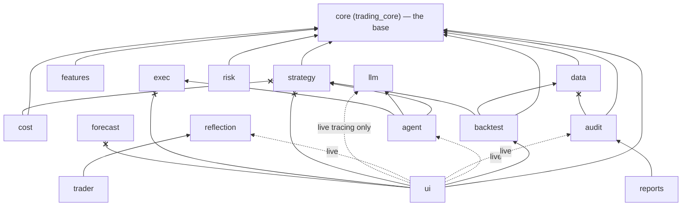

# Architecture Spine — trading ("The Honest Advisor")

> **Migrated from `spec/architecture/00-current-state.md` 2026-07-24 (BMAD Phase 1); `spec/`
> remains authoritative until Phase 5b cutover; ADRs remain the decision record — on conflict
> the ADR wins.** ADR links below cite their CURRENT `spec/architecture/adr/` paths; migration
> Phase 4 rebases them to `_bmad-output/planning-artifacts/architecture/decisions/`.
> Three snapshot facts of the 2026-07-10 source were repo-verified and updated here: CI is
> ACTIVE (AD-13), the P4/P5 remediation features have shipped (Capability Map), and `tract`
> is serving policy only — not a pinned dependency (Stack).

The product is a **paper retail crypto advisor**: pick a coin + budget → bake off every
strategy → rank under a frozen robustness gate → forward plan → paper-trade the €200.
Real-data backtesting and paper simulation are in scope; live trading is not (AD-15).

## Design Paradigm

**Layered core-out workspace · ports-and-adapters I/O · Elm/MVU cockpit · additive-only evolution.** [ADOPTED]

- **Layered core-out:** one base crate, `core` (package `trading_core`), owns the shared
  domain vocabulary (`Symbol`/`Order`/`Position`/`Signal`, `Money<C: Currency>`, `PitSeries`,
  `FxRate`, `FundingRate`). Every other crate may depend on it; it depends on none of them.
  New shared primitives are homed in `core` to avoid cycles. The exact edge law is AD-14.
- **Ports & adapters:** every external I/O sits behind a trait so tests can fake it —
  `LlmProvider` (Anthropic/OpenAI-compat/Ollama + Recording/Replay/Budgeted wrappers),
  exchange fetcher seams, `LiveEquityStore`, the record/replay cache. No test opens a socket.
- **Elm/MVU cockpit:** the `ui` crate is an iced 0.14 desktop app (model–view–update).
  Engine results cross into `ui` as **`ui`-owned mirror structs whose fields are `core`/std
  types** (`BakeoffReportMirror`, `ForwardPlanView`, …) — built in-crate over the sanctioned
  `ui → backtest` edge (ANALYZE/CALIBRATE) or received over mpsc channels from `agent`
  (SUGGEST/paper/narration); `ui` never imports `strategy`/`exec`/`forecast` (AD-14c).
- **Additive-only evolution:** feature work lands through exactly three registration seams —
  bake-off **arm**, strategy **overlay**, report **annex** (AD-8). There is no plugin
  architecture and no hot-load surface.

## Invariants & Rules

AD-1 … AD-13 are, **in order, the thirteen load-bearing invariants** of
`spec/architecture/00-current-state.md` § "Load-bearing invariants in force now" (AD-n =
invariant n; AD-13 restated after repo verification). AD-14 … AD-19 lift the
dependency-direction law and the CLAUDE.md non-negotiables to first-class ADs. Every AD is
**[ADOPTED]** — settled by existing reality; the cited ADR is the binding text; the cited
test/lint/gate is the current enforcement. Break one and a gate goes red.

### AD-1 — The FROZEN robustness gate is byte-frozen [ADOPTED]

- **Binds:** `crates/backtest/src/bakeoff/` (`robustness.rs`, `rank.rs`); every analytics or
  credibility addition; every new arm.
- **Prevents:** gate drift — a feature quietly reshaping verdict bands or ranking so its own
  arm scores better; unfalsifiable "improvements".
- **Rule:** `classify_verdict` / `verdict_bands` / `compute_robustness_flag` /
  `rank_candidates` are not edited by feature work. Every credibility/analytics addition
  (scorecard, turnover, tail metrics, crown-credibility) must prove it does not change
  ranking via an identity test. New arms only ever mean "more candidates face the same bar."
- **ADR:** ADR-0059 §D4/D5 · ADR-0063 §D4 · ADR-0066 · ADR-0075 · ADR-0076.
  **Enforced by:** `scorecard_does_not_change_ranking`, `turnover_does_not_change_ranking`
  identity tests.

### AD-2 — Anchors 119/119, byte-identical [ADOPTED]

- **Binds:** all — any change, code or docs.
- **Prevents:** silent mutation of the shipped evidence corpus; unreproducible history.
- **Rule:** every shipped backtest report body has a SHA-256 in `spec/anchors.toml`;
  `scripts/verify_anchors.sh` must print `ANCHORS PASS (119 / 119)` **before and after** any
  change. Anchored report bodies are **byte-immutable** — even a link fix mutates the SHA.
  Anchors are keyed by scenario **name**, not filename. Edits to an anchored report happen
  only via the ADR-0038 §D6.b re-emission protocol (a §D6.c documentation-link-fix variant
  is reserved by CLAUDE.md but not yet codified — until it is, link sweeps must exclude
  anchored reports). (Migration note: the corpus moves to `evidence/` in Phase 3 as a
  layout-preserving `git mv` — content SHAs survive the rename — and `anchors.toml` **travels
  with the corpus** (`git mv` → `evidence/anchors.toml`) in the same Phase-3 commit that
  base-swaps `verify_anchors.sh`; the registry never has two homes.)
- **ADR:** ADR-0038 §D6. **Enforced by:** `scripts/verify_anchors.sh` (local + CI).

### AD-3 — Anchor-safety by construction: `write_report=false` [ADOPTED]

- **Binds:** the advisor bake-off / sweep / robustness path; every new arm, overlay,
  ensemble, short, probe, and opt-in exec-sim mode.
- **Prevents:** new features perturbing the 119 anchors and forcing re-emission churn.
- **Rule:** the advisor path writes **no** report body; additions must be anchor-neutral by
  construction — `write_report=false`, and every opt-in knob defaults to byte-identical
  behavior (`None`/default = today's bytes). This is why the whole advisor tranche shipped
  without a single anchor re-emission.
- **ADR:** ADR-0059 §D3 (leaned on by essentially every advisor ADR).
  **Enforced by:** default-is-byte-identical tests (e.g. `venue_filter_default_is_none`,
  `paper_step_none_is_byte_identical`) + AD-2's gate.

### AD-4 — `feature.md status:` is the lifecycle source of truth [ADOPTED]

- **Binds:** lifecycle metadata — feature records, `spec/trace.toml`, `CHANGELOG.md`.
- **Prevents:** derived indices contradicting the feature record (status drift).
- **Rule:** shipped ⇒ the trace row reads `state="shipped"` AND a `CHANGELOG.md` line exists.
  The derived indices never override the feature record. (Migration note: Phase 5b re-founds
  the same triad as story-status ↔ trace ↔ CHANGELOG; the invariant survives the re-homing.
  **Migration write-lock:** from Phase 2 until the 5b cutover commit, lifecycle state has
  exactly ONE writable home — `spec/`; the Phase-2 story/`sprint-status.yaml`/`trace.toml`
  copies are read-only projections, and the 5b executor **regenerates** them from `spec/`
  state at the cutover commit's parent — diffing against the Phase-2 output and reviewing any
  drift — before `git rm -r spec/`. Never cut over a stale copy.)
- **ADR:** ADR-0082 (+ 2026-07-10 P6a amendment). **Enforced by:** `scripts/spec_lint.py`
  rules `feature-shipped-trace-drift` and `feature-shipped-changelog-missing`.

### AD-5 — Point-in-time discipline is structural and linted [ADOPTED]

- **Binds:** every as-of join and exogenous-series consumer (`data`, `backtest`, `strategy`
  arms such as DVOL/macro).
- **Prevents:** look-ahead bias.
- **Rule:** as-of joins go through the type-level `core::pit::PitSeries` — `AsOf` has no
  public constructor, so look-ahead is unrepresentable at compile time. Publication delay is
  declared via the additive `publication_lag_ms` (default 0 = byte-identical). A raw
  `partition_point(t<=q)`-shaped as-of join outside `core::pit` without a `// PIT-OK:` marker
  fails the lint.
- **ADR:** ADR-0058 · ADR-0086. **Enforced by:** `scripts/check_no_raw_asof_join.sh`
  (wired into `rust-validate`) + trybuild compile-fail + forward-shift falsifiers.

### AD-6 — Buy-and-hold is benchmark-exempt from the gate [ADOPTED]

- **Binds:** `rank_candidates` outcome determination.
- **Prevents:** judging the benchmark by the candidate curve-fit ruler — which yielded
  `AllFragile` on every real-crypto run and masked the honest `BenchmarkWins`.
- **Rule:** the benchmark is the null hypothesis candidates are scored *against*, not a
  candidate that must clear the bar: it is excluded from the `AllFragile` determination and
  is crown-eligible regardless of its own flag. `classify_verdict` stays byte-unchanged.
- **ADR:** ADR-0066. **Enforced by:** the `BenchmarkWins`-reachability gate test.

### AD-7 — LLM narration passes the faithfulness gate or falls back [ADOPTED]

- **Binds:** `agent` narration; any LLM-in-product surface.
- **Prevents:** the LLM entering ranking; fabricated numbers or prescriptive advice reaching
  the operator.
- **Rule:** narration is read-only over the already-decided `Recommendation`, guarded by a
  frozen two-layer check — a role-locked cached prompt plus a deterministic `llm`-free
  post-check (P1 wrong-crown / P2 contradicted-outcome / P3 fabricated-number exact-string /
  P4 banned predict/advise phrases). Any hit → templated fallback. The LLM never ranks.
- **ADR:** ADR-0064 (+ 2026-07-01 hardening). **Enforced by:** the adversarial corpus in
  `crates/agent/tests/narration_faithfulness.rs`.

### AD-8 — Additive-only; three registration seams; no plugin architecture [ADOPTED]

- **Binds:** all feature work.
- **Prevents:** bespoke parallel integration points; a dynamic plugin surface.
- **Rule:** features land through exactly three seams — no dynamic plugin/hot-load surface
  (WASM plugin deferred indefinitely, ADR-0007). This is the v2 architecture verdict — stay
  additive.
  1. A bake-off **arm**. An arm is a **three-home entity landed in one change**: (i) a
     pre-registered id list in `backtest` (`default_field()` / `default_ensemble_field()` /
     siblings), ids unique across all lists; (ii) its concatenation into `advisor_field()`
     (`crates/ui/src/leaderboard/runner.rs`), **appended after all existing lists** (AD-17 —
     order is part of the reproducibility key); (iii) a resolvable engine mapping in
     `agent::runtime::build_registry_for` — the **ADR-0077 forward-buildability contract:
     every crownable arm is forward-buildable; an unknown id still bails loudly** (never a
     silent proxy). A crowned arm missing home (iii) fails the SUGGEST run, so (iii) is not
     optional; the per-family must-build tests guard the current field (all 14 post-F5b arms
     covered since 2026-06-30), and the only residual is the mechanical
     every-`advisor_field()`-id-resolves iteration test (Deferred).
  2. A strategy **overlay** (`Strategy::quantity_scale`). **At most ONE
     `quantity_scale`-bearing overlay is active per engine run** until an ADR ratifies
     stacking: today's wrappers *shadow* (do not fold) the inner overlay's scale, so a
     stacked pair silently no-ops the inner layer — a stacking ADR must define the fold and
     require AD-16's composed-stack e2e.
  3. A **report-annex** (report-only KPI/scorecard) — a section/KPI of the **bake-off report
     family computed in `backtest`** (mirrored to `ui`). A metric surfacing in the `reports`
     crate's operator success reports is re-**rendered** from that same computation, never
     re-derived — one owner per metric.
- **ADR:** ADR-0007 · ADR-0077 (forward-buildability) · the v2-architecture 3-seam verdict.
  **Enforced by:** review + the absence of any plugin API; AD-1/AD-3 make the seams the only
  paths that stay green. Homes (i)/(iii) coherence is guarded by the per-family
  `builds_not_bails` tests in `crates/agent/tests/forward_run_engine_fidelity.rs`
  (ADR-0077); the exhaustive-iteration completeness test is the remaining cheap closure
  (Deferred).

### AD-9 — Money math is Decimal, never f64 [ADOPTED]

- **Binds:** all money math, every crate.
- **Prevents:** float drift; cent mismatches that break the double-entry reconciler.
- **Rule:** money is `Money<C: Currency>` over `rust_decimal::Decimal` — never `f64`.
  Exact-cent aggregation, zero tolerance. Venue rounding is Decimal-exact, floor-only.
- **ADR:** ADR-0003. **Enforced by:** the type system (no `f64` money constructors) + the
  audit reconciler invariant (Σ debits == Σ credits).

### AD-10 — UI is verified at the rendered-PIXEL layer [ADOPTED]

- **Binds:** `crates/ui`; every feature with a cockpit surface.
- **Prevents:** shipping on a passing proxy (unit test, text snapshot, no-panic boot) while
  the screen doesn't actually draw.
- **Rule:** cockpit/advisor screens are proven by `iced_test::Emulator::screenshot`
  harnesses that read the **populated** PNG with a negative control. Baselines are
  macOS-canonical (`#![cfg(target_os="macos")]` — off-macOS the snapshot files compile to
  nothing). Rendering is CPU **tiny-skia, never wgpu** — snapshot determinism depends on it —
  and the root-`Cargo.toml` dep-opt dev profile (`opt-level = 3` for deps) is part of the
  operator interaction-latency contract
  (`spec/v1/cockpit-performance-and-input-responsiveness/`): neither is "cleanup".
- **ADR:** ADR-0057. **Enforced by:** the render harnesses (`render_snapshots.rs`,
  `live_equity_render.rs`, `reports_populated_curve_render.rs`, feature-specific
  `*_render.rs`); guide: `spec/dev-notes/iced-ui-render-verification.md`.

### AD-11 — The do-not-build register is binding; the thesis is era-qualified [ADOPTED]

- **Binds:** every future feature proposal; all copy stating the product thesis.
- **Prevents:** re-proposing settled dead-ends; overclaiming the null result.
- **Rule:** the settled dead-ends (combination-search engine, live trading, band-loosening,
  the ready-unbuilt DSR veto E-1, …) live in `spec/dev-notes/do-not-build-register.md` and
  must not be re-proposed. The ship-passive claim is scoped to the **current era (2023+)**:
  the corpus re-run found real, cost-annex-robust, gate-crowned active edges in 2017-20 that
  decay to ~zero by 2023+ (none DSR-certified post scorecard-fix) — the efficiency-migration
  pattern. Never state the universal form.
- **ADR:** ADR-0084 (+ commit 61887c8). **Enforced by:** operator review against the
  register; era-qualified wording in shipped copy.

### AD-12 — DSR is report-only; the crown-veto stays unbuilt [ADOPTED]

- **Binds:** scorecard consumers; the recommendation banner.
- **Prevents:** a silent gate change smuggled in through credibility metrics.
- **Rule:** the deflated-Sharpe scorecard (`crown_clears_dsr`) is informational — it never
  vetoes a crown. The banner co-presents it as crown-credibility (see the Capability Map:
  `Passes` ✓ / `WeakEvidence` ⚠ WARN band / `NotApplicable` no badge, ADR-0085). Turning
  DSR into a hard veto is do-not-build **E-1**.
- **ADR:** ADR-0075 · ADR-0085 ·
  `spec/dev-notes/dsr-report-only-decision-2026-07-09.md`. **Enforced by:** AD-1's
  ranking-identity tests + the unbuilt veto.

### AD-13 — Verification envelope: 3-OS CI active; macOS is the canonical visual box [ADOPTED]

- **Binds:** CI; all snapshot/visual tests.
- **Prevents:** platform-dependent font/render flake gating the build; baseline drift.
- **Rule:** the 3-OS (Linux/Windows/macOS) matrix is **active** at
  `.github/workflows/ci.yml` (operator-activated 2026-07-10, remediation P7; first-run
  flakes are fix-forward). Visual PNG baselines remain **macOS-canonical**: snapshot test
  files carry `#![cfg(target_os="macos")]` — the source gate *is* the CI filter; off-macOS
  they compile to nothing. Linux/Windows visual regression is deferred and must supersede or
  amend ADR-0057 when it lands. *(Restates the 2026-07-10 source, which still recorded CI as
  operator-parked; activation commit 8b8e546 and the run-1/2 shakeout fixes post-date it.)*
- **ADR:** ADR-0057 (+ operator P7 activation). **Enforced by:** the in-source `cfg` gate +
  the live workflow.

### AD-14 — The dependency-direction law [ADOPTED]

- **Binds:** all 17 crates; every new `Cargo.toml` edge; every mirror/adapter pair.
- **Prevents:** cycles; `ui` acquiring engine dependencies; `audit` losing
  self-provability; `strategy` acquiring memory/state deps; mirror shapes drifting between
  two owners.
- **Rule:** the following edges are law (everything not forbidden is negotiable, but these
  never flip):
  - **(a) `core` is the base** — every crate may depend on it; it depends on no sibling. New
    shared primitives (PIT, FX, funding) are homed in `core`. (ADR-0058 §D2 precedent.)
  - **(b) `audit` imports no sibling** (only `trading_core` + third-party). Siblings write
    into the ledger by importing `audit`; `audit` never imports back — the reconciler
    invariant (Σ debits == Σ credits) stays provable from `audit` alone. (ADR-0024 · ADR-0052.)
  - **(c) `ui` (lib + every bin) never depends on `strategy`, `exec`, or `forecast`** —
    unconditionally, in any build or feature set. `ui`'s only engine-side edges are the
    **optional, `live`-feature-gated bootstrap set** (default-on for the operator bundle
    since 2026-05-25): `agent` (runtime host), `audit` (query surface), `reflection` (the
    trail-mirror subscription bridge — structurally the transitive `ui → agent → reflection`
    edge, per the manifest's ADR-0031 note), and `llm` **solely for `tracing_init`** — the
    log-redactor bootstrap in `cockpit_live` — never `LlmProvider` or any provider type
    through view/update. Engine results reach `ui` as `ui`-owned mirror
    structs whose fields are `core`/std types; mirrors are never homed in `core` (`core`
    gains domain primitives, never view models); each mirror pair (e.g.
    `agent::config::ForwardPlan` ↔ `ForwardPlanView`) has exactly **one adapter site**, and a
    new or edited adapter destructures its source exhaustively (no `..`) so a source-field
    addition fails the build until mirrored or explicitly discarded. **`cargo tree -p ui`
    unchanged is the per-change gate** on advisor work — a feature must not add or widen any
    `ui` edge. (ADR-0023 · ADR-0059 §D1 · ADR-0060 · ADR-0062. *Restates the source's flat
    "never depends on … `llm`": the manifest carries the sanctioned live-gated `llm` tracing
    edge (T-RED-D10) that ADR-0023/0088's wording predates — a reconciling as-built ADR is
    owed, per AD-18.*)
  - **(d) `trader`, not `strategy`, consumes `reflection`** — the layering split keeps
    `strategy` free of memory. (ADR-0041.)
  - **(e) no `cost` → `strategy` edge** — `cost` inlines its σ̂ EWMA; the edge would cycle
    (`strategy` dev-depends on `cost`). (ADR-0081 §D1.)



Solid arrows are the sanctioned direction (arrow points at the dependency); dotted arrows
are the **optional `live`-feature-gated** carve-out of rule (c); crossed (×) edges are
**forbidden** (the `audit` cross stands for *every* sibling, rule (b)). Edges not drawn are
neither mandated nor forbidden — the code owns them, subject to rules (a)–(e).

- **Enforced by:** review against this AD + a manual `cargo tree -p ui` diff on advisor
  changes (**not automated** — the dependency-edge lint is the cheap closure, see Deferred)
  + the manifests themselves (`audit`'s single-sibling dependency list; `ui`'s absent
  `strategy`/`exec`/`forecast` deps).

### AD-15 — PAPER/SIM only: no live execution path [ADOPTED]

- **Binds:** `exec`, `agent`, `ui`, the whole product surface.
- **Prevents:** any order-placement or venue-write path re-entering the codebase.
- **Rule:** no live trading, no venue write API, no order placement anywhere (do-not-build
  register **B-2**; the live-exec program was removed 2026-06-12 by operator decision).
  Real-data backtesting and paper simulation stay in scope. The SUGGEST hand-off export is a
  deterministic serialiser of the plan — never an order (ADR-0088).
- **ADR:** do-not-build register B-2 · ADR-0088 ("NO order placement / NO venue API").
  **Enforced by:** absence of any venue write client; review against the register.

### AD-16 — Day-1 baseline-equity-divergence e2e for every overlay/sizing modifier [ADOPTED]

- **Binds:** every strategy overlay and every sizing modifier, from day 1.
- **Prevents:** the no-op-overlay class — `scale` computed but never applied (the
  2026-05-22 v3-volatility-forecaster-noop incident): unit tests on the math layer plus
  anchored reports are **not** sufficient.
- **Rule:** ship with an end-to-end test asserting the overlay's output equity diverges from
  the un-targeted baseline by ≥ 1 bp (or a testable epsilon) when the decision variable is
  non-trivial (FAIL-before/PASS-after). Where there is genuinely no decision variable, N/A
  is **recorded, not skipped**. Pattern:
  `crates/strategy/tests/vol_targeting_overlay_end_to_end.rs`. Should an ADR ever ratify
  overlay stacking (AD-8 seam 2), the divergence e2e must exercise the **outermost composed
  stack** — each layer's removal moves equity by the epsilon — not each overlay in isolation.
- **ADR:** CLAUDE.md non-negotiable ·
  `spec/dev-notes/v3-vol-overlay-noop-discovery-2026-05-22.md`. **Enforced by:** the
  per-feature `*_end_to_end.rs` divergence gates.

### AD-17 — The determinism envelope [ADOPTED]

- **Binds:** engines, report rendering, tests, anchored artifacts.
- **Prevents:** unreproducible runs; anchor churn from wall-clock or RNG drift.
- **Rule:** all randomness flows from `ChaCha20Rng::from_seed` on the config seed (sub-seed
  determinism for per-path/per-arm streams). Run-varying fields (timestamps, seeds, paths)
  live in report YAML front-matter only — never in the anchored body. Deterministic paths
  read no wall-clock. Dynamically fetched data is exploratory and never anchored (no
  `REVISION.toml` pin, unreachable from the anchored CLI path). Per-arm robustness streams
  are **positional** — `derive_master_seed(seed, candidate_index)` over a frozen 16-entry
  salt table (ADR-0051 D1 · ADR-0063 §D4) — so **arm-list order is part of the
  reproducibility key**: lists are append-only (AD-8), a mid-list insertion re-seeds every
  later arm's robustness stream and is a breaking change requiring an ADR, and today's
  advisor field (19–20 candidates incl. the benchmark, symbol-dependent) already exceeds the
  16-salt table (candidates ≥ 16 share salts with early arms) — extending the table needs an
  ADR.
- **ADR:** ADR-0002 · ADR-0051 (determinism scope) · ADR-0061 (dynamic-data boundary).
  **Enforced by:** `scripts/check_determinism_anchors.py`, determinism tests
  (`crates/backtest/tests/determinism.rs`, `multi_pair_determinism.rs`) + AD-2.

### AD-18 — The ADR registry is the decision record; registration is atomic [ADOPTED]

- **Binds:** every non-trivial architectural decision, including amendments to this spine.
- **Prevents:** unregistered decisions; number collisions; a spine that silently diverges
  from the record.
- **Rule:** every non-trivial decision is a numbered, dated, immutable ADR under
  `spec/architecture/adr/` **plus** its Registry row in `adr/README.md`, written in the same
  commit. Numbers are never reused; supersession is a new ADR citing `supersedes:`. This
  spine compresses; it never overrides — **on conflict, the ADR wins.** New invariants enter
  this spine only with an ADR behind them. Two scope clauses:
  - **The lint defines the home.** The ADR corpus lives, at every commit, in the directory
    `scripts/adr_registry_check.py` enforces; the migration's corpus `git mv` and the lint
    repoint travel in **one atomic commit** — until that commit, new ADRs land under
    `spec/architecture/adr/`.
  - **Precedence scope.** "The ADR wins" governs intent and precedence *among documents*; it
    never licenses changing byte-frozen behavior (AD-1/AD-2/AD-3/AD-17). Where an ADR's
    letter and shipped gate-locked bytes disagree, the as-built bytes stand and the
    divergence is recorded in a **new as-built ADR** — never resolved by editing code to
    match the stale clause. (Standing instance: ADR-0063 §D4 and the rustdoc say XOR;
    `derive_master_seed` ships `wrapping_add`.)
- **ADR:** `spec/architecture/adr/README.md` (format + numbering rules). **Enforced by:**
  `scripts/adr_registry_check.py` (pre-commit/CI atomicity lint).

### AD-19 — Release discipline: gates green; REGRESSION blocks ship; no secrets in git [ADOPTED]

- **Binds:** every ship/merge decision; all contributors and agents.
- **Prevents:** shipping a known regression on agent momentum; credentials entering git
  history.
- **Rule:** the release floor is `cargo fmt` + `cargo clippy -- -D warnings` +
  `rust-validate` + `verify_anchors` 119/119 (before and after) + `spec_lint` PASS.
  **No shipping on a `REGRESSION` verdict without an explicit human override.** No secrets
  in git — keys live in env / the secret store; LLM artifacts are scanned.
- **ADR:** CLAUDE.md non-negotiables (carried verbatim through the migration).
  **Enforced by:** the gate scripts + `scripts/check_no_secrets_in_llm_artifacts.sh` + the
  tester-verdict workflow.

## Consistency Conventions

| Concern | Convention |
| --- | --- |
| Naming | Crate dirs are short (`core`, `data`, …) but packages avoid stdlib collisions (`trading_core`, ADR-0001). Features are kebab-case slugs; ADRs are `NNNN-kebab-case-title.md`; anchors are keyed by scenario **name**; bake-off arm ids are literal code-declared strings (`v0.buyhold`, `v0.dvol_regime`, … — no id grammar/parser, ADR-0067 §D2). |
| Data & formats | Money: `Money<C: Currency>` Decimal (AD-9). Time: `TimestampMs` i64 ms-since-epoch as the PIT join key (ADR-0058 §D3); audit DB timestamps carry 6-digit fractional seconds (ADR-0004). Reports: YAML front-matter (run-varying) + byte-anchored body (AD-2/AD-17). Corpora: parquet under `data/` with `REVISION.toml` pins; the dynamic cache is unpinned + git-ignored (ADR-0061). Audit schema evolves by **appending numbered migrations only** — a shipped `NNN_*.sql` is immutable, the same immutability class as anchors (ADR-0052's additive-migration precedent). |
| Errors, logging, state | `Result<T, E>` in library code — no `.unwrap()` outside tests; `thiserror` in libs, `anyhow` in bins; `tracing`, never `println!`, in library code; `unsafe` requires a `// SAFETY:` comment. Cross-thread state crosses as owned `core`-typed messages over channels (the mirror pattern), not shared engine types. |
| I/O & test seams | Every external I/O behind a trait (`LlmProvider`, fetcher seams, `LiveEquityStore`); tests use fakes / record-replay, never sockets. |
| Config & secrets | No secrets in git; keys via env / secret store. LLM artifacts are scanned (`scripts/check_no_secrets_in_llm_artifacts.sh`). |
| Release gates | `cargo fmt` + `cargo clippy -- -D warnings`; `rust-validate` (incl. the PIT lint); `scripts/verify_anchors.sh` 119/119 **before and after**; `python3 scripts/spec_lint.py` PASS; no shipping on a `REGRESSION` verdict without an explicit human override. |
| UI | Lumen design system (`spec/design/`) + `spec/ui-design-principles.md`; dual-mode (light/dark) and colour is never the only signal (ADR-0085 §D5); user-facing copy lives in `crate::strings` consts (zero string literals in views). |

## Stack

Seed — reality-checked against `Cargo.toml` / `Cargo.lock` at authoring (2026-07-24); the
code owns this once it exists. Workspace-manifest pins shown; lockfile resolution in
parentheses where it differs.

| Name | Version |
| --- | --- |
| Rust | stable, edition 2024 (toolchain 1.94.1 at authoring) |
| iced (cockpit UI) | 0.14.0 |
| iced_tiny_skia | 0.14.0 — **vendored long-term fork** (`vendor/iced_tiny_skia/`) + upstream canvas-clip fix `76b32d4906`; operator-locked 2026-05-20. Maintenance contract: `spec/v1/chart-fixture-line-clipping/feature.md` — any iced bump must audit the `Transformation::scale(scale_factor) * group.transformation()` ordering before retiring the fork |
| tokio | 1.44 pin (lock 1.52.3) |
| rust_decimal | 1.36 pin (lock 1.42.0) |
| rand / rand_chacha | 0.9 pin |
| polars (parquet) | 0.46 |
| candle-core (forecast, retired chain) | 0.9.2 |
| serde / serde_json | 1.0 |
| thiserror / anyhow | 2.0 / 1.0 |
| time | 0.3 |
| reqwest | 0.12 |
| clap | 4.5.37 pin (lock 4.6.1) |
| proptest / insta / trybuild | 1.6 / 1.42 / 1.0 |
| criterion (bench) | 0.5 |

LLM access is via the in-repo `llm` crate's `LlmProvider` trait (Anthropic first-class,
prompt caching; other providers behind the same trait) — no vendor SDK crate is pinned.
`tract` is the stated ONNX-serving default (CLAUDE.md) but is **not currently a dependency**.

## Structural Seed

The workspace is 17 members (virtual workspace, root `Cargo.toml`). **There is no
`crates/models`** — ML/DL work lives in `forecast` + `features`.

| Crate | Role (one line) |
|---|---|
| `core` (`trading_core`) | Base domain types — `Symbol`/`Order`/`Position`/`Signal`, `Money<C>`, `PitSeries`, `FxRate`, `FundingRate`. Depends on no sibling (ADR-0001/0058/0065/0068). |
| `data` | Ingestion/storage/replay — Binance/Coinbase/Yahoo/Deribit fetchers, `ReplayFeed`, parquet corpora + `REVISION.toml` pins, dynamic on-demand cache, market calendar (ADR-0032/0040/0056/0061/0072/0073/0084). |
| `features` | Feature engineering + indicator library (shared math for strategies/forecast). |
| `llm` | `LlmProvider` trait + Anthropic/OpenAI-compat/Ollama clients, prompt caching, Recording/Replay/Budgeted providers (ADR-0019). |
| `cost` | Cost telemetry (LLM tokens / infra / data) + slippage models incl. opt-in `VolScaledSpread` (ADR-0081) + the checked-in venue lot-size/min-notional filter table (ADR-0087). |
| `risk` | Risk engine, position sizing (`FixedFractionSizer` + `budget_cap`), kill switches (ADR-0060). |
| `strategy` | `Strategy` trait + every strategy impl (SMA, composed MACD/RSI/Bollinger, cross-sectional momentum, pairs, vote-ensembles, overlays, DVOL/macro arms, signal library, directional shorts) + `vol_estimator` + `PlanDescribe` (ADR-0005/0063/0067/0071/0078/0079/0080). |
| `trader` | Reflection-memory consumer, split out of `strategy` for layering (ADR-0041); read-only `recall_decision_lessons` (ADR-0074). |
| `exec` | Exchange clients / order routing / paper-trade fill publisher (matching engine lives in `backtest`). |
| `backtest` | Matching engine + scenarios + **bake-off orchestrator** + param sweep + report rendering (body-SHA anchors) + the **robustness gate** + overfitting scorecard (ADR-0030/0059/0066/0069/0075/0076). Bin: `backtest`. |
| `audit` | Double-entry ledger — journal, per-symbol position accounts, audit-tick stream, `equity_snapshots`. Imports only `trading_core` (ADR-0024/0052); the `report` lib/bin over it lives in `reports`. |
| `ui` | iced desktop cockpit — the advisor journey + Lab/Live/Compare + plan export (ADR-0023/0057/0059/0060/0062/0088). Bins: `cockpit_live`, `cockpit`, `viewer`. |
| `agent` | Top-level orchestrator + `agent::runtime::run` shared by `cockpit_live`; **bootstraps** `strategy`/`llm`/`exec`; owns narration, forward plan, paper-loop supervisor (ADR-0060/0062/0064). Bin: `trading`. |
| `reports` | Operator success reports — read-only over `audit` (ADR-0015). Lib + bin `report`. |
| `reflection` | `LessonCard` store + 32-dim deterministic embeddings + `retrieve_top_k` + regime tagger. |
| `replay-cache` | Deterministic record/replay cache (LLM + data) for reproducible runs. |
| `forecast` | DL/ML forecast overlays (candle) + `ForecastContext`. Home of the **retired** forecaster chain (TCN/PatchTST/GARCH) — code stays, anchors locked. |

```text
trading/
  crates/            # the 17 members above
  vendor/iced_tiny_skia/   # operator-locked fork (see Stack) — upstream source, do not edit beyond the documented patch
  data/              # parquet corpora (pinned) + git-ignored dynamic cache
  lab-runs/          # git-ignored lab report root (ADR-0055 sibling-root model)
  plan-exports/      # git-ignored hand-off exports (ADR-0088; same sibling-root model)
  research/          # 900-paper knowledge base (complete)
  scripts/           # gates + lints (verify_anchors, spec_lint, PIT lint, ADR lint, ...)
  spec/              # authoritative until migration Phase 5b (product, architecture, ADRs, features, anchored reports)
  _bmad-output/      # BMAD planning/implementation artifacts (this file)
```

**Operational envelope.** A local, single-operator desktop product: iced cockpit bins
(`cockpit_live`, `cockpit`, `viewer`) + CLI bins (`trading`, `backtest`, `report`, data
fetchers, forecast tools). There is no deployed service, no cloud infrastructure, and no
runtime environment beyond the operator's machine; distribution is `cargo build` from
source. Durable state: the audit SQLite ledger (additive numbered migrations), parquet
corpora, git-LFS model checkpoints. Evidence lives in git (`spec/**/reports/` +
`spec/anchors.toml`); run outputs that must never be anchored live in git-ignored sibling
roots (`lab-runs/`, `plan-exports/`, `data/binance-dynamic/`). CI: GitHub Actions 3-OS
matrix on push/PR to `main` (AD-13). Secrets: env / secret store only (never git).

## Capability → Architecture Map

The advisor journey spine — **DATA → CALIBRATE → ANALYZE → SUGGEST** — mapped onto
screens and crates. A visible orientation **stepper** band (ADR-0083) maps the journey onto
the cockpit; the highlighted stage is a pure projection `stage_for(screen, &leaderboard_state)`
(DATA and ANALYZE share `Screen::Leaderboard`, discriminated by `PanelState::Empty` vs
`Ready`). The stepper orients; it never routes.

| Stage | Screen | What happens | Crates | Governing ADRs |
|---|---|---|---|---|
| **DATA** | `Leaderboard` (`Empty`) | Pick coin + budget + window; on-demand Binance fetch for any uncovered coin/window pair; €→USDT conversion; data-quality/trust surface flags thin or gappy corpora. | `ui` → `backtest`/`data`/`agent` | ADR-0061 (dynamic fetch) · ADR-0065 (EUR-FX) · data-quality surface (v2 P1-7) |
| **CALIBRATE** | `Tune` (sidebar "Calibrate") | Gate-tied hyperparameter sweep of one family; each config scored through the SAME frozen gate (AD-1) so overfit configs read `Fragile`; a promotable (non-Fragile) config carries the tuned strategy into the forward run. | `ui` → `backtest` | ADR-0069 (sweep) · ADR-0070 (promotion) · ADR-0083 §D4 (label) |
| **ANALYZE** | `Leaderboard` (`Ready`) | Bake off every arm + buy-and-hold; rank by Sharpe under the robustness gate; overfitting scorecard + turnover/coherent-tail (CVaR) KPIs; crown-credibility on the banner; optional LLM "why this one". | `backtest` (compute) → `ui` (mirror); `agent` (narration) | ADR-0059 (bake-off/rank) · ADR-0063/0066 (gate + benchmark exemption) · ADR-0075/0076 (scorecard + tail) · ADR-0085 (crown-credibility) · ADR-0064 (narration) |
| **SUGGEST** | `ForwardPlan` | Rule-driven forward stance + budget-aware €200 sizing; forward paper-trade the selection (P/L = equity − budget); short surfaces when a short arm is crowned; opt-in lot-realism (min-notional + lot-size, default byte-identical); deterministic hand-off export of the plan (Ready-only button → `plan-exports/`). *Every crownable arm is forward-buildable; unknown ids bail loudly (ADR-0077 closed the F5b coverage hole 2026-06-30).* | `agent` (supervisor/plan) → `ui`; `backtest` (paper) | ADR-0062 (forward plan) · ADR-0060 (sizing + forward-paper) · ADR-0077 (forward-buildability) · ADR-0068 (shorts) · ADR-0087 (lot-realism, **shipped**) · ADR-0088 (hand-off export, **shipped**) |

**Crown-credibility states (ADR-0085).** The banner co-presents the overfitting verdict for
an active crown via the pure projection `crown_credibility(outcome, Option<&ScorecardView>)`:
`Passes` → muted ✓ line; `WeakEvidence` (`ActiveWins` but fails DSR) → unmissable ⚠ WARN
band, **qualifying (not negating) the still-true headline**; `NotApplicable`
(`BenchmarkWins`/`AllFragile`) → no badge. Semantics + rationale live in ADR-0085.

*(Status note, verified 2026-07-24: the source's "mid-flight" items P4 `advisor-lot-realism`
and P5 `advisor-handoff-export` are both `status: shipped` — see `CHANGELOG.md`. The product
is feature-complete; new proposals go through AD-11's register first.)*

## Deferred

Intentionally pushed down — each with why it can wait. **Deferred ≠ dead:** settled
dead-ends live in the do-not-build register (AD-11) and are not re-proposed here.

| Deferred decision | Why it can wait / revisit condition |
| --- | --- |
| TIPP / ratcheting drawdown floor | Static CPPI floor shipped and proven (ADR-0080 §D8); revisit as overlay v0.2. |
| Linux/Windows visual-regression baselines | Gated on a pinned default font (`fira-sans` + `default_font`); needs its own canonical box and must supersede/amend ADR-0057 (its §D3). |
| Replay-preview forward run | MVP is real-time-only paper (ADR-0060 §D4); revisit if the operator wants what-if previews. |
| PBO/CSCV on the Tune surface | Scorecard ships `pbo: None` (ADR-0075); the sweep grid is capped at 24 configs, limiting overfit surface meanwhile. |
| Weighted / inverse-vol / regime ensemble blends | The fixed pre-registered slate stands (ADR-0067); any blend engine edges toward search — quarantined behind a new ADR. |
| Live FX rate fetch | Configurable-static EUR/USD (default 1.08) is operator-locked (ADR-0065); a live fetch reuses the constant as fallback. |
| `advisor_field()` ↔ `build_registry_for` completeness test | The R1 coverage gap itself **closed 2026-06-30** (ADR-0077: all 14 post-F5b arms forward-buildable, per-family must-build tests). Remaining: the mechanical iteration test — every id `advisor_field()` emits resolves through `build_registry_for` (the ADR-0077 contract, asserted exhaustively rather than per-family) — safe to defer while AD-8's three-home arm rule holds; build it with the next new arm. |
| Dependency-edge lint | AD-14's `cargo tree -p ui` gate and forbidden edges are review-enforced today — a small cargo-metadata assert (+ tree snapshot) automates it; revisit on the next AD-14 near-miss. |
| Packaging / distribution / auto-update | Unowned by design: local `cargo build` is the distribution mode until an operator decision says otherwise. |
| WASM plugin hot-load | Deferred indefinitely (ADR-0007) and fenced by AD-8; any revival needs a new ADR superseding both. |
| Spine `updated:`-freshness lint | Recommended by the source but unbuilt — warn when the newest ADR post-dates this document's `updated:`; flag to the orchestrator if drift recurs. |

## Decision Record & History

- **ADR registry** — `spec/architecture/adr/README.md` § Registry: the canonical
  one-row-per-ADR table, IDs 0001–0088 (0054 intentionally skipped; 0079 exists as a
  registry row without a standalone file), each with D-clause summary, status, date. Cited
  by `spec/trace.toml` `arch=` fields. **The ADRs are the decision record; this spine
  compresses and never overrides (AD-18).** Files move to
  `_bmad-output/planning-artifacts/architecture/decisions/` in migration Phase 4, which
  rebases all links here — the `git mv` and the `adr_registry_check.py` repoint travel as
  one atomic commit (AD-18). Mover rule: the Registry **table** is the registry — reconcile
  rows ↔ files (0054 = intentional skip; 0079 = row-only) and carry row-only entries forward.
- **Section files** — `spec/architecture/00-overview.md` … `12-forecast-overlay.md`: the 13
  domain deep-dives behind this spine (data flow, strategy registry, execution, risk/money,
  LLM/reflection, UI, observability, recovery, performance budget, foundation libraries,
  regression gate, forecast overlay).
- **What shipped** — root `CHANGELOG.md`: one line per implemented feature (the canonical
  "what's-been-built" index; completed `feature.md` are one-line stubs pointing here).
- **Dev-notes** — `spec/dev-notes/README.md`: standing decisions, audits, how-tos —
  including the do-not-build register (AD-11) and the render-verification guide (AD-10).
- **Per-feature narrative** — `git log -- spec/<slug>/` for any feature's history.

## Provenance & Maintenance

Migrated 2026-07-24 from `spec/architecture/00-current-state.md` (its `updated:
2026-07-10`) as BMAD migration Phase 1b, per the ratified plan
`spec/dev-notes/bmad-migration-plan-2026-07-24.md`. AD-1…AD-13 preserve that source's
thirteen load-bearing invariants 1:1 by number; AD-13's CI posture and the P4/P5 ship
status were repo-verified and updated (see the run memlog for the evidence trail).
Maintenance contract (carried from the source): update this spine whenever an ADR lands
that changes the crate map, an invariant, or the journey spine — and only with that ADR
behind it (AD-18). The spine stays **intentionally short**: if keeping it current becomes a
burden, that is a signal the change deserves an ADR or section-file edit, not a longer
rollup here (the recommended-but-unbuilt freshness lint is in Deferred). Until Phase 5b
cutover, `spec/` remains authoritative and this file is the BMAD-native projection.
