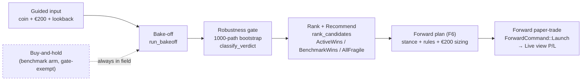
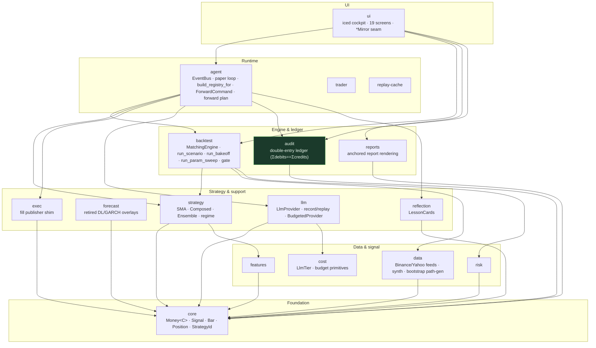
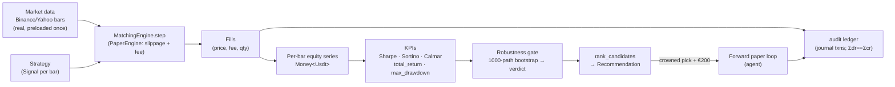

# System Architecture — Single-Coin Investment Advisor (paper)

> **What this is.** The system design for a Rust crypto **Single-Coin Investment
> Advisor (paper)**. The product answers one concrete question for one retail
> investor with a small budget: *"I have **€200** for **one** coin (say
> `XRPUSDT`) — which strategy should I use, and what should I do over the next
> few days?"* It is **PAPER / SIM ONLY** — no live orders, no exchange
> execution, not financial advice. Live trading was removed from scope
> 2026-06-12.
>
> **The honest thesis.** The 2026-06 research program concluded across all three
> reachable channels (price/OHLCV, derivatives-positioning, on-chain) that **no
> active strategy robustly beats simply holding the coin, net of cost.** That
> result is not a failure the product hides — it is the product's *spine*. The
> advisor sells **measured honesty, not asserted alpha**: a transparent,
> reproducible, risk-aware bake-off where **buy-and-hold is always the
> benchmark arm**, and a frozen robustness gate decides whether anything earns
> a crown.
>
> Canonical companions: [`spec/product.md`](../spec/product.md) (what it IS /
> ISN'T), [`spec/architecture.md`](../spec/architecture.md) (the section-file +
> ADR index this document summarizes), and [`CHANGELOG.md`](../CHANGELOG.md)
> (what's built).

---

## 1. The product as architecture

The advisor journey is a pipeline, and each stage maps onto a concrete
subsystem. Reading the journey left-to-right *is* reading the system:

| Journey stage | What the user does | Subsystem that does it |
|---|---|---|
| **Guided input** | Pick coin + budget (€200) + lookback (2 wk → ~4 yr) | `crates/ui` guided-input → `agent`/`backtest` request types |
| **Bake-off** | Run *every* strategy on `(coin, window)` | `backtest::run_bakeoff` — loops the field on one coin/window |
| **Robustness gate** | Each arm is stress-tested under resampling | `backtest::bakeoff::bootstrap` + `robustness::classify_verdict` |
| **Rank & recommend** | See the best-ranked pick + "why this one" | `backtest::bakeoff::rank::rank_candidates` → `Recommendation` |
| **Forward plan** | See the current stance + rules + €200 sizing | `agent::plan::build_forward_plan_from_registry` (F6) |
| **Watch (forward paper-trade)** | Watch the pick paper-trade €200 forward | `agent` paper loop + `ForwardCommand::Launch` → cockpit **Live** |

Two design choices carry the entire credibility of the product:

1. **Buy-and-hold is always in the field, always exempt from the gate.** It is
   the *null hypothesis* the active arms are scored against, not a candidate
   that must clear the bar itself (ADR-0066). When buy-and-hold wins, the
   recommendation says so plainly (`BenchmarkWins`).
2. **The robustness gate is frozen.** Its five bands are code-declared
   constants, never tuned to make a result look better. A strategy that wins on
   one lucky backtest path but is **FRAGILE** under resampling is shown but
   cannot be crowned.

---

## 2. Layered crate architecture

The workspace is **17 crates**. They stack into layers; the arrows in the
dependency diagram only ever point *down* (a higher crate may depend on a lower
one, never the reverse). Three invariants are load-bearing and enforced by
`cargo tree` checks, not just convention.

**The 17 crates** (workspace members):
`core`, `data`, `features`, `forecast`, `cost`, `risk`, `strategy`, `exec`,
`backtest`, `audit`, `llm`, `reflection`, `reports`, `replay-cache`, `agent`,
`trader`, `ui`.

> **Note on `models`.** There is **no `crates/models`** crate — the ML/DL work
> lives in `crates/forecast` + `crates/features`. (`models` appears only as a
> cockpit *screen*, `crates/ui/src/screens/models.rs`, listing forecaster
> checkpoints.) The four crates the `ui` isolation rule forbids are
> `strategy` / `exec` / `forecast` / `llm`.

### The three invariants

1. **`audit` imports nothing from sibling crates.** Its `[dependencies]` list
   is `trading_core` plus third-party libs — full stop. Sibling crates write
   into the ledger by depending on `audit`; `audit` never depends back. This
   keeps the double-entry reconciler invariant (**Σ debits == Σ credits**)
   provable in isolation, with no strategy/engine code in the trust boundary.

2. **`ui` never depends on `strategy` / `exec` / `forecast` / `llm`.** The
   cockpit's real dependency set is `core`, `reports`, `backtest`, `agent`
   (and `audit` for the ledger query surface). The bootstrap of strategy /
   exec / forecast / llm types happens in **`agent`** — the "agent-bootstrap
   seam." Anything the UI needs from those worlds crosses to it pre-digested as
   `core`-typed data (e.g. `agent::config::ForwardRunConfig`,
   `agent::config::ForwardPlan` carry only `StrategyId` / `Symbol` / `Money` —
   never a `Strategy` trait object).

3. **Money math uses `Decimal`, never `f64`** (see §3 and §8).

### Layer diagram

(Edges are illustrative of the layering direction, not the exhaustive
`Cargo.toml` graph. The dark node, `audit`, is the isolated trust boundary.)

---

## 3. Core domain model (`crates/core`)

`core` holds the shared vocabulary every other crate speaks. Four types matter
most:

- **`Money<C: Currency>`** — a monetary amount in currency `C`, backed by
  `rust_decimal::Decimal`. The `Currency` marker trait (`Usdt` / `Btc` / `Eth`
  unit structs) makes `Money<Usdt> + Money<Btc>` a **compile-time error** —
  currencies cannot be mixed by accident. Arithmetic (`Add` / `Sub` / `Neg` /
  `Mul<Decimal>`) is defined only within a single currency; serde renders the
  inner decimal as a string. The engine is **USDT-denominated end-to-end**;
  there is no `Eur` currency type. The €200 budget is treated as ~200 USDT
  (FX is a one-time conversion at the UI input boundary, ADR-0065 / F7 — the
  ranking is FX-invariant because a scalar on the budget cannot change which
  strategy wins).

- **`Signal`** — a strategy's decision on a bar: `strategy_id`, `symbol`, `ts`,
  a `SignalKind` (`Buy` / `Sell` / `Hold`, plus the v1.5a pair variants), and
  the `SignalEvidence` (indicator values that produced it).

- **`Bar`** — an OHLCV candlestick: `Price` open/high/low/close, `Quantity`
  volume, `Timeframe`, venue + open/close timestamps, and a `local_recv_ts` for
  clock-skew detection.

- **`Position`** — current holdings for one symbol: signed `base_qty`
  (positive = long, negative = short after ADR-0068), `cost_basis`, `last_mark`,
  realized + unrealized PnL, with a `mark_to_market()` helper. A sibling
  `OpenPosition` is the typed, mark-source-agnostic projection the audit reader
  emits.

- **`StrategyId`** / **`Symbol`** — interned (`SmolStr`) identifiers that thread
  through every layer.

**Why `Decimal` for money.** Floating-point cannot represent `0.1` exactly;
accumulated f64 error in fills/fees would make the audit ledger fail to
reconcile and would make "anchored" reports non-reproducible. `Decimal` gives
exact base-10 arithmetic. The discipline is strict: **f64 is permitted only for
statistics** (Sharpe, the bootstrap return-space math) where exactness is
neither possible nor needed; money never touches f64. (ADR-0003.)

---

## 4. The engine (`crates/backtest`)

The backtest engine is the heart that every journey stage reuses. It has four
public entry points, all USDT-denominated and seeded for determinism:

- **`MatchingEngine`** (trait) — `async fn step(&mut self, bar, orders) ->
  Vec<Fill>`. The shipped implementation is **`PaperEngine`**: a simple
  bar-aligned matcher with a friction model (below). The trait is
  limit-order-friendly so a real order book could be swapped in without
  touching callers.

- **`run_scenario`** — runs **one** strategy on one `(coin, window)` and
  produces a `RunReport` (per-bar equity series + KPIs). This is the atom the
  other two entry points compose.

- **`run_bakeoff`** — the advisor's orchestrator. Preloads the real bars
  **once** (`resolve_bakeoff_bars`, ADR-0061 — pinned corpus or a dynamic
  anchor-safe Binance fetch), optionally resamples 1h → H4/D1 once, then runs
  every arm in the field (the requested strategies **plus the buy-and-hold
  benchmark**) against that *identical* bar slice — the **apples-to-apples
  invariant**. Each arm yields a `CandidateResult` (KPIs + equity curve +
  robustness flag). It then ranks them (§5) and assembles a `Recommendation`.

- **`run_param_sweep`** (ADR-0069) — the Tune editor's grid sweep: enumerate a
  validated parameter grid for one family (SMA / MACD / RSI / Bollinger), run
  each cell as a scenario, bootstrap each cell, and emit a `SweepReport` with a
  per-cell verdict + a shipped-config baseline cell + the buy-and-hold
  benchmark. A promotable (non-FRAGILE) cell can be carried into the forward
  paper-run (§6, ADR-0070).

### The friction model

`PaperEngine`'s `MatchConfig` defaults are **`slippage_bps: 2`,
`taker_fee_bps: 4`, `maker_fee_bps: 2`, fill at `BarClose`**. A buy fills at
`close × (1 + slippage/10_000)`; a sell at `close × (1 − slippage/10_000)`; the
taker fee is `notional × taker_fee_bps/10_000`. Friction is therefore modelled,
not assumed-away — which is exactly what makes "active ≤ passive *net of cost*"
an honest claim. A separate `LatencySlippageSimConfig` (ADR-0043) layers
simulated latency + a richer slippage model for research scenarios; its default
is a **noop** (byte-identical to the pre-existing path), and the paper-live
agent does **not** read it — live fills already carry real venue friction.

---

## 5. The robustness gate — the credibility layer

This is the differentiator that makes "we ranked them" trustworthy rather than a
lucky-draw leaderboard. It lives in
[`crates/backtest/src/bakeoff/bootstrap.rs`](../crates/backtest/src/bakeoff/bootstrap.rs)
and [`robustness.rs`](../crates/backtest/src/bakeoff/robustness.rs).

**The bootstrap.** For a candidate's equity curve, `compute_robustness_distribution`:
1. maps equity → f64 log-returns;
2. picks a block length via the **Politis–White** PWSD selector;
3. draws **1000 paths** by **moving-block (stationary) resampling** of the real
   returns — each path's RNG is `ChaCha20` seeded by the frozen ADR-0051 sub-seed
   rule (`master_seed + j·GOLDEN_GAMMA`), so the whole thing is deterministic;
4. computes per-path Sharpe / Sortino / Calmar / max-drawdown / total-return;
5. reduces to a `DistributionSummary` and classifies it.

This is **uncertainty quantification, not prediction** — it measures the
*distribution* of plausible outcomes for a strategy, not a forecast of price.

**`classify_verdict` — the frozen 5-signal weakest-link composite.** A
candidate is **FRAGILE if ANY** of the five primary signals breaches its band:

| Signal | FRAGILE when |
|---|---|
| p5 Sharpe | `< 0` (the tail loses money) |
| p50 Sharpe | `< 0.5` (weak central tendency) |
| prob_loss | `> 0.35` (coin-flip-ish loss rate) |
| P(Sharpe > 1) | `< 0.35` (only a minority of paths clear the bar) |
| p95 MaxDD | `> 0.70` (tail drawdown worse than ~73%) |

`ROBUST` requires **all five** in their (stricter) robust bands; otherwise
`MARGINAL`. These thresholds are **code-declared constants** in
`verdict_bands` — the frozen-gate discipline: they are never tuned per-run to
flatter a result. (The retired `crates/forecast/.../vol_verdict.rs` also has a
function named `classify_verdict`; that is the *forecaster* verdict tree, a
different and retired thing — the gate that matters is the bakeoff one above.)

**How the verdict drives the crown (ADR-0066).** `Fragile` is the **only**
crown-ineligible flag. When **every active** arm is Fragile — the *modal*
real-crypto outcome — the buy-and-hold benchmark is crowned (`BenchmarkWins`):
the benchmark is exempt because it is the null hypothesis, not a candidate. The
honest message becomes "simply holding is the least-bad choice on this window,"
and the €200 paper-trades as a hold. `RobustnessMode::Skip` disables the gate
for a fast bake-off (every arm becomes crown-eligible).

**Ranking comparator** (`rank_candidates` → `compare`, best-first):
1. eligibility partition — eligible (non-Fragile) arms before Fragile ones;
2. **Sharpe** descending (`f64::total_cmp`, NaN-safe);
3. `total_return_pct` descending (exact `Decimal`);
4. `max_drawdown` ascending (lower is better);
5. strategy-id lexicographic (determinism backstop).

The outcome is one of `ActiveWins` / `BenchmarkWins` / `AllFragile`, packaged
into a `Recommendation` with deterministic `ReasonCode`s ("highest robust
Sharpe", "benchmark undefeated", "all candidates fragile", …).

---

## 6. The agent runtime (`crates/agent`)

`agent` is the **bootstrap + paper-mode runtime** layer. It is where the
strategy/exec/llm worlds are constructed and wired, so the UI never has to see
them.

- **`EventBus`** ([`crates/agent/src/bus.rs`](../crates/agent/src/bus.rs)) — the
  in-process broadcast hub. Market bars/ticks, fills, positions, equity points,
  strategy events, risk telemetry, mode changes all flow over typed channels;
  the cockpit subscribes to it (§9). `impl FillPublisher for EventBus` is the
  single seam where `exec` fills meet the bus.

- **`build_registry_for(cfg, ForwardRunConfig)`** — constructs the **real**
  strategy for a given id: `v0.sma` → `SmaCrossover`; `v0.5.macd/rsi/bbands` →
  a `ComposedStrategy` built from `config/strategies/*.toml`; the F8 vote
  ensembles → `EnsembleStrategy`. This closes the F5b forward-fidelity gap — the
  forward run executes the *same* engine the bake-off ranked, not an SMA proxy.

- **`ForwardCommand::Launch(ForwardRunConfig)`** + `paper_loop_supervisor` —
  when the operator accepts the crowned pick, the cockpit sends `Launch` over an
  mpsc channel; the supervisor cancels the current trading-loop task and spawns
  a fresh one for the selected strategy at the €200 budget, on the same
  bus/ledger. The budget doubles as a **hard per-trade sizing cap** (the F4
  `with_budget_cap` modifier — sizing may never deploy more than the simulated
  budget).

- **The forward plan (F6, ADR-0062)** — `build_forward_plan_from_registry`
  produces a `ForwardPlan`: the strategy's **current stance** on the latest bar,
  its **latest signal**, the **rule family** (which the UI renders as IF/THEN
  copy), the latest close, and the **projected €200 sizing** for the next BUY
  (capped). It is a *conditional, rule-driven plan re-evaluated each bar — not a
  price forecast or a dated trade calendar*. `ForwardPlan` carries only
  `core` types, so it crosses to the UI without dragging in a strategy
  dependency.

- **The promotion seam (ADR-0070)** — `ForwardRunConfig.param_override` carries
  a tuned parameter set from the Tune editor's "Use this config." When present,
  both `build_registry_for_override` (the loop) **and**
  `build_forward_plan_from_registry` (the plan) construct the strategy from the
  **same** tuned TOML through the **same** identity guard the sweep used to score
  that cell — a *structural fidelity guarantee* that the plan describes the
  byte-identical strategy the loop runs. A promotable cell must be non-FRAGILE;
  the promotion reads the gate's verdict and never recomputes it.

---

## 7. LLM integration (`crates/llm`)

The LLM is **support, never the alpha source** — it never emits a `Signal` and
never enters the ranking. (Empirically earned: three retired alpha-by-prediction
bets — TCN/PatchTST, GARCH-σ, LLM-forecaster.) Its sanctioned role is
**narration** ("why this one" — F9, ADR-0064): turning the *actual* structured
`Recommendation` + KPIs + robustness flags into plain-language copy, with a
deterministic faithfulness post-check and a mandatory fallback to templated copy.

The architecture is a small stack of trait objects:

- **`LlmProvider`** (trait) — `async fn complete(ChatRequest) -> ChatResponse`,
  plus `name()` / `provider_kind()`. Implementations: **Anthropic** (default,
  prompt-caching), an **OpenAI-compatible** provider, and **local Ollama** for
  cost-free dev.

- **`RecordingProvider` / `ReplayProvider`** — determinism wrappers.
  `RecordingProvider` captures live responses into a SQLite fixture;
  `ReplayProvider` serves them back read-only, hashing the `ChatRequest` to look
  up the cached response (strict replay — a miss is an error, never a silent
  live call). Research mode runs on replay → **zero LLM cost**.

- **`BudgetedProvider<Inner>`** — a budget gate that wraps any inner provider:
  a pre-call cost estimate + reservation against a monthly `CostBudget`, a
  post-call reconcile into the `cost` sink, and an **auto-degrade** (DeepThink →
  QuickThink) or **block** at the ceiling, with debounced audit memos posted to
  the ledger.

`llm` depends on `core` + `cost` and is imported by neither `strategy` nor
`backtest` — the narration consumer lives in `agent`, behind the UI seam.

---

## 8. Determinism & regression anchoring

Reproducibility is a first-class architectural property, achieved by four
mechanisms working together:

1. **`Decimal` money math** — exact arithmetic so fills/fees/equity are
   bit-stable across runs and machines (§3, ADR-0003).
2. **Seeded RNG everywhere randomness enters** — `ChaCha20` (ADR-0002), with
   frozen sub-seed derivations (the bootstrap's `master + j·GOLDEN_GAMMA`,
   ADR-0051) so a `(scenario, seed)` pair reproduces an identical equity curve
   and an identical robustness distribution.
3. **Body-SHA-256 anchored reports** — every shipped backtest report under
   `spec/*/reports/` has a body-hash entry in `spec/anchors.toml`. The gate is
   `scripts/verify_anchors.sh` (must report `ANCHORS PASS`). Report bodies are
   **byte-immutable**: even a mechanical link-fix edit mutates the body-SHA and
   trips the gate, so documentation sweeps must *exclude* anchored files
   (ADR-0038 § D6). The advisor's bake-off arms run with `write_report = false`
   (ADR-0059) — they *read* the engine but never write an anchored body, so the
   anchor set is unperturbed by construction.
4. **LLM record/replay** — research determinism without a network or a bill
   (§7).

A complementary non-negotiable: **every strategy overlay or sizing-modifier
ships with a baseline-equity-divergence end-to-end test from day 1** — an e2e
test asserting the overlay's output equity *diverges* from the un-targeted
baseline by a testable epsilon. This exists because a no-op overlay (`scale`
computed but never applied) slipped past unit tests + anchored reports once
(the `v3-volatility-forecaster-noop-fix` precedent). The advisor's budget-aware
sizing and the promotion path each carry such a test
(`forward_promotion_divergence.rs`, `param_sweep_divergence_end_to_end.rs`).

---

## 9. The cockpit (UI) architecture (`crates/ui`)

The cockpit is a native **iced 0.14** application built in the Elm style, with a
strict boundary keeping engine types out of the view layer.

### Elm-style core

- **Model: `Cockpit`** — one struct holding all view state (current screen,
  per-screen sub-states like `AuditScreenState` / `LeaderboardScreenState` /
  `TuneScreenState`, toast queue, modal state, …).
- **`Message`** — the closed event enum (every click, every async result).
- **`ui::state::update(&mut Cockpit, Message)`** — a **pure, deterministic
  reducer**: no I/O, no panics, mutates the model and returns. This purity is
  what makes the model unit-testable and the render snapshot-testable.
- **`view`** — composes the shell (sidebar + screen body + status bar) off
  `current_screen`; the default screen is **Lab**. There are **19 screens**
  (Home, Charts, Strategies, Risk, Audit, Debug, Lab, Live, Compare, Memory,
  Models, Trail, Reports, Baseline, Settings, Control, Leaderboard, Tune,
  Forward-Plan).

### The mirror boundary

The UI isolation rule (§2) is enforced at runtime by a **mirror seam**: an
engine type crosses into the UI **only** through a `*Mirror::from_report`
constructor that copies the data into a pure-`ui` struct of `core`/primitive
fields. The canonical example is the advisor leaderboard:
`backtest::BakeoffReport` → `BakeoffReportMirror::from_report` →
`{ LeaderRow…, RecommendationMirror }`. This is the *only* place a
`BakeoffReport` is read; every downstream concern (state, view, fixtures, render
tests) works on the mirror. **No pre-rendered string crosses the seam** — the
operator copy and the mandatory not-advice disclaimer live in `crate::strings`,
not in the engine.

### The binary layer (async)

The iced main thread has **no tokio runtime**, so all async lives in the binary
wrapper `AppState`, which holds the `EventBus`, a side-thread `tokio::runtime::Handle`,
the audit `Ledger`, and the mpsc channels that connect to the agent runtime
(`forward_tx` for `Launch`, `plan_rx` for the forward plan, the bake-off / sweep
progress receivers, narration request/outcome channels). `subscription()`
converts an introspectable descriptor into the live iced `Subscription` batch —
each engine→UI stream (bus events, bake-off progress, forward plan, narration)
is a salt-keyed recipe drained into a `Message`. Async work (e.g. a ledger
query) is dispatched via `rt_handle.spawn` and returns to the model as a
`Message`.

### Two binaries, tiny-skia rendering

- **`cockpit_live`** (`--features live`) — the real cockpit, wired to live data,
  the agent runtime, and a real LLM cost path.
- **`cockpit`** (`--features fixtures`) — renders against `ui::fixtures` with no
  runtime (used for deterministic render/snapshot tests; it synthesizes
  completions the live engine would otherwise produce).

Both render through the **CPU `tiny-skia`** rasterizer via a **vendored
`iced_tiny_skia` fork** (operator-locked; carries an upstream canvas-clip fix).
CPU rasterization was chosen over GPU `wgpu` for **snapshot determinism** — the
same widget tree produces a byte-stable PNG, which is what lets UI changes be
verified at the rendered-pixel layer (the `iced_test::Emulator::screenshot`
harnesses) rather than via a no-panic boot. (Release builds are canonical: at
`opt-level=0` a single frame rasterizes ~40× slower.)

---

## Appendix — terminology (shared across all five docs)

- **Bake-off** — running every strategy on one `(coin, window)` and comparing
  (`run_bakeoff`).
- **Robustness gate** — the frozen 5-signal weakest-link composite over a
  1000-path moving-block bootstrap (`classify_verdict`).
- **FRAGILE** — at least one gate signal breached → crown-ineligible.
- **BenchmarkWins** — outcome where buy-and-hold (the gate-exempt null
  hypothesis) is crowned, including the modal "all active arms Fragile" case
  (ADR-0066).
- **The benchmark / buy-and-hold arm** — always in the field; the thing active
  strategies are scored *against*.
- **Forward plan (F6)** — current stance + standing rules + projected €200
  sizing, re-evaluated each bar; a conditional plan, not a price forecast.
- **`Money<C>` / `Decimal`** — exact, currency-typed money math; f64 only for
  statistics.
- **Anchored report** — a body-SHA-256-locked, byte-immutable backtest report
  (`scripts/verify_anchors.sh`).
- **Agent-bootstrap seam** — strategy/exec/forecast/llm types are constructed in
  `agent`, never in `ui`.
