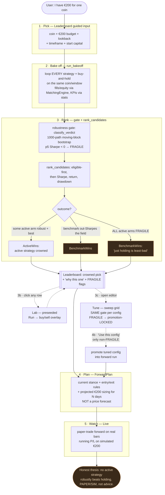
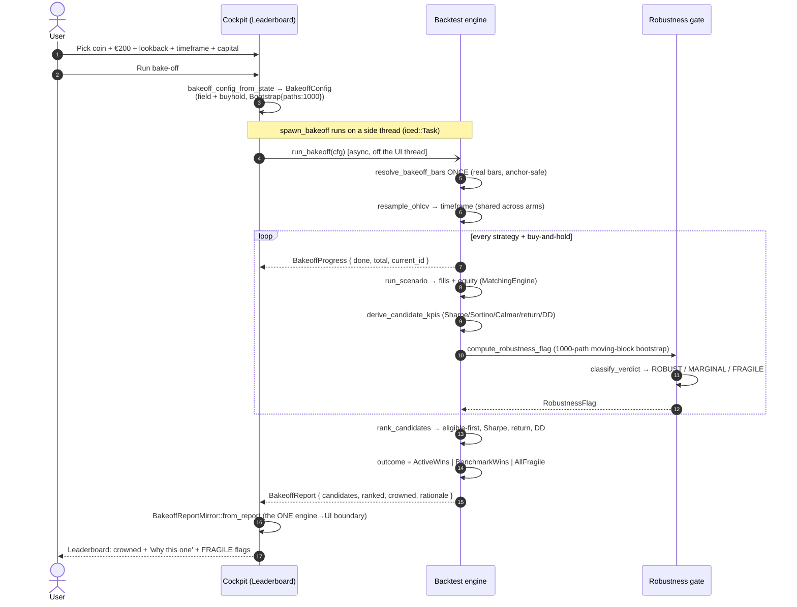

# End-to-End Walkthrough — Single-Coin Investment Advisor (paper)

> **What this document is.** The product's journey, end to end — what the user
> does on each screen, what they see, and the exact system path behind each
> step (the engine functions, the data flow, where it's recorded). Grounded in
> the shipped code; every function and screen named here exists in the tree.
>
> **Honest framing (load-bearing).** This is a **decision-support + paper-sim
> tool** for one retail investor with a small fixed budget. It promises
> **measured robustness, not asserted alpha**. The 2026-06 research program
> concluded *no active strategy robustly beat passive buy-and-hold net of cost*
> on the large-cap sample. That result is a **feature** here: buy-and-hold is
> always the benchmark arm, the robustness gate is the credibility layer, and
> the most common honest outcome on real crypto is **"just holding is the
> least-bad choice on this window"**. **PAPER / SIM ONLY — the €200 is
> simulated, no real orders, not financial advice.**

---

## 1. Overview

The journey answers one concrete question: *"I have €200 for one coin — which
strategy, and what do I do next?"* — in a guided flow:

1. **Pick** a coin (e.g. `XRPUSDT`) + a €200 budget + a lookback window (2 weeks
   → ~4 years) + a bar-size/timeframe (H1/H4/D1) + a start capital.
2. **Bake off** EVERY strategy + buy-and-hold on that `(coin, window)`.
3. **Rank** them under a FROZEN robustness gate → a leaderboard with one crowned
   pick + a plain-language "why this one". **FRAGILE** (overfit) arms are flagged
   and **cannot be crowned**. If ALL active arms are Fragile (the modal outcome
   on real crypto), the buy-and-hold **benchmark wins** (`BenchmarkWins`).
   - **3b. Inspect** — click any leaderboard row → jump to the **Lab** preseeded
     → Run it → see the buy/sell overlay (the actual trades).
   - **3c. Tune** — open the **Tune** editor → sweep a strategy's hyperparameter
     grid → EACH config scored through the SAME frozen gate; overfit configs are
     FRAGILE and promotion-LOCKED.
4. **Plan** — the **ForwardPlan** screen: current stance + plain-language
   entry/exit rules + projected €200 sizing for the next N days. A
   **conditional, rule-driven plan — NOT a price forecast.**
   - **4b. Promote** — "Use this config" on a robust tuned config carries it into
     the forward run; the plan shows the tuned rules + a "you tuned this;
     survived resampling on THIS window — not a guarantee, not advice" header.
5. **Watch** — the **Live** screen: the selection paper-trades forward on real
   incoming bars; running P/L on the simulated €200.



The two honesty gates are visible in the diagram: **FRAGILE → can't crown** (an
arm flagged fragile is shown but never crowned), and **all-Fragile →
BenchmarkWins** (the benchmark is exempt from the gate — it is the null
hypothesis, not a candidate).

---

## 2. Step-by-step (user action · what they see · system behind it)

### Step 1 — Pick (screen: **Leaderboard**, guided input)

- **What the user does.** On the Leaderboard screen they choose the **coin**
  (the `LeaderboardScreenState::coin`), the **budget** (€200), a **lookback**
  chip (`LeaderboardLookback`: `TwoWeeks` … `FourYears`, plus the fixed
  `H1_2024`/`H2_2024` presets), a **timeframe** (H1/H4/D1, mapped via
  `to_horizon()`), and a **start capital**.
- **What the user sees.** A guided form, then a "Run bake-off" affordance.
- **System behind it.** The selections are folded into a `BakeoffConfig` by
  `bakeoff_config_from_state` (`crates/ui/src/leaderboard/runner.rs`):
  - `symbol` ← the chosen coin; `range` ← `lookback.to_date_range(now_ms)`;
    `timeframe` ← `st.timeframe.to_horizon()`; `initial_capital` ←
    `st.start_capital()`.
  - `field` ← `advisor_field()` = the 4 rule engines (SMA / MACD / RSI /
    Bollinger) + the 2 vote-ensembles; **buy-and-hold is appended by
    `run_bakeoff` itself** (`BUYHOLD_ID = "v0.buyhold"`).
  - `robustness` ← `advisor_robustness()` = `RobustnessMode::Bootstrap { paths:
    1000, seed }` (the gate is **ON** for the advisor path).
  - `data_source` ← `ScenarioDataSource::BinanceCache`.
  - The budget is **FX-invariant for the ranking** (a scalar on the budget can't
    change which strategy wins); it carries forward to sizing (Step 4) and the
    header.

### Step 2 — Bake off (engine: `run_bakeoff`)

- **What the user does.** Triggers the run; the bake-off executes on a side
  thread (see the sequence diagram, §3).
- **What the user sees.** A progress indicator (candidate-level progress is
  streamed as `BakeoffProgress { done, total, current_id }`).
- **System behind it.** `run_bakeoff` (`crates/backtest/src/bakeoff/mod.rs`):
  1. **Preload real bars ONCE** via `resolve_bakeoff_bars` (pinned corpus,
     read-only + REVISION-verified, or a dynamic Binance fetch covering the
     window). The **same** `Vec<Bar>` is cloned into every arm — the
     *apples-to-apples* invariant.
  2. **Resample** the 1h corpus to the chosen timeframe ONCE
     (`resample::resample_ohlcv`; `OneHour` is identity pass-through), again
     shared across all arms.
  3. **Loop the field.** For each strategy (+ the appended benchmark) it builds a
     `ScenarioConfig` with `write_report = false` (**anchor-safe** — no report
     body is written, so the 119/119 byte-SHA anchors are untouched) and calls
     `run_scenario`. `run_scenario` produces fills + an equity series via the
     `MatchingEngine`; per-bar equity is `cash + position_qty · mark`
     (`BacktestState::equity`).
  4. **KPIs.** `derive_candidate_kpis` turns each equity series into a
     `CandidateKpis` — `compute_sharpe_hourly` / `compute_sortino_hourly` /
     `compute_calmar`, plus `total_return_pct`, `max_drawdown`, `trade_count`.
  5. **Robustness flag per arm** (Step 3's gate) is computed inline.

### Step 3 — Rank (gate `classify_verdict` → `rank_candidates`)

- **What the user does.** Nothing — ranking is automatic once the field is run.
- **What the user sees.** A **leaderboard table** (best-first), the **crowned
  pick** with the `★ best` tag and an accent row, a **"why this one"**
  recommendation block, **FRAGILE** tags on fragile arms, and a persistent
  not-advice disclaimer.
- **System behind it.**
  - **The gate.** For each candidate, `compute_robustness_flag`
    (`crates/backtest/src/bakeoff/bootstrap.rs`) runs a **1000-path
    moving-block bootstrap**: equity → log-returns → Politis–White block length
    → `moving_block_resample` per path (seeded `ChaCha20Rng`, frozen ADR-0051
    sub-seed rule) → per-path Sharpe/Sortino/Calmar/MaxDD → a
    `DistributionSummary` → `classify_verdict`. The **frozen bands** (in
    `bakeoff/robustness.rs::verdict_bands`): **FRAGILE** if `p5 Sharpe < 0` OR
    `p50 Sharpe < 0.5` OR `prob_loss > 0.35` OR `P(Sharpe>1) < 0.35` OR `p95
    MaxDD > 0.70` (weakest-link); **ROBUST** only if ALL signals clear the robust
    bands; otherwise **MARGINAL**.
  - **The ranking.** `rank_candidates` (`crates/backtest/src/bakeoff/rank.rs`)
    sorts by a total comparator: **(1)** eligibility partition — non-Fragile
    arms before Fragile (a fragile arm can NEVER out-rank an eligible one);
    **(2)** Sharpe desc; **(3)** total return desc; **(4)** max-drawdown asc;
    **(5)** strategy-id lexicographic (determinism backstop). It then sets the
    **outcome** (ADR-0066):
    - `AllFragile` — every **active** arm is Fragile AND the crown did not go to
      the benchmark.
    - `BenchmarkWins` — the benchmark is the top crown-eligible arm (covers both
      "an active arm is robust but the benchmark out-Sharpes it" and the modal
      "all active arms Fragile → the benchmark is the least-bad choice"). The
      €200 then paper-trades as a hold.
    - `ActiveWins` — an active arm is crowned.
  - **The boundary.** `run_bakeoff` packages a `BakeoffReport { candidates,
    ranked, crowned, rationale }`. The UI reads it through **exactly one place**:
    `BakeoffReportMirror::from_report` (`crates/ui/src/leaderboard/state.rs`) —
    the single engine→UI boundary. Everything downstream (table, recommendation
    block, render tests) works off the pure `BakeoffReportMirror` / `LeaderRow`
    types, so the `ui` crate never depends on the engine's strategy types.

### Step 3b — Inspect (screen: **Lab**)

- **What the user does.** Clicks **any leaderboard data row** (the whole row is
  clickable). They land on the **Lab** screen, preseeded with that row's
  strategy and the leaderboard's coin/window, and press **Run**.
- **What the user sees.** The single strategy's run with the **price chart + a
  buy/sell overlay** — the actual fills as markers (clickable for a tooltip).
- **System behind it.** The click fires the
  `InspectStrategyFromLeaderboard`-class message; `open_strategy_in_lab`
  (`crates/ui/src/state.rs`) is the PURE navigate-and-preseed transition: set
  `current_screen = Screen::Lab`, preselect the strategy, and carry the ranked
  **coin** (not the default `BTCUSDT`). Pressing Run calls `spawn_lab_run`
  (`crates/ui/src/lab/runner.rs`) → `run_scenario` → a `RunSummary { fills,
  equity_series, kpis, bars, position_curve }`. The chart renders the bars; the
  `FillView` markers are the overlay. (Lab is the same engine the bake-off loops
  — the bake-off is essentially *looping Lab over the field*.)

### Step 3c — Tune (screen: **Tune**, engine `run_param_sweep`)

- **What the user does.** Opens the **Tune** editor (preseeded from the
  Leaderboard's coin + lookback via the `OpenTuneEditor` message), picks a
  strategy family, defines a **hyperparameter grid** (SMA fast/slow, MACD
  fast/slow/signal, RSI period/oversold, Bollinger period/k), and runs the
  sweep.
- **What the user sees.** A grid of configs, each scored with its KPIs AND a
  robustness **verdict** (ROBUST / MARGINAL / FRAGILE). Overfit (FRAGILE) configs
  are flagged and **cannot be promoted** (the "Use this config" affordance is
  gated). A tuning disclaimer ("Tuning is paper/sim research, not advice").
- **System behind it.** `run_param_sweep` (`crates/backtest/src/bakeoff/sweep.rs`):
  enumerate + validate + cap the grid → preload bars ONCE (same
  `resolve_bakeoff_bars`) → run the **shipped-config baseline cell** → loop every
  grid cell (`run_one_cell`: `run_scenario` for KPIs +
  `compute_robustness_distribution` → `classify_verdict`, the SAME gate as the
  leaderboard, with a per-cell sub-seed) → run the **buy-and-hold benchmark** →
  assemble a `SweepReport { cells, baseline, benchmark }`. Each cell carries its
  `ParamRobustnessVerdict`; FRAGILE → promotion-locked (ADR-0069). Because every
  cell runs `write_report = false`, the sweep is anchor-safe by construction.

### Step 4 — Plan (screen: **ForwardPlan**)

- **What the user does.** Proceeds to the plan for the crowned pick (or a
  promoted tuned config — Step 4b).
- **What the user sees.** The strategy's **current stance** (BUY / HOLD / SELL on
  the latest bar), the **entry/exit rules in plain language**, and the
  **budget-aware €200 sizing** that would result over the next N days. This is a
  **conditional, rule-driven plan, re-evaluated each bar — NOT a dated trade
  calendar and NOT a price forecast** (the crowned strategy is a deterministic
  rule engine with no price-prediction ability).
- **System behind it.** `build_forward_plan_from_registry`
  (`crates/agent/src/plan.rs`) dispatches on the strategy id and constructs a
  plan **describer** from the SAME generators the forward loop will run
  (structural-fidelity guarantee, ADR-0070 §D3) — `SmaCrossover` for
  `v0.sma`, `AlwaysLongStrategy` for `v0.buyhold`, a fresh `ComposedStrategy`
  from the family TOML for `v0.5.macd` / `v0.5.rsi` / `v0.5.bbands`,
  `build_ensemble` for the vote arms. At Launch the describer is un-warmed, so
  the honest stance is "FLAT — no position yet; waiting for the first bar".

### Step 4b — Promote (screen: **Tune → ForwardPlan**)

- **What the user does.** On a **non-FRAGILE** tuned config in the Tune grid,
  clicks **"Use this config"**.
- **What the user sees.** They land on the **ForwardPlan** screen showing the
  **tuned rules**, with a provenance header (`TUNE_PROMOTE_CONFIRM_FMT`): *"You
  tuned this {family} config ({params}). It survived resampling on {window} —
  that is not a guarantee, and not advice. Paper-trading your €200."* The plan
  flips to a "computing the tuned rules" Loading state so the operator never sees
  a stale crowned plan.
- **System behind it.** `promote_swept_config` (`crates/ui/src/state.rs`) maps
  the family → the `StrategyId` the forward resolvers dispatch on (`v0.5.sma` /
  `v0.5.macd` / `v0.5.rsi` / `v0.5.bbands`) and stores a `ForwardPromotion {
  strategy_id, coin, params, window_label }` in `pending_forward_promotion`. The
  view gate ensures **only PROMOTABLE (non-Fragile) rows** reach here. The tuned
  params become a `ForwardParamOverride`; when the forward run launches,
  `build_forward_plan_from_registry` takes the `param_override` path →
  `build_plan_from_override`, building a describer from the SAME shared
  generator + identity guard `build_registry_for` uses for the loop, so the
  **plan and the running loop describe the byte-identical tuned strategy**.

### Step 5 — Watch (screen: **Live**)

- **What the user does.** Starts the forward paper-run and watches.
- **What the user sees.** The selection **paper-trades forward on real incoming
  bars**: fills, positions, an equity curve, and **running P/L on the simulated
  €200**. (Mode: **Paper**. Not-advice + simulated-budget framing throughout.)
- **System behind it.** The selection (crowned pick or promoted config) becomes a
  `ForwardRunConfig`; the binary fires `ForwardCommand::Launch(cfg)`
  (`crates/agent/src/runtime.rs`), which cancels the current trading-loop task
  and spawns a fresh one on the same bus/ledger. `build_registry_for` constructs
  the registry for the chosen strategy (the override path builds the
  byte-identical tuned strategy). The agent paper loop publishes fills /
  positions / equity onto the **EventBus**; the **Live view**
  (`crates/ui/src/live.rs`) subscribes and renders (`fill_to_view` →
  `FillView`). **Every fill is recorded in the `crates/audit` double-entry
  ledger** (Σ debits == Σ credits), making the run reproducible.

---

## 3. The system sequence

Two flows: **bake-off → rank** (the leaderboard lands) and **promote → forward
paper-trade** (the Live view runs). Both run their heavy work on a side thread
and stream results back into the iced update loop.

### 3a — Bake-off → Rank (the Leaderboard lands)



### 3b — Promote → Forward paper-trade (the Live view runs)

```mermaid
sequenceDiagram
    autonumber
    actor User
    participant UI as Cockpit (Tune / ForwardPlan / Live)
    participant Agent as Agent runtime
    participant Eng as Strategy + paper loop
    participant Bus as EventBus
    participant Ledger as Audit ledger

    User->>UI: Tune sweep → 'Use this config' (non-FRAGILE only)
    UI->>UI: promote_swept_config → ForwardPromotion<br/>(strategy_id, coin, params, window)
    UI->>UI: current_screen = ForwardPlan (plan → Loading)

    UI-)Agent: ForwardCommand::Launch(ForwardRunConfig + param_override)
    Agent->>Agent: build_registry_for (override → byte-identical tuned strategy)
    Agent->>Agent: build_forward_plan_from_registry → build_plan_from_override
    Agent-->>UI: ForwardPlan { stance, rules, €200 sizing }
    UI-->>User: ForwardPlan: tuned rules + 'you tuned this; survived<br/>resampling on THIS window — not a guarantee, not advice'

    User->>UI: Switch to Live
    loop each incoming real bar (Paper mode)
        Eng->>Eng: strategy signal → simulated fill
        Eng-)Bus: publish Fill / Position / Equity
        Eng-)Ledger: record fill (double-entry, Σdebit == Σcredit)
        Bus-->>UI: stream_fills / positions / equity
        UI-->>User: Live: fills, positions, running P/L on €200
    end
```

The async shape is the same in both flows: the UI builds a config from pure
state, hands it to a side thread (`iced::Task` / `ForwardCommand::Launch`),
progress streams back as messages, and the result lands in the UI through a
single boundary (`BakeoffReportMirror::from_report` for the bake-off; the
EventBus → `FillView` for the live run).

---

## 4. The honesty mechanics, inline

- **Where buy-and-hold enters.** `run_bakeoff` **always appends** the
  `v0.buyhold` arm to the field. It is run on the identical bars as every active
  arm and scored with the identical KPIs — it is the benchmark the field is
  measured *against*.
- **Where FRAGILE blocks a crown.** In `rank_candidates`, the comparator's first
  rule is the **eligibility partition**: a Fragile arm is sorted **after** every
  non-Fragile arm, so it can never out-rank an eligible candidate — it is shown
  (with a FRAGILE tag) but never crowned.
- **The benchmark is exempt from the gate** (ADR-0066). The `all_active_fragile`
  check ranges over **non-benchmark** arms only; the benchmark is the null
  hypothesis, not a candidate that must clear the bar. So when every active arm
  is Fragile, the outcome is **`BenchmarkWins`** ("just holding is the least-bad
  choice on this window"), and the €200 paper-trades as a hold — not a blank
  result, not a crowned-but-fragile pick.
- **The SAME gate at every step.** `classify_verdict` over a 1000-path
  moving-block bootstrap is the credibility layer used at **rank** (per
  candidate in `run_bakeoff`), at **tune** (per config in `run_one_cell`), and it
  defines **promote** eligibility (only non-FRAGILE configs can be promoted).
  One frozen rule, applied uniformly — the leaderboard is not a lucky-draw board.
- **Not-advice / paper-only.** Every recommendation/Live surface carries a
  not-advice + simulated-budget disclaimer; the promote header
  (`TUNE_PROMOTE_CONFIRM_FMT`) explicitly says a config robust on ONE window is
  *not a guarantee and not advice*. The mode is **Paper** — no real orders.
- **Reproducibility.** The bake-off **seed + window + per-strategy KPIs** are all
  recorded, money is `Decimal` (`Money<Usdt>`), and the same inputs reproduce the
  same ranking (the comparator is a pure, total order; the bootstrap is
  ChaCha20-seeded with a frozen sub-seed rule). Reports are body-SHA-anchored,
  and the advisor path writes no report body (`write_report = false`), so it
  stays anchor-safe.

---

## 5. A worked example — `XRPUSDT`, €200, 2024 H1, H1

A concrete run, walked through the screens:

1. **Pick.** The user enters `XRPUSDT`, budget `200`, lookback `H1_2024`,
   timeframe `H1`, start capital (default). `bakeoff_config_from_state` builds a
   `BakeoffConfig { symbol: XRPUSDT, range: H1_2024, field: [4 engines + 2
   ensembles], robustness: Bootstrap{paths: 1000} }`; `run_bakeoff` will append
   `v0.buyhold`.
2. **Bake off.** `resolve_bakeoff_bars` loads the real XRPUSDT 2024-H1 hourly
   bars once; `run_bakeoff` loops all 7 arms through `run_scenario` on those
   shared bars, computes KPIs, and runs the 1000-path bootstrap per arm. Progress
   streams as `BakeoffProgress` chips.
3. **Rank.** On real crypto over a six-month window, the **modal outcome** is
   that **every active arm is FRAGILE** (the central robustness truth: no active
   strategy robustly beats holding). `rank_candidates` finds `all_active_fragile
   = true`, the benchmark is the top crown-eligible arm → **`BenchmarkWins`**.
   - **What the screens show.** The Leaderboard headline reads as the
     benchmark-wins case: *"For XRPUSDT over 2024 H1, nothing active cleared the
     robustness bar — simply holding is the least-bad choice on this window."*
     The table lists each active strategy with a **FRAGILE** tag and its KPIs
     side-by-side (return / Sharpe / max-drawdown / trades); `v0.buyhold` carries
     the `★ best` crown. The not-advice disclaimer sits below.
4. **Inspect / Tune (optional).** Clicking, say, the SMA row jumps to the **Lab**
   preseeded on XRPUSDT/2024-H1; Run shows the SMA crossover's actual buy/sell
   markers — often a few whipsaw trades that bled fees vs. the smoother hold
   curve. Opening **Tune** and sweeping the SMA fast/slow grid typically returns
   a grid where the configs are **FRAGILE** too (promotion-LOCKED) — the gate
   refusing to bless an overfit pick is the feature working.
5. **Plan + Watch.** Because the benchmark won, the **ForwardPlan** describes the
   buy-and-hold stance (deploy the €200 and hold), and the **Live** view
   paper-trades that hold forward on real incoming bars, showing the running P/L
   on the simulated €200 — every (single) fill recorded in the audit ledger.

The honest takeaway the product is built to deliver: on a typical real-crypto
window, **just holding is usually the least-bad choice**, the tool **shows you
that with measured, reproducible evidence** rather than asserting an edge, and
the whole thing is **paper-only and not advice.**

---

### Function & screen reference (all verified in-tree)

| Step | Screen | Engine / function | File |
|---|---|---|---|
| 1 Pick | Leaderboard | `bakeoff_config_from_state`, `advisor_field`, `advisor_robustness` | `crates/ui/src/leaderboard/runner.rs` |
| 2 Bake off | — | `run_bakeoff`, `resolve_bakeoff_bars`, `run_scenario`, `derive_candidate_kpis` | `crates/backtest/src/bakeoff/mod.rs`, `engine.rs` |
| 3 Rank | Leaderboard | `compute_robustness_flag` → `classify_verdict`; `rank_candidates`; `BakeoffReportMirror::from_report` | `crates/backtest/src/bakeoff/{bootstrap,robustness,rank}.rs`; `crates/ui/src/leaderboard/state.rs` |
| 3b Inspect | Lab | `open_strategy_in_lab`, `spawn_lab_run` | `crates/ui/src/state.rs`, `crates/ui/src/lab/runner.rs` |
| 3c Tune | Tune | `run_param_sweep`, `run_one_cell`, `classify_verdict` | `crates/backtest/src/bakeoff/sweep.rs` |
| 4 Plan | ForwardPlan | `build_forward_plan_from_registry` | `crates/agent/src/plan.rs` |
| 4b Promote | Tune → ForwardPlan | `promote_swept_config`, `build_plan_from_override`, `build_registry_for` | `crates/ui/src/state.rs`, `crates/agent/src/{plan,runtime}.rs` |
| 5 Watch | Live | `ForwardCommand::Launch`, `build_registry_for`, EventBus, `fill_to_view` | `crates/agent/src/runtime.rs`, `crates/ui/src/live.rs`, `crates/audit` |

*Cockpit: native iced; the live binary is `cockpit_live --features live`.
Screens: Leaderboard, Lab, Tune, ForwardPlan, Live (`Screen` enum in
`crates/ui/src/state.rs`).*
