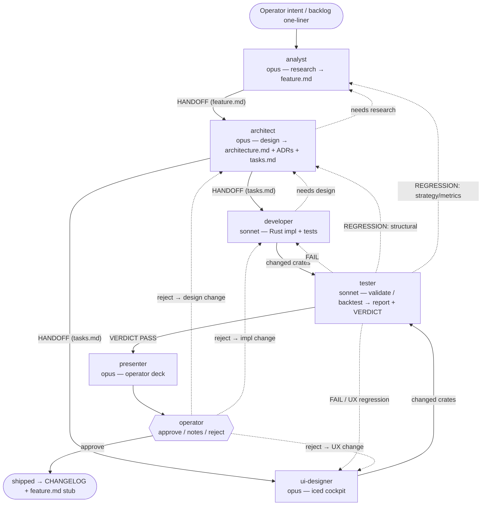
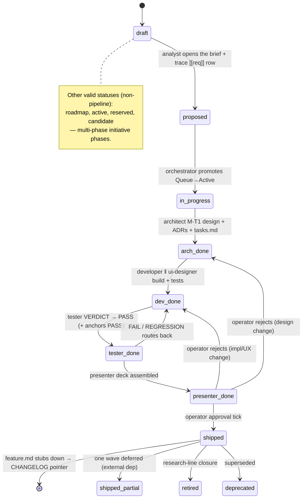
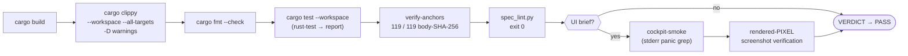

# Development & Delivery Processes

How work gets done in this repository. The canonical sources are
[`AGENT.md`](../AGENT.md) (orchestration contract) and [`CLAUDE.md`](../CLAUDE.md)
(coding rules + non-negotiables); the gate commands live in
[`scripts/`](../scripts) and the agents/skills in [`.claude/`](../.claude).
This document narrates those sources — when they disagree with this file, they win.

> **The product.** A *Single-Coin Investment Advisor (paper)* — pick a coin and a
> €200 budget, bake off every strategy, rank the survivors under a **frozen
> robustness gate** (buy-and-hold benchmark), build a forward plan, and watch it
> paper-trade the simulated €200. **PAPER / SIM ONLY.** The honest thesis is that
> no active strategy robustly beats holding — the process below exists to keep that
> answer honest under change.

---

## 1. The spec-driven multi-agent workflow

Work flows through a pipeline of six specialist agents, each a fresh sub-agent the
**orchestrator** (the main Claude session) spawns with a curated brief. Nothing
important lives only in chat — every durable output is written to `spec/` via the
`spec-update` skill. Every sub-agent ends its response with a single
`HANDOFF → <agent>` or `VERDICT → <result>` line plus a machine-readable TOML
handoff envelope, so the next hop is mechanical.

### The roles

| Agent          | Model  | File                              | Owns                                                         |
|----------------|--------|-----------------------------------|-------------------------------------------------------------|
| **analyst**    | opus   | `.claude/agents/analyst.md`       | Research → requirements. Writes `feature.md`; creates the `[[req]]` row in `spec/trace.toml`. |
| **architect**  | opus   | `.claude/agents/architect.md`     | System design → `spec/architecture.md` + ADRs + `tasks.md`. Fills the `arch` trace column. |
| **developer**  | sonnet | `.claude/agents/developer.md`     | Rust implementation + tests alongside code. Fills `crates` / `tests` trace columns. |
| **ui-designer**| opus   | `.claude/agents/ui-designer.md`   | The iced cockpit (`crates/ui`). Runs in **parallel** with the developer. |
| **tester**     | sonnet | `.claude/agents/tester.md`        | Build / validate / backtest → `reports/test-*.md` + a `VERDICT`. Locks anchors. |
| **presenter**  | opus   | `.claude/agents/presenter.md`     | Operator-facing approval deck under `presentations/`. The "sprint-review" face. |

Two **on-demand specialists** sit outside the linear flow: `spec-auditor`
(read-only spec-drift audit → a dated dev-note) and `ui-debugger` (diagnoses +
fixes cockpit render/behaviour bugs at the rendered-pixel layer). Route a UI
*bug* to `ui-debugger`; route UI *design/implementation* to `ui-designer`.

### The pipeline + feedback routes

The canonical workflow is **analyst → architect → (developer ‖ ui-designer) →
tester → presenter → operator-approve**, with first-class bidirectional feedback
edges. A tester verdict is *not* a terminator — it is an input routed to whoever
owns the failure mode:

- `PASS` → presenter.
- `FAIL` → developer (or ui-designer for a UX/visual failure).
- `REGRESSION` → structural routes to **architect**, strategy/metrics to
  **analyst**, UX/visual to **ui-designer**.

### The parallelism rule

**Default to parallel.** The orchestrator spawns sub-agents concurrently whenever
their work is independent; sequential execution must be justified by a real
file-scope conflict, a dependency edge, or an unanswered operator-decide gate.
Before each wave, the orchestrator runs the **file-scope conflict matrix** for
every agent pair — same file? same module's public API? same `Cargo.toml`? same
generated artifact (anchors, snapshots)? same operator-decide question? If every
cell is NO, the pair runs concurrently (one `Agent` call, multiple tool-use
blocks in the same message); any YES sequences them.

- **Developer ‖ ui-designer** run in the same tool-use block whenever a feature
  has both a backend and a user-facing surface. They synchronise only on the typed
  messages in the `core` crate; the UI renders against `ui::fixtures` until the
  developer's real data source lands.
- **Analyst / architect / developer fan-out** splits independent research,
  design investigations, or per-crate tasks across concurrent sub-agents.
- **Presenter is never fanned out** — one feature, one presentation, spawned only
  after `VERDICT → PASS`.

The cautionary counter-rule (from the chart-canvas-overhaul retrospective): when
the orchestrator can't articulate the lane split explicitly in the spawn brief,
**default to sequential** dev → ui-designer → orchestrator. Parallel sub-agents
have no view of each other's reasoning; silent divergence is the failure mode.

**Trivial work skips the loop.** One-file edits with no design impact, quick
compile checks, doc-only changes, and conversational questions are done directly —
spinning up an agent costs more than it saves. For those, run `rust-build` +
`rust-validate` inline.

---

## 2. The per-feature lifecycle

A feature travels from a backlog one-liner to a shipped, stubbed-down spec folder.
Every non-trivial feature lives in `spec/<slug>/` with:

- `feature.md` — the brief; frontmatter carries `status:` (the vocabulary below).
- `tasks.md` — the architect's ordered checklist the developer ticks off.
- `reports/` — anchored backtest reports + tester `test-*.md` reports.
- `presentations/` — operator-approval decks (+ `artifacts/`).

The status frontmatter is the lifecycle's state machine, enforced by
`scripts/spec_lint.py` (`VALID_STATUSES`). The pipeline statuses are:

Step by step:

1. **Backlog one-liner.** A Queue entry in `spec/backlog.md`. Before promoting it
   to Active the orchestrator verifies the slug's frontmatter `status` against the
   Queue text (`scripts/queue_staleness_check.py`) — a `shipped` status means the
   Queue row is stale; reconcile, don't rebuild.
2. **Analyst brief.** The analyst turns intent into `spec/<slug>/feature.md` and
   creates the `[[req]]` row in `spec/trace.toml` (`status: proposed`).
3. **Architect design + ADR.** The architect appends a `## Design` section, writes
   any non-trivial decision as a numbered ADR under `_bmad-output/planning-artifacts/architecture/decisions/`
   (registering it in the same pass — see §5), and produces `tasks.md`
   (`status: arch-done`).
4. **Developer ‖ ui-designer build.** Backend crates and the `ui` crate, in
   parallel, with tests alongside the code. Developers tick `tasks.md` rows only
   with an *honest tick* — file:line + test command + the passing output line
   (`status: dev-done`).
5. **Tester report.** The tester fans out validate / test / bench / backtest /
   spec-lint, merges into one `reports/test-*.md`, runs the anchor gate, and emits
   a `VERDICT`. Only the tester ticks `T_FINAL_*` rows, and only after PASS +
   anchors PASS (`status: tester-done`).
6. **cockpit-smoke** (UI features only). After a UI brief's PASS, the
   orchestrator boots the fixtures cockpit and greps stderr for first-frame render
   panics — a mandatory pre-presenter gate (see §3).
7. **Presenter deck.** On PASS, the presenter assembles
   `spec/<slug>/presentations/<slug>-<date>.md` — TL;DR, what changed, a live bin
   run, a verification matrix, the numbers, open decisions, and an **un-ticked**
   approval block (`status: presenter-done`).
8. **Operator approval.** The operator ticks one box. Approve → ship; approve-with-
   notes → append to the feedback log and route follow-up; reject → route back to
   the owning agent.
9. **Shipped + stub-down.** `status: shipped`; the one-line entry lands in
   `CHANGELOG.md`; `feature.md` compresses to a one-line CHANGELOG pointer and
   `tasks.md` is deleted. The full narrative survives in `git log -- spec/<slug>/`.

---

## 3. The quality gates

Every change passes a fixed sequence of mechanical gates. The first three (build,
clippy, fmt) are cheap and run constantly; the rest gate the tester's `VERDICT`
and the presenter's pre-tick.

| Gate | What it checks | Command | When |
|------|----------------|---------|------|
| **Build** | The workspace compiles. | `cargo build` (via `rust-build`) | Every change, before tests. A red build is never a valid handoff. |
| **Clippy** | Lints, as hard errors — **including test targets**. | `cargo clippy --workspace --all-targets -- -D warnings` | Every change. `--all-targets` matters: it compiles the `tests/` targets, so a broken test file fails clippy. |
| **Format** | Canonical `rustfmt`. | `cargo fmt --check` | Every change (via `rust-validate`). |
| **Tests** | Unit + integration + property + e2e. | `cargo test --workspace` (via `rust-test`, → `reports/test-*.md`) | After build. |
| **Anchors** | The **119/119 body-SHA-256 regression gate** — anchored backtest reports are byte-identical to their locked hashes. | `scripts/verify_anchors.sh` (via `verify-anchors`) | Mandatory whenever the change touched `crates/strategy`, `crates/audit`, `crates/exec`, `crates/backtest`, or report rendering. A single FAIL routes `HANDOFF → developer` with the body diff. |
| **Spec-lint** | Dead intra-spec links, frontmatter validity, orphan features, shipped-without-tests, trace integrity, ADR-registry drift, pipeline status drift. | `scripts/spec_lint.py` (via `spec-lint`; needs Python ≥ 3.11 — `uv run` or `python3`) | Tester pre-`VERDICT` and presenter pre-tick. Exit 0 required for PASS. |
| **cockpit-smoke** | Boots the fixtures-mode cockpit for a fixed window, greps stderr for first-frame render panics. | `cockpit-smoke` skill (orchestrator-only) | **Mandatory after any UI brief's PASS**, before the presenter. Exit 1 → block presenter, route to developer. |
| **UI pixel verification** | The screen actually *draws* — read the rendered PNG. | `iced_test::Emulator::screenshot` harnesses (`render_snapshots.rs`, `live_equity_render.rs`, `reports_populated_curve_render.rs`) | Every UI change. Exercise the **populated** state with a negative control. |

### The body-SHA anchor regression gate (in detail)

`spec/anchors.toml` is the single source of truth for the locked anchors —
**119** of them at last verify (`ANCHORS PASS (119 / 119)`). Each anchor pins the
**body-only SHA-256** of a backtest report: the report file with its leading YAML
front-matter stripped. Run-varying metadata (`generated:`, `wall_clock_s`, `host`,
`pid`, `git_commit`, `data_source`) lives in the front-matter; the body — the
deterministic numbers — is what gets hashed. This is why **anchored report files in
`spec/*/reports/` are byte-immutable**: per ADR-0038's anchor-additive contract,
even a mechanical link-fix edit mutates the body-SHA and breaks the gate.
Documentation-link cleanup sweeps MUST exclude anchored reports (or invoke the
ADR-0038 § D6 re-emission protocol). The tester locks new anchors; only the
architect (via an explicit ADR) may change an existing one — anchors never mutate
silently. A companion in-test gate (`scripts/check_determinism_anchors.py`)
verifies the in-test re-run constants mirror `anchors.toml` (the ADR-0045
dual-anchor model).

> **Terminology note.** Older prose in `AGENT.md` still says "9 anchors" — that
> count is legacy. The live gate is **119/119** (`verify_anchors.sh` computes the
> total dynamically and printed `119 / 119` at the time of writing).

---

## 4. The non-negotiables

These are hard rules from `CLAUDE.md` and `AGENT.md`. Each maps to an incident we
paid for.

- **Day-1 baseline-equity-divergence e2e test.** Every strategy overlay or
  sizing-modifier ships, *from day 1*, with an end-to-end test asserting its output
  equity diverges from the un-targeted baseline by ≥ 1 bp (or a testable epsilon)
  when the strategy decision variable is non-trivial. *Why:* the
  `v3-volatility-forecaster` no-op — a `scale` that was **computed but never
  applied** — passed unit tests on the math layer *and* anchored backtest reports
  (the equity was identical because the scale did nothing), slipping through five
  gates undetected. Unit tests + anchors are **not** sufficient to catch a no-op
  overlay. Pattern reference:
  `crates/strategy/tests/vol_targeting_overlay_end_to_end.rs`.
- **Frozen-gate discipline.** The robustness gate that ranks strategies against the
  buy-and-hold benchmark is frozen. Changing what the gate measures changes what
  "beats holding" means — that is a deliberate, ADR-gated decision, not an
  incidental code edit. Anchors enforce that the gate's outputs stay byte-stable
  across unrelated changes.
- **Anchored-report immutability.** As above (§3) — byte-immutable, ADR-0038.
- **No secrets in git.** Exchange/API keys live in env vars or the secret store
  defined in `spec/architecture.md`. Guarded by
  `scripts/check_no_secrets_in_llm_artifacts.sh`.
- **No ship on a REGRESSION verdict** without an explicit operator "proceed
  anyway". The presenter never runs on a FAIL or REGRESSION verdict.
- **No silent divergence from `spec/architecture.md`.** Drift is either a spec
  update or a handoff — never both missing.
- **Determinism non-negotiables** (developer checklist): no
  `SystemTime::now()` / `Instant::now()` on a backtest replay path (inject a
  clock); no `f64` in money math (`rust_decimal::Decimal` + `Money<C>` only);
  microsecond-precision audit-DB timestamps (second-precision causes SQLite
  `ORDER BY` ties); all RNGs `ChaCha20Rng::from_seed(...)` (no `thread_rng`);
  HashMap iteration sorted before any cross-run comparison.
- **`unsafe`** requires a `// SAFETY:` comment. **`--no-gpg-sign`** is never
  acceptable from any agent.

---

## 5. Spec hygiene

`spec/` is the durable store; chat is a view. The rules that keep it honest:

- **Writes go through `spec-update`.** Every agent uses the `spec-update` skill for
  `spec/` writes — never raw Write/Edit. It enforces frontmatter and keeps a
  changelog stub.
- **CHANGELOG is the front door.** `CHANGELOG.md` is the canonical "what's been
  built" index — one line per shipped feature, grouped by subsystem. The fastest
  way to learn current state. Read it (and `git log`) before assuming a feature is
  unbuilt: **completed `feature.md` files are intentional one-line stubs**, and
  `tasks.md` is deleted on ship. A stub is *done*, not broken.
- **ADRs.** Non-trivial design decisions are numbered ADRs under
  `_bmad-output/planning-artifacts/architecture/decisions/`. Writing an ADR = registering it **atomically** in the
  same pass: append a row to `_bmad-output/planning-artifacts/architecture/decisions/README.md` and bump its
  `updated:` field. Enforced by `scripts/adr_registry_check.py --pre-commit`.
- **trace.toml.** `spec/trace.toml` threads each requirement (`[[req]]`) through
  the pipeline by column ownership: analyst creates the row, architect fills
  `arch`, developer/ui-designer fill `crates` + `tests`, tester fills `anchors`
  after PASS. `spec-lint` checks the paths resolve and that shipped strategy work
  carries anchor citations.
- **anchors.toml** is the *only* place anchor SHAs live — never duplicated into
  feature/task/report files.
- **Mechanical hygiene gates** run as pre-tick guards and at session pre-flight:
  `spec_lint.py` (shape), `verify_anchors.sh` (content), `queue_staleness_check.py`
  (Queue↔status reconciliation), `operator_ledger_check.py` (operator-verification
  ledger). The `spec-auditor` agent runs a deeper read-only drift sweep on a weekly
  cadence into a dated `docs/dev-notes/audit-*.md`.

---

## 6. Git & ship discipline

- **Main-only.** All work happens directly on the `main` branch of the main repo.
  No feature branches, no git worktrees, no `claude/<slug>` branches — every prior
  worktree session fast-forward-merged to main anyway, so it was pure ceremony for
  a single-operator codebase.
- **Sub-agents write files; the orchestrator owns git.** Sub-agents never run
  `git commit`, `git push`, `git reset`, `git rebase`, `git stash`, or
  `git checkout -- <path>`. They leave changes in the working tree and emit a
  `HANDOFF`. The orchestrator stages, commits, and pushes. A sub-agent that ends
  with a commit has violated the contract; destructive git from a sub-agent has
  wiped in-flight sibling work before.
- **Signed commits.** Commits MUST be signed (GPG/SSH, 1Password-backed key in the
  operator's interactive session). `--no-gpg-sign` is forbidden — an unsigned
  commit is an orchestrator-and-operator problem to fix, not something to route
  around.
- **The anchor gate before ship.** No feature ships while the **119/119** anchor
  gate or `spec-lint` is red. The presenter's `PRESENTATION → READY` line is only
  emitted after both its pre-tick guards (`check_presentation.sh` and
  `spec_lint.py`) pass and are quoted verbatim.
- **No PRs unless the operator asks.** Push directly to `origin/main`;
  `gh pr create` is reserved for an explicit operator request.
- **CHANGELOG is the shipped index.** The one-line CHANGELOG entry, added when the
  operator approves, is the canonical record that a feature shipped.

---

### Process discipline, in one paragraph

Spawn the next agent the moment the prior one lands (continuous progress; the
operator stops the session explicitly). Bias every option toward the **durable**
choice, not the cheapest — the `(Recommended)` tag goes on the option that won't
spawn a v0.X+1 cleanup brief. Tick a task only with an honest citation. Verify the
gates yourself before routing a FAIL — sub-agent verdicts skew positive when
grading their own work, which is why the tester's evaluator runs read-only in a
fresh context that never saw the diff. And keep `spec/` and the code in sync: if
they diverge, fix one before finishing.
