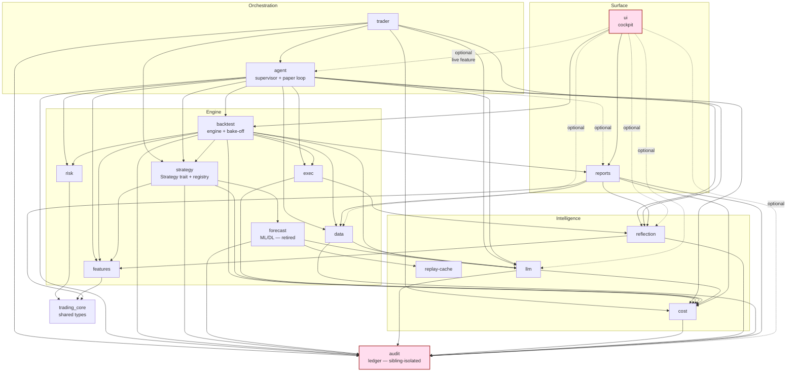

# Repository & Code Structure

> **What this project is.** A **Single-Coin Investment Advisor (paper)** — pick a
> coin + €200 → bake off every strategy → rank them under a FROZEN robustness gate
> (buy-and-hold always the benchmark) → produce a forward plan → watch it
> paper-trade the simulated €200. **PAPER / SIM ONLY.** The honest thesis the
> research program landed on: no active strategy robustly beats holding.
> Canonical sources: [`spec/product.md`](../spec/product.md), [`README.md`](../README.md),
> [`CHANGELOG.md`](../CHANGELOG.md).

This document maps the *repository and code layout*. For the system design and
data flow, see [`spec/architecture.md`](../spec/architecture.md) and the split
chapters under [`spec/architecture/`](../spec/architecture/). For "what's built"
read [`CHANGELOG.md`](../CHANGELOG.md).

---

## 1. Top-level tree

```
trading/
├── Cargo.toml              # Virtual workspace: 17 member crates, resolver "2",
│                           #   [workspace.dependencies] pin set, build profiles,
│                           #   [patch.crates-io] iced_tiny_skia → vendor/ fork
├── Cargo.lock
├── CLAUDE.md               # Coding rules, skills, non-negotiables (read 3rd)
├── AGENT.md                # Multi-agent orchestration contract (read 4th)
├── README.md               # Human entry point + status snapshot (read 1st)
├── CHANGELOG.md            # Canonical "what's been built" index (read 2nd)
├── deny.toml               # cargo-deny license/advisory policy
│
├── crates/                 # The 17 workspace crates (see §2)
│   ├── core/  data/  features/  forecast/        # foundation + engine inputs
│   ├── strategy/  risk/  exec/  backtest/        # the trading engine
│   ├── llm/  cost/  reflection/  replay-cache/  models/   # intelligence
│   ├── audit/                                    # double-entry ledger (isolated)
│   ├── agent/  trader/                           # orchestration / bootstrap
│   ├── reports/                                  # markdown + CSV report rendering
│   └── ui/                                       # iced cockpit (surface)
│
├── spec/                   # Spec-driven dev tree (see §5)
│   ├── product.md  architecture.md  backlog.md  bug-log.md
│   ├── anchors.toml        # 119 body-SHA-256 regression anchors
│   ├── trace.toml          # REQ → feature → code traceability map
│   ├── architecture/       # split design chapters 00–12 + adr/ (0001–0070)
│   ├── dev-notes/          # cross-cutting memos + weekly audits
│   ├── design/             # Lumen design system
│   ├── runbooks/           # operational runbooks
│   ├── archive/            # compressed historical reports
│   └── <feature-slug>/     # ~130 per-feature folders (feature.md + tasks.md + …)
│
├── config/                 # Runtime config: agent.toml(+variants) + strategies/*.toml
├── data/                   # On-disk corpora + sqlite ledgers (binance/yahoo/audit/…)
├── scripts/                # Gate + lint scripts (verify_anchors, spec_lint, …)
├── vendor/                 # vendor/iced_tiny_skia — long-term local iced fork
├── .claude/                # agents/ (8 sub-agents) + skills/ (14 skills)
├── .github/                # CI workflow (ci.yml.deferred — held INERT)
├── .codegraph/             # gitignored CodeGraph index (dev/agent aid only)
└── doc/                    # This documentation set
```

Non-source top-level dirs that exist but are operational scratch, not part of the
build: `target/`, `ops/`, `lab-runs/`, `TODO.md`, `CLEANUP-PLAN.md`.

---

## 2. The 17 crates

Crate package names sometimes differ from their directory name — notably
`crates/core` is the package **`trading_core`**. The rest match their directory.

### Foundation

| Crate | Responsibility | Key public types / entry points | Depended on by |
|---|---|---|---|
| **core** (`trading_core`) | Shared domain vocabulary. Owns the type-safe money + market primitives every other crate speaks. | `Money<C>` / `Price` / `Quantity` (Decimal-backed), `Signal` / `SignalKind`, `Bar` / `Timeframe`, `Position` / `OpenPosition`, `Fill`, `Order`, `Symbol` / `StrategyId` / `Venue` / `Side`, `EquitySeries` / `BacktestMetrics`, `FxRate`, `PitSeries` (point-in-time), view structs. | **everyone** (core has no sibling deps except a dev-dep on `risk` for tests). |

### Engine

| Crate | Responsibility | Key public types / entry points | Depended on by |
|---|---|---|---|
| **data** | Market-data ingestion + on-disk corpus loaders. Binance REST/WS + Yahoo (feature-gated `yahoo`/`yahoo-online`). Fetcher bins. | feed traits, corpus readers; bins `fetch_binance_klines`, `fetch_binance_funding`, `fetch_binance_premium`, `fetch_yahoo_klines`, `bar_aggregator`. | strategy, backtest, agent, reports, reflection(dev). |
| **features** | Indicator / feature computation over bars (TA layer). | feature calculators consumed by strategies + forecasters. | strategy, backtest, forecast, reflection, agent. |
| **forecast** | The (retired-but-present) ML/DL forecasters: TCN, PatchTST, GARCH-vol, transformer. `candle`-backed. Many training bins. | `PatchTstModel`, GARCH/TCN models; training bins `train_tcn`, `train_patchtst`, `train_garch`, `recalibrate_sigma_train`, verdict bins. | strategy (feature `forecast`), backtest. |
| **strategy** | **The `Strategy` trait + every strategy + the registry.** SMA crossover, composed (TOML-DSL), ensemble, cross-sectional momentum, mean-reversion pairs, always-long/cash-hold, vol overlays, regime dispatcher, forecaster overlays. Also the forward-`PlanDescribe` trait. | `trait Strategy`, `StrategyRegistry`, `SmaCrossover`, `ComposedStrategy`(+`Config`), `EnsembleStrategy`, `AlwaysLongStrategy`, `StrategyPlan`/`PlanDescribe`. | trader, backtest, agent. |
| **risk** | Risk limits, sizing guards, money-level invariants. | sizing / limit types (`FixedFractionSizer` etc.). | strategy, backtest, exec, agent. |
| **exec** | Order execution + the paper-fill simulator (latency + slippage + market-impact sim). | `PaperEnginePublisher`, execution/sim types. | backtest, agent. |
| **backtest** | **The backtest engine + the bake-off + reporting.** Runs scenarios, the advisor bake-off (sweep + bootstrap robustness + ranking + buy-hold benchmark), stats, and renders markdown reports. In-process for the cockpit. | `run_scenario`, `PaperEngine`, `bakeoff::{BakeoffRequest, BakeoffReport, Recommendation, rank_candidates}`, `RobustnessFlag`, `BakeoffProgress`, `report_body_hash`. | strategy(dev), ui, agent. |

### Intelligence

| Crate | Responsibility | Key public types / entry points | Depended on by |
|---|---|---|---|
| **llm** | LLM integration (Anthropic SDK + replay-backed determinism) + the global tracing-init / secret-redactor layer. | LLM client trait, `tracing_init::install_global`. | data, cost, strategy(via trader), trader, reports, reflection-adjacent, forecast, agent, ui(opt). |
| **cost** | Cost-telemetry crate — fees, slippage, LLM token cost accounting. | cost-event types. | llm, strategy, exec, backtest, reports, agent, trader. |
| **reflection** | Persistent reflection memory: every shipped decision → `LessonCard` with a 32-dim deterministic embedding, retrievable by symbol/regime. SQLite-backed. | `LessonCard`, `retrieve_top_k`. | exec, trader, reports, agent. |
| **replay-cache** | Deterministic replay cache for LLM (and other I/O) responses — the on-disk record/replay store that makes LLM-touching tests byte-stable. | replay store types. | forecast (and llm replay paths). |
| **models** | Model-artifact registry / provenance surface (checkpoints, `.safetensors` provenance). | model-registry types. | (surfaced via `ui` Models screen; see note below). |

> **Note on `models`:** the canonical-facts list names 17 crates *including* `models`,
> and the **Models** cockpit screen exists. In the current `Cargo.toml` the workspace
> members list 17 crates and does **not** include a standalone `crates/models`
> directory — model-provenance lives inside `forecast` (training/checkpoint code) and
> is surfaced read-only by `ui`'s `models/` screen module. Flagged rather than invented:
> there is no `crates/models/Cargo.toml` on disk. (Workspace members verified: core,
> data, features, llm, cost, risk, strategy, trader, exec, backtest, audit, ui, agent,
> reports, reflection, replay-cache, forecast.)

### Audit (deliberately isolated)

| Crate | Responsibility | Key public types / entry points | Depended on by |
|---|---|---|---|
| **audit** | **Double-entry audit ledger.** Every fill, fee, slippage, LLM call, strategy emit → journal transactions with body-SHA-256 anchoring. **Imports nothing from siblings except `trading_core`** — kept dependency-isolated on purpose. | journal / ledger API, registry-event journaling. | data, llm, cost, strategy, exec, backtest, agent, reports, reflection (audit is a leaf, depended on widely). |

### Orchestration

| Crate | Responsibility | Key public types / entry points | Depended on by |
|---|---|---|---|
| **agent** | **The supervisor / runtime that bootstraps the whole engine** and runs the forward paper loop. Wires data→strategy→risk→exec→audit, the activity/event bus, the forward-run config + plan, the kill-switch, reconciler, watcher. **This is where strategy/exec/models/llm get composed** so `ui` never has to. | `run(handles, cancel)`, `build_registry` / `build_registry_for` (resolves a crowned/tuned pick → registry), `ForwardRunConfig` / `ForwardPlan`, `EventBus`, `ActivityEvent`, `spawn_trading_loop`, `build_forward_plan_from_registry`. | trader, ui (optional feature). |
| **trader** | Higher-level trader composition + LLM-as-analyst wiring on top of `agent` (the registry arm, verdict trees, forecaster integration tests). | trader composition types; many `llm_forecaster_*` integration tests. | (top-level binary layer). |

### Reports & Surface

| Crate | Responsibility | Key public types / entry points | Depended on by |
|---|---|---|---|
| **reports** | Renders backtest results into the canonical anchored markdown reports + CSV artifacts; atomic writes; parse/reconcile of existing reports. | render modules (`equity_curve`, `front_matter`, `headline`), `atomic_write`, `csv_artifacts`; bin `report`. | backtest, ui, agent (opt). |
| **ui** | **The iced cockpit** (19 screens). Pure presentation: state + `Message` + screen views + widgets. **INVARIANT: never imports strategy / exec / models / llm directly** — it consumes `agent`/`backtest`/`reports`/`audit` boundary types only (and even `agent`/`audit`/`llm` are *optional* features gated behind the `live` build). | `Cockpit` state, `Message`, `Screen` enum; bins `cockpit_live`, `cockpit`, `cockpit_render`, `viewer`, `ui-gallery`. | (top of the stack — nothing depends on `ui`). |

---

## 3. Crate dependency graph

Edges below are taken from each crate's `Cargo.toml` (`path = "../…"` deps), not
guessed. `trading_core` is omitted as an edge target (everything depends on it) to
keep the graph legible; treat every box as also pointing at `core`.



**The two invariants, made visible:**

1. **`ui ↛ strategy / exec / models / llm`** — `ui`'s `Cargo.toml` has **no** path
   dep on `strategy` or `exec`; `llm` is present only as an **optional** dep behind
   the `live` feature for trace surfacing, never for strategy composition. The
   strategy/exec engine is bootstrapped in **`agent`** and reaches `ui` only through
   `agent`/`backtest`/`reports` boundary types. (Highlighted box `ui`.)
2. **`audit` is sibling-isolated** — its only `path` dep is `trading_core`. Nothing
   in `audit`'s `Cargo.toml` points at another sibling crate, so the ledger can never
   take a hidden dependency on engine logic. (Highlighted box `audit`.)

---

## 4. Inside the load-bearing crates

### `backtest/` — engine + bake-off + reporting

```
crates/backtest/src/
├── engine.rs            # run_scenario — the core bar-by-bar backtest loop
├── paper.rs             # PaperEngine — the paper-sim engine
├── bakeoff/             # THE ADVISOR BAKE-OFF
│   ├── mod.rs           #   BakeoffRequest/Config, BakeoffReport, Recommendation,
│   │                    #   RecommendationOutcome, ReasonCode, RobustnessMode
│   ├── sweep.rs         #   the composed-family parameter sweep engine (Tune)
│   ├── bootstrap.rs     #   block-bootstrap robustness distribution + seed derivation
│   ├── robustness.rs    #   RobustnessFlag / ParamRobustnessVerdict (the FROZEN gate)
│   ├── rank.rs          #   rank_candidates → Ranking (crowns the winner)
│   └── buyhold.rs       #   the buy-and-hold benchmark path (always present)
├── scenarios/           # per-strategy scenario dispatch (sma_composed, momentum,
│                        #   pairs, regime_dispatcher, tcn/patchtst overlays, sim,
│                        #   montecarlo, threshold_sweep …)
├── report/              # markdown report rendering per family (sma, momentum,
│                        #   pairs, tcn_overlay, yahoo, regime_dispatcher)
├── stats/               # DistributionSummary + summary statistics
├── realdata.rs          # real-corpus path + revision pinning
├── resample.rs · paths.rs · progress.rs · cancel.rs · cli_types.rs
├── short_exec.rs · funding_data.rs · basis_data.rs
├── main.rs              # the `backtest` bin
└── bin/                 # monte_carlo, param_robustness_sweep, run_yahoo_sma,
                         #   threshold_sweep, passive_baseline_equity
```

### `strategy/` — the `Strategy` trait + implementations + registry

```
crates/strategy/src/
├── traits.rs            # trait Strategy { id, on_bar, on_tick, config_schema,
│                        #   quantity_scale } — the fixed v0 contract
├── registry.rs          # StrategyRegistry (Arc<RwLock<HashMap>>), RegistryEventKind
├── plan.rs              # PlanDescribe trait + StrategyPlan + ProjectedSizing
│                        #   (forward-plan: describe-what-the-engine-resolves-to)
├── sma_crossover.rs     # SmaCrossover (the v0 baseline)
├── composed/            # the TOML-DSL composed strategy
│   ├── node.rs          #   ComposedStrategy (Strategy + PlanDescribe impls)
│   ├── config.rs · parser.rs · typecheck.rs · ast.rs · hash.rs · error.rs
├── ensemble.rs          # EnsembleStrategy (majority / unanimous vote)
├── cross_sectional/     # cross-sectional momentum (config/selector/momentum)
├── pairs/               # mean-reversion pairs (config/mean_reversion/pair_state)
├── always_long.rs       # AlwaysLongStrategy (buy-and-hold as a Strategy)
├── cash_hold.rs         # CashHoldStrategy (stay-in-cash control)
├── regime_dispatcher.rs # regime-switched dispatch
├── vol_targeting_overlay.rs · vol_killswitch_overlay.rs · vol_meanreversion.rs
└── tcn_overlay_momentum.rs · patchtst_overlay_momentum.rs · patchtst_sync.rs
```

The registry resolution `strategy-id → boxed Strategy` lives in **`agent`**
(`build_registry_for`), not here — see §2 (agent) and the F5b "no silent SMA
fallback" anti-fake gate.

### `agent/` — runtime, config, plan, paper loop

```
crates/agent/src/
├── runtime.rs           # run(handles, cancel) — the supervisor; build_registry /
│                        #   build_registry_for (crowned/tuned pick → registry);
│                        #   spawn_trading_loop, venue/health/reconciler spawns
├── config.rs            # Config, ForwardRunConfig, ForwardPlan (core-typed)
├── plan.rs              # build_forward_plan_from_registry (the forward decision plan)
├── bus.rs               # EventBus (broadcast activity/event bus)
├── activity.rs · activity_audit_aggregator.rs   # ActivityEvent + aggregator
├── reconciler.rs · watcher.rs · kill_switch.rs · cron.rs
├── narration.rs · observability.rs
├── main.rs              # the `trading` / `agent` bin
└── (forward paper loop is driven from runtime.rs + plan.rs)
```

### `ui/` — the iced cockpit (19 screens)

```
crates/ui/src/
├── state.rs             # Cockpit state struct + Message enum + Screen enum (§ below)
├── shell.rs             # screen routing (screen_body) + sidebar IA
├── lib.rs · live.rs · viewer.rs · fixtures.rs · test_support.rs
├── theme/  strings.rs   # Lumen theme tokens + copy
├── screens/             # one view module per Screen variant
│   ├── home · lab · live · strategies · risk · audit · debug · settings
│   ├── leaderboard · forward_plan · tune · baseline · compare
│   ├── memory · models · trail · reports · control
│   └── strategy_registry.rs (+ snapshots/)
├── leaderboard/ · tune/ · lab/ · forward_plan/ · compare/ · baseline/
│   memory/ · models/ · assistant/ · reports/   # per-screen state + adapters
│                        #   (e.g. tune/screen_state.rs:TuneScreenState,
│                        #    forward_plan/state.rs:ForwardPlanScreenState)
├── widgets/             # shared iced widgets
├── gallery/             # ui-gallery harness
└── bin/
    ├── cockpit_live.rs  # --features live (real feed + agent bootstrap)
    ├── cockpit.rs       # --features fixtures (deterministic fixture state)
    ├── cockpit_render.rs# headless render harness (iced_test::Emulator screenshots)
    ├── viewer.rs        # backtest report viewer
    └── ui_gallery.rs    # widget gallery
```

**The `Screen` enum** (`crates/ui/src/state.rs`) — the canonical **19 screens** /
sidebar IA. Active routes plus a handful of `#[deprecated]` compat aliases that
route forward for one cycle:

```
Home · Charts · Strategies · Risk · Audit · Debug · Lab · Live · Compare ·
Baseline · Memory · Models · Trail · Reports · Settings · Leaderboard ·
ForwardPlan · Control · Tune
```

The advisor journey centres on **Leaderboard → Lab → Tune → ForwardPlan → Live**.
(`Lab` is the chart-centric default route at boot; `Tune` and `ForwardPlan` are
drill-downs reached from the Leaderboard, not sidebar-default-routed.)

**Two cockpit bins for run modes:** `cockpit_live` (`--features live`) and
`cockpit` (`--features fixtures`), plus the headless `cockpit_render`. Run in
`--release` — the CPU `tiny-skia` rasterizer is ~40× slower in dev (workspace
`Cargo.toml` documents this; deps are built at `opt-level = 3` even in dev to
mitigate). Rendering goes through the vendored **`vendor/iced_tiny_skia`** fork.

---

## 5. The `spec/` tree

Every feature is a folder `spec/<slug>/` (~130 of them). The convention since the
2026-06-17 compression: **completed `feature.md` files are one-sentence stubs** that
point at `CHANGELOG.md` (the front-door index); the full narrative lives in
`git log -- spec/<slug>/`. `tasks.md` is deleted for completed features.

```
spec/
├── product.md            # what the product IS / ISN'T (analyst-owned)
├── architecture.md       # system design entry (architect-owned)
├── architecture/         # split design chapters:
│   ├── 00-overview … 12-forecast-overlay.md   (data-flow, strategy-registry,
│   │                                            exec/venues, risk/money, llm/
│   │                                            reflection, ui/cockpit, observability,
│   │                                            recovery, perf-budget, foundation-libs,
│   │                                            regression-gate, forecast-overlay)
│   └── adr/              # Architecture Decision Records 0001–0070 (71 files)
├── backlog.md            # forward-looking queue (shipped work lives in CHANGELOG)
├── bug-log.md
├── anchors.toml          # 119 locked body-SHA-256 regression anchors (keyed by
│                         #   anchor NAME, not filename — verify with scripts/)
├── trace.toml            # REQ → feature → code traceability (~3.2k lines)
├── dev-notes/            # cross-cutting memos, weekly spec audits, decision rules
├── design/               # Lumen design system (README + chats/ + project/)
├── runbooks/             # kill-switch, llm-cost, llm-replay, passive-baseline, …
├── archive/              # compressed historical reports
└── <feature-slug>/       # per-feature folder, e.g. advisor-forward-plan/:
    ├── feature.md        #   brief (frontmatter has version: x.y.z); stub when done
    ├── tasks.md          #   task list (deleted once complete)
    ├── reports/          #   test-*.md / backtest-*.md — ANCHORED, byte-immutable
    └── presentations/    #   operator decks + artifacts/ (presenter-owned)
```

**Anchored reports are byte-immutable** (ADR-0038 § D6): even a link/typo fix in a
`spec/*/reports/` file mutates its body-SHA and breaks the regression gate — run
`scripts/verify_anchors.sh` before and after touching any such file.

---

## 6. `config/`, `data/`, `scripts/`, `.claude/`

### `config/` — runtime configuration

```
config/
├── agent.toml                  # the live agent config (committed)
├── agent.toml.local.example    # template for an operator's local override
├── agent.toml.soak / .soak-fast / .soak-research   # paper-soak run profiles
└── strategies/                 # composed-strategy TOML (the bake-off arms)
    ├── btc_macd_trend.toml         (→ v0.5.macd / v0.macd_ls)
    ├── btc_rsi_reversion.toml      (→ v0.5.rsi  / v0.rsi_ls)
    ├── btc_bbands_mean_revert.toml (→ v0.5.bbands / v0.bbands_ls)
    ├── pairs_mr_h1.toml
    ├── top10_momentum_h1.toml
    └── tcn_overlay_momentum.toml
```

These TOML files are the **same artifacts the bake-off scores** — `agent`'s
`build_registry_for` loads them so the forward paper run is byte-for-byte the
strategy that won the ranking (the F5b fidelity contract). The operator's
machine-local `config/agent.toml.local` is gitignored and only the `.example`
template is committed.

### `data/` — corpora + ledgers

```
data/
├── binance/              # 10-symbol Binance hourly OHLCV (per-symbol dirs;
│                         #   2023-24 corpus pinned 3a8b96c4)
├── binance-2122/         # 2021-22 bear-market corpus (pinned 4f390622)
├── binance-funding/      # perp funding-rate series (per symbol)
├── binance-basis/ · binance-broaduni/ · binance-dynamic/   # basis + broad-universe
├── yahoo/                # Yahoo daily corpus (BTC-USD, ETH-USD, … per symbol)
├── defillama-stablecoins/# on-chain stablecoin series (research, retired)
├── audit/ledger.db · audit.db   # the audit double-entry ledger (SQLite)
└── reflection/           # reflection-memory store (SQLite LessonCards)
```

LLM record/replay is **not** under `data/` — it is the `crates/replay-cache` crate
with its own on-disk cache (see the `llm-replay` runbook). Each `data/<corpus>` dir
carries a `REVISION.toml` pinning the fetch provenance.

### `scripts/` — gates + lints (the regression machinery)

| Script | Role |
|---|---|
| `verify_anchors.sh` | Verify the locked body-SHA-256 report anchors (the hard gate before VERDICT → PASS). |
| `spec_lint.py` | Mechanical lint over `spec/` — dead links, missing frontmatter, orphan folders, anchor/trace mismatches, pipeline-status drift. |
| `hash_report.py` | Compute a report's body-SHA-256 (anchor authoring). |
| `check_presentation.sh` | Presenter pre-tick deck-completeness check. |
| `spec_brief.py` | Assemble the per-feature briefing pack for sub-agents. |
| `adr_registry_check.py` · `operator_ledger_check.py` · `queue_staleness_check.py` · `check_determinism_anchors.py` | ADR-registry / operator-ledger / queue-staleness / determinism gates. |
| `check_no_secrets_in_llm_artifacts.sh` · `check_no_clocks_in_ui_tests.sh` | Targeted hygiene gates (no secrets in LLM artifacts; no wall-clocks in UI tests). |
| `capture_screenshot.sh` · `orch_*.sh`/`orch_*.swift` | Screenshot + cockpit orchestration helpers. |

### `.claude/` — the multi-agent workflow

```
.claude/
├── agents/   # 8 sub-agents: analyst, architect, developer, tester, presenter,
│             #   spec-auditor, ui-designer, ui-debugger
└── skills/   # 14 skills: rust-build, rust-test, rust-validate, rust-bench,
              #   rust-coverage, rust-mutants, backtest, spec-update, spec-brief,
              #   spec-lint, present-results, capture-screenshot, cockpit-smoke,
              #   verify-anchors
```

The canonical workflow is **analyst → architect → (developer ‖ ui-designer) →
tester → presenter → human**, with the tester always closing the loop via an
anchored report. See [`AGENT.md`](../AGENT.md) for the full orchestration contract
and parallelism rules.

---

## Verification notes

- **Dependency edges** in §3 were read directly from each crate's `Cargo.toml`
  (`path = "../…"` entries), including the *optional* `ui → {agent, audit, llm,
  reflection, data}` deps gated behind the `live`/`fixtures` features. The `core`
  dev-dep on `risk` (test-only) is intentionally not drawn as a runtime edge.
- **`models`** is listed in the canonical 17-crate set and a **Models** screen
  exists, but there is **no `crates/models/` directory** in the current workspace
  `Cargo.toml` members — model-provenance code lives in `forecast` and is surfaced
  by `ui/models/`. Flagged in §2 rather than invented as a separate crate.
- **`config/agent.toml.local`** is referenced by tooling but only the committed
  `.local.example` template exists on disk (the real `.local` is operator-supplied
  + gitignored).
- The **19-screen** `Screen` enum and the **119** `anchors.toml` entries were
  counted from source (`crates/ui/src/state.rs`, `spec/anchors.toml`).
