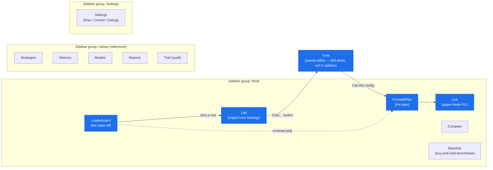
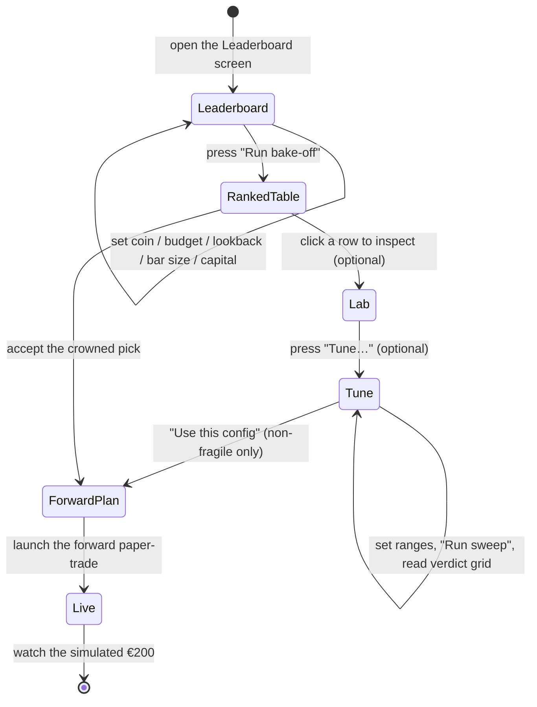

# Cockpit User Manual

> **What this is.** The operator manual for the **cockpit** — the native desktop
> app that drives the **Single-Coin Investment Advisor (paper)**: pick a coin +
> €200, bake off every strategy, rank them under a frozen robustness gate
> (buy-and-hold is always the benchmark), get a forward plan, and watch it
> paper-trade the simulated €200.
>
> **PAPER / SIM ONLY — no live trading, no real orders; the €200 is simulated.
> Not financial advice.** The cockpit is built around an honest thesis: across
> every channel tested, **no active strategy robustly beat just holding** — so
> the most common, expected result is *"just hold,"* and the UI says so plainly.

This manual is task-oriented. If you want the product rationale read
[`README.md`](../README.md) and [`spec/product.md`](../spec/product.md); if you
want to know what's built read [`CHANGELOG.md`](../CHANGELOG.md). Here we cover
**how to drive the screens**.

---

## 1. Getting started

### 1.1 Prerequisites

| Requirement | Notes |
|---|---|
| **Rust stable, edition 2024** | The whole workspace builds on stable. |
| **A terminal you own** | The cockpit is a **native GUI** — a real window opens on your desktop. You launch it from *your own* terminal; it is **not** a web app or dev-server, and there is no URL to visit. |
| **Network** (real-data cockpit only) | The `--features live` build fetches real Binance hourly data. The bake-off and the Tune sweep both read a **local Binance cache** populated from that data. No network / empty cache → those screens show an explanatory error, never a crash. |
| **LLM keys** (optional) | Only the optional "Explain / why this one" narration and other LLM paths need keys. Copy `config/agent.toml.local.example` → `config/agent.toml.local` and add your key, then set `[llm] enabled = true` in `config/agent.toml`. Everything in the advisor journey works **without** keys. |

### 1.2 Build & run

There are **two** cockpit binaries. Use the right one for the job, and **always
build in `--release`** (see [§ 6 Troubleshooting](#6-troubleshooting) for why —
there's a measured ~40× debug rasterization tax).

**A. Real-data cockpit (`cockpit_live`)** — the one you want for the advisor
journey. Fetches real Binance data; needs network.

```bash
cargo run -p ui --release --bin cockpit_live --features live
# …or run the prebuilt binary after a build:
./target/release/cockpit_live
```

**B. Fixtures cockpit (`cockpit`)** — no network, deterministic demo data. Good
for a quick look at the layout, screenshots, or a checkout with no Binance cache.

```bash
cargo build -p ui --bin cockpit --features fixtures
./target/debug/cockpit
```

> The standalone `cockpit` bin is **fixtures-only by design**. Asking for
> `cargo run --bin cockpit --features live` fails at the Cargo level with a
> "target requires the features: fixtures" message that points you back to
> `cockpit_live`. Don't fight it — that's the guard working.

### 1.3 What opens

A single desktop window with a **left sidebar** of screens and a content area on
the right. **Both binaries boot onto the `Live` screen.** The advisor journey
starts one click away on **Leaderboard** (see [§ 3](#3-the-guided-journey--step-by-step)).

---

## 2. The cockpit at a glance

### 2.1 The sidebar

The left sidebar is the only navigation. Screens are grouped by a thin hairline
divider into **Work**, **Library**, and **Settings**. Click a name to switch;
the cockpit is a single-window instrument, so there is no back button or tabs —
you always know where you are by the highlighted sidebar entry.

The screens you'll actually use for the advisor journey live in **Work**
(Leaderboard → ForwardPlan → Live). **Tune** is special: it is **not** in the
sidebar — you reach it by drilling down from the Lab (see step 4). The Library
and Settings screens are reference / engineering surfaces you can ignore for a
normal session.

### 2.2 All 19 screens

| Screen | Group | What it's for |
|---|---|---|
| **Lab** | Work | Inspect ONE strategy on a chart — price candles, **buy/sell triangles**, a per-bar **volume** strip, an open-position mirror. Has the **"Tune…"** entry button. (Boot default route in the enum.) |
| **Live** | Work | The forward **paper-trade P/L**: equity curve, KPI strip, fills tape, positions. Carries the paper-only / not-advice disclaimer. *Boot screen for both binaries.* |
| **Compare** | Work | Side-by-side matrix of saved runs / committed reports. |
| **Baseline** | Work | The passive **buy-and-hold** result (equity curve + drawdown + KPI strip, 2023/2024 toggle) — the benchmark everything is measured against. |
| **Leaderboard** | Work | **The bake-off.** Guided input (coin + budget + lookback + bar size + start capital) → **Run bake-off** → the ranked table with the crown, FRAGILE tags, and the recommendation. *Journey step 1.* |
| **ForwardPlan** | Work | **The conditional buy/sell plan** for the crowned (or promoted) pick: current stance, IF/THEN rules, projected €200 sizing, horizon, disclaimers. *Journey step 4.* |
| **Strategies** | Library | The strategy registry / per-strategy config detail. |
| **Memory** | Library | Reflection "lesson cards" — what past decisions taught the agent. |
| **Models** | Library | The model/checkpoint registry (family + status). |
| **Reports** | Library | Browse + render committed backtest reports (`spec/*/reports/backtest-*.md`). |
| **Trail** | Library | The audit journal / double-entry ledger trail (list + node drill-down). |
| **Settings** | Settings | Rollup of **Risk**, **Control**, **Debug** as three tabs. |
| **Tune** | *(drill-down)* | **The gate-tied hyperparameter sweep editor.** Pick a family (SMA/MACD/RSI/Bollinger) + param ranges → **Run sweep** → a verdict grid; promote a robust config. *Journey step 4b. Reached from the Lab's "Tune…" button, not the sidebar.* |
| **Home** | *(alias)* | Deprecated alias → routes to **Live**. |
| **Charts** | *(alias)* | Deprecated alias → routes to **Lab**. |
| **Audit** | *(alias)* | Deprecated alias → routes to **Trail**. |
| **Risk** | *(alias)* | Deprecated alias → opens **Settings ▸ Risk**. |
| **Debug** | *(alias)* | Deprecated alias → opens **Settings ▸ Debug**. |
| **Control** | *(alias)* | Deprecated alias → opens **Settings ▸ Control** (the mode toggle + the typed-confirm **kill switch**). |

The four deprecated aliases (Home/Charts/Audit/Risk/Debug/Control) still resolve
so older links keep working, but their content now lives under the successor
screen named above.

### 2.3 Screen-navigation map

The advisor journey is the highlighted path. Everything outside it is reference
/ engineering and can be skipped for a normal session.



**Journey screens:** Leaderboard, Lab, Tune, ForwardPlan, Live.
**Engineering / diagnostic screens** (consult only if you want the internals):
Trail (audit ledger), Settings ▸ Debug (latency / market health / logs),
Settings ▸ Control (kill switch), and to a lesser extent Compare / Reports.

---

## 3. The guided journey — step by step

This is the main how-to. Run `cockpit_live` (real data) and follow along. The
whole loop is: **Leaderboard → (Lab) → (Tune) → ForwardPlan → Live**. The Lab
and Tune steps are optional inspection / power-user detours; the minimum path is
Leaderboard → ForwardPlan → Live.



### Step 1 — Run a bake-off (screen: **Leaderboard**)

1. Click **Leaderboard** in the sidebar (Work group).
2. In the **"Plan your bake-off"** input panel, set:
   - **Coin** — pick a coin chip (defaults to **BTCUSDT**).
   - **Budget** — your €200 (defaults to `200`). This is the simulated paper
     budget; it carries forward to the plan and the Live view. *Note: the
     **ranking** itself is budget-independent — budget changes sizing, not which
     strategy wins.*
   - **Lookback** — the historical window to test over (e.g. **2024 H1**).
   - **Bar size** — **H1 / H4 / D1** (1-hour / 4-hour / daily candles). This
     **does** change the result, and the UI says so.
   - **Start capital** — the engine's working capital for the simulation.
3. Press **Run bake-off** (top-right of the screen).
4. A **determinate progress bar** appears beneath the input panel: *"Running
   `<strategy>` — N of <total>"*. It puts **~13 strategies plus the buy-and-hold
   benchmark** head-to-head, each on the same seed (apples-to-apples), each
   scored through the **frozen robustness gate** (1000-path bootstrap resampling).
5. When it finishes, the **ranked table** lands below.

### Step 2 — Read the ranked table (screen: **Leaderboard**)

The table is **best-first**. For each strategy you'll see its in-sample
**return**, **Sharpe**, and **max drawdown**, plus a **robustness label**.

- **The crown** marks the winning row — the best strategy that **also cleared
  the robustness bar**.
- **FRAGILE tag** — a row flagged **fragile** is *overfit under resampling*: it
  looked good in-sample but fell apart when the gate resampled the path. **A
  fragile row can never be crowned.** (See [§ 4](#4-reading-the-honesty-signals).)
- **Buy-and-hold benchmark** — always present as a labelled reference row ("just
  holding"). It is the line every active strategy must beat. (Its own
  path-dependence is noted as *"baseline is path-dependent"* rather than as a
  promotion-blocking FRAGILE flag — it's the yardstick, not a contestant.)
- **The recommendation headline** — a plain-language verdict rendered above /
  with the table, e.g. *"<strategy> cleared the bar"*, or the very common
  **"No active strategy cleared the robustness bar on this window"** — i.e.
  **just hold**. That modal "just hold" outcome is a *legitimate, expected*
  result, not a failure of the tool.
- **"Why this one" / Explain** — an optional **Explain** control generates a
  short LLM narration of the ranking (needs an LLM key; falls back silently to
  the templated copy if unavailable). The structured reason codes show
  regardless.
- A **persistent disclaimer** sits on the surface: *"Not financial advice.
  Results are simulated on historical data and do not predict future
  performance. Past returns are not a guarantee."*

### Step 3 — Inspect a pick in the Lab (screen: **Lab**, optional)

1. **Click a row** in the ranked table to open it in the **Lab**.
2. The Lab shows that one strategy on a price chart:
   - **Candles** for the selected coin/window.
   - **Buy/sell triangles** — green/up = buy, red/down = sell — anchored on the
     bars where the strategy fired.
   - A **per-bar volume histogram** strip directly beneath the chart, each bar
     aligned under its candle.
   - A status strip with cumulative window-volume tiles and an open-position
     mirror.
3. Use the pair-chip row to flip between symbols if you want to eyeball others.

### Step 4 — Tune a strategy's parameters (screen: **Tune**, power-user, optional)

1. From the Lab, press the quiet **"Tune…"** button on the run row. This opens
   the **Tune** sweep editor, preseeded with the strategy's family and coin.
   (Tune is **only** reachable this way — it's not in the sidebar.)
2. **Pick a family**: **SMA**, **MACD**, **RSI**, or **Bollinger**.
3. **Set the parameter ranges.** Each family exposes `{min, max, step}` axes
   (e.g. SMA fast / slow windows; MACD fast / slow / signal; RSI period /
   oversold; Bollinger period + a multi-select of `k` presets). One-click
   **Narrow / Shipped / Wide** presets fill sensible ranges. A live **grid-size
   readout** tells you how many configs the cartesian product will run (and warns
   if it would be truncated to the cap).
4. Press **Run sweep**. A determinate progress bar tracks it; **every** config is
   scored through the **same frozen robustness gate** the bake-off uses.
5. Read the **verdict grid** — one row per swept config, showing its params, its
   **robustness verdict** (Robust / Marginal / **Fragile**), in-sample return &
   Sharpe, and the gate's five distribution signals (Sharpe **p5 / p50 / p95**,
   **P(loss)**, **P(Sharpe > 1)**, **Max-DD p95**). The grid also pins:
   - the **shipped-default row** (the divergence anchor — "is your tuned config
     actually different / better?"),
   - the **buy-and-hold strip** ("vs just holding"),
   - a **truncation banner** if the grid was capped,
   - and a permanent **honesty footer**: *"Tuning is paper/sim research, not
     advice. A config that looks great in-sample but is flagged fragile is
     overfit… a tuned config is only worth carrying forward if it is robust AND
     beats just holding."*

   **The FRAGILE lock:** a fragile row's **"Use this config"** button is
   **disabled** and reads **"Fragile — locked"**, with an inline note: *"Fragile
   under resampling — promoting it would be overfitting."* You **cannot** promote
   an overfit config. This is by design.

6. **Promote a robust config.** On a **non-fragile** row, press the enabled
   **"Use this config"**. The cockpit records the promotion and **navigates you
   to ForwardPlan**, which flips to a brief "resolving rules" spinner while the
   tuned plan is built.

### Step 5 — Read the forward plan (screen: **ForwardPlan**)

Whether you arrived by accepting the crowned pick or by promoting a tuned config,
the **ForwardPlan** screen shows the **conditional decision plan** — *rules, not
a forecast*:

- A **dated current-stance badge** (FLAT / LONG) as of the last bar.
- The standing **IF/THEN entry/exit rules** the strategy will follow.
- The **budget-aware €200 next-BUY sizing** "at the last close".
- The **"planned through <date>"** horizon.
- If you got here by **promotion**, a provenance note: *"You tuned this
  `<family>` config (`<params>`). It survived resampling on `<window>` — that is
  **not a guarantee**, and **not advice**. Paper-trading your €200."*
- The standing disclaimers: *"This is a conditional, rule-based plan — not a
  price prediction…"* and *"Not financial advice. The €200 is a simulated paper
  budget… no real orders are placed."*

### Step 6 — Launch & watch the paper-trade (screen: **Live**)

1. Launch the forward run from the plan, then open **Live** (Work group).
2. The Live screen shows the **forward paper-trade P/L**:
   - the running **equity curve** of your simulated €200,
   - a **KPI strip** (return, drawdown, trades, …),
   - the **fills tape** (each simulated buy/sell) and the **positions** panel.
3. A caption confirms it's running on a **simulated budget**, and the persistent
   disclaimer reads: *"Simulated paper budget. Not financial advice. This is not
   a real trade."*

That's the loop. The honest expectation: more often than not the bake-off
crowns nothing and the recommendation is **just hold** — in which case the most
faithful thing the cockpit can do is tell you so.

---

## 4. Reading the honesty signals

The cockpit is deliberately built to resist over-confidence. Four signals carry
that weight:

- **FRAGILE = overfit under resampling.** The robustness gate resamples each
  strategy's return path 1000×. A config that wins in-sample but **falls apart
  under resampling** is *fragile* — it fit to noise. Fragile is shown with a
  **word** (not just a colour), is **prominently flagged**, and **cannot be
  crowned or promoted**.
- **"Just hold" is a valid — and expected — answer.** The whole research program
  concluded *ship passive*: no active strategy robustly beat buy-and-hold net of
  cost. So when the recommendation says **"No active strategy cleared the
  robustness bar on this window,"** that is the tool being honest, not broken.
  Buy-and-hold is always present as the benchmark for exactly this reason.
- **The promotion lock.** "Use this config" is **disabled and labelled
  "Fragile — locked"** on every fragile Tune row. You can only carry a config
  forward if it is **robust** (and, per the footer, only worth it if it also
  **beats just holding**).
- **Not-advice + paper-only, everywhere it matters.** The Leaderboard, the
  ForwardPlan, and the Live screen each carry a standing **not-financial-advice +
  simulated-paper-budget** disclaimer. A promoted plan additionally says it
  "survived resampling on THIS window — not a guarantee, not advice." Nothing
  here is a prediction, and the €200 is never real money.

---

## 5. What the cockpit does NOT do

- **No live trading. No real orders. No real money.** The €200 is **simulated**
  on historical (and, in the live build, fetched-but-replayed) data — no order
  ever reaches an exchange. Live execution was removed from scope and is not
  wired.
- **One coin at a time.** The advisor is a *single-coin* tool: you pick one coin
  per bake-off. There is no portfolio optimizer here.
- **Not financial advice.** It is a research / decision-support instrument. The
  output is "what these rules would have done," not "what you should do."

---

## 6. Troubleshooting

**No window opens / "nothing happens."**
The cockpit is a **native desktop GUI**, not a web server — there is no URL and
no localhost port. Run it from **your own terminal** so the window can attach to
your display:
`cargo run -p ui --release --bin cockpit_live --features live`. On a remote /
headless box a GUI window cannot appear; run it on your local machine.

**"target requires the features: fixtures" when I run `cockpit`.**
You asked for `--bin cockpit --features live`. That path is intentionally
retired. Use the unified real-data binary instead:
`cargo run -p ui --release --bin cockpit_live --features live`. For the
no-network demo use `--bin cockpit --features fixtures`.

**Run bake-off / Run sweep shows an error or "no data."**
Both read the **local Binance cache**. If you built **without `--features live`**
(so no fetcher), or there's **no network** and the cache is empty / missing the
chosen window, the screen lands an **explanatory error** (it never crashes or
goes blank). Fixes: build with `--features live` and ensure network access so the
hourly corpus is available, or use the **fixtures cockpit** to explore the layout
with demo data. Try a lookback window the corpus actually covers (e.g. 2023–24).

**Everything is sluggish (1–3 s per click).**
You're running a **debug** build. The cockpit renders through a CPU rasterizer
(chosen for deterministic snapshot tests), and at the dev opt-level a single
Lab/Charts frame takes **~700 ms** vs **~17 ms** in release — a measured **~40×
debug tax**. **Run in `--release`** (`cargo run -p ui --release --bin
cockpit_live --features live`). Release is the canonical, fast path.

**The "Explain / why this one" narration didn't appear.**
That's the one LLM-backed affordance. Without an LLM key (or if it errors / runs
over budget) it **falls back silently** to the templated copy — the ranking,
reasons, and verdicts are unaffected. Add a key via
`config/agent.toml.local` and set `[llm] enabled = true` to enable it.

**I want to inspect the engine internals.**
Use the diagnostic screens: **Trail** for the double-entry audit ledger,
**Settings ▸ Debug** for latency / market-health / server-time / logs, and
**Settings ▸ Control** for the mode toggle and the typed-confirm kill switch.
None of these are needed for the advisor journey.

---

*Paper / simulated research tool. Not financial advice. The €200 is never real
money, and no order is ever placed.*
