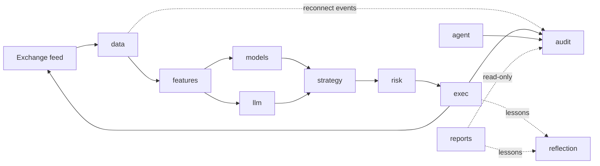

# Data flow

End-to-end data flow from exchange feed through strategy to audit ledger,
plus the crate-dependency rules that make the audit invariant
(Σ debits == Σ credits) provable from a single crate's source.

## Flow diagram



## Crate dependency edges (runtime, non-test)

The arrows above are message / data flow. The Rust crate-graph
edges are a superset of those plus a few read-only sinks. Each
edge below is a `[dependencies]` line in some crate's `Cargo.toml`
and exists for one explicit reason:

- `data → audit` — the Binance reconnect handler calls
  `audit::journal::feed_reconnect` to journal feed-disconnect /
  reconnect events into the `strategy_events` table. Added in
  Wave 1 / T805 alongside the v1+ operator-success-reports
  feature. The reverse edge (`audit → data`) does not exist;
  audit is a pure sink.
- `exec → audit` — `post_fill` writes balance-affecting journal
  entries on every paper / live fill (existing v0 edge).
- `agent → audit` — kill-switch trips, uptime open / heartbeat /
  close intervals, strategy registry mutations all journal via
  `audit::journal::*` writers (v0 + v1+ additions).
- `reports → {trading_core, audit, data, cost}` — read-only
  consumers; no reverse edges (`crates/reports/` is leaf in the
  graph). v1+ addition.
- `exec → reflection` — write edge. The `ReflectionWriterTap`
  at `crates/exec/src/paper.rs:40` records per-fill outcome
  facets (slippage, latency, post-fill drift) into the
  reflection-memory store so the next session's prompt builder
  can re-inject them. See T1807-Q8 for the architectural
  rationale; `reflection` is a sink for `exec` the same way
  `audit` is.
- `reports → reflection` — read-only edge. Reports rendering
  pulls cross-session lessons from the reflection store to
  annotate operator-success reports with "what we learned
  last session" footnotes. No reverse edge; `reflection`
  knows nothing about `reports`.
- `reflection → audit (via AuditTick stream)` — read-only edge.
  At v0.1.0 the `reflection` crate already lists `audit` under
  `[dependencies]` (existing edge — used by the
  `ReflectionWriter` mpsc tap path). The audit-tick consumer
  envelope (see
  [`spec/audit-tick-consumer-envelope/decomp.md`](../v1/audit-tick-consumer-envelope/decomp.md))
  re-uses this edge symmetrically: `reflection` subscribes to a
  `broadcast::Receiver<AuditTick<AuditEvent>>` exposed by
  `audit::tick::AuditTickStream`. The new
  `ReflectionAuditTickConsumer` is observation-only at v0.1.0;
  the existing mpsc-tap write path stays unchanged (R4.2). No
  reverse edge; `audit` continues to import nothing from
  sibling crates.
- `forecast → audit (via AuditTick emit, feature-gated)` —
  optional write edge, **gated behind the `audit-tick` cargo
  feature** on the `forecast` crate (default off). Enabled by
  the agent and unified-cockpit bins so the `TcnForecaster`
  can emit `AuditEvent::ForecastEmitted` ticks on cache-hit
  and post-inference. Training bins (`train_tcn`,
  `forecast_distribution`) do NOT enable this feature — they
  have no `Ledger`. See
  [`spec/audit-tick-consumer-envelope/decomp.md §5A`](../v1/audit-tick-consumer-envelope/decomp.md).
  No reverse edge.
- `ui → {trading_core, audit}` — read-only consumer of
  `audit::query` for the cockpit's live-view widgets; no reverse
  edge (audit knows nothing about UI).
- `ui → agent` (load-bearing under `--features live`) — the
  unified `cockpit_live` bin imports `agent` to call
  `agent::runtime::run(RunHandles, CancellationToken)` on a
  side-thread tokio runtime; constructs the shared
  `Arc<EventBus>` and `Arc<KillSwitch>` once and clones them
  into both the `RunHandles` and the `Cockpit` model. The same
  edge gates the iced `ui::live::subscription` against the real
  bus. Live-cockpit-unified (2026-05-01) made this a
  load-bearing edge — pre-feature it existed only for
  `cockpit --features live` (now retired). No reverse edge
  (`agent → ui` would be a cycle).
- Every crate depends on `trading_core` for shared domain types
  (`Symbol`, `Money<C>`, `FillView`, `JournalEntryView`,
  `StrategyEventView`, `FundingObs`, …); `trading_core` itself
  depends only on stdlib + `rust_decimal` + `time` + `smol_str`
  (no reverse edges).

The single rule: **audit imports nothing from sibling crates**
— the `audit` crate's `[dependencies]` lists only `trading_core`
(for shared domain types) plus third-party libs (`sqlx`,
`rust_decimal`, `time`, …). Sibling crates (`data`, `exec`,
`agent`, `reports`, `ui`, …) freely write into the ledger by
importing `audit` and calling `audit::journal::*` /
`audit::query::*` — those are inbound edges to `audit`, which
the edge table above documents row-by-row (`data → audit`,
`exec → audit`, `agent → audit`, `reports → audit` read-only,
`ui → audit` read-only, `reflection → audit` read-only via
`AuditTickStream`, `forecast → audit` write under
`audit-tick` feature). The forbidden direction is the reverse:
`audit` does not import any sibling crate, so the reconciler
invariant (Σ debits == Σ credits) is provable from `audit`'s
source alone without crossing a crate boundary.

## Public API surface — bin-shared agent runtime (live-cockpit-unified)

When the `live-cockpit-unified` feature lands the `agent` crate
exposes a small public surface so the `trading` headless bin and
the `cockpit_live` unified bin can share one task-spawn loop:

```rust
// crates/agent/src/runtime.rs

pub struct RunHandles {
    pub config: Arc<crate::config::Config>,
    pub ledger: Arc<audit::Ledger>,
    pub bus: Arc<crate::EventBus>,
    pub kill_switch: Arc<crate::KillSwitch>,
    pub registry: Arc<strategy::StrategyRegistry>,
    pub boot_id: String,
}

pub async fn run(
    handles: RunHandles,
    cancel: tokio_util::sync::CancellationToken,
) -> anyhow::Result<()>;

pub async fn shutdown_writer(
    ledger: Arc<audit::Ledger>,
    boot_id: &str,
);
```

Caller responsibilities (both bins):
1. construct `RunHandles` (config + ledger + bus + kill_switch +
   registry + boot_id) before calling;
2. call `audit::journal::open_uptime_interval` before `run`;
3. install a Ctrl-C handler that calls `cancel.cancel()`;
4. after `run` returns Ok(), call `shutdown_writer` exactly once
   (it issues the T806 close-uptime row).

The `cockpit_live` bin additionally hosts the `tokio::runtime::Runtime`
on a side `std::thread::spawn`, runs iced on the main thread, and
threads the same `Arc<EventBus>` / `Arc<KillSwitch>` into the iced
`Cockpit` model so the cockpit's `Message::KillConfirmed` arm calls
`KillSwitch::trip(HaltReason::ManualOperator)` on the *same*
kill switch the agent owns (closes the analyst-flagged
trip-button-no-op gap). T809 dual-write is preserved by sticky-trip
semantics in `KillSwitch::trip`.

The headless `trading` bin uses the same `agent::runtime::run`
verbatim — it just runs everything on a `#[tokio::main]` runtime
and doesn't open a window.

**Bus producer wiring (live-cockpit-unified):** the `EventBus`
publisher API was always present (`crates/agent/src/bus.rs`
lines 116–166); but pre-feature, only the strategy watcher called
into it. The unified-binary feature wires three additional
producers:
- `crates/exec/src/paper.rs::PaperEngine` publishes `fills` +
  `positions` after each post_fill (via a new
  `exec::publisher::FillPublisher` trait — keeps the
  `exec → agent` cycle open by abstracting the bus type).
- `crates/agent/src/runtime.rs` runs two `tap` tasks that
  republish each `Bar` and `Tick` from the data feed into
  `bus.publish_bar` / `bus.publish_tick`.
- `crates/agent/src/reconciler.rs::ReconcilerTask::after_bar_close`
  publishes `pnl`.
- A new `mode-broadcast forwarder` task in `agent::runtime::run`
  bridges `KillSwitch::subscribe()` → `bus.publish_mode(...)` so
  the cockpit's halted banner lights up after any trip path
  (file watch, cockpit button, heartbeat timeout).

The bus + kill_switch shapes are unchanged — only the producer
side gained call sites.

## Public API surface — open-positions reader (real-mtm-unrealized-pnl)

Added 2026-05-02 as part of the
[real-mtm-unrealized-pnl](../v1/real-mtm-unrealized-pnl/feature.md)
plumbing feature. Closes the
`crates/reports/src/lib.rs:135–150` `let unrealized: Decimal =
Decimal::ZERO;` placeholder.

```rust
// crates/core/src/position.rs (NEW)
#[derive(Debug, Clone, PartialEq, Eq)]
pub struct OpenPosition {
    pub symbol:         Symbol,
    pub qty:            Decimal,            // > 0 (long-only at v1+)
    pub avg_cost_basis: Money<Usdt>,        // PER-UNIT cost, not notional
    pub opened_at:      Timestamp,
    pub strategy_id:    Option<StrategyId>, // T802 column; None pre-T802
}

// crates/audit/src/query.rs (additive)
pub async fn open_positions_at(
    ledger: &Ledger,
    ts:     Timestamp,
) -> Result<Vec<OpenPosition>, LedgerError>;
```

`OpenPosition` lives in `trading_core` for cross-crate reach:
`audit::query` produces it; `crates/reports/` consumes it; the
post-T903c cockpit positions widget will likely consume it next.
The reader parses the symbol from
`journal_transactions.description` via the existing private
`extract_symbol_from_description` helper at
`crates/audit/src/query.rs:512` — same parser `pnl_by_symbol`
and `recent_fills` use. **No SQL migration in this feature**
(Q3); a conditional follow-up `006_open_positions_index.sql`
ships only if the V8 perf gate (<100ms on 100 fills + 5 open
positions) fails.

Sort key: `(symbol ASC, strategy_id ASC, None last)` for
byte-identical re-reads (R6). Long-only at v1+; net-negative qty
raises `LedgerError::Database` (Q8 — short positions bundled
into a future v2+ wave).

## Audit migration list — current

| # | File | Purpose |
|---|------|---------|
| 001 | `001_chart_of_accounts.sql` | Tables `accounts`, `journal_transactions`, `journal_entries`; `idx_entries_{account,ts,txn}`. |
| 002 | `002_strategy_events.sql` | `strategy_events` table (v0.5 Q1). |
| 003 | `003_funding_rates.sql` | `funding_rates` table (v1 Q2). |
| 004 | `004_journal_transactions_strategy_id.sql` | T802: nullable `strategy_id TEXT` column on `journal_transactions` + `journal_transactions_sid_idx`. |
| 005 | `005_uptime_intervals.sql` | T805/806: `agent_uptime` table for boot/heartbeat/close intervals. |
| 006 | `006_per_symbol_position_accounts.sql` | T1101 (per-symbol-position-accounts R1): purely additive `INSERT OR IGNORE` of one `assets:position:<SYMBOL>` row per pair-symbol in `config/agent.toml [funding].universe` (10 symbols). No schema change. Reclaims the `006` slot (the real-mtm `006_open_positions_index.sql` was conditional on V8 perf-gate failure; gate PASSED at 0.287ms vs 100ms, so the index migration never landed). |
| 007 | `007_strategy_events_venue.sql` | T1402 (v1.5b multi-venue Q11): purely additive `ALTER TABLE strategy_events ADD COLUMN venue TEXT;` (NULLABLE, no default). Pre-migration rows have `venue = NULL`; readers handle `Option<Venue>` semantics. Writer signature change at `crates/audit/src/journal.rs:648` — `feed_reconnect(ledger, symbol, venue, ts)` gains required `venue: Venue`. `kill_switch_tripped` writer gains optional `venue: Option<Venue>` (R8.3). Architect's principled override of analyst's R8.2 recommendation (encode-in-`error_summary`) — the typed column wins because v1.5b is the load-bearing introduction of the `Venue` type, and audit is the boundary where typed attribution matters most. |

The real-mtm R10 follow-up (the hardcoded `assets:position:BTC`
account-id at `crates/audit/src/journal.rs:82,135` — every fill
regardless of symbol writing to the BTC bucket) is **resolved**
by [per-symbol-position-accounts → Design](../v1/per-symbol-position-accounts/feature.md#design)
(architect 2026-05-03): migration `006` seeds per-pair
`assets:position:<SYMBOL>` rows; T1102 flips the `post_fill` writer
to `format!("assets:position:{}", fill.symbol)`. Description-parse
in `audit::query::open_positions_at` / `pnl_by_symbol` /
`recent_fills` stays as the primary symbol source (legacy-row
compat); a defensive `account_id` cross-check warns on mismatch.
`bootstrap::seed_universe_accounts` is marked `#[deprecated]`
(shape mismatch — takes base assets, not pair symbols). Anchor
budget unchanged (11 / 11 byte-identical, Q7 re-verified).

## Backtest real-Binance-data path (v2.6.0-realdata)

Added 2026-05-18 as part of the
[backtest-real-binance-data](../v1/backtest-real-binance-data/feature.md)
feature. Full design in
[ADR-0032](../../_bmad-output/planning-artifacts/architecture/decisions/0032-backtest-realdata-path-and-revision-pin.md).

For the four new `top10-*-fy-tcn-overlay[-weights]-realdata`
scenarios, the `backtest` binary reads real Binance hourly OHLCV
from `data/binance/<SYM>/<YEAR>/<MM>.parquet` instead of generating
synthetic GBM bars. The read path lives in a new private module
`crates/backtest/src/realdata.rs` (cargo feature `realdata`,
default off) and **reuses** the existing
`data::ReplayFeed::merge_symbols()` parquet reader — no new
cross-crate dependency and no duplicated polars code. The data axis
is encoded on the `Scenario` struct via a new orthogonal
`ScenarioDataSource::{Synthetic, RealData}` enum so the synthetic
path stays byte-identical (existing 15 anchors).

Every `-realdata` run is bound to a data revision by
`data/binance/REVISION.toml` — a sorted (filename → SHA-256) map
plus an aggregate `sha256` over that map. The aggregate
`data_revision_sha` lands in two places:
- **Report frontmatter** (forensics, excluded from anchor body
  hash): `data_revision_sha: <64 hex>` next to `generated:` and
  `wall_clock_s:`.
- **Report body** (anchor integrity, covered by body hash): a new
  `## Data source` section between `## Universe` and `## Notes`
  with `Revision SHA`, expected-vs-loaded bar counts, span, and
  bar interval.

`crates/data/src/bin/fetch_binance_klines` gains a
`--emit-revision-manifest` flag; the verifier in
`backtest::realdata::RealDataBarSource::load()` enforces three
gates in order: (1) `REVISION.toml` exists; (2) every parquet file
the scenario will read has a matching on-disk SHA; (3) the
aggregate SHA recomputed from the manifest's `[files]` map equals
the manifest's claimed `[revision].sha256`. The `data_revision_sha`
written into the report body is always the recomputed aggregate,
never the manifest's claim. Missing-bar tolerance (R3): the
scenario hard-fails if fewer than 99.5% of expected bars are
present across the universe.

The data edge table above is unchanged — `backtest → data` is an
existing read edge (`ReplayFeed`). The new dependency is on `toml`
+ `sha2` (already in workspace) for the manifest read / verify
path. No `backtest → forecast` edge is added (alternatives
considered in ADR-0032).

## Changelog
- 2026-05-18 (architect): added "Backtest real-Binance-data path
  (v2.6.0-realdata)" subsection — cross-references ADR-0032 for
  the full design. The `data → backtest` edge gains the new
  `realdata` cargo-feature-gated callsite; no new crate-graph
  edges (uses existing `backtest → data` read edge via
  `ReplayFeed::merge_symbols`). Closes
  `backtest-real-binance-data` T-AR-1 architecture-section
  deliverable.
- 2026-05-16 (architect): D1 audit-sink rule reworded to use the
  inverse-import direction ("audit imports nothing from sibling
  crates") — the prior "audit is a sink, zero outgoing runtime
  deps" wording contradicted the edge table, which explicitly
  documents the inbound `data → audit`, `exec → audit`,
  `agent → audit`, `reports → audit`, `ui → audit` writes. The
  edge table is unchanged; only the summary rule prose moved.
  D3 added two previously-undocumented edges to the edge table
  and the mermaid diagram: `exec → reflection` (write — the
  `ReflectionWriterTap` at `crates/exec/src/paper.rs:40`, see
  T1807-Q8) and `reports → reflection` (read — used during
  report rendering).
- 2026-05-13 (architect): content migrated from
  `spec/architecture.md` lines 251–457 during Phase 1A Session 2.
  Two link rewrites applied: `features/real-mtm-unrealized-pnl.md`
  → `../real-mtm-unrealized-pnl/feature.md` and
  `features/per-symbol-position-accounts.md` →
  `../per-symbol-position-accounts/feature.md` (post-folder-migration
  paths). Otherwise content-identical.
