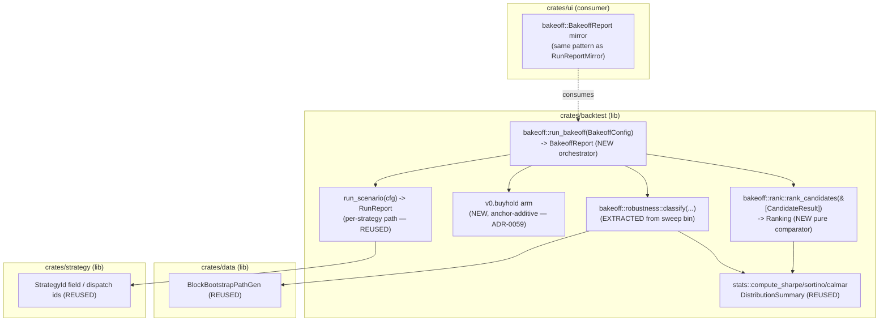

# Advisor Bake-off + Ranking (roadmap F1 + F2)

## Why

(Pulled from [`../product.md`](../../product.md) — the 2026-06-19 single-coin
investment-advisor pivot. Journey steps 2 + 3.)

The product answers one question: *"I have €200 for one coin (say XRPUSDT) —
which strategy should I use?"* The **bake-off + ranking** is the heart of that
answer and the first/core feature:

1. **Bake off** *every* available strategy on one `(coin, lookback)` — the rule
   engines (SMA / MACD / RSI / Bollinger), cross-sectional momentum, the
   mean-reversion pairs arm, plus the optional ML/regime arms — each backtested
   on the **same** `(coin, window)`, with **passive buy-and-hold always in the
   field as the benchmark arm**.
2. **Rank & select** the single best strategy by **risk-adjusted return
   (Sharpe)** with a **robustness gate** (a FRAGILE strategy — p5 Sharpe < 0
   under block-bootstrap resampling — is shown but cannot be crowned #1 unless
   *every* candidate is fragile), and produce a plain-language **"why this
   one."**

This is a **re-framing of the shipped engine, not a new build.** The bake-off
is a *loop over the existing per-strategy backtest path* (`backtest::run_scenario`,
the path the Lab runner already drives) across the strategy field; the ranking
inputs (`stats::compute_sharpe/sortino/calmar`, `BacktestKpis.total_return_pct` /
`max_drawdown`) and the robustness distribution (`stats::DistributionSummary`
+ the block-bootstrap path generator) already exist. **No new backtest math, no
new strategy.**

The honesty constraints from the product (§ Why this is honest) are
load-bearing here, not decoration:
- **Buy-and-hold is always a candidate.** If it wins, the recommendation says
  so plainly ("for XRPUSDT over this window, nothing beat simply holding").
- **The robustness machine is the credibility layer.** A strategy that wins on
  one backtest path but is FRAGILE under resampling is flagged, not silently
  crowned.

Operator-ratified decisions this design implements (product § D1, D3, D5):
rank by Sharpe + robustness gate (D1); **single** best strategy for the MVP,
mixes / LLM-ensemble deferred to v0.2 but **not precluded** (D3); paper-only
(D5). The forward plan / sizing / Live wiring (F3+) and the guided input UX are
**separate features** — this one ends at *"a ranked leaderboard + a crowned
pick + a structured why."*

## Requirements

(Analyst-owned scope; architect restating the slice this feature delivers.)

- **R1 — Bake-off orchestration.** Given `(symbol, lookback_window, seed)`, run
  every enabled strategy in the field **plus buy-and-hold** on that exact
  `(symbol, window)` via the existing backtest path, and collect a per-candidate
  result (id, KPIs, equity curve, robustness flag).
- **R2 — Ranking + recommendation.** From the per-candidate results, produce a
  **deterministic** ranked leaderboard, a single **crowned** pick under the
  Sharpe-primary + robustness-gate + buy-and-hold-as-benchmark comparator, and
  a **structured "why this one"** the UI can render as plain language.
- **R3 — UI consumes the result through a sanctioned seam.** The cockpit reads
  the bake-off result type the **same way it already reads `run_scenario`'s
  `RunReport`** — `ui` MUST NOT gain a dependency on `strategy` / `exec` /
  `forecast` / `llm`.
- **R4 — Determinism + reproducibility.** A fixed `(symbol, window, seed)`
  produces a byte-stable ranked order. Seed + window + per-candidate KPIs are
  recorded.
- **R5 — Paper-only, no anchor perturbation.** The bake-off *reads* the engine;
  the 119/119 anchored backtest body-SHAs stay byte-identical. (The one engine
  touch — a buy-and-hold `run_scenario` arm — is anchor-additive; see Design
  § 4 + ADR-0059.)
- **R6 — Honesty surfacing.** The recommendation distinguishes (a) an active
  strategy won, (b) buy-and-hold won, (c) everything is FRAGILE ("nothing here
  is robust — consider just holding").

## Design

### 0. Summary

| Decision | Choice | Rationale |
|---|---|---|
| Orchestrator crate home | **`crates/backtest`** (new `bakeoff` module) | Already owns `run_scenario`, `stats`, and depends on `data` (bootstrap gen) + `strategy`. `ui` *already* imports `backtest` → result type is consumable through the existing seam with **zero** new UI dep. |
| Bake-off result type | **`BakeoffReport { candidates: Vec<CandidateResult>, ranked: Vec<usize>, crowned: Option<usize>, rationale: Recommendation }`** in `backtest::bakeoff` | Public seam, mirrors the `RunReport` precedent the UI already mirrors. |
| Ranking comparator | **Sharpe-primary, robustness-gated, BH-as-benchmark**; deterministic total order | Implements operator D1; pure fn over `CandidateResult`, unit-testable. |
| Buy-and-hold candidate | **New `"v0.buyhold"` `run_scenario` arm** (anchor-additive), reusing the extracted `run_buyhold_path` | BH today lives only in a `bin` + a read-only example; promoting it to a `run_scenario` arm makes the bake-off loop uniform (every candidate is a `run_scenario` call). ADR-0059. |
| Robustness gate source | **Extract `run_buyhold_path` + `classify_verdict` + `ParamRobustnessVerdict` from `bin/param_robustness_sweep.rs` into `backtest` lib** | They are bin-private today; the bake-off needs them in the library. Pure move, behaviour-preserving. |
| Lookback | **Reuse `backtest::engine::DateRange`** (named presets + `Custom { start_ms, end_ms }`); 2 weeks…4 years → `Custom` | No new range machinery; the existing `date_range_to_scenario_params` clamp already handles spans. |

### 1. Where it lives + the boundary



**Crate home = `crates/backtest`.** Verified against the dependency graph:

- `backtest`'s `Cargo.toml` already depends on `trading_core`, `data`,
  `strategy`, `llm`, `audit`, `exec`. It already exposes `run_scenario`,
  `stats::*`, and the `report/*` writers. Everything the orchestrator needs is
  in-crate or a direct dep.
- **`ui`'s `Cargo.toml` already has `backtest = { path = "../backtest" }`** and
  consumes `backtest::engine::run_scenario` / `RunReport` from
  `crates/ui/src/lab/runner.rs`. It does **not** depend on `strategy` / `exec`
  / `forecast` (those are not in `ui`'s dep list). Putting the orchestrator in
  `backtest` lets the cockpit read `BakeoffReport` through the **identical**
  sanctioned seam — **no new `ui` dependency, invariant preserved by
  construction.**
- **Why NOT `agent`?** `agent` also has the deps, but `ui` lists `agent` only
  as `optional`/dev. Homing the orchestrator in `agent` would force the cockpit
  to take a hard `agent` dependency to read the result type — strictly worse for
  the layering than `backtest`, which `ui` already imports.

The orchestrator is **`async`** (it awaits `run_scenario`, which is `async fn`)
and **cancel/progress-aware** by threading the existing
`cancel::CancellationToken` + `progress::ProgressSender` it already passes to
`run_scenario`. This makes the bake-off cancellable from the cockpit exactly
like a Lab run.

### 2. The bake-off loop

```text
run_bakeoff(BakeoffConfig { symbol, range, seed, field, robustness })
  for each StrategyId in field  (∪ "v0.buyhold"):
      cfg = ScenarioConfig {
          strategy: id,
          pair: (Venue::Binance, symbol),
          range: range.clone(),
          seed,                              // SAME seed for every arm
          data_source: BinanceCache,         // real-data path
          write_report: false,               // bake-off does not write anchored reports
          ..ScenarioConfig::default_*()
      }
      report = run_scenario(cfg, cancel.clone(), progress.child(id)).await?
      kpis   = derive_candidate_kpis(&report)          // Sharpe/Sortino/Calmar from equity_series
      flag   = robustness.evaluate(&report, seed)      // optional; FRAGILE / ROBUST / SKIPPED
      candidates.push(CandidateResult { id, kpis, equity, flag })
  ranking = rank::rank_candidates(&candidates)         // deterministic
  BakeoffReport { candidates, ranked: ranking.order, crowned: ranking.crowned, rationale }
```

**Field selection.** The default field is the set of `run_scenario` dispatch
ids that run cleanly on a single `(coin, window)` on real Binance data:
`v0.sma`, `v0.5.macd`, `v0.5.rsi`, `v0.5.bbands`, plus `v0.buyhold` (the
benchmark, always present). The cross-sectional arms (`v1.momentum`,
`v1.5a.pairs`) and ML overlays (`v2.5.tcn*`) are **opt-in** for v0.1.0 — they
need a multi-symbol universe and/or model checkpoints, not a single
`(coin, window)`. `BakeoffConfig.field` is an explicit `Vec<StrategyId>` with a
`default_field()` constructor so the field is a config knob, not a hard-code,
and adding an arm later is additive. (See § 4 for the single-symbol-vs-universe
boundary and Open question OQ-1.)

**Equity-curve handling.** `RunReport.equity_series: Vec<(Timestamp, Money<Usdt>)>`.
The stats fns take `&[Decimal]`, so `derive_candidate_kpis` maps
`equity_series.iter().map(|(_, m)| m.get()).collect::<Vec<Decimal>>()` once and
feeds `compute_sharpe_hourly` / `compute_sortino_hourly` / `compute_calmar`.
`total_return` + `max_drawdown` come straight off `report.kpis`
(`total_return_pct`, `max_drawdown`). **No new math.**

> **Annualisation note (load-bearing).** `compute_sharpe_hourly` bakes the 1h
> bar cadence (√8575). The MVP bake-off runs the real **hourly** Binance corpus,
> so `_hourly` is correct. If a future bake-off coarsens cadence (4h/daily), it
> MUST switch to `compute_*_periodic(equity, periods_per_year)` per
> ADR-0051 § D6.8 — do NOT feed coarse bars to the `_hourly` fns (silent ~2-5×
> Sharpe inflation). For v0.1.0 the field is hourly-only; the comparator reads
> one consistently-annualised Sharpe across all arms.

### 3. The bake-off result type (the public seam)

In `crates/backtest/src/bakeoff/mod.rs`:

```rust
/// One strategy's outcome in the bake-off (the leaderboard row).
#[derive(Debug, Clone)]
pub struct CandidateResult {
    /// The strategy id, e.g. StrategyId("v0.sma") or StrategyId("v0.buyhold").
    pub strategy: StrategyId,
    /// True for the buy-and-hold benchmark arm (drives "BH won" honesty copy).
    pub is_benchmark: bool,
    /// Risk-adjusted + raw KPIs, all from the existing stats layer.
    pub kpis: CandidateKpis,
    /// Ordered oldest-first equity curve (from RunReport.equity_series), for
    /// the UI to draw the per-candidate sparkline. Decimal, USDT.
    pub equity_curve: Vec<(Timestamp, Money<Usdt>)>,
    /// Robustness read (None when the gate was not run for this candidate).
    pub robustness: Option<RobustnessFlag>,
}

/// The ranking inputs — every field already computable from RunReport.
#[derive(Debug, Clone, Copy)]
pub struct CandidateKpis {
    pub sharpe: f64,                 // compute_sharpe_hourly(equity)
    pub sortino: f64,                // compute_sortino_hourly(equity)
    pub calmar: f64,                 // compute_calmar(equity)
    pub total_return_pct: Decimal,   // RunReport.kpis.total_return_pct
    pub max_drawdown: Decimal,       // RunReport.kpis.max_drawdown
    pub trade_count: usize,          // RunReport.kpis.trade_count
}

/// Robustness verdict for one candidate (re-exported from the extracted
/// classifier; the FRAGILE band is p5 Sharpe < 0 per ParamRobustness D-clauses).
#[derive(Debug, Clone, Copy, PartialEq, Eq)]
pub enum RobustnessFlag {
    Robust,
    Marginal,
    Fragile,
    /// Gate intentionally not run (e.g. robustness disabled for a fast bake-off).
    Skipped,
}

/// The ranked output + the crowned pick + structured "why this one".
#[derive(Debug, Clone)]
pub struct BakeoffReport {
    /// Inputs, echoed for reproducibility (symbol, range, seed, field).
    pub request: BakeoffRequest,
    /// Per-candidate results, in *insertion* order (stable, = field order).
    pub candidates: Vec<CandidateResult>,
    /// Indices into `candidates`, best-first, per the ranking comparator.
    pub ranked: Vec<usize>,
    /// Index of the crowned pick (None only if there are zero candidates).
    pub crowned: Option<usize>,
    /// Structured, render-ready rationale (the UI turns this into plain text;
    /// no LLM needed for the MVP "why" — the LLM narration is an optional
    /// later polish per product § D3 / LLM role).
    pub rationale: Recommendation,
}

/// Structured rationale — the UI renders this as plain language; deterministic.
#[derive(Debug, Clone)]
pub struct Recommendation {
    /// Which honesty branch fired (drives the headline sentence).
    pub outcome: RecommendationOutcome,
    /// The crowned strategy id (== candidates[crowned].strategy).
    pub winner: StrategyId,
    /// The benchmark's KPIs, so the UI can always say "vs just holding…".
    pub benchmark_kpis: CandidateKpis,
    /// The winner's KPIs.
    pub winner_kpis: CandidateKpis,
    /// The winner's robustness flag (echoed for the "…and it's robust/fragile" clause).
    pub winner_robustness: Option<RobustnessFlag>,
    /// Machine-readable reason codes the UI maps to copy (ordered, deterministic).
    pub reasons: Vec<ReasonCode>,
}

#[derive(Debug, Clone, Copy, PartialEq, Eq)]
pub enum RecommendationOutcome {
    /// An active strategy was crowned and beat the benchmark.
    ActiveWins,
    /// Buy-and-hold was crowned ("nothing beat simply holding").
    BenchmarkWins,
    /// Every candidate is FRAGILE — crowned-by-Sharpe but flagged
    /// ("nothing here is robust — consider just holding").
    AllFragile,
}

#[derive(Debug, Clone, Copy, PartialEq, Eq)]
pub enum ReasonCode {
    HighestRobustSharpe,     // crowned on Sharpe among non-fragile arms
    BeatBenchmarkSharpe,     // winner Sharpe > benchmark Sharpe
    BenchmarkUndefeated,     // no active arm beat BH
    AllCandidatesFragile,    // robustness gate found nothing robust
    TieBrokenByReturn,       // Sharpe tie → higher total_return won
    TieBrokenByDrawdown,     // Sharpe + return tie → lower max_drawdown won
}
```

`BakeoffRequest` echoes `{ symbol, range: DateRange, seed: [u8;32],
field: Vec<StrategyId> }`. The whole `BakeoffReport` is `Clone` so the UI can
mirror it (the `RunReportMirror` precedent in `crates/ui/src/lab/runner.rs`).
The UI mirror keeps only what it renders (the leaderboard rows + the rationale),
exactly as `RunSummary` keeps a subset of `RunReport`.

**Why structured, not a pre-rendered string:** the rationale is a *data* type so
(a) it is deterministic + unit-testable (no prose drift breaking a snapshot),
(b) the UI owns the copy/disclaimer wording (product requires a not-advice
disclaimer on every recommendation surface — that lives in `ui`, not the
engine), and (c) the optional LLM "why this one" narration (product § D3, v0.2)
becomes an *additive* layer that consumes `Recommendation` rather than a rewrite.

### 4. The buy-and-hold candidate + anchor safety (ADR-0059)

Buy-and-hold is **not** a `run_scenario` arm today — it exists only as
`run_buyhold_path` in `crates/backtest/src/bin/param_robustness_sweep.rs` and a
read-only example. To make the bake-off loop uniform (every candidate is one
`run_scenario` call, every candidate gets a real equity curve through the same
code path), this feature adds a **`"v0.buyhold"` dispatch arm** to
`run_scenario`, reusing the **extracted** `run_buyhold_path` (equal-weight —
for a single coin that is 100% of budget — buy at bar-0 close, hold, mark to
market). This is **anchor-additive**:

- New `match` arm on a new id — every existing arm is byte-untouched.
- `write_report = false` in the bake-off → no report file is written, so no
  `spec/*/reports/` body is created or perturbed.
- The 119 anchored reports are emitted by the existing arms with their existing
  ids; a *new* id cannot collide with an existing anchored body. **Gate:
  `scripts/verify_anchors.sh` → 119/119 byte-identical, run before the first
  seam and after the arm lands** (the standing anchor-additivity discipline).

The robustness classifier (`classify_verdict` + `ParamRobustnessVerdict` +
the `P5_SHARPE_FRAGILE = 0.0` constant) and `run_buyhold_path` are **moved**
from the sweep `bin` into the `backtest` library (`bakeoff::robustness` +
`bakeoff::buyhold` or `stats`), re-exported, and the `bin` updated to call the
moved items. This is a behaviour-preserving relocation; the sweep bin's output
is byte-identical because the logic is identical. ADR-0059 records the move +
the new arm + the anchor-additive proof obligation.

### 5. Lookback → date-range machinery

No new range type. `BakeoffConfig.range: backtest::engine::DateRange`, which
already carries `Last30d`, `Last90d`, `H1_2024`, `H2_2024`, and
`Custom { start_ms, end_ms }`. The product's "2 weeks … ~4 years" window maps
onto `Custom` with epoch-millis bounds computed by the (future) guided-input
UX; the named presets cover the common cases. `run_scenario` already expands the
range internally (`date_range_to_scenario_params` for synthetic, the real-data
loader for `BinanceCache`), so the bake-off passes the **same `range` to every
arm** and inherits the existing expansion + the existing 1-year `Custom` clamp.

> **Lookback-vs-data caveat (OQ-2).** The pinned Binance corpus is 2023–24 hourly
> (`3a8b96c4`) + a 2021–22 bear corpus (`4f390622`). A `Custom` window only
> returns data where the corpus has it. A "last 4 years to *today*" request will
> only resolve over the corpus coverage; the guided-input feature (separate)
> owns clamping the user's window to available data and labelling it. For the
> bake-off itself, the window is whatever `run_scenario` resolves — the
> orchestrator does not second-guess it.

### 6. F2 ranking contract

The ranking is a **pure, total, deterministic** comparator over
`&[CandidateResult]`, in `crates/backtest/src/bakeoff/rank.rs`:

```rust
/// Result of ranking: best-first order + the crowned index + reason trail.
pub struct Ranking {
    pub order: Vec<usize>,        // indices into the input, best-first
    pub crowned: Option<usize>,   // the recommendation (None iff input empty)
    pub reasons: Vec<ReasonCode>, // why `crowned` won (deterministic)
}

pub fn rank_candidates(candidates: &[CandidateResult]) -> Ranking;
```

**The comparator (the exact rule):**

Each candidate has a **robustness tier**: `Fragile` is the bottom tier; `Robust`,
`Marginal`, `Skipped`, and `None` are all the **eligible** tier (a candidate is
*ineligible to be crowned* iff its flag is `Fragile`). Then, for two candidates
`a` and `b`, `a` ranks **ahead of** `b` when:

1. **Robustness gate (primary partition).** Eligible (non-Fragile) ranks ahead
   of Fragile. *Within the same eligibility tier*, fall through to (2).
2. **Sharpe (primary metric), descending.** Higher `kpis.sharpe` ranks ahead.
   (`f64::total_cmp` for a total order — NaN-free by `DistributionSummary`'s
   NaN-absent guarantee, but `total_cmp` is used defensively so the sort is a
   true total order regardless.)
3. **Tie-break 1 — total return, descending.** Higher `total_return_pct`
   (`Decimal::cmp`, exact). Emits `ReasonCode::TieBrokenByReturn` when it
   decides the crown.
4. **Tie-break 2 — max drawdown, ascending.** Lower `max_drawdown`
   (`Decimal::cmp`, exact, smaller is better). Emits
   `ReasonCode::TieBrokenByDrawdown` when it decides the crown.
5. **Tie-break 3 — strategy id, lexicographic ascending.** Final determinism
   backstop so the order is total even for two byte-identical-KPI candidates
   (e.g. `v0.buyhold` vs a strategy that degenerated to holding). Never
   user-visible as a "reason"; purely to make the sort reproducible.

**Crowning + the honesty branches** (after sorting best-first):

- The **crowned** index is `order[0]` — the best candidate under the comparator.
  Because the comparator puts all non-Fragile ahead of all Fragile, the crown is
  a Fragile candidate **iff every candidate is Fragile**.
- `RecommendationOutcome`:
  - **`AllFragile`** — `crowned` is Fragile (⇒ all are). Reason:
    `AllCandidatesFragile`. UI copy: *"nothing here is robust — consider just
    holding."* (The crown still exists — highest-Sharpe — but the surface leads
    with the fragility warning.)
  - **`BenchmarkWins`** — `crowned` is the `is_benchmark` (buy-and-hold) arm.
    Reason: `BenchmarkUndefeated`. UI copy: *"for `<SYM>` over this window,
    nothing beat simply holding."*
  - **`ActiveWins`** — `crowned` is a non-benchmark, non-Fragile arm. Reasons:
    `HighestRobustSharpe` + (`BeatBenchmarkSharpe` if winner Sharpe > the
    benchmark arm's Sharpe). UI copy: *"`<id>` ranked best by Sharpe and beat
    just-holding."*

**Buy-and-hold is a normal candidate in the comparator** — it is ranked by the
same Sharpe/return/drawdown rule as everything else, *not* special-cased into or
out of the crown. It only gets special *copy* (the `BenchmarkWins` branch) when
it happens to win. This is the operator's "BH is always a candidate; if it wins,
say so plainly" decision implemented literally.

**Determinism guarantees:**
- The input order is the field order (stable). The sort is total (5 strict
  tie-breaks ending in lexicographic id). `f64::total_cmp` + `Decimal::cmp` are
  platform-independent. ⇒ same `(symbol, window, seed, field)` ⇒ byte-identical
  `Ranking`.
- The comparator does **no** floating-point arithmetic — it only *compares*
  pre-computed metrics. No new f64 boundary is introduced (the f64 boundary is
  entirely inside the already-anchored `stats` layer).

### 7. Verification approach (for the developer)

1. **Deterministic bake-off (day-1 e2e, real data).** Run `run_bakeoff` over a
   fixed `(XRPUSDT or BTCUSDT, a fixed window, LAB_DEFAULT_SEED)` on the pinned
   Binance corpus **twice**; assert the two `BakeoffReport`s have an identical
   `ranked` order, identical `crowned`, and identical `rationale.reasons`. This
   is the headline gate — it proves the loop + the comparator are reproducible
   end to end. (Marked `#[ignore]` if it needs `--features realdata`; the gate
   runs it explicitly.)
2. **Ranking comparator unit tests (pure, no I/O):**
   - **Sharpe-primary**: three synthetic `CandidateResult`s with distinct
     Sharpes → order is Sharpe-descending; crown = highest.
   - **Robustness gate**: a high-Sharpe **Fragile** candidate vs a lower-Sharpe
     **Robust** candidate → the Robust one is crowned; the Fragile one is in the
     leaderboard but below; `outcome != AllFragile`.
   - **Buy-and-hold wins**: BH has the highest (eligible) Sharpe → `crowned` is
     the benchmark, `outcome == BenchmarkWins`, reason `BenchmarkUndefeated`.
   - **All fragile**: every candidate Fragile → `outcome == AllFragile`, reason
     `AllCandidatesFragile`, crown = highest-Sharpe-overall.
   - **Tie-breaks**: equal Sharpe → higher return wins (`TieBrokenByReturn`);
     equal Sharpe + return → lower drawdown wins (`TieBrokenByDrawdown`); fully
     equal KPIs → lexicographic id (stable, total order).
3. **Anchor gate**: `scripts/verify_anchors.sh` → **119/119 byte-identical**,
   run before the `v0.buyhold` arm lands and after. `git diff` on the existing
   anchored report dirs is empty. (The `v0.buyhold` arm is anchor-additive; the
   sweep-bin relocation is behaviour-preserving.)
4. **Buy-and-hold arm parity**: a test asserting the new `"v0.buyhold"`
   `run_scenario` arm produces an equity curve byte-identical to
   `run_buyhold_path` on the same bars (the extraction is a pure move).
5. **UI seam (separate ui-designer/dev surface, named here for the handoff):**
   the cockpit mirrors `BakeoffReport` exactly as it mirrors `RunReport`
   (`RunReportMirror` precedent) — verified at the render layer per the cockpit
   render-verification rule when the leaderboard screen is built. **Not in scope
   for this feature's backend tasks** beyond keeping the type `Clone` + `ui`-dep-free.

> **CLAUDE.md baseline-equity-divergence gate — applicability.** That gate
> targets a *strategy overlay or sizing-modifier* that could silently no-op.
> The bake-off + ranking is **read-only over the engine** — it runs existing
> strategies unmodified and *compares* their outputs; it introduces no overlay
> and no sizing modifier. So the day-1 ≥1bp-divergence e2e is **N/A here** — the
> equivalent day-1 gate is verification step 1 (deterministic ranked order over
> a fixed input) + step 2 (the robustness-gate + BH-wins comparator cases). The
> divergence gate **does** bind the *later* budget-aware-sizing feature (F4),
> which is out of this feature's scope.

## F2 ranking contract (normative, lift-out)

This section is the single normative statement of the ranking, restated so it
can be cited directly (the developer implements exactly this; the tester
asserts exactly this).

> **Eligibility.** A candidate is *ineligible to be crowned* iff
> `robustness == Some(Fragile)`. All other flags (`Robust`, `Marginal`,
> `Skipped`, `None`) are eligible.
>
> **Order (best-first), strict total order:**
> 1. eligible before ineligible;
> 2. then Sharpe descending (`f64::total_cmp`);
> 3. then `total_return_pct` descending (`Decimal`);
> 4. then `max_drawdown` ascending (`Decimal`);
> 5. then `strategy` id lexicographic ascending (determinism backstop).
>
> **Crown** = `order[0]`. The crown is Fragile iff *all* candidates are Fragile.
>
> **Outcome:**
> - `AllFragile` iff crown is Fragile;
> - else `BenchmarkWins` iff crown `is_benchmark`;
> - else `ActiveWins`.
>
> **Buy-and-hold** is always present (`is_benchmark = true`), ranked by the same
> rule as every other candidate, special-cased only in *copy* when it wins.
>
> **Determinism:** pure function of `&[CandidateResult]`; no f64 arithmetic;
> platform-independent comparisons; identical input ⇒ identical `Ranking`.

## Reuse map (exact)

| Need | Existing item | Location | New? |
|---|---|---|---|
| Per-strategy backtest | `run_scenario(cfg, cancel, progress) -> Result<RunReport, RunError>` | `backtest::engine` | reuse |
| Run config | `ScenarioConfig` (`strategy`, `pair`, `range`, `seed`, `data_source`, `write_report`) | `backtest::engine` | reuse |
| Run output | `RunReport { equity_series, fills, kpis, … }` | `backtest::engine` | reuse |
| Return + drawdown | `BacktestKpis.total_return_pct`, `.max_drawdown`, `.trade_count` | `backtest::engine` | reuse |
| Sharpe/Sortino/Calmar | `compute_sharpe_hourly`, `compute_sortino_hourly`, `compute_calmar` (`&[Decimal] -> f64`) | `backtest::stats` | reuse |
| Robustness distribution | `DistributionSummary::from_path_metrics`, `MetricDistribution { p5, p50, p95 }`, `prob_loss` | `backtest::stats` | reuse |
| Block-bootstrap paths | `data::BlockBootstrapPathGen::new`, `BlockLengthPolicy::Auto` | `data::synth::bootstrap` | reuse |
| FRAGILE classifier | `classify_verdict`, `ParamRobustnessVerdict`, `P5_SHARPE_FRAGILE = 0.0` | `bin/param_robustness_sweep.rs` → **move to `backtest` lib** | extract (move) |
| BH equity curve | `run_buyhold_path(bars, capital, n_symbols)` | `bin/param_robustness_sweep.rs` → **move to `backtest` lib** | extract (move) |
| Date range | `DateRange` (presets + `Custom`) | `backtest::engine` | reuse |
| Strategy ids / field | `StrategyId(SmolStr)`, the `run_scenario` dispatch arm strings | `core::symbol` / `backtest::engine` | reuse |
| Cancel / progress | `cancel::CancellationToken`, `progress::ProgressSender` | `backtest::cancel` / `backtest::progress` | reuse |
| UI mirror precedent | `RunReportMirror` / `RunSummary` | `crates/ui/src/lab/runner.rs` | reuse (pattern) |
| **Bake-off orchestrator** | `bakeoff::run_bakeoff(BakeoffConfig) -> BakeoffReport` | `backtest::bakeoff` | **NEW** |
| **Result type** | `BakeoffReport`, `CandidateResult`, `CandidateKpis`, `Recommendation` | `backtest::bakeoff` | **NEW** |
| **Ranking comparator** | `rank_candidates(&[CandidateResult]) -> Ranking` | `backtest::bakeoff::rank` | **NEW** |
| **Buy-and-hold arm** | `"v0.buyhold"` dispatch arm | `backtest::engine::run_scenario` | **NEW (anchor-additive)** |

The net-new code is: one orchestrator module (the loop), one result type, one
pure comparator, one `run_scenario` arm, and the **relocation** (not rewrite) of
two bin-private items into the library. **No new backtest math; no new strategy.**

## Open questions (operator / analyst)

- **OQ-1 (field default — needs analyst, not a blocker).** v0.1.0 default field =
  the 4 single-symbol rule engines + buy-and-hold. The cross-sectional
  (`v1.momentum`, `v1.5a.pairs`) and ML (`v2.5.tcn*`) arms need a multi-symbol
  universe / a checkpoint and so are **opt-in**, not default, for a single-coin
  bake-off. Confirm that the MVP leaderboard over {SMA, MACD, RSI, BBands, B&H}
  is the intended "every available strategy" for the single-coin journey, or
  whether the cross-sectional arms must appear (and if so, how a single coin
  feeds a cross-sectional ranker — that is a genuine scope question the product
  pivot did not pin).
- **OQ-2 (robustness cost — needs operator ratification).** The full FRAGILE
  gate runs an N-path block bootstrap **per candidate**. At N≈200 over ~5
  candidates that is the same order as one robustness-sweep cell (~minutes), so
  a bake-off is **not** instant. Two honest options the operator should pick
  between: **(a)** run the gate at a reduced N (e.g. 100) inside the interactive
  bake-off, full N as an opt-in "deep check"; **(b)** make the gate opt-in
  entirely (`RobustnessFlag::Skipped` by default, a "check robustness" button).
  The ranking is *correct* either way (Skipped is eligible); this only affects
  interactive latency. Recommended: **(a)** reduced-N inline so the crown is
  robustness-aware by default without a multi-minute wait — but this is an
  operator latency/credibility tradeoff, so I am flagging rather than deciding.

## Implementation

Completed 2026-06-19 (developer). All M-DEV-0 through M-DEV-5 tasks completed;
M-TEST T6.1–T6.9 left for tester.

**Files created:**
- `crates/backtest/src/bakeoff/mod.rs` — `BakeoffReport`, `CandidateResult`,
  `CandidateKpis`, `BakeoffRequest`, `BakeoffConfig`, `RobustnessMode`,
  `Recommendation`, `RecommendationOutcome`, `ReasonCode`, `derive_candidate_kpis`,
  `run_bakeoff`. F1 orchestrator loop + type seam.
- `crates/backtest/src/bakeoff/buyhold.rs` — `run_buyhold_path` extracted from
  sweep bin (behaviour-preserving relocation).
- `crates/backtest/src/bakeoff/robustness.rs` — `RobustnessFlag`,
  `ParamRobustnessVerdict`, `verdict_bands`, `classify_verdict` extracted from
  sweep bin (behaviour-preserving relocation). 5 unit tests.
- `crates/backtest/src/bakeoff/rank.rs` — `rank_candidates`, `Ranking` pure F2
  comparator. 12 unit tests covering all ranking branches + tie-breaks.
- `crates/backtest/tests/bakeoff_e2e.rs` — T2.2 arm-parity test (passes) +
  T6.1 `#[ignore]` real-data determinism test.

**Files modified:**
- `crates/backtest/src/lib.rs` — `pub mod bakeoff` + bakeoff type re-exports.
- `crates/backtest/src/engine.rs` — `"v0.buyhold"` dispatch arm (anchor-additive;
  119/119 verified before and after).
- `crates/backtest/src/cancel.rs` — `RunCancelReceiver::sibling()` method.
- `crates/backtest/src/bin/param_robustness_sweep.rs` — `run_buyhold_path` and
  `classify_verdict` replaced with thin delegates to the library.

**Gates at handoff:**
- `cargo test -p backtest` → 103 lib + integration tests, 0 fail, 5 ignored.
- `cargo clippy -p backtest -- -D warnings` → 0 warnings.
- `cargo fmt -p backtest --check` → clean.
- `scripts/verify_anchors.sh` → 119/119 PASS.
- `cargo tree -p ui` → 1839 lines (unchanged; no new dep edges).

## UI

(ui-designer — the cockpit LEADERBOARD screen that renders the `BakeoffReport`,
single-coin investment-advisor journey step 3: *rank & pick best*. Shipped
2026-06-20.)

### Wireframe

```text
┌─ Strategy bake-off ─────────────────────────────────────────────────────────┐
│ Every strategy backtested on the same coin and window…       [ Run bake-off ]│
├──────────────────────────────────────────────────────────────────────────────┤
│ Recommendation                                                                │
│   v0.sma is the best risk-adjusted pick.            ← headline FROM Recommendation
│   · Highest Sharpe among the strategies that held up under resampling.        │
│   · Beat buy-and-hold on risk-adjusted return.       ← reasons as sub-copy     │
├──────────────────────────────────────────────────────────────────────────────┤
│  #  Strategy              Return    Sharpe   Max drawdown   Trades             │
│  1  v0.sma  ★ best        +18.37%   1.4200   −6.12%         38   ← ACCENT row   │
│  2  v0.5.macd             +9.21%    0.8800   −10.43%        64                  │
│  3  v0.buyhold benchmark  +11.24%   0.7300   −13.38%        2    ← benchmark    │
│  4  v0.5.bbands           +3.88%    0.5400   −9.21%         47                  │
│  5  v0.5.rsi  fragile     −4.57%    −0.3100  −18.72%        112  ← warn tag     │
├──────────────────────────────────────────────────────────────────────────────┤
│ Not financial advice. Results are simulated on historical data…  (persistent) │
└──────────────────────────────────────────────────────────────────────────────┘
```

Empty (cold) → "press Run bake-off" prompt; Loading → spinner + "running…";
Error → `LEADERBOARD_ERROR_PREFIX` + the engine detail + disclaimer. The result
lives behind `PanelState<BakeoffReportMirror>` (no blank screen — all four arms
covered).

### New screens / panels / widgets

- **Screen `Screen::Leaderboard`** (Work sidebar group, after `Baseline`;
  navigable, not default-routed). Body: `crate::screens::leaderboard::view`.
- No new reusable widget — the screen reuses `frame::panel` (recommendation
  block), `frame::active_row` (the 2 px `ACCENT` crowned-row rule),
  `frame::loading_with_spinner`, and the `num::*` formatters
  (`fmt_pct_signed` / `format_pct_max_dd` / `format_sharpe` / `format_count`).
  The ranked table is a `Column` of `Row`s (the Reports/audit precedent, not a
  `Grid` — the table has one wide strategy column + fixed-width right-aligned
  numeric columns).
- **State `LeaderboardScreenState`** + the engine→ui **mirror**
  `BakeoffReportMirror` / `LeaderRow` / `RecommendationMirror` (closed UI-side
  enums `OutcomeKind` / `ReasonLabel` / `RobustnessLabel`). The mirror is the
  INVARIANT seam: `backtest::BakeoffReport` is read **only** in
  `BakeoffReportMirror::from_report`, at the dispatch boundary, so `view` never
  threads an engine type and `ui` holds no `strategy`/`exec`/`forecast`/`llm`
  type.
- **Trigger** `leaderboard::runner::spawn_bakeoff` — async-dispatch
  `backtest::run_bakeoff` mirroring `lab::runner::spawn_lab_run`. Default config
  (`default_bakeoff_config`): BTCUSDT / `DateRange::H1_2024` / `BinanceCache` /
  `RobustnessMode::Skip`, field = the 4 rule engines (buy-and-hold appended by
  the loop). Wired binary-side in `cockpit_live.rs` (the `LabRunRequested`
  intercept precedent; the in-flight cancel handle is held on `AppState` so it
  outlives the run — the F4 lifetime fix). The full guided coin/budget input is
  the next feature (F3).
- **Messages** `BakeoffRunRequested` (niladic; pure-state begins Loading) +
  `BakeoffRunCompleted(BakeoffRunResult)` (lands `Ready`/`Empty`/`Error`). Both
  typed — no `String` catch-all.

### New strings (`crate::strings`, all registered in `all()`)

Sidebar/header: `LEADERBOARD_SIDEBAR_LABEL`, `LEADERBOARD_HEADLINE`,
`LEADERBOARD_CAPTION`. Action/state: `LEADERBOARD_RUN_BUTTON`,
`LEADERBOARD_RUN_BUTTON_RUNNING`, `LEADERBOARD_EMPTY_PROMPT`,
`LEADERBOARD_LOADING`, `LEADERBOARD_ERROR_PREFIX`, `LEADERBOARD_RUN_NEEDS_LIVE`.
Table headers: `LEADERBOARD_COL_RANK` / `_STRATEGY` / `_RETURN` / `_SHARPE` /
`_MAX_DD` / `_TRADES`. Row tags: `LEADERBOARD_BENCHMARK_TAG`,
`LEADERBOARD_CROWN_TAG` (★ best), `LEADERBOARD_FRAGILE_TAG`,
`LEADERBOARD_ROBUST_TAG`, `LEADERBOARD_MARGINAL_TAG`. Recommendation headlines
(rendered FROM `RecommendationOutcome`): `LEADERBOARD_HEADLINE_BENCHMARK_WINS`
(`{coin}`), `LEADERBOARD_HEADLINE_ACTIVE_WINS` (`{winner}`),
`LEADERBOARD_HEADLINE_ALL_FRAGILE`. Reasons (from `ReasonCode`):
`LEADERBOARD_REASON_HIGHEST_ROBUST_SHARPE` / `_BEAT_BENCHMARK_SHARPE` /
`_BENCHMARK_UNDEFEATED` / `_ALL_FRAGILE` / `_TIE_RETURN` / `_TIE_DRAWDOWN`.
Recommendation chrome + winner clauses + disclaimer:
`LEADERBOARD_RECOMMENDATION_TITLE`, `LEADERBOARD_WINNER_ROBUST_CLAUSE`,
`LEADERBOARD_WINNER_FRAGILE_CLAUSE`, `LEADERBOARD_DISCLAIMER` (the persistent
not-advice + simulated-results line, product § D5).

### New theme tokens

**Zero.** The screen uses only existing tokens (`ACCENT` crowned-row +
`★ best`, `UP_500`/`DOWN_500` sentiment, `WARN_500` fragile tag, `FG_1/2/3`,
`PANEL`/`PANEL_RAISED`/`BORDER_1`, `FG_ON_ACCENT` on the button, the `space::*`
4/8/12/16/24 scale, the `text::*` MICRO/SMALL/BODY/H1/H2/H3 ladder, `radius::R3/R4`).

### Accessibility notes

- **Keyboard:** every interactive element (the sidebar nav row, the Run button)
  is an iced `Button` with a typed `on_press` — keyboard-focusable/activatable.
  The Run button drops its `on_press` while a run is in flight (disabled).
- **Colour is never the only signal:** the crowned row carries the `★ best`
  *word-bearing* tag (not just `ACCENT` colour) + the 2 px accent left-rule
  (shape); the benchmark row carries the `benchmark` word; the fragile row
  carries the `fragile` word alongside `WARN_500`. P&L colour (`UP_500`/
  `DOWN_500`) is paired with the explicit `+`/`−` sign.
- **Contrast:** all tokens are the theme's verified-contrast set (the
  `tests/contrast.rs` gate covers the token palette); no inline colour.
- **Numbers are scannable:** Return / Sharpe / Max drawdown / Trades columns are
  right-aligned with thousands separators (`format_count`); colour limited to
  `pos`/`neg`/`warn`.

### Render-layer verification (the operator's #1 sensitivity)

`crates/ui/tests/leaderboard_populated_render.rs` (macOS-gated `iced_test::
screenshot`): renders the REAL `screens::leaderboard::view` with a POPULATED
`BakeoffReportMirror` fixture and asserts on the rendered PIXELS that the ranked
rows + the crowned `ACCENT` highlight + the `DOWN_500` numeric column + the
recommendation paint — with a NEGATIVE CONTROL (`PanelState::Empty` → no
crowned-row teal, no clay column, far less foreground) and a `BenchmarkWins`
headline render. PNGs written to `/tmp/leaderboard_*_render.png` and eyeballed.
4/4 green; the whole-suite stays green and `cargo tree -p ui` is unchanged
(1841 lines — no new dep edge).

## UI — F3 guided input (coin + budget + lookback)

(ui-designer — the guided "new investment" input atop the Leaderboard, the entry
point to the whole journey: product § journey step 1 *pick a coin + a budget
over a configurable lookback*. Shipped 2026-06-20. Replaces the v0.1.0 hardcoded
BTCUSDT / H1_2024 default — the operator now chooses.)

### Wireframe

```text
┌─ Strategy bake-off ─────────────────────────────────────────────────[ Run ]──┐
├─ Plan your bake-off ──────────────────────────────────────────────────────────┤
│ Coin                                                                          │
│ [XRPUSDT] [ETHUSDT] [BTCUSDT★] [ADAUSDT] [AVAXUSDT] [BNBUSDT] [DOGEUSDT] …     │  ← coin chips (active = SOLID ACCENT)
│ Budget          Lookback                                                      │
│ [ 200 ]         [2 weeks] [1 month] [3 months] [6 months] [1 year] … [H1★] …  │  ← lookback chips
│ €200 ≈ 200 USDT — FX not modelled.                                            │  ← budget hint (product § D4)
├──────────────────────────────────────────────────────────────────────────────┤
│ Ranking strategies for €200 in BTCUSDT.            ← budget-context header     │
├──────────────────────────────────────────────────────────────────────────────┤
│ … (the recommendation + ranked table, unchanged from v0.1.0) …                │
└──────────────────────────────────────────────────────────────────────────────┘
```

The form is **always present** (Empty + Loading + Error + Ready) — it is the
journey entry point, so it is visible before any run. The Empty-state prompt
copy reflects the live selection ("…rank every strategy on {coin} over
{lookback}").

### New screens / panels / widgets

- **New widget `crate::widgets::bakeoff_input`** — the titled `frame::panel`
  "Plan your bake-off" holding the coin-chip row + the budget `text_input` + the
  lookback-chip row + the FX hint. The chip is the `pair_chip` shape (a
  `Container` + transparent `button`), but the active chip uses the **SOLID
  `ACCENT` fill + `FG_ON_ACCENT` text** (the source-toggle / Run-button "selected"
  treatment) so the chosen coin/lookback pops and reads beyond colour
  (accessibility) — and renders detectably at the pixel layer. Public
  `lookback_copy(LeaderboardLookback) -> &'static str` so the screen header reuses
  the SAME chip copy (single source for the window name).
- **Budget-context header** (`screens::leaderboard::budget_context_line`) — an
  `H3`/`FG_2` line "Ranking strategies for €200 in {coin}." When the budget is
  blank/unparseable the budget clause drops but the coin is still named (the
  line never goes empty).
- **State on `LeaderboardScreenState`**: `coin: Symbol` (default BTCUSDT),
  `budget_input: String` (raw keystrokes; default "200"),
  `lookback: LeaderboardLookback` (default `H1_2024`). Plus `budget_eur() ->
  Option<Decimal>` (parsed, for the header; the ranking does not use it).
- **`LeaderboardLookback`** — a closed UI-side enum (`TwoWeeks` … `FourYears` +
  `H1_2024`/`H2_2024`) with `to_date_range(now_ms) -> backtest::engine::DateRange`
  mapping the relative windows to `Custom { now − N·86 400 000, now }` and the
  fixed presets through. **The backtest crate is untouched** — the enum→`DateRange`
  mapping lives entirely in the UI. `BAKEOFF_COIN_UNIVERSE` is the corpus-covered
  XRP-first coin set (`data/binance/<SYM>/…`).
- **Config builder `runner::bakeoff_config_from_state(st, now_ms)`** — builds the
  `BakeoffConfig` from the operator's chosen coin + lookback (replacing
  `default_bakeoff_config`), keeping the same field / seed / `BinanceCache` /
  `Skip` contract. Wired binary-side in `cockpit_live.rs` (captured pre-update,
  the `lab_run_cfg` precedent; `now_ms` = wall-clock UTC). **The budget is not
  threaded into the bake-off** — ranking is budget-independent; the budget
  carries forward to F4 (sizing) + F5 (paper-trade).
- **Messages** `BakeoffSelectCoin(Symbol)` / `BakeoffSetBudget(String)` /
  `BakeoffSelectLookback(LeaderboardLookback)` — all typed; the budget message
  stores keystrokes verbatim (parse is render-time). None invalidate the existing
  result (the operator can compare the prior leaderboard while re-selecting).

### New strings (F3 — `crate::strings`, all registered in `all()`)

`LEADERBOARD_PLAN_TITLE`, `LEADERBOARD_COIN_LABEL`, `LEADERBOARD_BUDGET_LABEL`,
`LEADERBOARD_LOOKBACK_LABEL`, `LEADERBOARD_BUDGET_PLACEHOLDER`,
`LEADERBOARD_BUDGET_HINT` (the "€200 ≈ 200 USDT — FX not modelled" line, product
§ D4), `LEADERBOARD_BUDGET_CONTEXT_FMT` (`{budget}`/`{coin}`),
`LEADERBOARD_CONTEXT_NO_BUDGET_FMT` (`{coin}`). Lookback chip labels
`LEADERBOARD_LOOKBACK_{2W,1M,3M,6M,1Y,2Y,4Y,H1_2024,H2_2024}`. Currency glyph
`CURRENCY_EUR_SYMBOL` (the `€` prefix, kept in `strings` next to `UNIT_USDT`).
`LEADERBOARD_EMPTY_PROMPT` re-templated to `{coin}`/`{lookback}` (filled at the
call site). New formatter `num::fmt_eur` (€-prefix, thousands sep, drops the
trailing `.00` for whole budgets).

### New theme tokens (F3)

**Zero.** The form reuses `ACCENT` / `ACCENT_SOFT` / `FG_ON_ACCENT` / `FG_2/3` /
`PANEL` / `BORDER_1`, the `space::*` 4/8/12/16/24 scale, the `text::*`
MICRO/SMALL/BODY/H3 ladder, and `radius::R4`.

### Accessibility notes (F3)

- **Keyboard:** every coin chip + every lookback chip is an iced `Button` with a
  typed `on_press`; the budget `text_input` is focus/type-navigable.
- **Colour is never the only signal:** the active chip pairs the `ACCENT` fill
  with `FG_ON_ACCENT` text contrast (the selected chip is the only filled one in
  its row — a shape/fill difference, not just a hue). The budget hint states the
  €/USDT 1:1 assumption in words (no colour reliance).
- **Sensible defaults:** the form opens on the most-used start (BTCUSDT / €200 /
  a corpus-covered window) so the "right" Run is one click away.

### Render-layer verification (F3)

`leaderboard_populated_render.rs` extended to 5 guards. Region-banded pixel
classifiers split FORM (y 110–305) / CONTEXT (y 308–350) / TABLE (y ≥ 355) so the
form's always-present `ACCENT` active chips never confound the crowned-row teal
(the v0.1.0 negative control was re-scoped to the TABLE band — it had broken
because the form's teal leaked into the below-header region). New guard
`leaderboard_guided_input_with_selection_paints_controls_and_context` renders a
NON-DEFAULT selection (XRPUSDT / €350 / 1 month via
`fixtures::fake_cockpit_leaderboard_with_input`) and asserts the FORM active-chip
teal (> 1500 px), the form foreground (> 2500 px), the budget-context line
(> 400 px), AND the crowned table below. PNG `/tmp/leaderboard_guided_input_render.png`
eyeballed: XRPUSDT + "1 month" highlighted, "Ranking strategies for €350 in
XRPUSDT." header, table intact. 5/5 green; `cargo tree -p ui` unchanged (no new
edge). No visual baselines re-generated (the leaderboard body is not in the
`render_snapshots`/`visual_snapshots` baseline set; no nav row added; the gallery
snapshot tests are `#[ignore]`d).

## Changelog

- 2026-06-20 (ui-designer): built the F3 GUIDED INPUT (coin + budget + lookback)
  atop the Leaderboard — the journey entry point (product § step 1). New widget
  `widgets::bakeoff_input` (coin chips + budget field + lookback chips, active
  chip = SOLID `ACCENT`), a budget-context header ("Ranking strategies for €200
  in {coin}"), and the `LeaderboardLookback` enum whose `to_date_range(now_ms)`
  maps the human ranges (2 weeks → 4 years + the 2024 presets) to
  `backtest::engine::DateRange` **in the UI** (relative → `Custom { now−N·day, now }`;
  the backtest crate untouched). `runner::bakeoff_config_from_state` replaces the
  hardcoded BTCUSDT/H1_2024 default; wired binary-side in `cockpit_live.rs`. The
  budget is shown for context but NOT threaded into the bake-off (ranking is
  budget-independent → carries to F4/F5). New strings `LEADERBOARD_PLAN_TITLE` /
  `_COIN_LABEL` / `_BUDGET_LABEL` / `_LOOKBACK_LABEL` / `_BUDGET_HINT` (D4 FX
  note) / `_BUDGET_CONTEXT_FMT` / `_CONTEXT_NO_BUDGET_FMT` / `_LOOKBACK_*` (9
  chips) / `CURRENCY_EUR_SYMBOL`; `_EMPTY_PROMPT` re-templated to `{coin}`/`{lookback}`;
  new `num::fmt_eur`. Zero new theme tokens. Render guard extended to 5 (region-
  banded FORM/CONTEXT/TABLE classifiers; the v0.1.0 negative control re-scoped to
  the TABLE band; new non-default-selection guard reading
  `/tmp/leaderboard_guided_input_render.png`). Gates: `cargo test -p ui` green
  (lib 501 + all binaries), forced clippy clean, fmt clean, anchors 119/119;
  `cargo tree -p ui` unchanged (no new edge — INVARIANT held). No visual baselines
  re-generated (leaderboard body not in the baseline set; no nav row added).
- 2026-06-20 (ui-designer): built the cockpit LEADERBOARD screen (journey step
  3) — `Screen::Leaderboard` + `screens::leaderboard::view` rendering a
  `BakeoffReport` via the pure-`ui` `BakeoffReportMirror` (the INVARIANT seam:
  `backtest::BakeoffReport` read only at the dispatch boundary, `ui` gains no
  `strategy`/`exec`/`forecast`/`llm` edge — `cargo tree -p ui` unchanged at 1841
  lines). Ranked table (crowned `ACCENT` row + `★ best`, benchmark + fragile
  tags), recommendation headline rendered FROM the structured `Recommendation`
  (UI-owned copy in `crate::strings`), reasons as sub-copy, persistent
  not-advice + simulated disclaimer (product § D5), `PanelState`
  Loading/Empty/Error/Ready. Minimal trigger `spawn_bakeoff` (default BTCUSDT /
  H1_2024 / BinanceCache / Skip) mirroring `spawn_lab_run`, wired binary-side in
  `cockpit_live.rs`. Render-guard at the pixel layer
  (`tests/leaderboard_populated_render.rs`, 4/4) with a negative control.
  Gates: `cargo test -p ui` green (914 tests, 82 binaries), forced clippy clean,
  fmt clean, anchors 119/119. Re-baselined 56 sidebar-bearing visual snapshots
  (the new nav row; not anchored — `render_snapshots` + `visual_snapshots`).
- 2026-06-22 (tester): independent verification complete. Commit
  `c16a37ca507e8c8d5a37bf7598cdec819b4a3c25`. All gates PASS: 31 bakeoff lib unit
  tests, 3 bakeoff_e2e integration tests, 11 leaderboard render tests, 3 progress
  render tests; clippy -D warnings clean workspace-wide; fmt clean; anchors
  119/119. Status bumped to `shipped`. Report:
  `spec/advisor-bakeoff-ranking/reports/test-advisor-bakeoff-ranking-2026-06-22.md`.
- 2026-06-19 (architect): created the F1+F2 design — bake-off orchestrator +
  ranking. Homed the orchestrator in `crates/backtest` (it owns `run_scenario` +
  `stats` + the `data` bootstrap dep, and `ui` already imports it → the
  `BakeoffReport` seam needs zero new `ui` dependency, preserving
  ui-never-imports-strategy by construction). Defined the public result type
  (`BakeoffReport` / `CandidateResult` / `CandidateKpis` / structured
  `Recommendation`), the deterministic Sharpe-primary + robustness-gated +
  BH-as-benchmark comparator (F2 contract, lifted out as normative), the lookback
  → `DateRange` mapping, and the full reuse map (verified against code:
  `run_scenario` dispatches on `StrategyId`, `stats::DistributionSummary` +
  `data::BlockBootstrapPathGen` are lib-public, while `run_buyhold_path` +
  `classify_verdict` are bin-private and must be relocated to the lib). Recorded
  the buy-and-hold gap (BH is not a `run_scenario` arm today) and the
  anchor-additive `"v0.buyhold"` arm to close it (ADR-0059; 119/119 gate). Two
  open questions: OQ-1 single-coin field (analyst) + OQ-2 robustness-gate
  interactive cost (operator). No engine code changed; no anchored report
  touched.
