# B1 — Benchmark exemption from the `AllFragile` outcome (advisor robustness honesty fix)

> **One-line framing:** the buy-and-hold **benchmark** is the null hypothesis the
> candidates are scored *against* — not a candidate that must clear the robustness
> bar. Stop counting its own Fragile flag toward `AllFragile`, and let it win the
> crown when nothing active was robust. This restores the honest `BenchmarkWins`
> recommendation ("holding is the least-bad on this window") as the modal real-crypto
> outcome — **without moving a single robustness band.**

## Why

F8 (ADR-0063, feature `advisor-ensemble`) activated the previously-inert robustness
gate on the advisor bake-off path (`RobustnessMode::Bootstrap`). The complete wired
7-arm field on **real** BTCUSDT H1-2024 flags **all** arms `Fragile` — including
buy-and-hold — so the outcome is **always** `AllFragile`, the Robust/Marginal/Fragile
discrimination never visibly manifests, and the honest `BenchmarkWins` story the
product was specced to surface (`product.md`: "when buy-and-hold wins the bake-off,
the recommendation says so") never fires even though the benchmark is, in fact, the
top arm by Sharpe.

Two parallel decision-support notes adjudicated this (both READ in full, both cited
in ADR-0066):

- **Analyst** (`docs/dev-notes/robustness-gate-allfragile-analysis-2026-06-22.md`):
  "all ACTIVE arms Fragile" is the **honest, designed-for truth** (the bands are a
  curve-fit detector for *active* strategies, pre-registered 2026-05-30, calibrated
  on multi-symbol active θ-surfaces — buy-and-hold was the benchmark every one of
  those surfaces was scored *against*, never a robustness-judged candidate). "Hold
  **also** Fragile ⇒ `AllFragile`" is a **category error**: the candidate-overfit
  ruler pointed at the baseline it was built to measure against. The product already
  half-encodes the distinction (`is_benchmark` + `BenchmarkWins` exist); the single
  missed exemption is `rank.rs`'s `all_fragile` counting the benchmark's own flag.
  Recommendation: A (copy) + **B1 (this fix)** + C (relative ladder); **reject** B2/B3
  (loosen the bands).
- **Architect** (`docs/dev-notes/robustness-gate-allfragile-technical-2026-06-22.md`):
  the seam is `rank.rs`, **not** `classify_verdict`; the benchmark's p5-Sharpe < 0 is
  the (near-certain) binding signal on a 60-70%-vol single asset under 1000-path
  resampling — a **correct** computation, not a numeric bug; the fix is **anchor-safe
  by construction**; and it requires **two** coordinated `rank.rs` edits, not one.

The operator **approved B1** as the root fix. This feature is that fix.

## Requirements

**R1 — The benchmark is excluded from the `AllFragile` determination.**
`rank_candidates` computes the all-fragile determination over **non-benchmark
(active) arms only** (`filter(|c| !c.is_benchmark)`). `AllFragile` fires iff all
ACTIVE arms are Fragile **and** no benchmark gives a crownable result.

**R2 — The benchmark is crown-eligible regardless of its own robustness flag.**
The eligibility predicate returns eligible for the benchmark irrespective of its
`RobustnessFlag`. The active-arm anti-overfit eligibility lock is unchanged.

**R3 — The benchmark's flag stays computed + displayed.** The bootstrap still runs
for the benchmark; its `RobustnessFlag` is still produced and still shown on the
leaderboard row (informational). Only its *consumption* in `rank_candidates` changes.

**R4 — `BenchmarkWins` is reachable on an all-active-fragile field** (the behaviour
the product was specced to have). When all active arms are Fragile and the benchmark
is the top-Sharpe arm, the outcome is `BenchmarkWins` + `crowned.is_benchmark`.

**R5 — A day-1 reachability gate ships with the fix** (CLAUDE.md non-negotiable,
FAIL-before / PASS-after), finally implementing the ADR-0063 § D7 / R4.4 regression.

**R6 — Honest copy for both outcomes** (ui-designer): `BenchmarkWins` reads "holding
is the least-bad on this window," the benchmark renders as the **baseline** (not a
co-fragile loser), `AllFragile` reads "nothing active cleared the robustness bar," and
the unanimous-vote 0-trades arm reads "sat in cash — consensus never reached."

## NON-goals (load-bearing — read before designing copy or tests)

- **The classifier is UNTOUCHED.** `classify_verdict`, `compute_robustness_flag`, and
  the `verdict_bands` constants are **byte-frozen** (ADR-0059 § D4 / ADR-0063 § D4).
  This fix is in `rank_candidates` only.
- **NO threshold relaxation.** No FRAGILE band is moved, loosened, or made
  asset-class-aware. This is **B1**, explicitly **NOT B2/B3** (which the operator
  rejected). Every active / ensemble arm faces the identical frozen ruler. Frame all
  copy + commit messages as "benchmark-is-not-a-candidate," **never** "we relaxed the
  gate."
- **NO anchor change.** `verify_anchors.sh` stays **119/119** before and after; no
  `anchors.toml` SHA, no `data/*/REVISION.toml`, no `spec/*/reports/` body is touched.
- **NOT a new robustness statistic.** The relative-ladder framing (analyst's option C)
  is out of scope here — this feature is the benchmark exemption + the honest copy
  only. C is a separate additive follow-on.
- **NOT a multi-window / multi-asset robustness read** (analyst's option D) — recorded
  as a future direction, not built here.

## Design

The full normative design is **ADR-0066**
(`_bmad-output/planning-artifacts/architecture/decisions/0066-benchmark-exempt-from-allfragile.md`). Summary of the
seam (all in `crates/backtest/src/bakeoff/rank.rs`; the classifier is untouched):

```mermaid
flowchart TD
    A["rank_candidates(&[CandidateResult])"] --> B["sort by F2 comparator<br/>(eligibility → Sharpe → return → dd → id)"]
    B --> C{"all_active_fragile?<br/>(D1: filter !is_benchmark)"}
    C -->|"all active Fragile<br/>AND no crownable benchmark"| D["AllFragile"]
    C -->|else| E{"crowned.is_benchmark?<br/>(D2: benchmark always crown-eligible)"}
    E -->|yes| F["BenchmarkWins<br/>(BenchmarkUndefeated)"]
    E -->|no| G["ActiveWins"]
    style D fill:#3a2a2a,stroke:#a55
    style F fill:#2a3a2a,stroke:#5a5
```



- **D1 (rank.rs:60-62)** — `all_fragile` → `all_active_fragile`: range the all-fragile
  determination over `candidates.iter().filter(|c| !c.is_benchmark)`. The `AllFragile`
  branch fires iff all active arms are Fragile and there is no crownable benchmark.
- **D2 (rank.rs:124-126)** — `is_eligible` returns `c.is_benchmark || c.robustness !=
  Some(Fragile)`. **Required second edit** — D1 alone is a worse bug (the comparator
  still partitions a Fragile benchmark ineligible → the crown lands on a Fragile active
  arm → `ActiveWins` on a Fragile crown). See ADR-0066 § D2.
- **D3** — `classify_verdict` + `verdict_bands` byte-unchanged; the benchmark's flag
  stays computed (bootstrap.rs untouched) + displayed.
- **D4** — anchor-safe by construction 119/119 (advisor path `write_report=false`;
  classifier frozen; `default()==Skip`; the ≤18 θ-surface anchors come from the sweep
  bin, not `rank_candidates`).
- **D5** — the day-1 `BenchmarkWins`-reachability gate + the `t65_all_fragile` (rank.rs:
  297-325) amendment + the residual `AllFragile` dual.
- **D6** — determinism unchanged (a `filter` + one boolean disjunct; pure/total, no new
  f64 boundary, no RNG).

**Amends:** ADR-0059 § D5 (comparator outcome rule), ADR-0063 § D7 (R4.4 reachability).
**Leaves unchanged:** the classifier freeze (ADR-0059 § D4 / ADR-0063 § D4) + the
2026-05-30 pre-registration.

### Outcome semantics after B1 (the truth table the copy + tests encode)

| Active arms | Benchmark in field? | Outcome | Crown |
|-------------|---------------------|---------|-------|
| ≥1 robust   | any                 | `ActiveWins` | best robust active |
| all Fragile | **yes** (always, in the advisor) | **`BenchmarkWins`** | benchmark — the only crown-eligible arm, **regardless of Sharpe rank** |
| all Fragile | no benchmark in field | `AllFragile` | best active (Fragile) |

Row 2 is the new reachable path B1 restores (the R4.4 gate): when every active arm is
Fragile, the benchmark is the only crown-eligible arm (D2) and wins **even if a Fragile
active arm has a higher in-sample Sharpe** — eligibility trumps Sharpe
(`t65_all_fragile`: active @ 2.0 vs benchmark @ 1.0 → `BenchmarkWins`, benchmark crowned).
The "is the benchmark top-Sharpe?" question is therefore **moot** for the outcome and was
dropped from the table. Row 3 is the *only* residual `AllFragile`: a field with **no
benchmark arm at all** (`t65_all_fragile_no_benchmark`) — which the real advisor never
produces, since buy-and-hold is always present. So in practice the advisor's all-Fragile
outcome is **always** `BenchmarkWins`, never `AllFragile`.

## Backtest Scenarios

**None.** B1 introduces no new anchored backtest scenario. The advisor bake-off path
writes no report (`write_report=false`, ADR-0059 § D3); the classifier is frozen; the
fix is a pure `rank_candidates` outcome-determination change. `verify_anchors.sh` stays
**119/119** before and after. The day-1 gate (R5) is a pure-`rank_candidates`
unit/e2e assertion (no corpus, no bootstrap — explicit `CandidateResult` flags, the
`t65` pattern). The CLAUDE.md baseline-equity-divergence e2e is **N/A in its literal
form** (B1 produces no equity/signal/fill); its *intent* (a FAIL-before/PASS-after gate
proving the behaviour actually changed) is satisfied by the R5 reachability e2e.

## UI

The B1 honesty fix is rendered entirely in `crates/ui` (no `view`-line type
crosses; the existing `BakeoffReportMirror` / `OutcomeKind::BenchmarkWins` mirror
is consumed unchanged). The leaderboard now tells the `BenchmarkWins` story as
the honest, expected real-crypto conclusion — buy-and-hold is the **baseline**
that won because nothing active was robust, never "everything is broken".

### Wireframe — the `BenchmarkWins` leaderboard (real-crypto modal outcome)

```text
┌─ Recommendation ────────────────────────────────────────────────────────┐
│ No active strategy cleared the robustness bar on BTCUSDT — simply holding │
│ (buy-and-hold) is the least-bad choice on this window.                    │
│   · No active strategy beat simply holding the coin.                      │
│   [ Explain in plain language ]                                           │
├──────────────────────────────────────────────────────────────────────────┤
│  #  Strategy                              Return  Sharpe  Max DD  Trades   │
│  1  v0.buyhold ★ best  baseline (buy & hold)  baseline is path-dependent   │ ← ACCENT crown,
│                                          +11.24%  0.69  -13.38%  2         │   muted note (NOT badge)
│  2  Majority vote (2-of-3)  vote  [fragile]  +3.07%  0.41  -11.04%  23     │
│  3  v0.sma            [fragile]          +2.18%  0.34   -17.31%  44        │
│  …                                                                        │
│  6  Unanimous vote (4-of-4)  vote  sat in cash — consensus never reached  │ ← 0-trade ensemble:
│                                  [fragile]   0.00%  0.00   0.00%   0       │   honest "why flat"
│  7  v0.5.rsi         [fragile]          -3.81%  -0.27  -19.03%  118        │
├──────────────────────────────────────────────────────────────────────────┤
│ Not financial advice. Results are simulated on historical data…           │
└──────────────────────────────────────────────────────────────────────────┘
```

The crowned **baseline** row wears the `★ best` + `baseline (buy & hold)` tags
and a **muted `FG_3`** "baseline is path-dependent" note — *not* the saturated
`DOWN_500` Fragile badge an ACTIVE arm gets, because the benchmark is exempt from
the candidate verdict (ADR-0066 § D3). The active arms keep their prominent
`fragile` pills.

### New screens / panels / widgets

- **No new screen, no new widget.** All changes are in the existing
  `screens/leaderboard.rs` (`recommendation_block` headline copy + `data_row`
  tag assembly + `robustness_tag`) and `leaderboard/state.rs` mirror (unchanged —
  `OutcomeKind::BenchmarkWins` already existed). Two small local helpers added
  inside `screens/leaderboard.rs`: `sat_in_cash_note` (U3) and
  `benchmark_fragile_note` (the benchmark's informational robustness note);
  `robustness_tag` gained an `is_benchmark` parameter to route the baseline to
  the muted note instead of the disqualifying badge.

### New strings (`ui::strings`) — all registered in `all()`

- `LEADERBOARD_HEADLINE_BENCHMARK_WINS` (rewritten, U1) — "No active strategy
  cleared the robustness bar on {coin} — simply holding (buy-and-hold) is the
  least-bad choice on this window." (was "Nothing beat simply holding {coin}…").
- `LEADERBOARD_HEADLINE_ALL_FRAGILE` (rewritten, U2) — "No active strategy
  cleared the robustness bar on this window — none held up across resampled
  price paths." (was "Every strategy looked fragile… treat with caution"; now
  says ACTIVE, exempting the baseline, and drops the nihilist tail).
- `LEADERBOARD_BENCHMARK_TAG` (re-valued) — "baseline (buy & hold)" (was
  "benchmark"): names buy-and-hold the reference line, not a candidate.
- `LEADERBOARD_BENCHMARK_FRAGILE_NOTE` (new) — "baseline is path-dependent": the
  benchmark's informational robustness note (ADR-0066 § D3).
- `LEADERBOARD_ENSEMBLE_SAT_IN_CASH` (new, U3) — "sat in cash — consensus never
  reached": the 0-trade unanimous-vote note.
- `LEADERBOARD_REASON_BENCHMARK_UNDEFEATED` (re-valued) — "No active strategy
  beat simply holding the coin." (added "active": the baseline doesn't beat
  itself).
- `LEADERBOARD_REASON_ALL_FRAGILE` (re-valued) — "No active strategy stayed
  positive across resampled price paths." (added "active").

### New theme tokens

- **Zero.** Every treatment reuses existing tokens (`FG_3` for the muted
  baseline note + sat-in-cash note; `ACCENT` for the crown; the existing
  `DOWN_50`/`DOWN_500` Fragile-badge pair, which the benchmark deliberately does
  NOT use). No new `theme.rs` constant.

### Accessibility notes

- **Colour is never the only signal.** The baseline is marked by the
  *word* "baseline (buy & hold)" (not colour); the benchmark's path-dependence is
  the *word* "baseline is path-dependent" (muted, not a red pill); the 0-trade
  ensemble carries the *words* "sat in cash — consensus never reached". The
  active-arm Fragile badge keeps its "fragile" label paired with the soft-tint
  pill (the design-principles status-pill pattern).
- **Contrast.** All new copy uses `FG_3` / `FG_1` / `ACCENT` over `PANEL` —
  the `contrast.rs` gate passes (7/7). No new colour pair introduced.
- **Focus / keyboard order.** Unchanged — the only interactive element in the
  block is the existing "Explain in plain language" ghost button; the new copy is
  static text + non-interactive tags.
- **Theme.** All tokens are `ModeColor` (light + dark variants); light-capability
  asserted at the token layer (`benchmark_wins_copy_tokens_are_light_capable`)
  because the render harness pins the screen body to `ThemeMode::Dark`.

### Render proof (CLAUDE.md iced pixel rule)

`crates/ui/tests/benchmark_wins_render.rs` (macOS-canonical, ADR-0057 § D2)
renders the real `screens::leaderboard::view` HEADLESS with the honest
real-crypto `BenchmarkWins` fixture
(`fixtures::fake_bakeoff_report_mirror_benchmark_wins_full` — all active arms
Fragile, buy-and-hold top-Sharpe + crowned + itself Fragile, the unanimous-vote
arm at 0 trades) and asserts on the rendered PIXELS:

1. the crowned **baseline** row paints the `ACCENT` highlight (buy-and-hold won);
2. the honest recommendation copy + 7-arm table paint a healthy foreground;
3. the crowned baseline row does **not** paint a saturated Fragile badge (its
   strategy-column clay stays < 25 px in the crowned-row band, vs the active
   arms' badges) — the ADR-0066 § D3 "informational, not disqualifying" pixel.

Plus **two negative controls** (`ActiveWins` populated + `Empty` prompt) and an
anti-tautology tie (the baseline note paints strictly less strategy-column clay
than the `ActiveWins` field's active Fragile badges). Operator-facing PNG:
`/tmp/benchmark_wins_render.png`.

## Implementation

**Developer (T1–T6) complete — 2026-06-22.**

### D1 — `all_fragile` → `all_active_fragile` (`rank.rs` lines 71-74)

BEFORE:
```rust
let all_fragile = candidates
    .iter()
    .all(|c| c.robustness == Some(RobustnessFlag::Fragile));
```
AFTER:
```rust
let all_active_fragile = candidates
    .iter()
    .filter(|c| !c.is_benchmark)
    .all(|c| c.robustness == Some(RobustnessFlag::Fragile));
```
The outcome branch now reads `all_active_fragile && !crowned.is_benchmark`.

### D2 — `is_eligible` benchmark-always-crown-eligible (`rank.rs` lines 151-153)

BEFORE:
```rust
fn is_eligible(c: &CandidateResult) -> bool {
    c.robustness != Some(RobustnessFlag::Fragile)
}
```
AFTER:
```rust
fn is_eligible(c: &CandidateResult) -> bool {
    c.is_benchmark || c.robustness != Some(RobustnessFlag::Fragile)
}
```

### `t65_all_fragile` amendment

The existing `t65` fixture (`v0.sma` Fragile Sharpe 2.0 + `v0.buyhold` Fragile
Sharpe 1.0) now correctly yields `BenchmarkWins`: D2 makes the benchmark the only
eligible arm (placed first in the sort by the eligibility partition), so it is
crowned regardless of raw Sharpe. The test was updated to assert `BenchmarkWins`
with the explicit reasoning documented.

Two sibling tests added:
- `t65_all_fragile_no_benchmark` — the `AllFragile` residual (no benchmark present)
- `t65_benchmark_wins_when_top_sharpe` — direct exercise of the new `BenchmarkWins` path

### Day-1 reachability gate (`robustness_bootstrap_bites.rs`)

Added `benchmark_wins_reachable_when_all_active_fragile_and_benchmark_top_sharpe`:
- Field: `v0.sma` Fragile Sharpe 0.5 + `v0.buyhold` Fragile Sharpe 1.0 (benchmark)
- FAIL-before: pre-D1+D2 code → `AllFragile` (benchmark ineligible, `all_fragile` short-circuits)
- PASS-after: D1+D2 → `BenchmarkWins` + `crowned.is_benchmark = true` + `BenchmarkUndefeated`

Added `all_fragile_residual_no_benchmark` — the `AllFragile` residual (no benchmark).

### Gate results

- `cargo clippy --workspace --all-targets -- -D warnings` → PASS (0 errors, 0 warnings)
- `cargo fmt --check` → PASS
- `cargo test -p backtest --lib bakeoff::rank` → 13 passed; 0 failed
- `cargo test -p backtest --test robustness_bootstrap_bites` → 17 passed; 0 failed
- `scripts/verify_anchors.sh` → ANCHORS PASS (119/119)
- Files touched: `rank.rs` + `robustness_bootstrap_bites.rs` ONLY
- `robustness.rs` (`classify_verdict`/`verdict_bands`) + `bootstrap.rs` UNTOUCHED

## Verification

Test report: `spec/advisor-benchmark-robustness/reports/test-2026-06-22.md`

Verification floor (per ADR-0066 + CLAUDE.md):
- the day-1 `BenchmarkWins`-reachability e2e green (FAIL-before / PASS-after);
- `rank.rs::t65_all_fragile` amended + a new sibling `BenchmarkWins` case green;
- `scripts/verify_anchors.sh` → **119/119** (run before the first seam and after the
  last; any non-119 is STOP-and-route-back);
- the leaderboard / recommendation render-layer PNG (CLAUDE.md iced pixel rule):
  `BenchmarkWins` honest copy painted + the benchmark-as-baseline + the unanimous-vote
  "sat in cash" state + a negative control;
- `cargo tree -p ui` unchanged.

## Changelog

- 2026-06-22 (architect): feature scaffolded for the operator-approved B1 root fix.
  Authored ADR-0066 (benchmark exemption from the `AllFragile` outcome determination —
  TWO coordinated `rank.rs` edits, classifier byte-frozen: D1 `all_active_fragile`,
  D2 benchmark-always-crown-eligible; D3 classifier UNCHANGED; D4 anchor-safe 119/119;
  D5 the day-1 BenchmarkWins-reachability gate + the `t65` amendment; D6
  determinism-neutral) + registered it atomically in the ADR README. AMENDS ADR-0059
  § D5 + ADR-0063 § D7; leaves the classifier freeze (ADR-0059 § D4 / ADR-0063 § D4)
  UNCHANGED; REJECTS B2/B3. New feature folder chosen over extending the shipped
  `advisor-ensemble` (separate operator-approved fix, own ADR, own REQ row, own task
  split). tasks.md split developer ‖ ui-designer. Trace row `REQ-ADVISOR-BENCHMARK-ROBUSTNESS-001`.
  HANDOFF → developer ‖ ui-designer.
- 2026-06-22 (tester): VERDICT → PASS. All 36 tests green (rank unit 13/13, robustness_bootstrap_bites 17/17, benchmark_wins_render 5/5, bakeoff_e2e t7_1 1/1). Load-bearing real-data proof: `Outcome: BenchmarkWins` on BTCUSDT H1-2024 (was `AllFragile` pre-B1), crowned v0.buyhold Sharpe 1.486 +47.78%, all 7 still Fragile (classifier byte-frozen). `verify_anchors.sh` 119/119. `cargo clippy --workspace --all-targets -- -D warnings` clean. Classifier freeze confirmed (robustness.rs + bootstrap.rs absent from commit diff). Render PNG confirmed: honest copy + muted baseline note + sat-in-cash row all paint. Spec-lint: 1 pre-existing dead-link (byte-immutable anchored-report floor, non-regression). Status flipped to shipped.
- 2026-06-22 (ui-designer): U1–U4 landed in `crates/ui` (parallel to the
  developer's `rank.rs` seam). U1 rewrote `LEADERBOARD_HEADLINE_BENCHMARK_WINS`
  to the honest "no active strategy cleared the robustness bar — holding is the
  least-bad" framing (benchmark as BASELINE, not a failed candidate; not-advice +
  simulated framing intact). U2 rewrote `LEADERBOARD_HEADLINE_ALL_FRAGILE` to say
  ACTIVE (exempting the baseline) without nihilism. The benchmark row is re-tagged
  "baseline (buy & hold)" and its own Fragile flag now renders as a muted
  informational note (`LEADERBOARD_BENCHMARK_FRAGILE_NOTE`) via a new
  `is_benchmark` arg on `robustness_tag` — NOT the disqualifying `DOWN_500` badge
  (ADR-0066 § D3). U3 added the 0-trade unanimous-vote "sat in cash — consensus
  never reached" note (`LEADERBOARD_ENSEMBLE_SAT_IN_CASH`). U4 = the render-layer
  proof `crates/ui/tests/benchmark_wins_render.rs` (5 tests: crowned-baseline +
  honest-copy + benchmark-note-is-not-a-badge + 2 negative controls + an
  anti-tautology tie + a light-capability token guard) → PNG
  `/tmp/benchmark_wins_render.png` (READ + confirmed: copy + baseline crown +
  muted note + sat-in-cash row all paint). Zero new theme tokens; `cargo tree -p
  ui` unchanged; `cargo clippy -p ui --all-targets --features fixtures -D
  warnings` + `cargo fmt -p ui --check` + `consistency` + `contrast` green. No
  `crates/backtest` file touched (developer owns `rank.rs`); no `spec/*/reports/`,
  `anchors.toml`, or `REVISION.toml` touched. tasks.md U1–U4 status reported to
  orchestrator (not edited — developer runs in parallel). See § UI.
