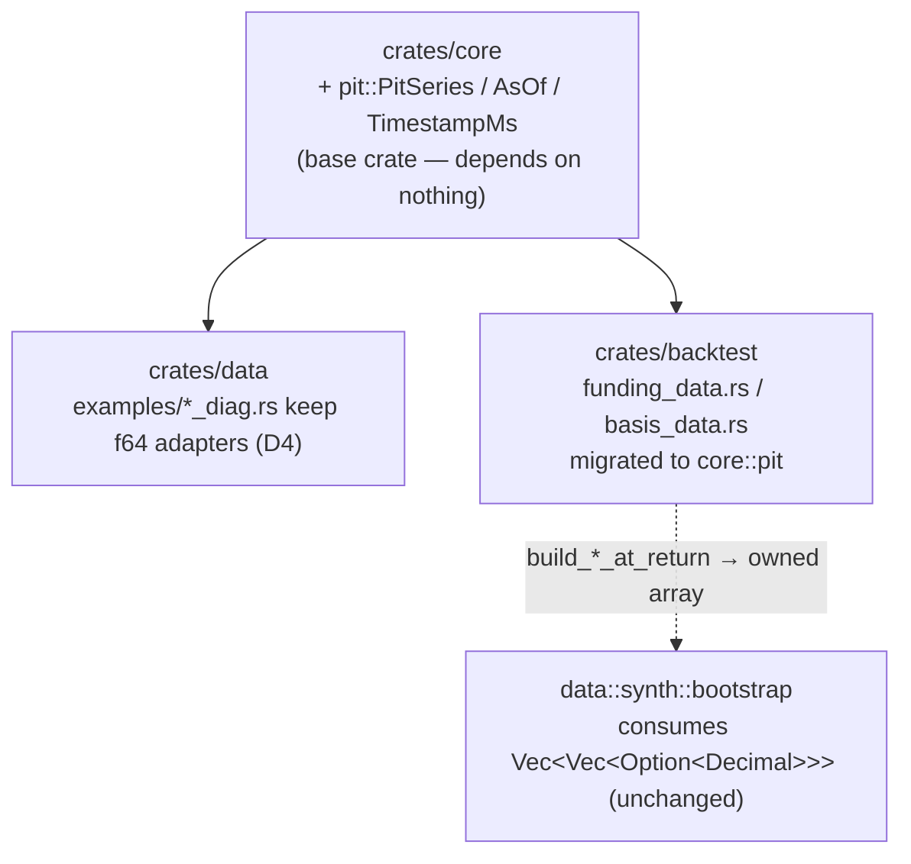

# Point-in-time / as-of data discipline

A **structural** guarantee that signal/feature computation cannot read future
(look-ahead) data. Today the project enforces point-in-time (PIT) cleanliness
*by hand*, feature by feature — a binary-search as-of join copy-pasted three
times, plus per-spike `--leak-check` falsifiers. This feature consolidates that
informal seam into **one reusable, guarded as-of-join API** and a **self-proving
look-ahead falsifier**, so "join future data onto a bar" becomes hard or
impossible by construction rather than a discipline each future signal must
re-earn.

This is a **data-discipline hardening of the EXISTING pipeline**. It is NOT a new
database, NOT a PIT-data vendor integration, and NOT a re-opening of the
concluded active-edge search. See [§ Out of scope](#out-of-scope).

---

## Why

### The qlib gap this closes

The [qlib feature-gap analysis](../../../docs/dev-notes/qlib-feature-gap-2026-06-17.md)
(2026-06-17) compared Microsoft qlib against this project and found that almost
all of qlib's surface area is *alpha-prediction* machinery this project tested
and retired. The honest residue was three or four genuinely-scope-fitting gaps,
and **gap #1 — a first-class point-in-time / as-of data discipline — is named as
"the one structurally-worthwhile gap"** (qlib note § Genuinely-relevant gaps,
ranked, #1). The note's verdict, verbatim:

> Today PIT-cleanliness is re-proven per feature by hand (leak-checks, day-1
> falsifiers). qlib bakes it into the data layer so look-ahead is impossible by
> construction. For a project whose entire credibility rests on an *honest
> negative result*, a structural "you cannot join future data" guarantee hardens
> the most important claim we make. **Likely a focused as-of-join helper + a
> lint, not a new database.** Scope-fitting; would strengthen the moat.

This feature is scoped to exactly that sentence: a focused as-of-join helper + a
falsifier (and an optional lint), **not** a new database.

### The moat it protects — Differentiator (5)

The product's ratified epistemic core is
[Differentiator (5) "measured robustness, not asserted alpha"](../../product.md)
(product.md § Differentiator, § Pillar stack core pillar 2). The program's
shippable deliverable is **the robustness machine + an auditable negative result
across three orthogonal channels** (price/OHLCV, derivatives-positioning,
on-chain), under a frozen block-bootstrap decision rule, terminal-ratified
2026-06-08.

The credibility of that negative result rests on one load-bearing assumption:
**no reported result is contaminated by look-ahead.** A single silent future-data
leak in a sidecar join would not just void one number — it would put an asterisk
on the whole "active ≤ passive, honestly measured" claim, which is the entire
product. Today that assumption is defended *per feature, by hand*. The on-chain
spike's PIT leak-check is the canonical example: it is what distinguished a
causal join from a look-ahead one and let the program treat the stablecoin
FRAGILE verdict as a real signal result rather than a contaminated one
([onchain-netflow-spike § 1.3](../../../docs/dev-notes/onchain-netflow-spike-2026-06-08.md)).
Making that discipline **structural** converts a per-feature manual proof into a
property the pipeline carries by construction — directly hardening the moat.

### What is manual-PIT today (the seam to formalize)

The as-of-join logic already exists, **hand-rolled and duplicated three times**,
each with its own copy of the binary-search algorithm and its own no-look-ahead
test:

| Copy | File:fn | Type | Falsifier |
|---|---|---|---|
| 1 | [`funding_as_of`](../../../crates/backtest/src/funding_data.rs) (`crates/backtest/src/funding_data.rs:378`) | `&[(i64, Decimal)]` → `Vec<Option<Decimal>>` | `no_look_ahead_falsifier` (line 519) |
| 2 | [`basis_as_of`](../../../crates/backtest/src/basis_data.rs) (`crates/backtest/src/basis_data.rs:397`) | `&[(i64, Decimal)]` → `Vec<Option<Decimal>>` | `no_look_ahead_falsifier` (line 554) |
| 3 | `funding_as_of` in [`basis_diag.rs`](../../../crates/data/examples/basis_diag.rs) (`crates/data/examples/basis_diag.rs:219`) | `&[(i64, f64)]` → `f64` | inline `--leak-check` (line 382) |

All three implement the **same** algorithm: `partition_point(|&(t, _)| t <= bar_ts)`
to find the rightmost record at-or-before the query timestamp, returning `None`
(warm-up) when no record precedes the bar. The architect's own
`OQ-CARRY-SEM` note in `spec/trace.toml` names this seam precisely — "**existing
per-bar funding-ring + as-of join**" (REQ-HORIZON-RETEST row). This is the seam
this feature formalizes into a single guarded API, retiring the duplication.

The duplication is the risk: a **fourth** consumer (a future on-chain or
cross-asset signal — exactly the kind the qlib note #2/#3 contemplate if the
operator ever opens a fresh channel) would copy the pattern a fourth time, and
*nothing structural* forces that copy to be causal. The only guard today is that
a developer remembers to write another `no_look_ahead_falsifier`. That is the
manual discipline this feature replaces.

### What is already structurally clean (honest scoping — the gap is smaller than the qlib note implied)

A frank survey of the code shows the **price/OHLCV channel is already PIT-clean
by construction**, and the brief must not invent scope by pretending otherwise:

- The `Strategy` trait is **streaming**: `fn on_bar(&mut self, bar: &Bar) -> Vec<Signal>`
  ([`crates/strategy/src/traits.rs:8`](../../../crates/strategy/src/traits.rs)).
  A strategy is fed bars one at a time and emits signals from state it has
  accumulated; it **physically cannot read a bar it has not yet been handed.**
  Look-ahead on the price tape is impossible at this layer — there is no future
  bar in scope.
- Per-symbol rolling state is held in a [`RingBuffer`](../../../crates/features/src/ring_buffer.rs)
  that exposes only `last()` / `get_back(n)` (past-only); the streaming overlays
  (`patchtst_overlay_momentum.rs`, `tcn_overlay_momentum.rs`) keep
  `windows: BTreeMap<Symbol, Vec<Bar>>` that, by construction, contains only
  bars already streamed.

So the genuine look-ahead surface is **narrower than "the data layer"** — it is
exactly two seams:

1. **Sidecar as-of joins** (funding / basis / on-chain onto bars) — the
   hand-rolled `*_as_of` family above. This is where a wrong join key or a
   forward-shifted series leaks future data. **This is the seam the typed API
   guards.**
2. **Forward-return construction** in research probes and the bootstrap
   (`r[k] = ln(close[k+1]/close[k])` at
   [`crates/data/src/synth/bootstrap.rs:217`](../../../crates/data/src/synth/bootstrap.rs);
   forward windows `[t, t+L)` in `basis_diag.rs:362/434`). Forward returns are
   *intentionally* future-looking (they are the label/target, not a feature) —
   the discipline there is that they must never be fed back as a **signal**. The
   falsifier convention (a leaked-contemporaneous IC that MUST differ from the
   causal IC) is what proves the signal side stayed past-only.

The honest framing for the architect: this feature is **modest, not
foundational** — it hardens the one seam that is genuinely manual (the sidecar
as-of join) and codifies the falsifier that already exists informally. It is
worth doing because that seam is the exact place the moat-protecting claim could
silently break, and because the duplication invites a fourth uncaught copy — not
because the pipeline is currently leaking (no known leak exists; the three
hand-checks pass).

---

## Requirements

- **R1 — A single guarded as-of-join API.** Provide one reusable, typed as-of
  helper that, given a query timestamp `query_ts` and a sorted timestamped
  series, returns only the record(s) with `ts ≤ query_ts` (the most-recent
  at-or-before, `None` on warm-up). It MUST make "join a record with
  `ts > query_ts`" either impossible-by-construction (type-level) or
  caught-at-runtime (a guarded constructor / debug assertion), reusing the
  existing `partition_point` seam — NOT a parallel implementation. The three
  existing copies (`funding_as_of`, `basis_as_of`, the `basis_diag.rs` clone)
  are migrated to it (the `f64` diag copy may keep a thin local adapter; see
  Open decisions).

- **R2 — A self-proving look-ahead falsifier (the verification floor).** Ship a
  test that **deliberately feeds future data** through the API (a forward-shifted
  series, or a query against a record that post-dates `query_ts`) and asserts the
  guard **rejects or excludes** it — i.e. the causal result differs from the
  leaked result, mirroring the existing `no_look_ahead_falsifier` and the
  on-chain `--leak-check`. This falsifier is the contract: if it ever passes when
  it should fail, the guarantee is broken. It is the "day-1 falsifier" for this
  feature.

- **R3 — Migration preserves behaviour byte-for-byte where anchored.** The
  funding-carry and basis arms feed anchored backtest surfaces. The migration of
  `funding_as_of` / `basis_as_of` to the shared API MUST produce **identical**
  as-of values (same `partition_point` `≤` convention, same `Option` warm-up
  semantics, same `Decimal` precision — no f64 round-trip), so all existing
  regression anchors stay byte-identical (no anchor delta). This is a refactor
  behind a guarantee, not a numerics change.

- **R4 — (Optional, architect-decided) A look-ahead lint.** Evaluate whether a
  `scripts/`-level lint can cheaply catch obvious look-ahead patterns in feature
  code (e.g. a sidecar join that does NOT route through the guarded API, or an
  indexing pattern that reads `series[t + k]` as a signal input). If the typed
  API + falsifier already make the seam safe-by-construction, the lint may be
  judged redundant and dropped — state which, with reasoning. (See Open
  decisions: lint vs typed-API-only.)

---

## Scope

- ONE guarded as-of-join API (a small typed helper / newtype / view), living in
  a single home crate (Open decisions: core vs data vs backtest).
- Migration of the three existing hand-rolled as-of copies onto it, behaviour-
  preserving for anchored arms (R3).
- The self-proving look-ahead falsifier test (R2) as the verification floor.
- Optionally, a `scripts/`-level look-ahead lint (R4) IF the architect judges it
  adds coverage the typed API does not.
- Documentation: a one-paragraph "PIT discipline" note wherever the API lives, so
  a future signal author reaches for it by default.

## Out of scope

- **No new database / no PIT store.** The qlib note explicitly rules this out
  ("Likely a focused as-of-join helper + a lint, **not** a new database"). The
  existing pinned-parquet corpus + REVISION.toml SHA-locking is the data
  substrate; this feature does not touch it.
- **No PIT-data *vendor* integration.** No CryptoQuant / Glassnode / new-feed
  work. (The on-chain spike already established the reachable free PIT-clean
  series; that search is concluded.)
- **No re-opening the active-edge search.** This is a *discipline* feature. It
  builds no new signal, no new strategy, no new ScoreSource, and produces no new
  backtest verdict. The terminal "ship passive" conclusion (product.md, 2026-06-08)
  is untouched.
- **No change to the streaming price path.** `on_bar` is already PIT-clean by
  construction (above); this feature does not re-plumb it.
- **No change to forward-return / label construction.** Forward returns are
  intentionally future-looking targets; the falsifier convention already governs
  that they never re-enter as a signal. The API guards the *feature/sidecar* side,
  not the label side.
- **No anchored-report edits.** Per CLAUDE.md, `spec/*/reports/*.md` are
  byte-immutable; this feature touches none.

---

## Design direction

> The architect owns the final design (M-T1 lock). This section grounds it in the
> real seam and types so the design starts from the code, not a blank page.

**The seam to reuse.** Both `funding_as_of`
(`crates/backtest/src/funding_data.rs:378`) and `basis_as_of`
(`crates/backtest/src/basis_data.rs:397`) are the *same* function modulo the
doc-comment: a binary `partition_point(|&(t, _)| t <= bar_ts)` over a sorted
`&[(i64, Decimal)]`, returning `Some(series[idx-1].1)` or `None` for warm-up.
The shared API is the generalization of exactly this — same algorithm, same
`≤` causal convention, same `Option` warm-up semantics — so the migration is
mechanical and R3-preserving by construction.

**Two candidate shapes** (the type-level-vs-runtime-guard tension — architect to
resolve, tradeoff stated here):

- **(a) Type-level — a `PitSeries<T>` newtype + an `AsOf<T>` view.** Construct a
  `PitSeries` from a sorted timestamped series (constructor enforces sortedness);
  its only query method is `as_of(query_ts) -> Option<AsOf<T>>` where `AsOf<T>`
  carries the value plus the proof-timestamp `ts ≤ query_ts`. There is **no API
  surface** that returns a record at `ts > query_ts`, so look-ahead is
  unrepresentable. *Pro:* the guarantee is compile-time; a fourth consumer
  literally cannot leak. *Con:* more types to thread; the bootstrap's
  `Vec<Vec<Option<Decimal>>>` materialization (`build_funding_at_return`) and the
  `f64` diag path need adapters; slightly more typing now.
- **(b) Runtime-guard — keep the free function, add a guarded constructor +
  debug-assert.** One `as_of_join(query_ts, sorted_series) -> Option<&T>` that
  debug-asserts the series is sorted and that the returned record's `ts ≤
  query_ts`. *Pro:* minimal churn, drop-in for all three call sites, smallest
  diff. *Con:* the guarantee is a runtime/debug check, not a compile-time
  property; a future author could still call `partition_point` by hand and
  bypass it (the lint R4 becomes the backstop that closes that hole).

**Analyst lean: (a) type-level `PitSeries`/`AsOf` is the durable choice
(Recommended)** — per the durable-over-quick rule, the Recommended tag goes on
the option whose M-T1 lock carries forward across future signal versions without
amendment. (a) makes look-ahead *unrepresentable*, so the moat-protecting
guarantee holds for the fourth, fifth, Nth consumer by construction — no future
"remember to add a falsifier" discipline, no lint needed as a backstop for the
core join. It costs slightly more typing now (the `AsOf<T>` threading + two
adapters) but spawns **zero v0.2.0 cleanup brief**. **If-budget-tightens
fallback: (b) runtime-guard + the R4 lint** — ~1 day less work, drop-in
migration, but the guarantee is debug-time-only and it commits the project to
maintaining the lint as the bypass backstop (a small ongoing carry-cost). (b) is
a fully defensible cheaper path; it is the fallback label, not the Recommended
one, because a hand-rolled `partition_point` can still sidestep it.

**Where it lives (architect-decided, see Open decisions).** The seam is consumed
in `crates/backtest` (the `*_data.rs` loaders) and `crates/data` (the diag
probe). The types it joins (`Timestamp`, `Symbol`, `Decimal`) live in
`crates/core`. A `crates/core` home makes the API available to every crate
without a new dependency edge; a `crates/data` home keeps it next to the loaders
that use it most. Lean: `crates/core` (it is a domain primitive, like `Bar` /
`Timestamp`), but the architect should weigh the dependency graph.

**The falsifier (R2)** is the existing `no_look_ahead_falsifier` shape, lifted to
the shared API: build a series, query causally, then forward-shift the series and
query again, assert the two results differ. It becomes the single canonical
falsifier the migrated call sites all point at (the per-loader copies can be
retired or kept as thin regression guards — architect's call).

---

## Acceptance criteria

- **AC1 — One guarded as-of API exists and is the single join path.** The shared
  helper/newtype is implemented in its home crate; `funding_as_of` and
  `basis_as_of` are migrated to it (or are thin wrappers over it). No backtest
  consumer reaches future data: every sidecar join routes through the guarded
  API. (R1)

- **AC2 — The self-proving look-ahead falsifier passes as a falsifier.** A test
  feeds deliberately-future data through the API and asserts the guard
  rejects/excludes it — the causal result MUST differ from the leaked result. The
  test is wired so that *removing the guard makes it fail* (it proves the
  guarantee, not just exercises the happy path). (R2)

- **AC3 — Zero anchor delta.** `scripts/verify_anchors.sh` reports the same
  119/119 (or current count) byte-identical anchors before and after the
  migration: the funding-carry and basis arms produce identical as-of values, so
  every anchored surface is byte-unchanged. (R3)

- **AC4 — Gates green.** `python3 scripts/spec_lint.py spec/point-in-time-data-discipline`
  passes (valid frontmatter, no dead links); `cargo clippy -- -D warnings` and
  the migrated crates' tests pass.

- **AC5 — (If R4 lint is built) the lint catches a planted look-ahead.** A
  deliberately-introduced bypass (a hand-rolled future-reading join in a test
  fixture) is flagged by the lint; a clean tree passes. If the architect drops
  the lint (typed-API-sufficient), AC5 is recorded N/A with the
  type-level-sufficiency reasoning. (R4)

---

## Verification floor — and why the day-1 e2e divergence gate does NOT apply here

CLAUDE.md mandates that **"every strategy overlay or sizing-modifier ships with a
baseline-equity-divergence end-to-end test from day 1"** (the
`v3-volatility-forecaster-noop-fix` precedent: a no-op overlay where `scale` was
computed but never applied). That gate is **scoped to overlays / sizing
modifiers** — code that changes the strategy decision variable and must be proven
to actually move equity.

**This feature is a data-discipline hardening, NOT a strategy overlay or sizing
modifier.** It introduces no new decision variable, no scaling, no signal — it
refactors an existing as-of join behind a guarantee. There is no "did the overlay
actually apply?" question, because there is no overlay. Applying the
equity-divergence gate here would be category error: the *correct* outcome is
that equity does **not** change (AC3 — zero anchor delta is the explicit success
condition).

The real verification floor for this feature is therefore:

1. **The self-proving look-ahead falsifier (AC2)** — the analogue of the
   day-1-falsifier convention and the on-chain `--leak-check`. A deliberate
   future-data feed is provably rejected. *This* is the day-1 gate for a
   discipline feature.
2. **Zero anchor delta (AC3)** — the behaviour-preservation proof that the
   refactor changed no reported number.

Together these are stricter, for this feature's risk profile, than an
equity-divergence test would be: AC2 proves the guard *works*, AC3 proves the
migration *changed nothing*. (If the architect's chosen design somehow does
touch a decision path — it should not — the CLAUDE.md gate re-applies and this
section must be revisited.)

---

## Open decisions (for the architect)

1. **Type-level vs runtime guard (R1).** `PitSeries<T>`/`AsOf<T>`
   (look-ahead unrepresentable, compile-time) vs a guarded free function +
   debug-assert (drop-in, runtime/debug-time). Analyst lean: type-level
   (durable, Recommended); runtime-guard is the if-budget-tightens fallback.
   Resolve and lock in M-T1.

2. **Lint vs typed-API-only (R4 / AC5).** Is a `scripts/`-level look-ahead lint
   worth building, or does the typed API make it redundant? If type-level (a) is
   chosen, the lint is likely unnecessary for the core join (but may still catch
   *new hand-rolled* joins that bypass the API). If runtime-guard (b) is chosen,
   the lint becomes the backstop that closes the bypass hole. Decide and record.

3. **Where the seam lives — core vs data vs backtest.** Analyst lean:
   `crates/core` (it is a domain primitive alongside `Bar` / `Timestamp`), so
   every crate can reach it without a new dependency edge. Architect to weigh the
   workspace dependency graph (does `core` want this, or does it belong next to
   the loaders in `data`?).

4. **Migrate the `f64` `basis_diag.rs` copy, or leave it as a research adapter?**
   The diag probe uses `f64` (research-grade, not the Decimal production path).
   Folding it into the shared (Decimal) API may be more friction than value for a
   read-only example. Option: keep a thin `f64` local adapter in the probe that
   documents it mirrors the shared API, rather than forcing the probe onto the
   production type. Architect's call.

5. **Falsifier home + retirement of the per-loader copies.** Does the shared
   falsifier (AC2) replace the two existing `no_look_ahead_falsifier` tests, or
   do those stay as thin per-loader regression guards? (Retiring them reduces
   duplication; keeping them adds belt-and-suspenders.)

---

## Changelog

- 2026-06-18 (analyst): authored the brief. Scoped the one structurally-worthwhile
  qlib gap (PIT / as-of discipline, qlib-note #1) as a **focused as-of-join helper
  + falsifier (+ optional lint), NOT a new database**. Grounded it in the real
  seam: `funding_as_of` (`crates/backtest/src/funding_data.rs:378`) and
  `basis_as_of` (`crates/backtest/src/basis_data.rs:397`) are the SAME hand-rolled
  `partition_point` as-of join, copied a third time (`f64`) in
  `crates/data/examples/basis_diag.rs:219`, each with its own
  `no_look_ahead_falsifier` — the seam the architect's own `OQ-CARRY-SEM` trace
  note calls "per-bar funding-ring + as-of join". Honest scoping: the price path
  is ALREADY PIT-clean by construction (`Strategy::on_bar` streaming +
  past-only `RingBuffer`), so the genuine look-ahead surface is just the sidecar
  as-of join (guarded by this API) + forward-return labels (out of scope —
  intentionally future). Analyst lean: type-level `PitSeries`/`AsOf` (durable,
  Recommended) over a runtime-guard fallback. Verification floor = the
  self-proving look-ahead falsifier (AC2) + zero anchor delta (AC3); the CLAUDE.md
  day-1 equity-divergence gate does NOT apply (not an overlay/sizing modifier —
  the correct outcome is equity UNCHANGED). NO code; NO new database; NO vendor
  feed; NO re-opening the concluded active-edge search; NO anchored-report edits.
  Created REQ-POINT-IN-TIME-DATA-001 (proposed). HANDOFF → architect.
- 2026-06-18 (architect): M-T1 design lock. Resolved D1–D5; chose **type-level
  `PitSeries<T>` + `AsOf<T>`** in **`crates/core`** (new `pit` module). Verified
  feasibility against the real types (no borrow/lifetime wall): the bootstrap
  consumes a fully-materialized owned `Vec<Vec<Option<Decimal>>>`
  (`BlockBootstrapPathGen::with_funding`/`with_basis`), never a borrow, so the
  per-query method returns owned `Option<AsOf<T>>` and `build_*_at_return` stay as
  thin materialization adapters that `.map(AsOf::into_value)`. Join key is `i64`
  ms-since-epoch (NOT `Timestamp`) → preserves `partition_point(|&(t,_)| t<=q)`
  byte-for-byte. Authored **ADR-0058** (new `core` domain primitive + 4-call-site
  cross-crate migration on the anchor-feeding path warrants a numbered record;
  registered atomically). Anchor safety: same algorithm, same `≤` convention, same
  `Option` warm-up, same `Decimal` (no f64 round-trip) ⇒ identical as-of values ⇒
  119/119 byte-identical. Found a **FOURTH** copy the brief did not list
  (`crates/data/examples/stablecoin_diag.rs:301`, identical `f64` clone) — folded
  into the migration. D2: lint DROPPED (type-level makes it redundant for the core
  join; an optional `#[deny]`-style grep guard is captured as a v0.2 follow-on, not
  built). D4: both f64 diag probes keep a thin documented research adapter (NaN-not-
  None, f64-not-Decimal) — not forced onto the Decimal API. D5: one shared canonical
  falsifier in `core::pit` is the contract; the two per-loader `no_look_ahead_falsifier`
  tests stay as thin regression guards (belt-and-suspenders, zero anchor cost).
  status proposed → arch-done. HANDOFF → developer.

---

## Design

> **M-T1 design lock (architect, 2026-06-18).** This section is the buildable
> contract. It resolves Open decisions D1–D5, fixes the exact API surface, maps
> the migration of all **four** call sites (the brief listed three; a fourth
> identical `f64` clone exists — see § Migration plan), states the anchor-safety
> argument, and records the verification floor. The numbered design record is
> [ADR-0058](../../../_bmad-output/planning-artifacts/architecture/decisions/0058-pit-as-of-series-primitive.md).

### Feasibility verdict (the load-bearing check the orchestrator asked for)

The analyst-preferred **type-level** design is **feasible** against the real
`Bar` / `Timestamp` / `Decimal` types — there is **no borrow/lifetime wall**.
Three facts decide it:

1. **The bootstrap consumes an owned, fully-materialized array, not a borrow.**
   `BlockBootstrapPathGen::with_funding` / `with_basis`
   ([`crates/data/src/synth/bootstrap.rs:155,177`](../../../crates/data/src/synth/bootstrap.rs))
   take `Option<Vec<Vec<Option<Decimal>>>>` *by value*; the gen copies `Decimal`
   out of it at `funding_at_return[sym_i][idx_seq[k]]`. The as-of API therefore
   never needs to thread a lifetime into the bootstrap — its per-query method
   returns an **owned** `Option<AsOf<T>>`, and the existing
   `build_funding_at_return` / `build_basis_at_return` wrappers
   ([`funding_data.rs:421`](../../../crates/backtest/src/funding_data.rs),
   [`basis_data.rs:440`](../../../crates/backtest/src/basis_data.rs)) stay exactly
   as they are except their inner loop calls the shared API and `.map`s to the
   value. The output type `Vec<Vec<Option<Decimal>>>` is **unchanged**.

2. **The join key is `i64` ms-since-epoch, not `Timestamp`.** Both production
   loaders join `bar_open_ts_ms: &[i64]` against `funding_time_ms: i64` /
   `open_time_ms: i64`. Forcing the key to `core::Timestamp` would round-trip
   through `Timestamp::unix_millis()` (`i128 → i64` truncation) and risk an
   anchor delta. The primitive is therefore keyed on a transparent `i64` newtype
   `TimestampMs` (ms-since-Unix-epoch), preserving the `partition_point` predicate
   `|&(t, _)| t <= q` **character-for-character**.

3. **`crates/core` is the base crate; the dep edge already exists.** `backtest`
   and `data` both `path`-depend on `trading_core`; `core` depends on **neither**
   (verified — no cycle). `core/Cargo.toml` already carries `rust_decimal`,
   `time`, `proptest`, `trybuild` — so the typed primitive + its `trybuild`
   compile-fail test land with **zero new dependency edge**, consistent with the
   ADR-0041 layering invariant (code lives in the crate whose layer it serves; a
   crate must gain no edge that violates the hierarchy).

There is no scenario in the four call sites where a `PitSeries<T>` must outlive
the slice it wraps or be stored across an `await`/iteration boundary — all four
are synchronous `build`-then-`map` loops. **Type-level wins; no fallback needed.**
(If a future consumer needed a borrowing view, `PitSeries::new(&slice)` over a
`&[(TimestampMs, T)]` is the borrowing constructor and `PitSeries::from_owned`
the owning one — both specified below — so the borrow case is covered without
re-architecting.)

### Resolved Open decisions (D1–D5)

| # | Decision | Resolution | Crate-edge reason |
|---|----------|------------|-------------------|
| **D1** | Type-level vs runtime-guard | **RATIFY type-level** `PitSeries<T>` + `AsOf<T>`. | Feasible (above) with no lifetime wall; makes look-ahead *unrepresentable* (no public method returns a record at `ts > query`), so the Nth consumer is causal by construction — the moat property holds without a "remember the falsifier" discipline. Durable-over-quick: spawns zero v0.2 cleanup brief. |
| **D2** | Lint vs typed-API-only | **OVERRIDE toward typed-API-only — DROP the lint** (AC5 = N/A). | With D1, the *core* join is safe by construction; a `scripts/` regex lint would only catch a *new* hand-rolled `partition_point` that bypasses the API — a low-frequency event already covered by code review + the shared falsifier being the obvious reach-for. Building+maintaining a grep lint now is carry-cost for marginal coverage. Captured as a **v0.2 follow-on** (an optional `cargo`-deny-style "no raw as-of join outside `core::pit`" grep guard) in tasks.md Notes, not built. |
| **D3** | Home crate | **RATIFY `crates/core`** (new `pit` module, `pub mod pit;`). | `core` is the base crate (data/backtest depend on it; it depends on neither — no cycle); it already carries `rust_decimal`/`time`; it is where domain primitives `Bar`/`Timestamp`/`FundingObs` live. A `data` home would force `backtest` to depend on `data` for the primitive (it does not today) — a new, wrong-direction edge. ADR-0041-consistent. |
| **D4** | Migrate or adapter the f64 diag copies | **OVERRIDE toward "thin documented research adapter"** — keep the `f64` probes local; do **not** force them onto the Decimal API. | The two diag probes (`basis_diag.rs:219`, `stablecoin_diag.rs:301`) are research-grade `f64` with `NaN`-not-`None` warm-up semantics, used only inside `examples/`. Folding them onto `PitSeries<Decimal>` would change their warm-up sentinel and add `f64↔Decimal` conversion friction for zero production benefit. Each keeps a **one-line `// PIT: mirrors core::pit::PitSeries — research-grade f64 adapter, NaN=warm-up`** doc-pointer so a reader is routed to the canonical API. (They are NOT anchor-feeding — `examples/` only.) |
| **D5** | Falsifier home + retire/keep per-loader copies | **One shared canonical falsifier** in `core::pit` tests is the contract (AC2); **KEEP** the two existing `no_look_ahead_falsifier` tests as thin per-loader regression guards. | The shared falsifier proves the *primitive* is causal. The per-loader copies (`funding_data.rs:519`, `basis_data.rs:554`) now exercise the *migrated wrappers* and cost nothing (no anchor touch — they are `#[cfg(test)]`). Belt-and-suspenders: they pin that the wrapper still routes through the guard. Retiring them would remove a cheap regression net for no benefit. |

### The API surface (exact signatures — `crates/core/src/pit.rs`)

A new module `core::pit`, re-exported from `lib.rs` as
`pub use pit::{PitSeries, AsOf, TimestampMs};`. **No new dependency.** All
`Result`-free where infallible; the one fallible constructor returns
`Result<_, PitError>`.

```rust
//! Point-in-time (PIT) as-of join primitive.
//!
//! A `PitSeries<T>` is a sorted, timestamped series whose ONLY query method is
//! `as_of(query) -> Option<AsOf<T>>`, returning the most-recent record at-or-
//! before `query` (`None` during warm-up). There is no public method that
//! returns a record with `ts > query`, so joining future data onto a bar is
//! UNREPRESENTABLE — look-ahead is a compile error, not a runtime bug. This is
//! the single guarded as-of join every sidecar feature (funding, basis, on-chain)
//! routes through; a hand-rolled `partition_point` is the anti-pattern this
//! replaces. See spec/point-in-time-data-discipline/feature.md § Design and
//! ADR-0058.

use rust_decimal::Decimal;          // only used by callers; T is generic
use serde::{Deserialize, Serialize};

/// Milliseconds since the Unix epoch — the as-of join key.
///
/// Transparent `i64` newtype. We key on raw ms (NOT `Timestamp`) because the
/// production loaders join on `i64` ms and a `Timestamp` round-trip would
/// truncate (`i128 → i64`) and risk an anchor delta. `Ord` is the plain `i64`
/// ordering, so the `partition_point(|r| r.ts <= q)` predicate is preserved
/// byte-for-byte against the legacy `|&(t, _)| t <= bar_ts`.
#[derive(Debug, Clone, Copy, PartialEq, Eq, PartialOrd, Ord, Hash, Serialize, Deserialize)]
#[serde(transparent)]
pub struct TimestampMs(pub i64);

/// The result of an as-of query: a value whose timestamp is PROVEN `≤` the
/// query timestamp. Constructed ONLY by `PitSeries::as_of`; there is no public
/// constructor that lets a caller fabricate an `AsOf` whose `ts > query`.
///
/// `as_of_ts` is the timestamp of the record that was in force at the query
/// (the proof-carrying field); `value` is its payload. Callers that only need
/// the payload use `.into_value()` / `.value()`.
#[derive(Debug, Clone, Copy, PartialEq, Eq)]
pub struct AsOf<T> {
    as_of_ts: TimestampMs,
    value: T,
}

impl<T> AsOf<T> {
    /// The timestamp of the in-force record. Invariant: `as_of_ts <= query`
    /// for the `query` that produced this `AsOf`.
    #[must_use]
    pub fn as_of_ts(&self) -> TimestampMs { self.as_of_ts }

    /// Borrow the payload.
    #[must_use]
    pub fn value(&self) -> &T { &self.value }

    /// Consume into the payload (the hot path for `build_*_at_return`).
    #[must_use]
    pub fn into_value(self) -> T { self.value }
}

/// Error from the checked constructor.
#[derive(Debug, Clone, PartialEq, Eq, thiserror::Error)]
pub enum PitError {
    /// The series was not sorted ascending by timestamp (ties allowed).
    #[error("PitSeries records not sorted ascending by ts (violation at index {0})")]
    NotSorted(usize),
}

/// A sorted, timestamped series supporting causal (no-look-ahead) as-of queries.
///
/// `T` is the payload (`Decimal` in production; generic so research/tests can
/// use any `Clone` type). Stores `Vec<(TimestampMs, T)>` sorted ascending.
#[derive(Debug, Clone)]
pub struct PitSeries<T> {
    records: Vec<(TimestampMs, T)>,
}

impl<T: Clone> PitSeries<T> {
    /// Build from an already-sorted owned vec, CHECKING the sort invariant.
    /// Returns `PitError::NotSorted` on the first descending pair.
    /// (Ties — equal adjacent timestamps — are allowed and preserved.)
    pub fn from_sorted(records: Vec<(TimestampMs, T)>) -> Result<Self, PitError> { /* check then store */ }

    /// Build from an unsorted owned vec, sorting by `ts` with a STABLE sort
    /// (`sort_by_key`) so equal-timestamp records keep input order — matching
    /// the loaders' `sort_unstable_by_key`-then-dedup discipline is the
    /// caller's job; this primitive preserves whatever order it is given for ties.
    #[must_use]
    pub fn from_unsorted(mut records: Vec<(TimestampMs, T)>) -> Self { /* stable sort then store */ }

    /// Borrowing constructor over a sorted slice (zero-copy view); CHECKED.
    /// For callers (future) that hold a `&[(TimestampMs, T)]` and do not want
    /// to clone. The production loaders use the owned constructors above.
    pub fn from_sorted_slice(records: &[(TimestampMs, T)]) -> Result<Self, PitError> { /* check + clone */ }

    /// THE query. Returns the most-recent record at-or-before `query`
    /// (`ts <= query`), or `None` if no record precedes `query` (warm-up).
    ///
    /// Implemented as `self.records.partition_point(|&(t, _)| t <= query)` — the
    /// EXACT legacy predicate — taking `idx-1` (or `None` when `idx == 0`). This
    /// is the single line that guarantees byte-identical migration (R3).
    #[must_use]
    pub fn as_of(&self, query: TimestampMs) -> Option<AsOf<T>> { /* partition_point, idx-1, wrap */ }

    /// Convenience: as-of, projecting straight to the owned payload. This is the
    /// EXACT shape `funding_as_of`/`basis_as_of` need — `Option<T>` per query —
    /// so the migrated wrappers are `series.as_of_value(q)` and nothing else.
    #[must_use]
    pub fn as_of_value(&self, query: TimestampMs) -> Option<T> {
        self.as_of(query).map(AsOf::into_value)
    }

    /// Number of records (for warm-up/diagnostic assertions in tests).
    #[must_use]
    pub fn len(&self) -> usize { self.records.len() }
    #[must_use]
    pub fn is_empty(&self) -> bool { self.records.is_empty() }
}
```

**Why this is the minimal surface that makes look-ahead unrepresentable.** The
only way to get a `T` out of a `PitSeries<T>` keyed to a query is `as_of` /
`as_of_value`, and both return only the record at `idx-1` where
`idx = partition_point(t <= query)` — i.e. a record with `ts <= query`. `AsOf<T>`
has **no public field** and **no public constructor**, so a caller cannot
fabricate an at-`ts > query` value and pass it off as as-of. There is no
`get(i)`, no `Index`, no `iter()` returning future records, no
`records()` accessor. A fourth, fifth, Nth sidecar consumer that reaches for
`PitSeries` is causal *by construction*; one that hand-rolls `partition_point`
is the visible anti-pattern (and the dropped-lint's v0.2 follow-on would flag it).

### Migration plan — all FOUR call sites (the brief named three)

> **Note for the developer:** the brief's table lists three copies. A grep for
> `partition_point` across `crates/` finds a **fourth**: an identical `f64` clone
> at [`crates/data/examples/stablecoin_diag.rs:301`](../../../crates/data/examples/stablecoin_diag.rs)
> (the on-chain spike's probe), byte-identical to `basis_diag.rs:219`. This is
> *exactly* the "duplication invites a fourth uncaught copy" risk the brief warns
> about — it already happened. Both f64 probes get the same D4 research-adapter
> treatment.

| # | Site | Change | Behaviour-preservation proof |
|---|------|--------|------------------------------|
| **1** | [`funding_as_of`](../../../crates/backtest/src/funding_data.rs) (`funding_data.rs:378`) — `&[(i64, Decimal)] → Vec<Option<Decimal>>` | Keep the `pub fn` signature **unchanged** (it is a public API; callers/tests stay byte-stable). Body becomes: build `PitSeries::from_sorted(funding.iter().map(|&(t,r)| (TimestampMs(t), r)).collect())` once, then `bar_open_ts_ms.iter().map(|&q| series.as_of_value(TimestampMs(q))).collect()`. Empty-series fast-path retained verbatim. | The inner predicate is the same `partition_point(t <= q)` → `idx-1`; `Decimal` is moved, never converted; `None` warm-up identical. **Same bytes.** |
| **2** | [`basis_as_of`](../../../crates/backtest/src/basis_data.rs) (`basis_data.rs:397`) — identical shape | Identical treatment to #1 (the two functions differ only by doc-comment). Signature unchanged. | Same as #1. **Same bytes.** |
| **3** | [`build_funding_at_return`](../../../crates/backtest/src/funding_data.rs) (`funding_data.rs:421`) + [`build_basis_at_return`](../../../crates/backtest/src/basis_data.rs) (`basis_data.rs:440`) — `Vec<Vec<Option<Decimal>>>` | **No signature change.** Inner `funding_as_of(funding, return_bar_ts)` / `basis_as_of(...)` calls now reach the migrated wrappers from #1/#2 transitively. Output type `Vec<Vec<Option<Decimal>>>` is unchanged → `BlockBootstrapPathGen::with_funding`/`with_basis` consume it identically. | The materialization shape is untouched; it just calls the migrated leaf. **Same bytes; same bootstrap input.** |
| **4a** | `funding_as_of` f64 clone in [`basis_diag.rs:219`](../../../crates/data/examples/basis_diag.rs) — `&[(i64, f64)] → f64` (NaN warm-up) | **D4: keep local.** Add a one-line doc-pointer `// PIT: research-grade f64 mirror of core::pit::PitSeries; NaN = warm-up (None in the Decimal API).` No code change beyond the comment. | Not anchor-feeding (`examples/` only). No production path touched. |
| **4b** | `funding_as_of` f64 clone in [`stablecoin_diag.rs:301`](../../../crates/data/examples/stablecoin_diag.rs) — identical | **D4: keep local.** Same doc-pointer as 4a. | Same as 4a. |

**Tests touched by the migration:**

- `funding_data.rs` tests (`warm_up_before_first_settlement_is_none`,
  `bar_at_settlement_uses_that_settlement`, `bar_between_settlements_uses_earlier`,
  `step_function_correctness`, `no_look_ahead_falsifier`,
  `empty_funding_series_all_none`, `build_funding_at_return_aligns_to_t_minus_1`,
  `out_of_span_filter_via_funding_as_of`) — **all keep passing unchanged** because
  the public `funding_as_of` signature and semantics are preserved. They become
  the D5 per-loader regression guards over the migrated wrapper.
- `basis_data.rs` tests (mirror set, incl. `no_look_ahead_falsifier`,
  `out_of_span_filter_via_basis_as_of`) — same: unchanged, kept.
- **New** `core::pit` test module is added (see § Verification).

### Anchor-safety argument (R3 / AC3 — the load-bearing guarantee)

The funding-carry and basis arms feed the anchored backtest surfaces (the
`v1-carry-*`, `v1-basis-reversal-*`, `v2-mn-*` families in `anchors.toml`, plus
the funding/basis-fed bootstrap distributions). The migration produces
**byte-identical as-of values** for three independent reasons, each verifiable by
reading one line:

1. **Same algorithm.** `PitSeries::as_of` is literally
   `self.records.partition_point(|&(t, _)| t <= query)` then `idx-1`/`None` — the
   same predicate and the same off-by-one as the legacy `funding_as_of` /
   `basis_as_of`. Not a re-derivation; a lift of the exact two lines.
2. **Same warm-up.** `idx == 0 → None`, unchanged. The empty-series fast-path
   (`if funding.is_empty() { return vec![None; n] }`) is retained verbatim in the
   wrapper, so even the degenerate path is bit-stable.
3. **No numeric conversion.** `Decimal` is **moved** through `(TimestampMs(t), r)`
   construction and `AsOf::into_value`; there is **no `f64` round-trip**, no
   `Decimal` rescale, no `to_f64`/`from_f64`. The key change `i64 → TimestampMs(i64)`
   is a transparent newtype with `i64` `Ord`, so the comparison `t <= query` is
   bit-for-bit the same integer compare.

Therefore every as-of value fed to the carry/basis signals and to
`build_*_at_return` → bootstrap is identical, so every downstream report body is
byte-identical, so **`scripts/verify_anchors.sh` stays 119/119**. The developer
**re-runs `scripts/verify_anchors.sh` after the migration and confirms 119/119
with zero delta** (M-TEST-3); a single non-matching anchor is a REGRESSION and
blocks the ship per CLAUDE.md. No anchored `spec/*/reports/*.md` file is edited
(this feature touches none); no `anchors.toml` SHA changes (no new anchor); no
ADR-0038 § D6 re-emission is invoked.

### Why the CLAUDE.md day-1 equity-divergence gate is N/A (restated)

CLAUDE.md mandates a baseline-equity-divergence e2e test "from day 1" for **every
strategy overlay or sizing modifier** (the `v3-volatility-forecaster-noop-fix`
precedent: a `scale` computed but never applied). **This feature is neither.** It
introduces no decision variable, no scale, no signal, no overlay — it lifts an
existing as-of join behind a type. There is no "did the overlay apply?" question
because there is no overlay; the *correct* and *required* outcome is that equity
does **not** move (AC3 — zero anchor delta is the explicit success condition).
Applying the divergence gate here would be a category error, asserting the
opposite of the design goal. The substituted, stricter floor for this feature is
**AC2 (the falsifier proves the guard works) + AC3 (zero anchor delta proves the
migration changed nothing)** — see § Verification. (Should any future amendment
make this design touch a decision path — it must not — the CLAUDE.md gate
re-applies and this clause is revisited.)

### Verification floor

1. **AC2 — the self-proving look-ahead falsifier, lifted to `core::pit`.** A
   `#[test] fn as_of_no_look_ahead_falsifier()` in `core::pit` tests: build a
   `PitSeries` of `(ts, value)`, query `as_of(q)` causally, then **forward-shift**
   every record's `ts` by `+Δ` and query the same `q` again; assert the two
   results **differ** (`assert_ne!`). This mirrors the existing
   `funding_data.rs::no_look_ahead_falsifier` exactly. It is wired so that
   **breaking the guard makes it fail**: a companion `trybuild` compile-fail
   fixture (`core/tests/pit_compile_fail/`) asserts there is **no** API that
   returns a record at `ts > query` (e.g. `AsOf::new` does not exist; the private
   field is inaccessible) — proving the guarantee is structural, not just a happy
   path. (The trybuild dep is already in `core/Cargo.toml`.)
2. **AC3 — zero anchor delta.** `scripts/verify_anchors.sh` reports the same
   **119/119** byte-identical before and after migration. This is the
   behaviour-preservation proof.
3. **AC4 — gates green.** `python3 scripts/spec_lint.py spec/point-in-time-data-discipline`;
   `cargo clippy -p trading_core -p trading_backtest -p trading_data -- -D warnings`;
   `cargo test -p trading_core -p trading_backtest` (incl. the migrated loaders +
   the new `core::pit` falsifier).
4. **AC1 — single join path.** Every production sidecar as-of join
   (`funding_as_of`, `basis_as_of`, transitively `build_*_at_return`) routes
   through `core::pit::PitSeries`; the f64 diag probes carry the documented
   research-adapter pointer (D4). AC5 is **N/A** — the lint is dropped (D2).

### Layering & dependency note (ADR-0041-consistent)



The new primitive sits **below** every consumer — no new edge, no cycle, and the
`backtest → data` non-edge is preserved (the primitive lives in `core`, so
`backtest` does not need `data` to reach it). This is the ADR-0041 rule applied:
the as-of join is a domain primitive, so it lives in the domain-primitive crate.

---

## Implementation

Implemented 2026-06-18 by developer. All M-DEV tasks complete; all M-TEST gates green.

### Module map

| File | What changed |
|------|-------------|
| `crates/core/src/pit.rs` (new) | `TimestampMs`, `AsOf<T>` (private fields), `PitError`, `PitSeries<T>` with all 5 constructors + `as_of`/`as_of_value`/`len`/`is_empty`; 12 unit tests including `as_of_no_look_ahead_falsifier` |
| `crates/core/src/lib.rs` | Added `pub mod pit;` + `pub use pit::{AsOf, PitError, PitSeries, TimestampMs};` |
| `crates/core/tests/compile_fail/pit_no_public_constructor.rs` (new) | trybuild fixture: attempts `AsOf { as_of_ts, value }` struct literal — fails at compile time (private fields) |
| `crates/core/tests/compile_fail/pit_no_public_constructor.stderr` (new) | pinned expected error for `E0451 fields are private` |
| `crates/core/tests/pit_compile_fail.rs` (new) | `pit_look_ahead_is_a_compile_error` trybuild runner (M-TEST-2) |
| `crates/backtest/src/funding_data.rs` | Added `trading_core::{PitSeries, TimestampMs}` import; migrated `funding_as_of` body to `PitSeries::from_unsorted` + `as_of_value`; public signature **unchanged** |
| `crates/backtest/src/basis_data.rs` | Identical treatment to `funding_data.rs`; public `basis_as_of` signature **unchanged** |
| `crates/data/examples/basis_diag.rs` | One-line doc-pointer `// PIT: research-grade f64 mirror of trading_core::pit::PitSeries; NaN = warm-up (None in the Decimal API).` added above `funding_as_of` f64 clone (D4) |
| `crates/data/examples/stablecoin_diag.rs` | Same doc-pointer (the fourth copy) |

### Call sites (all four)

| # | Site | Treatment | Signatures unchanged |
|---|------|-----------|---------------------|
| 1 | `funding_data.rs::funding_as_of` | Body migrated to `PitSeries::from_unsorted` + `as_of_value` | Yes — `pub fn funding_as_of(&[(i64, Decimal)], &[i64]) -> Vec<Option<Decimal>>` |
| 2 | `basis_data.rs::basis_as_of` | Identical treatment | Yes — `pub fn basis_as_of(&[(i64, Decimal)], &[i64]) -> Vec<Option<Decimal>>` |
| 3 | `build_funding_at_return` / `build_basis_at_return` | Bodies unchanged — call the migrated wrappers transitively | Yes — `Vec<Vec<Option<Decimal>>>` output shape unchanged |
| 4a | `basis_diag.rs:219` f64 clone | D4: doc-pointer added only, no code change | N/A (not production) |
| 4b | `stablecoin_diag.rs:301` f64 clone | D4: doc-pointer added only, no code change | N/A (not production) |

### Verification summary

- **M-TEST-1**: 12 pit unit tests in `crates/core/src/pit.rs` — all pass (`cargo test -p trading_core`). Including `as_of_no_look_ahead_falsifier` (AC2 day-1 gate).
- **M-TEST-2**: trybuild compile-fail `pit_no_public_constructor.rs` — `E0451 fields are private` pins that `AsOf` cannot be constructed externally. Passes as `pit_look_ahead_is_a_compile_error` test.
- **M-TEST-3**: `scripts/verify_anchors.sh` → **119/119 ANCHORS PASS** (zero delta). Migration is byte-identical: same `partition_point(t <= q)` algorithm, same `None` warm-up, `Decimal` moved with no `f64` round-trip.
- **M-TEST-4**: `cargo test -p backtest --lib --features realdata` → 103 passed, 0 failed. Both `no_look_ahead_falsifier` tests (D5 per-loader regression guards) pass.
- **M-TEST-5 / AC4**: `cargo clippy -p trading_core -p backtest -- -D warnings` → 0 warnings. `cargo fmt --check` → clean.

### AC5 (lint) — N/A

Lint dropped (D2: type-level sufficient for all four current sites). See `tasks.md` Notes for the v0.2 follow-on option.
