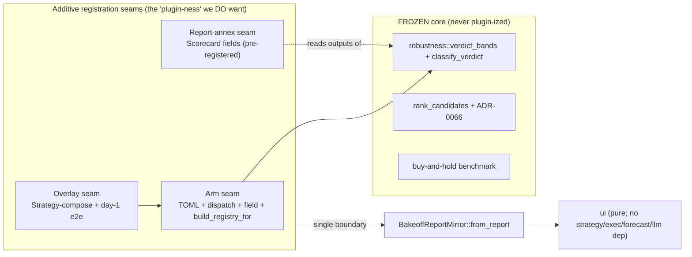
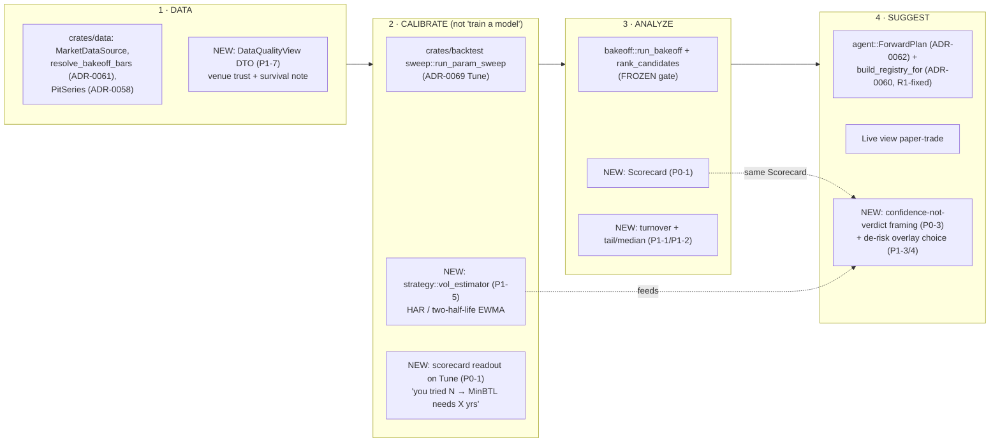

# v2 Architecture — extending the traceable advisor (research → buildable plan)

> **Charter (operator's four questions).** This document answers, grounded in the
> *real* v2.0 code seams (verified, not the spec prose): **(Q1)** where we EXTEND
> the framework, **(Q2)** where REFACTORING is in order + blast radius, **(Q3)**
> whether we need a new PLUGIN architecture or stay additive, and **(Q4)** how the
> framework DEVELOPS over the next 2–3 phases around the
> DATA → TRAIN → ANALYZE → SUGGEST spine.
>
> **Primary input:** [`v2-analysis.md`](v2-analysis.md). **Ground truth:** the
> current `crates/` tree + `spec/architecture/` + the 75 ADRs.
>
> **This is a PLAN.** It does NOT edit `spec/architecture.md`. Each v2 feature
> graduates into a numbered ADR + a section-file edit *as it lands*. The ADR
> numbers cited below (0075+) are **reserved/anticipated**, not yet written.

---

## §0 Verified ground truth — what the code ACTUALLY is (corrects the analysis)

Per the standing rule "verify code before trusting spec status," I read the seams
before designing. Two of the analyst's premises are **stale** and reshape the plan:

| Analyst premise | Code reality (verified 2026-06-28) | Consequence |
|---|---|---|
| "F5b SMA-proxy: forward run trades an SMA stand-in for non-SMA picks" (P0-2, §1 Stage 4) | **FALSE — F5b shipped.** `build_registry_for` (`crates/agent/src/runtime.rs:335`) maps SMA/MACD/RSI/BBands/buyhold/short/2 ensembles to the *real* `ComposedStrategy`-from-TOML, and **explicitly `bail!`s on unknown ids** (`runtime.rs:476`) — "refusing to silently fall back to SmaCrossover proxy (F5b anti-fake gate)". ADR-0070 even promotes tuned configs through it. | P0-2 as written is **already done**. The real, narrow gap is **forward-fidelity COVERAGE** (§2 R1): 14 crownable arms added *after* F5b (ADR-0067/0071/0072/0073) are NOT in the match → a crowned `v0.obv`/`v0.donchian_break`/`v0.8.vote.k2of4`/`v0.dvol_regime`/`v0.macro_riskon` **errors the forward run**. |
| "PBO/N_eff need a per-config T×N return matrix that we do NOT capture; `CandidateResult` stores only equity" (CX-1) | **PARTIALLY FALSE.** `CandidateResult.equity_curve` AND `SweepCellResult.equity_curve` (`sweep.rs:524`) already store the full per-arm/per-cell equity series. The T×N **return** matrix is a pure `windows(2).ln()` derivation away — no new capture. What is *not* retained is **non-crowned sweep cells across families** in one struct, but the within-sweep `SweepReport.cells` already holds all 24. | CX-1 plumbing is **much smaller than feared** — PBO is computable from existing `SweepReport.cells[].equity_curve` for the Tune/sweep surface today; the bake-off field is only ~18 arms (not a sweep) so PBO-over-the-field is a *different, smaller* question. See §2 R2. |

**The other big finding the analyst got right:** the tail/median metrics (P1-2) are
**near-free**. `compute_robustness_distribution` (`bootstrap.rs:120`) already builds
1000 `PathMetrics` per candidate, each carrying `final_equity`, `total_return`,
`max_drawdown` (`stats/mod.rs:336`). CVaR/ES, median terminal wealth, and skew are
reductions over that *existing* path vector — additive, gate-untouched.

**Frozen-gate location (binding for everything below):** the bands are
`crates/backtest/src/bakeoff/robustness.rs::verdict_bands` (5 FRAGILE + 5 ROBUST
constants) and the classifier `classify_verdict` (`robustness.rs:120`). The ranking
rule is `rank_candidates` (`rank.rs:44`) with the ADR-0066 benchmark exemption.
**None of these may change** — every v2 line below is additive to them.

**Anchor reality:** 119/119 (`spec/anchors.toml`, despite the stale `87/87` comment
header). The advisor bake-off/sweep paths run `write_report=false`, so the scorecard,
tail metrics, turnover, and overlays are **anchor-safe by construction** *as long as
they stay off the anchored CLI report path*. The one real anchor hazard is the
cost-default change (§2 R3 / CX-7).

---

## §1 Extension map (Q1) — per recommended v2 feature: the exact seam

> Legend: **[A]** = additive to an existing struct/trait/module (no new structure);
> **[N+]** = needs a new module/file but composes with existing traits (no new
> *architecture*); **[REFACTOR-FIRST]** = blocked on a §2 refactor.

### P0 — the credibility core

**P0-1 · Overfitting scorecard (N_eff → DSR → MinBTL → PBO).** `[A]` + `[N+]`
- **Compute home:** a new pure module `crates/backtest/src/bakeoff/scorecard.rs`
  (sibling of `bootstrap.rs`/`rank.rs`). Closed-form `DSR`, `MinBTL`, `N_eff` are
  pure functions of *(N, the per-candidate Sharpe vector, the crown's bootstrap
  distribution)* — all three inputs already exist in `run_bakeoff` (it holds every
  `CandidateResult.kpis.sharpe` and can ask `compute_robustness_distribution` for
  the crown's `DistributionSummary`). **No plumbing for the closed forms.**
- **Carrier:** a new `Scorecard` struct added as **one field on `Recommendation`**
  (`bakeoff/mod.rs:667`) — `pub scorecard: Scorecard`. `Recommendation` is already
  the rationale carrier; this is the natural home (the verdict's "why it's credible"
  lives next to "which branch fired").
- **UI seam:** mirror `Scorecard` → a `ui`-owned `ScorecardView` inside the single
  `BakeoffReportMirror::from_report` boundary (`leaderboard/state.rs:223`). Copy in
  `crate::strings`. **Zero new `ui` dep edge** (it crosses as plain `f64`/`Decimal`).
- **PBO (item E/F):** `[N+]` — `compute_pbo_cscv(returns_matrix)` in the same module,
  fed by the **sweep's** `SweepReport.cells[].equity_curve` (already captured). PBO
  over the *bake-off field* (~18 heterogeneous arms) is a weaker construct than PBO
  over a *sweep* (homogeneous family grid) — ship PBO **on the Tune/sweep surface
  first** where CSCV is statistically meaningful, and treat field-level PBO as
  report-only/deferred. **Report-only, never a band edit** (CX-3 → §6 D3).
- **Refs:** `research/backtesting/application-overfitting-and-multiple-testing.md` §6
  A–F; `research/evolution/application-anti-overfitting-and-search-discipline.md` §6.

**P0-2 · Forward-fidelity (the analyst's "F5b") — REDEFINED as COVERAGE.** `[REFACTOR-FIRST]`
- F5b's anti-proxy core is **already shipped**. The v2 work is the **§2 R1 refactor**:
  extend `build_registry_for` (`runtime.rs:335`) to cover the 14 post-F5b arms.
  Not a new feature — a coverage refactor. See §2 R1.

**P0-3 · "Confidence check, not verdict" framing + scorecard alongside the plan.** `[A]`
- **Seam:** the forward-plan read path (`agent::config::ForwardPlan`, ADR-0062, over
  `RunHandles.forward_plan_rx`) gains a `confidence: ScorecardSummary` field (a thin
  projection of P0-1's `Scorecard`). Mirrored to `ui` via the existing
  `forward_plan/adapter.rs` boundary. Copy relabel in `crate::strings`.
- **No new structure** — it reuses P0-1's output + the ADR-0062 mirror seam.

### P1 — visible honesty (risk-shaping + cost realism)

**P1-1 · Turnover as a first-class KPI/column.** `[A]`
- **Seam:** add `pub turnover: Decimal` to `CandidateKpis` (`bakeoff/mod.rs:629`),
  computed in `derive_candidate_kpis` from `RunReport` (trade notional / mean equity,
  or Σ|Δposition| — pick one, spec it in the feature file). Mirror into `LeaderRow`
  (`state.rs:40`). **Pure reporting; no equity change ⇒ no anchor break.**
- **Refs:** `research/backtesting/application-cost-and-impact-modeling.md` §6 A.

**P1-2 · Coherent tail + median reporting (CVaR/ES, Sortino, median, skew).** `[A]`
- **Seam:** extend `DistributionSummary` (`stats/mod.rs:307`) with `cvar_95`,
  `cvar_99`, `median_terminal_wealth`, `skew` — all reductions over the *existing*
  `PathMetrics` vector inside `DistributionSummary::from_path_metrics`
  (`stats/mod.rs:365`). Sortino/Calmar already exist on `CandidateKpis` — just mirror
  them into `LeaderRow` display (today they're carried for narration only, `state.rs:48`).
- **Critical:** report **CVaR not VaR** (VaR is non-coherent — the doc is explicit).
  **No gate touch** — `classify_verdict` keeps reading only its 5 frozen signals.
- **Refs:** `research/risk-and-sizing/application-position-sizing-and-bet-sizing.md` §6 P1;
  `research/risk-and-sizing/application-vol-targeting-and-drawdown-overlays.md` §6 P2-D.

**P1-3 · Drawdown-control overlay (HWM restart).** `[N+]`
- **Seam:** new `crates/strategy/src/drawdown_control_overlay.rs`, mirroring the
  `VolTargetingOverlay`/`Strategy` shape (`vol_targeting_overlay.rs`). Cushion
  multiplier `M(k)=(d_max−d(k))/(1−d(k))` (NORMALISED in implementation to
  `M(k)=(d_max−d(k))/[d_max·(1−d(k))]` so `M(0)=1.0` at HWM, `M(d_max)=0` at floor — the
  correct operator contract; the bare research formula gives `M(0)=d_max` which is the wrong
  direction. ADR-0080 §D2 ratifies the normalised form.) + the **load-bearing HWM restart** (without
  it BTC Sharpe collapsed −0.04; with it held 1.52, max-DD 72%→20%). Composes with
  `FixedFractionSizer` — **never bypasses the budget cap**.
- **Bake-off arm:** a new `v0.dd_control` id (or as a sizing modifier on an existing
  arm — feature-file call). Forward wiring goes through the **same R1 coverage seam**.
- **MANDATORY day-1 baseline-equity-divergence e2e** (CLAUDE.md non-negotiable; pattern
  `crates/strategy/tests/vol_targeting_overlay_end_to_end.rs`). This is the
  v3-vol-overlay-noop precedent — the overlay MUST be proven to *change* equity.
- **Refs:** `research/risk-and-sizing/application-vol-targeting-and-drawdown-overlays.md` §6 P1-B.

**P1-4 · Reposition the shipped vol-targeting overlay as a risk tool.** `[A]` **DEV-DONE 2026-06-30**
- **Seam:** reparameterise `vol_targeting_overlay.rs` (slow ~126-day-half-life EWMA σ̂,
  cost-and-vol-scaled no-trade band, **de-risk-only**) + report each coin's per-window
  return-vol correlation (so the operator sees whether a Sharpe gain is even
  mechanistically possible — crypto's leverage effect is reversed, γ=−0.261). Existing
  e2e stays green; **add a divergence assertion if defaults change.**
- **What landed:** `VolSource` enum (Ewma/Garch); `VolTargetingConfig` gains 4 fields
  (`vol_source`, `ewma_lambda`, `no_trade_band`, `derisk_only`); `p1_4_defaults()` ctor;
  `ReturnVolCorrelation` struct (Pearson ρ per symbol, diagnostic-only); `PerSymbolEwmaState`
  (rolling log-return buffer). 33 new unit tests (233→266). Backward-compat `Default`
  (Garch source, no band, derisk_only=false) keeps existing e2e green without modification.
- **Refs:** `research/risk-and-sizing/application-vol-targeting-and-drawdown-overlays.md` §6 P1-A.
- **Spec:** `spec/v2/advisor-vol-overlay-reposition/`; trace `REQ-V2-P1-4-VOL-OVERLAY-REPOSITION-001`.

**P1-5 · σ̂ upgrade: multi-horizon realized-vol (HAR / two-half-life EWMA).** `[N+]`
- **Seam + the layering rule (CX-5 / §6 D5):** a **shared vol-estimator** consumed by
  BOTH overlays. It must NOT pull `ui` into a `strategy` dep. **Home it in
  `crates/strategy/src/vol_estimator.rs`** (a pure `fn(&[Bar]) -> Decimal` / `σ̂`
  series). Rationale: it is a *sizing input*, both consumers (`drawdown_control_overlay`,
  `vol_targeting_overlay`) live in `strategy`, and `ui` never touches it (it sees only
  the overlay's *equity output* via the existing mirror). **Do NOT put it in `forecast`**
  — that would make the de-risk overlay depend on `forecast` and blur the
  "vol-for-sizing ≠ return-prediction" line. The optional *gated model* vol forecast
  (CX-5) is the one thing that lives behind the `forecast` feature flag and feeds this
  estimator as an alternative source — strictly opt-in, never default, never the gate.
- **Refs:** `research/risk-and-sizing/application-vol-targeting-and-drawdown-overlays.md` §6 P1-C;
  `research/crypto-market-structure/application-volatility-regimes-and-overlays.md` §6 F.

**P1-6 · Cost-model hardening + venue-trust map.** `[A]` but **anchor-hazardous** — see §2 R3.
- **Seam:** `crates/cost/src/slippage.rs` (today linear-bps) gains a **state-aware
  (vol-scaled) spread mode** as a NEW variant, **opt-in**, default unchanged. Venue
  trust map = a dev-note + data-source config (display-only). Fee-sensitivity sweep =
  a new bin or a Tune axis.
- **This is the single largest blast-radius item** (CX-7) — §2 R3 + §6 D6.
- **Refs:** `research/crypto-market-structure/application-data-integrity.md` §6 A/B;
  `research/backtesting/application-cost-and-impact-modeling.md` §6 B/E.

**P1-7 · DATA-stage trust/universe/quality surface (display-only).** `[A]`
- **Seam:** a plain DTO field (`DataQualityView`) the `ui` already consumes — venue/
  provenance readout + "conditional on survival" note + thin/wash/P&D warning. No
  behavior, no overlay e2e (display-only — the data-integrity doc names this constraint).
- **Refs:** `research/crypto-market-structure/application-data-integrity.md` §6 C.

### P2 — coverage, narration hardening, gated experiments (expected-null)

| Item | Seam | Class |
|---|---|---|
| P2-1 narration faithfulness hardening | `crates/llm` + the F9 post-check (ADR-0064 amendment) | `[A]` |
| P2-2 no-alpha-gate null-falsification CI | a new `crates/backtest/tests/null_data_no_crown.rs` running the full bake-off+rank on GBM/GARCH/OU nulls | `[N+]` test-only |
| P2-3 matched-activity random-null sub-test | a comparator addendum in the scorecard module (report-only) | `[A]` |
| P2-4 cost-aware "trade-less" filter | a `Strategy`-composing filter; needs `expected_move` def per rule (CX-6, analyst sign-off) | `[N+]` |
| P2-5 funding-sign froth arm `v0.funding_froth` | the existing `basis_data`/`funding_data` exogenous seam (ADR-0072 precedent) | `[N+]` |
| P2-6 active-plus-hold blend arm | a new bake-off arm + day-1 e2e | `[N+]` |
| P2-7 dead-end + sizing-posture docs | a dev-note + a sizing-posture ADR | docs |

**Every `[N+]` overlay/arm ships a day-1 divergence e2e** (CLAUDE.md). No exceptions.

---

## §2 Refactors required (Q2) — what must change first + blast radius

Three refactors gate v2. Ordered by *how-many-features-they-unblock*.

### R1 — `build_registry_for` forward-fidelity COVERAGE (the top refactor)

- **What:** `build_registry_for` (`crates/agent/src/runtime.rs:335`) routes only 7
  ids. The crownable advisor field (`bakeoff/mod.rs` `advisor_field` + the
  ensemble/macro/dvol fields) now has **~32 ids**. The 14 not covered —
  `v0.donchian_break`, `v0.donchian_floor`, `v0.vol_breakout`, `v0.roc_momentum`,
  `v0.obv` (ADR-0071); `v0.dvol_regime` (ADR-0072); `v0.macro_riskon` (ADR-0073);
  and 6 ensemble ids `v0.8.vote.{trend_pair,tr_mr_macd_rsi,tr_mr_sma_bb,any1of4,k2of4,k3of4}`
  (ADR-0067) — hit the `unknown => bail!` arm. **If the gate crowns one of them, the
  forward run/plan errors out** (it does NOT run an SMA proxy — the anti-fake gate
  already works; it just refuses).
- **Why first:** every P0/P1 that *adds an arm or overlay* (P1-3 `v0.dd_control`,
  P2-5/P2-6 arms) inherits this seam; and the **honesty contract is broken today** for
  the 14 — the SUGGESTION stage can't describe a crown it can't build. This is the
  *true* "one strategy definition everywhere" gap the analyst pointed at, just located
  precisely.
- **Blast radius — SMALL and well-fenced:**
  - The 5 ADR-0071 DSL arms: load their `config/strategies/<id>.toml` exactly like the
    MACD/RSI/BBands arms (3 lines each, copy the existing arm).
  - The 6 ensemble ids: **`build_ensemble` already knows all 8** (`crates/strategy/src/ensemble.rs:508`)
    — the fix is *one* match-arm widening (route all `v0.8.vote.*` to `build_ensemble`),
    not new engine code.
  - `v0.dvol_regime` / `v0.macro_riskon`: hand-written strategies (DvolRegimeStrategy,
    the macro-gated path) — wire their constructors; they already exist for the bake-off.
  - `build_forward_plan_from_registry` (`plan.rs:190`) is the sibling resolver — same
    14 ids, same fix, so the F6 plan describes the real crowned rules.
  - **Tests:** `forward_run_engine_fidelity.rs` extends to assert each new id builds
    (not bails); the `None` path stays byte-identical → **anchors 119/119 untouched**.
  - **No type changes, no new dep edges, no FROZEN-gate impact.** Pure dispatch widening.
- **Owed ADR:** an amendment to **ADR-0060** (the forward-run seam) recording the
  coverage contract "every crownable arm is forward-buildable; unknown still bails."

### R2 — return-matrix capture for PBO (smaller than CX-1 feared)

- **What CX-1 feared:** that no per-config return matrix exists. **Reality:**
  `SweepReport.cells[].equity_curve` (`sweep.rs:524`) holds all 24 cells' full equity
  series; `CandidateResult.equity_curve` holds each bake-off arm's. The T×N **return**
  matrix is `equity.windows(2).map(ln)` — a pure derivation.
- **The actual refactor (small):** add a pure `fn returns_matrix(&SweepReport) ->
  Vec<Vec<f64>>` helper in the scorecard module; CSCV consumes it. **No change to
  `sweep.rs`/`mod.rs` capture** — the data is already retained because the sweep
  surfaces the bootstrap distribution per cell (R3 of ADR-0069). The only open question
  is whether to retain *bake-off field* curves for a field-level PBO; the field already
  keeps `BakeoffReport.candidates[].equity_curve`, so even that is free.
- **Blast radius — NEAR ZERO** (a read-only derivation). The reason to still gate it
  behind P0-1's closed forms is **statistical**, not structural: PBO/CSCV is meaningful
  on a *homogeneous sweep grid*, marginal on an 18-arm heterogeneous field. Ship
  closed-form DSR/MinBTL/N_eff first (most credibility, zero risk); PBO on the Tune
  surface second.
- **Recommendation:** **defer PBO to increment 2, but NOT for plumbing reasons** — the
  plumbing is trivial; defer because DSR/MinBTL/N_eff deliver ~80% of the credibility
  story and PBO needs the Tune-surface home to be honest.

### R3 — cost-model default vs the 119 anchors (the largest blast radius)

- **What:** any change to the *default* cost path (`crates/cost/src/slippage.rs`,
  linear-bps today) changes net returns ⇒ **every one of the 119 anchored report
  bodies' SHA breaks** (CX-7).
- **Blast radius — LARGE if done as a default bump; ZERO if done opt-in:**
  - **Opt-in new mode (recommended):** add a `SlippageModel::VolScaledSpread` variant,
    default stays `LinearBps`. The advisor bake-off (which runs `write_report=false`)
    can opt in *without touching any anchored body*. Anchors stay 119/119.
  - **Versioned default bump (rejected for v2):** would require the ADR-0038 §D6
    re-emission protocol across all 119 — a multi-day, high-risk migration for marginal
    honesty gain at €200 scale (impact ≈ 0, confirmed on BTC).
- **Recommendation:** **opt-in-forever for v2.** Revisit a default bump only if a coin
  is found where flat-bps materially mis-costs a *crownable* arm. Document the decision
  in a cost ADR. **Run `scripts/verify_anchors.sh` before AND after** any `cost` touch
  (anchors keyed by NAME not filename — a stale grep lies).
- **Owed ADR:** a cost-model ADR (0078) recording opt-in-forever + the calibration
  tightrope (punitive costs that manufacture a too-easy "hold wins" are *also* dishonest).

### Refactors NOT needed (explicitly)

- **UI layering:** the mirror discipline (`BakeoffReportMirror::from_report` as the one
  boundary) absorbed every v1 feature and absorbs the scorecard/tail/turnover as added
  fields. **No `ui` refactor.** The `ui`-purity invariant (no dep on
  strategy/exec/forecast/llm) holds for all of §1.
- **`CandidateResult` shape:** adding `turnover` to `CandidateKpis` and a `scorecard`
  field to `Recommendation` is additive — no restructure.
- **The bootstrap/gate:** FROZEN. Tail metrics piggyback on `PathMetrics`; the scorecard
  reads outputs. Nothing in `robustness.rs`/`rank.rs` bands changes.

---

## §3 Plugin-architecture decision (Q3)

### VERDICT: **NO plugin architecture. Stay additive.** Adopt three lightweight,
### already-latent *registration seams* instead of a runtime plugin layer.

**The question:** do strategies / overlays / data-sources / scorecard-metrics /
workflow-stages need a formal plugin layer (trait-object registries, dynamic
discovery, WASM hot-load), or is the existing additive pattern sufficient?

**The evidence says additive wins, decisively:**

| Plugin axis | Does it need a plugin layer? | Why / the existing seam |
|---|---|---|
| **Strategies** | **No** | `Strategy` trait + `StrategyRegistry` + ComposedStrategy DSL already *is* the strategy plugin point. New arms = new TOML + a dispatch arm. ADR-0007 **already deferred WASM hot-load to "v1+"** and it never paid off. The FROZEN, *pre-registered* slate is the anti-overfit defense — a dynamic strategy-discovery plugin would **fight** the core honesty contract (it is exactly OT-3 automated-alpha-search by the back door). |
| **Overlays** | **No** | Overlays are `Strategy`-composing structs (`vol_targeting_overlay.rs`). New overlay = new file implementing the trait + composing `FixedFractionSizer`. The day-1-divergence-e2e mandate is the real gate, not a registry. |
| **Data sources** | **No** | `MarketDataSource` trait (ADR-0025) + the `PitSeries` exogenous-arm seam (ADR-0058) + `resolve_bakeoff_bars` (ADR-0061) already abstract feeds. New feed = new impl behind the trait. |
| **Scorecard metrics** | **No** | A scorecard is a **pure reduction** over data the bake-off already holds. A "metric plugin" registry would add indirection for a set that changes once a quarter and must be *pre-registered* anyway (second-order snooping risk — CX-2). A plain `Scorecard` struct with named fields is more honest (the operator reads exactly the metrics that exist). |
| **Workflow stages** | **No (but formalize the spine — §4)** | The DATA→TRAIN→ANALYZE→SUGGEST stages are **screen-routed today** and that is fine. What's missing is a *naming/IA* layer + an optional thin `agent`-side state enum, NOT a plugin host. See §4. |

**Why a plugin layer is the WRONG choice here (tradeoffs):**

- **It fights the product's spine.** The entire credibility thesis rests on a
  **pre-registered, FROZEN** set of arms + a FROZEN gate. Runtime extensibility (the
  whole point of a plugin layer) is *the threat model* (data-snooping, OT-3). A plugin
  architecture optimizes for the one property this product deliberately refuses.
- **Cost without benefit.** WASM/dynamic-dispatch plugin hosts buy hot-load,
  third-party extension, and process isolation. This is a single-binary, single-author,
  paper-sim advisor. None of those are wanted (ADR-0007 already concluded this for v1).
- **It would breach the `ui` purity seam.** A generic plugin host that surfaced
  arbitrary plugin output to the cockpit would dissolve the `BakeoffReportMirror`
  one-boundary discipline that keeps `ui` free of `strategy`/`exec`/`forecast`/`llm`.
- **Testability regresses.** The current "every component behind a trait, faked in
  tests" already gives mockability. A plugin layer adds a discovery/lifecycle surface
  that itself needs faking — net negative for the day-1-e2e discipline.

**What we adopt instead — three latent "registration seams" (formalized, not new
architecture):**

1. **The arm seam** (already proven, ADR-0067/0071): *new arm = TOML + `run_scenario`
   dispatch arm + `default_field()` id + `build_registry_for` arm + day-1 e2e.*
   v2 makes this a **documented checklist** (it's currently tribal knowledge spread
   across ADRs) and closes its one hole (R1).
2. **The overlay seam** (ADR-precedent `VolTargetingOverlay`): *new overlay = new file
   impl `Strategy`, compose `FixedFractionSizer`, day-1 divergence e2e.*
3. **The report-annex seam** (new, P0-1): *new scorecard metric = a named field on
   `Scorecard` + a mirror field + a `strings` line.* Pre-registered, never dynamic.



**Design sketch — the `Scorecard` annex (the one new type):**

```rust
// crates/backtest/src/bakeoff/scorecard.rs  (NEW, pure module)
pub struct Scorecard {
    pub n_candidates: usize,          // raw N (field size)
    pub n_eff: f64,                   // closed-form rho_bar + (1-rho_bar)*M
    pub deflated_sharpe: f64,         // DSR of the crown (exact formula)
    pub min_btl_years: f64,           // 2*ln(N)/SR^2 pre-flight
    pub pbo: Option<f64>,             // CSCV; Some only on the sweep surface (R2)
    pub crown_clears_dsr: bool,       // DSR >= 0.95 (report-only flag, NOT a veto in v2)
}
// pure fns: dsr(...), min_btl(...), n_eff(...), compute_pbo_cscv(returns_matrix)
// -> Recommendation.scorecard : Scorecard   (carrier; bakeoff/mod.rs:667)
// -> ScorecardView mirror in BakeoffReportMirror::from_report  (state.rs:223)
```

This is the whole "architecture change" the scorecard needs. No host, no registry, no
dynamic dispatch — one struct, one carrier field, one mirror field.

---

## §4 The DATA → TRAIN → ANALYZE → SUGGEST spine (Q4 + the analyst's workflow)

The operator wants a **frontend-driven end-to-end workflow**. The honest mapping
(per `v2-analysis.md` §1: "training" = vol/risk-for-sizing + gate-tied tuning, NEVER
return prediction) onto the real crate/module boundaries:



**Module boundaries per stage (all existing crates; no new crate):**

| Stage | Owns | Crate(s) | Frontend surface |
|---|---|---|---|
| **DATA** | feed resolution, PIT discipline, quality DTO | `data`, `core` | Leaderboard guided input (F3) + a DATA-quality panel (P1-7) |
| **CALIBRATE** (rename of "TRAIN") | param sweep (gate-tied) + vol-for-sizing estimator + scorecard readout | `backtest` (sweep), `strategy` (vol_estimator) | **Tune screen promoted to a named stage** (ADR-0069 → §6 D7) |
| **ANALYZE** | bake-off + rank + scorecard + KPI annex | `backtest` | Leaderboard + the scorecard block + turnover/tail columns |
| **SUGGEST** | forward plan + paper-trade + confidence framing + de-risk choice | `agent`, `strategy`, `ui` | Forward-plan + Live views |

**How the frontend surfaces tie together (the IA layer — this is the spine's "glue"):**
- The spine is **screen-routed, not a plugin/state-machine host** (§3 verdict). v2 adds
  a **named, ordered stage indicator** in `ui` (a breadcrumb/stepper component) that
  maps the four screens to the four verbs, and threads the *same* `BakeoffReportMirror`
  + `ScorecardView` from ANALYZE into SUGGEST so the forward run reads as a "confidence
  check on the crowned pick," not a fresh verdict.
- **Optional thin state enum in `agent`** (`AdvisorStage`) only if the operator wants
  forward/back navigation to *carry context* (coin+budget+window+crown) across stages
  without re-running. This is a *convenience*, not the architecture — recommend
  deferring until the screens exist and the need is felt (§6 D7).

**Naming (binding, per the analyst):** the second stage is **"Calibrate"** /
**"Risk & tuning,"** NEVER "Train a model" — the latter invites the return-prediction
misread the research forbids. The stage *fits vol for sizing and tunes rule params*,
both gate-tied.

---

## §5 Roadmap (Q4) — phased evolution + ADRs owed per phase

> Sequenced by **credibility-per-unit-risk**, honoring the analyst's §5 ship order and
> the §0 corrections. Each phase lists the **ADRs owed** (registered atomically in
> `_bmad-output/planning-artifacts/architecture/decisions/README.md` when written — the 2026-05-29 contract).

### Phase 2A — the credibility layer (the product goal made visible)
**Ship:** P0-1 closed-form scorecard (DSR + MinBTL + N_eff, **report-only**) →
P1-1 turnover → P1-2 tail/median reporting.
**Why first:** near-zero blast radius (additive fields + reductions over existing
`PathMetrics`), and it *is* the "traceable & plausible" product thesis. Turnover+tail
make the null **legible** ("here's why holding wins on cost").
**ADRs owed:**
- **ADR-0075** — Overfitting scorecard seam (N_eff/DSR/MinBTL closed forms; the
  `Scorecard`-on-`Recommendation` carrier; report-only, FROZEN-gate-untouched; the
  N_eff closed-form freeze at MAX_SWEEP_CONFIGS=24 per CX-2).
- **ADR-0076** — KPI annex: turnover + coherent-tail (CVaR/ES/median/skew) reductions
  over the existing bootstrap distribution (gate-untouched, anchor-safe).

### Phase 2B — forward honesty (the SUGGESTION stage made correct)
**Ship:** R1 forward-fidelity coverage (the 14 arms) → P0-3 confidence-not-verdict
framing + scorecard-alongside-plan.
**Why second:** R1 is a correctness prerequisite — the SUGGESTION stage must be able
to build every crownable arm before we relabel its honesty. Small, well-fenced.
**ADRs owed:**
- **ADR-0077** — `build_registry_for`/`build_forward_plan_from_registry` coverage
  contract (amends ADR-0060): every crownable arm is forward-buildable; unknown still
  bails; `None` path byte-identical (anchors 119/119).

### Phase 2C — risk-shaping (the one place active management plausibly helps)
**Ship:** P1-3 drawdown-control overlay (HWM restart) → P1-4 vol-overlay reposition →
P1-5 σ̂ estimator. Each as an explicit de-risk *choice* on sizing, sold as
drawdown/tail reduction (NEVER a Sharpe gain — crypto's leverage effect is reversed).
**Why third:** depends on R1 (forward wiring) and on the scorecard (so the cost of the
de-risk is shown honestly via mutual-non-dominance framing).
**ADRs owed:**
- **ADR-0079** — Drawdown-control overlay (HWM restart; static-CPPI vs ratcheting-TIPP
  floor — the operator-decide call CX-8/§6 D8; the shared `vol_estimator` home per D5;
  mandatory day-1 divergence e2e).

### Phase 2D — cost realism + coverage hardening (the null made robust)
**Ship:** P1-6 cost hardening (**opt-in-forever**, R3) + P1-7 DATA-quality surface →
P2-1 narration hardening + P2-2 no-alpha-gate CI → the remaining P2 arms/experiments.
**ADRs owed:**
- **ADR-0078** — Cost-model opt-in `VolScaledSpread` mode (default unchanged; the
  calibration tightrope; anchors 119/119 by construction; the deliberate decision NOT
  to bump the default in v2).
- **ADR-0064 amendment** — narration faithfulness hardening (verbatim-number match +
  banned prediction/causation verbs).
- (P2-4/P2-5/P2-6 each get a small ADR if/when scoped; P2-7 = a sizing-posture ADR.)

### Phase 3+ — the spine IA (if/when the operator wants carried context)
**Ship:** the named-stage stepper in `ui` + (optionally) the thin `agent::AdvisorStage`
context carrier. PBO on the Tune surface (R2) once Tune is a named stage.
**ADRs owed:** an IA/stage-spine ADR only if the `agent` state enum is adopted.

**ADR-number reservations (anticipated, monotonic from the current max 0074):**
0075 scorecard · 0076 KPI annex · 0077 forward coverage · 0078 cost opt-in ·
0079 drawdown overlay. (Reserved here for planning; **written = registered atomically**
when each lands — not before.)

---

## §6 Open decisions for the operator

These are the decisions that are **not pure engineering** — they need an operator
product/values call (durable-over-quick framing). Carried from `v2-analysis.md` §5 +
the §0 corrections.

### §6.0 — RESOLVED (operator, 2026-06-28)

All decisions ratified to the architect's recommended (durable) defaults:

- **D1–D4 (scorecard scope) → REPORT-ONLY, CLOSED-FORM.** Ship DSR + MinBTL + N_eff
  (closed-form `ρ̄+(1−ρ̄)·M`, **frozen** at the 24-config scale — D4) as a **report-only**
  scorecard. **No crown-veto, no hard threshold / ORATIO** in v2 (the design leaves a
  one-line veto switch via `Scorecard.crown_clears_dsr` for later — D2/D3). **PBO
  deferred** to the homogeneous Tune/sweep surface, not the 18-arm field (D1).
  - **D3 RE-CONFIRMED 2026-07-01 (operator), informed by P2-2 empirical data.** The
    no-alpha-gate null-falsification CI (`crates/backtest/tests/null_data_no_crown.rs`)
    proved the PRIMARY FROZEN gate alone crowns an active arm on ~1/5 pure-noise seeds
    (GBM→`v0.5.rsi`, GARCH→`v0.sma`), and the DSR scorecard caught every one
    (deflated-Sharpe ~0.4–0.78, all < 0.95). This VALIDATES the report-only scorecard as
    load-bearing (it catches what the primary gate misses via the documented
    `is_eligible()` per-candidate multiple-testing gap). Operator reviewed and **kept
    report-only** — the cockpit shows the crown AND its low deflated-confidence side by
    side; the `crown_clears_dsr` veto switch stays ready for a future FROZEN-gate change +
    its own ADR if wanted. The numbers are on short synthetic series (150 bootstrap paths
    vs production 1000, subset of arms) so production likely rejects more.
- **D5 (vol-estimator home) → `crates/strategy/src/vol_estimator.rs`.** Keeps
  vol-for-sizing ≠ return-prediction; the model-based vol forecast stays opt-in behind
  the `forecast` feature flag.
- **D6 (cost model) → OPT-IN-FOREVER.** New `SlippageModel::VolScaledSpread` variant;
  default `LinearBps` unchanged → anchors stay **119/119**. No default bump / re-anchor
  in v2.
- **D7 (Tune stage) → PROMOTE to a named "Calibrate" stage.** Screen-routed, carrying
  the P0-1 scorecard readout; the cross-stage `agent::AdvisorStage` context-carrier
  deferred until the need is felt.
- **D8 (drawdown floor CPPI vs TIPP + the X% promise) → RESOLVED 2026-06-30
  (operator): STATIC CPPI @ 20% DRAWDOWN.** Floor never moves (`floor = initial ×
  0.80`); HWM restart still load-bearing (the research benchmark: BTC, 0.1% costs,
  max-DD 72%→20% holding Sharpe 1.52). Simple operator promise: "never lose more
  than 20% of the starting €200." TIPP / ratcheting deferred to v0.2 — needs
  breach-frequency measurement on real crypto windows before any "lock-in-gains"
  promise. Recorded for ADR-0079 (P1-3 drawdown-control overlay).
- **D9 (F5b framing) → DONE** — the stale "SMA proxy" memory was corrected to
  "forward-coverage gap (14 post-F5b arms not in `build_registry_for`)".

**Build sequence (per §5):** Phase 2A (P0-1 report-only scorecard → P1-1 turnover →
P1-2 tail) needs **no R1**; Phase 2B = R1 forward-coverage + P0-3 framing; 2C =
overlays; 2D = cost opt-in + coverage hardening. **First to build: P0-1.**

- **D1 — PBO timing (resolves CX-1).** The return-matrix plumbing is *trivial* (data
  already captured). **Recommended:** ship closed-form DSR/MinBTL/N_eff first (Phase
  2A); add PBO on the **Tune/sweep surface** in Phase 3 where CSCV is statistically
  honest. *Decision needed: accept "PBO deferred to the sweep surface, not the
  18-arm field"?*

- **D2 — DSR threshold derivation (CX-4, operator values call).** Hard-code DSR ≥ 0.95,
  or derive it from the ORATIO odds-ratio ("a false 'beats-hold' is N× costlier than a
  miss")? ORATIO is more honest but needs the operator to state N. **Recommended:**
  ship report-only DSR (no threshold-as-veto) in 2A; defer the threshold *derivation*
  to when a veto is actually wanted (D3). *Decision needed: the costliness ratio N, or
  "report-only, no fixed cutoff."*

- **D3 — DSR/PBO crown-eligibility VETO vs report-only (CX-3, the recurring M-T1 lock).**
  Does a DSR/PBO disqualifier count as "additive" to the FROZEN gate or is it a
  frozen-rule change? **Recommended (durable):** ship the scorecard **report-only** in
  v2 (auditable, no-magic, zero frozen-gate risk — the operator reads the haircut and
  decides), and design the `Scorecard.crown_clears_dsr` flag so a *later* veto is a
  one-line switch the design already anticipates. A veto is the stronger product but
  needs its own ADR + an operator call. *Decision needed: report-only now (recommended),
  or scope the veto ADR now.*

- **D4 — N_eff method freeze (CX-2).** At MAX_SWEEP_CONFIGS=24, T ≫ 24 on any
  bootstrappable window, so the literature's "must cluster first when M>T" mandate
  **does not apply to us** — the closed form `ρ̄+(1−ρ̄)·M` is sufficient. **Recommended:**
  **pre-commit to the closed form** (cheap, sufficient forever at this scale); record
  the freeze in ADR-0075 to prevent second-order snooping. *Decision needed: ratify
  "closed-form N_eff, frozen" vs "carry clustering headroom for a hypothetical larger
  sweep."*

- **D5 — vol-estimator home (CX-5).** **Recommended:** `crates/strategy/src/vol_estimator.rs`
  (it's a sizing input; both overlay consumers live in `strategy`; keeps the
  vol-for-sizing ≠ return-prediction line clean; `ui` never touches it). The optional
  *gated model* vol forecast is the one thing behind the `forecast` feature flag.
  *Decision needed: ratify the `strategy` home (recommended) vs `forecast`.*

- **D6 — cost-model default vs 119 anchors (CX-7, the largest blast radius).**
  **Recommended:** **opt-in-forever** for v2 (`SlippageModel::VolScaledSpread` as a
  new variant, default `LinearBps` unchanged → anchors 119/119). Reject a versioned
  default bump (multi-day ADR-0038 §D6 re-emission for ≈0 honesty gain at €200 scale).
  *Decision needed: ratify opt-in-forever vs schedule a future re-anchor.*

- **D7 — promote Tune into a named CALIBRATE stage?** **Recommended:** yes — give the
  spine its second visible stage (with the P0-1 scorecard readout: "you tried N configs
  → MinBTL needs X years → DSR Y"). Keep it screen-routed; add the thin
  `agent::AdvisorStage` context carrier **only if** carried coin+budget+window+crown
  navigation is wanted. *Decision needed: name + promote Tune now, or keep it a Lab
  drill-down for v2.*

- **D8 — drawdown overlay floor: static (CPPI) vs ratcheting (TIPP) as the default
  operator choice (CX-8, product/UX call).** TIPP protects profits but caps upside;
  the floor is *probabilistic* (gap risk) and its breach-frequency on real crypto
  windows must be measured before the "never lose more than X%" promise is calibrated.
  *Decision needed when P1-3 is scoped: which floor is the default, and the X% promise.*

- **D9 — F5b framing (a heads-up, not a question).** The analyst's "F5b SMA-proxy" is
  **already fixed**; the real work is the R1 coverage refactor (14 arms). The
  backlog/memory note "F5 forward-fidelity gap (SMA proxy)" should be updated to
  "forward-fidelity COVERAGE gap (14 post-F5b arms not in build_registry_for)" so the
  next session doesn't re-chase a closed bug.

---

## Handoff envelope

```toml
[handoff]
from        = "architect"
to          = "developer"
feature     = "v2-architecture"
trace_refs  = ["REQ-V2-ANALYSIS-001"]
verdict     = "READY"
priority    = "P0"

[inputs]
brief       = "spec/v2/v2-analysis.md"
artifacts   = [
  "spec/v2/v2-analysis.md",
  "spec/architecture.md",
  "_bmad-output/planning-artifacts/architecture/decisions/0059-bakeoff-orchestrator-home-and-result-seam.md",
  "_bmad-output/planning-artifacts/architecture/decisions/0060-budget-aware-sizing-and-forward-paper-run-seam.md",
  "_bmad-output/planning-artifacts/architecture/decisions/0062-forward-plan-read-seam.md",
  "_bmad-output/planning-artifacts/architecture/decisions/0066-benchmark-exempt-from-allfragile.md",
  "_bmad-output/planning-artifacts/architecture/decisions/0069-gate-tied-parameter-sweep-seam.md",
  "_bmad-output/planning-artifacts/architecture/decisions/0070-promote-tuned-config-into-forward-paper-run.md",
  "crates/backtest/src/bakeoff/{mod,rank,robustness,bootstrap,sweep}.rs",
  "crates/backtest/src/stats/mod.rs",
  "crates/agent/src/runtime.rs",
  "crates/strategy/src/{ensemble,vol_targeting_overlay}.rs",
  "crates/ui/src/leaderboard/state.rs",
  "crates/cost/src/slippage.rs",
  "research/backtesting/application-overfitting-and-multiple-testing.md",
  "research/risk-and-sizing/application-vol-targeting-and-drawdown-overlays.md",
  "research/SYNTHESIS.md",
]

[outputs]
spec_files  = ["spec/v2/v2-architecture.md", "spec/trace.toml"]
adrs_added  = []   # none yet — ADRs 0075-0079 are RESERVED/anticipated, written as each feature lands (written = registered atomically per the 2026-05-29 contract)

[open_questions]
items = [
  "D1 PBO timing: closed-forms-first + PBO on the sweep surface only (recommended) — accept?",
  "D2 DSR threshold: report-only no-cutoff now (recommended), or state the ORATIO costliness ratio N?",
  "D3 DSR/PBO veto vs report-only: ship report-only + a one-line-switch-ready design (recommended) — accept?",
  "D4 N_eff: ratify closed-form-frozen at MAX_SWEEP_CONFIGS=24 (recommended)?",
  "D5 vol-estimator home: ratify crates/strategy (recommended) vs forecast?",
  "D6 cost default: ratify opt-in-forever VolScaledSpread (recommended) vs future re-anchor?",
  "D7 promote Tune into a named CALIBRATE stage now (recommended) vs keep as Lab drill-down?",
  "D8 drawdown floor: static-CPPI vs ratcheting-TIPP default + the X% promise (when P1-3 scoped).",
]

[assumptions]
items = [
  "The FROZEN robustness gate (verdict_bands + classify_verdict), the rank_candidates rule + ADR-0066 benchmark exemption, and the buy-and-hold benchmark stay byte-frozen; every v2 line is additive.",
  "Anchors stay 119/119 by construction (advisor bake-off/sweep run write_report=false); the only real anchor hazard is the cost default, resolved by opt-in-forever (D6).",
  "F5b's anti-SMA-proxy core is already shipped (build_registry_for bails on unknown ids); the v2 work is the R1 coverage refactor for the 14 post-F5b arms, NOT a fresh F5b.",
  "Tail/median metrics are reductions over the EXISTING 1000-path PathMetrics — no gate touch, no new capture.",
  "The PBO return-matrix is derivable from the already-captured SweepReport/BakeoffReport equity curves — CX-1 plumbing is near-zero; PBO is deferred for STATISTICAL reasons (sweep-surface home), not structural.",
  "Paper/sim only, single-coin, Decimal/USDT; multi-asset is a track change not a v2 arm; 'training' = vol-for-sizing + gate-tied tuning, never return prediction.",
  "The ui purity seam (no dep on strategy/exec/forecast/llm) holds for all of §1 — the scorecard/turnover/tail cross as plain f64/Decimal mirror fields via the single from_report boundary.",
]
```

HANDOFF → developer
Input files: spec/v2/v2-architecture.md, spec/v2/v2-analysis.md, spec/architecture.md
Risks: (1) cost-default change is the one large-blast-radius item — keep opt-in-forever (D6) or anchors break; (2) R1 forward-coverage must precede any new-arm/overlay feature or crowned arms error the forward run; (3) the scorecard must stay report-only in v2 (D3) — a DSR/PBO veto is a FROZEN-gate change needing its own ADR + operator call.

---

## Changelog

- 2026-06-28 (architect): initial v2 architecture plan authored from `v2-analysis.md`.
  Verified real seams (corrected two stale analyst premises: F5b is shipped → the gap
  is forward-COVERAGE of 14 post-F5b arms; PBO return-matrix is already-captured →
  plumbing near-zero). Q3 verdict: **no plugin architecture — stay additive** via three
  registration seams (arm / overlay / report-annex). Roadmap Phases 2A–2D + reserved
  ADRs 0075–0079 (written = registered atomically when each lands). Did NOT edit
  `spec/architecture.md` (this is a plan). Appended the `arch` link to
  REQ-V2-ANALYSIS-001 in `spec/trace.toml`.
