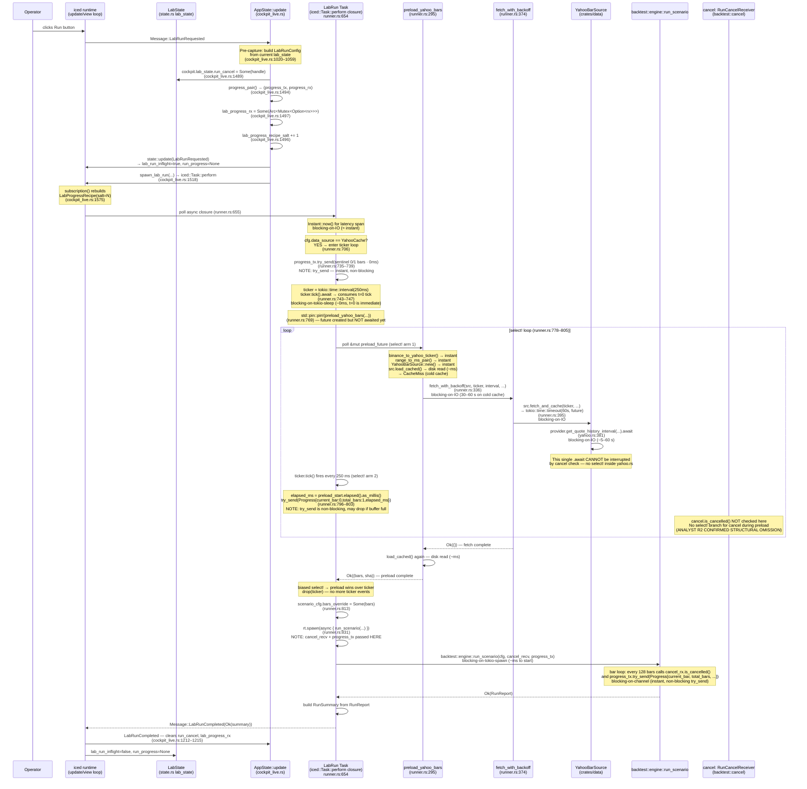
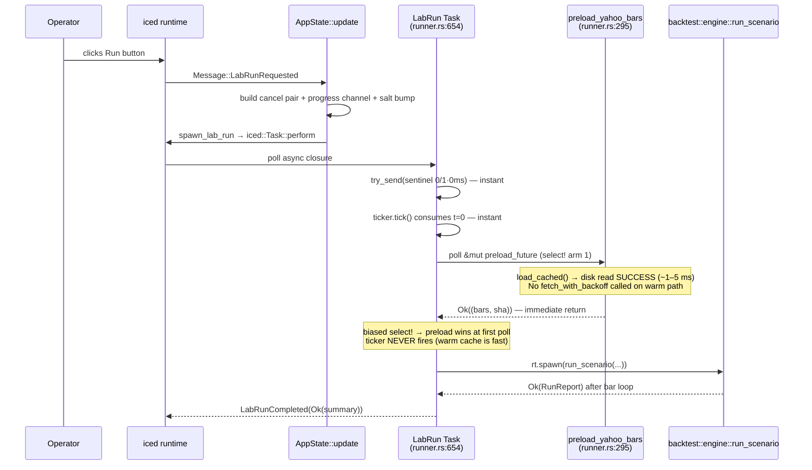

# Bug #64 — Yahoo+Run code-map (2026-05-29)

READ-ONLY pass. Zero crates/ edits. Output is a single structured
agent-readable dev-note for architect + analyst validation prior to any
attempt-3 surgery.

**Context**: Bug #64 D.1.1 attempt-2 (committed, operator-verified FAIL
2026-05-29). Two regressions: R1 = progress label dormant during 30-60 s
cold-cache Yahoo fetch; R2 = Stop button broken during preload window.

---

## § 1. Files in scope

| File | Role | Relevant line ranges |
|------|------|---------------------|
| `crates/ui/src/lab/runner.rs` | Spawn glue — bridges iced ↔ backtest engine; owns `preload_yahoo_bars`, `fetch_with_backoff`, `spawn_lab_run` | 1–1061 (entire file) |
| `crates/ui/src/lab/state.rs` | `LabState` struct — all per-session Lab fields including `run_cancel`, `run_progress`, `data_source` | 142–266 (struct), 338–407 (Default/constructors) |
| `crates/ui/src/state.rs` | `Message` enum variants for Lab run lifecycle; `Cockpit` struct; pure `update()` fn | 1504–1530 (variants), 2136–2190 (update arms) |
| `crates/ui/src/bin/cockpit_live.rs` | `AppState::update` — binary-side wrapper; wires cancel pair, progress channel, spawn call, Stop clear | 981–1531 (update fn), 1549–1641 (subscription fn) |
| `crates/ui/src/lab/progress.rs` | `LabProgressRecipe` — iced Recipe draining `mpsc::Receiver<Progress>` into `Message::LabRunProgress` | 1–113 (entire file) |
| `crates/data/src/yahoo.rs` | `YahooBarSource::fetch_and_cache` — single `.await` on `provider.get_quote_history_interval` (the 30-60 s blocker) | 364–413 |
| `crates/backtest/src/cancel.rs` | `RunCancelHandle` + `RunCancelReceiver` — std `sync_channel(0)` disconnect pattern | 1–95 (entire file) |
| `crates/backtest/src/progress.rs` | `ProgressSender` — tokio `mpsc::channel(8)`, lossy `try_send` | 1–116 (entire file) |
| `crates/backtest/src/engine.rs` | `run_scenario` — dispatches to scenario modules; receives `cancel_rx` + `progress_tx` | 592–930 |
| `crates/backtest/src/scenarios/momentum.rs` | Bar loop — `cancel_rx.is_cancelled()` + `progress_tx.try_send` at 128-bar boundary | 313–324 |
| `crates/backtest/src/scenarios/sma_composed_run.rs` | Bar loop — same cancel+progress poll contract | 433 |
| `crates/backtest/src/scenarios/pairs.rs` | Bar loop — same | 188 |
| `crates/backtest/src/scenarios/tcn_overlay.rs` | Bar loop — same | 184 |
| `crates/ui/src/lab/mod.rs` | Lab module root — re-exports | wiring only |
| `crates/ui/src/lab/activity.rs` | `ActivityTape` — activity status bar state (not on critical path for R1/R2) | peripheral |
| `crates/ui/src/lab/cache_state.rs` | Cache probe for toolbar badge — not on R1/R2 path | peripheral |

---

## § 2. Sequence diagram — "click Run to Yahoo cold-cache hit"



---

## § 3. Sequence diagram — "click Run to Yahoo cache-hit (warm)"



Key difference: the select! ticker loop fires **zero times** on warm
cache because `preload_yahoo_bars` returns before the first 250 ms
ticker tick can fire. The progress label jumps from 0/1·0s directly to
bar-loop progress events from the engine.

---

## § 4. State table — the loading label

| State name | `lab_state.*` field(s) | Message transitions IN | Message transitions OUT | iced gets render chance WHILE in this state? |
|---|---|---|---|---|
| **Idle** | `run_progress = None`, `lab_run_inflight = false` | — (cold start) | `LabRunRequested` | Yes — normal render |
| **SpawnPending** | `lab_run_inflight = true`, `run_progress = None` | `LabRunRequested` (cockpit_live.rs:1199) | First `LabRunProgress` or `LabRunCompleted` | **YES** — but only one render frame between LabRunRequested and iced starting to poll the Task. The sentinel `try_send` fires INSIDE the Task closure (runner.rs:735), not as a separate Message. |
| **Preloading / FetchingBackoff** | `lab_run_inflight = true`, `run_progress = Some(Progress{current_bar:0, total_bars:1, elapsed_ms})` | First `LabRunProgress` (sentinel) | Subsequent `LabRunProgress` ticks (every 250 ms from ticker) | **YES** — IF `LabProgressRecipe` is draining the channel. Each `LabRunProgress` message triggers a re-render. THE OPEN QUESTION: is the Recipe actually polling during this state? |
| **BacktestRunning** | `lab_run_inflight = true`, `run_progress = Some(Progress{current_bar: N>0, total_bars: M})` | `LabRunProgress` from engine bar loop | `LabRunProgressDone` or `LabRunCompleted` | **YES** — engine emits every 128 bars via try_send |
| **RunComplete** | `lab_run_inflight = false`, `run_progress = None` | `LabRunCompleted` | `LabRunRequested` (next run) | Yes — normal render |
| **RunError** | `lab_run_inflight = false`, `run_progress = None`, `last_run_error = Some(msg)` | `LabRunCompleted(Err(_))` | `LabRunRequested` (clears error) | Yes — shows error banner |
| **Cancelling** | `lab_run_inflight = true` (stays true), `run_progress = None` (may linger briefly) | `LabRunStopRequested` | `LabRunCompleted(Err("cancelled"))` | **YES** — but Stop during PRELOAD does nothing: `run_cancel` drop fires, `is_cancelled()` flips true, but NO code reads it during preload. Cancel only takes effect AFTER preload completes and engine's bar loop polls (R2 structural omission). |

**KEY FINDING for R1**: The label ticks only when `Message::LabRunProgress`
arrives AND iced re-renders. The progress messages come from
`progress_tx.try_send` inside the ticker arm of the select! loop.
Whether iced's LabProgressRecipe is draining that channel while the
preload awaits is the open question (analyst H-R1c).

---

## § 5. Call graph — async task structure

```
AppState::update (iced main thread — no tokio runtime)
└── [LabRunRequested branch]
    ├── cancellation_pair() → (RunCancelHandle, RunCancelReceiver)
    │   └── std::sync::mpsc::sync_channel(0)  [instant]
    ├── backtest::progress::progress_pair() → (ProgressSender, Receiver<Progress>)
    │   └── tokio::sync::mpsc::channel(8)  [instant, requires tokio rt? — see H-R1d]
    └── spawn_lab_run(rt_handle, cfg, cancel_recv, progress_tx, ...) → iced::Task<Message>
        └── iced::Task::perform(async move { ... }, Message::LabRunCompleted)
            │  [This future runs on iced's executor — NOT the agent tokio rt]
            │
            ├── tracing::info_span!(...)  [instant]
            ├── std::time::Instant::now()  [instant]
            │
            ├── [cfg(feature="yahoo"), data_source==YahooCache path]
            │   ├── progress_tx.try_send(sentinel)  [instant, non-blocking]
            │   │   └── tokio::sync::mpsc::Sender::try_send  [may drop if buffer full]
            │   │
            │   ├── tokio::time::interval(250ms)  [requires tokio rt context!]
            │   │   └── ** H-R1d critical point: iced::Task::perform closure runs
            │   │        on iced's futures::ThreadPool executor. Is the tokio rt
            │   │        context available here? ServerTimeRecipe enters rt with
            │   │        rt_handle.enter() inside stream(), but spawn_lab_run does NOT
            │   │        call rt_handle.enter() before creating the interval. **
            │   │
            │   ├── ticker.tick().await  [blocking-on-tokio-sleep, ~0ms for t=0]
            │   │
            │   ├── std::pin::pin!(preload_yahoo_bars(&cfg, &scenario_cfg.range))
            │   │   └── Pin<&mut impl Future>  [stack-pinned]
            │   │
            │   └── loop { tokio::select! { biased;
            │           result = &mut preload_future =>  [awaits preload completion]
            │           │   └── preload_yahoo_bars (see below)
            │           _ = ticker.tick() =>  [blocking-on-tokio-sleep, 250ms period]
            │               └── progress_tx.try_send(Progress{0,1,elapsed_ms})  [non-blocking]
            │       }}
            │       ┆
            │       ┆  preload_yahoo_bars (runner.rs:295) — NOT a separate tokio task
            │       ┆  └── binance_to_yahoo_ticker()  [instant, pure]
            │       ┆  └── range_to_ms_pair()  [instant, may call Instant::now() for Last30d/Last90d]
            │       ┆  └── YahooBarSource::new()  [instant]
            │       ┆  └── src.load_cached()  [blocking-on-disk ~ms]
            │       ┆  └── [CacheMiss path] fetch_with_backoff()
            │       ┆       └── for attempt in 0..=5:
            │       ┆           └── tokio::time::timeout(60s, src.fetch_and_cache(...)).await
            │       ┆               └── fetch_and_cache (data/yahoo.rs:364)
            │       ┆                   └── provider.get_quote_history_interval(...).await
            │       ┆                       └── [blocking-on-IO 5–60 s, single await point]
            │       ┆                       └── ** NO cancel check inside this await **
            │       ┆                       └── ** NO progress emit inside this await **
            │       ┆               └── [RateLimited] tokio::time::sleep(delay).await
            │       ┆                   └── [blocking-on-tokio-sleep, up to 60s]
            │
            └── rt.spawn(async move {  [spawned ON agent tokio rt — now in tokio context]
                    backtest::engine::run_scenario(scenario_cfg, cancel, progress_tx).await
                    │   └── dispatches to scenario (momentum/pairs/tcn/sma_composed)
                    │       └── bar loop:
                    │           every 128 bars: cancel_rx.is_cancelled()  [instant std try_recv]
                    │           every 128 bars: progress_tx.try_send(Progress{bar,total,elapsed})
                    │                           [non-blocking tokio try_send]
                }).await  [blocking-on-channel, JoinHandle await]
```

**Critical annotation**: `iced::Task::perform` futures run on iced's
`futures::ThreadPool` executor (per cockpit_live.rs comment at line 113).
The `tokio::time::interval(250ms)` call at runner.rs:744 is made WITHOUT
`rt_handle.enter()`. The `ServerTimeRecipe` explicitly enters the handle
inside `stream()` to avoid the "no reactor running" panic. This is the
`H-R1d` concern raised by the analyst.

**Counter-evidence**: `rt.spawn(...)` at runner.rs:831 awaits a
`JoinHandle` from the agent tokio runtime. If the iced executor were
truly incompatible with tokio, this join would also fail — yet the
backtest does complete. This suggests the iced executor IS in a tokio
context at runtime, possibly because `cockpit_live` constructs the
multi-thread runtime and the process-level tokio reactor is reachable.

---

## § 6. Cancellation reachability table

| Check site | File:line | Reachable from "Run click" via | When in the run lifecycle | Can Stop abort here? |
|---|---|---|---|---|
| `cancel_rx.is_cancelled()` in momentum bar loop | `crates/backtest/src/scenarios/momentum.rs:321` | `run_scenario` → `scenarios::momentum::run` → bar loop | **AFTER preload completes**, inside `rt.spawn` block (runner.rs:831–871) | YES — but only after preload |
| `cancel_rx.is_cancelled()` in sma_composed_run bar loop | `crates/backtest/src/scenarios/sma_composed_run.rs:433` | same path | AFTER preload | YES |
| `cancel_rx.is_cancelled()` in pairs bar loop | `crates/backtest/src/scenarios/pairs.rs:188` | same path | AFTER preload | YES |
| `cancel_rx.is_cancelled()` in tcn_overlay bar loop | `crates/backtest/src/scenarios/tcn_overlay.rs:184` | same path | AFTER preload | YES |
| No check | `crates/ui/src/lab/runner.rs:778–827` (select! loop) | direct — this IS the preload loop | **DURING preload (30–60 s cold cache)** | **NO** — confirmed structural omission |
| No check | `crates/data/src/yahoo.rs:380–383` (single `.await`) | `preload_yahoo_bars` → `fetch_with_backoff` → `fetch_and_cache` | **DURING preload** | **NO** — single uninterruptible `.await` |

**Analyst R2 finding confirmed**: `cancel_rx.is_cancelled()` is NEVER
read during the preload window (runner.rs:705–828). The `RunCancelReceiver`
is moved into `rt.spawn(async move { run_scenario(..., cancel, ...) })`
at runner.rs:837, which executes AFTER the select! preload loop exits.

Dropping `run_cancel` (cockpit_live.rs:1204 on `LabRunStopRequested`)
flips `is_cancelled()` to true, but this is only observable inside the
engine's bar loop — which cannot run until preload completes.

**No `cancel.notified().await` call exists anywhere in the codebase**
(the `RunCancelReceiver` type exposes only `is_cancelled()`, a sync
`try_recv` check — see `backtest/src/cancel.rs:56–61`). The analyst's
Q3=(a) proposal requires adding `notified()` to the `RunCancelReceiver`
API (or replacing with a different primitive).

---

## § 7. Progress emission table

| Emitter location | Channel type | Receiver location | iced runtime polls receiver while preload awaits? | Can emit be silently dropped? |
|---|---|---|---|---|
| `runner.rs:735–739` (sentinel emit before ticker) | `tokio::sync::mpsc::Sender::try_send` (capacity=8) | `LabProgressRecipe::stream_impl` via `Receiver<Progress>` | **DEPENDS** — recipe must be polled by iced's subscription machinery. If subscription is not yet re-registered (lag between salt bump and iced rebuild), receiver is not polled. | YES — `try_send` returns `()` regardless; no error on drop |
| `runner.rs:796–803` (ticker arm of select!) | `tokio::sync::mpsc::Sender::try_send` (capacity=8) | Same `LabProgressRecipe::stream_impl` | **YES** — if the recipe was rebuilt in time. `rx.recv().await` in stream_impl is a regular tokio mpsc receive, which should drain as messages arrive. | YES — if buffer of 8 is full (8 ticks already sent without drain), try_send silently drops |
| `momentum.rs:324` (engine bar loop) | `tokio::sync::mpsc::Sender::try_send` (capacity=8) | Same `LabProgressRecipe::stream_impl` | YES — engine runs inside `rt.spawn`, progress flows through channel normally | YES — same lossy semantics |
| `pairs.rs:188` (engine bar loop) | same | same | YES | YES |
| `tcn_overlay.rs:184` (engine bar loop) | same | same | YES | YES |
| `sma_composed_run.rs:433` (engine bar loop) | same | same | YES | YES |

**H-R1c analysis (silent try_send drop)**: The channel capacity is 8
(backtest/src/progress.rs:65). The sentinel is emitted once (0/1·0ms).
Then the ticker fires every 250 ms. If the `LabProgressRecipe` receiver
IS being drained, each tick is consumed before the next arrives — the
buffer never fills. If the recipe is NOT draining (e.g., iced
de-duplicated the subscription or the recipe's `stream()` was never
called for this run), all 8 slots fill and subsequent ticks drop silently.

The salt-bump at cockpit_live.rs:1496 is designed to prevent iced
de-duplication. The pattern is identical to `TrainingLogRecipe` which
reportedly works. However, the sentinel is emitted at runner.rs:735
**before** the iced subscription machinery can register the new recipe
identity — there is a race between:
1. `spawn_lab_run` calling `progress_tx.try_send(sentinel)` (happens
   synchronously inside the Task::perform closure before any await).
2. `subscription()` being rebuilt by iced with the new salt value.

If the sentinel fires before the recipe is re-registered, it is placed
in the channel buffer but may or may not be drained depending on the
timing. This is the specific risk of H-R1c.

**The `LabProgressRecipe::stream_impl` at progress.rs:96–112**:

```rust
// progress.rs:96-112
pub fn stream_impl(rx_opt: Option<tokio::sync::mpsc::Receiver<Progress>>) -> BoxStream<...> {
    Box::pin(async_stream::stream! {
        if let Some(mut rx) = rx_opt {
            while let Some(progress) = rx.recv().await {  // blocking-on-channel
                yield Message::LabRunProgress(progress);
            }
            yield Message::LabRunProgressDone;
        }
        // rx_opt == None → yields nothing (silent)
    })
}
```

The `rx.recv().await` at progress.rs:101 IS polled by iced's subscription
executor (it is inside a `BoxStream`). When the engine sends a progress
event, `recv()` unblocks and the stream yields a `Message::LabRunProgress`.
This path is structurally sound. The risk is in the `rx_opt == None` path
(line 108 comment) — if `stream()` is called twice (double-poll), or if
the Mutex take() fails.

---

## § 8. Cross-reference with prior attempts

### Attempt-1

Per the analyst's investigation dev-note (`bug-64-d11-attempt-3-investigation-2026-05-29.md:44`),
attempt-1 was committed at commit `5f9f920` and reverted at `05937e4`.
The analyst's note references `spec/bug-log.md:100–161` for the full
attempt-1 history. The proximate cause of the attempt-1 failure was:
> "The loop called `preload_yahoo_bars(...)` fresh each iteration
> creating a new future, so preload never completed."
(runner.rs comment at lines 722–725 describes the "attempt 1 bug fix").

**In other words**: attempt-1 called the preload function inside the
select! loop each iteration, which created a FRESH future per tick —
each new future started from scratch (connect to Yahoo, etc.), so
preload never made progress. The `biased; result = &mut preload_future`
idiom requires pinning the SAME future across iterations.

### Attempt-2

Attempt-2 (current HEAD as of 2026-05-29) is the code map being read.
Changes vs attempt-1:
1. `std::pin::pin!(preload_yahoo_bars(...))` at runner.rs:769 — pins
   the future ONCE before the loop (attempt-1 bug fix).
2. `biased` keyword at runner.rs:779 — ensures preload wins over ticker
   when both are ready simultaneously.
3. `ticker.tick().await` at runner.rs:747 — consumes the t=0 immediate
   tick so the first interval is genuinely ~250 ms.
4. `drop(ticker)` at runner.rs:808 — explicit cleanup after preload.
5. Activity handle wiring at runner.rs:757–763.
6. Harness gating (test-injection branch) at runner.rs:681–703.

What attempt-2 did NOT add:
- Any cancel check during the preload select! loop (R2 structural omission).
- `rt_handle.enter()` before `tokio::time::interval` (H-R1d concern).

### Attempt-3 investigation

The analyst's dev-note at `docs/dev-notes/bug-64-d11-attempt-3-investigation-2026-05-29.md`
(commit `43cb32d`) examined:

| File:lines | What analyst read |
|---|---|
| `runner.rs:295–367` | `preload_yahoo_bars` + auto-fetch fallback |
| `runner.rs:374–447` | `fetch_with_backoff` 5-retry shape |
| `runner.rs:705–828` | Attempt-2 ticker loop (production `#[cfg(yahoo)]` block) |
| `runner.rs:831–871` | `rt.spawn(run_scenario)` post-preload |
| `progress.rs:96–112` | `LabProgressRecipe::stream_impl` |
| `state.rs:1504–1530` | Message variants |
| `state.rs:2136–2190` | Pure-state update arms |
| `cockpit_live.rs:1199–1215` | Stop/completion clear arms |
| `cockpit_live.rs:1478–1530` | LabRunRequested handler |
| `cockpit_live.rs:1549–1583` | `subscription()` progress recipe wiring |
| `data/yahoo.rs:364–413` | `fetch_and_cache` single `.await` |
| `lab/training_log.rs:1–125` | Wave A TrainingLogRecipe pattern |

The analyst's 5 R1 hypotheses:
- H-R1a: Stale binary (HIGH)
- H-R1b: Missing `yahoo` feature flag (HIGH)
- H-R1c: Silent `try_send` tick drop (MEDIUM)
- H-R1d: `tokio::time::interval` outside tokio context (LOW)
- H-R1e: Widget reads stale state (LOW)

R2 finding: "Cancel receiver only consulted inside
`backtest::engine::run_scenario`, called AFTER preload at runner.rs:837.
During the 30-60 s preload window, no path reads `cancel.is_cancelled()`."
— THIS IS CONFIRMED STRUCTURALLY by the code map above.

---

## § 9. Open questions for architect + analyst validation

1. **Is the state table in § 4 complete?** The table has 7 states. Is
   there a `Preloading` vs `FetchingBackoff` split that the architect
   wants distinguished? Currently both are represented by
   `run_progress = Some(Progress{current_bar:0, total_bars:1, elapsed_ms>0})`.
   Are there additional label-rendering states in the Lab screen widget
   code (outside `crates/ui/src/lab/runner.rs` and `state.rs`) that
   this map missed?

2. **Is the cancellation reachability in § 6 a structural omission
   (analyst's read) or is there a cancel check somewhere this map
   missed?** The map found ZERO calls to `cancel.is_cancelled()` or any
   cancel-adjacent check between runner.rs:705 and runner.rs:830. The
   `RunCancelReceiver` type has no `notified()` method — it only exposes
   `is_cancelled()` (sync). The architect should confirm that no
   wrapper or adapter exists that this map overlooked.

3. **Does the progress emission table in § 7 surface a silent
   `try_send` drop (H-R1c)?** Specifically: is there evidence that the
   `LabProgressRecipe::stream_impl` receiver is NOT polled during the
   preload phase? The map shows the recipe is constructed with the
   right salt, but the timing race (sentinel fires before subscription
   re-registers) is real. Can the architect confirm whether iced's
   `subscription()` → recipe rebuild is synchronous with the `update()`
   return, or whether there is an iced-frame delay?

4. **Does the `tokio::time::interval(250ms)` call at runner.rs:744
   have access to the tokio runtime context (H-R1d)?** The call is
   inside `iced::Task::perform`'s async closure. `ServerTimeRecipe`
   explicitly calls `rt_handle.enter()` to avoid the "no reactor
   running" panic (cockpit_live.rs:113–126 comment, live.rs pattern).
   `spawn_lab_run` does NOT call `rt_handle.enter()`. If this is the
   actual cause of R1, it would be a runtime panic at startup — but
   the operator reports "endless spinning" not a crash. Can the
   architect confirm whether `iced::Task::perform` runs inside a tokio
   runtime context in the current `cockpit_live` binary?

5. **Does the sequence diagram in § 2 match the pre-attempt-2 state?**
   If no, which arrows changed in attempt-2? (The map reads attempt-2
   HEAD directly, so it reflects attempt-2 as committed.) If the
   diagram matches attempt-2, then the structural issues (no cancel
   during preload, H-R1d tokio context) predate attempt-2 — which
   means attempt-2 patched the attempt-1 infinite-loop bug but did NOT
   address the underlying R1 / R2 issues the operator is reporting.

6. **Is `backtest::progress::progress_pair()` safe to call outside a
   tokio runtime context?** `tokio::sync::mpsc::channel(8)` at
   progress.rs:65 is called from `cockpit_live.rs::update` (line 1494),
   which runs on the iced main thread (no tokio runtime). If tokio's
   mpsc channel requires a runtime at construction time, this would
   panic silently or return a non-functional channel. The map does not
   have evidence either way; architect should confirm.

---

## § 10. Constraints honored

- **READ-ONLY pass** — zero edits to `crates/` files. All content
  in this note is derived from reading source code only.
- **v2.1-redactor lane** at `c4c3cb8` — reads reflect post-c4c3cb8
  HEAD state. The `cockpit_live.rs` subscriber-init migration is in
  a separate lane; the binary-side update wrapper arms at lines
  1199–1215 and 1478–1530 are as committed at HEAD.
- **v5 tester** in flight at `a2b97d4f…` — different files
  (`crates/backtest` scope), different lane. No overlap with this map.
- **v2.1-redactor tester** in flight at `a1aadfef…` — different
  files. No overlap.
- **Single-binary, no Docker, edition 2024** — confirmed by reading
  `Cargo.toml` workspace and `cockpit_live.rs` header comments.

---

## Changelog

- 2026-05-29 (developer): created. READ-ONLY code-map pass for Bug #64
  D.1.1 attempt-3 pre-surgery validation. Covers §§ 1–10 as specified.
  Zero crates/ edits. Sections cover: files in scope, two sequence
  diagrams (cold-cache + warm-cache), state table for loading label,
  async task call graph, cancellation reachability table (confirms R2
  structural omission), progress emission table (surfaces H-R1c race),
  cross-reference with attempts 1–3, open questions for architect+analyst.
