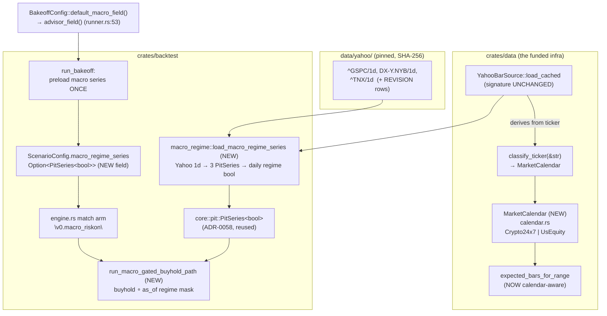

# Cross-Asset / Macro Regime Probe — fresh untested channel into the bake-off

## Why

The Single-Coin Investment Advisor ranks strategies on a `(coin, window)` under
a FROZEN robustness gate (`classify_verdict` / the 5-signal weakest-link
bootstrap; FRAGILE ⇒ ineligible to crown), with buy-and-hold always the
benchmark. The active-edge research **concluded 2026-06-08 ("ship passive")**
across three reachable channels — price/OHLCV, derivatives-positioning,
on-chain — none beat passive net of cost under the frozen rule.

**Cross-asset / macro is the one named-but-UNTESTED orthogonal channel.**
`spec/backlog.md` § "Future fresh program" (line 140-142) lists it verbatim:

> **Untested orthogonal channels** — options/implied-vol (Deribit DVOL),
> cross-asset/macro (DXY, rates, SPX), social/sentiment. … each would be a
> **fresh** program with its own data adapter and backtest, not a re-open of
> this one.

This feature is the honest **"we also checked the macro channel"** — the
deliverable is **honest coverage of an untested channel, NOT an alpha claim**.

> **Honest framing (load-bearing, not boilerplate).** The prior is that a
> macro-regime arm is **also Fragile / does not beat hold** net of cost under
> the frozen gate. A **null result ("the macro-regime arm is also Fragile, hold
> still stands") is the EXPECTED, valid, shippable outcome.** The probe is
> scored by the IDENTICAL frozen gate + buy-and-hold benchmark as every other
> arm — no special-casing, no band relaxation. We ship the honest coverage
> either way; a positive result would be a surprise requiring out-of-sample
> confirmation before any promotion.

This is operator-directed **fresh-channel probe #4** (cross-asset/macro), a
sibling of the #1–#3 channels already concluded.

---

## Data feasibility — THE crux (assessed first, brutally honest)

**Verdict: the Yahoo *fetch path* trivially supplies the macro tickers, but
three real seams sit between "fetch DXY" and "a macro-regime bake-off arm". The
probe is NOT cheap-and-free; it is a small-but-real feature, ~3 net-new pieces.**

### F-1 — Can the Yahoo adapter fetch DXY / SPX / rates / gold? YES, mechanically free.

The fetch CLI accepts **any** valid Yahoo ticker. There is **no allow-list on
the fetch path**:

- `crates/data/src/bin/fetch_yahoo_klines.rs:48-50` — *"Comma-separated Yahoo
  tickers … v0.1.0 accepts **any valid Yahoo Finance ticker symbol**."*
- The URL builder (`fetch_yahoo_klines.rs:199-205`) interpolates the ticker
  straight into `…/v8/finance/chart/{ticker}?…` — so `^GSPC`, `^TNX`,
  `DX-Y.NYB` (or `^DXY`), `GC=F` are one CLI invocation each, **zero code
  change** to fetch + pin.
- `YahooBarSource::load_cached` (`crates/data/src/yahoo.rs:266`) is
  ticker-agnostic and interval-parameterized (`1d`/`1h`/`1m`); the corpus
  already carries `1d` for 12 crypto pairs (`data/yahoo/<TICKER>/1d/<YEAR>/<MONTH>.parquet`).
- **PIT-honest + immutable**: every parquet is SHA-256-pinned in
  `data/yahoo/REVISION.toml`; `load_cached` re-verifies per-file SHA against the
  manifest on every read (`yahoo.rs:308-324`) and forces `local_recv_ts =
  close_ts` for determinism (`yahoo.rs:354-357`). Daily OHLC, no intraday
  look-ahead within a bar. **This satisfies the PIT/immutability bar.**

So: fetching + pinning the macro series is genuinely free. The cost is
*downstream* of the fetch.

### F-2 — The 95% coverage gate ASSUMES 24/7 data; equities/rates/FX are ~5/7. (BLOCKER if naïve.)

`yahoo.rs:982-984` is explicit: *"Yahoo crypto runs 24/7; **equities are
handled at v0.2.0 with a market-calendar layer.**"* `expected_bars_for_range`
(`yahoo.rs:984-992`) is a pure wall-clock division — for a `1d` window it
computes `expected = calendar_days`. The coverage gate
(`MISSING_DATA_THRESHOLD_PCT = 95`, `yahoo.rs:56`, enforced at
`yahoo.rs:338-352`) then demands ≥ 95% of *calendar* days have a bar.

**SPX / ^TNX / DXY trade ~5 of 7 calendar days (~71%) plus holidays.** A 90-day
`1d` load of `^GSPC` would compute `expected = 90`, find ~62-64 trading-day
bars, and **fail `YahooError::MissingData` (≈70% < 95%)**. This is a hard,
code-confirmed obstacle. → see **Q-MACRO-2**; the most likely answer is a
**market-calendar-aware expected-count** (the deferred "v0.2.0 market-calendar
layer" the code names) OR loading macro at `1d` through a relaxed/by-pass
coverage path dedicated to non-24/7 tickers. This is the single biggest hidden
cost and it sizes the feature.

### F-3 — The macro series (Yahoo) and the coin series (Binance) live in DIFFERENT corpora. (The join is cross-adapter.)

The advisor bake-off does **NOT** read Yahoo for the coin — it reads **Binance**:

- `crates/ui/src/leaderboard/runner.rs:108` & `:144` —
  `data_source: ScenarioDataSource::BinanceCache` for both the default and the
  F3 guided-input config. (Yahoo is *Lab-only at v0.1.0* —
  `crates/backtest/src/engine.rs:166`.)
- The coin's hourly bars are preloaded once from `data/binance` via
  `ReplayFeed::merge_symbols` (`crates/backtest/src/bakeoff/mod.rs:93-102`) and
  passed to every arm as `bars_override` (`bakeoff/mod.rs:718`).

So the join is **coin = Binance hourly ‖ macro = Yahoo daily** — two adapters,
two corpora, two cadences. `merge_symbols` (`replay_feed.rs:281`) reads from a
**single `parquet_root`** and cannot merge a Binance coin with a Yahoo ticker;
the cross-corpus + cross-cadence join is net-new plumbing (see § Seam).

### As-of daily→hourly join (no look-ahead) — the resample seam

The macro signal is **daily**, the coin bake-off is **hourly** (or
H4/D1 via the resample knob, `bakeoff/mod.rs:668-669`). The regime arm must
align the daily macro level to each hourly coin bar **without look-ahead**:

- **As-of / LOCF rule (pre-registered):** for an hourly coin bar opening at time
  `t`, the macro regime uses the **most-recent macro DAILY bar whose `close_ts ≤
  t`** (last-observation-carried-forward). A macro daily bar dated `D` (UTC
  close) becomes visible **only at/after `D`'s close** — never to coin bars
  earlier that day. This is the same determinism discipline as
  `local_recv_ts = close_ts` already enforced on Yahoo bars (`yahoo.rs:354`).
- **Concrete seam:** carry `last_macro_close[ticker]` forward; recompute the
  regime boolean only when a new macro daily close arrives; hold it constant
  across the ~24 intervening hourly coin bars. This is a "last value carried
  forward" gate inside the arm's `on_bar`, identical in spirit to how
  `RegimeDispatcher` carries regime state across bars
  (`crates/strategy/src/regime_dispatcher.rs:33-37`).
- **Weekend/holiday gap:** when no new macro bar arrives (weekend), the last
  Friday close carries through Sat/Sun crypto bars — correct and look-ahead-free
  by construction.

---

## The hypothesis + the pre-registered signal (FIXED — no search, no tuning)

**Hypothesis.** A coin returns conditioned on a cross-asset *risk regime* —
long the coin only in a risk-ON macro regime, else flat/cash — is structurally
**orthogonal** to the coin's own price/volume signals (the existing arms).

**Decorrelation rationale (why this is a genuinely fresh channel).** Every
existing arm derives its signal from the **coin's own OHLCV**: the 4 base rule
engines + the ADR-0071 signal-library arms (`bakeoff/mod.rs:363-377`), the
ensembles (`bakeoff/mod.rs:440-454`), and even `RegimeDispatcher`, whose regime
classifier is **fit on the coin's own log-returns** (`regime_dispatcher.rs:33-37`).
**None** consume an exogenous (non-coin) series. A macro risk-regime is computed
from DXY/SPX/rates — a different information set — so its decision variable is
structurally decorrelated from the existing field. That orthogonality is the
*only* a-priori reason a macro arm could add anything; it is also why a null
result is informative (it closes the channel honestly).

**Pre-registered signal (locked literals — the architect/operator may swap the
exact rule via Q-MACRO-3, but it is FIXED before any results are read — the
overfit-safe discipline mirroring the ADR-0071 / ADR-0067 pre-registered slates).**

> **`v0.macro_riskon`** — long the coin **only** when the macro regime is
> risk-ON, else flat (cash). Risk-ON ≙ ALL of:
> 1. **SPX trend up:** `^GSPC close > SMA(^GSPC close, 50 daily bars)`, AND
> 2. **Dollar not bid:** `DX-Y.NYB close < SMA(DX-Y.NYB close, 50 daily bars)`, AND
> 3. **Rates not spiking:** `^TNX close < SMA(^TNX close, 20 daily bars)`.
>
> When risk-ON → emit the coin's buy/hold-long signal (a passive long while the
> regime holds); when risk-OFF → flat (no position / exit to cash). All
> thresholds are SMA-relative (no magic price levels), all lookbacks are fixed
> literals. **This is one arm.** Whether to also register a small slate (e.g. a
> SPX-only `v0.macro_spx_trend` and a 2-of-3 `v0.macro_riskon_2of3` ablation to
> measure each leg's contribution) is **Q-MACRO-4**.

The regime gate is a **pure long/flat overlay on buy-and-hold** — it never
trades on the coin's own indicators, isolating the macro channel's contribution
cleanly against the buy-and-hold benchmark.

---

## The seam — how it becomes a bake-off arm (engineering size, honest)

**This needs a new "exogenous regime series" seam. It does NOT cleanly reuse the
multi-symbol (pairs/cross_sectional) merged-stream path.** Reasoning, grounded:

1. **The multi-symbol mechanism is "merge symbols into ONE time-ordered stream;
   the strategy demuxes by `bar.symbol`."** `merge_symbols`
   (`replay_feed.rs:281-322`) k-way-merges multiple symbols' bars sorted by
   `(open_ts, symbol)`. The pairs strategy works under this because it
   **explicitly universe-filters** `bar.symbol` and returns `vec![]` for
   out-of-universe bars (`crates/strategy/src/pairs/mean_reversion.rs:9-12`),
   maintaining per-symbol state internally.

2. **A `ComposedStrategy`-style arm has NO such demux.** `ComposedStrategy::on_bar`
   (`crates/strategy/src/composed/node.rs:1395`) processes **every** bar handed
   to it and emits a signal stamped with the **incoming** `bar.symbol`
   (`node.rs:1374-1381`). Feed it a merged coin‖macro stream and it would try to
   **trade the macro ticker as if it were a coin** — wrong. So a composed-style
   macro-regime arm cannot just ride the merged stream; it needs the macro as a
   **side input**, not as tradeable bars.

3. **Cross-corpus + cross-cadence:** even setting (2) aside, `merge_symbols`
   reads a single corpus root; the coin is Binance-hourly and the macro is
   Yahoo-daily (§ F-3), so there is no existing call that merges them.

**Realistic seam (the net-new plumbing the architect must size):**

- **(a) An exogenous-series loader** that, for a `(macro_ticker, window)`,
  loads the Yahoo `1d` bars (reusing `YahooBarSource::load_cached`,
  `yahoo.rs:266` — no change to the read path) **subject to the F-2 coverage
  fix**, and produces a **forward-filled daily regime series** keyed by close
  timestamp.
- **(b) A regime-overlay arm** — either (i) a hand-written `Strategy` impl that
  holds the precomputed as-of regime series + the coin bars and emits long/flat,
  or (ii) a `ComposedStrategy` extension that can read a named **auxiliary
  series** (a new "exogenous input" the signal DSL can reference). **(i) is the
  smaller, lower-blast-radius build; (ii) is the more composable long-term seam
  but is a real DSL/typecheck change.** → **Q-MACRO-1**.
- **(c) Arm registration + the bake-off threading** of the macro series into
  that one arm only. Today `ScenarioConfig.bars_override` is a **single**
  `Option<Vec<Bar>>` (`engine.rs:232`); the macro series needs a **second,
  optional, arm-scoped channel** (e.g. `macro_regime_series: Option<...>` on the
  arm's config, ignored by every existing arm → byte-identical for them). The
  bake-off loop builds the per-arm `ScenarioConfig` at `bakeoff/mod.rs:707-730`;
  this is the insertion point.

**Honest size estimate (for the architect to confirm/refute):** **medium, not
small.** Net-new: the F-2 coverage fix (calendar-aware OR a relaxed non-24/7
path), the cross-corpus exogenous loader + as-of/LOCF join, the regime-overlay
arm, the second optional config channel, the arm registration, and the
day-1 divergence test. Reuse carries the rest (see matrix). This is **not** a
"fetch a ticker and add a line" feature — the 24/7-coverage assumption (F-2) and
the absence of any exogenous-series seam (seam-2) are the two things that make
it real. **If the operator wants the cheapest viable probe**, the
if-budget-tightens fallback is § "Minimum-viable carve-out" below.

---

## Reuse vs net-new (explicit)

| Reused (no change)                                                         | Net-new (this feature)                                                                 |
|---------------------------------------------------------------------------|----------------------------------------------------------------------------------------|
| The bake-off loop + ranking (`run_bakeoff`, `rank_candidates`) — `bakeoff/mod.rs:636`, `bakeoff/rank.rs` | The **macro-series fetch + pin** (CLI invocations for `^GSPC`/`^TNX`/`DX-Y.NYB`; new `data/yahoo/<TICKER>/1d/…`) |
| The FROZEN robustness gate + bands + buy-and-hold benchmark (NOT touched) — `bakeoff/robustness.rs`, `bakeoff/buyhold.rs` | The **F-2 coverage fix** for non-24/7 daily series (market-calendar expected-count OR relaxed path) |
| `YahooBarSource::load_cached` read path + REVISION SHA verify — `yahoo.rs:266`/`:308` | The **cross-corpus exogenous loader** (Yahoo-daily macro ‖ Binance-hourly coin)        |
| The Yahoo fetch CLI (any ticker, no allow-list) — `fetch_yahoo_klines.rs:48` | The **as-of daily→hourly LOCF join** (look-ahead-free regime alignment)                 |
| The per-arm `ScenarioConfig` build seam — `bakeoff/mod.rs:707-730`        | The **`v0.macro_riskon` regime-overlay arm** (long/flat over buy-and-hold)              |
| `write_report = false` anchor-safe arm convention — `bakeoff/mod.rs:712`  | The **second optional arm-scoped config channel** for the macro series (`engine.rs` `ScenarioConfig`) |
| The merged-stream multi-symbol *primitive* `merge_symbols` (as a reference, NOT a direct reuse) — `replay_feed.rs:281` | The **day-1 baseline-equity-divergence e2e test** (CLAUDE.md non-negotiable)            |

---

## Anchor safety + frozen gate (NON-NEGOTIABLE)

- **Anchors: 119/119 before AND after.** Baseline confirmed this scoping pass:
  `bash scripts/verify_anchors.sh` → `ANCHORS PASS (119 / 119)`.
- The new arm runs with **`write_report = false`** (the established advisor-arm
  convention — `bakeoff/mod.rs:712`, ADR-0059), so **no report body is written**
  → anchor-additive by construction. Existing arms + their anchored
  `spec/*/reports/` files stay **byte-identical**.
- **The gate, bands, and benchmark stay FROZEN.** This is **NOT** a band
  proposal and **NOT** a `classify_verdict` change. The macro arm is scored by
  the identical 5-signal weakest-link bootstrap as every other arm; FRAGILE ⇒
  ineligible to crown, exactly as today.
- No edits to any anchored report file. Any incidental doc-link touch near
  `spec/*/reports/` must obey the ADR-0038 § D6 immutability contract.

---

## Day-1 divergence gate (CLAUDE.md non-negotiable — REQUIRED)

Per CLAUDE.md ("Every strategy overlay or sizing-modifier ships with a
baseline-equity-divergence end-to-end test from day 1") and the
`v3-volatility-forecaster-noop-fix` precedent: the macro-regime arm **IS an
overlay** (it gates buy-and-hold long/flat on an exogenous signal). A no-op bug
— where the regime boolean is computed but never actually suppresses the
position — is exactly the failure class that unit tests + anchored reports do
**not** catch.

**Required e2e (pattern reference:
`crates/strategy/tests/vol_targeting_overlay_end_to_end.rs`):** construct a
window + a synthetic/fixture macro series in which the pre-registered regime
**flips** at least once (a risk-OFF stretch), run `v0.macro_riskon` vs the
plain buy-and-hold baseline on the SAME coin bars, and **assert the macro arm's
output equity diverges from the un-gated buy-and-hold equity by ≥ 1 bp** across
the risk-OFF stretch (the arm goes flat → its equity must depart from
always-long). A negative control (a regime series pinned risk-ON for the whole
window) must produce **≈ buy-and-hold equity** (overlay correctly no-ops when the
regime never gates). Both directions are mandatory — the divergence test AND the
no-op-when-always-on control.

---

## Open decisions (for the architect / operator)

- **Q-MACRO-1 (seam — the load-bearing build decision).** Implement the arm as
  **(a)** a dedicated hand-written `Strategy` impl carrying a precomputed as-of
  regime series _(Recommended — smaller blast radius, no DSL change, ships the
  honest probe fastest while still being a real exogenous-series seam)_ **— but
  with the architect explicitly noting whether a second macro arm is foreseen
  (if yes, prefer (b))**; or **(b)** extend the `ComposedStrategy` DSL with a
  named **auxiliary/exogenous series** the signal grammar can reference (more
  composable for *future* macro/exogenous arms, but a real
  parser/typecheck/`node.rs` change + its own tests). **Durable-vs-quick note:**
  (b) is the more durable seam **iff** the operator expects ≥ 2 future exogenous
  arms (options-IV, more macro legs); if this is a one-shot honest-coverage
  probe (the stated intent), (a) is correct and does **not** spawn a v0.2.0
  cleanup. Architect to confirm which world we are in.
- **Q-MACRO-2 (the F-2 coverage BLOCKER).** How to load non-24/7 daily macro
  series past the 95% calendar-day coverage gate (`yahoo.rs:56`/`:338`):
  **(a)** add the market-calendar-aware `expected_bars_for_range` the code
  already names as the "v0.2.0 market-calendar layer" (`yahoo.rs:982-984`) —
  durable, unblocks all future equities/FX work; **(b)** a dedicated relaxed /
  bypass coverage path for macro tickers only — cheaper, carries a v0.2.0
  cleanup commitment. _(Recommended: (a) — it is the durable unblock the code
  itself flags as the right home, and equities expansion is already on the
  roadmap.)_ This is the single biggest cost driver — architect must size it
  first.
- **Q-MACRO-3 (the exact macro series + the pre-registered rule).** Confirm the
  ticker set (`^GSPC` + `DX-Y.NYB`/`^DXY` + `^TNX`; include `GC=F` gold?) and
  the locked regime literals (SMA(50)/SMA(50)/SMA(20); the 3-condition AND).
  Any change MUST be locked **before** results are read (pre-registration
  discipline). Note `DX-Y.NYB` vs `^DXY` Yahoo-symbol availability needs a quick
  fetch-dry-run check.
- **Q-MACRO-4 (one arm or a small slate?).** Ship only `v0.macro_riskon`, or
  also register a SPX-only `v0.macro_spx_trend` + a 2-of-3 ablation
  `v0.macro_riskon_2of3` to attribute each leg? A 3-arm pre-registered slate
  gives a cleaner "which macro leg (if any) mattered" read at marginal extra
  cost (all `write_report = false`, all gate-scored). Default if undecided:
  **the single `v0.macro_riskon` arm** (minimum honest coverage), expand only on
  operator request.
- **Q-MACRO-5 (window/cadence).** The advisor default is hourly (H4/D1 via the
  resample knob). Confirm the as-of join holds the daily macro level across the
  resampled coarser bars identically (it should — LOCF is cadence-agnostic), and
  that the divergence test exercises the hourly path (the strictest as-of case).

### Minimum-viable carve-out (if-budget-tightens fallback)

If the operator wants the **cheapest** honest probe rather than the durable
build: implement **Q-MACRO-1 (a)** + **Q-MACRO-2 (b)** (hand-written arm +
macro-only relaxed coverage path), ship the single `v0.macro_riskon` arm, and
defer the market-calendar layer (Q-MACRO-2 (a)) + the DSL exogenous-series seam
(Q-MACRO-1 (b)) to a v0.2.0 follow-on. This still delivers the honest
"we checked the macro channel" coverage and the day-1 divergence gate, at the
cost of a documented v0.2.0 cleanup commitment (the relaxed coverage path is a
carve-out, not the durable market-calendar fix). **This is the fallback label,
not the Recommended one** — the Recommended path is the durable
Q-MACRO-1(a)+Q-MACRO-2(a) combination.

---

## Requirements (testable)

- **R1** — Fetch + pin the pre-registered macro tickers (Q-MACRO-3) into
  `data/yahoo/<TICKER>/1d/…` with REVISION SHA entries; PIT-immutable, verified
  by `YahooBarSource::load_cached`'s per-file SHA check.
- **R2** — Resolve the F-2 coverage gate for non-24/7 daily series (Q-MACRO-2)
  so a multi-month `1d` macro load succeeds (does NOT trip `YahooError::MissingData`).
- **R3** — Implement the as-of daily→hourly LOCF join: an hourly coin bar at `t`
  sees only the most-recent macro daily bar with `close_ts ≤ t`; no look-ahead;
  weekend gaps carry the prior close forward.
- **R4** — Register the `v0.macro_riskon` arm (Q-MACRO-1) into the bake-off with
  `write_report = false`; it is scored by the FROZEN gate + buy-and-hold
  benchmark identically to every other arm.
- **R5** — Day-1 baseline-equity-divergence e2e test: regime-flip window ⇒
  macro-arm equity diverges from un-gated buy-and-hold by ≥ 1 bp; always-risk-ON
  control ⇒ ≈ buy-and-hold (no-op verified). Both directions mandatory.
- **R6** — `bash scripts/verify_anchors.sh` → 119/119 before AND after; no
  anchored report file mutated.
- **R7** — Honest-coverage acceptance: the feature ships its result whether the
  macro arm is FRAGILE (expected) or not; the UI/rationale honesty branches
  (`BenchmarkWins` / `AllFragile`) require **no** change — the macro arm flows
  through them as-is.

## Design

> **Build decision: full-fat, INCLUDING the durable market-calendar layer**
> (operator-chosen 2026-06-26, NOT the relaxed § "Minimum-viable carve-out"
> bypass). Resolved open decisions: **Q-MACRO-2 = (a)** durable market-calendar
> layer; **Q-MACRO-1 = (a)** hand-written arm (NO DSL change); **Q-MACRO-3** the
> locked ticker set + rule below; **Q-MACRO-4 = single `v0.macro_riskon` arm**;
> **Q-MACRO-5** LOCF holds across resampled coarser bars (cadence-agnostic),
> the divergence test exercises the hourly path. ADR: **[ADR-0073](../architecture/adr/0073-market-calendar-and-macro-exogenous-regime.md)**.

This design rests on two findings that make the build smaller and more durable
than the analyst's "medium, not small" estimate feared:

1. **The as-of join is ALREADY a shipped, look-ahead-impossible primitive.**
   ADR-0058 landed `PitSeries<T>` + `AsOf<T>` in `crates/core::pit`
   (`crates/core/src/pit.rs:108`/`:173`/`:192`). Its only query is
   `as_of_value(TimestampMs) -> Option<T>` — the most-recent record with
   `ts ≤ query`, `None` on warm-up; there is **no API that returns a record at
   `ts > query`**. The LOCF daily→hourly join (R3) is therefore
   `regime_series.as_of_value(bar_open_ts_ms)` — **no hand-rolled
   `partition_point`, look-ahead is a compile-time impossibility, the
   `trybuild` compile-fail fixture already guards it.** This is the durable seam
   ADR-0058 was built for (its Consequences name "a fresh data channel" as the
   exact future consumer).
2. **The buy-and-hold arm is a PURE equity-path function, not a `Strategy`.**
   `run_buyhold_path(bars, capital, n_symbols)` (`crates/backtest/src/bakeoff/buyhold.rs:38`)
   iterates bars by timestamp and marks-to-market — it never goes through
   `ComposedStrategy::on_bar`. So the `ComposedStrategy`-has-no-demux problem
   (`node.rs:1395`, feature § Seam point 2) **never arises**: the macro arm is
   `run_buyhold_path` with a per-timestamp regime mask, a sibling pure function.
   Q-MACRO-1(a) (hand-written) is not just the smaller blast radius — it is
   *strictly* the natural shape, because the benchmark it overlays is itself
   hand-written.

### Module map



---

### D1 — The market-calendar layer (Q-MACRO-2 (a) — the funded unblock)

**Home: `crates/data/src/calendar.rs` (new module), a `MarketCalendar` seam.**
This is durable, reusable infra — the "v0.2.0 market-calendar layer" the code
itself names at `yahoo.rs:982-984` — not a macro-only hack. `crates/data`
already owns the Yahoo corpus + coverage gate, so the calendar lives beside the
thing it serves (ADR-0041 layering).

**The type.**
```rust
// crates/data/src/calendar.rs
#[derive(Debug, Clone, Copy, PartialEq, Eq)]
pub enum MarketCalendar {
    /// 24/7 — every wall-clock day is a trading day. Crypto. The DEFAULT.
    Crypto24x7,
    /// ~5/7 — Mon–Fri minus a US market-holiday set. Equities / index / FX / rates.
    UsEquity,
}

impl MarketCalendar {
    /// Trading days in `[start_ms, end_ms)` for THIS calendar.
    /// Crypto24x7 → calendar-day count (byte-identical to today's wall-clock division).
    /// UsEquity  → weekdays(Mon–Fri) in range minus holidays-in-range.
    pub fn trading_days_in_range(self, start_ms: i64, end_ms: i64) -> usize;
}

/// Resolve a Yahoo ticker to its calendar. The ONLY classification seam.
/// Crypto mirror pairs ("BTC-USD".."LINK-USD", the 12 in the corpus) → Crypto24x7.
/// Index/FX/rate/futures tickers (leading '^', or '=F'/'=X', or the DX-Y.NYB dollar
/// index) → UsEquity. UNKNOWN tickers default to Crypto24x7 (the conservative
/// choice: it preserves today's behaviour exactly for anything not explicitly
/// reclassified — see D1.anchor).
pub fn classify_ticker(ticker: &str) -> MarketCalendar;
```

**How `load_cached` consults it — WITHOUT a public-signature change.** The
critical anchor-safety move: `load_cached(ticker, interval, …)` already receives
the ticker (`yahoo.rs:266`). It derives the calendar internally:
`let cal = classify_ticker(ticker);` and calls a calendar-aware expected-count.
`expected_bars_for_range` is **refactored** so the gate computes
`expected = cal.trading_days_in_range(start, end)` for `Days1`, while `Hours1`
and `Minutes1` keep the pure wall-clock division (crypto intraday is genuinely
continuous; the macro arm only ever loads `Days1`). Concretely:

- Keep `pub fn expected_bars_for_range(interval, start, end) -> usize`
  **byte-identical** (it is pinned by `yahoo.rs:1187` `expected_bars_for_range_arithmetic`
  and three other tests; touching its arithmetic would break them and is
  unnecessary). It remains the `Crypto24x7` implementation.
- Add `pub fn expected_bars_for_calendar(cal: MarketCalendar, interval, start, end) -> usize`
  that, for `Days1`, returns `cal.trading_days_in_range(start, end)`, and for
  `Hours1`/`Minutes1` delegates to `expected_bars_for_range`. For
  `cal == Crypto24x7` it is **provably equal** to `expected_bars_for_range`
  (Crypto24x7's `trading_days_in_range` IS the wall-clock day count) — this
  equivalence is a unit test (D1.anchor).
- `load_cached` step-6 (`yahoo.rs:339`) changes from
  `expected_bars_for_range(interval, start_ms, end_ms)` to
  `expected_bars_for_calendar(classify_ticker(ticker), interval, start_ms, end_ms)`.

**The US-holiday set (data-driven-from-corpus, NOT a hand-maintained list).**
Pre-registered decision: `UsEquity::trading_days_in_range` counts **weekdays
(Mon–Fri) in range, minus a small static `const US_MARKET_HOLIDAYS: &[(month,
day)]`-style set** covering the fixed + observed NYSE closures that fall on
weekdays (New Year, MLK, Presidents', Good Friday, Memorial, Juneteenth, July 4,
Labor, Thanksgiving, Christmas). Because the gate is a **≥95% floor, not an
equality**, the holiday set does NOT need to be exhaustive or perfectly
date-accurate: a ~250-trading-day year has ~9 weekday holidays (~3.6%); even if
the set is off by a few days the 95% threshold absorbs it. The set is a
conservative *lower bound on expected* — it can only make the gate *more*
lenient, never reject valid data. This is the pragmatic, low-maintenance choice;
a full data-driven "expected = distinct actual-bar dates" approach is rejected
in Alternatives (it makes the gate tautological — coverage can never fail — and
loses the gap-detection the gate exists for). **The set + the weekday rule are
the pre-registered calendar; they are fixed before any macro result is read.**

**D1.anchor — why crypto coverage is provably unperturbed (→ anchors hold).**
- `classify_ticker` returns `Crypto24x7` for all 12 corpus crypto tickers and
  for any unknown ticker. Every existing `load_cached` caller passes a crypto
  ticker (`BTC-USD`, `XRPUSDT`-mapped, etc. — see the 14 call sites at
  `yahoo.rs:444`, `lab/runner.rs:493/519`, `agent/runtime.rs:1577`,
  `run_yahoo_sma.rs:176`, `yahoo_revision_verify.rs` ×6, `lab_yahoo_dispatch.rs`
  ×3, `cockpit_live_lab_run_smoke.rs:440`).
- For `Crypto24x7`, `expected_bars_for_calendar == expected_bars_for_range`
  **by construction** (D1 bullet 3) — same expected count, same threshold, same
  pass/fail, **same `LoadedBars`**. The crypto/Yahoo-crypto read path is
  byte-identical; no parquet is touched; no anchored report is regenerated.
- The Binance corpus + `merge_symbols` path (the bake-off coin loader,
  `bakeoff/mod.rs:93`) **never calls the Yahoo coverage gate at all** — it has
  its own `read_and_verify_revision_manifest`. Untouched.
- **Re-proof gate (T-CAL):** a unit test asserting
  `expected_bars_for_calendar(Crypto24x7, Days1, s, e) == expected_bars_for_range(Days1, s, e)`
  over a range sweep, AND `scripts/verify_anchors.sh → 119/119` after the
  calendar lands but BEFORE the macro arm exists (the calendar layer is proven
  inert in its own commit).

---

### D2 — The macro corpus + fetch/pin (R1, Q-MACRO-3)

**Locked ticker set (pre-registered, 3 series):**

| Series | Yahoo ticker | Role in regime | Cache path |
|--------|-------------|----------------|------------|
| S&P 500 index | `^GSPC` | risk-ON trend leg | `data/yahoo/^GSPC/1d/<Y>/<M>.parquet` |
| US Dollar index | **`DX-Y.NYB`** (primary) | dollar-bid leg | `data/yahoo/DX-Y.NYB/1d/<Y>/<M>.parquet` |
| 10y Treasury yield | `^TNX` | rates-spike leg | `data/yahoo/^TNX/1d/<Y>/<M>.parquet` |

Gold (`GC=F`) is **NOT** included (Q-MACRO-4 → single arm, minimal set). The
pre-registered rule (D4) uses exactly these three.

**DX-Y.NYB vs ^DXY resolution — REQUIRES a fetch dry-run (task M-FETCH-0).**
`DX-Y.NYB` (ICE US Dollar Index on NYBOT) is the symbol Yahoo's chart API
serves for the dollar index; `^DXY` is frequently NOT available on the free
`query1.finance.yahoo.com/v8/finance/chart` endpoint (it returns an empty quote
set or 404 on many days). **Pre-registered primary = `DX-Y.NYB`.** Task
M-FETCH-0 runs the CLI `--dry-run` then a real fetch for BOTH on a short window
and inspects which returns non-empty quotes; **`DX-Y.NYB` is locked unless the
dry-run proves it empty**, in which case `^DXY` is the pre-registered fallback
(the swap is recorded in the Changelog BEFORE any bake-off result is read —
pre-registration discipline). The rule's *semantics* (dollar index < SMA(50))
are identical for either symbol; only the cache directory name differs.

**Filesystem-name note (M-FETCH-0 also confirms):** the fetch CLI writes to
`cache_root.join(ticker)` verbatim (`yahoo.rs:589-595`), so the directory
becomes literally `^GSPC`, `DX-Y.NYB`, `^TNX`. `^`, `-`, `.` are all legal
POSIX path components (macOS/Linux); the dry-run confirms the parquet writes +
REVISION rows materialize cleanly. The `^` does NOT need shell-escaping inside
the Rust `PathBuf::join` (only when typing the ticker on a shell CLI — quote it:
`--tickers '^GSPC'`).

**Data shape + the pin.** Each series is fetched at `--interval 1d` over a
window that **superset-covers** the advisor's default bake-off ranges
(`H1_2024` and the rolling guided-input windows — D5 details the alignment),
producing `data/yahoo/<TICKER>/1d/<Y>/<M>.parquet` daily OHLCV identical in
schema to the 12 crypto `1d` series. Every new parquet gets a SHA-256 row in
`data/yahoo/REVISION.toml`; `load_cached` re-verifies per-file on every read
(`yahoo.rs:308-324`) and forces `local_recv_ts = close_ts` (`yahoo.rs:354`).
**The fetch + pin is a one-time, human-run, out-of-band step** (it needs network
+ `--features yahoo-online`); the daily divergence/leak tests use **synthetic
fixture series** (D6) so CI never touches the network.

> **Human-run fetch recipe (M-FETCH-1, out-of-band — needs network):**
> - **Command:** `cargo run -p data --features yahoo-online --bin fetch_yahoo_klines -- --tickers '^GSPC' --interval 1d --start 2023-06-01 --end 2026-06-30` (repeat for `'DX-Y.NYB'` and `'^TNX'`).
> - **Steps:** 1) run the 3 commands; 2) `git status data/yahoo/` shows new `<TICKER>/1d/**` parquet + a modified `REVISION.toml`; 3) `bash scripts/verify_anchors.sh` → 119/119 (corpus add is anchor-additive); 4) re-run a `load_cached("^GSPC", Days1, …)` smoke (the M-LOAD test) → no `MissingData`.
> - **Timing:** ~30–90 s per ticker (Yahoo rate-limit backoff dominates).
> - **Expected:** 3 new ticker dirs, ~3 years × ~252 trading-day bars each; coverage gate PASSES (proves D1).
> - **Failure diagnosis:** `MissingData` despite the calendar fix → calendar class mis-resolved (check `classify_ticker`); `NoDataForRange`/empty on `DX-Y.NYB` → switch to `^DXY` fallback (record in Changelog).
> - **Cleanup:** none — the corpus is durable, pinned, committed.

---

### D3 — The exogenous-series seam + the daily→hourly LOCF join (R3, Q-MACRO-1 (a))

**The loader (`crates/backtest/src/macro_regime.rs`, NEW module).**
```rust
/// Load the 3 macro daily series via YahooBarSource::load_cached (READ PATH
/// UNCHANGED) and reduce them to a single forward-fillable daily regime series.
/// Returns a PitSeries<bool> keyed by each macro bar's close_ts (ms): true =
/// risk-ON at that daily close, false = risk-OFF. The arm queries it as-of.
pub fn load_macro_regime_series(
    yahoo_root: &Path,
    range: &DateRange,          // the bake-off window
) -> Result<PitSeries<bool>, MacroRegimeError>;
```
Internals, all look-ahead-free by construction:
1. For each of `^GSPC` / `DX-Y.NYB` / `^TNX`, call
   `YahooBarSource::new(yahoo_root).load_cached(ticker, Interval::Days1,
   start_ms, end_ms_padded)` — `end_ms_padded` extends the load window backward
   enough to warm the SMA(50) (≥ 50 trading days BEFORE the bake-off start, so
   the regime is defined from the first coin bar; see D5).
2. Compute, per ticker, a `PitSeries<Decimal>` of closes AND a `PitSeries<Decimal>`
   of the trailing SMA (SMA(50) for `^GSPC`/`DX-Y.NYB`, SMA(20) for `^TNX`),
   where **the SMA at daily bar `D` uses only closes with `close_ts ≤ D`** (the
   SMA is itself a streaming trailing mean — past-only, no centering). Both are
   stamped at the bar's `close_ts`.
3. The **daily regime bool** at each macro close timestamp `D` is the AND of the
   3 legs evaluated at `D` (D4). Emit `(TimestampMs(D_close_ms), bool)` for every
   macro daily close; build `PitSeries::from_sorted(...)`. Because the 3 series
   share the same `^GSPC`-driven daily grid is NOT assumed — the regime is
   recomputed at the **union** of the 3 tickers' close timestamps, each leg read
   as-of that timestamp (so a leg with a missing day carries its prior close
   forward — LOCF across legs too).
4. Warm-up: a regime timestamp earlier than any leg's SMA-warm point yields
   `false` (risk-OFF / flat) — the conservative default (no position until the
   regime is fully defined), and `as_of_value` returns `None` for coin bars
   before the first regime timestamp → the arm treats `None` as flat.

**The as-of daily→hourly join (R3) — `core::pit`, zero hand-rolling.** In the
gated-buyhold path (D below), for each coin bar at `open_ts`:
```rust
let on = regime_series
    .as_of_value(TimestampMs(bar.open_ts.unix_millis()))   // ADR-0058 primitive
    .unwrap_or(false);                                      // warm-up → flat
```
`as_of_value` returns the most-recent macro daily regime with `close_ts ≤
open_ts` — exactly the LOCF rule (R3): a macro daily bar dated `D` (UTC close)
is visible only to coin bars at/after `D`'s close; weekend/holiday gaps carry
Friday's close across Sat/Sun/holiday crypto bars. **Look-ahead is structurally
impossible** (the primitive has no `ts > query` accessor; `trybuild` guards it).

**Hand-written arm vs DSL exogenous-series extension — DECISION: hand-written
(Q-MACRO-1 (a)).** Justification, grounded:
- The arm is an **overlay on `run_buyhold_path`** — itself a pure hand-written
  equity-path function (`buyhold.rs:38`), NOT a `ComposedStrategy`. So there is
  no `on_bar` to extend and no demux to add; the "DSL auxiliary series" option
  (Q-MACRO-1 (b)) would force the macro arm to become a `ComposedStrategy` it has
  no reason to be, then teach the parser/typechecker/`node.rs:1395` a new
  exogenous-input grammar — a large parser+typecheck+test change for an arm that
  emits only long/flat over buy-and-hold.
- **Future-arm note (the Q-MACRO-1 durable-vs-quick hinge):** the operator's
  stated intent is a **one-shot honest-coverage probe** (feature § Why; the
  null result is the expected ship). No second exogenous arm is foreseen
  (Q-MACRO-4 = single arm; gold dropped). Per the Q-MACRO-1 rule "(a) is correct
  iff this is one-shot", **(a) is correct and spawns NO v0.2.0 DSL-cleanup
  commitment.** IF a future program wants ≥2 exogenous arms (options-IV, more
  macro legs), the durable seam is then the DSL extension — and ADR-0073 § D3
  records that fork explicitly so the future architect inherits the decision.
- Blast radius of (a): one new module (`macro_regime.rs`), one new pure function
  (`run_macro_gated_buyhold_path` in `buyhold.rs` beside its sibling), one new
  `ScenarioConfig` field, one new `engine.rs` match arm, one new `default_macro_field()`
  list. **Zero change to `node.rs`, the DSL parser, or any existing arm.**

---

### D4 — The pre-registered `v0.macro_riskon` arm (R4, LOCKED)

**Arm id (locked):** `v0.macro_riskon`. **Registration seam:**
`BakeoffConfig::default_macro_field() -> vec![StrategyId("v0.macro_riskon")]`
(new, beside `default_field`/`default_ensemble_field` at `bakeoff/mod.rs:363`),
extended into the advisor field at `runner.rs:53`:
`field.extend(BakeoffConfig::default_macro_field());`. `advisor_field_arm_count()`
(`runner.rs:67`) auto-tracks (+1). `is_short_enabled("v0.macro_riskon") = false`
(long/flat only — never shorts; `bakeoff/mod.rs:407`).

**The locked rule (pre-registered, FIXED before any result is read).** Risk-ON
at a macro daily close `D` ≙ **ALL** of:
1. `^GSPC.close(D)  >  SMA(^GSPC.close, 50)(D)`  — SPX trend up, AND
2. `DX-Y.NYB.close(D)  <  SMA(DX-Y.NYB.close, 50)(D)`  — dollar not bid, AND
3. `^TNX.close(D)  <  SMA(^TNX.close, 20)(D)`  — rates not spiking.

When risk-ON → **hold the coin** (full budget long, buy-and-hold semantics);
when risk-OFF (any leg false, or warm-up) → **flat / cash** (zero position). A
pure long/flat overlay on buy-and-hold — never trades on the coin's own
indicators. All thresholds SMA-relative; all lookbacks fixed literals (50/50/20).

**The arm body — `run_macro_gated_buyhold_path` (NEW, in `buyhold.rs`).** A
behaviour-faithful sibling of `run_buyhold_path`:
```rust
/// Buy-and-hold gated by an exogenous per-timestamp regime mask.
/// At each distinct coin-bar timestamp: if regime as-of that ts is risk-ON,
/// the position is held (marked to market exactly as run_buyhold_path);
/// if risk-OFF, the position is FLAT (equity holds flat at the cash value
/// carried from the last risk-ON exit — no coin exposure). Equal-weight,
/// single-coin (n_symbols = 1). Decimal-only; deterministic.
pub fn run_macro_gated_buyhold_path(
    bars: &[Bar],
    regime: &PitSeries<bool>,
    initial_capital: Decimal,
) -> (Vec<Decimal>, Decimal);
```
Mechanics (mirrors `run_buyhold_path`'s timestamp loop, `buyhold.rs:80-110`):
- Maintain `cash` (Decimal) and `coin_qty` (Decimal, 0 when flat).
- At each distinct timestamp `t` (BTreeMap-ordered, deterministic): read
  `on = regime.as_of_value(TimestampMs(t_ms)).unwrap_or(false)`.
- **Transition flat→ON:** buy `cash / price(t)` coin at `t`'s close, `cash = 0`.
- **Transition ON→flat:** sell all coin at `t`'s close, `cash = coin_qty *
  price(t)`, `coin_qty = 0`. (Realistic: the regime flip is observed at the
  daily close ≤ `t`, the trade executes at the coin bar `t` — look-ahead-free.)
- **Equity at `t`** = `cash + coin_qty * price(t)`. Push to the curve. The curve
  has `n_distinct_ts + 1` entries (entry[0] = `initial_capital`), identical
  shape to `run_buyhold_path` so downstream KPI/robustness code is unchanged.
- Edge cases mirror `run_buyhold_path`: empty bars → `(vec![cap], cap)`;
  zero/non-positive price → skip the buy (stay flat) that step.
- **Cost:** v0 ships at the same fee/slippage model the other bake-off arms use
  via the engine; the gated path applies a buy/sell at each regime transition.
  Pre-registered: transition trades pay the standard taker fee (the same
  `taker_fee_bps`/`slippage_bps` the bake-off applies) — the macro arm is NOT
  cost-advantaged vs the always-long benchmark. (Implementation note for the
  developer: thread the same cost constants the buyhold/sma arms use; the
  divergence test asserts gross *behaviour*, the bake-off applies cost.)

**The second arm-scoped config channel (R4 plumbing).** New field on
`ScenarioConfig` (`engine.rs:202`):
```rust
/// ADR-0073 — exogenous macro regime series for the `v0.macro_riskon` arm ONLY.
/// `None` for EVERY existing arm and EVERY CLI/Lab/anchor path → byte-identical.
/// Set to `Some(series)` ONLY by `run_bakeoff` when building the macro arm's
/// ScenarioConfig (write_report=false). The `engine.rs` dispatch reads it ONLY
/// in the "v0.macro_riskon" match arm; all other arms ignore it.
pub macro_regime_series: Option<core::pit::PitSeries<bool>>,
```
Anchor contract identical to `composed_toml_override` (`engine.rs:294`): all
existing constructors set it `None` via struct-update; only the bake-off macro
arm sets `Some`. The dispatch arm `"v0.macro_riskon"` (new, modelled on
`"v0.buyhold"` at `engine.rs:1847`) reads `cfg.macro_regime_series`, resolves
bars from `cfg.bars_override` (the same preloaded coin bars), calls
`run_macro_gated_buyhold_path`, and builds the `RunReport` with
`write_report = false` (no body written).

**Bake-off threading (the insertion point).** In `run_bakeoff`
(`bakeoff/mod.rs:659`-ish, beside the coin-bar preload), preload the macro
regime series ONCE: `let macro_series = if field_contains_macro {
Some(load_macro_regime_series(yahoo_root, &req.range)?) } else { None };`. In
the per-arm `ScenarioConfig` build (`bakeoff/mod.rs:707`), set
`macro_regime_series: if strategy.0 == "v0.macro_riskon" { macro_series.clone() }
else { None }`. Every non-macro arm gets `None` → byte-identical.

---

### D5 — Window / warm-up / cadence alignment (R3, Q-MACRO-5)

- **Coin = Binance hourly** (`bakeoff/mod.rs:93`), preloaded + clipped to
  `[start_ms, end_ms)`. **Macro = Yahoo daily**, loaded over
  `[start_ms − warmup, end_ms)` where `warmup ≥ 50 trading days` (~72 calendar
  days) so SMA(50) is defined at the first coin bar; the macro corpus fetch
  window (D2) MUST cover this pre-roll (hence the fetch starts 2023-06, well
  before any 2024 bake-off window).
- **LOCF is cadence-agnostic (Q-MACRO-5).** The as-of query
  `regime.as_of_value(TimestampMs(bar.open_ts))` holds the daily regime constant
  across however many coin bars fall between two macro closes — 24 hourly bars,
  6 H4 bars, or 1 D1 bar. The resample knob (`bakeoff/mod.rs:668`) folds coin
  bars BEFORE the gated path runs, so the path sees coarser coin bars and queries
  the same daily regime — **identical LOCF logic, no special-casing.** The
  divergence test (R5) exercises the **hourly** path (the strictest as-of case,
  ~24 coin bars per daily regime).

---

### D6 — Day-1 divergence + no-op control + leak-check (R5 — CLAUDE.md non-negotiable)

Pattern reference: `crates/strategy/tests/vol_targeting_overlay_end_to_end.rs`.
New test file `crates/backtest/tests/macro_regime_overlay_end_to_end.rs`. All
fixtures synthetic (no network, no corpus dependency). The macro arm IS an
overlay (gates buy-and-hold long/flat on an exogenous signal) → the
no-op-overlay failure class (`scale` computed but never applied; the
`v3-volatility-forecaster-noop-fix` 2026-05-22 precedent) is exactly what this
gate catches.

1. **Divergence (mandatory).** Construct coin hourly bars with a **monotone
   up-trend** AND a synthetic `PitSeries<bool>` regime that **flips to risk-OFF**
   across a mid-window stretch where the coin keeps rising. Run
   `run_macro_gated_buyhold_path` (gated) vs `run_buyhold_path` (un-gated) on the
   SAME bars. **Assert** the gated final equity DIFFERS from the un-gated final
   equity by **≥ 1 bp** (the gated arm sat flat through a rising stretch → it
   must under-perform always-long → equity departs). Direction: gated < un-gated
   on an up-trend OFF-stretch.
2. **No-op control (mandatory).** Same coin bars, but a regime `PitSeries<bool>`
   pinned **risk-ON for the whole window**. Run gated vs un-gated. **Assert** the
   gated equity ≈ `run_buyhold_path` equity (exact-equal up to the transition
   fee on the single initial buy, or bit-identical if the all-ON path opens at
   bar-0 like buyhold). This proves the overlay correctly **no-ops when the
   regime never gates** — the half the noop-precedent specifically requires.
3. **Leak-check (no look-ahead on the as-of join).** A test that builds a regime
   series whose risk-OFF day is dated `D`, and asserts a coin bar at `t < D`'s
   close sees the PRIOR regime (not the future `D` value) — i.e. forward-shifting
   the regime series by one day CHANGES the gated equity (`assert_ne!`), the same
   self-proving falsifier shape ADR-0058 § D5 uses. This is belt-and-suspenders:
   `core::pit`'s `trybuild` fixture already makes `ts > query` reads
   *unrepresentable*, but the e2e leak-check pins that THIS arm routes through
   the primitive (not a future hand-rolled bypass).

---

### Crate / dependency checklist (ADR-0073 records)

- **No new dependency.** `crates/data` already carries `time`, `polars`,
  `rust_decimal`, `thiserror` (the calendar needs only `time` for weekday/holiday
  arithmetic). `crates/backtest` already depends on `crates/core` (for
  `PitSeries`) and `crates/data` (for `YahooBarSource`). **Zero new edges, zero
  new crates** — passes the library-compatibility checklist trivially (no
  Postgres, no system-C dep, edition-2024 native, no stdlib-shadowing crate
  name).
- **Money math:** `run_macro_gated_buyhold_path` is `Decimal`-only (mirrors
  `run_buyhold_path`'s `#![allow(clippy::float_arithmetic)]` Decimal contract).
  No `f64`.
- **Determinism:** no RNG in the arm or loader (the regime is a pure function of
  the pinned macro closes); the bake-off's existing per-arm `ChaCha20` seed is
  unchanged. The macro corpus is SHA-pinned (R1) — the determinism handle.

## Backtest Scenarios

The **gating fixtures** are the D6 e2e scenarios (R5), modelled on
`crates/strategy/tests/vol_targeting_overlay_end_to_end.rs`. All are synthetic
(no network, no corpus dependency) and live in
`crates/backtest/tests/macro_regime_overlay_end_to_end.rs`.

| # | Scenario | Setup | Assertion | Catches |
|---|----------|-------|-----------|---------|
| S1 | **Regime-flip divergence** | Up-trending coin hourly bars; synthetic `PitSeries<bool>` risk-OFF across a mid-window stretch | `run_macro_gated_buyhold_path` final equity differs from `run_buyhold_path` by **≥ 1 bp**; gated < un-gated | No-op overlay (regime computed, never applied) — the `v3-vol-noop` class |
| S2 | **Always-ON no-op control** | Same coin bars; regime pinned risk-ON whole window | Gated equity ≈ `run_buyhold_path` (equal up to the single initial-buy fee) | Overlay incorrectly gating when it should pass through |
| S3 | **Look-ahead leak-check** | Regime risk-OFF dated `D`; coin bar at `t < D.close` | Forward-shifting the regime series by 1 day CHANGES gated equity (`assert_ne!`); bar at `t < D.close` reads the PRIOR regime | A future hand-rolled as-of bypass leaking `D` into earlier bars |
| S4 | **Warm-up flat** | Coin bars before the first regime timestamp | `as_of_value → None` → arm holds FLAT (no position) until the regime is defined | Treating warm-up `None` as risk-ON (spurious early exposure) |
| S5 | **Calendar inertness (T-CAL)** | Crypto ticker through the new calendar path | `expected_bars_for_calendar(Crypto24x7, Days1, s, e) == expected_bars_for_range(Days1, s, e)` over a range sweep | The calendar layer perturbing crypto coverage → anchor drift |
| S6 | **Equity-coverage live bake-off** (real corpus, human-run) | The pinned macro corpus + a real coin window; full `run_bakeoff` with the macro arm in the field | `v0.macro_riskon` produces a finite ranked candidate scored by the FROZEN gate; FRAGILE ⇒ ineligible (expected); `verify_anchors → 119/119` | The end-to-end honest-coverage deliverable (R7) |

S6 is the **honest-coverage acceptance** (R7): the null result ("the macro arm
is also Fragile, hold still stands") is the EXPECTED, valid, shippable outcome.
It flows through the existing `BenchmarkWins`/`AllFragile` rationale branches
with NO change. S1–S5 are CI fixtures (`cargo test -p backtest`); S6 is the
human-run bake-off (recipe in tasks.md M-BAKE).

> **Watch recipe (S6 + the calendar/anchor re-proof, >2 min runs):**
> ```
> # while the calendar layer + macro arm land, re-prove anchors + crypto coverage:
> watch -n 30 'bash scripts/verify_anchors.sh 2>&1 | tail -1; \
>   cargo test -p data calendar 2>&1 | tail -3; \
>   cargo test -p backtest macro_regime 2>&1 | tail -3'
> ```

## Implementation
_developer fills this._

## Verification
_tester links to reports here._

## Changelog
- 2026-06-26 (architect): § Design + § Backtest Scenarios authored; tasks.md
  sequenced; **ADR-0073** written (market-calendar layer + macro-exogenous-regime
  seam). FULL-FAT build (operator-chosen, durable calendar layer — NOT the
  relaxed carve-out). Resolved Q-MACRO-2=(a) durable `MarketCalendar` in
  `crates/data` (calendar derived from ticker → NO `load_cached` signature
  change → crypto byte-identical); Q-MACRO-1=(a) hand-written arm (NO DSL change
  — the buyhold arm is already a pure equity-path fn, so the `ComposedStrategy`
  demux problem never arises); Q-MACRO-3 locked `^GSPC`+`DX-Y.NYB`(primary,
  `^DXY` fallback pending M-FETCH-0 dry-run)+`^TNX`, rule SMA(50)/SMA(50)/SMA(20)
  3-AND; Q-MACRO-4 single `v0.macro_riskon` arm; Q-MACRO-5 LOCF cadence-agnostic.
  Two findings shrank the build: ADR-0058 `core::pit::PitSeries<bool>` IS the
  look-ahead-impossible as-of join (no hand-roll), and `run_buyhold_path` is a
  pure fn (the macro arm is `run_macro_gated_buyhold_path` beside it). Anchors
  119/119 baseline confirmed; arm `write_report=false` → anchor-additive; gate
  FROZEN. ADR registry-row + trace-arch refs reported to orchestrator (parallel
  architects; README/architecture/trace NOT touched here).
- 2026-06-26 (analyst): scoped fresh-channel probe #4 (cross-asset/macro
  regime). Data-feasibility verdict: Yahoo *fetch* path supplies DXY/SPX/rates
  free (any-ticker, PIT-pinned), but (F-2) the 95% coverage gate assumes 24/7
  data and BLOCKS non-24/7 daily macro loads, and (F-3 / seam) macro=Yahoo-daily
  vs coin=Binance-hourly is a cross-corpus + cross-cadence join with NO existing
  exogenous-series seam (ComposedStrategy has no demux; merge_symbols is single-
  corpus) → medium-size feature, not a one-liner. Pre-registered
  `v0.macro_riskon` long/flat overlay. Anchors 119/119 baseline. Open decisions
  Q-MACRO-1..5. feature.md only; trace.toml/product.md left for orchestrator.
