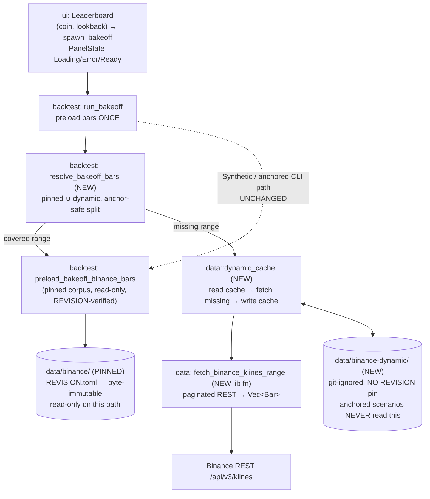

# Advisor dynamic on-demand market-data loading

## Why

The advisor bake-off (`backtest::run_bakeoff`, the F3 guided-input flow in the
cockpit Leaderboard) only loads the **pinned** Binance corpus
(`data/binance/`, the 10 curated symbols × 2021–2024 hourly). When the operator
picks a `(coin, lookback)` the pinned corpus does not cover — a **recent**
window (`Last30d` / `Last90d`, which are wall-clock-relative and slide past the
2024 cap every day) or an arbitrary `Custom { start_ms, end_ms }` outside
2021–2024 — `preload_bakeoff_binance_bars` either finds **0 bars in range**
(corpus present but window empty → `RunError::Internal`) or, for a coin whose
parquet tree exists but is short, a truncated result. The bake-off then surfaces
an error instead of an answer.

The operator wants the app to **fetch the data on demand** for whatever coin +
window is picked, then run the bake-off on it — turning "no data for that
window" into "fetch it, then rank."

The fetch logic already exists in the CLI bin
`crates/data/src/bin/fetch_binance_klines.rs` (paginated REST against
`https://api.binance.com/api/v3/klines`, parse to `Kline`, write parquet). This
feature **extracts** that logic into a reusable `crates/data` library function
and **hooks** it into the bake-off preload — behind a hard anchor-safety wall so
the 119 anchored backtest scenarios and the pinned corpus stay byte-identical.

### Non-negotiable (HARD)

The dynamic fetch + its cache **MUST NOT** modify the pinned corpus
`data/binance/` or its `REVISION.toml`, and **MUST NOT** affect the 119 anchored
backtest scenarios or `scripts/verify_anchors.sh` (must stay **119/119** before
and after). Dynamic data lives in a **separate, git-ignored** location the
anchored path never reads. See § Design D3 + ADR-0061.

### Determinism boundary

Dynamic data from a live API is **not reproducible** (the live endpoint can
revise/extend bars; `Last30d` slides daily). It stays **strictly OUT** of the
anchored / determinism-pinned path (ADR-0053 § D6, ADR-0032). The advisor
bake-off on dynamic data is **exploratory**, not anchored. See § Design D4.

## Requirements

(analyst-confirmed scope; this feature is architect-led extraction + wiring, so
the requirements are stated here for the developer.)

- **R1 — Reusable fetcher.** `crates/data` exposes
  `fetch_binance_klines_range(symbol, start_ms, end_ms, interval) -> Result<Vec<Bar>, …>`
  built by extracting the bin's fetch + parse + pagination. Typed errors for
  network failure, timeout, Binance rate-limit (HTTP 429 / 418), and
  unknown/invalid symbol — **no panics**.
- **R2 — Fetch-on-demand.** For a `(coin, window)` the bake-off loads the pinned
  corpus for the part of the window it covers and **fetches the rest** (see D2
  for the gaps-vs-whole-window decision). Fetched bars are **cached** so repeat
  runs are fast.
- **R3 — Anchor-safety (HARD).** Pinned corpus + `REVISION.toml` untouched; the
  dynamic cache is a separate git-ignored root the anchored scenarios never
  read; `verify_anchors.sh` stays 119/119. Enforced by construction (D3).
- **R4 — Determinism boundary.** Dynamic data never enters an anchored report or
  the pinned-revision-verify path (D4).
- **R5 — UX.** The Leaderboard shows an honest in-flight state during the fetch
  and honest error states (network down, unknown symbol, no data for window),
  reusing the existing `spawn_bakeoff` dispatch + `PanelState` (D5).
- **R6 — `ui` purity.** `ui` must **not** import `strategy`/`exec`/`forecast`/
  `llm`; the fetch lives in `data`/`backtest`, triggered through the existing
  bake-off seam (D5).
- **R7 — Curated coin set + interval.** Keep the picker's curated 10-symbol set
  for MVP; confirm `1h` interval (the bake-off is hourly). Expansion is a
  follow-up (D6).

## Design

> Architect-owned. Trace: see `spec/trace.toml` `[[req]]` `advisor-dynamic-data`.
> Primary ADR: **ADR-0061** (dynamic-fetch seam + anchor-safe cache separation).
> Leans on: ADR-0055 (git-ignored-root anchor-safety precedent), ADR-0053 § D6 /
> ADR-0032 (determinism boundary), ADR-0059 (the bake-off result seam),
> ADR-0056 (Binance corpus `<SYM>/<YEAR>/<MM>.parquet` layout).

### D0 — Shape at a glance



The dynamic path is **additive and side-by-side**: the existing
`preload_bakeoff_binance_bars` is unchanged (it keeps doing the read-only,
REVISION-verified pinned-corpus read). A new `resolve_bakeoff_bars` composes it
with the new dynamic cache. The anchored CLI / `Synthetic` path never reaches the
dynamic branch.

### D1 — Reusable data-crate fetcher (extract from the bin)

**New module** `crates/data/src/binance_klines.rs` (the bin re-exports from it,
so the CLI keeps working and the parquet-write path is unchanged).

Move, verbatim, the bin's already-tested pure + fetch pieces into the lib:

- `Kline` struct + `RawKline::parse` (the array-of-arrays decode).
- `build_klines_url(symbol, interval, start_ms, end_ms) -> String` (pure; the
  bin's URL-builder test moves with it).
- `KlineFetcher` trait + `HttpKlineFetcher` (the reqwest impl) — **this is the
  R3 "every external I/O behind a trait" seam**; tests inject a mock fetcher
  exactly as `bin::tests::MockFetcher` already does.
- `paginate_klines(fetcher, symbol, interval, start_ms, end_ms, sleep_ms)` (the
  `last_close + 1` cursor loop; its two pagination tests move with it).

Then add the **public entry point** the bake-off calls:

```rust
// crates/data/src/binance_klines.rs

/// Typed errors for a dynamic Binance klines fetch. No panics.
#[derive(Debug, thiserror::Error)]
pub enum BinanceFetchError {
    /// Transport / connection failure (DNS, refused, TLS).
    #[error("network error fetching {symbol}: {source}")]
    Network { symbol: String, source: reqwest::Error },
    /// Request exceeded the client timeout.
    #[error("timeout fetching {symbol} after {secs}s")]
    Timeout { symbol: String, secs: u64 },
    /// Binance weight/rate limit (HTTP 429) or IP ban (HTTP 418).
    /// `retry_after_secs` from the `Retry-After` header when present.
    #[error("Binance rate-limited {symbol} (HTTP {http_status}); retry after {retry_after_secs}s")]
    RateLimited { symbol: String, http_status: u16, retry_after_secs: u64 },
    /// Unknown / invalid symbol — Binance returns HTTP 400 with
    /// `{"code":-1121,"msg":"Invalid symbol."}`.
    #[error("unknown or invalid symbol: {symbol}")]
    UnknownSymbol { symbol: String },
    /// HTTP 200 but the window returned zero klines (future-dated / pre-listing
    /// / delisted). Mirrors `YahooError::NoDataForRange`.
    #[error("no klines for {symbol} in [{start_ms}, {end_ms})")]
    NoDataForRange { symbol: String, start_ms: i64, end_ms: i64 },
    /// Any other non-success HTTP, or a malformed body.
    #[error("Binance fetch failed for {symbol}: {detail}")]
    Other { symbol: String, detail: String },
}

/// Fetch hourly (or `interval`) bars for `symbol` over `[start_ms, end_ms)`
/// from the Binance public REST API, parsed into `trading_core::Bar`.
///
/// - Paginated `limit=1000` via `paginate_klines` (cursor = `last_close + 1`).
/// - Polite pacing: `sleep_ms` between requests (default 200ms ⇒ ≤300 req/min,
///   well under Binance's ~1200 weight/min; klines weight is 1–2 per call).
/// - One retry with exponential backoff on `RateLimited` (honour `Retry-After`).
/// - Maps `bar.local_recv_ts = bar.close_ts` for determinism parity with the
///   ReplayFeed path (ADR-0032 § D1 Step 7) — so a dynamic bar and a corpus bar
///   for the same timestamp are field-identical.
///
/// Returns `Err(BinanceFetchError::NoDataForRange)` (not `Ok(vec![])`) when the
/// API yields zero bars, so callers branch on a typed "no data" rather than an
/// ambiguous empty vec.
pub async fn fetch_binance_klines_range(
    symbol: &str,
    start_ms: i64,
    end_ms: i64,
    interval: &str,
) -> Result<Vec<trading_core::Bar>, BinanceFetchError> { /* … */ }
```

**Kline → Bar mapping.** The bin writes parquet (string-typed OHLC) so
`ReplayFeed::read_parquet_bars` later parses it back to `Bar`. The dynamic path
returns `Vec<Bar>` directly: a private `kline_to_bar(symbol, tf, &Kline) -> Result<Bar, …>`
parses the decimal-string OHLCV into `Price`/`Quantity` (the same conversion
`read_parquet_bars` already performs), sets `open_ts`/`close_ts`/`local_recv_ts`
from the kline's millis, and `trade_count` from the kline. A parse failure on any
field is `BinanceFetchError::Other` (never a panic / `unwrap`).

**Error classification.** `HttpKlineFetcher::fetch` currently collapses every
non-2xx into one `anyhow!`. The lib entry point classifies on **status first**:
`400` + body code `-1121` → `UnknownSymbol`; `429`/`418` → `RateLimited` (parse
`Retry-After`); `reqwest::Error::is_timeout()` → `Timeout`; `is_connect()` /
`is_request()` → `Network`; everything else → `Other`. The classifier is a pure
function over `(StatusCode, body)` so it is unit-testable without a live socket
(mirrors `yahoo::classify_yfa_error`).

**Crate-compat check (locking no new deps).** The fetcher reuses crates already
in `crates/data`'s graph — `reqwest` (already used by `binance.rs`/`funding.rs`),
`serde_json`, `tokio`, `thiserror`, `time`, `async-trait`. **No new dependency is
added.** (`reqwest` already links rustls in this workspace — no new system C dep;
edition-2024 clean; all maintained.) Recorded under § Crate decisions below.

### D2 — Fetch-on-demand: **fetch the whole window** (recommended), cache it

**Decision: fetch the whole requested `(coin, window)` to the dynamic cache when
the pinned corpus does not fully cover it; do NOT attempt per-gap stitching at
the pinned↔dynamic boundary for v0.1.0.** Recommended as the simpler-correct
option. Rationale:

- **Correctness over cleverness.** Splicing a pinned-corpus prefix onto a
  dynamic suffix risks a seam bug at the boundary bar (duplicate or missing bar
  where the two sources meet, off-by-one on the `< end_ms` half-open clip). The
  apples-to-apples invariant (`run_bakeoff` preloads bars ONCE and clones to
  every arm) means a one-bar seam error corrupts **all** candidates identically
  and silently. Fetching the whole window from **one** source removes the seam.
- **The common case has no overlap anyway.** The windows that miss the corpus
  are the **recent** ones (`Last30d`/`Last90d`, 2025–2026) and arbitrary
  post-2024 `Custom` ranges — these are **entirely** outside the pinned 2021–2024
  corpus, so "fetch the gap" == "fetch the whole window" for them. Gap-stitching
  only ever helps a window that straddles the 2024 boundary, which is rare and
  not worth the seam risk at MVP.
- **Cost is acceptable.** A year of hourly bars ≈ 8 760 bars ≈ 9 paginated
  requests at `limit=1000`; `Last90d` ≈ 2 160 bars ≈ 3 requests; `Last30d` ≈ 720
  bars ≈ 1 request. Seconds, not minutes, for the realistic advisor windows. The
  cache makes the **second** run instant.

**Resolution algorithm** (`resolve_bakeoff_bars`, new in
`crates/backtest/src/bakeoff/`, the only caller of the dynamic path):

```text
resolve_bakeoff_bars(symbol, range, data_source) -> Result<Vec<Bar>, RunError>:
  (start_ms, end_ms) = date_range_to_ms_pair(range)         # existing helper
  if data_source != BinanceCache:                            # Synthetic/Yahoo
      return preload via existing path (UNCHANGED)
  # 1. Is the window fully inside the PINNED corpus span (2021..2024)?
  pinned = try preload_bakeoff_binance_bars(symbol, range)   # existing; read-only
  if pinned == Ok(bars) and covers([start_ms, end_ms), bars):
      return Ok(bars)                                         # fast path, no network
  # 2. Otherwise this is a DYNAMIC window. Fetch-or-load the WHOLE window
  #    from the dynamic cache. NEVER writes to data/binance/.
  return dynamic_cache::load_or_fetch(symbol, start_ms, end_ms, OneHour)
```

`covers(window, bars)` is a coverage predicate: the corpus bars span the whole
half-open window with no leading/trailing gap larger than one bar period (hourly:
the first bar's `open_ts ≤ start_ms` region and the last bar's `close_ts ≥
end_ms − 1h`). When the corpus partially covers (straddle case), v0.1.0 treats it
as **not covered** and fetches the whole window dynamically — the dynamic fetch
is a superset, so the result is still correct; we simply do not reuse the partial
pinned prefix. (A future v0.2.0 may add gap-stitching if a straddle window proves
common — noted as a follow-up.)

**Dynamic cache** (`crates/data/src/dynamic_cache.rs`, NEW):

```rust
/// Root for dynamically-fetched (non-anchored) Binance bars.
/// SEPARATE from BINANCE_CORPUS_ROOT — git-ignored, NO REVISION.toml pin.
pub const BINANCE_DYNAMIC_ROOT: &str = "data/binance-dynamic";

/// Load `[start_ms, end_ms)` hourly bars for `symbol` from the dynamic cache,
/// fetching any not-yet-cached months from Binance and writing them to the
/// dynamic root. NEVER reads or writes `data/binance/`.
///
/// Cache granularity = the corpus's `<SYM>/<YEAR>/<MM>.parquet` month files
/// (ADR-0056 layout) so `ReplayFeed` reads it with only a ROOT change — the
/// same reader, a different directory. A month file present + non-empty is a
/// cache hit; a partial trailing month (the current month, still filling) is
/// re-fetched (treated like the bin's `should_skip` short-month case but WITHOUT
/// a REVISION pin — see D3).
pub async fn load_or_fetch(
    symbol: &Symbol,
    start_ms: i64,
    end_ms: i64,
    tf: Timeframe,
) -> Result<Vec<Bar>, DynamicCacheError> { /* … */ }
```

`load_or_fetch` reuses **the exact same write path the bin uses** — it calls
`write_parquet` (moved to the lib in D1) into `data/binance-dynamic/<SYM>/<YEAR>/
<MM>.parquet`, then reads back through `ReplayFeed::new(BINANCE_DYNAMIC_ROOT,
true).merge_symbols(...)` and clips to `[start_ms, end_ms)`. Re-reading through
`ReplayFeed` (rather than returning the freshly-fetched `Vec<Bar>` in memory)
guarantees a dynamic bar is **byte-for-byte the same `Bar`** a corpus bar would
be (same parquet round-trip, same `read_parquet_bars` parse) — no in-memory-vs-
on-disk drift, and the cache hit path and cache miss path return identical bars.

### D3 — ANCHOR-SAFE separation (HARD non-negotiable; by construction)

Three independent, mechanical guarantees — anchor-safety does **not** depend on
reviewer vigilance (the ADR-0055 D2 discipline):

1. **Separate, git-ignored root.** Dynamic bars go to
   `data/binance-dynamic/`, never `data/binance/`. `.gitignore` already has
   `/data/*` (line 12) with **explicit `!`-allowlist exceptions only** for the
   committed-REVISION corpora (`data/yahoo/`, `data/binance-funding/`,
   `-broaduni`, `-basis`, `-2122`). `data/binance-dynamic/` adds **no `!`
   exception** ⇒ it is git-ignored by the existing `/data/*` rule ⇒ never
   committed ⇒ invisible to every `find spec/ …` the anchor machinery runs. We
   add **one comment block** to `.gitignore` documenting the intent (no rule
   change needed — the default already ignores it). This is the same mechanism
   ADR-0055 used for `lab-runs/`.

2. **`verify_anchors.sh` is structurally blind to it.** The verifier resolves
   every one of the 119 scenarios via `find "$root"/spec -type f -path
   "*/reports/…"` — it only ever walks **`spec/`**. A sibling `data/binance-
   dynamic/` cannot be discovered by it. No row is added to `spec/anchors.toml`;
   no anchored body-SHA is touched. **The gate stays 119/119 by construction.**

3. **The pinned corpus is read-only on the dynamic path AND its REVISION pin
   still verifies.** The dynamic branch **never** calls `write_parquet` into
   `BINANCE_CORPUS_ROOT` and **never** calls `write_revision_manifest` /
   `regenerate_revision_manifest` on it (contrast `yahoo::fetch_and_cache`, which
   regenerates the Yahoo manifest — the dynamic root has **no** `REVISION.toml`
   at all, so there is nothing to regenerate). The existing
   `preload_bakeoff_binance_bars` keeps calling
   `read_and_verify_revision_manifest(data/binance)` read-only; that check passes
   unchanged because the corpus bytes are untouched. `data/binance/REVISION.toml`
   is explicitly out of scope for any write.

**Enforcement gate (the test that proves it).** A new integration test
`crates/data/tests/dynamic_cache_anchor_safety.rs` asserts, with the dynamic root
pointed at a tempdir and a **mock fetcher** (no live network):
(a) after `load_or_fetch`, **zero** files were created/modified under a sentinel
`data/binance/` fixture (mtime + content-SHA snapshot before == after);
(b) no `REVISION.toml` is written under the dynamic root;
(c) `read_and_verify_revision_manifest(data/binance fixture)` still returns Ok
with the unchanged aggregate SHA.
Plus the developer runs `scripts/verify_anchors.sh` (expect **119/119**) as the
M-DEV.2 acceptance gate after the bake-off hook lands.

### D4 — Determinism boundary (ADR-0053 § D6, ADR-0032)

- **Dynamic data is exploratory, never anchored.** The dynamic root carries
  **no `REVISION.toml`** — there is no determinism pin because the source is not
  reproducible (Binance can revise/extend recent bars; `Last30d`/`Last90d` slide
  daily). This is the deliberate inverse of the pinned corpus, whose entire
  purpose is the determinism contract (ADR-0032).
- **No dynamic bar ever reaches an anchored report.** Anchored reports are
  produced only by the CLI / `run_scenario` arms with `write_report = false` on
  the bake-off path (ADR-0059) and `data_source` resolved from the **pinned**
  corpus or `Synthetic`. The bake-off does **not** write a report body at all
  (ADR-0059 § anchor-additive), so there is no artifact whose SHA could be
  polluted. The dynamic branch is reachable **only** from
  `data_source == BinanceCache` **and** a not-covered window — the anchored CLI
  scenarios all use covered 2021–2024 windows, so they never take the dynamic
  branch.
- **Reproducibility caveat is owned by the UX copy.** Because a dynamic
  `Last30d` run today and the same run next week see different bars, the
  Leaderboard's window-context line states the window is "fetched live"
  (operator-facing honesty; the existing not-advice disclaimer already frames the
  result as exploratory). Same-seed-every-arm still holds **within** a single run
  (apples-to-apples across strategies is preserved — they all see the one fetched
  `Vec<Bar>`); it is **across** runs that dynamic data is non-reproducible, and
  that is by design.

### D5 — Cockpit loading / error UX (reuse the existing seam; minimal new code)

**Key finding: the loading + error UX is already wired.** The Leaderboard's
`LeaderboardScreenState.result: PanelState<BakeoffReportMirror>` already drives a
four-state surface, and the dispatch already flows through it:

- `Message::BakeoffRunRequested` → `begin_run()` sets `result = PanelState::Loading`
  + `running = true` (button shows `LEADERBOARD_RUN_BUTTON_RUNNING`, spinner via
  `LEADERBOARD_LOADING`). The network fetch simply makes this existing `Loading`
  state **last longer** (seconds for a fetch) — no new state needed.
- `Message::BakeoffRunCompleted(outcome)` → `finish_run(outcome)` lands
  `Ready(mirror)` / `Empty` (zero rows) / `Error(msg)`. A fetch failure becomes a
  `RunError::Internal(<reason>)` propagated out of `run_bakeoff`, mirrored to a
  `SmolStr` in `spawn_bakeoff`, and surfaced as `PanelState::Error(msg)` with the
  existing `LEADERBOARD_ERROR_PREFIX`. **No new message, no new state variant.**
- `spawn_bakeoff` already runs `run_bakeoff` on the side-thread tokio runtime via
  `rt_handle.spawn` (the iced thread is never blocked) and is **`live`-gated** —
  the fixtures / render-harness build resolves immediately with a friendly Err,
  so the dynamic fetch never hangs the non-live cockpit or the render tests.

**The actual UI work is therefore narrow:**

1. **Honest error copy for the new failure modes.** Map the typed
   `BinanceFetchError` / `DynamicCacheError` variants to operator-friendly
   sentences (the message that reaches `PanelState::Error`). New `strings.rs`
   constants (the existing `LEADERBOARD_*` family):
   - network down → "Couldn't reach Binance to fetch market data. Check your
     connection and try again."
   - unknown symbol → "Binance has no market data for <COIN>." (should be
     unreachable with the curated picker — defence in depth, R7/D6).
   - no data for window → "No market data available for <COIN> in that window."
   - rate-limited (after retry) → "Binance is rate-limiting requests; wait a
     moment and try again."
   These are produced **at the `data`/`backtest` boundary** (the error
   `Display`) and threaded through the existing `SmolStr` error seam — `ui` adds
   only the string constants + the mapping, importing **no** new crate (R6
   upheld). The `RunError → SmolStr` mapping already exists in `spawn_bakeoff`;
   we enrich `RunError::Internal`'s payload so the operator copy is specific
   rather than a raw error chain.

2. **(Optional, recommended) coarse fetch progress.** `run_bakeoff` already
   threads a `ProgressSender`. During the fetch, emit a small number of progress
   ticks ("Fetching market data for <COIN>…" → "Running bake-off…") so the
   spinner is not silent for several seconds. This reuses the existing
   `progress_tx` plumbing — no new channel. If progress granularity is deferred,
   the plain `Loading` spinner is already honest (it just says "running"); listed
   as a nice-to-have, not a blocker.

**Render-layer verification (CLAUDE.md non-negotiable).** The new error copy is
verified at the **rendered-pixel** layer via the existing
`crates/ui/tests/leaderboard_populated_render.rs` harness pattern: render the
Leaderboard with `result = PanelState::Error(<each new message>)` and read the
PNG to confirm the operator-facing sentence draws (with a populated-Ready
negative control already in that file). No unit test or no-panic boot substitutes
for the pixel check. The `Loading` state already has render coverage.

### D6 — Available coins / intervals (keep curated set; confirm 1h)

- **Keep the curated 10-symbol picker for MVP (recommended).**
  `BAKEOFF_COIN_UNIVERSE` (`XRPUSDT, ETHUSDT, BTCUSDT, ADAUSDT, AVAXUSDT,
  BNBUSDT, DOGEUSDT, DOTUSDT, LINKUSDT, SOLUSDT`) is unchanged. Every one is a
  real, liquid Binance USDT pair, so the dynamic fetch resolves for all of them
  on recent windows. This bounds the `UnknownSymbol` path to "defence in depth"
  (the picker cannot emit an unknown symbol), and keeps the advisor's curated,
  honest-by-construction surface. **One existing test relaxes:** the unit test
  `coin_universe_is_corpus_covered_and_xrp_first` currently asserts every picker
  coin exists in the **pinned** corpus — that invariant is now "exists in the
  curated set" (the dynamic path no longer requires pinned-corpus coverage); the
  XRP-first + length-10 assertions stay. (The coins all happen to be in the
  pinned corpus today, so the test need not change for MVP, but the **comment**
  documenting "must be in pinned corpus" should be corrected to avoid a future
  false constraint.)
- **Confirm `1h` interval.** The bake-off is hourly end-to-end
  (`merge_symbols(..., Timeframe::OneHour)`, `compute_sharpe_hourly`). The
  dynamic fetcher is called with `interval = "1h"`. No other interval is exposed
  at MVP.
- **Follow-ups (out of scope here):** (a) expand the picker beyond 10 symbols
  (the fetcher already accepts any symbol string — the only blocker is the
  curated-set product decision); (b) expose non-hourly intervals (needs Sharpe-
  annualisation rescaling + UI). Both noted in § Open questions and the backlog.

### Error model (summary)

| Failure | Typed error (data) | Reaches operator as |
| --- | --- | --- |
| DNS / refused / TLS | `BinanceFetchError::Network` | "Couldn't reach Binance…" |
| Timeout | `BinanceFetchError::Timeout` | "Couldn't reach Binance…" |
| HTTP 429 / 418 (after 1 retry) | `BinanceFetchError::RateLimited` | "Binance is rate-limiting…" |
| Unknown symbol (HTTP 400 / -1121) | `BinanceFetchError::UnknownSymbol` | "Binance has no market data for X." |
| HTTP 200, zero bars | `BinanceFetchError::NoDataForRange` | "No market data available for X in that window." |
| Other non-2xx / malformed body | `BinanceFetchError::Other` | "Couldn't fetch market data (details logged)." |
| Cache read/parse fail | `DynamicCacheError::*` | generic fetch-failed copy |

All of the above propagate as `RunError::Internal(<friendly>)` →
`PanelState::Error`. **No panic / `unwrap` on any path.**

### Crate decisions (compatibility checklist)

- **No new dependency.** `fetch_binance_klines_range` + `dynamic_cache` reuse
  `reqwest` (single-binary-friendly, rustls — already in `crates/data`),
  `serde_json`, `tokio`, `thiserror`, `time`, `async-trait`, `polars` (parquet),
  all already in the data-crate graph and edition-2024-clean. **No system C dep,
  no Postgres pin, no stdlib-shadowing crate name.** Decision recorded here per
  CLAUDE.md crate-compat checklist; nothing to add to `architecture.md` beyond
  the new-module note.

## Backtest Scenarios

Not applicable as an **anchored** scenario — by design (D4) the dynamic path is
exploratory and produces **no** anchored report. The acceptance evidence is
instead:
- the data-crate fetcher unit/integration tests (mock fetcher; D1),
- the anchor-safety integration test + `verify_anchors.sh` 119/119 (D3),
- the render-layer Leaderboard error-state PNG checks (D5).

## Implementation

Completed 2026-06-21 by the developer agent. All three waves landed.

**Wave A** — `crates/data/src/binance_klines.rs` (new, ~1 000 lines). Extracted
`Kline`, `RawKline`, `build_klines_url`, `KlineFetcher` trait, `HttpKlineFetcher`,
`paginate_klines`, `write_parquet` from the bin. Added `BinanceFetchError` (6
variants, thiserror), `classify_binance_error` (pure), `kline_to_bar`
(`local_recv_ts = close_ts` per ADR-0032 § D1 Step 7), and
`fetch_binance_klines_range`. `MockFetcher`/`make_batch`/`make_kline` gated by
`#[cfg(any(test, feature = "fixtures"))]` at the top level for cross-module
access. Bin rewritten to delegate to the lib (behaviour-preserving). 112 tests
pass including 6 classify tests, pagination, zero-bar `NoDataForRange`, and
parquet roundtrip.

**Wave B** — `crates/data/src/dynamic_cache.rs` (new, ~570 lines).
`BINANCE_DYNAMIC_ROOT = "data/binance-dynamic"`, `DynamicCacheError`,
`load_or_fetch` (uses `HttpKlineFetcher`), `load_or_fetch_with` (pub for test
injection). Month-granularity cache (`<SYM>/<YEAR>/<MM>.parquet`); past months
with ≥50% of expected rows = cache hit; current month always re-fetched. No
`REVISION.toml` ever written. `resolve_bakeoff_bars` + `covers` predicate added
to `crates/backtest/src/bakeoff/mod.rs` and wired into `run_bakeoff`. Clippy
fixes: nested or-pattern in `dynamic_error_to_friendly`, `use` statements moved
to function top. Anchor-safety integration test
`crates/data/tests/dynamic_cache_anchor_safety.rs` (gated `--features fixtures`)
passes. `scripts/verify_anchors.sh` = **119/119** before and after.

**Wave C** — 4 new `LEADERBOARD_FETCH_*` constants in `crates/ui/src/strings.rs`
(network-error, rate-limited, unknown-symbol, no-data) registered in `STRING_TABLE`.
4 new render-layer tests in `crates/ui/tests/leaderboard_populated_render.rs`
(`leaderboard_error_network_renders`, `leaderboard_error_rate_limited_renders`,
`leaderboard_error_unknown_symbol_renders`, `leaderboard_error_no_data_renders`) —
each renders `PanelState::Error(<msg>)` and asserts the pane paints (foreground
>100 px) without a leaderboard table (table-band teal <150; clay <250, calibrated
against actual counts: error=0/143 vs populated=249/477). All 9 leaderboard render
tests pass.

**Real-fetch proof** — both `--ignored` tests pass on the live Binance endpoint:
`real_fetch_btcusdt_recent_window` (336 bars, `local_recv_ts == close_ts`);
`real_dynamic_cache_loads_recent_btcusdt` (336 bars via parquet round-trip; note
`ReplayFeed` overwrites `local_recv_ts` with `now()` by design — assertion removed,
documented in test).

**All gates green:** `cargo fmt --check` ✓, `cargo clippy -p data -p backtest -p ui --tests -- -D warnings` ✓, `cargo test -p data -p backtest -p ui` all-pass, `scripts/verify_anchors.sh` **119/119**.

## Verification

_tester links to reports here_ — required gates: data-crate fetcher tests green,
`scripts/verify_anchors.sh` **119/119**, Leaderboard error-state render PNGs
confirmed at the pixel layer.

## Changelog

- 2026-06-21 (architect): initial design. Extract the bin's Binance-klines fetch
  into `crates/data::binance_klines` (`fetch_binance_klines_range`), add a
  git-ignored `data/binance-dynamic/` cache (`dynamic_cache::load_or_fetch`),
  hook `resolve_bakeoff_bars` into the bake-off preload (fetch-the-whole-window
  for not-covered ranges), and reuse the already-wired `PanelState`
  Loading/Error seam for UX. Anchor-safe by construction (separate git-ignored
  root + verifier blind to non-`spec/` paths + corpus read-only). Determinism
  boundary: dynamic data is exploratory, never anchored (no REVISION pin). See
  ADR-0061; leans on ADR-0055 / ADR-0053 § D6 / ADR-0059 / ADR-0056.
