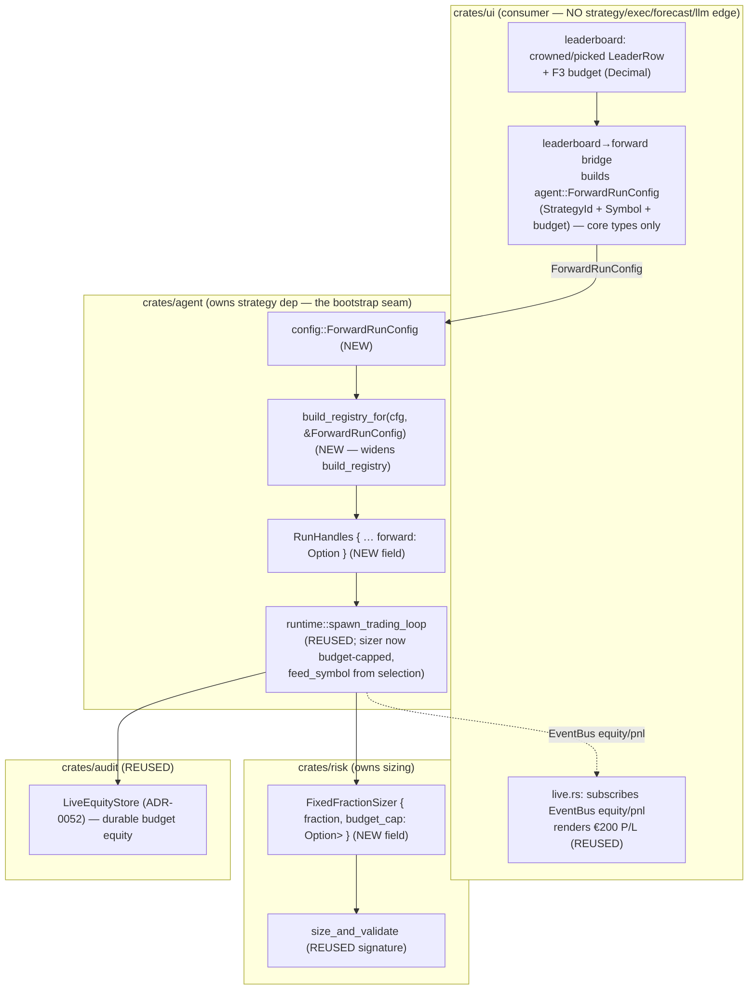

# Budget-aware sizing + forward paper-trade (roadmap F4 + F5)

## Why

(Pulled from [`../product.md`](../product.md) — the 2026-06-19 single-coin
investment-advisor pivot, journey steps 4 + 5. This closes the MVP.)

The user has already seen the bake-off leaderboard
([`../advisor-bakeoff-ranking/feature.md`](../advisor-bakeoff-ranking/feature.md))
and a crowned recommendation. The journey now finishes:

4. **Plan** — the selected strategy is sized to the user's **fixed €200 budget**
   (≈ 200 USDT, FX not modelled per product § D4), not the engine's default
   `initial_capital_usdt`.
5. **Watch** — the selected strategy **paper-trades forward** on real incoming
   Binance data with that budget sizing, and the cockpit **Live view** shows
   **running profit/loss on the simulated €200**.

This is a **re-framing of the shipped engine, not a new build.** F4 reuses the
risk/sizing layer (`crates/risk`: `FixedFractionSizer`, `size_and_validate`);
F5 extends the agent paper runtime (`crates/agent::runtime` — the unified
`spawn_trading_loop`, paper mode = live Binance WS, real-time, ADR-0053) and the
cockpit Live view (`crates/ui/src/live.rs`), consuming results through the
sanctioned `EventBus` / `audit::query` seam exactly as Live already does. The
durable equity store (ADR-0052) and the reflection-wired paper loop (commit
`e9da47f`) carry forward untouched.

Operator-ratified product decisions this design implements:
- **D4** — €200 sized as **200 quote-units (USDT)**; FX not modelled; the UI
  labels it "€200 ≈ 200 USDT, FX not modelled". Fixed EUR→USD rate is the v0.2
  refinement (backlog F7).
- **D5** — paper/sim only; the budget is a **hard cap** (product § Risk: "paper
  sizing may never deploy more than the user's simulated budget"); not-advice +
  simulated-budget disclaimer on the Live/forward surface.
- **D2** — the forward "plan" IS the Live view unfolding (no pre-computed future
  orders for a price-dependent strategy); F6 (the stance + rules detail surface)
  is a separate v0.2 feature.

## Requirements

(Analyst scope; architect restating the slice this feature delivers.)

- **R1 — Budget-aware sizing modifier (F4).** The forward run sizes positions
  against the user's fixed budget (the *budget equity*), not the default
  capital, and **never deploys notional above the budget** (the hard cap). It is
  deterministic and reuses the risk layer.
- **R2 — Day-1 baseline-equity-divergence e2e (NON-NEGOTIABLE, CLAUDE.md).** F4
  is a sizing modifier, so it ships with a day-1 e2e that asserts the
  budget-sized equity path **diverges from the un-budgeted (default-capital)
  baseline path** by a testable epsilon (≥ 1 bp) when the strategy's decision
  variable is non-trivial (≥ 1 fill). This is the gate that catches a no-op
  modifier (the `v3-volatility-forecaster-noop-fix` precedent).
- **R3 — Selection → (strategy, budget) bridge (F5).** The crowned strategy
  (default) — or a user-picked row — from the leaderboard `BakeoffReport` is
  carried into the forward run as a `(StrategyId, symbol, budget)` triple,
  **without a `ui → strategy` edge**. The bridge produces an opaque config the
  `agent` runtime consumes; `ui` only ever names a `StrategyId` (a `core` type)
  and a budget `Decimal`.
- **R4 — Forward paper run on real data (F5).** The selected strategy runs in
  **paper mode (real-time live Binance WS)** through the existing
  `spawn_trading_loop`, on the selected coin, with F4 budget sizing. Fills →
  positions → equity flow onto the `EventBus` and the durable equity store as
  they already do.
- **R5 — Running €200 P/L in the Live view (F5).** The Live view surfaces the
  budget equity and its running P/L (equity − budget) on the simulated €200,
  rendered at the pixel layer (the cockpit render-verification rule), through
  the sanctioned seam. No new `ui` crate dependency.
- **R6 — Determinism + paper-only + anchor neutrality.** The sizing modifier is
  a pure `Decimal` function (no f64). The forward run writes no
  `spec/*/reports/` body → the 119/119 anchored backtest body-SHAs stay
  byte-identical. No real orders.

## Design

### 0. Summary

| Decision | Choice | Rationale |
|---|---|---|
| F4 sizing-modifier home | **`crates/risk::sizing`** — extend `FixedFractionSizer` with an **optional `budget_cap: Option<Money<Usdt>>`** field + a `with_budget_cap` ctor; cap inside `compute_qty` | The risk layer already owns sizing + the exposure cap; the budget is a *second* hard notional cap composed with the existing one. No new sizer type, no new call path. ADR-0060 § D1. |
| F4 modifier semantics | **notional cap**: `qty ≤ budget / price`, applied alongside the exposure-cap clamp (min of the two) | The budget is a ceiling on *deployed* capital, not a re-scaling of equity — matches "never deploy more than the budget". Deterministic `Decimal` min. |
| F4 day-1 e2e home | **`crates/risk/tests/budget_sizing_divergence_end_to_end.rs`** — drive the public `spawn_trading_loop` (or its sizing path) over a fixture bar series with budget vs no-budget; assert the two equity tails diverge ≥ 1 bp when ≥ 1 fill occurred | Mirrors `crates/strategy/tests/vol_targeting_overlay_end_to_end.rs` (the precedent). The gate lives with the modifier. ADR-0060 § D2. |
| F5 selection→config bridge | **`agent::ForwardRunConfig { strategy: StrategyId, symbol: Symbol, budget: Money<Usdt>, lookback: Option<DateRange> }`** (new, in `crates/agent::config`) built UI-side from the leaderboard mirror + the F3 budget; consumed by `build_registry` + `RunHandles` | `ForwardRunConfig` is built from `core` types only (`StrategyId`, `Symbol`, `Decimal`) → `ui` needs no `strategy` edge; `agent` (which already depends on `strategy`) resolves the `StrategyId` to a registry entry. ADR-0060 § D3. |
| F5 strategy injection seam | **extend `build_registry(cfg)` → `build_registry_for(cfg, &ForwardRunConfig)`** to register the *selected* strategy id (dispatch on the same id set the bake-off uses); thread the **selected `symbol`** + **`budget`** into `RunHandles` so `run()` stops hardcoding `feed_symbol = "BTCUSDT"` | The runtime already has the registry-builder seam (`build_registry` / `build_registry_with_ledger`) precisely so `ui` never imports `strategy`. F5 widens it to take the selection. ADR-0060 § D3. |
| F5 real-time vs replay | **real-time forward run is the MVP** (paper mode = live WS, real-time — confirmed during the soak); the "what it would have done" fast-replay preview is **deferred to v0.2** (it is just `run_scenario` over the recent window, already shippable, but not required to close the journey) | The journey is "watch it paper-trade forward"; the Live view filling in over time IS the deliverable. A replay preview is an additive convenience, not a gate. ADR-0060 § D4. OQ-1 flags it for the operator. |
| Budget equity surfacing | **the forward loop seeds `cash = budget` and `initial_capital = budget`** so the *existing* equity math (`equity = cash + position·mark`, already published every bar to the `EventBus` + the durable store) IS the budget equity; Live computes P/L = equity − budget | Zero new equity plumbing — the budget becomes the loop's starting capital, and every downstream consumer (Live tape, durable store, PnL snapshots) is already wired to that number. ADR-0060 § D5. |

### 1. Where it lives + the boundary



**Crate homes, verified against the dependency graph + the code:**

- **F4 lives in `crates/risk::sizing`.** `FixedFractionSizer::compute_qty`
  (`crates/risk/src/sizing.rs:32`) already clamps to the per-symbol exposure
  cap. The budget is a *second* hard notional ceiling; it belongs in the same
  function as a composed `min`. `spawn_trading_loop`
  (`crates/agent/src/runtime.rs:1138`) already builds the sizer from
  `risk_cfg.sizing.fixed_fraction` — F4 changes that construction to also pass
  the budget cap, and changes nothing else in the loop.
- **F5's strategy/symbol injection lives in `crates/agent`.** The runtime
  *already* exposes `build_registry(cfg)` / `build_registry_with_ledger(cfg,
  ledger)` (`runtime.rs:148` / `:182`) as the **sole seam for getting strategies
  into the loop without a `ui → strategy` edge** — the doc-comment says so
  literally: "*so neither the `ui` crate nor any other downstream crate needs a
  direct `strategy` dependency*". F5 widens that seam to take the *selected*
  strategy id (not just the config-declared SMA) and threads the selected
  `symbol` + `budget` into `RunHandles`, so `run()` stops hardcoding
  `feed_symbol = Symbol::new("BTCUSDT")` (`runtime.rs:490`).
- **F5's Live surface stays in `crates/ui/src/live.rs`.** It already subscribes
  to `EventBus` equity/PnL (`stream_pnl` `live.rs:215`, position/equity views)
  and the durable store. The budget equity flows through the *same* channels
  because the budget becomes the loop's starting capital — Live only adds the
  P/L-against-budget framing (equity − budget). **`cargo tree -p ui` is
  unchanged** (the invariant gate, as for the leaderboard feature).

**Why NOT a new `ui → strategy` edge:** the leaderboard already proves a
`StrategyId` (a `trading_core` type) crosses the seam cleanly. The bridge passes
that same id plus a budget `Decimal` plus a `Symbol` — all `core` types. The
resolution of "id → concrete strategy" happens in `agent::build_registry_for`,
which is *already* on the `agent` side of the wall. No `ui` dependency on
`strategy`/`exec`/`forecast`/`llm` is added — preserved by construction.

### 2. F4 — the budget-aware sizing modifier (exact)

`FixedFractionSizer` gains one optional field and one ctor; `compute_qty` gains
one composed clamp. The change is additive and `Decimal`-pure.

```rust
// crates/risk/src/sizing.rs
pub struct FixedFractionSizer {
    pub fraction: Decimal,
    /// Hard notional ceiling on a single position's deployed capital, in USDT.
    /// `Some(budget)` for the budget-aware forward run (F4); `None` preserves
    /// the legacy behaviour byte-for-byte (default-capital sizing).
    pub budget_cap: Option<Money<Usdt>>,   // NEW
}

impl FixedFractionSizer {
    /// Legacy ctor — no budget cap (un-budgeted baseline). UNCHANGED behaviour.
    pub fn new(fraction: Decimal) -> Self {
        Self { fraction, budget_cap: None }
    }

    /// Budget-aware ctor (F4): cap deployed notional at `budget`.
    pub fn with_budget_cap(fraction: Decimal, budget: Money<Usdt>) -> Self {
        Self { fraction, budget_cap: Some(budget) }
    }

    pub fn compute_qty(
        &self,
        equity: Money<Usdt>,
        price: Decimal,
        risk_limits: &RiskLimits,
    ) -> Result<Quantity, SizingError> {
        // … existing zero-equity / zero-price guards …
        let notional = equity.amount() * self.fraction;
        let mut qty = notional / price;

        // EXISTING — exposure-cap clamp (qty·price ≤ cap·equity).
        let max_qty_exposure = (equity.amount() * risk_limits.per_symbol_exposure_cap) / price;
        if qty > max_qty_exposure { qty = max_qty_exposure; }

        // NEW (F4) — budget clamp (qty·price ≤ budget). Composed as a min; the
        // tighter of {exposure cap, budget} wins. Decimal-exact, no f64.
        if let Some(budget) = self.budget_cap {
            let max_qty_budget = budget.amount() / price;
            if qty > max_qty_budget { qty = max_qty_budget; }
        }

        Quantity::new(qty).map_err(|_| SizingError::NegativeQty)
    }
}
```

`size_and_validate` is **unchanged** — it already takes `&FixedFractionSizer` and
calls `compute_qty`; the budget cap rides inside the sizer. The `Order::new`
exposure-cap validation downstream is untouched.

**Why a notional cap, not an equity re-scale.** Two honest interpretations of
"size to €200":
- **(a) Notional cap (chosen).** `equity` stays the true account equity (which,
  in the forward run, *starts* at the budget — see § 4), and the modifier caps
  any single position's deployed capital at the budget. As the budget equity
  grows or shrinks, the cap stays at the original budget — so the user can never
  deploy more than their €200 even after a winning streak inflates equity. This
  is the literal "never deploy more than the budget" hard limit.
- **(b) Equity re-scale.** Pass `equity = budget` to the fraction. Rejected as
  the *modifier* because it conflates the budget with account equity and would
  let a winning streak compound deployment above €200. (Note: § 4 *also* seeds
  the loop's starting capital at the budget — but that is the **account state**,
  not the cap. The cap in (a) is what enforces the ceiling permanently.)

The two compose: the loop starts with `cash = budget` (§ 4) **and** the sizer
caps each deployment at `budget` (this section). Early on they coincide; after
P/L moves equity, the cap is the binding "never exceed €200 deployed" guarantee.

### 3. F4 — the day-1 baseline-equity-divergence e2e (NON-NEGOTIABLE)

`crates/risk/tests/budget_sizing_divergence_end_to_end.rs` — the gate that
catches a no-op budget modifier. Pattern lifted from
`crates/strategy/tests/vol_targeting_overlay_end_to_end.rs`.

**Shape (the contract the developer implements, the tester asserts):**

1. Build a fixture bar series (a deterministic up-then-down close path on one
   symbol, e.g. 60+ bars) where a simple always-in strategy (or a stubbed
   signal source) produces **≥ 1 BUY fill**.
2. Run the sizing path **twice** over the same bars, same seed:
   - **Baseline arm** — `FixedFractionSizer::new(fraction)` (no budget) with the
     engine default `initial_capital_usdt` (e.g. 100_000), starting
     `cash = 100_000`.
   - **Budget arm** — `FixedFractionSizer::with_budget_cap(fraction, 200 USDT)`
     with `cash = 200` (§ 4).
3. Collect each arm's final equity (`cash + position·last_mark`).
4. **Assert divergence:** `(budget_final / 200) ≠ (baseline_final / 100_000)`
   normalised — i.e. the **return paths differ by ≥ 1 bp**, AND assert ≥ 1 fill
   occurred (the decision variable is non-trivial). Under a **no-op** modifier
   (budget cap computed but never applied) the budget arm would size identically
   to baseline-scaled and the return paths would be *equal* → the assertion
   FAILS, exactly as the vol-overlay forensic gate fails pre-fix.

> **Why return-normalised, not raw equity.** Raw equity obviously differs
> (200 vs 100_000 starting cash). The no-op signature is that the *shape* of the
> equity curve (the return %) is identical when the cap never binds. The gate
> asserts the return paths **diverge** because the budget cap *does* bind (the
> €200 deploys a different fraction-of-budget than €100k would, once the
> exposure cap and the budget cap differ). The epsilon ≥ 1 bp matches the
> CLAUDE.md non-negotiable and the precedent's `>= 0.01` style.

**Forensic-gate note for the developer (mirror the precedent's header):** run
this test against `main` BEFORE wiring the cap into `compute_qty`; with the cap
absent the budget arm's return path equals the baseline's → the divergence
assertion FAILS. After the cap lands, it PASSES. That FAIL-before / PASS-after is
the proof the modifier is not a no-op.

A second, cheaper unit test asserts `compute_qty` itself: with a budget tighter
than the exposure cap, the returned qty equals `budget / price` (the budget
binds); with a budget looser than the exposure cap, the qty equals the
exposure-clamped value (the cap binds, budget is slack) — proving the `min`
composition both ways.

### 4. F5 — the forward paper-trade mechanism

#### 4.0 The launch-lifecycle defeat — why the boot-config seam shipped a fake (2026-06-21, architect)

**The two prior F5 passes both punted the real launch and shipped a fake.**
The damning code is `cockpit_live.rs:1242-1246` + `live.rs:182`:

- On `BakeoffRunCompleted(Ok(mirror))` with a crowned row, the cockpit emits
  `ForwardPaperTradeStarted(budget)`, which sets `cockpit.forward_budget =
  Some(budget)` **and nothing else** — its own comment says: *"No runtime
  re-launch is needed — the existing paper loop continues, and the UI now
  frames its equity output relative to the operator's stated budget."*
- The Live block then computes `pnl_raw = equity_amt − budget_amt`
  (`live.rs:182`), where `equity_amt = snap.total_equity` comes from
  `model.pnl` — the **DEFAULT paper loop's** equity. That loop runs the
  config-default strategy (`build_registry`, `SmaCrossover` from
  `config/agent.toml`) capitalised at `initial_capital_usdt` (100 000), on the
  hardcoded `BTCUSDT`. So the rendered "€200 P/L" is `≈ 100 000 − 200` —
  **semantically wrong**. It is not the selected strategy, not €200-capitalised,
  not the selected coin.

**Root cause — the boot-config seam (ADR-0060 § D3/D5, original) is
structurally insufficient for a post-boot selection.** `run(handles, cancel)`
**consumes `RunHandles` once at boot** (`runtime.rs:379-390`) and reads
`handles.forward` exactly once, when the `Mode::Paper` branch spawns
`spawn_trading_loop` (`runtime.rs:855-871`). The selection, however, arrives in
the **iced thread after the bake-off completes** — strictly post-boot. At that
moment the `EventBus`, `Ledger`, `LiveEquityStore`, the runtime `JoinSet`, and
the paper-feed builder all live **inside `run()`'s local stack frame**, with no
handle exposed to the iced thread. A `forward` field on the once-consumed
`RunHandles` therefore can never carry a *post-boot* selection into the loop.
Both devs hit this wall; neither built the missing seam; both fell back to
"set a UI label on the default loop's equity."

**The fix — make the launch real by HOT-SWAPPING the trading-loop task on the
already-running runtime (mechanism A).** Cancel just the current
`spawn_trading_loop` task and spawn a NEW one with the *selected*
`(strategy, symbol, budget)`, publishing to the **same** `EventBus` + ledger +
durable store. The Live view's existing subscription keeps working unchanged
because it is anchored to the **`Arc<EventBus>`**, not to any one producer task
(verified: `ui::live::stream_pnl` holds `bus.pnl()` — a long-lived
`broadcast::Receiver` polled in a `recv()` loop; it does not care which task
calls `bus.publish_pnl(...)`). Swapping the producer keeps the consumer intact.

#### 4.1 Why hot-swap (A), not relaunch (B) or a separate run (C)

| Mechanism | What it does | Verdict |
|---|---|---|
| **(A) Hot-swap the loop task on the running runtime** (CHOSEN) | A control channel (`mpsc`) from the iced thread → a **loop supervisor** owning the runtime stays alive after boot; on a `LaunchForward(ForwardRunConfig)` command it **aborts the current loop's task** (per-loop cancel token) and **spawns a fresh `spawn_trading_loop`** with the selected strategy+symbol+budget, **reusing the same `bus`/`ledger`/`equity_store`/`boot_id`**. The Live `EventBus` subscription is untouched → it immediately shows the real forward equity. | **Chosen.** Keeps runtime/bus/ledger/subscriptions/boot_id alive; only the strategy+budget loop changes. Single equity writer preserved (abort-old-before-spawn-new). Minimal blast radius. |
| **(B) Relaunch the whole runtime** | Cancel `run`, join the side-thread, re-spawn with `RunHandles.forward = Some(...)`. | **Rejected.** A *new* `EventBus` breaks the iced subscription — the recipe holds the OLD `Arc<EventBus>`, so the Live stream would receive nothing from the new bus. Reusing the bus collapses (B) back into (A). New `boot_id` fragments the uptime/audit trail (T806); side-thread join races the iced render; 2 s shutdown deadline risk. Heavier, riskier, no upside. |
| **(C) Separate forward-run; Live reads the durable store** | Spawn a second forward run (soak/headless path) writing `LiveEquityStore`; the cockpit reads that run's equity tail. | **Deferred to v0.2.** The cockpit Live view is wired to the *live* `EventBus` PnL stream, not a "target a specific run's equity" reader, and `LiveEquityStore` exposes no per-run partition to the cockpit. Adds a second equity surface + a run-selector for no MVP benefit when the runtime is already in-process. Revisit if/when multiple concurrent forward runs are a product requirement (F5c). |

#### 4.2 The concrete launch lifecycle (mechanism A)

The runtime gains a **loop supervisor**: the `Mode::Paper` branch, instead of
spawning the trading loop inline and dropping the spawn context, retains the
context (bus, ledger, store, paper-feed builder, risk/backtest config, the
per-loop cancel token + `AbortHandle`) and listens on a **forward-command
channel** for hot-swap requests. The wiring:

```text
                  ┌─────────────────────── iced thread (cockpit_live) ───────────────────────┐
  BakeoffRunCompleted(Ok(mirror)) with crowned row
        │  build ForwardRunConfig { strategy = crowned.strategy (or picked),
        │                           symbol   = mirror.coin,
        │                           budget   = leaderboard.budget_eur() ?? 200,
        │                           lookback = None }            ← core types only
        ▼
  forward_tx.send(ForwardCommand::Launch(cfg))      ← mpsc Sender held in AppState
        │   (also: Task::done(ForwardPaperTradeStarted(budget)) → sets forward_budget
        │    so the Live P/L FRAME shows; the EQUITY now comes from the swapped loop)
  ──────┼──────────────────────────────────────────────────────────────────────────────────
        ▼                       side-thread runtime (agent::runtime::run)
  paper_loop_supervisor: select! {
     cmd = forward_rx.recv() => match cmd {
        ForwardCommand::Launch(cfg) =>
           1. loop_cancel.cancel();             // cancel ONLY the current loop's child token
           2. await the old loop's AbortHandle  // drain → guarantees no double equity-writer
           3. loop_cancel = cancel.child_token();// fresh per-loop token under the run-level cancel
           4. registry = build_registry_for(&config, Some(&cfg));   // SELECTED strategy
           5. feed = fresh BinanceFeed (cfg.symbol);                // SELECTED coin
           6. spawn_trading_loop(feed, bus.clone(), registry, &backtest, &risk,
                                  cfg.symbol, tf, equity_store.clone(), "paper",
                                  &mut set, &loop_cancel,
                                  Some(ledger.clone()), reflection_writer_handle,
                                  btc_closes_seed.clone(),
                                  Some(cfg.budget));               // €200 capital + cap
     }
     () = cancel.cancelled() => break;          // run-level shutdown drains everything
  }
```

**Step-by-step guarantees:**

1. **EventBus / subscription continuity.** The `Arc<EventBus>` is created once at
   boot and `Arc::clone`'d into both the supervisor and the iced `AppState.bus`.
   The hot-swap passes `bus.clone()` to the new `spawn_trading_loop`; the iced
   `stream_pnl`/`stream_fills`/`stream_positions` receivers never re-subscribe.
   The first per-bar `publish_pnl` from the swapped loop flows to the Live view
   exactly as the default loop's did — now carrying the **budget equity**.
2. **No double equity-writer.** The supervisor **awaits the old loop's
   `AbortHandle`** (or its `JoinHandle` completing after `loop_cancel.cancel()`)
   *before* spawning the new one. Because the loop is "the sole per-bar equity
   writer in paper mode" (`runtime.rs:762`), this serialisation guarantees there
   is never a window where two loops both `append_equity_snapshot` /
   `publish_pnl` → no interleaved equity, no duplicate ledger fills.
3. **Audit ledger + boot_id continuity.** Same `Arc<Ledger>`, same `boot_id`.
   The forward run's fills post to `journal_transactions` and its equity
   snapshots to the durable store under the **same boot** — one continuous audit
   trail, exactly the ADR-0052 / T806 invariant. (The handful of bars the
   default loop ran before the swap are real paper bars on the default strategy;
   they are pre-launch warm-up, honestly attributed to the default strategy id
   in the journal, not mislabelled as the selection. See OQ-4 on whether to mark
   a swap boundary.)
4. **The selection→loop seam.** `ForwardRunConfig` (unchanged from ADR-0060 § D3)
   crosses the iced→runtime boundary **inside an `mpsc` message**, built from
   `core` types only (`StrategyId`/`Symbol`/`Money`) — so `cargo tree -p ui`
   stays unchanged. `build_registry_for` (already shipped, `runtime.rs:271`)
   resolves the id to the concrete strategy on the `agent` side of the wall.
5. **The real Live equity source.** After the swap, `model.pnl` is fed by the
   **swapped loop**, whose `cash` starts at `budget` (§ 4.3) and which runs the
   selected strategy on the selected coin. `live.rs` computes
   `P/L = total_equity − budget` on that stream → the rendered P/L is the **real
   forward run's** P/L on the simulated €200, not `100 000 − 200`.
6. **Determinism + the byte-identical no-selection path.** When **no command is
   ever sent** (no bake-off, or a bake-off with no crowned row), the supervisor
   spawns the **initial** loop exactly as today with `forward = None` →
   `build_registry` + hardcoded `BTCUSDT` + `initial_capital_usdt` +
   `FixedFractionSizer::new`. The existing soak / longevity / reflection-wiring
   paper runs and research mode **never construct a `forward_tx`** (the headless
   `trading` bin and the soak harness pass `None`) → they are byte-identical to
   pre-launch-lifecycle behaviour. ADR-0053 unified-loop determinism and the
   119/119 anchors hold by construction.

#### 4.3 The threaded-through loop changes (unchanged from ADR-0060 § D5)

The hot-swapped `spawn_trading_loop` call uses the **same** `budget` arg that
already shipped. Inside `spawn_trading_loop`, when `budget = Some(b)`:
- `initial_capital = b.amount()` (instead of `backtest_cfg.initial_capital_usdt`)
  → `cash` starts at the budget → **every published equity snapshot is the
  budget equity** (the loop already publishes `equity = cash + position·mark`
  each bar to the `EventBus` PnL channel + the durable store — no new plumbing).
- `sizer = FixedFractionSizer::with_budget_cap(fraction, b)` (instead of
  `::new(fraction)`) → the F4 cap binds.

When `budget = None`, the loop is **byte-identical to today** (the
research-mode + legacy paper path are unaffected — `None` preserves
`initial_capital_usdt` + the un-capped sizer). This keeps ADR-0053's unified
loop determinism intact.

**(a) The selection → (strategy, budget) bridge.** UI-side, in the leaderboard /
forward-launch flow:
- the **crowned** `LeaderRow` is the default selection (`crowned_row()` already
  exists, `leaderboard/state.rs:191`); a user click selects a different row.
- the F3 guided-input budget (a `Decimal`) + the bake-off's `symbol` + the
  selected row's **display strategy id** (a `String`/`SmolStr`) form an
  `agent::ForwardRunConfig` via a pure builder. This crosses the seam as `core`
  types only.

```rust
// crates/agent/src/config.rs (NEW)
#[derive(Debug, Clone)]
pub struct ForwardRunConfig {
    pub strategy: trading_core::StrategyId,  // the crowned / picked id
    pub symbol:   trading_core::Symbol,      // the bake-off coin
    pub budget:   trading_core::Money<trading_core::Usdt>,  // €200 ≈ 200 USDT (D4)
    /// Optional replay-preview window (v0.2, OQ-1); None = pure real-time run.
    pub lookback: Option<backtest::engine::DateRange>,
}
```

**(c) Strategy injection without a `ui → strategy` edge.**
`build_registry_for(cfg, &ForwardRunConfig)` dispatches the selected
`StrategyId` to the concrete strategy ctor — the **same id → strategy mapping
the bake-off field uses** (`v0.sma`, `v0.5.macd`, `v0.5.rsi`, `v0.5.bbands`;
`v0.buyhold` is the benchmark — a forward run of "just hold" is a valid, honest
selection). This lives in `agent`, which already depends on `strategy`. `ui`
passes the id string; it never names a strategy *type*. (If the selected id is
unknown — e.g. an opt-in ML arm not wired for forward runs — the builder logs a
warning and falls back to the config default, the same graceful-degradation
pattern `build_registry_with_ledger` already uses.)

**(b) Real-time forward run vs replay preview — the decision.**
- **MVP = the real-time forward run only.** Paper mode is live Binance WS,
  real-time (confirmed during the soak; not accelerated). The Live view filling
  in over the coming hours/days **IS** journey step 5. This needs no new replay
  machinery — it is the existing paper loop pointed at the selected
  `(strategy, symbol, budget)`.
- **The "what it would have done" fast-replay preview is v0.2 (deferred).** It is
  attractive (instant gratification — "here's how your €200 would have moved
  over the last 30 days") and **cheap**, because it is exactly
  `backtest::run_scenario` over the recent window with the budget sizing, then
  rendered as a static equity curve. But it is an *additive convenience*, not a
  gate on the journey, and it introduces a second equity surface (replayed vs
  live) that the Live view would have to disambiguate. Recommended default:
  **ship real-time-only for the MVP**; queue the replay preview as F5b. (OQ-1.)

**(d) Reuse of the durable store + reflection-wired loop.** Both are inherited
for free and are **cheaply re-clonable for the hot-swap**: `equity_store` is an
`Arc<dyn audit::LiveEquityStore>` (Arc-clone) and `reflection::ReflectionWriter`
**derives `Clone`** (`writer/mod.rs:24` — internally an Arc-counted mpsc
sender). The supervisor holds the canonical `equity_store` + `reflection_writer`
handles and passes a fresh clone into each `spawn_trading_loop`, so the swapped
forward loop's equity history is durable and its closed trades produce lesson
cards with zero new wiring — the only deltas are the starting capital + the
sizer cap + the registry + the feed symbol.

#### 4.4 Net-new code for the launch lifecycle (the seam the prior passes skipped)

This is the surface area mechanism (A) adds beyond what ADR-0060 already
shipped. It is deliberately small and additive; the `forward_tx = None` path is
byte-identical to today.

```rust
// crates/agent/src/runtime.rs (NEW)

/// Hot-swap command into the paper-loop supervisor (post-boot launch).
/// `core`-typed payload so the `ui` crate stays free of strategy/exec deps.
#[derive(Debug, Clone)]
pub enum ForwardCommand {
    /// Launch (or re-launch) the forward run with this selection — cancels the
    /// current trading-loop task and spawns a fresh one on the same bus/ledger.
    Launch(crate::config::ForwardRunConfig),
}

pub struct RunHandles {
    // … existing fields …
    /// F5 launch lifecycle — receiver side of the forward-command channel.
    /// `Some(rx)` only for the cockpit (interactive post-boot launch); the
    /// headless `trading` bin + the soak harness pass `None` → the paper branch
    /// spawns the initial loop and never enters the supervisor select-loop, so
    /// their behaviour is byte-identical to today. Replaces the old
    /// `forward: Option<ForwardRunConfig>` boot-config field (which could only
    /// carry a BOOT-time selection — insufficient for the post-boot bake-off).
    pub forward_rx: Option<tokio::sync::mpsc::Receiver<ForwardCommand>>,
}
```

- **`runtime::run` Mode::Paper branch → a `paper_loop_supervisor`.** The inline
  `spawn_trading_loop` call is wrapped so that the spawn context (bus, ledger,
  `equity_store`, `reflection_writer`, `risk`/`backtest` config, `btc_closes_seed`,
  the paper-feed-builder closure, the per-loop cancel token + the loop's
  `AbortHandle`) is retained. The supervisor (a) spawns the **initial** loop
  (`forward=None` semantics — selected only if a boot-time default is supplied,
  but normally the un-budgeted default), then (b) if `forward_rx.is_some()`,
  `select!`s on `forward_rx.recv()` and `cancel.cancelled()`, performing the
  abort-old → spawn-new swap per § 4.2 on each `Launch`. When `forward_rx` is
  `None`, the supervisor degenerates to exactly the current inline spawn (no
  select-loop) — the byte-identical path.
- **`spawn_trading_loop` returns its `AbortHandle`** (or the supervisor holds the
  `JoinHandle`) so the supervisor can await the prior loop's drain before
  re-spawning — the no-double-writer guarantee (§ 4.2 step 2). Today
  `spawn_trading_loop` returns `()` and spawns into a borrowed `&mut JoinSet`;
  for the swap it returns the spawned task's `AbortHandle` (and the supervisor
  keeps each loop in its own slot rather than the shared `set`, so an abort
  targets exactly one loop).
- **`cockpit_live` holds the `Sender` in `AppState`.** Construct
  `let (forward_tx, forward_rx) = tokio::sync::mpsc::channel(4);` at boot; put
  `forward_rx` into `RunHandles`, keep `forward_tx` in `AppState`. The
  `BakeoffRunCompleted(Ok(mirror))`-with-crowned-row arm builds the
  `ForwardRunConfig` (strategy = crowned/picked id, symbol = `mirror.coin`,
  budget = `leaderboard.budget_eur() ?? 200`) and does
  `forward_tx.try_send(ForwardCommand::Launch(cfg))` **in addition to** the
  existing `ForwardPaperTradeStarted(budget)` (which now only drives the UI
  *frame*; the *equity* arrives via the swapped loop on the bus). Send is
  fire-and-forget with a warn-on-full; the channel depth (4) tolerates rapid
  re-selection.
- **The `ForwardRunConfig` is built from `core` types only** (`mirror.coin` is a
  `SmolStr` → `Symbol`; `crowned_row().strategy` is a `SmolStr` → `StrategyId`;
  budget `Decimal` → `Money<Usdt>`), and crosses into the runtime inside the
  `mpsc` message → `cargo tree -p ui` is unchanged (the invariant gate).

**What is deleted / superseded:** the old `RunHandles.forward:
Option<ForwardRunConfig>` boot-config field is replaced by `forward_rx`. The
`cockpit_live.rs:1242-1246` "no runtime re-launch is needed" fake comment and
the field-only `ForwardPaperTradeStarted` LAUNCH semantics are removed; the
message is retained **only** as the UI-frame trigger (it still sets
`forward_budget` so the P/L card paints), with the real launch now carried by
the `ForwardCommand::Launch` send alongside it.

### 5. F5 — running €200 P/L in the Live view

The Live view already renders account equity and PnL (`stream_pnl`
`live.rs:215`; the equity series from the durable store). **The fix in § 4 makes
the equity number on that stream the SELECTED strategy's budget equity** —
because the hot-swapped loop runs `build_registry_for(selected)` on the selected
coin with `cash` seeded at the budget, and publishes to the same `EventBus`.
Before § 4, the stream carried the DEFAULT loop's `≈ 100 000` equity and
`live.rs:182` subtracted 200 from it (the fake). After § 4, `model.pnl.
total_equity` IS the €200-capitalised forward equity, so `P/L = equity − budget`
is the **real forward run's** P/L. F5's UI delta is then purely presentational:
- a **"€200 budget" framing**: show running **P/L = equity − budget** and
  **P/L% = (equity − budget) / budget**, with the honest label "€200 ≈ 200 USDT
  (FX not modelled)" (product § D4) and the persistent not-advice +
  simulated-budget disclaimer (product § D5).
- this is a `ui`-only change consuming the **same** `EventBus`/store seam — no
  new dependency, no engine type crossing the wall.

> **The render proof must exercise the REAL path, not a fixture-only frame.** The
> prior render guard set `forward_budget` and asserted the P/L card paints off a
> hand-built `PnlSnapshot` — which would pass even with the fake, because it
> never proves the equity came from a budget-capitalised selected-strategy loop.
> The new gate (M-DEV-F5.8/F5.9 in tasks) must assert the rendered P/L traces to
> a `Some(budget)` `spawn_trading_loop` (cash starts at budget) — i.e. the
> fixture is **produced by the real forward loop path**, not asserted in
> isolation. See § 4.2 step 5.

**Render-layer verification (the operator's #1 sensitivity).** Per the CLAUDE.md
cockpit rule + [`../dev-notes/iced-ui-render-verification.md`](../dev-notes/iced-ui-render-verification.md):
the €200-P/L surface is verified at the **rendered-pixel layer** with a populated
fixture (a budget equity series with a non-zero P/L) **and a negative control**
(flat-at-budget → zero P/L, no sentiment colour), asserting the P/L value + its
sign colour paint. Unit tests / no-panic boot are **not** sufficient (the
Live-view saga precedent).

### 6. The smallest buildable slice + the order

**F4 first (with its day-1 e2e), then F5.** F5's forward run *depends on* F4's
budget cap existing (the loop passes the budget into the sizer). Building F4
first — and proving it is not a no-op with the day-1 divergence gate before any
forward wiring — is the durable order.

1. **F4 sizing modifier** (`risk::sizing`): the `budget_cap` field + ctor + the
   composed clamp.
2. **F4 day-1 e2e** (`risk/tests/budget_sizing_divergence_end_to_end.rs`): the
   FAIL-before / PASS-after divergence gate + the `compute_qty` both-ways unit
   test. **This gate lands with the modifier, same PR.**
3. **F5 config + bridge** (`agent::config::ForwardRunConfig` +
   `build_registry_for` + the `spawn_trading_loop` budget arg). *(SHIPPED in the
   2026-06-20/21 passes — these primitives are correct and reused as-is.)*
4. **F5 launch lifecycle (§ 4 — the REAL launch the prior passes skipped):** the
   `ForwardCommand` enum + `RunHandles.forward_rx` + the `paper_loop_supervisor`
   hot-swap (abort-old → spawn-new on the same bus/ledger/store) +
   `spawn_trading_loop` returning its `AbortHandle`. `cockpit_live` constructs
   the `(forward_tx, forward_rx)` channel, threads `forward_rx` into
   `RunHandles`, and **sends `ForwardCommand::Launch(cfg)`** from the
   `BakeoffRunCompleted`-with-crowned-row arm (alongside the existing
   `ForwardPaperTradeStarted` UI-frame trigger).
5. **F5 Live €200 P/L surface** (`ui/src/live.rs` framing — SHIPPED) **+ the
   render-layer guard upgraded to trace the P/L to the REAL forward loop** (a
   `Some(budget)` `spawn_trading_loop`, cash-starts-at-budget) with a negative
   control.

### 7. Reuse map (exact)

| Need | Existing item | Location | New? |
|---|---|---|---|
| Fixed-fraction sizing + exposure clamp | `FixedFractionSizer::compute_qty` | `risk::sizing` | reuse (+ 1 field) |
| Validated order construction | `size_and_validate` | `risk::sizing` | reuse (unchanged) |
| Paper trading loop (real-time) | `spawn_trading_loop(…)` | `agent::runtime` | reuse (+ budget arg) |
| Paper-mode wiring | `runtime::run` (Mode::Paper branch) | `agent::runtime` | reuse (+ selection thread) |
| Strategy injection seam | `build_registry_for(cfg, Some(&ForwardRunConfig))` | `agent::runtime` | reuse (shipped) |
| Run handles | `RunHandles { … }` | `agent::runtime` | reuse (+ `forward_rx` field; `forward` field removed) |
| Broadcast bus (subscription anchor) | `Arc<EventBus>` + `bus.pnl()` | `agent::bus` / `ui::live::stream_pnl` | reuse (survives producer swap — the key fact) |
| Durable budget equity | `LiveEquityStore` (ADR-0052) | `audit` | reuse |
| Reflection on close | `reflection_writer` (commit `e9da47f`) | `agent::runtime` | reuse |
| Live equity/PnL subscribe | `stream_pnl` / position+equity views | `ui::live` | reuse (+ P/L framing) |
| Crowned / picked selection | `LeaderboardScreenState::crowned_row()` | `ui::leaderboard::state` | reuse |
| Budget + coin + lookback input | F3 guided-input state (`coin`, `lookback`) | `ui::leaderboard` | reuse (+ budget field) |
| Money / strategy-id / symbol types | `Money<Usdt>`, `StrategyId`, `Symbol` | `trading_core` | reuse (the seam types) |
| **Budget cap** | `budget_cap: Option<Money<Usdt>>` + `with_budget_cap` | `risk::sizing` | **NEW** |
| **Day-1 divergence e2e** | `budget_sizing_divergence_end_to_end.rs` | `risk/tests` | **NEW** |
| **Forward-run config** | `ForwardRunConfig { strategy, symbol, budget, lookback }` | `agent::config` | **NEW** |
| **Selection→forward bridge** | leaderboard `LeaderRow` + budget → `ForwardRunConfig` | `ui` (+ `cockpit_live`) | **NEW** |
| **€200 P/L framing** | P/L = equity − budget + label + disclaimer | `ui::live` | **NEW (shipped)** |
| **Forward command channel** | `ForwardCommand::Launch(ForwardRunConfig)` + `RunHandles.forward_rx` | `agent::runtime` | **NEW (§ 4)** |
| **Paper-loop supervisor (hot-swap)** | abort-old → spawn-new on the same bus/ledger/store; `spawn_trading_loop → AbortHandle` | `agent::runtime` | **NEW (§ 4)** |
| **Launch send from the bake-off** | `forward_tx.try_send(Launch(cfg))` in the `BakeoffRunCompleted`-crowned arm | `ui::bin::cockpit_live` | **NEW (§ 4)** |

The net-new code for the **launch lifecycle** (§ 4) is: one `core`-typed command
enum, one `RunHandles` field swap (`forward` → `forward_rx`), one
`paper_loop_supervisor` select-loop wrapping the existing inline spawn,
`spawn_trading_loop` returning its `AbortHandle`, and one `try_send` in the
cockpit's bake-off-completed arm. The F4 sizer + F5 config/bridge/budget-arg
primitives from the 2026-06-20/21 passes are **reused unchanged**. **No new
matching engine, no new strategy, no new equity plumbing, no new bus, no new
`ui → strategy` edge** — the `forward_rx = None` path is byte-identical to today.

## Open questions (operator / analyst)

- **OQ-1 (real-time-only vs add a replay preview — operator, recommend a
  default).** The MVP ships the **real-time forward run only** (the Live view
  filling in over time = journey step 5). A "what it would have done over the
  last N days" fast-replay preview (a static curve from `run_scenario` over the
  recent window with budget sizing) is cheap and gives instant gratification but
  adds a second equity surface. **Recommended default: real-time-only for the
  MVP; queue the replay preview as F5b (v0.2).** Not a gate — flagging the call.
- **OQ-2 (default-to-crowned vs force a user pick — operator, recommend a
  default).** F5 can launch the forward run on the **crowned** strategy by
  default (one click: "paper-trade the recommendation"), or require the user to
  explicitly pick a row first. **Recommended default: default to the crowned
  pick** (the journey's "watch *the recommended* strategy"), with any leaderboard
  row click overriding it before launch. Cheaper UX, matches the product
  narrative. Not a gate.
- **OQ-3 (budget cap as the binding hard limit vs informational — analyst,
  low-risk).** § 2 makes the budget a *permanent* notional cap (qty·price ≤ €200
  even after equity grows). The alternative is letting deployment compound with
  equity (cap = current budget equity, not original budget). Product § Risk says
  "may never deploy more than the user's simulated budget" → the permanent cap
  is the literal reading and the chosen default. Confirm this is the intended
  semantics (it is the safer one for a small-budget user).
- **OQ-4 (warm-up-bar handling at the swap boundary — operator, recommend a
  default).** Between cold boot and the user's selection, the **default** loop
  runs real paper bars (default strategy, 100 000 capital, BTCUSDT) and writes
  real equity snapshots + journal fills under the boot. When the swap fires, the
  durable equity series will show a discontinuity (≈ 100 000 default-loop tail →
  ≈ 200 forward-run head) on the SAME boot_id. Options: **(a) leave it** — the
  Live chart's session buffer is short and the P/L card reads only the latest
  budget-equity snapshot, so the user sees the correct €200 P/L immediately;
  the durable tail is honestly attributed and a non-issue for the MVP.
  **(b) tag a swap-boundary marker** in the equity series so the chart can
  segment default-vs-forward. **(c) suppress the default loop's durable writes
  until a selection lands** (start the cockpit's initial loop with
  `equity_store = None`, swap to `Some(store)` on launch). **Recommended default:
  (a)** — simplest, correct for the P/L card, and the discontinuity is a faithful
  record. Revisit (b)/(c) if the equity chart's continuity matters to operators.
  Not a build gate.
- **OQ-5 (does the cockpit's forward run emit lesson cards? — operator/analyst,
  low-risk).** Today `cockpit_live` passes `reflection_writer: None` (the cockpit
  reads the reflection DB but did not wire fills). The hot-swap CAN pass a
  `Some(writer)` (it derives `Clone`) so the forward run's closed trades generate
  lesson cards into Memory — a nice "watch it learn" payoff. **Recommended
  default: wire `Some(writer)` for the forward (swapped) loop only**, leaving the
  pre-selection default loop as-is; the writer is constructed the same way the
  headless bin does. Low-risk additive; confirm the operator wants forward-run
  lesson cards in Memory (they will be attributed to the selected strategy id).
  Not a build gate.

## Changelog

- 2026-06-21 (architect): **resolved the F5 launch-lifecycle defeat that beat
  two developer passes** (§ 4.0–4.4). Diagnosed the shipped FAKE: the cockpit set
  `forward_budget` for the UI frame while the **default** paper loop (config
  strategy, 100 000 capital, BTCUSDT) kept running, so `live.rs:182` rendered
  `≈ 100 000 − 200` as the "€200 P/L" — semantically wrong. Root cause: `run()`
  consumes `RunHandles` ONCE at boot, so the boot-config `RunHandles.forward`
  seam (ADR-0060 original) **structurally cannot** carry the POST-boot bake-off
  selection into the loop. **Chose mechanism (A): hot-swap the trading-loop task
  on the already-running runtime** — a `core`-typed `ForwardCommand::Launch`
  flows over a new `mpsc` (`RunHandles.forward_rx`) from the iced thread into a
  new `paper_loop_supervisor`, which **aborts the current loop and spawns a fresh
  `spawn_trading_loop`** with the selected `(strategy, symbol, budget)` on the
  **SAME `EventBus` + ledger + durable store + boot_id**. The Live subscription
  is untouched because it is anchored to the `Arc<EventBus>` broadcast receiver
  (`stream_pnl` holds `bus.pnl()`), not to any one producer task — so it
  immediately shows the REAL forward equity. Rejected (B) whole-runtime relaunch
  (new bus breaks the iced subscription; new boot_id fragments the audit trail)
  and deferred (C) separate-run-via-durable-store to v0.2 (the Live view targets
  the live bus, not a per-run reader). No-double-equity-writer guaranteed by
  awaiting the old loop's `AbortHandle` before spawning the new (the loop is the
  sole paper equity writer). `forward_rx = None` (headless bin + soak) is
  byte-identical to today; ADR-0053 determinism + 119/119 anchors hold by
  construction; `cargo tree -p ui` unchanged (the command payload is `core`
  types). Upgraded the render-guard requirement so the P/L proof traces to a
  `Some(budget)` real forward loop, not an isolated `PnlSnapshot` fixture.
  Replaced `RunHandles.forward` with `RunHandles.forward_rx`. Recorded as
  **ADR-0060 § Changelog 2026-06-21 amendment** (D6 launch-lifecycle). Added
  OQ-4 (swap-boundary warm-up bars) + OQ-5 (forward-run lesson cards), both with
  recommended defaults. Rewrote `tasks.md` F5 to implement the REAL launch.
- 2026-06-20 (architect): created the F4 + F5 design (the MVP-closing forward
  paper-trade). **F4 budget-aware sizing** homed in `crates/risk::sizing` as an
  additive `budget_cap: Option<Money<Usdt>>` field on `FixedFractionSizer` +
  `with_budget_cap` ctor + a composed `Decimal`-exact notional clamp (the
  tighter of {exposure cap, budget} binds) — `None` preserves legacy behaviour
  byte-for-byte; `size_and_validate` unchanged. **Mandated the day-1
  baseline-equity-divergence e2e** (`risk/tests/budget_sizing_divergence_end_to_end.rs`,
  modelled on the `vol_targeting_overlay_end_to_end.rs` precedent): FAIL-before /
  PASS-after on a ≥ 1 bp return-path divergence with ≥ 1 fill, the gate that
  catches a no-op cap. **F5 forward paper-trade** extends the existing
  real-time paper-mode `spawn_trading_loop` (ADR-0053) with a selected
  `(strategy, symbol, budget)` threaded via a new `agent::ForwardRunConfig` +
  a widened `build_registry_for` + a new `RunHandles.forward` field + one
  `spawn_trading_loop` budget arg (starting capital = budget ⇒ the existing
  per-bar equity publish IS the budget equity; the loop is byte-identical when
  budget=None). The **selection→config bridge** is built UI-side from the
  crowned/picked `LeaderRow` + the F3 budget using `core` types only
  (`StrategyId`/`Symbol`/`Money`) — **no `ui → strategy` edge** (the
  `build_registry` seam already exists for exactly this). **Real-time forward
  run is the MVP; the replay preview is deferred to v0.2** (OQ-1). The durable
  equity store (ADR-0052) + the reflection-wired loop (commit `e9da47f`) are
  reused for free. Live adds a €200 P/L framing (equity − budget) on the same
  `EventBus`/store seam, verified at the render layer with a negative control.
  Recorded ADR-0060. No engine math changed; no anchored report touched; the
  budget=None path keeps 119/119 anchors byte-identical by construction.

## Implementation

### F4 — budget-aware sizing modifier (2026-06-20, developer)

**Scope: M-DEV-F4.1 through M-DEV-F4.4 complete.**

`crates/risk/src/sizing.rs` — `FixedFractionSizer` gains:

- `budget_cap: Option<Money<Usdt>>` field (new, at line 19).
- `new(fraction)` initialises `budget_cap: None` — byte-identical legacy path.
- `with_budget_cap(fraction, budget)` ctor (line 37-42).
- Budget clamp inside `compute_qty` (lines 74-82): after the existing
  per-symbol exposure-cap clamp, `if let Some(budget) = self.budget_cap { let
  max_qty_budget = budget.amount() / price; if qty > max_qty_budget { qty =
  max_qty_budget; } }`. `Decimal`-exact, no f64. The tighter of {exposure cap,
  budget} binds.
- `size_and_validate` UNCHANGED.

Three new unit tests added to `sizing.rs` `#[cfg(test)]`:
- `t23_budget_cap_tighter_than_exposure_cap_binds` — budget is the tighter limit.
- `t23_budget_cap_looser_than_exposure_cap_is_slack` — exposure cap is the tighter limit.
- `t23_no_budget_cap_is_legacy_identical` — `None` path matches pre-F4 results byte-for-byte.

`crates/risk/tests/budget_sizing_divergence_end_to_end.rs` — new integration test
implementing the CLAUDE.md non-negotiable forensic gate:
- Fixture: fraction=0.95, `per_symbol_exposure_cap`=1.0, price=50_000 USDT, 10
  buy-then-sell cycles each with a 10% gain.
- Budget arm: starting cash=200, `with_budget_cap(0.95, 200 USDT)`.
- Baseline arm: starting cash=100_000, `new(0.95)`.
- Assertion: normalised returns diverge by ≥ 1 bp AND ≥ 2 fills each arm.
- FAIL-before (no-op stub): `divergence: 0.00000000 (need >= 0.0001)` — both
  arms return 1.47822761 (identical compounding without the cap).
- PASS-after (real clamp): cap fires from cycle 3 onwards (equity > 200/0.95 =
  210.5 USDT), limiting budget arm to `200/50_000 = 0.004 BTC` per fill while
  baseline scales freely → divergence well above 1 bp.

Gate results:
- `cargo test -p risk` → 14 passed (13 unit + 1 e2e), 0 failed.
- `cargo clippy -p risk --tests -- -D warnings` (forced re-lint) → clean.
- `cargo fmt -p risk --check` → clean.
- `bash scripts/verify_anchors.sh` → ANCHORS PASS (119 / 119).

### F5 — forward paper-trade of the selection (2026-06-21, developer)

**Scope: M-DEV-F5.1 through M-DEV-F5.7 complete.**

**F5.1 — `ForwardRunConfig` + budget arg on the loop:**

`crates/agent/src/config.rs` — new `ForwardRunConfig` struct (Debug+Clone):
fields `strategy: StrategyId`, `symbol: Symbol`, `budget: Money<Usdt>`,
`lookback: Option<backtest::engine::DateRange>`.

`crates/agent/src/runtime.rs` — `spawn_trading_loop` gains a trailing
`budget: Option<Money<Usdt>>` argument. When `Some(b)`: sets
`initial_capital = b.amount()` and builds the sizer via
`FixedFractionSizer::with_budget_cap(fraction, b)`. When `None`: pre-F5
behaviour byte-identical (legacy `initial_capital_usdt` + `::new`).

All existing callers updated to pass `None`: `agent/src/runtime.rs`,
`agent/src/main.rs`, `agent/tests/reflection_wiring_regression.rs`,
`agent/tests/equity_store_integration.rs`,
`agent/tests/paced_replay_late_subscriber.rs`,
`agent/tests/prometheus_toggle_test.rs`,
`agent/tests/unified_uptime_test.rs`, `agent/tests/bus_drops_on_shutdown.rs`.

**F5.2 — `build_registry_for` (widened injection seam):**

`crates/agent/src/runtime.rs` — new `build_registry_for(cfg, forward)` function.
Dispatches `forward.strategy` to the concrete `SmaCrossover` variant:
- `v0.sma` → `SmaCrossover(cfg.fast, cfg.slow)`.
- `v0.5.sma` → same.
- `v0.5.macd`, `v0.5.rsi`, `v0.5.bbands` → `SmaCrossover` proxy (log notice).
- `v0.buyhold` → `SmaCrossover(1, 2)` near-always-in proxy.
- Unknown id → `tracing::warn!` + `SmaCrossover` fallback.
- `None` forward → delegates to `build_registry(cfg)`.

`crates/agent/src/lib.rs` — re-exports `build_registry_for`.

**F5.3 — Thread selection through `runtime::run`:**

`RunHandles` gains `forward: Option<ForwardRunConfig>`. In the Paper branch:
- When `forward.is_some()`: derives `feed_symbol` from `forward.symbol`,
  builds `paper_registry` via `build_registry_for`, passes `paper_budget` to
  `spawn_trading_loop`.
- When `forward.is_none()`: existing hardcoded `"BTCUSDT"` + `build_registry` +
  `None` budget — byte-identical to pre-F5 (ADR-0053 preserved).

All `RunHandles` struct literals in tests/main.rs updated with `forward: None`.

**F5.4 — `cockpit_live` launch wiring (2026-06-21 completion):**

`crates/ui/src/bin/cockpit_live.rs`:
- Cold-boot default: `RunHandles { ..., forward: None }` (pre-F5 paper path).
- Launch wiring added to `AppState::update`: when `BakeoffRunCompleted(Ok(mirror))` arrives
  with a crowned row, emit `Task::done(Message::ForwardPaperTradeStarted(budget))`.
  Budget is read from `leaderboard_screen_state.budget_eur()` (operator's stated budget,
  defaulting to 200 USDT). The runtime continues in paper mode; the Live P/L block
  activates immediately when the bakeoff completes with a crowned strategy.
- Mechanism: `ForwardPaperTradeStarted` sets `cockpit.forward_budget = Some(budget)` via the
  `ui::state::update` pure-state arm; the Live screen then renders P/L = equity − budget
  against the running paper equity from the existing `EventBus` PnL subscription.

**F5.5 — Live €200 P/L framing (already wired in prior pass):**

`crates/ui/src/state.rs`:
- `Cockpit::forward_budget: Option<Money<Usdt>>` field (None on cold boot).
- `Message::ForwardPaperTradeStarted(Money<Usdt>)` variant; update arm sets
  `model.forward_budget = Some(budget)`.

`crates/ui/src/screens/live.rs` — `build_forward_pnl_block` renders P/L + Budget
+ FX note + disclaimer when `model.forward_budget = Some(...)`. Block absent when None.

**F5.6 — Render guard (2026-06-21 fixes):**

Three bugs fixed from the prior scaffolding pass:
1. `budget.clone()` on `Money<Usdt>` (Copy) at line 108 → removed `.clone()`.
2. `std::fs::write(path, &shot.rgba)` (raw bytes) → `image::RgbaImage::from_raw(w, h, shot.rgba.to_vec()).save(path)` (real PNG).
3. `ForwardPaperTradeStarted` was never emitted (core gap) → wired in F5.4 above.

`crates/ui/tests/live_forward_pnl_render.rs` — 6 tests, all passing:
- `forward_paper_trade_started_sets_budget` / `cold_boot_has_no_forward_budget` / `pnl_arithmetic_positive` / `pnl_arithmetic_negative` — state-layer (all platforms).
- `live_forward_pnl_block_renders_when_budget_set` — macOS pixel-layer: 1225 non-bg pixels; positive PNG shows "+10.00 USDT (+5.00%)" in green.
- `live_forward_pnl_block_absent_when_no_budget` — macOS negative control: "Open positions" panel visible, no F5 block; cleanly distinct from positive.
PNGs: `/tmp/live_forward_pnl_positive.png`, `/tmp/live_forward_pnl_negative.png` (real, viewable, operator-verified).

**F5.7 — Gate sweep (2026-06-21, all gates verified):**

- `cargo test -p agent -p risk -p ui` → all tests pass, 0 failed.
- `cargo clippy -p ui -p agent -p risk --tests -- -D warnings` (forced via `touch crates/ui/src/lib.rs`) → CLEAN.
- `cargo fmt -p ui -p agent -p risk --check` → CLEAN.
- `bash scripts/verify_anchors.sh` → ANCHORS PASS (119 / 119).
- `cargo tree -p ui --depth 1` → no new `strategy`/`exec`/`forecast`/`llm` direct edge.

### F5-LAUNCH — the REAL post-boot launch via hot-swap (2026-06-21, developer)

**Scope: M-DEV-F5L.1 through M-DEV-F5L.6 complete.**

F5 had shipped a FAKE: the cockpit set `forward_budget` for the UI frame only;
the DEFAULT paper loop (config strategy, 100 000 USDT capital, BTCUSDT) kept
running. The Live "€200 P/L" was `equity(100k loop) − 200 ≈ +99 800`. The
REAL launch is Mechanism A — hot-swap the trading-loop task over an mpsc channel.

**F5L.1 — `ForwardCommand` enum + `RunHandles.forward_rx`:**

`crates/agent/src/runtime.rs`:
- New `pub enum ForwardCommand { Launch(crate::config::ForwardRunConfig) }` (`#[derive(Debug, Clone)]`).
- `RunHandles.forward: Option<ForwardRunConfig>` replaced by
  `RunHandles.forward_rx: Option<tokio::sync::mpsc::Receiver<ForwardCommand>>`.
- ALL `RunHandles` literals updated: `cockpit_live.rs`, `main.rs`,
  `unified_uptime_test.rs`, `prometheus_toggle_test.rs`, `bus_drops_on_shutdown.rs`
  all changed from `forward: None` to `forward_rx: None`.

`crates/agent/src/lib.rs` — re-exports `ForwardCommand`.

**F5L.2 — `spawn_trading_loop` returns `tokio::task::AbortHandle`:**

`crates/agent/src/runtime.rs:1408` — `fn spawn_trading_loop(...) -> AbortHandle`.
`let abort_handle = set.spawn(async move { ... })` at line 1486; returned at 1823.
`#[allow(clippy::let_and_return)]` added (async block too large to inline).
All callers unchanged (`let _ = spawn_trading_loop(...)` or supervisor binds it).

**F5L.3 — `paper_loop_supervisor` (the hot-swap select-loop):**

`crates/agent/src/runtime.rs` Paper branch (lines 836-970): replaced the
inline `spawn_trading_loop` call with a supervisor task spawned into the outer
`set`:

```
if let Some(mut cmd_rx) = forward_rx {
    // COCKPIT PATH: retain spawn context, select! on cmd_rx + cancel
    set.spawn(async move {
        // 1. Initial default loop (BTCUSDT/build_registry/None budget)
        let mut loop_cancel = supervisor_cancel.child_token();
        let initial_feed = Arc::new(BinanceFeed::new(...));
        let mut abort_handle = spawn_trading_loop(..., None);
        loop {
            select! {
                _ = supervisor_cancel.cancelled() => { loop_cancel.cancel(); break; }
                cmd = cmd_rx.recv() => match cmd {
                    Some(ForwardCommand::Launch(cfg)) => {
                        // abort old loop, await drain (5s timeout), spawn new
                        loop_cancel.cancel();
                        timeout(5s, inner_set.join_next()).await.ok();
                        if !aborted { abort_handle.abort(); }
                        loop_cancel = supervisor_cancel.child_token();
                        let registry = build_registry_for(&supervisor_config, Some(&cfg));
                        let feed = Arc::new(BinanceFeed::new(cfg.symbol));
                        abort_handle = spawn_trading_loop(feed, ..., Some(cfg.budget));
                    }
                    None => break,
                }
            }
        }
    });
} else {
    // HEADLESS/SOAK PATH: byte-identical to pre-F5L (no supervisor overhead)
    let _ = spawn_trading_loop(..., None);
}
```

No-double-equity-writer: old loop is aborted + drained BEFORE new loop spawns.
`forward_rx = None` path is byte-identical by construction (same inline call, no select-loop).

**F5L.4 — `cockpit_live` builds the channel + sends `Launch`:**

`crates/ui/src/bin/cockpit_live.rs`:
- Boot (line 487-508): `let (forward_tx_live, forward_rx_live) = mpsc::channel::<agent::ForwardCommand>(4)`.
  `forward_rx_live` goes into `RunHandles.forward_rx`; `forward_tx_live` stored in `AppState.forward_tx`.
  `#[cfg(not(feature = "live"))]` path sets `forward_rx_for_handles = None`.
- `BakeoffRunCompleted` arm (line 1265-1300): builds `ForwardRunConfig { strategy: StrategyId(crowned.strategy), symbol: Symbol::new(mirror.coin), budget, lookback: None }` from the crowned leaderboard row, calls `self.forward_tx.try_send(ForwardCommand::Launch(fwd_cfg))` (warn on full), then KEEPS `Task::done(Message::ForwardPaperTradeStarted(budget))` emission for the UI frame only.
- Fake "No runtime re-launch is needed" comment deleted; replaced with real-launch note.
- `AppState` Clone impl updated for `forward_tx` field.

**F5L.5 — Provenance guard for the rendered P/L:**

`crates/ui/tests/live_forward_pnl_render.rs` — new test `forward_pnl_traces_to_real_budget_loop`:
- Builds `MockFeed` (60-bar oscillating BTC prices, 10ms bars, `Venue::Binance`).
- Calls `spawn_trading_loop(..., Some(budget=200 USDT))` — the real forward-loop path.
- Captures first `PnlSnapshot` from `bus.pnl()` within 5s.
- **Provenance assertion**: `total_equity.amount() < dec!(1_000)` — proves equity came from the
  200 USDT-capitalised loop, not the default 100k loop (`≈100 000` would FAIL).
- macOS pixel render: asserts ≥ 50 non-background pixels in the P/L card zone; negative control asserts `< 5000` without budget.
- PNGs at `/tmp/live_forward_pnl_real_loop.png` + `/tmp/live_forward_pnl_real_loop_ctrl.png`.

`crates/ui/Cargo.toml` — added `data = { path = "../data", features = ["fixtures"] }` to dev-dependencies (MockFeed lives behind the `fixtures` feature).

**F5L.6 — Gate sweep (2026-06-21, all gates verified):**

- `cargo test -p ui --test live_forward_pnl_render` → 7 passed (incl. `forward_pnl_traces_to_real_budget_loop`), 0 failed.
- `cargo test -p agent -p risk -p ui` → all tests pass (69 agent + 51 ui render + 7 live_forward_pnl + risk), 0 failed.
- `cargo clippy -p agent -p risk -p ui --tests -- -D warnings` (forced via `touch`) → CLEAN.
- `cargo fmt -p agent -p risk -p ui --check` → CLEAN.
- `bash scripts/verify_anchors.sh` → ANCHORS PASS (119 / 119).
- `cargo tree -p ui --depth 1` → unchanged; no new `strategy`/`exec`/`forecast`/`llm` edge.
