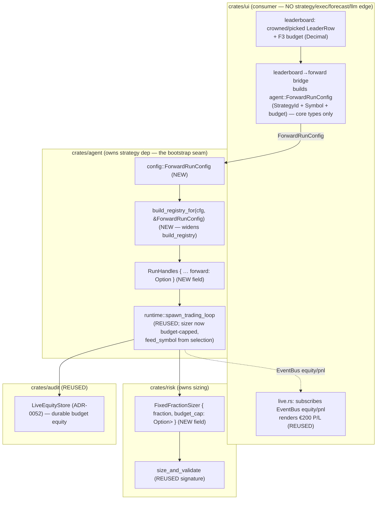

# Budget-aware sizing + forward paper-trade (roadmap F4 + F5)

## Why

(Pulled from [`../product.md`](../product.md) — the 2026-06-19 single-coin
investment-advisor pivot, journey steps 4 + 5. This closes the MVP.)

The user has already seen the bake-off leaderboard
([`../advisor-bakeoff-ranking/feature.md`](../advisor-bakeoff-ranking/feature.md))
and a crowned recommendation. The journey now finishes:

4. **Plan** — the selected strategy is sized to the user's **fixed €200 budget**
   (≈ 200 USDT, FX not modelled per product § D4), not the engine's default
   `initial_capital_usdt`.
5. **Watch** — the selected strategy **paper-trades forward** on real incoming
   Binance data with that budget sizing, and the cockpit **Live view** shows
   **running profit/loss on the simulated €200**.

This is a **re-framing of the shipped engine, not a new build.** F4 reuses the
risk/sizing layer (`crates/risk`: `FixedFractionSizer`, `size_and_validate`);
F5 extends the agent paper runtime (`crates/agent::runtime` — the unified
`spawn_trading_loop`, paper mode = live Binance WS, real-time, ADR-0053) and the
cockpit Live view (`crates/ui/src/live.rs`), consuming results through the
sanctioned `EventBus` / `audit::query` seam exactly as Live already does. The
durable equity store (ADR-0052) and the reflection-wired paper loop (commit
`e9da47f`) carry forward untouched.

Operator-ratified product decisions this design implements:
- **D4** — €200 sized as **200 quote-units (USDT)**; FX not modelled; the UI
  labels it "€200 ≈ 200 USDT, FX not modelled". Fixed EUR→USD rate is the v0.2
  refinement (backlog F7).
- **D5** — paper/sim only; the budget is a **hard cap** (product § Risk: "paper
  sizing may never deploy more than the user's simulated budget"); not-advice +
  simulated-budget disclaimer on the Live/forward surface.
- **D2** — the forward "plan" IS the Live view unfolding (no pre-computed future
  orders for a price-dependent strategy); F6 (the stance + rules detail surface)
  is a separate v0.2 feature.

## Requirements

(Analyst scope; architect restating the slice this feature delivers.)

- **R1 — Budget-aware sizing modifier (F4).** The forward run sizes positions
  against the user's fixed budget (the *budget equity*), not the default
  capital, and **never deploys notional above the budget** (the hard cap). It is
  deterministic and reuses the risk layer.
- **R2 — Day-1 baseline-equity-divergence e2e (NON-NEGOTIABLE, CLAUDE.md).** F4
  is a sizing modifier, so it ships with a day-1 e2e that asserts the
  budget-sized equity path **diverges from the un-budgeted (default-capital)
  baseline path** by a testable epsilon (≥ 1 bp) when the strategy's decision
  variable is non-trivial (≥ 1 fill). This is the gate that catches a no-op
  modifier (the `v3-volatility-forecaster-noop-fix` precedent).
- **R3 — Selection → (strategy, budget) bridge (F5).** The crowned strategy
  (default) — or a user-picked row — from the leaderboard `BakeoffReport` is
  carried into the forward run as a `(StrategyId, symbol, budget)` triple,
  **without a `ui → strategy` edge**. The bridge produces an opaque config the
  `agent` runtime consumes; `ui` only ever names a `StrategyId` (a `core` type)
  and a budget `Decimal`.
- **R4 — Forward paper run on real data (F5).** The selected strategy runs in
  **paper mode (real-time live Binance WS)** through the existing
  `spawn_trading_loop`, on the selected coin, with F4 budget sizing. Fills →
  positions → equity flow onto the `EventBus` and the durable equity store as
  they already do.
- **R5 — Running €200 P/L in the Live view (F5).** The Live view surfaces the
  budget equity and its running P/L (equity − budget) on the simulated €200,
  rendered at the pixel layer (the cockpit render-verification rule), through
  the sanctioned seam. No new `ui` crate dependency.
- **R6 — Determinism + paper-only + anchor neutrality.** The sizing modifier is
  a pure `Decimal` function (no f64). The forward run writes no
  `spec/*/reports/` body → the 119/119 anchored backtest body-SHAs stay
  byte-identical. No real orders.

## Design

### 0. Summary

| Decision | Choice | Rationale |
|---|---|---|
| F4 sizing-modifier home | **`crates/risk::sizing`** — extend `FixedFractionSizer` with an **optional `budget_cap: Option<Money<Usdt>>`** field + a `with_budget_cap` ctor; cap inside `compute_qty` | The risk layer already owns sizing + the exposure cap; the budget is a *second* hard notional cap composed with the existing one. No new sizer type, no new call path. ADR-0060 § D1. |
| F4 modifier semantics | **notional cap**: `qty ≤ budget / price`, applied alongside the exposure-cap clamp (min of the two) | The budget is a ceiling on *deployed* capital, not a re-scaling of equity — matches "never deploy more than the budget". Deterministic `Decimal` min. |
| F4 day-1 e2e home | **`crates/risk/tests/budget_sizing_divergence_end_to_end.rs`** — drive the public `spawn_trading_loop` (or its sizing path) over a fixture bar series with budget vs no-budget; assert the two equity tails diverge ≥ 1 bp when ≥ 1 fill occurred | Mirrors `crates/strategy/tests/vol_targeting_overlay_end_to_end.rs` (the precedent). The gate lives with the modifier. ADR-0060 § D2. |
| F5 selection→config bridge | **`agent::ForwardRunConfig { strategy: StrategyId, symbol: Symbol, budget: Money<Usdt>, lookback: Option<DateRange> }`** (new, in `crates/agent::config`) built UI-side from the leaderboard mirror + the F3 budget; consumed by `build_registry` + `RunHandles` | `ForwardRunConfig` is built from `core` types only (`StrategyId`, `Symbol`, `Decimal`) → `ui` needs no `strategy` edge; `agent` (which already depends on `strategy`) resolves the `StrategyId` to a registry entry. ADR-0060 § D3. |
| F5 strategy injection seam | **extend `build_registry(cfg)` → `build_registry_for(cfg, &ForwardRunConfig)`** to register the *selected* strategy id (dispatch on the same id set the bake-off uses); thread the **selected `symbol`** + **`budget`** into `RunHandles` so `run()` stops hardcoding `feed_symbol = "BTCUSDT"` | The runtime already has the registry-builder seam (`build_registry` / `build_registry_with_ledger`) precisely so `ui` never imports `strategy`. F5 widens it to take the selection. ADR-0060 § D3. |
| F5 real-time vs replay | **real-time forward run is the MVP** (paper mode = live WS, real-time — confirmed during the soak); the "what it would have done" fast-replay preview is **deferred to v0.2** (it is just `run_scenario` over the recent window, already shippable, but not required to close the journey) | The journey is "watch it paper-trade forward"; the Live view filling in over time IS the deliverable. A replay preview is an additive convenience, not a gate. ADR-0060 § D4. OQ-1 flags it for the operator. |
| Budget equity surfacing | **the forward loop seeds `cash = budget` and `initial_capital = budget`** so the *existing* equity math (`equity = cash + position·mark`, already published every bar to the `EventBus` + the durable store) IS the budget equity; Live computes P/L = equity − budget | Zero new equity plumbing — the budget becomes the loop's starting capital, and every downstream consumer (Live tape, durable store, PnL snapshots) is already wired to that number. ADR-0060 § D5. |

### 1. Where it lives + the boundary



**Crate homes, verified against the dependency graph + the code:**

- **F4 lives in `crates/risk::sizing`.** `FixedFractionSizer::compute_qty`
  (`crates/risk/src/sizing.rs:32`) already clamps to the per-symbol exposure
  cap. The budget is a *second* hard notional ceiling; it belongs in the same
  function as a composed `min`. `spawn_trading_loop`
  (`crates/agent/src/runtime.rs:1138`) already builds the sizer from
  `risk_cfg.sizing.fixed_fraction` — F4 changes that construction to also pass
  the budget cap, and changes nothing else in the loop.
- **F5's strategy/symbol injection lives in `crates/agent`.** The runtime
  *already* exposes `build_registry(cfg)` / `build_registry_with_ledger(cfg,
  ledger)` (`runtime.rs:148` / `:182`) as the **sole seam for getting strategies
  into the loop without a `ui → strategy` edge** — the doc-comment says so
  literally: "*so neither the `ui` crate nor any other downstream crate needs a
  direct `strategy` dependency*". F5 widens that seam to take the *selected*
  strategy id (not just the config-declared SMA) and threads the selected
  `symbol` + `budget` into `RunHandles`, so `run()` stops hardcoding
  `feed_symbol = Symbol::new("BTCUSDT")` (`runtime.rs:490`).
- **F5's Live surface stays in `crates/ui/src/live.rs`.** It already subscribes
  to `EventBus` equity/PnL (`stream_pnl` `live.rs:215`, position/equity views)
  and the durable store. The budget equity flows through the *same* channels
  because the budget becomes the loop's starting capital — Live only adds the
  P/L-against-budget framing (equity − budget). **`cargo tree -p ui` is
  unchanged** (the invariant gate, as for the leaderboard feature).

**Why NOT a new `ui → strategy` edge:** the leaderboard already proves a
`StrategyId` (a `trading_core` type) crosses the seam cleanly. The bridge passes
that same id plus a budget `Decimal` plus a `Symbol` — all `core` types. The
resolution of "id → concrete strategy" happens in `agent::build_registry_for`,
which is *already* on the `agent` side of the wall. No `ui` dependency on
`strategy`/`exec`/`forecast`/`llm` is added — preserved by construction.

### 2. F4 — the budget-aware sizing modifier (exact)

`FixedFractionSizer` gains one optional field and one ctor; `compute_qty` gains
one composed clamp. The change is additive and `Decimal`-pure.

```rust
// crates/risk/src/sizing.rs
pub struct FixedFractionSizer {
    pub fraction: Decimal,
    /// Hard notional ceiling on a single position's deployed capital, in USDT.
    /// `Some(budget)` for the budget-aware forward run (F4); `None` preserves
    /// the legacy behaviour byte-for-byte (default-capital sizing).
    pub budget_cap: Option<Money<Usdt>>,   // NEW
}

impl FixedFractionSizer {
    /// Legacy ctor — no budget cap (un-budgeted baseline). UNCHANGED behaviour.
    pub fn new(fraction: Decimal) -> Self {
        Self { fraction, budget_cap: None }
    }

    /// Budget-aware ctor (F4): cap deployed notional at `budget`.
    pub fn with_budget_cap(fraction: Decimal, budget: Money<Usdt>) -> Self {
        Self { fraction, budget_cap: Some(budget) }
    }

    pub fn compute_qty(
        &self,
        equity: Money<Usdt>,
        price: Decimal,
        risk_limits: &RiskLimits,
    ) -> Result<Quantity, SizingError> {
        // … existing zero-equity / zero-price guards …
        let notional = equity.amount() * self.fraction;
        let mut qty = notional / price;

        // EXISTING — exposure-cap clamp (qty·price ≤ cap·equity).
        let max_qty_exposure = (equity.amount() * risk_limits.per_symbol_exposure_cap) / price;
        if qty > max_qty_exposure { qty = max_qty_exposure; }

        // NEW (F4) — budget clamp (qty·price ≤ budget). Composed as a min; the
        // tighter of {exposure cap, budget} wins. Decimal-exact, no f64.
        if let Some(budget) = self.budget_cap {
            let max_qty_budget = budget.amount() / price;
            if qty > max_qty_budget { qty = max_qty_budget; }
        }

        Quantity::new(qty).map_err(|_| SizingError::NegativeQty)
    }
}
```

`size_and_validate` is **unchanged** — it already takes `&FixedFractionSizer` and
calls `compute_qty`; the budget cap rides inside the sizer. The `Order::new`
exposure-cap validation downstream is untouched.

**Why a notional cap, not an equity re-scale.** Two honest interpretations of
"size to €200":
- **(a) Notional cap (chosen).** `equity` stays the true account equity (which,
  in the forward run, *starts* at the budget — see § 4), and the modifier caps
  any single position's deployed capital at the budget. As the budget equity
  grows or shrinks, the cap stays at the original budget — so the user can never
  deploy more than their €200 even after a winning streak inflates equity. This
  is the literal "never deploy more than the budget" hard limit.
- **(b) Equity re-scale.** Pass `equity = budget` to the fraction. Rejected as
  the *modifier* because it conflates the budget with account equity and would
  let a winning streak compound deployment above €200. (Note: § 4 *also* seeds
  the loop's starting capital at the budget — but that is the **account state**,
  not the cap. The cap in (a) is what enforces the ceiling permanently.)

The two compose: the loop starts with `cash = budget` (§ 4) **and** the sizer
caps each deployment at `budget` (this section). Early on they coincide; after
P/L moves equity, the cap is the binding "never exceed €200 deployed" guarantee.

### 3. F4 — the day-1 baseline-equity-divergence e2e (NON-NEGOTIABLE)

`crates/risk/tests/budget_sizing_divergence_end_to_end.rs` — the gate that
catches a no-op budget modifier. Pattern lifted from
`crates/strategy/tests/vol_targeting_overlay_end_to_end.rs`.

**Shape (the contract the developer implements, the tester asserts):**

1. Build a fixture bar series (a deterministic up-then-down close path on one
   symbol, e.g. 60+ bars) where a simple always-in strategy (or a stubbed
   signal source) produces **≥ 1 BUY fill**.
2. Run the sizing path **twice** over the same bars, same seed:
   - **Baseline arm** — `FixedFractionSizer::new(fraction)` (no budget) with the
     engine default `initial_capital_usdt` (e.g. 100_000), starting
     `cash = 100_000`.
   - **Budget arm** — `FixedFractionSizer::with_budget_cap(fraction, 200 USDT)`
     with `cash = 200` (§ 4).
3. Collect each arm's final equity (`cash + position·last_mark`).
4. **Assert divergence:** `(budget_final / 200) ≠ (baseline_final / 100_000)`
   normalised — i.e. the **return paths differ by ≥ 1 bp**, AND assert ≥ 1 fill
   occurred (the decision variable is non-trivial). Under a **no-op** modifier
   (budget cap computed but never applied) the budget arm would size identically
   to baseline-scaled and the return paths would be *equal* → the assertion
   FAILS, exactly as the vol-overlay forensic gate fails pre-fix.

> **Why return-normalised, not raw equity.** Raw equity obviously differs
> (200 vs 100_000 starting cash). The no-op signature is that the *shape* of the
> equity curve (the return %) is identical when the cap never binds. The gate
> asserts the return paths **diverge** because the budget cap *does* bind (the
> €200 deploys a different fraction-of-budget than €100k would, once the
> exposure cap and the budget cap differ). The epsilon ≥ 1 bp matches the
> CLAUDE.md non-negotiable and the precedent's `>= 0.01` style.

**Forensic-gate note for the developer (mirror the precedent's header):** run
this test against `main` BEFORE wiring the cap into `compute_qty`; with the cap
absent the budget arm's return path equals the baseline's → the divergence
assertion FAILS. After the cap lands, it PASSES. That FAIL-before / PASS-after is
the proof the modifier is not a no-op.

A second, cheaper unit test asserts `compute_qty` itself: with a budget tighter
than the exposure cap, the returned qty equals `budget / price` (the budget
binds); with a budget looser than the exposure cap, the qty equals the
exposure-clamped value (the cap binds, budget is slack) — proving the `min`
composition both ways.

### 4. F5 — the forward paper-trade mechanism

The forward run is the **existing paper-mode `spawn_trading_loop`**, with three
threaded-through changes and **nothing else**:

```text
runtime::run(handles)                       // paper branch (Mode::Paper)
  let forward = handles.forward;            // NEW: Option<ForwardRunConfig>
  let feed_symbol = forward.symbol          // NEW: from the selection
        .unwrap_or(Symbol::new("BTCUSDT")); //      (was hardcoded)
  let registry = build_registry_for(cfg, &forward);  // NEW: selected strategy id
  let budget = forward.budget;              // NEW: Money<Usdt> (= €200 ≈ 200 USDT)
  spawn_trading_loop(
      paper_feed, bus,
      registry,                             // carries the SELECTED strategy
      &cfg.backtest,                        // initial_capital overridden by budget below
      &cfg.risk,
      feed_symbol, feed_tf,
      equity_store,                         // REUSED durable store (ADR-0052)
      "paper",
      &mut set, &cancel,
      Some(ledger),                         // REUSED — fills → journal
      reflection_writer,                    // REUSED — lesson cards on close (e9da47f)
      btc_closes_seed,
      Some(budget),                         // NEW arg: starting-capital + sizer-cap override
  );
```

Inside `spawn_trading_loop`, when `budget = Some(b)`:
- `initial_capital = b.amount()` (instead of `backtest_cfg.initial_capital_usdt`)
  → `cash` starts at the budget → **every published equity snapshot is the
  budget equity** (the loop already publishes `equity = cash + position·mark`
  each bar to the `EventBus` PnL channel + the durable store — no new plumbing).
- `sizer = FixedFractionSizer::with_budget_cap(fraction, b)` (instead of
  `::new(fraction)`) → the F4 cap binds.

When `budget = None`, the loop is **byte-identical to today** (the
research-mode + legacy paper path are unaffected — `None` preserves
`initial_capital_usdt` + the un-capped sizer). This keeps ADR-0053's unified
loop determinism intact.

**(a) The selection → (strategy, budget) bridge.** UI-side, in the leaderboard /
forward-launch flow:
- the **crowned** `LeaderRow` is the default selection (`crowned_row()` already
  exists, `leaderboard/state.rs:191`); a user click selects a different row.
- the F3 guided-input budget (a `Decimal`) + the bake-off's `symbol` + the
  selected row's **display strategy id** (a `String`/`SmolStr`) form an
  `agent::ForwardRunConfig` via a pure builder. This crosses the seam as `core`
  types only.

```rust
// crates/agent/src/config.rs (NEW)
#[derive(Debug, Clone)]
pub struct ForwardRunConfig {
    pub strategy: trading_core::StrategyId,  // the crowned / picked id
    pub symbol:   trading_core::Symbol,      // the bake-off coin
    pub budget:   trading_core::Money<trading_core::Usdt>,  // €200 ≈ 200 USDT (D4)
    /// Optional replay-preview window (v0.2, OQ-1); None = pure real-time run.
    pub lookback: Option<backtest::engine::DateRange>,
}
```

**(c) Strategy injection without a `ui → strategy` edge.**
`build_registry_for(cfg, &ForwardRunConfig)` dispatches the selected
`StrategyId` to the concrete strategy ctor — the **same id → strategy mapping
the bake-off field uses** (`v0.sma`, `v0.5.macd`, `v0.5.rsi`, `v0.5.bbands`;
`v0.buyhold` is the benchmark — a forward run of "just hold" is a valid, honest
selection). This lives in `agent`, which already depends on `strategy`. `ui`
passes the id string; it never names a strategy *type*. (If the selected id is
unknown — e.g. an opt-in ML arm not wired for forward runs — the builder logs a
warning and falls back to the config default, the same graceful-degradation
pattern `build_registry_with_ledger` already uses.)

**(b) Real-time forward run vs replay preview — the decision.**
- **MVP = the real-time forward run only.** Paper mode is live Binance WS,
  real-time (confirmed during the soak; not accelerated). The Live view filling
  in over the coming hours/days **IS** journey step 5. This needs no new replay
  machinery — it is the existing paper loop pointed at the selected
  `(strategy, symbol, budget)`.
- **The "what it would have done" fast-replay preview is v0.2 (deferred).** It is
  attractive (instant gratification — "here's how your €200 would have moved
  over the last 30 days") and **cheap**, because it is exactly
  `backtest::run_scenario` over the recent window with the budget sizing, then
  rendered as a static equity curve. But it is an *additive convenience*, not a
  gate on the journey, and it introduces a second equity surface (replayed vs
  live) that the Live view would have to disambiguate. Recommended default:
  **ship real-time-only for the MVP**; queue the replay preview as F5b. (OQ-1.)

**(d) Reuse of the durable store + reflection-wired loop.** Both are inherited
for free: `spawn_trading_loop` already takes `equity_store: Some(...)` (ADR-0052
durable budget equity) and `reflection_writer: Some(...)` (lesson cards on
position close, commit `e9da47f`). The budget run passes the same `Some(...)`
values cockpit_live already constructs — the only delta is the starting capital
+ the sizer cap. The forward run's equity history is durable and its closed
trades produce lesson cards, with zero new wiring.

### 5. F5 — running €200 P/L in the Live view

The Live view already renders account equity and PnL (`stream_pnl`
`live.rs:215`; the equity series from the durable store). Because the forward
loop **starts `cash` at the budget**, the equity number Live already shows **is**
the budget equity. F5's UI delta is purely presentational:
- a **"€200 budget" framing**: show running **P/L = equity − budget** and
  **P/L% = (equity − budget) / budget**, with the honest label "€200 ≈ 200 USDT
  (FX not modelled)" (product § D4) and the persistent not-advice +
  simulated-budget disclaimer (product § D5).
- this is a `ui`-only change consuming the **same** `EventBus`/store seam — no
  new dependency, no engine type crossing the wall.

**Render-layer verification (the operator's #1 sensitivity).** Per the CLAUDE.md
cockpit rule + [`../dev-notes/iced-ui-render-verification.md`](../dev-notes/iced-ui-render-verification.md):
the €200-P/L surface is verified at the **rendered-pixel layer** with a populated
fixture (a budget equity series with a non-zero P/L) **and a negative control**
(flat-at-budget → zero P/L, no sentiment colour), asserting the P/L value + its
sign colour paint. Unit tests / no-panic boot are **not** sufficient (the
Live-view saga precedent).

### 6. The smallest buildable slice + the order

**F4 first (with its day-1 e2e), then F5.** F5's forward run *depends on* F4's
budget cap existing (the loop passes the budget into the sizer). Building F4
first — and proving it is not a no-op with the day-1 divergence gate before any
forward wiring — is the durable order.

1. **F4 sizing modifier** (`risk::sizing`): the `budget_cap` field + ctor + the
   composed clamp.
2. **F4 day-1 e2e** (`risk/tests/budget_sizing_divergence_end_to_end.rs`): the
   FAIL-before / PASS-after divergence gate + the `compute_qty` both-ways unit
   test. **This gate lands with the modifier, same PR.**
3. **F5 config + bridge** (`agent::config::ForwardRunConfig` +
   `build_registry_for` + the `RunHandles.forward` field + the
   `spawn_trading_loop` budget arg).
4. **F5 runtime wiring** (`runtime::run` paper branch: selection → feed_symbol +
   registry + budget; `cockpit_live` constructs `ForwardRunConfig` from the
   leaderboard selection + the F3 budget and threads it into `RunHandles`).
5. **F5 Live €200 P/L surface** (`ui/src/live.rs` + the render-layer guard with a
   negative control).

### 7. Reuse map (exact)

| Need | Existing item | Location | New? |
|---|---|---|---|
| Fixed-fraction sizing + exposure clamp | `FixedFractionSizer::compute_qty` | `risk::sizing` | reuse (+ 1 field) |
| Validated order construction | `size_and_validate` | `risk::sizing` | reuse (unchanged) |
| Paper trading loop (real-time) | `spawn_trading_loop(…)` | `agent::runtime` | reuse (+ budget arg) |
| Paper-mode wiring | `runtime::run` (Mode::Paper branch) | `agent::runtime` | reuse (+ selection thread) |
| Strategy injection seam | `build_registry` / `build_registry_with_ledger` | `agent::runtime` | extend → `build_registry_for` |
| Run handles | `RunHandles { … }` | `agent::runtime` | reuse (+ `forward` field) |
| Durable budget equity | `LiveEquityStore` (ADR-0052) | `audit` | reuse |
| Reflection on close | `reflection_writer` (commit `e9da47f`) | `agent::runtime` | reuse |
| Live equity/PnL subscribe | `stream_pnl` / position+equity views | `ui::live` | reuse (+ P/L framing) |
| Crowned / picked selection | `LeaderboardScreenState::crowned_row()` | `ui::leaderboard::state` | reuse |
| Budget + coin + lookback input | F3 guided-input state (`coin`, `lookback`) | `ui::leaderboard` | reuse (+ budget field) |
| Money / strategy-id / symbol types | `Money<Usdt>`, `StrategyId`, `Symbol` | `trading_core` | reuse (the seam types) |
| **Budget cap** | `budget_cap: Option<Money<Usdt>>` + `with_budget_cap` | `risk::sizing` | **NEW** |
| **Day-1 divergence e2e** | `budget_sizing_divergence_end_to_end.rs` | `risk/tests` | **NEW** |
| **Forward-run config** | `ForwardRunConfig { strategy, symbol, budget, lookback }` | `agent::config` | **NEW** |
| **Selection→forward bridge** | leaderboard `LeaderRow` + budget → `ForwardRunConfig` | `ui` (+ `cockpit_live`) | **NEW** |
| **€200 P/L framing** | P/L = equity − budget + label + disclaimer | `ui::live` | **NEW** |

The net-new code is: one optional sizer field + clamp, one e2e + one unit test,
one config struct, one widened registry builder, one `RunHandles` field + one
`spawn_trading_loop` arg, one bridge function, and one Live presentational delta.
**No new matching engine, no new strategy, no new equity plumbing, no new
`ui → strategy` edge.**

## Open questions (operator / analyst)

- **OQ-1 (real-time-only vs add a replay preview — operator, recommend a
  default).** The MVP ships the **real-time forward run only** (the Live view
  filling in over time = journey step 5). A "what it would have done over the
  last N days" fast-replay preview (a static curve from `run_scenario` over the
  recent window with budget sizing) is cheap and gives instant gratification but
  adds a second equity surface. **Recommended default: real-time-only for the
  MVP; queue the replay preview as F5b (v0.2).** Not a gate — flagging the call.
- **OQ-2 (default-to-crowned vs force a user pick — operator, recommend a
  default).** F5 can launch the forward run on the **crowned** strategy by
  default (one click: "paper-trade the recommendation"), or require the user to
  explicitly pick a row first. **Recommended default: default to the crowned
  pick** (the journey's "watch *the recommended* strategy"), with any leaderboard
  row click overriding it before launch. Cheaper UX, matches the product
  narrative. Not a gate.
- **OQ-3 (budget cap as the binding hard limit vs informational — analyst,
  low-risk).** § 2 makes the budget a *permanent* notional cap (qty·price ≤ €200
  even after equity grows). The alternative is letting deployment compound with
  equity (cap = current budget equity, not original budget). Product § Risk says
  "may never deploy more than the user's simulated budget" → the permanent cap
  is the literal reading and the chosen default. Confirm this is the intended
  semantics (it is the safer one for a small-budget user).

## Changelog

- 2026-06-20 (architect): created the F4 + F5 design (the MVP-closing forward
  paper-trade). **F4 budget-aware sizing** homed in `crates/risk::sizing` as an
  additive `budget_cap: Option<Money<Usdt>>` field on `FixedFractionSizer` +
  `with_budget_cap` ctor + a composed `Decimal`-exact notional clamp (the
  tighter of {exposure cap, budget} binds) — `None` preserves legacy behaviour
  byte-for-byte; `size_and_validate` unchanged. **Mandated the day-1
  baseline-equity-divergence e2e** (`risk/tests/budget_sizing_divergence_end_to_end.rs`,
  modelled on the `vol_targeting_overlay_end_to_end.rs` precedent): FAIL-before /
  PASS-after on a ≥ 1 bp return-path divergence with ≥ 1 fill, the gate that
  catches a no-op cap. **F5 forward paper-trade** extends the existing
  real-time paper-mode `spawn_trading_loop` (ADR-0053) with a selected
  `(strategy, symbol, budget)` threaded via a new `agent::ForwardRunConfig` +
  a widened `build_registry_for` + a new `RunHandles.forward` field + one
  `spawn_trading_loop` budget arg (starting capital = budget ⇒ the existing
  per-bar equity publish IS the budget equity; the loop is byte-identical when
  budget=None). The **selection→config bridge** is built UI-side from the
  crowned/picked `LeaderRow` + the F3 budget using `core` types only
  (`StrategyId`/`Symbol`/`Money`) — **no `ui → strategy` edge** (the
  `build_registry` seam already exists for exactly this). **Real-time forward
  run is the MVP; the replay preview is deferred to v0.2** (OQ-1). The durable
  equity store (ADR-0052) + the reflection-wired loop (commit `e9da47f`) are
  reused for free. Live adds a €200 P/L framing (equity − budget) on the same
  `EventBus`/store seam, verified at the render layer with a negative control.
  Recorded ADR-0060. No engine math changed; no anchored report touched; the
  budget=None path keeps 119/119 anchors byte-identical by construction.

## Implementation

### F4 — budget-aware sizing modifier (2026-06-20, developer)

**Scope: M-DEV-F4.1 through M-DEV-F4.4 complete.**

`crates/risk/src/sizing.rs` — `FixedFractionSizer` gains:

- `budget_cap: Option<Money<Usdt>>` field (new, at line 19).
- `new(fraction)` initialises `budget_cap: None` — byte-identical legacy path.
- `with_budget_cap(fraction, budget)` ctor (line 37-42).
- Budget clamp inside `compute_qty` (lines 74-82): after the existing
  per-symbol exposure-cap clamp, `if let Some(budget) = self.budget_cap { let
  max_qty_budget = budget.amount() / price; if qty > max_qty_budget { qty =
  max_qty_budget; } }`. `Decimal`-exact, no f64. The tighter of {exposure cap,
  budget} binds.
- `size_and_validate` UNCHANGED.

Three new unit tests added to `sizing.rs` `#[cfg(test)]`:
- `t23_budget_cap_tighter_than_exposure_cap_binds` — budget is the tighter limit.
- `t23_budget_cap_looser_than_exposure_cap_is_slack` — exposure cap is the tighter limit.
- `t23_no_budget_cap_is_legacy_identical` — `None` path matches pre-F4 results byte-for-byte.

`crates/risk/tests/budget_sizing_divergence_end_to_end.rs` — new integration test
implementing the CLAUDE.md non-negotiable forensic gate:
- Fixture: fraction=0.95, `per_symbol_exposure_cap`=1.0, price=50_000 USDT, 10
  buy-then-sell cycles each with a 10% gain.
- Budget arm: starting cash=200, `with_budget_cap(0.95, 200 USDT)`.
- Baseline arm: starting cash=100_000, `new(0.95)`.
- Assertion: normalised returns diverge by ≥ 1 bp AND ≥ 2 fills each arm.
- FAIL-before (no-op stub): `divergence: 0.00000000 (need >= 0.0001)` — both
  arms return 1.47822761 (identical compounding without the cap).
- PASS-after (real clamp): cap fires from cycle 3 onwards (equity > 200/0.95 =
  210.5 USDT), limiting budget arm to `200/50_000 = 0.004 BTC` per fill while
  baseline scales freely → divergence well above 1 bp.

Gate results:
- `cargo test -p risk` → 14 passed (13 unit + 1 e2e), 0 failed.
- `cargo clippy -p risk --tests -- -D warnings` (forced re-lint) → clean.
- `cargo fmt -p risk --check` → clean.
- `bash scripts/verify_anchors.sh` → ANCHORS PASS (119 / 119).
