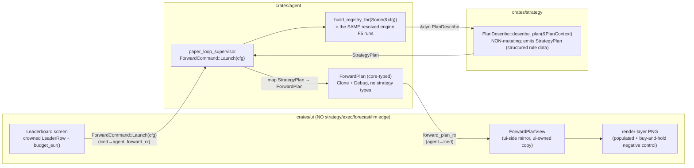

# Advisor forward buy/sell plan (roadmap F6)

## Why

(Pulled from [`../product.md`](../product.md) — the 2026-06-19 single-coin
investment-advisor pivot, **journey step 4 (Plan)**. The operator named this
step explicitly in the redefinition: *"Afterwards the application creates a plan
for buy and sell orders for the coming days (configurable)."*)

The MVP journey today jumps from the crowned bake-off pick
([`../advisor-bakeoff-ranking/feature.md`](../advisor-bakeoff-ranking/feature.md))
**straight into the forward paper-trade**
([`../advisor-forward-paper/feature.md`](../advisor-forward-paper/feature.md), F5),
with no explicit plan shown in between. The user sees "strategy X is best" and
then sees equity start moving — but never sees, in plain language, *what the
strategy is about to do and why*. F6 fills that gap: a **legible, honest plan
surface** that sits between the crowned recommendation and the Live view.

The forward-paper design already anticipated this and drew the boundary
([`../advisor-forward-paper/feature.md`](../advisor-forward-paper/feature.md)
§ Why, D2): *"the forward 'plan' IS the Live view unfolding (no pre-computed
future orders for a price-dependent strategy); **F6 (the stance + rules detail
surface) is a separate v0.2 feature.**"* This feature is that separate surface.
It is also pre-listed in [`../backlog.md`](../backlog.md) as *"F6 — forward
buy/sell plan detail (M) — today's stance + entry/exit rules + projected
sizing."*

This is a **re-framing of shipped data, not a new engine.** The crowned pick,
its KPIs, the coin, and the €200 budget already cross the `ui` seam as `core`
types (`LeaderboardScreenState` → `LeaderRow { strategy, is_benchmark, … }`,
`BakeoffReportMirror.coin`, `budget_eur()`). F6 reads those, adds the strategy's
**rule description** + the **latest-bar stance** + the **projected €200 sizing**,
and renders them as a conditional plan. The forward paper-trade (F5) is then
**the plan executing** — consistent by construction, because the F6 plan
describes the exact same rules the F5 loop runs.

## The honest definition (the whole job — get the semantics right)

### What the plan IS

**A conditional, reactive decision plan — NOT a price forecast.** The crowned
strategy is a deterministic RULE ENGINE (SMA / MACD / RSI / Bollinger, or
buy-and-hold — see `crates/strategy`). It has **no ability to predict future
prices.** So the plan must describe *what the engine will do when conditions
fire*, never *what prices will do*. Concretely, the plan answers three questions
the user can act on:

1. **Stance now** — the strategy's signal as of the **latest available bar**:
   `FLAT` (no position) / `LONG` (holding) — and, where the engine exposes it,
   the most recent `BUY` / `SELL` / `HOLD` signal. ("As of the last close
   ($Y, <timestamp>), the strategy is currently FLAT.")
2. **Standing rules** — the **entry/exit conditions in plain language**, the
   same rules the F5 paper-trade will execute. ("It BUYS when the fast SMA
   crosses above the slow SMA, and SELLS on the reverse cross." / "It BUYS when
   MACD crosses above its signal line and RSI is below 70; it SELLS on the
   reverse MACD cross.") These are **conditions, not dated orders.**
3. **Budget reflection** — what the next BUY would deploy of the €200:
   approximate units at the current price, bounded by the F4 budget cap.
   ("Budget €200 ≈ 200 USDT → on the next BUY it would deploy up to ~Z units at
   the last close $Y. It never deploys more than €200 — F4 hard cap.")

The plan is **explicitly rule-driven and reactive**, re-evaluated **each bar**
over the configured horizon. The horizon is *not* a day-by-day predicted trade
calendar — it is the **window over which these standing rules remain in force
and are checked every bar**, which is exactly the window the F5 paper-trade then
runs. "For the coming N days" = "these are the rules in force, and the decision
cadence is each bar, for the next N days."

### Why this is not a prediction (the core thesis, preserved)

The product's epistemic core is *"measured robustness, not asserted alpha"*
([`../product.md`](../product.md) § Why this is honest). A fabricated
day-by-day price/trade forecast would:
- **assert alpha** the 2026-06-08 research verdict explicitly retired (no active
  strategy beat passive buy-and-hold net of cost under the frozen rule);
- **break the "not financial advice" stance** by implying a predicted return;
- **be impossible to honour** — an SMA cross or an RSI exit depends on prices
  that have not happened.

A *conditional* plan ("IF price crosses above the SMA THEN buy") asserts nothing
about the future except the engine's own deterministic behaviour, which is
**knowable and true**. It is the honest, defensible reading of "a plan for the
coming days," and it is **consistent by construction** with the F5 paper-trade
(the plan is "what the engine will do when conditions fire"; the paper-trade is
the engine doing it on real incoming bars).

### The buy-and-hold special case

When buy-and-hold is the crowned pick (the `BenchmarkWins` honesty branch —
[`../advisor-bakeoff-ranking/feature.md`](../advisor-bakeoff-ranking/feature.md)),
its "plan" is the honest degenerate case and must read plainly:

> "**Plan: buy now, hold the whole horizon.** Deploy the full €200 ≈ 200 USDT
> at the current price (~Z units at $Y) and hold for the next N days — there is
> **no sell trigger** and no re-evaluation. (For XRPUSDT over this window,
> nothing beat simply holding.)"

This is the surface honouring the product's honesty gate: when holding wins, the
plan says so and does not invent activity.

### How the €200 budget is reflected

Per product **D4** (ratified): €200 is treated as **200 quote-units (USDT)**,
FX not modelled, labelled *"€200 ≈ 200 USDT (FX not modelled)"*. The plan shows
the **projected next-BUY sizing**: `units ≈ budget / last_close`, **capped by
the F4 budget cap** (`FixedFractionSizer.budget_cap` — the plan must reflect the
*same* cap the F5 loop enforces, so the projected sizing and the actual first
fill agree). For an active strategy currently FLAT, this is the size of the next
entry; for one currently LONG, the plan shows the held size and the standing
exit rule. This is a **projection at the current price**, explicitly labelled as
such ("at the last close; the actual fill price will be the next bar's"), never
a promised fill.

## Requirements

- **R1 — Stance-now (latest-bar signal).** The plan surface shows the crowned
  strategy's current stance (`FLAT` / `LONG`) and its latest signal
  (`BUY` / `SELL` / `HOLD`) as of the most recent available bar for the coin,
  with the bar's close price + timestamp. **Honest about staleness**: the bar
  timestamp is shown so the user knows how current the stance is.
- **R2 — Standing rules in plain language.** The plan describes the strategy's
  entry and exit conditions in plain language — the **same rules** the F5
  paper-trade executes. The copy is `ui`-owned (no engine string crosses the
  seam); the *rule data* it renders comes from a sanctioned read-only source
  (see § Open questions OQ-A — the strategy-trait read surface, the big
  architect call). Conditions are stated qualitatively ("buys when the fast SMA
  crosses above the slow SMA"), **not as a precise numeric trigger ladder**
  (see § Non-goals — the engine does not expose per-strategy trigger levels
  uniformly today).
- **R3 — Budget-aware projected sizing.** The plan shows the projected next-BUY
  deployment of the €200 (`units ≈ budget / last_close`), **bounded by the same
  F4 `budget_cap`** the forward loop enforces, with the *"€200 ≈ 200 USDT (FX
  not modelled)"* label (D4). The projection is labelled as a current-price
  estimate, not a promised fill.
- **R4 — Configurable horizon.** A horizon control selects "the coming N days"
  (**default 7 days; range 1–30 days**, see § Configurable horizon). The
  horizon frames the plan ("rules in force, re-evaluated each bar, for the next
  N days") and is **passed to the F5 forward run** so the plan window and the
  paper-trade window are the same number. The horizon does **not** generate a
  per-day trade calendar.
- **R5 — Buy-and-hold special case.** When the crowned pick is the buy-and-hold
  benchmark (`BenchmarkWins`), the plan renders the degenerate "buy now, hold
  the horizon, no sell trigger, deploy the full €200" copy (§ buy-and-hold
  special case) — no invented activity.
- **R6 — Not-a-prediction framing + disclaimers.** Every plan surface carries
  (a) an explicit **"this is a conditional rule-based plan, not a price
  prediction or implied return"** framing, and (b) the standing **not-financial-
  advice + simulated-budget** disclaimer (product D5). The ui-designer owns how
  this reads without sounding like a forecast (§ Open questions OQ-D).
- **R7 — Plan→paper-trade consistency.** The plan is generated from the **same
  crowned `(strategy, coin, budget)` selection** that launches the F5 forward
  run (`ForwardRunConfig`). The plan and the subsequent paper-trade describe and
  execute the identical rules — the plan must not be able to drift from what F5
  runs. (Architecturally: the plan is built from the same leaderboard mirror +
  budget the F5 `ForwardCommand::Launch` bridge already uses.)
- **R8 — No `ui → strategy` edge; anchor-neutral; paper-only.** The plan surface
  adds **no `ui` dependency on `strategy`/`exec`/`forecast`/`llm`** (the standing
  layering invariant — `cargo tree -p ui` unchanged). It introduces **no new
  anchored backtest report** (`verify_anchors.sh` stays 119/119). It places no
  real orders. The CLAUDE.md day-1 baseline-equity-divergence e2e gate is
  **N/A** here — F6 is a *read-only descriptive surface*, not a strategy overlay
  or sizing modifier (that gate already landed on F4).
- **R9 — Render-layer verification.** Per the CLAUDE.md cockpit rule, the plan
  surface is verified at the **rendered-pixel layer** with a populated fixture
  (a crowned active strategy with a stance + rules + sizing) **and a negative
  control** (the buy-and-hold degenerate plan, and/or an empty/no-pick state),
  asserting the plan text + the projected-sizing number paint — not a no-panic
  boot or a text-summary snapshot.

## Configurable horizon

- **Default: 7 days.** A week is a sensible decision-support horizon for a
  retail user watching a small budget — long enough to see the rules act on
  several bars (hourly bars → ~168 bars), short enough to stay legible.
- **Range: 1–30 days.** 1 day (24 hourly bars) is the shortest useful "watch it
  for a day"; 30 days bounds the forward paper-run to a month, matching the
  shortest dynamic-data lookback (`Last30d`) and keeping the Live session
  buffered. Beyond 30 days the "plan" framing weakens (a month-plus is a
  backtest, not a forward watch) — so 30 is the proposed ceiling for the MVP of
  F6; widen later if the operator wants longer forward watches.
- **Semantics, restated:** the horizon is the **forward window over which the
  standing rules are in force and checked each bar**, and it is the **same N**
  passed into the F5 forward run. It is NOT a day-by-day predicted trade
  schedule. (This number is the bridge between "the plan" and "the Live view
  unfolding.")

## Non-goals (explicit — the honesty fence)

- **NOT a price forecast.** The plan never predicts future prices, future
  returns, or a future P/L number. It describes conditional rules only.
- **NOT a dated trade calendar.** The plan does **not** enumerate "Day 1: buy,
  Day 3: sell, …". For a price-dependent strategy that is impossible to produce
  honestly; for buy-and-hold it collapses to "buy now, hold". The plan is
  current stance + standing conditions + cadence, not a schedule.
- **NOT an implied-alpha / expected-return claim.** No "this plan is expected to
  make X%". The 2026-06-08 ship-passive verdict forbids asserting an edge; the
  plan asserts only the engine's deterministic behaviour.
- **NOT a precise numeric trigger ladder (for the MVP).** The engine does
  **not** uniformly expose per-strategy trigger price levels today (verified:
  `SmaCrossover` carries `fast_ma/slow_ma` in `Signal.evidence`, but
  `ComposedStrategy` — MACD/RSI/Bollinger — emits `SignalEvidence::empty()`).
  The MVP states rules **qualitatively**; a precise "buys at exactly $X" ladder
  is a possible follow-up *only if* the architect adds a read surface that
  exposes the levels uniformly (OQ-A). Stating a fake precise level would be a
  dishonest forecast — explicitly out of scope.
- **NOT financial advice.** Standing product constraint (D5); the disclaimer is
  mandatory on the surface.
- **NOT live execution.** Paper/sim only; no real orders (standing constraint,
  live exec removed 2026-06-12).
- **NOT a new strategy, new backtest math, or a new equity surface.** F6 reads
  the existing crowned selection + the latest bar; it composes shipped data.

## Design

_Architect, 2026-06-21 — [ADR-0062](../architecture/adr/0062-forward-plan-read-seam.md)
is the normative record; this section is the feature-local summary._

### The seam in one diagram



The plan is read from the **same resolved registry** the F5 hot-swap runs, at
the **same `Launch` boundary** — so plan↔engine consistency holds **by
construction** (R7), not merely by test. The plan crosses to `ui` as `core`
types only, so `cargo tree -p ui` is unchanged (R8).

### Decisions (the open questions, resolved)

- **OQ-A → the durable read-only trait surface (option a).** A NEW read-only
  **sibling** trait `strategy::PlanDescribe::describe_plan(&self, &PlanContext)
  -> StrategyPlan` — non-mutating (`&self`), answerable by every F6 candidate
  (SMA / MACD / RSI / Bollinger) **and** the buy-and-hold degenerate case. It is
  a sibling, not a `Strategy` method, so the ADR-0005 trait freeze holds and no
  unrelated overlay/pairs/cross-sectional/forecast impl is forced to implement
  it (ADR-0062 § D1). The engine emits **structured rule data** (closed
  `PlanStance` / `PlanSignal` / `PlanRuleShape` enums + `ProjectedSizing`), NOT
  a copy string — the `ui` owns the words + the disclaimers (the ADR-0059
  `Recommendation`-not-`String` precedent). The **fallback (UI-side TOML-AST
  derivation) is rejected** with a concrete drift proof: `build_registry_for`
  (`runtime.rs:288`) currently **proxies MACD/RSI/Bollinger/buy-hold through
  `SmaCrossover`** for the forward run, so a plan derived from the *MACD AST*
  would describe a MACD cross while the F5 loop actually runs an SMA cross —
  actively wrong, two sources of truth, disqualifying for a product whose
  credibility is "the plan is exactly what the engine will do." Sourcing the
  plan from the resolved engine makes it describe **what the loop runs today**
  (the SMA proxy), honestly, and automatically upgrades to the real engine when
  the F5b dedicated ctors land — no F6 rework.
- **OQ-B → produced AGENT-SIDE at the `ForwardCommand::Launch` boundary**
  (ADR-0062 § D3) from the same `build_registry_for(Some(&cfg))` registry, and
  returned to `ui` as a **`core`-typed `agent::config::ForwardPlan`** (`Clone +
  Debug`; closed `agent`-owned `PlanStance`/`PlanSignal`/`PlanRuleKind` enums +
  `StrategyId`/`Symbol`/`Price`/`Timestamp`/`Money<Usdt>`/`Quantity` + `horizon_days`;
  **no `strategy`/`exec`/`forecast`/`llm` type**) over a **second mpsc**
  `RunHandles.forward_plan_rx` (the agent→iced **result** path, symmetric with
  the iced→agent **command** `forward_rx`). `ui` mirrors `ForwardPlan` → a
  `ui`-side `ForwardPlanView` exactly as it mirrors `BakeoffReport` →
  `BakeoffReportMirror`.
- **OQ-C → the horizon is DISPLAY-ONLY metadata; F5 stays BYTE-IDENTICAL**
  (ADR-0062 § D6; operator-locked OPEN-ENDED). `horizon_days` (default 7, range
  1–30) travels only as a field on `ForwardPlan` (and may be echoed into
  `ForwardRunConfig` purely for the "planned through &lt;date&gt;" label). There
  is **NO `horizon_days` self-terminate path** — the `paper_loop_supervisor` /
  `spawn_trading_loop` lifecycle is untouched and the forward run remains
  open-ended (the soak's assumption holds). "The coming N days" is the **window
  over which the standing rules are in force and checked each bar**, not a stop
  condition.

### The `ForwardPlan` struct (the `core`-typed seam)

`agent::config::ForwardPlan` (developer owns the final field names):

| field | type | note |
|-------|------|------|
| `strategy` | `trading_core::StrategyId` | the **resolved forward-run** id |
| `symbol` | `trading_core::Symbol` | the coin |
| `stance` | `PlanStance` (`Flat` \| `Long`) | closed `agent`-owned enum |
| `latest_signal` | `Option<PlanSignal>` (`Buy`\|`Sell`\|`Hold`) | `None` for buy-and-hold (no re-eval) |
| `rule` | `PlanRuleKind` (closed enum) | `ui` maps to copy — no engine `String` |
| `last_close` | `trading_core::Price` | the projection price |
| `last_bar_ts` | `trading_core::Timestamp` | honest-staleness label |
| `budget` | `trading_core::Money<Usdt>` | €200 ≈ 200 USDT (product § D4) |
| `projected_units` | `trading_core::Quantity` | `units ≈ budget/last_close`, capped by F4 `budget_cap` |
| `sizing_capped` | `bool` | true iff the F4 cap bound the units |
| `horizon_days` | `u16` | **display-only** framing (D6) — does NOT terminate F5 |

Every field is a `core` type / `agent`-owned closed enum / primitive — so the
`ui` import of `ForwardPlan` (via `agent`) adds **no** `strategy`/`exec`/
`forecast`/`llm` edge.

### Consistency guarantee (made testable — the anti-drift assertion)

The plan is sourced from the resolved engine (D3), so it **cannot** describe
rules the F5 loop does not run. This is made testable (ADR-0062 § D8.2): a
unit/integration test asserts `describe_plan`'s stance + rule-family **matches
the engine's actual `on_bar` decision on the same bar** for each candidate **as
resolved by `build_registry_for`** (covering the SMA-proxy honestly). This is
the consistency thesis as a falsifiable test.

### What this does NOT change

- **No new anchored backtest scenario** — F6 reads the already-crowned pick +
  the latest bar. `verify_anchors.sh` stays **119/119** by construction (R8 /
  ADR-0062 § D7). The CLAUDE.md day-1 baseline-equity-divergence e2e gate is
  **N/A** (F6 describes sizing; it does not size or run anything — that gate
  landed on F4).
- **No `ui → strategy` edge** — gated by `cargo tree -p ui` unchanged.
- **F5 byte-identical** — no lifecycle change; the horizon is a label.
- **No new crate, no new dependency** — `PlanDescribe` in `strategy`,
  `ForwardPlan` in `agent`, mirror in `ui`.

## Backtest Scenarios

**None.** F6 introduces no new anchored backtest scenario — it is a read-only
descriptive surface over the already-crowned pick + the latest bar. The bake-off
that produces the crowned pick is the F1/F2 scenario set (unchanged);
`verify_anchors.sh` stays 119/119 by construction (R8).

## Implementation

_Developer, 2026-06-21 — backend (D-tasks) complete. UI-designer parallel track owns U-tasks._

### What shipped

**`crates/strategy` — `PlanDescribe` sibling trait (ADR-0062 § D1)**

- `crates/strategy/src/plan.rs` (new): `PlanDescribe` trait + `PlanContext` input + `StrategyPlan`
  output. Closed enums: `PlanStance` (`Flat`/`Long`), `PlanSignal` (`Buy`/`Sell`/`Hold`),
  `PlanRuleShape` (`SmaCross`/`MacdCross`/`RsiReversion`/`BollingerReversion`/`BuyAndHold`).
  `ProjectedSizing::compute(budget, budget_cap, last_close)` — pure fn, tested.
- `crates/features/src/sma.rs`: added non-mutating `current() -> Option<Decimal>` and
  `period() -> usize` getters so `SmaCrossover::describe_plan` can read the warm SMA value
  without advancing the indicator state.
- `crates/strategy/src/sma_crossover.rs`: `impl PlanDescribe for SmaCrossover` — reads
  `fast.current()` vs `slow.current()` non-mutating; emits `PlanRuleShape::SmaCross`.
- `crates/strategy/src/always_long.rs`: `impl PlanDescribe for AlwaysLongStrategy` — always
  `PlanStance::Long`, no signal, `PlanRuleShape::BuyAndHold`.
- `crates/strategy/src/composed/node.rs`: added `last_rule_value() -> Option<bool>` + `id_str()
  -> &str` non-mutating getters; `impl PlanDescribe for ComposedStrategy` maps strategy id to
  rule shape (`btc_macd_trend`, `btc_rsi_reversion`, `btc_bbands_mean_revert`).

**`crates/agent` — `ForwardPlan` + builder + channel wiring (ADR-0062 § D3–D4)**

- `crates/agent/src/config.rs`: added `PlanStance`, `PlanSignal`, `PlanRuleKind`
  (`Copy+Eq`, all integer fields — `BollingerReversion.k_tenths: u32` = k×10 encoding),
  and `ForwardPlan` struct (all `core` types, no strategy/exec/forecast/llm edge).
- `crates/agent/src/plan.rs` (new): `map_stance`, `map_signal`, `map_rule_shape` converters;
  `build_forward_plan` + `build_forward_plan_from_registry` builders; unit-tested.
- `crates/agent/src/runtime.rs`: `RunHandles.plan_tx: Option<mpsc::Sender<ForwardPlan>>`;
  supervisor sends plan via `try_send` (non-fatal warn-on-full) at `ForwardCommand::Launch`.
- `crates/ui/src/bin/cockpit_live.rs`: F6-PLAN channel created (`plan_tx_live`,
  `_plan_rx_live`); `plan_tx` field wired into `RunHandles` (UI-designer connects receiver).

**Anti-drift consistency test**

- `crates/strategy/tests/plan_describe_matches_on_bar.rs` (new): 6 tests asserting
  `describe_plan` stance/rule-family matches `on_bar` decision on the same bar — the
  honesty thesis as a falsifiable test (ADR-0062 § D8.2).

### Gates verified

| Gate | Result |
|------|--------|
| `cargo clippy -p strategy -p agent --tests -- -D warnings` | PASS (0 warnings) |
| `cargo fmt -p strategy -p agent --check` | PASS |
| `cargo test -p strategy plan_describe` | PASS (6/6 anti-drift tests) |
| `cargo test -p strategy` | PASS (all) |
| `cargo test -p agent` | PASS (76 unit + integration, inc. 7 plan tests) |
| `scripts/verify_anchors.sh` | PASS (119/119 — no anchored content touched) |
| `cargo check --workspace --all-targets` | PASS (clean) |

## UI

_UI-designer, 2026-06-21 — U-tasks complete. Built against the developer's
`agent::config::ForwardPlan` (which landed in parallel and matches the
ui-side mirror field-for-field, including the `k_tenths` encoding). The plan
surface, the copy + disclaimers, the fixtures, and the render-layer PNG proof
all shipped; `cargo tree -p ui` unchanged._

### IA placement decision (OQ-F) → **(b) a distinct pre-Live screen** (`Screen::ForwardPlan`)

A dedicated screen, navigable in the **Work** sidebar group between
`Leaderboard` and the Library group (the journey order Leaderboard → **Plan**
→ Live). **Not** appended to the Leaderboard screen (option a). Rationale: the
Leaderboard is already dense (header + guided-input form + budget-context +
ranked table + recommendation + disclaimer, in a `Scrollable`); appending the
conditional-plan surface would (1) bury the not-a-prediction framing below the
fold where OQ-D's "framing must be integral" loses its force, (2) conflate
"rank & pick" (step 3) with "the plan" (step 4) that the product journey
deliberately separates, and (3) make the Leaderboard render-test band
assertions fragile. A distinct screen gives the plan its own focused canvas
where the conditional framing **leads**, and matches the established
one-screen-per-step IA (`Leaderboard` / `Live` / `Reports` are all distinct
screens).

### OQ-D — how the conditional, NOT-a-forecast nature is made unmistakable (in pixels)

Four presentation moves (verified at the render layer):

1. **The not-a-prediction framing LEADS** — a `WARN_500`-bordered banner
   directly under the header, integral to the layout (not a footnote): "This
   is a conditional, rule-based plan — not a price prediction, and not an
   implied or expected return."
2. **The stance is a DATED badge** — "Flat — no position" / "Long — holding"
   pill + "As of the last close 64,000.00 (Jun 19 14:00)." so it reads as a
   snapshot of the last bar, never a live/future claim.
3. **Rules are labelled IF/THEN conditions, NOT a timeline** — the `IF`/`THEN`
   keywords render in `ACCENT`; a cadence line restates "re-checked on every
   new bar … not a day-by-day schedule." (The IF/THEN accent is also the
   render test's active-vs-buy-and-hold discriminator.)
4. **Sizing is "at the last close"** (an estimate at the last price, never "you
   will buy at"; "the actual fill price will be the next bar's"); the horizon
   is "Planned through Jun 26 — the next 7 days … not a prediction of where the
   price will be."

The **buy-and-hold degenerate plan** (R5) reads as obviously the same KIND of
object — same sections, same framing banner, same horizon/disclaimer — but
drops the sell-rule line + the re-evaluation cadence ("Buy once now and hold
the whole horizon. There is no sell trigger…"), which is also why it is the
render negative control.

### Wireframe (the active plan; the buy-and-hold plan is the same shape minus the sell-rule line + cadence)

```text
┌─ Forward plan ──────────────────────────────────────────────────┐
│ Forward plan                                                     │  H1
│ What the crowned strategy will do as new bars arrive — …         │  caption (not a forecast)
├─────────────────────────────────────────────────────────────────┤
│ This is a conditional, rule-based plan — NOT a price prediction… │  ← FRAMING banner (warn-bordered, LEADS)
├─ Right now ─────────────────────────────────────────────────────┤
│ [ Flat — no position ]                                           │  dated stance badge
│ As of the last close 64,000.00 (Jun 19 14:00).                   │  honest staleness
│ Latest signal on that bar: hold (no action).                     │
├─ Standing rules ────────────────────────────────────────────────┤
│ IF  the 12-bar average crosses above the 26-bar average          │  IF/THEN (accent keywords)
│ THEN buy (open a position)                                       │
│ IF  the 12-bar average crosses back below the 26-bar average     │
│ THEN sell (close the position)                                   │
│ These rules … re-checked on every new bar for 7 days — not a     │  reactive cadence
│ day-by-day schedule.                                             │
├─ If it buys next ───────────────────────────────────────────────┤
│ On the next buy it would deploy about 0.003125 units at the last │  "at the last close"
│ close 64,000.00 … an estimate at the last close, not a fill.     │
│ €200 ≈ 200 USDT (FX not modelled). It never deploys more than €200.│ D4 + hard cap
├─ Horizon ───────────────────────────────────────────────────────┤
│ Planned through Jun 26 — the next 7 days. … not a prediction …   │  R4
├─────────────────────────────────────────────────────────────────┤
│ Not financial advice. The €200 is a simulated paper budget …     │  persistent disclaimer
└─────────────────────────────────────────────────────────────────┘
```

### New screens / panels / widgets / state

- **`Screen::ForwardPlan`** — new screen variant + shell routing arm +
  sidebar-nav label + Work-group nav entry (both `SIDEBAR_ENTRIES_PHASE_A` and
  `SIDEBAR_GROUPS_PHASE_C`, kept lock-step).
- **`crates/ui/src/forward_plan/`** — new module (sibling of `leaderboard/`):
  - `state.rs` — `ForwardPlanScreenState` + `ForwardPlanView` (the ui-side
    mirror) + closed ui enums `PlanStanceView` / `PlanSignalView` /
    `PlanRuleView`.
  - `adapter.rs` — `ForwardPlanView::from_plan(&agent::config::ForwardPlan)`,
    `#[cfg(feature = "live")]` (the ONLY place `ui` reads the agent plan type;
    gated because `agent` is an optional dep — the `BakeoffReportMirror`
    discipline, keeping `cargo tree -p ui` unchanged).
- **`crates/ui/src/screens/forward_plan.rs`** — the screen body (PanelState
  Loading/Empty/Error/Ready; the framing banner + the four blocks + the
  disclaimer). **No new widget, no new theme token** — composed from
  `frame::panel` + existing tokens.
- **`Message::ForwardPlanReceived(ForwardPlanView)`** + the pure `update` arm
  (lands the already-mirrored plan as `Ready`; the engine/agent type never
  reaches `update` — the INVARIANT seam, like `BakeoffRunCompleted` carrying a
  `BakeoffReportMirror`).
- **Fixtures**: `fake_forward_plan()` (active SMA, FLAT), 
  `fake_forward_plan_buy_and_hold()` (degenerate; the render negative control),
  `fake_cockpit_forward_plan(plan)`. Test-support: `forward_plan_screen_program`.

### New strings (`ui::strings`, all registered in `STRING_TABLE`)

~50 new `FORWARD_PLAN_*` constants: headline/caption/empty-prompt/loading/error;
stance title + FLAT/LONG badges + the dated as-of line + latest-signal words;
the IF/THEN keyword pair + per-`PlanRuleKind` entry/exit clauses (SMA active +
MACD/RSI/Bollinger reserved for F5b) + the buy-and-hold line + the reactive
cadence; the sizing title + per-stance/buy-and-hold sizing lines + the €200≈200
USDT budget+cap line + the capped note; the horizon title + the planned-through
line; and the two **mandatory integral disclaimers** —
`FORWARD_PLAN_NOT_A_PREDICTION` (leads) + `FORWARD_PLAN_DISCLAIMER`
(not-advice + simulated-€200, persistent). No engine string crosses the seam.

### New theme tokens

**Zero.** The surface composes entirely from existing tokens
(`color::{ACCENT,WARN_500,FG_1/2/3,PANEL_RAISED,BORDER_1}`, `space::*`,
`text::*`, `radius::{R3,R4}`) and the existing `frame::panel` widget — as a
new-token count near zero is the design-system health signal.

### Accessibility notes

- **Color is never the only signal**: the FLAT/LONG stance always carries its
  word; the framing banner pairs the warn hue with the full sentence; the
  IF/THEN structure is keyword-labelled, not color-coded.
- **Contrast**: all text uses `FG_1`/`FG_2`/`FG_3` on `PANEL`/`PANEL_RAISED`
  (the same ≥4.5:1 token pairs the `contrast` test pins for the rest of the
  cockpit; `contrast` test green).
- **Focus order**: the surface is read-only (no interactive controls beyond the
  sidebar nav button, which inherits the existing `sidebar_nav` keyboard map),
  so there is no new focus-trap.
- **No blank screen**: Loading (spinner), Empty ("run a bake-off first"
  prompt), and Error (prefix + detail + disclaimer) states are all explicit.

### Render-layer proof (R9 / ADR-0062 § D8.1 — the verification floor)

`crates/ui/tests/forward_plan_populated_render.rs` (macOS-gated, the
`leaderboard_populated_render.rs` `iced_test::screenshot` pattern) — three
guards, all green, **PNGs eyeball-verified**:

| Guard | PNG | Asserts |
|-------|-----|---------|
| populated active SMA plan | `/tmp/forward_plan_populated_render.png` | IF/THEN `ACCENT` in the RULES band + ≫7000 foreground px |
| **buy-and-hold negative control** | `/tmp/forward_plan_buy_and_hold_render.png` | substantial plan, but STRICTLY LESS RULES-band accent than active (no IF/THEN — anti-tautology) |
| empty / no-pick guard | `/tmp/forward_plan_empty_render.png` | ~no accent + ≫4000 px less foreground than populated |

### Gates verified (ui-designer)

| Gate | Result |
|------|--------|
| `cargo test -p ui --test forward_plan_populated_render` | PASS (3/3; PNGs read) |
| `cargo clippy -p ui --tests` (ui-originating) | PASS (0 ui warnings) † |
| `cargo fmt -p ui --check` | PASS |
| `cargo test -p ui --lib` | PASS (506) |
| `cargo test -p ui` consistency / strings / sidebar / contrast / visual_snapshots / render_snapshots | PASS (sidebar + shell visual baselines regenerated for the one new nav entry — diffs confirmed sidebar-rail-only) |
| `cargo tree -p ui` unchanged | PASS (no new strategy/exec/forecast/llm/agent edge) |
| `scripts/verify_anchors.sh` | PASS (119/119) |

† The workspace `-D warnings` clippy currently fails on a pre-existing
`collapsible_if` in the developer-owned `crates/agent/src/runtime.rs:1124`
(the F6-PLAN `plan_tx` send path) — flagged to the developer for reconcile;
the `ui` crate itself is clippy-clean.

## Verification
_tester links to reports here. Floor: a render-layer PNG of the plan surface
(populated active-strategy plan + the buy-and-hold degenerate plan as the
negative control), per R9 + the CLAUDE.md cockpit rule._

## Open questions

### For the architect

- **OQ-A — the strategy-trait read surface (THE load-bearing call).** The
  `Strategy` trait (`crates/strategy/src/traits.rs:8`) today exposes only the
  **reactive** `on_bar(&mut self, …) -> Vec<Signal>` / `on_tick` + `quantity_scale`.
  There is **no read-only accessor** for "describe my standing entry/exit rules"
  or "what is my current signal given the latest bar **without mutating** my
  indicator state" (`on_bar` mutates — e.g. `self.fast.push(close)`). And the
  rule *evidence* is **non-uniform**: `SmaCrossover` populates `fast_ma/slow_ma`
  in `Signal.evidence` (`sma_crossover.rs:57`), but `ComposedStrategy` emits
  `SignalEvidence::empty()` (`composed/node.rs:1211`) — so the plan's "rules"
  half cannot be read off existing signals uniformly. **The architect must
  decide the read seam.** Candidate sources, both keeping `ui` free of a
  `strategy` edge (the plan data must cross as `core` types, like the leaderboard
  mirror does):
  - **(a) A new read-only `describe_plan()` / `current_stance()` surface on the
    `Strategy` trait** (or a sibling trait), resolved on the `agent` side (which
    already depends on `strategy`) and mirrored to `ui` as a `core`/`backtest`
    plan struct. Most durable — every strategy describes its own rules + stance
    authoritatively, and a future precise-trigger-level upgrade has a home. More
    surface (touches every strategy impl) but composable. **(Recommended)** —
    it is the seam the v0.2 ensemble (F8) and any precise-trigger follow-up will
    both reuse; doing it now avoids a re-derive when those land.
  - **(b) Derive the rule text + stance UI-side from the strategy id + the
    `ComposedStrategy` TOML AST** (the rules AST *is* structurally available:
    `Stage`, `cross_above`/`cross_below`, thresholds, `source_path` —
    `composed/config.rs`, `composed/parser.rs`). Cheaper (no trait change) but
    (i) risks the plan text **drifting** from what the engine actually runs
    (two sources of truth), and (ii) needs the AST to cross the seam, which
    pulls `strategy`-shaped data toward `ui`. **Fallback if budget tightens** —
    ships F6's plan from existing data, but spawns a "unify the rule description
    with the engine" cleanup when (a) eventually lands, and is fragile to any
    rule change.
  - The **stance-now** half also needs a non-mutating "evaluate latest bar"
    path. Option (a) folds this into the read surface; option (b) would need a
    clone-and-step or a snapshot. Architect to pin.
  - *If-budget-tightens annotation:* if the architect can prove (b) cannot drift
    (e.g. the rule text is generated from the *same* AST the engine compiles, so
    there is genuinely one source of truth), then (b) becomes acceptable as the
    cheap path — the proof must be explicit in the ADR. Absent that proof, (a)
    is the durable choice.
- **OQ-B — where the plan is produced in the flow.** The plan is built from the
  **same crowned `(strategy, coin, budget)` selection** that the F5
  `ForwardCommand::Launch` bridge already assembles
  (`cockpit_live` `BakeoffRunCompleted(Ok(mirror))`-with-crowned-row arm,
  building `ForwardRunConfig`). Should the plan be (a) computed in the same place
  the launch config is built (one selection → both the plan render and the
  launch), or (b) a separate read triggered when the user opens the plan surface?
  (a) guarantees plan↔paper-trade consistency (R7) by sharing one selection
  object. Architect to pin the production point and confirm the plan struct is
  `Clone + Debug` and free of `strategy`/`exec` types (the `RunReport` /
  `BakeoffReport` precedent).
- **OQ-C — horizon → F5 wiring.** `ForwardRunConfig` (shipped) carries
  `lookback: Option<DateRange>` for a *replay* preview (deferred), not a forward
  *horizon*. F6's horizon (N days forward) is a new concept — does it (a) add a
  `horizon_days` to the forward selection so the F5 run self-terminates after N
  days, or (b) stay a pure UI framing on an open-ended forward run (the Live
  view just runs; the "N days" is descriptive)? Recommend confirming with the
  operator (OQ-E) before locking; the architect should note which is cheaper
  given the F5 supervisor already runs open-ended.

### For the ui-designer

- **OQ-D — present a conditional plan so it does NOT read like a prediction
  (the central UX call).** The whole risk of this feature is that a "buy/sell
  plan for the coming days" *looks like* a forecast to a retail user. The
  ui-designer must find the presentation that makes the **conditional, reactive,
  rule-driven** nature unmistakable — e.g. "IF … THEN …" rule framing rather
  than a timeline; a "current stance" badge clearly dated to the last bar; the
  projected sizing labelled "at the last close" not "you will buy at"; the
  not-a-prediction + not-advice disclaimers integral to the layout, not
  footnotes. The buy-and-hold degenerate plan and an active-strategy plan should
  read as obviously the same *kind* of object. This is the operator's #1
  sensitivity (honest semantics) expressed in pixels. Verified at the render
  layer (R9).
- **OQ-F — where the plan surface lives in the IA.** It sits **between the
  Leaderboard (crowned pick) and the Live view** (product § journey 4, between
  steps 3 and 5). Is it (a) a panel/section appended to the Leaderboard screen
  (the pick + its plan together), (b) a distinct step/screen the user advances
  to before launching the forward run, or (c) a pre-launch summary on the Live
  view? Recommend (a) or (b); the ui-designer picks based on the existing
  Leaderboard → Live flow and the cockpit IA (product § Cockpit information
  architecture — "Lab → Bake-off/Recommendation → Live").

### For the operator

- **OQ-E — horizon default + range + self-terminate.** Recommend **default 7
  days, range 1–30** (§ Configurable horizon), and that the N-day horizon
  **bounds the F5 forward run** (the run self-terminates after N days) rather
  than running open-ended — so "a plan for the coming N days" and the
  paper-trade window are literally the same N. Operator to confirm the default,
  the ceiling, and the self-terminate semantics (ties to OQ-C).

## Changelog

- 2026-06-21 (analyst): created the F6 brief (journey step 4 — the forward
  buy/sell plan the operator named in the pivot). **Landed the honest semantics**
  as the central deliverable: a **conditional, reactive, rule-driven decision
  plan — current stance (latest-bar signal) + standing entry/exit rules in plain
  language + budget-aware projected €200 sizing — explicitly NOT a price
  forecast, NOT a dated trade calendar, NOT an implied-return claim** (the
  2026-06-08 ship-passive verdict + the "not financial advice" stance forbid
  asserting an edge; a conditional plan asserts only the engine's deterministic
  behaviour, which is knowable and true — and is consistent-by-construction with
  the F5 paper-trade). Defined the **configurable horizon** (default 7 days,
  range 1–30, semantics = the forward window the standing rules are in force /
  the same N as the F5 run, NOT a per-day schedule), the **buy-and-hold special
  case** (buy now / hold the horizon / no sell trigger / full €200), and the
  **€200 budget reflection** (D4: 200 USDT, FX not modelled, projected next-BUY
  units capped by the F4 `budget_cap`). **Grounded in the code, not theorised**:
  the `Strategy` trait exposes only reactive `on_bar`/`on_tick` + `quantity_scale`
  (no read-only stance/rules accessor, `on_bar` mutates indicator state), and
  signal evidence is non-uniform (`SmaCrossover` has `fast_ma/slow_ma`,
  `ComposedStrategy` emits `SignalEvidence::empty()`) — so the plan's rules half
  needs a sanctioned read surface (the load-bearing architect call, OQ-A), while
  the crowned `(strategy, coin, budget)` already crosses the seam as `core` types
  via the leaderboard mirror + `budget_eur()`. Set the non-goals fence, the
  no-`ui→strategy`-edge + anchor-neutral (119/119) + paper-only constraints, the
  render-layer verification floor, and the open questions for architect (OQ-A
  strategy-trait read surface, OQ-B production point, OQ-C horizon→F5 wiring),
  ui-designer (OQ-D not-a-prediction presentation, OQ-F IA placement), and
  operator (OQ-E horizon default/range/self-terminate). NEW feature folder
  (rationale in the handoff): F6 is a distinct read-only surface with its own
  trait-read-seam ADR, sibling of the shipped F4+F5 forward-paper feature, which
  itself pre-declared F6 as "a separate v0.2 feature". No production code; no
  anchored content touched.
- 2026-06-21 (architect): authored the **§ Design** + [ADR-0062](../architecture/adr/0062-forward-plan-read-seam.md)
  (the forward-plan read seam) + `tasks.md`; status draft → in-progress, owner
  analyst → architect. **OQ-A resolved toward the durable option (a):** a NEW
  read-only sibling trait `strategy::PlanDescribe::describe_plan(&self,
  &PlanContext) -> StrategyPlan` (non-mutating; scoped to the F6 candidate engines,
  NOT a `Strategy` method — honours the ADR-0005 freeze; emits STRUCTURED rule
  data, not copy, per the ADR-0059 `Recommendation`-not-`String` precedent).
  Rejected the UI-side TOML-AST fallback with a **concrete drift proof**:
  `build_registry_for` (`runtime.rs:288`) currently proxies MACD/RSI/Bollinger/
  buy-hold through `SmaCrossover` for the forward run, so a MACD-AST-derived plan
  would be actively WRONG vs the SMA the F5 loop runs (two sources of truth,
  disqualifying for this product). **OQ-B resolved:** the plan is produced
  AGENT-SIDE at the `ForwardCommand::Launch` boundary from the SAME
  `build_registry_for(Some(&cfg))` registry the F5 hot-swap runs (consistency by
  construction, R7), crossing to `ui` as a `core`-typed `agent::config::ForwardPlan`
  (Clone + Debug; closed `agent`-owned `PlanStance`/`PlanSignal`/`PlanRuleKind`
  enums + core types + `horizon_days`; no `strategy`/`exec`/`forecast`/`llm` type)
  over a second mpsc `RunHandles.forward_plan_rx` (symmetric with the F5
  `forward_rx`); `ui` mirrors it like `BakeoffReportMirror` ⇒ `cargo tree -p ui`
  unchanged. **OQ-C resolved (operator-locked OPEN-ENDED):** the horizon is
  DISPLAY-ONLY metadata; **F5 stays byte-identical** — no `horizon_days`
  self-terminate, the `paper_loop_supervisor`/`spawn_trading_loop` lifecycle is
  untouched. Specified the **`ForwardPlan` struct shape**, the **anti-drift
  consistency assertion** (`describe_plan` matches `on_bar` on the same bar — the
  honesty thesis as a falsifiable test), and the **verification contract** for the
  tester (render-layer PNG: populated active-strategy plan + the buy-and-hold
  degenerate negative control + a no-pick empty tautology guard, via the
  `crates/ui/tests/leaderboard_populated_render.rs` pattern; NO new anchored
  scenario — 119/119; equity-divergence e2e N/A). Split `tasks.md` into developer
  ‖ ui-designer tracks. No production Rust; no anchored content touched (119/119
  re-verified).
- 2026-06-21 (ui-designer): shipped the **UI surface** (U-tasks) — see § UI.
  **IA = (b) a distinct `Screen::ForwardPlan`** in the Work group between
  Leaderboard and Live (not appended to the dense Leaderboard, so the
  not-a-prediction framing leads rather than scrolls below the fold). **OQ-D
  resolved in pixels:** the not-a-prediction framing banner LEADS, the stance is
  a DATED badge, the rules are labelled **IF/THEN** conditions (not a timeline)
  with a "re-checked each bar … not a schedule" cadence, the sizing is "at the
  last close" (estimate, not a promised fill), the horizon is "planned through
  <date> … not a prediction". Built `crates/ui/src/forward_plan/`
  (`ForwardPlanView` mirror + closed ui enums `PlanStanceView`/`PlanSignalView`/
  `PlanRuleView`; `from_plan` adapter `#[cfg(feature = "live")]` — the
  `BakeoffReportMirror` discipline, so `cargo tree -p ui` is unchanged) +
  `screens/forward_plan.rs` (PanelState Loading/Empty/Error/Ready; **no new
  widget, no new theme token**) + `Message::ForwardPlanReceived` + pure `update`
  arm + fixtures (active + buy-and-hold negative control). **~50 `FORWARD_PLAN_*`
  strings** all registered in `STRING_TABLE`, including the two mandatory
  integral disclaimers. **Render-layer PNG proof**
  (`crates/ui/tests/forward_plan_populated_render.rs`, 3 guards, PNGs
  eyeball-verified): populated active plan + the buy-and-hold degenerate
  negative control (strictly less IF/THEN accent — anti-tautology) + the
  no-pick empty guard. The developer's `agent::config::ForwardPlan` landed in
  parallel and matched the mirror field-for-field (including `k_tenths`); the
  `from_plan` adapter needed no reconcile. Gates: `cargo tree -p ui` unchanged,
  anchors 119/119, fmt clean, `ui` clippy-clean, 506 lib tests + the 3 render
  guards green; sidebar + full-shell visual baselines regenerated for the one
  new nav entry (diffs confirmed sidebar-rail-only). **Flagged:** the
  developer-owned `crates/agent/src/runtime.rs:1124` `collapsible_if` fails the
  workspace `-D warnings` clippy (the F6-PLAN send path) — needs a dev fix; and
  the binary-side iced recipe draining `_plan_rx_live` → `ForwardPlanReceived`
  is the final integration stitch (the receiver was explicitly handed to the
  ui-designer; the `Message` + `update` landing is done, the recipe is a
  ~1-recipe addition mirroring the forward-PnL recipe).
- 2026-06-22 (tester): independent verification complete. Commit
  `c16a37ca507e8c8d5a37bf7598cdec819b4a3c25`. All gates PASS: 6 anti-drift tests,
  6 forward-plan UI render tests, 2 F6 ensemble named-render tests; clippy -D
  warnings clean workspace-wide; fmt clean; anchors 119/119. Status bumped to
  `shipped`. Report:
  `spec/advisor-forward-plan/reports/test-advisor-forward-plan-2026-06-22.md`.
