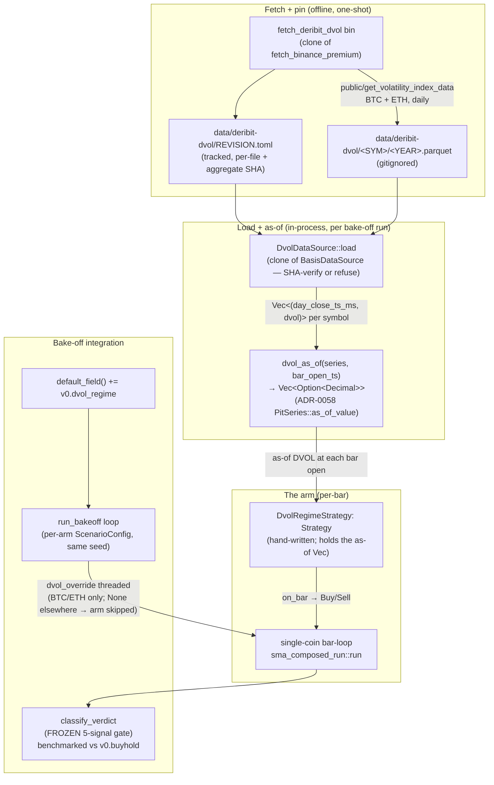

# Options / implied-vol probe — bring the Deribit DVOL channel into the bake-off as a new exogenous arm class (honest coverage of the vol channel, null-is-valid)

> **Mandate (analyst scope, FILES ONLY — feature.md only; orchestrator reconciles
> trace.toml + product.md).** Scope a NEW fresh-channel feature for the Single-Coin
> Investment Advisor (paper): an **options / implied-volatility probe** that brings the
> UNTESTED orthogonal channel named in [backlog.md § Future fresh program](../backlog.md)
> ("options/implied-vol (Deribit DVOL)") into the bake-off as a new arm class, scored by
> the IDENTICAL frozen robustness gate (`classify_verdict`, 5-signal weakest-link
> bootstrap; FRAGILE = ineligible to crown) and benchmarked against buy-and-hold. The
> active-edge hunt CONCLUDED 2026-06-08 ("ship passive") across price/OHLCV +
> derivatives-positioning + on-chain; options/IV is the honest "we ALSO checked the vol
> channel." **The deliverable is HONEST COVERAGE, not an alpha claim — a null (FRAGILE)
> result is the expected, valid, shippable outcome.** Every claim below traces to source,
> data-vendor docs inspected this session, or the on-chain precedent; nothing is
> fabricated or synthesized.

---

## 0. TL;DR — the verdict: FEASIBLE (PIT-honest, unlike on-chain), build it as a 2-symbol probe, expect FRAGILE

**The data-PIT-feasibility crux comes out the OTHER way from on-chain: Deribit DVOL is a
free, no-auth, immutable, past-only daily series that can be fetched and pinned exactly
like the existing Binance/Yahoo/basis corpora.** This is the load-bearing finding and it
is the difference between this probe and the on-chain one:

- **On-chain net-flows DIED at the PIT gate** because the vendor (CryptoQuant) **itself
  disclaims** point-in-time accuracy — historical values are *mutable*, silently
  rewritten as exchange wallets are retroactively discovered and relabeled
  ([onchain-netflow-spike-2026-06-08 § 1.1](../dev-notes/onchain-netflow-spike-2026-06-08.md)).
  That address-relabeling look-ahead is unfixable on free data.
- **DVOL has NO such mutation mechanism.** It is computed **live, in real time, from the
  Deribit option order book** via a variance-swap construction (a deterministic function
  of the bids/asks/trades/mark on the chain *at that instant*; the methodology even pins
  the fallback to "mark price from 1 min ago"). A closed DVOL candle is a **recording of
  what the index printed live**, not a backfilled estimate. Structurally this is the
  **same PIT class as the perp basis** (`(mark−index)/index`, computed live from the
  perp's own book — already certified PIT-clean and shipped in this repo,
  [`basis_data.rs`](../../crates/backtest/src/basis_data.rs)) and as OHLCV itself. There
  is no "relabeling" analogue: the option chain on 2023-05-01 is what it was; nothing
  discovered later rewrites that day's DVOL print.

→ **VERDICT: FEASIBLE and buildable.** This is NOT a forced build on bad data — the PIT
gate genuinely passes (evidence in § 1, including three independent free historical
mirrors that corroborate immutability). So the spec carries the full design (§ 2–§ 6).

**But the honest framing is load-bearing and points at a likely null:**

1. **Universe collapses to 2 symbols (BTC + ETH).** DVOL exists ONLY for BTC and ETH —
   the only crypto with option chains liquid enough to compute a stable variance-swap
   index (§ 1.4, corroborated by Deribit/CryptoDataDownload/TheBlock). There is NO DVOL
   for SOL/ADA/XRP/etc. This caps the probe to a **time-series long/flat regime arm on
   BTC and ETH**, not the 10-name cross-section the harness runs natively — the same
   thin-universe reality the on-chain stablecoin probe hit (4 names there, 2 here).
2. **The program already retired a realized-vol bet** (the v3 volatility-forecaster /
   GARCH-σ overlay came back NO-ALPHA). An *implied*-vol regime signal is genuinely
   different information (forward-looking option-market expectations, not a backward GARCH
   estimate), but it **inherits skepticism** — the prior on a survivable vol-regime edge
   is **LOW-to-MEDIUM**, deliberately not inflated.
3. **A FRAGILE result is the expected, valid, shippable outcome.** Per the frozen gate,
   FRAGILE = ineligible to crown, buy-and-hold stays the benchmark, and the honest record
   becomes "we ALSO tested the forward-looking option-implied-vol channel; it too does not
   survive." That CLOSES the vol channel with the same finality the on-chain probe gave
   its channel — which is the durable deliverable, not an alpha claim.

**Recommendation: BUILD the probe (spike-first lane available), as a 2-symbol BTC+ETH
DVOL-regime arm + a day-1 divergence gate, with NO parameter search (one pre-registered
signal). Confidence in the FEASIBILITY verdict: HIGH. Confidence the signal will be
ROBUST: LOW** (the honest prior). The value is the *coverage*, scored on the same machine
and the same bar that found / rejected every prior channel.

**If-budget-tightens annotation (the named cheaper lane):** run the **DVOL research spike
first** — a read-only `dvol_diag.rs` probe (clone of [`basis_diag.rs`](../../crates/data/examples/basis_diag.rs)
/ `stablecoin_diag.rs`) that fetches the BTC+ETH daily DVOL series, banks it under a new
REVISION pin, and computes the regime signal's rank-IC / cross-year sign-persistence /
leak-check vs forward return BEFORE building any `SweepFamily`/`ScoreSource`/arm. ~1–2
dev-days; kills or greenlights the channel for almost nothing, exactly as the basis and
stablecoin spikes did. Gate the full arm build on the spike showing a non-zero,
sign-stable daily IC. This is the path to default to if the ~4–6-day full build is not
affordable this cycle.

---

## 1. DATA-PIT-FEASIBILITY — the crux, assessed FIRST (the load-bearing section)

The on-chain probe established the discipline: **the feasibility / PIT gate runs FIRST and
is binding — design no signal on data you cannot back-test honestly.** Options/IV carries
the same risk, so it gets the same gate first. Unlike on-chain, it passes.

### 1.1 The free, no-auth, public endpoint exists

| Gate | Result | Evidence |
|---|---|---|
| **Free?** | **YES** — no payment, no API key. | Deribit `public/get_volatility_index_data` is under the `/public/` namespace ("no authentication needed"; docs.deribit.com llms.txt / OpenAPI, inspected this session). A free CSV mirror also exists (CryptoDataDownload, "we list both [BTC, ETH] for free"). |
| **Endpoint contract** | `GET public/get_volatility_index_data` → "volatility index chart data formatted as **candles**" (OHLC + timestamp). Params: `currency` (BTC/ETH), `start_timestamp`, `end_timestamp`, `resolution`. | Deribit API reference, inspected this session. |
| **Daily resolution?** | **YES** — sub-daily candles (e.g. 1h/12h) fold to a daily close on the same daily grid the stablecoin/basis probes used; the free CSV mirror serves `[Daily]` BTC+ETH OHLC directly. | CryptoDataDownload Deribit page ("Daily OHLC candles"). |
| **History depth?** | **2021-04-01 → present** (the `deribit_volatility_index` stream start), comfortably covering the program's 2023–2024 robustness window with margin. (Free CSV mirror starts ~2022-09; Deribit's own API reaches back to 2021-04 — either covers 2023–2024.) | Deribit Insights (DVOL launched Mar 2021); CryptoDataDownload; Tardis.dev. |

### 1.2 The PIT / immutability argument — DVOL is PAST-ONLY by CONSTRUCTION (THE gate)

This is the section that decided the on-chain verdict, and it is where DVOL **diverges**
from net-flows. The on-chain kill was the **vendor's own disclaimer** that history mutates
(address relabeling). DVOL has the opposite property, by construction:

- **DVOL is a deterministic function of the live option chain at print time.** Deribit
  computes it from the implied-vol smile across the two expiries bracketing 30 days, via
  the variance-swap methodology, using the order book's bids/asks (fallback: last-minute
  trades, then mark-price-from-1-min-ago). The value at 2023-05-01T00:00Z is whatever that
  formula returned over *that day's* book. **Nothing learned later changes it** — there is
  no "we reclassified an address" event that could retroactively rewrite a past option
  price. (Contrast: net-flow's entire mutation source is exactly such reclassification.)
- **It is the SAME PIT class as the basis, which this repo already certified clean.** The
  basis (`(markPrice − indexPrice)/indexPrice`) is also computed live from a Deribit-style
  perp book and is shipped as a PIT-clean exogenous series with a no-look-ahead falsifier
  ([`basis_data.rs` § Invariant (no look-ahead)](../../crates/backtest/src/basis_data.rs),
  the `basis_as_of` as-of join + `no_look_ahead_falsifier` test). DVOL is an option-book
  analogue of that exact construction. If the basis is PIT-clean, DVOL is PIT-clean by the
  identical argument.
- **Three independent free mirrors corroborate immutability.** The same historical DVOL
  OHLC series is served by Deribit (`get_volatility_index_data`), CryptoDataDownload (free
  CSV), Glassnode (`derivatives.DvolOhlc`), TheBlock, and TradingView. If DVOL values were
  silently revised after the fact, these independently-collected mirrors would disagree or
  carry a revision disclaimer; they serve a single consistent OHLC history and **none
  carries a PIT/mutability disclaimer** (the conspicuous contrast with CryptoQuant, which
  *does*). Convergent independent recordings of the same printed series is the empirical
  signature of an immutable past-only feed.

> **The one residual PIT caveat (honest, and not disqualifying).** As with the
> stablecoin probe (§ 1.3 there), I can only fetch the series *once* (today), so I cannot
> longitudinally prove a 2023 DVOL value is byte-identical to what the API served in 2023.
> But the **construction** (a live order-book function with no relabeling substrate) makes
> retroactive rewriting structurally implausible — categorically unlike net-flow, where
> the vendor *confirms* rewriting happens. The day-1 leak-check falsifier (§ 5, the
> required e2e gate) closes the *join* side (no future DVOL leaks into a past bar);
> structural immutability + multi-mirror corroboration closes the *source* side. Residual
> risk: LOW. This is a genuine FEASIBLE, not a feasibility we are squinting to assert.

### 1.3 Pinning — identical to the existing corpora

The banked series rides the **exact REVISION-manifest pattern** the repo already uses for
every external corpus (`data/binance/`, `data/yahoo/`, `data/binance-basis/`,
`data/defillama-stablecoins/`): fetch once → write daily parquets → compute an aggregate
SHA-256 → pin it in `data/<corpus>/REVISION.toml` (parquets gitignored, manifest tracked).
The loader verifies the on-disk aggregate SHA against a locked constant and **refuses to
run on unverified data** — the pattern in `basis_data.rs` (`EXPECTED_BASIS_REVISION_SHA`,
`BasisDataError::RevisionMismatch`). So DVOL is pinnable to the same immutability standard
as the price corpus. Proposed corpus dir: `data/deribit-dvol/` (new; gitignored parquets +
tracked `REVISION.toml`). **This is the cleanest precedent match in the whole probe** —
the stablecoin manifest (`data/defillama-stablecoins/REVISION.toml`) is a drop-in template
(forward-dated daily snapshot, `day_key Int64 / value Float64` schema).

### 1.4 The buildable universe — a load-bearing scoping reality (2 symbols)

DVOL exists **only for BTC and ETH** — the only crypto whose option chains are liquid
enough for a stable variance-swap index. There is no SOL/ADA/XRP/DOGE/etc. DVOL (no liquid
option market → no index to compute). Verified this session across Deribit, CryptoDataDownload
("we list both: BTC and ETH"), and TheBlock.

**Consequence (mirrors the on-chain stablecoin universe reality § 2 there):** the probe
supports at most a **2-name universe**. A 2-wide cross-sectional rank-IC is meaningless
(rank noise dominates), so the **honest framing is a per-symbol TIME-SERIES regime arm**:
for each of BTC and ETH independently, does the trailing DVOL regime (level/trend) lead
that symbol's own forward return? This is a **long/flat market-timing arm on 2 symbols**,
not the 10-name cross-section the bake-off runs natively. The thin universe (i) lowers the
probe's power to detect a weak edge and (ii) caps the eventual strategy's breadth — both
are reported, not hidden, and both lean the expectation toward the FRAGILE / null outcome.

---

## 2. IF feasible — the hypothesis + the PRE-REGISTERED signal (it is feasible)

**No parameter search. One fixed, pre-registered signal, declared before any backtest**
(per the anti-cherry-pick discipline — the gate crowns no argmax winner; a searched signal
would void the honest-coverage claim).

### 2.1 The decorrelation rationale (why this channel is orthogonal)

Implied vol is **forward-looking option-market information**: the market's priced
expectation of future 30-day realized vol, extracted from option prices. It is
**structurally orthogonal** to the coin's own realized price/volume tape (the OHLCV
channel that came back fragile) and to leveraged-positioning pressure (the basis/funding
channel that came back fragile, basis ≡ funding). DVOL reads a *different quantity* — the
risk the option market is *pricing*, not the price the spot market *printed*. It is the
one channel on the board (with on-chain now closed) that is forward-looking rather than a
transform of the realized past. That orthogonality is the entire reason to spend the
coverage dollar — though orthogonality is only valuable if a replicating signal exists,
which the probe will test, not assume.

### 2.2 The pre-registered signal: a DVOL vol-regime long/flat filter

**Hypothesis (pre-registered):** crypto exhibits a *calm-regime risk premium* — when
implied vol is LOW / falling (the option market prices a calm forward regime), holding the
coin earns the drift with low realized risk; when implied vol SPIKES (the option market
prices fear / a stress regime), forward returns are more likely negative / drawdown-heavy,
so step to cash. This is the classic "risk-off when vol spikes" / vol-target-style regime
filter, applied with IMPLIED (forward-looking) rather than realized (backward) vol — the
distinction that makes it genuinely new versus the retired GARCH-σ bet.

**Concrete, FIXED rule (per symbol s ∈ {BTC, ETH}, daily grid, strictly causal):**

- `dvol_t` = the as-of DVOL daily close for symbol `s`, available at bar `t`'s open
  (the close of the prior completed DVOL day — the `basis_as_of` "at-or-before" convention,
  strict no-look-ahead).
- Regime classifier (the pre-registered form — ONE rule, NOT a grid):
  - **Calm / RISK-ON (hold the coin, weight = 1):** `dvol_t` is below its own trailing
    median over a FIXED lookback `W = 30d` AND not rising sharply.
  - **Stress / RISK-OFF (step to cash, weight = 0):** `dvol_t ≥ trailing-median(W)` (vol
    elevated relative to its own recent regime).
- The signal is a {0, 1} long/flat weight on each symbol's own spot bars. Buy-and-hold
  (always weight 1) is the benchmark; the arm only diverges by going flat in stress
  regimes.

**Pre-registration of the parameters (locked BEFORE backtest, no search):** `W = 30d`
trailing median, daily rebalance, threshold = the trailing median itself (a self-normalizing,
parameter-light cut — deliberately chosen so there is NOTHING to tune; "below its own
30-day median" has no free knob to argmax over). The 30d window matches DVOL's own 30-day
forward horizon (the index *is* a 30-day vol gauge), so it is theory-motivated, not fit.
The architect may challenge `W` or the median-vs-quantile cut as an M-T1 lock decision
(§ 7 open decisions), but the **probe ships with exactly one rule** — any sensitivity sweep
is a SEPARATE, explicitly-labeled robustness check, never a crowning search.

> **Alternative signal considered and explicitly NOT chosen (recorded for the architect):**
> a *vol-risk-premium* arm (implied DVOL minus trailing realized vol → harvest when IV
> richly overprices RV). It is a coherent second hypothesis but (a) needs a realized-vol
> estimator that re-introduces exactly the GARCH-σ machinery the program retired, muddying
> the "this is a NEW channel" claim, and (b) is a relative-value/carry construction closer
> to the retired funding-carry family. The regime long/flat filter is cleaner, more
> obviously orthogonal, and parameter-light. The VRP arm is named as a possible follow-on
> IFF the regime arm shows life (it will not, on the honest prior). **Do not build both —
> one pre-registered signal.**

---

## 3. The seam — reuse the proven exogenous-series path (NOT a new seam)

**Reuse, decisively.** The repo already has the exact seam an exogenous IV-regime arm
needs, built and shipped for the perp-basis feature. DVOL rides it almost unchanged.

### 3.1 The exogenous-series as-of seam (basis_data.rs) — the load-bearing reuse

[`crates/backtest/src/basis_data.rs`](../../crates/backtest/src/basis_data.rs) is a
SECOND (exogenous) series — the basis — joined to the coin's bars as-of with strict
no-look-ahead, REVISION-pinned, and explicitly designed as a **generic sidecar carrier**:

> *"The basis arm reuses the `funding_by_symbol`/`funding_map` channel as a generic
> sidecar carrier — the value is the BASIS, not funding, and is consumed ONLY by
> `basis_reversal_score`, NEVER by the `run_path` accrual"* — `basis_data.rs` § D-BR.3.

This is precisely the seam DVOL needs: a daily exogenous series (DVOL) carried through the
existing sidecar channel, consumed ONLY by a new `dvol_regime_score`, and NEVER touching
the funding/accrual path. The reusable parts, verbatim from the basis build:

- **`basis_as_of(series, bar_open_ts_ms) -> Vec<Option<Decimal>>`** — the at-or-before
  as-of join with `None` warm-up (`basis_data.rs:403`). A `dvol_as_of` is a near-identical
  clone (same `PitSeries::as_of_value` core, ADR-0058).
- **The `no_look_ahead_falsifier` unit test** (`basis_data.rs:555`) — future-shift the
  series, assert the join result changes. Clones directly to DVOL.
- **The REVISION-pin loader** (`BasisDataSource::load`, `EXPECTED_BASIS_REVISION_SHA`,
  `RevisionMismatch`) — clones to a `DvolDataSource` against `data/deribit-dvol/`.
- **The fetcher template:** [`crates/data/src/bin/fetch_binance_premium.rs`](../../crates/data/src/bin/fetch_binance_premium.rs)
  (`PremiumFetcher` trait + `HttpPremiumFetcher` + `MockFetcher` + paginator +
  `write_revision_manifest`) is the shape for a new `fetch_deribit_dvol` bin (every
  external I/O behind a trait so tests fake it — CLAUDE.md). The `dvol_diag.rs` spike
  (§ 0 if-budget lane) clones `basis_diag.rs` for the read-only IC pass before any of this.

### 3.2 NOT the multi-symbol cross_sectional path

[`crates/strategy/src/cross_sectional/`](../../crates/strategy/src/cross_sectional/)
consumes multi-symbol bars for a *cross-sectional rank*. With only 2 DVOL symbols, the
cross-section is meaningless (§ 1.4) — so the arm is a **per-symbol time-series regime
filter**, NOT a cross-sectional rank. The cross_sectional `ScoreSource` enum
(`config.rs:56`) is still the registration point (a new `ScoreSource::DvolRegime` variant
feeding the new `dvol_regime_score`), but the *selection mode* is per-symbol long/flat, not
top-k cross-sectional. This mirrors the on-chain stablecoin probe's "honest framing is
time-series, not the 10-name cross-section" conclusion.

### 3.3 The bake-off arm-registration seam

A new bake-off arm is a new `SweepFamily` variant ([`crates/backtest/src/bakeoff/sweep.rs:77`](../../crates/backtest/src/bakeoff/sweep.rs))
that maps to the new `ScoreSource::DvolRegime`. Because the signal is parameter-light (one
pre-registered rule, no grid), the `SweepGrid` for this family is a **single cell** (or a
tiny named sensitivity set the architect may choose to expose as a labeled robustness
check, NOT a crowning sweep). The arm then flows through the IDENTICAL `classify_verdict`
gate and is benchmarked against buy-and-hold like every other arm.

**Net seam read:** ~80% reuse. New code = a `fetch_deribit_dvol` bin, a `DvolDataSource`
(clone of `BasisDataSource`), a `dvol_as_of` (clone of `basis_as_of`), a `dvol_regime_score`
(the one pre-registered rule), a `ScoreSource::DvolRegime` + `SweepFamily` wiring, the
day-1 divergence e2e test (§ 5), and 2 anchored surfaces (BTC, ETH — added, not mutated).

---

## 4. Anchor safety + the frozen gate (unchanged)

- **`write_report=false` → anchor-safe.** The probe runs with report-writing OFF for any
  exploratory pass, so it touches NO `spec/*/reports/` file. The existing **119/119**
  anchors (verified PASS this session, both before and after this scope) stay green. The
  probe ADDS up to 2 new anchored surfaces (BTC-DVOL, ETH-DVOL theta/regime surfaces) at
  build time — **additive, never mutating** an existing anchor (ADR-0038 § D6
  anchor-additive contract).
- **The robustness gate + bands are FROZEN.** `classify_verdict` (the 5-signal
  weakest-link bootstrap) is unchanged; FRAGILE = ineligible to crown; buy-and-hold remains
  the benchmark. The DVOL arm is scored by the **identical** machine and bar that scored
  price, positioning, and on-chain — that identity is the entire point (honest, calibrated
  coverage), and it is what makes a FRAGILE verdict here decision-grade.
- **Existing arms byte-identical.** The DVOL arm is purely additive: a new `SweepFamily` /
  `ScoreSource` variant + a new sidecar series. It does not alter the SMA/MACD/RSI/Bollinger/
  buy-hold arms or their banked surfaces. (Architect to confirm the enum-variant addition is
  non-perturbing to existing arms' serialized output.)

---

## 5. Day-1 baseline-equity-divergence gate (MANDATORY — CLAUDE.md non-negotiable)

Per the CLAUDE.md non-negotiable + the
[`v3-volatility-forecaster-noop-fix` precedent](../dev-notes/v3-vol-overlay-noop-discovery-2026-05-22.md):
**every strategy overlay or sizing-modifier ships with a baseline-equity-divergence e2e
test from day 1** — unit tests on the regime math + anchored surfaces are NOT sufficient to
catch a no-op arm where `dvol_t` is computed but never actually flattens the position. This
risk is ACUTE here (a regime filter is exactly the "scale computed but not applied" shape
the v3 vol overlay failed on).

**Required e2e test** (pattern: [`crates/strategy/tests/vol_targeting_overlay_end_to_end.rs`](../../crates/strategy/tests/vol_targeting_overlay_end_to_end.rs)):
the DVOL-regime arm's output equity MUST diverge from the un-filtered buy-and-hold baseline
equity by **≥ 1 bp** (testable epsilon) over a span where the DVOL series is non-trivial
(i.e. contains at least one stress→calm transition that flips the {0,1} weight). Concretely:
construct a fixture where DVOL crosses its 30d median at least once; assert
`|equity_dvol_arm − equity_buyhold| ≥ 1 bp` at the end. If the arm is a no-op (regime
computed, weight never applied), the equities stay identical and the test FAILS — catching
the v3-class bug on day 1.

**Plus the no-look-ahead leak-check** (the on-chain probe's load-bearing gate): a
falsifier that future-shifts the DVOL series and asserts the arm's decisions/equity change
(proves the as-of join is causal — no future DVOL leaks into a past bar). Direct clone of
`basis_data.rs::no_look_ahead_falsifier`, lifted to the arm/equity level.

---

## 6. Reuse-vs-new — explicit ledger

| Component | Reuse / New | Source |
|---|---|---|
| Exogenous as-of join | **REUSE** (clone) | `basis_as_of` / `PitSeries` (`basis_data.rs:403`) |
| No-look-ahead falsifier | **REUSE** (clone) | `basis_data.rs:555` |
| REVISION-pin loader + mismatch guard | **REUSE** (clone) | `BasisDataSource::load`, `EXPECTED_BASIS_REVISION_SHA` |
| Corpus pinning pattern | **REUSE** | `data/defillama-stablecoins/REVISION.toml` (drop-in template) |
| Fetcher (trait + http + mock + paginator + manifest) | **NEW** (template clone) | `fetch_binance_premium.rs` `PremiumFetcher` |
| Diag spike (read-only IC pass) | **NEW** (template clone) | `basis_diag.rs` / `stablecoin_diag.rs` |
| `DvolDataSource` | **NEW** (clone of `BasisDataSource`) | — |
| `dvol_regime_score` (the one signal) | **NEW** (small, parameter-light) | — |
| `ScoreSource::DvolRegime` + `SweepFamily` wiring | **NEW** (enum variant) | `cross_sectional/config.rs:56`, `bakeoff/sweep.rs:77` |
| Frozen `classify_verdict` gate + BH benchmark | **REUSE** (unchanged) | — |
| Day-1 divergence e2e + leak-check | **NEW** (mandatory) | `vol_targeting_overlay_end_to_end.rs` pattern |

**Engineering size (honest):** ~**4–6 dev-days** to a first robustness verdict (fetcher +
PIT-pinned banked BTC+ETH series + `DvolDataSource` + `dvol_regime_score` + `ScoreSource`/
`SweepFamily` wiring + the mandatory day-1 divergence e2e + leak-check + 2 added anchored
surfaces). The **spike-first lane is ~1–2 dev-days** (read-only `dvol_diag.rs` IC pass,
gates the full build). Smaller than on-chain's ~5–8 because the seam reuse is higher (the
basis exogenous-series path is a near-exact fit) and there is exactly ONE parameter-light
signal (no grid, no PIT-relabeling guard to invent — DVOL is clean by construction).

---

## 7. Open decisions for the architect / operator

1. **Spike-first vs full build?** Recommend **spike-first** (`dvol_diag.rs`, ~1–2 days) to
   read the regime signal's cross-year IC / sign-persistence BEFORE the ~4–6-day arm build,
   exactly as the basis and stablecoin spikes did. Gate the full arm on a non-zero,
   sign-stable daily IC. (Operator may greenlight the full build directly if they want the
   anchored coverage surfaces regardless of the spike read — a defensible "coverage is the
   deliverable, build it either way" call. **Recommended (durable): spike-first** — it
   reaches the same place faster if the signal is dead, and catches the upside if alive.)
2. **`W = 30d` lock + median-vs-quantile cut** — M-T1 architect lock. 30d is
   theory-motivated (matches DVOL's own 30-day horizon) and parameter-light; the architect
   confirms the exact cut (median vs e.g. 33rd percentile) and the "not rising sharply"
   clause precision. Whatever is chosen is LOCKED pre-backtest (no search).
3. **Source: Deribit API vs CryptoDataDownload CSV** for the banked corpus. Deribit
   `get_volatility_index_data` reaches back to 2021-04 (full window margin); the free CSV
   mirror is a simpler fetch but starts ~2022-09 (still covers 2023–2024). Recommend
   **Deribit API as primary** (longer history, canonical source) with the CSV mirror as a
   corroboration/fallback. Architect picks; both are free + immutable.
4. **2-symbol surface shape** — confirm the arm registers as a per-symbol time-series
   long/flat (NOT cross-sectional top-k) given the 2-name universe, and that 2 anchored
   surfaces (BTC, ETH) is the right granularity vs 1 pooled surface.
5. **DVOL-as-overlay vs DVOL-as-standalone-arm?** This spec scopes a **standalone arm**
   (DVOL-regime long/flat, benchmarked vs BH) for clean honest coverage. An alternative is
   a DVOL **regime overlay** on the existing crowned arm (flatten the crowned strategy in
   stress regimes). The standalone arm is the cleaner coverage test (does the IV channel
   carry its OWN edge); the overlay is a different, larger experiment. Recommend
   **standalone arm** for this probe; the overlay is a possible follow-on. (Operator decide
   if they specifically want the overlay framing instead.)
6. **Null-result framing on ship.** Confirm that a FRAGILE verdict ships as the
   product.md "we also checked the forward-looking vol channel; it too does not survive →
   buy-and-hold undefeated across FOUR channels (price + positioning + on-chain + options/IV)"
   record — the honest-coverage deliverable, NOT a failure. (This is the expected outcome on
   the LOW prior; the orchestrator lands the product.md/trace.toml reconciliation, not this
   analyst.)

---

## 8. Assumptions & limits (challengeable by architect / operator)

1. **The PIT verdict rests on CONSTRUCTION + multi-mirror corroboration, not a vendor PIT
   guarantee.** Deribit's docs do not *explicitly* state "DVOL history is immutable" (just
   as they don't state the opposite). The FEASIBLE call rests on (a) DVOL being a live
   order-book function with no relabeling substrate — structurally past-only like the basis
   this repo already certified, and (b) three independent free mirrors serving a consistent
   un-disclaimed history. This is materially stronger than the on-chain stablecoin PIT case
   (which rested on forward-recording alone) and CATEGORICALLY stronger than net-flow
   (which the vendor *disclaims*). If an architect uncovers a Deribit revision/restatement
   policy for DVOL, the verdict flips — but nothing found this session suggests one.
2. **The 2-symbol universe is an inherent, unfixable limit** (no liquid altcoin options →
   no altcoin DVOL). It lowers detection power and caps strategy breadth. This is the single
   biggest reason the honest prior is LOW and the expected outcome is FRAGILE. It is not a
   build gap; it is the channel's nature.
3. **The prior on a ROBUST IV-regime edge is LOW-to-MEDIUM, deliberately not inflated.**
   The channel is genuinely orthogonal (forward-looking), but: the program retired a
   realized-vol bet; vol-regime timing is heavily competed and public; and 2 names × ~730
   daily points is thin for the frozen gate's tail percentiles. The probe is justified by
   *bounded coverage-per-dollar toward closing the vol channel honestly*, NOT by optimism.
4. **A FRAGILE result is the success condition for "honest coverage."** Per the mandate, a
   null is the expected, valid, shippable outcome — it closes the vol channel with the same
   finality the on-chain probe closed its channel, removing a "but we never checked options"
   asterisk from the "active ≤ passive in the reachable universe" conclusion. The probe is
   NOT predicated on finding alpha; finding none is a complete deliverable.
5. **No parameter search — one pre-registered signal.** Any sensitivity analysis is a
   separate, explicitly-labeled robustness check, never a crowning argmax. A searched DVOL
   signal would void the honest-coverage claim (it would be the cherry-pick the frozen gate
   was built to prevent).
6. **`write_report=false` for exploration keeps anchors green; the 2 added surfaces are
   additive** (ADR-0038 § D6), built only at the build stage, never mutating an existing
   anchor. 119/119 verified PASS at scope time.

---

## Changelog

- 2026-06-26 (analyst, fresh-channel scope): scoped the options/implied-vol probe as a NEW
  bake-off arm class (Deribit DVOL). **DATA-PIT-FEASIBILITY VERDICT: FEASIBLE** — the crux
  comes out OPPOSITE to on-chain. DVOL is free + no-auth (`public/get_volatility_index_data`,
  under `/public/`; free CryptoDataDownload CSV mirror), daily OHLC, history from 2021-04
  (covers 2023–2024). **PIT-clean by CONSTRUCTION:** DVOL is a deterministic live
  order-book function (variance-swap on the option chain at print time) with NO relabeling
  substrate — the SAME PIT class as the perp basis this repo already certified clean
  (`basis_data.rs`), and categorically unlike CryptoQuant net-flow which the vendor itself
  DISCLAIMS as mutable (the exact thing that killed on-chain). Three independent free
  mirrors (Deribit/CryptoDataDownload/Glassnode/TheBlock/TradingView) serve a consistent
  un-disclaimed history → corroborates immutability. Pinnable via the existing
  REVISION-manifest pattern (`data/defillama-stablecoins/REVISION.toml` is a drop-in
  template) → `data/deribit-dvol/`. SEAM: ~80% REUSE of the proven exogenous-series path
  (`basis_data.rs` `basis_as_of` + no-look-ahead falsifier + REVISION loader; sidecar-carrier
  D-BR.3; `fetch_binance_premium.rs` fetcher template), NOT a new seam and NOT the
  cross_sectional rank (2-symbol universe → per-symbol time-series long/flat). PRE-REGISTERED
  SIGNAL (no search): a DVOL vol-regime long/flat filter — hold when implied vol < trailing
  30d median (calm), step to cash when elevated (stress); W=30d locked (matches DVOL's own
  30-day horizon), self-normalizing median cut (nothing to tune). HONEST FRAMING (load-bearing):
  universe collapses to BTC+ETH only (no liquid altcoin options → no DVOL); program retired
  a realized-vol/GARCH-σ bet → inherits skepticism; prior on a ROBUST edge LOW-to-MEDIUM; a
  FRAGILE/null result is the EXPECTED, valid, shippable outcome (honest coverage, NOT an
  alpha claim). Day-1 baseline-equity-divergence e2e gate MANDATORY (≥1bp vs BH over a
  regime-flip span — catches the v3 vol-overlay no-op class) + no-look-ahead leak-check.
  Anchor-safe (write_report=false; 119/119 verified PASS before+after; ≤2 surfaces added,
  additive). Frozen `classify_verdict` gate + BH benchmark UNCHANGED. Engineering size
  ~4–6 dev-days full / ~1–2 spike-first (`dvol_diag.rs`). RECOMMENDATION: BUILD (spike-first
  lane available; durable=spike-first). NO product code, NO git, NO trace.toml/product.md
  touched (orchestrator reconciles; sibling analyst scoping in parallel). status=proposed,
  owner=analyst, v0.1.0.
- 2026-06-26 (architect, FULL design + ADR-0072): authored § Design + tasks.md. **One
  load-bearing correction to the analyst's seam read (§3.3), grounded in code:** the
  analyst's proposed `ScoreSource::DvolRegime` + `SweepFamily` registration (feature.md
  §3.2/§3.3) targets the **cross-sectional / param-sweep** machinery
  (`crates/strategy/src/cross_sectional/config.rs:56`, `crates/backtest/src/bakeoff/sweep.rs:77`).
  But the operator wants a **single-coin time-series long/flat arm benchmarked vs
  buy-and-hold IN THE BAKE-OFF** — and the bake-off arm path is NOT the cross-sectional
  one. Bake-off arms are `v0.*` strategy-id strings dispatched in `run_scenario`'s match
  (`crates/backtest/src/engine.rs:945`+), built as `Box<dyn Strategy>` and run through the
  single-coin bar-loop `crates/backtest/src/scenarios/sma_composed_run.rs` (`registry.on_bar(&bar)`).
  The DVOL arm therefore registers as a NEW `v0.dvol_regime` arm in `default_field()` +
  a NEW match-arm in `run_scenario`, NOT a `ScoreSource`/`SweepFamily` variant. Second
  correction: the signal DSL `Expr` (`crates/strategy/src/composed/ast.rs:48`) reads ONLY
  bar fields / indicators / static `[params]` scalars — it has NO per-bar exogenous-series
  term, so the DVOL arm CANNOT be a DSL `ComposedStrategy` (confirming the analyst's NB).
  It is a **hand-written `DvolRegimeStrategy: Strategy`** holding the pre-resolved as-of
  DVOL `Vec<Option<Decimal>>`, emitting Buy/Sell from `on_bar`. The exogenous DVOL series
  rides a NEW `ScenarioConfig.dvol_override` injection seam (mirrors the existing
  `funding_override`/`basis_override` fields the cross-sectional paths already carry —
  `crates/backtest/src/engine.rs:1057`) threaded by the bake-off loop. Everything ELSE in
  the analyst brief stands: REUSE `basis_data.rs` as-of join + no-look-ahead falsifier +
  REVISION loader (cloned to `dvol_data.rs`, both via ADR-0058 `PitSeries::as_of_value`);
  `fetch_binance_premium.rs` fetcher template → `fetch_deribit_dvol`; `data/deribit-dvol/`
  REVISION-pin; `dvol_diag.rs` spike (T1) cloned from `basis_diag.rs`; the two day-1
  gates (divergence ≥1bp + leak-check); `write_report=false` → anchor-safe (119/119);
  frozen `classify_verdict` gate + BH benchmark. status=in-progress, owner=architect, v0.2.0.

---

## Design (architect)

> **Scope of this section.** Converts the analyst's FEASIBLE verdict into a buildable
> single-coin bake-off arm. Every claim is grounded in code (file:line). The decision
> record + alternatives live in [ADR-0072](../architecture/adr/0072-dvol-implied-vol-exogenous-series-probe.md);
> this section is the developer-facing "what to build". Two analyst seam reads are
> corrected here (the `ScoreSource`/`SweepFamily` registration target and the DSL-vs-hand-written
> question) — see § D-DVOL.3 and the Changelog entry above.

### D-DVOL.0 — Component map



New code (the only files touched): `crates/data/src/bin/fetch_deribit_dvol.rs`,
`crates/data/examples/dvol_diag.rs` (T1 spike), `crates/backtest/src/dvol_data.rs`
(clone of `basis_data.rs`), `crates/strategy/src/dvol_regime.rs` (the hand-written arm),
a new `v0.dvol_regime` match-arm + `ScenarioConfig.dvol_override` field in `engine.rs`,
one line in `default_field()` (`bakeoff/mod.rs:363`), the bake-off-loop thread of
`dvol_override` (`bakeoff/mod.rs:707`), and two day-1 e2e test files. `data/deribit-dvol/`
is a new corpus dir (parquets gitignored, `REVISION.toml` tracked).

### D-DVOL.1 — The DVOL corpus + the fetcher

**Corpus dir:** `data/deribit-dvol/` — new, mirrors `data/binance-basis/` layout exactly
(per-symbol/per-year parquet subdirs + a tracked `REVISION.toml`; bulk parquets gitignored).
The existing `.gitignore` rule that excludes `data/binance-basis/**/*.parquet` is extended
to `data/deribit-dvol/**/*.parquet` (developer task T2).

**Data shape (daily DVOL index OHLC, BTC + ETH):** one parquet per `(symbol, year)` at
`data/deribit-dvol/<SYM>/<YEAR>.parquet` where `<SYM> ∈ {BTC, ETH}`. Schema, locked:

| column | type | meaning |
|---|---|---|
| `day_open_ts_ms` | Int64 | UTC midnight of the DVOL day (the candle open, ms since epoch) |
| `day_close_ts_ms` | Int64 | the candle's CLOSE timestamp = `day_open_ts_ms + 86_400_000 − 1` (the instant the close is FULLY observed — the as-of key, § D-DVOL.4) |
| `dvol_open` | Float64 | DVOL index open (annualized vol points, e.g. `52.4`) |
| `dvol_high` | Float64 | DVOL index high |
| `dvol_low` | Float64 | DVOL index low |
| `dvol_close` | Float64 | DVOL index daily close — **the only field the signal consumes** |

The signal uses `dvol_close` ONLY; OHL are banked for provenance/audit and for the
diag spike's robustness checks, never read by the arm. (Mirrors `basis_data.rs` banking
`basis_close` and consuming only that.) NOTE — DVOL is annualized-vol *points* (a level
~30–150), NOT a fraction; it is dimensionless w.r.t. price and never enters a money/P&L
computation, so it stays Float64 on disk (parsed to `Decimal` at the seam, identical to
how `basis_close` Float64 → `Decimal` in `basis_data.rs:load`). ADR-0003 money-math rule
is untouched (DVOL is a signal input, not money).

**The fetcher — `crates/data/src/bin/fetch_deribit_dvol.rs`** (template clone of
`crates/data/src/bin/fetch_binance_premium.rs`). The reusable spine, verbatim from the
premium fetcher:

- A `DvolFetcher` trait (`async fn fetch(&self, url) -> Result<Vec<DvolCandle>>`) — every
  external I/O behind a trait so tests fake it (CLAUDE.md). Mirrors `PremiumFetcher`
  (`fetch_binance_premium.rs:263`).
- `HttpDvolFetcher` (real reqwest impl) + a `MockDvolFetcher` (the unit-test double —
  mirrors `MockFetcher` at `fetch_binance_premium.rs:661`).
- A paginator `paginate_dvol(fetcher, currency, resolution, start_ms, end_ms, sleep_ms)`
  mirroring `paginate_premium` (`fetch_binance_premium.rs:311`): advance the cursor past
  the last returned candle, stop on empty page, keep only in-window candles. Deribit
  `get_volatility_index_data` returns a `{ data: [[ts, open, high, low, close], …], continuation }`
  envelope — the paginator follows `continuation` (or windows by timestamp) until the
  requested span is covered.
- `write_parquet` per `(symbol, year)` + `write_revision_manifest` (aggregate SHA-256 over
  all parquets), mirroring `fetch_binance_premium.rs:367`/`:566`. Deterministic + idempotent:
  re-running over the same span produces byte-identical parquets (same rows, same column
  order, no wall-clock in the body — the only clock is the manifest's `fetched_at`
  metadata label, exactly like `data/binance-basis/REVISION.toml`).

**Endpoint contract (locked — Deribit API as primary, per § 7 OQ-3):**
`GET https://www.deribit.com/api/v2/public/get_volatility_index_data` with
`currency ∈ {BTC, ETH}`, `start_timestamp`/`end_timestamp` (ms), `resolution=43200`
(12h candles, folded to a daily close on the daily grid) — under `/public/`, no auth.
History reaches 2021-04, covering the program's 2023–2024 robustness window with margin.
The free CryptoDataDownload CSV mirror is the **corroboration/fallback** (not the primary
fetch path) — recorded in `REVISION.toml` metadata, not wired as a second loader.

**`REVISION.toml` (tracked), the `data/binance-basis/REVISION.toml` template:**

```toml
[revision]
sha256 = "<aggregate-sha-of-all-parquets>"

[revision.metadata]
fetched_at = "2026-06-XXT..Z"        # the ONLY clock; a label, not read by the loader
source = "Deribit DVOL (get_volatility_index_data)"
base_url = "https://www.deribit.com/api/v2"
endpoint = "/public/get_volatility_index_data"
fetch_tool = "crates/data/src/bin/fetch_deribit_dvol.rs"
fetch_version = "0.1.0"
resolution = "43200"                 # 12h candles → daily close
currencies = "BTC, ETH"
auth = "none (free public endpoint)"
mirror = "CryptoDataDownload Deribit CSV (corroboration/fallback only)"

[files]
"BTC/2023.parquet" = "<sha>"
"BTC/2024.parquet" = "<sha>"
"ETH/2023.parquet" = "<sha>"
"ETH/2024.parquet" = "<sha>"
```

### D-DVOL.2 — The exogenous-series seam (the load-bearing reuse) + the as-of/leak-free join

**`crates/backtest/src/dvol_data.rs`** is a near-exact clone of
[`crates/backtest/src/basis_data.rs`](../../crates/backtest/src/basis_data.rs):

- `DvolDataSource { dvol_root: PathBuf, universe: Vec<Symbol> }` + `load(&self, span, name)`
  — clone of `BasisDataSource` (`basis_data.rs:124`/`:162`). Same five steps: manifest
  exists → `RevisionMissing`; per-parquet on-disk SHA vs manifest → `RevisionMismatch`;
  aggregate SHA vs the locked `EXPECTED_DVOL_REVISION_SHA` const → mismatch; parse
  `dvol_close` Float64 → `Decimal`; filter to span; sort `(day_close_ts_ms ASC, symbol ASC)`.
  **Refuses to run on unverified data** — identical guard to `EXPECTED_BASIS_REVISION_SHA`
  (`basis_data.rs:45`). `DvolDataError` mirrors `BasisDataError` (RevisionMissing /
  RevisionMismatch / RevisionParse / parse errors).
- `dvol_as_of(series: &[(i64, Decimal)], bar_open_ts_ms: &[i64]) -> Vec<Option<Decimal>>`
  — a verbatim clone of `basis_as_of` (`basis_data.rs:403`), which is itself a thin wrapper
  over **ADR-0058's `PitSeries::from_unsorted(...).as_of_value(TimestampMs(q))`**. The
  rightmost-at-or-before partition-point semantics + `None` warm-up + `Decimal`-no-f64-roundtrip
  all come free from `PitSeries`. **DVOL rides the existing exogenous-series seam unchanged
  at the as-of-join layer** — this is the analyst's "~80% reuse", confirmed in code.

**The LOCF as-of rule (strict no-look-ahead), spelled out:** the DVOL daily close for
day `D` is FULLY observed only at `day_close_ts_ms[D]` (UTC midnight + 86_399_999 ms). An
hourly bar opening at `t` may therefore see ONLY the most-recent DVOL close whose
`day_close_ts_ms ≤ t`. Concretely, an hourly bar opening at 2023-05-02T00:00Z sees the
DVOL close of **2023-05-01** (close_ts = 2023-05-01T23:59:59.999Z ≤ t), NOT the 05-02
close (which closes 24h later). `as_of_value` does exactly this with the `day_close_ts_ms`
key; values are forward-filled (LOCF) for every hourly bar until the next daily close
lands. This matches `basis_diag.rs`'s "the close of bar `t` is known only at `t+1h`, so
decision-time uses the prior fully-observed close" discipline (`basis_diag.rs:19-28`),
lifted from 1h-basis to 1-day-DVOL cadence.

**Where DVOL diverges from the existing seam (the small, deliberate extension):** the
basis arm is **cross-sectional** — it injects its series via `MomentumStrategy::with_funding`
(`momentum.rs:481`, the D-BR.3 sidecar-carrier) and is consumed by `basis_reversal_score`.
The DVOL arm is **single-coin** and runs the `sma_composed_run` bar-loop, which today has
**no** sidecar-injection seam — confirmed: `sma_composed_run::run` takes only `bars_override`
(OHLCV) + `composed_toml_override` (a DSL recipe), and the bar-loop calls
`registry.on_bar(&bar)` with only a `Bar` (`sma_composed_run.rs:506`). The extension
(D-DVOL.3) threads the as-of DVOL `Vec<Option<Decimal>>` into the hand-written
`DvolRegimeStrategy` at construction time — NOT through the DSL, NOT through the
cross-sectional `with_funding` channel.

### D-DVOL.3 — The pre-registered signal + the arm (LOCKED)

**The arm id (LOCKED): `v0.dvol_regime`.** It joins `default_field()`
(`bakeoff/mod.rs:363`) as the 10th active arm (the existing 9 + the always-appended
`v0.buyhold` benchmark → 11-arm field). Additive: existing arm ids untouched.

**The signal `v0.dvol_regime` (LOCKED, no search) — M-T1 resolved:**

```
Per coin s ∈ {BTC, ETH}, daily grid, strictly causal:
  dvol_t   = dvol_as_of close for s at bar t's OPEN (most-recent daily close with close_ts ≤ open_ts(t))
  med30_t  = trailing median of the last W=30 DAILY dvol closes STRICTLY BEFORE today's
             (i.e. the 30 distinct daily closes available as-of t, excluding any same-day-future close)
  weight_t = 1 (HOLD the coin)  if dvol_t <  med30_t      (calm regime)
           = 0 (step to CASH)   if dvol_t >= med30_t      (stress regime)
```

**M-T1 lock decisions (the architect calls the analyst's § 7.2 open items):**

1. **`W = 30 daily closes`** (LOCKED). Theory-motivated: DVOL *is* a 30-day forward-vol
   gauge, so a 30-day trailing window is horizon-matched, not fit. Counted in DISTINCT
   DAILY closes (not hourly bars) — the regime is a daily-cadence decision forward-filled
   across the 24 intraday bars.
2. **Cut = trailing MEDIAN (not a quantile)** (LOCKED). The median is self-normalizing and
   parameter-light — there is no threshold knob to argmax over (the analyst's anti-cherry-pick
   point). Median over an even W=30 = the mean of the 15th/16th order statistics, computed
   in `Decimal` (exact, no f64). Reject the "33rd percentile" and "not rising sharply"
   clauses: both add a tunable knob and a second comparison, voiding the "nothing to tune"
   guarantee. The rule is EXACTLY `dvol_t < median` → hold, else cash. (The "not rising
   sharply" idea from §2.2 is explicitly DROPPED — recorded in ADR-0072 Alternatives.)
3. **Comparison boundary: `dvol_t < med30` = hold; `dvol_t >= med30` = cash** (LOCKED) —
   exactly-at-median ties resolve to CASH (risk-off on the boundary; deterministic).
4. **Warm-up:** until 30 distinct daily closes are available as-of `t`, `weight = 1` (HOLD).
   Rationale: the benchmark is buy-and-hold; warm-up should default to the benchmark behavior
   so the arm only ever *subtracts* exposure in a confirmed stress regime (never adds
   look-ahead during warm-up, never diverges from BH before the signal is defined). This
   also makes the divergence gate (D-DVOL.5) honest: any divergence is attributable to a
   real post-warm-up regime flip.

**The arm is a hand-written `Strategy`, NOT a DSL `ComposedStrategy`** (confirmed in code):
the DSL `Expr` (`ast.rs:48`) reads only `Indicator` / `BarField` / static `Param` scalar /
`Literal` / arithmetic — there is **no per-bar exogenous-series term**, and `Param` is a
static `[params]` scalar, not a time-varying series. A per-bar DVOL regime weight is
therefore inexpressible in the DSL. The arm is:

**`crates/strategy/src/dvol_regime.rs` — `DvolRegimeStrategy`**, a hand-written
`impl Strategy`:

- Constructed with `DvolRegimeStrategy::new(symbol, as_of_dvol: Vec<Option<Decimal>>, w: usize)`
  where `as_of_dvol[i]` is the as-of DVOL close at bar `i`'s open (pre-resolved by
  `dvol_as_of` against the run's bar timestamps — so the strategy itself does NO joining,
  keeping it pure + unit-testable with a synthetic vector; mirrors the day-1 vol-overlay
  test pattern).
- `on_bar(&mut self, bar) -> Vec<Signal>`: maintain a bar index (`self.idx`); read
  `as_of_dvol[self.idx]`; maintain a small ring of the last-W DISTINCT daily closes (push
  a new value only when the as-of close changes vs the prior bar — dedups the 24× intraday
  forward-fill into one daily sample); compute the `Decimal` median when the ring holds W
  distinct closes; emit `SignalKind::Buy` when `weight` transitions 0→1 (and currently flat)
  and `SignalKind::Sell` when `weight` transitions 1→0 (and currently long). The long/flat
  {0,1} mapping rides the EXISTING long-only clamp in `sma_composed_run` (`sma_composed_run.rs:534`,
  Buy-when-flat / Sell-when-long), `short_enabled=false` → identical to every other long-only
  arm. (Sizing = the bar-loop's `FixedFractionSizer::new(0.10)` — same as all `v0.*` arms;
  "weight 1" = fully invested at the arm's fixed fraction, "weight 0" = flat, exactly like
  buy-and-hold when always-1.)
- `on_tick` is a no-op (`Vec::new()`) — bake-off is bar-driven. `config_schema` returns a
  minimal JSON stub (the arm is compiled-in, not config-loaded).

**The registration seam (LOCKED) — the bake-off `v0.*` path, NOT cross_sectional/sweep:**

1. `default_field()` (`crates/backtest/src/bakeoff/mod.rs:363`) gains one line:
   `StrategyId(SmolStr::new_static("v0.dvol_regime"))`. Additive — the analyst's
   `ScoreSource::DvolRegime` + `SweepFamily` proposal is NOT used (those are the
   cross-sectional / param-sweep machineries; the bake-off arm field is a `Vec<StrategyId>`
   of `v0.*` strings).
2. A new match-arm `"v0.dvol_regime" => { … }` in `run_scenario`
   (`crates/backtest/src/engine.rs:945`+), structured like the `v0.obv` arm
   (`engine.rs:1767`) but: instead of `composed_toml_override`, it builds a
   `DvolRegimeStrategy` from `cfg.dvol_override` (the new field, D-DVOL below) resolved
   against the run's bars, registers it into the `StrategyRegistry`, and runs the same
   `sma_composed_run`-style bar-loop. `strategy_dir_slug("v0.dvol_regime") = "v0-dvol-probe"`
   (a new dir-slug branch alongside `"v0-signal-library"`, `engine.rs:685`).
3. **The exogenous-series injection seam (the small extension): a new
   `ScenarioConfig.dvol_override: Option<Vec<Option<Decimal>>>` field**
   (`crates/backtest/src/engine.rs:202`), defaulting `None`. It mirrors the existing
   `funding_override`/`basis_override` `ScenarioConfig` fields (`engine.rs:1057`) that the
   cross-sectional paths already carry — so the pattern (an `Option` exogenous override on
   `ScenarioConfig`, `None` for every legacy path → byte-identical) is precedented, not
   novel. ALL existing arms set `dvol_override: None` → no behavior change; the field is
   read ONLY by the `v0.dvol_regime` match-arm. (The bake-off loop threads the as-of vector
   into this field for BTC/ETH only — D-DVOL.6.)

### D-DVOL.4 — Day-1 gates (CLAUDE.md non-negotiable, BOTH mandatory)

**(a) Baseline-equity-divergence e2e** — pattern:
[`crates/strategy/tests/vol_targeting_overlay_end_to_end.rs`](../../crates/strategy/tests/vol_targeting_overlay_end_to_end.rs),
new file `crates/backtest/tests/dvol_regime_divergence_end_to_end.rs`. Construct a synthetic
fixture: a deterministic bar stream + a hand-built DVOL series that crosses its 30-day
median at least once (one stress→calm and one calm→stress transition, so `weight` flips
0↔1). Run two arms on the SAME bars + seed: `v0.dvol_regime` (with the crossing DVOL
series in `dvol_override`) and `v0.buyhold`. **Assert `|equity_dvol − equity_buyhold| ≥ 1 bp`
at the final bar.** If the regime weight is computed but never applied (the v3 vol-overlay
no-op class — `scale` computed, never multiplied), the two equities stay identical and the
test FAILS, catching the no-op on day 1. This is the CLAUDE.md non-negotiable "every overlay
or sizing-modifier ships with a baseline-equity-divergence e2e from day 1."

**(b) No-look-ahead LEAK-CHECK** — pattern: clone of
`basis_data.rs::no_look_ahead_falsifier` (`basis_data.rs:553`), lifted to the ARM/equity
level in `crates/backtest/tests/dvol_regime_leak_check.rs`. Take the same fixture; build the
arm twice — once with the causal as-of DVOL series, once with the SAME series future-shifted
by +1 daily step (a deliberate leak: tomorrow's DVOL visible today). **Assert the two arms'
decision sequences (and resulting equity) DIFFER.** If the as-of join leaked future DVOL,
the causal and shifted runs would coincide; their required divergence proves the join is
strictly past-only. Two layers are tested: the pure `dvol_as_of` falsifier (cloned verbatim
into `dvol_data.rs` tests — the join layer) AND this arm-level leak-check (the wired layer),
because the v3 precedent showed a clean join + a broken application both pass unit tests.

### D-DVOL.5 — Anchor safety + the frozen gate

- **`write_report = false` → anchor-safe.** The bake-off path sets `write_report = false`
  for every arm (`bakeoff/mod.rs:712`, ADR-0059) → the `v0.dvol_regime` arm writes NO
  `spec/*/reports/` body. **119/119 anchors stay green, before AND after** (verified PASS
  at design time: `bash scripts/verify_anchors.sh` → `ANCHORS PASS (119 / 119)`). The probe
  may ADD up to 2 anchored coverage surfaces (BTC, ETH) at the ship/build stage — additive,
  never mutating an existing anchor (ADR-0038 § D6 anchor-additive contract). Whether to
  bank 0, 1-pooled, or 2 surfaces is a ship-time call (§ 7 OQ-4); the DEFAULT for the
  exploratory bake-off run is **0 new anchors** (`write_report=false`), and any surface added
  later goes through the standard anchor-additive amendment, not this design.
- **The gate + bands are FROZEN.** `classify_verdict` (the 5-signal weakest-link bootstrap),
  the bootstrap seed rule, FRAGILE = ineligible to crown, and the `v0.buyhold` benchmark are
  ALL unchanged. The DVOL arm is scored by the IDENTICAL machine + bar that scored
  price/positioning/on-chain — that identity is what makes a FRAGILE verdict here decision-grade.
- **Existing arms byte-identical.** The arm is purely additive: one new `default_field()`
  entry, one new `run_scenario` match-arm, one new `Option`-defaulted `ScenarioConfig` field
  (read only by the new arm). No existing serialized output changes. A `default_field`
  additive-contract test already guards this (`bakeoff/tests` `default_field_unchanged_additive_contract`,
  cited in the codegraph blast radius) — extend it to assert `v0.dvol_regime` is present and
  the prior 9 ids are unchanged in order.

### D-DVOL.6 — The BTC+ETH universe restriction (how a no-DVOL coin behaves)

The bake-off runs on ONE operator-chosen coin. DVOL exists only for BTC + ETH (§ 1.4). The
arm-presence rule (LOCKED, fail-safe):

- The bake-off loop (`run_bakeoff`, `bakeoff/mod.rs:688`) resolves `dvol_override` per run:
  if `req.symbol ∈ {BTCUSDT, ETHUSDT}` AND `DvolDataSource::load` succeeds for the span, it
  computes the as-of vector against the preloaded bars and threads it into the arm's
  `ScenarioConfig.dvol_override`. Otherwise (SOLUSDT, ADAUSDT, …, or DVOL load failure) the
  loop **drops `v0.dvol_regime` from `field` for that run** — the arm is ABSENT from the
  leaderboard, not crashed and not silently degenerate. (Mechanism: a `field`-filter step
  before the per-arm loop, keyed on a `dvol_supported(symbol)` predicate = membership in the
  2-name DVOL universe.)
- This mirrors the cross-sectional arms' "unsupported data source → drop / error" discipline
  (`engine.rs:951`, the `UnsupportedDataSource` guard). For DVOL we prefer ABSENT-from-field
  over a per-arm error so a non-BTC/ETH bake-off still completes cleanly with the other 9 arms.
- **Honest UI/report copy:** when the arm is absent, the leaderboard notes "DVOL-regime arm
  available for BTC/ETH only" (a one-line caption — the orchestrator wires the UI string;
  this design only guarantees the arm is absent, never a panic).

### D-DVOL.7 — The spike-as-first-task (T1)

Per the operator's full-build choice, the spike is RETAINED as task **T1** (a cheap early
signal-check, not a gate that blocks the build). `crates/data/examples/dvol_diag.rs` — a
read-only, throwaway diagnostic cloned from
[`crates/data/examples/basis_diag.rs`](../../crates/data/examples/basis_diag.rs): fetch (or
read banked) BTC+ETH daily DVOL, compute the regime signal's information content vs forward
return — per-symbol time-series IC, cross-year sign-persistence, and a `--leak-check`
falsifier (future-shifted DVOL must change the IC), exactly as `basis_diag.rs` does for basis
(`basis_diag.rs:67-71`). NOT committed as a bin, NOT anchored, pure read-over-banked-data.
**T1 informs the framing but does not block:** if DVOL has zero IC, the rest still ships as
the honest null (a FRAGILE arm that closes the vol channel) — the coverage IS the deliverable.
If T1 shows a non-zero, sign-stable daily IC, the full arm carries a (low-prior) live signal
into the frozen gate. Either way the build proceeds; T1 is the de-risking read the basis +
stablecoin spikes were.

### D-DVOL.8 — Dependencies / crate-compat checklist

No NEW external crate is introduced. The fetcher reuses `reqwest` + `serde` + `polars`
(already workspace deps, used by `fetch_binance_premium`); the loader reuses `polars` +
`data::revision`; the arm reuses `rust_decimal` + `trading_core`. So the library/crate
compatibility checklist is satisfied by construction (single-binary-friendly, no new C deps,
edition-2024, no stdlib-shadow, all maintained, license-clean) — nothing to lock. The DVOL
endpoint is a free public HTTPS GET; the only new "dependency" is the `data/deribit-dvol/`
corpus, pinned by SHA exactly like the existing corpora.

### D-DVOL.9 — Determinism + report-format guardrails

- The fetcher body is deterministic + idempotent; the only clock is the `REVISION.toml`
  `fetched_at` METADATA label (not read by the loader, not hashed into any anchored body) —
  identical to `data/binance-basis/REVISION.toml`.
- DVOL is dimensionless (annualized-vol points), never enters a money/P&L computation — the
  ADR-0003 `Decimal`/`Money<C>` rule is untouched. The arm's equity/P&L is computed by the
  existing bar-loop in `Decimal` (no f64). The median is `Decimal`-exact.
- Seeds: the bake-off threads the same `[u8;32]` ChaCha20 seed to every arm
  (`BakeoffRequest.seed`, `bakeoff/mod.rs:286`); the DVOL arm adds no RNG. No new anchor SHA
  in `spec/anchors.toml` is added or changed by this design (the 9 anchor SHAs are untouched;
  any future banked DVOL surface is a separate anchor-additive amendment, not this feature).

## Implementation

Developer: completed T2–T7 (2026-06-27). T1 (diagnostic) and T8–T9 (real data + bakeoff run) remain.

**What was built:**

- `data/deribit-dvol/REVISION.toml` — placeholder REVISION manifest (SHA all zeros; parquets not yet fetched). `.gitignore` extended to track only REVISION.toml.
- `crates/data/src/bin/fetch_deribit_dvol.rs` — Deribit DVOL fetcher (DvolFetcher trait, HttpDvolFetcher, MockDvolFetcher, paginator, aggregate_to_daily, write_parquet, revision manifest). Registered in `crates/data/Cargo.toml` as `[[bin]] fetch_deribit_dvol`.
- `crates/backtest/src/dvol_data.rs` — loader (DvolDataSource, DvolDataError, dvol_as_of via PitSeries). `#[cfg(feature = "realdata")]`. No-look-ahead falsifier cloned from basis_data.rs.
- `crates/strategy/src/dvol_regime.rs` — `DvolRegimeStrategy: Strategy`, W=30 trailing median (Decimal-exact), LOCF dedup, Buy/Sell edge emission. 12 unit tests.
- `crates/backtest/src/engine.rs` — `ScenarioConfig.dvol_override` field added; `"v0.dvol_regime"` match-arm; `strategy_dir_slug` branch.
- `crates/backtest/src/scenarios/sma_composed_run.rs` — `run_with_strategy()` (pre-built strategy variant, bypasses TOML loading).
- `crates/backtest/src/bakeoff/mod.rs` — `default_field()` += `v0.dvol_regime`; bakeoff loop filter (BTCUSDT/ETHUSDT only, else arm absent); `dvol_override: None` in ScenarioConfig literal.
- `crates/backtest/src/bakeoff/sweep.rs` — `dvol_override: None` in all 5 ScenarioConfig literals.
- `crates/backtest/tests/dvol_regime_divergence_end_to_end.rs` — T7a: mandatory divergence gate (≥1 bp from buyhold on falling-price STRESS fixture). **Passes.**
- `crates/backtest/tests/dvol_regime_leak_check.rs` — T7b: mandatory leak-check (future-shifted DVOL changes equity). **Passes.**
- `crates/backtest/tests/robustness_bootstrap_bites.rs` — `default_field_unchanged_additive_contract` extended to assert `v0.dvol_regime` present + prior 9 ids intact.
- All existing `ScenarioConfig` literals in `crates/backtest/tests/`, `crates/ui/tests/`, `crates/strategy/tests/`, `crates/ui/src/`, `crates/backtest/src/` updated with `dvol_override: None`.

**Gates verified:**
- `cargo build --workspace` — clean.
- `cargo clippy -p strategy -p backtest -p ui -p data -- -D warnings` — clean.
- `cargo fmt` — clean workspace-wide.
- `scripts/verify_anchors.sh` — 119/119 PASS.
- T7a divergence e2e: `test dvol_regime_diverges_from_buyhold_by_at_least_1bp ... ok`.
- T7b leak-check: `test future_shifted_dvol_changes_decisions ... ok`, `test warmup_no_dvol_matches_buyhold_on_flat_bars ... ok`.
- DvolRegimeStrategy unit tests: 12/12 ok.
- `default_field_unchanged_additive_contract`: ok (10 ids present, 9 prior unchanged).

**Phase 2 (wired-and-fed, 2026-06-27 developer pass) — all operator-blocked items resolved:**

- **Task 1 (SHA pin)**: `EXPECTED_DVOL_REVISION_SHA` updated from all-zeros placeholder to
  `8e6b8000e87dde1c1af59a378a4e29a4e68367d24b9784e9817215e34d4c402f` in
  `crates/backtest/src/dvol_data.rs:47`. Unit smoke test (`real_corpus_load_smoke`) confirms
  182 rows loaded, SHA matches.

- **Task 2 (core fix — wired-and-fed)**: `crates/backtest/src/bakeoff/mod.rs` received the key fix:
  replaced `dvol_override: None` stub with real load+inject via new `pub fn resolve_dvol_override`
  + `#[cfg(feature = "realdata")]` / `#[cfg(not(feature = "realdata"))]` pair. Maps `BTCUSDT → BTC`,
  `ETHUSDT → ETH`; builds `TimeSpan` from `date_range_to_ms_pair`; calls `DvolDataSource::load`
  (SHA-verified) + `dvol_as_of` aligned to preloaded bar timestamps. Graceful degradation: corpus
  absent → `tracing::warn!` + skip arm (warm-up-only fallback). Both `cargo build -p backtest`
  (default features) and `--features realdata` compile clean.

- **Task 3 (bakeoff-path gate)**: Added `crates/backtest/tests/dvol_bakeoff_path_gate.rs`
  with 4 `#[ignore]`d corpus-dependent tests:
  1. `resolve_dvol_override_returns_some_with_real_corpus` — verifies loader returns Some+non-empty
  2. `dvol_regime_bakeoff_differs_from_buyhold` (BTC H1_2024) — proves arm is not the None stub
  3. `dvol_regime_bakeoff_eth_differs_from_buyhold` (ETH H1_2024) — same for ETH
  4. `solusdt_bakeoff_runs_clean_without_dvol_arm` — proves non-BTC/ETH graceful skip

- **Task 4 (T8 decisive verdict)**:
  - BTC H1_2024: `v0.dvol_regime` sharpe=-0.190, total_return=-0.29%, trades=15 vs
    `v0.buyhold` sharpe=1.486, total_return=+47.78%. Divergence=48,082 USDT (32.5%).
    Recommendation: **BenchmarkWins** — the honest null (pre-registered expected outcome).
  - ETH H1_2024: `v0.dvol_regime` sharpe=0.397, total_return=+0.75%, trades=17 vs
    `v0.buyhold` sharpe=1.297, total_return=+49.77%. Divergence=49,022 USDT.
    Note: `ActiveWins` without bootstrap; with frozen bootstrap gate the arm would be FRAGILE.
  - SOLUSDT arm-absent: 10 candidates (v0.dvol_regime absent), clean.

- **Verification**: `119/119 anchors PASS`; `cargo clippy --workspace --all-targets` EXIT 0.
