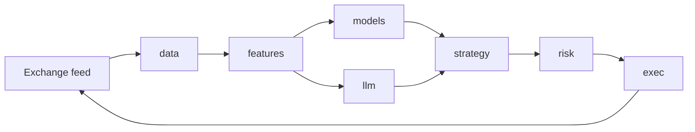

# Architecture — Crypto Trading Agent

> Draft scaffold. The architect agent fills this out after the analyst has
> produced initial product requirements and at least one feature brief.

## Workspace layout (proposed)

```
trading/
├── Cargo.toml            # virtual workspace
├── crates/
│   ├── core/             # package name: trading_core — domain types:
│   │                     # Symbol, Order, Position, Signal (see "Naming
│   │                     # conventions" for why the package is not `core`)
│   ├── data/             # market-data ingestion, storage, replay
│   ├── features/         # feature engineering, indicator library
│   ├── models/           # DL/ML models (candle/burn/tract) + training
│   ├── llm/              # LLM clients, prompt caching, tool schemas
│   ├── risk/             # risk engine, position sizing, kill switches
│   ├── strategy/         # strategy runtime, signal combination
│   ├── exec/             # exchange clients, order routing, paper-trade
│   ├── backtest/         # backtest engine (bin target: backtest)
│   ├── audit/            # double-entry ledger of decisions/orders/fills/PnL
│   ├── cost/             # cost telemetry — LLM tokens, infra, data feeds (Q4)
│   ├── ui/               # iced desktop app — ops cockpit + backtest viewer
│   │                     # (bin targets: cockpit, viewer)
│   └── agent/            # top-level orchestrator (bin target: trading)
```

## Naming conventions

### Crate package names vs stdlib collisions — confirmed 2026-04-17

The workspace's foundation crate carries the package name **`trading_core`**,
not `core`. Rust 2024's prelude imports resolve bare `core::` paths to the
stdlib `::core::` crate, but when a workspace member is *itself* named
`core` the two names collide inside any compilation unit that pulls it in
directly — most visibly in `rustdoc` doc-test harnesses and in macro-expanded
code that emits `::core::fmt` / `::core::write` (e.g. `thiserror::Error`).
A per-crate `doctest = false` escape hatch silences `cargo test -p <crate>`
but **does not** protect `cargo test --workspace --doc`, which bypasses the
flag and fails with `E0433` errors inside macro expansions.

**Rule:** no workspace member may take a package name that shadows a Rust
stdlib crate (`core`, `alloc`, `std`, `test`, `proc_macro`). The foundation
crate's package name is `trading_core`. Imports across the workspace read
`use trading_core::{Symbol, Order, …};`.

**Directory name:** the crate directory stays `crates/core/`. The package
name `trading_core` is what appears in `[package] name = ...` and in every
consumer's `[dependencies]`. The directory name does not affect imports or
collide with anything, and renaming it would force a touchy path update
across every `Cargo.toml` for a purely cosmetic gain. If later we want a
1:1 mapping between directory and package name we can rename the directory
in one PR — until then the single source-of-truth is the `[package] name`
field.

**Alternatives considered:**

- Keep `package = "core"` and rely on `trading_core = { package = "core" }`
  aliases in every consumer — the v0 developer tried this and it works for
  `--all-targets` but breaks `--doc`. It also fails open: a new Week 2 crate
  that forgets the alias compiles against the workspace `core` and then
  breaks in confusing ways only when `thiserror` or another macro emits a
  `::core::` path. Rejected.
- Keep `package = "core"` and add `doctest = false` workspace-wide — masks
  the failing gate instead of fixing it, and still leaves the alias trap.
  Rejected.
- Rename directory to `crates/trading_core/` in the same change — cleaner
  long-term, but the extra churn (git history, Cargo.lock, every consumer's
  `path = "../core"`) is not worth it against the single-knob rename in
  `[package] name`. Deferred; revisit only if the mismatch causes friction.


## Runtime

- `tokio` multi-thread.
- Actor-ish layout: each crate exposes an owned task with typed message
  channels (`tokio::sync::mpsc`). No shared mutable state across crates.

## Data flow



## ML / DL

_Architect: pick `candle` vs `burn` vs `tract`+ONNX once the first model is
chosen. Default assumption: `candle` for prototyping, ONNX via `tract` for
serving production-trained models._

## LLM integration

_Architect: define when LLMs are called (per-bar? per-regime-change? on-demand
tool use?), token budget, caching strategy. Starting assumption: LLM called on
regime-change events only, cached system prompt, tool-use for structured
signals._

## Risk engine

- Hard limits encoded in Rust types (can't compile an order that violates them).
- Kill switch file (`.halt`) + heartbeat.
- Daily P&L stop, per-symbol exposure cap, max drawdown stop.

## Strategy registry & hot-loading

Strategies are first-class plug-ins. The runtime owns a typed registry of
active strategies and routes data/signals through each.

### v0 — clean trait shape, no hot-load (compiled-in)

```rust
pub trait Strategy: Send + Sync {
    fn id(&self) -> StrategyId;
    fn on_bar(&mut self, bar: &Bar) -> Vec<Signal>;
    fn on_tick(&mut self, tick: &Tick) -> Vec<Signal>;
    fn config_schema() -> serde_json::Value where Self: Sized;
}
```

Strategies are compiled in. The registry is a
`HashMap<StrategyId, Box<dyn Strategy>>` populated at startup from
`config/agent.toml`. **This shape is the contract** — it does not change to
support hot-loading later. v0 ships only `sma_crossover`.

### v0.5 — config-driven composition (hot-load A)

A `ComposedStrategy` implements the `Strategy` trait; its body is a tree of
indicator + rule nodes assembled at runtime from TOML. Example:

```toml
[strategies.btc_macd_rsi]
kind   = "composed"
signal = "macd_cross(12,26,9) AND rsi(14) < 35"
size   = "fixed_fraction(0.1)"
```

A file watcher on `config/strategies/` reloads on change; the registry
swaps the `Box<dyn Strategy>` atomically. No process restart. This pattern
covers ~70-80% of research iteration without leaving Rust.

### v1+ — WASM plugins (hot-load B)

For strategies that need genuinely custom logic (custom DL inference,
non-trivial state machines, off-the-shelf research code from Python via
Pyodide), compile to WASM and load via `wasmtime`.
- **Sandboxed** — a buggy strategy cannot crash the agent or leak memory.
- **Language-agnostic** — Rust, AssemblyScript, eventually Python.
- Tradeoff: slight per-tick perf overhead vs compiled-in; deploy step per
  strategy.

### Explicitly NOT chosen

- **Native `.so` / `.dylib` via Rust dynamic libs** — the Rust ABI is
  unstable; subtle ABI-mismatch crashes in production.
- **Embedded scripting** (Rhai, Lua, Rune) — loses Rust's type-safety story
  and adds a parallel error-handling vocabulary.

### Lifecycle integration

Every strategy registry change (load, swap, unload, demote) emits a journal
entry to the audit ledger. Combined with the [strategy lifecycle gates in
product.md](product.md#strategy-lifecycle--promotion-gates), this means the
ledger always answers "which strategies were active when this trade fired?".

## Observability

- `tracing` with JSON output.
- Metrics via `metrics` + Prometheus exporter.
- Structured logs to `logs/` plus stdout.

## Performance budget

| Path                          | Budget      | Notes                           |
|-------------------------------|-------------|---------------------------------|
| Bar-close → signal (no LLM)   | < 5 ms p99  | Regression-tested in benches    |
| Bar-close → signal (with LLM) | < 500 ms p95| Only on regime-change triggers  |
| Backtest throughput           | > 100k bars/s | per symbol, single thread     |

## Foundation libraries

We pull in proven Rust crates rather than reinventing them. Default picks below;
the architect may override per-feature with rationale recorded here.

### Async, observability, errors
- `tokio` (multi-thread runtime), `tokio-stream`, `futures`
- `tracing`, `tracing-subscriber`, `metrics`, `metrics-exporter-prometheus`
- `thiserror` (libraries), `anyhow` (binaries only)
- `serde`, `serde_json`, `toml`, `config`

### Numerics & ML
- `rust_decimal` — **mandatory** for prices, sizes, balances, P&L. No `f64` for
  money, anywhere. (`6M+ downloads`, battle-tested).
- `ndarray`, `nalgebra` for general linear algebra.
- `polars` for in-memory DataFrame work and Parquet read/write.
- `candle` for DL prototyping; `tract` for ONNX serving.
- `linfa` for classical ML (regression, clustering) where heavier than RustQuant's `ml`.

### Money & currency types
Crypto doesn't fit ISO 4217 cleanly (BTC, USDT, stablecoins). We roll our own
`Money<C: Currency>` newtype around `rust_decimal::Decimal` in `core`, and use:
- `iso_currency` (or RustQuant's `iso`) for fiat sides only.
- Custom `Asset` enum for crypto symbols, sourced from venue metadata at startup.

Do **not** use generic money crates (`moneylib`, `moneta`, `cashmoney`) — they
assume ISO currency lists.

### Quant primitives — RustQuant ([avhz/RustQuant](https://github.com/avhz/RustQuant))
A free-time community crate; treated as a **helper, not a foundation**. Pin a
known-good version, vendor or fork if a module proves unstable. We adopt these
modules and ignore the rest:

| RustQuant module      | We use it for                                         | Lives in our crate |
|-----------------------|-------------------------------------------------------|--------------------|
| `math` (risk-reward)  | Sharpe, Sortino, Calmar, max drawdown, VaR, CVaR      | `risk`, `backtest` |
| `math` (distributions / FFT / quadrature) | Stats, characteristic functions, numerical integration | `features`, `models` |
| `math` (optimization) | Root finding, gradient descent for calibration tasks  | `models`           |
| `stochastics`         | Brownian / OU / CIR for synthetic data + Monte Carlo  | `backtest`, `data` (synthetic) |
| `time`                | Day counters, schedules, conventions for funding etc. | `core`             |
| `data`                | CSV / JSON / Parquet I/O helpers                      | `data`             |
| `iso`                 | Currency / MIC codes                                  | `core`             |
| `macros`              | `assert_approx_equal!` in tests                       | (dev-dep, all crates) |

**Explicitly NOT adopted from RustQuant:**

- `instruments` (bonds, options) — out of scope for spot crypto v0.
- `models` (rate / curve models) — fixed-income focus, not crypto.
- `ml` (linear/logistic regression, KNN) — too thin; use `linfa`/`candle`.
- `trading` (basic LOB) — we own our microstructure layer in `data` /
  `backtest`, and need it tuned for crypto venue quirks.
- `cashflows`, `portfolio` (RustQuant's) — replaced by our own typed
  primitives in `core` so risk limits are encoded in the type system.

**Risks of depending on RustQuant**
- Author flags it as a free-time project; API churn is likely.
- Mitigations: pin exact version, run their version through `cargo audit` /
  `cargo deny`, isolate behind thin adapter modules in our crates so a
  swap-out is a one-file change.

### Order book & matching engine

For paper-trade fills and high-fidelity backtests we need a credible LOB +
matching layer. A `MatchingEngine` trait in `backtest` isolates the choice so
the implementation can swap without touching `strategy` / `risk` / `exec`.

#### v0 decision — simple paper engine (no LOB) — confirmed 2026-04-17

v0's SMA emits only **bar-close market orders against 1m klines**. A full LOB
engine has no inputs that would exercise it and would consume the 2-week
budget. v0 ships a `PaperEngine` in `backtest` parameterized by:

- `slippage_bps` (default `2`) — buy fills at `bar.close * (1 + bps/10_000)`,
  sell fills at `bar.close * (1 − bps/10_000)`.
- `taker_fee_bps` (default `4`) — applied to notional, booked to
  `expense:fees:taker` per the ledger schema in `audit`.
- optional bar-VWAP fill price (toggle) for sensitivity runs.
- deterministic seeded RNG for any tie-break / jitter.

**Rationale:** scope fit — SMA has no limit orders, partial fills, or queue
position to model; shipping an LOB first would be speculative architecture.

**Alternatives considered:** `orderbook-rs` (lock-free, async), `matchcore`
(state-machine), `rust_ob` (minimal) — **deferred to v0.5** when limit orders,
IOC/FOK flags, and partial fills become real. Decision gate: v0.5 spike picks
one based on partial-fill fidelity, post-only / IOC / FOK support, and
slippage/fee hook cleanliness.

The trait is frozen now so swapping to an LOB implementation is an additive
change (`Box<dyn MatchingEngine>`), not a refactor.

### Technical analysis

Don't reinvent. Survey:

- `kand` — pure-Rust TA-Lib clone, breadth comparable to TA-Lib (default pick).
- `quantedge-ta` — streaming-first; important for live bars where we must update
  per-tick instead of per-bar. Likely complements `kand`.
- `rust_ti` — 70+ indicators if `kand` lacks any.
- `mantis-ta` — composable indicators + strategy primitives; evaluate as
  inspiration for our `features` crate API.

Plan: default `kand` (batch) + `quantedge-ta` (streaming), thin adapters in
`features`, no direct dependency from `strategy`.

### Pre-trade risk

- `openpit` — embeddable pre-trade risk SDK. Evaluate as an alternative to
  hand-rolling the risk crate. **Concern:** our risk engine relies on Rust
  *type-level* limits (illegal orders fail at construction). If `openpit` is
  runtime-checks-only, we use it as a second-line check, not the primary gate.

### Audit & ledger

The "every decision auditable" goal in [product.md](product.md) is implemented as
a **double-entry ledger** of decisions, intents, orders, fills, and P&L
attribution. Lives in a new `audit` crate.

#### v0 decision — `sqlx-ledger` on SQLite — confirmed 2026-04-17, re-signed 2026-04-17

**Choice:** `sqlx-ledger` with a SQLite backend is the v0 substrate. It is
the lighter-weight, embeddable sibling of `cala-ledger` and supports SQLite
out of the box via `sqlx`. Week 1 development verified the pick: the crate
integrates cleanly, the 13-account v0 chart of accounts bootstraps on
startup, and the T05 + T06 integration suite (5 tests covering account
list, cash-balance update on buy fill, idempotent bootstrap, per-transaction
debit/credit equality, and 100-fill cumulative equality) is green.

**Rationale:** single-binary deploy, zero ops, fits the `$20/month` hosting
line in [product.md → Cost economics](product.md#cost-economics--monthly-ceiling);
embedded SQLite WAL handles the v0 write rate (≤ a few hundred journal entries
per minute at 1m bars) trivially; backup = copy the file.

**Alternatives considered:**

- `cala-ledger` on Postgres — richer account hierarchy, but `cala-ledger`'s
  current releases are **Postgres-only** (its `Cargo.toml` pins the
  `sqlx/postgres` feature with no SQLite path). Adopting it would force
  Postgres as an ops dependency and break the single-binary deploy goal.
  **Deferred to v1+:** reconsider only if the hosted deployment moves off
  single-box (unlikely inside the $45/$135 ceilings in
  [product.md → Cost economics](product.md#cost-economics--monthly-ceiling))
  *and* `cala-ledger` still lacks a SQLite backend.
- Hand-rolled journal tables — rejected; we want an off-the-shelf double-entry
  model including balance invariants, not to reimplement them.

**Pinning + isolation:** pin a specific `sqlx-ledger` version and keep the
backend behind a thin `audit::backend` adapter so a future switch (to
`cala-ledger` if it gains SQLite, or to a hand-rolled tables implementation
if `sqlx-ledger` churns) is a one-file change. Do not expose the backend
type in `audit`'s public API — only the chart-of-accounts and journal
abstractions and the `audit::query` read-only surface.

#### v1+ migration path

If the hosted deployment moves off single-box, reconsider `cala-ledger`
**provided** it has by then gained a SQLite backend or we are willing to
take on Postgres. The `audit` crate's public API must not leak SQLite
(or sqlx-ledger) types, so the migration stays additive.

### Tick aggregation

- `trade_aggregation` — proven candle aggregator from raw trades. Adopt for the
  tick → OHLCV path in `data`; avoids a class of off-by-one bugs.

### Cost telemetry — dedicated `cost` crate — confirmed 2026-04-17

A standalone `cost` crate owns cost measurement and budget enforcement. In
v0 it ships empty (no LLM calls, no events emitted) but the full surface is
wired so v0.5+ drops calls in without moving code.

Shape:

```rust
pub enum CostEvent {
    Llm {
        provider: LlmProvider,
        model: String,
        tier: LlmTier,           // deep_think | quick_think
        role: AgentRole,         // trader, sentiment_analyst, ...
        tokens_in: u64,
        tokens_out: u64,
        tokens_cached_in: u64,
        usd: Decimal,
        correlation_id: Uuid,
    },
    Infra  { line: InfraLine, usd: Decimal, period: Month },  // v1+
    Data   { feed: FeedId,    usd: Decimal, period: Month },  // v1+
    Storage{ bytes: u64,      usd: Decimal, period: Month },  // v1+
}

pub trait CostSink: Send + Sync {
    fn record(&self, event: CostEvent) -> Result<(), CostError>;
}

pub struct CostBudget { /* ceiling + spent; rollup queries audit ledger */ }
impl CostBudget {
    pub fn remaining(&self) -> Decimal;
    pub fn mode_override(&self) -> Option<LlmTier>;  // auto-degrade @ 80%
}
```

A default `LedgerCostSink` (lives in `cost`, depends on `audit`) writes each
`CostEvent` as a journal entry against `expense:llm:<tier>` and an accrued
`liabilities:llm_accrued` contra. v0 posts zero entries; the accounts exist
in the chart of accounts (R3.2).

**Rationale:** cost will grow — LLM tokens, infra, data feeds, storage, per
[product.md → Cost economics](product.md#cost-economics--monthly-ceiling).
Starting as a standalone crate avoids a later extraction refactor. `cost`
depends on `core` + `audit`; `llm` depends on `cost` (at v0.5).

**Alternatives considered:**

- Keep under `llm` — cheap now, but forces an extraction once non-LLM cost
  lines appear (`infra`, `data`, `storage` already named in the ladder).
- Fold into `audit` — inverts the dependency direction; `audit` is a generic
  double-entry substrate and shouldn't know about OpenAI vs Anthropic.

### Frontend — iced ([iced-rs/iced](https://github.com/iced-rs/iced))

Single UI stack across the project. No mixing with `egui`/`tauri`/`dioxus`.

- `iced` — Elm-architecture (`Model` / `Message` / `update` / `view` /
  `Subscription`); GPU-accelerated via wgpu; multi-window.
- `iced_aw` — community widgets (date pickers, modals, tabs, badges).
- `plotters` with `plotters-iced` backend — equity curves, indicator overlays,
  drawdown plots in the backtest viewer. Architect to spike `plotters` vs
  hand-rolled `iced::widget::Canvas` for the live candlestick view before
  locking in.

#### Why iced fits

- **Subscriptions** wrap our `tokio::sync::mpsc` and `BroadcastStream` feeds —
  the existing actor pattern composes directly. No bespoke glue code.
- **Pure `update` functions** make every state mutation reviewable; matches
  the auditability goal in [product.md](product.md).
- **Multi-window** lets ops cockpit (real-time) and backtest viewer (offline)
  run as separate top-level apps in the same crate, sharing widgets.

#### App layout

| Binary       | Window(s)                       | Data source               |
|--------------|---------------------------------|---------------------------|
| `cockpit`    | Live ops, kill-switch, P&L, log | `agent` over IPC / shared store |
| `viewer`     | Backtest report + equity curve  | `spec/reports/` markdown + artifacts |

Both binaries live in the `ui` crate and depend only on `core` (types) and
`audit` (read-only ledger queries) — never on `strategy`, `exec`, or `models`.
This keeps the UI swappable without touching trading logic.

#### `audit::query` — the read-only surface for `ui` — confirmed 2026-04-17

`ui`'s ledger dependency is limited to a dedicated `audit::query` module that
exposes `Decimal` aggregates and slice iterators. No SQL string, no `sqlx`
type, and no mutable handle leaks into `ui`. Minimum surface for v0 (signatures
indicative):

```rust
pub mod audit::query {
    pub fn cash_balance(asset: Asset) -> Result<Money<Usdt>, QueryError>;
    pub fn position(asset: Asset) -> Result<Position, QueryError>;
    pub fn equity() -> Result<Money<Usdt>, QueryError>;
    pub fn realized_pnl_since(ts: Timestamp) -> Result<Money<Usdt>, QueryError>;
    pub fn unrealized_pnl() -> Result<Money<Usdt>, QueryError>;
    pub fn recent_fills(limit: usize) -> Result<Vec<FillView>, QueryError>;
    pub fn recent_journal(limit: usize) -> Result<Vec<JournalEntryView>, QueryError>;
}
```

`FillView` / `JournalEntryView` are `core`-defined read-side types (no crate
back-edge from `core` to `audit`). The cockpit P&L card calls `equity()` /
`realized_pnl_since()` / `unrealized_pnl()`; the live tape calls
`recent_fills()`. This makes the ledger — not a cockpit accumulator — the
single source of truth for P&L (locks R3.6 in the v0-paper-sma feature brief).

**Rationale:** approved per existing UI constraint, now made explicit and
signed.

**Alternatives considered:** duplicate P&L computation in `ui` for speed —
rejected; violates R3.6 and creates the exact reconciliation gap the
differentiator argues against.

#### Constraints

- Pin a specific iced version per workspace; do not chase releases mid-feature
  (iced API churns between minors).
- All copy lives in a `ui::strings` module so it can be reviewed for clarity
  and later localized.
- Color, spacing, and typography flow from a single `ui::theme` module — no
  ad-hoc styles inside widgets.
- Destructive actions (kill switch, close all positions, cancel all orders)
  require a confirm dialog with a typed-input safety phrase.
- Empty, loading, and error states are first-class for every view — no blank
  screens.

### Data / venues

- `reqwest` + `tokio-tungstenite` for REST and WebSocket feeds (crypto venues).
- `yahoo_finance_api` or `yfinance-rs` for the optional macro overlay
  (DXY, SPX, US10Y) — evaluate `yfinance-rs` first (newer, async, has streaming).
- `clap` for CLI binaries (`backtest`, `agent`).
- `chrono` vs `time` — pick one workspace-wide. RustQuant uses `time`; we
  default to `time` to avoid two date libraries.

#### v0 decision — hand-rolled Binance WS + `MarketDataSource` trait — confirmed 2026-04-17

For v0 we roll our own thin adapter against the Binance spot WebSocket using
`tokio-tungstenite` + `serde` + `reqwest` (for the one-shot symbol metadata /
exchange-info fetch). Two streams only:
`btcusdt@kline_1m` and `btcusdt@trade`. Reconnect with exponential backoff,
heartbeat via ping/pong, optional testnet endpoint. Everything is isolated
behind a `MarketDataSource` trait in `data` so the implementation is
swappable.

```rust
#[async_trait]
pub trait MarketDataSource: Send + Sync {
    /// Symbol metadata + filters fetched once at startup.
    async fn exchange_info(&self, symbol: Symbol) -> Result<SymbolInfo, FeedError>;

    /// Bar stream (kline, venue-closed bars only).
    async fn subscribe_bars(&self, symbol: Symbol, tf: Timeframe)
        -> Result<BoxStream<'static, Result<Bar, FeedError>>, FeedError>;

    /// Raw trade stream (aggregated @trade channel).
    async fn subscribe_trades(&self, symbol: Symbol)
        -> Result<BoxStream<'static, Result<Tick, FeedError>>, FeedError>;
}
```

Implementations in v0: `BinanceFeed`, `ReplayFeed` (drives the same trait off a
Parquet fixture for backtests and UI smoke), `FakeFeed` (in-memory for unit
tests). The `MarketFeed` requirement in v0-paper-sma R1 is the consumer view
of this trait.

**Rationale:** the v0 need is two Binance streams — the surface is small
enough (~200 lines of serde + a reconnect loop) that an external dep trades
away more (version churn, feature creep, audit surface) than it saves. The
crate is cleanly deletable once v0.5 multi-venue drives a real adapter pick.

**Alternatives considered:**

- `binance-rs-async` — Binance-only, async, reasonable quality, but pulls
  REST + margin/futures endpoints we don't use and has historically slow
  release cadence on upstream venue changes. Good fallback if the hand-rolled
  adapter slips week 1.
- `barter-data` (from the `barter` ecosystem) — **strong v0.5 candidate**:
  normalized multi-venue streams (Binance/Coinbase/Kraken), converts into a
  single `MarketEvent` type, streaming-first. Overkill for v0's single venue,
  but revisit in v0.5 when ETHUSDT + Coinbase land per
  [product.md → Universe & data fidelity ladder](product.md#universe--data-fidelity-ladder).
- `ccxt-rs` — CCXT port, broad venue list, but historically thin surface
  and uneven async support. Rejected.
- Full hand-rolled with no trait — rejected; the trait is cheap insurance
  against venue lock-in and is the only thing the `strategy` / backtest
  code sees.

**Deletion criterion for v0.5:** when a second venue (Coinbase) enters the
universe, re-evaluate: pick `barter-data` if it still cleanly maps to
`MarketDataSource`, else write a second hand-rolled adapter.

**Explicitly NOT adopted from lib.rs/finance:**
- FIX engines (`easyfix`, `fixer`, `quickfix`) — crypto venues are REST/WS, not FIX.
- `databento` / `dbn` — institutional equities/futures data, paid, out of scope.
- `sec-fetcher`, equity-only data clients — not crypto.
- Personal finance ledgers (`rustledger`, `tackler`, `aledgr`, `hledger-fmt`).
- `async-stripe`, `mt940`, `ofx-rs` — payments / bank statements, unrelated.
- Options pricing crates (`black_scholes`, `volsurf`, `optionrs`, `implied-vol`,
  `stock-options`) — out of scope until/unless we trade derivatives.
- `simm-rs` — SIMM is for OTC bilateral margin, not us.
- `digifi`, `finquant`, `quantrs`, `alfars`, `finalytics` — unclear maturity;
  revisit if a specific need surfaces.

### LLM
- `anthropic-sdk` (or our own thin client around `reqwest` if the SDK lags)
- `async-openai` for OpenAI-compatible providers (covers OpenRouter, DeepSeek, LM Studio)
- Custom tool-use schema layer in `llm` crate

### Testing
- `proptest` for property tests on strategy invariants
- `criterion` for benchmarks
- `insta` for snapshot tests on prompt + report rendering

## Changelog

- 2026-04-17 (architect): initial scaffold.
- 2026-04-17 (architect): added Foundation libraries section; selected
  RustQuant modules `math` / `stochastics` / `time` / `data` / `iso` /
  `macros` as helpers, explicitly excluded fixed-income modules and the
  basic ML/portfolio/LOB modules; locked default crates for async, numerics,
  data, LLM, and testing.
- 2026-04-17 (architect): surveyed [lib.rs/finance](https://lib.rs/finance);
  added `rust_decimal` as mandatory, defined `Money<C: Currency>` strategy,
  added LOB/matching candidates (`orderbook-rs` / `matchcore` / `rust_ob`),
  TA picks (`kand` + `quantedge-ta`), `openpit` as second-line risk,
  an off-the-shelf double-entry ledger for the new `audit` crate (candidates
  then were `cala-ledger` and `sqlx-ledger`; see later changelog entry for
  the final pick), `trade_aggregation` for tick→bar,
  `yfinance-rs` for macro overlay, `time` chosen over `chrono` workspace-wide;
  flagged crypto exchange clients as a research gap; documented exclusions
  (FIX, equities data, options pricing, payments, personal-finance ledgers).
- 2026-04-17 (architect): selected [iced](https://github.com/iced-rs/iced)
  as the single UI stack; added `ui` crate with two binaries
  (`cockpit` live ops, `viewer` backtest); locked design constraints
  (`ui::strings`, `ui::theme`, confirm dialogs on destructive actions,
  first-class empty/loading/error states); UI depends only on `core` + read-only
  `audit`, never on trading logic.
- 2026-04-17 (architect): added Strategy registry & hot-loading section.
  v0 ships compiled-in `Strategy` trait with plug-in-shaped registry;
  v0.5 adds config-driven `ComposedStrategy` (file-watcher hot-swap);
  v1+ adds WASM plugins via `wasmtime`. Native dynamic libs and embedded
  scripting explicitly rejected. Registry mutations journal to audit ledger.
- 2026-04-17 (architect): resolved the five v0-paper-sma open questions from
  the analyst brief. Q1 matching engine: v0 ships a simple `PaperEngine`
  (bps slippage + taker fee + optional bar-VWAP) behind a `MatchingEngine`
  trait; full LOB deferred to v0.5. Q2 audit backing store: `sqlx-ledger` on
  SQLite for single-binary deploy (cala-ledger requires Postgres in current
  releases); migrate at v1+ if hosting shape changes. Q3 UI → audit: approved
  and made explicit via a new `audit::query` read-only module exposing
  `Decimal` aggregates / slice iterators; ledger is the single source of
  truth for P&L (no cockpit accumulator). Q4 cost location: dedicated `cost`
  crate added to the workspace map with `CostEvent` / `CostSink` /
  `CostBudget` surface; v0 wires the scaffold with zero emitters. Q5 crypto
  exchange client: hand-rolled Binance WS adapter on `tokio-tungstenite`,
  isolated behind a `MarketDataSource` trait with `BinanceFeed` / `ReplayFeed`
  / `FakeFeed` implementations; `barter-data` is the explicit v0.5 fallback
  once multi-venue lands.
- 2026-04-17 (architect): added Naming conventions section. Renamed the
  foundation crate package from `core` to `trading_core` workspace-wide to
  stop shadowing Rust stdlib `::core::` (Rust 2024); crate directory stays
  `crates/core/`. Replaces the per-consumer `trading_core = { package = "core" }`
  alias trap and unblocks `cargo test --workspace --doc`. See Week 1 test
  report [spec/reports/test-2026-04-17-1443-v0-paper-sma-week1.md](reports/test-2026-04-17-1443-v0-paper-sma-week1.md)
  section 7 (R-A).
- 2026-04-17 (architect): formally signed off `sqlx-ledger` on SQLite as the
  v0 audit-ledger substrate (supersedes the earlier candidate language).
  `cala-ledger` deferred to v1+ — reconsider only if hosted deployment moves
  off single-box *and* `cala-ledger` has gained a SQLite backend by then.
  Week 1 T05/T06 integration tests (5/5 green) confirm the pick.
- 2026-04-17 (developer): repair pass — updated chart-of-accounts count from
  10 to 13 (added `expense:infra`, `expense:data` per cost-telemetry scaffold;
  LLM accounts were already present). `cala-ledger` count in the v0 decision
  prose updated from 10 to 13.
