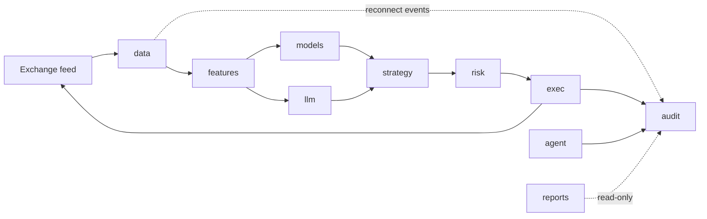

<!-- updated 2026-05-03 (architect) — v1.5b-multi-venue Design landing:
     largest queued backend feature. New closed enum
     `trading_core::Venue { Binance, Coinbase, Kraken }` lands as a
     load-bearing type with `#[serde(rename_all = "snake_case")]`;
     `Tick` and `Bar` gain required `venue: Venue` field (mechanical
     migration across ~30+ fixture sites — every existing literal
     defaults `Venue::Binance`). New `Timeframe::OneSecond` variant
     plus `crates/data/src/bar_aggregator.rs` for client-side 1s
     aggregation on `i64` epoch microseconds (deterministic). New
     `data::CoinbaseFeed` (Coinbase Advanced Trade WS) +
     `data::KrakenFeed` (Kraken WS v2) + `data::MockFeed` test
     harness. T612 finally lands — `BinanceFeed::subscribe_*_multi`
     using the combined-stream URL. New audit migration
     `007_strategy_events_venue.sql` (NULLABLE `venue TEXT` column
     on `strategy_events`); `audit::journal::feed_reconnect`
     signature gains required `venue: Venue` argument. New
     `EventBus::market_health: broadcast::Sender<MarketHealth>`
     channel (capacity 64) for the per-venue stale-data watchdog;
     `MarketHealth { Fresh, Stale, Recovered }` enum in
     `trading_core::venue`. `agent::runtime::run` spawns one
     `tokio::JoinSet` task per enabled venue (panic isolation —
     a Coinbase parser panic does NOT poison Binance / Kraken).
     New `[universe]` config section with `usdt_enabled` /
     `usdc_enabled` toggles + 10 USDC mirror pairs (operator
     opt-in). NO new external crate dep — all three feeds reuse
     `tokio_tungstenite` + `serde_json` + `reqwest`. NO `Cargo.toml`
     change. NO `unsafe`. **Anchor budget: 11 / 11 byte-identical**
     by construction (Q12: independent grep on
     `spec/reports/backtest-*.md` + `spec/reports/success/success-*.md`
     returned zero hits on `venue|coinbase|kraken`). Full delta
     in the new "v1.5b — multi-venue resolutions" subsection +
     changelog entry at the bottom. -->

<!-- updated 2026-05-03 (architect) — journal-transactions-metadata Design landing:
     adds new `trading_core::JournalTransactionMetadata` view struct
     (`transaction_id`, `ts`, `description`, `strategy_id`) in
     `crates/core/src/views.rs`; new `audit::query::journal_transaction_metadata`
     reader (single-row `SELECT id, ts, description, strategy_id FROM
     journal_transactions WHERE id = ?` returning `Option<JournalTransactionMetadata>`,
     `Ok(None)` for unknown tx_id); cockpit_live `Task::perform` closure at
     `crates/ui/src/bin/cockpit_live.rs:496-535` rewires from a partial
     `JournalTransactionView` construction to a sequential metadata→entries
     chain with Q6 error mapping (any-`Err` → `PanelState::Error`,
     metadata-`None` → "unknown transaction" error). Read-only additive feature
     off the anchored path — no migration, no new dep, no `Cargo.toml` change,
     no new theme/string/widget surface, no `unsafe`. 11/11 anchors stay
     byte-identical (R5). Full delta in the changelog entry at the bottom. -->

<!-- updated 2026-05-03 (architect) — tape-row-audit-modal Design landing:
     adds new `trading_core::JournalEntry` un-collapsed view struct
     (debit/credit pair, distinct from existing collapsed-amount
     `JournalEntryView`); new `audit::query::journal_entries_for_transaction`
     reader; new additive field `FillView::transaction_id: SmolStr` plus
     `Fill::transaction_id: Option<SmolStr>`; `audit::journal::post_fill`
     return type bumped from `Result<(), LedgerError>` to
     `Result<SmolStr, LedgerError>` (returns the generated
     `journal_transactions.id` for live-mode runtime to stamp on the
     bus-side `Fill` before fan-out); first cockpit modal — establishes
     `iced::widget::Stack` as the modal-overlay precedent for future
     click-through-to-audit drilldowns (positions, strategies); three
     additive theme tokens land (`bg_overlay`, `info`, `border_strong`)
     per the dark-mode hex in `ui-design-principles.md`. 11/11 anchors
     stay byte-identical (R12). Full delta in the tape-row-audit-modal
     architectural deltas subsection below + changelog entry at bottom. -->

<!-- updated 2026-05-01 (architect) — live-cockpit-unified Design landing:
     workspace-map adds `cockpit_live` bin under crates/ui; new public API
     `agent::runtime::run` (RunHandles, CancellationToken); deprecation of
     `cockpit --features live`; dep edge `ui → agent` now load-bearing for
     the unified bin. Full delta in the live-cockpit-unified architectural
     deltas subsection below + changelog entry at the bottom. -->

<!-- updated 2026-05-02 (architect) — real-mtm-unrealized-pnl Design landing:
     adds new `trading_core::OpenPosition` struct, new `audit::query::open_positions_at`
     reader, no new migration (Q3 no-index for v1+; conditional follow-up
     `006_open_positions_index.sql` only if V8 perf gate fails); 11 anchors
     stay byte-identical (Q4). R10 (post_fill BTC hardcode at
     `crates/audit/src/journal.rs:82,135`) explicitly DEFERRED to a follow-up
     brief `per-symbol-position-accounts.md`. -->

<!-- updated 2026-05-02 (ui-designer) — Frontend ↔ backend interfaces
     subsection added under `### Frontend — iced`. Documents the seven
     load-bearing surfaces between cockpit/viewer and the rest of the
     workspace: `Arc<EventBus>` (10 channels + backpressure policy),
     `audit::query` read-only API (15 read paths), `KillTripFn` closure
     (the sole operator → backend write surface, via `KillSwitch::trip`
     on the side-thread tokio runtime), `spec/reports/**/*.md` (viewer
     read path + file-naming convention), theme/strings/fixtures
     widget-side rules. Companion document
     `spec/ui-design-principles.md` lands the design-system rules. -->


# Architecture — Crypto Trading Agent

> Draft scaffold. The architect agent fills this out after the analyst has
> produced initial product requirements and at least one feature brief.

## Workspace layout (proposed)

```
trading/
├── Cargo.toml            # virtual workspace
├── crates/
│   ├── core/             # package name: trading_core — domain types:
│   │                     # Symbol, Order, Position, Signal (see "Naming
│   │                     # conventions" for why the package is not `core`)
│   ├── data/             # market-data ingestion, storage, replay
│   ├── features/         # feature engineering, indicator library
│   ├── models/           # DL/ML models (candle/burn/tract) + training
│   ├── llm/              # LLM clients, prompt caching, tool schemas
│   ├── risk/             # risk engine, position sizing, kill switches
│   ├── strategy/         # strategy runtime, signal combination
│   ├── exec/             # exchange clients, order routing, paper-trade
│   ├── backtest/         # backtest engine (bin target: backtest)
│   ├── audit/            # double-entry ledger of decisions/orders/fills/PnL
│   ├── cost/             # cost telemetry — LLM tokens, infra, data feeds (Q4)
│   ├── reports/          # v1+ operator success reports — read-only over audit
│   │                     # (lib + bin: report). Cron + on-kill-switch friendly.
│   ├── ui/               # iced desktop app — ops cockpit + backtest viewer
│   │                     # (bin targets: cockpit, cockpit_live, viewer)
│   └── agent/            # top-level orchestrator (bin target: trading;
│                         # lib also hosts agent::runtime::run shared by
│                         # cockpit_live — see live-cockpit-unified)
```

## Naming conventions

### Crate package names vs stdlib collisions — confirmed 2026-04-17

The workspace's foundation crate carries the package name **`trading_core`**,
not `core`. Rust 2024's prelude imports resolve bare `core::` paths to the
stdlib `::core::` crate, but when a workspace member is *itself* named
`core` the two names collide inside any compilation unit that pulls it in
directly — most visibly in `rustdoc` doc-test harnesses and in macro-expanded
code that emits `::core::fmt` / `::core::write` (e.g. `thiserror::Error`).
A per-crate `doctest = false` escape hatch silences `cargo test -p <crate>`
but **does not** protect `cargo test --workspace --doc`, which bypasses the
flag and fails with `E0433` errors inside macro expansions.

**Rule:** no workspace member may take a package name that shadows a Rust
stdlib crate (`core`, `alloc`, `std`, `test`, `proc_macro`). The foundation
crate's package name is `trading_core`. Imports across the workspace read
`use trading_core::{Symbol, Order, …};`.

**Directory name:** the crate directory stays `crates/core/`. The package
name `trading_core` is what appears in `[package] name = ...` and in every
consumer's `[dependencies]`. The directory name does not affect imports or
collide with anything, and renaming it would force a touchy path update
across every `Cargo.toml` for a purely cosmetic gain. If later we want a
1:1 mapping between directory and package name we can rename the directory
in one PR — until then the single source-of-truth is the `[package] name`
field.

**Alternatives considered:**

- Keep `package = "core"` and rely on `trading_core = { package = "core" }`
  aliases in every consumer — the v0 developer tried this and it works for
  `--all-targets` but breaks `--doc`. It also fails open: a new Week 2 crate
  that forgets the alias compiles against the workspace `core` and then
  breaks in confusing ways only when `thiserror` or another macro emits a
  `::core::` path. Rejected.
- Keep `package = "core"` and add `doctest = false` workspace-wide — masks
  the failing gate instead of fixing it, and still leaves the alias trap.
  Rejected.
- Rename directory to `crates/trading_core/` in the same change — cleaner
  long-term, but the extra churn (git history, Cargo.lock, every consumer's
  `path = "../core"`) is not worth it against the single-knob rename in
  `[package] name`. Deferred; revisit only if the mismatch causes friction.


## Runtime

- `tokio` multi-thread.
- Actor-ish layout: each crate exposes an owned task with typed message
  channels (`tokio::sync::mpsc`). No shared mutable state across crates.

## Data flow



### Crate dependency edges (runtime, non-test)

The arrows above are message / data flow. The Rust crate-graph
edges are a superset of those plus a few read-only sinks. Each
edge below is a `[dependencies]` line in some crate's `Cargo.toml`
and exists for one explicit reason:

- `data → audit` — the Binance reconnect handler calls
  `audit::journal::feed_reconnect` to journal feed-disconnect /
  reconnect events into the `strategy_events` table. Added in
  Wave 1 / T805 alongside the v1+ operator-success-reports
  feature. The reverse edge (`audit → data`) does not exist;
  audit is a pure sink.
- `exec → audit` — `post_fill` writes balance-affecting journal
  entries on every paper / live fill (existing v0 edge).
- `agent → audit` — kill-switch trips, uptime open / heartbeat /
  close intervals, strategy registry mutations all journal via
  `audit::journal::*` writers (v0 + v1+ additions).
- `reports → {trading_core, audit, data, cost}` — read-only
  consumers; no reverse edges (`crates/reports/` is leaf in the
  graph). v1+ addition.
- `ui → {trading_core, audit}` — read-only consumer of
  `audit::query` for the cockpit's live-view widgets; no reverse
  edge (audit knows nothing about UI).
- `ui → agent` (load-bearing under `--features live`) — the
  unified `cockpit_live` bin imports `agent` to call
  `agent::runtime::run(RunHandles, CancellationToken)` on a
  side-thread tokio runtime; constructs the shared
  `Arc<EventBus>` and `Arc<KillSwitch>` once and clones them
  into both the `RunHandles` and the `Cockpit` model. The same
  edge gates the iced `ui::live::subscription` against the real
  bus. Live-cockpit-unified (2026-05-01) made this a
  load-bearing edge — pre-feature it existed only for
  `cockpit --features live` (now retired). No reverse edge
  (`agent → ui` would be a cycle).
- Every crate depends on `trading_core` for shared domain types
  (`Symbol`, `Money<C>`, `FillView`, `JournalEntryView`,
  `StrategyEventView`, `FundingObs`, …); `trading_core` itself
  depends only on stdlib + `rust_decimal` + `time` + `smol_str`
  (no reverse edges).

The single rule: **audit is a sink** — it has zero outgoing
runtime deps to any sibling crate. Anything that needs to write
to the ledger imports `audit`; nothing that audit imports
imports back. This keeps the reconciler invariant
(Σ debits == Σ credits) provable from a single crate's source.

### Public API surface — bin-shared agent runtime (live-cockpit-unified)

When the `live-cockpit-unified` feature lands the `agent` crate
exposes a small public surface so the `trading` headless bin and
the `cockpit_live` unified bin can share one task-spawn loop:

```rust
// crates/agent/src/runtime.rs

pub struct RunHandles {
    pub config: Arc<crate::config::Config>,
    pub ledger: Arc<audit::Ledger>,
    pub bus: Arc<crate::EventBus>,
    pub kill_switch: Arc<crate::KillSwitch>,
    pub registry: Arc<strategy::StrategyRegistry>,
    pub boot_id: String,
}

pub async fn run(
    handles: RunHandles,
    cancel: tokio_util::sync::CancellationToken,
) -> anyhow::Result<()>;

pub async fn shutdown_writer(
    ledger: Arc<audit::Ledger>,
    boot_id: &str,
);
```

Caller responsibilities (both bins):
1. construct `RunHandles` (config + ledger + bus + kill_switch +
   registry + boot_id) before calling;
2. call `audit::journal::open_uptime_interval` before `run`;
3. install a Ctrl-C handler that calls `cancel.cancel()`;
4. after `run` returns Ok(), call `shutdown_writer` exactly once
   (it issues the T806 close-uptime row).

The `cockpit_live` bin additionally hosts the `tokio::runtime::Runtime`
on a side `std::thread::spawn`, runs iced on the main thread, and
threads the same `Arc<EventBus>` / `Arc<KillSwitch>` into the iced
`Cockpit` model so the cockpit's `Message::KillConfirmed` arm calls
`KillSwitch::trip(HaltReason::ManualOperator)` on the *same*
kill switch the agent owns (closes the analyst-flagged
trip-button-no-op gap). T809 dual-write is preserved by sticky-trip
semantics in `KillSwitch::trip`.

The headless `trading` bin uses the same `agent::runtime::run`
verbatim — it just runs everything on a `#[tokio::main]` runtime
and doesn't open a window.

**Bus producer wiring (live-cockpit-unified):** the `EventBus`
publisher API was always present (`crates/agent/src/bus.rs`
lines 116–166); but pre-feature, only the strategy watcher called
into it. The unified-binary feature wires three additional
producers:
- `crates/exec/src/paper.rs::PaperEngine` publishes `fills` +
  `positions` after each post_fill (via a new
  `exec::publisher::FillPublisher` trait — keeps the
  `exec → agent` cycle open by abstracting the bus type).
- `crates/agent/src/runtime.rs` runs two `tap` tasks that
  republish each `Bar` and `Tick` from the data feed into
  `bus.publish_bar` / `bus.publish_tick`.
- `crates/agent/src/reconciler.rs::ReconcilerTask::after_bar_close`
  publishes `pnl`.
- A new `mode-broadcast forwarder` task in `agent::runtime::run`
  bridges `KillSwitch::subscribe()` → `bus.publish_mode(...)` so
  the cockpit's halted banner lights up after any trip path
  (file watch, cockpit button, heartbeat timeout).

The bus + kill_switch shapes are unchanged — only the producer
side gained call sites.

### Public API surface — open-positions reader (real-mtm-unrealized-pnl)

Added 2026-05-02 as part of the
[real-mtm-unrealized-pnl](features/real-mtm-unrealized-pnl.md)
plumbing feature. Closes the
`crates/reports/src/lib.rs:135–150` `let unrealized: Decimal =
Decimal::ZERO;` placeholder.

```rust
// crates/core/src/position.rs (NEW)
#[derive(Debug, Clone, PartialEq, Eq)]
pub struct OpenPosition {
    pub symbol:         Symbol,
    pub qty:            Decimal,            // > 0 (long-only at v1+)
    pub avg_cost_basis: Money<Usdt>,        // PER-UNIT cost, not notional
    pub opened_at:      Timestamp,
    pub strategy_id:    Option<StrategyId>, // T802 column; None pre-T802
}

// crates/audit/src/query.rs (additive)
pub async fn open_positions_at(
    ledger: &Ledger,
    ts:     Timestamp,
) -> Result<Vec<OpenPosition>, LedgerError>;
```

`OpenPosition` lives in `trading_core` for cross-crate reach:
`audit::query` produces it; `crates/reports/` consumes it; the
post-T903c cockpit positions widget will likely consume it next.
The reader parses the symbol from
`journal_transactions.description` via the existing private
`extract_symbol_from_description` helper at
`crates/audit/src/query.rs:512` — same parser `pnl_by_symbol`
and `recent_fills` use. **No SQL migration in this feature**
(Q3); a conditional follow-up `006_open_positions_index.sql`
ships only if the V8 perf gate (<100ms on 100 fills + 5 open
positions) fails.

Sort key: `(symbol ASC, strategy_id ASC, None last)` for
byte-identical re-reads (R6). Long-only at v1+; net-negative qty
raises `LedgerError::Database` (Q8 — short positions bundled
into a future v2+ wave).

### Audit migration list — current

| # | File | Purpose |
|---|------|---------|
| 001 | `001_chart_of_accounts.sql` | Tables `accounts`, `journal_transactions`, `journal_entries`; `idx_entries_{account,ts,txn}`. |
| 002 | `002_strategy_events.sql` | `strategy_events` table (v0.5 Q1). |
| 003 | `003_funding_rates.sql` | `funding_rates` table (v1 Q2). |
| 004 | `004_journal_transactions_strategy_id.sql` | T802: nullable `strategy_id TEXT` column on `journal_transactions` + `journal_transactions_sid_idx`. |
| 005 | `005_uptime_intervals.sql` | T805/806: `agent_uptime` table for boot/heartbeat/close intervals. |
| 006 | `006_per_symbol_position_accounts.sql` | T1101 (per-symbol-position-accounts R1): purely additive `INSERT OR IGNORE` of one `assets:position:<SYMBOL>` row per pair-symbol in `config/agent.toml [funding].universe` (10 symbols). No schema change. Reclaims the `006` slot (the real-mtm `006_open_positions_index.sql` was conditional on V8 perf-gate failure; gate PASSED at 0.287ms vs 100ms, so the index migration never landed). |
| 007 | `007_strategy_events_venue.sql` | T1402 (v1.5b multi-venue Q11): purely additive `ALTER TABLE strategy_events ADD COLUMN venue TEXT;` (NULLABLE, no default). Pre-migration rows have `venue = NULL`; readers handle `Option<Venue>` semantics. Writer signature change at `crates/audit/src/journal.rs:648` — `feed_reconnect(ledger, symbol, venue, ts)` gains required `venue: Venue`. `kill_switch_tripped` writer gains optional `venue: Option<Venue>` (R8.3). Architect's principled override of analyst's R8.2 recommendation (encode-in-`error_summary`) — the typed column wins because v1.5b is the load-bearing introduction of the `Venue` type, and audit is the boundary where typed attribution matters most. |

The real-mtm R10 follow-up (the hardcoded `assets:position:BTC`
account-id at `crates/audit/src/journal.rs:82,135` — every fill
regardless of symbol writing to the BTC bucket) is **resolved**
by [features/per-symbol-position-accounts.md → Design](features/per-symbol-position-accounts.md#design)
(architect 2026-05-03): migration `006` seeds per-pair
`assets:position:<SYMBOL>` rows; T1102 flips the `post_fill` writer
to `format!("assets:position:{}", fill.symbol)`. Description-parse
in `audit::query::open_positions_at` / `pnl_by_symbol` /
`recent_fills` stays as the primary symbol source (legacy-row
compat); a defensive `account_id` cross-check warns on mismatch.
`bootstrap::seed_universe_accounts` is marked `#[deprecated]`
(shape mismatch — takes base assets, not pair symbols). Anchor
budget unchanged (11 / 11 byte-identical, Q7 re-verified).

## ML / DL

_Architect: pick `candle` vs `burn` vs `tract`+ONNX once the first model is
chosen. Default assumption: `candle` for prototyping, ONNX via `tract` for
serving production-trained models._

## LLM integration

_Architect: define when LLMs are called (per-bar? per-regime-change? on-demand
tool use?), token budget, caching strategy. Starting assumption: LLM called on
regime-change events only, cached system prompt, tool-use for structured
signals._

## Risk engine

- Hard limits encoded in Rust types (can't compile an order that violates them).
- Kill switch file (`.halt`) + heartbeat.
- Daily P&L stop, per-symbol exposure cap, max drawdown stop.

## Strategy registry & hot-loading

Strategies are first-class plug-ins. The runtime owns a typed registry of
active strategies and routes data/signals through each.

### v0 — clean trait shape, no hot-load (compiled-in)

```rust
pub trait Strategy: Send + Sync {
    fn id(&self) -> StrategyId;
    fn on_bar(&mut self, bar: &Bar) -> Vec<Signal>;
    fn on_tick(&mut self, tick: &Tick) -> Vec<Signal>;
    fn config_schema() -> serde_json::Value where Self: Sized;
}
```

Strategies are compiled in. The registry is a
`HashMap<StrategyId, Box<dyn Strategy>>` populated at startup from
`config/agent.toml`. **This shape is the contract** — it does not change to
support hot-loading later. v0 ships only `sma_crossover`.

### v0.5 — config-driven composition (hot-load A)

A `ComposedStrategy` implements the `Strategy` trait; its body is a tree of
indicator + rule nodes assembled at runtime from TOML. Example:

```toml
[strategies.btc_macd_rsi]
kind   = "composed"
signal = "macd_cross(12,26,9) AND rsi(14) < 35"
size   = "fixed_fraction(0.1)"
```

A file watcher on `config/strategies/` reloads on change; the registry
swaps the `Box<dyn Strategy>` atomically. No process restart. This pattern
covers ~70-80% of research iteration without leaving Rust.

### v1+ — WASM plugins (hot-load B)

For strategies that need genuinely custom logic (custom DL inference,
non-trivial state machines, off-the-shelf research code from Python via
Pyodide), compile to WASM and load via `wasmtime`.
- **Sandboxed** — a buggy strategy cannot crash the agent or leak memory.
- **Language-agnostic** — Rust, AssemblyScript, eventually Python.
- Tradeoff: slight per-tick perf overhead vs compiled-in; deploy step per
  strategy.

### Explicitly NOT chosen

- **Native `.so` / `.dylib` via Rust dynamic libs** — the Rust ABI is
  unstable; subtle ABI-mismatch crashes in production.
- **Embedded scripting** (Rhai, Lua, Rune) — loses Rust's type-safety story
  and adds a parallel error-handling vocabulary.

### Lifecycle integration

Every strategy registry change (load, swap, unload, demote) emits a journal
entry to the audit ledger. Combined with the [strategy lifecycle gates in
product.md](product.md#strategy-lifecycle--promotion-gates), this means the
ledger always answers "which strategies were active when this trade fired?".

### v0.5 — strategy-event journal schema (Q1) — confirmed 2026-04-19

**Decision:** dedicated `strategy_events` SQLite table, written by a new
`audit::journal::strategy_event(..)` function inside the same `sqlx`
transaction machinery used for fills. **Not** reused into `journal_entries`.

**Rationale:** `journal_entries` is the double-entry ledger — rows carry
debit / credit money amounts and reconcile to `Σ debits == Σ credits` per
transaction. Strategy lifecycle events (load / swap / unload / reject)
carry no money — they are operator / system events. Mixing them via a
`kind` discriminator column forces every consumer of `journal_entries`
to filter, complicates the reconciler's invariant proof, and muddies
future non-monetary events (kill-switch trips, mode changes, cost-budget
alerts). A sibling table with its own schema is the cleanest expression
of the two-kinds-of-thing distinction.

The v0 `registry_event` function currently writes zero-amount memo rows
into `journal_entries` against `equity:opening_balance`. v0.5 replaces
that path with `strategy_event` writes to the new table; the old memo
rows remain in the ledger as history. No schema migration is needed for
the existing table.

**Schema** (`migrations/0003_strategy_events.sql`, approximate):

```sql
CREATE TABLE strategy_events (
    id            TEXT PRIMARY KEY,       -- uuid v4
    ts            TEXT NOT NULL,          -- RFC3339
    kind          TEXT NOT NULL,          -- 'Load' | 'Swap' | 'Unload' | 'Reject'
    strategy_id   TEXT,                   -- nullable for Reject when id unparsable
    old_hash      TEXT,                   -- sha256 hex, 64 chars
    new_hash      TEXT,                   -- sha256 hex, 64 chars
    source_path   TEXT,                   -- repo-relative
    operator      TEXT NOT NULL DEFAULT 'system',
    error_code    TEXT,                   -- Reject only
    error_summary TEXT                    -- Reject only, short human message
);
CREATE INDEX strategy_events_ts_idx ON strategy_events(ts);
CREATE INDEX strategy_events_sid_idx ON strategy_events(strategy_id, ts);
```

**Writer** (in `audit::journal`):

```rust
pub enum StrategyEventKind { Load, Swap, Unload, Reject }

pub struct StrategyEventWrite<'a> {
    pub kind:          StrategyEventKind,
    pub strategy_id:   Option<&'a str>,
    pub old_hash:      Option<&'a str>,
    pub new_hash:      Option<&'a str>,
    pub source_path:   &'a str,
    pub operator:      &'a str,          // "system" in v0.5
    pub error_code:    Option<&'a str>,
    pub error_summary: Option<&'a str>,
}

pub async fn strategy_event(
    ledger: &Ledger,
    write: StrategyEventWrite<'_>,
) -> Result<(), LedgerError>;
```

**Reader** (in `audit::query`, `Decimal`/core-types-only contract):

```rust
pub async fn strategy_events_since(
    ledger: &Ledger,
    ts: Timestamp,
) -> Result<Vec<StrategyEventView>, LedgerError>;

pub async fn strategy_history(
    ledger: &Ledger,
    id: StrategyId,
) -> Result<Vec<StrategyEventView>, LedgerError>;
```

`StrategyEventView` is defined in `trading_core` alongside `FillView` /
`JournalEntryView` (no back-edge from `trading_core` to `audit`).

**Reconciliation invariant (unchanged):** the minute-boundary reconciler
walks `journal_entries` only. `strategy_events` rows do not affect
`Σ debits == Σ credits`. v0.5 test T214 (see
[spec/tasks/v05-composed-strategies.md](tasks/v05-composed-strategies.md))
asserts that running R7 + R8 integration cycles leaves the reconciler
at zero imbalance.

**Alternatives considered:**

- Reuse `journal_entries` with an `entry_kind` column plus a CHECK
  constraint — rejected; conflates balance-carrying and metadata rows,
  poisons the reconciler query, and turns a clean double-entry story
  into a filter discipline that a future developer will forget.
- Single-table polymorphism via sparse nullable metadata columns on
  `journal_entries` — rejected on the same grounds plus index bloat.

### v0.5 — registry concurrency (Q2) — confirmed 2026-04-19

**Decision:** `parking_lot::RwLock<HashMap<StrategyId, Box<dyn Strategy>>>`
for the v0.5 `StrategyRegistry`. No new dep (`parking_lot` is already
workspace-pulled). Hot path takes a read guard; the file-watcher task
takes a write guard only during swap.

**Rationale:** at 1m bar cadence the read frequency is ≤ a few per second
across all active strategies. Writes are rare (file edit → debounce →
parse → construct → swap; order of once per minute at worst during
research iteration). `parking_lot::RwLock` gives us sub-microsecond
acquire in the uncontended case, stdlib-shaped API, zero new
dependencies, and zero async-await inside the hot path — the agent's
`on_bar` fan-out stays blocking-free around the registry read.

Async-aware `tokio::sync::RwLock` is also acceptable if the hot path
later grows an `.await` point around the registry read. v0.5 does not —
`Strategy::on_bar` is a sync `&mut self` method, and the registry read
happens inside `StrategyRegistry::on_bar` which is itself sync — so
`parking_lot` is the correct instrument.

**Alternatives considered:**

- `arc-swap::ArcSwap<HashMap<..>>` lock-free hot-swap — overkill for 1m
  cadence; adds a dep and a cognitive overhead for readers familiar
  with lock semantics. Revisit in v1+ only if a tick-latency strategy
  pushes contention into the microsecond budget.
- `tokio::sync::RwLock` — introduces an unnecessary `.await` into the
  bar-close path at current trait shape. Stop-gap if we later migrate
  `Strategy::on_bar` to async.
- `std::sync::RwLock` — fine semantically; we pick `parking_lot` for
  the faster uncontended path and already-present workspace
  dependency.

### v0.5 — ComposedStrategy exit policy (Q3) — confirmed 2026-04-19

**Decision:** symmetric signal-flip only — when the rule transitions
`true → false` the strategy emits `Sell` to close. No drawdown-triggered
exit lives inside `ComposedStrategy`.

**Rationale:** a per-strategy drawdown clamp is a **risk** concern, not a
**strategy** concern. Putting it in each composed rule tree duplicates
state (last-high, drawdown counter) N-ways and makes the rule DSL less
orthogonal. The `risk` crate already owns `size_and_validate` (v0 R4.5)
and the portfolio-level `max_drawdown_stop_pct` floor; a per-strategy
drawdown limit is a natural extension — but it belongs on the
risk-limits struct, not inside the signal tree. Deferred to v1+ when
live-paper drawdowns surface as a real problem worth building for.

v0.5 `ComposedStrategy` therefore emits buy on `false → true` and sell
on `true → false`, matching v0 `sma_crossover` edge-triggered semantics.

**v1+ hook:** `risk::RiskLimits` grows an optional
`max_strategy_drawdown_pct: Option<Decimal>` field; `risk::size_and_validate`
clamps to zero (and emits a `StrategyRiskTripped` audit event) when a
specific strategy's cumulative drawdown passes the limit. Leave a
`// TODO(v1): max_strategy_drawdown` breadcrumb in the v0.5 Design section
so the developer does not invent the feature in v0.5.

**Alternatives considered:**

- Ship drawdown-triggered exit inside `ComposedStrategy` in v0.5 — bloats
  the rule tree, forces state into every node, and duplicates a risk
  concern. Rejected.
- Make it a first-class DSL node (`if drawdown(20) > 0.05 then close`) —
  possible but premature; commit after seeing real drawdown patterns in
  v1 paper trading.

### v0.5 — cockpit strategies panel layout (Q4) — confirmed 2026-04-19

**Decision:** **right column, above "Open positions"**, in a new
`StrategiesPanel` widget. The existing cockpit left column (P&L card,
latency badge, "Stop trading" button) is action-oriented; the right
column (Open positions, Live tape) is observation-oriented. Strategies
are observation-oriented (which strategies are running, what was the
last swap, how many signals in the last 60s) and pair naturally with
positions (what strategies produced the current book).

```
┌──────────────────────────────────┬─────────────────────────────────────┐
│  P&L                             │  Strategies (v0.5 new)              │
│  Feed latency                    │  Open positions                     │
│  Stop trading (destructive)      │  Live tape                          │
└──────────────────────────────────┴─────────────────────────────────────┘
```

**Rationale:** co-locating the passive strategies panel with a
destructive action (kill switch) crowds the decision surface and
creates visual competition between "look at this" and "do this".
Keeping the kill switch the biggest thing in the left column protects
the operator's muscle memory from v0.

Final widget composition (column widths, row heights, padding) is
ui-designer's call; architect only fixes the panel's position in the
column layout and the Model / Message surface (see
[v0.5 design in the feature file](features/v05-composed-strategies.md#design)).

**Alternatives considered:**

- Left column next to kill switch (analyst's initial suggestion) —
  rejected on visual-crowding grounds above.
- Full cockpit re-wireframe — rejected; v0 layout is stable and the
  operator has muscle memory on the four existing panels. Additive
  placement keeps cognitive load low.
- Separate top-level window — rejected; the strategies panel is part
  of the cockpit's live view, not a standalone tool (`viewer` binary
  is for offline reports).

### v0.5 — broadcast bus extensions (Q5) — confirmed 2026-04-19

**Decision:** the three new message types — `StrategyLoaded`,
`StrategySwapped`, `StrategyLoadError` — live in `trading_core`
alongside `Fill`, `Bar`, `PnlSnapshot`. The `agent::EventBus` (see
[dev-week2-broadcast-api-2026-04-18.md](reports/dev-week2-broadcast-api-2026-04-18.md))
gains three new `broadcast::Sender`/`Receiver` pairs, same pattern as
the existing `fills` / `positions` / `bars` / `ticks` / `pnl` / `mode`
channels.

**Rust sketch** (in `trading_core`):

```rust
#[derive(Debug, Clone, Serialize, Deserialize)]
pub struct StrategyLoaded {
    pub id:          StrategyId,
    pub hash:        [u8; 32],        // sha256 of canonicalized AST
    pub source_path: SmolStr,
    pub ts:          Timestamp,
}

#[derive(Debug, Clone, Serialize, Deserialize)]
pub struct StrategySwapped {
    pub id:          StrategyId,
    pub old_hash:    [u8; 32],
    pub new_hash:    [u8; 32],
    pub source_path: SmolStr,
    pub ts:          Timestamp,
}

#[derive(Debug, Clone, Serialize, Deserialize)]
pub struct StrategyLoadError {
    pub source_path:   SmolStr,
    pub strategy_id:   Option<StrategyId>,   // None if filename-stem unparsable
    pub error_code:    SmolStr,              // e.g. "unknown_indicator"
    pub error_summary: SmolStr,              // one-line human message
    pub ts:            Timestamp,
}
```

**Bus extension** (in `agent::EventBus`):

| Channel | Type | Capacity | Description |
|---|---|---|---|
| `strategy_loaded`  | `StrategyLoaded`      | 32  | Emitted on registry `Load`. |
| `strategy_swapped` | `StrategySwapped`     | 32  | Emitted on registry `Swap`. |
| `strategy_error`   | `StrategyLoadError`   | 32  | Emitted on registry `Reject`. |

**Backpressure:** identical to the v0 pattern —
`RecvError::Lagged(n)` triggers log-and-continue in the UI subscriber;
`RecvError::Closed` surfaces as a `STRATEGIES_CONNECTION_CLOSED`
panel-error copy. Capacity is small (32) because publish rate is
bounded by file-edit cadence.

**Why `trading_core`, not `agent`:**

- `audit::journal::strategy_event` also needs these types when it
  persists the events (it converts `StrategyLoaded` into a
  `strategy_events` row). Placing them in `agent` would force `audit`
  to depend on `agent`, inverting the existing `audit ← agent`
  dependency edge.
- `ui` (cockpit strategies panel) subscribes to the bus; types in
  `trading_core` are already imported.
- `trading_core` is upstream of every other crate; no cycle.

**Alternatives considered:**

- Put them in `agent` — creates the cycle above. Rejected.
- Put them in `strategy` — forces `audit` → `strategy`, wrong
  direction (audit should be a pure sink). Rejected.
- Put them in `audit` — same cycle problem, and ties the UI's
  broadcast-bus subscriber to the audit crate just to get a type.
  Rejected.

### v1 — cross-sectional momentum resolutions (Q1–Q6) — confirmed 2026-04-29

Six open questions from
[v1-cross-sectional-momentum.md → Notes](features/v1-cross-sectional-momentum.md#notes--open-questions-for-architect).
All resolutions preserve the v0 `Strategy` trait shape and the v0.5
audit / broadcast / strategies-panel surfaces.

#### v1 Q1 — L2 book ingest: **deferred to v1.5**

**Decision:** v1 ships **klines + trades only**, identical fan-out shape
to v0/v0.5. No L2 book ingest path in v1. The
[product.md → Universe & data fidelity ladder](product.md#universe--data-fidelity-ladder)
v1 entry mentioning "L2 + funding context" is **walked back to v1.5** —
v1's two stretches (multi-symbol + first edge-candidate strategy) are
already enough; L2 adds a third memory-and-fan-out vector that the
momentum score does not consume.

**Rationale:** the v1 momentum score (R3) is close-to-close vol-adjusted
return; depth has no inputs that would exercise it. Adding L2 in v1
would force a new bus channel, a new persistence schema, and ~10× the
per-bar serde cost for zero strategy benefit. Pushed to v1.5 alongside
the other ladder stretches (Coinbase / Kraken multi-venue, 1s
aggregated trades).

**Alternatives considered:**

- L2 as observation-only at v1 (analogous to Q2 funding) — rejected;
  L2 ingest cost is dominated by serde + storage, not poll cadence,
  so "observation only" still pays the full bill.
- Ship L2 in v1 because the ladder says so — rejected; the ladder is a
  goal sketch, not a delivery contract; v1 must remain shippable.

#### v1 Q2 — Funding-rate ingest: **observation-only at v1**

**Decision:** v1 wires the Binance USDT-perpetual funding-rate REST
endpoint as a **once-per-hour poller** in a new
`crates/data/src/funding.rs`, persists to a small `funding_rates`
SQLite table (sibling to `journal_entries`), and broadcasts on a new
`funding_obs` channel. The v1 `MomentumStrategy` does **not** consume
funding — the channel exists so v1.5+ strategies and the operator
success report can read funding history without a follow-up
ingest-path build.

**Why ship the path now (not in v1.5):**

- One cheap REST poll per hour per symbol — the cost is bounded and
  pre-priced into the v1 hosting line ($40/month, unchanged).
- Validates the cross-stream-rate (per-bar bars vs per-hour funding)
  ingest pattern that v1.5 multi-venue / 1s aggregation will need.
- Operator success reports (per
  [product.md → Operator success reports](product.md#operator-success-reports))
  can show a funding column once a UI feature lands without waiting on
  a future ingest spike.
- Zero impact on the bar-close → signal hot path (the channel is
  observation-only and the strategy does not subscribe).

**Schema** (new file
`crates/audit/migrations/003_funding_rates.sql` or a sibling DB —
**architect's call to keep it inside the same SQLite file** as
`journal_entries` to preserve "ledger = single file" property):

```sql
CREATE TABLE IF NOT EXISTS funding_rates (
    id              TEXT PRIMARY KEY,        -- uuid v4
    symbol          TEXT NOT NULL,           -- e.g. "BTCUSDT" (perp symbol; spot mapping in metadata)
    funding_ts      TEXT NOT NULL,           -- RFC3339 — venue-published funding timestamp
    funding_rate    TEXT NOT NULL,           -- Decimal as TEXT (8h rate, e.g. "0.00010000")
    next_funding_ts TEXT NOT NULL,           -- RFC3339 — next scheduled funding settlement
    poll_ts         TEXT NOT NULL            -- RFC3339 — when we polled (audit)
);
CREATE INDEX IF NOT EXISTS funding_rates_symbol_ts_idx
    ON funding_rates(symbol, funding_ts);
```

**New broadcast type** in `trading_core`:

```rust
#[derive(Debug, Clone, Serialize, Deserialize)]
pub struct FundingObs {
    pub symbol:          Symbol,           // perp symbol — operator should be aware of basis
    pub funding_rate:    Decimal,
    pub funding_ts:      Timestamp,
    pub next_funding_ts: Timestamp,
    pub poll_ts:         Timestamp,
}
```

`agent::EventBus` gains a `funding_obs` channel (capacity 32, same
backpressure semantics as `strategy_*`).

**Reader API** in `audit::query`:

```rust
pub async fn funding_rate_history(
    ledger: &Ledger,
    symbol: Symbol,
    since: Timestamp,
) -> Result<Vec<FundingObs>, LedgerError>;
```

**Alternatives considered:**

- Defer funding entirely to v1.5 alongside L2 — acceptable but punts on
  validating a cross-cadence ingest pattern that v1.5 will need
  regardless. The marginal cost of shipping the poller in v1
  (one tokio task, ~40 lines of REST client) is small.
- Build a perp-WS funding stream — rejected as overkill; funding rates
  publish at 8h cadence with a 1m forecast ticker; an hourly REST poll
  catches every settlement and the next-forecast value.

#### v1 Q3 — Long-only confirmed: **`K_long=3`, `K_short=0`** for v1

**Decision:** v1 ships **long-only spot momentum** explicitly in
`architecture.md` so future architect-rounds do not re-debate. The
analyst's `[ASSUMPTION]` (R4.3 in the v1 brief) is correct — spot
crypto on Binance / Coinbase / Kraken USDT pairs has **no native
short-sell mechanism**. Perp-based shorting belongs in v2 per the
[product.md → Universe & data fidelity ladder](product.md#universe--data-fidelity-ladder)
v2 row ("Top-25 perps (signal only, not exec)").

**Implication for the v1 strategy & risk surface:**

- `MomentumStrategy::on_bar` constructs `Vec<ProposedOrder>` with at
  most `K_long` `Side::Buy` legs, plus `Side::Sell` legs to close
  positions falling out of the top-K. **Never** `Side::Sell` to open a
  short.
- `risk::cross_sectional.k_short = 0` in the TOML schema; loader
  rejects `k_short > 0` with `unsupported_short_sizing` error code in
  v1. v1.5 may relax to "exclude these symbols from longs" semantics if
  the analyst pushes for it; perp-execution shorting waits for v2.

**Alternatives considered:**

- Ship `K_short` plumbing as "exclude from longs" in v1 — rejected;
  adds parser + sizer surface area for zero edge before the v1.5
  re-evaluation. Easier to add later than to remove.
- Allow synthetic shorts via inverse perps — out of scope per
  [product.md → Non-goals](product.md#non-goals) (no derivatives in v1).

#### v1 Q4 — Multi-venue: **single-venue (Binance) for v1**

**Decision:** v1 stays **Binance-only**. Multi-venue
(Coinbase + Kraken) is v1.5 scope. The
[universe ladder](product.md#universe--data-fidelity-ladder) v1 entry
("Top-10 USDT spot, 1m + L2 + funding context, +Kraken") is re-read as
the v1-series goal: v1 itself does the universe-size work,
v1.5 does venue multiplexing.

**Rationale:** each new venue is its own client + reconnect quirks +
fee schedule + symbol-name normalization (e.g. `BTCUSDT` on Binance
vs. `BTC-USD` on Coinbase vs. `XBT/USDT` on Kraken). v1's stretch is
multi-symbol determinism on a known venue; venue diversity is an
orthogonal stretch with its own reconciliation surface (per-venue
attribution in the ledger, cross-venue symbol mapping, latency
arbitrage controls).

**v1.5 trigger:** revisit when v1's cross-sectional momentum has
defensible Sharpe on Binance OOS. At that point the
`barter-data` v0.5 fallback (per
[Data / venues](#v0-decision--hand-rolled-binance-ws--marketdatasource-trait--confirmed-2026-04-17))
becomes the natural pick if it cleanly maps to `MarketDataSource`,
else a second hand-rolled adapter (Coinbase) lands first.

**Alternatives considered:**

- Ship Coinbase ingest in v1 alongside Binance — rejected; doubles the
  feed-test surface and forces premature decisions on cross-venue
  symbol normalization before the strategy has a defensible OOS number.
- Ship all three venues in v1 — rejected on the same grounds, harder.

#### v1 Q5 — Universe filtering: **strategy-side (pattern A)**

**Decision:** v1 strategies filter bars by symbol **internally** in
`Strategy::on_bar` rather than via a registry-level `interested_in()`
predicate. The registry's existing fan-out
(`StrategyRegistry::on_bar(&Bar) → Vec<Signal>`, see
[v0.5 strategy-event journal](#v05--strategy-event-journal-schema-q1--confirmed-2026-04-19))
is **unchanged** — every strategy sees every bar; out-of-universe bars
are a fast `match symbol { in_universe => …, _ => return Vec::new() }`
in the strategy.

**Rationale:** at v1 scale (10 symbols × 1m bars × ≤10 active
strategies), the constant cost of an `if !self.universe.contains(...)`
check is dominated by a single hash lookup per bar — sub-microsecond.
The trait stays minimal; no new method shape; v0 `sma_crossover` and
v0.5 `ComposedStrategy` continue to filter on `bar.symbol == self.symbol`
exactly as today.

**Trade-off:** registry-side filtering (pattern B) would save the
hash-lookup cost on out-of-universe bars at the cost of a new
trait method (`fn universe(&self) -> &[Symbol]`) and a two-stage
fan-out in the registry. The performance plan below
([Performance budget](#performance-budget) + R10.4) shows the v1 hot
path comfortably fits the 5ms p99 budget under pattern A; pattern B is
a future optimization if a tick-latency strategy ever stresses it.

**Implementation contract:** every multi-symbol `Strategy` impl
exposes `pub fn universe(&self) -> &SymbolSet` as an inherent method
(not a trait method) so the audit ledger and operator-success reports
can introspect it; the registry does not consume this method.

**Alternatives considered:**

- Pattern B (registry-side filtering with `fn universe()` trait method) —
  cleaner under heavy multi-strategy fan-out; rejected for v1 because
  the cost it saves is already inside budget. Promote in v2+ if a
  per-tick / per-microstructure strategy lands.
- Pattern C (hybrid: per-strategy `Vec<Symbol>` declared at registration,
  registry holds the index) — combines the worst of both (mutable
  registry index + strategy-side fallback for hot-loaded universe
  changes). Rejected.

#### v1 Q6 — `RebalanceRejected` ledger surface: **extend `strategy_events`**

**Decision:** add a new `kind = "rebalance_rejected"` variant to the
v0.5 `strategy_events` table (see
[v0.5 strategy-event journal](#v05--strategy-event-journal-schema-q1--confirmed-2026-04-19))
rather than create a parallel `decision_events` table.

**Rationale:** the existing schema already carries `error_code` /
`error_summary` columns and is operator-event-shaped. A rebalance
rejection is a **strategy-lifecycle event** (the strategy proposed an
action that the risk gate refused), not a money movement, so it
belongs alongside `Load` / `Swap` / `Unload` / `Reject`. A parallel
`decision_events` table would fork the schema for a single
non-monetary row type and complicate the operator success report's
"what happened to my strategies this week" query (it would need to
union two tables).

**No schema migration needed** — `strategy_events.kind` is a `TEXT`
column; v1 simply writes a new value. The reconciler invariant
(`Σ debits == Σ credits` over `journal_entries` only) is preserved
because `strategy_events` rows carry no money.

**v1 writer extension** (in `audit::journal`, additive):

```rust
pub enum StrategyEventKind {
    Load,
    Swap,
    Unload,
    Reject,
    RebalanceRejected,   // new in v1
}

// New helper, written from risk crate when vector validation rejects:
pub async fn rebalance_rejected(
    ledger: &Ledger,
    strategy_id: StrategyId,
    error_code: &str,           // e.g. "portfolio_exposure_breach"
    error_summary: &str,        // e.g. "proposed 0.55 > cap 0.50"
    ts: Timestamp,
) -> Result<(), LedgerError>;
```

**Reader extension** (in `audit::query`):

`strategy_history(id)` already returns all `strategy_events` rows for a
strategy. v1 callers use the `kind` field to filter to rebalance
rejections; no new reader method is required.

**Alternatives considered:**

- New `decision_events` table with one row per `Decision`
  (accepted + rejected) — rejected; doubles schema surface for one
  variant, and the v0 `Decision` model already lives in the audit log
  as the journaled fills' parent transaction (per v0
  `journal_transactions`). Rebalance rejections would be the only
  rows in `decision_events` that don't have a corresponding fill.
- Add a `kind` column with a CHECK constraint to `journal_entries` —
  rejected on the same grounds as v0.5 Q1: poisons the reconciler
  invariant and conflates monetary and metadata rows.

### v1.5a — mean-reversion pairs resolutions (Q1–Q10) — confirmed 2026-04-30

Ten open questions from
[v15a-mean-reversion-pairs.md → Notes](features/v15a-mean-reversion-pairs.md#notes--open-questions-for-architect).
All resolutions preserve the v0 `Strategy` trait shape, the v0.5
audit / broadcast / strategies-panel surfaces, and the v1
multi-symbol / vector-order / `pnl_by_symbol` infra. v1.5a is a
fourth `Strategy` impl plus thin additive helpers; **no schema
migration**.

#### v1.5a Q1 — Single brief vs split: **confirm split (Option B)**

**Decision:** v1.5a ships the **pairs strategy on the existing
Binance USDT universe only**. The sibling brief
`v15b-multi-venue-live-ingest` (queued) covers Coinbase + Kraken
adapters, T612 multi-symbol live `BinanceFeed`, USDC pairs, and 1s
aggregated trades.

**Rationale:** the strategy-edge claim is independent of venue
diversity. Bundling them couples two scopes that fail
independently — a pairs Sharpe miss should not block multi-venue
infra and a Coinbase reconnect bug should not block a pairs
backtest. The split halves per-brief surface and lets v1.5a ship
first.

**Alternatives considered:**

- Option A — single combined brief absorbing R13–R20+ for Coinbase /
  Kraken / USDC / 1s aggregated trades. Rejected on surface bloat
  and orthogonal failure modes.

#### v1.5a Q2 — Hedge ratio: **fixed β = 1.0** (with per-pair TOML override)

**Decision:** v1.5a uses **fixed β** read from the per-pair TOML
(default `1.0`). No rolling-OLS β estimator in v1.5a.

**Rationale:** rolling-OLS β adds (1) a new dependency (linear
regression with shrinkage to handle ill-conditioning during
low-variance windows), (2) a calibration-window choice that
confounds threshold tuning of `z_entry` / `z_exit`, and (3) a
look-ahead-bias surface (what window? overlapping with the lookback?
expanding vs rolling?) that v1.5a does not need to ship to test the
plumbing. β = 1.0 makes the spread a clean
`log(price_a) - log(price_b)` at large-cap crypto pair scales where
log-space hedge ratios are close to 1. The TOML knob (`beta = "0.92"`
etc.) lets the operator pin a per-pair fixed β if a 2022 fit
suggests one without re-shipping the strategy. Rolling-OLS β is
queued for **v1.5c** alongside any other parameter-estimator work.

**Alternatives considered:**

- Rolling-OLS β with shrinkage (Avellaneda-Lee canonical formulation) —
  rejected for v1.5a; adds estimator surface before the baseline is
  locked. Defer to v1.5c.
- Per-pair architect-pinned β (e.g. β_BTC_ETH ≈ 0.92 from a 2022 OLS
  fit) — accepted shape via TOML override; default stays 1.0 because
  the analyst's 3-pair default list (BTC-ETH, ETH-SOL, BNB-BTC) has
  no operator-known prior to pin.

#### v1.5a Q3 — Spot-only formulation: **C — observation-only short leg**

**Decision:** v1.5a ships **formulation C** — the spread / z-score
machinery computes signals for both legs of a pair, but **executes
long-only on the `a` leg** (the target leg per R1.1). The would-have-
shorted `b` leg is logged to the audit ledger as a
`pair_short_observation` event (Q8) — **no `Order` constructed**, **no
money moves**, but the audit trail captures the hypothetical short
notional so v2's perp executor can backfill the short-leg P&L from
history without re-deriving the spread layer.

**Rationale:** formulation C is the cleanest moat-bet move per
[product.md → Differentiator](product.md#differentiator) (auditable
double-entry + persistent memory). It (1) preserves the spread /
z-score logic for v2 perp expansion, (2) populates the audit ledger
with "hypothetical short" data immediately so v2 can compute
"what if we could short" P&L from history, (3) avoids conflating
the strategy primitive (signal generation) with the execution
constraint (spot vs perp). Formulation A (per-symbol z-score MR) does
not exercise pair plumbing and is wasted v1.5 scope; formulation
B (pair-switching long-only) executes at parity with C but loses
the short-leg observation trail.

**Alternatives considered:**

- A — long-flat single-symbol z-score MR. Rejected: doesn't exercise
  the pair plumbing the v1.5 roadmap entry exists to test; v0.5's
  `ComposedStrategy` already covers per-symbol mean-reversion via
  a Bollinger recipe.
- B — pure pair-switching, no observation event. Rejected: same
  execution surface as C but loses the v2 short-leg audit trail.
  C is a strict superset of B at the cost of two `strategy_events`
  rows per pair round-trip.

#### v1.5a Q4 — `pnl_by_pair` shape: **compose, no schema change**

**Decision:** new `audit::query::pnl_by_pair(pair_membership, since,
until)` reader **composes** existing `pnl_by_symbol` results with
the pair-membership map captured at strategy-load time. **No new
column on `Position` / `journal_entries`. No schema migration.**

**Signature** (in `crates/audit/src/query.rs`, additive):

```rust
pub async fn pnl_by_pair(
    ledger:           &Ledger,
    pair_membership:  &[PairMembership],   // (PairKey, traded_a_asset)
    since:            Timestamp,
    until:            Timestamp,
) -> Result<Vec<(PairKey, Money<Usdt>)>, LedgerError>;
```

`PairKey` is the `(Symbol, Symbol)` tuple of `(a, b)` (insertion
order; `(BTC, ETH)` and `(ETH, BTC)` are distinct because the `a`
leg is the traded one). `PairMembership` carries the `(PairKey,
Asset)` for the traded leg so the query can route the per-asset
`pnl_by_symbol` value to the right pair row.

**Implementation:** internally calls `pnl_by_symbol(since, until)`
once, then walks `pair_membership` and projects per-asset P&L into
per-pair rows. Because v1.5a never trades the `b` leg, the invariant
`pnl_by_pair[(a, b)] == pnl_by_symbol[a]` holds for every active pair
(R6.2, R6.3). Result rows with zero realized P&L are omitted. Rows
sorted by `(a, b)` lexicographically.

**Rationale:** v1.5a never trades the `b` leg, so the P&L genuinely
lives under `assets:position:<a-asset>` — no cross-symbol allocation
problem. A `pair_id` schema column would be additive but premature:
v2 perp shorting will re-open this question (the `b` leg then has
its own P&L) and is the natural moment to add a `pair_id` column if
needed. The compose-from-`pnl_by_symbol` path keeps v0/v0.5/v1
schemas unchanged and matches the analyst's preference.

**Alternatives considered:**

- New `pair_id` column on `journal_entries.metadata` JSON or as a
  first-class column — rejected for v1.5a; a schema migration for a
  query that composes correctly without one is overkill. Revisit at
  v2 perp shorting.
- Dedicated `pnl_by_pair` SQL aggregation that joins on a hypothetical
  `pair_id` — same rejection; defer until the column lands.

#### v1.5a Q5 — USDC pairs: **blocked on v1.5b multi-venue**

**Decision:** v1.5a ships **USDT-only pairs**. USDC pairs depend on
v1.5b multi-venue ingest (Coinbase + Kraken adapters; Binance USDC
liquidity is concentrated on Coinbase / Kraken, and ingesting only
Binance USDC books would underrepresent the universe and contaminate
the strategy-edge claim with venue choice).

**Rationale:** the
[universe ladder v1.5 entry](product.md#universe--data-fidelity-ladder)
pairs USDC liquidity with multi-venue ingest deliberately. Ingesting
only Binance USDC books would underrepresent the universe and force
us to disambiguate venue effects without a multi-venue reconciliation
surface. The v1.5b brief absorbs USDC pairs once multi-venue ingest
lands.

**Documented dependency:** v1.5b carries the explicit deliverable
"unblock USDC pair support in `MeanReversionPairsStrategy` once
Coinbase / Kraken adapters ship." The v1.5a TOML schema accepts USDC
pair tuples syntactically but the strategy loader rejects them with
`unsupported_quote` until v1.5b lands.

**Alternatives considered:**

- Ship Binance-only USDC pairs in v1.5a — rejected; venue choice
  contaminates the edge claim, and the Binance USDC book is thin
  enough that fee/slippage assumptions would not generalize.
- Defer USDC pair support entirely until v2 — rejected; v1.5b is the
  natural home per the universe-ladder pairing.

#### v1.5a Q6 — L2 / funding-rate ingest: **stay deferred**

**Decision:** v1.5a does **not** consume L2 books or funding rates.
The v1 funding poller (observation-only) stays as-is; the
`MeanReversionPairsStrategy` does not subscribe to `funding_obs`.
L2 ingest stays deferred — re-evaluated in v1.5b alongside multi-
venue infra (architect's call there) or v2 perp-shorting (whichever
needs it first).

**Rationale:** the spread is close-to-close on `decimal_ln(close)`;
neither L2 depth nor funding rates feed the score. Adding either to
v1.5a would pay full ingest cost (storage + serde + bus channels)
for zero strategy benefit.

**Alternatives considered:**

- Consume funding rates as a regime gate on entry — rejected; that's
  v2 LLM news/sentiment overlay territory.
- Pull L2 ingest forward to v1.5a for "richer signal" — rejected;
  the strategy primitive is intentionally simple at v1.5a.

#### v1.5a Q7 — `portfolio_exposure_cap` shape: **reuse v1's single field**

**Decision:** v1.5a **reuses** `RiskLimits.portfolio_exposure_cap:
Option<Decimal>` (added in v1 R5.5). The default is bumped from
`0.50` to `0.75` for v1.5a's 3-pair × `0.25`-per-pair sizing. **No
new field, no per-strategy `HashMap<StrategyId, Decimal>` shape.**

**Rationale:** at v1.5a scale (one or two multi-symbol strategies
running concurrently — v1 momentum + v1.5a pairs at most), a global
cap is sufficient. The momentum strategy's `0.50` default and the
pairs strategy's `0.75` default coexist by the operator picking
whichever is tightest for the active strategy set in `agent.toml`.
A per-strategy cap-map would be the right shape if v2+ runs five or
more multi-symbol strategies simultaneously; that's the natural
trigger for promoting the field to a map.

**Defense-in-depth:** the pairs strategy can additionally clamp
internally via a TOML `exposure_cap_per_pair` knob (default `0.25`)
evaluated **before** emitting orders, so the strategy never asks
risk for more than `K_pairs × exposure_cap_per_pair`. The
`size_portfolio_target` aggregate-cap check is the second-line
gate that catches any internal-clamp regression.

**Alternatives considered:**

- Promote `portfolio_exposure_cap` to `BTreeMap<StrategyId, Decimal>` —
  rejected for v1.5a; surface bloat for a problem we don't have at
  v1.5a's strategy count. Promote in v2+ if 5+ multi-symbol
  strategies coexist.
- Per-pair sibling field on `RiskLimits` (`pair_exposure_cap`) —
  rejected; couples risk to a strategy-specific concept (pairs).
  Strategy-internal `exposure_cap_per_pair` is cleaner.

#### v1.5a Q8 — Hard-stop / short-observation ledger surface: **two new `kind` values on `strategy_events`**

**Decision:** extend the v0.5 `strategy_events.kind` column with
**two new variants**:

- `mean_reversion_stop` — emitted when a long position is closed by
  the `z >= z_stop` hard-stop (R4.1), distinguishing it from the
  normal `z_exit` reversion close.
- `pair_short_observation` — emitted alongside the executed long-leg
  buy on entry, recording "would have shorted `b` with weight
  β · target_long_a" (R5.3, formulation C residual).

Same shape and pattern as v1 Q6's `rebalance_rejected` extension —
**no SQL migration**. `strategy_events.kind` is a `TEXT` column;
v1.5a writes new values.

**Writers** (in `crates/audit/src/journal.rs`, additive):

```rust
pub enum StrategyEventKind {
    Load,
    Swap,
    Unload,
    Reject,
    RebalanceRejected,        // v1
    MeanReversionStop,        // NEW v1.5a
    PairShortObservation,     // NEW v1.5a
}

pub async fn mean_reversion_stop(
    ledger:        &Ledger,
    strategy_id:   StrategyId,
    pair_key:      PairKey,                 // serialized into error_summary
    z_at_stop:     Decimal,
    ts:            Timestamp,
) -> Result<(), LedgerError>;

pub async fn pair_short_observation(
    ledger:           &Ledger,
    strategy_id:      StrategyId,
    pair_key:         PairKey,
    intended_notional: Money<Usdt>,         // β · target_long_a notional
    z_at_signal:      Decimal,
    ts:               Timestamp,
) -> Result<(), LedgerError>;
```

Both helpers build `StrategyEventWrite` with their kind, the
`pair_key` + decimal fields canonicalized into `error_summary` (one
JSON line for stable cross-version readers), and `error_code` =
`"mean_reversion_stop"` / `"spot_only_no_short_exec"` respectively.

**Reader:** existing `audit::query::strategy_history(id)` returns all
events including the two new variants; callers filter on `kind` if
they need only stops or only short observations. **No new reader
method.**

**Reconciler invariant unchanged:** `strategy_events` rows carry no
money; the v0 `journal_entries` reconciliation
(`Σ debits == Σ credits`) is unaffected.

**Rationale:** identical reasoning to v1 Q6 — these are strategy-
lifecycle events, not money movements. The schema is already
operator-event-shaped (`error_code` / `error_summary` columns);
extending `kind` with two new values is the minimal-surface change
and matches the precedent. Two parallel tables would fork the schema
for non-monetary rows and complicate the operator-success-report
"what happened to my strategies this week" query.

**Alternatives considered:**

- New `pair_events` table — rejected on the same grounds as v1 Q6's
  rejection of `decision_events`. Schema fork for two row types.
- Encode short-observation into the executed long-leg's
  `journal_transactions.metadata` — rejected; conflates the executed
  trade with a hypothetical, and `journal_transactions` is a
  money-bearing surface. The strategy_events sibling table is the
  correct home for non-monetary observations.

#### v1.5a Q9 — Per-symbol cap composition: **strategy emits desired vector; risk clamps**

**Decision:** the strategy emits its desired `Vec<ProposedOrder>` and
**`risk::size_portfolio_target` clamps per-symbol** (existing v0
invariant). When two pairs both want to long the same symbol — e.g.
both `(BTC, ETH)` and `(BTC, SOL)` long-favor BTC after a regime
shift — the per-symbol cap (`risk.per_symbol_exposure_cap`, default
`0.40`) binds first and one or both legs get clamped or rejected.

**Behavior under stacked exposure:** with three legs each at
`exposure_cap_per_pair = 0.25`, the per-pair sum is `0.75` (= the
v1.5a `portfolio_exposure_cap` default). If two of the three pairs
share a leg symbol — e.g. BTCUSDT as `a` in two pairs at 0.25 each
— the symbol's stacked exposure is `0.50`, which exceeds the v0
per-symbol cap of `0.40`. **Per `size_portfolio_target`'s
all-or-nothing semantics (R5.2 v1 invariant), the entire vector is
rejected** with `RiskError::PerSymbolExposureBreach` and a
`rebalance_rejected` event row is written. The strategy logs the
rejection and re-attempts on the next rebalance bar; the operator
sees the rejection in the audit ledger and either widens the
per-symbol cap, picks non-overlapping pair `a` legs, or accepts that
stacked-favoring regimes degrade gracefully (one pair gets full
size; the other waits).

**This is correct behavior, not a bug.** Pair non-overlap on the `a`
leg is a **config-time discipline**, not a runtime invariant. The
strategy loader does **not** reject overlapping `a` legs — operator
freedom — but the analyst's default 3-pair list is non-overlapping
on `a` (BTC, ETH, BNB are each `a` in exactly one pair), so the
default config never hits this clamp.

**Default config Q9 sanity check:**

| Pair                  | `a` leg | `b` leg |
|-----------------------|---------|---------|
| `(BTCUSDT, ETHUSDT)`  | BTC     | ETH     |
| `(ETHUSDT, SOLUSDT)`  | ETH     | SOL     |
| `(BNBUSDT, BTCUSDT)`  | BNB     | BTC     |

Each `a` leg appears once. Stacked exposure max per symbol = `0.25`
(< per-symbol cap `0.40`). ✓.

**Rationale:** the v1 vector-order sizer is already the right tool;
adding strategy-internal aggregation would duplicate per-symbol
accounting outside the risk crate, and risk-side clamping at the
edge is the cleanest place to enforce a portfolio invariant. Rejecting
the whole vector on overlap is a **deterministic, observable
degradation** — the `rebalance_rejected` ledger row makes the event
visible to the operator. Bumping the per-symbol cap to `0.60` for
v1.5a would invert the v0 invariant for a strategy-specific reason
and is rejected on grounds of preserving v0 invariants across
features.

**Alternatives considered:**

- Bump per-symbol cap to `0.60` for v1.5a — rejected; changes a v0
  invariant for a strategy-specific reason. Future features would
  each lobby for further bumps.
- Strategy aggregates pair exposures internally and emits a single
  per-symbol target — rejected; duplicates per-symbol accounting
  outside risk and complicates the strategy state machine.
- Loader rejects overlapping `a` legs at config-load — rejected;
  takes operator freedom away for a problem they may want to
  experiment with (e.g. 5-pair configs with intentional overlap to
  exercise the clamp behavior).

#### v1.5a Q10 — Pair-bar synchronization: **wait-for-sync with max-staleness clamp**

**Decision:** the strategy **waits for both legs of a pair to arrive
at the same `venue_ts`** before computing the spread and deciding.
Concretely: cache the leg that arrives first inside the strategy
(per-pair `last_leg_a` / `last_leg_b` slots keyed by `venue_ts`);
when the second leg's bar arrives at the same `venue_ts`, compute
the spread and (if a rebalance / threshold-cross condition fires)
emit signals.

**Max-staleness clamp:** the strategy maintains a configurable
`max_staleness_minutes` (default `5`, TOML knob) — if a cached leg's
bar is older than the clamp by the time its partner arrives, the
**cached leg is dropped and the strategy waits for a fresh pair of
bars**. Prevents a stalled-tape leg from anchoring decisions made on
a fresh partner.

**Determinism guarantee:** the v1 multi-symbol `(venue_ts ASC,
symbol ASC)` interleave (per v1 Q5 + v1 design) makes both legs of
a pair surface inside the same `venue_ts` boundary in alphabetical
order. The first leg always populates the cache, the second leg
always triggers the spread compute. Across runs the order is fixed
by the lexicographic symbol comparison; the strategy's signal
emission order is therefore deterministic.

**Rationale:** wait-for-sync gives **zero look-ahead bias** by
construction — the spread at `t` uses prices at `t` for both legs,
period. One-bar lag (decisions on `t` use `t-1` for both legs)
sounds safer but introduces a hidden look-ahead vector: if leg `a`'s
`t-1` close was after leg `b`'s `t-1` close in venue clock time, the
"lag" is asymmetric and a careless implementation can leak future
information. Stalls under wait-for-sync are observable (the cached
leg ages out); look-ahead bias is hidden. Pick the visible failure
mode.

**Performance:** per-pair work on the bar that arrives second is
1 spread compute (2 `decimal_ln` + 1 multiply + 1 subtract) +
1 ring-push + 1 z-score recompute (O(lookback)). At 60-cell lookback
and 3 pairs the upper bound is well inside the 5ms p99 budget per
[performance budget](#performance-budget).

**Alternatives considered:**

- One-bar lag (decisions on `t` use prices at `t-1` for both legs) —
  rejected on hidden look-ahead bias above.
- Wait-for-sync with no max-staleness clamp — rejected; one stalled
  leg would freeze pair decisions indefinitely. The 5-minute clamp
  is operator-tunable; on v1.5a's 1m bars and Binance Vision Parquet
  fixtures jitter is sub-bar so the clamp rarely fires.
- Wait-for-sync with strict equality on `venue_ts` only (no
  staleness clamp) — same rejection as above.

#### v1.5a architectural deltas (summary)

The ten resolutions above produce the following additive changes to
the workspace. **No crate is introduced; no edge reverses; no SQL
migration runs.**

- **`crates/core/` (`trading_core`):** new `Pair` newtype + `PairKey`
  / `PairMembership` types in `crates/core/src/pair.rs`; new
  `StrategyEventKind::MeanReversionStop` + `::PairShortObservation`
  variants on the v0.5 enum.
- **`crates/features/`:** new `features::pairs` module
  (`spread`, `rolling_zscore`) reusing v1 `decimal_ln` / `decimal_sqrt`
  + `RingBuffer<Decimal>`. No new dependencies.
- **`crates/strategy/`:** new `strategy::pairs` module
  (`mean_reversion.rs` — `MeanReversionPairsStrategy`;
  `pair_state.rs` — per-pair state machine;
  `config.rs` — `MeanReversionPairsConfig` TOML serde). Strategy-side
  universe filter (per v1 Q5 pattern A) — no registry changes.
- **`crates/risk/`:** **unchanged**. The existing
  `size_portfolio_target` (v1) and `RiskLimits.portfolio_exposure_cap`
  (v1) handle v1.5a's vector-order shape. The `0.50` default is
  bumped to `0.75` only in the v1.5a strategy's TOML, not in the
  Rust default.
- **`crates/audit/`:** new `audit::journal::mean_reversion_stop` and
  `audit::journal::pair_short_observation` writers (Q8, additive on
  `strategy_events.kind`); new `audit::query::pnl_by_pair` reader
  (Q4, composes `pnl_by_symbol`). **No SQL migration.**
- **`crates/data/`:** **unchanged**. v1's `ReplayFeed::merge_symbols`
  delivers the multi-symbol `(venue_ts, symbol)` interleave that
  v1.5a's pair-bar sync depends on.
- **`crates/agent/`:** **unchanged** (no new bus channels — the
  pair_short_observation events flow through the existing
  `strategy_*` channels via `audit::journal`).
- **`crates/backtest/`:** new `--scenario pairs-2023-zscore-mr` and
  `--scenario pairs-2024-h1-zscore-mr` wiring + per-pair report
  section.
- **`crates/ui/`:** **unchanged** — R11 is a negative confirmation;
  the strategies panel absorbs one new strategy row, the positions
  panel renders up to 3 long-leg rows. Pair-aware UI deferred to
  v1.5c per analyst preference (see Q4 in the v15a brief).

**No change to the v0 `Strategy` trait shape, no change to the v0.5
`strategy_events` schema, no change to the v1 vector-order sizer,
no change to the v1 chart-of-accounts seeding (the v1.5a default
3-pair universe `{BTC, ETH, SOL, BNB}` is a subset of v1's 10 — all
required `assets:position:<asset>` rows already seeded by v1
bootstrap).**

### v1+ — Operator success reports resolutions (Q1–Q9) — confirmed 2026-05-01

Nine open questions from
[operator-success-reports.md → Notes](features/operator-success-reports.md#notes--open-questions-for-architect),
with full Design section in the same brief. v1+ is the
operator-facing surface of the moat bet — read-only over the audit
ledger, no strategy-code change, no impact on the 9 locked anchor
SHA-256s.

#### v1+ Q1 — Crate placement: **dedicated `crates/reports/`**

**Decision:** new top-level workspace member `crates/reports/`
(lib + bin). Lib exposes
`pub async fn generate(window, audit, marks, out, seed) -> Result<ReportArtifacts>`;
bin is `cargo run --bin report -- --period <duration>`. Depends on
`trading_core`, `audit` (read-only), `data` (parquet read-only for
position marks + BTC buy-and-hold baseline), `cost` (read-only
`CostBudget::remaining`).

**Rationale:** clean dependency graph (no reverse dep into `audit`
or `backtest`); separation of concerns (`audit` is a query surface,
not a presentation layer; `backtest` is a simulation harness, not a
periodic-reporting harness); independent test surface. Operator's
preference (per the orchestrator's instructions).

**Alternatives considered:** absorbing the binary into `audit` —
inverts the audit/presentation boundary. Absorbing into `backtest`
— forces backtest to grow a dependency on the live agent's
audit-DB shape. Both rejected.

#### v1+ Q2 — `pnl_by_strategy` query: **`audit::query` + additive schema migration**

**Decision:** new
`audit::query::pnl_by_strategy(since, until) -> Vec<StrategyPnl>`
reader (struct return, not tuple-of-vectors) lives in
`crates/audit/src/query.rs` — keeps the read-only query API in one
place. To attribute trades to strategies, the v1+ migration
`004_journal_transactions_strategy_id.sql` adds a nullable
`strategy_id TEXT` column to `journal_transactions`; the
`audit::journal::post_fill` writer's signature gains an
`Option<&str>` parameter that records the active strategy id.

Pre-migration rows have NULL `strategy_id` and surface in the
report under a synthetic `(unattributed)` bucket — historical fills
remain visible, and the bucket shrinks to zero as new fills
accumulate.

**Why not the timestamp-join over `strategy_events`** (analyst's
proposal in Q2): v1.5a explicitly runs **multiple strategies
concurrently** (`sma_crossover` + 3 composed recipes +
`top10_momentum_h1` + `pairs_mr_h1`). The "latest Load/Swap
event" rule would funnel every trade to the most-recently-loaded
strategy regardless of which strategy actually fired the order —
wrong by construction.

**Mark-to-market helper for unrealized P&L** (R11.1): lives in
`crates/reports/`, NOT in `audit::query`. The unrealized component
needs price data (parquet), not ledger data. `audit::query` stays
ledger-only; `reports::marks::ParquetMarkSource` owns the price
side via the Polars `LazyFrame` reader.

**Backward-compat guardrail:** the `post_fill` signature change
must NOT shift any backtest-binary report bytes. The 9 locked
anchor SHA-256s are the v1+ regression gate (V6); task T817 in
`spec/tasks/operator-success-reports.md` is the gate test.

#### v1+ Q3 — Atomic write: **tempfile + `rename`**

**Decision:** write to `<output>.tmp.<pid>`, `fsync_all`, then
`std::fs::rename` to the canonical path. macOS / ext4 / APFS
guarantee rename atomicity within the same filesystem; the report
path always lives under `spec/reports/success/` (workspace FS).
Same pattern v0 backtest binary uses for its report writes.

**Rationale:** simplest pattern that satisfies R12.2; no
`O_TMPFILE` / `linkat` dance needed at v1+ scale. Across-FS
rename is non-atomic on macOS but the reports directory is always
the workspace FS so the constraint never bites.

#### v1+ Q4 — Sparkline format: **Unicode block `▁▂▃▄▅▆▇█`**

**Decision:** eight-level Unicode-block palette (U+2581..U+2588),
60-character width default, low→high mapping. Same eight-level
encoding the analyst's R7 brief specified.

**Algorithm:** `min, max = (cells.min, cells.max); range = max -
min; bucket(c) = floor((c - min) / range * 8).clamp(0, 7);
chars[bucket(c)]`. `range == 0` short-circuits to `▁` × width
(flat curve = flat line; no NaN, no divide).

**Determinism:** `Decimal`-only arithmetic, no `f64`, no locale.
Byte-stable across runs. Property test in
`crates/reports/tests/sparkline.rs` over 1000 random inputs.

**Alternatives considered:** ASCII bars (`#`/`*`/`.`) — rejected;
Unicode block renders correctly in every modern terminal +
markdown previewer including the cockpit's `viewer`. SVG / PNG —
rejected; not embeddable in deterministic body markdown.

#### v1+ Q5 — CSV vs Parquet: **CSV companion artifacts**

**Decision:** companion CSVs alongside the markdown report, written
atomically (same tempfile + rename per Q3). Six canonical files:

| File                   | Columns                                                                                |
|------------------------|----------------------------------------------------------------------------------------|
| `equity-<window>.csv`  | `ts_utc,equity_usdt,cash_usdt,positions_value_usdt`                                    |
| `fills.csv`            | `ts_utc,symbol,side,qty,price,fee_usdt,fee_tier,strategy_id`                          |
| `pnl_by_strategy.csv`  | `strategy_id,realized_usdt,closed_trade_count,winning_trade_count,win_rate,avg_trade_realized_usdt` |
| `pnl_by_symbol.csv`    | `symbol,realized_usdt`                                                                 |
| `journal.csv`          | `ts_utc,account,debit_usdt,credit_usdt,memo,transaction_id`                            |
| `strategy_events.csv`  | `ts_utc,kind,strategy_id,old_hash,new_hash,source_path,operator,error_code,error_summary` |

Plus optional `funding_observations.csv` when the v1 funding
poller ran in the window.

All amounts are `Decimal`-as-TEXT (no scientific notation, no
locale separator) — same encoding as the audit ledger's TEXT
columns. Timestamps are RFC3339 UTC with microsecond precision
(matches HF-3's `journal.rs::strategy_event` format).

**Rationale:** portability — operator can `cat`/`awk`/`pandas`
without tooling. Parquet wins on size only; at v1+ scale (~50MB
inception equity-curve CSV) storage is not the constraint.

#### v1+ Q6 — Reconciliation tolerance: **exact cent**

**Decision:** `Decimal == Decimal` exact equality. No bps tolerance.
On any `Δ != $0.00`:

1. The body renders with a banner line above R9 Open risks reading
   `*** RECONCILIATION FAILURE — see Reconciliation section ***`.
2. The R11.3 appendix table prints `FAIL` (literal uppercase) in the
   `Pass?` cells of failing rows.
3. The markdown body writes atomically to `<output>` (operators see
   the broken report).
4. A sibling `_reconciliation_failure.json` artifact is written next
   to the report capturing per-row report_side, ledger_side, delta,
   and passed flags.
5. The bin returns exit 1 (R1.6).

**Why no tolerance:** every audit-side amount is `Decimal`
end-to-end (no `f64` storage, no `f64` arithmetic in the audit
crate). Sharpe / Sortino / Calmar use `f64` for annualization
display ONLY — the reconciliation paths are `Decimal`-only by
construction. If a future quirk introduces ULP drift, the
architect re-opens R11.5; the design must not silently introduce
a tolerance.

#### v1+ Q7 — Front-matter schema: **12 fixed fields**

**Decision:** the analyst's 9-field set plus four
ops-classification fields (`binary_version`, `git_commit`,
`agent_pid`, `host`, `reconciliation`):

```yaml
period:                  <slug>
period_start:            <RFC3339, μs precision>
period_end:              <RFC3339, μs precision>
generated:               <RFC3339, μs precision>
run_id:                  <hex, 16 chars — sha256 prefix>
ledger_snapshot_sha:     <hex, 64 chars>
seed:                    0x<hex>          # only emitted for fixture/test runs
data_source:             <"live-ledger" | "fixture:<path>">
wall_clock_s:            <float>
binary_version:          <semver>
git_commit:              <40-char hex or "n/a">
agent_pid:               <integer>
host:                    <hostname or "unknown">
reconciliation:          <"PASS" | "FAIL">
```

The `reconciliation` field placement enables ops tooling to
classify failures without parsing markdown — `grep
'reconciliation: FAIL'` over the success directory surfaces every
broken report in one shell line.

Fixed at v1+ — adding fields is a new task; removing is an updated
R10.1 in the brief. All keys lowercase + snake_case; values are
scalars only (no nested maps) so operators can grep / awk without
a YAML library.

#### v1+ Q8 — Kill-switch trip event provenance: **new `StrategyEventKind::KillSwitchTripped`**

**Decision:** add a `KillSwitchTripped` variant to
`StrategyEventKind` (additive — no schema migration since
`strategy_events.kind` is `TEXT`). The v0
`audit::journal::kill_switch_tripped` writer is rewritten to emit
**both**:

1. The existing zero-amount memo journal row against
   `equity:opening_balance` (v0 backwards compat — already-stored
   ledgers retain their history).
2. A new `strategy_events` row with `kind = "KillSwitchTripped"`,
   `error_code = "kill_switch_tripped"`, `error_summary =
   <reason>`.

Both writes are inside the same `sqlx::Transaction` so they're
atomic.

**Migration policy:** v0 memo rows in already-existing ledgers are
**NOT** retro-rewritten. They remain in `journal_entries` as legal
history. The reports query reads ONLY the new `strategy_events`
rows for R7's "kill-switch trips" count — so historical trips
that happened before this v1+ change ship will not appear in the
count. Acceptable: the operator knows the ship-date, and historical
trips are rare enough that operators remember them.

**On-trip incident report (R12.1c):** when `KillSwitch::trip` fires
(any `HaltReason`: halt-file, heartbeat-timeout, ledger-imbalance,
clock-skew, manual-operator), the trip handler spawns the reports
binary out-of-process via `std::process::Command::new` (preferring
`target/release/report` when present; falling back to `cargo run
--bin report` in dev). Spawn is fire-and-forget — failure does not
re-trip the kill switch. The incident report writes to
`spec/reports/success/incident-<halt_event_ts>.md`.

**Alternatives considered:** route R7 to query the v0 zero-amount
memo rows directly — rejected; less clean (requires a description
LIKE filter on the journal) and entrenches the v0 surface for an
event that semantically belongs in `strategy_events`.

#### v1+ Q9 — R6 reflection-memory placeholder lifecycle

**Decision:** the v1+ report ships R6 as a fixed placeholder string
(`_no lesson cards yet — reflection memory ships in a future feature._`)
and that string IS locked into the two new operator-success-report
anchor SHA-256s. When the reflection-memory feature ships
(separate brief), the architect re-opens R6 and re-locks the two
anchors using the same precedent as v1.5a T717's top10 momentum
re-lock.

**Forward-compat scaffolding:** task T811 in the v1+ task list
adds a one-paragraph rustdoc note in
`crates/reports/src/render/memory_highlights.rs` explaining the
re-lock requirement, plus an optional stub note file
`spec/reports/memory-anchor-relock-TBD.md` as a grep-able marker
for the eventual reflection-memory architect.

#### v1+ architectural deltas summary

- **`crates/reports/`** (NEW WORKSPACE MEMBER): lib + bin
  (`cargo run --bin report -- --period <duration>`). Deps:
  `trading_core`, `audit`, `data`, `cost`. No reverse edges.
- **`crates/audit/`:** new migrations
  `004_journal_transactions_strategy_id.sql` (additive
  `strategy_id TEXT` column on `journal_transactions`) and
  `005_uptime_intervals.sql` (new `agent_uptime` table). New
  writers: `feed_reconnect`, `open_uptime_interval`,
  `heartbeat_uptime`, `close_uptime_interval`. Rewritten
  `kill_switch_tripped` (Q8 dual-write). New readers:
  `pnl_by_strategy`, `ledger_snapshot_sha`, `ledger_inception_ts`,
  `uptime_intervals_since`. Signature change:
  `post_fill(ledger, fill, Option<&str>)`.
- **`crates/core/` (`trading_core`):** two new
  `StrategyEventKind` variants — `KillSwitchTripped`,
  `FeedReconnect`. Additive enum extension; no consumer breaks.
- **`crates/agent/`:** kill-switch trip writes to the audit ledger
  (Q8) + spawns the incident reports binary out-of-process (R12.1c).
  Boots / heartbeats / shutdowns write to `agent_uptime` (R7.1).
  Optional in-process cron behind `--features in_process_cron` —
  default build unchanged.
- **`crates/data/`:** unchanged at the public surface. The Binance
  reconnect handler adds a single call to
  `audit::journal::feed_reconnect` (additive, isolated to one
  function).
- **`crates/strategy/`, `crates/risk/`, `crates/exec/`,
  `crates/models/`, `crates/llm/`, `crates/features/`,
  `crates/ui/`:** **unchanged**. `crates/exec/src/paper.rs`
  threads the `strategy_id` through to `post_fill` — that's a
  call-site update, not a logic change.
- **`crates/backtest/`:** **unchanged report bytes** —
  the 9 locked anchor SHA-256s are the V6 regression gate.
  `crates/backtest/src/main.rs` updates its `post_fill` call sites
  to pass the scenario's strategy id, but the rendered report bytes
  must remain byte-identical. Task T817 verifies.
- **No new bus channels.** Reports run out-of-process from the
  audit DB; nothing on the broadcast bus.
- **No LLM token budget impact.** `cost::CostBudget::spent()`
  remains zero through V8.

### real-mtm-unrealized-pnl resolutions (Q1–Q8, R10) — confirmed 2026-05-02

Plumbing feature on top of operator-success-reports. Closes the
`crates/reports/src/lib.rs:135–150` placeholder
(`let unrealized: Decimal = Decimal::ZERO;`) by introducing a
typed open-positions reader and wiring it into the orchestrator.
Full design at
[features/real-mtm-unrealized-pnl.md → Design](features/real-mtm-unrealized-pnl.md#design).

**Q1 reader signature** — snapshot vec
`audit::query::open_positions_at(ledger: &Ledger, ts: Timestamp) ->
Result<Vec<OpenPosition>, LedgerError>`. Parallel to
`pnl_by_strategy` / `pnl_by_symbol`. Sort key
`(symbol ASC, strategy_id ASC, None last)` for byte-identical
re-reads (R6).

**Q2 `OpenPosition` location** — new
`trading_core::OpenPosition` struct
(`{symbol, qty, avg_cost_basis: Money<Usdt>, opened_at,
strategy_id: Option<StrategyId>}`) at
`crates/core/src/position.rs`, re-exported at the crate root.
Cross-crate visibility (`audit::query` produces, `crates/reports/`
consumes; future `crates/ui/` positions widget will too).
`avg_cost_basis` is the **per-unit** cost basis (not notional).

**Q3 index strategy + R10** — **NO new SQL index** for v1+
(full-table scan on `journal_transactions` is well under the
100 ms V8 budget at v1+ scale). If V8 fails, conditional
follow-up migration `006_open_positions_index.sql` adds a
prefix-substr index on `(description prefix, ts)`. **R10** (the
hardcoded `assets:position:BTC` account-id at
`crates/audit/src/journal.rs:82,135` — every fill regardless of
symbol writes to the BTC bucket) is **DEFERRED** to a follow-up
brief `spec/features/per-symbol-position-accounts.md`. The new
reader does NOT touch the account id; it parses the symbol from
`journal_transactions.description` (format `"<side> <qty>
<symbol> @ <price>"`) via the existing private
`extract_symbol_from_description` helper at
`crates/audit/src/query.rs:512` — same parser
`pnl_by_symbol` and `recent_fills` use. Verified
description-faithful symbol propagation against
`build_ledger_90d.rs` (4 symbols, all writing the literal BTC
account id today).

**Q4 anchor regression: byte-identical** — both v1+ anchors
(`report-sample-7d` `ab06dbcb…`, `report-sample-90d`
`2ef403f1…`) stay byte-identical. The two existing fixtures
`crates/reports/tests/fixtures/build_ledger_{7d,90d}.rs` lay 6
+ 12 perfectly symmetric (Buy, Sell) pairs respectively (every
Buy followed by a matching Sell of the same `qty` for the same
`(strategy, symbol)` group within the window) → net qty == 0
at `period_end` →
`open_positions_at(period_end) = vec![]` →
`Σ unrealized = 0` → body bytes byte-identical to today's
`Decimal::ZERO`-hardcoded path. The 9 v0/v0.5/v1/v1.5a backtest
anchors are independent (no strategy/exec/backtest code path
touched). All 11 anchor SHAs in `spec/anchors.toml` unchanged.

**Q5 fixture choice** — ADD a new test-only, **non-anchored**
fixture
`crates/reports/tests/fixtures/build_ledger_with_open_positions_7d.rs`
for V1, V2, V7, V8. Mirrors `build_ledger_7d`'s constants +
seed; same 6 closed (Buy, Sell) pairs; PLUS 2 dangling Buys at
`(day=6, hour=20)` (BTCUSDT @ 60_000 qty 0.01, ETHUSDT @ 3_000
qty 0.20) for a hand-computed expected unrealized of `+200.00
USDT` against marks `BTCUSDT@70_000` + `ETHUSDT@3_500`. The
two existing anchored fixtures are NOT modified.

**Q6 mark-source miss** (architect override of analyst's
front-matter `warnings:` recommendation) — on
`MarkError::OutOfRange` the orchestrator emits
`tracing::warn!`, contributes `Decimal::ZERO` for that position,
and renders a deterministic Markdown footnote `*one or more
open-position marks were unavailable at period_end; see logs*`
on the R11.1 reconciliation row IF any position fell back. The
override avoids a determinism foot-gun: surfacing the miss into
front-matter would make the body's `unrealized` arithmetic
depend on parquet-root health, breaking byte-identical re-runs.
Front-matter `warnings:` stays reserved for run-varying signals
per operator-success-reports Q7.

**Q7 cost basis** — weighted-average across remaining qty with
proportional release on each Sell. Reader maintains
`(running_qty, running_notional)` per `(symbol, strategy_id)`;
on Sell `released_basis = (running_notional / running_qty) *
qty_s`. End-of-scan emits the position with
`avg_cost_basis = Money(running_notional / running_qty)`. One
division per emitted position; `Decimal`-only.

**Q8 long-only at v1+** — reader filters to `running_qty > 0`.
On `running_qty < 0` returns `LedgerError::Database` with a
precise error string. v1.5a's pairs strategy logs the short
leg as `pair_short_observation` (memo only; no journal fill);
v1+ has no real shorts. Real short fills are out of scope (need
`Side::Short/Cover`, `liability:short:<asset>` accounts,
`OpenPosition.side: Side` — bundled into a future v2+ wave).

**real-mtm-unrealized-pnl architectural deltas:**

- **`crates/core/`** (`trading_core` package): new
  `crates/core/src/position.rs` with `pub struct OpenPosition
  { symbol: Symbol, qty: Decimal, avg_cost_basis: Money<Usdt>,
  opened_at: Timestamp, strategy_id: Option<StrategyId> }`;
  re-exported at the crate root. Additive; no enum / trait
  changes.
- **`crates/audit/`:** new
  `pub async fn open_positions_at(ledger, ts) ->
  Result<Vec<OpenPosition>, LedgerError>` reader at the bottom
  of `crates/audit/src/query.rs`. Reuses the existing private
  `extract_symbol_from_description` helper (line 512). NO new
  migration in this feature; **conditional** follow-up
  `006_open_positions_index.sql` only if V8 perf gate fails.
  No writer changes. The hardcoded `assets:position:BTC`
  account-id at `journal.rs:82,135` (R10) stays — fixing it is
  a follow-up brief out-of-scope here.
- **`crates/reports/`:** orchestrator diff at
  `crates/reports/src/lib.rs::generate(...)` lines 135–150
  (replace `let unrealized: Decimal = Decimal::ZERO;` with the
  open-positions loop); additive `mark_unavailable: bool`
  field on the R11 reconciliation renderer's input struct. NEW
  test fixture `tests/fixtures/build_ledger_with_open_positions_7d.rs`;
  NEW perf test `tests/perf_smoke_open_positions.rs`. Existing
  anchored `tests/report_scenarios.rs` UNCHANGED.
- **`crates/ui/`, `crates/strategy/`, `crates/exec/`,
  `crates/risk/`, `crates/agent/`, `crates/data/`,
  `crates/cost/`, `crates/backtest/`:** **unchanged**. Cockpit's
  PNL panel reads the bus's `pnl` channel (T903c reconciler);
  once `generate(...)` computes real unrealized, the cockpit
  picks it up automatically — no UI surface change required.
- **No new external dep.** Workspace edition 2021 unchanged. No
  stdlib name shadow. Library compatibility checklist: N/A
  (no new dep).
- **Anchor budget:** all 11 anchor SHAs in
  `spec/anchors.toml` stay byte-identical. No re-lock under
  this feature (Q4 resolution). The 9 v0/v0.5/v1/v1.5a anchors
  remain non-negotiable; the 2 v1+ anchors hold their
  T816-captured SHAs.

### v1.5b — multi-venue resolutions (Q1–Q12) — confirmed 2026-05-03

Twelve open questions from
[v1-5b-multi-venue.md → Open questions for architect](features/v1-5b-multi-venue.md#open-questions-for-architect).
v1.5b is the **largest queued backend feature** — three new
market-data adapters (Coinbase + Kraken plus T612 multi-symbol
fan-out for Binance), USDC universe, 1s aggregation, per-venue
tokio-task topology, audit schema migration `007`, plus a
load-bearing type-system change (`Tick` / `Bar` gain required
`venue: Venue`). All resolutions preserve the v0–v1.5a `Strategy`
trait shape, the audit chart of accounts (no new accounts beyond
per-symbol-position-accounts seeds), the live-cockpit-unified bus
shape (additive `market_health` channel only), and — critically
— the 11 locked anchor SHAs (Q12 confirms zero anchor risk by
construction via independent grep). **No new crate dep**; all
three feeds reuse `tokio_tungstenite` + `serde_json` + `reqwest`.

#### v1.5b Q1 — `Venue` type shape: **closed enum**

**Decision:** new type
`enum Venue { Binance, Coinbase, Kraken }` in
`crates/core/src/venue.rs` with
`#[serde(rename_all = "snake_case")]`. Derives `Debug, Clone,
Copy, PartialEq, Eq, Hash, PartialOrd, Ord, Serialize,
Deserialize`. `impl Display` / `impl FromStr` emit / parse
`"binance"` / `"coinbase"` / `"kraken"`. **No `Default`** —
every Bar / Tick must construct it explicitly. `Ord` is
alphabetical (`Binance < Coinbase < Kraken`) matching R7.4
tie-break.

**Rationale:** exhaustive `match` catches new venues at compile
time. Future venues are deliberate spec changes (each ships an
adapter + symbol normalization + rate-limit budget) — never a
silent stringly-typed extension. Newtype `Venue(SmolStr)`
rejected: open-set typing buys nothing and loses exhaustive
match.

#### v1.5b Q2 — Coinbase API: **Advanced Trade WS**

**Decision:** target `wss://advanced-trade-ws.coinbase.com`
(Coinbase Advanced Trade WebSocket). REST `exchange_info` via
`https://api.coinbase.com/api/v3/brokerage/products/{product_id}`.
Channels: `market_trades` (raw trades) + `candles` (kline-
equivalent).

**Rationale:** Coinbase Pro WS is in maintenance mode; new
venues should adopt the supported surface so v2's potential
cross-venue expansion inherits the right base. Both endpoints
expose unauthenticated public market data (Q8 confirms);
operational delta today is zero, but the future delta is
asymmetric.

#### v1.5b Q3 — Ingest topology: **per-venue `tokio::JoinSet`**

**Decision:** `agent::runtime::run` spawns one tokio task per
enabled venue via `tokio::task::JoinSet`. Each task owns the
venue's reconnect / backoff state and consumes the venue's
`subscribe_*` streams. Three tasks total when all three
venues are enabled.

**Rationale:** panic isolation > scheduler savings. With three
venues the steady-state overhead is trivial and a panic in one
venue's parser cannot poison the others (R14.1 / R14.3). Each
task carries its own backoff clock without a shared poll loop.
`select_all` rejected: a single panic in any venue's stream
poll kills the merged select.

#### v1.5b Q4 — `venue` field on Tick / Bar: **required**

**Decision:** `Tick.venue: Venue` and `Bar.venue: Venue` are
required (not `Option<Venue>`). Migration touches every
existing `Bar { … }` / `Tick { … }` literal exactly once
(~30+ sites enumerated by grep at T1401 design time); each
gets `venue: Venue::Binance` (every existing fixture is
Binance-shaped — R7.2 / R10.4).

**Rationale:** optional `venue` would let venue-less data leak
through every consumer (`if let Some(v) = bar.venue { … else
what? }`). Required forces every code path to declare
provenance at the type level. The migration is mechanical
because every literal originates from `BinanceFeed` / a
Binance-shaped fixture.

#### v1.5b Q5 — 1s bar aggregation: **client-side**

**Decision:** new `crates/data/src/bar_aggregator.rs` aggregates
the raw `Tick` stream into `Bar { tf: Timeframe::OneSecond, … }`
client-side. Bucketing key:
`floor(tick.venue_ts.unix_micros() / 1_000_000)` — pure integer
arithmetic on `i64` epoch microseconds. `open_ts =
bucket * 1_000_000`; `close_ts = open_ts + 999_999`. Empty
seconds emit no bar. New variant `Timeframe::OneSecond` lands
in `core::bar.rs` (Display string `"1s"`).

**Rationale:** cross-venue determinism — each venue's "1s
bar" has its own quirks (Binance's 1s WS is new-ish; Coinbase
/ Kraken don't expose 1s candles publicly). Client-side
gives identical algorithm across venues, testable from a
synthetic Tick stream (V5), byte-identical across replays.
Server-side rejected: heterogeneous bar definitions would
force strategies to reason about per-venue 1s semantics.

#### v1.5b Q6 — USDC universe: **doubled (operator-gated)**

**Decision:** new `[universe]` section in `config/agent.toml`
with `usdt_enabled = true` (default — preserves v1.5a
behaviour), `usdc_enabled = false` (default off; operator opts
in). When both enabled: 20 symbols total (10 USDT + 10 USDC
mirrors). The legacy `[funding].universe` array stays as a
back-compat reader path: if `[universe]` is absent, the loader
treats `[funding].universe` as `usdt_symbols` with
`usdc_enabled = false` (R10.1).

**Rationale:** USDT remains the largest crypto-stablecoin pair
set by volume; deprecating it would re-anchor v1's
cross-sectional momentum strategy on a new data set (direct
anchor regression). Doubling preserves existing strategy
inputs while letting the operator A/B the new universe. The
default `usdc_enabled = false` matches R10.2.

#### v1.5b Q7 — Failover: **per-venue stale-data pause + bus event**

**Decision:** strategies pause **per-venue** on a stale-data
threshold of 30 seconds of no Tick from that venue
(configurable via `[universe].stale_threshold_secs`). New
`MarketHealth` enum in `trading_core::venue` with three
variants — `Fresh { venue, last_tick_ts }`,
`Stale { venue, last_tick_ts, threshold_secs }`,
`Recovered { venue, recovered_ts, gap_secs }`. New bus channel
`EventBus::market_health: broadcast::Sender<MarketHealth>`
(capacity 64). Per-venue watchdog
(`crates/agent/src/stale_watchdog.rs`) tracks last-Tick µs
and publishes the events. Default strategy behaviour: skip
rebalance if any subscribed venue is `Stale`.

**Rationale:** "stale per-venue" is the correct mental model
for cross-venue redundancy — a Coinbase outage halts
strategies that consume Coinbase data; Binance-only
strategies continue. The 30s default is longer than any
expected reconnect (Binance backoff cap is 60s but typical
reconnect is <5s) and shorter than a meaningful market move.
Bus event keeps the staleness check in one place. The
kill-switch stays global (a venue-specific clock-skew event
may halt all venues if it crosses `clock_skew_halt_ms`); WS
reconnects do not trip it.

#### v1.5b Q8 — Authentication: **free unauthenticated WS for all three**

**Decision:** all three venues use free unauthenticated WS
endpoints for public market data:

- Binance: `wss://stream.binance.com:9443` (existing).
- Coinbase: `wss://advanced-trade-ws.coinbase.com`.
- Kraken: `wss://ws.kraken.com/v2`.

No API keys, no authenticated tier, no per-message billing
for any of these surfaces. R9 cost ladder ($0/mo market
data) holds.

**Rationale:** confirmed against each venue's published docs
as of 2026-05-01. Auth is required only for private channels
(orders, balances) which v1.5b does not subscribe to (paper-
trading; no real-money execution per project scope boundary).

**Risk if false at implementation time:** if any venue
silently moves to authenticated tier between now and
T1403/T1404, the developer routes back to architect; we
either find the cheapest authenticated tier ($0/mo target)
or drop the venue.

#### v1.5b Q9 — Rate limits: **30–60 subscription slots within free tier**

**Decision:** v1.5b worst case is 60 subscription slots (20
symbols × 3 venues, both quote sets enabled). All three
venues' free-tier limits accommodate with margin:

| Venue | Limit | v1.5b worst case | Margin |
|---|---|---|---|
| Binance Spot WS | 1024 streams / WS connection (≤200 / combined URL recommended) | 1 combined-stream URL × 40 streams (20 symbols × kline + trade) | Way inside |
| Coinbase Advanced Trade WS | 750 msg/s / IP | ~60 msg/s steady state | 12× margin |
| Kraken WS v2 | 75 conn/session; ~80 sub/channel | 1 conn × 40 sub | Way inside |

T1405's BinanceFeed multi-symbol fan-out uses **one** combined-
stream URL rather than N WS connections to stay under the
per-IP TCP budget on the hosting VM.

#### v1.5b Q10 — Test harness: **`MockFeed` over `wiremock`**

**Decision:** new `crates/data/src/mock_feed.rs` introduces
`MockFeed` — a lightweight in-memory feed that publishes
scripted `Tick` events on a `tokio::time::interval`.
`MockFeed` impls `MarketDataSource` directly. Constructors:
`MockFeed::new(events: Vec<Tick>, interval, venue)` and
`MockFeed::new_multi(events: HashMap<Symbol, Vec<Tick>>,
interval, venue)` (the latter for V6 multi-symbol fan-out
testing). WS-frame parsing for each venue's adapter is
unit-tested directly at the `parse_*_event` private function
level — no WS server stand-up needed.

**Rationale:** `wiremock` doesn't script WS frames cleanly;
spinning a real `tokio_tungstenite` server per test is slow
and flaky in CI. `MockFeed` covers every seam **above** the
WS-frame layer (the seam strategies see); parser unit tests
cover **below**. Together they cover the full ingest path
with zero WS server in test scope.

#### v1.5b Q11 — T805 schema: **migration `007` + writer signature change**

**Principled override** of analyst's R8.2 recommendation.
Analyst recommended option (b) — encode `<venue>:<symbol>` in
`error_summary`. Architect chooses **option (a) — schema
migration** because v1.5b is the load-bearing introduction of
the `Venue` type to the system; encoding it in a TEXT column
would defeat the type-system change at the audit boundary
(the **one place** structured attribution matters most).

**Decision:** new migration
`crates/audit/migrations/007_strategy_events_venue.sql` —
single statement: `ALTER TABLE strategy_events ADD COLUMN
venue TEXT;` (NULLABLE, no default). Pre-migration rows have
`venue = NULL`; readers handle `Option<Venue>` semantics.
Writer signature change at `crates/audit/src/journal.rs:648`:

```rust
pub async fn feed_reconnect(
    ledger: &Ledger,
    symbol: &str,
    venue:  Venue,        // NEW — required, not Option
    ts:     Option<&str>,
) -> Result<(), LedgerError>;
```

The writer stamps `venue.to_string()` (`"binance"` /
`"coinbase"` / `"kraken"` per the snake_case serde) into the
new column. Two existing call sites in
`crates/data/src/binance.rs:297-304` and `:406-414` add
`Venue::Binance` as the third arg. New `CoinbaseFeed` /
`KrakenFeed` call sites pass their respective venue.
`kill_switch_tripped` writer gains optional `venue:
Option<Venue>` per R8.3 (`None` for global trips).

**Rationale:** `error_summary` parsing on read at the
operator-success-reports R7 row would be a parse-on-every-
render hot path; a typed column is a SQL `GROUP BY` away.
Schema churn risk is bounded — purely additive NULLABLE
column, no data migration. Q12 confirms zero anchor risk on
the column existing in the DB (the column does not enter
report bodies until the reports binary explicitly groups by
it — out of scope for v1.5b; that renderer change ships
later with its own re-lock budget if any).

#### v1.5b Q12 — Anchor risk: **zero by construction (re-confirmed)**

**Decision:** independent re-grep at design time —
`grep -rni "venue\|coinbase\|kraken"
spec/reports/backtest-*.md spec/reports/success/success-*.md`
returned **zero hits**. The type-system change adds a field
that no committed report body references. Anchor risk is
zero by construction; all 11 anchor SHAs in
[`spec/anchors.toml`](anchors.toml) stay byte-identical.

**Hard architectural rule (forward-looking):** any future
change to backtest or operator-success report rendering that
introduces venue strings (`"binance"`, `"coinbase"`,
`"kraken"`, or any case variant) into a report **body**
breaks all 11 anchors and requires an architect-approved
re-lock budget via an explicit ADR. The grep
`grep -rni "venue\|coinbase\|kraken" spec/reports/backtest-*.md
spec/reports/success/success-*.md` should remain zero across
the v1.5b lifecycle and beyond, until / unless a deliberate
re-lock is approved.

**v1.5b architectural deltas:**

- **`crates/core/`** (`trading_core` package): new
  `crates/core/src/venue.rs` with `pub enum Venue { Binance,
  Coinbase, Kraken }` (closed, `#[serde(rename_all = "snake_case")]`)
  + `pub enum MarketHealth { Fresh, Stale, Recovered }` +
  `ParseVenueError`; re-exported at the crate root. New variant
  `Timeframe::OneSecond` (Display `"1s"`). `Bar` and `Tick`
  gain required `pub venue: Venue` field (last position).
- **`crates/audit/`:** new migration
  `007_strategy_events_venue.sql` adds NULLABLE `venue TEXT`
  column to `strategy_events`. `audit::journal::feed_reconnect`
  signature gains required `venue: Venue` argument;
  `kill_switch_tripped` gains optional
  `venue: Option<Venue>` (R8.3). No new reader.
- **`crates/data/`:** new modules
  `crates/data/src/coinbase.rs` (Coinbase Advanced Trade WS
  impl), `crates/data/src/kraken.rs` (Kraken WS v2 impl),
  `crates/data/src/bar_aggregator.rs` (1s client-side
  aggregator on `i64` epoch-µs bucketing),
  `crates/data/src/mock_feed.rs` (test harness; gated under
  `#[cfg(any(test, feature = "fixtures"))]`).
  `crates/data/src/binance.rs` extended with
  `subscribe_bars_multi(symbols, tf)` /
  `subscribe_trades_multi(symbols)` using the combined-stream
  URL (T612 finally lands); single-symbol API unchanged
  (R10.3). Per-symbol Prometheus
  `clock_skew_ms{feed,symbol}` label populated (R4.2).
  Adapter-local helpers `coinbase_symbol_map(s) -> "BTC-USDC"`
  and `kraken_symbol_map(s) -> "XBT/USDC"`.
- **`crates/agent/`:** `agent::runtime::run` spawns one
  `tokio::task::JoinSet` task per enabled venue. `RunHandles`
  gains `venue_tasks: HashMap<Venue, JoinHandle<()>>`. New
  `agent::stale_watchdog` per-venue last-Tick tracker
  publishing `MarketHealth` events on a 1Hz `tokio::time::interval`.
  `EventBus` gains `pub market_health: broadcast::Sender<MarketHealth>`
  channel (capacity 64). Loader extends to read
  `[universe].usdt_symbols` / `usdc_symbols` /
  `stale_threshold_secs`.
- **`config/agent.toml`:** new `[universe]` section with
  `usdt_enabled = true` / `usdc_enabled = false` (default —
  preserves v1.5a behaviour) + `usdt_symbols` / `usdc_symbols`
  lists + `stale_threshold_secs = 30`. New (commented-out)
  `[data.sources.coinbase]` / `[data.sources.kraken]` stanzas
  with the URLs from the WS endpoint table; operator opts in
  by uncommenting. Legacy `[funding].universe` stays as a
  back-compat reader path.
- **`crates/strategy/`, `crates/exec/`, `crates/risk/`,
  `crates/cost/`, `crates/backtest/`, `crates/reports/`,
  `crates/ui/`:** **unchanged** (v1.5b is plumbing-only).
  Each crate's existing test fixtures gain `venue:
  Venue::Binance` on every Bar / Tick literal as part of T1401's
  mechanical migration (R10.4). Strategies that want the new
  staleness signal can subscribe to `bus.market_health`; v0–
  v1.5a strategies are unaffected (R10.5).
- **No new external dep.** Workspace Cargo.toml unchanged across
  v1.5b. All three feeds reuse `tokio_tungstenite` + `serde_json`
  + `reqwest`. Library compatibility checklist: ✅ no new dep.
- **Anchor budget:** all 11 anchor SHAs in
  [`spec/anchors.toml`](anchors.toml) stay byte-identical
  (Q12 confirmed by independent grep). No re-lock.

Tasks T1401–T1415 + `T_FINAL_V15B` filed at
[tasks/v1-5b-multi-venue.md](tasks/v1-5b-multi-venue.md).
T1401 is the sole sequential foundation gate; ~7 parallel
paths fan out after it.

## Observability

- `tracing` with JSON output.
- Metrics via `metrics` + Prometheus exporter.
- Structured logs to `logs/` plus stdout.

## Disaster recovery & backups

v0 → v3 policy: **local snapshots only.** No cloud spend until the project
reaches terminal state. Confirmed 2026-04-19 ([product.md → Open decisions](product.md#open-decisions)).

- **SQLite ledger:** `sqlite3 <db> ".backup 'snapshot/<YYYY-MM-DD>-ledger.db'"`
  nightly via a tokio task in the `agent` binary. Retain 30 days; purge older.
- **Parquet archive:** historical market data lives in `data/binance/...`;
  treated as append-only. Weekly `rsync -a data/ data-snapshot/` rotation
  gives a 4-week rolling local backup.
- **Config + strategy TOML:** versioned in place under `config/`; backed up
  alongside the ledger snapshot.
- **RPO:** 24h (ledger + config). **RTO:** ~1h manual (copy snapshot,
  restart agent).

**Explicitly not in scope for this project:** off-site cloud sync (B2 / S3),
continuous WAL streaming (`litestream`), multi-region replication. Deferred
to a follow-up project triggered when real-money execution lands
([product.md → Project scope boundary](product.md#project-scope-boundary)).

Restore runbook lives at `spec/runbooks/disaster-recovery.md` (v0.5
deliverable; for v0 a section in `spec/runbooks/kill-switch.md` suffices).

## Performance budget

| Path                          | Budget      | Notes                           |
|-------------------------------|-------------|---------------------------------|
| Bar-close → signal (no LLM)   | < 5 ms p99  | Regression-tested in benches    |
| Bar-close → signal (with LLM) | < 500 ms p95| Only on regime-change triggers  |
| Backtest throughput           | > 100k bars/s | per symbol, single thread     |

## Foundation libraries

We pull in proven Rust crates rather than reinventing them. Default picks below;
the architect may override per-feature with rationale recorded here.

### Async, observability, errors
- `tokio` (multi-thread runtime), `tokio-stream`, `futures`
- `tracing`, `tracing-subscriber`, `metrics`, `metrics-exporter-prometheus`
- `thiserror` (libraries), `anyhow` (binaries only)
- `serde`, `serde_json`, `toml`, `config`

### Numerics & ML
- `rust_decimal` — **mandatory** for prices, sizes, balances, P&L. No `f64` for
  money, anywhere. (`6M+ downloads`, battle-tested).
- `ndarray`, `nalgebra` for general linear algebra.
- `polars` for in-memory DataFrame work and Parquet read/write.
- `candle` for DL prototyping; `tract` for ONNX serving.
- `linfa` for classical ML (regression, clustering) where heavier than RustQuant's `ml`.

### Money & currency types
Crypto doesn't fit ISO 4217 cleanly (BTC, USDT, stablecoins). We roll our own
`Money<C: Currency>` newtype around `rust_decimal::Decimal` in `core`, and use:
- `iso_currency` (or RustQuant's `iso`) for fiat sides only.
- Custom `Asset` enum for crypto symbols, sourced from venue metadata at startup.

Do **not** use generic money crates (`moneylib`, `moneta`, `cashmoney`) — they
assume ISO currency lists.

### Quant primitives — RustQuant ([avhz/RustQuant](https://github.com/avhz/RustQuant))
A free-time community crate; treated as a **helper, not a foundation**. Pin a
known-good version, vendor or fork if a module proves unstable. We adopt these
modules and ignore the rest:

| RustQuant module      | We use it for                                         | Lives in our crate |
|-----------------------|-------------------------------------------------------|--------------------|
| `math` (risk-reward)  | Sharpe, Sortino, Calmar, max drawdown, VaR, CVaR      | `risk`, `backtest` |
| `math` (distributions / FFT / quadrature) | Stats, characteristic functions, numerical integration | `features`, `models` |
| `math` (optimization) | Root finding, gradient descent for calibration tasks  | `models`           |
| `stochastics`         | Brownian / OU / CIR for synthetic data + Monte Carlo  | `backtest`, `data` (synthetic) |
| `time`                | Day counters, schedules, conventions for funding etc. | `core`             |
| `data`                | CSV / JSON / Parquet I/O helpers                      | `data`             |
| `iso`                 | Currency / MIC codes                                  | `core`             |
| `macros`              | `assert_approx_equal!` in tests                       | (dev-dep, all crates) |

**Explicitly NOT adopted from RustQuant:**

- `instruments` (bonds, options) — out of scope for spot crypto v0.
- `models` (rate / curve models) — fixed-income focus, not crypto.
- `ml` (linear/logistic regression, KNN) — too thin; use `linfa`/`candle`.
- `trading` (basic LOB) — we own our microstructure layer in `data` /
  `backtest`, and need it tuned for crypto venue quirks.
- `cashflows`, `portfolio` (RustQuant's) — replaced by our own typed
  primitives in `core` so risk limits are encoded in the type system.

**Risks of depending on RustQuant**
- Author flags it as a free-time project; API churn is likely.
- Mitigations: pin exact version, run their version through `cargo audit` /
  `cargo deny`, isolate behind thin adapter modules in our crates so a
  swap-out is a one-file change.

### Order book & matching engine

For paper-trade fills and high-fidelity backtests we need a credible LOB +
matching layer. A `MatchingEngine` trait in `backtest` isolates the choice so
the implementation can swap without touching `strategy` / `risk` / `exec`.

#### v0 decision — simple paper engine (no LOB) — confirmed 2026-04-17

v0's SMA emits only **bar-close market orders against 1m klines**. A full LOB
engine has no inputs that would exercise it and would consume the 2-week
budget. v0 ships a `PaperEngine` in `backtest` parameterized by:

- `slippage_bps` (default `2`) — buy fills at `bar.close * (1 + bps/10_000)`,
  sell fills at `bar.close * (1 − bps/10_000)`.
- `taker_fee_bps` (default `4`) — applied to notional, booked to
  `expense:fees:taker` per the ledger schema in `audit`.
- optional bar-VWAP fill price (toggle) for sensitivity runs.
- deterministic seeded RNG for any tie-break / jitter.

**Rationale:** scope fit — SMA has no limit orders, partial fills, or queue
position to model; shipping an LOB first would be speculative architecture.

**Alternatives considered:** `orderbook-rs` (lock-free, async), `matchcore`
(state-machine), `rust_ob` (minimal) — **deferred to v0.5** when limit orders,
IOC/FOK flags, and partial fills become real. Decision gate: v0.5 spike picks
one based on partial-fill fidelity, post-only / IOC / FOK support, and
slippage/fee hook cleanliness.

The trait is frozen now so swapping to an LOB implementation is an additive
change (`Box<dyn MatchingEngine>`), not a refactor.

### Technical analysis

Don't reinvent. Survey:

- `kand` — pure-Rust TA-Lib clone, breadth comparable to TA-Lib (default pick).
- `quantedge-ta` — streaming-first; important for live bars where we must update
  per-tick instead of per-bar. Likely complements `kand`.
- `rust_ti` — 70+ indicators if `kand` lacks any.
- `mantis-ta` — composable indicators + strategy primitives; evaluate as
  inspiration for our `features` crate API.

Plan: default `kand` (batch) + `quantedge-ta` (streaming), thin adapters in
`features`, no direct dependency from `strategy`.

### Pre-trade risk

- `openpit` — embeddable pre-trade risk SDK. Evaluate as an alternative to
  hand-rolling the risk crate. **Concern:** our risk engine relies on Rust
  *type-level* limits (illegal orders fail at construction). If `openpit` is
  runtime-checks-only, we use it as a second-line check, not the primary gate.

### Audit & ledger

The "every decision auditable" goal in [product.md](product.md) is implemented as
a **double-entry ledger** of decisions, intents, orders, fills, and P&L
attribution. Lives in the `audit` crate.

#### v0 decision — raw `sqlx` + `SQLite` + in-repo migrations — reconciled 2026-04-19

**Choice:** raw `sqlx` against an embedded `SQLite` file, with a small set of
schema migrations (`crates/audit/migrations/`) authored by us. The `audit`
crate exposes a `Ledger` handle, a `chart_of_accounts` bootstrap (13
accounts), and a balanced-double-entry `journal` module (`post_fill`,
`registry_event`, `post_cost`) that enforces `Σ debits == Σ credits` per
transaction. A read-only `audit::query` surface returns `Decimal` / `core`
types — no `sqlx` rows leak to consumers.

**Why not `sqlx-ledger`:** Week 1 wiring discovered `sqlx-ledger` v0.11.14
is **Postgres-only** — its `Cargo.toml` gates the store behind
`sqlx/postgres`, no SQLite path compiles. Taking it would have forced
Postgres as an ops dep and broken the single-binary deploy goal locked in
[product.md → Project scope boundary](product.md#project-scope-boundary).
We retained the **semantics** (double-entry, balanced-per-txn, append-only
journal, idempotent chart bootstrap) and dropped only the dependency — the
substitution is purely additive and keeps the `audit::query` public API
unchanged.

**Shape of the substitute** (actual code in `crates/audit/src/`):

- `ledger.rs` — `Ledger::open(db_path)` + `sqlx::migrate!` runs the
  in-repo migrations; `:memory:` path for tests.
- `bootstrap.rs` — `chart_of_accounts()` inserts the 13 v0 accounts
  idempotently (`INSERT OR IGNORE`).
- `journal.rs` — `post_fill(&Fill)` writes one `journal_transactions`
  row plus N `journal_entries` rows inside a single `sqlx` transaction;
  buy / sell / fee legs balance to the satoshi. `registry_event()` and
  `kill_switch_tripped()` write zero-amount memo rows against
  `equity:opening_balance` to preserve the balance invariant.
- `query.rs` — `cash_balance`, `realized_pnl_since`, `total_fees`,
  `account_list`, `recent_fills`, `recent_journal`,
  `all_transaction_ids`, `global_debit_credit_sum` — none return
  `sqlx` types.

**Rationale:** single-binary deploy, zero ops, fits the `$20/month`
hosting line in [product.md → Cost economics](product.md#cost-economics--monthly-ceiling);
embedded SQLite WAL handles the v0 write rate (≤ a few hundred journal
entries per minute at 1m bars) trivially; backup = copy the file.

**Alternatives considered:**

- `sqlx-ledger` on SQLite — the earlier pick; rejected at build time
  because the crate is **Postgres-only** in its shipped releases. A
  SQLite port would be a multi-week fork job, outside v0 budget.
- `cala-ledger` on Postgres — even more Postgres-locked; forces a DB
  process. Same reason, stronger.
- Leave the substrate open — rejected; the feature work needs a stable
  journal / query surface to build against.

**Pinning + isolation:** the backend (`sqlx::SqlitePool`) is
crate-private; no consumer imports `sqlx` types from `audit`'s public
API. A future swap (to Postgres, to a different embedded store, or to a
hypothetical `sqlx-ledger` with SQLite support) is a one-file change
inside `audit`. Consumers see only `Decimal`, `Money<C>`, `FillView`,
`JournalEntryView`, and the new `StrategyEventView` (v0.5 — see
[Strategy registry & hot-loading → v0.5 strategy-event journal](#v05--strategy-event-journal-schema-q1--confirmed-2026-04-19)
below).

#### v1+ migration path

If the hosted deployment moves off single-box, reconsider Postgres-backed
ledgers (`cala-ledger`, a revived `sqlx-ledger`, or a hand-rolled
Postgres adapter) — provided the migration preserves the public
`audit::query` shape. The Decimal-in / Decimal-out contract is the load-bearing
constraint; the storage engine is not.

### Tick aggregation

- `trade_aggregation` — proven candle aggregator from raw trades. Adopt for the
  tick → OHLCV path in `data`; avoids a class of off-by-one bugs.

### Cost telemetry — dedicated `cost` crate — confirmed 2026-04-17

A standalone `cost` crate owns cost measurement and budget enforcement. In
v0 it ships empty (no LLM calls, no events emitted) but the full surface is
wired so v0.5+ drops calls in without moving code.

Shape:

```rust
pub enum CostEvent {
    Llm {
        provider: LlmProvider,
        model: String,
        tier: LlmTier,           // deep_think | quick_think
        role: AgentRole,         // trader, sentiment_analyst, ...
        tokens_in: u64,
        tokens_out: u64,
        tokens_cached_in: u64,
        usd: Decimal,
        correlation_id: Uuid,
    },
    Infra  { line: InfraLine, usd: Decimal, period: Month },  // v1+
    Data   { feed: FeedId,    usd: Decimal, period: Month },  // v1+
    Storage{ bytes: u64,      usd: Decimal, period: Month },  // v1+
}

pub trait CostSink: Send + Sync {
    fn record(&self, event: CostEvent) -> Result<(), CostError>;
}

pub struct CostBudget { /* ceiling + spent; rollup queries audit ledger */ }
impl CostBudget {
    pub fn remaining(&self) -> Decimal;
    pub fn mode_override(&self) -> Option<LlmTier>;  // auto-degrade @ 80%
}
```

A default `LedgerCostSink` (lives in `cost`, depends on `audit`) writes each
`CostEvent` as a journal entry against `expense:llm:<tier>` and an accrued
`liabilities:llm_accrued` contra. v0 posts zero entries; the accounts exist
in the chart of accounts (R3.2).

**Rationale:** cost will grow — LLM tokens, infra, data feeds, storage, per
[product.md → Cost economics](product.md#cost-economics--monthly-ceiling).
Starting as a standalone crate avoids a later extraction refactor. `cost`
depends on `core` + `audit`; `llm` depends on `cost` (at v0.5).

**Alternatives considered:**

- Keep under `llm` — cheap now, but forces an extraction once non-LLM cost
  lines appear (`infra`, `data`, `storage` already named in the ladder).
- Fold into `audit` — inverts the dependency direction; `audit` is a generic
  double-entry substrate and shouldn't know about OpenAI vs Anthropic.

### Frontend — iced ([iced-rs/iced](https://github.com/iced-rs/iced))

Single UI stack across the project. No mixing with `egui`/`tauri`/`dioxus`.

- `iced` — Elm-architecture (`Model` / `Message` / `update` / `view` /
  `Subscription`); GPU-accelerated via wgpu; multi-window.
- `iced_aw` — community widgets (date pickers, modals, tabs, badges).
- `plotters` with `plotters-iced` backend — equity curves, indicator overlays,
  drawdown plots in the backtest viewer. Architect to spike `plotters` vs
  hand-rolled `iced::widget::Canvas` for the live candlestick view before
  locking in.

#### Why iced fits

- **Subscriptions** wrap our `tokio::sync::mpsc` and `BroadcastStream` feeds —
  the existing actor pattern composes directly. No bespoke glue code.
- **Pure `update` functions** make every state mutation reviewable; matches
  the auditability goal in [product.md](product.md).
- **Multi-window** lets ops cockpit (real-time) and backtest viewer (offline)
  run as separate top-level apps in the same crate, sharing widgets.

#### App layout

| Binary       | Window(s)                       | Data source               |
|--------------|---------------------------------|---------------------------|
| `cockpit`    | Live ops, kill-switch, P&L, log | `agent` over IPC / shared store |
| `viewer`     | Backtest report + equity curve  | `spec/reports/` markdown + artifacts |

Both binaries live in the `ui` crate and depend only on `core` (types) and
`audit` (read-only ledger queries) — never on `strategy`, `exec`, or `models`.
This keeps the UI swappable without touching trading logic.

#### `audit::query` — the read-only surface for `ui` — confirmed 2026-04-17

`ui`'s ledger dependency is limited to a dedicated `audit::query` module that
exposes `Decimal` aggregates and slice iterators. No SQL string, no `sqlx`
type, and no mutable handle leaks into `ui`. Minimum surface for v0 (signatures
indicative):

```rust
pub mod audit::query {
    pub fn cash_balance(asset: Asset) -> Result<Money<Usdt>, QueryError>;
    pub fn position(asset: Asset) -> Result<Position, QueryError>;
    pub fn equity() -> Result<Money<Usdt>, QueryError>;
    pub fn realized_pnl_since(ts: Timestamp) -> Result<Money<Usdt>, QueryError>;
    pub fn unrealized_pnl() -> Result<Money<Usdt>, QueryError>;
    pub fn recent_fills(limit: usize) -> Result<Vec<FillView>, QueryError>;
    pub fn recent_journal(limit: usize) -> Result<Vec<JournalEntryView>, QueryError>;
}
```

`FillView` / `JournalEntryView` are `core`-defined read-side types (no crate
back-edge from `core` to `audit`). The cockpit P&L card calls `equity()` /
`realized_pnl_since()` / `unrealized_pnl()`; the live tape calls
`recent_fills()`. This makes the ledger — not a cockpit accumulator — the
single source of truth for P&L (locks R3.6 in the v0-paper-sma feature brief).

**Rationale:** approved per existing UI constraint, now made explicit and
signed.

**Alternatives considered:** duplicate P&L computation in `ui` for speed —
rejected; violates R3.6 and creates the exact reconciliation gap the
differentiator argues against.

#### Constraints

- Pin a specific iced version per workspace; do not chase releases mid-feature
  (iced API churns between minors).
- All copy lives in a `ui::strings` module so it can be reviewed for clarity
  and later localized.
- Color, spacing, and typography flow from a single `ui::theme` module — no
  ad-hoc styles inside widgets.
- Destructive actions (kill switch, close all positions, cancel all orders)
  require a confirm dialog with a typed-input safety phrase.
- Empty, loading, and error states are first-class for every view — no blank
  screens.

#### Frontend ↔ backend interfaces — confirmed 2026-05-02

The cockpit + viewer are the only operator-facing surfaces; this subsection
formalizes every load-bearing interface they consume so a future
ui-designer / developer / architect doesn't have to grep the codebase to
find the contract. See also [spec/ui-design-principles.md](ui-design-principles.md)
for the design-system rules these interfaces dress.

##### Surface map

| Interface                                | Direction | Producer                            | Consumer                          | Doc anchor                              |
|------------------------------------------|-----------|-------------------------------------|-----------------------------------|-----------------------------------------|
| `Arc<EventBus>` broadcast channels       | →         | `agent::runtime::run`               | `ui::live::subscription`           | [bus shape](#cockpit--eventbus)         |
| `audit::query` read-only API             | →         | `crates/audit/src/query.rs`         | `cockpit_live` Subscription, `viewer` | [query module](#cockpit--auditquery) |
| `KillTripFn` closure                     | ←         | `cockpit_live` builds, calls `KillSwitch::trip` | `agent::KillSwitch::trip`         | [kill switch](#cockpit--arckillswitch)  |
| `spec/reports/**/*.md` markdown          | →         | `tester` (writes), `presenter`       | `viewer` binary (reads)           | [viewer](#viewer--specreports)          |
| `theme` tokens                           | (closed)  | `ui::theme`                          | every `ui::widgets::*`            | [theme](#theme--widget)                 |
| `strings` constants                      | (closed)  | `ui::strings`                        | every `ui::widgets::*`            | [strings](#strings--widget)             |
| `fixtures` data                          | →         | `ui::fixtures` (`--features fixtures`)| `cockpit` (dev-mode subscription)| [fixtures](#fixtures--widget)           |

The arrows are deliberately one-way for read paths. The cockpit
**never** mutates the agent except via the kill-switch closure (the
sole operator → backend write surface) and **never** writes to the
audit ledger directly. The agent never reads cockpit state.

##### Cockpit ← `EventBus`

Live event push, same-process. The `agent::EventBus` (defined in
`crates/agent/src/bus.rs`) holds one `tokio::sync::broadcast::Sender<T>`
per domain channel. The `cockpit_live` binary constructs the bus once
on the main thread, hands an `Arc<EventBus>` to both the agent runtime
side-thread and the iced cockpit's `Subscription`, and the broadcast
fan-out does the rest. No IPC.

| Channel                     | Type                       | Capacity | Sender call site                                | Receiver                                  |
|-----------------------------|----------------------------|----------|-------------------------------------------------|-------------------------------------------|
| `fills_tx`                  | `core::Fill`               | 1024     | `EventBus as exec::FillPublisher` (paper engine glue) | `bus.fills()` → `Message::FillReceived`   |
| `positions_tx`              | `core::Position`           | 256      | `EventBus as exec::FillPublisher` + reconciler  | `bus.positions()` → `Message::PositionsRefreshed` |
| `bars_tx`                   | `core::Bar`                | 1024     | data feed (`agent::runtime` bar fan-out)        | `bus.bars()` → `Message::BarReceived` + `Message::BarClose` |
| `ticks_tx`                  | `core::Tick`               | 8192     | data feed (`agent::runtime` tick fan-out)       | `bus.ticks()` → `Message::TickReceived`   |
| `pnl_tx`                    | `core::PnlSnapshot`        | 256      | reconciler (post bar close)                     | `bus.pnl()` → `Message::PnlRefreshed`     |
| `mode_tx`                   | `agent::AgentMode`         | 32       | `KillSwitch::trip` + boot                       | `bus.mode()` → `Message::AgentModeChanged` / `AgentHaltedExternally` |
| `strategy_loaded_tx`        | `core::StrategyLoaded`     | 32       | `agent::watcher` initial-load + reload          | `bus.strategy_loaded()` → `Message::StrategyLoaded` |
| `strategy_swapped_tx`       | `core::StrategySwapped`    | 32       | `agent::watcher` hot-swap                       | `bus.strategy_swapped()` → `Message::StrategySwapped` |
| `strategy_error_tx`         | `core::StrategyLoadError`  | 32       | `agent::watcher` parse / typecheck failure      | `bus.strategy_error()` → `Message::StrategyLoadError` |
| `funding_obs_tx`            | `core::FundingObs`         | 32       | `FundingPoller::run` (v1 Q2)                    | observation-only (no cockpit subscriber today) |

The `ui::live::subscription` function (in `crates/ui/src/live.rs`) batches
nine `iced::Recipe`s — one per channel except `funding_obs` (no consumer
yet). Each recipe **subscribes synchronously** before yielding the
async stream so events published before the first `.next().await` are
not dropped (eager-subscribe is the documented contract).

**Backpressure policy** (single rule, applied per channel):

- `Ok(event)` → translate to a typed `Message::*` variant and yield.
- `RecvError::Lagged(n)` → log via `tracing` and continue. The cockpit
  is allowed to fall behind; the agent never blocks. Chosen log level
  is `warn` for events the operator should know about (`fills`,
  `positions`, `pnl`, `bars`, `mode`, all three `strategy_*`),
  `debug` for routine high-volume lag (`ticks`).
- `RecvError::Closed` → emit a panel-specific error variant with the
  shared `strings::CONNECTION_CHANNEL_CLOSED` copy
  (`Message::TapeError` / `PositionsError` / `PnlError` /
  `StrategiesError`), then break the stream. The mode channel closing
  is treated as `Message::AgentHaltedExternally` because losing the
  mode broadcaster means the agent process is gone.

The bus type-conversion layer (`fill_to_view`, `position_to_view`,
`mode_to_message`) lives in `ui::live` — not in `core` — so `core`
stays free of UI concerns. `FillView` / `PositionView` are the
audit-facing read types; `Fill` / `Position` are the runtime-facing
types. The conversion is lossy by design (UI doesn't need
`order_id`, `local_ts`, etc.) and is the only legal way bus types
enter the `Message` enum.

##### Viewer ← `spec/reports/`

The offline `viewer` binary consumes **markdown files**, not a live
data path. It reads `spec/reports/**/*.md` directly off disk and
renders the body in iced. There is no agent dependency.

File-naming convention (locked):

| Pattern                                       | Producer       | Body content                            |
|-----------------------------------------------|----------------|-----------------------------------------|
| `backtest-<YYYYMMDD>-<HHMMSS>-<scenario>.md`  | `crates/backtest` binary | Equity curve, trade log, anchored body |
| `success-<YYYYMMDD>-<scenario>.md`            | `crates/reports` binary  | Operator-facing weekly success summary |
| `test-<YYYYMMDDD>-<HHMM>-<slug>.md`           | `tester` agent + `rust-test` skill | Test verdict, table, anchors  |
| `dev-<feature>-<slug>-<date>.md`              | developer agent (handoff) | Implementation notes for tester    |
| `ui-debt-<YYYY-MM-DD>.md`                     | ui-designer agent | Consistency drift reports         |
| `ui-week<N>-smoke-checklist-<date>.md`        | ui-designer agent | Operator-side manual smoke checklist|

**Body-vs-front-matter discipline** (re-stated, since the viewer
reads both): anything that may differ between two equivalent runs
(`generated:` timestamp, host, pid, git commit, wall-clock seconds,
data-source variants) belongs in YAML front-matter — never in the
body. The body is what gets hashed for anchor verification
(`scripts/hash_report.py`). The viewer renders front-matter as a
collapsed metadata table at the top of the screen and the body as
the main reading surface; reading-fidelity for the body is what
matters.

The viewer is read-only on the spec tree — never edits, never
deletes. Re-running a backtest writes a new file with a new
timestamp; old reports are immutable history.

##### Cockpit ← `audit::query`

Read-only ledger access. The cockpit (and viewer) calls into
`crates/audit/src/query.rs` for any aggregate that lives in the
ledger but isn't published on the bus. The shape is async functions
that take `&Ledger` and return typed `Result<T, LedgerError>`. No
`sqlx` types leak across the boundary.

Public API the cockpit may call (the union of what's currently used
plus what's expected to be used by v1.5+):

| Function                                  | Returns                          | Used by                                |
|-------------------------------------------|----------------------------------|----------------------------------------|
| `cash_balance(&Ledger)`                   | `Money<Usdt>`                    | P&L card snapshot                       |
| `realized_pnl_since(&Ledger, Timestamp)`  | `Money<Usdt>`                    | P&L card                                |
| `total_fees(&Ledger)`                     | `Money<Usdt>`                    | future cost-card / footer              |
| `recent_fills(&Ledger, usize)`            | `Vec<FillView>`                  | live tape (boot snapshot)              |
| `recent_journal(&Ledger, usize)`          | `Vec<JournalEntryView>`          | future "show the why" modal (collapsed view) |
| `journal_entries_for_transaction(&Ledger, &str)` | `Vec<JournalEntry>`        | tape-row → audit modal (un-collapsed dr/cr) |
| `journal_transaction_metadata(&Ledger, &str)` | `Option<JournalTransactionMetadata>` | tape-row → audit modal header (description + strategy_id) |
| `open_positions_at(&Ledger, Timestamp)`   | `Vec<OpenPosition>`              | positions panel snapshot               |
| `pnl_by_symbol(&Ledger, ...)`             | per-symbol P&L                   | positions panel                         |
| `pnl_by_strategy(&Ledger, ...)`           | per-strategy P&L                 | strategies panel                        |
| `pnl_by_pair(&Ledger, ...)`               | per-pair P&L (v1.5a)             | future pairs panel                      |
| `strategy_events_since(&Ledger, Timestamp)` | `Vec<StrategyEventView>`        | strategies panel footer                |
| `strategy_history(&Ledger, StrategyId)`   | `Vec<StrategyEventView>`         | future strategy-detail modal           |
| `funding_rate_history(&Ledger, ...)`      | `Vec<FundingObs>`                | future funding-observation panel       |
| `uptime_intervals_since(&Ledger, Timestamp)` | `Vec<UptimeInterval>`         | future operator-uptime card            |
| `ledger_snapshot_sha(&Path)`              | `[u8; 32]`                       | viewer integrity check                  |
| `ledger_inception_ts(&Ledger)`            | `Timestamp`                      | viewer "since" timestamps               |

**Hard constraint:** the cockpit MUST NOT call `audit::ledger`
writers (`Ledger::post_fill`, `Ledger::post_strategy_event`, etc.).
The bus is the **only** event-push surface from the operator to the
audit ledger, and it is mediated by the agent runtime — the cockpit
never bypasses the agent's invariant checks. The single exception
is the kill-switch trip closure, which goes through
`agent::KillSwitch::trip`, which itself calls the audit writer
(T809 dual-write) — the cockpit never touches `Ledger` directly.

##### Cockpit ← `Arc<KillSwitch>`

The only operator → backend write surface. Resolved per the
[live-cockpit-unified Q6](#v05--cockpit-strategies-panel-layout-q4--confirmed-2026-04-19)
follow-up — the cockpit holds a `KillTripFn` closure
(`Arc<dyn Fn(agent::HaltReason) + Send + Sync>`) defined in
`crates/ui/src/state.rs` under `#[cfg(feature = "live")]`.

The closure exists because `KillSwitch::trip(reason)` uses
`tokio::spawn` internally for its T809 audit dual-write side effect,
which requires a tokio runtime in scope at the call site. The iced
`update` function runs on the iced thread, where there is **no
tokio runtime**. The closure injects a `tokio::runtime::Handle`
captured in `cockpit_live::main` from the side-thread runtime,
so the spawn lands on it.

Construction sequence in `cockpit_live::main`:

1. Build a `tokio::runtime::Builder::new_multi_thread().enable_all().build()`
   runtime on the main thread.
2. Capture `runtime.handle().clone()` BEFORE moving the runtime
   into the side thread.
3. Build the closure: `move |reason| handle.spawn(async move { kill_switch.trip(reason).await })`.
4. Move the runtime to the side thread, run `agent::runtime::run`.
5. Pass the closure into `Cockpit { kill_switch: Some(closure), … }`
   on the iced main thread.
6. The `Message::KillConfirmed` arm in `state::update` calls the
   closure with `agent::HaltReason::ManualOperator` after the
   safety-phrase gate passes; the closure spawns
   `KillSwitch::trip(ManualOperator)` onto the side-thread runtime,
   the trip writes the audit memo + `strategy_events` row + spawns
   the incident-report helper, and broadcasts `AgentMode::Halted`
   on `mode_tx`. The cockpit observes the halt via its existing
   mode subscription.

The fixture-only `cockpit` binary (built without `--features live`
or with `--features fixtures`) constructs `kill_switch: None`. The
kill button still flips the UI to `KillState::Flattening` for smoke
testing but does not contact any agent. This separation is the
contract that lets the `cockpit` binary be a pure-design dev tool.

##### Theme ↔ widget

The widget code's only legal source of color, spacing, type sizes,
border radii, and latency thresholds is `ui::theme`. The four sub-
modules are closed sets:

- `theme::color` — 12 shipped semantic tokens (9 v0–v1.5a +
  3 added by [tape-row-audit-modal](features/tape-row-audit-modal.md):
  `bg_overlay = #0B0D12`, `info = #7BC2FF`,
  `border_strong = #3A4456` — first concrete consumer is the
  journal-transaction modal). `Color::from_rgb(…)` outside
  `theme.rs` is a build break.
- `theme::space` — `XS=4, S=8, M=12, L=16, XL=24, XXL=32`.
- `theme::text` — `CAPTION=11, BODY=13, TITLE=16, DISPLAY=22`.
- `theme::radius` — `SMALL=2.0, MEDIUM=4.0`.
- `theme::layout` — panel padding, gap, max tape rows.
- `theme::latency` — `OK_MS=500, WARN_MS=2000, HALTED_MS=10000`.

Helper functions encode "color-from-data" rules so widgets don't
re-implement them inline:

- `theme::color_for_delta(Decimal)` → `pos` / `neg` / `fg_muted`
  for signed values. The single rule: zero is muted, sign drives
  color.
- `theme::color_for_latency_ms(i64)` → `pos` / `warn` / `neg`
  per the threshold bands.

The consistency test `crates/ui/tests/consistency.rs` enforces "no
inline hex" by grep-failing the build on any
`Color::from_rgb` or `#rrggbb`-shaped literal outside `theme.rs`.
Adding a new token is a `theme.rs` change plus a principles-doc
update — never a one-off in a widget.

##### Strings ↔ widget

Same shape as theme: `crates/ui/src/strings.rs` is the single source
of operator-visible copy. Every constant is a `pub const &str`. The
`strings::all()` function returns an ordered slice of `(key, value)`
pairs, exercised by tests for uniqueness and non-emptiness, and
designed to be a future i18n extraction point.

Pattern conventions:

- `*_TITLE` — panel / dialog titles.
- `*_COL_*` — table column headers.
- `*_LOADING` / `*_EMPTY` / `*_ERROR_PREFIX` — first-class panel state copy.
- `*_LABEL` / `*_HELP` — button labels and helper tooltips.
- `*_SAFETY_PHRASE` — typed-confirm phrases (currently only
  `KILL_SAFETY_PHRASE = "HALT BTC"`).

The consistency test `no_inline_user_visible_strings_in_widgets`
fails the build on any string literal in `crates/ui/src/widgets/`.
The `strings.rs` file is the one place a copy review happens.

##### Fixtures ↔ widget

The `cockpit` binary built with `--features fixtures` reads from
`ui::fixtures::*` instead of subscribing to a real bus. The same
`Cockpit` model is populated; the same widgets render; only the
data source differs. This is the design dev-mode loop — the
ui-designer can iterate on a widget without booting the full agent.

Fixture functions are deterministic (`ChaCha20Rng::from_seed`) so
two runs of `cargo run --bin cockpit --features fixtures` produce
the same screenshot. This is the contract for the
`spec/reports/screenshots/` PNG regeneration path.

The `cockpit` binary is **never** the production runtime — that
role belongs to `cockpit_live` (with the live agent attached to a
real bus). Fixture-mode is dev-only.

### Data / venues

- `reqwest` + `tokio-tungstenite` for REST and WebSocket feeds (crypto venues).
- `yahoo_finance_api` or `yfinance-rs` for the optional macro overlay
  (DXY, SPX, US10Y) — evaluate `yfinance-rs` first (newer, async, has streaming).
- `clap` for CLI binaries (`backtest`, `agent`).
- `chrono` vs `time` — pick one workspace-wide. RustQuant uses `time`; we
  default to `time` to avoid two date libraries.

#### v0 decision — hand-rolled Binance WS + `MarketDataSource` trait — confirmed 2026-04-17

For v0 we roll our own thin adapter against the Binance spot WebSocket using
`tokio-tungstenite` + `serde` + `reqwest` (for the one-shot symbol metadata /
exchange-info fetch). Two streams only:
`btcusdt@kline_1m` and `btcusdt@trade`. Reconnect with exponential backoff,
heartbeat via ping/pong, optional testnet endpoint. Everything is isolated
behind a `MarketDataSource` trait in `data` so the implementation is
swappable.

```rust
#[async_trait]
pub trait MarketDataSource: Send + Sync {
    /// Symbol metadata + filters fetched once at startup.
    async fn exchange_info(&self, symbol: Symbol) -> Result<SymbolInfo, FeedError>;

    /// Bar stream (kline, venue-closed bars only).
    async fn subscribe_bars(&self, symbol: Symbol, tf: Timeframe)
        -> Result<BoxStream<'static, Result<Bar, FeedError>>, FeedError>;

    /// Raw trade stream (aggregated @trade channel).
    async fn subscribe_trades(&self, symbol: Symbol)
        -> Result<BoxStream<'static, Result<Tick, FeedError>>, FeedError>;
}
```

Implementations in v0: `BinanceFeed`, `ReplayFeed` (drives the same trait off a
Parquet fixture for backtests and UI smoke), `FakeFeed` (in-memory for unit
tests). The `MarketFeed` requirement in v0-paper-sma R1 is the consumer view
of this trait.

**Rationale:** the v0 need is two Binance streams — the surface is small
enough (~200 lines of serde + a reconnect loop) that an external dep trades
away more (version churn, feature creep, audit surface) than it saves. The
crate is cleanly deletable once v0.5 multi-venue drives a real adapter pick.

**Alternatives considered:**

- `binance-rs-async` — Binance-only, async, reasonable quality, but pulls
  REST + margin/futures endpoints we don't use and has historically slow
  release cadence on upstream venue changes. Good fallback if the hand-rolled
  adapter slips week 1.
- `barter-data` (from the `barter` ecosystem) — **strong v0.5 candidate**:
  normalized multi-venue streams (Binance/Coinbase/Kraken), converts into a
  single `MarketEvent` type, streaming-first. Overkill for v0's single venue,
  but revisit in v0.5 when ETHUSDT + Coinbase land per
  [product.md → Universe & data fidelity ladder](product.md#universe--data-fidelity-ladder).
- `ccxt-rs` — CCXT port, broad venue list, but historically thin surface
  and uneven async support. Rejected.
- Full hand-rolled with no trait — rejected; the trait is cheap insurance
  against venue lock-in and is the only thing the `strategy` / backtest
  code sees.

**Deletion criterion for v0.5:** when a second venue (Coinbase) enters the
universe, re-evaluate: pick `barter-data` if it still cleanly maps to
`MarketDataSource`, else write a second hand-rolled adapter.

**Explicitly NOT adopted from lib.rs/finance:**
- FIX engines (`easyfix`, `fixer`, `quickfix`) — crypto venues are REST/WS, not FIX.
- `databento` / `dbn` — institutional equities/futures data, paid, out of scope.
- `sec-fetcher`, equity-only data clients — not crypto.
- Personal finance ledgers (`rustledger`, `tackler`, `aledgr`, `hledger-fmt`).
- `async-stripe`, `mt940`, `ofx-rs` — payments / bank statements, unrelated.
- Options pricing crates (`black_scholes`, `volsurf`, `optionrs`, `implied-vol`,
  `stock-options`) — out of scope until/unless we trade derivatives.
- `simm-rs` — SIMM is for OTC bilateral margin, not us.
- `digifi`, `finquant`, `quantrs`, `alfars`, `finalytics` — unclear maturity;
  revisit if a specific need surfaces.

### LLM
- `anthropic-sdk` (or our own thin client around `reqwest` if the SDK lags)
- `async-openai` for OpenAI-compatible providers (covers OpenRouter, DeepSeek, LM Studio)
- Custom tool-use schema layer in `llm` crate

### Testing
- `proptest` for property tests on strategy invariants
- `criterion` for benchmarks
- `insta` for snapshot tests on prompt + report rendering

## Changelog

- 2026-04-17 (architect): initial scaffold.
- 2026-04-17 (architect): added Foundation libraries section; selected
  RustQuant modules `math` / `stochastics` / `time` / `data` / `iso` /
  `macros` as helpers, explicitly excluded fixed-income modules and the
  basic ML/portfolio/LOB modules; locked default crates for async, numerics,
  data, LLM, and testing.
- 2026-04-17 (architect): surveyed [lib.rs/finance](https://lib.rs/finance);
  added `rust_decimal` as mandatory, defined `Money<C: Currency>` strategy,
  added LOB/matching candidates (`orderbook-rs` / `matchcore` / `rust_ob`),
  TA picks (`kand` + `quantedge-ta`), `openpit` as second-line risk,
  an off-the-shelf double-entry ledger for the new `audit` crate (candidates
  then were `cala-ledger` and `sqlx-ledger`; see later changelog entry for
  the final pick), `trade_aggregation` for tick→bar,
  `yfinance-rs` for macro overlay, `time` chosen over `chrono` workspace-wide;
  flagged crypto exchange clients as a research gap; documented exclusions
  (FIX, equities data, options pricing, payments, personal-finance ledgers).
- 2026-04-17 (architect): selected [iced](https://github.com/iced-rs/iced)
  as the single UI stack; added `ui` crate with two binaries
  (`cockpit` live ops, `viewer` backtest); locked design constraints
  (`ui::strings`, `ui::theme`, confirm dialogs on destructive actions,
  first-class empty/loading/error states); UI depends only on `core` + read-only
  `audit`, never on trading logic.
- 2026-04-17 (architect): added Strategy registry & hot-loading section.
  v0 ships compiled-in `Strategy` trait with plug-in-shaped registry;
  v0.5 adds config-driven `ComposedStrategy` (file-watcher hot-swap);
  v1+ adds WASM plugins via `wasmtime`. Native dynamic libs and embedded
  scripting explicitly rejected. Registry mutations journal to audit ledger.
- 2026-04-17 (architect): resolved the five v0-paper-sma open questions from
  the analyst brief. Q1 matching engine: v0 ships a simple `PaperEngine`
  (bps slippage + taker fee + optional bar-VWAP) behind a `MatchingEngine`
  trait; full LOB deferred to v0.5. Q2 audit backing store: `sqlx-ledger` on
  SQLite for single-binary deploy (cala-ledger requires Postgres in current
  releases); migrate at v1+ if hosting shape changes. Q3 UI → audit: approved
  and made explicit via a new `audit::query` read-only module exposing
  `Decimal` aggregates / slice iterators; ledger is the single source of
  truth for P&L (no cockpit accumulator). Q4 cost location: dedicated `cost`
  crate added to the workspace map with `CostEvent` / `CostSink` /
  `CostBudget` surface; v0 wires the scaffold with zero emitters. Q5 crypto
  exchange client: hand-rolled Binance WS adapter on `tokio-tungstenite`,
  isolated behind a `MarketDataSource` trait with `BinanceFeed` / `ReplayFeed`
  / `FakeFeed` implementations; `barter-data` is the explicit v0.5 fallback
  once multi-venue lands.
- 2026-04-17 (architect): added Naming conventions section. Renamed the
  foundation crate package from `core` to `trading_core` workspace-wide to
  stop shadowing Rust stdlib `::core::` (Rust 2024); crate directory stays
  `crates/core/`. Replaces the per-consumer `trading_core = { package = "core" }`
  alias trap and unblocks `cargo test --workspace --doc`. See Week 1 test
  report [spec/reports/test-2026-04-17-1443-v0-paper-sma-week1.md](reports/test-2026-04-17-1443-v0-paper-sma-week1.md)
  section 7 (R-A).
- 2026-04-17 (architect): formally signed off `sqlx-ledger` on SQLite as the
  v0 audit-ledger substrate (supersedes the earlier candidate language).
  `cala-ledger` deferred to v1+ — reconsider only if hosted deployment moves
  off single-box *and* `cala-ledger` has gained a SQLite backend by then.
  Week 1 T05/T06 integration tests (5/5 green) confirm the pick.
- 2026-04-19 (architect): added **Disaster recovery & backups** section
  reflecting the operator's locked DR decision — local-only snapshots (daily
  `sqlite3 .backup`, weekly Parquet rsync), RPO 24h / RTO ~1h manual, zero
  cloud spend. Off-site sync and WAL streaming explicitly deferred to the
  follow-up project that lands real-money execution.
- 2026-04-17 (developer): repair pass — updated chart-of-accounts count from
  10 to 13 (added `expense:infra`, `expense:data` per cost-telemetry scaffold;
  LLM accounts were already present). `cala-ledger` count in the v0 decision
  prose updated from 10 to 13.
- 2026-04-19 (architect): reconciled Audit & ledger section to code reality
  and resolved the five v0.5 composed-strategies open questions
  ([feature brief](features/v05-composed-strategies.md)).
  **Doc-reality reconciliation:** `sqlx-ledger` v0.11.14 is Postgres-only
  in shipped releases; during v0 Week 1 the developer discovered this and
  substituted raw `sqlx` + `SQLite` + in-repo migrations preserving
  identical double-entry semantics. The Audit & ledger section now documents
  what the code actually does. Substitution is additive: the `audit::query`
  public API stays `Decimal`/core-types-only and is unchanged.
  **Q1 strategy-event journal:** new sibling `strategy_events` table in the
  SQLite ledger; keeps `journal_entries` monetary-only; exposed via
  `audit::query::strategy_events_since` /
  `audit::query::strategy_history`.
  **Q2 registry concurrency:** `parking_lot::RwLock<HashMap<..>>` — zero
  new deps, sub-microsecond uncontended read, fits the 1m bar cadence.
  `arc-swap` reconsidered in v1+ if tick-latency strategies arrive.
  **Q3 exit policy:** symmetric signal-flip in v0.5; per-strategy
  drawdown clamp deferred to v1+ and will live in `risk`, not inside
  each `ComposedStrategy`.
  **Q4 strategies panel layout:** right column above Open positions;
  keeps observation-oriented widgets together and protects the left
  column's destructive-action focus.
  **Q5 new broadcast message types:** `StrategyLoaded` /
  `StrategySwapped` / `StrategyLoadError` live in `trading_core`; three
  new `agent::EventBus` channels (capacity 32 each); lagged-drop + log
  backpressure matches the v0 pattern.
- 2026-04-30 (architect): resolved the ten v1.5a-mean-reversion-pairs
  open questions from
  [features/v15a-mean-reversion-pairs.md → Notes](features/v15a-mean-reversion-pairs.md#notes--open-questions-for-architect).
  **Q1 split** confirmed — v1.5a is pairs-strategy-only on the
  Binance USDT universe; multi-venue + USDC + 1s aggregated trades
  + T612 are queued in sibling `v15b-multi-venue-live-ingest`.
  **Q2 hedge ratio** fixed β = 1.0 with per-pair TOML override
  (`beta = "..."`); rolling-OLS β deferred to v1.5c. **Q3 spot-only
  formulation** is **C — observation-only short leg**: long-leg `a`
  executes; would-have-shorted `b` logs as
  `pair_short_observation` event so v2 perp executor can backfill
  short P&L from history. **Q4 `pnl_by_pair`** composes existing
  `pnl_by_symbol` against a `PairMembership` map; no schema
  migration; `(a, b)` lex-sorted; v1.5a invariant
  `pnl_by_pair[(a, b)] == pnl_by_symbol[a]` because the `b` leg is
  never traded. **Q5 USDC pairs** blocked on v1.5b multi-venue;
  v1.5a is USDT-only with three default pairs `(BTC, ETH)`,
  `(ETH, SOL)`, `(BNB, BTC)`. **Q6 L2 / funding** stay deferred —
  pair MR doesn't consume either; the v1 funding poller stays as-is
  observation-only. **Q7 `portfolio_exposure_cap`** reuses the v1
  single field; default bumped from `0.50` → `0.75` in the v1.5a
  TOML (Rust default unchanged); strategy-internal
  `exposure_cap_per_pair = 0.25` is the first-line clamp.
  **Q8 `MeanReversionStop` + `pair_short_observation`** extend the
  v0.5 `strategy_events.kind` column (additive — no SQL migration);
  new `audit::journal::mean_reversion_stop` and
  `audit::journal::pair_short_observation` writers. **Q9 per-symbol
  cap composition under stacked pair exposures** — strategy emits
  desired vector, `risk::size_portfolio_target` clamps per-symbol
  (existing v0 invariant); overlapping `a` legs degrade gracefully
  via `rebalance_rejected`; the analyst's default 3-pair list has
  non-overlapping `a` legs by construction. **Q10 pair-bar sync** —
  wait-for-sync on `venue_ts` equality with a configurable
  `max_staleness_minutes` (default 5) clamp; deterministic via the
  v1 `(venue_ts ASC, symbol ASC)` interleave. **v1.5a architectural
  deltas:** new `crates/core/src/pair.rs` (`Pair`, `PairKey`,
  `PairMembership`); new `features::pairs` module (`spread`,
  `rolling_zscore`) reusing v1 `decimal_ln` / `decimal_sqrt` /
  `RingBuffer<Decimal>`; new `strategy::pairs` module
  (`MeanReversionPairsStrategy` — fourth `Strategy` impl alongside
  v0 `sma_crossover`, v0.5 `ComposedStrategy`, v1 `MomentumStrategy`);
  new `audit::query::pnl_by_pair` compose helper; new backtest
  scenarios `pairs-2023-zscore-mr` + `pairs-2024-h1-zscore-mr`.
  No `Strategy` trait change, no `strategy_events` schema change,
  no `risk::size_portfolio_target` shape change, no chart-of-
  accounts addition (v1.5a's 4-symbol universe is a subset of v1's
  10).
- 2026-04-29 (architect): resolved the six v1-cross-sectional-momentum
  open questions from
  [features/v1-cross-sectional-momentum.md](features/v1-cross-sectional-momentum.md#notes--open-questions-for-architect).
  **Q1 L2 ingest** deferred to v1.5 — keeps v1 shippable; momentum score
  is close-to-close, depth has no consumer. **Q2 funding-rate ingest**
  observation-only at v1: hourly REST poller + new `funding_rates`
  SQLite table + `funding_obs` broadcast channel + new
  `trading_core::FundingObs` type; `MomentumStrategy` does not consume
  it (validates the ingest path for v1.5 without expanding hot-path
  cost). **Q3 long-only** confirmed: `K_long=3`, `K_short=0` for v1;
  loader rejects `k_short > 0` with `unsupported_short_sizing` error
  code; perp-shorting waits for v2. **Q4 multi-venue** deferred to v1.5:
  v1 stays Binance-only; the universe-ladder `+Kraken` entry is re-read
  as a v1-series goal. **Q5 universe filtering** is strategy-side
  (pattern A) — strategies filter `Strategy::on_bar` internally; no
  trait change. Pattern B (registry-side via a new `fn universe()`
  trait method) deferred to v2+ if a tick-latency strategy ever
  stresses the budget. **Q6 `RebalanceRejected` ledger surface** —
  extend the v0.5 `strategy_events` table with a new
  `kind = "rebalance_rejected"` variant; no schema migration; new
  `audit::journal::rebalance_rejected` writer + the existing
  `strategy_history` reader. **v1 architectural deltas:** new
  `crates/strategy/src/cross_sectional/` module (`MomentumStrategy`,
  score, selector); vector-order shape in `risk` (`size_portfolio_target`
  alongside the existing scalar `size_and_validate`);
  `RiskLimits.portfolio_exposure_cap: Option<Decimal>` field added;
  `audit::query::pnl_by_symbol` reader + extended chart of accounts
  (the existing 13-account chart is additive — `assets:position:<asset>`
  is parameterized; v1 universe symbols seed nine new sub-accounts at
  startup, no migration); multi-symbol `ReplayFeed` interleave with
  `(venue_ts ASC, symbol ASC)` deterministic sort; `funding_obs`
  broadcast channel added to `agent::EventBus`. No change to the
  v0 `Strategy` trait shape, no change to the v0.5 audit/broadcast
  surfaces beyond the additive items above.
- 2026-05-01 (architect): added **v1+ — Operator success reports
  resolutions (Q1–Q9)** subsection (under "Strategy registry &
  hot-loading" alongside the v1 / v1.5a resolutions) and added
  `crates/reports/` to the workspace layout map. **Q1 crate
  placement** confirmed: dedicated `crates/reports/` lib + bin
  (`cargo run --bin report -- --period <duration>`); deps
  `trading_core` + `audit` (read-only) + `data` (parquet) +
  `cost` (`CostBudget::remaining`). **Q2 `pnl_by_strategy`
  query** lives in `audit::query`; new additive migration
  `004_journal_transactions_strategy_id.sql` adds nullable
  `strategy_id TEXT` column on `journal_transactions`;
  `audit::journal::post_fill` signature gains
  `Option<&str>`. Pre-migration NULL rows surface as
  `(unattributed)`. Mark-to-market for unrealized P&L lives in
  `crates/reports/` (parquet), NOT in `audit::query`. **Q3
  atomic write**: tempfile + `rename` (same as v0 backtest
  binary). **Q4 sparkline**: Unicode-block `▁▂▃▄▅▆▇█` (8-level,
  60-char default width). **Q5 CSV** companion artifacts; six
  canonical files with documented columns. **Q6 reconciliation
  tolerance**: exact-cent `Decimal == Decimal`; on FAIL writes
  sibling `_reconciliation_failure.json` and exits 1. **Q7
  front-matter**: 12 fields including new
  `binary_version` / `git_commit` / `agent_pid` / `host` /
  `reconciliation`. **Q8 kill-switch trip provenance**: new
  `StrategyEventKind::KillSwitchTripped` variant; v0
  `kill_switch_tripped` writer rewritten to dual-write the
  v0 memo journal row PLUS a `strategy_events` row. v0 memo
  rows preserved (no retro-rewrite). **Q9 R6 placeholder
  re-lock plan** documented at task T811 — when reflection-memory
  ships, the new operator-success-report anchors get re-locked
  the same way v1.5a T717 re-locked the top10 momentum anchors.
  **v1+ architectural deltas**: new `crates/reports/` workspace
  member; new `StrategyEventKind` variants `KillSwitchTripped`
  + `FeedReconnect`; two additive audit migrations (`004_…
  strategy_id.sql`, `005_uptime_intervals.sql`); rewritten
  `kill_switch_tripped` (Q8 dual-write); new audit writers
  (`feed_reconnect`, `open_uptime_interval`, `heartbeat_uptime`,
  `close_uptime_interval`); new audit readers
  (`pnl_by_strategy`, `ledger_snapshot_sha`,
  `ledger_inception_ts`, `uptime_intervals_since`); agent
  boots/heartbeats/shutdowns now write to `agent_uptime`;
  agent's `KillSwitch::trip` writes the new strategy event +
  spawns the reports binary out-of-process. No new bus channels.
  No change to `crates/strategy/`, `crates/risk/`, `crates/exec/`
  (call-site update only), `crates/models/`, `crates/llm/`,
  `crates/features/`, `crates/ui/`. The 9 v0/v0.5/v1/v1.5a
  backtest anchor SHA-256s remain non-negotiable post-v1+ (V6
  regression gate).
- 2026-05-01 (architect): documented the runtime crate-dependency
  edge `crates/data → crates/audit` introduced by Wave 1 / T805
  (Binance reconnect handler calling
  `audit::journal::feed_reconnect`). Added the edge to the **Data
  flow** mermaid diagram, plus a new **Crate dependency edges
  (runtime, non-test)** subsection enumerating every sibling-crate
  dep with its single-purpose justification (`exec → audit`,
  `agent → audit`, `reports → {core, audit, data, cost}`,
  `ui → {core, audit}`). Reaffirmed the architectural rule "audit
  is a sink — zero outgoing runtime deps". No code change; flagged
  in Wave 1 and Wave 2 tester reports as undocumented; now closed.
- 2026-05-01 (architect): reconciled the v1+ operator-success-reports
  CSV column schemas in `spec/features/operator-success-reports.md`
  to match the Wave 2c shipped renderer
  (`crates/reports/src/csv_artifacts.rs`, 134 tests green). Picked
  Option A (code is canonical): equity files emit
  `equity_total_usdt,realized_pnl_usdt,unrealized_pnl_usdt,cash_balance_usdt`
  (realized + unrealized + cash decomposition) rather than the
  spec's prior `equity_usdt,cash_usdt,positions_value_usdt`
  (cash + positions_value decomposition). Operator question "how
  much of my P&L is real?" beats "how much is in cash vs
  marked-to-market positions". Also dropped the `_utc` suffix from
  `ts` columns across `equity-*.csv`, `fills.csv`, `journal.csv`,
  `strategy_events.csv` to match the writer headers; the UTC
  contract remains in the introductory paragraph and the writer
  doc-comments. No anchor risk (CSV companions are not in the 9
  locked anchor SHAs). Wave 2d (T816 anchor capture) proceeds
  against the renderer's actual byte output.
- 2026-05-01 (architect): resolved the eight live-cockpit-unified
  open questions from
  [features/live-cockpit-unified.md → Open questions for architect](features/live-cockpit-unified.md#open-questions-for-architect).
  **Q1** new bin `cockpit_live` at `crates/ui/src/bin/cockpit_live.rs`;
  extract `pub async fn agent::runtime::run(RunHandles, CancellationToken)`
  shared by both the headless `trading` bin and the unified bin
  (overrode analyst's `trading-cockpit` name in favor of
  `cockpit_live` for prefix-parity with `cockpit`). **Q2** iced on
  main thread, multi-thread tokio runtime hosted on a side
  `std::thread::spawn`; `Arc<EventBus>` + `Arc<KillSwitch>` +
  `tokio_util::sync::CancellationToken` shared via clone (matches
  analyst default; macOS GUI-on-main respected). **Q3** iced-led
  shutdown — single `CancellationToken`, 2 s wall-clock bound on
  the side-thread join, force-abort on timeout. **Q4** single
  `config/agent.toml` + new
  `[observability].prometheus_enabled: bool` (`#[serde(default =
  "default_true")]`); no `[cockpit]` section in v1. **Q5**
  `in_process_cron` opt-in unchanged; the new bin re-exports the
  feature gate via `[features] in_process_cron =
  ["agent/in_process_cron"]`. **Q6** single shared
  `Arc<KillSwitch>` — cockpit's `Message::KillConfirmed` calls
  `kill_switch.trip(HaltReason::ManualOperator)` via a closure
  capturing the side-thread tokio Handle; T809 dual-write
  preserved by sticky-trip semantics
  (`tripped.swap(true, SeqCst)`). **Q7** retire `cockpit
  --features live` (its only behavior was an empty-bus stub);
  keep `trading` headless and `cockpit --features fixtures`; add
  `compile_error!` deprecation shim on the old combo. **Q8** zero
  new UI surface; one tooltip-string edit on the kill button.
  **Bus-wiring scope: in-scope** — analyst's finding #1 (only the
  strategy watcher publishes today; `Arc<EventBus>` constructed at
  `crates/agent/src/main.rs:193` is not threaded through
  data/exec/risk producers) is closed by tasks T903a (paper
  engine publishes `fills` + `positions` via a new
  `exec::publisher::FillPublisher` trait), T903b (data feed `tap`
  tasks publish `bars` + `ticks`), T903c (reconciler publishes
  `pnl`), T905 (mode-broadcast forwarder bridges
  `KillSwitch::subscribe()` → `bus.publish_mode`). Without those
  wires R1 ("single binary that runs both") is structurally
  false. **Analyst finding #2** (cockpit `Message::KillConfirmed`
  only mutates `KillState::Flattening`, never calls
  `KillSwitch::trip`) confirmed by reading
  `crates/ui/src/state.rs:397–402`; closed by Q6 + T906.
  **Architectural deltas:** new public API
  `agent::runtime::run` + `agent::runtime::RunHandles` +
  `agent::runtime::shutdown_writer`; new
  `exec::publisher::FillPublisher` trait (keeps `exec → agent`
  cycle open by abstracting the bus type); new bin
  `cockpit_live` at `crates/ui/src/bin/cockpit_live.rs`
  (`required-features = ["live"]`); new field
  `agent::config::ObservabilityConfig::prometheus_enabled: bool`;
  new field `ui::state::Cockpit::kill_switch:
  Option<Arc<dyn Fn(HaltReason) + Send + Sync>>` under
  `cfg(feature = "live")`. **Deprecation:** `cockpit --features
  live` retired (compile_error! shim with migration message).
  **Edge-graph delta:** `ui → agent` becomes load-bearing under
  `--features live` (was previously cosmetic — only consumed by
  the empty-bus stub). No new workspace member; no new system C
  dep; `tokio_util::sync::CancellationToken` already in
  `Cargo.lock`; `assert_cmd` added as dev-dep for the V3 / V9
  subprocess-launch tests in T910 / T912. No anchor risk —
  `spec/anchors.toml`'s 11 entries cover backtest report
  rendering, none cover `agent` or `ui` (R15 + V5).
- 2026-05-02 (architect): resolved the eight
  real-mtm-unrealized-pnl open questions from
  [features/real-mtm-unrealized-pnl.md → Open questions for architect](features/real-mtm-unrealized-pnl.md#open-questions-for-architect).
  **Q1** snapshot vec
  `audit::query::open_positions_at(ledger, ts) ->
  Result<Vec<OpenPosition>, LedgerError>`. **Q2**
  `OpenPosition` lives in `trading_core` (new
  `crates/core/src/position.rs`) for cross-crate visibility.
  **Q3** NO new SQL index in this feature (full-table scan
  fits the 100 ms V8 budget); conditional follow-up
  migration `006_open_positions_index.sql` only if V8 fails.
  **R10** (`post_fill` BTC hardcode at
  `crates/audit/src/journal.rs:82,135`) explicitly
  **DEFERRED** to a follow-up brief
  `spec/features/per-symbol-position-accounts.md` —
  description-parse path already gives correct per-symbol
  semantics (verified against `build_ledger_90d.rs` 4-symbol
  fixture). **Q4** anchors stay byte-identical — both v1+
  fixtures (`build_ledger_7d.rs`, `build_ledger_90d.rs`) lay
  6+12 perfectly symmetric (Buy, Sell) pairs; net qty == 0 at
  `period_end`; `unrealized = 0`; bodies byte-identical to
  today. All 11 anchor SHAs in `spec/anchors.toml` unchanged.
  **Q5** add a third **non-anchored** test fixture
  `build_ledger_with_open_positions_7d.rs` for V1/V2/V7/V8.
  **Q6** mark-source miss on `MarkError::OutOfRange` →
  `tracing::warn!` + zero contribution + deterministic body
  footnote on the R11.1 reconciliation row IF any miss
  (architect override of analyst's
  surface-as-front-matter `warnings:` recommendation —
  determinism rationale: front-matter path would make
  `unrealized` arithmetic depend on parquet-root health,
  breaking byte-identical re-runs). **Q7** weighted-average
  cost basis with proportional release on each Sell;
  per-unit `Money<Usdt>` on `OpenPosition.avg_cost_basis`.
  **Q8** long-only; net-negative qty raises
  `LedgerError::Database`; real shorts deferred to v2+.
  **real-mtm-unrealized-pnl architectural deltas:**
  additive `trading_core::OpenPosition` struct; additive
  `audit::query::open_positions_at` reader; orchestrator
  diff at `crates/reports/src/lib.rs:135–150`; new test-only
  fixture; new test files for V1/V2/V4/V6/V7/V8. No new
  external dep; workspace edition 2021 unchanged; library
  compatibility checklist N/A. Anchor budget unchanged
  (11 / 11 byte-identical).
- 2026-05-02 (ui-designer): added "Frontend ↔ backend interfaces"
  subsection under `### Frontend — iced`. Formalizes the seven
  load-bearing surfaces between `crates/ui/` and the rest of the
  workspace: (1) `Arc<EventBus>` broadcast — 10 channels with
  per-channel sender, type, capacity, backpressure policy
  (`Lagged` warns + continues, `Closed` emits typed panel-error
  variant); (2) `audit::query` read-only API — 15 read paths the
  cockpit may call, hard constraint that the cockpit MUST NOT call
  audit writers; (3) `KillTripFn` closure — sole operator → backend
  write surface, calls `KillSwitch::trip(HaltReason::ManualOperator)`
  on the side-thread tokio runtime captured in `cockpit_live::main`;
  (4) `spec/reports/**/*.md` — viewer's offline read path plus
  file-naming convention (`backtest-` / `success-` / `test-` /
  `dev-` / `ui-debt-` / `ui-week*-smoke-` prefixes) and reaffirmed
  body-vs-front-matter discipline; (5) theme tokens are the only
  legal color/spacing/type source; (6) strings module is the only
  legal copy source; (7) fixtures provide the dev-mode data path
  for `cargo run --bin cockpit --features fixtures`. No code change;
  documents the existing contract. Companion living doc
  [ui-design-principles.md](ui-design-principles.md) lands the
  design-system rules these interfaces dress (color palette
  extensions, type/spacing scale lock, density tables, motion
  timings, trading-specific patterns, eight open questions for
  operator).
- 2026-05-03 (architect): resolved the eight
  per-symbol-position-accounts open questions from
  [features/per-symbol-position-accounts.md → Open questions for architect](features/per-symbol-position-accounts.md#open-questions-for-architect).
  **Q1** purely additive migration
  `006_per_symbol_position_accounts.sql` (10 `INSERT OR IGNORE`
  lines, one per pair-symbol in
  `config/agent.toml:62-65 [funding].universe`). **Q2** account-id
  format `assets:position:<SYMBOL>` (full Binance pair, e.g.
  `assets:position:BTCUSDT`); strategy stays in T802 column.
  **Q3** NO backfill — purely additive; legacy
  `assets:position:BTC` rows untouched. **Q4** description-parse
  stays primary in `open_positions_at` / `pnl_by_symbol` /
  `recent_fills`; account-id is a defensive cross-check (warn-only,
  no return-value branch). **Q5** `extract_symbol_from_description`
  retained indefinitely; doc-comment notes new code SHOULD use the
  typed readers instead. **Q6** EXTEND
  `build_ledger_with_open_positions_7d.rs` (override of analyst's
  recommendation b — the existing fixture is non-anchored, so
  extension is anchor-safe). **Q7** anchor risk zero by independent
  re-grep; 11 / 11 byte-identical. **Q8 (corrected)**
  `bootstrap::seed_universe_accounts` has a SHAPE MISMATCH (takes
  base assets like `"BTC"`, not pair symbols like `"BTCUSDT"`); it
  cannot be reused. Mark `#[deprecated]` in T1103; deletion is a
  separable follow-up. The migration is the canonical seed
  (`Ledger::open` runs migrations on every binary boot, so no
  Rust-side defensive seed is needed).
  **per-symbol-position-accounts architectural deltas:**
  new migration `006_per_symbol_position_accounts.sql`; line-edit
  inside `audit::journal::post_fill` body (signature unchanged —
  T802's `(ledger, fill, strategy_id)` byte-identical); defensive
  cross-check + doc-comment in `audit::query`'s description-parse
  path; `#[deprecated]` attribute on `seed_universe_accounts`
  (zero callers — silent in normal builds). No new public API
  surface, no new types, no new dep, no `Cargo.toml` change, no
  `unsafe`. The migration list table above reclaims the `006`
  slot from the conditional `006_open_positions_index.sql` that
  never landed (real-mtm V8 PASSED at 0.287ms). Anchor budget
  unchanged (11 / 11 byte-identical). Tasks T1101–T1107 +
  `T_FINAL_PER_SYMBOL` filed at
  [tasks/per-symbol-position-accounts.md](tasks/per-symbol-position-accounts.md).
- 2026-05-03 (architect): resolved the nine
  tape-row-audit-modal open questions from
  [features/tape-row-audit-modal.md → Open questions for architect](features/tape-row-audit-modal.md#open-questions-for-architect).
  **Q1** `iced::widget::Stack` overlay (no new dep — verified
  `iced 0.14.0` ships Stack via `Cargo.lock` `iced_widget = "0.14.2"`);
  Stack's bottom child is the existing cockpit `Column`, top
  child is a full-bleed `bg_overlay` `Container` capturing
  backdrop clicks → `Message::TapeAuditModalClosed`. **Q2** new
  `pub struct JournalEntry { account, debit, credit, currency,
  ts, memo }` in `crates/core/src/views.rs` — additive; the
  existing `JournalEntryView` (signed-amount collapse) stays
  unchanged for its consumers (`recent_journal`, etc.).
  **Q3** land all three theme tokens in this feature:
  `bg_overlay = #0B0D12`, `info = #7BC2FF`,
  `border_strong = #3A4456` (dark-mode hex from
  [ui-design-principles.md](ui-design-principles.md)). Light-mode
  hex documented but landed by the broader light-mode feature.
  **Q4** column order `Account | Debit | Credit | Currency`;
  numbers right-aligned, monospace digits, locale-default
  thousands separator (per principles "Numbers are scannable").
  **Q5** `FillView` gains additive field `transaction_id: SmolStr`;
  `Fill` gains additive field `transaction_id: Option<SmolStr>`;
  `audit::journal::post_fill` return type bumped from
  `Result<(), LedgerError>` to `Result<SmolStr, LedgerError>`
  (returns the generated `journal_transactions.id`); the live
  runtime in `crates/agent/src/runtime.rs` stamps
  `fill.transaction_id` from the audit return value before
  `engine.on_fill` fans out on the bus; backtests construct
  `PaperEnginePublisher` with `NullPublisher` so the
  `transaction_id` stamp never fires on the backtest path
  (anchor-safe). **Q6** modal-open-gated `iced::keyboard::on_key_press`
  subscription absorbs `Esc` / `Tab` / arrows / Page-Up / Page-Down
  while the modal is open; subscription is removed on close
  (no leak across cycles). **Q7** specific
  `widgets::journal_transaction_modal` widget (new file); generic
  modal refactor deferred per principles three-uses rule
  (positions-drilldown + strategy-events-drilldown will trigger
  it). **Q8** three new test files: `audit/tests/journal_entries_for_transaction.rs`
  (V11), `ui/tests/tape_row_click_opens_modal.rs` (V1/V3/V4/V5),
  `ui/tests/snapshots/panel_snapshots__tape_audit_modal_ready_paper_fill.snap`
  (V8 / V2). Existing `panel_snapshots__tape_*` stay byte-identical
  (R11 + V7) — `tape_summary` does not inspect `transaction_id`.
  **Q9** modal closes on `Message::AgentHaltedExternally`;
  one modal at a time (`TapeRowClicked` while open replaces
  identity); clipboard `Cmd-C` deferred. **First feature against
  [ui-design-principles.md](ui-design-principles.md)** — documents
  the click-through-to-audit modal pattern that future drilldowns
  inherit (`Stack` overlay + `bg_overlay` backdrop +
  `border_strong` frame + Esc-to-close subscription +
  `Message::*Clicked(id)` / `*ModalClosed` / `*EntriesLoaded`
  message triplet + per-feature `widgets::*_modal.rs`).
  **tape-row-audit-modal architectural deltas:** new
  `trading_core::JournalEntry` view struct (separate from existing
  `JournalEntryView`); additive field
  `trading_core::FillView::transaction_id: SmolStr`; additive
  field `trading_core::Fill::transaction_id: Option<SmolStr>`;
  new reader `audit::query::journal_entries_for_transaction`;
  return-type change on `audit::journal::post_fill` (signature
  becomes `Result<SmolStr, LedgerError>`); three additive theme
  tokens in `crates/ui/src/theme.rs` (semantic-colors namespace
  grows from 9 to 12); modal pattern precedent
  `iced::widget::Stack` documented for future drilldowns; new
  widget file `crates/ui/src/widgets/journal_transaction_modal.rs`;
  three new `Message` variants (`TapeRowClicked`,
  `TapeAuditModalClosed`, `TapeAuditEntriesLoaded`); new
  `JournalModalState` + `JournalTransactionView` view types in
  `crates/ui/src/state.rs`. No new external dep, no system C
  dep, no `unsafe`, no migration. Anchor budget unchanged
  (11 / 11 byte-identical) — the `FillView::transaction_id`
  field is not rendered into any anchored report body
  (`crates/reports/src/` consumes aggregate cells; backtests
  construct the publisher with `NullPublisher` so the live-mode
  stamp never fires on backtest paths). Tasks T1201–T1209 +
  `T_FINAL_TAPE_MODAL` filed at
  [tasks/tape-row-audit-modal.md](tasks/tape-row-audit-modal.md).
- 2026-05-03 (architect): resolved the six
  journal-transactions-metadata open questions from
  [features/journal-transactions-metadata.md → Open questions for architect](features/journal-transactions-metadata.md#open-questions-for-architect).
  Follow-up to the T1206 deviation note in tape-row-audit-modal:
  the live-mode modal currently renders `description: ""` and
  `strategy_id: None` because the cockpit_live `Task::perform`
  closure constructs a partial `JournalTransactionView` until a
  metadata reader lands. This feature is that reader. **Q1** new
  `pub struct JournalTransactionMetadata { transaction_id: SmolStr,
  ts: Timestamp, description: SmolStr, strategy_id: Option<StrategyId> }`
  in [`crates/core/src/views.rs`](../crates/core/src/views.rs)
  alongside `JournalEntry` (T1201); re-exported from
  `crates/core/src/lib.rs:48`. **Principled override** on the
  brief default: `description: SmolStr` (not `String`) — symmetry
  with `JournalTransactionView.description: SmolStr` and
  `JournalEntry.memo: SmolStr`; typical paper-fill descriptions
  fit inline-storage. **Q2** two separate readers per T1202's
  "one reader, one job" pattern — no fused
  `(Metadata, Vec<JournalEntry>)` reader; cockpit_live closure
  sequences both. **Q3** four fields; omit the schema's
  `metadata: TEXT NOT NULL DEFAULT '{}'` JSON blob (no consumer,
  three-uses rule applied). **Q4** sequential `await` (NOT
  `tokio::join!`); metadata-`None` short-circuit skips the
  entries query on stale clicks. **Q5** override of brief default
  — re-verify T1207's existing 4 modal snapshots stay byte-identical
  (`JournalModalState` doesn't carry provenance, so a duplicate
  populated-metadata snapshot would be byte-identical noise) +
  add ONE new wiring smoke test
  `crates/ui/tests/cockpit_live_modal_metadata_chain.rs` (NEW)
  driving the chained-fetch path. **Q6** any-`Err` collapses to
  `PanelState::Error(TAPE_AUDIT_MODAL_ERROR_PREFIX + msg)`;
  metadata-`None` → "unknown transaction" error. Consistent with
  today's modal error UX; no new strings.
  **journal-transactions-metadata architectural deltas:** new
  `trading_core::JournalTransactionMetadata` view struct (separate
  from `JournalEntry` and `JournalEntryView`); new reader
  `audit::query::journal_transaction_metadata` (sibling of
  `journal_entries_for_transaction`, T1202 reader is unchanged
  per R7); cockpit_live `Task::perform` closure at
  `crates/ui/src/bin/cockpit_live.rs:496-535` replaces partial-view
  construction with a sequential metadata→entries chain plus Q6
  error mapping; one new audit unit-test file
  `crates/audit/tests/journal_transaction_metadata.rs` (V1 + V2);
  one new ui smoke-test file
  `crates/ui/tests/cockpit_live_modal_metadata_chain.rs` (V3).
  No new external dep, no system C dep, no `unsafe`, no migration,
  no `Cargo.toml` change, no new theme tokens, no new strings, no
  new widget files, no new `Message` variants. Public API the
  cockpit may call grows by one row in the
  [Cockpit ← `audit::query`](#cockpit--auditquery) table
  (`journal_transaction_metadata`). Anchor budget unchanged
  (11 / 11 byte-identical) — the new reader is not on any anchored
  path; backtests use `PaperEnginePublisher` with `NullPublisher`
  and the rendering pipeline in `crates/reports/src/` consumes
  aggregate cells, never `JournalTransactionMetadata`. Tasks
  T1301–T1305 + `T_FINAL_TX_METADATA` filed at
  [tasks/journal-transactions-metadata.md](tasks/journal-transactions-metadata.md).
- 2026-05-03 (architect): resolved the twelve v1.5b-multi-venue
  open questions from
  [features/v1-5b-multi-venue.md → Open questions for architect](features/v1-5b-multi-venue.md#open-questions-for-architect).
  Largest queued backend feature. **Q1** new closed enum
  `trading_core::Venue { Binance, Coinbase, Kraken }` with
  `#[serde(rename_all = "snake_case")]` in
  `crates/core/src/venue.rs` (re-exported at crate root); no
  `Default` impl — every Bar / Tick must construct it. **Q2**
  Coinbase Advanced Trade WS
  (`wss://advanced-trade-ws.coinbase.com`) over the legacy Pro
  WS. **Q3** per-venue `tokio::task::JoinSet` topology
  (`agent::runtime::run` spawns one task per enabled venue);
  `select_all` rejected for panic-poison risk. **Q4** required
  `venue: Venue` field on `Tick` / `Bar` (mechanical migration
  across ~30+ literal sites — every existing literal defaults
  `Venue::Binance`); `Option<Venue>` rejected for forever-bug-
  surface. **Q5** client-side 1s aggregation in new
  `crates/data/src/bar_aggregator.rs` (deterministic on `i64`
  epoch-µs bucketing); new `Timeframe::OneSecond` variant
  (Display `"1s"`). **Q6** doubled USDC universe with
  operator-gated `[universe]` section
  (`usdt_enabled = true` default, `usdc_enabled = false`
  default; legacy `[funding].universe` stays as back-compat
  reader path). **Q7** per-venue stale-data pause @ 30s default
  + new `MarketHealth { Fresh, Stale, Recovered }` enum +
  `EventBus::market_health: broadcast::Sender<MarketHealth>`
  channel (capacity 64) + per-venue watchdog
  `crates/agent/src/stale_watchdog.rs`. **Q8** free
  unauthenticated WS for all three venues confirmed (Binance
  / Coinbase / Kraken). **Q9** worst-case 60 subscription slots
  fits within all three venues' free tiers with ≥10× margin
  on the tightest limit (Coinbase 750 msg/s/IP). **Q10**
  `MockFeed` test harness (`crates/data/src/mock_feed.rs`,
  gated under `cfg(any(test, feature = "fixtures"))`) over
  `wiremock` — covers V1–V7; WS-frame parsing unit-tested
  directly at the per-venue `parse_*_event` private function
  level. **Q11 — principled override of analyst R8.2** —
  schema migration `007_strategy_events_venue.sql` (NULLABLE
  `venue TEXT` column on `strategy_events`) + writer signature
  change `feed_reconnect(ledger, symbol, venue: Venue, ts)`;
  `error_summary`-encoding rejected because v1.5b is the
  load-bearing introduction of `Venue` and audit is the
  boundary where typed attribution matters most. **Q12**
  zero anchor risk re-confirmed by independent grep on
  `spec/reports/backtest-*.md` + `spec/reports/success/success-*.md`
  (zero hits on `venue|coinbase|kraken`); hard architectural
  rule: any future renderer change that introduces venue
  strings into a committed report body requires an architect-
  approved re-lock budget. **No new external dep** —
  Coinbase + Kraken adapters reuse `tokio_tungstenite` +
  `serde_json` + `reqwest` (identical to today's `BinanceFeed`).
  No `Cargo.toml` change. No `unsafe`. **Anchor budget
  unchanged (11 / 11 byte-identical).** Migration `007` added
  to the Audit migration list. T612 (multi-symbol live
  `BinanceFeed` fan-out) finally lands as part of v1.5b via
  new `subscribe_bars_multi` / `subscribe_trades_multi` methods
  on `BinanceFeed` using the combined-stream URL; single-symbol
  API unchanged (R10.3). Tasks T1401–T1415 + `T_FINAL_V15B`
  filed at
  [tasks/v1-5b-multi-venue.md](tasks/v1-5b-multi-venue.md).
  T1401 is the sole sequential foundation gate (~30+ mechanical
  fixture-site migrations); ~7 parallel paths fan out after it
  (T1402 ‖ T1403 ‖ T1404 ‖ T1405 ‖ T1406 ‖ T1407 ‖ T1410),
  converging at T1408 (runtime topology) and T1409 (bus
  channel + watchdog). Test wave T1411–T1414 fans out again;
  T1415 sequential at end.
