# Cross-sectional funding carry — the pre-registered rotation target after BOTH price families came back fragile — v0.1.0

> **The structurally-different bet.** Both price-based cross-sectional families
> are now retired on the robustness axis: momentum (FAMILY-UNIFORM-FRAGILE,
> path + parameter) and mean-reversion (FAMILY-UNIFORM-FRAGILE, parameter; all
> 6 θ-cells FRAGILE, best-shot g=3 p50 +0.007). The KILLER in both was
> **turnover / fee-bleed**: on the SAME resampled 2023 histories a passive
> equal-weight buy-and-hold of the same 10 coins earned **+1.74 Sharpe**
> (P(loss) 4.5%), and both active price families converted that capturable drift
> into a break-even-at-best loss machine through churn
> ([MR verdict](../cross-sectional-mean-reversion-strategy/feature.md#implementation);
> [momentum closure](../archive/presentations-2026-Q2.tar.gz)).
>
> **Carry is the pre-registered rotation runner-up**
> ([MR brief § recommendation](../cross-sectional-mean-reversion-strategy/feature.md#the-recommendation)):
> the most-INDEPENDENT return source (funding-based, non-trend), naturally
> LOW-turnover (funding settles 8h), and the best a-priori structural answer to
> the turnover-killer. Its **DATA is already BANKED**
> ([carry-funding-data-backfill](../carry-funding-data-backfill/feature.md),
> committed `ab815d5`: `data/binance-funding/`, 240 parquets, 10 symbols ×
> 2023-24, REVISION-pinned SHA `bf1ede44…`).
>
> **This brief is reversible DESIGN work** — it scopes the signal, the
> funding-data integration (the bulk of the new engineering), the θ-grid, and
> the day-1 BOTH-axes gate so the operator can make a decision-grade go/no-go.
> It commits NO code and triggers NO engine run. The operator confirms before
> the build. Per the orchestrator's scoping: no engine changes, no build, no
> experiments here.

---

## 0. Pre-registration & anti-cherry-pick (inherited verbatim, frozen now)

Carry is vetted under the **already-frozen** pre-registered decision rule
([`robustness-decision-rule-2026-05-30.md`](../dev-notes/robustness-decision-rule-2026-05-30.md) § 0)
— the same ruler that scored momentum AND mean-reversion. Nothing about the rule
is re-opened. Three commitments carry over verbatim:

1. **The bands are frozen.** p5 Sharpe ≥ +0.5 ROBUST / < 0 FRAGILE; prob-of-loss
   ≤ 15% ROBUST / > 35% FRAGILE; p95 MaxDD ≤ ~50% ROBUST / > ~70% FRAGILE; p50
   Sharpe ≥ 1.0 ROBUST; P(Sharpe>1) ≥ 60% ROBUST. Composite = **worst primary
   band wins** (weakest-link). Carry is scored against these, not the reverse.
2. **Anti-cherry-pick by construction.** The C3 θ-sweep reports the FULL surface
   + a family verdict and **crowns no argmax winner** (the FP-C3.5 renderer
   enforces this in code). A non-FRAGILE cell carries a `→ C5 deflation required`
   flag. A grid that picked argmax would inflate the false-ROBUST rate
   (`1 − 0.95^G`).
3. **Pre-flight void-if-fail.** Every carry report must print
   `generator: block-bootstrap-real` AND `bootstrap_mode: shared-index`, else the
   verdict is void (the tail is not a fair adversary otherwise).

**The buy-and-hold control (+1.74 Sharpe) is the bar carry must clear to matter.**
A family that does not beat simply holding the same coins net of fees on this
universe is not worth promoting, however internally "robust." Carry's honest
a-priori edge is precisely that, being low-turnover and non-trend, it has the
best structural shot at clearing that bar where the two price families could not.

---

## Why

### Why carry, and why now (the rotation is pre-registered, not invented here)

The robustness program has now run BOTH price-based cross-sectional families
through the harness and retired both:

| Family | Axis result | Killer |
|---|---|---|
| **Momentum** (top-K winners) | C2 FRAGILE (p50 ≈ −0.01, P(loss) 75.2%) + C3 FAMILY-UNIFORM-FRAGILE (6/6 cells) | turnover / fee-bleed (~5,343 trades/yr) |
| **Mean-reversion** (bottom-K losers) | C3 FAMILY-UNIFORM-FRAGILE (6/6 cells; best-shot g=3 p50 +0.007, P(loss) 42.5%) | turnover / fee-bleed (g=3 still 379,809 path-trades) |
| **Buy-and-hold** (passive) | p50 **+1.74**, P(loss) 4.5%, p95 MaxDD 51.2% | — (this is the bar) |

The lesson is now doubly-confirmed: **active *price-based* cross-sectional
trading on this 10-coin 1h universe loses to passive holding because of
fee-bleed.** The MR brief anticipated exactly this and named the rotation target:
*"Runner-up / fast-follow: carry, the moment a historical funding backfill lands
(it is the best structural answer to the turnover-killer)."* That backfill has
now landed (`carry-funding-data-backfill`, committed `ab815d5`). Carry is the
pre-registered next family — this brief makes it decision-grade.

### Why carry is the best a-priori shot at the FIRST non-fragile strategy

Two structural properties, both directly aimed at the killer that retired the
price families:

1. **Non-trend, genuinely independent return source.** Carry earns the **funding
   payment** (a cash settlement every 8h), not a price move. Its P&L is
   structurally decorrelated from the vol-adjusted-return signal that drives both
   momentum and MR. This is what makes it a true *rotation* rather than a third
   variant of the same bet — and it is the basis of the R-CARRY.6 divergence
   falsifier (the carry signal MUST select differently from a price-based signal,
   else it is not a genuinely different return source).
2. **Naturally LOW turnover.** Funding settles only **3×/day** (00:00, 08:00,
   16:00 UTC) and the cross-sectional funding *ranking* is far more persistent
   than a 1h price-momentum ranking (funding regimes — which side is crowded —
   move on multi-day timescales, not hourly). A carry strategy can rebalance on
   the funding cadence (8h) or slower, with a wide no-trade band, and still track
   its signal. This is the explicit structural dodge of the fee-bleed that
   momentum and MR could not escape even at their lowest-churn corners.

### The honest prior (what would make carry fragile too)

Carry is the best a-priori shot, NOT a guarantee. State the failure modes up
front so the harness verdict is read honestly:

- **Funding-rate mean-reversion / crowding decay.** The cross-sectional funding
  signal predicts the *next* funding payment only if today's high-funding names
  stay high-funding. If funding rates mean-revert fast (a crowded long unwinds,
  funding snaps back), the realized carry is much smaller than the signal, and
  the strategy pays fees to chase a rate that has already decayed. This is the
  carry analogue of the turnover-killer and is the single most likely way carry
  comes back FRAGILE.
- **Funding is small vs price vol.** An 8h funding rate is typically ~0.01%
  (≈0.03%/day, ≈11%/yr at the median). The price moves of the underlying perp
  dwarf that. If the carry strategy holds directional perp exposure (long the
  high-carry names), its P&L is dominated by *price* risk, not the funding it is
  trying to harvest — and then it is just a noisy long-only price bet that
  inherits the same drift the buy-and-hold control already captures more cheaply.
  **This is the load-bearing design question (Q-CARRY-2 below): is carry a
  market-neutral funding-harvest or a directional carry-tilt?** The answer
  materially changes both the signal and the integration.
- **The robustness axis judges resampled real 2023 history only** — it cannot
  speak to a funding regime 2023 never contained (inherited scope limit). And a
  block bootstrap of funding has a subtle methodological wrinkle the price
  families did not face (§ D-CARRY.2 — funding must be resampled with the SAME
  index sequence as returns, or price and funding decouple).

If carry ALSO comes back FAMILY-UNIFORM-FRAGILE, that is **again a methodology
win** (the machine has now cheaply ruled out the three most-cited crypto
cross-sectional families — momentum, MR, carry — on this universe) and the next
rotation is value (data-gated) or a regime/blended approach. The brief does not
overclaim a carry edge.

---

## Two real design problems (the scope)

This brief scopes two genuinely-hard problems. Problem 1 (the signal) has a
load-bearing **sign convention** that must be exactly right. Problem 2 (the
funding-data integration) is **the bulk of the new engineering** — materially
larger than MR's 1-line reuse — and has a methodological wrinkle (bootstrap
resampling destroys real calendar time) that the carry-data backfill brief did
not surface. Both are scoped honestly below.

### PROBLEM 1 — The carry SIGNAL (definition + the load-bearing sign convention)

#### R-CARRY.1 — Signal: cross-sectional funding rank (smoothed funding over a lookback)

The carry score for symbol `s` at time `t` is the **smoothed recent funding
rate**, ranked cross-sectionally:

```text
carry_score(s, t) = mean( funding_rate[s, τ] for τ in the last L funding settlements before t )
```

i.e. a trailing average of the 8h funding rate over a lookback `L` (in funding
settlements, e.g. L=3 = last 24h, L=9 = last 3 days, L=21 = last week). The
trailing mean is the carry analogue of momentum's `score_vol_adjusted_return`:
it smooths the noisy single-settlement rate into a persistent cross-sectional
signal. Symbols are then ranked by this score and the top/bottom-K selected per
the direction semantics in R-CARRY.2.

_Acceptance: the carry score is a pure function of the funding series over the
lookback; a unit test on a synthetic funding series confirms the trailing-mean
ranking selects the highest-average-funding names._

#### R-CARRY.2 — The SIGN CONVENTION (load-bearing — confirmed against Binance docs)

**This is the most error-prone part of the whole feature and must be exactly
right.** Confirmed from the Binance USDⓈ-M perpetual funding documentation:

> - **Funding rate POSITIVE → LONGS pay SHORTS.** (Longs are crowded; the perp
>   trades above index; longs compensate shorts.)
> - **Funding rate NEGATIVE → SHORTS pay LONGS.** (Shorts are crowded; the perp
>   trades below index; shorts compensate longs.)

**Therefore, to EARN funding you take the side that gets PAID:**

| Funding sign | Who pays | To earn the funding, hold | Perp position |
|---|---|---|---|
| **positive** (e.g. +0.01%) | longs → shorts | the **short** side | SHORT the perp |
| **negative** (e.g. −0.01%) | shorts → longs | the **long** side | LONG the perp |

So the **funding-harvest** direction is: **SHORT the high-positive-funding
names, LONG the high-negative-funding names** (the opposite sign of a naive
"long the high number"). The annualized carry earned per leg ≈ `−sign(funding) ×
|funding| × 3 × 365` (3 settlements/day) — the leading **minus** is the
load-bearing semantic: you earn by being on the paid side, which is the opposite
sign to the funding rate.

> **A naive sign error here silently inverts the entire strategy** (turns a
> funding-harvest into a funding-payer). R-CARRY.7 (the day-1 gate) includes a
> dedicated **sign-convention assertion test** that constructs a synthetic
> universe with a known-positive-funding symbol and asserts the carry strategy
> takes the SHORT (paid) side of it — the falsifier that the sign is harvested,
> not paid.

> **OPEN QUESTION Q-CARRY-2 (operator/architect — load-bearing).** v1 spot
> infrastructure is **long-only** (`k_short = 0` is enforced in the cross-
> sectional config loader; the `run_path` engine only opens `Side::Buy`
> positions — see § D-CARRY.1). A pure funding-harvest needs SHORT legs (to earn
> positive funding). **Two viable v0.1.0 framings, with the recommendation:**
>
> - **(a) DIRECTIONAL carry-tilt, long-only (Recommended for v0.1.0).** Long the
>   most-**negative**-funding names only (you LONG to earn negative funding —
>   the paid side is long there). Reuses the existing long-only `run_path` +
>   `top_k_long` sizing verbatim (no engine short-side work), so it is apples-to-
>   apples with the momentum/MR comparison AND fits the existing solvency-guarded
>   engine. Honest caveat: this is a *directional* bet (long perp exposure on the
>   negative-funding names), so its P&L carries price risk, not pure funding —
>   it tests "does tilting toward negative-funding names beat buy-and-hold," a
>   real and answerable question, but NOT a market-neutral funding harvest.
> - **(b) MARKET-NEUTRAL long/short funding harvest (the durable target, but
>   larger).** Long negative-funding, short positive-funding, dollar-neutral —
>   the textbook carry trade that isolates funding from price. Requires the
>   engine to support SHORT legs (new sizing path in `run_path`, new short-
>   solvency/margin accounting, `k_short > 0` un-gated in the config loader) AND
>   funding-cashflow accrual on both legs. This is a materially larger build
>   (§ D-CARRY size estimate) and would NOT be apples-to-apples with the long-only
>   momentum/MR anchors.
>
> **Analyst recommendation: ship (a) long-only directional carry-tilt at
> v0.1.0** as the cheap-and-apples-to-apples first read against the +1.74 bar,
> and treat (b) market-neutral as the v0.2.0 durable follow-on IF (a) shows a
> non-FRAGILE signal worth the short-side engineering. **Rationale for putting
> Recommended on (a) here (the durable-over-quick exception):** (b) is the more
> *complete* strategy, but the load-bearing scientific question — *"does a
> non-trend funding signal beat buy-and-hold on this universe?"* — is answerable
> by (a) at a fraction of the cost, and (a) keeps the engine comparison clean.
> Building the short-side engine BEFORE knowing whether the funding signal has
> any edge would be building durable infrastructure on an unvalidated premise —
> the opposite of durable. If (a) is FRAGILE, (b) almost certainly is too (same
> signal, the short leg just doubles the funding exposure), and the short-side
> engine is never owed. **This is the architect's M-T1 call to ratify** —
> flagged as the headline open question.

#### R-CARRY.3 — Rebalance cadence (turnover is the structural advantage — exploit it)

Carry's whole a-priori edge is low turnover. The default carry config MUST
exploit the 8h funding cadence:

- **Default rebalance = 8h (480 minutes)** — aligned to the funding settlement,
  the natural carry cadence (vs momentum's 60-min default). A faster rebalance
  earns nothing extra (funding only settles 3×/day) and only bleeds fees.
- **A wide no-trade band** (reuse the `drift_rebalance_threshold` lever) so small
  rank wiggles in the funding ranking do not trigger trades.
- **The C3 θ-grid spans the turnover axis** (§ D-CARRY.2-PROPOSED): from an 8h
  rebalance (the natural low-churn cadence) to a deliberately slower daily/weekly
  rebalance, × funding-lookback × K — to confirm carry's low-turnover prior and
  find whether the turnover-vs-Sharpe relationship differs from the price
  families (it SHOULD — that is the falsifiable claim).

_Acceptance: the default carry config rebalances on the 8h funding cadence; the
C3 grid includes a deliberately-slow (≥ daily) low-churn cell AND a faster cell
so the trades/yr column shows carry's turnover is structurally below the price
families' at comparable cells._

#### R-CARRY.4 — Can carry reuse the cross-sectional ranking path? (the reuse assessment)

**Partial reuse — more than zero, far less than MR's near-total reuse.** The
honest assessment, grounded in the code:

| Layer | MR reuse | Carry reuse | Why |
|---|---|---|---|
| **Selection** (`top_k_long`, descending top-K, alpha tie-break) | verbatim | **REUSE verbatim** | a ranked-score top-K is exactly what carry needs (rank by funding score) |
| **Sizing** (`run_path` long-only, solvency-guarded, equal-weight) | verbatim | **REUSE verbatim** (under framing (a)) | long-only directional carry-tilt = same sizing as momentum/MR |
| **The SCORE** | 1-line negation of the price score | **NEW data source** — funding, not price | this is the crux: MR's score was the *same input* (price) negated; carry's score is a *different input* (funding) that **the engine does not currently load** |
| **The HARNESS** (`run_path`, bootstrap) | verbatim (bars only) | **EXTENDED** — must carry funding alongside bars through the bootstrap | the bulk of the new engineering (PROBLEM 2) |

**The verdict: carry is NOT a `Direction` variant the way MR was.** MR worked as
a 1-line `Direction { Momentum, Reversion }` enum because momentum and MR consume
the **identical price input** and differ only in the sign of the ranking. Carry
consumes a **different input entirely** (funding), which the strategy cannot see
because the engine does not thread funding to the strategy. So carry needs:

1. a **new score source** in the cross-sectional strategy (a `ScoreSource {
   VolAdjustedReturn, FundingCarry }` enum on the config, analogous to but
   distinct from `Direction` — the funding score reads a funding series the
   strategy must be given access to), AND
2. the **funding-data integration** to give the strategy that access (PROBLEM 2).

This is the architect's M-T1 design decision (Q-CARRY-1 below): the cleanest seam
to surface funding to the `MomentumStrategy` (or a sibling strategy). The reuse of
`top_k_long` + the long-only sizing is real and worth ~40-50% of a from-scratch
strategy; the score-source + funding-threading is genuinely new.

> **OPEN QUESTION Q-CARRY-1 (architect M-T1).** HOW does the funding series reach
> the strategy's score computation? The `MomentumStrategy::on_bar` only receives a
> `&Bar` (OHLCV — no funding field). Three candidate seams, for the architect to
> rule on (analyst lean noted, not locked):
> - **(i)** extend `Bar` with `funding_rate: Option<Decimal>` (blast-radius across
>   the whole `Bar` struct + every bar constructor + the bootstrap + serde — high
>   blast radius, touches the anchored bootstrap output shape);
> - **(ii)** a parallel `funding_by_symbol_ts: BTreeMap<(Symbol, Timestamp),
>   Decimal>` injected into the strategy alongside the bar stream (lower blast
>   radius, mirrors `bars_override`; the carry-data brief's preferred option —
>   *"carry a parallel funding lookup keyed by (symbol, ts) injected alongside
>   bars_override in run_path"*) — **analyst lean**;
> - **(iii)** a new `CarryStrategy` struct that owns its funding series and
>   implements `Strategy` — but `run_path` is typed to concrete `MomentumStrategy`
>   (montecarlo.rs:79), so this forces `run_path` generic/`dyn` and risks all 87
>   anchors (the exact constraint that forced MR to be an enum-on-config, not a
>   struct — see [MR § D-MR.0](../cross-sectional-mean-reversion-strategy/feature.md#design)).
>   **The architect must weigh this against the anchor-preservation constraint.**

### PROBLEM 2 — The funding-data INTEGRATION (the bulk of the new engineering — sized honestly)

This is where carry diverges sharply from MR's 1-line reuse. The harness engine
loads ONLY OHLCV parquet today; carry needs the funding series loaded, aligned to
the price bars, carried through the bootstrap, and surfaced to the strategy. Each
sub-problem is scoped with an honest size estimate below.

#### R-CARRY.5 — Sub-problem A: LOAD the funding parquet (a `funding_root` loader)

`crates/backtest/src/realdata.rs` (`RealDataBarSource`) loads OHLCV via
`data::ReplayFeed::merge_symbols` and verifies the `data/binance/REVISION.toml`
pin. Carry needs a sibling path for `data/binance-funding/`:

- **A funding loader** mirroring `RealDataBarSource`: read
  `data/binance-funding/<SYM>/<YEAR>/<MM>.parquet` (schema: `symbol` Utf8,
  `funding_time` Int64 ms, `funding_rate` Utf8 decimal-string — confirmed from
  the backfill brief + the on-disk REVISION.toml), parse `funding_rate` via
  `rust_decimal::Decimal`, verify the `data/binance-funding/REVISION.toml` pin
  (SHA `bf1ede44…`) exactly as the OHLCV loader verifies its manifest.
- Output: a `Vec<FundingObs>`-compatible structure (the `core::FundingObs` type
  already exists — `symbol`, `funding_rate`, `funding_ts`, …) or a leaner
  `(Symbol, funding_time_ms, Decimal)` tuple stream.
- **The funding parquet is TINY**: 3 rows/day × ~365 days = ~1,095 rows/symbol-yr
  vs ~8,760 OHLCV bars/symbol-yr. Loading is cheap; the cost is the new module +
  its REVISION-verification + tests, not the I/O.

**Size: SMALL-MEDIUM (~0.5-1 day).** A near-mirror of the existing
`RealDataBarSource` + revision verifier, on a tiny dataset. Well-precedented by
the OHLCV loader and the `data::revision` module the funding REVISION.toml
already uses.

#### R-CARRY.6 — Sub-problem B: ALIGN funding (8h) to price bars (1h) — the cadence mismatch

Funding settles every 8h; bars are hourly. The strategy needs to know, at each
hourly bar, "what is the current/most-recent funding rate for this symbol?":

- **Forward-fill the 8h funding rate onto the 1h bar grid**: each hourly bar
  carries the **most-recent settled** funding rate (the rate from the last
  settlement at or before the bar's `open_ts`). This is a deterministic
  as-of-join (step function), the standard funding-to-bar alignment.
- **Information-timing discipline (no look-ahead):** the carry strategy may only
  use funding **settled at or before** the bar it trades on. The carry-data brief
  flagged this exact decision (*"trade on the bar that just settled vs the next
  bar (conservative)"*). Recommendation: use the funding settled at-or-before
  `open_ts` (information available at decision time) — the conservative,
  no-look-ahead choice. A look-ahead falsifier (R-CARRY.7) asserts no future
  funding leaks into a bar's score.

**Size: SMALL (~0.5 day) on real (un-bootstrapped) data.** A deterministic as-of
forward-fill. **BUT see Sub-problem C — under the bootstrap this becomes the hard
part.**

#### R-CARRY.7 — Sub-problem C: carry funding THROUGH the block bootstrap (the methodological crux)

**This is the load-bearing integration finding, and it is harder than the
carry-data backfill brief assumed.** Read from `crates/data/src/synth/bootstrap.rs`:

The C2/C3 robustness harness does NOT replay real bars. It runs each path on a
**block-bootstrap resampling** of the real returns:
`BlockBootstrapPathGen::generate` (1) builds per-symbol **log-return** series from
the real closes, (2) draws ONE shared **index sequence** `idx_seq` (stationary
bootstrap, geometric blocks, mean length L), (3) applies that index to ALL symbols
to reconstruct resampled price paths, and (4) **emits bars with SYNTHETIC
timestamps** (`epoch_2023() + i hours`) — the **real calendar time is discarded**.

**The consequence for carry:** the funding rate is a per-settlement value keyed to
**real calendar time** (`funding_time`). A naive "forward-fill real funding onto
the bootstrapped bars by timestamp" is **meaningless** — the bootstrapped bar at
synthetic hour `k` corresponds (via `idx_seq[k]`) to some *resampled* real return
index, NOT to synthetic-hour-`k` of real calendar time. **Price and funding would
decouple**: the bar's price came from real index `idx_seq[k]`, but the naive
funding fill would attach the funding from a *different* real time. That breaks the
co-movement the whole shared-index bootstrap exists to preserve.

**The correct design: funding must be resampled with the SAME index sequence as
the returns.** Concretely:

- Pre-compute a per-symbol **per-return-step funding series** on the REAL bar grid:
  `funding_at_return[s][k]` = the funding rate in force at real return-step `k`
  (the as-of forward-fill from R-CARRY.6, computed ONCE on the real data, length
  `T−1` to match the return series).
- When the bootstrap draws `idx_seq[k]`, the resampled funding for output bar `k`
  is `funding_at_return[s][idx_seq[k]]` — the **same index** that selected the
  return. Price and funding then move together exactly as the real contemporaneous
  pair did. This preserves the funding↔price co-movement under resampling, which
  is the entire point of the shared-index design (FP-C1.5).
- **Mechanically:** `BlockBootstrapPathGen` must either (a) gain an optional
  parallel `funding_by_symbol: Vec<Vec<Decimal>>` source aligned to the return
  series, resampled by the same `idx_seq` and emitted alongside `bars_by_symbol`
  in `GeneratedPath`; or (b) a parallel `FundingBootstrapPathGen` that takes the
  same `idx_seq`. **(a) is preferred** (one index draw, guaranteed identical
  resampling — a separate generator risks index drift, the cannot-silently-diverge
  discipline). This requires extending `GeneratedPath` with an optional
  `funding_by_symbol: Option<Vec<Vec<Decimal>>>` field and threading it through
  `merge_synthetic` → `bars_override`'s sibling → `run_path`.

> **This is the single biggest, least-precedented piece of the feature.** The
> carry-data backfill brief's consumption note (*"forward-fill funding onto bars
> by timestamp"*) is correct for a **real-replay** backtest but is **WRONG for the
> bootstrap harness** the robustness gate requires — it would silently decouple
> price and funding. The architect MUST design the funding-through-bootstrap path
> so the shared index governs both. This finding is the reason carry's integration
> is materially larger than MR's.

**Size: MEDIUM-LARGE (~2-3 days).** New `GeneratedPath` field + bootstrap
resampling of the parallel funding series by the shared index + threading through
`merge_synthetic`/`run_path` + the funding-cashflow accrual (Sub-problem D) +
determinism (the funding resampling must be byte-identical two-run, and must NOT
disturb the 87 existing anchors — the funding path is purely additive, gated on a
new `funding_source: Option<…>` that defaults `None` → momentum/MR runs are
byte-unchanged by construction, the same additive discipline MR used).

#### R-CARRY.8 — Sub-problem D: APPLY the funding cashflow in the engine (P&L accrual)

For carry to have a P&L distinct from a plain price tilt, the **funding payment
must hit the equity curve**. `run_path` (montecarlo.rs) marks-to-market and pushes
equity per bar (line 281). The funding accrual goes there:

- On each bar where a funding settlement occurs (every 8h boundary on the
  resampled grid), for each held position, accrue the funding cashflow:
  `cash += position_notional × funding_rate × side_factor`, where `side_factor`
  encodes the R-CARRY.2 sign (a LONG position earns when funding is negative, pays
  when positive). For framing (a) long-only, every leg is long, so the accrual is
  `−funding_rate × notional` (you earn the negative-funding names' funding, pay the
  positive ones').
- This is the **mechanism that makes carry ≠ a long-only price bet**: without the
  funding cashflow, framing (a) is literally just "long the negative-funding
  names" with no carry P&L, and the R-CARRY divergence test would be testing only
  a selection difference, not a return-source difference. **The funding accrual is
  non-negotiable for the feature to be "carry" at all.**

**Size: SMALL-MEDIUM (~0.5-1 day).** A per-bar cashflow injection at the existing
equity-update point, gated on the funding series being present. The CLAUDE.md
overlay-divergence discipline applies directly here (see § D-CARRY gate): an e2e
test must assert the funding accrual is non-zero / moves equity, or it is a
silent no-op exactly like the v3-vol-overlay bug.

#### Total integration size estimate (PROBLEM 2)

| Sub-problem | Size | Precedent |
|---|---|---|
| A — funding parquet loader (`funding_root`) | SMALL-MEDIUM (~0.5-1 day) | mirrors `RealDataBarSource` + `data::revision` |
| B — 8h→1h as-of forward-fill alignment | SMALL (~0.5 day) | standard funding-to-bar join |
| C — carry funding THROUGH the bootstrap (shared index) | **MEDIUM-LARGE (~2-3 days)** | **least-precedented; the crux** |
| D — funding-cashflow accrual in `run_path` | SMALL-MEDIUM (~0.5-1 day) | per-bar equity injection point exists |
| Signal (PROBLEM 1) — `ScoreSource::FundingCarry` + sign | SMALL-MEDIUM (~1 day) | reuses `top_k_long`; new score path |
| **TOTAL (framing (a), long-only directional)** | **~4.5-7.5 days** | vs MR's ~1-2 days |

**The honest headline: carry is roughly 3-5× the engineering of MR.** MR was a
1-line score negation on an input the engine already loaded. Carry needs a new
data source loaded, aligned, resampled-through-the-bootstrap (the hard part), AND
a new cashflow mechanism in the engine. The data being banked removes the
acquisition cost (~1-2 days saved) but NOT the integration cost. Framing (b)
market-neutral adds the short-side engine on top (~2-3 more days), which is why
(a) is the recommended v0.1.0 floor.

---

## Requirements summary (consolidated)

- **R-CARRY.1** — Signal = trailing-mean funding rank over a lookback L (funding
  settlements). Pure function of the funding series.
- **R-CARRY.2** — Sign convention (LOAD-BEARING): positive funding → longs pay
  shorts; to EARN funding hold the paid side; harvest direction is opposite-sign
  to the funding rate. A day-1 sign-assertion test is mandatory.
- **R-CARRY.3** — Default rebalance = 8h funding cadence + wide no-trade band;
  the C3 grid spans the turnover axis to confirm the low-churn prior.
- **R-CARRY.4** — Reuse `top_k_long` + long-only sizing verbatim; the score is a
  NEW `ScoreSource::FundingCarry` (NOT a `Direction` variant — different input).
- **R-CARRY.5** — Sub-A: funding parquet loader + REVISION pin (`bf1ede44…`).
- **R-CARRY.6** — Sub-B: 8h→1h as-of forward-fill, no look-ahead.
- **R-CARRY.7** — Sub-C: carry funding through the bootstrap via the SHARED index
  (the crux — additive, defaults-off so 87 anchors hold by construction).
- **R-CARRY.8** — Sub-D: funding-cashflow accrual in `run_path` (the mechanism
  that makes carry a distinct return source; e2e-divergence-gated per CLAUDE.md).
- **R-CARRY.9** — Day-1 BOTH-axes robustness gate (C2 + C3 + buy-and-hold
  control) under the frozen rule (§ Day-1 gate).
- **R-CARRY.10** — Divergence falsifier: carry selection/P&L ≠ price-based
  selection/P&L (genuinely different return source) + the funding-no-op falsifier.
- **R-CARRY.11** — Determinism & anchoring: byte-identical on the canonical box;
  the carry funding path is additive (defaults-off) so the 87 existing anchors are
  byte-unchanged; +1 carry θ-surface anchor (87→88) after the dev's anchored run
  (tester locks it; the grid + N are locked at design time per the MR precedent).
- **R-CARRY.12** — In-sample = 2023-FY (apples-to-apples with momentum/MR anchors);
  2024-FY OOS secondary, non-gating.

---

## Design

_Architect M-T1 (2026-05-31). Q-CARRY-1..5 are all resolved + justified below.
**The crux (Q-CARRY-3) is TRACTABLE** — verdict + proof in § D-CARRY.7. The
analyst's ~4.5–7.5 d (framing (a)) estimate **holds** — see § D-CARRY.8 (true-size
re-assessment). The ADR-0051 § D6.6 amendment is written (a real-mechanism
amendment, not a pure cross-ref — the shared index now governs a SECOND
co-resampled series). The 6-cell θ-grid is LOCKED in § D-CARRY.2-LOCKED. Build the
diagnostic thesis in: judge carry on its funding SIGNAL edge (not low-turnover —
E2 retired that as the binding lever), on BOTH 2023 AND 2024 from day 1._

### D-CARRY.0 — Q-CARRY-2 RESOLVED: ship framing (a) long-only directional carry-tilt (v0.1.0)

**RATIFIED: framing (a) — long-only directional carry-tilt.** v0.1.0 longs the
**most-negative-funding** names (the paid side of negative funding is the long
side — R-CARRY.2) and accrues the funding cashflow on those long legs. The
market-neutral long/short harvest (framing (b)) is deferred to v0.2.0 IFF (a)
shows a non-FRAGILE signal worth the short-side engine.

Reasons (ratifying the analyst's `Recommended`, the durable-over-quick exception):

1. **Reuses the solvency-guarded long-only engine verbatim.** `run_path`
   (`montecarlo.rs:76`) only ever opens `Side::Buy` (line 172) under the Bug-B
   solvency cap (lines 174-195); `top_k_long` (`selector.rs:25`) is exactly the
   ranked top-K carry needs. Framing (b) requires a new short-sizing path, short
   solvency/margin accounting, and `k_short > 0` un-gated in the loader
   (`config.rs:214`) — a materially larger build on an **unvalidated** premise.
2. **Apples-to-apples with the momentum #86 / MR #87 anchors.** All three families
   then run the identical long-only engine on the identical resampled paths; any
   difference is the SIGNAL, not the engine. A long/short engine would break that
   comparison.
3. **The load-bearing scientific question is answerable by (a).** *"Does a
   non-trend funding signal beat buy-and-hold on this universe?"* is fully tested
   by (a). If (a) is FRAGILE, (b) almost certainly is (same signal; the short leg
   just doubles the funding exposure and adds price risk on the other side) — so
   the short-side engine is never owed. Building it first would be durable
   infrastructure on an unvalidated premise — the opposite of durable.

**Honest caveat carried into the verdict (NOT suppressed):** framing (a) holds
*directional long perp exposure* on the negative-funding names, so its P&L carries
price risk, not pure funding. The R-CARRY.10a divergence falsifier + the
realized-funding-harvested report column (§ D-CARRY.2-LOCKED) make the
funding-vs-price P&L split legible so the verdict is read honestly — "carry-tilt
beats/loses to buy-and-hold," not "market-neutral funding harvest works."

### D-CARRY.1 — Q-CARRY-1 RESOLVED: seam (ii) — a parallel funding lookup injected alongside `bars_override`

**RATIFIED: option (ii)** — a parallel `funding_by_symbol_ts: BTreeMap<(Symbol,
Timestamp), Decimal>` carried into the strategy alongside the bar stream, via a
**new additive `TcnScenarioInput.funding_override: Option<FundingPath>`** field
that mirrors `bars_override`. `run_path` stays **CONCRETE** (`MomentumStrategy`,
`montecarlo.rs:79`) — no generic/`dyn` — which is the binding constraint (the same
constraint that forced MR to be config-on-enum, ADR-0051 § D6.5.2). Options (i)
and (iii) are REJECTED:

| Option | Decision | Why |
|---|---|---|
| (i) extend `Bar` with `funding_rate: Option<Decimal>` | **REJECTED** | `Bar` (`core/src/bar.rs:46`) is `Serialize`/`Deserialize` and constructed in the **bootstrap output path** (`bootstrap.rs:247,281`) + every loader + every test. Adding a field changes the bootstrap output *shape* and risks the byte-identity of the 87 anchors' upstream bar construction; high blast radius for a field 9/10 of the engine ignores. |
| (ii) parallel `(Symbol, Timestamp) → funding` injected alongside `bars_override` | **RATIFIED** | Lowest blast radius. `Bar` untouched → anchors safe by construction. Mirrors the proven `bars_override` seam. `run_path` stays concrete. The funding lookup is `Option` → absent for momentum/MR = byte-identical. |
| (iii) a new `CarryStrategy` struct implementing `Strategy` | **REJECTED** | `run_path` is typed to concrete `MomentumStrategy` (`montecarlo.rs:79`); a sibling struct forces `run_path` generic/`dyn`, re-touching the 2 `run_path` call-sites (`param_robustness_sweep.rs:1294`, `monte_carlo.rs:876`) and risking all 87 anchors. This is the exact trap ADR-0051 § D6.5.2 rejected for MR. |

**How funding reaches the score.** Carry is a new **`ScoreSource { VolAdjustedReturn
(default), FundingCarry }`** enum on `CrossSectionalMomentumConfig` (sibling to
`Direction`, serde-default → byte-compatible with every existing TOML/literal). In
`MomentumStrategy::on_bar` (`momentum.rs:191`), the score branch becomes:

```rust
// momentum.rs ~line 203 — the score-source fork (additive; default arm is byte-identical)
let raw_score = match self.score_source {
    ScoreSource::VolAdjustedReturn =>            // EXISTING path — unchanged
        self.histories.get(&bar.symbol)
            .and_then(|rb| score_vol_adjusted_return(rb, self.lookback_minutes, self.vol_floor).ok()),
    ScoreSource::FundingCarry =>                 // NEW path
        self.carry_score(&bar.symbol, bar.open_ts),   // trailing-mean funding over L settlements, as-of open_ts
};
// existing Direction inversion still applies on top (Momentum identity / Reversion negate);
// carry uses Direction::Momentum (rank ASC handled by the sign — see R-CARRY.2 below).
```

`carry_score` reads the injected `funding_by_symbol_ts` map (threaded onto the
strategy in `from_config` + a new `with_funding(...)` setter the harness calls, or
carried on the config — see the dev note in tasks M-DEV-2). It accumulates the
**trailing mean of the last L *settled* funding rates** at-or-before `bar.open_ts`
(no look-ahead — R-CARRY.6). The funding map is keyed by `(Symbol, Timestamp)` on
the **same synthetic timestamps the bootstrap emits** (`epoch_2023() + i·hours`,
`bootstrap.rs:269`), so the strategy looks up funding by the bar's own `open_ts`
deterministically.

> **The sign lives in `carry_score`, NOT in `Direction`.** To LONG the paid side
> of negative funding (R-CARRY.2), `carry_score` returns **`−trailing_mean(funding)`**
> so the most-negative-funding name floats to the TOP of the unchanged descending
> `top_k_long`. Then `Direction::Momentum` (the default, identity) selects it. This
> keeps the reuse of `top_k_long` verbatim AND makes the load-bearing minus
> explicit in one place — guarded by the R-CARRY.2 sign-assertion test.

### D-CARRY.2-LOCKED — the carry θ-grid (Q-CARRY-5 RESOLVED — LOCKED, this is the hashed anchor input)

**LOCKED** (per the MR/momentum precedent — the grid IS a hashed body field, K3;
changing it = a different surface = a different SHA). Held constant across every
cell: `score_source = funding_carry`, `direction = momentum` (identity; the carry
sign lives in the score), `exposure_cap = 0.50`, `size = equal_weight`, `k_short =
0`, the 10-symbol universe, `ensemble_seed = 0xC0FFEE`, `fill_seed = 0xC0FFEE`,
generator = `block-bootstrap-real`, `bootstrap_mode = shared-index`, revision
`3a8b96c4…` (OHLCV) + `bf1ede44…` (funding), `N = 200`. **No `vol_floor` cell** —
the carry score has no vol denominator (Q-CARRY-4) so `vol_floor` is inert for
carry; it stays at its config default and is NOT a swept axis. Swept axes =
funding-lookback (L, in settlements) × rebalance-cadence (the turnover lever) × K:

| g | funding lookback L (settlements) | rebalance | K | role / hypothesis | turnover |
|---|---|---|---|---|---|
| 0 | 9 (~3 d) | 8h (480 m) | 3 | **baseline carry θ\*** (natural funding cadence) | low |
| 1 | 3 (~1 d) | 8h (480 m) | 3 | short funding lookback — noisier signal | low-mid |
| 2 | 21 (~7 d) | 8h (480 m) | 3 | long funding lookback — most persistent signal | low |
| 3 | 9 (~3 d) | 24h (1440 m) | 5 | **deliberately-slow rebalance + wide K** (lowest-churn corner — carry's best structural shot) | **lowest** |
| 4 | 9 (~3 d) | 8h (480 m) | 1 | narrow selection — top-1 carry name | low |
| 5 | 3 (~1 d) | 8h (480 m) | 5 | shortest lookback + wide K — highest-churn carry extreme (still far below the price families) | mid |

This is the analyst's PROPOSED grid ratified **unchanged** (the lookback values
9/3/21/9/9/3 settlements all fit comfortably in a 2023-FY funding series of ~1,095
settlements — no warm-up shortfall). The 6×200 envelope mirrors the C3/MR tractable
shape. **Wall-clock re-validation gate (carried to M-DEV):** C3 measured ~20 min
for 6×200 + control; carry adds the funding-resampling per path (a `Vec<usize>`
gather over ~1,095 funding values per symbol — O(n_bars) per path, negligible vs
the bar reconstruction). The dev MUST confirm the 6×200 wall-clock before locking
(per the C3 lesson `wall-clock ≈ grid × N × per-path cost`); the funding gather is
not expected to materially move it, but the gate is mandatory.

> **The lookback unit is funding SETTLEMENTS, not minutes.** Momentum's
> `lookback_minutes` counts bars (1 bar = 1 min in the v1 config's unit, mapped to
> 1h on real data). Carry's L counts **funding settlements (8h)**. The dev maps L→
> the strategy's existing `lookback_minutes` field by `lookback_minutes = L` is
> WRONG — see tasks M-DEV-2: carry needs its own settlement-counting ring over the
> funding series, NOT the price ring buffer. The grid's `lookback` column is L
> (settlements); it is hashed as the literal cell value.

### D-CARRY.4 — Q-CARRY-4 RESOLVED: raw trailing-mean funding, NO vol normalization (v0.1.0)

**RATIFIED: the carry score is the RAW trailing-mean funding rate over L
settlements — no realized-vol normalization.** Justification:

1. **The signal IS the funding premium, by E2's mandate.** The frame-diagnostic
   forbids pitching carry on anything but its funding/basis signal. A raw
   trailing-mean funding rank is the most direct expression of "which names pay the
   most to hold the paid side" — the cleanest test of the funding-premium thesis.
2. **Vol-normalizing would re-introduce a price quantity into a deliberately
   price-independent signal** and muddy the R-CARRY.10a divergence claim (carry ≠
   a price signal). Keep v0.1.0 pure: funding only.
3. **The grid already spans the smoothing axis** (L = 3 / 9 / 21 settlements), which
   is carry's analogue of momentum's lookback — the persistence/noise trade-off is
   tested without a vol term.
4. **Risk-adjustment is a v0.2.0 lever, not a v0.1.0 axis.** If raw-funding carry is
   non-FRAGILE and we want to sharpen it, a `funding / realized_vol` variant is a
   clean v0.2.0 follow-on (a second `ScoreSource`) — but adding it now would be an
   unjustified extra degree of freedom against the anti-cherry-pick discipline (§ 0).

**Consequence for the grid:** there is no `vol_floor`-equivalent cell for carry
(the proposed grid never swept one). `vol_floor` stays at the config default and is
inert. The carry-score has no denominator → no divide-by-zero guard needed; a
missing-funding symbol (warm-up, or a gap) yields `None` → excluded from the rank,
identical to a warming-up momentum score.

### D-CARRY.7 — Q-CARRY-3 RESOLVED (THE CRUX): funding resampled by the SAME `idx_seq` — TRACTABLE

**VERDICT: TRACTABLE, sound, and well-bounded. The crux is a ~15-line additive
change at one existing loop in `bootstrap.rs`, with ZERO new RNG draws and
byte-identical anchors by construction.** This is the de-risk result the M-T1 was
gated on. Detail + proof:

**The mechanism.** `BlockBootstrapPathGen::generate` (`bootstrap.rs:121`) draws the
shared index sequence ONCE (`idx_seq`, lines 193-210) from a single
`ChaCha20Rng::seed_from_u64(path_seed)` (line 182), then reconstructs each symbol's
price path in the loop `for (bar_i, &ret_idx) in idx_seq.iter().enumerate()`
(line 265), reading `source_rets[ret_idx]`. **The funding series is resampled in
that exact same loop, by the same `ret_idx`:**

```rust
// Pre-computed ONCE on the real grid (length n_returns = T-1), aligned to returns:
//   funding_at_return[s][k] = the funding rate in force at real return-step k
//   (the as-of forward-fill from R-CARRY.6, computed on real calendar time).
// Inside the existing reconstruction loop, alongside `let r = source_rets[ret_idx];`:
let f = funding_at_return[sym_i][ret_idx];          // SAME index that picked the return
out_funding_sym.push(f);                             // → GeneratedPath.funding_by_symbol[sym_i][bar_i]
```

Because `ret_idx` is the **same draw** that selects the return, the resampled
funding for output bar `k` is the funding that was *contemporaneous with* the
return that built bar `k`'s price move — exactly preserving the funding↔price
co-movement the shared-index design exists to preserve (this is FP-C1.5 extended to
a second series). A naive timestamp forward-fill onto the synthetic bars would
attach funding from a *different* real time (since `epoch_2023()+k·h` is NOT real
calendar-time `k` — the bars carry resampled returns) → price/funding decouple.
**That is the trap the analyst surfaced; the shared-index gather is the fix.**

**Why it's TRACTABLE (the de-risk evidence):**

- **Zero new randomness.** The funding gather consumes NO RNG calls — `idx_seq` is
  already fully materialized as a `Vec<usize>` before the reconstruction loop. The
  ChaCha20 stream is byte-identical whether or not funding is gathered. → ADR-0051
  D1/D6.1 SAME-paths determinism holds **trivially** (proved by construction, not
  by re-running).
- **Byte-identical 87 anchors by construction.** The funding path is gated on an
  **optional** `funding_source` being present. `GeneratedPath.funding_by_symbol`
  is a NEW `Option<Vec<Vec<Decimal>>>` field defaulting to `None`. When absent
  (every momentum/MR/buy-and-hold run), `generate` takes the existing code path
  verbatim and emits `None`. The bars themselves are computed identically. → the
  momentum #86 (`0dd989d9…`) and MR #87 (`a708112e…`) θ-surfaces are byte-unchanged
  with no re-lock. This is the SAME additive discipline MR used for `direction`.
- **It composes with the merge.** `merge_synthetic` (`replay_feed.rs:273`) flattens
  `bars_by_symbol` to a `(open_ts ASC, symbol ASC)` stream. The funding is carried
  in **parallel** as `funding_by_symbol` (aligned to the per-symbol bar index
  BEFORE the merge) → converted to the `BTreeMap<(Symbol, Timestamp), Decimal>`
  lookup the strategy consumes (the synthetic `open_ts` of `bars_by_symbol[s][k]`
  is the key for `funding_by_symbol[s][k]`). No reliance on merge order; the key is
  `(symbol, open_ts)`, which is unique post-merge.

**The data flow (end-to-end), all additive:**

```mermaid
flowchart LR
  A["funding parquet<br/>data/binance-funding/<br/>(symbol, funding_time ms, rate str)"] --> B
  B["FundingDataSource (NEW)<br/>load + REVISION pin bf1ede44…"] --> C
  C["as-of forward-fill (R-CARRY.6)<br/>funding_at_return[s][k]<br/>aligned to T-1 returns, real grid"] --> D
  D["BlockBootstrapPathGen<br/>resample by SAME idx_seq<br/>→ GeneratedPath.funding_by_symbol (Option)"] --> E
  E["build BTreeMap<(Symbol,Ts),Decimal><br/>from funding_by_symbol + synthetic open_ts"] --> F
  F["TcnScenarioInput.funding_override (NEW, Option)<br/>mirrors bars_override"] --> G
  G["run_path (CONCRETE MomentumStrategy)<br/>(1) carry_score reads funding<br/>(2) funding-cashflow accrual @ equity push"] --> H
  H["equity curve → DistributionSummary → θ-surface anchor #88"]
```



**The funding-cashflow accrual (R-CARRY.8) — the non-no-op point.** `run_path`
pushes equity per bar at `montecarlo.rs:281`. The accrual goes immediately before
that push: on each bar whose `open_ts` is a funding-settlement boundary (every 8h
on the synthetic grid → every 8th hourly bar), for each held long position,
`cash += position_notional × (−funding_rate)` (framing (a): long the paid side of
negative funding → earns `−funding_rate × notional`; pays on positive-funding
names it holds). This is gated on `funding_override` being `Some` → momentum/MR
equity curves are byte-identical (the accrual block is never entered). **Per
CLAUDE.md (v3-vol-overlay non-negotiable) the accrual MUST measurably move equity**
— guarded by R-CARRY.10b (force the cashflow to zero → equity collapses to the
no-funding case; RED if the cashflow is computed-and-ignored). `Money` math stays
`Decimal` throughout (ADR-0003); no `f64` in the cashflow.

> **Settlement-boundary detection on the resampled grid.** Funding settles every 8h
> in real calendar time. On the synthetic grid the bars are hourly from
> `epoch_2023()`, so a settlement boundary is `bar_index % 8 == 0` (00:00 / 08:00 /
> 16:00 synthetic). The funding *value* applied at that boundary is the resampled
> `funding_by_symbol[s][k]` (which already carries the real contemporaneous rate via
> the shared index). The dev locks the exact boundary convention (inclusive of bar 0
> or not) and a unit test pins it; the accrual is applied at-most-once per 8h block
> per position. **This is the one detail the dev must get exactly right** — over- or
> under-counting settlements scales the carry P&L linearly. The R-CARRY.10b
> non-no-op test + the realized-funding-harvested report column make a miscount
> visible.

### D-CARRY.8 — true-size re-assessment: the analyst's ~4.5–7.5 d (framing (a)) HOLDS — do NOT halt

I challenged the analyst's estimate against the code (the M-T1 mandate). **The
estimate holds; the crux is at the EASIER end of its MED-LARGE band, not larger.**

| Sub-problem | Analyst size | Architect re-assessment | Note |
|---|---|---|---|
| A — funding parquet loader (`FundingDataSource`) | 0.5–1 d | **0.5–1 d (confirmed)** | near-mirror of `RealDataBarSource` (`realdata.rs`) + the existing `data::revision` verifier; tiny data (240 parquets, ~1,095 rows/sym-yr). The `data::ReplayFeed` parquet read pattern is reusable for the 3-column funding schema. |
| B — 8h→1h as-of forward-fill | 0.5 d | **0.5 d (confirmed)** | deterministic step-function join on real grid; standard. |
| C — funding THROUGH the bootstrap (the crux) | **2–3 d** | **1.5–2.5 d (slightly EASIER)** | the gather is ~15 lines at one existing loop; `GeneratedPath` +1 `Option` field + threading through `merge_synthetic`→`funding_override`. The *threading* (touch `GeneratedPath`, `TcnScenarioInput`, both `run_path` call-sites' input construction, `run_one_path_with_config`) is the bulk, not the resampling math. Zero new RNG/determinism machinery to audit (the de-risk). |
| D — funding-cashflow accrual in `run_path` | 0.5–1 d | **0.5–1 d (confirmed)** | per-bar injection at the existing `montecarlo.rs:281` equity push; the settlement-boundary convention is the one fiddly bit (+ its unit test). |
| Signal — `ScoreSource::FundingCarry` + sign + settlement-ring | 1 d | **1–1.5 d** | sibling to `Direction` (proven pattern) BUT carry needs its OWN funding ring (counts settlements, not price bars) — slightly more than MR's 1-line negation. |
| Day-1 gate + 4 falsifiers (10a/10b/sign/look-ahead) + 2-run identity | (folded) | **+0.5–1 d** | the e2e tests are the CLAUDE.md non-negotiable; budget them explicitly. |
| **TOTAL (framing (a), long-only)** | **~4.5–7.5 d** | **~4.5–7.5 d — HOLDS** | crux easier, but signal + the mandatory test surface absorb it. Net: the estimate is honest. |

**Decision: PROCEED to the build (gated on operator go).** The crux is sound; the
size is as advertised; the anchors are safe by construction. There is **no
intractability or size blow-up that warrants halting.** The single largest
*residual* risk is not engineering — it is the SCIENCE (carry may come back
FAMILY-UNIFORM-FRAGILE via funding mean-reversion / crowding decay, or be a noisy
directional price bet the +1.74 buy-and-hold already beats), and that is exactly
what the harness is built to find out cheaply. (Were the operator to want the
absolute floor, the § Recommendation if-budget-tightens fallback — single-config
carry-C2 only — saves ~1 d by dropping the 5-cell θ-sweep, at the cost of the
parameter axis; NOT recommended, it violates the day-1-both-axes spirit.)

---

## Backtest Scenarios
_**Architect-RATIFIED (M-T1).** Primary anchored deliverable = the carry-C3
θ-surface on 2023-FY (+1 anchor, #88). **Per the frame-diagnostic E1 finding, the
day-1 robustness gate runs the carry-C3 surface on BOTH 2023 AND 2024** (both
banked, both REVISION-pinned) — the 2024 bar is the harder/fairer one (buy-and-hold
+1.10, tail-negative). The 2023 surface is the anchored apples-to-apples-with-#86/#87
deliverable (#88); the 2024 surface is run on the SAME locked grid as a
multi-regime corroboration (a SEPARATE run → a SEPARATE anchor #89 if the tester
elects to lock it, OR a non-anchored gating read — the tester's call at lock time).
carry-C2 single-config = optional higher-confidence tail read._

> **Two-regime gate clarification (architect, reconciling E1 with the anchor-count
> economy).** The brief's R-CARRY.12 said "2024 OOS secondary, non-gating"; the
> frame-diagnostic E1 (run AFTER the brief) UPGRADES 2024 to **day-1 gating** (build
> the diagnostic thesis in). Both 2023 and 2024 carry-C3 surfaces are produced and
> read against their respective buy-and-hold controls at the M-TEST gate. Anchoring:
> #88 = the 2023 carry-C3 surface (the apples-to-apples lock). The 2024 surface is
> gating-but-anchor-optional (tester decides whether the multi-regime read warrants
> a +1 anchor #89 — locking it is the durable choice, deferring it is acceptable if
> wall-clock is tight; either way 2024 is RUN and READ on day 1)._

1. **CARRY-C3 (PRIMARY, ANCHORED)** — `v1-carry-theta-surface-2023-block-bootstrap-real-fy`:
   the PROPOSED ~6-cell θ-grid spanning the turnover/lookback axes, N=200/cell,
   shared-index block-bootstrap of 2023-FY real Binance OHLCV **+ the
   shared-index-resampled funding series** (§ R-CARRY.7), 6 bps fees (2 slippage
   + 4 taker, inherited). ONE anchored θ-surface report. Per-cell
   FRAGILE/MARGINAL/ROBUST + family verdict + per-cell `→ C5` flags + the trades
   column (turnover legibility) + (carry-specific) a **realized-funding-harvested**
   column so the funding-vs-price P&L split is legible.
2. **Control (in the carry-C3 surface)** — buy-and-hold equal-weight under the same
   N paths + auto-L bootstrap (re-asserts the **+1.74 Sharpe bar carry must
   clear**). This row carries no verdict; the carry family verdict is read relative
   to it.
3. **CARRY-C2 (OPTIONAL fast-follow)** — `v1-carry-2023-block-bootstrap-real-fy-mc`:
   the single best-a-priori carry config (lowest-churn 8h-rebalance cell), N=500
   shared-index block-bootstrap, 2023-FY. The tighter-tail single-config read; ship
   only if the carry-C3 surface shows a non-FRAGILE cell worth the higher-confidence
   estimate. +1 anchor if run.
4. **OOS read (SECONDARY, non-gating)** — the same best-a-priori carry config on
   2024-FY (data present, REVISION-pinned) as out-of-history corroboration. SEPARATE
   run = SEPARATE anchor, NOT a primary gate. v0.2.0 fast-follow.

**θ-grid (PROPOSED — architect LOCKS before tester anchors).** Held constant
(mirroring the MR/momentum lock): `score_source = funding_carry`, `exposure_cap =
0.50`, `vol_floor` irrelevant for carry (funding score has no vol denominator —
the architect decides the carry-score floor), `size = equal_weight`, the 10-symbol
universe, year = 2023, N = 200, `ensemble_seed = 0xC0FFEE`, `fill_seed =
0xC0FFEE`, generator = `block-bootstrap-real`, revision `3a8b96c4…` (OHLCV) +
`bf1ede44…` (funding). Swept axes = funding-lookback × rebalance-cadence (the
turnover lever) × K:

| g | funding lookback (settlements) | rebalance | K | role / hypothesis | turnover |
|---|---|---|---|---|---|
| 0 | 9 (~3 days) | 8h (480m) | 3 | **baseline carry θ\*** (natural funding cadence) | low |
| 1 | 3 (~1 day) | 8h (480m) | 3 | short funding lookback — noisier signal | low-mid |
| 2 | 21 (~1 week) | 8h (480m) | 3 | long funding lookback — most persistent signal | low |
| 3 | 9 (~3 days) | 24h (1440m) | 5 | **deliberately-slow rebalance + wide K** (lowest-churn corner — carry's best structural shot) | **lowest** |
| 4 | 9 (~3 days) | 8h (480m) | 1 | narrow selection — top-1 carry name | low |
| 5 | 3 (~1 day) | 8h (480m) | 5 | shortest lookback + wide K — **the highest-churn carry extreme** (still far below the price families' churn — the falsifiable claim) | mid |

The ~6×200 envelope mirrors the C3/MR tractable shape (C3-measured ~20 min for
6×200 + control; carry adds the funding-resampling per path — the architect/dev
MUST re-validate the wall-clock budget before locking, per the C3 lesson:
wall-clock ≈ grid × N × per-path cost, and the funding resampling adds per-path
cost). N=200 is the proposed per-cell N (a hashed body field once locked).

---

## Day-1 BOTH-axes robustness gate + the divergence falsifier (NON-NEGOTIABLE)

Per CLAUDE.md (every strategy overlay/sizing-modifier ships a baseline-divergence
e2e test from day 1) and the closure-deck payoff (every future strategy vetted on
BOTH robustness axes from day 1), carry ships with the full C2+C3+control gate AND
the carry-specific falsifiers.

**The MANDATORY day-1 falsifiers (CLAUDE.md non-negotiable):**

1. **R-CARRY.10a — Carry-vs-price divergence (the headline anti-no-op; the genuinely-
   different-return-source falsifier).** A fast e2e test (small N, short synthetic
   bar + funding series, NO real data — about wiring) runs the SAME path through a
   carry (`score_source = funding_carry`) strategy and a price (`vol_adjusted_return`)
   strategy and asserts the two **selected-symbol sets differ on ≥ 1 rebalance**
   AND the **equity curves diverge by ≥ 1 bp**. This is the carry analogue of the
   MR R-MR.1 gate and the CLAUDE.md overlay-divergence gate. Construct the synthetic
   universe so the highest-funding names are NOT the highest-price-momentum names
   → guaranteed selection divergence.
2. **R-CARRY.10b — Funding-cashflow non-no-op (the CLAUDE.md v3-vol-overlay
   analogue, MANDATORY).** The carry P&L MUST come from the funding accrual, not
   just the selection. Force the funding accrual to zero (drop the cashflow in
   § R-CARRY.8) and assert the equity curve **collapses** to the no-funding case
   (Δ < ε) — proving the funding cashflow is load-bearing, not decorative. This is
   the EXACT pattern of `crates/strategy/tests/vol_targeting_overlay_end_to_end.rs`
   that CLAUDE.md mandates: *unit tests on the math layer + anchored backtests are
   NOT sufficient to catch a no-op where the value is computed but never applied.*
   **Both 10a and 10b ship in the test file.**
3. **R-CARRY.2 sign-assertion (the funding-harvest-not-payer falsifier).** A
   synthetic universe with a known-positive-funding symbol and a known-negative one;
   assert the long-only carry strategy (framing (a)) LONGS the negative-funding name
   (the paid side) and the funding accrual is POSITIVE (harvested) for it — and goes
   RED if the sign is flipped (proving the strategy harvests funding, not pays it).
4. **No-look-ahead falsifier (R-CARRY.6).** Assert a bar's carry score uses only
   funding settled at-or-before its `open_ts` — shifting the funding series one
   settlement into the future changes the score (proving the as-of-join is causal).
5. **Two-run byte-identity of the carry θ-surface body-SHA** (ADR-0051 D2/D3/§D6.4):
   run the small-N carry sweep twice at the same `ensemble_seed`; assert identical
   `report_body_hash`. Catches any unordered fold in the funding resampling or the
   carry renderer.

**Required for ship (gating the anchored run):**

6. **C2 path-robustness inside each cell + C3 parameter-robustness across cells**
   — the carry-C3 6-cell surface at N=200 delivers BOTH axes (C2 = the path
   distribution inside each cell; C3 = the parameter surface across cells), the same
   "both axes from one surface" structure the MR brief used.
7. **Buy-and-hold control row** on the same N paths + auto-L — re-asserts the +1.74
   bar carry must clear. The carry family verdict is read relative to it.
8. **Pre-flight void-if-fail** — both report headers print
   `generator: block-bootstrap-real` AND `bootstrap_mode: shared-index`.
9. **Anti-cherry-pick (FP-C3.5 reused)** — family-summary ∈ allowed values; any
   non-FRAGILE cell carries `→ C5 DEFLATION REQUIRED` (and IF a cell is non-FRAGILE,
   the C5 PBO/Deflated-Sharpe deflation pass is genuinely owed — unlike the
   uniform-negative momentum/MR results where C5 was moot).

Pattern references: `crates/strategy/tests/vol_targeting_overlay_end_to_end.rs`
(the CLAUDE.md no-op-overlay non-negotiable — directly applicable to R-CARRY.10b);
`crates/backtest/tests/mr_divergence_e2e.rs` (the MR sibling divergence gate
R-CARRY.10a mirrors); `crates/backtest/tests/param_sweep_e2e.rs` (the C3 θ-surface
two-run + anti-cherry-pick gates).

---

## Determinism & anchoring (inherits ADR-0051 § D6; additive — 87 anchors hold)

- **The carry funding path is purely ADDITIVE and defaults-OFF.** Every new seam
  (the `funding_root` loader, the `GeneratedPath.funding_by_symbol` field, the
  `run_path` funding accrual, the `ScoreSource` enum) is gated on a funding source
  being present, defaulting to `None`/absent → **every momentum and MR run is
  byte-identical by construction** (the same additive discipline MR used for the
  `direction` field). The 87 existing anchors (incl. the MR θ-surface #87, SHA
  `a708112e…`, and momentum #86, SHA `0dd989d9…`) are byte-unchanged.
- **SAME-paths seed rule (ADR-0051 D6.1) holds verbatim** — the carry family is
  varied at the strategy/config level (a `score_source` field + the funding data),
  NOT at the seed level. `path_seed_{g,j}` arithmetic is byte-identical. The funding
  resampling uses the SAME `idx_seq` the returns use (§ R-CARRY.7) — it is driven by
  the same single ChaCha20Rng draw, no new seed.
- **Anchor unit = ONE carry θ-surface report.** +1 anchor (87→88). Namespace
  decision for the architect: the carry θ-surface is a new report *shape* (it adds
  the realized-funding column) but the same robustness lane — recommend anchoring
  under the existing `mc-robustness-2026-06` namespace (the lane, not the family,
  defines the namespace), with `verify_anchors.sh` extended to search
  `spec/carry-strategy/reports/` (the one-line additive handler change C3 and MR
  both made). Scenario: `v1-carry-theta-surface-2023-block-bootstrap-real-fy`. The
  grid + N + score_source + funding-revision-SHA are hashed body fields (K3).
- **ADR action (architect) — DONE: ADR-0051 § D6.6 amendment written.** The
  architect ruled **amendment, NOT a new ADR-0052** — but a **real-mechanism
  amendment, NOT a pure cross-ref** (unlike MR's § D6.5). § D6.6 records: (1) the
  funding path is additive/defaults-off → 87 anchors hold by construction; (2) the
  funding series is resampled by the SAME `idx_seq` as the returns (a genuinely new
  but small extension of the D6.1/FP-C1.5 shared-index co-movement property to a
  SECOND co-resampled series) consuming ZERO new RNG draws → SAME-paths determinism
  holds trivially; (3) seam (ii) ratified, `run_path` stays concrete (options (i)/
  (iii) rejected as anchor-risk); (4) +1 carry θ-surface anchor under the existing
  `mc-robustness-2026-06` lane (87→88), scenario
  `v1-carry-theta-surface-2023-block-bootstrap-real-fy`; grid + N + `score_source`
  + funding-revision-SHA are hashed body fields (K3); `verify_anchors.sh`'s
  handler extended to also search `spec/carry-strategy/reports/` (the additive
  one-liner C3/MR both made). **No anchor in `spec/anchors.toml` is added by the
  architect** (the tester locks #88 after the dev's anchored run; the grid + N are
  locked at design time in § D-CARRY.2-LOCKED). The amendment is registered
  atomically in `spec/architecture/adr/README.md` (architect.md § ADR registry
  contract).

---

## Recommendation summary

**Build carry as the pre-registered rotation target — it is the durable choice
and the best a-priori shot at the first non-fragile strategy on this universe.**
Both price families (momentum, MR) are conclusively retired on the turnover-killer;
carry is the structurally-different (non-trend, low-turnover, funding-based) bet
the rotation was pre-registered to reach, and its data is already banked.

**Recommended v0.1.0 scope: framing (a) — long-only DIRECTIONAL carry-tilt** (long
the most-negative-funding names, with the funding cashflow accrued), the cheap,
apples-to-apples first read against the +1.74 bar. It reuses `top_k_long` + the
long-only solvency-guarded `run_path` sizing verbatim and keeps the engine
comparison clean. The market-neutral long/short funding harvest (framing (b)) is
the v0.2.0 durable follow-on IF (a) shows a non-FRAGILE signal worth the short-side
engine — building the short-side engine before validating the funding signal would
be durable infrastructure on an unvalidated premise.

**The honest size: ~4.5-7.5 days (framing (a)), roughly 3-5× MR.** The data being
banked removes acquisition cost but NOT integration cost. The bulk is PROBLEM 2 —
and the load-bearing finding is that **funding must be resampled through the block
bootstrap by the SAME shared index as the returns** (§ R-CARRY.7), because the
bootstrap discards real calendar time; a naive timestamp forward-fill (as the
carry-data brief assumed) would silently decouple price and funding. That is the
single hardest, least-precedented piece and the reason carry is materially larger
than MR.

**If budget tightens (the if-budget-tightens fallback, NOT the recommendation):**
the cheapest scope that still answers the load-bearing question is a **single-config
carry-C2 path-robustness pass only** (the lowest-churn 8h cell, N=500, skip the C3
θ-surface), deferring the parameter axis to v0.2.0. This violates the spirit of the
day-1-both-axes gate (a single config answers "is this cell robust," not "is the
family robust") and should be a conscious operator downgrade. The integration work
(PROBLEM 2 sub-A..D) is required either way — there is no carry backtest without it
— so the savings is only the 5-cell θ-sweep, ~1 day. The recommended path (full C3
surface) is barely more expensive and is the durable, anti-cherry-pick-complete
deliverable.

**Honest prior restated:** carry SHOULD dodge the turnover-killer (it is the whole
point), but it can come back FRAGILE via funding-rate mean-reversion / crowding
decay, or by being a noisy directional price bet (framing (a)'s caveat) that the
+1.74 buy-and-hold already beats more cheaply. If carry is also
FAMILY-UNIFORM-FRAGILE, that is again a methodology win — the machine will have
cheaply ruled out the three most-cited crypto cross-sectional families on this
universe — and the rotation moves to value (data-gated) or a regime/blended track.

---

## Open questions (for the architect M-T1)

- **Q-CARRY-1 (seam):** how does the funding series reach the strategy's score
  computation — extend `Bar` (high blast radius, touches anchored bootstrap shape),
  a parallel `(Symbol, Timestamp) → funding` injection alongside `bars_override`
  (analyst lean — lowest blast radius), or a new `CarryStrategy` struct (forces
  `run_path` generic/`dyn`, risks the 87 anchors — the constraint that forced MR to
  be enum-on-config)? Weigh against anchor preservation.
- **Q-CARRY-2 (the headline — long-only vs market-neutral):** ratify framing (a)
  long-only directional carry-tilt for v0.1.0 (analyst Recommended) vs framing (b)
  market-neutral long/short funding harvest (the durable target, +2-3 days for the
  short-side engine). Materially changes signal + integration + apples-to-apples
  comparability.
- **Q-CARRY-3 (bootstrap funding resampling — the crux):** confirm the funding
  series is resampled by the SAME `idx_seq` as the returns (analyst design in
  § R-CARRY.7) via an optional `GeneratedPath.funding_by_symbol` field — vs any
  alternative the architect sees. This is the load-bearing integration decision.
- **Q-CARRY-4 (carry-score floor / normalization):** the funding score has no vol
  denominator (unlike `score_vol_adjusted_return`). Does the carry score need any
  normalization (e.g. by realized vol, to make it risk-adjusted) or is the raw
  trailing-mean funding the score? Affects the θ-grid `vol_floor`-equivalent.
- **Q-CARRY-5 (θ-grid lock):** ratify or revise the PROPOSED 6-cell carry grid and
  LOCK it before the tester anchors (per the MR precedent — the grid IS the hashed
  anchor input).

---

## Scope & honesty (no overclaim)

- This brief recommends a family and scopes the design + integration size; it
  commits no code and triggers no engine run. Reversible per the orchestrator's
  scoping. No engine changes, no build, no experiments were performed.
- The integration-size estimate (~4.5-7.5 days) is the analyst's honest read from
  the code (the bootstrap, `run_path`, `realdata.rs`, the funding parquet schema);
  the architect/developer should challenge it — in particular the § R-CARRY.7
  funding-through-bootstrap design is the riskiest piece and may be larger.
- The robustness axis judges **resampled real 2023-FY history** only — it cannot
  speak to a funding regime 2023 never contained (inherited scope limit).
- No alpha is claimed. This is uncertainty quantification of a candidate strategy,
  not prediction (inherited framing). The +1.74 buy-and-hold bar is the honest
  benchmark carry must clear to matter.
- The sign convention (R-CARRY.2) is confirmed against the Binance USDⓈ-M funding
  documentation; the developer MUST re-verify it against a sample of the banked
  funding data (a positive-funding period should correspond to a perp trading above
  its index) before locking the carry direction — a sign error silently inverts the
  strategy.

---

## Implementation

### Stage 1 — Funding-data foundation (M-DEV-0, M-DEV-1, M-DEV-2) — 2026-05-31

**M-DEV-0 (complete):** Removed the disposable frame-diagnostic CLI flags
(`match_slippage_bps`, `match_taker_fee_bps`) from `param_robustness_sweep.rs`.
Restored hardcoded `slippage_bps: 2, taker_fee_bps: 4` literals. Confirmed
`bash scripts/verify_anchors.sh` → 87/87 PASS (the anchor-baseline floor).

Files changed:
- `crates/backtest/src/bin/param_robustness_sweep.rs` — removed CLI struct fields
  (former lines 507-517), function params (former lines 1230-1232), hardcoded
  literal restore (line 1280), call-site args removed (lines 1435-1446 post-edit).

**M-DEV-1 (complete):** New `crates/backtest/src/funding_data.rs` —
`FundingDataSource` loader mirroring `RealDataBarSource`:
- `FundingDataError` enum with `RevisionMissing`, `RevisionParse`,
  `RevisionMismatch`, `Parquet`, `DecimalParse`, `Io` variants.
- `FundingRow { symbol, funding_time_ms: i64, funding_rate: Decimal }` — leaner
  than `FundingObs` (no `next_funding_ts`/`poll_ts`).
- `LoadedFunding { rows: Vec<FundingRow>, revision_sha: String }`.
- `FundingDataSource::load(span, scenario_name)` — 6-step load + verify +
  parse: REVISION.toml existence check, per-file SHA verify, aggregate SHA
  verified against the locked `EXPECTED_FUNDING_REVISION_SHA` constant
  (`bf1ede44...`), polars `scan_parquet`, `Decimal::from_str` parse (never f64),
  span filter, sort.
- `files_for_span` — mirrors `RealDataBarSource::files_for_span` exactly.
- Gated under `#[cfg(feature = "realdata")]`; polars added as optional dep in
  `crates/backtest/Cargo.toml` under the `realdata` feature.

**M-DEV-2 (complete):** Pure functions for the as-of forward-fill:
- `funding_as_of(funding, bar_open_ts_ms)` — O(log n) binary-search
  per bar via `partition_point`; `None` for warm-up (before first settlement).
- `build_funding_at_return(funding_by_symbol, bar_ts_by_symbol)` — wraps
  `funding_as_of` to produce the `T-1`-length array the bootstrap needs (slices
  bar timestamps `[..T-1]` — the bars returns depart FROM).

Tests: 10 unit tests (all passing) + 1 real-data integration test (ignored by
default, passes with `--include-ignored` against the real parquet files):
`warm_up_before_first_settlement_is_none`, `bar_at_settlement_uses_that_settlement`,
`bar_between_settlements_uses_earlier`, `step_function_correctness`,
`no_look_ahead_falsifier`, `empty_funding_series_all_none`,
`build_funding_at_return_aligns_to_t_minus_1`, `decimal_precision_preserved`,
`revision_mismatch_is_rejected`, `out_of_span_filter_via_funding_as_of`,
`real_parquet_parses_to_expected_rows` (ignored/real-data).

Gates confirmed:
- `cargo test -p backtest --features "realdata candle" --lib funding_data` → 10 passed, 0 failed
- `cargo clippy -p backtest --features "realdata candle" --lib -- -D warnings` → 0 errors
- `cargo fmt -p backtest --check` → clean
- `bash scripts/verify_anchors.sh` → 87/87 PASS (anchor-neutral — new module is
  purely additive, off-path for all existing momentum/MR runs)

### Stage 2 — Funding co-resample through the bootstrap + seam threading (M-DEV-3 + brief's M-DEV-4) — 2026-06-01

**THE CRUX — co-resample funding by the SAME shared index (M-DEV-3, ADR-0051 § D6.6):**

The binding mechanism is in `crates/data/src/synth/mod.rs` and `bootstrap.rs`:

1. `GeneratedPath` extended with `funding_by_symbol: Option<Vec<Vec<Option<Decimal>>>>` (new field, default `None`). All 4 external construction sites (gbm.rs, param_robustness_sweep.rs ×2, monte_carlo.rs) updated with `funding_by_symbol: None` — byte-identical output by construction.

2. `BlockBootstrapPathGen` extended with a `funding_at_return: Option<Vec<Vec<Option<Decimal>>>>` field + `with_funding(Option<...>) -> Self` builder. When `None` (every momentum/MR/buy-and-hold run), the `generate` function takes the IDENTICAL code path to the pre-Stage-2 code — zero change to the ChaCha20 stream, zero change to bar output.

3. In the reconstruction loop (`bootstrap.rs:265`, `for (bar_i, &ret_idx) in idx_seq.iter().enumerate()`), when funding is present: `f = funding_at_return[sym_i][ret_idx]` — the **same `ret_idx` that selected the return**. Zero new RNG draws. Bar-0 carries `funding_at_return[sym_i][0]` as the sentinel (the most-recent funding at the first real bar's open_ts).

**Seam threading — `funding_override` to `run_path` (brief's M-DEV-4):**

`TcnScenarioInput` extended with `funding_override: Option<BTreeMap<(Symbol, Timestamp), Decimal>>` (new field, default `None`). Updated 15 construction sites across main.rs, engine.rs, param_robustness_sweep.rs, monte_carlo.rs, threshold_sweep.rs, montecarlo.rs (test module), and 3 integration test files. At Stage 2, `run_path` RECEIVES the field but does NOT use it for signal/cashflow (that is Stage 3) — threading it now keeps the seam anchor-neutral.

**Three new determinism tests in `crates/data/src/synth/bootstrap.rs`:**

- `funding_none_is_byte_identical_bars` (anchor-neutrality): `with_funding(None)` produces byte-identical bars to the base generator. Proves the 87 existing anchors are byte-unchanged by construction.
- `funding_co_resample_same_seed_deterministic`: same seed twice → identical `funding_by_symbol` element-wise. Proves the funding gather inherits the ChaCha20 determinism of `idx_seq` with no new randomness.
- `funding_index_aligned_co_movement` (THE CRUX proof, FP-C1.5 sibling): uses an integer-tag funding source where `funding_at_return[sym_i][k] = k` (unique integer). After resampling, decodes each output bar's funding tag and cross-checks it against the bar's log-return source index. Asserts 0 misaligned bars — proving the resampled funding is contemporaneous with the resampled return (ADR-0051 § D6.6 invariant).

Files changed:
- `crates/data/src/synth/mod.rs` — `GeneratedPath` new field `funding_by_symbol`
- `crates/data/src/synth/bootstrap.rs` — `BlockBootstrapPathGen` new field + `with_funding` builder + gather in the reconstruction loop + 3 new tests
- `crates/data/src/synth/gbm.rs` — `GeneratedPath` construction: `funding_by_symbol: None`
- `crates/backtest/src/cli_types.rs` — `TcnScenarioInput` new field `funding_override` + 2 test sites
- `crates/backtest/src/scenarios/montecarlo.rs` — `funding_override: None` in the unit test
- `crates/backtest/src/bin/param_robustness_sweep.rs` — `funding_by_symbol: None` (2 GBM sites) + `funding_override: None` in `run_one_path_with_config`
- `crates/backtest/src/bin/monte_carlo.rs` — both `GeneratedPath` GBM site + `run_path` input
- `crates/backtest/src/bin/threshold_sweep.rs` — 3 `TcnScenarioInput` sites
- `crates/backtest/src/engine.rs` — 2 `TcnScenarioInput` sites
- `crates/backtest/src/main.rs` — 5 `TcnScenarioInput` sites (tcn, tcn_weights, patchtst, regime, vol_target)
- `crates/backtest/tests/mr_divergence_e2e.rs` — 2 sites
- `crates/backtest/tests/montecarlo_e2e.rs` — 1 site
- `crates/backtest/tests/param_sweep_e2e.rs` — 1 site

Gates confirmed:
- `cargo test -p data synth::bootstrap` → 15 passed, 0 failed (3 new M-DEV-3 tests green)
- `cargo test -p backtest --features "realdata candle" --lib funding_data` → 10 passed, 0 failed (Stage 1 regression gate)
- `cargo test -p backtest --features "candle realdata" --test montecarlo_e2e` → 9/9 PASS (C2 e2e regression guard)
- `bash scripts/verify_anchors.sh` → **87/87 PASS** (anchor-neutral invariant confirmed)
- `cargo clippy -p data -p backtest --features "backtest/realdata backtest/candle" -- -D warnings` → 0 errors
- `cargo fmt -p data -p backtest -- --check` → clean

### Stage 4a — Sweep-bin wiring + falsifier tests (M-DEV-6 + M-DEV-7) — 2026-06-02

**M-DEV-6 (complete):** `--score-source carry` flag + `CARRY_TIER1_GRID` + carry wiring in `param_robustness_sweep`:

**CLI changes:**
- `SweepScoreSource { VolAdjustedReturn, Carry }` enum + `DEFAULT_FUNDING_REVISION_SHA` constant.
- `--score-source {vol-adjusted-return,carry}` (default `vol-adjusted-return`), `--funding-root` (default `data/binance-funding/`), `--funding-revision-sha` (default locked SHA) added to Args.

**Grid:**
- `ThetaCell` extended with `rebalance_minutes_override: u32` field (0 = use base config; backward-compat for all existing cells).
- `CARRY_TIER1_GRID` const with 6 cells (L=9/3/21/9/9/3 settlements; rebalance=480m/480m/480m/1440m/480m/480m), `CarryTier1` `GridKind` variant.
- `carry_grid_def_string` for carry-specific body format (includes rebalance + l_settlements fields — hashed separately from momentum/MR body).

**Carry path wiring:**
- `load_carry_path_gen` (realdata-gated): loads + REVISION-verifies funding via `FundingDataSource`, builds `funding_at_return`, returns a `BlockBootstrapPathGen` with funding attached via `with_funding`.
- `run_one_path_with_config` updated: accepts `is_carry: bool`; extracts `funding_override` BTreeMap from `generated_path.funding_by_symbol` when carry.
- `cell_config` updated: uses `cell.effective_rebalance(base.rebalance_minutes)` + `score_source.to_strategy_score_source()`.
- `render_surface_report` updated: `funding_harvested` column gated to carry (`show_funding`); carry-specific slug, family label, grid header, held_constant, and family verdict text. **The column value is REAL** — `run_path` sums the per-bar funding cashflow into `PathRunResult.realized_funding` (orchestrator post-handoff fix, 2026-06-02), summed across the N paths per cell; ZERO for momentum/MR (anchor-neutral).
- Effective out_dir auto-set to `spec/carry-strategy/reports/` when score_source=carry.
- Scenario name: `v1-carry-theta-surface-{year}-block-bootstrap-real-fy`.

Gates confirmed (M-DEV-6):
- `bash scripts/verify_anchors.sh` → **87/87 PASS** (momentum #86 + MR #87 byte-identical; carry path is purely additive).
- Carry smoke N=3 renders NON-ZERO realized funding per cell (g0 +47387, g1 +25274, g2 +25032, g3 −31828, g4 +54945, g5 −26303), TWO-RUN IDENTITY PASS (byte-identical summaries at the same seed). The N=3 smoke is throwaway — the anchored N=200 surface is M-DEV-8.
- `cargo clippy -p backtest --features "candle realdata" --bin param_robustness_sweep -- -D warnings` → 0 errors.
- `cargo test -p backtest --features "candle realdata" --test param_sweep_e2e` → 8 passed, 0 failed (FP-C3.x identity tests).

**M-DEV-7 (complete):** Day-1 BOTH-axes gate + divergence falsifier (`crates/backtest/tests/carry_divergence_e2e.rs`):

6 tests, all green (`test result: ok. 6 passed; 0 failed`):

1. `r_carry_10a_carry_vs_price_diverge` — R-CARRY.10a headline: carry equity diverges from price equity by ≥ 1 bp on the engineered universe (BBUSDT negative-funding ≠ AAUSDT high-momentum). **The genuinely-different-return-source gate.**
2. `r_carry_10a_red_on_revert_vol_adjusted_return_no_divergence` — RED-on-revert proof: two identical-signal strategies (both VolAdjustedReturn, no funding) produce delta=0, proving R-CARRY.10a would FAIL if both strategies used price signal.
3. `r_carry_10b_integration_cashflow_non_no_op` — R-CARRY.10b at integration level: non-zero funding vs zero-rate funding → equity diverges by ≥ ε; longs EARN on negative-funding names. (Unit-level also in `montecarlo.rs`.)
4. `r_carry_2_sign_assertion_integration` — R-CARRY.2 sign at integration level: correct-sign vs flipped-sign funding → different equity, proving the sign convention is active.
5. `r_carry_6_no_look_ahead_integration` — R-CARRY.6 no-look-ahead at integration level: future-shifted funding → different equity from causal funding, proving the as-of join is causal.
6. `carry_two_run_byte_identity` — ADR-0051 § D6.6.5/D6.4: two sweeps at the same ensemble_seed produce identical formatted summaries. Confirmed at binary level: N=3 smoke body_sha identical both runs.

Files changed:
- `crates/backtest/src/bin/param_robustness_sweep.rs` — M-DEV-6 (all carry wiring)
- `crates/backtest/tests/carry_divergence_e2e.rs` — M-DEV-7 (new file, 6 tests)

Wall-clock extrapolation for M-DEV-8: N=3 smoke ran in 1.7s (6 cells × 3 paths = 18 paths). Extrapolation to N=200: `1.7 × (200/3) ≈ 113s ≈ ~2 minutes`. **Well within the ≲30 min gate.** No STOP flag.

## Verification
_tester links to reports here_

## Changelog

- 2026-05-31 (architect, M-T1 de-risking): resolved Q-CARRY-1..5 + wrote the
  ADR-0051 § D6.6 amendment; status draft → arch-done. **THE CRUX (Q-CARRY-3) IS
  TRACTABLE** (the de-risk result): funding is resampled by the SAME `idx_seq` as
  the returns at the one existing reconstruction loop in `bootstrap.rs:265` — a
  ~15-line additive gather, ZERO new RNG draws (so ADR-0051 D1/D6.1 SAME-paths
  holds trivially), funding↔price co-movement preserved by construction (FP-C1.5
  extended to a 2nd series), and the 87 anchors byte-identical because the funding
  path is gated on an optional `GeneratedPath.funding_by_symbol`/`funding_override`
  defaulting absent. **Q-CARRY-2: LOCKED framing (a)** long-only directional
  carry-tilt (reuses the solvency-guarded long-only `run_path` + `top_k_long`
  verbatim; apples-to-apples with #86/#87; (b) market-neutral deferred to v0.2.0
  on validation). **Q-CARRY-1: seam (ii)** — a parallel `funding_by_symbol_ts:
  BTreeMap<(Symbol,Timestamp),Decimal>` injected via a NEW additive
  `TcnScenarioInput.funding_override: Option<…>` mirroring `bars_override`;
  `run_path` stays CONCRETE (options (i) extend-`Bar` and (iii) new-struct REJECTED
  as anchor-risk, the ADR-0051 § D6.5.2 trap). The funding score reaches `on_bar`
  via a new `ScoreSource { VolAdjustedReturn (default), FundingCarry }` enum
  (serde-default sibling to `Direction`); the load-bearing SIGN lives in
  `carry_score` (returns `−trailing_mean(funding)` so the most-negative-funding
  name floats to the top of the unchanged descending `top_k_long`). **Q-CARRY-4:
  raw trailing-mean funding, NO vol normalization** (the signal IS the funding
  premium per E2; risk-adjustment is a v0.2.0 lever). **Q-CARRY-5: LOCKED the
  6-cell θ-grid** (analyst's proposal ratified unchanged; lookback unit = funding
  SETTLEMENTS not minutes — carry needs its own settlement-ring). **True-size
  re-assessment: the analyst's ~4.5–7.5 d (framing (a)) HOLDS** (crux at the easier
  end ~1.5–2.5 d, absorbed by the signal's own funding-ring + the mandatory
  day-1 falsifier surface) → **PROCEED to build (gated on operator go); no
  intractability or size blow-up warrants halting.** Per frame-diagnostic E1, the
  day-1 gate runs the carry-C3 surface on **BOTH 2023 AND 2024** (#88 = 2023 lock;
  2024 gating-but-anchor-optional). The funding-cashflow accrual lands at the
  existing `montecarlo.rs:281` equity push, gated on funding present, `Decimal`
  throughout, guarded by the R-CARRY.10b non-no-op falsifier (v3-vol-overlay
  analogue). No code, no build, no engine run; no `trace.toml`/`anchors.toml` touch.
- 2026-05-31 (analyst, rotation-scoping): drafted the carry-strategy feature brief
  as the **pre-registered rotation target** after BOTH price families
  (momentum + MR) came back FAMILY-UNIFORM-FRAGILE on the turnover-killer.
  **Signal (R-CARRY.1-2):** cross-sectional trailing-mean funding rank; LOAD-BEARING
  sign convention confirmed against Binance docs (positive funding → longs pay
  shorts; harvest the PAID side; harvest direction is opposite-sign to the rate) —
  a mandatory day-1 sign-assertion falsifier guards it. **Reuse assessment
  (R-CARRY.4):** carry is NOT a `Direction` variant like MR — momentum/MR share the
  *same price input* (1-line negation), carry needs a *different input* (funding)
  the engine does not load; reuses `top_k_long` + long-only sizing verbatim (~40-50%)
  but needs a new `ScoreSource::FundingCarry` + funding threading. **Integration
  (PROBLEM 2, R-CARRY.5-8) sized honestly at ~4.5-7.5 days (≈3-5× MR):** funding
  parquet loader (`funding_root`, SMALL-MED), 8h→1h as-of forward-fill (SMALL),
  **the crux — carry funding THROUGH the block bootstrap by the SAME shared index
  as the returns (MED-LARGE)** because `BlockBootstrapPathGen` discards real calendar
  time, so the carry-data brief's naive timestamp forward-fill would silently
  decouple price and funding, and funding-cashflow accrual in `run_path` (SMALL-MED,
  the mechanism that makes carry a distinct return source — CLAUDE.md no-op-overlay
  gated). **Headline open question Q-CARRY-2:** recommended framing (a) long-only
  directional carry-tilt for v0.1.0 (cheap, apples-to-apples vs the +1.74 bar) over
  framing (b) market-neutral long/short (the durable target but +2-3 days short-side
  engine — durable-over-quick exception: validate the signal before building the
  short-side infra). **Day-1 BOTH-axes gate + divergence falsifiers (R-CARRY.9-10):**
  carry-vs-price selection/equity divergence + the funding-cashflow non-no-op
  falsifier (the v3-vol-overlay analogue) + sign-assertion + no-look-ahead +
  two-run byte-identity, on top of the reused C2/C3/control/anti-cherry-pick.
  **Determinism (R-CARRY.11):** the funding path is additive/defaults-off → 87
  anchors hold by construction; +1 carry θ-surface anchor (87→88) under the
  `mc-robustness-2026-06` lane; likely a small real ADR-0051 § D6.6 amendment (the
  shared index now governs a second series — a genuinely new mechanism, unlike MR's
  pure config-level variation). PROPOSED 6-cell θ-grid spanning the
  lookback/rebalance(turnover)/K axes (architect LOCKS before anchoring). In-sample
  2023-FY apples-to-apples; 2024-FY OOS secondary. No code, no build, no engine run
  (reversible); no trace.toml / anchors.toml touch (orchestrator/tester own those).
- 2026-06-08 (orchestrator): status `arch-done` → `retired` (spec-hygiene
  wind-down, audit-2026-06-08 § Status drift). The lagging mirror is corrected to
  the actual pipeline state: carry reached M-TEST VERDICT PASS (`72d711c`), the
  presenter sprint-review deck went `PRESENTATION → READY`, carry was retired and
  the program closed (`25591cc`); anchors #88/#89 locked. `retired` is the
  closest valid enum (`spec_lint.py` VALID_STATUSES — research-line closure, not
  deletion) and captures the full close-out; trace.toml (the source of truth) was
  already correct. Frontmatter-only edit; anchors 119/119 unperturbed.
