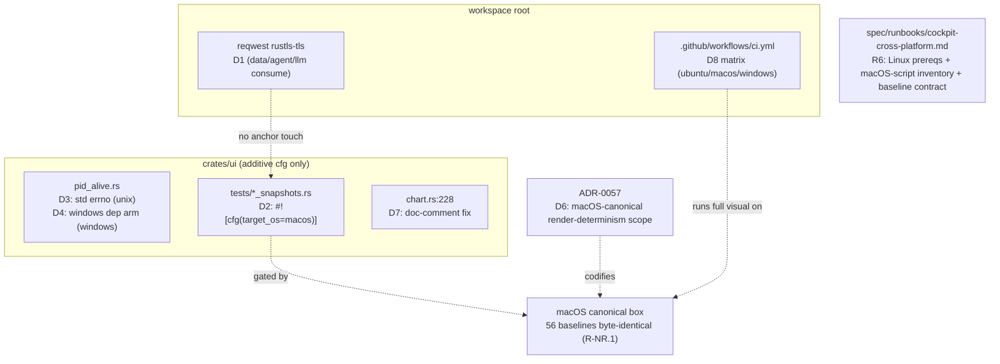

# cockpit-cross-platform — v0.1.0

Make the cockpit (`cargo run -p ui --bin cockpit_live --features live` and
`cargo run -p ui --bin cockpit --features fixtures`) **build and run on Linux
and Windows**, not just macOS — without changing macOS behavior (anchors
119/119, the 56 visual baselines byte-unchanged).

> **One-line:** iced + winit + tiny-skia + cosmic-text are already
> cross-platform, so the cockpit is ~90% portable by construction. The real
> blockers are narrow: a missing Windows `windows`-crate dep behind an
> already-written `#[cfg(windows)]` arm, the `libc::__error()` macOS-ism in
> the Unix PID probe, the platform-native TLS toolchain on Linux, and a set
> of macOS-only **dev/orchestration scripts** that are not part of the
> production binary. The one thing v0.1 deliberately does **NOT** attempt is
> byte-identical visual snapshots across OSes — the determinism contract
> (ADR-0043 / ADR-0051 § D5) already scopes byte-identity to the
> Apple-Silicon canonical box.

## Motivation

The cockpit today is a macOS-only artifact by convention, not by deep design.
The operator wants the option to build and run it on Linux (CI, headless
servers, a Linux workstation) and Windows. The codebase comments even claim
macOS is "the only cockpit-supported platform" (`crates/ui/src/widgets/chart.rs`
:228) — this feature scopes what it would take to retire that claim safely.

The strategic value is modest but real: a green Linux build unlocks **CI on
free Linux runners** (today there is **no `.github/workflows/` at all**) and
removes a single-point-of-failure on the operator's one Mac.

## What is actually macOS-coupled (the survey — file:line)

This is the load-bearing section. The scope hinges on it being **small**.

### Category A — REAL compile/run blockers (must fix for a green build)

1. **`windows` crate is undeclared** — `crates/ui/src/lab/pid_alive.rs:63-78`
   already contains a `#[cfg(windows)]` arm that does
   `use windows::Win32::Foundation::CloseHandle;` and
   `use windows::Win32::System::Threading::{OpenProcess, PROCESS_SYNCHRONIZE};`.
   The `windows` crate is **NOT a direct dependency of `crates/ui`** (confirmed:
   `grep windows crates/ui/Cargo.toml` → empty; it appears in `Cargo.lock` only
   transitively via `tokio`/`mio`/`time`). **Result: the Windows build fails to
   compile.** Fix: add `windows = { version = "...", features = [...] }` under a
   `[target.'cfg(windows)'.dependencies]` stanza in `crates/ui/Cargo.toml`.
   (~5 LoC Cargo + 0 LoC source — the source arm is already written.)

2. **`libc::__error()` is a macOS/BSD symbol** —
   `crates/ui/src/lab/pid_alive.rs:59` reads errno via
   `unsafe { *libc::__error() }`. On **glibc Linux** the errno accessor is
   `*libc::__errno_location()`, not `__error()`. **Result: the Linux build
   fails to link.** Fix: gate the errno read per-OS (~6 LoC: `#[cfg(target_os
   = "macos")]` → `__error()`; `#[cfg(target_os = "linux")]` →
   `__errno_location()`), or use `std::io::Error::last_os_error().raw_os_error()
   == Some(libc::EPERM)` to drop the raw-errno call entirely (the durable fix —
   removes one `unsafe` block and is portable by construction).

3. **Native-TLS toolchain on Linux** — `reqwest = { version = "0.12",
   features = ["json"] }` (workspace root) uses reqwest's **default-TLS =
   native-tls**. The lockfile carries `native-tls`, `openssl-sys`, `schannel`,
   and `security-framework`. On macOS → Security.framework (system, no setup);
   on Windows → schannel (system, no setup); **on Linux → OpenSSL**, which needs
   the `libssl-dev` + `pkg-config` system packages present at build time.
   **This is a build-environment requirement, not a code change** — but it
   WILL surface as a confusing build failure on a bare Linux box. Decision in
   **Q1** (document the apt/dnf prereq vs. switch reqwest to `rustls-tls` for a
   zero-system-dep build). Only `crates/data`, `crates/agent`, `crates/llm` pull
   reqwest; `crates/ui` pulls it transitively under `--features live`.

### Category B — works cross-platform already (verified, no action)

4. **The vendored `vendor/iced_tiny_skia/` fork is OS-agnostic** — confirmed
   `grep -rn 'cfg(target_os|cfg(unix|cfg(windows|macos|cocoa|core-graphics|objc'
   vendor/iced_tiny_skia/src/` → **empty**. It is a pure software (CPU)
   rasterizer with zero OS-specific code; the operator-lock note is upheld. The
   `[patch.crates-io]` wiring (`Cargo.toml:169-170`) is path-based and
   OS-neutral. **No portability `cfg` is required in the fork** — this answers
   the operator's "is it OS-specific? verify" directly: **no, it is not, and no
   fork change is needed.** (If this ever changes, it is a CLAUDE.md
   operator-lock event — flagged, not assumed.)

5. **iced/winit window + event loop are cross-platform** — winit abstracts
   Cocoa/Win32/X11/Wayland. The "macOS forces GUI on main thread" topology in
   `cockpit_live.rs:24-46` is the **correct portable pattern anyway** (winit
   requires the event loop on the main thread on Windows too), so no change.

6. **`#[cfg(unix)]` PID/trainer arms have Windows counterparts** —
   `trainer.rs` cancellation uses `child.start_kill()` (tokio), which is
   `SIGKILL` on Unix and `TerminateProcess` on Windows (documented at
   `trainer.rs:19-20`). The `#[cfg(unix)]` blocks at `trainer.rs:394,430` are
   **test-only helpers** (`cancel_handle_drop_kills_child`, `assert_exited_within`)
   that shell out to `sleep`/`kill` — they will be `#[cfg]`-skipped on Windows,
   so the Windows build is fine; Windows just runs fewer tests there (Q3).
   `persistence.rs:106` already has the `#[cfg(windows)]` `USERPROFILE` home-dir
   fallback. **These are already portable.**

### Category C — macOS-only DEV/ORCHESTRATION tooling (NOT the production binary)

7. **Six `orch_*` + capture scripts are macOS-only**, by design:
   `scripts/orch_cursor_move.swift` (Swift; CoreGraphics cursor warp),
   `scripts/capture_screenshot.sh` + `scripts/orch_hover_screenshot.sh` +
   `scripts/orch_cockpit_on_screen.sh` + `scripts/orch_crop.sh` +
   `scripts/orch_probe_tcc.sh` (all use `screencapture`/`osascript`/`sips`/TCC).
   These are **orchestrator hover-debug + presenter-screenshot tooling**, NOT
   the tester's render gate and NOT linked into any binary. The
   `capture-screenshot` **skill already handles Linux**: its description says
   "Linux + headless paths emit operator instructions instead of failing."
   **v0.1 disposition: leave these macOS-gated; document them as macOS-only in
   a portability runbook.** No rewrite — that would be scope creep with zero
   production value (Q4).

### Category D — the render-determinism question (the riskiest, its own section)

8. **The 56 visual baselines are system-font-dependent and were captured on
   macOS.** Font resolution chain, fully traced:
   - The cockpit sets **no** iced default font (no `.font()` / `default_font`
     / `include_bytes!` anywhere in `crates/ui/src/bin/`). The
     `FONT_SANS`/`FONT_MONO` constants (`theme.rs:575,577`) are **CSS-style
     family strings used only in docs/comments — they are never handed to
     iced.**
   - iced 0.14 compiles in **only `Iced-Icons.ttf`** as an embedded face. The
     embedded **`FiraSans-Regular.ttf` is gated on `#[cfg(feature = "fira-sans")]`**
     (`iced_graphics-0.14.0/src/text.rs:121-127`), and **`fira-sans` is NOT
     enabled** (we use `iced = { default-features = false, features =
     ["tiny-skia","thread-pool","advanced","canvas"] }` — confirmed `grep
     fira-sans` across our manifests → empty).
   - Therefore all body text resolves through **cosmic-text's `PlatformFallback`**
     against the **per-OS system font database**
     (`cosmic-text-0.15.0/src/font/system.rs:400` `db.load_system_fonts()`;
     default families `Open Sans`/`Noto Sans Mono`/`DejaVu Serif` — none of
     which exist on a stock macOS either, so even today macOS is resolving via
     `PlatformFallback` to whatever the OS picks).
   - **Consequence: glyph shaping + rasterization differ across OSes**, so the
     56 PNG baselines in `crates/ui/tests/visual-baselines/` will **NOT** match
     pixel-for-pixel on Linux/Windows. The snapshot gate is the stated
     regression gate — it would go red on a Linux CI runner.
   - **BUT** — and this is the de-risking finding — **ADR-0051 § D5 and ADR-0043
     already declare the determinism scope as the "Apple-Silicon canonical box"
     and state "cross-platform byte-identity is explicitly NOT guaranteed."**
     `verify_anchors.sh` runs on that canonical box. So the architecture has
     **already excluded** cross-platform byte-identity from the contract; the
     snapshot gate was never designed to hold cross-OS. The macOS baselines stay
     the canonical gate on the canonical box; Linux/Windows do **not** re-anchor
     against them. This is **Q2**, the load-bearing decision.

## Requirements

- **R1 — Linux build green.** `cargo build -p ui --bin cockpit_live --features
  live` and `--bin cockpit --features fixtures` compile on Linux (glibc). The
  `__error()` fix (A.2) + the TLS toolchain prereq (A.3 / Q1) are the gating
  items.
- **R2 — Linux run green (smoke).** `cockpit --features fixtures` opens a
  window and the headless `iced_test` smoke (`headless_emulator_smoke.rs`,
  `cockpit_live_lab_run_smoke.rs`) passes on Linux with **0 panics**. (Headless
  CI may need `xvfb` / a software EGL — Q5.)
- **R3 — Windows build green.** Adds the `windows` crate dep (A.1) so the
  already-written `#[cfg(windows)]` `pid_alive` arm compiles.
  `cargo build -p ui` on Windows succeeds. **Windows *run* is best-effort at
  v0.1** (see Q3 scope) — the architect may stage Windows as run-on-CI-only or
  defer interactive Windows to v0.2.
- **R4 — CI matrix.** A new `.github/workflows/` job runs build + the
  non-visual test suite on `{ ubuntu-latest, macos-latest }` (Windows optional
  per Q3). The **visual-baseline tests are excluded from the non-macOS legs**
  (R-NR.1 makes this explicit) — they run macOS-only as today.
- **R5 — macOS unchanged.** Zero behavior change on macOS: 119/119 anchors
  byte-identical, the 56 visual baselines byte-identical, the macOS build/run
  path untouched. All portability changes are **additive `#[cfg]` / Cargo
  `[target.…]` stanzas**, never edits to the macOS code path.
- **R6 — portability runbook.** A `spec/runbooks/cockpit-cross-platform.md`
  documents: the Linux build prereqs (TLS, xvfb), the macOS-only dev-script
  inventory (Category C), and the explicit "visual baselines are macOS-canonical,
  not cross-platform" contract (echoing ADR-0051 § D5).

### Non-regression contract (R-NR — mandatory)

- **R-NR.1** The 56 visual-baseline tests (`visual_snapshots.rs`,
  `render_snapshots.rs`, `panel_snapshots.rs`, `gallery_snapshots.rs`) are
  **gated to run on macOS only** (a `#[cfg(target_os = "macos")]` guard or a CI
  job-filter — Q2 chooses the mechanism). On Linux/Windows they are **skipped,
  not re-baselined.** The macOS run keeps them byte-identical.
- **R-NR.2** The 119 backtest anchors stay byte-identical (this feature touches
  no `crates/backtest` / `crates/exec` / `crates/cost` code; the anchors live on
  the canonical box per ADR-0043 — unaffected by a UI-crate Cargo change).
- **R-NR.3** No new `unsafe` without a `// SAFETY:` comment (the A.2 durable fix
  via `std::io::Error::last_os_error()` actually *removes* one `unsafe`).
- **R-NR.4** `Decimal` is never replaced by `f64` (this feature adds no
  numeric code; called out per CLAUDE.md non-negotiable).
- **R-NR.5** No live-trading surface added (CLAUDE.md / MEMORY: live trading is
  out of scope; this is build/CI plumbing only).
- **R-NR.6** The vendored `vendor/iced_tiny_skia/` fork is **not modified**
  (operator-lock). If portability is found to require a fork `cfg` — it does
  **not**, per B.4 — that is an escalation, not a silent edit.

## Risk register (K)

- **K1 (HIGH) — cross-platform render non-determinism breaks the snapshot
  gate.** Mitigated by R-NR.1 (macOS-only gating) + the ADR-0051 § D5 finding
  that cross-platform byte-identity is already out of contract. **Residual
  risk:** if the operator later *wants* Linux visual regression, that needs a
  **separate** Linux baseline set + a Linux canonical box (a v0.2 follow-on,
  named in Q2's durable branch). Do not conflate with v0.1.
- **K2 (MED) — Linux headless rendering needs a display server.** `iced_test`
  drives the full tiny-skia readback pipeline; in CI it may need `xvfb-run` or a
  software GL/EGL (`libgl1-mesa-dri`, `libxkbcommon`). Spike in Q5. The
  **pure-CPU tiny-skia path is the asset here** — it can render fully headless
  with no GPU, but winit still wants an X/Wayland display for window creation.
- **K3 (MED) — the `windows` crate is heavy + version-churny.** The
  `windows`/`windows-sys` crates are large and revise often. Pin exactly (per
  the iced/`=0.14.0` precedent). Prefer **`windows-sys`** (smaller, C-FFI-style)
  over the full `windows` crate if only `OpenProcess`/`CloseHandle` are needed —
  the architect picks at M-T1.
- **K4 (LOW) — `time::UtcOffset::current_local_offset()` glibc unsoundness**
  (`chart.rs:228` comment). On multi-threaded glibc, the local-offset lookup can
  fail; the code already falls back to `UtcOffset::UTC` deterministically, and
  the snapshot harness forces UTC via `UI_CHART_FORCE_UTC`. **Already handled** —
  flagged so the architect knows the comment ("does not bite on macOS, the only
  cockpit-supported platform") becomes stale-and-should-be-corrected, not a bug.
- **K5 (LOW) — line-ending / path assumptions.** Persistence uses `PathBuf::join`
  (portable) and `USERPROFILE` fallback already exists (`persistence.rs:106`).
  JSON state files are LF-written by serde_json; Git `core.autocrlf` on Windows
  checkouts could perturb committed fixtures — verify `.gitattributes` pins
  `*.json`/`*.png` as binary/LF (Q-follow-on, low).

## Hypothesis register (H)

- **H1** — With `fira-sans` *enabled* and a single embedded default font set
  via `iced::application(...).default_font(...)`, renders become
  **font-deterministic across OSes** (no `PlatformFallback`), which *could* let
  one baseline set serve all platforms. **Falsifier:** enable `fira-sans`, set
  the default font, re-capture on macOS, diff vs. current 56 baselines — if they
  change, this is a *baseline migration* (touches R-NR.1) and is therefore a
  **v0.2 durable option, NOT v0.1** (v0.1 must keep baselines byte-identical).
  Recorded here so the architect sees the path exists but is correctly deferred.
- **H2** — `windows-sys` (not the full `windows` crate) is sufficient for the
  `OpenProcess`/`CloseHandle`/`PROCESS_SYNCHRONIZE` trio. Falsifier: compile the
  `#[cfg(windows)]` arm against `windows-sys` on a Windows runner.
- **H3** — `xvfb-run -a cargo test -p ui` (excluding visual baselines) is
  sufficient to run the Linux test legs headlessly. Falsifier: the CI spike in
  Q5.

## Design

> Architect M-T1 (2026-06-15). All five analyst findings **verified at source
> level** before designing (not trusted): `pid_alive.rs:59` reads errno via
> `unsafe { *libc::__error() }` (macOS/BSD-only); `pid_alive.rs:63-78` is a
> `#[cfg(windows)]` arm using `windows::Win32::{Foundation::CloseHandle,
> System::Threading::{OpenProcess, PROCESS_SYNCHRONIZE}}` and `grep -nE
> '^\s*windows' crates/ui/Cargo.toml` is empty (no direct dep → Windows fails to
> compile); `crates/ui` pulls reqwest only transitively (under `--features
> live`) so the native-tls Linux toolchain gap is real; ADR-0051 § D5 and
> ADR-0043 § D5 both scope determinism to the "Apple-Silicon canonical box,
> cross-platform byte-identity explicitly NOT contracted" (verbatim). The
> vendored fork was re-confirmed OS-agnostic by the analyst's empty-`cfg` grep —
> **operator-lock upheld, no fork change designed** (R-NR.6).

**This is a portability/build feature with zero new strategy/sizing/exec code.**
Per CLAUDE.md the day-1 **baseline-equity-divergence e2e gate is N/A**: there is
no overlay, no sizing modifier, no decision variable that produces an equity
curve to diverge — the change is additive `#[cfg]` arms + a Cargo
`[target.…]` stanza + a TLS feature flip + test gating + CI YAML + a runbook.
The N/A is justified, not stamped: there is no `scale`-computed-but-not-applied
surface to guard (the `v3-volatility-forecaster-noop-fix` precedent does not
apply — nothing here multiplies an equity path). The guards that *do* bind are
R-NR.1 (macOS baselines byte-identical) and R-NR.2 (119 anchors byte-identical),
both discharged by the tester's 4-cell verdict tree.

### D1 — TLS toolchain: flip reqwest to `rustls-tls` (resolves Q1=(a))

**Decision.** Switch reqwest off native-tls to rustls at the **workspace root**:
`reqwest = { version = "0.12", default-features = false, features = ["json",
"rustls-tls"] }`. This removes the system OpenSSL dependency so Linux / Windows /
macOS build byte-for-byte identically with **zero apt/dnf/vcpkg setup**.

**Rationale (one line):** the rustls flip is the choice whose lock carries across
every future CI image and bare container without re-touching — native-tls would
spawn a per-environment "install libssl-dev + pkg-config" carve-out on every new
Linux box, the un-durable path per the durable-over-quick rule.

**Library-compatibility checklist (run before locking):**
- *Single-binary friendly* — rustls is pure-Rust, no separate service, SQLite
  backend unaffected. PASS.
- *No system C deps* — rustls **removes** the OpenSSL C dep; `ring`/`aws-lc-rs`
  ship vendored. This is the whole point. PASS (strict improvement over native-tls).
- *Edition 2024* — reqwest 0.12 + rustls compile on stable 2024 (already in the
  lockfile via the dev-dep `base64`/aws-* transitive chain). PASS.
- *No stdlib-name shadow* — n/a (existing crate). PASS.
- *Maintained* — reqwest 0.12 + rustls are first-tier, actively released. PASS.
- *License* — rustls (Apache-2.0/ISC/MIT) is `deny.toml`-clean (already present
  transitively). PASS.

**Blast radius / falsifier.** Only `crates/data`, `crates/agent`, `crates/llm`
pull reqwest directly; `crates/ui` pulls it transitively under `--features live`.
The developer MUST re-verify the live HTTP paths still build + test after the flip
(`crates/data` Yahoo/Binance fetch, `crates/agent`, `crates/llm`) — this is the
T-D-3 acceptance gate. **Anchor-safety:** reqwest is HTTP only; it touches no
`crates/backtest`/`exec`/`cost` body bytes → the 119 anchors are unaffected by
construction (R-NR.2).

### D2 — Visual-baseline gating: source `#![cfg(target_os = "macos")]` (resolves Q2=(a)) — the load-bearing decision

**Decision.** Codify the macOS-canonical-baseline contract **in the test source**,
not in CI YAML. Add a **file-level inner attribute** `#![cfg(target_os = "macos")]`
to the top of each of the four snapshot integration-test files —
`crates/ui/tests/{visual_snapshots.rs, render_snapshots.rs, panel_snapshots.rs,
gallery_snapshots.rs}` — placed alongside the existing `#![allow(...)]` inner
attributes (e.g. `visual_snapshots.rs:48-52`). On Linux/Windows the entire file
(and its `#[path = "fixtures/mod.rs"] mod fixtures;` private copy) compiles to
**nothing** — the tests are *skipped, never re-baselined*.

**Why a file-level inner attribute, not per-`#[test]` gating (the mechanism
choice inside (a)):** each of these files holds dozens of `#[test] fn`
(`<fixture>__<slot>` ×3 viewports) — gating every attribute individually is the
exact bookkeeping-drift surface the project keeps paying for. One inner attribute
per file is the single-point, self-documenting gate. It also cleanly covers the
shared helpers (`fixtures::visual_diff::matches_screenshot`,
`fixtures::viewport_matrix`) because each integration-test binary carries its own
`#[path]`-included `fixtures` mod — gating the file gates its helper copy with it.

**Rationale (one line):** (a) puts the contract *where the failure happens* — a
contributor running `cargo test -p ui` on a Linux laptop sees the visual tests
simply not exist, instead of a confusing red pixel-diff; (b) CI-filter-only would
hide that truth in YAML, a carve-out → fallback per durable-over-quick.

**Scope boundary (what this decision does NOT do).** It does **not** re-baseline
on Linux/Windows and does **not** add a Linux canonical box. Cross-platform
byte-identity stays out of contract (ADR-0043 § D5 / ADR-0051 § D5). The Linux
visual-regression option (a separate Linux baseline set, gated on H1 =
`fira-sans` + a pinned `default_font` making renders font-deterministic) is named
as a **v0.2 follow-on**, explicitly deferred — v0.1 keeps the 56 macOS baselines
byte-identical (R-NR.1). This elevation of the ADR-0051 § D5 determinism scope
from the MC-anchor lane to the UI snapshot gate is the subject of **ADR-0057**
(see D6).

**R5 guard.** The gate is additive — the macOS code path is byte-untouched, so
the macOS run still executes all 56 baselines byte-identical. T-D-4 asserts this
on the canonical box before/after (the REGRESSION guard).

### D3 — Linux errno fix: drop the raw-errno call entirely (resolves T-AR2)

**Decision.** Rewrite `pid_alive.rs:54-60` to replace the `unsafe { *libc::__error()
}` errno read with the portable std accessor:

```rust
let result = unsafe { libc::kill(pid_t, 0) };
if result == 0 {
    return true;
}
// EPERM ⇒ the process exists but we may not signal it ⇒ treat as alive.
std::io::Error::last_os_error().raw_os_error() == Some(libc::EPERM)
```

`std::io::Error::last_os_error()` reads errno via the platform's correct accessor
on **every** Unix (`__error()` on macOS/BSD, `__errno_location()` on glibc) — so
one body serves both, **and it removes one `unsafe` block** (the `*libc::__error()`
deref). `libc::EPERM` is just an `i32` constant (portable). The `libc::kill(pid_t,
0)` call and its `// SAFETY:` comment stay verbatim.

**Rationale (one line):** the std-accessor rewrite is portable *by construction*
and satisfies R-NR.3 by *reducing* the `unsafe` count — strictly better than a
per-OS `#[cfg]` fork of `__error()`/`__errno_location()`, which keeps the unsafe
deref and adds a maintenance fork.

**Alternative considered + rejected:** per-OS cfg
(`#[cfg(target_os="macos")] __error()` / `#[cfg(target_os="linux")]
__errno_location()`). Rejected: keeps the `unsafe` deref, doubles the surface,
and still misses non-glibc/non-macOS Unix. The std path is the durable fix.

### D4 — Windows dep: add the full `windows` crate matching the already-written arm (resolves T-AR1)

**Decision.** Add to `crates/ui/Cargo.toml`:

```toml
[target.'cfg(windows)'.dependencies]
windows = { version = "=0.57.0", features = [
    "Win32_Foundation",
    "Win32_System_Threading",
] }
```

Pin **exactly** (`=0.57.0`, the iced `=0.14.0` precedent) and match the version
already resolved in `Cargo.lock` (`windows 0.57.0` is present transitively) so the
flip adds **no second `windows` major** to the tree. The two features expose
exactly `CloseHandle` (Foundation) and `OpenProcess`/`PROCESS_SYNCHRONIZE`
(System::Threading) — the trio the `#[cfg(windows)]` arm already imports. **Zero
source change** to `pid_alive.rs`'s Windows arm (it is already correct against the
full `windows` API surface).

**`windows-sys` considered + rejected (resolves H2).** `windows-sys` is smaller
(K3), but its `OpenProcess` returns a **raw `HANDLE`** (FFI), not the
`Result<HANDLE>` the existing arm pattern-matches on (`Ok(handle)`/`Err(_)` at
`pid_alive.rs:70-75`). Adopting `windows-sys` would force a **rewrite of an
already-correct source arm** plus raw-null-handle checks — net-negative source
churn + new error surface for a 3-symbol probe. The full `windows` crate is the
zero-source-churn, lowest-risk pick here; the K3 "heavy/churny" concern is
neutralized by the exact pin + the feature-gating to two sub-namespaces (the
`windows` crate is feature-sliced, so only the two needed Win32 modules compile).

**Acceptance:** `cargo build -p ui` cross-compiled to a Windows target resolves
the arm; Windows *run* is best-effort per D5.

### D5 — Windows scope: build + non-visual tests on CI, interactive run best-effort (resolves Q3=(a))

**Decision.** v0.1 "Windows works" = **compiles + non-visual `cargo test -p ui`
green on `windows-latest` CI** (the D4 dep fix makes this true). Interactive
window UX on Windows is **best-effort / unverified** at v0.1 — the operator has no
Windows hardware to do the manual UX QA, and over-claiming parity we cannot verify
would itself be the un-durable choice. Full Windows interactive parity is a clean
**additive verification** deferred to v0.2 (no MIGRATION, no rework spawned).

**Rationale (one line):** this is the AGENT.md exception where the *cheaper* option
is the *durable-honest* one — (a) bounds the claim to what CI can prove and the
v0.2 interactive-QA leg is purely additive.

### D6 — ADR-0057: yes, a short cross-cutting ADR (resolves T-AR4)

**Decision.** Write **ADR-0057** (next free number — 0056 is the last registered)
codifying: *"the cockpit visual-baseline determinism scope is the macOS canonical
box; Linux/Windows render body text via cosmic-text `PlatformFallback` against the
per-OS system font database and are NOT byte-gated; the 56 PNG baselines are
macOS-canonical and the snapshot tests are source-gated `#[cfg(target_os =
"macos")]`."* This is genuinely cross-cutting and durable: it extends the
ADR-0051 § D5 / ADR-0043 § D5 determinism scope (which today reads as
"MC-anchors / backtest reports") to a **third artifact class — the UI render
snapshot gate** — and it is the contract a future "Linux visual regression"
feature (v0.2, H1) must supersede or amend rather than silently break. The D2
source-gating mechanism is its load-bearing D-clause.

**Not a Changelog amendment to ADR-0051.** ADR-0051's § Changelog is the
Monte-Carlo robustness lane's running ledger (D6.5-D6.10 are all MC-strategy
amendments); folding a UI-render-determinism scope into it would mis-file the
decision. A standalone ADR-0057 is the correct home — cited by the trace `arch`
column and by R-NR.1.

### D7 — chart.rs:228 stale-comment correction (resolves T-AR5)

The doc comment at `crates/ui/src/widgets/chart.rs:228-231` says the glibc
local-offset unsoundness "does not bite on macOS, **the only cockpit-supported
platform**." After this feature that claim is false. **In-scope correction**
(documentation, not a code bug): reword to note Linux is now supported and the
`UtcOffset::UTC` fallback + `UI_CHART_FORCE_UTC` snapshot override (K4) already
handle the glibc case deterministically. This is a non-anchored source file —
correcting it does **not** touch any byte-immutable report (ADR-0038 § D6 safe).

### D8 — CI matrix shape (resolves T-AR3) — first `.github/workflows/` in the repo

**Decision.** One minimal workflow `.github/workflows/ci.yml`, matrix legs
`{ ubuntu-latest, macos-latest, windows-latest }`:

- **All legs:** `cargo build -p ui --bin cockpit --features fixtures` +
  workspace `cargo test` for the non-UI crates.
- **ubuntu-latest:** install the headless deps resolved by the Q5 spike (at
  minimum `xvfb`; add `libgl1-mesa-dri` + `libxkbcommon-x11-0` if the spike shows
  winit needs them — T-D-7), then `xvfb-run -a cargo test -p ui` **with the visual
  baselines absent by construction** (D2's source gate compiles them out on Linux
  — no `--skip` filter needed; the source gate *is* the filter, which is the D2
  durability payoff). Run the headless smokes (`headless_emulator_smoke.rs`,
  `cockpit_live_lab_run_smoke.rs`).
- **macos-latest:** `cargo test -p ui` runs the **full** suite including the 56
  visual baselines (this is the canonical gate; D2 compiles them *in* on macOS).
- **windows-latest:** `cargo build -p ui` + non-visual `cargo test -p ui` (D5
  scope; visual baselines compiled out by D2).

Keep it minimal — no caching/matrix-fanciness at v0.1; this is the first CI in the
repo and the goal is a green build + non-visual test floor, not a release pipeline.

**Consistency note.** Because Q2=(a) gates the visual tests in *source*, the CI
legs need **no test-name filter** to exclude them — they simply don't compile off
macOS. This removes the classic "CI filter drifts out of sync with the test set"
failure mode (the reason (b) was the fallback).

### D9 — Q4 + Q5 dispositions (architect-decidable / spike-flagged)

- **Q4 (macOS-only dev scripts) = (a) leave gated + inventory.** The six `orch_*`
  / `screencapture` scripts (`scripts/orch_cursor_move.swift`,
  `scripts/capture_screenshot.sh`, `scripts/orch_hover_screenshot.sh`,
  `scripts/orch_cockpit_on_screen.sh`, `scripts/orch_crop.sh`,
  `scripts/orch_probe_tcc.sh`) are orchestrator/presenter hover-debug + screenshot
  tooling — **not linked into any binary, not the tester's render gate**. The
  `capture-screenshot` *skill* already emits Linux operator-instructions. Leave
  macOS-only; **inventory them in the runbook** (R6 / T-D-8). Porting them to
  `grim`/`scrot` (Q4=(b)) is genuine scope creep — the Linux CI uses the in-Rust
  `iced_test` snapshot harness, not `screencapture` — **declined**.
- **Q5 (Linux headless CI) = FLAG A ~0.5-DAY DEVELOPER SPIKE before locking the
  CI YAML.** This is the **one genuine unknown** in the feature. The pure-CPU
  tiny-skia readback path renders fully headless with no GPU, **but winit still
  needs an X/Wayland display to create a window** — so `xvfb-run -a` is the
  baseline, and the open question is whether software GL/EGL (`libgl1-mesa-dri`,
  `libxkbcommon-x11-0`) is *also* required for winit window creation on
  `ubuntu-latest`. **The developer MUST run T-D-7's spike (H3 falsifier) and bake
  the resolved apt-dep list into the Linux CI leg before T-D-6 lands the YAML.**
  Do not lock the workflow on an assumed dep list.

### Library / crate compatibility decisions (recorded per architect.md checklist)

| Crate (change) | Decision | Why / rejected alternative |
|---|---|---|
| `reqwest` → `rustls-tls` | **adopt** (D1) | removes system OpenSSL C-dep; zero-setup cross-platform build; native-tls rejected (per-env libssl-dev carve-out) |
| `windows = "=0.57.0"` (Win32_Foundation + Win32_System_Threading), `[target.'cfg(windows)']` | **adopt** (D4) | matches already-written `pid_alive` arm + lockfile version, zero source churn; `windows-sys` rejected (raw-HANDLE FFI forces source rewrite) |
| `libc::__error()` | **remove** (D3) | replaced by `std::io::Error::last_os_error()`, portable + drops one `unsafe`; per-OS cfg rejected |
| `vendor/iced_tiny_skia` | **no change** (R-NR.6) | OS-agnostic (verified empty `cfg`); operator-locked — escalate, never edit |

### Component interaction (additive surface only)



All edges are **additive** — no existing macOS code path is modified (R5). The
only cross-crate runtime edge changed is the reqwest *feature set* (D1), which is
behaviour-preserving for the HTTP request semantics (rustls vs native-tls is a
transport-implementation swap, not an API change).

## Open questions (operator / architect) — durable-biased per AGENT.md 2026-05-28

- **Q1 (TLS toolchain) — LOAD-BEARING.**
  - **(a) Switch reqwest to `rustls-tls` for a zero-system-dep build
    (Recommended — DURABLE).** `reqwest = { default-features = false, features
    = ["json","rustls-tls"] }`. Makes Linux/Windows/macOS builds identical with
    **no system OpenSSL dependency**, so a bare Linux container or a fresh
    Windows box builds with zero apt/dnf/vcpkg setup. Costs ~1 dev-day (flip +
    re-verify the live HTTP paths in `crates/data`/`agent`/`llm`) and a
    one-time `Cargo.lock` churn. Carries forward across every future CI image
    without amendment.
  - **(b) Keep native-tls; document the `libssl-dev` + `pkg-config` prereq** —
    cheap (~0 code), but spawns a "works-on-my-machine" support cost on every
    new Linux environment and a v0.2 cleanup commitment. **Fallback if budget
    tightens** — the if-budget-tightens lane.
  - *Recommendation rationale:* the rustls flip is the choice whose M-T1 lock
    carries across multiple environments without re-touching; native-tls is the
    "document a carve-out" path → fallback per the durable-over-quick rule.

- **Q2 (visual-baseline gating mechanism) — LOAD-BEARING, the riskiest.**
  - **(a) Gate visual tests `#[cfg(target_os = "macos")]` + document baselines
    as macOS-canonical (Recommended — DURABLE).** Codifies the ADR-0051 § D5
    reality directly in the test source; the gate is self-documenting and
    survives any CI re-org. ~0.5 dev-day. Names the v0.2 follow-on (a Linux
    canonical-box baseline set) without committing to it.
  - **(b) Keep tests un-gated; exclude them via CI job-filter only** — cheaper
    in source (~0 LoC) but the truth ("these are macOS-only") lives only in YAML,
    so a local `cargo test -p ui` on a contributor's Linux box goes red
    confusingly. **Fallback.**
  - *Recommendation rationale:* (a) puts the contract where the failure happens;
    (b) hides it in CI config (a carve-out) → fallback.

- **Q3 (Windows scope) — what does "Windows works" mean at v0.1?**
  - **(a) Windows build + non-visual tests green on CI; interactive run is
    best-effort/unverified (Recommended for v0.1).** Honest and bounded: the
    `windows`-crate dep fix (A.1) makes it *compile and test*; verifying the
    interactive window UX on Windows is a separate manual-QA effort the operator
    has no Windows box to do today. This is the durable-honest scope — it does
    not over-claim.
  - **(b) Full Windows interactive parity** — requires a Windows test machine +
    manual UX QA; **defer to v0.2** unless the operator has Windows hardware.
  - *Note:* here the **cheaper option (a) IS the durable-honest one** — claiming
    full Windows parity we cannot verify would be the un-durable choice. This is
    the AGENT.md exception (the architect can prove (a) spawns no rework because
    v0.2 Windows-interactive is a clean additive verification, no MIGRATION).

- **Q4 (macOS-only dev scripts) — rewrite or gate?**
  - **(a) Leave Category-C scripts macOS-only; inventory them in the runbook
    (Recommended — DURABLE-honest).** They are orchestrator/presenter tooling
    with zero production value on Linux; the `capture-screenshot` *skill* already
    emits Linux operator-instructions. ~0 code.
  - **(b) Port the screenshot scripts to Linux (`import`/`grim`/`scrot`)** —
    real effort (~1-2 dev-days) for tooling the Linux CI does not need (CI uses
    the in-Rust snapshot harness, not `screencapture`). Genuine scope creep;
    do **not** do this at v0.1.

- **Q5 (Linux headless CI) — spike.** Does `xvfb-run -a cargo test -p ui
  --features live -- --skip visual` pass on `ubuntu-latest`, or is a software
  GL/EGL stack (`libgl1-mesa-dri`, `libxkbcommon-x11-0`) also required for winit
  window creation? **Recommend a ~0.5-day developer spike** before locking the
  CI YAML (H3 falsifier). This is the one genuine unknown; everything else is
  determined by reading.

## Verdict tree (4-cell, for the tester at M-FINAL)

| Linux build+smoke | macOS unchanged (anchors 119 + 56 baselines byte-id) | Verdict |
|---|---|---|
| green | yes | **PASS** — ship v0.1 (Linux green, CI matrix, baselines macOS-canonical) |
| green | NO | **REGRESSION** — a portability `cfg` leaked into the macOS path; do not ship |
| RED | yes | **FAIL** — Linux blocker remains (TLS toolchain or a missed `cfg`); back to developer |
| RED | NO | **FAIL + REGRESSION** — re-architect; the change was not additive |

## Effort estimate

- **Recommended v0.1 (Linux green + CI matrix + Windows-compiles + runbook):
  ~3-4 dev-days.** Breakdown: A.1 windows dep (~0.25d) + A.2 errno fix (~0.5d)
  + Q1 rustls flip (~1d incl. re-verify live HTTP) + R-NR.1 baseline gating
  (~0.5d) + CI YAML + Q5 xvfb spike (~1d) + runbook (~0.5d). Plus ~0.5d architect
  M-T1.
- **If-budget-tightens (~1.5-2 dev-days):** take Q1=(b) (document native-tls
  prereq, skip the rustls flip) + Q3=(a) (Windows compile-only) + drop the CI
  matrix to a single `ubuntu-latest` build-check job. Ships "Linux builds +
  smokes locally" without the full CI matrix; carries a v0.2 cleanup commitment
  for the TLS prereq + CI hardening. Named so the operator has the cheaper lane.

## Out of scope (v0.1)

- Linux/Windows **visual regression** (a Linux canonical-box baseline set) —
  v0.2 follow-on, gated on H1 (`fira-sans` + pinned default font making renders
  font-deterministic).
- Porting the Category-C macOS dev scripts to Linux (Q4=(b)).
- Full Windows interactive UX QA (Q3=(b)) — needs Windows hardware the operator
  does not have today.
- Any modification to `vendor/iced_tiny_skia/` (operator-lock; B.4 proves none
  is needed).
- Live trading (out of scope project-wide).

## Sources

- `crates/ui/src/lab/pid_alive.rs:59,63-78` — `__error()` macOS-ism + undeclared
  `windows` crate.
- `iced_graphics-0.14.0/src/text.rs:121-127` — embedded fonts; `fira-sans`
  `#[cfg]` gate.
- `cosmic-text-0.15.0/src/font/system.rs:400` — `db.load_system_fonts()` +
  `PlatformFallback`.
- `spec/architecture/adr/0051-monte-carlo-determinism-and-distribution-report-anchoring.md`
  § D5 — "Apple-Silicon canonical box; cross-platform byte-identity explicitly
  NOT guaranteed."
- `spec/architecture/adr/0043-simulated-latency-and-slippage.md` — f64
  conversion-boundary determinism scope (inherited verbatim by ADR-0051 § D5).
- reqwest 0.12 docs — default-tls = native-tls; `rustls-tls` opt-in feature.

## Changelog

- 2026-06-15 (analyst): authored v0.1.0 draft. Surveyed macOS coupling
  (file:line) into 4 categories: A real blockers (undeclared `windows` crate;
  `__error()` glibc gap; native-tls Linux toolchain), B already-portable (the
  vendored fork is OS-agnostic — verified empty `cfg`; winit/iced cross-platform;
  trainer/persistence Windows arms exist), C macOS-only dev scripts (leave
  gated), D render-determinism (the 56 baselines are system-font-dependent;
  ADR-0051 § D5 already scopes byte-identity to the canonical box). Recommended
  bounded v0.1 = Linux build+smoke green + CI matrix + Windows-compiles +
  macOS-canonical baselines, ~3-4 dev-days. Riskiest = Q2 (visual-baseline
  gating). Opened trace row `REQ-COCKPIT-CROSS-PLATFORM-001` (proposed).
  HANDOFF → architect.
- 2026-06-15 (architect): M-T1 design pass (§ Design D1-D9). Verified all 5
  analyst findings at source level (pid_alive errno/windows-arm, transitive
  reqwest, ADR-0051/0043 § D5 verbatim). Resolved Q1=(a) rustls flip (D1),
  Q2=(a) source `#![cfg(target_os="macos")]` file-level inner attr on the 4
  snapshot test files (D2 — load-bearing), Q3=(a) Windows build+test-on-CI / run
  best-effort (D5), Q4=(a) leave dev-scripts gated + inventory (D9), Q5 flagged
  for a ~0.5d developer headless-CI spike before locking YAML (D9). Errno fix =
  drop raw `__error()` for `std::io::Error::last_os_error()` (D3, removes one
  `unsafe`, R-NR.3). Windows dep = full `windows = "=0.57.0"` matching the
  already-written arm; `windows-sys` rejected (D4). CI = first
  `.github/workflows/ci.yml`, 3-leg matrix, no test-name filter needed (the D2
  source gate IS the filter, D8). ADR-0057 authored (D6) elevating the
  macOS-canonical render-determinism scope from the MC-anchor lane to the UI
  snapshot gate. chart.rs:228 stale comment flagged for in-scope correction (D7).
  Baseline-equity-divergence e2e gate N/A (justified — no equity-producing
  decision variable). vendor/ untouched (R-NR.6). HANDOFF → developer.
