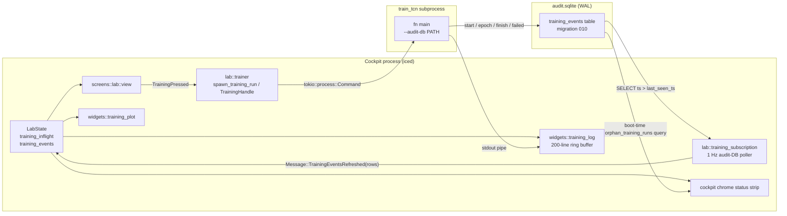

# Cockpit training control — operator-driven `train_tcn` launcher

> This brief is the natural workflow surface for the upcoming v2.5 TCN
> retraining cycle (the
> [`v25-tcn-alpha-investigation`](../v25-tcn-alpha-investigation/feature.md)
> F4 verdict points at retraining) and for the future v2.5a (PatchTST) /
> v2.5b (Transformer) training rounds mandated by the
> [4-phase DL roadmap](../v25-dl-forecast-overlay/feature.md). It does
> NOT decide what to train — it gives the operator a UI handle to launch
> training runs the architect / analyst have already authored in
> `crates/forecast/src/bin/train_tcn.rs`, watch them progress, and
> abort them. Predecessor:
> [`ui-rethink-phase-a-lab` v0.2.0](../ui-rethink-phase-a-lab/feature.md)
> (the Lab module that hosts the new training panel) — specifically the
> `lab::runner::spawn_lab_run` precedent shipped at T-D-14.

## Why

The cockpit's headline retraining workflow today is **"open a terminal,
remember the `cargo run -p forecast --bin train_tcn …` invocation,
tail logs in another tmux pane, copy the resulting `model_revision` SHA
back into the backtest harness, rinse, repeat"**. That works for an
analyst at a desk; it fails the
[product.md § Differentiator](../product.md#differentiator)
ambition of a self-contained cockpit that an operator can drive end-to-
end without a terminal. The
[`v25-tcn-alpha-investigation`](../v25-tcn-alpha-investigation/feature.md)
investigation is poised to recommend a retraining cycle (F4 verdict);
the [4-phase DL roadmap](../v25-dl-forecast-overlay/feature.md) commits
to two more training rounds (v2.5a PatchTST, v2.5b Transformer) after
v2.5 ships. Without a UI handle the operator either (a) keeps living in
the terminal (a workflow regression against the cockpit-as-default
shape ratified in `ui-rethink-phase-a-lab`) or (b) waits for
hyperparameter tuning to land before any UI is built (a sequencing
trap — hyperparam tuning is its own feature). This brief gives the
operator the minimum-viable training-control surface: a button that
spawns the existing `train_tcn` binary as a subprocess, captures its
output, tails it into the Lab, and (Tier 2) plots the per-epoch loss
curves via the existing chart widget.

The slice is sized so the rollback cost is two weeks, one feature
flag, zero touched anchors, and a single delete-and-revert if the
operator decides the workflow shape is wrong. **No in-process
training loop** (see Out-of-scope) — the subprocess + audit-event
pattern gets 95% of the operator value at 10% of the architectural
risk.

## Requirements

Numbered, testable, derived from the operator-locked scope at spawn
(2026-05-19) + the
[`ui-rethink-phase-a-lab`](../ui-rethink-phase-a-lab/feature.md)
precedents (`lab::runner::spawn_lab_run`, `lab::persistence`,
`screens::lab::view`). Each R-item preserves the
[19 locked body-SHA-256 anchors](../anchors.toml) (15 originals + 4
`-realdata`) and the Lumen Phase 1 token contract. This feature
touches UI + audit + forecast crates but **no** backtest / strategy /
exec code (see **R10**). All R-items are non-blocking on the
in-flight `v25-tcn-alpha-investigation` analyst pass — both run in
parallel.

### R1 — Lab integration shape: new sub-panel inside the Lab route

- **R1.1** New Lab sub-panel **"Train"** added to `screens::lab::view`
  alongside the existing chart canvas / chip rows / Run button. Not a
  separate top-level `Screen` variant: the Lab is the operator's
  cockpit-as-default workshop (per `ui-rethink-phase-a-lab` R1.2), and
  the training workflow IS Lab work — testing a model against a pair
  + range, plus the meta-step of producing the model itself. A
  separate `Screen::Train` would split the chart-as-door pattern that
  Phase A locked in.
- **R1.2** The panel is collapsible (default collapsed at cold start —
  the operator opts in by clicking a header chip; the chart-centric
  default stays untouched for the muscle-memory case). When expanded,
  it occupies a fixed vertical slice at the **bottom** of the Lab
  column (below the volume histogram), so the chart remains the
  visual focus per Lumen
  [§ Chart-as-Door](../ui-design-principles.md). Fixed height ≈ 240 px
  expanded; ≈ 32 px header strip when collapsed. Architect tunes the
  exact pixel allocation against `chart_canvas_height_for_body` in
  `crates/ui/src/screens/lab.rs:97`.
- **R1.3** Alternative considered + rejected: **modal dialog**.
  Modals block the chart while training is in flight — the whole
  point of the workflow is the operator watching the chart and the
  loss curves at the same time. Rejected.
- **R1.4** Alternative considered + rejected: **new sidebar entry**.
  Adds an IA seam the Phase A rethink deliberately removed (Lab as
  default); breaks the chart-as-door pattern; doubles the navigation
  cost. Rejected.
- **Acceptance:** insta snapshot
  `lab__training_panel_collapsed_default` + `lab__training_panel_expanded`
  records the cold-start collapsed shape and the expanded shape
  respectively. Manual cockpit run shows the chart-canvas height
  shrinks by the exact panel height when the operator expands the
  Train panel and grows back when collapsed.

### R2 — Subprocess lifecycle: NEW `lab::trainer::spawn_training_run`

- **R2.1** Add a new sibling module `crates/ui/src/lab/trainer.rs`
  next to `lab::runner` (the `spawn_lab_run` host). The trainer is
  **not** a renamed runner — runner spawns an in-process
  `backtest::engine::run_scenario` future on the side-thread tokio
  runtime; trainer spawns an **OS subprocess** (`tokio::process::Command`)
  for `train_tcn`. They share the cancellation-handle pattern
  (`RunCancelHandle` / `RunCancelReceiver`, see
  `crates/ui/src/lab/runner.rs:64`) but the spawn primitive and the
  failure surface differ enough that conflating them would couple two
  orthogonal lifecycles (a backtest run aborts at the next bar
  boundary via `try_recv`; a training subprocess aborts via
  SIGTERM + zombie-reap).
- **R2.2** Spawn shape:
  - Binary path: resolved at startup via
    `std::env::current_exe()`-relative lookup with fallback to
    `cargo run -p forecast --bin train_tcn` for dev builds.
    Architect picks the resolution order (R9.1 covers the
    "binary-missing" surface).
  - Args: forwarded verbatim from the operator's panel selection
    (R5 covers the args UI). At Tier 1, fixed-set arg surface
    (config path + output dir + dry-run toggle + epochs override).
    Hyperparameter editing is **out of scope** (Operator-decide
    Q3 — defer).
  - Stdout / stderr: captured via `tokio::process::Command::stdout(Stdio::piped())`
    and streamed line-by-line through a `tokio::io::BufReader` into a
    bounded `std::sync::mpsc::Sender<TrainingLogLine>` consumed by the
    iced thread.
  - Working directory: workspace root (so the default config-path
    `crates/forecast/train_tcn.toml` resolves).
- **R2.3** Cancellation: clicking **Cancel** in the panel calls
  `tokio::process::Child::kill()` which sends SIGKILL on Unix and
  `TerminateProcess` on Windows. Per
  [Operator-decide Q2](#operator-decide-questions) the analyst default
  is **immediate SIGKILL** (not "wait for current epoch to finish").
  Reason: training epochs on real Binance hourly data take 5-30
  minutes per BS-1/BS-2 evidence; making the operator wait that long
  after pressing Cancel is hostile. The in-flight epoch's partial
  metadata is **never** written (R5.2 makes the audit writes
  per-epoch-completion-edge, so a killed epoch leaves a clean DB).
  Operator may override to SIGTERM-graceful in the operator-decide
  pass; if so, the trainer sends SIGTERM, waits `KILL_GRACE_MS = 30_000`
  ms, then escalates to SIGKILL.
- **R2.4** Zombie-reap on cockpit exit: when the cockpit's iced loop
  terminates (normal shutdown OR panic), the side-thread tokio
  runtime is dropped, which drops the `tokio::process::Child` handle.
  Tokio's documented behaviour is that a dropped child is reaped
  asynchronously via the SIGCHLD handler. We additionally register a
  `Drop` impl on `lab::trainer::TrainingHandle` that calls
  `child.start_kill()` to guarantee a graceful-best-effort exit
  signal before the runtime is dropped. **Open orphan risk** (K3) —
  see Risk Register.
- **R2.5** At-most-one-in-flight: same shape as
  `LabState::run_inflight` (see
  `crates/ui/src/state.rs::Cockpit::lab_run_inflight`). New field
  `LabState::training_inflight: Option<TrainingHandle>`. Pressing
  Train while a training is in flight is a no-op (the button is
  disabled per R3.4); pressing Cancel drops the handle which drops
  the Child which kills the subprocess.
- **Acceptance:** unit-test `trainer.rs::tests::cancel_handle_drop_kills_child`
  spawns a `sleep 60` subprocess, drops the handle, asserts the
  process exits within 200 ms. Unit-test
  `trainer.rs::tests::stdout_lines_pipe_to_channel` spawns a
  `echo line1; echo line2` subprocess and asserts both lines surface
  in the mpsc receiver. Manual cockpit run shows pressing Train +
  Cancel kills the subprocess and re-enables the Train button.

### R3 — Log-tail UI: ring-buffer-backed `Text` widget, last 200 lines

- **R3.1** New widget `crates/ui/src/widgets/training_log.rs` — a
  vertical `Column` of `Text` rows backed by a 200-entry ring buffer
  (`VecDeque<SmolStr>` with `pop_front` on overflow). 200 lines × ~120
  bytes/line ≈ 24 KB — well under any GC pressure threshold, and
  matches typical terminal scroll-buffer sizing for a single epoch
  log (BS-1 emitted ~50 info-level lines per epoch + ~10 warn lines
  per symbol load).
- **R3.2** Auto-scroll: anchored to the bottom by default
  (newest-at-bottom — matches terminal `tail -f` muscle memory).
  Operator clicks anywhere in the log pane to "freeze" the
  scroll position; clicking the existing
  Lumen-styled **"Jump to bottom"** chip re-anchors. The chip is
  hidden while anchored.
- **R3.3** No line filtering / search at Tier 1. The log surfaces are
  short enough (200 lines, 1 panel-height) that filtering is
  ergonomic-overkill for the first cut. Defer to a follow-on if the
  operator asks.
- **R3.4** Buttons: **Train** (primary, disabled when
  `training_inflight.is_some()`), **Cancel** (visible only when
  `training_inflight.is_some()`), **Clear log** (clears the ring
  buffer without affecting the subprocess). Style: Lumen Phase 1
  `run_button` tokens (R0 — no new tokens introduced).
- **R3.5** Status strip above the log: tiny one-line status surface
  showing **"Idle" | "Training (epoch N / M, t=Ts)" | "Cancelled" |
  "Failed: <error>" | "Done: <model_revision short SHA>"**. Driven
  by `LabState::training_inflight` + the last `train_event` row
  (Tier 2; at Tier 1 the strip shows just "Idle" / "Training…"
  / "Done" without epoch counts).
- **Acceptance:** insta snapshot
  `training_log__ring_buffer_200_lines` shows the ring-buffer
  rendering after pushing 250 lines (last 200 visible). Unit-test
  `training_log::tests::ring_buffer_evicts_oldest` asserts
  `pop_front` semantics. Manual cockpit run shows the auto-scroll
  freeze on click + the **Jump to bottom** chip restoring it.

### R4 — `train_event` schema: NEW table in audit DB

- **R4.1** New SQLite table `training_events` via migration
  `010_training_events.sql` in `crates/audit/migrations/`. Pure
  additive — `CREATE TABLE IF NOT EXISTS` + indexes — no ALTER, no
  data backfill, no UPDATE on any pre-existing row. Anchor-byte-safe
  by construction (no anchored report touches this table; see R10).
- **R4.2** Schema:

  ```sql
  CREATE TABLE IF NOT EXISTS training_events (
      id              TEXT PRIMARY KEY,         -- UUID v4
      ts              TEXT NOT NULL,            -- RFC3339, microsecond precision
      run_id          TEXT NOT NULL,            -- UUID v4 — groups all events from one train_tcn invocation
      kind            TEXT NOT NULL,            -- 'start' | 'epoch' | 'finish' | 'failed'
      epoch           INTEGER,                  -- NULL for start/failed; populated for epoch/finish
      total_epochs    INTEGER,                  -- NULL for start/failed; populated for epoch/finish
      train_loss      TEXT,                     -- f32 as TEXT (no float-arithmetic in audit; consistent with strategy_signals Decimal-as-TEXT contract)
      val_loss        TEXT,                     -- f32 as TEXT
      wall_clock_ms   INTEGER,                  -- ms elapsed within the current epoch (or full run, for finish)
      model_revision  TEXT,                     -- NULL until finish; the canonical SHA from CheckpointMetadata.model_revision
      scenario        TEXT,                     -- 'bs1' | 'bs2' | 'default' | operator-provided label
      seed            INTEGER NOT NULL,         -- training seed (from train_tcn.toml [training].seed)
      error_message   TEXT                      -- NULL except for kind='failed'
  );

  CREATE INDEX IF NOT EXISTS training_events_ts_idx ON training_events(ts);
  CREATE INDEX IF NOT EXISTS training_events_run_id_idx ON training_events(run_id, ts);
  CREATE INDEX IF NOT EXISTS training_events_kind_idx ON training_events(kind, ts);
  ```

- **R4.3** Why a new table (not new event-kind in `journal_transactions`):
  - `journal_transactions` is the **double-entry ledger** —
    every row balances Debits == Credits per
    [ADR-0024](../architecture/adr/0024-audit-sqlite-raw-sqlx.md).
    Training events are not double-entry — they're observational
    timeseries; shoehorning them into the journal violates the
    ledger's accounting-correctness invariant.
  - `strategy_events` (`crates/audit/migrations/002_strategy_events.sql`)
    is closer in shape — additive observational events — but the
    field set differs enough that a separate table is cleaner than
    a polymorphic `kind` + nullable-columns shape. Precedent: the
    same argument the
    `chart-buy-sell-emphasis v1.9` author made when creating
    `strategy_signals` as its own table (migration 009).
  - Analyst-default: separate `training_events` table. Operator may
    override to "extend `strategy_events`" via
    [Operator-decide Q1](#operator-decide-questions).
- **R4.4** Writers live in `crates/audit/src/journal.rs`:
  - `post_training_start(ledger, run_id, scenario, seed)`
  - `post_training_epoch(ledger, run_id, epoch, total_epochs, train_loss, val_loss, wall_clock_ms)`
  - `post_training_finish(ledger, run_id, model_revision, final_train_loss, final_val_loss, total_wall_clock_ms)`
  - `post_training_failed(ledger, run_id, error_message)`

  Same `#[instrument]` + `LedgerError` shape as `post_fill` /
  `post_strategy_signal`.
- **R4.5** Reader lives in `crates/audit/src/query.rs`:
  - `recent_training_events(ledger, since, until) -> Vec<TrainingEventRow>`
    — half-open `[since, until)` window matching the precedent of
    `recent_fills_filtered` / `recent_signals`.
  - `latest_training_run(ledger) -> Option<TrainingRunSummary>` —
    convenience for the panel status strip (R3.5).
- **Acceptance:** unit-tests
  `journal::tests::post_training_epoch_writes_row`,
  `journal::tests::post_training_finish_sets_model_revision`,
  `query::tests::recent_training_events_filters_by_window`.

### R5 — `train_tcn` instrumentation: opt-in `--audit-db` flag

- **R5.1** New CLI flag on `train_tcn`:
  ```
  --audit-db <PATH>          Path to audit.sqlite. When provided,
                             train_tcn emits start/epoch/finish/failed
                             rows to the training_events table.
                             Default: omitted → no audit writes
                             (preserves existing CI / manual-run
                             behaviour byte-for-byte).
  ```
- **R5.2** Emit edges:
  - **Start** (one row per invocation): emitted after config parsing
    but before the training loop. Captures `scenario`, `seed`,
    `run_id` (newly generated UUID v4).
  - **Epoch** (one row per completed epoch): emitted at the
    `info!(epoch = ..., train_loss = ..., val_loss = ..., …)` site
    in `train_tcn.rs:523`. `wall_clock_ms` measured via
    `std::time::Instant::now() - epoch_start`. **Determinism note:**
    `Instant::now()` is used here for wall-clock measurement only;
    it is **not** an input to the model or to the checkpoint's
    `model_revision` (which is computed from the canonical metadata
    JSON, see `crates/forecast/src/provenance.rs:103`). Therefore the
    determinism contract — "two runs with the same seed + same data
    produce byte-identical metadata.json" (see
    `train_tcn.rs:23-31`) — is preserved. The `train_event` rows
    themselves are non-deterministic in `wall_clock_ms` and `ts`,
    which is fine: they are observability data, not replay inputs.
  - **Finish** (one row per successful run): emitted at the end of
    `write_checkpoint` with the canonical `model_revision` SHA.
  - **Failed** (one row per fatal-error exit): emitted by a top-level
    error handler in `main()` that catches the `Result<()>` bail and
    writes a `kind='failed'` row before re-raising.
- **R5.3** Audit-DB connection: short-lived, opened-per-run. Avoids
  the cockpit's long-lived connection. Per
  [Risk K2](#risk-register) the WAL-mode default that `audit.sqlite`
  uses (see
  [ADR-0024](../architecture/adr/0024-audit-sqlite-raw-sqlx.md))
  permits concurrent readers + a single writer — the cockpit's
  read-only subscription (R7) and `train_tcn`'s writer do not
  contend.
- **R5.4** Backwards compatibility: with `--audit-db` omitted (the
  default — CI, manual cargo runs, scripted runs in
  `scripts/v25_tcn_bs1.sh`), zero audit-DB code paths are exercised.
  All existing T-D-11 / T-D-12 BS-1 / BS-2 fixture re-runs stay
  byte-identical.
- **Acceptance:** integration test
  `crates/forecast/tests/train_tcn_audit_emits.rs` runs `train_tcn`
  with `--audit-db <tempdir>/audit.sqlite --dry-run` (one
  start + one finish, zero epoch rows in dry-run mode) and asserts
  the row count + the `model_revision` matches the written
  `metadata.json`. Non-regression test
  `train_tcn_no_audit_db_writes_nothing` runs without
  `--audit-db` and asserts no SQLite handle is opened.

### R6 — Live loss-curve plot: REUSE `widgets::chart` via overlay-source

- **R6.1** The existing chart widget (`crates/ui/src/widgets/chart.rs`,
  1537 LOC) already supports overlay polylines via the equity-curve
  layer shipped at
  [`ui-rethink-phase-a-lab`](../ui-rethink-phase-a-lab/feature.md) R2.2.
  Reuse that same overlay shape — DO NOT introduce a new
  `ChartKind::TrainingCurves` variant.
- **R6.2** The training-curve plot lives **inside the Train panel**
  (not on the main chart canvas) at a fixed ~160-px height. Reusing
  the main chart canvas would force a context-switch between
  "price + equity for the active pair" and "training loss curves
  for the in-flight run" — two unrelated coordinate systems sharing
  one widget, breaking the chart-as-door pattern.
- **R6.3** Plot shape:
  - X axis: epoch number (`1..=total_epochs` — known after the start
    row).
  - Y axis: loss value (auto-scaled to `[0, max(train_loss, val_loss) * 1.1]`).
  - Two lines: `train_loss` (Lumen `color::ACCENT_2`), `val_loss`
    (Lumen `color::ACCENT_3`). Same color discipline as
    `ui-rethink-phase-a-lab` R2.3 (no new tokens).
  - Update cadence: 1 Hz polling (R7) — at typical BS-1/BS-2 epoch
    durations (5-30 min/epoch), there's nothing to plot more often
    than that.
- **R6.4** Empty / no-run-yet state: the plot area renders a single
  Lumen `text::SMALL` placeholder "No training run in flight"
  centered in the panel area. Same dead-state-rendering shape as
  the equity-overlay empty state.
- **Acceptance:** insta snapshot
  `training_plot__two_lines_5_epochs` with a fixture
  `training_events` row set (5 epoch rows). Snapshot
  `training_plot__empty_state` for the no-run case. Manual cockpit
  run shows the lines advancing each epoch.

### R7 — Cockpit subscription: 1 Hz audit-DB poller, NEW recipe

- **R7.1** The existing `live::subscription` (see
  `crates/ui/src/live.rs:63`) wires the cockpit to the
  `agent::EventBus` broadcast channels — Fills / Positions / Pnl /
  Ticks / Bars etc. That bus is the **agent runtime**'s event
  stream — `train_tcn` doesn't run inside the agent runtime (it's a
  subprocess), so it cannot publish to the EventBus without IPC.
  Polling the audit DB is the simpler shape.
- **R7.2** New `iced::Subscription` recipe in a new
  `crates/ui/src/lab/training_subscription.rs` module. The recipe
  polls `audit::query::recent_training_events(ledger, last_seen_ts, now)`
  at **1 Hz** while `LabState::training_inflight.is_some()`, and
  emits `Message::TrainingEventsRefreshed(Vec<TrainingEventRow>)`
  per poll. **Subscription identity** hashes only on the recipe's
  module + a stable run-id, so iced doesn't duplicate or drop it
  across rerenders.
- **R7.3** The 1 Hz poll cost is bounded: a single indexed query on
  `training_events(ts > last_seen_ts AND ts <= now)` returns ≤ 1 row
  per second under typical training conditions (1 epoch every 5-30
  min). Risk K4 covers the perf surface if this assumption breaks.
- **R7.4** Subscription stops automatically when
  `training_inflight = None` — the recipe's hash changes (it
  embeds `run_id`), iced cancels the prior stream.
- **R7.5** No agent-runtime EventBus changes — Tier 2 deliberately
  does NOT broadcast `train_event`s through the agent bus. Rationale:
  the agent bus is the live-trading event stream; intermixing
  training observability would couple two unrelated lifecycles
  (training can run while the agent is paused; the agent shouldn't
  care about training events). If a future feature wants
  `train_event` on the agent feed, it adds a new EventBus channel.
- **Acceptance:** unit-test
  `training_subscription::tests::polls_at_1hz_when_inflight`
  asserts the recipe's `Stream` emits a `TrainingEventsRefreshed`
  message every ~1000 ms when fed a fake clock. Unit-test
  `training_subscription::tests::stops_when_training_completes`
  asserts the stream terminates after `training_inflight = None`.

### R8 — Persistence + cold-start: nothing survives except the audit DB

- **R8.1** New cockpit state field
  `LabState::training_panel_collapsed: bool = true` (cold-start
  default — see R1.2). Persisted via the existing
  `lab::persistence` shape — additive to the
  `LabStateJson::version: 1` schema, gated by `#[serde(default)]`
  so cockpit-lab-state.json from a pre-feature build still loads
  cleanly.
- **R8.2** **Nothing else survives cockpit restart.** Specifically:
  - In-flight subprocess: a cockpit crash mid-training **orphans
    the subprocess** (see Risk K3). The orphan does **not** survive
    the cockpit relaunch — there is no "re-attach to running
    training" path at Tier 2. Operator must `pkill train_tcn`
    manually if the orphan is unwanted.
  - Scrollback: the ring buffer is in-memory; cockpit restart clears
    it. Operators who want a persistent log tail `tail -f` the
    `train_tcn` stdout to a file via `--log-path` (a follow-on
    flag — out of scope at Tier 2).
  - Latest `model_revision`: surfaced from the audit DB on every
    cockpit boot via `query::latest_training_run(ledger)` if the
    operator has `--audit-db` enabled. **The audit DB itself IS
    the persistence layer for training history.**
- **R8.3** Per [Operator-decide Q4](#operator-decide-questions), the
  analyst default is **stay on whatever Screen the operator left
  off** (the existing `lab::persistence` shape — Screen state is not
  affected by an in-flight training). The Train panel's
  collapsed-state survives via R8.1.
- **Acceptance:** unit-test
  `lab::persistence::tests::training_panel_collapsed_roundtrips`
  asserts the field persists. Unit-test
  `lab::persistence::tests::pre_feature_json_loads_collapsed_true`
  asserts a JSON blob without the field loads with
  `training_panel_collapsed = true` (the cold-start default).

### R9 — Failure modes: error surface per case

- **R9.1** `train_tcn` binary missing (release build path resolution
  fails):
  - Trainer returns `Err("train_tcn binary not found at <paths
    tried>")` synchronously when the operator clicks Train; status
    strip displays the error; no subprocess spawned.
  - Cockpit does NOT panic.
- **R9.2** Audit DB locked (concurrent writer, K2):
  - `train_tcn`'s `--audit-db` writer falls back to `tracing::warn!`
    + continues training (training-loop integrity is more important
    than observability). The cockpit poller picks up a partial event
    sequence; the status strip flags
    "Audit lag" if `ts(now) - ts(latest event) > 60s`.
- **R9.3** Candle compile error (Metal driver issue, missing
  feature):
  - `train_tcn` exits with non-zero status + an error message on
    stderr; the trainer captures the exit code; status strip
    displays "Failed: <stderr last line>"; the audit DB gets a
    `kind='failed'` row.
- **R9.4** OS kills the subprocess (OOM, operator
  `kill -9 <pid>`):
  - Trainer's `child.wait()` resolves with a non-zero exit; status
    strip displays "Failed: process killed (exit code 137)";
    audit DB gets a `kind='failed'` row IF `train_tcn` had time to
    register the error handler (typically no on SIGKILL — the row
    is best-effort).
- **R9.5** Cockpit panic mid-training: K3 — see Risk Register.
  Subprocess orphans. Operator visibility: the audit DB rows up to
  the panic timestamp are intact; a fresh cockpit boot displays the
  last `kind='epoch'` row's data in the status strip with a
  "Last seen: <Ts ago>" annotation. The orphaned subprocess
  continues writing rows; the cockpit picks them up on next boot
  if its `LabState::training_inflight` is re-armed against the
  same `run_id` (Tier 3 / out of scope — at Tier 2 the operator
  sees "Orphan run still writing? See pid <N>." surfaced via the
  audit DB's `kind='start'` row).

### R10 — Non-regression contract: 19 anchors stay byte-identical

- **R10.1** This feature touches **UI + audit + forecast** crates.
  It does NOT touch `crates/backtest`, `crates/strategy`,
  `crates/exec`, or any crate that participates in the
  [19 locked body-SHA-256 anchors](../anchors.toml) (15 originals +
  4 `-realdata`).
- **R10.2** The `train_tcn` instrumentation in R5 is gated behind
  `--audit-db <path>` — when omitted (the default for CI, manual
  cargo runs, `scripts/v25_tcn_bs1.sh`, T-D-11 / T-D-12 fixture
  rebuilds), zero audit code runs and `train_tcn`'s output bytes
  (the `<sha>.safetensors` weights file + `<sha>.metadata.json`
  metadata) are byte-identical to v0.2.0 of `ui-rethink-phase-a-lab`.
- **R10.3** The audit migration 010 is **purely additive** — no
  ALTER on existing tables, no UPDATE on existing rows. Migration
  precedent: 009 (`strategy_signals`) made the same anchor-byte-safe
  argument; we follow it verbatim. Verifiable via
  `scripts/verify_anchors.sh` running 19/19 PASS after migration
  application on a fresh DB.
- **R10.4** Cockpit-smoke gate (`scripts/cockpit_smoke.sh` per
  `ui-rethink-phase-a-lab` R10) must remain green: the Lab screen
  loads in <2s on the operator's M1 Pro fixture, the Train panel
  renders collapsed by default, expanding it does not crash.
- **R10.5** **Zero new anchors**: training is not deterministically
  replayable from a single input — the wall-clock measurements and
  the audit-row UUIDs are inherently non-deterministic, and the
  trained weights are non-deterministic on Metal (per
  `train_tcn.rs:27-31`). So the feature does not introduce any
  body-SHA-256 anchor scenarios. The `model_revision` SHA on the
  finish row is anchorable in principle (it's deterministic by
  construction per ADR-0029), but that anchoring belongs to the
  `v25-tcn-overlay` family's checkpoint provenance contract, not
  to this feature.
- **Acceptance:** `scripts/verify_anchors.sh` exit 0 with 19/19 PASS
  after the migration applies. `cargo test -p audit` 100% PASS
  including the new training-events tests. `cargo test -p forecast`
  100% PASS including `train_tcn_audit_emits.rs`. `cargo test -p ui`
  100% PASS.

## Operator-decide questions

Four Qs. The analyst recommends a default for each; the orchestrator
confirms or overrides via AskUserQuestion before architect spawn.

### Q1 — Where do training events live in the audit DB?

- **(a)** **New `training_events` table** _(analyst-recommended;
  R4.3)_ — clean separation; matches the `strategy_signals`
  precedent; no risk of polymorphic-kind sprawl in the journal.
- **(b)** Extend the existing `strategy_events` table with a
  training-kind variant. Slightly cheaper migration; couples two
  observability streams that don't logically share a domain.
- **(c)** Reuse `journal_transactions` with a synthetic balanced
  entry per epoch. Rejected by analyst — violates the
  double-entry-balancing invariant of the ledger.

  Default if no answer: **(a)**. Trade-off: (a) ships one
  migration + ~80 LOC of writer/reader; (b) ships zero migration
  but ~50 LOC of `kind`-discriminated readers + a permanent debt of
  coupling.

### Q2 — Cancel = SIGKILL immediate vs. SIGTERM-graceful 30s

- **(a)** **SIGKILL immediate** _(analyst-recommended; R2.3)_ —
  matches operator expectation that Cancel = Cancel. Partial epoch
  state is never written (the audit emit edge is on epoch
  completion, R5.2), so the DB stays clean. Loss: the current
  epoch's compute is wasted (≤ 30 min worst case).
- **(b)** SIGTERM-graceful with 30s timeout then escalate to
  SIGKILL. Allows `train_tcn` to flush its tracing subscriber and
  write a `kind='failed'` row with reason='cancelled'; the cost is
  the operator waits up to 30s after pressing Cancel before the UI
  reflects "Cancelled".

  Default if no answer: **(a)**. Trade-off: (a) is operator-honest
  and simple; (b) is observability-friendly but adds a
  configuration knob the operator must learn.

### Q3 — Should Tier 2 expose hyperparameter editing in the panel?

- **(a)** **No — fixed-arg-set at Tier 2** _(analyst-recommended;
  R2.2)_. The panel exposes: config path, output dir, dry-run
  toggle, epochs override, symbols override. Hyperparameters
  (lr_max, batch, dropout, channels, etc.) stay in
  `train_tcn.toml`; the operator edits the TOML directly when
  tuning.
- **(b)** Yes — surface lr_max + batch + dropout + epochs as
  panel-level numeric inputs that override the TOML at spawn time.
  Forces a `train_tcn.toml`-shape-aware UI; risk of UI drift if
  TOML schema evolves; risk of operator typos producing garbage
  runs.

  Default if no answer: **(a)**. Trade-off: (a) ships ~0 LOC of
  numeric-input widgetry; (b) ships ~200 LOC of widget + drift
  contract. Recommend deferring (b) to a follow-on
  `cockpit-training-hyperparams` brief if the operator finds the
  TOML-edit workflow painful.

### Q4 — Should the cockpit auto-focus the Train panel after restart if a training run is detected as in-flight?

- **(a)** **No auto-focus; status strip annotation only**
  _(analyst-recommended; R8.3 / R9.5)_. The cockpit boots into the
  Lab screen with the Train panel in whatever
  `training_panel_collapsed` state the operator last persisted.
  The status strip displays "Orphan run detected: <run_id>" when
  the audit DB shows a recent `kind='start'` without a
  corresponding `kind='finish' | 'failed'`.
- **(b)** Auto-expand the Train panel + auto-tail the orphan's
  events. Friendlier on detection; risk of surprising the operator
  when they didn't expect a training run to still be live.

  Default if no answer: **(a)**. Trade-off: (a) keeps the
  cold-start cockpit calm; (b) is friendly when intentional but
  jarring when the orphan is a forgotten dev test.

## Risk register

| ID  | Description | Likelihood | Impact | Mitigation |
|-----|-------------|------------|--------|------------|
| **K1** | Subprocess stdout/stderr races with cockpit shutdown (a half-flushed line at the moment iced exits). | Medium | Low — cosmetic only; a truncated log line is not a correctness issue. | The mpsc receiver is bounded; on iced shutdown the side-thread tokio runtime drops, which drops the BufReader, which closes the channel. Final lines may be lost. Accepted. |
| **K2** | Audit DB lock contention when cockpit reader + `train_tcn` writer overlap. | Low | Low — SQLite WAL mode (per [ADR-0024](../architecture/adr/0024-audit-sqlite-raw-sqlx.md)) permits one writer + many readers concurrently. | R9.2 — `train_tcn` falls back to `tracing::warn!` on a `SQLITE_BUSY`; cockpit poller's read query never blocks on the writer. |
| **K3** | Long-running training runs survive a cockpit crash (orphan PIDs). | Medium — a cockpit panic during a 30-min training is plausible during this feature's first weeks. | Medium — orphan keeps eating GPU until the operator notices. | R2.4 — `Drop` impl on `TrainingHandle` calls `child.start_kill()`. Best-effort: a hard `SIGKILL` of the cockpit (e.g. panic-on-thread-unwind in iced's render loop) bypasses Rust's Drop. R9.5 — the audit DB surfaces orphan-detection so the next cockpit boot at least tells the operator. Out-of-scope: an explicit "re-attach to orphan" UI. |
| **K4** | Live curve plot updates triggering full-canvas redraw at high frequency. | Low — R6.3 caps update cadence at 1 Hz; chart widget's existing draw path is O(N) in line points (N ≤ 100 epochs typical). | Low — the existing chart already draws price + equity at 1 Hz under live mode without issue. | R7.3 covers the poll-cost budget. Architect adds a `cargo bench` regression on the training-plot redraw path if the empirical perf surfaces problems. |
| **K5** | `train_tcn` CLI flag drift over time (cockpit invocation diverges from manual invocation). | Medium — CLIs grow; the cockpit hard-codes the arg shape via the trainer's `Command::args`. | Medium — silent divergence means cockpit-spawned runs differ from manual-spawned runs, breaking reproducibility. | Architect picks: either (a) cockpit calls `train_tcn --print-config-schema` at startup to validate its arg shape against the binary's `clap` definition, or (b) a CI check that diffs cockpit-spawned `train_tcn` invocations against a golden command-line string. Defer the picking to architect. |
| **K6** | Training panel obscures the chart-as-door pattern at the Lab cold-start, eroding the muscle memory `ui-rethink-phase-a-lab` locked in. | Low — R1.2 forces collapsed-by-default; the cold-start cockpit is byte-identical to the pre-feature one until the operator clicks Expand. | High — Phase A's chart-centric IA is the operator's single source of orientation; obscuring it would compound across the v2.5a / v2.5b training rounds. | R1.2 + R8.1 — collapsed default + persisted toggle. Phase B can reconsider if the operator's actual training cadence warrants a permanent strip. |

## Out of scope

- **Tier 3 — in-process training loop.** Hard contract. NO
  `tokio::task::spawn`-ing a candle workload that shares the cockpit
  runtime. If the operator asks for it, the answer is a separate
  brief that re-architects the cockpit's runtime model (out of
  scope for this feature's 2-wk estimate).
- **Hyperparameter editing in the panel** — see Q3 (defer to a
  follow-on if needed).
- **Re-attach to orphan subprocess** — see K3 / R9.5. Tier 2 surfaces
  orphan detection but does not re-establish event flow.
- **Multi-run training queue** — Tier 2 is at-most-one-in-flight
  (R2.5). Queuing is a Tier 3 concern.
- **Hyperparameter tuning / model-selection UI** — that's
  `cockpit-model-selection`, a future brief.
- **What to train** — the
  [`v25-tcn-alpha-investigation`](../v25-tcn-alpha-investigation/feature.md)
  verdict will recommend retraining configurations; this feature
  ships the UI handle, not the recommendation.
- **PatchTST / Transformer training binaries** — the architect /
  developer of this feature should design `lab::trainer` to be
  binary-agnostic (a `BinarySpec { name, args, scenario_label }`
  enum) so v2.5a / v2.5b can plug in without reshaping the trainer.
  But the v2.5a / v2.5b binaries themselves are not part of this
  brief.
- **LLM-driven training agent** — out of scope; that's a Phase 4
  concern per the 4-phase DL roadmap.
- **GPU resource gating / multi-GPU dispatch** — out of scope; the
  operator runs on a single M1 Pro with Metal.

## Backtest scenarios

**NONE.** This feature does not add backtest scenarios. Training is
not a replayable single-input operation — the 19 existing
body-SHA-256 anchors (15 originals + 4 `-realdata`) stay
byte-identical; this feature introduces zero new anchors. See R10.5
for the determinism argument.

## Cross-references

- Predecessor: [`ui-rethink-phase-a-lab` v0.2.0](../ui-rethink-phase-a-lab/feature.md)
  — Lab module, `lab::runner::spawn_lab_run` precedent
  (`crates/ui/src/lab/runner.rs:64`).
- Sibling-in-flight: [`v25-tcn-alpha-investigation`](../v25-tcn-alpha-investigation/feature.md)
  — F4 verdict feeds this feature's first real consumer.
- Parent: [`v25-dl-forecast-overlay` 4-phase roadmap](../v25-dl-forecast-overlay/feature.md)
  — v2.5a / v2.5b will reuse this UI handle.
- Audit invariant: [ADR-0024](../architecture/adr/0024-audit-sqlite-raw-sqlx.md)
  — raw `sqlx` + SQLite WAL.
- Checkpoint provenance: [ADR-0029](../architecture/adr/0029-tcn-checkpoint-provenance.md)
  — canonical `model_revision` SHA.
- Realdata path: [ADR-0032](../architecture/adr/0032-backtest-realdata-path-and-revision-pin.md)
  — the data the v2.5 retraining cycle will consume.
- Migration precedent: `crates/audit/migrations/009_strategy_signals.sql`
  — additive `CREATE TABLE IF NOT EXISTS` with anchor-byte-safety
  argument.

## Design

Architect synthesis, 2026-05-19. All operator decisions (Q1-Q4) confirmed
ALL FOUR analyst defaults via orchestrator AskUserQuestion 2026-05-19.
Cross-cutting decisions canonicalised in
[ADR-0034](../architecture/adr/0034-cockpit-training-control.md).
This section is the design surface bound to the developer's T-D-N
decomposition in [tasks.md](tasks.md).

### D1 — Audit-DB-as-seam (Q1 closes (a))

Training events flow **`train_tcn` (writer subprocess) →
`audit.sqlite training_events` table → cockpit subscription (reader)**.
The seam is the audit DB; no IPC, no `agent::EventBus` extension. The
audit DB IS the persistence layer for training history (per R8.2 —
cockpit cold-start re-reads from disk via
`query::latest_training_run`). See ADR-0034 § D1 for the full
alternatives analysis (IPC, EventBus, audit-DB) and the rejection
arguments. **Latent WAL-mode gap surfaced** in `Ledger::open`
(`crates/audit/src/ledger.rs:20`): the `?mode=rwc` URL does not issue
`PRAGMA journal_mode = WAL;`. Non-blocking for this feature because
the training writer/reader cadence (≤ 1 INSERT / 5-30 min vs. 1 Hz
indexed read) does not stress contention. Filed as a workspace-wide
follow-up in `spec/backlog.md`.

### D2 — `training_events` schema lock

Migration `crates/audit/migrations/010_training_events.sql` ships with
the analyst's R4.2 schema PLUS two refinements:

1. **`scenario TEXT NOT NULL`** — `train_tcn` always knows its
   scenario label (`"default"` if not overridden). Makes the value
   type's field non-`Option<String>` and saves ~10 LOC of unwrap
   handling.
2. **NEW `pid INTEGER` column** — captured at `kind='start'` only.
   Powers the orphan-detect query (D7) without external state.

Primary key: `id TEXT PRIMARY KEY` (UUID v4) — matches every other
audit table. Composite `(run_id, epoch)` was considered and rejected
because `kind='start'` / `kind='failed'` rows have NULL epoch. See
ADR-0034 § D2.

### D3 — Module placement: `crates/ui/src/lab/trainer.rs` confirmed

Confirmed the analyst R2.1 default verbatim. Sibling to
`crates/ui/src/lab/runner.rs` (the `spawn_lab_run` host). The trainer
reuses the cancellation-pair shape (`RunCancelHandle` /
`RunCancelReceiver` from `runner.rs:71-104`) by import, NOT by copy.
The spawn primitive differs: `tokio::process::Command` vs.
`rt_handle.spawn(...)`. The cancellation semantic differs:
`tokio::process::Child::kill()` (SIGKILL on Unix per Q2 = (a)) vs.
cooperative `try_recv` at next bar boundary. Justifies sibling
placement.

Alternative rejected: new `crates/ui/src/training/` sibling-to-`lab/`.
The operator's mental model has training as Lab work (per
`ui-rethink-phase-a-lab` R1.2 "Lab is the cockpit-as-default workshop");
sibling placement to `lab/` would split that. See ADR-0034 § D3.

### D4 — `train_tcn --audit-db <PATH>` instrumentation contract

**CLI signature.** New `--audit-db <PATH>` flag added at the **end of
the existing arg list** in `crates/forecast/src/bin/train_tcn.rs::Cli`
(after the existing `scenario: Option<String>` arg). Default omitted →
preserves all existing CI / manual / scripted (`scripts/v25_tcn_bs1.sh`)
behaviour byte-for-byte (R5.4 + R10.2).

**Connection lifecycle:** short-lived, opened-per-run. `train_tcn`
opens a fresh `Ledger` at the `start` emission edge (after config
parsing, before training loop), holds it through all epoch emit edges,
drops it at `finish` / `failed`. Per-emission reconnection rejected.
Long-lived shared with the cockpit rejected (separate process, no
shared handle).

**Missing-file behaviour: hard-fail.** If `--audit-db <PATH>` points
at a non-existent file, `train_tcn` exits non-zero with a clear error
message before any training. The cockpit creates the file at its own
boot via `Ledger::open` (existing behaviour). Auto-creating from
`train_tcn` would silently swallow a typo'd path and produce an
orphan DB the cockpit never sees.

**WAL-mode requirement:** matches ADR-0024's documented intent.
Verified non-blocking at this cadence; latent gap in `Ledger::open`
recorded in D1 as a separate backlog item.

**Fail-row survivability across panic / Err:** the `fn main() -> Result<()>`
body is wrapped in `std::panic::catch_unwind` boundary. On either an
`Err(_)` return OR a panic unwind, the boundary opens (if not already
open) the Ledger and writes a `kind='failed'` row before re-raising.
**SIGKILL is inherently unrecoverable** — no `kind='failed'` row is
written on SIGKILL because user code never runs after the signal.
The cockpit detects SIGKILL via its own `Child::wait()` ExitStatus
(per R9.4) and renders "Failed: process killed (exit 137)" without
needing a DB-side row.

**Emit edges (R5.2 confirmed):** start / epoch / finish / failed. See
ADR-0034 § D4 for the per-edge field-population table.

**Audit-write runtime:** `train_tcn`'s `fn main()` is currently sync.
The audit writers are `async fn`s. A per-run
`tokio::runtime::Runtime::new()` is built at the `start` emission edge
and used to `block_on` each audit write. Training-loop performance
unaffected (the writes happen at edge points outside the inner loop).

### D5 — `training_events` writers + readers + value types

New writers (`crates/audit/src/journal.rs`):

- `post_training_start(ledger, run_id, scenario, seed, pid)`
- `post_training_epoch(ledger, run_id, epoch, total_epochs, train_loss, val_loss, wall_clock_ms, scenario, seed)`
- `post_training_finish(ledger, run_id, epoch, total_epochs, final_train_loss, final_val_loss, total_wall_clock_ms, model_revision, scenario, seed)`
- `post_training_failed(ledger, run_id, error_message, scenario, seed)`

Each emits one INSERT, returns the generated UUID as `SmolStr`, and
uses the same `#[instrument]` + `LedgerError` shape as
`post_strategy_signal` (precedent in `journal.rs:266-300`). f32 values
bound via `format!("{val}")` → TEXT column (Decimal-as-TEXT contract
per ADR-0003).

New readers (`crates/audit/src/query.rs`):

- `recent_training_events(ledger, since, until) -> Vec<TrainingEventRow>`
  — half-open `[since, until)` window; same RFC3339 binding shape as
  `recent_signals` (`query.rs:470`).
- `latest_training_run(ledger) -> Option<TrainingRunSummary>` —
  convenience for the status strip.
- `orphan_training_runs(ledger, fresh_window) -> Vec<OrphanTrainingRun>`
  — the boot-time orphan-detect query (D7). Returns rows where
  `kind='start'` exists, no `kind IN ('finish','failed')` matches the
  same `run_id`, and the start `ts` is within `fresh_window`.

The reader query for D7 ("list all in-flight training runs"):

```sql
SELECT s.run_id, s.ts, s.scenario, s.seed, s.pid
FROM training_events s
WHERE s.kind = 'start'
  AND s.ts > ?fresh_window_lower_bound
  AND NOT EXISTS (
      SELECT 1 FROM training_events e
      WHERE e.run_id = s.run_id
        AND e.kind IN ('finish', 'failed')
  )
ORDER BY s.ts DESC;
```

The cockpit then layers a `pid_alive(pid)` check on each candidate
to distinguish live orphan from dead orphan.

Value types (`TrainingEventRow`, `TrainingRunSummary`,
`OrphanTrainingRun`) land in `crates/core/src/lib.rs` next to
`SignalView` / `FillView` / `StrategyEventView` per the
public-types-in-core convention.

### D6 — Cockpit subscription: 1 Hz `iced::Subscription` poller

New `crates/ui/src/lab/training_subscription.rs`. The recipe wraps
`iced::Subscription::run_with_id(("training_events", run_id), …)`,
mirroring the identity-hashing pattern of `cockpit_live::subscription_for`.

Internals:

- **Polling cadence:** `tokio::time::interval(Duration::from_millis(1000))`
  inside an `async_stream::stream!` block. Self-throttling; no
  backpressure issues at 1 Hz.
- **Last-seen-ts cursor:** `last_seen_ts: Timestamp` advances on each
  non-empty fetch so subsequent polls only return new rows. Initial
  value: `Timestamp::epoch()` (1970) so the first poll picks up any
  rows already in the table — important for the orphan-detect re-arm
  case where the cockpit reconnects to an existing `run_id`.
- **Identity:** `(module_id, run_id)`. iced cancels the prior stream
  when `run_id` changes — that gives R7.4's "subscription stops
  automatically when `training_inflight = None`" for free.
- **Shutdown:** when iced exits, the side-thread tokio runtime drops,
  which drops the stream, which drops the `Ledger` handle's pool clone.
  Clean reap. No explicit shutdown handshake needed.

Event sequence into the Lab `TrainingState`:

1. Operator clicks **Train** → `Message::TrainingPressed` →
   `lab::trainer::spawn_training_run` → `TrainingHandle` stored in
   `LabState::training_inflight` → subscription becomes live
   (next view rebuild emits it via `Subscription::batch`).
2. Each 1-Hz poll yields `Message::TrainingEventsRefreshed(Vec<TrainingEventRow>)`.
3. `update()` appends rows to `LabState::training_events: VecDeque<TrainingEventRow>`
   (bounded to last 1024 rows — well above any single-run row count;
   the inner `VecDeque` is a memory-bound, NOT a window-filter).
4. Status strip + training plot derive directly from
   `LabState::training_events` (no separate cache).

### D7 — Orphan-detect status-strip annotation (Q4 closes (a))

Boot-time flow:

1. Lab module init calls
   `query::orphan_training_runs(&ledger, Duration::hours(24))`.
2. For each returned `(run_id, ts, scenario, seed, pid)`:
   - Call `pid_alive(pid) -> bool`. Unix:
     `libc::kill(pid, 0)` returns `0` (alive) or `-1` with `errno =
     ESRCH` (dead) / `EPERM` (alive but inaccessible — treat as
     alive). Windows: `OpenProcess(SYNCHRONIZE, false, pid)` +
     `GetExitCodeProcess` — same alive/dead semantic, gated via
     `#[cfg(windows)]`.
3. **Live orphan** (PID alive): cockpit chrome status strip renders
   `"Orphan training run still writing: <scenario> (epoch N/M, pid <PID>) — click Train panel to tail"`.
   Click-target: the existing **Train** header chip in the Lab
   sub-panel (R1.2). Click expands the panel + spawns the
   `training_events_subscription` against the orphan's `run_id`.
4. **Dead orphan** (PID dead): cockpit chrome status strip renders
   `"Last training run did not complete: <scenario> (last seen epoch N/M, <Ts ago>)"`.
   Click-target: same chip; clicking just expands the panel (no
   subscription — the audit DB has the last-known state already loaded
   into `LabState::last_training_summary`).

The annotation lives in **the cockpit chrome status strip** (NOT the
Lab sub-panel's own status strip) so it survives panel-collapsed
state per Q4 = (a) (operator does NOT want auto-route). The exact
strings are factored into `crate::strings` per the no-string-literals
rule (T-D-N16).

### D8 — R6 live curve plot: NEW `widgets::training_plot` module

The plot lives **inside the Train panel** (NOT on the main chart
canvas) via a dedicated `crates/ui/src/widgets/training_plot.rs`
module that reuses the canvas + tiny-skia rendering primitives as
`widgets::chart` but with a narrower API surface:

```rust
pub struct TrainingPlot<'a> {
    series: &'a [TrainingPlotPoint],   // (epoch: u32, train_loss: f32, val_loss: f32)
    height_px: f32,                    // fixed ~160 px (R6.2)
    theme: ThemeMode,
}

pub struct TrainingPlotPoint {
    pub epoch: u32,
    pub train_loss: f32,
    pub val_loss: f32,
}
```

Composition:

- Data assembled by the Lab screen from
  `LabState::training_events: VecDeque<TrainingEventRow>` filtered to
  `kind='epoch'` → `Vec<TrainingPlotPoint>` (cheap O(N) map; N ≤ 100
  epochs typical).
- Passed into `TrainingPlot::view(...)` returning a `Canvas<'_>` that
  renders inside the Train panel's column layout.
- Two lines: `train_loss` (Lumen `color::ACCENT_2`), `val_loss`
  (Lumen `color::ACCENT_3`). Same color discipline as
  `ui-rethink-phase-a-lab` R2.3 (no new tokens).

**Y-axis scaling:** auto-linear scaled to
`[0, max(train_loss, val_loss) * 1.1]` per R6.3. **Log-y deferred.**
Huber losses sit in a reasonable range; log obscures early-epoch
progress. One-flag addition if the operator asks.

**Before-first-epoch state** (run in flight but no `kind='epoch'` row
yet — operator just clicked Train):

- Centered Lumen `text::SMALL` "Warming up — first epoch landing
  shortly".
- `iced_aw::spinner` centered next to the text (precedent:
  REQ-ICED-AW-002 / iced_aw cherry-pick spinner).
- Status strip independently shows `"Training (warming up, t=Ts)"`
  with elapsed-since-start wall clock so the operator sees the
  subprocess is alive.

**Empty / no-run-yet state:** centered Lumen `text::SMALL`
"No training run in flight" — same dead-state-rendering shape as the
equity-overlay empty state shipped at `ui-rethink-phase-a-lab`.

Why NOT reuse `widgets::chart`: shape mismatch. Main chart axis is
`Timestamp` (OHLCV bars indexed by time); training plot axis is
integer-epoch (no time semantics). Cross-loading would either need
synthesised timestamps per epoch (ugly + fragile when epoch durations
vary 5-30 min) or a `ChartKind::TrainingCurves` variant (already
rejected by R6.1).

**Axis-helper consolidation (T-D-N17):** the ~30 LOC of axis-rendering
helpers currently in `widgets::chart` (tick spacing, label
formatting, line-tessellation) get extracted into a shared
`crates/ui/src/widgets/axis.rs` (pub(crate)) so `widgets::chart` and
`widgets::training_plot` both consume them. Net LOC delta is small;
the shared module is value-add for future plot widgets.

### D9 — K5 mitigation: golden-CLI CI diff snapshot

**Chosen: CI golden snapshot.** A new test
`crates/forecast/tests/train_tcn_cli_snapshot.rs` invokes
`train_tcn --help` and asserts the output matches a checked-in
`crates/forecast/tests/snapshots/forecast__train_tcn_cli_snapshot__help.snap`
via `insta::assert_snapshot!`. Any change to the clap definition
forces a snapshot review where the developer also updates the
cockpit's trainer call site. Snapshot is ≤ 2 KB; human-readable.

**Rejected: runtime `--print-config-schema`.** ~5× the LOC for the
same drift-detection guarantee. Requires adding a new clap subcommand
to `train_tcn`, a deserialization step on cockpit boot, and a
versioning contract for the schema format.

### D10 — Path resolution for the `train_tcn` binary

Resolution order at cockpit boot (R2.2 ranked precedence):

1. **Same-directory-as-cockpit lookup:** `current_exe().parent() / "train_tcn"`
   — handles cargo-bundle + release paths.
2. **Workspace-relative dev fallback:** if cockpit's `current_exe()`
   lives inside `target/debug/` or `target/release/`, try
   `<workspace_root> / "target" / "<profile>" / "train_tcn"`.
3. **`cargo run` fallback** (dev only; gated `#[cfg(debug_assertions)]`):
   construct `cargo run -p forecast --bin train_tcn --release -- <args>`.
   Exists for the operator running cockpit via `cargo run` itself
   without a pre-built `train_tcn` binary.

If all three fail, `spawn_training_run` returns
`Err("train_tcn binary not found at <paths tried>")` synchronously
(R9.1). Status strip displays the error; no subprocess spawned;
cockpit does not panic.

### Module diagram



### Parallelism map for the orchestrator

M-T1 and M-T2 are **NOT independent** — M-T2's plot wiring depends on
M-T1's subprocess lifecycle being in place (the training plot only
makes sense if a `TrainingHandle` can drive it). **Sequence M-T1 →
M-T2** per the analyst-recommended approach noted in tasks.md M0.
Operator validates the Tier 1 shape on the existing BS-1 / BS-2
fixture before paying for Tier 2's audit-schema cost.

Within each milestone there is parallelism:

**M-T1 (Tier 1 — Wave A, B, C):**

- **Wave A (parallel):** T-D-N1 (`lab::trainer.rs`),
  T-D-N2 (`widgets::training_log.rs`). Both pure new modules; no shared
  edits to existing files.
- **Wave B (sequential after A):** T-D-N3 (Lab screen integration in
  `screens::lab.rs`), T-D-N4 (Message arms wiring),
  T-D-N5 (`LabStateJson` persistence). T-D-N3 + T-D-N4 are interleaved
  edits in the same files — sequence them.
- **Wave C (parallel; gated on B):** T-D-N6 (insta snapshots for Lab
  panel + training_log).

**M-T2 (Tier 2 — Wave D, E, F):**

- **Wave D (parallel — three lanes):**
  - Lane 1: T-D-N7 (migration 010), T-D-N8 (audit writers),
    T-D-N9 (audit readers + value types).
  - Lane 2: T-D-N10 (`train_tcn --audit-db` instrumentation +
    `train_tcn_audit_emits.rs` integration test) — depends on Lane 1
    landing T-D-N7-N8 so the SQL schema exists for the writers to
    target.
  - Lane 3: T-D-N17 (axis-helper extraction in `widgets::chart` →
    `widgets::axis`) — purely additive refactor; can run independent
    of Lanes 1-2.
- **Wave E (sequential after D):** T-D-N11 (subscription),
  T-D-N12 (`widgets::training_plot.rs` consuming the extracted axis
  helpers), T-D-N13 (status strip wiring),
  T-D-N14 (orphan-detect on boot), T-D-N16 (status-strip strings in
  `crate::strings`).
- **Wave F (parallel; gated on E):** T-D-N15 (full unit + integration
  test sweep — `journal::tests::*`, `query::tests::*`,
  `training_subscription::tests::*`, `train_tcn_no_audit_db_writes_nothing`),
  T-D-N18 (insta snapshots for plot + cockpit-chrome orphan strip).

Five waves total across the two milestones. Estimated developer time:
M-T1 ≈ 4-5 days; M-T2 ≈ 6-7 days; total feature ≈ 2 wk (matches
analyst estimate at spawn).

### Anchors expected at ship

**Zero new anchors** per R10.5. The 19 locked body-SHA-256 anchors (15
originals + 4 `-realdata`) stay byte-identical:

- Migration 010 is purely additive (R4.1 + R10.3).
- `train_tcn`'s `<sha>.metadata.json` body bytes are byte-identical
  with `--audit-db` enabled vs. disabled — the audit emit edges are
  side-effects AFTER metadata canonicalization; they do NOT mutate
  the metadata generator's input. The integration test T-D-N15
  / R5 acceptance gate verifies byte-equal `<sha>.metadata.json`
  outputs across the two modes.
- Cockpit UI changes do not touch any anchored report body (R10.1).

Verified by `scripts/verify_anchors.sh` 19/19 PASS at M-FINAL
(tester's gate).

## Implementation

_developer fills this_

## Verification

_tester links to reports here_

## Changelog

- 2026-05-19 (architect): § Design populated. Locked
  (a) audit-DB-as-seam choice for training events (R7 → poll via
  cockpit subscription; rejected IPC + EventBus alternatives) per
  Q1=(a) operator-confirmed, (b) `training_events` schema in
  `crates/audit/migrations/010_training_events.sql` with two
  refinements vs. analyst R4.2 (`scenario NOT NULL`, new
  `pid INTEGER` column for orphan-detect), (c) `crates/ui/src/lab/trainer.rs`
  module placement (sibling to `lab::runner`), (d) `train_tcn
  --audit-db <PATH>` CLI contract (end of arg list; hard-fail on
  missing file; per-run short-lived connection; `catch_unwind` boundary
  for `kind='failed'` survivability across panic), (e) 1 Hz cockpit
  subscription via `iced::Subscription::run_with_id(("training_events",
  run_id), …)` recipe identity, (f) `widgets::training_plot.rs` as
  NEW module (NOT extension of `widgets::chart`); axis-rendering
  helpers extracted into shared `widgets::axis` (`pub(crate)`),
  (g) orphan-detect via `libc::kill(pid, 0)` PID-alive check +
  cockpit-chrome status-strip annotation per Q4=(a) operator-
  confirmed (NO auto-route), (h) K5 mitigation = golden-CLI insta
  snapshot test (chosen over runtime `--print-config-schema`),
  (i) `train_tcn` binary path resolution order (`current_exe`-relative
  → workspace-relative → `cargo run` fallback). Surfaced a latent
  WAL-mode gap in `Ledger::open` (`?mode=rwc` URL does not issue
  `PRAGMA journal_mode = WAL;`) as a workspace-wide follow-up
  backlog item (non-blocking for this feature). Authored
  [ADR-0034](../architecture/adr/0034-cockpit-training-control.md)
  capturing all D1-D10 decisions; updated ADR registry. T-AR-2
  task decomposition replaces the M-T1/M-T2 stubs in tasks.md with
  18 concrete T-D-N rows across 6 waves. T-AR-3 ADR closed.
  Migration `010_training_events.sql` committed under
  `crates/audit/migrations/`. trace.toml `REQ-COCKPIT-TRAIN-001.arch`
  populated; status `proposed` → `in-progress`. Zero new anchors
  expected at ship (R10.5 confirmed).
- 2026-05-19 (analyst): initial draft — R1-R10 locked,
  4 operator-decide Qs surfaced (Q1-Q4 with analyst defaults),
  K1-K6 risk register, zero backtest scenarios, zero new anchors.
  Trace row `REQ-COCKPIT-TRAIN-001` opened in proposed state.
  Predecessor `ui-rethink-phase-a-lab v0.2.0`; sibling-in-flight
  `v25-tcn-alpha-investigation`.
