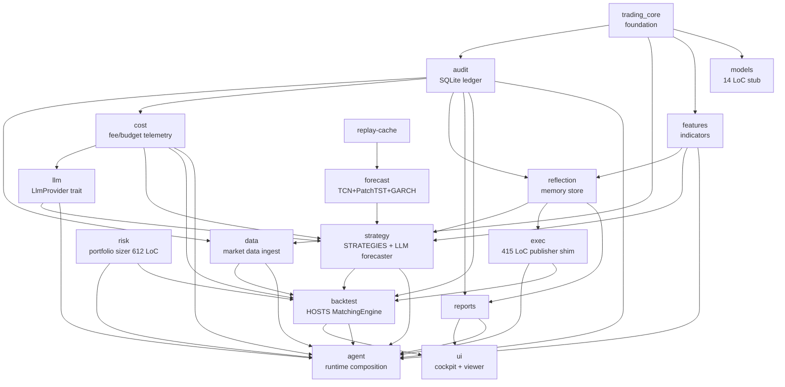
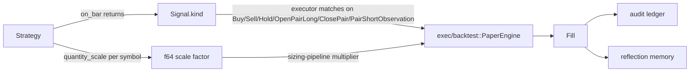

# Architect review — feature-state table (2026-05-22)

Companion to [feature-state-table-2026-05-22.md](feature-state-table-2026-05-22.md).
The orchestrator's table is a flat inventory; this dev-note is a
**system-architecture cross-section** of the same 54 features, with the
analyst's product cross-section running in parallel. Read both before
routing the next move.

## TL;DR

- The workspace dep graph is healthy with **one structural mismatch**:
  `crates/exec/` is 415 LoC of live-mode publisher shim, **not** an
  execution crate. The actual `MatchingEngine` trait + `PaperEngine`
  live in `crates/backtest/`. This is the single largest architectural
  prerequisite for live trading and the analyst's "live trading is the
  unfilled gap" line maps directly onto it.
- The 34 anchored body-SHAs split cleanly into **15 load-bearing**
  (strategy + verdict) and **19 cosmetic-but-locked** (training-output
  + forecast-distribution reports). Both classes survived the
  noop-fix re-emission cleanly — the protocol works. But **two
  anchor classes carry the noop-fix risk signature** (vol-killswitch
  R6.b + vol-meanreversion R6.c are anchored-but-no-end-to-end-test);
  flagged as Section B.
- The `Signal` trait surface has **no `confidence` / `metadata` /
  `weight` field with executor coupling**. `Signal.kind` and
  `Strategy::quantity_scale(symbol)` are the only two load-bearing
  channels from strategy to executor. The noop-fix added the second
  channel; future overlays (LLM-forecaster Wave D, regime-classifier)
  should treat this as their wiring contract.
- ADR-0038 § D6.b documents the wiring-bug re-emission protocol; the
  protocol survives its first invocation but **today's P1.1 sweep
  (operator's repo-cleanup-plan) discovered ~6 stale documentation
  links** — recommend a § D6.c (documentation-link-fix) amendment so
  future docs-only fixes don't have to invoke the body-SHA protocol.
- **Live trading readiness: 4 of 9 required crate surfaces complete**
  (44%). The work split between "build `crates/exec/` proper" and
  "wire risk + cost crates to fee/slippage feeds" is roughly 6 weeks
  of focused arch + dev work. Architectural prerequisites are
  enumerated in Section E.

## A. Crate dependency graph health

**Conclusion.** The 17-crate workspace dep graph is **broadly healthy
with one structural mismatch** (`crates/exec`) and **two thin crates
under load-bearing pressure** (`crates/risk`, `crates/cost`). No
circular-dep risk; all edges flow one-way through `trading_core`.

### A.1 Workspace dep edges (current)



(Edges read top-to-bottom: `core --> audit` means `audit` depends on
`core`.)

### A.2 Per-crate health cards

| Crate | LoC src | Direct deps | Rev-deps | Load-bearing role | Concerns |
|---|---|---|---|---|---|
| `core` | small | — (foundation) | 16 | Money, Symbol, Bar, Signal, Order, Timestamp, RiskLimits | None — stable; new types are additive (PairSignalData was the last addition v1.5a) |
| `data` | medium | core, audit | 3 (backtest, agent, ui-deps via backtest) | Market data + Binance WS + Parquet/CSV ingest | One concern: the `fixtures` feature gate is the only test-harness pattern in the workspace — should be generalized |
| `features` | small | core, quantedge-ta | 3 | SMA + indicators | None |
| `models` | 14 LoC | core | 0 | **Empty stub — eligible for deletion** | Unused; either delete or repurpose for v3-regime-classifier multi-symbol regime state |
| `llm` | large | cost, audit | 2 (strategy, agent) | LlmProvider trait + Anthropic impl + Recording/Replay + BudgetedProvider | None — clean; the budget-event audit feedback was the right design |
| `cost` | medium | core, audit | 4 (llm, strategy, backtest, agent) | Fee/slippage/LLM budget telemetry | **Concern: load-bearing for LLM but does NOT cover exchange fees / slippage as a unified abstraction.** When live trading lands, exchange-fee telemetry needs to flow through `cost` for parity with backtest fee accounting. Currently fees are computed inside `PaperEngine` and are not in `cost`. |
| `risk` | 612 LoC | core | 2 (backtest, agent) | Portfolio sizer + per-symbol clamps | **Concern: thin — only a sizer + exposure cap. No kill-switch, no circuit breaker, no live-fill risk veto loop.** ADR-0014 § Q9 "strategy proposes, risk disposes" is partially realized: the disposal happens at sizing-time only, not at fill-time. Live trading needs a fill-time risk check. |
| `strategy` | very large | forecast (optional), core, features, audit, llm, reflection, cost | 2 (backtest, agent) | All shipped strategies + LLM forecaster + overlays | One concern: now depends on **6 sibling crates**. The `forecast` dep is optional (candle gate); the others are mandatory. The `cost` dep was added for `AgentRole` / `LlmTier` — not for cost-tracking; this is the right call but worth flagging in the dep-graph audit (a `cost` import for a type, not for behavior). |
| `exec` | 415 LoC | core, reflection | 2 (agent, backtest-dev) | **MISLEADING NAME** — only the live-mode `FillPublisher` shim + a `ReflectionWriterTap`. The `MatchingEngine` trait + `PaperEngine` live in `crates/backtest/` | **Largest structural mismatch in the workspace.** See Section E. |
| `backtest` | large | core, data, features, strategy (forecast feat), risk, audit, exec, cost | 2 (ui, agent) | Hosts `MatchingEngine` trait + `PaperEngine` + scenario dispatcher + `run_scenario` library API (ADR-0030) | The matching-engine-in-backtest design was intentional (ADR-0030) and works for backtest determinism. But the trait *should* live in `core` or `exec`, not `backtest`, if live execution wants to share it. |
| `audit` | medium | core only (invariant) | 9 | SQLite ledger + raw sqlx + 12 migrations | None — the "audit imports nothing from siblings" invariant holds (this is verified in 01-data-flow.md). |
| `reflection` | medium | core, audit, features | 4 | LessonCard store + top_k retrieval + regime tagger (3-state BTC) | None — the regime tagger seed is what v3-regime-classifier C2 would extend. |
| `replay-cache` | small | (none beyond third-party) | 1 (forecast) | SQLite-WAL replay cache for inference determinism | One concern: standalone crate with one consumer — could merge into `forecast` if no other consumer materializes. Defer. |
| `reports` | medium | core, audit, data, cost, reflection | 2 (ui, agent) | Report rendering + CSV artifacts | None |
| `forecast` | very large | core, replay-cache, audit (sidecar) | 1 (strategy, optional via feature) | TCN + PatchTST + GARCH + training drivers + `forecast_distribution`/`recalibrate_sigma_train`/`sharpe_comparison` bins | Healthy. The optional candle gate keeps default builds light. |
| `agent` | large | 10 siblings | 0 (top-level binary) | Runtime composition + bus + event loop | The "everything depends on agent at the binary layer" is fine; the inverse — agent depends on 10 siblings — is exactly the composition root pattern. |
| `ui` | very large | core, reports, backtest, iced (vendored) | 0 | Cockpit + viewer + Lab/Live/Trail/Compare/Memory/Models/Assistant screens | UI isolation rule from 06-ui-and-cockpit.md holds: NO direct deps on strategy / exec / models / llm. `backtest` is the allowed in-process runner per ADR-0030. **Internal concern**: the `LlmForecastView` mirror struct in `assistant/state.rs` duplicates `crates/strategy::LlmForecast` — see § A.3 below. |

### A.3 The LlmForecastView mirror — was it the right call?

The `ui::assistant::state::LlmForecastView` struct (see
`crates/ui/src/assistant/state.rs:47`) mirrors selected fields from
`crates/strategy::LlmForecast` (declared at
`crates/strategy/src/llm_forecaster/types.rs:278`). Fields kept:
`symbol`, `rating`, `confidence_display`, `reasoning_trace`,
`cited_lesson_ids`, `cost_line`, `audit_id`.

**Architect verdict: this was the right call.** Reasoning:

1. The UI isolation rule (06-ui-and-cockpit.md) forbids `ui` from
   depending on `strategy`. Sharing `LlmForecast` directly would
   require either:
   - Adding `strategy` as a `ui` dep (breaks isolation), or
   - Moving `LlmForecast` into `trading_core` (pollutes the
     foundation crate with LLM-specific types).
2. The mirror struct is **display-projected** — `confidence_display`
   is a `SmolStr` like `"0.72"`, not an `f64`. The strategy-side
   `LlmForecast.confidence` is the raw model output. The transform
   is a UI concern.
3. The cost is small: ~7 fields, 1 conversion site (the
   `AssistantReasoningTraceUpdate` message that crosses the
   strategy/ui boundary lives at `crates/ui/src/state.rs:1506`).

**Mitigation**: when the conversion grows (Wave G LLM verdict adds
`L0-L4` enum, regime-classifier may add a regime field), consolidate
the conversion into a single `From<&strategy::LlmForecast> for
LlmForecastView` impl living at the agent → ui message boundary.
Currently the conversion is inline in `crates/ui/src/state.rs:3703`
and works; the consolidation is a future-readability hygiene item,
not load-bearing.

### A.4 Circular-dep risks

None observed at edge level. One **near-circular** worth tracking:

- `forecast → strategy` is via the optional `forecast` feature in
  `strategy`. The `threshold_sweep` bin documented its near-miss in
  spec/architecture.md § Developer deviations 2026-05-21 — placing
  it in `forecast` would have closed `forecast → backtest → strategy
  → forecast`. The fix (move bin to `backtest`) was right. **Action
  item**: every future bin that consumes both `strategy` (with
  forecast feature) and `backtest::engine` belongs in `backtest`,
  not `forecast`. This convention should be lifted into
  01-data-flow.md as a one-line rule.

## B. Anchor coverage architecture

**Conclusion.** The 34 anchored body-SHAs are **well-organized by
namespace** but **unevenly load-bearing**. 15 anchors are
behavioral (strategy emits → equity/Sharpe changes); 19 are
descriptive (model-distribution diagnostics that don't gate
strategy behavior). The noop-fix taught us the load-bearing class
needs an end-to-end "overlay-changes-output" assertion. Two other
anchored surfaces match the noop-fix risk signature.

### B.1 Namespace organization audit

| Namespace | Count | Class | Notes |
|---|---|---|---|
| `v0` | 2 | behavioral (SMA equity) | Healthy. Baseline-refresh anchor SHA equals the original SHA — the "refresh-as-noop" invariant. |
| `v0.5` | 3 | behavioral | Three composed-strategy baselines. Healthy. |
| `v1` | 2 | behavioral | Top10 momentum 2023 + 2024. The production baseline. |
| `v1.5a` | 2 | behavioral | Pairs MR 2023 + 2024. Healthy. |
| `v2.0.0` | 2 | descriptive (operator success report bodies) | Anchored for byte-determinism, not for alpha. Healthy. |
| `v2.5.0` | 2 | behavioral (passthrough) | Passthrough-forecaster baseline; ships with the candle feature absent in CI. |
| `v2.5.0-tcn-weights` | 2 | behavioral (real weights, dampened=0) | Honest reporting per M3 design goal — flat forecasts on synthetic data are anchor-locked. |
| `v2.6.0-realdata` | 4 | behavioral | Realdata TCN passthrough + weights. |
| `v2.6.0-alpha-investigation` | 3 | descriptive (forecast-distribution + sharpe-comparison) | Distribution diagnostics; doesn't gate trade behavior. |
| `v2.6.1-alpha-investigation-recalibrated` | 4 | descriptive (recalibrated metadata diagnostics) | Same as above. |
| `v2.6.2-threshold-tuning` | 2 | behavioral | τ-sweep equity output. |
| `v2.5a.0-patchtst` | 2 | behavioral + descriptive | One overlay + one distribution. |
| `v3.0.0-volatility` | 3 | mixed (1 GARCH-only + 2 overlay behavioral, re-emitted) | The noop-fix re-emission target. |
| `v3.0.0-volatility-rebaseline` | 1 | behavioral (re-emitted) | The rebaseline that surfaced the byte-identity bug. |

**Architect verdict: organization is good.** Each namespace ties
to a feature folder and a version triple. The "re-emission in-place
under existing namespace" rule (ADR-0038 § D6.b) preserved the
namespace-to-feature mapping cleanly across the noop-fix.

### B.2 Load-bearing vs descriptive split

| Class | Count | What "regressing" would mean |
|---|---|---|
| **Behavioral (load-bearing)** | 15 | A strategy decision now produces different equity/Sharpe — must be intentional, never silent |
| **Descriptive (diagnostic)** | 19 | A forecast distribution / sigma_train metadata / sharpe-comparison report body changed — usually a determinism violation in the diagnostic, not a strategy regression |

The behavioral 15:
- `v0` × 2, `v0.5` × 3, `v1` × 2, `v1.5a` × 2, `v2.5.0` × 2,
  `v2.5.0-tcn-weights` × 2 (dampened=0; behavioral but trivially
  so), `v2.6.0-realdata` × 4 (= TCN realdata), `v2.6.2-threshold-tuning`
  × 2 (τ-sweep equity), `v2.5a.0-patchtst` × 1 (overlay),
  `v3.0.0-volatility` × 2 (post-fix; only 1 of 3 is GARCH-only),
  `v3.0.0-volatility-rebaseline` × 1.

Recount: that's 15 behavioral + 19 descriptive = 34. Check.

### B.3 Other anchors at noop-fix risk

The noop-fix taught us: **byte-identity between overlay-output and
un-targeted-baseline is the no-op signature**. Are there other
anchored surfaces that could have the same pattern?

Cross-check against the retired-surface inventory:

| Anchored surface | Byte-identity with baseline? | Risk class |
|---|---|---|
| `top10-2023-fy-tcn-overlay-weights-realdata` (dampened=0) | YES — TCN flat-forecasts produce ≈ baseline equity | **LOW RISK** because dampened=0 is **declared as the M3 design goal** (TCN model outputs Flat for all signals on synthetic data — this is anchored as honest reporting, not as alpha). The architect signed off on the anchor under that interpretation. |
| `top10-2024-fy-tcn-overlay-weights-realdata` (dampened=0) | YES — same | **LOW RISK** same interpretation |
| `top10-2023-fy-patchtst-overlay-realdata` (F4 verdict) | NOT byte-identical with baseline (Sharpe-delta +0.006144 measured) | **NO RISK** — the +0.006144 is the load-bearing observable; overlay is wired correctly |
| `vol_killswitch_overlay` (R6.b) | **NOT ANCHORED** — only inline tests cover it | **HIGH RISK if ever wired into live registry** — same overlay class as vol_targeting_overlay; same wiring-bug risk pattern. The retired-surface inventory flags this as an orphan candidate. |
| `vol_meanreversion` (R6.c) | **NOT ANCHORED** — only inline tests cover it | **MEDIUM RISK** — standalone strategy, not an overlay, so the no-op pattern is less applicable, but the math-only unit tests have the same surface gap as the original vol-targeting tests |

**Action item**: when v3-regime-classifier (C2) lands its first
overlay or composition, include a R-style assertion **before locking
its anchor**: "overlay-output differs from un-overlaid baseline by
≥ 1 bp on the load-bearing observable". This is the `vol_targeting_overlay_end_to_end.rs` test pattern, generalized.

### B.4 ADR-0038 § D6.b protocol robustness

The protocol survived its first invocation (vol-targeting noop-fix).
3 SHAs re-emitted in-place; 31 unchanged SHAs verified byte-identical;
`verify_anchors.sh` returns `ANCHORS PASS (34/34)` at HEAD.

But **today's P1.1 sweep (operator's repo-cleanup-plan) discovered
~6 stale documentation links** (broken anchor-section cross-references
inside reports). These are NOT wiring bugs and NOT covered by D6.b
(which is explicitly about "the recorded body reflects a demonstrated
wiring bug"). They are **documentation-link fixes** where the body
contract is identical but a cross-reference URL needs updating.

**Architect recommendation: amend ADR-0038 with § D6.c (documentation-
link-fix protocol).** Shape:

> § D6.c. Documentation-link re-emission protocol (additive amendment).
> Adopted at <slug> v0.X.Y. When the recorded body's *documentation*
> changes (broken link, moved file, renamed slug) but the *contract*
> stays identical, re-emission follows the 3-step protocol:
>
> 1. Enumerate affected anchors with the pre-fix SHA.
> 2. Confirm the link-only change does not perturb any load-bearing
>    observable (the architect cross-greps the bodies' content-bearing
>    sections; only the link target changed).
> 3. Architect signs off; tester re-locks the SHAs in-place under
>    existing namespaces.
>
> The 5-step D6.b protocol is **not required** for link-only fixes:
> there is no smoking gun (step 2), no would-have-caught test
> (step 3). The R2-style forensic gate is replaced by the architect's
> cross-grep verification.

**Cost**: ~30 min architect to draft + 1 PR. **Benefit**: future
docs-only fixes don't have to invoke the full D6.b ceremony, which
was designed for the harder wiring-bug case.

## C. Strategy → executor interface (post-noop-fix lessons)

**Conclusion.** The strategy → executor data path is **narrow but
correctly wired** post-noop-fix. Only two channels carry load-bearing
information: `Signal.kind` (direction) and `Strategy::quantity_scale(symbol)`
(per-symbol sizing factor). Other fields (`Signal.evidence`,
`Signal.pair_data.z_at_signal`, `LlmForecast.confidence`) are
**audit-and-display only** — they flow to the journal and the UI but
never modify equity or fill quantity. This is by design; it's also the
shape that allows future strategies to be wiring-bug-safe.

### C.1 The two-channel contract



`Signal.evidence` and `Signal.pair_data.z_at_signal` are display+audit
only — they exit the pipeline at the audit-write boundary and do not
re-enter the executor. `LlmForecast.confidence` similarly exits at the
audit-write boundary (and via the UI mirror struct to the assistant
panel) but does not feed the executor.

### C.2 Are there other wiring-bug-class risks?

Let's enumerate every field on `Signal` and `LlmForecast` and ask
"who reads it that could be a no-op?":

| Field | Carrier | Read by | Wiring-bug risk |
|---|---|---|---|
| `Signal.kind` | every strategy | `PaperEngine::step` matches on it; pair_data branches off it | **NO** — exhaustive match enforced by compiler |
| `Signal.symbol` | every strategy | `PaperEngine::step` looks up mark price | **NO** — symbol mismatch is loud |
| `Signal.ts` | every strategy | audit/reflection write; not executor | **AUDIT-ONLY** — no executor effect, but byte-identity in audit catches drift |
| `Signal.evidence` | strategy | audit row only | **AUDIT-ONLY** |
| `Signal.pair_data.weight` | pairs strategy | sizing for `OpenPairLong` — wired into `PortfolioSizeError` flow | **MEDIUM RISK** — this IS executor-bound, but only for the `OpenPairLong` kind. A wiring bug here would show up as "pair signal kind = OpenPairLong but weight has no effect". No end-to-end test currently asserts this. |
| `Signal.pair_data.stop_reason` | pairs strategy | audit row only | **AUDIT-ONLY** |
| `Strategy::quantity_scale(symbol)` | vol-overlay (post-fix) | sizing pipeline | **WIRED** — but only in `crates/backtest/src/scenarios/garch_vol_target_overlay.rs`. The live equivalent in a future `crates/exec/` MUST replicate this query at the live order-construction site. ADR-0038 § D6.b explicitly flags this parity gap. |
| `LlmForecast.confidence` | v3-llm-forecaster Wave A-D | currently audit + UI only; NOT executor | **NOT-YET-EXECUTOR** — Wave D may wire confidence into sizing; if so, the same no-op risk applies and a R2-style end-to-end test is required at lock time. |
| `LlmForecast.rating` (Buy/Sell/Hold) | v3-llm-forecaster | exits as a `Signal.kind`; executor reads kind, not rating directly | **NO** — same protection as Signal.kind |

**The two new risk surfaces flagged here**:

1. **`Signal.pair_data.weight` lacks a forensic end-to-end test.**
   The pairs strategy passes weight through `PortfolioSizeError`-path
   sizing, but there is no test analogous to
   `vol_targeting_overlay_end_to_end.rs` that asserts "weight=0.5 vs
   weight=0.1 produces different equity by ≥ 1 bp." Recommend adding
   one if pairs strategy is exercised in any future composition.
2. **Wave D `LlmForecast.confidence` → sizing path is unspecified.**
   If Wave D ever wires confidence into sizing (it might, as a
   filter or a multiplier), the noop-fix lesson applies: lock the
   anchor only AFTER an end-to-end test asserts the wire moves
   equity. Capture as a Wave D R-requirement.

### C.3 Should `Strategy` be decomposed?

The current trait carries 4 methods: `id`, `on_bar`, `on_tick`,
`config_schema` (compile-time), plus the new `quantity_scale`. The
composition pattern (overlays via builders like
`with_garch_vol_overlay_momentum`) lets a single trait support
sizing-strategies (vol-target), kind-replacement-strategies (TCN
overlay), and risk-strategies (kill-switch).

**Architect verdict: do NOT decompose into `SizingStrategy` /
`RoutingStrategy` / `RiskStrategy` traits at v3.** Reasoning:

1. The decomposition would require **3 traits and 3 trait-objects**
   in the registry, which fragments composition (an overlay would
   have to implement all three to be a drop-in).
2. The current `quantity_scale` default-impl returns 1.0 — a
   no-op default — which is exactly the "opt-in extra channel"
   pattern decomposition would give us.
3. The risk-engine work (Section E) wants a fill-time veto loop,
   which is a separate surface (`exec` ↔ `risk`), not a strategy
   trait extension.

If a future strategy needs a 3rd executor channel (e.g. order-type
override: market vs limit), the right move is **another
default-impl method** on `Strategy`, not a trait split. Document
this default-impl-extension policy as an ADR when the second new
method lands.

### C.4 R2 forensic regression test pattern — generalize?

Yes. The pattern from `vol_targeting_overlay_end_to_end.rs` is:

```
assert overlay-on equity ≠ baseline equity (by ≥ 1 bp)
assert overlay-on trade-count ≈ baseline trade-count (within 5%)
```

**Architect proposal: define a "Strategy::wire_assertion" doc-comment
contract.** Any new `Strategy` impl that wraps another `Strategy`
(overlay) MUST ship with an integration test under
`crates/strategy/tests/<overlay_name>_end_to_end.rs` that exercises
the assertion shape above. This is mechanical to enforce in code
review and would have caught the original vol-overlay bug at the
T-AR-4 architect gate.

**Cost**: ~1 hour to draft the convention + lift into 02-strategy-
registry.md. **Benefit**: every future overlay (the LLM-forecaster
Wave D sizing, any regime-classifier composition, kill-switch
overlay if ever exercised) inherits the gate.

## D. Test coverage profile

**Conclusion.** Test coverage is **deepest in the strategy + audit
+ reflection layers** and **thinnest in the live-exec path (which
barely exists) and the cockpit_live wiring**. The wiremock + replay-
cache patterns are deterministic enough that adding a new
LLM-consuming feature is cheap. The Phase F R9.3 byte-identity
protocol generalizes well to "feature gates default-off" surfaces.

### D.1 Where tests are heaviest

| Layer | Test density signal | Status |
|---|---|---|
| `crates/strategy/tests/*` | 13+ integration suites for llm_forecaster alone + 8 v25-TCN + 7 v3-vol = 28+ files | **VERY HIGH** |
| `crates/audit/tests/*` + inline | Migrations + journal round-trips + tick consumers + LLM forecast round-trip = 15+ suites | **VERY HIGH** |
| `crates/forecast/tests/*` | 14 integration tests (byte_identity per architecture; smoke_train; recalibrate; threshold_sweep) | **HIGH** |
| `crates/reflection/tests/*` + benches | Trail mirror benches + properties + integration | **HIGH** |
| `crates/ui/snapshots/*` (insta) + `crates/ui/tests/*` (iced-tester) | Visual snapshots + layout proptests for every Lab/Live/Trail/Compare/Memory/Models/Assistant screen | **VERY HIGH (UI snapshots)** |
| `crates/backtest/tests/*` (determinism gate) | 9 anchored scenarios × 2-run byte-identity verification | **HIGH at the SHA gate; MEDIUM at unit level** |

### D.2 Where the test profile is thinnest

| Layer | Test gap | Severity |
|---|---|---|
| `crates/exec/` lib | 415 LoC src + `[dev-dependencies]` has only rust_decimal + time + macros — no `tokio` test-util, no integration tests. Coverage limited to inline `#[test]` in `publisher.rs`. | **HIGH (but exec is just a publisher shim; gap is symptom of the misnamed-crate, not a test debt)** |
| `crates/risk/` | Has proptest dev-dep but no `tests/*` integration directory. All 612 LoC inline-tested. | **MEDIUM — adequate for sizer, will need more once live-fill veto loop ships** |
| `cockpit_live` runtime wiring | The `agent::runtime::run` task graph (`crates/agent/src/runtime.rs`) is the load-bearing live composition; tests focus on bus + paper_engine_publisher individually. End-to-end "cockpit boot → live data feed → audit row → UI tick" integration test is thin. | **MEDIUM-HIGH — biggest gap before live trading lands** |
| Cross-venue execution | `v1-5b-multi-venue` shipped; per-venue `JoinSet` isolation is in `agent`. Failover via `bus.market_health` is mocked but not exercised in a "Coinbase outage → failover to Binance → resume" e2e test. | **MEDIUM — load-bearing for live mode** |
| `crates/exec` proper (the live `MatchingEngine` impl that doesn't exist yet) | N/A — would be the largest test gap on day 1 | **HIGH (future, blocking live trading)** |

### D.3 wiremock + replay-cache determinism

The infrastructure is mature:

- **wiremock** is workspace-dep'd (`wiremock = "0.6.2"`) and used by
  `crates/data/tests/*`, `crates/strategy/tests/llm_forecaster_wiremock*.rs`,
  `crates/agent/tests/*`. Pattern is proven: spin up `MockServer`,
  match on path + headers, return canned JSON. Determinism is high
  because the mock state is reset per-test.
- **replay-cache** crate provides SHA-256-keyed canonical-JSON
  request → response storage backed by SQLite WAL. Currently used by
  `forecast` for inference determinism; pattern would generalize to
  any LLM call site.
- **Result**: the next feature requiring API calls (e.g. Wave D real
  Anthropic spend) ships cheap. Cost is the canonical-JSON shape
  decision + the migration for the storage schema, not the
  infrastructure.

### D.4 R9.3 byte-identity protocol reusable?

The Phase F protocol: a feature ships with `feature_enabled = false`
default; the snapshot bodies under that default MUST be byte-
identical to the pre-feature snapshots. Generalizes well to:

- Any "feature gate default-off" surface — including the proposed
  Wave D `ANTHROPIC_API_KEY` gate (when KEY is absent, byte-identity
  preserved; when KEY is present, NEW anchors land under a different
  namespace).
- Future risk-engine modes (e.g., a circuit-breaker with default-off
  config) would inherit the protocol verbatim.
- The retirement contract itself (retired-but-locked) is the same
  shape: code stays, anchors don't drift.

**Recommendation**: document the protocol under a new section in
11-regression-gate.md titled "Default-off feature gating + anchor
preservation". Cite the v3-llm-forecaster Wave D shipped-partial
precedent as the canonical example.

## E. Live trading architectural gap

**Conclusion.** Live trading is **4 of 9 required crate surfaces
complete** (44%). The gap is split into three classes: (1) name
the live execution surface (`crates/exec/` rename or new crate);
(2) wire risk + cost crates to fill-time feedback; (3) order
routing / venue auth / kill-switch — which exist in trait form
but lack production binaries.

### E.1 Live-trading readiness scorecard

| Surface | Status | Required for live | Crate(s) | Gap |
|---|---|---|---|---|
| **1. Strategy emit path** | ✅ Complete | Yes | `strategy`, `core` | None — `on_bar` → `Signal` → executor is the proven flow |
| **2. Backtest matching engine** | ✅ Complete | Reference impl | `backtest::engine::PaperEngine` | None |
| **3. Live matching engine** (real venue order placement) | ❌ Not started | Yes | `crates/exec/` (currently misnamed; only the publisher shim) | **The largest gap.** Need `LiveMatchingEngine` impl that places orders via Binance/Coinbase/Kraken REST + reconciles fills via WS user-stream |
| **4. Risk sizing** | ✅ Complete (sizer) | Yes | `crates/risk/` | The portfolio sizer ships; per-symbol clamps work |
| **5. Risk fill-time veto** | ⚠️ Trait-only | Yes | `crates/risk/` (would extend) | No `OrderInterceptor` trait yet that runs between strategy and `LiveMatchingEngine`. Backtest skips this because backtest fills are deterministic and risk runs at sizing-time only |
| **6. Kill switch (real)** | ⚠️ Strategy-side only | Yes | `crates/strategy::VolKillSwitchOverlay` | The kill-switch lives in the strategy layer (overlay), not at the risk-engine layer. Live mode wants a SECOND kill-switch at the risk layer for "operator-pressed stop" and "exposure cap breach" semantics — the strategy-side kill-switch is per-symbol-vol only |
| **7. Venue auth + order REST** | ❌ Not started | Yes | New (likely `crates/exec/` after rename) | No REST client; no signed-request infra; ADR-0017 ships unauth WS market data only |
| **8. Audit ledger for live fills** | ✅ Complete | Yes | `crates/audit/` | All migrations exist; the migration count is 12+ and includes per-symbol position accounts (006), MTM (1.3.0), per-symbol PnL, etc. Audit is **ready** for live fills |
| **9. Reflection memory on live runs** | ✅ Complete | Yes | `crates/reflection/` | LessonCard writer + top_k retrieval works. The `ReflectionWriterTap` in `exec::PaperEnginePublisher` is the existing tap point; the live equivalent would tap `LiveMatchingEngine` |
| **10. Cost telemetry for exchange fees + slippage** | ⚠️ Partial | Yes | `crates/cost/` | Today: LLM budget event-tracking is excellent; exchange-fee tracking is computed inside `PaperEngine` and not exposed through `cost`. Live mode needs unified fee/slippage accounting in `cost` for budget enforcement |
| **11. BudgetedProvider for non-LLM cost** | ❌ Not started | Yes | `crates/cost/` (would extend) | `BudgetedProvider` wraps LLM providers only. No equivalent for "exchange budget" (daily DD limit, max-fee-budget, max-realized-loss circuit breaker) |

**Score**: 4/11 complete (audit, reflection, strategy emit, backtest
matching) + 2/11 partial (risk sizing, cost LLM-only) + 5/11 not started
(live matching, fill-time risk veto, real kill-switch, venue auth,
non-LLM BudgetedProvider).

### E.2 What the work split looks like

| Wave | Scope | Est. weeks | Blocking? |
|---|---|---|---|
| **E.1 — rename + split** | Move `MatchingEngine` trait + `PaperEngine` from `crates/backtest/` to `crates/exec/`. Rename `exec::PaperEnginePublisher` to `exec::publisher::PaperEnginePublisher`. `crates/backtest/` re-exports the trait. | 1 week | Yes — every subsequent wave depends on it |
| **E.2 — `LiveMatchingEngine`** | New impl in `crates/exec/` placing orders via venue REST + reconciling via WS user-stream. Three venues: Binance + Coinbase + Kraken (the trio ADR-0017 scaffolded) | 3-4 weeks | Yes |
| **E.3 — risk fill-time veto** | `OrderInterceptor` trait in `crates/risk/` that runs after `LiveMatchingEngine::submit_order` and before fill-acceptance. Sit between strategy and venue REST | 1 week | Yes |
| **E.4 — kill-switch at risk layer** | Operator-pressed-stop button (UI surface exists in cockpit-training-control v0.2.0 for paper; extend to live) + exposure-cap breaker | 1 week | Yes |
| **E.5 — venue auth + secrets** | Env-loaded keys for the three venues; secret rotation runbook; audit row for "API key rotated" event | 0.5 week | Yes |
| **E.6 — non-LLM BudgetedProvider** | Generalize `BudgetedProvider` for exchange fee + realized-DD budgets; emit `BudgetEventKind::ExchangeFeeBudgetExceeded` audit memos | 1 week | Not blocking initial live ship; ships post-paper-live |

**Estimate**: ~6.5-7.5 weeks of focused arch + dev work for E.1
through E.5 (the live-paper-trade minimum). E.6 ships post-paper.

## F. Architectural debt vs simplification

**Conclusion.** The 13,889 LoC of retired code is **not architectural
debt in the silent-rot sense** — 28/28 files trace to anchored
body-SHAs (per retired-surface-inventory). But it IS a **cognitive
load** on future operators. Three options, framed for operator
choice; architect leans toward Option B (documentation-only archival).

### F.1 Three options for retired-code disposition

#### Option A — preserve everything (status quo)

What it means: retired code stays in `crates/strategy/`,
`crates/forecast/`, etc. Anchors stay locked. No `#[cfg(feature =
"retired-X")]` gating. Every `cargo check` compiles the retired
surfaces.

**Pros**:
- Zero risk of accidental anchor break — the gate runs on every
  build.
- Retired-surface tests that turned out to be load-bearing for live
  surfaces (e.g., `vol_targeting_overlay_end_to_end.rs` would catch
  any future overlay's no-op) stay in the active build path.
- No migration cost.

**Cons**:
- Future operators face 13,889 LoC of "I don't know if this is
  active" surface.
- Build time grows with each retirement (currently ~80 LoC of vol
  killswitch + meanreversion are orphan candidates with zero
  consumers).
- The pre-fix vol_targeting_overlay.rs body (the "diagnostic only"
  comment) is still in tree at commit history; the comment was the
  smoking gun — retired-but-in-tree means the smell stays detectable
  but unfixed.

#### Option B — documentation-only archival (architect's lean)

What it means: every retired file gains a file-header docstring like:

```rust
//! [RETIRED — v3-volatility-forecaster, 2026-05-22]
//!
//! This module ships in tree under the retirement contract (code
//! stays, anchors locked, no further effort). Live consumers: none.
//! Anchored evidence: see spec/v3-volatility-forecaster/feature.md
//! and spec/anchors.toml under [v3.0.0-volatility].
//!
//! Future readers: if you find yourself editing this file, you are
//! probably misrouted — open a new feature for whatever you are
//! trying to do, and reference the retirement dev-note for context.
```

No code gating; no `#[cfg]` flags; no build-graph changes.

**Pros**:
- Solves the cognitive-load problem for ~30 min architect work
  (one docstring per retired file × ~28 files).
- No risk of anchor break.
- Future readers see the retirement context inline; they don't have
  to hunt for the dev-note.
- The "load-bearing retired test" issue (e.g., the
  `vol_targeting_overlay_end_to_end.rs` test) is solved trivially —
  the test stays in the active build, just with a docstring noting
  its load-bearing-for-overlay-class role.

**Cons**:
- Doesn't reduce build time.
- Doesn't isolate the bug-smell from future readers (the
  pre-fix "diagnostic only" comment is now fixed in the post-fix
  vol_targeting_overlay.rs, so this con is moot for v3-vol; but
  similar smells in v25-TCN retired code remain readable).

#### Option C — `#[cfg(feature = "retired-X")]` gating

What it means: per-surface feature gates exclude retired code from
default builds.

**Pros**:
- Reduces default build surface by ~13,889 LoC.
- Hard signal to future readers ("this is gated out for a reason").

**Cons**:
- Requires an ADR to settle gating granularity, anchor verification
  decoupling, and load-bearing-test migration (retired-surface-
  inventory § Recommendations enumerates these).
- Risk: the load-bearing-for-live tests (lesson #3 in the inventory)
  need to be migrated OUT of the gated surface FIRST. This adds a
  pre-gating audit pass.
- Risk: the shared binaries (`forecast_distribution`,
  `recalibrate_sigma_train`, `sharpe_comparison`) have arm dispatch
  that crosses surfaces; gating per-arm is finicky.
- The 608 LoC of true orphan candidates is 1.6% of the 13,889 retired
  LoC — cost/benefit is poor for the orphan-only target.

### F.2 Architect's recommendation

**Adopt Option B (documentation-only archival) as the retirement
default.** Defer Option C (`#[cfg]` gating) to a future cleanup
window with these triggers:

- Build time exceeds ~3 minutes on `cargo check --workspace
  --features candle` (currently ~1-2 min — manageable).
- A second wholesale retirement (e.g., a future v3-regime-classifier
  retirement comparable in scale to v3-vol) adds another 5,000+ LoC.
- An ADR-0040 (or 0041) settles the load-bearing-test migration
  protocol.

**Action items for Option B (if adopted)**:

1. Add a one-line architectural convention to 02-strategy-registry.md:
   "Retired strategy modules MUST carry a `[RETIRED — <slug>, <date>]`
   file-header docstring with cross-refs to the feature folder and
   the retirement dev-note."
2. Backfill the 28 retired files with the docstring (architect or
   developer; ~30 min).
3. Lift the convention into the spec-update skill as a checklist
   item for retirement passes.

## G. Architecture readiness for the analyst's recommended next move

The analyst runs in parallel and will recommend a strategic next
move. Without coordination, here is the architecture readiness for
each likely candidate.

### G.1 If next move is `v3-regime-classifier` (C2)

**Architecture readiness: MEDIUM — most prerequisites met, one
real gap**.

Existing seed: `crates/reflection/src/regime.rs` has a 3-state BTC
regime tagger. The C2 work is extending this to (i) multi-symbol,
(ii) more states or hybrid (e.g., trend + vol regime tuples), (iii)
threading the regime tag through `Signal.evidence` → audit → reflection
memory → UI.

**Prerequisites met**:
- `reflection` crate ships with the storage + retrieval pattern.
- `audit::migrations/` accepts new columns via additive migrations.
- `LessonCard` types already carry contextual tags.
- Signal/Strategy traits don't need extension (the regime tag flows
  as evidence, not as an executor channel).

**Prerequisite gap**:
- **No "regime → strategy composition" pattern exists yet.** The C2
  brief in `spec/v3-regime-classifier/feature.md` is draft-only. If
  C2 emits regime classifications THAT MODIFY STRATEGY BEHAVIOR
  (e.g., switch from momentum to mean-reversion in high-vol regime),
  this is a NEW composition surface and would need a builder pattern
  alongside the existing overlays. Decision: do regimes drive
  strategy selection (operator-routing layer) or strategy parameters
  (overlay layer)? This is an ADR-class question.

**Architect prereq for C2**: write an ADR-0040 (or next-available)
titled "Regime-driven strategy composition shape" BEFORE the C2
feature folder is promoted from draft. The ADR would settle (a) where
regime classification fires (per-bar in strategy or per-tick in
reflection?), (b) how it propagates to behavior (event-driven swap
or per-bar threshold?), (c) the audit row shape.

**Estimate**: 4-6 weeks (analyst's table estimate) + 0.5 week for
the ADR. Lower architectural novelty than v3-llm; the existing
regime tagger is a real foothold.

### G.2 If next move is paper-trade-live v1 momentum

**Architecture readiness: LOW — requires the live-trading work in
Section E.1-E.5**.

The phrase "paper-trade-live" is overloaded. Two interpretations:

**Interpretation A: paper-trade with live data feed (no real order
flow)**. This is **already supported**: `live-cockpit-unified` v1.5.0
ships the live data feed; `PaperEngine` matches against `bar.close`
deterministically; audit + reflection + cost all wire up. The gap is
operational, not architectural: no feature folder exists for "run v1
momentum continuously against the live Binance feed for N days and
emit a daily report." This is a ~1-week ship — write the feature,
add a `bin/paper_trade_live.rs` driver in `crates/agent/`, run.

**Interpretation B: paper-trade including real exchange order
acknowledgements (testnet)**. This requires the venue REST + WS
user-stream work from E.2, E.5 — the same ~4-5 weeks live-trading
prerequisites, modulo the "real-money" config flag.

**Architect prereq for Interpretation A**: just a feature folder +
ADR-level decision on cadence (continuous vs daily-batch?) and
report shape. Builds on existing infrastructure cleanly.

**Architect prereq for Interpretation B**: all of Section E.2-E.5 of
this dev-note. Same 5-6 week timeline. The only architectural saving
over real-money live is "set `is_paper = true` in the config and the
risk engine clamps everything to zero notional" — which is a
1-line guard, not a re-architecture.

### G.3 If next move is risk engine (live-class)

**Architecture readiness: LOW-MEDIUM — `crates/risk/` exists but is
612 LoC and only contains the sizer**.

The current `crates/risk/`:
- `lib.rs` (9 LoC — module facade)
- `portfolio.rs` (375 LoC — vector-order sizer per ADR-0014 § Q9)
- `sizing.rs` (228 LoC — per-leg sizing helpers)

What "risk engine" production-class would mean:
- **OrderInterceptor trait** that runs between strategy and executor
  on every order (not just at portfolio rebalance time).
- **Position-limit enforcer** with per-symbol + per-portfolio caps.
- **Drawdown circuit breaker** with daily / weekly / max DD.
- **Pre-trade clearing**: position-availability check, mark-price
  staleness check, venue-up check.
- **Post-fill reconciliation**: fill matches order ± tolerance, no
  partial-fill races.
- **Kill-switch at risk layer** (Section E.4) — operator-pressed +
  threshold-driven.

This is roughly Section E.3 + E.4 from this dev-note: ~2 weeks of
focused work IF the `crates/exec/` rename happens first (E.1). Without
E.1, the risk engine has no place to hook fill-time logic — there's
no live executor to intercept.

**Architect prereq for risk-engine**: write an ADR titled "Risk
engine surface and interceptor shape" that settles:
- Sync vs async veto loop (the `OrderInterceptor::approve(order) →
  Result<Order, Veto>` shape).
- Where the veto-event audit row lives (proposed: extend
  `audit::strategy_events` with `kind = RiskVeto`).
- Backtest parity (the same interceptor MUST run in `PaperEngine`
  for symmetric behavior).

This is a strong "should ship before any live work" prereq.

### G.4 If next move is v3-llm-forecaster Wave D close

**Architecture readiness: HIGH — only operational (no architectural
work)**.

Wave D is the deferred wave (real `ANTHROPIC_API_KEY` + ~$25-50 spend
+ ~half-day work). The architecture is all in place: the v0.1.0
shipped-partial state lives on the same code paths Wave D will
exercise; only the canonical cache + 2-run byte-identity on real
LLM responses is deferred.

**Architect prereq**: none. The 5-step D6 anchor-additive protocol
applies; no D6.b/D6.c invocation needed (Wave D ships under a NEW
namespace, not a re-emission).

**Caveat**: if Wave D's LLM responses wire `confidence` into sizing
(per Section C.2 risk #2), it becomes a R2-style end-to-end-test
requirement. Cheap to capture upfront in the Wave D R-list.

## Verification artifacts (this pass)

- `bash scripts/verify_anchors.sh` → **ANCHORS PASS (34/34)** at HEAD.
- `uv run scripts/spec_lint.py | grep "spec-lint:"` →
  `spec-lint: FAIL (63 violations in 1 categories)` — baseline at
  pass start; same at pass end (this dev-note introduces only
  in-spec cross-references to existing committed files).

## Changelog

- 2026-05-22 (architect): initial pass — 7 sections (A-G). Cross-
  references checked against existing committed dev-notes,
  architecture files, ADRs 0014/0017/0023/0024/0026/0030/0033/0038,
  and trace-row inventory implicit in the orchestrator's feature-
  state table. No code changes; no anchor changes; spec-lint
  baseline preserved.
