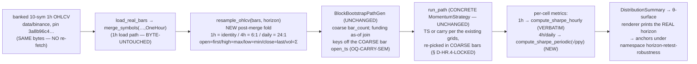

# Horizon retest — coarser decision cadence (4h + daily) on the SAME coins: the LAST untested axis of the active-strategy robustness program — v0.1.0

> **The horizon fix, not a 5th family.** The robustness program has now retired
> **all FOUR** strategy families on the 10-symbol 1h Binance universe —
> cross-sectional momentum, cross-sectional mean-reversion, carry/funding, AND
> time-series absolute momentum — each FAMILY-UNIFORM-FRAGILE and each dominated
> end-to-end by passive equal-weight buy-and-hold (**+1.74 Sharpe 2023 / +1.10
> Sharpe 2024**). The [universe-method diagnosis](../dev-notes/universe-method-diagnosis-2026-06-02.md)
> spiked the universe axis (a broader 35-name mid-cap basket → rank IC still ≈ 0)
> and named "**universe + horizon**" the binding limiter. The universe half is
> now exonerated. **Every family ran at 1h. The HORIZON is the one untested
> variable.**
>
> This feature tests whether a **coarser decision cadence — 4h and daily — on
> the SAME coins** produces a robust edge over passive buy-and-hold, or closes
> the OHLCV-only active-strategy thesis on this data fully. Trend-following is
> classically a daily-to-weekly effect and funding settles every 8h, so a coarser
> cadence is the highest-prior untried knob — and it is testable for **~seconds of
> compute** by deterministically resampling the banked 1h data
> ([pin `3a8b96c4…`](../dev-notes/horizon-retest-scoping-2026-06-03.md), NO
> re-fetch), **provided the 1h-baked Sharpe annualization is first corrected**.
>
> **The load-bearing question this feature answers (either way is decision-grade):**
> *does ANY method clear the +1.74 / +1.10 buy-and-hold bar at a coarser horizon
> where its structural prior is strongest* (→ **pivot the product to a coarser
> cadence**), *or is active trading on this universe dominated at every cadence we
> can test* (→ **closes the OHLCV-only active-trading thesis on this data**, and
> with the universe already exonerated routes the program to the deck's fork —
> different data domain, or productionize the proven stack)?
>
> **This is the analyst brief** — Why / Requirements / Backtest Scenarios /
> mandatory day-1 falsifiers / framed design questions for the architect. It
> commits NO code, triggers NO engine run, and writes NO Design section, tasks, or
> implementation — those are the architect's next, per the workflow. The **91
> existing anchors MUST hold byte-identical**; the horizon work slots in additive /
> defaults-off exactly as all four families did. Full scoping rationale + the
> computed bar counts + the annualization-defect derivation are in
> [`horizon-retest-scoping-2026-06-03.md`](../dev-notes/horizon-retest-scoping-2026-06-03.md)
> — this brief transcribes that scoping into the feature shape.
>
> **Honest prior: MEDIUM** for a non-fragile TS-momentum cell at daily (the
> textbook TSMOM home; the 1h whipsaw diagnosis is exactly what a daily cadence
> attacks); **LOW-MEDIUM** for carry (the 8h-settlement alignment is a real
> structural argument, but the 1h carry grid already used 8h/24h rebalance
> overrides and still failed).

---

## 0. Pre-registration & anti-cherry-pick (inherited verbatim, frozen now)

The horizon surfaces are vetted under the **already-frozen** pre-registered
decision rule ([`robustness-decision-rule-2026-05-30.md`](../dev-notes/robustness-decision-rule-2026-05-30.md) § 0)
— the SAME ruler that scored momentum, mean-reversion, carry, AND TS-momentum.
Nothing about the rule is re-opened. Four commitments carry over:

1. **The bands are frozen.** p5 Sharpe ≥ +0.5 ROBUST / **< 0 FRAGILE**;
   prob-of-loss ≤ 15% ROBUST / > 35% FRAGILE; p95 MaxDD ≤ ~50% ROBUST / > ~70%
   FRAGILE; p50 Sharpe ≥ 1.0 ROBUST; P(Sharpe>1) ≥ 60% ROBUST. Composite = **worst
   primary band wins** (weakest-link). The horizon surfaces are scored against
   these, not the reverse.
2. **The § 0 bands transfer to a coarser horizon AS-IS — but ONLY once the
   per-bar→annual Sharpe scalar is horizon-correct.** The bands are dimensionless
   properties of the *annualized* distribution; none is hour-specific EXCEPT
   through the annualization scalar (§ scoping note § 3.3). prob-of-loss,
   P(Sharpe>0/>1) counts, and MaxDD are annualization-**invariant** (MaxDD is a
   path property; the probability counts are on raw final-equity and on the
   sign-preserving Sharpe). Only the *magnitude* bands (p5/p50 Sharpe ≥ thresholds)
   depend on the scalar being right. **Fix the scalar (R-HR.LOAD) and the ruler is
   valid at 4h/daily with no band changes.**
3. **Anti-cherry-pick by construction.** The θ-surface reports the FULL surface +
   a family verdict and **crowns no argmax winner** (the FP-C3.5 renderer enforces
   this in code). A non-FRAGILE cell carries a `→ C5 DEFLATION REQUIRED` flag.
4. **Pre-flight void-if-fail.** Every horizon report body must print
   `generator: block-bootstrap-real` AND `bootstrap_mode: shared-index`, else the
   verdict is void (the tail is not a fair adversary otherwise). The R-HR.LOAD
   annualization fix is **itself a pre-registration item** — the corrected scalar
   is fixed BEFORE any horizon surface is scored, exactly as the bands were.

**The buy-and-hold control (+1.74 Sharpe 2023, +1.10 Sharpe 2024 at 1h) is the
bar a horizon method must clear to matter** — re-asserted at the new frequency
(R-HR.5). Note the BH *total return* is horizon-invariant (same start/end prices)
but BH *Sharpe* and *MaxDD* WILL differ across horizons (fewer, larger bars →
different per-bar vol and a coarser drawdown path), and that is expected, not a
bug. The active family verdict is read relative to the recomputed BH bar.

---

## Why

### Why a coarser horizon, and why now (the program's LAST untested axis)

The robustness program's result is now a uniform negative across **all four**
families it has tried — and crucially, **all four ran at 1h**:

| Family | Axis result | Killer | Horizon |
|---|---|---|---|
| **Momentum** (x-sec top-K winners) | FAMILY-UNIFORM-FRAGILE (6/6) | turnover / fee-bleed + dead ranking channel | 1h |
| **Mean-reversion** (x-sec bottom-K) | FAMILY-UNIFORM-FRAGILE (6/6) | turnover / fee-bleed + dead ranking channel | 1h |
| **Carry** (x-sec funding rank) | FAMILY-UNIFORM-FRAGILE (2023 + 2024) | funding < price-vol; dead ranking channel | 1h |
| **TS-momentum** (per-asset long/flat) | FAMILY-UNIFORM-FRAGILE (2023 + 2024) | 1h whipsaw / late exits | 1h |
| **Buy-and-hold** (passive) | p50 **+1.74** (2023) / **+1.10** (2024) | — (this is the bar) | 1h |

The [universe-method diagnosis](../dev-notes/universe-method-diagnosis-2026-06-02.md)
attributed the *uniformity* to the dead cross-sectional ranking channel (rank IC
≈ 0) and named the remaining limiter "**universe + horizon**". The universe spike
(§ S) ruled out "just broaden the basket": a 35-name mid-cap universe lowered
common-beta by ~12 points but rank IC stayed pinned at the noise floor. The
TS-momentum result then removed the ranking channel ENTIRELY and *still* came back
fragile — implicating cadence over channel. **The universe is exonerated; the
horizon is the one variable the program has never turned.**

### Why a coarser cadence is the highest-prior untried knob (the structural case)

The horizon-sensitivity priors are not uniform across the four families; two carry
the entire horizon prior (scoping note § 4):

1. **Trend-following is classically a daily-to-weekly effect.** The canonical TSMOM
   literature is monthly/daily. At 1h, TS-momentum was whipsaw-dominated; a daily
   decision cadence is the textbook home for absolute momentum and **directly
   attacks the whipsaw diagnosis** — fewer, more-decisive flips, each costing one
   fee instead of many.
2. **Funding settles every 8h.** A 1h carry rebalance over-trades relative to the
   settlement cadence; a 4h or daily horizon **aligns the decision frequency with
   the settlement frequency** (8h ≈ 2× a 4h bar, ≈⅓ a daily bar) — the natural
   cadence to harvest a settlement-paid premium without churn. (The 1h carry grid
   already used 8h/24h rebalance overrides *on top of* 1h bars; a 4h/daily bar
   makes that native.)

The cross-sectional ranking families (momentum / MR) are LOW prior at any horizon
— rank IC was already ≈ 0 at daily-equivalent lookbacks (L=24 = 1d) both years,
both universe sizes; a coarser bar does not revive a dead ranking channel. **This
is why the focused first pass is TS-momentum + carry** (the two highest-prior
families), deferring x-sec momentum/MR (R-HR.3).

### Why test it now, for almost free (the cost case)

The 1h grid is the SAME banked data resampled — **no new fetch, no new revision,
no new anchor-namespace data dependency** (R-HR.1, pin `3a8b96c4…`). The
resample ratios are **exact integers** (4h = 6:1, daily = 24:1) on Binance's
UTC-aligned grid, so the rollup is boundary-safe and bit-for-bit reproducible.
Compute is a rounding error: the 1h 6×200 sweeps ran ~35 s; a 4h surface is ~⅙
of that (~6 s), daily ~1/24 (~1.5 s). **The focused TS+carry first pass — 2 years
× both horizons = 8 surfaces — is ~1 minute of compute end-to-end.** The real
cost is the dev-time: the resampler, **the load-bearing annualization fix** + its
anchor-neutrality test, the re-picked θ-grids, and the day-1 falsifiers (≈ 2–3
dev-days, scoping note § 5).

### The honest prior (what would make a coarser horizon fragile too) — MEDIUM

State the failure modes up front so the verdict is read honestly:

- **Daily has real power loss.** Daily gives only **~365 bars/year**. The block
  bootstrap resamples *blocks of bars*; with ~365 source returns the resampled
  paths are far less diverse than at 1h (~8 760), and the auto block-length
  (Politis–White) eats a larger fraction of the series per block. Daily is the
  highest-prior horizon for trend, but the p5/p95 tail estimates will be **noisier**
  and the FRAGILE/MARGINAL boundary must be read with the § 6 small-N latitude the
  decision rule already reserves. **4h (~2 190 bars/year) is the power sweet spot**
  — coarse enough to test the thesis, fine enough that the bootstrap retains real
  resampling diversity. Mitigation for daily: **bump N** (R-HR.5).
- **Late exits + up-drift still favour buy-and-hold.** A coarser trend signal lags
  the turn just as the 1h one did — by the time the trend goes negative the drawdown
  is partly taken. And 2023–2024 were net-up years (BH +1.74/+1.10); a long/flat rule
  that is long most of the time largely *replicates* BH while paying fees. The
  baseline-divergence + goes-flat falsifiers (carried forward, F-HR.4) exist to
  detect the degenerate ≈-BH case.
- **A coarser bar cannot synthesize regimes the source year lacks.** A horizon
  change re-buckets the SAME 2023/2024 returns; it does not add market history
  (decision-rule § 5 scope bound). The retest asks "does a coarser cadence on the
  same history beat BH?", not "what happens in an unseen regime."
- **The horizon does not revive the dead ranking channel.** rank IC was ≈ 0 at
  daily-equivalent lookbacks both years — which is why x-sec momentum/MR are
  deprioritized (R-HR.3), not run in the first pass.

**If a coarser horizon ALSO comes back FAMILY-UNIFORM-FRAGILE on the two
highest-prior families, that is the thesis-closing result and is itself
decision-grade.** With the universe already exonerated, a clean negative at the
horizon the priors most favour would **effectively exhaust the OHLCV-only
active-strategy search on this data** — routing the program to the deck's fork
(different data domain / productionize the proven stack). The brief does not
overclaim a horizon edge.

---

## Requirements

### R-HR.1 — Data: resample the banked 1h OHLCV in-memory, NO re-fetch (the data simplification)

- **Deterministically RESAMPLE the banked 1h bars to 4h (6:1) and daily (24:1)
  in-memory** — a standard OHLCV bar-rollup per coarse bucket:
  `open = first 1h open`, `high = max 1h high`, `low = min 1h low`,
  `close = last 1h close`, `volume = Σ 1h volume`. Buckets are UTC-aligned by
  integer division of the on-the-hour `open_time` (`floor(ts_ms / 14_400_000)` for
  4h; `floor(ts_ms / 86_400_000)` for daily) — the year starts at
  `YYYY-01-01T00:00:00Z`, so the first bucket is full and aligned (no partial
  leading bucket).
- **NO fetch, NO new REVISION.toml, NO new anchor-namespace data dependency** — it
  **reuses pin `3a8b96c4…`** (`data/binance/REVISION.toml`), the SAME 10-symbol
  large-cap set the entire program runs on (`ADAUSDT, AVAXUSDT, BNBUSDT, BTCUSDT,
  DOGEUSDT, DOTUSDT, ETHUSDT, LINKUSDT, SOLUSDT, XRPUSDT`). The pin stays in the
  surface body. The ratios are **exact integers** (`8760/6 = 1460`, `8784/6 = 1464`,
  `8760/24 = 365`, `8784/24 = 366`), so every bucket has its full complement of
  source bars; a defensive resample still aggregates whatever bars fall in the
  bucket so a rare missing 1h bar degrades that bucket's volume, not the boundary.
- Both `Timeframe::FourHours` and `Timeframe::OneDay` **already exist** in
  `crates/core/src/bar.rs` — no new enum variant. The 1h coupling is localized to
  the `merge_symbols(…, Timeframe::OneHour)` load; the resample is a fold over the
  merged `Vec<Bar>` (the architect locks whether it is a new `Timeframe`-parameterized
  loader path or a post-`merge_symbols` fold — OQ-RESAMPLE-SEAM).

_Acceptance: a known 1h→4h/daily fixture produces the exact bucket counts
(1460/1464 at 4h, 365/366 at daily for a full year) and the correct OHLCV rollup
(open=first, high=max, low=min, close=last, volume=Σ); see F-HR.3._

### R-HR.2 — Families: TS-momentum + carry FIRST (defer x-sec momentum/MR)

- **The focused first pass tests TS-momentum + carry only** — the two families
  that carry the entire horizon-sensitivity prior (Why § structural case;
  scoping § 4). Both already exist (`SelectionMode::TimeSeriesLongFlat` +
  `entry_threshold`; the carry `ScoreSource::FundingCarry` + funding path) — this
  is a horizon/data-path change, **not a new family**.
- **x-sec momentum/MR are DEFERRED to a fast follow-on** (cheap compute — the
  `--grid tier1` / `mr-tier1` grids are already wired), run *iff* the TS/carry
  first pass shows any non-fragile cell. Their cost is review surface (one anchored
  body + falsifier review + a presenter line per surface), not CPU; the rank-IC
  evidence already predicts they fail at any horizon, so spending the first pass on
  them is the "build-then-discover-the-channel-is-dead" rework the durable-first
  rule exists to prevent.

### R-HR.3 — Horizons & N: daily as headline, 4h as the powered cross-check

- **Run BOTH off one resample pass** (the daily and 4h grids share the resampler;
  the compute delta is seconds): **daily** for the strongest TSMOM prior, **4h** as
  the statistically-powered cross-check.
- **4h at N=200** (the proven default; ~1 460 bars keeps bootstrap diversity high).
- **Daily at N=500–1000** to offset the thin 365-bar series (Why § honest prior;
  scoping § 1.1) — compute is trivial at daily, so the larger N is nearly free and
  directly buys back tail stability. The architect LOCKS N per horizon (N is a
  hashed body field — part of each anchor's identity).

### R-HR.4 — Harness, decision rule, and control: reuse verbatim

- **Through the EXISTING block-bootstrap robustness harness** — `run_path` +
  `DistributionSummary` + `BlockBootstrapPathGen`, **shared-index**, exactly as the
  four families ran. The FP-C1.5 fair-adversary co-movement guard is
  **horizon-independent** (it operates on whatever return matrix it is handed). No
  harness redesign.
- **Scored against the frozen § 0 decision rule** (the weakest-link composite;
  void-if-`gbm-smoke`-or-per-symbol-independent), pre-registered BEFORE the run —
  with the R-HR.LOAD corrected scalar fixed first.
- **The SAME buy-and-hold control** recomputed at the new frequency
  (`run_buyhold_path` is horizon-agnostic by construction — it marks-to-market
  whatever bars the path has), re-asserting the +1.74 / +1.10 bar. The BH *total
  return* over the year is horizon-invariant (a cheap day-1 correctness assertion —
  F-HR.3); BH Sharpe + MaxDD differ across horizons by design.

### R-HR.5 — Money & timing discipline (inherited non-negotiables)

- **Decimal money throughout** (ADR-0003) — no `f64` in any equity / sizing path.
  The resampler aggregates Decimal OHLCV; the annualization arithmetic follows the
  existing `compute_*` return-space convention.
- **Strict no-look-ahead** — a coarse bar's close uses ONLY its constituent 1h bars
  (a forward-shifted source series changes the resampled bar / equity); the
  per-asset/funding decision at coarse-bar `t` uses ONLY information at or before
  `t`. Falsifiers F-HR.3 (resample causality) + F-HR.4 (the carried-forward
  no-look-ahead) guard this.

### R-HR.6 — Determinism & additivity: the 91 existing anchors hold byte-identical

- **The horizon path slots in DEFAULTS-OFF**, exactly like all four families.
  Whatever seam the architect chooses (OQ-RESAMPLE-SEAM, OQ-ANNUALIZE), it MUST
  default to today's 1h behavior so that **every momentum / MR / carry / TS / BH
  run is byte-identical by construction** and the **91 existing anchors** (the 89
  pre-existing + TS #90 2023 + TS #91 2024) stay byte-unchanged with no re-lock.
  This is the SAME additive discipline MR (`Direction`), carry (`ScoreSource`), and
  TS (`SelectionMode`) used.
- **Two-run byte-identity** of each horizon θ-surface body-SHA on the canonical box
  (ADR-0051 D2/D3 precedent).
- **New horizon anchors** under a new namespace `horizon-retest-robustness` after
  the developer's anchored runs; the tester locks them only after a
  `scripts/verify_anchors.sh` → 91/91 PASS. The grids + N are locked at design time
  (architect — the grid IS a hashed body field).

### R-HR.LOAD — THE LOAD-BEARING REQUIREMENT: horizon-aware Sharpe/Sortino/Calmar annualization (anchor-neutral) — the GATE on the whole retest

> **This is the single load-bearing methodological requirement and the gate on
> whether the § 0 decision rule transfers. It is REGRESSION-blocked per CLAUDE.md
> — no horizon surface is scored until it is in and its 1h byte-identity is proven.**

The harness's Sharpe is computed **per-bar** and annualized by a **hardcoded
constant that assumes 1 bar = 1 hour**. At a coarser horizon the same constant
silently **inflates** the annualized Sharpe by a fixed multiplicative factor
(scoping § 3):

- `compute_sharpe_hourly` / `compute_sortino_hourly` (`crates/backtest/src/stats/mod.rs`)
  hardcode `const SQRT_HPY = 92.601…` (= √8575 — the harness annualizes as if a
  year is 8 575 hourly periods) and `sharpe = mean / std * SQRT_HPY`.
- `compute_calmar` hardcodes `years = (n − 1) / 8760.0` — a *separate* 1h-baked
  constant for CAGR.

**The correct per-horizon scalar is `√(periods_per_year)`:** 4h → √2190 ≈ 46.8
(uncorrected ≈ **2.0× too big**); daily → √365 ≈ 19.1 (uncorrected ≈ **4.9× too
big**). A true daily Sharpe of 0.04 would print as ≈0.20 and a true 0.3 as ≈1.5 —
which would **spuriously clear the § 0 ROBUST bands**. This is precisely the class
of silent error the project's fabricated-"Sharpe 1.40" precedent and the
robustness-decision-rule pre-registration exist to prevent.

**The fix MUST be additive + anchor-neutral.** Two non-negotiable halves:

1. **The 1h path stays byte-identical.** The existing `compute_sharpe_hourly` (a
   **verbatim-lifted, anchor-load-bearing** calculator — re-imported by
   `bin/threshold_sweep.rs` so its body-SHA stays byte-identical, and it feeds the
   91 locked surfaces) MUST NOT change its output. The clean approach is an
   **additive horizon-aware variant** (e.g. `compute_sharpe(equity, periods_per_year)`
   with `compute_sharpe_hourly` retained as the `periods_per_year = 8575` wrapper)
   so the 1h anchors are byte-unchanged **by construction**. The architect locks the
   exact signature (OQ-ANNUALIZE).
2. **A new horizon-aware path annualizes 4h/daily correctly.** Parameterize by
   bars-per-year (or by a `Timeframe`/cadence argument), threading the leap-year
   subtlety (2024 = 8 784 / 2 196 / 366 — the sweep already special-cases 2024).

**Day-1 tests for R-HR.LOAD (the gate, RED-on-revert):**
- **F-HR.1 — anchor-byte-identity of the 1h path after the annualization change**:
  `scripts/verify_anchors.sh` → 91/91 PASS, AND a direct unit assertion that the 1h
  Sharpe constant / `compute_sharpe_hourly` output on a fixed series is unchanged.
- **F-HR.2 — annualization correctness at 4h + daily**: a known return series
  annualizes to the expected Sharpe at each frequency (the 4h scalar = √2190, the
  daily scalar = √365; Sortino + Calmar likewise), with the 2024 leap-year value
  checked.

> **Decision-rule § 0 transfer verdict (scoping § 3.3, frozen here):** the seven
> Sharpe/drawdown read-bands transfer **as-is** to a lower frequency *once the
> annualization is horizon-correct*. prob-of-loss, P(Sharpe>0/>1) counts, and MaxDD
> are annualization-invariant; only the magnitude bands (p5/p50 Sharpe) depend on
> the scalar being right. If the architect finds a cleaner refactor that also
> touches the 1h path, the 91 anchors gate it — any 1h body-SHA change is a
> REGRESSION and blocks the build (CLAUDE.md non-negotiable). The safe path is a
> new horizon-aware fn + the existing `compute_sharpe_hourly` retained verbatim as
> the 1h wrapper.

### Requirements summary (consolidated)

- **R-HR.1** — Resample the banked 1h OHLCV in-memory to 4h (6:1) + daily (24:1) —
  open=first/high=max/low=min/close=last/vol=Σ, UTC-bucketed by integer division.
  NO re-fetch (reuse pin `3a8b96c4…`); both `Timeframe` variants already exist.
- **R-HR.2** — Test TS-momentum + carry FIRST; defer x-sec momentum/MR to a
  fast follow-on iff the first pass shows any non-fragile cell.
- **R-HR.3** — Daily as headline + 4h as the powered cross-check, off one resample
  pass; 4h at N=200, daily at N=500–1000 (architect locks N per horizon).
- **R-HR.4** — Through the existing block-bootstrap harness + frozen § 0 decision
  rule + the SAME buy-and-hold control recomputed at the new frequency.
- **R-HR.5** — Decimal money; strict no-look-ahead.
- **R-HR.6** — Additive / defaults-off → the 91 existing anchors byte-identical;
  two-run byte-identity; new horizon anchors after the anchored runs.
- **R-HR.LOAD** — THE GATE: additive + anchor-neutral horizon-aware Sharpe/Sortino/
  Calmar annualization; the 1h path stays byte-identical (F-HR.1), a new path
  annualizes 4h/daily correctly (F-HR.2). REGRESSION-blocked.
- **R-HR.7** — Mandatory day-1 falsifiers (next section), each RED-on-revert.
- **R-HR.8** — Per-horizon θ-surfaces (re-picked grids in BARS) at the per-horizon
  N on 2023 + 2024 at BOTH 4h and daily vs the recomputed BH (Backtest Scenarios);
  the architect LOCKS the exact grids + N.

---

## Mandatory day-1 falsifiers (NON-NEGOTIABLE — modeled on TS F-TSM.* / carry R-CARRY.*)

Per CLAUDE.md (every strategy overlay / sizing-modifier ships a
baseline-equity-divergence e2e from day 1 — the v3-vol-overlay no-op precedent)
and the program's both-axes-from-day-1 discipline, the horizon work ships the
following falsifiers, **each RED-on-revert** (the test must FAIL if the behavior it
guards is reverted — the TS `*_red_on_revert_*` pattern is the template). They ship
in the test file with the code, NOT after.

1. **F-HR.1 — Anchor-byte-identity of the 1h path after the annualization change
   (the R-HR.LOAD gate, half 1).** `scripts/verify_anchors.sh` → 91/91 PASS, AND a
   direct unit assertion that the 1h Sharpe constant + `compute_sharpe_hourly`
   output on a fixed reference series are byte/value-unchanged. **RED-on-revert:** a
   refactor that alters the 1h scalar moves a 91-anchor body-SHA → the test fails,
   proving it detects a 1h-path mutation. *This is the gate that the annualization
   fix is anchor-neutral.*
2. **F-HR.2 — Annualization correctness at 4h + daily (the R-HR.LOAD gate, half 2).**
   A known return series annualizes to the expected Sharpe at each frequency: the 4h
   scalar = √2190 (≈46.8), the daily scalar = √365 (≈19.1) — and Sortino + Calmar
   likewise — with the 2024 leap-year value (√2196 / √366) checked. **RED-on-revert:**
   wiring the horizon path to the 1h √8575 constant inflates the 4h Sharpe ≈2.0× /
   daily ≈4.9× → the asserted value mismatches and the test fails.
3. **F-HR.3 — Resample correctness (the OHLCV rollup + causality).** A known 1h→4h
   and 1h→daily fixture produces (a) the exact bucket counts (1460/1464 at 4h,
   365/366 at daily over a full year), (b) the correct OHLCV rollup (open=first /
   high=max / low=min / close=last / volume=Σ), and (c) the BH total-return
   invariant across horizons (the resampled BH total return matches the 1h BH total
   return to rounding — R-HR.4). Plus a causality leg: a forward-shifted source
   series changes the resampled bar (no future 1h bar leaks into the current coarse
   bucket). **RED-on-revert:** an off-by-one bucket boundary or a `mean`/`last`
   confusion on `open`/`high`/`low` breaks the asserted rollup or the count.
4. **F-HR.4 — The standard per-family falsifiers carry over for the retested
   families.** The CLAUDE.md baseline-equity-divergence e2e (≥ 1 bp vs the un-traded
   buy-and-hold baseline when the decision variable is non-trivial), the
   signal-non-no-op gate, and the no-look-ahead falsifier carry forward from the TS
   (`ts_momentum_divergence_e2e.rs`: F-TSM.1/2/3/4) and carry
   (`carry_divergence_e2e.rs`: divergence + sign + no-look-ahead) suites, **now
   exercised at the coarser horizon** — including the TS-specific goes-flat gate
   (the rule must actually exit to FLAT on a coarse-bar downtrend, else it is ≈ BH
   at the new cadence). **RED-on-revert:** an always-long (no-op) coarse-horizon TS
   rule produces Δ=0 vs the recomputed BH → the test fails.
5. **F-HR.5 — Two-run byte-identity of each horizon θ-surface body-SHA** (ADR-0051
   D2/D3/§D6.4): run the small-N horizon sweep twice at the same `ensemble_seed`;
   assert identical `report_body_hash`. Catches any unordered fold in the resampler,
   the per-horizon grid, or the surface renderer.

Pattern references the architect/developer should reuse:
`crates/strategy/tests/vol_targeting_overlay_end_to_end.rs` (the CLAUDE.md
no-op-overlay non-negotiable — directly applicable to F-HR.4);
`crates/backtest/tests/ts_momentum_divergence_e2e.rs` (the TS sibling divergence +
RED-on-revert + goes-flat + no-look-ahead + two-run gates F-HR.4/5 mirror);
`crates/backtest/tests/carry_divergence_e2e.rs` (the carry sibling, for the carry
arm); `crates/backtest/tests/param_sweep_e2e.rs` (the θ-surface two-run +
anti-cherry-pick gates).

---

## Backtest Scenarios
_analyst proposes the SHAPE; the **architect LOCKS the exact θ-axes + cells + N**
per horizon before the tester anchors (the grid IS the hashed anchor input — and
note `lookback_minutes` is interpreted as a **BAR COUNT**, NOT wall-clock minutes,
so the 1h grids MUST NOT carry over verbatim — see below)._

The primary anchored deliverables are **TS-momentum + carry θ-surfaces at BOTH 4h
and daily**, each of the SAME shape as the 1h C3 6×N surface — a small LOCKED
θ-grid spanning the family's two axes (TS: lookback × entry/flat threshold; carry:
L × rebalance × k_long) — at the per-horizon N (R-HR.3), on **2023-FY AND 2024-FY**,
against the recomputed buy-and-hold control. Both regimes run from day 1 (the
carry/TS precedent); the 2024 surface is the harder bar (BH +1.10, tail-negative).

> **The critical scaling fix — re-pick the θ-grids in BARS per horizon.**
> `lookback_minutes` is interpreted as a **bar count**, not wall-clock minutes
> (`cross_sectional/config.rs`: *"Lookback window in bars"*). A θ-grid lookback
> therefore does NOT auto-scale with the horizon — the SAME number means a 6×- or
> 24×-longer wall-clock window at a coarser bar. The 1h TS grid's `{24, 168, 720}`
> bars = `{1d, 1wk, 30d}`; at daily, **720 bars = 2 years > the 365-bar series** — a
> correctness bound, not a preference. The grids MUST be re-centred on
> horizon-appropriate wall-clock windows:
> - **Daily TS grid (suggested, architect to lock):** lookbacks in *days* — e.g.
>   `{5, 20, 60}` bars = `{1wk, 1mo, 1qtr}`, the classic TSMOM windows.
> - **4h TS grid (suggested):** lookbacks in 4h-bars — e.g. `{42, 180, 540}` bars =
>   `{1wk, 30d, 90d}` to mirror the 1h grid's wall-clock span at the new resolution.
> - **Carry:** the carry grid's `lookback_minutes` encodes L = funding settlements
>   (not bars) and `rebalance_minutes_override` is wall-clock minutes; at a coarser
>   bar the rebalance override should map to the bar cadence (native 4h/daily
>   rebalance) and L stays in settlement units — the architect confirms the carry L +
>   rebalance + as-of-funding semantics under resampling (OQ-CARRY-SEM).
> - **Keep each grid 6 cells** (the proven shape; one body-SHA per surface) spanning
>   the same axes, just re-centred per horizon.

1. **HR-TS-4h / HR-TS-daily (PRIMARY, ANCHORED) — 2023-FY + 2024-FY**: the
   re-picked TS-momentum θ-grids (lookback × entry/flat threshold) at the
   per-horizon N (4h: N=200; daily: N=500–1000), shared-index block-bootstrap of the
   *resampled* 2023/2024 real Binance OHLCV (pin `3a8b96c4…`), 6 bps fees (2 slippage
   + 4 taker, inherited). Per surface: per-cell FRAGILE/MARGINAL/ROBUST + family
   verdict + per-cell `→ C5` flags + the trades column + the TS time-in-market /
   fraction-flat column.
2. **HR-CARRY-4h / HR-CARRY-daily (PRIMARY, ANCHORED) — 2023-FY + 2024-FY**: the
   carry θ-grids (L × rebalance × k_long, per OQ-CARRY-SEM) at the per-horizon N on
   the resampled OHLCV + the reused funding parquets (the funding as-of join
   resamples for free — it is timestamp-driven, not bar-index-driven), same fee
   regime, same surface shape.
3. **Control (in each surface)** — buy-and-hold equal-weight recomputed at the new
   frequency under the same N paths + auto-L bootstrap, re-asserting the +1.74
   (2023) / +1.10 (2024) bar. This row carries no verdict; the family verdict is
   read relative to it.

**Plan to anchor: the per-horizon TS + carry surfaces under a new namespace
`horizon-retest-robustness`** (e.g. ~8 surfaces for the focused first pass: TS +
carry × 4h + daily × 2 years). The exact anchor count + which regimes/horizons are
locked vs gating-read is the architect-and-tester call at design/lock time (the
durable choice locks each headline surface; deferring a regime to a gating read is
the if-wall-clock-tight fallback, the carry #88/#89 precedent). The grids + N + the
horizon are hashed body fields (K3) once locked.

> **Wall-clock gate (carried to the developer).** A 4h surface is ~⅙ of the 1h ~35 s
> (~6 s @ N=200); daily ~1/24 (~1.5 s @ N=200, ~4–8 s @ N=500–1000). The focused
> TS+carry first pass (8 surfaces) is ~1 min of compute end-to-end — compute is a
> rounding error; the cost is dev-time + anchored-surface review. The developer MUST
> re-validate the wall-clock before locking (`wall-clock ≈ grid × N × per-path
> cost`), and emit a `watch -n 10 'tail -n 5 <progress-log>'` block when kicking off
> any N=500 daily or full four-family run (per the long-running-task recipe — the
> scoping note § 5.4 has a copy-pasteable block).

---

## Open design questions (FOR THE ARCHITECT M-T1 — framed, NOT answered)

These are the analyst-framed decisions the architect resolves next (with the
analyst's lean noted where I have one, NOT locked). I deliberately do **not** answer
them — the seam, the grids, and the engine/harness-fit are architect M-T1 calls.
OQ-1..5 are carried forward from the scoping note § 6, plus two integration
questions surfaced there.

- **OQ-ANNUALIZE (OQ-1 — the headline, the R-HR.LOAD signature).** What is the exact
  horizon-aware annualization signature? Parameterize `compute_sharpe` /
  `compute_sortino` / `compute_calmar` by an explicit **bars-per-year** scalar, or by
  a **`Timeframe`/cadence** argument that maps to it internally? And how is the
  **leap-year** (2024 = 8 784 / 2 196 / 366) threaded — the sweep already
  special-cases 2024, so the periods-per-year must be year-aware, not just
  horizon-aware. The non-negotiable constraint: `compute_sharpe_hourly` is retained
  **verbatim** as the 1h wrapper so the 91 anchors are byte-identical (R-HR.LOAD /
  F-HR.1). *Analyst lean: an explicit `periods_per_year: f64` parameter is the most
  legible and most testable (F-HR.2 asserts a literal √-value); a `Timeframe` arg
  hides the year-awareness. But the architect owns the trade-off vs threading a raw
  scalar through every call-site.*
- **OQ-RESAMPLE-SEAM (the resampler's integration point).** Is the 1h→{4h,daily}
  resample a new **`Timeframe`-parameterized loader path** (the resample happens
  inside / alongside `read_parquet_bars` + `merge_symbols`, returning coarse bars
  directly) or a **post-`merge_symbols` fold** over the merged 1h `Vec<Bar>`
  (load 1h as today, then roll up)? *Analyst lean: a post-merge fold is the smaller
  blast radius and keeps the 1h load path byte-untouched (anchor-safe by
  construction); a loader-path resample is more composable for future horizons but
  touches the load seam the 91 anchors run through. The architect weighs
  composability vs anchor-blast-radius.*
- **OQ-BOOTSTRAP-TF (OQ-2 — the synthetic timestamp ladder).** The bootstrap stamps
  its *output* bars with `Timeframe::OneHour` + a 1h `Duration` ladder regardless of
  source cadence. This is **cosmetic** for the strategy (keys off `close` + bar
  ordering) and for the per-bar Sharpe (per-return, not per-wall-second). Does the
  resampled `tf` need to be threaded through `synthetic_bars` / the bootstrap
  timestamp ladder (a legibility nicety — the output `tf` would read `OneDay` on a
  daily path), or is leaving it cosmetically `1h` acceptable? *Analyst lean: cosmetic
  1h is correctness-safe; threading the real tf is a legibility-only nicety the
  architect can defer or include — but if the surface RENDERER prints the tf, it
  should print the real horizon, not `1h`, so the operator reads the right cadence.*
- **OQ-GRID (OQ-3 — the exact re-picked θ-grids per horizon, the hashed cells).**
  Ratify or revise the suggested re-picked bar counts (daily TS `{5,20,60}`; 4h TS
  `{42,180,540}`; carry per OQ-CARRY-SEM) and LOCK the exact cells × the threshold
  axis × N before the tester anchors. The hard correctness bound: NO daily lookback
  may exceed ~365 bars (720 bars at daily = 2yr > data). *Analyst lean: keep each
  grid 6 cells (factorial lookback × threshold), re-centred on the wall-clock windows
  above; the exact cells are the architect's to lock.*
- **OQ-CARRY-SEM (OQ-4 — carry's L + rebalance + as-of-funding under a coarser bar).**
  The funding as-of join resamples for free (timestamp-driven). But at a daily horizon
  each bar spans **three** 8h settlements — does carry want "last settlement at the
  bar's open_ts" (the current as-of behavior) or a "trailing-mean over the bar's
  settlements"? And how does `rebalance_minutes_override` map onto the coarse bar
  (native 4h/daily rebalance)? *Analyst lean: "last settlement" preserves the
  existing as-of semantics and the apples-to-apples with the 1h carry surfaces;
  trailing-mean is a methodological change the architect should only make with an
  explicit rationale. Architect locks.*
- **OQ-N (OQ-5 — N per horizon).** LOCK N per horizon: 4h at N=200 (the proven
  default), daily at N=500 or N=1000 (to offset the thin 365-bar series). *Analyst
  lean: daily N=1000 is the durable choice (maximal tail stability at ~seconds of
  extra compute); N=500 is the acceptable if-budget-tight fallback. N is a hashed
  body field — part of each anchor's identity — so it is locked at design time.*

---

## Design

_Architect M-T1 (2026-06-03). All six OQs resolved + justified below.
The headline call (**OQ-ANNUALIZE / R-HR.LOAD**) is **keep
`compute_sharpe_hourly` / `compute_sortino_hourly` / `compute_calmar`
byte-verbatim as the 1h path, and ADD three sibling horizon-aware
fns** (`compute_sharpe_periodic` / `compute_sortino_periodic` /
`compute_calmar_periodic`) that take an explicit `periods_per_year: f64`
— so the 91 anchors are byte-identical **by construction** (the 1h call
sites are untouched; the verbatim functions are never edited). The
resampler (**OQ-RESAMPLE-SEAM**) is a **post-`merge_symbols` fold** in
`load_real_bars` that, when `--horizon 1h` (the default), is an
identity pass-through → the 1h load path is byte-untouched. The
re-picked θ-grids + N (**OQ-GRID / OQ-N**) are LOCKED in § D-HR.4-LOCKED.
The carry semantics under a coarser bar (**OQ-CARRY-SEM**) keep the
existing per-bar funding-ring + as-of join unchanged, re-pick L per
horizon, and set the rebalance to the native coarse-bar cadence via the
grid. The bootstrap timestamp ladder (**OQ-BOOTSTRAP-TF**) stays
cosmetically 1h (correctness-safe); the renderer prints the REAL horizon.
`run_path` / `PaperEngine` / `BlockBootstrapPathGen` are byte-UNTOUCHED.
The determinism model is recorded as an **ADR-0051 § D6.8 amendment**
(a horizon/data-path change varied at the LOAD + the calculator level —
the resampler is a deterministic ordered fold; the new annualization fns
are additive; the 1h path is verbatim; the same anchor-additive discipline
MR/carry/TS used). New anchors under a NEW namespace
`horizon-retest-robustness` (NOT `mc-robustness-2026-06` — the horizon is
a distinct experiment axis)._

### D-HR.0 — One-paragraph design

The horizon retest is **a data-path + calculator change, not a new
strategy family** — the two highest-prior families (TS-momentum +
carry) and the harness, bootstrap, decision rule, BH control, and
anchor machinery all already exist (TS landed #90/#91; carry #88/#89).
It is exactly **four additive, defaults-off pieces**: **(1)** a
deterministic **1h→{4h,daily} OHLCV resampler** (`resample_ohlcv`, a
pure ordered fold over a sorted per-symbol `Vec<Bar>`:
open=first/high=max/low=min/close=last/vol=Σ/trade_count=Σ per
UTC-integer-division bucket), wired as a post-`merge_symbols` fold in
`load_real_bars` gated on a new `--horizon {1h,4h,daily}` flag that
**defaults to 1h = identity pass-through**; **(2)** three **sibling
horizon-aware annualization fns** in `stats/mod.rs`
(`compute_sharpe_periodic(equity, periods_per_year)` etc.) that
annualize by `√periods_per_year`, with the existing
`compute_sharpe_hourly` / `compute_sortino_hourly` / `compute_calmar`
kept **byte-verbatim** as the 1h path (NOT refactored to derive their
constant — an ULP change breaks 91 anchors); **(3)** the sweep selects
the 1h-verbatim path vs the horizon-aware path by the resolved
`Timeframe`, computes the correct `periods_per_year` per `(horizon,
year)` (leap-year-aware), and threads the COARSE `bar_count` into the
bootstrap + BH; **(4)** the re-picked per-horizon θ-grids (lookbacks in
COARSE bars) as new `const` grids selected by `--horizon` + `--grid`.
Everything is flag/enum-gated to today's behaviour, so the **91 anchors
(momentum #86, MR #87, carry #88/#89, TS #90/#91, all pre-existing) are
byte-identical by construction** with no re-lock. The load-bearing
gate is the annualization fix; it is REGRESSION-blocked (CLAUDE.md) and
its 1h byte-identity (F-HR.1, 91/91) is proven BEFORE any horizon
surface is scored.



### D-HR.1 — OQ-ANNUALIZE RESOLVED (THE LOAD-BEARING DECISION): keep the 1h fns byte-verbatim, ADD `*_periodic(periods_per_year)` siblings — anchor-neutral by construction

**RATIFIED: the 1h calculators stay byte-verbatim; three NEW sibling
fns take an explicit `periods_per_year: f64`** (the analyst's lean —
the most legible and most testable; F-HR.2 asserts a literal √-value).
The constraint is absolute and is the sharpest anchor-risk in the whole
program: `compute_sharpe_hourly` is re-imported by `bin/threshold_sweep.rs`
(R-NR.5) and feeds all 91 locked surfaces, so **its body-SHA must stay
byte-identical**. The decisive rejection:

| Option | Decision | Why |
|---|---|---|
| **Parameterize the EXISTING fns** — make `compute_sharpe_hourly` call a private `compute_sharpe(equity, ppy)` with `ppy = 8575` | **REJECTED** | Even a refactor that is *intended* to be value-preserving risks an ULP change (constant-folding order, an intermediate `let`, a `sqrt` vs a hardcoded `√8575` literal). The brief's HARD CONSTRAINT is the **body** stays byte-identical, not just the output. The 91-anchor blast radius makes any edit to these three fns a REGRESSION risk not worth taking. The verbatim functions are the safe path **by construction** — they are *never touched*. |
| **A `Timeframe`/cadence argument** that maps to ppy internally | **REJECTED as the signature** | Hides the year-awareness (the leap-year ppy must be year-aware, NOT just horizon-aware — § D-HR.1.2). A `Timeframe`→ppy map cannot see the year; the sweep would have to special-case 2024 *inside* the calculator. Threading the raw `f64` keeps the calculator dumb + testable and puts the `(horizon, year)→ppy` logic in ONE place in the sweep (§ D-HR.1.2). |
| **Keep the three 1h fns VERBATIM + add `compute_sharpe_periodic(equity, ppy: f64)` / `compute_sortino_periodic` / `compute_calmar_periodic`** | **RATIFIED** | The 91 anchors are byte-identical because the 1h call sites + the 1h fn bodies are **untouched**. The new fns are pure additions (dead code for every 1h run). F-HR.2 asserts the new fns hit `√2190` / `√365` (+ leap) exactly. This is the direct structural analogue of how MR/carry/TS each ADDED a branch and left the existing path verbatim. |

**The new sibling functions (exact signatures, `stats/mod.rs`, siblings
to the verbatim 1h fns):**

```rust
// stats/mod.rs — NEW, siblings to compute_sharpe_hourly (which is NOT edited).
// Body is the SAME arithmetic as the 1h fn EXCEPT the hardcoded SQRT_HPY is
// replaced by `periods_per_year.sqrt()`. The 1h fn is left byte-verbatim.

#[must_use]
pub fn compute_sharpe_periodic(equity: &[Decimal], periods_per_year: f64) -> f64 { /* mean/std * periods_per_year.sqrt() */ }

#[must_use]
pub fn compute_sortino_periodic(equity: &[Decimal], periods_per_year: f64) -> f64 { /* mean/down_std * periods_per_year.sqrt() */ }

#[must_use]
pub fn compute_calmar_periodic(equity: &[Decimal], periods_per_year: f64) -> f64 { /* years = (n-1)/periods_per_year */ }
```

> **D-HR.1.1 — the 1h path keeps TWO inconsistent constants, verbatim;
> the horizon path is mathematically correct (and that is intended +
> safe).** Read off `stats/mod.rs`: the 1h **Sharpe/Sortino** use
> `SQRT_HPY = 92.601_295_098_46` where `SQRT_HPY² = 8574.9998…` (a
> hand-entered ≈√8760, NOT exactly √8760), while the 1h **Calmar** uses
> `years = (n−1)/8760.0` (the true 8760). These two are **inconsistent
> inside the 1h path itself** (Sharpe annualizes as if 8575 h/yr;
> Calmar as if 8760 h/yr). We keep BOTH verbatim — they are
> anchor-load-bearing and immutable. The new `*_periodic` fns are
> **mathematically correct for 4h/daily** (Sharpe/Sortino AND Calmar
> both use the true bars-per-year), because **4h/daily are NEW — no
> anchor binds them**, so there is no reason to propagate the 1h √8575
> quirk. This is a feature (the coarse horizons are correct from birth)
> and is safe (the quirk lives only in the verbatim 1h path). The
> developer MUST NOT "fix" the 1h √8575 to √8760 — that is a 91-anchor
> REGRESSION.

> **D-HR.1.2 — the leap-year scalar is YEAR-aware, computed in ONE place
> (the sweep), not in the calculator.** The exact `periods_per_year`
> per `(horizon, year)` — the values F-HR.2 asserts:
>
> | horizon | 2023 (non-leap) ppy | √ppy | 2024 (leap) ppy | √ppy |
> |---|---:|---:|---:|---:|
> | **1h** (verbatim path) | 8 760 | (uses √8575 const) | 8 784 | (uses √8575 const) |
> | **4h** | **2 190** | **46.797 435 827 2** | **2 196** | **46.861 498 055 4** |
> | **daily** | **365** | **19.104 973 174 5** | **366** | **19.131 126 469 7** |
>
> A small `fn periods_per_year(horizon: Horizon, year: i32) -> f64` in
> the sweep returns `bars_per_year` directly (`4h → 2190/2196`,
> `daily → 365/366`, keyed on `year == 2024`), mirroring the existing
> `bar_count = match year { 2023 => 8760, 2024 => 8784 }`
> (`param_robustness_sweep.rs:2149`). For 1h the sweep does NOT call
> `*_periodic` at all — it calls the verbatim `compute_sharpe_hourly`.
> The sweep picks the path by the resolved horizon: `if horizon == 1h
> { compute_sharpe_hourly(eq) } else { compute_sharpe_periodic(eq,
> periods_per_year(horizon, year)) }`. **This branch lives at BOTH
> metric call sites** — the per-cell path (`param_robustness_sweep.rs:1966`)
> and the BH control (`param_robustness_sweep.rs:2383`) — so the BH bar
> is recomputed at the correct scalar too (R-HR.4).

> **D-HR.1.3 — why this is the F-HR.1 gate, restated.** Because the
> three 1h fns are byte-verbatim and their two 1h call sites are
> behind `if horizon == 1h`, **every** momentum/MR/carry/TS/BH **1h**
> run computes its metrics through the identical code → identical f64 →
> identical body-SHA. F-HR.1 proves it two ways: (a)
> `scripts/verify_anchors.sh` → **91/91 PASS** after the change; (b) a
> direct unit assertion that `compute_sharpe_hourly` on a fixed
> reference series returns the byte-identical f64 it returned before
> (and that `compute_sharpe_periodic(eq, 8575.0)` ≈ but is NOT asserted
> bit-equal to the 1h fn — they share arithmetic but the 1h fn is the
> only anchored one). RED-on-revert: if a refactor folds the 1h fn into
> the periodic fn, a 91-anchor body-SHA moves → F-HR.1 fails.

### D-HR.2 — OQ-RESAMPLE-SEAM RESOLVED: a post-`merge_symbols` fold in `load_real_bars`, 1h = identity pass-through (smallest anchor blast radius)

**RATIFIED: the resample is a post-`merge_symbols` fold** (the
analyst's lean — smallest blast radius, the 1h load path byte-untouched
by construction), NOT a `Timeframe`-parameterized loader path. The
1h coupling is the single line `merge_symbols(&symbol_paths,
Timeframe::OneHour)` (`realdata.rs:227`); the parquet reader reads the
**actual** `open_time`/`close_time` from file content (the `Timeframe`
arg is metadata stamped on each `Bar`, NOT a re-bucketing instruction —
scoping § 2.2). So the resample is a pure fold over the already-merged,
already-sorted per-symbol `Vec<Bar>`.

**Exact integration point.** In `load_real_bars`
(`param_robustness_sweep.rs:1683`), the merged bars are grouped into
`by_symbol: BTreeMap<String, Vec<Bar>>` and sorted by `open_ts`
(lines 1717-1727). The resample fold runs **right there**, per symbol,
**after** the sort and **before** the `bars_by_symbol` collect
(line 1729): each symbol's sorted 1h `Vec<Bar>` → a coarse `Vec<Bar>`.
When `--horizon 1h` (default) the fold is a no-op pass-through (returns
the input unchanged — the 1h load path is byte-identical). The
`expected_total` coverage check (`realdata.rs` § 6 / `param_robustness_sweep.rs:1695`)
stays on the **1h** count (the 99.5% tolerance is verified on the raw 1h
load, BEFORE the resample — so the gate is unchanged); the COARSE
`bar_count` is computed separately for the bootstrap (§ D-HR.3).

**`resample_ohlcv` — the new pure fn (locked spec).** A new module
`crates/backtest/src/resample.rs` (or a sibling fn in `realdata.rs`):

```rust
// resample.rs — NEW. Pure, deterministic, Decimal OHLCV. No I/O.
#[must_use]
pub fn resample_ohlcv(bars_1h: &[Bar], horizon: Horizon) -> Vec<Bar> {
    // horizon == OneHour → return bars_1h.to_vec()  (identity — 1h byte-untouched)
    // else: bucket_ms = 14_400_000 (4h) | 86_400_000 (daily);
    //   key(bar) = (bar.open_ts.unix_ms()).div_euclid(bucket_ms);
    //   group consecutive bars by key (input is sorted ASC by open_ts);
    //   per bucket emit ONE Bar:
    //     open  = first bar.open,  high = max bar.high,  low = min bar.low,
    //     close = last bar.close,  volume = Σ bar.volume,  trade_count = Σ,
    //     open_ts  = bucket-aligned (floor(first.open_ts / bucket)*bucket),
    //     close_ts = last bar.close_ts,  tf = horizon.to_timeframe(),
    //     symbol/venue = inherited; local_recv_ts = close_ts (the realdata norm).
}
```

**The locked rollup rules (the F-HR.3 acceptance):**

- **Bucketing** = integer division of the on-the-hour `open_time_ms`:
  `floor(ts_ms / 14_400_000)` (4h, 6:1), `floor(ts_ms / 86_400_000)`
  (daily, 24:1). Because the year starts `YYYY-01-01T00:00:00Z`
  (`TimeSpan::full_year`, `realdata.rs:86`), the first bucket is full
  and aligned — no partial leading bucket. Exact integer ratios
  (`8760/6=1460`, `8784/6=1464`, `8760/24=365`, `8784/24=366`) mean
  every full bucket has its complement of source bars.
- **OHLCV** = `open=first 1h open`, `high=max 1h high`, `low=min 1h
  low`, `close=last 1h close`, `volume=Σ 1h volume`, `trade_count=Σ`.
  All `Decimal` (R-HR.5 / ADR-0003) — `max`/`min` use `Decimal::max`/`min`
  (total order, no f64), `Σ` is `Decimal` addition.
- **Gap handling (defensive).** Aggregate **whatever** bars fall in the
  bucket — a rare missing 1h bar degrades that bucket's volume, not the
  boundary (scoping § 2.1). NO interpolation, NO synthetic fill.
- **Determinism.** The fold is a single pass over the sorted input
  (`open_ts` ASC), grouping by a monotonically non-decreasing integer
  key — NO `HashMap`, NO unordered fold. Two-run byte-identity (F-HR.5)
  holds by construction.
- **`open_ts`/`close_ts` stamping** is **cosmetic** for the harness
  (the bootstrap re-stamps with its own ladder — § D-HR.5; the strategy
  keys off `close` + bar ordering). But we stamp the real coarse
  `open_ts` so the funding as-of join (§ D-HR.6) keys off the correct
  bucket-open timestamp.

### D-HR.3 — coarse `bar_count` threading (the bootstrap + BH path length)

`bar_count` (`param_robustness_sweep.rs:2149`) is the path length passed
to `BlockBootstrapPathGen::generate(universe, bar_count, seed)` and the
GBM smoke. Today it is `match year { 2023 => 8760, 2024 => 8784 }`. The
fix is to derive it from `(year, horizon)`:

```rust
let bars_per_year_1h = match args.year { 2023 => 8760, 2024 => 8784, _ => 8760 };
let bar_count = match args.horizon {
    Horizon::OneHour  => bars_per_year_1h,           // 8760 / 8784  (UNCHANGED for 1h)
    Horizon::FourHours => bars_per_year_1h / 6,      // 1460 / 1464
    Horizon::OneDay    => bars_per_year_1h / 24,     // 365  / 366
};
```

The ratios are exact integers (scoping § 1), so the integer division is
clean. The resampled per-symbol series produced by § D-HR.2 has exactly
this length (F-HR.3 asserts the count). The bootstrap then resamples
blocks of COARSE returns (`T−1 = bar_count−1` coarse log-returns) — the
power caveat (daily ≈ 365 source returns → noisier tails) is real and is
the reason daily runs at higher N (§ D-HR.5 / OQ-N). For 1h, `bar_count`
is the literal `8760/8784` it is today → byte-identical.

### D-HR.4-LOCKED — OQ-GRID + OQ-CARRY-SEM RESOLVED: the re-picked per-horizon θ-grids (lookbacks in COARSE bars), LOCKED

**LOCKED** (the grid IS a hashed body field, K3 — § D6.3; changing it =
a different surface = a different SHA). The critical correctness bound
(brief Backtest Scenarios): `lookback_minutes` is interpreted as a
**BAR COUNT** for the price ring (`config.rs:136` "Lookback window in
bars"), so the SAME number is a 6×- or 24×-longer wall-clock window at a
coarser bar — the 1h `{24,168,720}` does NOT carry over (720 daily bars
= 2 yr > the 365-bar series). The grids are re-centred on
horizon-appropriate wall-clock windows, **6 cells each** (the proven
shape), spanning the same two axes.

**HR-TS-4h grid** (`TS_4H_GRID`) — lookback (4h-bars) × entry_threshold;
`{42, 180, 540}` bars = `{1 wk, 30 d, 90 d}`:

| g | lookback (4h-bars) | wall-clock | entry_threshold | role |
|---|---:|---|---:|---|
| 0 | 42 | ~1 wk | 0.00 | baseline TS θ* (1-wk trend, long/flat-on-sign) |
| 1 | 42 | ~1 wk | 0.02 | 1-wk + wide band — low-churn corner |
| 2 | 180 | ~30 d | 0.00 | 30-d trend, zero band |
| 3 | 180 | ~30 d | 0.02 | 30-d + wide band — **best structural shot** |
| 4 | 540 | ~90 d | 0.00 | slow 90-d trend |
| 5 | 540 | ~90 d | 0.02 | slowest + most decisive |

**HR-TS-daily grid** (`TS_DAILY_GRID`) — lookback (daily-bars) ×
entry_threshold; `{5, 20, 60}` bars = `{1 wk, 1 mo, 1 qtr}`, the classic
TSMOM windows (hard bound: NO lookback > ~365):

| g | lookback (daily-bars) | wall-clock | entry_threshold | role |
|---|---:|---|---:|---|
| 0 | 5 | ~1 wk | 0.00 | fast TSMOM (1-wk trend) |
| 1 | 5 | ~1 wk | 0.02 | 1-wk + wide band |
| 2 | 20 | ~1 mo | 0.00 | baseline TS θ* (1-mo trend) |
| 3 | 20 | ~1 mo | 0.02 | 1-mo + wide band — **best structural shot** |
| 4 | 60 | ~1 qtr | 0.00 | classic slow TSMOM (1-qtr) |
| 5 | 60 | ~1 qtr | 0.02 | slowest + most decisive |

> Both TS grids hold constant (mirroring § D-TSM.3-LOCKED):
> `selection_mode = time_series_long_flat`, `direction = momentum`
> (identity), `k_long = 10` (inert under long/flat), `exposure_cap =
> 0.50`, `k_short = 0`, `size = equal_weight`, `vol_floor` inert,
> 10-symbol universe (pin `3a8b96c4…`), `ensemble_seed = 0xC0FFEE`,
> `fill_seed = 0xC0FFEE`, generator `block-bootstrap-real`,
> `bootstrap_mode = shared-index`, **`rebalance_minutes_override = 0`**
> (re-check the trend every coarse bar — see § D-HR.6 for why "every
> bar" is correct for TS under the cosmetic-1h ladder). The TS trend
> score (raw Σ log-return over L coarse bars) and the goes-flat
> behaviour are reused verbatim — only the bar cadence changed.

**HR-CARRY-4h / HR-CARRY-daily grids** (`CARRY_4H_GRID` /
`CARRY_DAILY_GRID`) — L (funding settlements, consumed as a coarse-bar
ring count — § D-HR.6) × rebalance × k_long, re-picked so the rebalance
is the **native coarse-bar cadence** and L spans a sensible settlement
window. **OQ-CARRY-SEM RESOLVED: keep the existing per-bar funding-ring
+ "last settlement at the coarse bar's open_ts" as-of join (NOT a
trailing-mean change); re-pick L per horizon as a coarse-bar count; set
rebalance to native coarse-bar cadence.**

HR-CARRY-4h (`L` in 4h-bars; rebalance native = every 4h bar):

| g | L (4h-bars) | rebalance | k_long | role |
|---|---:|---|---:|---|
| 0 | 6 | every 4h bar | 3 | baseline carry θ* (~1 d settlement window) |
| 1 | 2 | every 4h bar | 3 | fast (~1/3 d) |
| 2 | 12 | every 4h bar | 3 | slow (~2 d) |
| 3 | 6 | every 2nd 4h bar (~8 h) | 5 | low-churn / settlement-aligned corner |
| 4 | 6 | every 4h bar | 1 | narrow selection |
| 5 | 2 | every 4h bar | 5 | fast + wide |

HR-CARRY-daily (`L` in daily-bars; rebalance native = every daily bar):

| g | L (daily-bars) | rebalance | k_long | role |
|---|---:|---|---:|---|
| 0 | 3 | every daily bar | 3 | baseline carry θ* (~3 d window) |
| 1 | 1 | every daily bar | 3 | fastest (~1 d) |
| 2 | 7 | every daily bar | 3 | slow (~1 wk) |
| 3 | 3 | every daily bar | 5 | wide selection |
| 4 | 3 | every daily bar | 1 | narrow selection |
| 5 | 7 | every daily bar | 5 | slow + wide |

> **Rebalance cadence under the cosmetic-1h ladder — the load-bearing
> carry subtlety (read with § D-HR.6).** `is_rebalance_bar`
> (`momentum.rs:166`) measures `minutes_since(prev, bar.close_ts)` —
> **wall-clock minutes** between bar-close timestamps — against
> `rebalance_minutes`. The bootstrap stamps synthetic bars on a **1h
> ladder** regardless of source cadence (`bootstrap.rs:414`,
> `Duration::hours(i)`). So on a coarse-resampled path the synthetic
> bars are still 60 wall-clock minutes apart. Therefore **"rebalance
> every coarse bar" = `rebalance_minutes ≤ 60`** (the gap between
> successive synthetic bars is 60 min, so a 60-min threshold fires
> every bar), and **"rebalance every 2nd coarse bar" = `rebalance_minutes
> = 120`**, etc. — the cadence is counted in *coarse bars via the 1h
> ladder*, NOT in real wall-clock hours. The grids above encode this:
> "every 4h bar" → `rebalance_minutes_override = 0` (base = 60 → fires
> every synthetic bar = every coarse bar); "every 2nd 4h bar (~8 h)" →
> `override = 120`. **The developer LOCKS the exact `rebalance_minutes_override`
> integer per cell to realize the cadence column above, given the
> cosmetic-1h ladder** (g3 of HR-CARRY-4h is the only non-every-bar
> cell, `override = 120`). This is the native-coarse-cadence answer
> OQ-CARRY-SEM asks for, and it keeps the carry surfaces apples-to-apples
> with the 1h carry #88/#89 (same mechanism, L re-expressed in the new
> bar unit). A `--horizon`-aware "real minutes per coarse bar" rebalance
> would require threading the real tf into the bootstrap ladder
> (§ D-HR.5) — deferred as a legibility-only change, NOT taken, because
> the grid-encoded cadence is exact and anchor-additive.

> **NO daily lookback may exceed ~365 (the correctness bound):** the
> longest daily TS cell is 60 (1 qtr) and the longest daily carry L is 7
> — both ≪ 365. The longest 4h cell is 540 (90 d), well under 1460. ✓

### D-HR.5 — OQ-BOOTSTRAP-TF RESOLVED: leave the bootstrap ladder cosmetically 1h (correctness-safe); the RENDERER prints the real horizon

**RATIFIED: do NOT thread the resampled `tf` through the bootstrap
timestamp ladder** (the analyst's lean — cosmetic 1h is
correctness-safe). The bootstrap stamps output bars `Timeframe::OneHour`
+ a 1h `Duration` ladder (`bootstrap.rs:305/414`). This is cosmetic for
(a) the strategy (keys off `close` + bar ordering, not wall-clock
spacing) and (b) the per-bar Sharpe (per-return, not per-wall-second).
Editing the bootstrap is anchor risk (it is on the path the 91 anchors
run through) for **zero correctness gain**. The ONE place the horizon
must be visible is the **surface renderer**: today it prints hardcoded
"…on this 10-symbol **1h** universe" prose (`param_robustness_sweep.rs:1591/1600`)
and the held-constant line says `rebalance_minutes=60`. For a horizon
surface the renderer MUST print the **real** horizon (`4h` / `daily`) in
the header, the held-constant line, and the family-verdict prose — else
the operator reads the wrong cadence. This is a render-string change
gated to horizon runs (`horizon != 1h`), exactly as carry/TS gated their
extra column → the 1h body-SHAs are byte-identical. **The horizon is a
hashed body field** (K3) — a 4h surface and a daily surface at the same
grid+N MUST hash differently; the renderer writes `horizon: 4h|daily`
into the hashed body (alongside `grid_definition` + N).

> Consequence of the cosmetic-1h ladder, made explicit for the carry
> arm: rebalance cadence is counted in coarse-bars-via-the-1h-ladder
> (§ D-HR.4 / D-HR.6), and the Calmar `years` for a coarse path is
> computed from the COARSE `periods_per_year` (§ D-HR.1.2), NOT from the
> synthetic 1h timestamps. The synthetic timestamps are never read by
> the annualization (which counts returns, not seconds), so the cosmetic
> 1h ladder is invisible to every metric.

### D-HR.6 — carry's L + funding as-of join under a coarser bar (OQ-CARRY-SEM, the mechanism detail)

The funding as-of join (`funding_data.rs:378` `funding_as_of` +
`build_funding_at_return`) is **timestamp-driven, not bar-index-driven**
— it binary-searches the rightmost settlement `≤ bar_open_ts` for
**whatever** bar timestamps it is handed (scoping § 2.3). The decisive
ordering: in `load_carry_path_gen` (`param_robustness_sweep.rs:2014`),
`build_funding_at_return` reads each symbol's bar `open_ts`
(lines 2064-2073) to drive the join. Because the resample (§ D-HR.2)
runs in `load_real_bars` **before** `load_carry_path_gen` consumes
`real_bars_by_symbol`, the funding join automatically keys off the
**COARSE** bar open_ts → "last settlement at the coarse bar's open" —
**exactly the existing as-of semantic, no code change in
`funding_data.rs`**. This is the analyst's lean (preserve as-of /
apples-to-apples with 1h carry), confirmed by inspection.

> **L is operationally a COARSE-BAR ring count (the apples-to-apples
> argument).** The carry funding ring (`momentum.rs:319-325`) pushes the
> in-force funding on **every bar** (no dedup vs the previous value) and
> keeps the last `L = lookback_minutes` entries. At 1h, the same 8h
> settlement value is pushed ~8× (once per 1h bar), so L=9 holds the
> last 9 *bars'* funding (≈ the last ~1 day). At 4h it is pushed ~2× per
> settlement; at daily ~once per settlement. So the SAME mechanism, with
> L re-picked per § D-HR.4, gives a coarse-bar trailing-mean window that
> is the natural analogue of the 1h one — and it stays the **identical
> code path** as the 1h carry surfaces (#88/#89), preserving the
> apples-to-apples the verdict requires. A "trailing-mean over the
> bar's settlements" (the alternative OQ-CARRY-SEM framing) is a
> methodological change to `carry_score`; it is **NOT taken** (it would
> break the apples-to-apples and is unjustified given the existing
> mechanism resamples cleanly). The carry `bar_count` passed to
> `.generate()` is the COARSE count (§ D-HR.3); `funding_at_return` has
> length `coarse_bar_count − 1` and co-resamples under the SAME shared
> `idx_seq` (ADR-0051 § D6.6) — byte-untouched bootstrap.

### D-HR.7 — anchor-neutrality: how the 91 existing anchors stay byte-identical (R-HR.6 / R-HR.LOAD, NON-NEGOTIABLE)

Every horizon seam is additive and defaults to today's 1h behaviour, so
the **91 existing anchors** (momentum #86 `0dd989d9…`, MR #87
`a708112e…`, carry #88 `f03cd714…`, carry #89 `fd96d5a8…`, TS #90, TS
#91, + all pre-existing) are byte-identical **by construction**, no
re-lock:

1. **The 1h calculators are byte-verbatim** (§ D-HR.1) — never edited;
   the new `*_periodic` fns are pure additions (dead code on a 1h run).
2. **`--horizon` defaults to `1h`** → `resample_ohlcv` is an identity
   pass-through, `bar_count` is the literal `8760/8784`, the metric
   branch picks the verbatim `compute_*_hourly` path. Every
   momentum/MR/carry/TS/BH 1h run is byte-for-byte unchanged.
3. **The resampler runs ONLY when `horizon != 1h`** and is a pure fold —
   it adds zero bytes to the 1h load path.
4. **`run_path` / `PaperEngine` / `BlockBootstrapPathGen` are
   UNCHANGED** — no engine edit, no bootstrap edit, no new RNG draw. The
   coarse `bar_count` is just a smaller path length through the same
   generator; the funding co-resample (§ D6.6) is the same mechanism on
   coarse bars.
5. **The renderer's horizon-string + the held-constant horizon are
   GATED to horizon runs** (`horizon != 1h`), exactly as carry/TS gated
   their extra column → the 1h body-SHAs are byte-identical.
6. **The new grids are NEW `const`s** selected only under the matching
   `--horizon` + `--grid`; the existing `TS_TIER1_GRID` /
   `CARRY_TIER1_GRID` etc. are byte-untouched.

**Verification gate (M-DEV, mandatory + REGRESSION-blocked):** after the
annualization change AND after the resampler AND after the sweep wiring,
`bash scripts/verify_anchors.sh` → **91/91 PASS**. If any of the 91
moves, the additive discipline is broken — STOP and flag the
orchestrator (do NOT work around it). This is the F-HR.1 gate; no
horizon surface is scored until it is green.

### D-HR.8 — determinism & the ADR-0051 § D6.8 amendment

The horizon retest's determinism story sits entirely inside the existing
ADR-0051 envelope, with two NEW deterministic surfaces (both ordered
folds, no RNG):

- **NO new RNG.** The resampler draws zero random numbers; the bootstrap
  is byte-untouched (the coarse `bar_count` is a parameter, not a code
  change). SAME-paths (D1/D6.1) holds — the strategy is fed coarse
  bootstrapped bars; only the bar cadence + the annualization scalar
  differ.
- **The resampler is a single-pass ordered fold** over `open_ts`-sorted
  input, grouping by a monotonic integer bucket key (NO `HashMap`, NO
  unordered reduction) → two-run byte-identity (F-HR.5) by construction
  (the SAME ordered-fold discipline ADR-0051 D2 mandates for the
  reducer).
- **The annualization scalar is varied at the CALL-SITE level** (the
  `if horizon == 1h` branch picks verbatim-1h vs `*_periodic`), the 4th
  instance of the program's "vary the path, leave the seed untouched ⇒
  determinism unchanged by construction" pattern (MR=§D6.5, carry=§D6.6,
  TS=§D6.7). The new wrinkle vs those is that the variation touches the
  **data path** (resample) + the **calculator** (a new fn) rather than
  the **config** — but the discipline is identical: the 1h path is
  verbatim, the new path is additive, the seed is untouched.

Recorded as **ADR-0051 § D6.8** (a Changelog amendment to the existing
ADR — mirroring MR=§D6.5 / carry=§D6.6 / TS=§D6.7, each an amendment NOT
a new ADR; the decision is the same class: an anchor-additive extension
through the proven harness). **NEW namespace `horizon-retest-robustness`**
(NOT `mc-robustness-2026-06`) — the horizon is a distinct experiment axis
and the reports live under `spec/horizon-retest-robustness/reports/`; the
tester adds the dir to `verify_anchors.sh` (mirroring how the TS dir was
added, `verify_anchors.sh:143`) and registers the namespace at lock time.
The registry row + the README `updated:` frontmatter are updated
atomically in the same edit (the 2026-05-29 registry-drift contract).
**+ up to 8 anchors** (TS + carry × 4h + daily × 2023/2024); the grids +
N + horizon + (for carry) the funding-revision SHA are hashed body
fields (K3); the tester locks the anchor(s) after the verify-anchors
PASS.

### D-HR.9 — size estimate (honest)

| Piece | Size | Precedent |
|---|---|---|
| `Horizon` enum + `--horizon` flag (clap `ValueEnum`, default 1h) | SMALL (~0.25 d) | `SweepScoreSource` / `SweepSelectionMode` (param_robustness_sweep.rs:732/766) |
| `resample_ohlcv` pure fold (Decimal OHLCV, UTC bucketing, 1h identity) + unit tests | SMALL-MED (~0.5–0.75 d) | the universe-diag intersection grid (universe_diag.rs:141); no engine analogue |
| `compute_sharpe_periodic` / `_sortino_periodic` / `_calmar_periodic` (siblings; 1h fns verbatim) + unit tests | SMALL (~0.5 d) | the verbatim 1h fns next door (stats/mod.rs:40/70/100) |
| `periods_per_year(horizon, year)` + coarse `bar_count` + the `if horizon==1h` metric branch at both call sites | SMALL (~0.5 d) | the existing `bar_count = match year` (param_robustness_sweep.rs:2149) |
| 4 new grids (`TS_4H/TS_DAILY/CARRY_4H/CARRY_DAILY`) + `--horizon`→grid wiring + render horizon-string | SMALL-MED (~0.5–0.75 d) | `TS_TIER1_GRID` + `GridKind` + `grid_for_kind` (param_robustness_sweep.rs:605/346) |
| 5 day-1 falsifiers (F-HR.1–5), each RED-on-revert | MED (~1–1.5 d) | `ts_momentum_divergence_e2e.rs` + the vol-overlay e2e |
| Wall-clock re-validate + anchored 4h/daily × 2023/2024 sweeps (TS + carry) | run-time (~1 min compute) | the TS/carry sweeps |
| **TOTAL** | **~3.5–4.75 d** | **vs TS's ~3.5–5 d — no new data, no engine, no bootstrap edit** |

**The headline: the horizon retest is ~0.7–0.9× the TS build** — no new
data source, no new strategy, no engine/bootstrap edit. The only genuinely
new code is the resampler (a pure fold) + three annualization siblings +
the per-horizon grids + the sweep `--horizon` wiring + the 5 falsifiers.
The load-bearing risk is concentrated entirely in keeping the 1h
calculators byte-verbatim (§ D-HR.1) — which the design achieves by
*never touching them*.

## Implementation
_developer fills this_

## Verification (the tester gates)
_tester links to reports here after the build_

The tester closes the loop with the standard report template and these gates:

- **R-HR.LOAD anchor-byte-identity (F-HR.1)** — `scripts/verify_anchors.sh` →
  **91/91 PASS** after the annualization change, AND the 1h Sharpe constant /
  `compute_sharpe_hourly` output on a fixed series is value-unchanged. *This is the
  hard gate — if any of the 91 moves, the additive discipline is broken; STOP and
  flag the orchestrator (do not work around it).*
- **The day-1 falsifiers RED-on-revert** (F-HR.1 anchor-identity, F-HR.2
  annualization correctness at 4h + daily, F-HR.3 resample-correctness, F-HR.4 the
  carried-forward baseline-divergence + signal-non-no-op + no-look-ahead + goes-flat,
  F-HR.5 two-run byte-identity) — each must FAIL when its guarded behavior is
  reverted.
- **The 91 existing anchors stay byte-identical + the new horizon anchors locked** —
  the horizon path is additive / defaults-off; the new `horizon-retest-robustness`
  namespace anchors are locked only after the verify-anchors PASS.
- **Two-run byte-identity** of each horizon θ-surface body-SHA on the canonical box.
- **Pre-flight void-if-fail** — every horizon surface header prints
  `generator: block-bootstrap-real` AND `bootstrap_mode: shared-index`.
- **Anti-cherry-pick (FP-C3.5 reused)** — family-summary ∈ allowed values; any
  non-FRAGILE cell carries `→ C5 DEFLATION REQUIRED` (and IF a cell is non-FRAGILE,
  the C5 PBO/Deflated-Sharpe deflation pass is genuinely owed).
- **The family verdict is read relative to the recomputed buy-and-hold control**
  (+1.74 / +1.10, recomputed at the new frequency) under the frozen § 0 decision
  rule, pre-registered with the corrected scalar fixed first.

---

## Scope & honesty (no overclaim)

- This brief scopes the horizon axis + its falsifiers + Backtest Scenarios; it
  commits NO code, triggers NO engine run, and writes NO Design / tasks /
  implementation — those are the architect's next (the analyst stays at altitude).
- The horizon retest **resamples** the banked 10-symbol OHLCV (pin `3a8b96c4…`)
  with **NO new fetch / revision / data source** — it is materially simpler than a
  data spike. The new engineering is the resampler + **the load-bearing
  anchor-neutral annualization fix** + the re-picked θ-grids + the day-1 falsifiers;
  the harness, bootstrap, decision rule, BH control, and anchor machinery already
  exist.
- **The annualization fix is the gate.** A coarser bar through the unmodified
  `compute_sharpe_hourly` inflates the annualized Sharpe ≈2.0× (4h) / ≈4.9× (daily)
  — a silent false-ROBUST. No horizon surface is scored until the corrected scalar
  is in and the 1h byte-identity (F-HR.1, 91/91 anchors) is proven. The fix is
  REGRESSION-blocked per CLAUDE.md.
- The robustness axis judges **resampled real 2023 + 2024 history** only — a
  horizon change re-buckets the SAME returns; it cannot synthesize a regime those
  years never contained (decision-rule § 5).
- **No alpha is claimed.** This is uncertainty quantification of a coarser decision
  cadence, not prediction (inherited framing). The +1.74 (2023) / +1.10 (2024)
  buy-and-hold bar — recomputed at the new frequency — is the honest benchmark a
  horizon method must clear to matter.
- **Honest prior: MEDIUM** for a non-fragile TS-momentum cell at daily (the textbook
  TSMOM home; the 1h whipsaw is exactly what a daily cadence attacks); **LOW-MEDIUM**
  for carry (the 8h-settlement alignment is real, but the 1h carry grid already used
  8h/24h overrides and still failed); **LOW** for x-sec at any horizon (dead ranking
  channel — deferred, R-HR.2). Either sign is decision-grade: a FRAGILE result at the
  highest-prior horizon, with the universe already exonerated, **closes the
  OHLCV-only active-trading thesis on this data** and routes the program to the
  deck's fork (different data domain / productionize the proven stack); a
  non-FRAGILE result is the FIRST robust strategy in the program and pivots the
  product to a coarser cadence.

---

## Changelog

- 2026-06-03 (analyst, horizon-retest-robustness): authored the feature brief for
  the operator-greenlit horizon retest — the LAST untested axis after all four
  families (x-sec momentum, x-sec MR, carry, TS absolute momentum) went
  FAMILY-UNIFORM-FRAGILE at 1h and the universe was exonerated by the spike.
  Transcribed the [scoping note](../dev-notes/horizon-retest-scoping-2026-06-03.md)
  into the feature shape: Why (coarser cadence on the SAME coins is the highest-prior
  untried knob; trend is a daily effect, funding settles 8-hourly) / Requirements
  R-HR.1..8 + the LOAD-BEARING R-HR.LOAD (the anchor-neutral horizon-aware Sharpe/
  Sortino/Calmar annualization fix — the gate; 1h byte-identical, 4h/daily correct)
  / 5 day-1 falsifiers F-HR.1..5 (each RED-on-revert: 1h anchor-identity, 4h+daily
  annualization correctness, resample-correctness, the carried-forward
  baseline-divergence + no-look-ahead + goes-flat, two-run identity) / Backtest
  Scenarios (re-picked θ-grids in BARS per horizon — daily TS ~{5,20,60}, 4h TS
  ~{42,180,540} — at the per-horizon N on 2023 + 2024 at BOTH 4h + daily vs the
  recomputed BH; plan to anchor under a new `horizon-retest-robustness` namespace) /
  6 framed design questions for the architect (OQ-ANNUALIZE signature + leap-year,
  OQ-RESAMPLE-SEAM, OQ-BOOTSTRAP-TF, OQ-GRID, OQ-CARRY-SEM, OQ-N). Pre-registered
  against the frozen decision-rule § 0; the 91 existing anchors hold byte-identical
  (additive / defaults-off). Honest prior MEDIUM (daily TS-momentum). Created the
  `[[req]]` row `REQ-HORIZON-RETEST-ROBUSTNESS-001`, state = `proposed`. No code, no
  Design section — architect M-T1 next.
- 2026-06-03 (architect, horizon-retest-robustness): M-T1 — authored the Design
  section (D-HR.0…D-HR.9) resolving all six OQs, wrote `tasks.md` (M-DEV-0…7 +
  M-TEST), and amended ADR-0051 § D6.8 + the registry row atomically. **OQ-ANNUALIZE
  (the headline): keep `compute_sharpe_hourly`/`_sortino_hourly`/`compute_calmar`
  byte-VERBATIM as the 1h path; ADD three sibling fns `compute_*_periodic(equity,
  periods_per_year: f64)` for 4h/daily** — the 1h fns are NEVER edited so the 91
  anchors are byte-identical by construction (the sharpest anchor-risk in the program,
  neutralized by not touching the calculators). The sweep picks the path by `if
  horizon == 1h { *_hourly } else { *_periodic(periods_per_year(horizon, year)) }` at
  BOTH metric call-sites (per-cell 1966 + BH 2383); ppy is YEAR-aware (4h 2190/2196,
  daily 365/366; F-HR.2 asserts √2190=46.797…, √365=19.105…). Noted the 1h path's two
  INCONSISTENT constants (Sharpe √8575, Calmar /8760) stay verbatim; the periodic fns
  are mathematically correct (no √8575 quirk propagated — 4h/daily are new, no anchor
  binds them). **OQ-RESAMPLE-SEAM: a post-`merge_symbols` fold in `load_real_bars`
  (1h = identity pass-through → load path byte-untouched).** `resample_ohlcv` =
  pure ordered Decimal fold, UTC integer-division bucketing (14_400_000/86_400_000),
  open=first/high=max/low=min/close=last/vol=Σ. **OQ-BOOTSTRAP-TF: leave the bootstrap
  ladder cosmetically 1h (correctness-safe); the RENDERER prints the real horizon** (a
  hashed body field). **OQ-CARRY-SEM: keep the existing per-bar funding-ring + as-of
  join unchanged — the resample-first ordering means `build_funding_at_return` keys
  off the COARSE bar open_ts = "last settlement at the coarse bar's open" for free
  (apples-to-apples with carry #88/#89); re-pick L as a coarse-bar count; set rebalance
  to native coarse-bar cadence via the grid.** Surfaced the load-bearing carry subtlety:
  `is_rebalance_bar` measures wall-clock minutes on the cosmetic-1h ladder, so "every
  coarse bar" = `rebalance_minutes ≤ 60`, "every 2nd" = 120. **OQ-GRID + OQ-N LOCKED
  (§ D-HR.4-LOCKED):** TS-4h `{42,180,540}` bars × {0.00,0.02}; TS-daily `{5,20,60}` ×
  {0.00,0.02}; CARRY-4h L∈{2,6,12} + CARRY-daily L∈{1,3,7}; N=200 (4h) / **N=1000
  (daily, the durable choice — maximal tail stability at ~seconds extra compute)**; no
  daily lookback > 365. `run_path`/`PaperEngine`/`BlockBootstrapPathGen` byte-UNTOUCHED;
  Decimal money; strict no-look-ahead. Status → `arch-done`. Developer M-DEV next.
