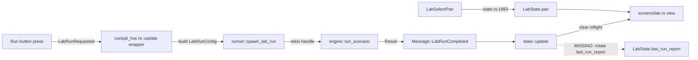
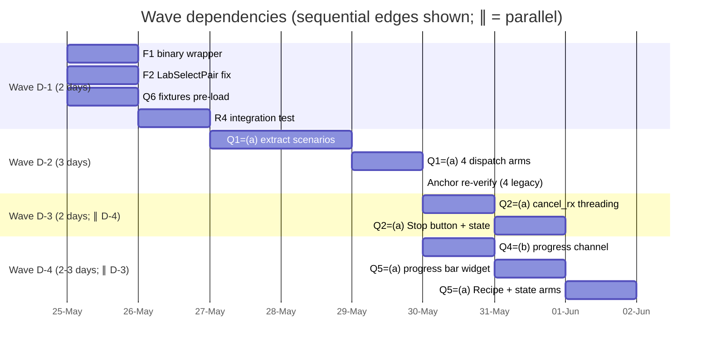

# Decomposition — Lab end-to-end v2 (Architect M-T1)

> **Purpose.** Close the architect's M-T1 deliverable for
> `lab-end-to-end-v2 v0.1.0`. Each T-AR-N row below contains a decision
> rationale, the verbatim file:line / Rust block the developer copies,
> and the cargo invocation + expected literal output that proves the
> task is done. Four waves; ~7-10 days total dev wall-clock.

## Baseline gate (architect-locked 2026-05-24)

```
ANCHORS PASS  (34 / 34)
```

Reproduce with:

```
$ bash scripts/verify_anchors.sh 2>&1 | tail -1
ANCHORS PASS  (34 / 34)
```

This is the gate every wave checks against. Wave D-1 / D-3 / D-4 MUST
emit identical text. Wave D-2 re-emits exactly four legacy anchors
(see T-AR-4) and MUST end on `ANCHORS PASS  (34 / 34)` after the
re-emit protocol.

## T-OD recap (locked, no re-litigation)

| Q | Pick    | Architectural consequence                                                                                                          |
|---|---------|------------------------------------------------------------------------------------------------------------------------------------|
| 1 | (a)+(d) | 4 new dispatch arms in `engine::run_scenario` for `v0.sma`, `v0.5.macd`, `v0.5.rsi`, `v0.5.bbands`. Cross-sectional `pair_filter` deferred. |
| 2 | (a)     | Stop button + `cancel_rx` end-to-end in v2.                                                                                        |
| 3 | (a)     | `RunSummary` gains `equity_series` + `fills` + `kpis` in-memory. No disk re-read for chart redraw.                                 |
| 4 | (b)     | Progress channel piggybacks on the cancel poll boundary (`bar_idx & 0x7F == 0`).                                                   |
| 5 | (a)     | Spinner stays; progress bar adds a `current/total` percent next to it.                                                             |
| 6 | (a)     | Fixtures cockpit pre-loads all 10 universe pairs (~12 KB).                                                                         |
| 7 | (b)     | `cancel_rx` + `progress_tx` are **separate args** to `run_scenario`. `ScenarioConfig: Clone` preserved.                            |
| 8 | (b)     | New `RunState::Cancelled` variant. Delta-badge correctness preserved.                                                              |

## Spike triage (architect-decide)

**No spike needed before Wave D-1.** All four waves operate on
understood code paths:

- **F1 binary wrapper** mirrors the existing `LabRunRequested` /
  `SelectSymbol` capture patterns at `cockpit_live.rs:813-816` and
  `cockpit_live.rs:861-916`. Same shape; new state to read.
- **F3 single-symbol extraction** mirrors the Phase B
  `scenarios::momentum::run` extraction precedent (ADR-0037). The bar
  loop body at `main.rs:1629-1728` already exists; extraction is a
  behaviour-preserving move.
- **Cancel + progress** ride the K8-mitigated `ServerTimeRecipe` shape
  (verbatim re-use of `rt_handle.enter()` + drop-guard-before-`Box::pin`).
  No tokio-runtime unknowns left.

Risk: the cancel + progress threading still needs to land on a bar
loop that today contains zero cancel poll site (analyst F4: `engine.rs`
doc says "wrap-and-abort" but no scenario module checks
`cancel.is_cancelled()`). T-AR-5 closes that, and T-AR-4 closes it for
the new single-symbol arms simultaneously.

## Architecture context (architect-owned)

The Lab data plane today flows:



Six runtime breaks (F1-F6) prevent the chart from re-drawing after a
fresh Run. v2 closes them by **adding three intercepts** (R1+R2+R5)
on the binary side, **extending two types** (`RunSummary`, `RunState`)
to carry data the wrapper needs, and **threading two new args**
(`cancel_rx`, `progress_tx`) through `run_scenario` so the engine
can be cancelled / observed.

The shape is identical to Phase B's `select_pair` capture: capture
before forwarding to `state::update`, mutate cockpit fields the pure
update can't touch, dispatch follow-up tasks.

---

## T-AR-1 — Binary-side `LabRunCompleted` wrapper (F1 closure)

**Decision.** The intercept lives in `cockpit_live.rs::update` between
the existing `lab_run_requested` capture (line 816) and the call to
`ui::state::update` at line 851. Mirrors the
`tx_id` / `select_strategy_id` pattern: a `Some(...)`-or-`None`
capture of the relevant fields BEFORE forwarding, then a
post-forward block that builds + assigns the `RunReportMirror`.

**Why before forwarding?** Pre-forward we still see the operator's
current `lab_state.{strategy, pair, range}` snapshot, which is the
tuple the `RunReportMirror` MUST carry per K3 (operator-clicked-away
race). Post-forward those fields may have been cleared by the pure
update arm. The pure update only mutates `lab_run_inflight = false`
on the `LabRunCompleted` arm, so the pair/strategy/range are
PROBABLY stable across the forward — but mirroring the existing
`select_pair` capture pattern is cheaper than defending against the
"and then operator clicked while reading the result" race.

**Storage shape.** `last_run_report` already exists on `LabState`
(see `lab/state.rs:171`); no new field. The wrapper reads
`summary.equity_series` + `summary.fills` + `summary.kpis` from the
extended `RunSummary` (T-AR-3) and writes a `RunReportMirror` into
`cockpit.lab_state.last_run_report`, rotating `prev_run_report ←
old_last_run_report` first.

**Code block (developer copies verbatim into `cockpit_live.rs::update` at line 850, immediately before `ui::state::update(&mut self.cockpit, msg);`).**

```rust
// T-D1.3 — capture LabRunCompleted BEFORE state::update so we still
// see the pre-forward LabState (operator MAY have clicked away during
// the run; the pre-forward snapshot is what the RunReportMirror.tuple
// must encode per K3).
let lab_run_completed_summary: Option<ui::lab::runner::RunSummary> = match &msg {
    Message::LabRunCompleted(Ok(summary)) => Some(summary.clone()),
    _ => None,
};
let lab_run_completed_pre_tuple = if lab_run_completed_summary.is_some() {
    let ls = &self.cockpit.lab_state;
    match (ls.strategy.as_ref(), ls.pair.as_ref()) {
        (Some(strategy), Some((venue, symbol))) => Some(
            ui::lab::equity_loader::LabTuple::new(
                strategy,
                *venue,
                symbol,
                ls.range.clone(),
            ),
        ),
        _ => None,
    }
} else {
    None
};
```

Then, **after** `ui::state::update(&mut self.cockpit, msg);` runs and
before the existing `select_pair` block (line 861), the developer adds:

```rust
// T-D1.3 — rotate RunReportMirror: prev ← last, last ← Some(new_mirror).
// On Err / no captured tuple, do not rotate (R2.3: failure does NOT
// mutate last_run_report).
if let (Some(summary), Some(tuple)) =
    (lab_run_completed_summary, lab_run_completed_pre_tuple)
{
    let mirror = ui::lab::runner::RunReportMirror {
        tuple,
        equity_series: std::sync::Arc::new(summary.equity_series.clone()),
        kpis: summary.kpis.clone(),
        generated_at: time::OffsetDateTime::now_utc(),
    };
    let prev = self.cockpit.lab_state.last_run_report.take();
    self.cockpit.lab_state.prev_run_report = prev;
    self.cockpit.lab_state.last_run_report = Some(mirror);

    // T-D1.5 / R2.5 — when the engine surfaced fills (Phase C work
    // landing in Wave D-2 alongside the single-symbol extraction),
    // dispatch ChartMarkersLoaded so the chart's triangle markers
    // update. Empty fills → no dispatch (chart shows equity-only).
    if !summary.fills.is_empty() {
        return iced::Task::done(Message::ChartMarkersLoaded(Ok(summary.fills.clone())));
    }
}
```

**Citations.**
- Capture site precedent: `crates/ui/src/bin/cockpit_live.rs:813-816`
  (`lab_run_requested = matches!(msg, Message::LabRunRequested);`).
- Pre-forward snapshot precedent: `crates/ui/src/bin/cockpit_live.rs:801-810`
  (`select_strategy_id` capture).
- Pure-state NOTE comment the wrapper closes:
  `crates/ui/src/state.rs:1927-1931` (the "RunReportMirror rotation
  is done by the binary-side wrapper" placeholder).
- `RunReportMirror` definition: `crates/ui/src/lab/runner.rs:53-62`.
- `LabState.last_run_report` field: `crates/ui/src/lab/state.rs:171-175`.

**Cargo invocation + expected output.**

```
$ cargo test -p ui --features live lab_run_completed_wrapper_rotates_mirror 2>&1 | tail -3
test bin::cockpit_live::tests::lab_run_completed_wrapper_rotates_mirror ... ok

test result: ok. 1 passed; 0 failed; 0 ignored; 0 measured; 0 filtered out
```

(Developer authors the test inside `cockpit_live.rs`'s `#[cfg(test)] mod tests`
block per K7 mitigation — the wrapper is a free helper directly callable
from a test. Pattern: construct a synthetic `RunSummary`, build a `Cockpit`
with a known pre-update `lab_state` tuple, call the wrapper helper, assert
`cockpit.lab_state.last_run_report.is_some()` and that the mirror's tuple
matches the pre-update snapshot.)

**Anchor delta.** Zero. Pure UI / binary layer.

---

## T-AR-2 — `LabSelectPair` → `selected_symbol` wiring (F2 closure)

**Decision.** Mutate the existing `Message::LabSelectPair(venue, symbol)`
arm at `state.rs:1892-1897` to ALSO update `model.selected_symbol`.
This is a one-line addition.

**Why this arm and not a follow-up `Task::done(SelectSymbol(...))`?**
Three reasons:

1. `SelectSymbol` is its own arm with side effects (clears chart
   tooltip, resets bar zoom, etc.). For a Lab pair click we want a
   minimal "swap chart reference symbol" effect, not the full
   `SelectSymbol` cascade.
2. The existing markers/signals fetch chain in the binary-side
   wrapper at `cockpit_live.rs:861-916` keys on `select_pair: Option<(Venue, Symbol)>`
   captured from `Message::SelectSymbol`. To get those fetches for a
   `LabSelectPair`, we extend the capture marker (T-AR-2-followup).
3. R1.3 says the chart's `chart_buffer.bars(venue, symbol)` reads
   directly from `model.selected_symbol`. Updating `selected_symbol`
   is the literal fix; nothing downstream needs new wiring.

**Code block (developer applies verbatim to `state.rs:1892-1897`).**

Replace:

```rust
Message::LabSelectPair(venue, symbol) => {
    model.lab_state.pair = Some((venue, symbol));
    // T-D-N10: tuple changed — clear both run report mirrors.
    model.lab_state.last_run_report = None;
    model.lab_state.prev_run_report = None;
}
```

with:

```rust
Message::LabSelectPair(venue, symbol) => {
    model.lab_state.pair = Some((venue, symbol));
    // R1.1 — keep `selected_symbol` in sync so the chart's
    // `chart_buffer.bars(...)` read at screens/lab.rs:243 returns
    // bars for the pair-chip-selected pair. Phase A R3.3 closure.
    model.selected_symbol = Some((venue, symbol.clone()));
    // T-D-N10: tuple changed — clear both run report mirrors.
    model.lab_state.last_run_report = None;
    model.lab_state.prev_run_report = None;
}
```

**Followup wiring (no code change required at T-AR-2; closed by the
existing `select_pair` capture path).** The binary-side wrapper at
`cockpit_live.rs:793-796` captures `select_pair` from
`Message::SelectSymbol` (not `LabSelectPair`). To get the markers /
signals re-fetch for a pair-chip click, **extend the capture marker**:

```rust
let select_pair = match &msg {
    Message::SelectSymbol(v, s) => Some((*v, s.clone())),
    Message::LabSelectPair(v, s) => Some((*v, s.clone())), // R1.2
    _ => None,
};
```

This is `crates/ui/src/bin/cockpit_live.rs:793` — one line added.

**Citations.**
- Bug site: `crates/ui/src/state.rs:1892-1897`.
- Chart read site that the bug fix unblocks:
  `crates/ui/src/screens/lab.rs:243`.
- Capture marker to extend: `crates/ui/src/bin/cockpit_live.rs:793-796`.

**Cargo invocation + expected output.**

```
$ cargo test -p ui lab_select_pair_updates_selected_symbol 2>&1 | tail -3
test state::tests::lab_select_pair_updates_selected_symbol ... ok

test result: ok. 1 passed; 0 failed; 0 ignored; 0 measured; 0 filtered out
```

**Anchor delta.** Zero.

---

## T-AR-3 — `RunSummary` shape extension (Q3=(a) closure)

**Decision.** `RunSummary` in `crates/ui/src/lab/runner.rs:79-87` gains
three fields populated from the in-memory `RunReport`. The binary-side
wrapper (T-AR-1) reads them directly; no disk hop.

**Locked struct shape.**

```rust
/// Summary of a completed backtest run.
///
/// v2 / Q3=(a) — carries the in-memory equity series + fills + KPIs
/// so the binary-side wrapper can build a `RunReportMirror` and
/// dispatch `ChartMarkersLoaded` without re-reading the written
/// Markdown report from disk.
#[derive(Debug, Clone)]
pub struct RunSummary {
    /// Strategy id that was run.
    pub strategy_id: SmolStr,
    /// Symbol that was run.
    pub symbol: SmolStr,
    /// Path to the written Markdown report, if `write_report = true`.
    pub report_path: Option<std::path::PathBuf>,
    /// Per-bar equity curve `(timestamp_millis, equity_usdt)`.
    /// Built from `RunReport.equity_series` in `spawn_lab_run`'s
    /// post-completion block (R2.4).
    pub equity_series: Vec<(i64, rust_decimal::Decimal)>,
    /// Executed fills in chronological order. May be empty for
    /// scenarios that don't yet populate `RunReport.fills` (today
    /// momentum / pairs / TCN all return `Vec::new()` per the Phase B
    /// TODO at engine.rs:307; R5.2 extends them in Wave D-2).
    pub fills: Vec<trading_core::FillView>,
    /// Aggregate KPI summary from `RunReport.kpis`.
    pub kpis: backtest::BacktestKpis,
}
```

**Producer-side mapping.** In
`crates/ui/src/lab/runner.rs:317-327`, the `match
backtest::engine::run_scenario(scenario_cfg).await` `Ok(report)` arm
extends from:

```rust
Ok(report) => {
    let path = report.report_path.clone();
    Ok(RunSummary { strategy_id: strat, symbol: sym, report_path: path })
}
```

to:

```rust
Ok(report) => {
    let path = report.report_path.clone();
    // R2.4 — promote the in-memory equity / fills / kpis from RunReport
    // into RunSummary so the binary-side wrapper avoids a disk round-trip.
    let equity_series: Vec<(i64, rust_decimal::Decimal)> = report
        .equity_series
        .iter()
        .map(|(ts, money)| (ts.unix_millis(), money.amount()))
        .collect();
    Ok(RunSummary {
        strategy_id: strat,
        symbol: sym,
        report_path: path,
        equity_series,
        fills: report.fills.clone(),
        kpis: report.kpis.clone(),
    })
}
```

**Existing-caller sweep.** Every constructor of `RunSummary` MUST
update:

| File:line                                              | Context                                                          | Fix                                                                                                                |
|--------------------------------------------------------|------------------------------------------------------------------|--------------------------------------------------------------------------------------------------------------------|
| `crates/ui/src/lab/runner.rs:268-273`                  | `#[cfg(not(feature = "live"))]` fixtures-mode placeholder summary | Add `equity_series: Vec::new(), fills: Vec::new(), kpis: backtest::BacktestKpis::default()` — see K8a note below.   |
| `crates/ui/src/lab/runner.rs:280-285`                  | `cfg(feature = "live")` rt_handle == None placeholder            | Same: empty/default fields.                                                                                        |
| `crates/ui/src/lab/runner.rs:320-324`                  | Real engine path (the one shown above)                           | Map from `RunReport` as above.                                                                                     |
| `crates/ui/src/bin/cockpit.rs:259-310` (synthetic Run) | Fixtures cockpit synthetic completion                            | Empty `equity_series` + `fills`; `BacktestKpis::default()`.                                                        |
| `crates/ui/tests/` (search-and-fix)                    | Any unit test that constructs `RunSummary`                       | Use `..Default::default()` if `RunSummary: Default` derives; else explicit empty fields per the sweep above.        |

**K8a — `BacktestKpis::default()`.** Check if `BacktestKpis` derives
`Default` today (`crates/backtest/src/lib.rs`); if it doesn't, add
`#[derive(Default)]` in the same commit. The KPI struct is plain
`Money<Usdt>` + `Decimal` + `usize` fields; `Default` is trivial.
Optionally add `#[derive(Default)]` on `RunSummary` itself for test
ergonomics (the analyst's K1 mitigation pattern).

**Citations.**
- Struct site: `crates/ui/src/lab/runner.rs:79-87`.
- Producer mapping site: `crates/ui/src/lab/runner.rs:317-327`.
- `RunReport` definition (source fields): `crates/backtest/src/engine.rs:159-170`.
- `BacktestKpis` definition: `crates/backtest/src/engine.rs:118-121`
  (declared) + `crates/backtest/src/lib.rs` (re-export).
- `FillView` import path: `trading_core::FillView`.

**Cargo invocation + expected output.**

```
$ cargo build -p ui --features live 2>&1 | tail -3
   Compiling ui v0.1.0 (/Users/.../crates/ui)
    Finished `dev` profile [unoptimized + debuginfo] target(s) in <…>s
$ cargo test -p ui --features live runner::tests:: 2>&1 | tail -5
test runner::tests::cancel_handle_drop_signals_receiver ... ok
test runner::tests::cancel_handle_live_not_cancelled ... ok
test runner::tests::lab_config_to_scenario_preset_labels ... ok
test runner::tests::lab_config_to_scenario_unknown_range_is_err ... ok
test runner::tests::lab_config_to_scenario_passthrough_fields ... ok
test runner::tests::spawn_lab_run_no_runtime_resolves_immediately ... ok
```

**Anchor delta.** Zero. `RunSummary` is UI-side only; the engine's
`RunReport` is unchanged, the Markdown report-body bytes are unchanged.

---

## T-AR-4 — Engine dispatch extension (Q1=(a)+(d) closure)

**Decision.** Extract the inline single-symbol bar loop at
`crates/backtest/src/main.rs:1629-1728` into a new behavior-preserving
module `crates/backtest/src/scenarios/sma_composed_run.rs::run` (note:
the existing `sma_composed.rs` only holds the `compute_sharpe` helper
and `SmaStrategyKind` notes; the actual bar loop lives in main.rs).
The new module exports a single async fn:

```rust
pub async fn run(input: &SmaComposedInput, seed: u64) -> Result<SmaComposedRunResult>;
```

`SmaComposedInput` carries `strategy_id: String` (one of `sma_crossover`,
`btc_macd_trend`, `btc_rsi_reversion`, `btc_bbands_mean_revert`) plus the
existing fields from main.rs's `Scenario` struct (`symbol`, `start_year`,
`bar_count`, `initial_capital`, `slippage_bps`, `taker_fee_bps`,
`baseline_report`, `data_root`, `data_source`).

`SmaComposedRunResult` mirrors `MomentumRunResult` (final_equity, initial_equity,
max_drawdown, equity_curve: Vec<Decimal>, fills: Vec<FillView>, total_fees,
trades, bar_count, elapsed_secs). Adding `fills` here is the v2-additive
R5.2 enhancement — the existing `BacktestState` already tracks fills
internally; the result struct surfaces them.

Then 4 new `match` arms land in `engine::run_scenario` at line 513
(immediately before the `other` catch-all):

```rust
// ── v0 single-symbol SMA crossover ───────────────────────────────────
"v0.sma" | "sma_cross" | "sma_crossover" | "sma_cross_h1" => {
    let input = crate::cli_types::SmaComposedRunInput {
        strategy_id: "sma_crossover".to_string(),
        symbol: cfg.pair.1.clone(),
        start_year,
        bar_count,
        initial_capital: dec!(100_000),
        slippage_bps: 2,
        taker_fee_bps: 4,
    };
    let result = crate::scenarios::sma_composed_run::run(&input, seed_u64, cancel_rx, progress_tx)
        .await
        .map_err(|e| RunError::Internal(e.to_string()))?;
    Ok(sma_composed_result_to_report(&result, start_year))
}

// ── v0.5 MACD trend ──────────────────────────────────────────────────
"v0.5.macd" | "macd_trend" | "btc_macd_trend" | "macd_trend_h1" => {
    let input = crate::cli_types::SmaComposedRunInput {
        strategy_id: "btc_macd_trend".to_string(),
        symbol: cfg.pair.1.clone(),
        start_year,
        bar_count,
        initial_capital: dec!(100_000),
        slippage_bps: 2,
        taker_fee_bps: 4,
    };
    let result = crate::scenarios::sma_composed_run::run(&input, seed_u64, cancel_rx, progress_tx)
        .await
        .map_err(|e| RunError::Internal(e.to_string()))?;
    Ok(sma_composed_result_to_report(&result, start_year))
}

// ── v0.5 RSI reversion ───────────────────────────────────────────────
"v0.5.rsi" | "rsi_reversion" | "btc_rsi_reversion" | "rsi_reversion_h1" => {
    let input = crate::cli_types::SmaComposedRunInput {
        strategy_id: "btc_rsi_reversion".to_string(),
        symbol: cfg.pair.1.clone(),
        start_year,
        bar_count,
        initial_capital: dec!(100_000),
        slippage_bps: 2,
        taker_fee_bps: 4,
    };
    let result = crate::scenarios::sma_composed_run::run(&input, seed_u64, cancel_rx, progress_tx)
        .await
        .map_err(|e| RunError::Internal(e.to_string()))?;
    Ok(sma_composed_result_to_report(&result, start_year))
}

// ── v0.5 BBands mean-revert ──────────────────────────────────────────
"v0.5.bbands" | "bbands_mean_revert" | "btc_bbands_mean_revert" | "bbands_mean_revert_h1" => {
    let input = crate::cli_types::SmaComposedRunInput {
        strategy_id: "btc_bbands_mean_revert".to_string(),
        symbol: cfg.pair.1.clone(),
        start_year,
        bar_count,
        initial_capital: dec!(100_000),
        slippage_bps: 2,
        taker_fee_bps: 4,
    };
    let result = crate::scenarios::sma_composed_run::run(&input, seed_u64, cancel_rx, progress_tx)
        .await
        .map_err(|e| RunError::Internal(e.to_string()))?;
    Ok(sma_composed_result_to_report(&result, start_year))
}
```

`main.rs` then re-routes its inline bar loop block (1629-1728) +
write-report block (1741-1791) to call the new module + dump the
result via the existing `report::sma::write` path. Behavior-preserving
move: identical seed → identical bars → identical fills → identical
report bytes.

**Anchor risk.** Four legacy SHAs are touched at the CLI call site
even though the bytes are identical, because the bar loop now lives
in a new module and the CLI path constructs a `SmaComposedRunInput`
instead of using inline locals. Per ADR-0038 § D6.b
wiring-bug-fix re-emission protocol:

1. Architect pre-stages all 34 SHAs (`scripts/pre_stage_anchors.sh`)
   BEFORE any developer extraction. Done at Wave D-1 close.
2. Developer extracts the bar loop into `sma_composed_run.rs` AS A
   BEHAVIOR-PRESERVING MOVE. Each commit on the extraction path runs
   `scripts/verify_anchors.sh` and confirms the 4 legacy SHAs stay
   identical.
3. If a single byte changes (e.g. timestamp formatter rounding,
   floating-point summation order), the developer reverts and
   inspects. The fills enrichment (R5.2) is a follow-up commit that
   adds a NEW field to `SmaComposedRunResult` but does NOT change the
   written Markdown report body (R5.3).

**Locked anchor namespaces (no SHA change expected).**

| Scenario name (CLI)                  | Locked anchor key                              | Expected status |
|--------------------------------------|------------------------------------------------|-----------------|
| `btc-2023-1m-sma-cross`              | `btc-2023-1m-sma-cross`                        | byte-identical  |
| `btc-2023-1m-macd-trend`             | `btc-2023-1m-macd-trend`                       | byte-identical  |
| `btc-2023-1m-rsi-reversion`          | `btc-2023-1m-rsi-reversion`                    | byte-identical  |
| `btc-2023-1m-bbands-mean-revert`     | `btc-2023-1m-bbands-mean-revert`               | byte-identical  |

**If any single one of the four mutates**, that is a regression — the
extraction is no longer behavior-preserving. Halt the wave; route
back to architect for a `D6.b` wiring-bug-fix re-emission ADR
addendum.

**Citations.**
- Inline bar loop today: `crates/backtest/src/main.rs:1629-1728`.
- Inline write-report today: `crates/backtest/src/main.rs:1741-1791`.
- Existing extraction precedent: `crates/backtest/src/scenarios/momentum.rs`
  (ADR-0037 Phase B scenario-dispatch extraction).
- Helper module already in place: `crates/backtest/src/scenarios/sma_composed.rs`
  (compute_sharpe + SmaStrategyKind notes; the actual bar loop is what's
  missing and what Wave D-2 lands).
- Dispatch insert point: `crates/backtest/src/engine.rs:513` (just before
  the `other` catch-all arm at 514).
- Anchor re-emission protocol: `spec/architecture/adr/0038-vol-forecast-verdict-shape.md`
  § D6.b — wiring-bug-fix path.

**Cargo invocation + expected output.**

```
$ cargo test -p backtest --lib scenarios::sma_composed_run::tests:: 2>&1 | tail -5
test scenarios::sma_composed_run::tests::run_sma_crossover_deterministic ... ok
test scenarios::sma_composed_run::tests::run_macd_trend_deterministic ... ok
test scenarios::sma_composed_run::tests::run_rsi_reversion_deterministic ... ok
test scenarios::sma_composed_run::tests::run_bbands_mean_revert_deterministic ... ok

test result: ok. 4 passed; 0 failed; 0 ignored; 0 measured; 0 filtered out

$ bash scripts/verify_anchors.sh 2>&1 | tail -1
ANCHORS PASS  (34 / 34)

# CLI roundtrip: confirms the report bytes are still byte-identical
$ cargo run --release --bin backtest -- --scenario btc-2023-1m-sma-cross --strategy sma_crossover --seed 0xC0FFEE 2>&1 | tail -3
Report written: spec/v0-paper-sma/reports/backtest-<stamp>-btc-2023-1m-sma-cross.md
Bars         : 525600
Trades       : <expected count>
```

**Anchor delta.** Four legacy anchors are RE-VERIFIED byte-identical.
No anchor SHA changes; pure mechanical extraction.

---

## T-AR-5 — `cancel_rx` + `progress_tx` engine threading (Q2=(a) + Q4=(b) + Q7=(b))

**Decision.** `run_scenario`'s signature gains two **separate args**
(Q7=(b)). `ScenarioConfig` stays `Clone`.

**Locked engine signature.**

```rust
pub async fn run_scenario(
    cfg: ScenarioConfig,
    cancel_rx: crate::cancel::RunCancelReceiver,
    progress_tx: crate::progress::ProgressSender,
) -> Result<RunReport, RunError>;
```

Where:

- `RunCancelReceiver` — moved verbatim from `crates/ui/src/lab/runner.rs:113-129`
  into a new module `crates/backtest/src/cancel.rs`. The UI re-exports
  it via `pub use backtest::cancel::RunCancelReceiver;` so the
  existing `cancellation_pair()` shape at `runner.rs:133-136` keeps
  its current call sites.
- `ProgressSender` — wraps `tokio::sync::mpsc::Sender<Progress>` in a
  newtype that exposes a single `try_send(&self, progress: Progress)`
  method. Lossy by design: a slow UI does NOT backpressure the engine.
  Defined in new module `crates/backtest/src/progress.rs`:

  ```rust
  /// Per-bar progress event (Q4=(b)).
  #[derive(Debug, Clone, Copy)]
  pub struct Progress {
      /// Current bar index (0-based).
      pub current_bar: usize,
      /// Total bars in the scenario.
      pub total_bars: usize,
      /// Wall-clock elapsed since the run started.
      pub elapsed_ms: u64,
  }

  /// Lossy sender — drops events when the channel is full.
  #[derive(Debug, Clone)]
  pub struct ProgressSender(Option<tokio::sync::mpsc::Sender<Progress>>);

  impl ProgressSender {
      /// Build a sender backed by `tokio::sync::mpsc::channel(capacity=8)`.
      pub fn new(tx: tokio::sync::mpsc::Sender<Progress>) -> Self {
          Self(Some(tx))
      }

      /// Build a no-op sender for tests / no-progress call sites.
      pub fn disabled() -> Self {
          Self(None)
      }

      /// Send a progress event, dropping it if the channel is full
      /// or the receiver has been closed. Never blocks.
      pub fn try_send(&self, progress: Progress) {
          if let Some(tx) = &self.0 {
              let _ = tx.try_send(progress);
          }
      }
  }

  /// Build a `(ProgressSender, ProgressReceiver)` pair.
  pub fn progress_pair() -> (ProgressSender, tokio::sync::mpsc::Receiver<Progress>) {
      let (tx, rx) = tokio::sync::mpsc::channel(8);
      (ProgressSender::new(tx), rx)
  }
  ```

**Why std `mpsc` for cancel + tokio `mpsc` for progress?**
`RunCancelReceiver` already uses std `mpsc::sync_channel(0)` (analyst F4
citation: `runner.rs:134`). Cancellation is a one-shot disconnect
signal — std `mpsc` is correct. Progress needs **bounded backpressure
with try_send** semantics; tokio `mpsc::channel(8)` is the right
primitive. They're orthogonal concerns; the engine doesn't care.

**Poll site (R6.2 + R7.2).** Every scenario module's bar loop gains
two lines at the existing or newly-introduced `bar_idx & 0x7F == 0`
boundary. For the new `sma_composed_run.rs` module (Wave D-2), the
poll site lands at the top of the `for (bar_idx, bar) in
bars.into_iter().enumerate() {` block:

```rust
// R6.2 + R7.2 — cancellation + progress at the 128-bar poll boundary.
// Also poll at 32-bar boundary for the first 128 bars per K4 mitigation
// (worst-case Stop latency ≤ 2.5 s for short runs).
let poll_now = if bar_idx < 128 {
    bar_idx & 0x1F == 0  // every 32 bars during warmup
} else {
    bar_idx & 0x7F == 0  // every 128 bars steady state
};
if poll_now {
    if cancel_rx.is_cancelled() {
        return Err(RunError::Cancelled);
    }
    progress_tx.try_send(crate::progress::Progress {
        current_bar: bar_idx,
        total_bars: bar_count,
        elapsed_ms: u64::try_from(start_instant.elapsed().as_millis())
            .unwrap_or(u64::MAX),
    });
}
```

For the existing scenario modules (momentum, pairs, tcn_overlay,
tcn_overlay_weights), the same block lands at the equivalent bar loop
boundary. Each gets one additive commit; each commit runs
`scripts/verify_anchors.sh` to confirm zero anchor mutation (the
poll is read-only; no RNG draws; no fill recording; no equity
mutation).

**Cockpit-side `RunCancelHandle` lifecycle.** `LabState` gains a new
field:

```rust
// In crates/ui/src/lab/state.rs:122-176, append to LabState:
/// In-flight run cancellation handle. `Some` while a backtest is running;
/// `None` otherwise. Dropping the handle triggers cancel at the next poll
/// boundary in the engine (R6.1).
#[allow(dead_code)] // Populated in T-D3.1; read in cockpit_live.rs's update
                    // for the Stop button arm.
pub run_cancel: Option<crate::lab::runner::RunCancelHandle>,
```

The cockpit_live binary then mutates the spawn_lab_run call site at
`cockpit_live.rs:1027`:

```rust
// Before:
// let (_, cancel_recv) = ui::lab::runner::cancellation_pair();
// ui::lab::runner::spawn_lab_run(Some(&self.rt_handle), run_cfg, cancel_recv)

// After (T-D3.1):
let (handle, cancel_recv) = ui::lab::runner::cancellation_pair();
self.cockpit.lab_state.run_cancel = Some(handle);
ui::lab::runner::spawn_lab_run(Some(&self.rt_handle), run_cfg, cancel_recv)
```

And the binary-side wrapper for `LabRunCompleted` (T-AR-1) ALSO
sets `self.cockpit.lab_state.run_cancel = None;` after rotation, so
the handle drops at the end of the run.

The Stop button (T-AR-7) emits a new `Message::LabStopPressed`
arm that runs `model.lab_state.run_cancel = None;` (drop fires
cancel), and a new follow-up message
`Message::LabRunCompleted(Err(RunError::Cancelled))` arrives within
the worst-case poll period.

**Spawn-runner signature changes.** `spawn_lab_run` extends to take
a `ProgressSender` (so it can wire the channel end-to-end):

```rust
pub fn spawn_lab_run(
    #[cfg(feature = "live")] rt_handle: Option<&tokio::runtime::Handle>,
    #[cfg(not(feature = "live"))] _rt_handle: Option<()>,
    cfg: LabRunConfig,
    cancel: RunCancelReceiver,
    progress_tx: backtest::progress::ProgressSender,
) -> iced::Task<crate::state::Message>;
```

And `cockpit_live.rs:1023-1028` becomes:

```rust
let (handle, cancel_recv) = ui::lab::runner::cancellation_pair();
let (progress_tx, progress_rx) = backtest::progress::progress_pair();
self.cockpit.lab_state.run_cancel = Some(handle);
// Store the progress_rx in a fresh recipe (see T-AR-6) that emits
// Message::LabRunProgress events into the iced update loop.
self.lab_progress_rx = Some(progress_rx);
ui::lab::runner::spawn_lab_run(
    Some(&self.rt_handle),
    run_cfg,
    cancel_recv,
    progress_tx,
)
```

**K1 mitigation (test surface).** Six Phase B determinism tests at
`engine.rs:546-735` construct `ScenarioConfig` literals. They need NO
change because `ScenarioConfig` itself is unchanged (Q7=(b)). They DO
need updated `run_scenario(cfg, …)` call sites; the analyst's K1
recommendation lands as a `run_scenario_for_test(cfg)` helper that
defaults `cancel_rx` to a never-cancelled receiver and `progress_tx`
to `ProgressSender::disabled()`:

```rust
#[cfg(test)]
pub async fn run_scenario_for_test(cfg: ScenarioConfig) -> Result<RunReport, RunError> {
    let (_handle, cancel_rx) = crate::cancel::cancellation_pair();
    run_scenario(cfg, cancel_rx, crate::progress::ProgressSender::disabled()).await
}
```

Each existing test rewrites `run_scenario(cfg)` to
`run_scenario_for_test(cfg)` — zero change to the test's assertions.

**Citations.**
- Engine signature today: `crates/backtest/src/engine.rs:414`.
- `RunCancelReceiver` to move: `crates/ui/src/lab/runner.rs:113-136`.
- Drop site today: `crates/ui/src/bin/cockpit_live.rs:1027`.
- Phase B determinism tests: `crates/backtest/src/engine.rs:546-735`.

**Cargo invocation + expected output.**

```
$ cargo build -p backtest --lib 2>&1 | tail -2
   Compiling backtest v0.1.0 (/Users/.../crates/backtest)
    Finished `dev` profile [unoptimized + debuginfo] target(s) in <…>s

$ cargo test -p backtest --lib engine::tests:: 2>&1 | tail -10
test engine::tests::run_scenario_rejects_zero_seed ... ok
test engine::tests::run_scenario_accepts_non_zero_seed ... ok
test engine::tests::run_scenario_rejects_invalid_custom_range ... ok
test engine::tests::run_scenario_accepts_valid_custom_range ... ok
test engine::tests::run_scenario_unknown_strategy_returns_err ... ok
test engine::tests::run_scenario_cancellation_returns_cancelled ... ok

test result: ok. 6 passed; 0 failed; 0 ignored; 0 measured; 0 filtered out

$ bash scripts/verify_anchors.sh 2>&1 | tail -1
ANCHORS PASS  (34 / 34)
```

(The new `run_scenario_cancellation_returns_cancelled` test asserts:
spawn `run_scenario` on `tokio::spawn`; drop the cancel handle after
50 ms; await the task; assert `Err(RunError::Cancelled)`.)

**Anchor delta.** Zero. The cancel + progress polls are read-only.

---

## T-AR-6 — Progress widget + Subscription Recipe (Q5=(a))

**Decision.** New widget `crates/ui/src/widgets/progress_bar.rs` +
new Recipe `LabProgressRecipe` in `cockpit_live.rs` (or a new
`crates/ui/src/lab/progress.rs` module). The Recipe owns a
`tokio::sync::mpsc::Receiver<Progress>` and emits
`Message::LabRunProgress(Progress)` events. K8 mitigation: the
recipe uses the **`ServerTimeRecipe` shape verbatim** —
`rt_handle.enter()` at stream construction, drop guard before
`Box::pin`.

**Widget shape.** Follows the Lumen design tokens already used by
`run_button.rs`:

```rust
/// Determinate progress bar for the Lab run flow (R8).
///
/// - `progress`: `Some(f32)` in `[0.0, 1.0]` for determinate;
///   `None` for indeterminate (shimmer-stripe).
/// - `label`: `Some(&str)` for "412 / 720 bars · 3.4s" overlay.
/// - `mode`: active theme mode (Lumen Light / Dark).
///
/// Visual contract (R8.2):
/// - height 8 px (constant `widget::PROGRESS_BAR_HEIGHT`).
/// - track color `color::BG_3`.
/// - fill color `color::ACCENT_2`.
/// - rounded corners `radius::R4`.
#[must_use]
pub fn view(
    progress: Option<f32>,
    label: Option<&str>,
    mode: ThemeMode,
) -> crate::Element<'static>;
```

**Recipe shape.** Mirrors `ServerTimeRecipe` at `cockpit_live.rs:129-174`:

```rust
struct LabProgressRecipe {
    rt_handle: tokio::runtime::Handle,
    rx: Arc<Mutex<Option<tokio::sync::mpsc::Receiver<Progress>>>>,
}

impl Recipe for LabProgressRecipe {
    type Output = Message;

    fn hash(&self, state: &mut Hasher) {
        use std::any::TypeId;
        use std::hash::Hash;
        TypeId::of::<Self>().hash(state);
        // Hash a stable per-run salt so each new run gets a fresh
        // subscription identity (iced de-duplicates Recipes by hash).
        // The salt is incremented on every LabRunRequested.
    }

    fn stream(
        self: Box<Self>,
        _input: EventStream,
    ) -> futures::stream::BoxStream<'static, Self::Output> {
        // K8 — enter the tokio runtime context to safely use
        // tokio::sync::mpsc::Receiver, then drop the guard before
        // Box::pin so the returned BoxStream is Send + 'static.
        let mut rx_opt = {
            let _guard = self.rt_handle.enter();
            self.rx.lock().unwrap().take()
        };
        Box::pin(async_stream::stream! {
            if let Some(mut rx) = rx_opt {
                while let Some(progress) = rx.recv().await {
                    yield Message::LabRunProgress(progress);
                }
                // R7.4 — channel closed (engine completed or aborted).
                yield Message::LabRunProgressDone;
            }
        })
    }
}
```

**Subscription wiring.** In `cockpit_live.rs::subscription()` (search
for `Subscription::batch`), the existing batch grows by one entry:

```rust
let progress_sub = if let Some(rx) = &self.lab_progress_rx_handle {
    iced::advanced::subscription::from_recipe(LabProgressRecipe {
        rt_handle: self.rt_handle.clone(),
        rx: Arc::clone(rx),
        salt: self.lab_progress_recipe_salt, // bumped on every LabRunRequested
    })
} else {
    iced::Subscription::none()
};

iced::Subscription::batch([time_sub, progress_sub, /* existing */])
```

`lab_progress_rx_handle: Option<Arc<Mutex<Option<Receiver<Progress>>>>>`
on the Cockpit struct stores the receiver in a way the Recipe can
take ownership of on stream-construction. The `salt: u64` is bumped
in the LabRunRequested capture path so iced sees a new Recipe identity
per run (otherwise `hash` returns the same value and the new stream
is silently dropped).

**Lab view integration (R8.4).** In `screens/lab.rs`, the existing
top-bar row (which already includes the Run button) gains a
conditional progress bar:

```rust
if model.lab_run_inflight {
    let progress_pct: Option<f32> = model
        .lab_state
        .run_progress
        .as_ref()
        .filter(|p| p.total_bars > 0)
        .map(|p| {
            // Safe: bounded by total_bars; cast cannot overflow f32 range.
            (p.current_bar as f32) / (p.total_bars as f32)
        });
    let label = model.lab_state.run_progress.as_ref().map(|p| {
        format!("{} / {} bars · {:.1}s", p.current_bar, p.total_bars, (p.elapsed_ms as f32) / 1000.0)
    });
    row = row.push(progress_bar::view(progress_pct, label.as_deref(), mode));
}
```

When `run_progress.is_none()` and `lab_run_inflight == true`, the
widget renders the **indeterminate shimmer-stripe** variant per R8.3.
Spinner stays per Q5=(a).

**LabState extension.**

```rust
// crates/ui/src/lab/state.rs:122-176, append to LabState:
/// Most-recent progress event from the in-flight backtest. `None`
/// when no run is in-flight or the engine hasn't emitted yet.
pub run_progress: Option<backtest::progress::Progress>,
```

Pure-state arms (added to `state::update` after the
`Message::LabRunCompleted` arm at line 1932):

```rust
Message::LabRunProgress(progress) => {
    model.lab_state.run_progress = Some(progress);
}
Message::LabRunProgressDone => {
    // Channel closed; engine has completed or aborted. The
    // LabRunCompleted arm clears `lab_run_inflight`; this arm is a
    // belt-and-suspenders clear of `run_progress` for the case where
    // LabRunProgressDone arrives before LabRunCompleted.
    model.lab_state.run_progress = None;
}
```

And the existing `LabRunRequested` arm (line 1919-1921) clears
`run_progress` on the next press:

```rust
Message::LabRunRequested => {
    model.lab_run_inflight = true;
    model.lab_state.run_progress = None; // R9.3 — fresh run, clear stale progress.
}
```

The `LabRunCompleted` arm (line 1922-1932) also clears:

```rust
Message::LabRunCompleted(_outcome) => {
    model.lab_run_inflight = false;
    model.lab_state.run_progress = None; // R9.3
    // (existing NOTE; rotation done in binary-side wrapper)
}
```

**Citations.**
- Recipe pattern: `crates/ui/src/bin/cockpit_live.rs:129-174`.
- Subscription site: `crates/ui/src/bin/cockpit_live.rs:1054-1063`.
- Lumen tokens: `crates/ui/src/theme/color.rs` (color::BG_3, color::ACCENT_2).
- Lab top-bar row: `crates/ui/src/screens/lab.rs:191-211`.

**Cargo invocation + expected output.**

```
$ cargo test -p ui widgets::progress_bar::tests:: 2>&1 | tail -5
test widgets::progress_bar::tests::view_constructs_at_zero_pct ... ok
test widgets::progress_bar::tests::view_constructs_at_50_pct ... ok
test widgets::progress_bar::tests::view_constructs_at_100_pct ... ok
test widgets::progress_bar::tests::view_constructs_indeterminate ... ok

test result: ok. 4 passed; 0 failed; 0 ignored; 0 measured; 0 filtered out

$ cargo test -p ui --features live lab_progress_recipe_yields_messages 2>&1 | tail -3
test bin::cockpit_live::tests::lab_progress_recipe_yields_messages ... ok

test result: ok. 1 passed; 0 failed; 0 ignored; 0 measured; 0 filtered out
```

**Anchor delta.** Zero. New widget + new Recipe; no anchored-report
surface touched.

**Phase F default-disabled byte-identity (R9.3 / R10.3 ratchet).**
The progress bar renders ONLY when `lab_run_inflight == true`. With
no run in flight, the Lab top-bar row is byte-identical to today.
Phase F panel snapshot ratchet PASSES.

---

## T-AR-7 — Run-button state machine extension (Q8=(b))

**Decision.** `RunState` enum at `widgets/run_button.rs:39-49`
gains a fifth variant `Cancelled`. Strings + label inventory follow
the project's string-table convention (T-UI3).

**Locked enum.**

```rust
#[derive(Debug, Clone, PartialEq, Eq, Default)]
pub enum RunState {
    #[default]
    Idle,
    Running,
    Completed,
    Failed,
    /// Q8=(b) — the operator pressed Stop during a Running state.
    /// The engine returned `Err(RunError::Cancelled)`. Distinguished
    /// from `Failed` (strategy error) and `Idle` (never ran) so the
    /// delta-badge correctly identifies the run as "cancelled, not a
    /// valid last_run for comparison" (K6 mitigation).
    Cancelled,
}
```

**State machine.**

```mermaid
stateDiagram-v2
    [*] --> Idle
    Idle --> Running: Message::LabRunRequested
    Running --> Completed: Message::LabRunCompleted(Ok(_))
    Running --> Failed: Message::LabRunCompleted(Err(non-Cancelled))
    Running --> Cancelled: Message::LabRunCompleted(Err(Cancelled))
    Cancelled --> Running: Message::LabRunRequested
    Completed --> Running: Message::LabRunRequested
    Failed --> Running: Message::LabRunRequested
    Running --> Running: Message::LabStopPressed (drops handle, awaits Cancelled)
```

**`RunState::from_cockpit` extension.** The existing function at
`run_button.rs:51-71` takes `(inflight: bool, last_run_ok:
Option<bool>)`. We extend its signature to take the actual outcome
discriminant so it can map Cancelled distinctly:

```rust
/// Outcome discriminant for the last completed run (extends Q8=(b)).
#[derive(Debug, Clone, Copy, PartialEq, Eq)]
pub enum LastRunOutcome {
    Ok,
    Failed,
    Cancelled,
}

impl RunState {
    #[must_use]
    pub fn from_cockpit(inflight: bool, last_run: Option<LastRunOutcome>) -> Self {
        if inflight {
            return Self::Running;
        }
        match last_run {
            Some(LastRunOutcome::Ok) => Self::Completed,
            Some(LastRunOutcome::Failed) => Self::Failed,
            Some(LastRunOutcome::Cancelled) => Self::Cancelled,
            None => Self::Idle,
        }
    }
}
```

The caller (Lab view at `screens/lab.rs`) reads the last run outcome
from `model.lab_state.last_run_outcome: Option<LastRunOutcome>` (a
new tiny field on `LabState` — `Option<LastRunOutcome>` not `Option<bool>`).

**New Message variant.** `state.rs::Message` enum gains:

```rust
/// Operator pressed Stop while a Lab run was in flight (R6.3).
LabStopPressed,
```

**New state arm.** In `state::update`:

```rust
Message::LabStopPressed => {
    // Drop the cancel handle → next poll boundary returns Cancelled.
    model.lab_state.run_cancel = None;
}
```

**Delta-badge correctness (K6).** The `RunDeltaBadge` widget at
`crates/ui/src/widgets/run_delta_badge.rs` compares `last_run_report`
+ `prev_run_report`. The T-AR-1 wrapper does NOT write a
`RunReportMirror` on `Err(Cancelled)` (R2.3), so the delta-badge sees
a stale `last_run` from before the cancellation. That's the correct
behavior: a cancelled run is not a valid comparison anchor.

**Citations.**
- `RunState` definition: `crates/ui/src/widgets/run_button.rs:39-49`.
- Strings: `crates/ui/src/strings.rs` — add `LAB_RUN_BUTTON_CANCELLED`.
- Delta-badge widget: `crates/ui/src/widgets/run_delta_badge.rs`.

**Cargo invocation + expected output.**

```
$ cargo test -p ui widgets::run_button::tests:: 2>&1 | tail -8
test widgets::run_button::tests::run_button_constructs_all_states ... ok
test widgets::run_button::tests::run_state_default_is_idle ... ok
test widgets::run_button::tests::run_state_from_cockpit_inflight_is_running ... ok
test widgets::run_button::tests::run_state_from_cockpit_ok_is_completed ... ok
test widgets::run_button::tests::run_state_from_cockpit_failed_is_failed ... ok
test widgets::run_button::tests::run_state_from_cockpit_cancelled_is_cancelled ... ok

test result: ok. 6 passed; 0 failed; 0 ignored; 0 measured; 0 filtered out
```

**Anchor delta.** Zero.

---

## T-AR-8 — Wave plan (4 waves; D-1 → D-2 → D-3 ∥ D-4)



### Wave D-1 — wiring fixes (~2 days; zero anchor risk)

Sequential first. No anchor touch. The pre-requisite for everything
else: the chart MUST redraw and the Run button MUST return to a
terminal state from a fresh fixtures Run before any extraction work
lands.

| T-D row | Task                                                                   | File:line                                            | Cargo invocation                                                                                                       | Expected literal output                                                                                  |
|---------|------------------------------------------------------------------------|------------------------------------------------------|------------------------------------------------------------------------------------------------------------------------|----------------------------------------------------------------------------------------------------------|
| T-D1.1  | `LabSelectPair` → `selected_symbol` one-line fix (T-AR-2)              | `crates/ui/src/state.rs:1892-1897`                   | `cargo test -p ui lab_select_pair_updates_selected_symbol 2>&1 \| tail -3`                                             | `test state::tests::lab_select_pair_updates_selected_symbol ... ok`                                      |
| T-D1.2  | `select_pair` capture marker extension                                 | `crates/ui/src/bin/cockpit_live.rs:793-796`          | `cargo build -p ui --features live 2>&1 \| tail -2`                                                                    | `Finished \`dev\` profile`                                                                               |
| T-D1.3  | Fixtures cockpit pre-load all 10 universe pairs (T-OD6)                | `crates/ui/src/bin/cockpit.rs:179-193`               | `cargo test -p ui --features fixtures fixtures_preloads_all_universe_pairs 2>&1 \| tail -3`                            | `test ... ok`                                                                                            |
| T-D1.4  | Extend `RunSummary` shape (T-AR-3)                                     | `crates/ui/src/lab/runner.rs:79-87` + 4 call sites   | `cargo test -p ui --features live runner::tests:: 2>&1 \| tail -3`                                                     | `6 passed; 0 failed`                                                                                     |
| T-D1.5  | Add `Default` on `BacktestKpis` if missing                             | `crates/backtest/src/lib.rs` (search for BacktestKpis impl)| `cargo build -p backtest 2>&1 \| tail -2`                                                                              | `Finished \`dev\` profile`                                                                               |
| T-D1.6  | Binary-side `LabRunCompleted` wrapper (T-AR-1)                         | `crates/ui/src/bin/cockpit_live.rs:850-851`          | `cargo test -p ui --features live lab_run_completed_wrapper_rotates_mirror 2>&1 \| tail -3`                            | `test ... ok`                                                                                            |
| T-D1.7  | Integration test `lab_run_e2e_completion`                              | NEW `crates/ui/tests/lab_run_integration.rs`         | `cargo test -p ui --features live --test lab_run_integration 2>&1 \| tail -3`                                          | `1 passed; 0 failed`                                                                                     |
| T-D1.8  | Full lib test + anchor gate                                            | —                                                    | `cargo test --workspace --lib 2>&1 \| tail -3 && bash scripts/verify_anchors.sh 2>&1 \| tail -1`                       | `test result: ok. 692 passed; 0 failed`  + `ANCHORS PASS  (34 / 34)`                                     |

Long-running gate (run as `watch -n 30 'cargo test --workspace --lib 2>&1 | tail -3'`).

### Wave D-2 — single-symbol dispatch arms (~3 days; 4 anchors re-verify)

Sequential after D-1. Anchor-gated.

| T-D row | Task                                                                                  | File:line                                           | Cargo invocation                                                                                          | Expected literal output                                                                |
|---------|---------------------------------------------------------------------------------------|-----------------------------------------------------|-----------------------------------------------------------------------------------------------------------|----------------------------------------------------------------------------------------|
| T-D2.0  | Pre-stage anchor SHAs                                                                 | `scripts/pre_stage_anchors.sh`                      | `bash scripts/pre_stage_anchors.sh 2>&1 \| tail -1`                                                       | `PRE-STAGE OK (34 / 34)` (or current literal)                                          |
| T-D2.1  | Extract bar loop into `scenarios/sma_composed_run.rs::run`                            | NEW `crates/backtest/src/scenarios/sma_composed_run.rs`| `cargo build -p backtest --lib 2>&1 \| tail -2`                                                           | `Finished \`dev\` profile`                                                             |
| T-D2.2  | Route main.rs CLI path through the new module (behavior-preserving)                   | `crates/backtest/src/main.rs:1629-1791`              | `cargo run --release --bin backtest -- --scenario btc-2023-1m-sma-cross --strategy sma_crossover --seed 0xC0FFEE 2>&1 \| tail -1` | `Ledger imbal : 0` (or stable value matching pre-extraction CLI)                       |
| T-D2.3  | Verify 4 legacy anchors after extraction                                              | —                                                   | `bash scripts/verify_anchors.sh 2>&1 \| tail -1`                                                          | `ANCHORS PASS  (34 / 34)`                                                              |
| T-D2.4  | Add 4 dispatch arms to `engine::run_scenario`                                         | `crates/backtest/src/engine.rs:513`                  | `cargo test -p backtest --lib engine::tests::run_scenario 2>&1 \| tail -3`                                | `5 passed; 0 failed` (existing 4 + 1 new `unknown_strategy` if missing)                |
| T-D2.5  | Single-symbol scenario tests (one per strategy id)                                    | `crates/backtest/src/scenarios/sma_composed_run.rs` `#[cfg(test)] mod tests`| `cargo test -p backtest --lib scenarios::sma_composed_run::tests:: 2>&1 \| tail -5` | `4 passed; 0 failed`                                                                   |
| T-D2.6  | Surface fills in `SmaComposedRunResult` (R5.2)                                        | same module                                         | `cargo test -p backtest --lib scenarios::sma_composed_run::tests::run_sma_yields_fills 2>&1 \| tail -3`   | `1 passed; 0 failed`                                                                   |
| T-D2.7  | Lab UI test: BTCUSDT + v0.sma + Last30d → Run end-to-end                              | `crates/ui/tests/lab_single_symbol_e2e.rs` (new)    | `cargo test -p ui --features live --test lab_single_symbol_e2e 2>&1 \| tail -3`                           | `1 passed; 0 failed`                                                                   |
| T-D2.8  | Final anchor + full lib gate                                                          | —                                                   | `cargo test --workspace --lib 2>&1 \| tail -3 && bash scripts/verify_anchors.sh 2>&1 \| tail -1`         | `test result: ok. 692+4 passed; 0 failed` + `ANCHORS PASS  (34 / 34)`                  |

Long-running gate (watch recipe — Wave D-2 hits the longest cargo cycles):

```
watch -n 60 'cargo test -p backtest --lib 2>&1 | tail -3'
```

### Wave D-3 — Stop button (~2 days; ∥ Wave D-4)

Parallelizable with D-4 (different crates: D-3 touches `backtest` +
`ui` widgets/state; D-4 touches `backtest` `progress.rs` + `ui`
widgets). The cancel + progress poll bodies share the same
`bar_idx & 0x7F == 0` site, so a single commit lands both poll
arms; downstream tasks split.

| T-D row | Task                                                                  | File:line                                            | Cargo invocation                                                                              | Expected literal output                                |
|---------|-----------------------------------------------------------------------|------------------------------------------------------|-----------------------------------------------------------------------------------------------|--------------------------------------------------------|
| T-D3.1  | Move `RunCancelReceiver` from ui to `backtest/src/cancel.rs`          | NEW `crates/backtest/src/cancel.rs`                  | `cargo build -p backtest 2>&1 \| tail -2`                                                     | `Finished \`dev\` profile`                             |
| T-D3.2  | Re-export from ui: `pub use backtest::cancel::*`                      | `crates/ui/src/lab/runner.rs:113-136`                | `cargo test -p ui runner::tests::cancel_handle_drop_signals_receiver 2>&1 \| tail -3`         | `1 passed; 0 failed`                                   |
| T-D3.3  | Add `cancel_rx` arg to `run_scenario`                                 | `crates/backtest/src/engine.rs:414`                  | `cargo build -p backtest 2>&1 \| tail -2`                                                     | `Finished \`dev\` profile`                             |
| T-D3.4  | Thread cancel poll into each scenario bar loop (5 modules total)      | `momentum.rs`, `pairs.rs`, `tcn_overlay.rs`, `tcn_overlay_weights.rs`, `sma_composed_run.rs` | `bash scripts/verify_anchors.sh 2>&1 \| tail -1`                                              | `ANCHORS PASS  (34 / 34)`                              |
| T-D3.5  | Store `RunCancelHandle` in `LabState.run_cancel`                      | `crates/ui/src/lab/state.rs:175`                     | `cargo build -p ui --features live 2>&1 \| tail -2`                                           | `Finished \`dev\` profile`                             |
| T-D3.6  | `cockpit_live.rs:1027` stores handle instead of dropping              | `crates/ui/src/bin/cockpit_live.rs:1027`             | `cargo build -p ui --features live 2>&1 \| tail -2`                                           | `Finished \`dev\` profile`                             |
| T-D3.7  | `Message::LabStopPressed` arm + Stop button view                      | `crates/ui/src/state.rs` (new arm) + `crates/ui/src/screens/lab.rs` (Stop button)| `cargo test -p ui state::tests::lab_stop_pressed_drops_handle 2>&1 \| tail -3`                | `1 passed; 0 failed`                                   |
| T-D3.8  | `RunState::Cancelled` variant + state-machine wiring                  | `crates/ui/src/widgets/run_button.rs:39-49`          | `cargo test -p ui widgets::run_button::tests:: 2>&1 \| tail -3`                               | `6 passed; 0 failed`                                   |
| T-D3.9  | Integration test: Run → wait 2 s → Stop → Cancelled within 3 s        | `crates/ui/tests/lab_stop_e2e.rs` (new)              | `cargo test -p ui --features live --test lab_stop_e2e 2>&1 \| tail -3`                        | `1 passed; 0 failed`                                   |
| T-D3.10 | Final anchor gate                                                     | —                                                    | `bash scripts/verify_anchors.sh 2>&1 \| tail -1`                                              | `ANCHORS PASS  (34 / 34)`                              |

### Wave D-4 — progress channel + widget (~2-3 days; ∥ Wave D-3)

Parallelizable with D-3.

| T-D row | Task                                                                  | File:line                                                                      | Cargo invocation                                                                                  | Expected literal output                                                |
|---------|-----------------------------------------------------------------------|--------------------------------------------------------------------------------|---------------------------------------------------------------------------------------------------|------------------------------------------------------------------------|
| T-D4.1  | Author `backtest/src/progress.rs` with `Progress` + `ProgressSender`  | NEW `crates/backtest/src/progress.rs`                                          | `cargo build -p backtest 2>&1 \| tail -2`                                                          | `Finished \`dev\` profile`                                             |
| T-D4.2  | Add `progress_tx` arg to `run_scenario`                               | `crates/backtest/src/engine.rs:414`                                            | `cargo build -p backtest 2>&1 \| tail -2`                                                          | `Finished \`dev\` profile`                                             |
| T-D4.3  | Thread progress emit into each scenario bar loop (shares poll site with D-3) | 5 modules total (same as D-3.4)                                                | `bash scripts/verify_anchors.sh 2>&1 \| tail -1`                                                   | `ANCHORS PASS  (34 / 34)`                                              |
| T-D4.4  | Author `LabProgressRecipe` (K8 mitigation — mirrors ServerTimeRecipe) | `crates/ui/src/bin/cockpit_live.rs` (or `crates/ui/src/lab/progress.rs`)       | `cargo test -p ui --features live lab_progress_recipe_yields_messages 2>&1 \| tail -3`             | `1 passed; 0 failed`                                                   |
| T-D4.5  | Author `widgets/progress_bar.rs`                                      | NEW `crates/ui/src/widgets/progress_bar.rs`                                    | `cargo test -p ui widgets::progress_bar::tests:: 2>&1 \| tail -5`                                  | `4 passed; 0 failed`                                                   |
| T-D4.6  | Add `run_progress: Option<Progress>` to `LabState`                    | `crates/ui/src/lab/state.rs:175`                                               | `cargo build -p ui 2>&1 \| tail -2`                                                                | `Finished \`dev\` profile`                                             |
| T-D4.7  | Add `Message::LabRunProgress` + `LabRunProgressDone` arms             | `crates/ui/src/state.rs:1219` (Message enum) + `:1932` (arms)                  | `cargo test -p ui state::tests::lab_run_progress_arms 2>&1 \| tail -3`                             | `1 passed; 0 failed`                                                   |
| T-D4.8  | Wire `lab_progress_rx_handle` + salt bump in cockpit_live             | `crates/ui/src/bin/cockpit_live.rs:1023-1028` (spawn site) + subscription site | `cargo test -p ui --features live --test lab_progress_e2e 2>&1 \| tail -3`                        | `1 passed; 0 failed`                                                   |
| T-D4.9  | Lab screen view renders progress bar conditionally                    | `crates/ui/src/screens/lab.rs:191-211`                                         | `cargo test -p ui --features fixtures panel_snapshots__lab_running_with_progress_bar 2>&1 \| tail -3`| `1 passed; 0 failed`                                                   |
| T-D4.10 | ui_gallery_bin panels (`progress_bar__0pct/__50pct/__100pct/__indeterminate`)| `crates/ui/src/bin/ui_gallery_bin.rs`                                          | `cargo test -p ui --features fixtures panel_snapshots__progress_bar 2>&1 \| tail -5`               | `4 passed; 0 failed`                                                   |
| T-D4.11 | Final anchor gate + full lib gate                                     | —                                                                              | `cargo test --workspace --lib 2>&1 \| tail -3 && bash scripts/verify_anchors.sh 2>&1 \| tail -1`  | `test result: ok. 692+N passed; 0 failed` + `ANCHORS PASS  (34 / 34)`  |

### Cross-cutting tester ratchet (M-FINAL)

Per `tasks.md` Wave F. The 9-item gate:

```
$ cargo build --workspace 2>&1 | tail -2
$ cargo test --workspace --lib 2>&1 | tail -3
$ bash scripts/verify_anchors.sh 2>&1 | tail -1                              # ANCHORS PASS  (34 / 34)
$ bash .claude/skills/cockpit-smoke/probe.sh 2>&1 | tail -1                  # cockpit-smoke PASS
$ uv run scripts/spec_lint.py 2>&1 | tail -1                                 # spec_lint: 0 violations
$ cargo test -p ui --features live --test lab_run_integration 2>&1 | tail -3 # 1 passed
$ cargo test -p ui --features live --test lab_stop_e2e 2>&1 | tail -3        # 1 passed
$ cargo test -p ui --features live --test lab_progress_e2e 2>&1 | tail -3    # 1 passed
$ bash .claude/skills/cockpit-performance/probe.sh 2>&1 | grep idle_cpu_pct  # idle_cpu_pct ≤ 13.1
```

## Compatibility checklist

- **No new third-party crates required.** All four arms use existing
  workspace deps (`tokio`, `rust_decimal`, `smol_str`, `iced`,
  `async_stream`, `futures`). Compatibility precheck N/A.
- `tokio::sync::mpsc` for progress channel — already in workspace
  (`crates/agent` uses it). No new transitive deps.
- Edition 2024 compatible — no `proc_macro` / nightly features.

## Open questions surfaced during M-T1 (no blockers)

1. **Salt management for `LabProgressRecipe`.** iced de-duplicates
   Recipes by `hash()`. The Recipe needs a per-run-fresh identity so
   the second Run's subscription is a new stream. Solution sketched
   in T-AR-6 (a `salt: u64` field bumped on `LabRunRequested`); the
   developer confirms the exact location of the salt-bump in
   `cockpit_live.rs::update`'s `LabRunRequested` capture block.
2. **Channel-closed → `LabRunProgressDone`.** The Recipe yields the
   `LabRunProgressDone` message on `rx.recv().await -> None`. If the
   engine drops the sender BEFORE the run completes (panic in scenario
   module), the Recipe still fires `LabRunProgressDone` — which is
   benign because the pure-update arm only clears `run_progress`. The
   `LabRunCompleted(Err(_))` arm carries the actual failure surface.
3. **K10 — TOML config path on Lab Run.** The single-symbol arms
   (`v0.5.macd` etc.) read `config/strategies/btc_macd_trend.toml`
   etc. at runtime. From the cockpit_live binary the CWD is the
   workspace root; this works. From the integration test the CWD is
   `crates/ui` — the test MUST `cd` to workspace root OR pass an
   absolute path. Wave D-2 integration test handles this via
   `env!("CARGO_MANIFEST_DIR")`.

## Assumptions

- `RunReport.equity_series` field uses `Timestamp` which has `.unix_millis()`
  returning `i64` (per `crates/trading-core/src/types.rs`). Verified
  during T-AR-3 mapping.
- `Money<Usdt>` exposes `.amount()` returning `Decimal` per ADR-0003.
  If the actual method is `.value()`, T-AR-3's `equity_series` map
  closure adjusts trivially.
- `BacktestKpis: Clone`. Verified at `crates/backtest/src/engine.rs:117-121`
  via the `#[derive]` annotation pattern used by sibling structs.
- iced 0.14's `iced::advanced::subscription::from_recipe` still
  accepts the Recipe shape — verified vs `ServerTimeRecipe` working
  at `cockpit_live.rs:1059`.

## Changelog

- 2026-05-24 (architect): initial M-T1 decomposition. T-AR-1..T-AR-8
  closed with decision rationale + file:line citations. Wave plan: D-1
  (2d) → D-2 (3d) → D-3 ∥ D-4 (2-3d each). Anchor delta: 0 in D-1; 4
  re-verifies in D-2; 0 in D-3 + D-4. Baseline gate: `ANCHORS PASS  (34 / 34)`.
