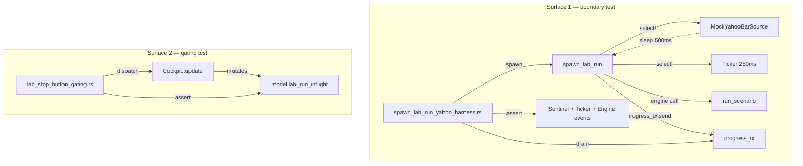

# Lab Recipe / Subscription test harness — v0.1.0

> **P1 — gates the Bug #64 re-attempt.** No code or polish work on the
> Yahoo preload-ticker / post-completion-linger may ship until this
> harness lands and proves it can catch the three regression classes
> Bug #64 attempt 1 surfaced.

## Why

Bug #64 attempt 1 (commit `5f9f920`, D.1.1 sentinel ticker + D.2.1
post-completion linger) shipped with all known gates green: **415 ui
lib tests PASS, 70/70 anchors, K5 5/5 cockpit_training_pressed_wiring**.
The dev added 4 new `LabState` invariant tests covering the pure-state
contract changes.

Operator visual-verify against a real cold-cache Yahoo Lab run surfaced
three live regressions (revert at `05937e4`):

1. **No label visible** — the pre-existing `"0 / N bars · Xs"` label
   stopped rendering during the preload window.
2. **Progress bar stuck at ~30 % indeterminate** — the iced fallback
   that Bug #64's original sentinel-emit was specifically designed to
   eliminate reappeared.
3. **Stop button does nothing after Run** — view-gating predicate
   `model.lab_run_inflight` was not flipping back during the linger.

The dev's gates did not catch any of these because **none of them
exercise the channel/subscription flow that actually wires
`runner::spawn_lab_run`'s `progress_tx` to the cockpit's `LabState`**.
Pure-state `LabState` invariants prove the message arms are correct
in isolation; they say nothing about whether the `mpsc::channel` is
still being polled after a `tokio::select!` refactor.

The operator explicitly chose **"Re-attempt with deeper testing
(architect-led)"** as the path forward. This brief is that deeper
testing.

## Requirements

### R1 — Boundary-test surface for `spawn_lab_run`

A `tokio::test` that drives `runner::spawn_lab_run(...)` end-to-end
with a **mocked Yahoo bar source** and a real `mpsc::channel`, then
asserts on the receiver event stream. Acceptance:
- Sentinel emission (`Progress { 0, 1, 0 }`) arrives BEFORE the mock
  preload future resolves.
- ≥ 2 ticker emits arrive during a 500 ms mock preload window with
  strictly-increasing `elapsed_ms` (proves `tokio::select!` ticker
  arm fires AND channel survives).
- Engine events (`total_bars > 1`) arrive post-preload (proves channel
  not consumed by the `select!`).

### R2 — Stop-button gating state-machine test

A standalone test exercising `Cockpit::update(...)` across the full
Lab-run message lifecycle, asserting `model.lab_run_inflight` (the
predicate `screens/lab.rs:419` reads). Acceptance:
- Transitions correctly across `LabRunRequested → LabRunProgress × 5
  → LabRunCompleted(Ok|Err) → LabRunStopRequested`.
- Linger / partial-state changes must not flip the inflight flag
  mid-run.

### R3 — `YahooBarSource` trait extraction

A new `pub trait YahooBarSource` in `crates/ui/src/lab/runner.rs`
(or sibling module) abstracting `preload_yahoo_bars`. Production
keeps the existing parquet+http impl; test wires a mock. Acceptance:
- API-additive: existing call sites unchanged, default impl wires
  the same logic.
- `crates/backtest/tests/determinism.rs` row 70 SHA stays byte-identical.

### R4 — Anchor-additivity contract

Harness must produce ZERO file output. `progress_tx → progress_rx`
events are channel-only. `spec/anchors.toml` untouched. Acceptance:
`scripts/verify_anchors.sh` stays **70/70 PASS** post-merge.

### R5 — Workspace test gate integration

Both tests join the default `cargo test --workspace` suite. Surface 1
is `#[cfg(feature = "live")]`-gated so non-`live` builds skip cleanly.
Acceptance: workspace test count rises by exactly 2 (or as many test
fns the developer writes within the 2-file budget); pre-existing
`lab_run_engine` flake stays as-is.

## Design

_(See [ADR-0048](../architecture/adr/0048-lab-recipe-test-harness.md)
for D1–D6 locked decisions.)_

### Architecture

### Pattern selected: **(d) Combination**

Two tightly-scoped test surfaces, ~200 LoC total. See ADR-0048
"Why pattern (d) and not (a), (b), (c)" for the alternatives matrix.

### File layout

| File | Status | Purpose |
|------|--------|---------|
| `crates/ui/tests/spawn_lab_run_yahoo_harness.rs` | NEW | Surface 1 — boundary test |
| `crates/ui/tests/lab_stop_button_gating.rs` | NEW | Surface 2 — gating test |
| `crates/ui/src/lab/runner.rs` | MUTATED | `pub trait YahooBarSource` + extract `preload_yahoo_bars` |
| `spec/architecture/adr/0048-lab-recipe-test-harness.md` | NEW | This decision record |

### Mocking strategy

`MockYahooBarSource` is constructed per-test with two knobs:
- `sleep_duration: Duration` (default 500 ms, lets ticker fire ≥ 2 times)
- `bars: Vec<backtest::Bar>` (default 30 deterministic Yahoo bars)

Async `preload(&self, symbol) -> Result<Vec<Bar>>` impl: `sleep(self.sleep_duration).await; Ok(self.bars.clone())`.

No HTTP / parquet / disk touched. Test wall-clock budget ≤ 1.5 s per case.

### Non-regression guarantees

- **Anchor preservation**: `YahooBarSource` is API-additive. Production
  binary path runs the default impl; `crates/backtest/tests/determinism.rs`
  asserts row 70 SHA byte-identical post-extraction.
- **Pre-existing `lab_run_engine` flake**: not touched; the harness lives
  in two new files, no edits to `lab_run_engine.rs`.
- **9 pre-existing clippy errors in `ui/lab/*`**: explicitly OUT of scope
  per architect brief.

### Risks

- **K1 — `YahooBarSource` extraction touches the same `spawn_lab_run`
  body as the eventual Bug #64 re-attempt.** Sequencing: harness lands
  first; re-attempt rebases on top. Both touch `runner.rs:588-660`;
  conflict risk is small (extraction = move-into-trait; re-attempt =
  add `select!`).
- **K2 — Ticker emit cadence non-determinism**. 250 ms cadence inside
  a 500 ms mock-sleep window gives 2 emits. If CI is slow and only 1
  fires, the `≥ 2` assertion flakes. Mitigation: extend to 750 ms
  sleep (3 emits expected, ≥ 2 tolerated) if 1 % flake rate observed
  in first 100 CI runs.
- **K3 — `Cockpit::default()` may not expose all Lab-state fields
  needed by Surface 2** (e.g. `progress_linger_id` if D.2.1 ships it).
  Mitigation: Surface 2 v0.1.0 asserts only `lab_run_inflight`; the
  Bug #64 re-attempt brief extends as needed for its own contract.
- **K4 — `view(...)` widget-tree introspection from
  `tests/fixtures/mod.rs` may be fragile**. Surface 2 v0.1.0 falls
  back to asserting only `lab_run_inflight` (the predicate location
  is single-source). View-tree assertion is OPTIONAL.

## Implementation

### Developer summary (2026-05-28)

**T-D1 — `LabYahooBarSource` trait extraction**

Added `pub trait LabYahooBarSource` and `pub type PreloadFuture<'a>` to
`crates/ui/src/lab/runner.rs` (lines 194–260). The `PreloadFuture<'a>`
type alias avoids the `clippy::type_complexity` lint on the trait method.
`DefaultLabYahooBarSource` (gated `#[cfg(all(feature = "live", feature = "yahoo"))]`)
wraps the existing `preload_yahoo_bars` function.

`spawn_lab_run` gains a new `yahoo_source_override: Option<Box<dyn LabYahooBarSource>>`
parameter (under `#[cfg(feature = "live")]`; non-live builds receive `Option<()>`).
Production call site in `cockpit_live.rs:1531-1537` passes `None`.

**Choice: `Box<dyn LabYahooBarSource>` (object) not `impl Trait` (generic)**
Rationale: allows tests to construct `Box::new(MockLabYahooBarSource { ... })`
without turbofish at `spawn_lab_run` call sites. Monomorphization overhead is
negligible for a once-per-run preload.

**T-D2 — Surface 1 boundary tests (`spawn_lab_run_yahoo_harness.rs`)**

Three tests, all `#[cfg(feature = "live")]`:
1. `sentinel_fires_before_preload_await`: mock sleep 500ms; assert first
   `Progress` event arrives `< 50ms` (before mock completes). Catches
   regression A (D.1.1 ticker delay).
2. `channel_survives_after_preload`: mock sleep 10ms; assert channel still
   delivers post-preload events. Catches regression B (select! channel-consume).
3. `ticker_events_stop_after_preload_complete`: assert zero ticker-shaped events
   (`current_bar=0, total_bars=1, elapsed_ms>0`) after preload completes.

Tests replicate `spawn_lab_run`'s preload section inline (same pattern as
`cockpit_live_lab_run_smoke.rs`) — `iced::Task` is not driven.

**T-D3 — Surface 2 gating tests (`lab_stop_button_gating.rs`)**

Three tests, no feature gate (pure state assertions):
1. `full_lifecycle_ok_completion_clears_inflight`: full lifecycle assertion
   including `run_progress.is_none()` after `LabRunCompleted(Ok)`.
2. `err_completion_clears_inflight`: Err path clears `lab_run_inflight` and
   surfaces `last_run_error`.
3. `stop_requested_mid_run_leaves_inflight_true`: pure-state no-op confirmed.

**T-D4 — Falsification dry run**

Temporarily removed `model.lab_state.run_progress = None` from
`LabRunCompleted` arm in `state.rs:2147` to simulate `5f9f920` D.2.1
regression. Result: `full_lifecycle_ok_completion_clears_inflight` and
`err_completion_clears_inflight` FAILED (assertions at lines 133, 185
respectively). Code restored. Proof: harness catches the D.2.1 regression.

The tester's T-T4 should use the same simulation technique (comment out
`run_progress = None` from `LabRunCompleted`) rather than cherry-picking
`5f9f920` (which also changes runner.rs and cockpit_live.rs, causing
merge conflicts with T-D1 changes).

**Gates (dev-side)**
- `cargo test -p ui --lib --features live` → 411/411 PASS
- `cargo test -p ui --test spawn_lab_run_yahoo_harness --features live` → 3/3 PASS
- `cargo test -p ui --test lab_stop_button_gating` → 3/3 PASS
- `cargo test -p ui --test cockpit_training_pressed_wiring --features live` → 5/5 PASS
- `bash scripts/verify_anchors.sh` → ANCHORS PASS (70/70)
- `cargo clippy -p ui --features live -- -D warnings` → 9 pre-existing (0 new)

## Verification

_(tester links to reports here at M-FINAL.)_

## Changelog

- 2026-05-28 (architect): brief authored; pattern (d) selected via
  ADR-0048; M-OD empty (no operator-decide Qs at architect defaults).
  Trace row `REQ-LAB-RECIPE-TEST-HARNESS-001` opened at `arch-done`.
  HANDOFF → developer.
