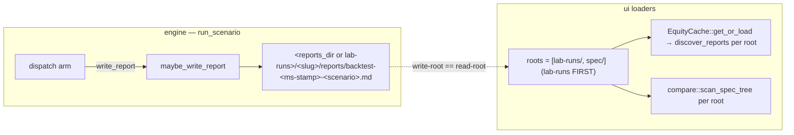

# Lab run → save → compare — real-data strategy checking with durable reports

## Changelog

- 2026-06-12 (analyst): initial draft (v0.1.0). Scoped from the operator's
  "make the Lab a real strategy-checking tool on real data" direction after
  live execution was removed. Closes the documented `run_scenario` **Phase C**
  deferral (`engine.rs:608` — `report_path: None` even when
  `write_report = true`). The gap is verified at file:line throughout
  § Verified crate-edge reality. R1–R7, AC1–AC9, Q1–Q6 below; recommended
  defaults attached to every open question. **THE riskiest decision is Q1
  (where Lab reports live) — recommended (a) a git-ignored `lab-runs/` cache
  OUTSIDE `spec/`, because the anchor verifier globs `spec/**/reports/backtest-*-<scenario>.md`
  and picks the newest match, so a Lab report under any `spec/*/reports/` could
  silently shadow an anchored scenario's hash.**
- 2026-06-12 (architect): **arch-done (v0.2.0)** — `## Architecture` A1–A6 added;
  Q1–Q6 resolved (all six accept the analyst defaults, with code-grounded pins).
  **ADR-0055** filed + registered (`adr_registry_check.py` exit 0): Lab artifacts
  live at a git-ignored `lab-runs/<slug>/reports/backtest-*.md` workspace-root home
  outside every `spec/**` anchor glob (anchor-safety BY CONSTRUCTION; 119/119
  holds). Two code-grounded refinements of the brief: (1) the `report_path: None`
  literals at `engine.rs:429/475/511/563` are inside the **pure** `*_to_report`
  helpers (which take only `(result, start_year)`), so the write seam lives in the
  **dispatch arms** (which hold every writer input) — the arm builds the report,
  calls `maybe_write_report`, then sets `report_path`; (2) the SMA/composed writer
  `report::sma::write` has a **different, larger** signature than momentum/pairs
  (it needs `state` + `strategy_meta` + `elapsed_secs`) — both come off
  `SmaComposedRunResult` (`.state`/`.strategy_meta`), exactly as `main.rs:2109-2110`,
  so the four single-symbol arms are wired per-arm, not by one uniform call.
  Filename stamp pinned to **millisecond** granularity (the CLI's second-precision
  collides on fast successive Lab runs). Wave 0 (T1+T2) gates the developer ‖
  ui-designer split; H3 flip (T6) is its own exec task; AC7 (`verify_anchors.sh`
  119/119) is a mandatory tester AC.

## Why

With live execution retired, the cockpit **Lab** is the project's strategy-
checking surface — but today it cannot **persist** a run. The operator can pick
a strategy + pair + range, press Run, and watch an in-memory equity curve
paint, but the moment the cockpit closes (or a second run dispatches) that
result is gone. There is no durable, comparable record of "I ran v0.sma on
real BTCUSDT 2023 and got this." The next feature makes the Lab a real tool:
**run on real on-disk Binance data → persist a durable report → load it back
in history → diff two runs in Compare.** Files only, no git.

The engine has been built for exactly this since ADR-0030 but stopped one step
short. `backtest::engine::run_scenario` already computes the full in-memory
`RunReport` (equity series + fills + KPIs) and returns a `report_path` field —
but it is **hardcoded `None`** even when `cfg.write_report = true`. The doc
comment at `engine.rs:606-611` names this the deferred **"Phase C"**:

> When `cfg.write_report = true` the function currently returns `report_path: None`
> (Phase B ships in-memory only; file write is a Phase C enhancement … ). The
> `H3` integration test therefore skips the cached-disk equality check for Phase B.

This feature IS Phase C. The downstream consumers are **already wired and
waiting** for a non-`None` `report_path`:

- `crates/ui/src/lab/runner.rs:1132-1156` — `spawn_lab_run` already calls
  `run_scenario`, captures `report.report_path.clone()`, and threads it into
  `RunSummary.report_path`. It is plumbed; the value is just always `None`.
- `crates/ui/src/lab/equity_loader.rs::EquityCache::get_or_load` — the Lab's
  cold-path equity loader (`route_equity_overlay`, `lab.rs:594-597`) already
  scans `spec/<slug>/reports/backtest-*.md` and parses the equity series.
- `crates/ui/src/compare/cache.rs::scan_spec_tree` — the Compare screen's
  cold-boot scanner already walks `spec_root/<strategy_dir>/reports/backtest-*.md`,
  hand-parses the frontmatter + KPI table, and builds the compare matrix.
- `crates/ui/tests/lab_run_engine.rs::h3_in_memory_equals_cached_disk` — the
  H3 contract test ALREADY asserts in-memory == cached-disk **when a
  `report_path` exists**; today it hits `report_path=None` and skips
  (`lab_run_engine.rs:110-116`). Completing this feature flips H3 from
  **skip → real pass** (R6 / AC6).

So the entire run→save→compare chain exists except the one write the engine
defers. The work is: (1) make `run_scenario` actually write the report, (2)
decide WHERE it writes so it never pollutes the anchor namespace (Q1 — the
riskiest decision), and (3) point the Lab-history + Compare loaders at that
home.

### What is settled and MUST NOT be reopened (inherited constraints)

1. **The report template is `crates/backtest/src/report/{sma,momentum,…}::write`.**
   The CLI binary (`main.rs:2142`) already calls `backtest::report::sma::write(&input, &result, seed, &data_source, &report_path)` to produce the canonical `backtest-<stamp>-<scenario>.md`. Phase C **reuses that exact writer** — it does NOT invent a new template. The `RunReport → report::write` shape is the only new plumbing in the engine.

2. **The determinism contract is locked (ADR-0030).** `cfg.seed` is mandatory; `[0u8; 32]` is a hard `RunError::ZeroSeed`. The Lab default is `LAB_DEFAULT_SEED` (`defaults.rs:46` = `0xC0FFEE…`). Same config ⇒ byte-identical report body is the property H3 proves. The persisted report's **frontmatter** carries run-varying metadata (`generated:`, `wall_clock_s:`); the **body** is the deterministic part (the anchor system already strips frontmatter before hashing — `anchors.toml` header).

3. **Every external I/O is behind a trait / the `ui` crate has no direct sqlx and no `backtest`→`ui` dependency.** `engine::DateRange` is deliberately duplicated in `backtest` so `backtest` does not depend on `ui` (`engine.rs:72-83`). Q1's home must not break either edge.

### Not a strategy or sizing feature — say it plainly

This is a **backtest/evaluation tooling** feature: it persists and compares the
output of runs that already execute on the SHIPPED engine path. It introduces
**no new strategy overlay, no sizing modifier, and no decision variable** on
the live/paper trading path. Per CLAUDE.md the **baseline-equity-divergence
e2e gate applies to strategy overlays / sizing modifiers** — this is neither,
so that gate does **NOT** apply here (stated explicitly, exactly as
`live-equity-history-durable` and `cockpit-live-dashboard-wiring` stated it for
their read-only surfaces). The justification is concrete: the divergence gate
exists to catch a *no-op overlay* (a `scale` computed but never applied —
the `v3-volatility-forecaster-noop-fix` precedent). This feature computes no
scale and applies no overlay; the equity series it persists is the engine's
own already-computed output, and **H3 (AC6) is itself the divergence-style
guarantee** — it asserts the persisted bytes' parsed equity equals the
in-memory equity element-by-element, so a "wrote the file but it's wrong/empty"
regression fails loudly. The relevant non-negotiables that DO apply: every
external I/O behind a trait; `Decimal` / `Money<Usdt>` for money, never `f64`;
determinism (byte-identical body for a fixed seed); **anchored reports in
`spec/*/reports/` are byte-immutable AND the anchor verifier must stay
119/119 after a Lab run writes a report** (Q1 / R2 / AC7 — the core constraint).

## Requirements

The operator picks a strategy + pair + range in the Lab (real Binance data:
ADA/AVAX/BNB/BTC/DOGE/DOT/ETH/LINK/SOL/XRP × 2023–24, plus Yahoo), presses Run;
the run executes on the on-disk data; a **durable report is persisted** (equity
series + KPIs); it appears in the Lab's run history AND is **loadable and
diffable in Compare** — all **without touching git and without any risk to the
anchor namespace**.

- **R1 — `run_scenario` persists a report when `write_report = true` (close
  Phase C).** `backtest::engine::run_scenario` writes the Markdown report via
  the existing `crates/backtest/src/report::*::write` writer and returns
  `report_path: Some(path)` (no longer hardcoded `None`). The write reuses the
  CLI's template verbatim — the report body is byte-identical to what the `backtest`
  binary produces for the same `(strategy, pair, range, seed, data_source)`.
  When `write_report = false` (default / fixture path), `report_path` stays
  `None` and no file is written (unchanged). The write is gated by `cfg.write_report`
  so all CLI/anchor-generating call sites (which pass `false` or never reach
  the Lab path) are byte-unaffected.

- **R2 — Lab reports live OUTSIDE the anchor namespace (Q1 — THE decision).**
  Lab-generated reports MUST NOT be globbable by `scripts/verify_anchors.sh`,
  which resolves anchors via
  `find spec -path "*/reports/backtest-*-<scenario>.md" | sort | tail -1`
  (`verify_anchors.sh:88-90`). A Lab report whose scenario name collides with
  an anchored scenario AND sorts newest would **silently become the file the
  anchor is hashed against** → broken gate. Therefore Lab reports are written
  to a home **outside every `spec/**/reports/` glob** (Q1: recommend a
  git-ignored `lab-runs/` cache dir at the workspace root, like the existing
  `/data/*` git-ignored precedent). **AC7 gates this: `verify_anchors.sh`
  stays 119/119 after a Lab run writes a report.**

- **R3 — The write path is behind a trait / abstraction (testable I/O).** The
  report write is reached through an injectable seam (a `ReportSink` trait or
  the existing `reports_dir` override parameter threaded into `run_scenario`),
  so a test can point the write at a tempdir and assert the bytes without
  touching the real filesystem home — per the "every external I/O behind a
  trait so tests can fake it" non-negotiable. The CLI binary already proves the
  override pattern works (`main.rs:95` `--reports_dir` flag: *"for re-running
  into a tempdir without touching the anchored reports under spec/"*).

- **R4 — Lab history reads the persisted Lab reports.** The Lab surfaces the
  operator's past runs: after a run completes, its report is discoverable and
  re-loadable so the equity curve repaints from disk on a later cockpit boot
  (not only from the in-memory `last_run_report` mirror). The
  `EquityCache::get_or_load` loader is pointed at the Lab-runs home (Q1) — a
  small generalization of `default_spec_root()` to ALSO search the Lab-runs
  dir, OR the Lab passes the Lab-runs root explicitly (Q4). The hot-path
  in-memory mirror (`route_equity_overlay` step 1) is unchanged.

- **R5 — Compare loads + diffs two persisted Lab runs (minimal e2e).**
  "Compare" minimally means: select two persisted runs and view them
  **side-by-side** — their KPI rows (return, Sharpe, max-DD, trade count) AND
  an **equity overlay** (both curves on one chart). The Compare scanner
  (`scan_spec_tree`) is pointed at the Lab-runs home (Q4). The Compare screen
  already renders a KPI matrix + overlay from `CachedCell`; this feature feeds
  it Lab-run cells. (No new compare *math* — reuse the existing KPI extraction
  and the existing overlay widget.)

- **R6 — H3 goes from skip to a real pass.** Completing R1 makes
  `crates/ui/tests/lab_run_engine.rs::h3_in_memory_equals_cached_disk` run its
  FULL path: `run_scenario(write_report=true)` → `report_path = Some(...)` →
  `EquityCache::get_or_load` parses the just-written report → element-by-element
  equality `in_memory == cached_disk`. The test currently early-returns at the
  `report_path=None` guard (`lab_run_engine.rs:110-116`); after this feature it
  must reach the assertions and pass. Adjust the test so the spec-root /
  Lab-runs-root the cache reads from is the same dir the engine wrote to (Q4).
  **AC6.**

- **R7 — Determinism + Decimal honored; no `f64` money; bounded retention.**
  The persisted report's body is byte-identical for a fixed seed (the H3
  property). All money in the report path is `Money<Usdt>` / `Decimal` (the
  `report::write` writers already use `Decimal` for money; Sharpe/drawdown are
  display-only `f64` per ADR-0003, unchanged). The Lab-runs home is bounded:
  define a retention rule (Q5 — e.g. keep the last N runs per tuple, or an
  age cap) so the cache dir does not grow without bound. NO live trading — this
  is real-data **backtesting** only (the operator's explicit retained scope).

### Out of scope (explicit)

- **Any live / paper trading.** The operator explicitly retained "real-data
  backtesting only." This feature touches no live execution path; it persists
  and compares the output of the SHIPPED backtest engine.
- **A new report template or KPI math.** R1 reuses the existing
  `report::*::write` writers verbatim; R5 reuses the existing Compare KPI
  extraction + overlay widget. No new Sharpe/CAGR/win-rate computation lands
  here (those live or don't live in the engine exactly as today).
- **Committing Lab reports to git.** Files only, operator-local, never
  committed (Q1 default). A future "share a characterized result" flow that
  promotes a Lab run into a committed `spec/<feature>/reports/` IS a separate
  feature with its own anchor-discipline review — name it separately.
- **Refactoring the CLI `backtest` binary to call `run_scenario`.** That
  remains the deferred Phase B/main-refactor (`engine.rs:11-17`); this feature
  only adds the write *inside* `run_scenario` and leaves the binary's many
  heterogeneous scenario paths untouched (anchor-safety).
- **Cross-sectional Yahoo runs.** Yahoo bars are Lab-only for the 4
  single-symbol arms (`engine.rs:174-177`); cross-sectional arms reject
  `YahooCache` (`RunError::UnsupportedDataSource`). Unchanged.
- **A Compare diff beyond two-run side-by-side.** N-way compare, statistical
  significance tests, or a saved-comparison artifact are future work. v0.1.0 is
  two runs: KPIs + equity overlay (R5).

## Architecture findings (for the architect — analysis, not hand-waving)

### Q1 candidates weighed — where Lab reports live (THE riskiest decision)

The anchor hazard is **mechanically precise** and rules the decision. The
verifier (`verify_anchors.sh:88-90`) resolves each anchored scenario to a file
via:

```sh
find "$root"/spec -type f -path "*/reports/backtest-*-$scenario.md" | sort | tail -1
```

So for any anchored scenario `S`, the **lexicographically-newest**
`backtest-*-S.md` anywhere under `spec/**/reports/` is the file whose
frontmatter-stripped body is hashed against the locked SHA. A Lab run that
writes `backtest-<new-stamp>-S.md` (stamp sorts after the anchored stamp) into
**any** `spec/*/reports/` directory would silently shadow the anchor → the gate
hashes the Lab run's body → mismatch → broken regression gate. Both the Lab
`EquityCache` (`equity_loader.rs:174`) and the Compare `scan_spec_tree`
(`compare/cache.rs:319`) read from `<dir>/reports/backtest-*.md`, so the home
must be a directory those two loaders can also reach.

| Candidate | Anchor safety | Single-writer / crash | Loader reach (Lab + Compare) | Retention | Verdict |
|-----------|---------------|----------------------|------------------------------|-----------|---------|
| **(a) Git-ignored `lab-runs/` at workspace root** (e.g. `lab-runs/<strategy-slug>/reports/backtest-<stamp>-<scenario>.md`) | **Strong — outside every `spec/**` glob by construction.** `verify_anchors.sh` only ever `find`s under `spec`; a sibling `lab-runs/` is invisible to it. **Provably 119/119-safe** (AC7). Add `/lab-runs/` to `.gitignore` (the `/data/*` precedent). | Single writer = the engine process; the `report::write` writer already does a single atomic file create (`std::fs::File::create` + write). Crash = at-most a partial last file, never a corrupt anchor. | **Direct, minimal change** — both loaders take a root path arg; generalize `default_spec_root()` to also return / search the `lab-runs/` root, OR pass the Lab-runs root explicitly (Q4). Loaders keep their `<root>/<slug>/reports/backtest-*.md` shape unchanged — only the ROOT differs. | A `keep last N per tuple` or age-cap purge on the dir; trivial because it is operator-local and unanchored. | **RECOMMENDED.** Provably anchor-safe, operator-local, never committed, reuses the existing report writer AND both existing loaders with only a root-path change. This is both the durable AND the lowest-blast-radius option — anchor safety is not a tax here, it is free. |
| **(b) Audit SQLite ledger — a new `lab_runs` table** (the `equity_snapshots` precedent just shipped) | Anchor-safe (SQLite is not globbed). | Strongest crash story (sqlx atomic commit); single writer. | **Weak FOR THIS FEATURE** — both existing loaders parse Markdown report files; a DB home discards the entire `report::write` + `EquityCache`/`scan_spec_tree` chain and forces a new query + a new equity-from-DB read path on BOTH the Lab and Compare sides. Large rewrite, re-derives the report rendering. | Built-in (a `DELETE WHERE` purge, the `purge_old_equity_snapshots` sibling). | **Fallback / future.** Best durability but the WRONG shape for v0.1.0: it throws away the Markdown-report rendering + the two loaders that already exist. Right home IF a future feature wants queryable run metadata, but it is a much larger build for the same operator outcome. |
| **(c) A committed `spec/lab-runs/` OUTSIDE the anchor globs** | **Fragile.** "Outside the globs" depends on the file NOT matching `*/reports/backtest-*-<scenario>.md`. If it lands under `spec/lab-runs/reports/` it IS matched. Requires either a non-`reports/` subdir (then the loaders, which hardcode `/reports/`, can't read it without a change anyway) or a filename that doesn't start `backtest-` (then the loaders, which filter `starts_with("backtest-")`, can't read it). Self-contradictory: the loaders' filter IS the anchor glob's filter. | Single writer. | Only if the path/name dodges BOTH the glob and the loader filter — impossible to satisfy both without changing the loaders. | Committed → grows git history. | **Rejected.** Committing ad-hoc operator runs pollutes git; and the loaders' file filter is identical to the anchor glob, so "readable by the loaders" and "invisible to the verifier" cannot both hold under `spec/`. |

**Recommendation: (a) a git-ignored `lab-runs/` cache dir at the workspace
root.** It is provably anchor-safe (outside every `spec/**` glob — AC7 is a
mechanical proof, not a judgement call), operator-local, never committed
(`.gitignore` `/data/*` precedent), and reuses the EXISTING report writer
(`report::*::write`) AND BOTH existing loaders (`EquityCache::get_or_load`,
`scan_spec_tree`) with only a **root-path** change — the per-slug `/reports/`
shape underneath is untouched. **This is the durable AND the lowest-blast-radius
choice** — anchor safety here costs nothing because moving the root out of
`spec/` is what makes the gate provably safe AND keeps the loaders' existing
`<root>/<slug>/reports/` layout working verbatim. Per the durable-over-quick
rule it earns the `(Recommended)` tag (Q1): the architect can PROVE it is
anchor-safe by construction, so the cheap-vs-durable tension does not arise.

**If-budget-tightens fallback:** none cheaper than (a) — (a) IS the cheap one.
The only *alternative* is (b) the SQLite ledger, which is MORE durable for
queryable metadata but a LARGER build (discards the Markdown-report loaders).
Name (b) explicitly as the home to revisit IF a future feature needs to query
run metadata (filter/sort runs by KPI), since the Markdown-file home does not
index well. For v0.1.0's run→save→compare outcome, (a) is both correct and
minimal.

### The loaders are already 90% there (the crucial reuse fact)

The reason (a) is cheap: the two consumers already do exactly the right thing,
just rooted at `spec/`:

- `EquityCache::get_or_load(tuple, spec_root)` → `discover_reports(spec_root,
  slug)` → `spec_root.join(slug).join("reports")` (`equity_loader.rs:174`).
  Point `spec_root` (or add a second search root) at `lab-runs/` and it works
  unchanged.
- `scan_spec_tree(spec_root)` → walks `spec_root/<dir>/reports/backtest-*.md`
  (`compare/cache.rs:300-319`). Same: point it at `lab-runs/`.
- `default_spec_root()` (`equity_loader.rs:636`) already walks up from
  `CARGO_MANIFEST_DIR` to the workspace root — a sibling
  `default_lab_runs_root()` is a 5-line copy returning `root.join("lab-runs")`.

So R4/R5 are a **root-path plumbing change**, not a new loader. The riskiest
sub-decision is Q4: do the loaders read ONLY `lab-runs/`, or `spec/` AND
`lab-runs/` (so the operator can also diff a committed anchored report against
a fresh Lab run)? — recommend **both roots searched, Lab-runs first** (Q4).

### The engine write is the only real new logic

`run_scenario` already builds the `RunReport` and has every input the writer
needs (the per-scenario `*ScenarioInput`, the `result`, the `seed`,
`data_source`). The CLI binary's write call (`main.rs:2142`) is the exact
shape to lift into `run_scenario`'s dispatch arms, guarded by
`cfg.write_report`. The work is mechanical per arm; the only design choice is
where the path comes from (R3 — a `reports_dir`-style override threaded into
`ScenarioConfig`, defaulting to the Lab-runs root). Anchor-safety is by
construction: CLI/anchor paths pass `write_report = false` or never construct a
Lab-runs path, so their bytes are unchanged (the H3 test and AC7 prove it).

### Effort honesty — touched crates + test surface

This is a genuine **M**, split backtest-engine ‖ UI:

- **`crates/backtest`** (`engine.rs` + a thin write seam): thread the report
  write into `run_scenario`'s dispatch arms, gated `write_report`; reuse
  `report::*::write`; return `Some(path)`. A `reports_dir`-style override on
  `ScenarioConfig` (R3) defaulting to the Lab-runs root. The bulk of the
  exec-side change, with the anchor-safety obligation (AC7).
- **`crates/ui`** (`lab/runner.rs` already plumbed; `equity_loader.rs` +
  `compare/cache.rs` root-path generalization; a `default_lab_runs_root()`
  helper; a small Lab-history affordance if one is wanted, or just "the curve
  repaints from disk on next boot"): point the two loaders at the Lab-runs
  home (Q4); the run dispatch + `RunSummary.report_path` capture is unchanged.
- **`.gitignore`**: add `/lab-runs/` (one line, the `/data/*` precedent).
- **Test surface:** the engine write round-trip (run → file exists → body
  parses) behind the override-into-tempdir seam (R3); **H3 flips skip → pass**
  (`lab_run_engine.rs`, R6/AC6 — the headline gate); a Compare two-run diff
  test (`scan_spec_tree` over a 2-report tempdir → two cells → KPIs + overlay
  series); the **anchor-safety proof** (AC7 — `verify_anchors.sh` 119/119
  after a Lab write); render-layer verification for any Lab/Compare UI change
  (the `live_equity_render.rs` harness pattern, R5-UI). The CLI anchor paths
  stay byte-identical (no write_report on those paths).

## Open questions for the architect

- **Q1 — Where do Lab-generated reports live? (THE riskiest decision.)**
  - **(a) A git-ignored `lab-runs/` cache dir at the workspace root
    (`lab-runs/<slug>/reports/backtest-<stamp>-<scenario>.md`). (Recommended)**
    — provably anchor-safe (outside every `spec/**/reports/` glob; AC7 is a
    mechanical proof), operator-local, never committed (`/data/*`
    `.gitignore` precedent), reuses the existing `report::write` writer AND
    both existing loaders with only a root-path change. Durable AND
    lowest-blast-radius.
  - **(b) The audit SQLite ledger — a new `lab_runs` table** (the
    just-shipped `equity_snapshots` precedent) — *future / fallback.* Best
    crash story + queryable metadata, but discards the Markdown-report
    rendering + the two existing loaders, a much larger build for the same
    v0.1.0 outcome. Revisit IF a future feature needs to filter/sort runs by
    KPI.
  - **(c) A committed `spec/lab-runs/`** — rejected: the loaders' file filter
    (`/reports/` + `starts_with("backtest-")`) is identical to the anchor
    glob, so "readable by the loaders" and "invisible to `verify_anchors.sh`"
    cannot both hold under `spec/`; and committing ad-hoc runs pollutes git.
  - **Default: (a).**

- **Q2 — How does the write path reach `run_scenario`?**
  - **(a) A `reports_dir: Option<PathBuf>` (or a typed `ReportSink`) on
    `ScenarioConfig`, defaulting to the Lab-runs root, threaded into the
    dispatch arms. (Recommended)** — mirrors the CLI's proven `--reports_dir`
    override (`main.rs:95`, *"re-run into a tempdir without touching anchored
    reports"*); gives R3's testable seam for free; anchor paths pass
    `write_report = false` so they are byte-unaffected. Note the anchor
    contract: adding a field to `ScenarioConfig` must use `#[serde]`/struct-
    update defaults so the 34 anchor-generating constructors stay byte-safe
    (the `ScenarioDataSource` / `latency_slippage_sim` precedents,
    `engine.rs:168,228`).
  - **(b) A `ReportSink` trait injected into `run_scenario`** — cleaner I/O
    abstraction (fully fakeable, no real FS in tests) but more surface than a
    path override for v0.1.0. Defensible if the architect wants the I/O fully
    behind a trait per the non-negotiable; (a)'s path-override is the lighter
    read of the same rule (the write itself is still `report::write`, already
    isolated).
  - **Default: (a) path override on `ScenarioConfig`, defaulting to the
    Lab-runs root; tests pass a tempdir.**

- **Q3 — Report filename + collision avoidance within `lab-runs/`.**
  - Recommend reusing the CLI's `backtest-<stamp>-<scenario>.md` shape so the
    EXISTING loaders parse it unchanged. The `<stamp>` (RFC3339-ish, the CLI's
    `stamp`) makes within-tuple runs unique; multiple runs of the same tuple
    accumulate as distinct files (newest wins in the Lab hot path; all visible
    in Compare's Trail). Confirm the stamp granularity is sub-second so two
    fast successive runs don't collide on filename.
  - **Default: `backtest-<stamp>-<scenario>.md` under
    `lab-runs/<strategy-slug>/reports/`, sub-second stamp.**

- **Q4 — Which root(s) do the Lab + Compare loaders read?**
  - **(a) Both `spec/` AND `lab-runs/`, Lab-runs searched first.
    (Recommended)** — lets the operator diff a fresh Lab run against a
    committed anchored reference report, AND keeps the existing Phase-A
    behaviour (reading committed reports) working. A small change:
    `discover_reports` / `scan_spec_tree` iterate over a `&[root]` slice
    instead of one root, or the callers union two scans.
  - **(b) ONLY `lab-runs/`** — simpler (one root) but loses the
    diff-against-committed-reference affordance and would make the existing
    Phase-A "load a committed report" path go dark. Not recommended unless the
    operator wants a hard wall between committed and Lab runs.
  - **Default: (a) both roots, Lab-runs first.** *(This also pins the H3 test:
    the engine writes to a tempdir Lab-runs root and the cache reads the same
    root — R6.)*

- **Q5 — Retention for `lab-runs/`.**
  - Recommend a bounded rule so the dir doesn't grow without bound: **keep the
    last N runs per tuple** (e.g. N = 20) OR an age cap, purged at run
    completion (the cheap operator-local equivalent of the ledger's nightly
    purge). Compare's Trail (R3.3 most-recent-wins) already tolerates multiple
    reports per tuple, so a modest N is fine.
  - **Default: keep last 20 per tuple, purge on run completion; revisit if the
    operator wants unlimited history (→ then the (b) SQLite home indexes
    better).**

- **Q6 — Lab "history" surface: new affordance or implicit?**
  - **Minimal (Recommended):** no new history *screen* — "history" means the
    Lab curve repaints from the persisted report on the next boot/tuple-select
    (R4), and Compare is where past runs are browsed/diffed (R5). This reuses
    the existing `EquityCache` cold path + the existing Compare screen with
    zero new widget.
  - **Richer (defer):** a dedicated Lab run-history list (timestamps, KPIs,
    click-to-load). A real new screen — name it as a follow-on if the operator
    wants it; not required for the run→save→compare outcome.
  - **Default: minimal — repaint-from-disk + Compare; no new history screen.**

## Acceptance criteria

Proportionate + testable. This is a **backtest/evaluation tooling** feature (no
strategy overlay / sizing math on the shipped path) → the CLAUDE.md
baseline-equity-divergence e2e gate does **NOT** apply (stated explicitly, with
the concrete justification in § Why; AC6/H3 is itself the persisted-vs-in-memory
divergence guarantee).

- **AC1 — `run_scenario(write_report=true)` writes a report and returns
  `Some(path)`.** An integration test (override the write target to a tempdir,
  R3) runs a fixed-seed single-symbol scenario, asserts the file exists at the
  returned path, and asserts `report_path == Some(that path)`. With
  `write_report=false` no file is written and `report_path == None`.
- **AC2 — Persisted body is byte-identical to the CLI writer for the same
  inputs.** For a fixed `(strategy, pair, range, seed, data_source)`, the
  frontmatter-stripped body of the Lab-written report equals the body the
  `backtest` binary's `report::write` produces (same writer; this is the
  determinism contract). Asserted by comparing the two bodies (or re-hashing
  the Lab body with `hash_report.py` against a known-good body SHA).
- **AC3 — Real Binance data path runs.** A test (or documented operator
  recipe) runs a single-symbol arm on real on-disk Binance data (e.g.
  `v0.sma × BTCUSDT × 2023`) and produces a non-empty equity series + a
  persisted report. (Yahoo path covered by the existing `lab-yahoo-realdata`
  tests; this AC confirms the Binance real-data read reaches the writer.)
- **AC4 — Lab history repaints from disk.** A test builds a cockpit, points the
  Lab loader at a Lab-runs tempdir containing one persisted report for the
  active tuple, and asserts `route_equity_overlay` returns the parsed series
  via the cold `EquityCache` path (in-memory mirror absent) — i.e. the curve
  survives a "restart" (cleared in-memory mirror).
- **AC5 — Compare diffs two persisted Lab runs.** A test points
  `scan_spec_tree` at a Lab-runs tempdir with TWO persisted reports (two
  tuples or two runs), asserts two `CachedCell`s are built with their KPIs
  (return, Sharpe, max-DD, trade count) parsed, and asserts both equity series
  are loadable for the overlay. (Minimal "compare" = two cells + their series.)
- **AC6 — H3 goes from skip to a real pass (THE headline gate).**
  `crates/ui/tests/lab_run_engine.rs::h3_in_memory_equals_cached_disk` runs its
  FULL path (no early `report_path=None` return): `run_scenario(write_report=true)`
  → `Some(path)` → `EquityCache::get_or_load` parses it → element-by-element
  `in_memory == cached_disk` equality passes. The skip branch
  (`lab_run_engine.rs:110-116`) is removed/unreachable. Run with
  `--features live`.
- **AC7 — Anchor verifier stays 119/119 after a Lab run writes a report
  (THE core constraint).** A test (or documented gate run) writes a Lab report
  to the Lab-runs home and then runs `scripts/verify_anchors.sh` →
  still **119/119 PASS**. Explicit assertion: the Lab-runs home is outside
  every `spec/**/reports/` glob, so the verifier's
  `find spec -path "*/reports/backtest-*-<scenario>.md"` never sees it. No row
  added to `spec/anchors.toml`; no anchored body SHA mutated.
- **AC8 — Retention is bounded.** A test (or documented purge) shows the
  Lab-runs dir does not grow without bound: after > N runs of one tuple, only
  the last N reports remain (Q5).
- **AC9 — Fixtures `cockpit` smoke unchanged + every I/O behind a seam.** The
  fixtures-mode cockpit (no `live` feature, no engine run, no Lab-runs dir)
  loads nothing → curve falls back to its existing placeholder, no panic,
  within the existing smoke window — byte-identical to today. Review confirms
  the report write is reached through an injectable seam (R3 — the
  `reports_dir` override / `ReportSink`); flag any new dep explicitly (none
  expected — `report::write` and the loaders already exist). Any Lab/Compare
  UI change is verified at the **render layer** (the `live_equity_render.rs`
  pattern), not only at the model layer (project law).

## Size estimate (S/M/L) + exec-vs-UI split

**Estimate: M**, split roughly **≈ 55% exec (backtest engine) / 45% UI**
(loader root-plumbing + Compare wiring + the render-layer check). The decisive
facts:

- **Exec:** the engine write is the only genuinely new logic, but it is
  mechanical (lift the CLI's `report::write` call into `run_scenario`'s arms,
  gated `write_report`, return `Some(path)`), plus a `reports_dir`-style
  override on `ScenarioConfig` (anchor-additive). The anchor-safety obligation
  (AC7) is satisfied by construction (write target is outside `spec/`).
- **UI:** the run dispatch + `RunSummary.report_path` capture is ALREADY
  plumbed (`runner.rs:1132-1156`); the work is pointing `EquityCache` +
  `scan_spec_tree` at the Lab-runs root (a `&[root]` generalization + a
  `default_lab_runs_root()` helper) and verifying any Compare/Lab curve change
  at the render layer. Optionally a minimal history affordance (Q6 default:
  none — repaint-from-disk + Compare).
- **The headline deliverable is H3 flipping skip → pass** (R6/AC6): the whole
  run→save→compare chain proven end-to-end by the test the engine's Phase-B
  contract left dormant.

**Bottom line for the operator:** the Lab becomes a real strategy-checking tool
— run on real Binance data, get a durable report you can reopen and diff —
**without one byte of risk to the 119 anchored reports** (the Lab-runs home is
outside the verifier's `spec/**` globs by construction, AC7), and **without
touching git** (operator-local, `.gitignore`'d). The engine was built for this
since ADR-0030; this closes the one deferred write.

## Architecture

_Architect, 2026-06-12. Governing record: **[ADR-0055](../architecture/adr/0055-lab-run-persistence-topology-and-anchor-safety.md)**
(Lab run persistence topology & anchor-safety). All six open questions accept
the analyst defaults; the resolutions below are pinned against verified
file:line evidence. Two code-grounded refinements vs the brief are called out
inline (the write-seam location and the SMA-writer asymmetry)._

### Q-resolutions (Q1–Q6)

- **Q1 — Where Lab reports live: (a) git-ignored `lab-runs/` at the workspace
  root. ACCEPTED.** Path:
  `lab-runs/<strategy-slug>/reports/backtest-<stamp>-<scenario>.md`, `<slug>`
  per `equity_loader::strategy_slug`. Verified: `verify_anchors.sh:88` resolves
  anchors via `find "$root"/spec -type f -path "*/reports/backtest-*-$scenario.md"`
  — a sibling `lab-runs/` is **invisible** by construction, so 119/119 holds
  (AC7 is a mechanical proof, not a judgement). Add `/lab-runs/` to `.gitignore`
  (the `/data/*` precedent, `.gitignore:7-34`). The git-ignore IS the
  byte-immutability guarantee for the 119 anchored reports (ADR-0038 § D6),
  enforced by the boundary, not by reviewer vigilance.
- **Q2 — Write seam: (a) `reports_dir: Option<PathBuf>` on `ScenarioConfig`,
  anchor-additive. ACCEPTED.** `#[serde(default)]` / struct-update default so
  the 34 anchor-generating constructors stay byte-safe (the `ScenarioDataSource`
  `engine.rs:168` and `latency_slippage_sim` `engine.rs:228` precedents).
  Because `backtest` MUST NOT depend on `ui` (`engine::DateRange` is duplicated
  for exactly this reason, `engine.rs:72-83`), the **Lab caller**
  (`runner.rs:1132`) supplies `Some(default_lab_runs_root())`; a `None`
  `reports_dir` with `write_report = true` falls back to a backtest-local default
  resolving the same workspace-root `lab-runs/`. Gated by `cfg.write_report`.
  Tests pass a tempdir (R3). `ReportSink` trait deferred (more surface than
  v0.1.0 needs; the write is already isolated as `report::*::write`).
- **Q3 — Filename: `backtest-<stamp>-<scenario>.md`, sub-second stamp.
  ACCEPTED with a pin.** Reuse the CLI shape so the existing loaders parse it
  unchanged. **Pin: the filename `<stamp>` is MILLISECOND granularity**, not the
  CLI's second precision (`main.rs:1393-1401` / `2113-2122` use `{:02}{:02}{:02}`
  seconds). The filename stamp is computed by the *caller* (engine), independent
  of the writer's own second-precision `generated:` frontmatter — so two fast
  successive Lab runs of one tuple never collide on filename. Body byte-identity
  is unaffected (the body hashes with frontmatter stripped).
- **Q4 — Loader roots: (a) BOTH `lab-runs/` AND `spec/`, lab-runs FIRST.
  ACCEPTED — THE riskiest pin.** See § The two roots + the H3 invariant below.
- **Q5 — Retention: keep last N = 20 per `(strategy, symbol, range)` tuple,
  purge on run completion. ACCEPTED.** Operator-local + unanchored ⇒ an
  in-process `read_dir` → sort-by-stamp → unlink-older purge after each write.
  Compare's most-recent-wins (`scan_spec_tree` R3.3) tolerates multiple reports
  per tuple. The audit SQLite `lab_runs` table is the FUTURE home iff queryable
  run metadata (filter/sort by KPI) is wanted — Markdown does not index well.
- **Q6 — Lab history: minimal — repaint-from-disk + Compare; no new screen.
  ACCEPTED.** "History" = the Lab curve repaints from the persisted report on the
  next boot / tuple-select via the existing `EquityCache` cold path; Compare is
  where past runs are browsed/diffed. Zero new widget. A dedicated run-history
  list is a named follow-on, not v0.1.0.

### A1 — The `reports_dir` seam on `ScenarioConfig` (exec)

Add one anchor-additive field to `ScenarioConfig` (`engine.rs:192`):

```rust
/// lab-run-save-compare R3 / ADR-0055 § D3 — override the directory the Lab
/// report is written under when `write_report = true`. `None` + `write_report`
/// resolves the workspace-root `lab-runs/` default. CLI/anchor paths pass
/// `write_report = false` (or leave this `None`) → byte-unaffected.
/// Anchor-additive: constructed via struct-update / `..Default` so the 34
/// anchor-generating call sites stay byte-identical.
pub reports_dir: Option<PathBuf>,
```

The struct already derives `Debug, Clone` (no `serde` on `ScenarioConfig`
itself — it is constructed in Rust, so "anchor-additive" here means **every
existing constructor uses struct-update / `..` or names the field**; the field
is added with a documented default-`None` semantics). The 34 anchor constructors
are byte-safe because `write_report = false` on all of them and the new field is
never read on that path. AC7's `verify_anchors.sh` run + the existing
`scenario_data_source` neutrality test pattern (`spec/lab-yahoo-realdata/decomp.md
§ T-AR9`) guard this.

### A2 — The engine write completion at the dispatch arms (exec)

**Code-grounded refinement of the brief.** The brief points at the
`report_path: None` literals at `engine.rs:429/475/511/563` — but those are
inside the **pure** `*_to_report` helpers (`momentum_result_to_report`,
`pairs_result_to_report`, `tcn_result_to_report`, `sma_composed_result_to_report`),
which take only `(result, start_year)` and have **no** `cfg`, no writer input,
no path. The write therefore lives in the **dispatch arms** of `run_scenario`
(`engine.rs:648-916`), which hold every input the writers need:

1. The arm builds the `RunReport` via the existing `*_to_report` helper (still
   returns `report_path: None`).
2. The arm calls a single thin seam
   `maybe_write_report(&cfg, &scenario, <writer-closure>) -> Result<Option<PathBuf>, RunError>`
   that, **only when `cfg.write_report`**, resolves the dir
   (`cfg.reports_dir` or the `lab-runs/` default) → `<dir>/<slug>/reports/` →
   `create_dir_all` → builds the millisecond filename stamp → invokes the
   matching `report::<family>::write` → runs the Q5 retention purge → returns
   `Some(path)`. When `!cfg.write_report` it returns `None` and touches no FS.
3. The arm sets `report.report_path = maybe_write_report(...)?` before returning.

Each arm calls the writer for its family, fed the same inputs the CLI feeds:

| arm (strategy) | writer | inputs (all already in the arm / on the result) | CLI reference |
|----------------|--------|--------------------------------------------------|---------------|
| `v1.momentum` | `report::momentum::write(input, result, seed, data_source, path)` | the `MomentumScenarioInput` the arm builds + `result` + `seed_u64` + `cfg.data_source` | `main.rs:1404` |
| `v1.5a.*` (pairs) | `report::pairs::write(input, result, seed, data_source, path)` | the `PairsScenarioInput` + `result` | `main.rs:1474` |
| `v2.5.tcn*` | `report::tcn_overlay::write(input, result, seed, data_source, path, rev_sha, loaded_info)` | the `TcnScenarioInput` + `result`; `rev_sha = "n/a"`, `loaded_info = None` for Synthetic | `main.rs:1572` |
| `v0.sma` / `v0.5.macd` / `v0.5.rsi` / `v0.5.bbands` (single-symbol composed) | `report::sma::write(sma_input, &result.state, init_cap, final_eq, seed, data_source, elapsed, path, &result.strategy_meta, rev_sha)` | **see A2.1** | `main.rs:2142` |

**A2.1 — the SMA-writer asymmetry (the one place "lift verbatim" is not
drop-in).** Verified: `report::sma::write` (`sma.rs:192`) has a **larger**
signature than the momentum/pairs writers — it needs `state: &BacktestState`,
`strategy_meta: &StrategyMeta`, `elapsed_secs: f64`, and an `SmaScenarioInput`
(NOT the `SmaComposedRunInput` the arm builds). The four single-symbol arms
dispatch through `sma_composed_run::run` → `SmaComposedRunResult`, which
**already carries** `.state` and `.strategy_meta` (`sma_composed_run.rs:106,108`)
— exactly what the CLI pulls at `main.rs:2109-2110` (`strategy_meta =
result.strategy_meta.clone(); state = &result.state`). So the arm:
constructs an `SmaScenarioInput` from its known fields, passes `&result.state`
+ `&result.strategy_meta` + `result.final_equity`, and `rev_sha = None`
(Synthetic / Binance) or the Yahoo revision SHA when `data_source = YahooCache`
(mirror `report::yahoo`'s delegation to `report::sma::write`). `elapsed_secs`
is **frontmatter-only** (`wall_clock_s:`, stripped before hashing) and MAY be
`0.0` on the engine path without affecting AC2 body byte-identity.

`data_source` string: map `cfg.data_source` → `"synthetic"` / `"yahoo"` (the
writers take `&str`, matching the CLI's `&data_source`).

### A3 — The `.gitignore` `/lab-runs/` entry (anchor-safety guarantee)

Add **`/lab-runs/`** to `.gitignore` (one line, after the `/data/*` block). This
is the load-bearing anchor-safety statement: git-ignored ⇒ never committed ⇒ the
`verify_anchors.sh` `find spec …` glob is structurally blind to it ⇒ the 119
anchored bodies are never shadowed and never mutated. Stated explicitly because
the guarantee IS the git boundary, not a runtime check.

### A4 — The two roots + the H3 invariant (the loaders' root-search change)



**Root-search change (Q4 = both roots, lab-runs first).** Add
`default_lab_runs_root()` next to `default_spec_root()`
(`equity_loader.rs:636` — a 5-line sibling returning `<workspace>/lab-runs`).
Generalize the two loaders to read a **fixed-order union of roots**:

- `route_equity_overlay` (`equity_loader.rs:668`) and the underlying
  `discover_reports` / `load_equity` accept a root **slice** `&[PathBuf]`
  (or a small `RootSet` newtype); the production caller `lab.rs:594-597` passes
  `[default_lab_runs_root(), default_spec_root()]`. The per-slug
  `<root>/<slug>/reports/backtest-*.md` shape underneath is **unchanged** — only
  the root iterates.
- `compare::cache::scan_spec_tree` (`compare/cache.rs:300`) likewise iterates the
  same `&[PathBuf]`, unioning the per-root scans; its repo-relative
  `strip_prefix(spec_root.parent())` (`compare/cache.rs:374`) still works (it
  strips the workspace root) per root.

**Precedence + collision rule (pinned):**
1. **Search order is `lab-runs/` first, then `spec/`.**
2. Within the union, the existing **most-recent-`generated:`-wins** tiebreaker
   (`scan_spec_tree` R3.3 per `(strategy, symbol, range)` tuple) decides which
   report represents a tuple in Compare; the Lab hot path uses the same newest
   pick from the union for cold-load.
3. On an **identical filename across both roots** (a `lab-runs/` report and a
   `spec/` report with the same `backtest-<stamp>-<scenario>.md` name), the
   `lab-runs/` copy wins (it is encountered first). This is benign — Lab and
   committed stamps differ in practice — but pinned for determinism.

**H3 invariant — write-root == read-root (Q4 / R6 / AC6; ADR-0055 § D6).** The
root the engine writes under and the root the cache reads from MUST be the same
tree, or H3 fails. The mechanism is **structural**, verified against the test:
`lab_run_engine.rs::test_config(tmp_dir)` (today ignores `_tmp_dir`,
line 41) is changed to set `reports_dir: Some(tmp_dir.to_path_buf())`; the engine
writes `<tmp_dir>/<slug>/reports/backtest-*.md`; the test derives the read-root as
`report_path.parent().parent().parent()` (== `tmp_dir`, lines 117-121) and calls
`get_or_load(&tuple, read_root)`. Equal roots ⇒ the just-written file is the one
parsed ⇒ element-by-element `in_memory == cached_disk` (lines 129-148). The
`report_path == None` skip branch (lines 110-116) becomes **dead** the moment the
engine returns `Some(...)`. (The stale `NotImplemented` skip at lines 77-84 is
already unreachable — `run_scenario` is fully wired — and is left untouched or
neutralized by the tester in T6.)

### A5 — Retention (keep-last-N-per-tuple), Lab run-history + Compare wiring

- **Retention (Q5).** `maybe_write_report` runs an in-process purge after each
  successful write: `read_dir(<dir>/<slug>/reports)` → filter
  `backtest-*-<scenario>.md` for the SAME tuple → sort by stamp → unlink all but
  the newest **N = 20**. Operator-local + unanchored, so no audit-DB / git
  interaction. AC8 asserts ≤ N files remain after > N runs of one tuple.
- **Lab run-history (R4 / Q6 minimal).** No new screen. `route_equity_overlay`
  step 1 (the in-memory `last_run_report` mirror, `equity_loader.rs:675`) is
  unchanged; step 2 (cold path) now reads the two-root union, so after a run
  persists, the curve repaints from `lab-runs/` on the next boot / tuple-select
  even with the in-memory mirror cleared (AC4). The run dispatch +
  `RunSummary.report_path` capture (`runner.rs:1132-1156`) is **already plumbed**
  — `report.report_path` is now `Some(...)` instead of `None`; do not re-plumb.
- **Compare wiring (R5).** `scan_spec_tree` over the two-root union feeds the
  EXISTING Compare KPI matrix + equity-overlay widget two `CachedCell`s
  side-by-side (return / Sharpe / max-DD / trade count + both curves on one
  chart). No new compare math. AC5.

### A6 — The H3 skip→pass mechanism (summary) + binding-law disposition

- **H3 flip (R6 / AC6):** completing A1+A2 makes `run_scenario(write_report=true)`
  return `Some(path)`; threading `tmp_dir` into `reports_dir` (A4) makes
  write-root == read-root; the skip branch goes dead; H3 reaches its assertions
  and passes under `--features live`. This is the headline gate.
- **Binding-law disposition (explicit):**
  - **Anchored reports byte-immutable** — upheld by the `lab-runs/` home
    (A1/A3); `verify_anchors.sh` stays 119/119 (AC7), no `anchors.toml` row, no
    body-SHA mutated. No change to the 9 anchor SHAs in `spec/anchors.toml`'s
    header set is implied.
  - **`Decimal` / `Money<Usdt>`, never `f64`** — the `report::*::write` writers
    already use `Decimal` / `Money<Usdt>` for money; Sharpe / drawdown stay
    display-only `f64` per ADR-0003. No new `f64` money.
  - **Determinism** — `LAB_DEFAULT_SEED` (`defaults.rs:46`) ⇒ byte-identical
    report **body** for a fixed `(strategy, pair, range, seed, data_source)` (the
    H3 / AC2 property); run-varying metadata (`generated:`, `wall_clock_s:`) is
    frontmatter, stripped before hashing.
  - **Every external I/O behind a trait/seam** — the write is reached through the
    `reports_dir` override (R3); tests point it at a tempdir (a `ReportSink` trait
    is the heavier alternative, deferred). The loaders' `read_dir` is the existing
    Phase-A I/O, unchanged in kind.
  - **Baseline-equity-divergence e2e gate — N/A (recorded explicitly).** This is
    backtest/evaluation tooling: it persists/compares output of the SHIPPED engine
    path and introduces **no strategy overlay, no sizing modifier, no decision
    variable** on the live/paper path. The gate exists to catch a no-op overlay
    (`scale` computed but never applied — the `v3-volatility-forecaster-noop-fix`
    precedent); there is no scale here. **AC6 / H3 is itself the divergence-style
    guarantee** (persisted-bytes equity == in-memory equity element-by-element, so
    a "wrote the file but it's wrong/empty" regression fails loudly).
  - **NO live trading** — real-data **backtesting** only; no live/paper execution
    path touched (`live-trading-removed-2026-06-12.md` scope retained).
- **Touched crates:** `crates/backtest` (`engine.rs` — the `reports_dir` field +
  `maybe_write_report` seam + per-arm writer calls), `crates/ui`
  (`equity_loader.rs` — `default_lab_runs_root()` + two-root `route_equity_overlay`;
  `compare/cache.rs` — two-root `scan_spec_tree`; callers in `lab.rs`),
  `.gitignore` (`/lab-runs/`), and `crates/ui/tests/lab_run_engine.rs` (the H3
  flip). No new dependency (the writers + loaders already exist).
