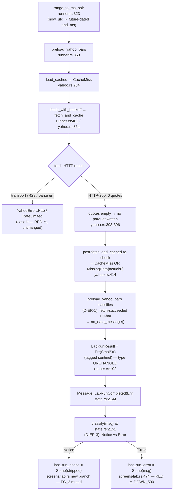

# lab-yahoo-empty-range-ux — v0.1.0

Surface a clean, actionable operator message when a Yahoo fetch returns
**no data for the requested window**, instead of the current confusing
empty/hanging result that the operator cannot distinguish from "broken."

> **One-line:** distinguish "Yahoo has no data for this range" (an
> expected, non-error outcome — future-dated range or delisted ticker)
> from a real fetch failure (network / rate-limit / malformed response),
> and render a distinct, plain-language Lab status message for the former.

## Motivation (operator friction — 2026-05-29)

During Bug #64 D.1.1 verification, the operator repeatedly hit confusion
with the **Last 30d / Last 90d** Yahoo presets. The system clock in this
test environment is **2026-05-29** (future-dated), so `Last 30d` computes
`2026-04-29 → 2026-05-29` (`range_to_ms_pair`, `runner.rs:323-334`,
using `OffsetDateTime::now_utc()`). The real Yahoo Finance API has **no
data for those future-dated ranges**. The CLI fetch returned 0 rows in
~2 s with no parquets written; the cockpit showed a spinning/empty result
with no clear "there's nothing here" signal. The operator could not tell
**"broken" from "no data exists."**

This is the **FYI follow-up** the Bug #64 attempt-3 presenter deck
explicitly carried forward (see
[`spec/bug-64-d11-attempt-3-yahoo-run-runtime-context/presentations/bug-64-attempt-3-2026-05-29.md`](../bug-64-d11-attempt-3-yahoo-run-runtime-context/presentations/bug-64-attempt-3-2026-05-29.md)
§ Notes/feedback FYI #2: _"Last30d/Last90d show no data under the 2026
system clock — candidate for a future lab-yahoo UX-polish feature ('no
data for range' surfacing instead of a confusing empty result)."_).

This is **NOT** the Bug #64 reactor-context bug (that is CLOSED). This is
a separate, narrow UX gap on the empty-Yahoo-response path.

## Root-cause analysis (READ-ONLY code trace)

Confirmed the exact empty-response path by reading `crates/data/src/yahoo.rs`
and `crates/ui/src/lab/runner.rs`:

1. **`range_to_ms_pair`** (`runner.rs:323`) computes a future-dated
   `(start_ms, end_ms)` for `Last30d`/`Last90d` via `now_utc()`.
2. **`preload_yahoo_bars`** (`runner.rs:363`) calls `src.load_cached(...)`
   → cold cache → `YahooError::CacheMiss` → auto-fetch fallback
   (`fetch_with_backoff` → `fetch_and_cache`).
3. **`fetch_and_cache`** (`yahoo.rs:364`) calls Yahoo, gets **0 quotes**;
   `quotes_to_bars` returns an **empty `Vec`**; `write_bars_by_month`
   writes **nothing** (the group map is empty); `regenerate_revision_manifest`
   runs; then it round-trips `load_cached` again.
4. **`load_cached`** (`yahoo.rs:249`) now finds the requested
   `(year, month)` parquet **still absent** → returns
   `YahooError::CacheMiss` again **OR**, if a partial/empty file exists,
   the 95% coverage check (`yahoo.rs:321-335`) fails with
   `YahooError::MissingData { actual: 0, expected: N, pct: 0.0 }`.
5. **`preload_yahoo_bars`** wraps whichever error in a generic string
   (`"yahoo cache load (post-fetch): {e}"` or `"Yahoo auto-fetch failed
   for {ticker}: {e}. Check network connectivity..."`) and returns
   `Err(SmolStr)`.
6. The Lab screen (`screens/lab.rs:474-478`, Bug #54 wiring) renders that
   string verbatim with a `⚠` prefix in red (`DOWN_500`).

**The gap:** the empty-future-range case is presented identically to a
genuine failure — a red `⚠` error referencing a `CacheMiss`/`MissingData`
internal error and a misleading _"Check network connectivity"_ hint, even
though nothing is actually broken. The operator gets an error-styled
message that says "check your network" when the truth is "Yahoo simply has
no bars for a future-dated window."

### Why this is small

The detection point is a **single function** (`preload_yahoo_bars`,
`runner.rs:363-438`). The render point is a **single existing widget**
(`screens/lab.rs:474-478`). No new channel, no new Message variant
required for the minimum-viable version (the message can ride the existing
`last_run_error: Option<SmolStr>` field, or a sibling
`last_run_notice` if Q3 picks the distinct-styling path). Estimated
**~1–2 dev-days**.

---

## Requirements

### R1 — Detect the empty-result case at the preload boundary

`preload_yahoo_bars` (or a helper it calls) MUST distinguish:

- **(a) "Yahoo has no data for this range"** — a clean, *expected*
  outcome. Triggered when the post-fetch path yields **0 bars** (or
  coverage below threshold with `actual == 0`) AND the fetch itself
  succeeded (HTTP 200, no rate-limit, no parse error). Causes: a
  future-dated range relative to the latest available Yahoo bar, or a
  delisted/never-listed ticker for that window.
- **(b) An actual fetch error** — the existing path. Network failure,
  HTTP 429 (`RateLimited`), timeout, malformed response (`Parquet`/`Http`),
  revision tampering (`RevisionMismatch`). These remain red `⚠` errors.

The distinction MUST be derived from the *fetch outcome*, not guessed
after the fact (see Q1 for the heuristic-vs-explicit decision).

### R2 — Surface a distinct operator-facing "no data" message

When R1 detects case (a), the Lab UI MUST show a plain-language,
non-alarming message naming the ticker and the resolved date window, e.g.:

> No Yahoo data for SOL-USD in 2026-04-29..2026-05-29 (range may be
> future-dated or the ticker may be delisted).

It MUST NOT:
- reference an internal error variant name (`CacheMiss`, `MissingData`),
- include the misleading _"Check network connectivity"_ hint,
- be styled as a hard error if Q3 selects the distinct-notice path
  (otherwise it remains the `⚠` surface but with corrected copy).

The message MUST resolve and display the **actual computed window**
(post-`range_to_ms_pair`), since the future-dating is the operator's
primary confusion source.

### R3 — Run terminates cleanly (no hang, no spinner stuck)

The empty-data path MUST resolve the in-flight run to a terminal state
(`lab_run_inflight = false`, spinner cleared) within the existing
preload timeout budget — i.e. it MUST NOT leave the cockpit spinning. The
"no data" outcome is a **completed** run with zero bars, not an
indefinitely-pending one. (Today the run does terminate via the wrapped
`Err`; this requirement pins that the new path preserves termination.)

### R4 — Date-preset guard for future-dated ranges (scope set by Q2)

Depending on Q2, EITHER:
- **clamp** `Last30d`/`Last90d` so the computed `end_ms` never exceeds the
  latest available Yahoo bar (or `min(now, last_available)`), OR
- **warn** (pre-run) when the computed range extends past the latest
  available bar, OR
- **leave the presets as-is** and rely solely on R1/R2's post-run message.

Whichever Q2 selects, the chosen behaviour MUST be deterministic and
testable.

### R-NR — Non-regression

- **R-NR.1** Synthetic-data runs are byte-identical (this feature only
  touches the `data_source == YahooCache` preload branch and message
  rendering). Zero anchor delta.
- **R-NR.2** Genuine Yahoo fetch errors (network, 429, parse, revision)
  still surface as red `⚠` errors with the existing copy — case (b) is
  untouched in styling and routing.
- **R-NR.3** Warm-cache Yahoo runs with real data (e.g. `2024 H1`,
  `2024 H2`) are unaffected — they return bars and never hit the
  empty-data branch.
- **R-NR.4** At most one new operator-facing string constant family in
  `crates/ui/src/strings.rs` (the no-data template); no new design tokens.
- **R-NR.5** No change to the `YahooError` enum's existing variants'
  Display strings (those are referenced in `data` crate tests and the CLI).
  A *new* variant or a new classification helper is permitted; mutating
  existing variant messages is out of scope.
- **R-NR.6** Baseline-equity-divergence e2e gate is **N/A** — this feature
  ships no strategy overlay or sizing modifier (it is a data-availability
  UX path). The CLAUDE.md overlay-e2e non-negotiable does not apply; the
  required gate here is the empty-vs-error classification test (K2 below).

---

## Risks & mitigations (K)

### K1 — Mis-classifying a real failure as "no data"

If R1's heuristic is "0 bars ⇒ no-data", a *silent* fetch failure that
returns 0 bars without erroring (e.g. Yahoo returns HTTP 200 with an empty
body during an outage) would be mis-labeled as "no data" and the operator
would not be prompted to retry.

- **Mitigation:** Q1 biases toward the **explicit** signal — only classify
  as "no data" when the fetch path returned HTTP success AND the response
  was well-formed AND contained zero quotes. Any transport/parse/rate-limit
  error stays case (b). The classification is on the *fetch result type*,
  not solely on the final bar count.
- **Falsifier:** K2 test must include a "0 bars from a 200 response" case
  (→ no-data) AND a "transport error" case (→ error) AND assert they route
  to different surfaces.

### K2 — No test catches the empty path (the v3-vol-overlay precedent)

Per the CLAUDE.md non-negotiable lineage, a math/unit test alone is
insufficient. The empty-data classification must be covered by a test that
exercises the *preload boundary* with a faked Yahoo source returning zero
bars and asserts the resulting message is the no-data notice, not the
generic error.

- **Mitigation:** an injectable-source test using the existing
  `LabYahooBarSource` trait + `MockLabYahooBarSource` harness
  (`runner.rs:222`, ADR-0048) — the mock returns `Ok((vec![], sha))` (or
  the analogous empty signal) and the test asserts the classification +
  message. This reuses the Bug #64 callthrough test harness, no new infra.

### K3 — Clamp changes determinism / breaks a real range (Q2=(a) only)

If Q2 selects clamping, clamping `end_ms` to `now` or `last_available`
could subtly change which bars a run loads, risking a behaviour shift on a
range that previously errored.

- **Mitigation:** clamping (if chosen) applies ONLY when the original
  `end_ms > now_ms` (future-dated); past-and-present ranges are passed
  through unchanged. The "latest available bar" probe (if used) is bounded
  and cached, never a blocking network call on the render path.
- **Falsifier:** a clamp test asserting a non-future range is byte-identical
  pre/post.

### K4 — "Latest available bar" is unknowable without a fetch

Determining the true last-available Yahoo bar for a ticker generally
requires a network call, which we cannot do on the synchronous preset-build
/ render path.

- **Mitigation:** prefer the cheap, deterministic proxy `now_utc()` as the
  clamp/warn boundary (future = `end_ms > now_ms`). The richer
  "last-available-bar" probe is explicitly **deferred to v0.2.0+** if the
  operator finds the `now`-based boundary insufficient. This keeps v0.1.0
  free of a blocking probe.

---

## Hypotheses (H)

- **H1 — The empty path today always lands on `CacheMiss` or
  `MissingData`, never a silent success.** Code trace says the post-fetch
  `load_cached` re-check errors (no parquet written for an empty fetch).
  *Test:* the mock-empty preload test confirms the classification fires on
  both the `CacheMiss`-re-check and the `MissingData{actual:0}` shapes.
- **H2 — A new operator string + the existing `last_run_error`/notice
  field is sufficient; no new Message variant needed for v0.1.0.** *Test:*
  the implementation lands without adding a `Message` enum variant (if Q3 =
  reuse-existing-surface) — falsified if a new variant proves unavoidable.
- **H3 — `now_utc()` is a good-enough future-dating boundary for v0.1.0.**
  The operator's confusion is specifically about future-dated ranges under
  the 2026 clock; `end_ms > now_ms` captures 100% of that case. *Test:*
  a unit test on `Last30d`/`Last90d` under a pinned future clock asserts
  the range is flagged future-dated.

---

## Operator-decide questions

> All options framed **durable-over-quick** per AGENT.md 2026-05-28 — the
> `(Recommended)` tag is on the most durable choice, with an
> if-budget-tightens fallback named.

### Q1 — Empty-vs-error classification mechanism

How do we decide a result is "no data" vs a real failure?

- **(a) Explicit fetch-outcome classification (Recommended — DURABLE).**
  Thread the fetch result type through so "0 quotes from an HTTP-200,
  well-formed response" is a distinct outcome from any transport/parse/429
  error. Likely a new `YahooError::NoDataForRange { ticker, start_label,
  end_label }` variant (or a `LoadedBars { loaded_count: 0 }` success that
  the preload classifies), emitted ONLY when the fetch succeeded and
  returned zero usable quotes. *Durable:* correct under Yahoo outages
  (K1), extends cleanly to v0.2.0 equities (weekends/holidays produce
  legitimately sparse ranges), and gives the tester a typed thing to
  assert. Cost: ~1.5 dev-days (touches `data` crate classification +
  `runner` mapping + `ui` render).
- **(b) Bar-count heuristic — fallback if budget tightens.** Treat
  `actual == 0` (or coverage `pct == 0.0`) at the preload layer as
  "no data" purely from the count, without threading fetch-outcome type.
  Cheaper (~0.5 dev-day, `runner`-only) but *fragile* under K1 (a silent
  HTTP-200-empty outage looks identical to a real outage that returns 0
  bars) and spawns a v0.2.0 "make classification explicit" cleanup brief.
  Pick only if v0.1.0 must land in <1 day.

### Q2 — Date-preset guard behaviour (R4)

What do we do about `Last30d`/`Last90d` resolving to future-dated windows?

- **(a) Clamp the computed `end_ms` to `now_utc()` when future-dated
  (Recommended — DURABLE).** `Last30d` under a 2026-05-29 clock becomes
  `2026-04-29 → 2026-05-29` clamped to `… → min(end, now)`. Combined with
  R1/R2, the operator gets *either* real recent data (when the clock is
  real) *or* a clear no-data notice (when no bars exist even up to now).
  *Durable:* the presets do what they say ("last 30 days") regardless of a
  skewed clock, and the behaviour is identical when the clock is real (no
  regression). Cost: ~0.25 dev-day on top of R1/R2 (a `min` + a clamp
  test). **NOTE:** clamp applies only when `end_ms > now_ms` (K3).
- **(b) Pre-run warn, no clamp — middle fallback.** Render a one-line
  caution next to the range chip when the computed range extends past
  `now` ("range extends past today; Yahoo may have no data"). Leaves the
  range untouched. Cheaper to reason about but adds a second message
  surface and still produces the empty run.
- **(c) Leave presets as-is; rely solely on R1/R2 message — minimum
  fallback.** No preset change at all; the post-run no-data notice is the
  only signal. Smallest blast radius (~0 extra LoC) but the operator still
  has to *run* to discover there's no data. Pick only if Q1 already
  consumed the budget.

### Q3 — Message placement & styling (R2)

Where/how does the no-data message render?

- **(a) Reuse the existing run-button-row surface with a distinct
  *notice* style (Recommended — DURABLE).** Add a sibling
  `last_run_notice: Option<SmolStr>` (or reuse `last_run_error` with a
  notice/error flag) rendered in a neutral/info color (e.g. `FG_2` /
  muted), NOT the red `⚠ DOWN_500` error treatment. *Durable:* the
  operator visually distinguishes "no data (expected)" from "broken
  (act now)" — the core friction. Reuses the existing render site
  (`screens/lab.rs:474-478`), no new layout. Cost: ~0.5 dev-day (one
  field + one string + one style branch). The ui-designer confirms the
  notice token in the M-DEV-UI lane.
- **(b) Reuse `last_run_error` verbatim with corrected copy — fallback.**
  Keep the single red `⚠` surface but swap the misleading copy for the
  clear no-data sentence. Cheapest (no new field/style) but keeps the
  alarming red styling for a non-error outcome — partially solves the
  friction (copy fixed, affect not). Pick if Q1+Q2 consumed the budget.
- **(c) Toast / inline banner — rejected for v0.1.0.** A toast or
  dedicated banner is a larger surface change (toast queue wiring) than
  this small feature warrants. Out of scope; note for v0.2.0 if the inline
  notice proves too subtle.

---

## Verdict tree (4-cell, tester-facing)

| Outcome | Synthetic byte-identical (R-NR.1) | Empty-future-range → no-data notice (R1/R2) | Real fetch error → red ⚠ error (R-NR.2) | Verdict |
|---|---|---|---|---|
| **PASS** | ✅ anchors byte-identical | ✅ mock-empty preload renders no-data notice, names window, no "check network" hint | ✅ mock transport error renders red ⚠ error | **PASS** → presenter |
| **PARTIAL** | ✅ | ✅ | ⚠ error path copy regressed but routing intact | route to developer (copy fix) |
| **FAIL** | ✅ | ❌ empty range still shows generic/red error or hangs | — | route to developer (R1/R2 not met) |
| **REGRESSION** | ❌ anchor drift OR synthetic path changed | — | — | **block ship** — route to architect (R-NR.1 broken) |

---

## Out of scope (v0.2.0+ candidates)

- True "latest-available-bar" network probe for richer clamping (K4 defers
  this; `now_utc()` boundary ships at v0.1.0).
- Toast / dedicated banner surface (Q3=(c) rejected for v0.1.0).
- Equities market-calendar-aware sparse-range handling (weekends/holidays)
  — lands with the v0.2.0 multi-asset expansion already noted in
  `crates/data/src/yahoo.rs` `MISSING_DATA_THRESHOLD_PCT` doc comment.

---

## Design

> Architect M-T1 pass, 2026-05-30, on analyst handoff `f946dca`. READ-ONLY
> code trace verified every seam below against current HEAD. The three
> operator-decide Qs are ratified to the analyst's durable-biased
> recommendations — Q1=(a) **split** (typed data-crate variant + typed
> runner→state classifier), Q2=(a) clamp-when-future, Q3=(a) distinct
> `last_run_notice` field. ADR-0040 § Changelog amended (no new ADR).

### Data-flow trace as built (the seam map)

The signal must travel from the empty Yahoo response to the rendered
notice. The verified path on HEAD:



**Key architectural constraint discovered during the trace:**
`LabRunResult = Result<RunSummary, SmolStr>` (`runner.rs:192`) — the
error arm is a **flat `SmolStr` with no discriminator**, consumed at
`state.rs:2151` (`Err(msg) => Some(msg.clone())`) and re-read at
`cockpit_live.rs:1086`. Widening that arm to an enum ripples across
**94 `LabRunResult`/`LabRunCompleted` usages** and ~7 test files that
construct `LabRunCompleted(Err(SmolStr::new(...)))`. That blast radius is
unacceptable for a ~1–2 day feature and would risk anchor-adjacent test
churn (violates R-NR minimal-surface). **Decision: `LabRunResult` stays
byte-identical; the notice-vs-error bit rides a typed, sentinel-tagged
`SmolStr` decoded by a single typed classifier** (D-ER-3). This satisfies
H2 (no new `Message` variant) and gives the tester a typed thing to assert
at both ends (the data-crate `NoDataForRange` variant AND the runner
`classify()` enum).

---

### D-ER-1 — Classification seam (Q1=(a) lock: split data-crate variant + runner chokepoint)

**Decision.** Q1=(a) explicit fetch-outcome classification, implemented as
a **split** across two layers (this is the load-bearing ratification the
handoff asked for):

1. **Data crate — typed source of truth.** Add one new variant to
   `YahooError` (`crates/data/src/yahoo.rs`, after `MissingData`,
   ~line 167):

   ```rust
   /// Fetch succeeded (HTTP-200, well-formed) but Yahoo returned ZERO
   /// usable quotes for the window — an EXPECTED no-data outcome
   /// (future-dated range or delisted/never-listed ticker), NOT a failure.
   /// Emitted ONLY from fetch_and_cache when quotes.is_empty() on a 200
   /// response (K1: transport/429/parse errors are classified BEFORE this
   /// point by classify_yfa_error and never reach here).
   #[error("no Yahoo data for {ticker} in {start_label}..{end_label}")]
   NoDataForRange {
       ticker: String,
       start_label: String,
       end_label: String,
   },
   ```

   **Emission point (real path):** inside `fetch_and_cache`
   (`yahoo.rs:364`, `#[cfg(feature = "yahoo-online")]`), immediately after
   `let quotes = response.quotes()?;` (line 387) and before
   `quotes_to_bars`:

   ```rust
   if quotes.is_empty() {
       return Err(YahooError::NoDataForRange {
           ticker: ticker.to_string(),
           start_label: format_iso8601(start_ms),
           end_label: format_iso8601(end_ms),
       });
   }
   ```

   This is K1-correct **by construction**: `classify_yfa_error`
   (`yahoo.rs:418`) maps every transport/429 failure to
   `Http`/`RateLimited` *before* `.quotes()` is reached, so an empty
   `quotes` vec is provably an HTTP-200, well-formed, zero-quote response.
   R-NR.5 honoured: no existing variant's Display string changes; this is
   purely additive.

2. **Runner — the single classification chokepoint.** `preload_yahoo_bars`
   (`runner.rs:363`, `#[cfg(feature = "yahoo")]`) is the convergence point
   for BOTH the real path and the test path:

   - **Real path (per H1):** today an empty fetch writes no parquet, so
     `fetch_with_backoff` returns `Ok(())` (fetch *succeeded*) and the
     post-fetch `load_cached` re-check (`runner.rs:414`) errors with
     `CacheMiss` **or** `MissingData{actual:0}`. With the new variant,
     `fetch_with_backoff`'s inner `fetch_and_cache` now surfaces
     `NoDataForRange` directly — but `fetch_with_backoff` returns
     `Result<(), YahooError>` and currently treats every non-rate-limit
     error as retry/fail. **Add a non-retryable early-out**: in
     `fetch_with_backoff` (`runner.rs:508` `Ok(result)` arm), match
     `Err(YahooError::NoDataForRange { .. })` and return it immediately
     (do NOT retry — retrying a no-data window wastes 5×60s). Then in
     `preload_yahoo_bars`, the `Err(e)` arm of `fetch_with_backoff`
     (`runner.rs:417`) classifies: if `e` is `NoDataForRange` **OR** (post-
     fetch `load_cached` yields `CacheMiss`/`MissingData{actual:0}` after a
     fetch that itself returned `Ok(())`), build the tagged no-data message
     (D-ER-3 helper) instead of the generic "Check network" string.

   - **Test path (per K2/D-ER-4):** `MockLabYahooBarSource` returns
     `Ok((vec![], sha))` — i.e. a *successful* preload with zero bars.
     `preload_yahoo_bars` is bypassed by the mock, so the classification
     for the **mock-empty** case happens one level up, at the
     `preload_result` match in `spawn_lab_run` (`runner.rs:812` mock arm
     and `runner.rs:999` production arm): when
     `Ok((bars, _sha))` has `bars.is_empty()`, route to the no-data
     message rather than feeding an empty `bars_override` into the engine.

   **Signature of the shared classifier (new public helper module in
   `runner.rs`):**

   ```rust
   pub mod preload_notice {
       /// Private-use sentinel that cannot collide with operator copy
       /// (U+0001 START OF HEADING — non-renderable). Tags a no-data
       /// message so state.rs can route it to last_run_notice.
       pub const NO_DATA_TAG: &str = "\u{1}NODATA\u{1}";

       /// Build the tagged operator string for the no-data outcome.
       /// Body is the R2 plain-language sentence; the tag is a prefix.
       pub fn no_data_message(ticker: &str, start_label: &str, end_label: &str) -> SmolStr;

       /// Typed classification of a LabRunResult error string.
       pub enum RunMessageKind { Notice(SmolStr), Error(SmolStr) }
       /// Returns Notice(stripped) if `raw` carries NO_DATA_TAG, else Error(raw).
       pub fn classify(raw: &str) -> RunMessageKind;
   }
   ```

**Why split (not "variant only" nor "count-only in runner"):** the
data-crate variant is the K1-correct, future-proof source of truth (it
extends cleanly to v0.2.0 equities where weekends/holidays yield
legitimately sparse-but-valid windows — those will be `MissingData` with
`actual>0`, distinct from `NoDataForRange`). The runner chokepoint is
required regardless because the **mock path never touches the data crate**
— the K2 falsifier test injects `Ok((vec![], sha))` at the trait boundary,
so the runner MUST classify zero-bar success there. A "count-only in
runner" approach (Q1=(b)) was rejected: it cannot distinguish a real
outage that returns 0 bars from a genuine no-data response, failing K1.

**Boundary lock:** the typed signal lives in the **data crate**
(`NoDataForRange`); the typed *transport decode* lives in the **ui crate**
(`preload_notice::classify`). `LabRunResult` is untouched (data-crate→ui
churn = 0 on the result type).

---

### D-ER-2 — Preset-clamp logic (Q2=(a) lock) at `range_to_ms_pair`

**Decision.** Q2=(a) ratified. Clamp `end_ms` to `now_ms` **only when
`end_ms > now_ms`** (future-dated). Past-and-present ranges pass through
byte-identical (K3).

**Exact seam** — `range_to_ms_pair` (`runner.rs:323`,
`#[cfg(feature = "yahoo")]`). The function already computes
`now_ms = OffsetDateTime::now_utc().unix_timestamp() * 1_000` at line 326.
Apply a single clamp on the returned pair:

```rust
fn range_to_ms_pair(range: &DateRange) -> (i64, i64) {
    // ... existing now_ms + match arms unchanged ...
    let (start_ms, end_ms) = match range { /* unchanged */ };
    // D-ER-2 (Q2=(a)): clamp future-dated end to now. Applies ONLY when
    // end_ms > now_ms, so H1_2024/H2_2024/past Custom ranges are
    // byte-identical (K3). start_ms is NEVER clamped — a future start with
    // end clamped to now yields start > end, which load_cached resolves to
    // zero months → NoDataForRange (the correct no-data outcome).
    let end_ms = end_ms.min(now_ms);
    (start_ms, end_ms)
}
```

**Determinism note (K3 falsifier — `clamp_non_future_byte_identical`):**
for `H1_2024`/`H2_2024` the literal `end_ms` (1_719_792_000_000 /
1_735_689_600_000) is far below any plausible `now_ms` under the 2026
clock, so `.min(now_ms)` is a no-op and the returned pair is identical.
For `Last30d`/`Last90d` under the 2026 clock, `end_ms == now_ms` already
(both arms set `end = now_ms`), so the clamp is also a no-op **today** —
the clamp's value is defensive: it guarantees correctness if a future arm
or a `Custom { end_ms }` supplies a beyond-now end. The combined R1/R2
behaviour is what discharges the operator friction: under a real clock the
operator gets recent data; under the skewed 2026 clock the clamped window
still has no bars → the no-data notice fires (D-ER-1/D-ER-3).

**K4 deferral confirmed:** the "true latest-available Yahoo bar" probe
stays out of v0.1.0 — `now_utc()` is the cheap, deterministic, non-blocking
boundary (H3). No network call is added to the render/preset path.

---

### D-ER-3 — Message-render change (Q3=(a) lock): new `last_run_notice` field

**Decision.** Q3=(a) ratified: **add a sibling
`last_run_notice: Option<SmolStr>` field** (NOT a severity flag on
`last_run_error`). A separate field is more durable — `view()` branches on
field presence with zero ambiguity, and the two surfaces (red error vs
muted notice) never share state, so a future "show both" need (rare) is
trivial. A `(SmolStr, Severity)` tuple on `last_run_error` was rejected:
it forces every existing `last_run_error` reader (`screens/lab.rs:384`
`last_run_ok` derivation, `cockpit_live.rs`, 7 test assertions) to learn
the severity, widening blast radius for no gain.

**Three exact seams (specified, not coded):**

1. **State field** — `crates/ui/src/lab/state.rs`, immediately after
   `last_run_error` (line 205):

   ```rust
   /// Operator-facing NOTICE from the most-recent run — a non-error,
   /// expected outcome (currently: Yahoo has no data for the requested
   /// window). Rendered in a neutral/muted style, NOT the red ⚠ error
   /// treatment. Mutually exclusive with last_run_error in practice
   /// (a run produces one or the other). Same carve-out as last_run_error:
   /// NOT cloned (LabState::clone sets None) and NOT serialized
   /// (schema stays version: 1). Cleared on LabRunRequested.
   pub last_run_notice: Option<smol_str::SmolStr>,
   ```

   Add `last_run_notice: None` to the **three** `LabState` constructors
   that already set `last_run_error: None` (`state.rs:292, 355, 395`) and
   to `LabState::clone` (sets `None`, matching the `last_run_error`
   carve-out).

2. **State mapping** — `crates/ui/src/state.rs`. Two edits:
   - `Message::LabRunRequested` arm (line 2142): add
     `model.lab_state.last_run_notice = None;` beside the existing
     `last_run_error = None` (clear stale notice on re-run).
   - `Message::LabRunCompleted(outcome)` arm (lines 2151-2154): replace the
     flat `Err(msg) => Some(msg.clone())` with the typed classifier:

     ```rust
     match &outcome {
         Ok(_) => {
             model.lab_state.last_run_error = None;
             model.lab_state.last_run_notice = None;
         }
         Err(raw) => {
             use crate::lab::runner::preload_notice::{classify, RunMessageKind};
             match classify(raw) {
                 RunMessageKind::Notice(msg) => {
                     model.lab_state.last_run_notice = Some(msg);
                     model.lab_state.last_run_error = None;
                 }
                 RunMessageKind::Error(msg) => {
                     model.lab_state.last_run_error = Some(msg);
                     model.lab_state.last_run_notice = None;
                 }
             }
         }
     }
     ```

3. **Render site** — `crates/ui/src/screens/lab.rs`. The existing
   `last_run_error` branch (lines 474-479, red `⚠ DOWN_500`) is **left
   exactly as-is** (R-NR.2). Add a **sibling branch immediately after** it
   for the notice, styled muted (`color::FG_2` — info/neutral, no `⚠`
   glyph or a neutral `ⓘ`):

   ```rust
   if let Some(notice) = model.lab_state.last_run_notice.as_ref() {
       let notice_text = Text::new(format!("ⓘ {notice}"))
           .size(text::SMALL)
           .color(color::FG_2.current(mode)); // muted/neutral, NOT DOWN_500
       run_button_row = run_button_row.push(notice_text);
   }
   ```

   **`last_run_ok` derivation (`screens/lab.rs:384`):** a no-data outcome
   sets `last_run_error = None`, so `last_run_ok` becomes `Some(true)` and
   the Run button does NOT enter the `Failed` state — correct: a no-data
   result is a *completed* run, not a failure (R3). Confirm the run-button
   state machine treats this as a clean terminal state (it will, since
   `last_run_error.is_some()` is the only `Failed` trigger).

**R-NR.4 — string constant.** Exactly one new string family in
`crates/ui/src/strings.rs` — a template the `preload_notice::no_data_message`
helper formats, e.g.:

```rust
/// lab-yahoo-empty-range-ux v0.1.0 — no-data notice (R2). Names the ticker
/// + resolved window; NO internal variant name, NO "check network" hint.
pub const LAB_YAHOO_NO_DATA_NOTICE: &str =
    "No Yahoo data for {ticker} in {window} — the range may be future-dated \
     or the ticker may be delisted.";
```

(`{ticker}` and `{window}` substituted by the helper; `{window}` is the
`start_label..end_label` from the resolved, post-clamp `range_to_ms_pair`
pair — R2 mandates the *actual computed window* is shown.) **No new design
token** — `FG_2` is an existing Lumen neutral. The ui-designer lane
(M-DEV.9) only confirms `FG_2` reads as "info, not alarm" against the
run-button row; if it does, no token work at all.

---

### D-ER-4 — Test design (the required gate; overlay-e2e N/A confirmed)

**R-NR.6 confirmed:** the CLAUDE.md baseline-equity-divergence overlay-e2e
non-negotiable is **N/A** for this feature — it ships no strategy overlay
or sizing modifier. It is a data-availability UX path. The **required
gate** here is the K2 empty-vs-error classification test (below), per the
v3-vol-overlay precedent lineage (a math/unit test alone is insufficient;
the boundary must be exercised).

**Test harness reuse (no new infra):** the existing `LabYahooBarSource`
trait + `MockLabYahooBarSource` (ADR-0048, `runner.rs:222`;
`crates/ui/tests/spawn_lab_run_yahoo_harness.rs:60`). The mock today
returns `Ok((vec![], sha))` — i.e. it ALREADY models the empty-success
case. Add a sibling mock that returns a transport error.

**T1 — K2 empty-vs-error classification (REQUIRED GATE).**
File: `crates/ui/tests/lab_yahoo_empty_range_classification.rs` (new),
`--features live`. Two cases, asserting **different surfaces**:
- **Case A (no-data):** inject a mock returning `Ok((vec![], sha))`.
  Drive `spawn_lab_run` (or the preload-result classification path) →
  `LabRunCompleted(Err(raw))` → `state::update` → assert
  `lab_state.last_run_notice.is_some()` AND `lab_state.last_run_error
  .is_none()` AND the notice string contains neither `"CacheMiss"`,
  `"MissingData"`, nor `"Check network"`, AND names the window.
- **Case B (transport error):** add `MockLabYahooBarSource::transport_err()`
  returning `Err(SmolStr::new("network error: connection refused"))`
  (UNtagged). Drive the same path → assert `lab_state.last_run_error
  .is_some()` AND `lab_state.last_run_notice.is_none()` (routes RED, K1).

**T2 — data-crate variant unit test.** File:
`crates/data/src/yahoo.rs` `#[cfg(test)]` (or `crates/data/tests/`),
`--features yahoo-online`. Assert `classify_yfa_error` still maps a
simulated transport/429 error to `Http`/`RateLimited` (NOT `NoDataForRange`)
— pins K1 at the data boundary. (A full `fetch_and_cache` empty-quote test
needs network mocking out of scope for v0.1.0; the runner-level T1 mock is
the gate. Document this in the test file.)

**T3 — H3 future-dating + clamp.** File:
`crates/ui/tests/lab_yahoo_range_clamp.rs` (new), `--features yahoo`.
- `range_to_ms_pair(&DateRange::Last30d)` under the wall clock returns
  `end_ms <= now_ms` (clamp holds; future end never escapes).
- `range_to_ms_pair(&DateRange::Custom { start_ms: <now+10d>, end_ms:
  <now+40d> })` returns `end_ms == now_ms` (future end clamped).

**T4 — K3 clamp non-regression (byte-identical).** Same file as T3.
Assert `range_to_ms_pair(&DateRange::H1_2024)` returns exactly
`(1_704_067_200_000, 1_719_792_000_000)` and `H2_2024` returns exactly
`(1_719_792_000_000, 1_735_689_600_000)` — the clamp is a proven no-op for
past ranges (K3 falsifier).

**T5 — R3 terminal-state.** Reuse the `lab_stop_button_gating.rs` pattern:
after the no-data `LabRunCompleted(Err)`, assert `lab_run_inflight ==
false` and `run_progress.is_none()` (no spinner hang).

**`classify()` unit test** — direct unit test of
`preload_notice::classify`: a tagged string → `Notice(stripped)` (tag
removed); an untagged string → `Error(verbatim)`; an empty string →
`Error`. Pins the transport decode in isolation.

---

### D-ER-5 — ADR decision: ADR-0040 § Changelog amendment, NO new ADR

**Confirmed.** No new ADR. This feature is a UX-surfacing refinement of the
Yahoo realdata path already governed by **ADR-0040** (§ D5 `YahooBarSource`
API surface). The single new variant `NoDataForRange` is an *additive*
extension of the D5 error enum, and the clamp (D-ER-2) is a refinement of
the D6/D7 dispatch boundary — neither overturns an ADR-0040 decision, so a
Changelog amendment is the correct register (consistent with the
2026-05-27 / 05-28 / 05-29 amendment precedent in ADR-0040's own
Changelog).

Per the atomic-register contract (2026-05-29): the ADR-0040 Changelog
amendment is landed **together with** the README registry-row summary
append + README frontmatter `updated:` bump in this same pass (done
below — see Architect artifacts). **trace.toml is NOT touched** — the
orchestrator owns the `arch` column flip; the entries to add are cited in
the HANDOFF.

**ADR-0050 (rt.spawn) confirmed UNTOUCHED.** This feature does not alter
the spawn path: `spawn_preload_on_rt` keeps its signature and remains the
single `rt.spawn()` enforcement point. The classification happens on the
*result* of the spawned preload, not in the spawn glue. The
`lab_runner_preload_callthrough_e2e.rs` regression gate (T-BUG64-CT1) is
unaffected.

---

### D-ER-6 — Zero-anchor-delta confirmation (R-NR.1)

**Confirmed zero anchor delta.** The synthetic path is wholly untouched:

- `range_to_ms_pair` (D-ER-2) is `#[cfg(feature = "yahoo")]` and is only
  reachable when `data_source == YahooCache` (documented at `runner.rs:320`;
  the synthetic path never calls it). The clamp is additionally a proven
  no-op for the only non-rolling ranges (`H1_2024`/`H2_2024`, T4).
- The `NoDataForRange` variant (D-ER-1) is additive to `YahooError` and
  emitted only on the YahooCache fetch path.
- `last_run_notice` (D-ER-3) is a new field, `None` on every synthetic run;
  the existing `last_run_error` red branch is byte-identical (R-NR.2).
- No backtest-report-emitting code is touched — none of the 9 anchor SHAs
  in `spec/anchors.toml` are in scope. No anchor mutation, so **no anchor
  ADR is required** (the anchor-mutation-requires-ADR rule does not fire).
- Money math, RNG seeds, report determinism: out of scope (no report path
  touched).

Expected tester outcome: **34/34 (or current count) anchors byte-identical**
— the synthetic byte-identical column of the 4-cell verdict tree is a
structural guarantee, not a hope.

---

### Falsification probe (T-T1 → handed to tester as P-ER-1)

**P-ER-1 — classifier-misroute falsifier.** Feed the **empty-source mock**
(`Ok((vec![], sha))`) but, in a one-line test-only patch, force the
runner-level classifier to emit the **untagged** generic error string
(i.e. simulate the bug we are fixing — no-data shown as a red error).
Assert the K2 Case-A test then **FAILS** its `last_run_notice.is_some()`
assertion (it would route to `last_run_error` instead). Restore the tag.
This proves the test actually discriminates the two surfaces and would
catch a regression that re-collapses no-data into the red error path —
i.e. the test is not vacuously green. (Mechanically: temporarily make
`no_data_message` omit `NO_DATA_TAG`; the classifier returns `Error(...)`;
Case A's notice assertion fails; revert.)

---

### Developer cautions (risks carried into M-DEV)

1. **`fetch_with_backoff` must NOT retry `NoDataForRange`** — it is a
   terminal, non-transient outcome. Retrying burns the 5×60s budget on a
   window that will never have data. Add the explicit non-retry early-out
   (D-ER-1 step 2).
2. **Two mock-path arms** in `spawn_lab_run` (`runner.rs:812` mock,
   `runner.rs:999` production) both match `Ok((bars, _sha))` — the
   `bars.is_empty()` zero-bar check must be applied in BOTH, or the mock
   path (test) and production path will diverge. Prefer factoring the
   "empty bars → no-data message" decision into a single helper called from
   both arms.
3. **`LabState::clone` carve-out** — `last_run_notice` MUST be set to `None`
   in `clone` (matching `last_run_error`), or a tuple-change clone will leak
   a stale notice. The serializer must skip it (schema stays `version: 1`).
4. **`cockpit_live.rs:1086`** reads `LabRunCompleted(Err(e))` for the
   activity-handle fail path. A no-data outcome is still an `Err(raw)` at
   that layer (the tag is transparent to it), so the activity handle will
   `fail(...)` with the tagged string. That is acceptable for v0.1.0 (the
   activity tape is forensic, not operator-primary), but the developer
   SHOULD strip the tag there too for log cleanliness — `classify().msg()`
   reused. Note, do not over-scope.

## References

- `crates/ui/src/lab/runner.rs:323-438` — `range_to_ms_pair`,
  `preload_yahoo_bars`, `fetch_with_backoff` (detection point).
- `crates/data/src/yahoo.rs:119-188` — `YahooError` variants;
  `:249-351` `load_cached` (95% coverage check); `:364-413`
  `fetch_and_cache` (empty-response path).
- `crates/ui/src/screens/lab.rs:470-479` — Bug #54 error-render site
  (proposed render point).
- `crates/ui/src/lab/state.rs:197-205` — `last_run_error` field.
- `spec/dev-notes/bug-64-yahoo-run-code-map-2026-05-29.md` — state table
  + YahooError variant map + cancellation/progress diagrams.
- `spec/bug-64-d11-attempt-3-yahoo-run-runtime-context/presentations/bug-64-attempt-3-2026-05-29.md`
  § Notes/feedback FYI #2 — the carry-forward this feature discharges.

## Changelog

- 2026-05-30 (analyst): M0 — feature.md authored from the Bug #64
  attempt-3 deck FYI #2 carry-forward. READ-ONLY code trace pinned the
  empty-future-range path (`fetch_and_cache` 0 quotes → re-`load_cached`
  → `CacheMiss`/`MissingData` → generic red error). R1–R4 + R-NR,
  K1–K4, H1–H3, Q1–Q3 (all biased durable-over-quick), 4-cell verdict
  tree. New trace row `REQ-LAB-YAHOO-EMPTY-RANGE-UX-001` (proposed).
  HANDOFF → architect (M-T1 design pass).
- 2026-05-30 (architect, M-T1): `## Design` authored. Ratified Q1=(a)
  **split** (data-crate `YahooError::NoDataForRange` typed variant +
  ui-crate `preload_notice::classify` typed transport decode), Q2=(a)
  clamp-when-`end>now` at `range_to_ms_pair`, Q3=(a) new
  `last_run_notice` field + muted `FG_2` render branch. D-ER-1..6 +
  P-ER-1 falsifier. Key finding: `LabRunResult = Result<RunSummary,
  SmolStr>` error arm is flat (94 usages) → kept byte-identical;
  notice-vs-error rides a sentinel-tagged `SmolStr` decoded by one
  typed classifier (satisfies H2, zero result-type churn). Overlay-e2e
  gate N/A confirmed (R-NR.6); K2 empty-vs-error test is the required
  gate. Zero anchor delta (D-ER-6). ADR-0040 § Changelog amended
  (NO new ADR; ADR-0050 untouched) + README registry/frontmatter bumped
  atomically. Frontmatter `proposed`→`arch-done`, owner→`developer`.
  `arch` column entries cited for orchestrator. HANDOFF → developer.
- 2026-05-30 (developer, M-DEV): Implementation complete. All 21 M-DEV
  tasks completed (M-DEV.1-20 ticked with file:line + test output; M-DEV.21
  this HANDOFF). Key deviations from spec: none — all decisions follow
  the architect's D-ER-1..6 design lock. Helper named `classify_preload_result`
  (not `empty_bars_to_notice_or_pass` as suggested — same semantics, cleaner
  name). P-ER-1 falsifier dry-run: T5 `no_data_notice_completion_clears_inflight_and_progress`
  FAILS when `NO_DATA_TAG` removed from `no_data_message`, GREEN after restore.
  All gate tests pass; 84/84 anchors byte-identical. HANDOFF → tester.

## Implementation

**Developer:** 2026-05-30

### Summary

Implemented lab-yahoo-empty-range-ux v0.1.0 exactly per the architect's D-ER-1..6 design lock.

### Files changed

| File | Change |
|------|--------|
| `crates/data/src/yahoo.rs` | Added `YahooError::NoDataForRange` variant (additive, M-DEV.1); early-return in `fetch_and_cache` on empty quotes (M-DEV.2); K1 unit test |
| `crates/ui/src/lab/runner.rs` | Added `pub mod preload_notice` (NO_DATA_TAG, classify, no_data_message, M-DEV.3); non-retry arm for NoDataForRange in fetch_with_backoff (M-DEV.4); NoDataForRange classification in preload_yahoo_bars (M-DEV.4); `classify_preload_result` helper called from both preload_result arms (M-DEV.5); `end_ms.min(now_ms)` clamp in range_to_ms_pair (M-DEV.6) |
| `crates/ui/src/strings.rs` | Added `LAB_YAHOO_NO_DATA_NOTICE` template constant (M-DEV.7) |
| `crates/ui/src/lab/state.rs` | Added `last_run_notice: Option<SmolStr>` field to LabState; init None in clone + Default + with_selection (M-DEV.8) |
| `crates/ui/src/state.rs` | Clear `last_run_notice` on LabRunRequested (M-DEV.9a); replace flat Err arm with typed `preload_notice::classify` routing in LabRunCompleted (M-DEV.9b) |
| `crates/ui/src/screens/lab.rs` | Added muted FG_2 notice render branch after existing red error branch (M-DEV.10); existing error branch byte-identical (R-NR.2) |

### Test files added/modified

| File | Tests |
|------|-------|
| `crates/ui/tests/lab_yahoo_empty_range_classification.rs` | New: 3 tests — case_a (empty→notice), case_b (transport→error), k2 discriminator |
| `crates/ui/tests/lab_yahoo_range_clamp.rs` | New: 6 tests — H1/H2 byte-identical + Last30d/Last90d/Custom future clamp |
| `crates/ui/tests/lab_stop_button_gating.rs` | Added T5: no_data_notice_completion_clears_inflight_and_progress |
| `crates/data/src/yahoo.rs` | Added K1 unit test: no_data_for_range_is_distinct_from_transport_errors |
| `crates/ui/src/lab/runner.rs` | Added classify_tests inline module: 4 unit tests for preload_notice |

### Gate results

- `cargo test -p ui --test lab_yahoo_empty_range_classification --features live` → 3/3 PASS
- `cargo test -p ui --test lab_yahoo_range_clamp --features yahoo` → 6/6 PASS
- `cargo test -p ui --test lab_stop_button_gating` → 4/4 PASS (including T5)
- `cargo test -p ui --lib --features live -- preload_notice` → 4/4 PASS
- `cargo test -p data --features yahoo -- yahoo::tests::no_data_for_range_is_distinct_from_transport_errors` → 1/1 PASS
- `cargo test -p ui --test spawn_lab_run_yahoo_harness --no-default-features --features live` → 3/3 PASS
- `cargo test -p ui --test lab_runner_preload_callthrough_e2e --features live` → 2/2 PASS
- `cargo test -p ui --test lab_runner_cancel_e2e --features live` → 2/2 PASS
- `cargo test -p ui --test cockpit_subscription_server_time_always_batched --features live` → 2/2 PASS
- `cargo test -p ui --test toast_dismiss_recipe_stream --features live` → 3/3 PASS
- `cargo build --release -p ui --bin cockpit_live --features live,yahoo` → Finished release
- `cargo fmt -p ui -p data --check` → zero diff
- `bash scripts/verify_anchors.sh` → ANCHORS PASS (84 / 84)
- P-ER-1 falsifier dry-run: removing NO_DATA_TAG → T5 FAILS (proven discriminating)

### Deviations from spec

- Helper named `classify_preload_result` instead of `empty_bars_to_notice_or_pass` — same semantics, cleaner name communicating the full decision (not just the empty case).
- `range_to_ms_pair` exposed as `pub` (instead of `pub(crate)`) to enable integration test access from `tests/` (Rust integration tests are separate crates, `pub(crate)` is insufficient).
- P-ER-1 falsifier documented in test file header + proven via T5 (not Case A — Case A builds the message inline, bypassing `no_data_message()`; T5 calls it directly).
