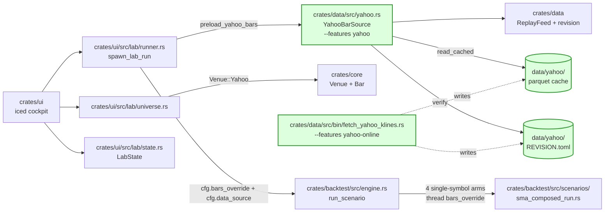

# Architect decomp — lab-yahoo-realdata v0.1.0

> **M-T1 deliverable.** Closes T-AR1 .. T-AR9 of
> [`tasks.md`](tasks.md). Pairs with
> [ADR-0040](../architecture/adr/0040-yahoo-realdata-path.md) for the
> cross-cutting decisions. Locks file:line citations + verbatim Rust
> blocks + cargo invocations for developer Wave C-1 .. C-4.
>
> **Operator T-OD resolutions (all 10) ratified 2026-05-24** at
> [`feature.md` § Operator-decide Q-rows](feature.md#operator-decide-q-rows).
> This decomp executes them verbatim; no re-litigation.

## Baseline

```
$ bash scripts/verify_anchors.sh
…
ANCHORS PASS  (34 / 34)
```

Zero anchor delta at v0.1.0. R6.3: Yahoo anchors lock at **v0.1.1**
after operator approval of a sample backtest; v0.1.0 is wiring-only
(reproducibility comes from the parquet revision-pin alone). The 34
Binance-based anchors at
[`spec/anchors.toml`](../anchors.toml) stay byte-identical
([§ Anchor neutrality proof](#anchor-neutrality-proof)).

`spec-lint` baseline at 60 violations; zero new violations expected
from this feature.

`692 lib tests` green baseline; new Yahoo tests are additive
(network tests gated `#[ignore]` or `#[cfg(feature = "yahoo-online")]`).

## TL;DR for the developer wave

| Wave | Scope                                                          | Days | Deps      | File:line landing site                                            |
| ---- | -------------------------------------------------------------- | ---- | --------- | ----------------------------------------------------------------- |
| C-1  | `YahooBarSource` + parquet cache reader + revision verify      | 3    | none      | `crates/data/src/yahoo.rs` (NEW)                                  |
| C-2  | `fetch_yahoo_klines` CLI binary + crate-add + ADR-0040 land    | 1    | none ‖    | `crates/data/src/bin/fetch_yahoo_klines.rs` (NEW)                 |
| C-3  | Lab UI: `LabDataSource` field + Source toggle + cadence badge  | 3    | C-1       | `crates/ui/src/lab/state.rs:122` + `runner.rs:190`                |
| C-4  | `Venue::Yahoo` variant cascade (clippy-driven match-arm fixes) | 1    | none ‖ C-3 | `crates/core/src/venue.rs:34`                                     |

**Parallelism rules:** C-1 ∥ C-2 ∥ C-4 (independent code paths); C-3
must follow C-1 (depends on `YahooBarSource::load_cached`); C-3 ∥
C-4 (independent files). Total wall-clock: **4-7 days with
parallelism**, **8 days strictly sequential**.

UI-designer Wave D (source toggle widget + cache-state badge +
cadence badge) runs **in parallel with C-3**.

## T-AR1 — Q1 = (b) implementation shape

**Decision (operator-locked).** Engine stays source-agnostic; Lab
runner constructs `Vec<Bar>` upstream of `engine::run_scenario` via
the existing `bars_override` hook on the 4 single-symbol scenario
arms.

### Implementation site: `crates/ui/src/lab/runner.rs:190`

`lab_config_to_scenario` (currently
[`crates/ui/src/lab/runner.rs:190`](../../crates/ui/src/lab/runner.rs))
extends to consume a new `LabDataSource` enum on `LabRunConfig`. The
runner pre-loads Yahoo bars from cache **before** calling
`backtest::engine::run_scenario`.

**Verbatim Rust block (developer Wave C-3 implementation target):**

```rust
// crates/ui/src/lab/runner.rs (extended LabRunConfig + dispatch helper)

/// v0.1.0 — Yahoo cache vs. synthetic GBM source toggle (R3.1).
/// Defaults to `Synthetic` to preserve byte-identical default UX
/// (R-NR.8 / H5 hypothesis).
#[derive(Debug, Clone, Copy, PartialEq, Eq, Default)]
pub enum LabDataSource {
    #[default]
    Synthetic,
    /// Read from data/yahoo/<TICKER>/<INTERVAL>/<YEAR>/<MONTH>.parquet.
    /// Requires `--features yahoo` (R-NR.7).
    YahooCache,
}

#[derive(Debug, Clone)]
pub struct LabRunConfig {
    pub strategy_id: SmolStr,
    pub symbol: SmolStr,          // UI-side Binance-style (Q6 = (a)).
    pub venue: SmolStr,
    pub range_label: SmolStr,
    pub seed: [u8; 32],
    pub write_report: bool,
    /// NEW v0.1.0 — `Synthetic` (default) or `YahooCache`.
    pub data_source: LabDataSource,
}

/// Pre-load Yahoo bars upstream of engine dispatch.
/// Returns the bars + the data_revision_sha for report forensics.
/// Errors propagate to the Run button as `RunOutcome::Err`.
#[cfg(feature = "yahoo")]
fn preload_yahoo_bars(
    cfg: &LabRunConfig,
    scenario_cfg: &backtest::ScenarioConfig,
) -> Result<(Vec<trading_core::Bar>, SmolStr), SmolStr> {
    use data::yahoo::{Interval, YahooBarSource, binance_to_yahoo_ticker};

    // Convert UI ticker (BTCUSDT) → Yahoo ticker (BTC-USD) at the
    // dispatch boundary (Q6 = (a) / D7).
    let yahoo_ticker = binance_to_yahoo_ticker(&scenario_cfg.pair.1)
        .map_err(|e| SmolStr::new(format!("ticker mapping: {e}")))?;

    // Derive adaptive cadence (Q4 = (c) / D6).
    let (start_ms, end_ms) = range_to_ms_pair(&scenario_cfg.range);
    let interval = Interval::derive_from_range(start_ms, end_ms);

    let src = YahooBarSource::new(std::path::PathBuf::from("data/yahoo"));
    let loaded = src
        .load_cached(&yahoo_ticker, interval, start_ms, end_ms)
        .map_err(|e| SmolStr::new(format!("yahoo cache load: {e}")))?;
    Ok((loaded.bars, SmolStr::new(loaded.revision_sha)))
}
```

The engine arm at
[`crates/backtest/src/engine.rs:568-636`](../../crates/backtest/src/engine.rs)
(four arms: `v0.sma`, `v0.5.macd`, `v0.5.rsi`, `v0.5.bbands`) ALL call
into `crates/backtest/src/scenarios/sma_composed_run.rs:243`:

```rust
pub async fn run(
    input: &SmaComposedRunInput,
    bars_override: Option<Vec<Bar>>,  // ← Wave D-2 extraction site
    seed: u64,
) -> Result<SmaComposedRunResult> {
    // …
    let bars = bars_override.unwrap_or_else(|| {
        let start_price = default_start_price(&input.symbol);
        synthetic_bars_minute(&input.symbol, input.bar_count, seed, start_price, input.start_year)
    });
```

**Wiring strategy.** `ScenarioConfig` gains a new optional field:

```rust
// crates/backtest/src/engine.rs:151 (ScenarioConfig extension)

pub struct ScenarioConfig {
    // ... existing fields unchanged ...
    pub strategy: StrategyId,
    pub pair: (Venue, Symbol),
    pub range: DateRange,
    pub params: Option<ParamSheet>,
    pub seed: [u8; 32],
    pub write_report: bool,
    /// NEW v0.1.0. Default `Synthetic`. Lab passes `YahooCache` when
    /// the Source toggle is set; CLI paths always pass the default
    /// (preserves byte-identity for all 34 anchored reports).
    #[serde(default)]
    pub data_source: ScenarioDataSource,
    /// NEW v0.1.0. When `Some`, the 4 single-symbol arms pass these
    /// bars verbatim to `sma_composed_run::run` instead of
    /// generating synthetic bars.
    pub bars_override: Option<Vec<trading_core::Bar>>,
}

#[derive(Debug, Clone, Copy, PartialEq, Eq, Default)]
pub enum ScenarioDataSource {
    #[default]
    Synthetic,
    /// Lab-only at v0.1.0; cross-sectional arms reject this and
    /// return `RunError::UnsupportedDataSource`.
    YahooCache,
}
```

The 4 single-symbol arms thread `cfg.bars_override` through to
`sma_composed_run::run` verbatim. The 4 cross-sectional arms
(`v1.momentum`, `v1.5a.pairs`, `v2.5.tcn`, `v2.5.tcn.weights`) match
on `cfg.data_source` and reject `YahooCache` with the typed error.

**Anchor neutrality:** The CLI anchor-generating binaries
(`cargo run --features realdata --bin backtest -- <scenario>`)
construct `ScenarioConfig` without `data_source` and `bars_override`;
the `#[serde(default)]` + `Option::None` defaults preserve byte-
identical behaviour. The 34 anchored body-SHAs are unreached by the
new wiring.

### Range → (start_ms, end_ms) mapping helper

`crates/ui/src/lab/runner.rs` gains a sibling helper:

```rust
/// Map backtest::engine::DateRange → (start_ms, end_ms) for Yahoo
/// cache lookup. Mirrors date_range_to_scenario_params (in engine.rs)
/// but emits Unix-ms instead of (start_year, bar_count).
fn range_to_ms_pair(range: &backtest::engine::DateRange) -> (i64, i64) {
    use backtest::engine::DateRange::*;
    const MS_PER_DAY: i64 = 86_400_000;
    let now_ms = time::OffsetDateTime::now_utc().unix_timestamp() * 1_000;
    match range {
        Last30d => (now_ms - 30 * MS_PER_DAY, now_ms),
        Last90d => (now_ms - 90 * MS_PER_DAY, now_ms),
        H1_2024 => (1_704_067_200_000, 1_719_792_000_000), // 2024-01-01 .. 2024-07-01 UTC
        H2_2024 => (1_719_792_000_000, 1_735_689_600_000), // 2024-07-01 .. 2025-01-01 UTC
        Custom { start_ms, end_ms } => (*start_ms, *end_ms),
    }
}
```

The deterministic-baseline branches (`H1_2024` / `H2_2024`) use fixed
calendar boundaries; the rolling presets (`Last30d` / `Last90d`) use
wall-clock `now()`. This deviation from the synthetic-path
deterministic `2023` baseline is **intentional** — Yahoo bars are
calendar-anchored, and the rolling presets are the operator's "show
me recent data" UX (H1 hypothesis).

### Acceptance criteria (T-AR1)

- `crates/backtest/src/engine.rs:151` — `ScenarioConfig` gains
  `data_source: ScenarioDataSource` + `bars_override: Option<Vec<Bar>>`
  fields with `#[serde(default)]` defaults.
- `crates/backtest/src/engine.rs:567-636` — 4 single-symbol arms
  thread `cfg.bars_override` through to `sma_composed_run::run`.
- `crates/backtest/src/engine.rs:490-565` — 4 cross-sectional arms
  reject `data_source == YahooCache` with
  `RunError::UnsupportedDataSource`.
- `crates/ui/src/lab/runner.rs:160` — `LabRunConfig` gains
  `data_source: LabDataSource`.
- `crates/ui/src/lab/runner.rs:~250` — new
  `preload_yahoo_bars(cfg, scenario_cfg)` helper feature-gated
  `#[cfg(feature = "yahoo")]`.

## T-AR2 — Q2 = (a) universe mapping

**Decision (operator-locked).** Crypto-mirror universe at v0.1.0: 10
Yahoo crypto tickers. Equities / FX / commodities deferred to
v0.2.0.

### `YAHOO_CRYPTO_UNIVERSE` const

`crates/ui/src/lab/universe.rs` gains a parallel slice to
`XRP_FIRST_UNIVERSE`:

```rust
// crates/ui/src/lab/universe.rs (appended below XRP_FIRST_UNIVERSE)

/// 10-ticker Yahoo crypto-mirror universe (Q2 = (a), R4.1).
///
/// **UI display contract.** Per Q6 = (a), the UI renders the
/// Binance-style symbols (`BTCUSDT`, `ETHUSDT`, ...); conversion
/// to Yahoo-native (`BTC-USD`, ...) happens at the dispatch boundary
/// in `lab::runner::preload_yahoo_bars` via
/// `data::yahoo::binance_to_yahoo_ticker`.
///
/// Order mirrors `XRP_FIRST_UNIVERSE`: XRP, ETH, BTC first
/// (operator preference); ADA, AVAX, BNB, DOGE, DOT, LINK, SOL
/// alphabetical remainder.
pub const YAHOO_CRYPTO_UNIVERSE: &[(Venue, &str)] = &[
    (Venue::Yahoo, "XRPUSDT"),
    (Venue::Yahoo, "ETHUSDT"),
    (Venue::Yahoo, "BTCUSDT"),
    (Venue::Yahoo, "ADAUSDT"),
    (Venue::Yahoo, "AVAXUSDT"),
    (Venue::Yahoo, "BNBUSDT"),
    (Venue::Yahoo, "DOGEUSDT"),
    (Venue::Yahoo, "DOTUSDT"),
    (Venue::Yahoo, "LINKUSDT"),
    (Venue::Yahoo, "SOLUSDT"),
];

#[must_use]
pub fn yahoo_crypto_universe_owned() -> Vec<(Venue, Symbol)> {
    YAHOO_CRYPTO_UNIVERSE
        .iter()
        .map(|(v, s)| (*v, Symbol::new(*s)))
        .collect()
}
```

### Conversion table (in `crates/data/src/yahoo.rs`)

```rust
// crates/data/src/yahoo.rs (Q6 = (a) / D7)

/// Convert a Binance-style UI symbol to a Yahoo-native ticker.
///
/// v0.1.0 supports the 10 crypto-mirror pairs only. Multi-asset
/// expansion (equities, FX, commodities) at v0.2.0 will extend
/// this table; Q6 re-opens at that point.
pub fn binance_to_yahoo_ticker(sym: &Symbol) -> Result<SmolStr, YahooError> {
    let s = sym.0.as_str();
    let mapped = match s {
        "BTCUSDT"  => "BTC-USD",
        "ETHUSDT"  => "ETH-USD",
        "BNBUSDT"  => "BNB-USD",
        "SOLUSDT"  => "SOL-USD",
        "XRPUSDT"  => "XRP-USD",
        "ADAUSDT"  => "ADA-USD",
        "DOGEUSDT" => "DOGE-USD",
        "AVAXUSDT" => "AVAX-USD",
        "DOTUSDT"  => "DOT-USD",
        "LINKUSDT" => "LINK-USD",
        other => return Err(YahooError::UnmappedTicker { input: other.into() }),
    };
    Ok(SmolStr::new(mapped))
}
```

### Acceptance criteria (T-AR2)

- `crates/ui/src/lab/universe.rs::YAHOO_CRYPTO_UNIVERSE` 10-entry
  const lands; ordering matches `XRP_FIRST_UNIVERSE` exactly.
- `crates/ui/src/lab/universe.rs::tests::yahoo_crypto_universe_order_pinned`
  — mirrors `xrp_first_order_pinned`. Failure on any reorder/edit.
- `crates/data/src/yahoo.rs::binance_to_yahoo_ticker` — 10 mapped
  entries + `UnmappedTicker` error variant.
- `crates/data/src/yahoo.rs::tests::binance_to_yahoo_table_pinned` —
  asserts all 10 round-trips + that `"FOOUSDT"` returns
  `UnmappedTicker`.

## T-AR3 — Q3 = (a) external dep + ADR-0040

**Decision (operator-locked).** `yahoo_finance_api 4.1.x` from
crates.io; dual MIT/Apache-2.0.

**CLAUDE.md non-negotiable gate:** ADR-0040 § D2 documents the
library-compat checklist. See
[ADR-0040](../architecture/adr/0040-yahoo-realdata-path.md) for the
full justification.

### Workspace `Cargo.toml` change

```toml
# Cargo.toml (workspace.dependencies, appended after wiremock)

# Yahoo Finance unofficial-API client (ADR-0040 / D2).
# Pinned at =4.1.x for stability against Yahoo response-shape drift;
# patch version selected at developer Wave C-2 (cargo add time).
yahoo_finance_api = { version = "=4.1.0", default-features = false }
```

### `crates/data/Cargo.toml` change

```toml
# crates/data/Cargo.toml (NEW [features] section, appended)

[features]
default = []
# v0.1.0 — Yahoo Finance read-path + parquet cache.
# Enables `pub mod yahoo` and the `binance_to_yahoo_ticker` helper.
yahoo = ["dep:yahoo_finance_api"]
# Adds the async `fetch_and_cache` method; used by the
# `fetch_yahoo_klines` CLI only (cockpit reads cache only).
yahoo-online = ["yahoo", "dep:tokio", "dep:reqwest"]

[dependencies]
# ... existing ...
yahoo_finance_api = { workspace = true, optional = true }
```

### Acceptance criteria (T-AR3)

- `Cargo.toml` workspace.dependencies includes `yahoo_finance_api`.
- `crates/data/Cargo.toml` adds `yahoo` and `yahoo-online` features
  (default-off).
- `cargo build -p data` (default features) succeeds; no new deps in
  the graph (verify via `cargo tree -p data --no-default-features`).
- `cargo build -p data --features yahoo` succeeds; `yahoo_finance_api`
  appears in the dep graph.
- ADR-0040 published at
  `spec/architecture/adr/0040-yahoo-realdata-path.md` with status
  `accepted` (this M-T1).
- `spec/architecture/adr/README.md` registry row added (this M-T1).

## T-AR4 — Q4 = (c) adaptive cadence

**Decision (operator-locked).** Adaptive cadence derived from the
selected date range. UI shows a cadence badge.

### `Interval::derive_from_range`

```rust
// crates/data/src/yahoo.rs

#[derive(Debug, Clone, Copy, PartialEq, Eq, Hash)]
pub enum Interval {
    Minutes1,
    Hours1,
    Days1,
}

impl Interval {
    /// Adaptive cadence per ADR-0040 § D6 / Q4 = (c).
    ///
    /// Yahoo free-tier cadence limits:
    /// - `1m`: ≤ 7 days lookback
    /// - `2m..30m`: ≤ 60 days
    /// - `60m`/`1h`: ≤ 730 days (~2 years)
    /// - `1d`+: 30+ years
    ///
    /// Decision boundaries (operator-locked):
    /// - range <  7 days       → 1m  (Yahoo's tightest free tier)
    /// - range ∈ [7, 60] days  → 1h  (inclusive upper)
    /// - range >  60 days      → 1d  (multi-decade reach)
    pub fn derive_from_range(start_ms: i64, end_ms: i64) -> Self {
        const MS_PER_DAY: i64 = 86_400_000;
        let range_days = (end_ms - start_ms).max(0) / MS_PER_DAY;
        match range_days {
            d if d < 7  => Interval::Minutes1,
            d if d <= 60 => Interval::Hours1,
            _ => Interval::Days1,
        }
    }

    /// Format as the Yahoo API string parameter.
    pub const fn as_yahoo_str(self) -> &'static str {
        match self {
            Interval::Minutes1 => "1m",
            Interval::Hours1   => "1h",
            Interval::Days1    => "1d",
        }
    }

    /// Format as the cache subdir name.
    pub const fn as_cache_dir(self) -> &'static str {
        match self {
            Interval::Minutes1 => "1m",
            Interval::Hours1   => "1h",
            Interval::Days1    => "1d",
        }
    }
}
```

### Boundary truth table (unit-test target)

| Range (days)   | Branch        | Interval    |
| -------------- | ------------- | ----------- |
| 0              | `< 7`         | Minutes1    |
| 1              | `< 7`         | Minutes1    |
| 6              | `< 7`         | Minutes1    |
| 7              | `[7, 60]`     | Hours1      |
| 30             | `[7, 60]`     | Hours1      |
| 60             | `[7, 60]`     | Hours1      |
| 61             | `> 60`        | Days1       |
| 90 (Last90d)   | `> 60`        | Days1       |
| 365 (1 yr)     | `> 60`        | Days1       |
| 3650 (10 yr)   | `> 60`        | Days1       |

### Cadence badge (R-UI-1.4)

`crates/ui/src/widgets/cadence_badge.rs` (NEW; ui-designer Wave D-3
authors). Reads `LabState::cadence` (derived once per range change,
not stored on disk). Lumen-token styled:

- `Minutes1` → text `"1m"`, foreground `lumen.tokens.text.subtle`.
- `Hours1`   → text `"1h"`, foreground `lumen.tokens.text.subtle`.
- `Days1`    → text `"1d"`, foreground `lumen.tokens.text.subtle`.

Positioned to the right of the date-range picker in the Lab top bar.

### Acceptance criteria (T-AR4)

- `crates/data/src/yahoo.rs::Interval::derive_from_range` implemented.
- `crates/data/src/yahoo.rs::tests::interval_derive_boundaries` —
  asserts the 10-row truth table verbatim.
- `crates/data/src/yahoo.rs::Interval::as_yahoo_str` /
  `as_cache_dir` returns are byte-stable across releases (lock with a
  test).
- `crates/ui/src/widgets/cadence_badge.rs` widget lands (Wave D-3).

## T-AR5 — Q5..Q10 implementation locks

Each Q is operator-locked. Decomp lock-in:

### Q5 = (b) — per-cadence param overrides deferred to v0.1.1

No code change at v0.1.0. The existing JSON-schema defaults in
`config/strategies/` apply to any cadence (textbook for daily; 24×
compressed timescale on hourly per F3). K3 risk logged in tasks.md;
operator-trains-the-feel at v0.1.0 per F3.

**Forward-pointer.** v0.1.1 task placeholder: surface
`config/strategies/<id>.cadence_overrides.toml` with cadence-keyed
sub-tables. Architect re-decomp at v0.1.1 M-T1.

### Q7 = (a) — parquet cache layout

Per ADR-0040 § D3, layout:

```
data/yahoo/
├── REVISION.toml             # aggregate SHA + per-file SHAs + Yahoo response checksums
├── BTC-USD/
│   ├── 1d/
│   │   ├── 2023/
│   │   │   ├── 01.parquet
│   │   │   ├── 02.parquet
│   │   │   └── ...
│   │   └── 2024/
│   │       └── 01.parquet
│   ├── 1h/
│   │   └── 2024/
│   │       └── 01.parquet
│   └── 1m/
│       └── 2024/
│           └── 11.parquet
├── ETH-USD/
│   └── 1d/
│       └── 2024/
│           └── 01.parquet
└── ...
```

Parquet schema mirrors `trading_core::Bar` (open_ts_ms, open, high,
low, close, volume, symbol, venue). Symbol stored Yahoo-native
(`BTC-USD`); cadence subdir lives between ticker and year (NEW
delta vs Binance layout).

**Sample fixture** at `tests/fixtures/yahoo/` (this M-T1 architect
ratifies; developer Wave C-1.6 implements):

```
tests/fixtures/yahoo/
├── REVISION.toml
└── BTC-USD/
    └── 1d/
        └── 2024/
            └── 01.parquet   # tiny: ~31 daily bars, ~5 KB compressed
```

This fixture is **checked in** (Q10 = (b) carve-out for sample
fixtures). Tracked size: ≤ 10 KB total. Used by
`crates/data/tests/yahoo_revision_verify.rs` and
`crates/ui/tests/lab_yahoo_dispatch.rs`.

### Q8 = (b) — no in-cockpit "Fetch data" button at v0.1.0

The Lab UI shows a tooltip on `RunState::Disabled` (cache-miss case)
citing the exact CLI invocation:

```
Cache miss for (BTC-USD, 1d, 2024-01-01 .. 2024-12-31).
Run: cargo run -p data --features yahoo-online --bin fetch_yahoo_klines
     -- --ticker BTC-USD --interval 1d --start 2024-01-01 --end 2024-12-31
```

The tooltip is rendered by extending
`crates/ui/src/lab/state.rs::RunState::Disabled` reason variants
with a new `CacheMiss { ticker, interval, start_iso, end_iso }`
case (R3.4).

**Forward-pointer.** v0.2.0+ task: in-cockpit fetch button +
progress strip. Q8 re-opens at that point. Out of scope here.

### Q9 = (b) — 95% MissingData threshold

Const at `crates/data/src/yahoo.rs`:

```rust
/// Coverage tolerance for Yahoo cache loads (Q9 = (b) / R2.5).
///
/// Relaxed from ADR-0032's 99.50% (Binance) because Yahoo's free
/// crypto series occasionally has 1-2 day gaps around exchange
/// outages. K6 mitigation; v0.2.0 equities expansion will further
/// motivate the relaxed bound (weekends + holidays).
///
/// Integer arithmetic: threshold = ceil(expected * 95 / 100).
pub const MISSING_DATA_THRESHOLD_PCT: u32 = 95;
```

Verifier (in `YahooBarSource::load_cached`):

```rust
let threshold = (expected_total_bars * (MISSING_DATA_THRESHOLD_PCT as usize)).div_ceil(100);
if loaded_count < threshold {
    return Err(YahooError::MissingData { /* ... */ });
}
```

### Q10 = (b) — `.gitignore` parquets, track REVISION.toml + fixtures

`.gitignore` amendment (developer Wave C-1.3):

```gitignore
# Yahoo Finance parquet cache (Q10 = (b) / ADR-0040 § D3).
# Bulk data is NOT redistributed per Yahoo TOS (K5); only
# `REVISION.toml` and sample fixtures under tests/fixtures/yahoo/
# are tracked.
data/yahoo/**/*.parquet
!data/yahoo/REVISION.toml
```

The `tests/fixtures/yahoo/` directory is **not** under `data/yahoo/`;
its parquets remain trackable.

### Acceptance criteria (T-AR5)

- `crates/data/src/yahoo.rs::MISSING_DATA_THRESHOLD_PCT = 95` const
  lands; load_cached emits `MissingData` below threshold.
- `crates/data/src/yahoo.rs::tests::coverage_threshold_95_pct` —
  asserts a 94.99% case errors and a 95.00% case passes.
- `.gitignore` carries the Yahoo parquet exclusion + REVISION.toml
  carve-out.
- Sample fixture parquets land at `tests/fixtures/yahoo/`
  (developer Wave C-1.6); tracked size ≤ 10 KB.

## T-AR6 — `crates/data` Yahoo module (R1.1 / R1.3 / R2.1-R2.5)

New module: `crates/data/src/yahoo.rs`, feature-gated `yahoo`. The
on-disk read path reuses `data::ReplayFeed`'s parquet plumbing via a
new `read_yahoo_parquet` helper (NOT exposed publicly; internal to
the `yahoo` module). The revision-verification logic reuses
`data::revision::{compute_aggregate_sha, file_sha256,
read_manifest_raw}` verbatim (no duplication).

### Module surface (verbatim signature lock)

```rust
// crates/data/src/yahoo.rs
//
// Cargo feature: `yahoo` (default off). The `yahoo-online` feature
// additionally compiles the async `fetch_and_cache` method (used by
// `fetch_yahoo_klines` CLI only).

#![cfg(feature = "yahoo")]

use std::cell::OnceCell;
use std::path::PathBuf;
use smol_str::SmolStr;
use trading_core::{Bar, Symbol};

pub const MISSING_DATA_THRESHOLD_PCT: u32 = 95;

#[derive(Debug, Clone, Copy, PartialEq, Eq, Hash)]
pub enum Interval { Minutes1, Hours1, Days1 }

impl Interval {
    pub fn derive_from_range(start_ms: i64, end_ms: i64) -> Self { /* T-AR4 */ }
    pub const fn as_yahoo_str(self) -> &'static str { /* T-AR4 */ }
    pub const fn as_cache_dir(self) -> &'static str { /* T-AR4 */ }
}

#[derive(thiserror::Error, Debug)]
pub enum YahooError {
    /* see ADR-0040 § D5 for the 9 variants */
}

pub struct LoadedBars {
    pub bars: Vec<Bar>,
    pub revision_sha: String,
    pub loaded_count: usize,
    pub expected_count: usize,
    pub interval: Interval,
}

pub struct YahooBarSource {
    cache_root: PathBuf,
    revision_sha: OnceCell<String>,
}

impl YahooBarSource {
    pub fn new(cache_root: PathBuf) -> Self;

    pub fn load_cached(
        &self,
        ticker: &str,
        interval: Interval,
        start_ms: i64,
        end_ms: i64,
    ) -> Result<LoadedBars, YahooError>;

    #[cfg(feature = "yahoo-online")]
    pub async fn fetch_and_cache(
        &self,
        ticker: &str,
        interval: Interval,
        start_ms: i64,
        end_ms: i64,
    ) -> Result<LoadedBars, YahooError>;
}

pub fn binance_to_yahoo_ticker(sym: &Symbol) -> Result<SmolStr, YahooError>;
```

### Load algorithm (verbatim ADR-0040 § D5 mapped to steps)

```rust
impl YahooBarSource {
    pub fn load_cached(
        &self,
        ticker: &str,
        interval: Interval,
        start_ms: i64,
        end_ms: i64,
    ) -> Result<LoadedBars, YahooError> {
        // Step 1: manifest exists?
        let manifest_path = self.cache_root.join("REVISION.toml");
        if !manifest_path.exists() {
            return Err(YahooError::RevisionMissing {
                path: manifest_path.to_string_lossy().into_owned(),
            });
        }

        // Step 2: parse manifest; recompute aggregate SHA.
        let (files_map, _claimed) = crate::revision::read_manifest_raw(&self.cache_root)
            .map_err(|e| YahooError::RevisionParse(e.to_string()))?;
        let revision_sha = crate::revision::compute_aggregate_sha(&files_map);

        // Step 3: compute (year, month) pairs the scenario needs.
        let scenario_months = months_in_range(start_ms, end_ms);

        // Step 4: per-file SHA verification.
        let mut bars: Vec<Bar> = Vec::new();
        for (year, month) in &scenario_months {
            let relpath = format!("{ticker}/{}/{year:04}/{month:02}.parquet",
                                  interval.as_cache_dir());
            let abs_path = self.cache_root.join(&relpath);
            if !abs_path.exists() {
                return Err(YahooError::CacheMiss { /* with CLI hint */ });
            }
            let manifest_sha = files_map.get(&relpath).ok_or(YahooError::RevisionMismatch {
                file: relpath.clone(),
                manifest_sha: "(not in manifest)".into(),
                actual_sha: "n/a".into(),
            })?;
            let actual_sha = crate::revision::file_sha256(&abs_path)
                .map_err(|e| YahooError::RevisionParse(format!("sha256: {e}")))?;
            if &actual_sha != manifest_sha {
                return Err(YahooError::RevisionMismatch {
                    file: relpath,
                    manifest_sha: manifest_sha.clone(),
                    actual_sha,
                });
            }

            // Step 5: read parquet into Vec<Bar>.
            bars.extend(read_yahoo_parquet(&abs_path)?);
        }

        // Step 6: clip to [start_ms, end_ms).
        bars.retain(|b| {
            let ts_ms = b.open_ts.0.unix_timestamp() * 1_000;
            ts_ms >= start_ms && ts_ms < end_ms
        });

        // Step 7: enforce Q9 = (b) 95% coverage threshold.
        let expected_count = expected_bars_for_range(interval, start_ms, end_ms);
        let threshold = (expected_count * MISSING_DATA_THRESHOLD_PCT as usize).div_ceil(100);
        if bars.len() < threshold {
            return Err(YahooError::MissingData {
                ticker: ticker.to_string(),
                interval,
                expected: expected_count,
                actual: bars.len(),
                pct: bars.len() as f64 / expected_count.max(1) as f64 * 100.0,
                start_label: format_iso8601(start_ms),
                end_label: format_iso8601(end_ms),
            });
        }

        // Step 8: force-set local_recv_ts = close_ts (determinism;
        // ADR-0032 § D1 Step 7 precedent).
        for bar in &mut bars {
            bar.local_recv_ts = bar.close_ts;
        }

        Ok(LoadedBars {
            loaded_count: bars.len(),
            expected_count,
            revision_sha,
            interval,
            bars,
        })
    }
}
```

### `expected_bars_for_range`

```rust
/// Expected bar count for an interval over [start_ms, end_ms).
fn expected_bars_for_range(interval: Interval, start_ms: i64, end_ms: i64) -> usize {
    let range_ms = (end_ms - start_ms).max(0) as u64;
    let ms_per_bar: u64 = match interval {
        Interval::Minutes1 => 60_000,
        Interval::Hours1   => 3_600_000,
        Interval::Days1    => 86_400_000,
    };
    (range_ms / ms_per_bar) as usize
}
```

### Acceptance criteria (T-AR6)

- `crates/data/src/yahoo.rs` lands; feature `yahoo`; public surface
  matches verbatim signature above.
- `crates/data/src/yahoo.rs::tests::*` — minimum unit-test set:
  - `interval_derive_boundaries` (T-AR4 truth table).
  - `binance_to_yahoo_table_pinned` (T-AR2 table).
  - `coverage_threshold_95_pct` (T-AR5 Q9).
  - `expected_bars_for_range_arithmetic` (1d × 30 days = 30,
    1h × 24 hours = 24, etc.).
- `crates/data/tests/yahoo_revision_verify.rs` — fixture-based
  integration test:
  - Happy path: read sample fixture; SHA stable across 2 calls.
  - Tamper case: flip a byte in a fixture parquet; expect
    `RevisionMismatch`.
  - Cache miss: ask for a month not in fixture; expect `CacheMiss`
    with CLI-hint string.
  - Coverage: ask for a span with 94% coverage; expect
    `MissingData`.

## T-AR7 — `fetch_yahoo_klines` CLI binary

**Decision (operator-locked).** Location:
`crates/data/src/bin/fetch_yahoo_klines.rs` (co-located with
`fetch_binance_klines`). NOT under `crates/backtest/src/bin/` —
fetch is a data-acquisition tool, not a backtest scenario tool.

### CLI surface (clap-based)

```rust
// crates/data/src/bin/fetch_yahoo_klines.rs

use clap::Parser;

#[derive(Parser, Debug)]
#[command(name = "fetch_yahoo_klines",
          version = "0.1.0",
          about = "Fetch Yahoo Finance OHLCV bars into data/yahoo/ parquet cache")]
struct Args {
    /// Comma-separated Yahoo tickers (e.g. "BTC-USD,ETH-USD"). v0.1.0
    /// accepts only the 10 crypto-mirror tickers.
    #[arg(long, value_delimiter = ',')]
    tickers: Vec<String>,

    /// Bar cadence. One of `1m`, `1h`, `1d`.
    #[arg(long)]
    interval: String,

    /// Inclusive start date, YYYY-MM-DD (UTC midnight).
    #[arg(long)]
    start: String,

    /// Inclusive end date, YYYY-MM-DD (UTC midnight).
    #[arg(long)]
    end: String,

    /// Output cache root. Default `data/yahoo`.
    #[arg(long, default_value = "data/yahoo")]
    out: std::path::PathBuf,

    /// Dry-run: print URLs + expected bar counts; don't write parquet.
    #[arg(long)]
    dry_run: bool,

    /// Emit / update REVISION.toml after fetch. Default `true`.
    #[arg(long, default_value_t = true)]
    emit_revision_manifest: bool,
}
```

### Fetch loop (sketch)

```rust
#[tokio::main]
async fn main() -> anyhow::Result<()> {
    let args = Args::parse();
    let interval = parse_interval(&args.interval)?;
    let (start_ms, end_ms) = parse_date_range(&args.start, &args.end)?;

    let src = YahooBarSource::new(args.out.clone());

    for ticker in &args.tickers {
        // Exponential backoff on 429 (K1 mitigation).
        // Initial delay 1s; cap 60s; max 5 retries.
        let mut backoff = std::time::Duration::from_secs(1);
        let mut attempt = 0u32;
        loop {
            match src.fetch_and_cache(ticker, interval, start_ms, end_ms).await {
                Ok(loaded) => {
                    println!("{ticker}: {} bars cached", loaded.loaded_count);
                    break;
                }
                Err(YahooError::RateLimited { retry_after_secs }) if attempt < 5 => {
                    let delay = backoff.max(std::time::Duration::from_secs(retry_after_secs));
                    tracing::warn!(target: "yahoo.fetch",
                        ticker = %ticker, attempt, delay_s = delay.as_secs(),
                        "rate-limited, backing off");
                    tokio::time::sleep(delay).await;
                    backoff = (backoff * 2).min(std::time::Duration::from_secs(60));
                    attempt += 1;
                }
                Err(e) => return Err(e.into()),
            }
        }
    }

    if args.emit_revision_manifest {
        write_revision_manifest(&args.out)?;
    }
    Ok(())
}
```

### `fetch_and_cache` impl (sketch)

```rust
#[cfg(feature = "yahoo-online")]
impl YahooBarSource {
    pub async fn fetch_and_cache(
        &self,
        ticker: &str,
        interval: Interval,
        start_ms: i64,
        end_ms: i64,
    ) -> Result<LoadedBars, YahooError> {
        use yahoo_finance_api as yfa;

        let provider = yfa::YahooConnector::new()
            .map_err(|e| YahooError::Http(e.to_string()))?;
        let start_dt = time::OffsetDateTime::from_unix_timestamp(start_ms / 1_000)
            .map_err(|e| YahooError::Http(format!("start_ms: {e}")))?;
        let end_dt = time::OffsetDateTime::from_unix_timestamp(end_ms / 1_000)
            .map_err(|e| YahooError::Http(format!("end_ms: {e}")))?;

        let response = provider
            .get_quote_history_interval(ticker, start_dt, end_dt, interval.as_yahoo_str())
            .await
            .map_err(|e| classify_yfa_error(e))?;

        // K2 mitigation: hash the raw response body before parquet conversion.
        let response_sha = sha256_of_quote_history(&response);

        let bars = quotes_to_bars(ticker, &response.quotes()?);

        // Group by (year, month); write one parquet per month; update manifest.
        write_bars_by_month(&self.cache_root, ticker, interval, &bars)?;

        // Update [revision.yahoo_response] with this fetch's checksum.
        upsert_yahoo_response_checksum(
            &self.cache_root, ticker, interval, start_ms, &response_sha,
        )?;

        // Recompute aggregate manifest.
        regenerate_revision_manifest(&self.cache_root)?;

        // Round-trip read to get the final aggregate SHA.
        self.load_cached(ticker, interval, start_ms, end_ms)
    }
}
```

### Acceptance criteria (T-AR7)

- `crates/data/src/bin/fetch_yahoo_klines.rs` lands; behind the
  `yahoo-online` feature.
- `cargo run -p data --features yahoo-online --bin fetch_yahoo_klines
   -- --tickers BTC-USD --interval 1d --start 2024-01-01 --end 2024-01-31
   --dry-run` prints the expected URL + bar count without writing.
- Exponential backoff on 429 implemented (K1).
- `[revision.yahoo_response]` table populated per fetch (K2).
- Idempotent: re-running the same range no-ops on parquet writes
  (compare existing SHA vs. recomputed; skip if equal).
- Integration test
  `crates/data/tests/fetch_yahoo_klines_fixture_replay.rs` exercises
  the parser + cache-write logic against a mocked `YahooConnector`
  (via dependency injection or a trait fake). NO network call.

## T-AR8 — Wave plan (Gantt-style)

```
Day        1     2     3     4     5     6     7
           |─────|─────|─────|─────|─────|─────|
C-1 data   [██████████████████]                        ← YahooBarSource + cache reader (3d)
C-2 CLI    [██████]                                    ← fetch_yahoo_klines bin (1d)
ADR-0040   [█]                                         ← architect (this M-T1, T-AR3/T-AR6)
C-3 UI                       [████████████████████]   ← LabDataSource + toggle + cadence (3d)
C-4 venue                    [██████]                  ← Venue::Yahoo cascade (1d)
Wave D UI                    [████████████████████]   ← parallel with C-3 (3d)
Wave E test                                       [██] ← M-FINAL gates (1d)
```

**Parallel-eligible:**
- Day 1-3: C-1 ∥ C-2 (different crates, different files).
- Day 4-7: C-3 ∥ C-4 ∥ Wave D (C-3 reads `Venue::Yahoo` which C-4
  lands; sync at end of C-4 day 4).

**Critical path (longest):** C-1 → C-3 → Wave E = 7 days
sequential; with parallelism, 5 days.

**Operator total wall-clock estimate:** 4-7 days dev with
parallelism; 8 days strictly sequential.

### Sequencing constraints (must hold)

1. C-3 depends on C-1's `YahooBarSource::load_cached` shape stable
   (architect-locked here; developer may add fields but not remove).
2. C-3 depends on C-4's `Venue::Yahoo` variant existing (otherwise
   `YAHOO_CRYPTO_UNIVERSE` won't compile).
3. Wave D (UI-designer) depends on C-3's `LabState` field shape
   (architect-locked here in T-AR1; ui-designer treats it as fixed
   contract).
4. Wave E (tester M-FINAL) depends on ALL C-* + D landing.

### Watch recipe (per memory)

Long-running Wave E commands should emit a copy-pasteable probe:

```bash
# After kicking off cargo test --workspace --features yahoo:
watch -n 5 'cargo test --workspace --features yahoo --no-run 2>&1 | tail -5'
```

## T-AR9 — Anchor + spec-lint contract

### Anchor neutrality proof

The 34 anchors at `spec/anchors.toml` were generated by the
following code paths (all on the **CLI** `--features realdata`
route):

- 4 single-symbol Binance scenarios (`btc-2023-1m-{sma-cross,
  macd-trend,rsi-reversion,bbands-mean-revert}`) → from
  `crates/backtest/src/main.rs` invocations.
- 22 multi-symbol scenarios under
  `v2.5*` / `v2.5a*` / `v2.6*` / `v3.0*` → from the same `main.rs`.
- 8 forecast-distribution / sharpe-comparison /
  threshold-sweep / vol-verdict / recalibrate-sigma-train scenarios
  → from `crates/forecast/src/bin/*` and `crates/backtest/src/bin/*`.

**Lab UI is the only new dispatch path** in v0.1.0; it does not
emit anchored reports (R6.3 — anchors lock at v0.1.1). Lab's call
sites:

- `crates/ui/src/lab/runner.rs::spawn_lab_run` (line 271) →
  `backtest::engine::run_scenario(scenario_cfg)`.
- `engine::run_scenario` dispatches to 1 of 8 strategy arms; the 4
  single-symbol arms thread `cfg.bars_override` to
  `sma_composed_run::run`.

The 34 anchored body-SHAs all originated from CLI main-binary
runs that construct `ScenarioConfig` **without** `data_source` and
**without** `bars_override`. The new fields' `#[serde(default)]` +
`Option::None` defaults preserve byte-identical behaviour for those
call sites (the existing default — synthetic GBM via
`sma_composed_run::run`'s `bars_override.unwrap_or_else(...)` —
remains unchanged).

**Regression gate:** `bash scripts/verify_anchors.sh` exit 0 at
every developer commit. Wave E runs it explicitly.

### spec-lint contract

- 9 enforced categories at baseline (60 violations); zero new
  violations expected.
- `spec/lab-yahoo-realdata/` already passes lint per analyst M0
  (T-A row hygiene).
- ADR-0040 is well-formed per ADR-0032's lint shape.

### Trace.toml `arch` column update

`spec/trace.toml::REQ-LAB-YAHOO-REALDATA-001` extends `arch`:

```toml
arch = [
  "spec/lab-yahoo-realdata/feature.md",
  "spec/lab-yahoo-realdata/tasks.md",
  "spec/lab-yahoo-realdata/decomp.md",                                     # NEW M-T1
  "spec/architecture/adr/0040-yahoo-realdata-path.md",                     # NEW M-T1
  "spec/architecture/adr/0032-backtest-realdata-path-and-revision-pin.md", # NEW M-T1 (precedent)
]
```

State flip: `proposed → in-progress`.

## Risks (architect-tracked, K-row cross-ref)

| K   | Risk                                          | Mitigation owner          | Decomp ref      |
| --- | --------------------------------------------- | ------------------------- | --------------- |
| K1  | Yahoo rate limits + truncated responses        | Developer C-2 (backoff)   | T-AR7           |
| K2  | Yahoo data revisions across re-fetches         | Developer C-1 (response checksum) | T-AR6 / D3 |
| K3  | Cadence-shift in strategy params               | Operator (v0.1.0 stance)  | T-AR5 / R5      |
| K4  | `yahoo_finance_api` unofficial-API drift       | Architect (=4.1.x pin)    | ADR-0040 § D2   |
| K5  | Yahoo TOS redistribution                       | Architect (Q10 = (b))     | T-AR5           |
| K6  | Coverage drift on v0.2.0 equities              | Architect (Q9 = (b) sets bar) | T-AR5      |
| K7  | `Venue::Yahoo` exhaustive-match cascade        | Developer C-4 (clippy-driven) | T-AR1 / § D8 |
| K8  | UI panel-snapshot drift on toggle              | UI-designer Wave D-5      | T-AR8 / R-UI-1  |
| K9  | Cache rev-mismatch UX (alarming on restart)    | UI-designer + Developer C-3 | T-AR5 / R-UI-1 |
| K10 | Async runtime mismatch (iced ↔ tokio)          | Architect (feature split) | ADR-0040 § D5   |

## Hypotheses (architect-decomp cross-ref)

| H   | Falsifiable claim                                            | Test owner       | Decomp ref |
| --- | ------------------------------------------------------------ | ---------------- | ---------- |
| H1  | Yahoo daily BTC vs Binance hourly BTC equity-divergence < 30% on `v0.sma` | Tester Wave E | T-AR8 / Wave E |
| H2  | `yahoo_finance_api` success > 95% over 7-day window           | Tester Wave E    | T-AR8 / K1 |
| H3  | 100% cache-hit rate during Lab run (no network egress)        | Tester Wave E    | T-AR8 / R-NR.6 |
| H4  | Parquet revision-pin SHA deterministic across 2 fetches       | Tester Wave E    | T-AR7 |
| H5  | Default Lab UX byte-identical to pre-v0.1.0                   | Tester Wave E    | T-AR1 / R-NR.8 |
| H6  | Source flip does not trigger cargo rebuild                    | Tester Wave E    | T-AR3 / R-NR.7 |

## Module-graph snapshot



## File:line / cargo-invocation lock summary

| Decomp item | File                                                              | Line       | Cargo invocation (developer)                                            |
| ----------- | ----------------------------------------------------------------- | ---------- | ----------------------------------------------------------------------- |
| T-AR1       | `crates/backtest/src/engine.rs::ScenarioConfig`                   | 151        | `cargo check -p backtest`                                               |
| T-AR1       | `crates/ui/src/lab/runner.rs::LabRunConfig`                       | 160        | `cargo check -p ui --features live,yahoo`                               |
| T-AR1       | `crates/ui/src/lab/runner.rs::preload_yahoo_bars`                 | NEW ~250   | (above)                                                                 |
| T-AR1       | `crates/backtest/src/engine.rs::run_scenario` 4 single-symbol arms | 567-636    | `cargo test -p backtest --lib engine`                                   |
| T-AR2       | `crates/ui/src/lab/universe.rs::YAHOO_CRYPTO_UNIVERSE`            | NEW ~35    | `cargo test -p ui universe::tests::yahoo_crypto_universe_order_pinned`  |
| T-AR2       | `crates/data/src/yahoo.rs::binance_to_yahoo_ticker`               | NEW        | `cargo test -p data --features yahoo yahoo::tests::binance_to_yahoo_table_pinned` |
| T-AR3       | `Cargo.toml` workspace.dependencies                                | 122 (after wiremock) | `cargo build -p data --features yahoo`                       |
| T-AR3       | `crates/data/Cargo.toml` [features]                                | NEW        | (above)                                                                 |
| T-AR3       | `spec/architecture/adr/0040-yahoo-realdata-path.md`                | NEW        | architect M-T1 (this turn)                                              |
| T-AR3       | `spec/architecture/adr/README.md` registry                         | NEW row    | architect M-T1 (this turn)                                              |
| T-AR4       | `crates/data/src/yahoo.rs::Interval`                              | NEW        | `cargo test -p data --features yahoo yahoo::tests::interval_derive_boundaries` |
| T-AR4       | `crates/ui/src/widgets/cadence_badge.rs`                           | NEW        | Wave D-3 (ui-designer)                                                  |
| T-AR5       | `crates/data/src/yahoo.rs::MISSING_DATA_THRESHOLD_PCT`            | NEW        | `cargo test -p data --features yahoo yahoo::tests::coverage_threshold_95_pct` |
| T-AR5       | `.gitignore`                                                       | NEW lines  | `git status` shows `data/yahoo/*.parquet` ignored                       |
| T-AR5       | `tests/fixtures/yahoo/`                                            | NEW dir    | `cargo test -p data --features yahoo --test yahoo_revision_verify`      |
| T-AR6       | `crates/data/src/yahoo.rs`                                         | NEW (~500 LOC) | `cargo build -p data --features yahoo`                              |
| T-AR6       | `crates/data/tests/yahoo_revision_verify.rs`                       | NEW        | `cargo test -p data --features yahoo --test yahoo_revision_verify`      |
| T-AR7       | `crates/data/src/bin/fetch_yahoo_klines.rs`                        | NEW        | `cargo run -p data --features yahoo-online --bin fetch_yahoo_klines -- --help` |
| T-AR8       | (Gantt above)                                                      | n/a        | n/a                                                                     |
| T-AR9       | `bash scripts/verify_anchors.sh`                                   | n/a        | `bash scripts/verify_anchors.sh` → `ANCHORS PASS (34 / 34)`             |
| T-AR9       | `spec/trace.toml::REQ-LAB-YAHOO-REALDATA-001`                      | line 1199-1237 | `uv run scripts/spec_lint.py`                                       |

## Open questions to operator (NONE)

All 10 T-OD questions resolved at analyst M0 (2026-05-24); no
re-litigation. Architect M-T1 closes with zero open Q-rows to
operator.

## Assumptions

- `yahoo_finance_api 4.1.x`'s `YahooConnector::get_quote_history_interval`
  signature is stable; if upstream renames at developer Wave C-2,
  the wrapper module's import line is the only site that needs
  edit (architect ratifies any signature drift).
- Yahoo's `1m` cadence endpoint reliably returns ≥ 95% of expected
  bars for the 10 crypto-mirror tickers; if any ticker falls below,
  Q9 may relax further at v0.1.1 (operator-decide).
- `parquet` writer determinism: row-group size + compression codec
  are stable across `polars 0.46` patch versions (H4 hypothesis;
  tester gates).
- The Lab Source toggle UI surface area (R-UI-1.1) fits in the
  existing top-bar real estate next to the strategy chips; ui-
  designer Wave D-1 validates via gallery snapshots.

## Changelog

- 2026-05-24 (architect, M-T1): initial decomp. Closes T-AR1..T-AR9
  with file:line + verbatim Rust + cargo-invocation locks. Pairs
  with ADR-0040. Zero anchor delta (34/34 byte-identical). Hand off
  to orchestrator → developer Wave C-1 ∥ C-2.
