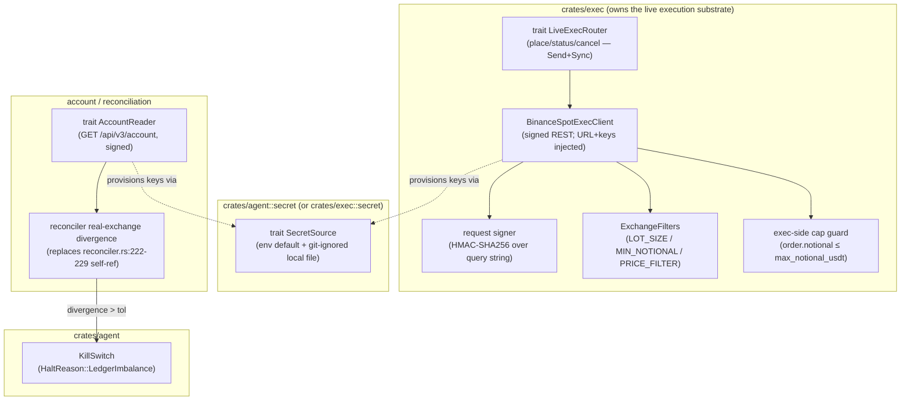
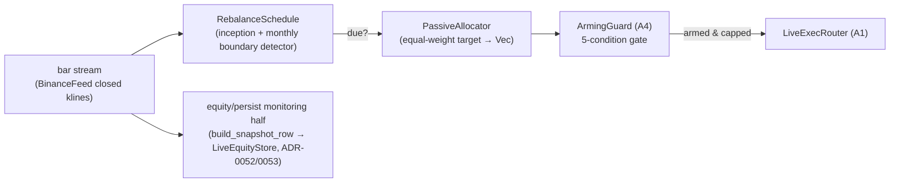

# Live passive-execution readiness — road-scoping for live-money buy-and-hold

> **SCOPING ONLY.** This brief designs the road; it builds nothing. No key
> handling, no exchange calls, no config changes, no git. The assistant /
> orchestrator NEVER executes a trade or moves funds. The operator arms;
> the system executes within armed caps. Every arming step is an explicit,
> auditable operator action — the agent can never self-arm.

## The product-boundary fact this brief consciously crosses

`spec/product.md` § Non-goals and § Project scope boundary state that real-money
execution, exchange API keys, and withdrawals are **out of scope for THIS
project** and become a "follow-up project" after the v3 continuous-paper
terminus. The operator has now ratified a **"Live-money path scoping"**
direction (2026-06-12). This brief IS the front edge of that follow-up program.
It does **not** silently overwrite the product boundary — it scopes the deliberate,
gated, human-armed extension past it, and names exactly what the architect must
amend in `product.md`/`architecture.md` before any code lands (Q1 below). Until
that amendment is ratified, `mode = "live"` stays rejected at config parse
(`config.rs:660-668`) and this is the correct default.

## What "live-money execution" actually means here — execute the PASSIVE baseline

Per the terminal verdict (`product.md` 2026-06-08, operator-ratified) and
`spec/runbooks/passive-baseline.md`, the ratified product ships the **passive
buy-and-hold baseline**, not the SMA crossover and not any active strategy. The
active-strategy research program is **concluded** (all three reachable channels
FRAGILE). Therefore the live-execution surface this program must serve is the
operational definition of the passive baseline, which is **radically simpler**
than the per-bar active loop:

| Property          | Passive baseline (from `passive-baseline.md`)                                        |
|-------------------|--------------------------------------------------------------------------------------|
| Strategy          | Buy-and-hold on the configured universe — **no signals, no per-bar decision**.       |
| Universe          | Config-driven (`data.sources.*`); program sample was 10 large-cap USDT perps/spot.   |
| Position rule     | Hold the universe; equal-weight initial allocation (operator-confirmed default).      |
| Rebalance cadence | **Monthly, equal-weight** (operator-ratified 2026-06-08). Quarterly / never are options. |
| Harness BH today  | A **pure buy-once-hold** (no rebalance ever); the monthly cadence is a forward proposal, **not yet backtested**. |

The single most important design consequence: **a buy-and-hold-with-monthly-
rebalance policy is a SCHEDULE-driven executor, not a per-bar signal loop.** It
acts at most ~12-13 times a year (1 inception buy + ~12 monthly rebalances on a
1-year horizon), not once per bar. This reframes everything downstream — see § F2
and Q3.

## What execution capability EXISTS today (file:line evidence)

The honest, evidenced answer: **there is no live-execution capability at all, by
design.** What exists:

| Capability                         | Status today | Evidence                                                                                  |
|------------------------------------|--------------|-------------------------------------------------------------------------------------------|
| Live exchange ORDER client         | **ABSENT**   | No `place_order`/`new_order`/HMAC/`api_secret`/signature anywhere in `crates/` or `src/` (grep clean). |
| `ExecRouter` trait                 | Stub only    | `crates/exec/src/router.rs:19` trait; `PaperExecRouter::submit` returns `UnsupportedMode("not yet wired (T24)")` (router.rs:28-32). It is essentially unused — paper fills do NOT flow through it. |
| Paper fill path                    | In-process   | Real paper fills come from `PaperEngine::step` (seed `0x00C0_FFEE`) called directly in `spawn_trading_loop` (ADR-0053 D6 / runtime.rs:958+), **not** via `ExecRouter`. |
| Binance market-data client         | Read-only    | `crates/data/src/binance.rs` — `reqwest::get` UNauthenticated (binance.rs:207) + WS klines/trades. NO auth, NO order endpoint, NO account/balance endpoint. |
| Account / balance / position read  | **ABSENT**   | The only `account_balance` (`crates/audit/src/query.rs:1654`) is a LEDGER account query, not an exchange call. |
| `Mode::Live`                       | **ABSENT**   | Enum is `{Research, Paper}` (config.rs:525-528); `mode = "live"` is rejected at parse time (config.rs:660-668) with a guard test (`t12_mode_live_is_rejected`). |
| Reconciler                         | In-process   | `equity() = cash + position_qty * last_mark` (reconciler.rs:58-60) — pure in-process state. Imbalance check (reconciler.rs:222-229) compares in-process equity to its OWN prior value, not to any exchange; its own doc admits "full implementation needs ledger query". |
| Kill switch                        | **SOLID**    | `crates/agent/src/kill_switch.rs` — sticky, CAS-guarded (kill_switch.rs:274-313), `.halt` file watcher (1 s poll), heartbeat monitor, audit dual-write + incident-report spawn on trip. Broadcasts `AgentMode::Halted`. **Caveat:** it broadcasts a mode change; it does NOT itself cancel/flatten live orders (nothing reads `Halted` to call an exchange cancel today — because there is no exchange). |
| Secret boundary precedent          | **EXISTS**   | LLM keys live in git-ignored `config/agent.toml.local` (`config/agent.toml:92-100`, `config/agent.toml.local.example`); committed config carries only an `api-key` placeholder. This is the boundary the live-key wiring extends. |

The unified per-bar loop (ADR-0053) was explicitly built to "carry to the
live-money path" — but it carries the *equity/persist topology*, not an
execution client. And see Q3: the **passive policy does not obviously want a
per-bar loop at all.**

## Goal

Scope the road from "paper-terminal research codebase" to "operator-armed,
capped, auditable live execution of the passive buy-and-hold baseline on
Binance" — cut into 2-4 shippable features with human gates at every arming
step, with the riskiest design decisions surfaced as architect questions.

## Non-goals (held hard)

- **No active strategy ever goes live without a NEW ratified research verdict.**
  The concluded research program (`product.md` 2026-06-08) found all reachable
  channels FRAGILE; live execution is the PASSIVE baseline only. Any future
  active-live request is a fresh program with its own robustness gate.
- **No withdrawals, no fund transfers, ever.** The live client places spot BUY
  orders to build the baseline and (rebalance) orders to maintain weights. It
  never moves funds off the exchange.
- **No HFT, no market making, no leverage, no derivatives execution.** Spot
  buy-and-hold only. (Perps were signal-only even in the research program.)
- **No multi-venue.** Binance only for F1-F3; multi-venue is a later program.
- **No secrets in git, ever** (CLAUDE.md non-negotiable). The repo never sees a
  live key; the operator provisions out-of-band into a git-ignored local file
  or the host secret store.
- **No order-entry UI.** The cockpit never writes orders or config (`product.md`
  § What stays out of the cockpit IA). Arming is config + a runtime guard +
  audit, surfaced read-only in the cockpit.

## Proposed feature cut (the phasing)

This is an **L/XL multi-feature program**, not one feature. Proposed cut into
three shippable features, each with its own `[[req]]` row, sequenced with
human gates between:

### F1 — Live exec client + real-exchange reconciliation (`REQ-LIVE-PASSIVE-EXEC-F1-001`) — effort **L**

The execution substrate. **Testnet-first.** Builds a real (authenticated)
Binance order client behind a `LiveExecRouter` trait, plus account/balance/
position reconciliation against the REAL exchange. Ships pointed at **Binance
Spot TESTNET only** — no mainnet path armed in F1. This is where every external
I/O-behind-a-trait, error/retry, lot/precision, and key-boundary decision lands.

**In scope:** `LiveExecRouter` trait + `BinanceSpotExecClient` (signed REST:
place market/limit order, query order status, cancel); account snapshot reader
(real balances + positions); the reconciler's real-exchange divergence check
(replace the self-referential heuristic — reconciler.rs:222-229); key-loading
boundary (env / git-ignored local / host secret store — operator provisions; repo
never sees keys); exchange filter ingestion (`LOT_SIZE`, `MIN_NOTIONAL`,
`PRICE_FILTER` step/tick) so orders are pre-validated client-side; error/retry/
idempotency semantics (client order IDs, partial-fill handling, rate-limit
backoff). Testnet rehearsal proof of the full pipeline (fake money).

### F2 — `PassiveBaseline` policy + arming mechanism (`REQ-LIVE-PASSIVE-EXEC-F2-001`) — effort **M-L**

The schedule-driven passive executor and the human-arming guard. Adds a
`PassiveBaseline` allocation policy (initial equal-weight allocation +
monthly-rebalance schedule + zero signals) and the **arming mechanism** that
makes live execution impossible without an explicit operator action.

**In scope:** the `PassiveBaseline` policy (see § What strategy/ needs); the
`Mode::Live` enum variant + un-rejecting `mode = "live"` at parse (gated, see
Q1); the **multi-factor arming guard** (config flag + operator-armed file/token
+ max-notional cap, ALL required — see § Arming mechanism); the
operator-side-pending-ledger arming audit trail; wiring the schedule-driven
executor to F1's `LiveExecRouter`; the baseline-equity-divergence e2e gate (see
Q4 — likely APPLIES). F2 ships pointed at testnet (arming guard proven on
testnet); it does NOT itself arm mainnet.

### F3 — Canary runbook + safety drills (`REQ-LIVE-PASSIVE-EXEC-F3-001`) — effort **M**

The operational close. The staged-rollout runbook (testnet → live canary →
scale-up), the kill-switch-halts-live-orders drill, the exec-side caps
enforcement proof, and the live monitoring backbone wiring (the durable equity
history just shipped). This is the feature that produces the human-verification
recipes the operator runs before/while arming real capital.

**In scope:** `spec/runbooks/live-canary.md` (the arming ladder with explicit
operator gates); the kill-switch live-order-halt drill (prove `.halt` cancels
open + blocks new live orders — closes the kill-switch caveat above); exec-side
max-notional / max-position cap enforcement tests (caps enforced at the
`LiveExecRouter`, NOT only strategy-side); reconciler-vs-real-exchange divergence
→ halt drill; durable-equity-history (ADR-0052) as the live monitoring backbone +
alerting-gap inventory. The canary cap-armed-tiny-capital recipe.

> **Sequencing + gates.** F1 → (human gate: testnet rehearsal passes) → F2 →
> (human gate: arming guard proven on testnet) → F3 → (human gate: operator
> arms live canary with tiny cap) → scale-up (separate operator ratification).
> F1 and F2 have a hard dependency (F2 executes through F1's router). F3 can
> start its runbook/drill scaffolding in parallel with F2 but gates on both.

## The capability gap map (what F1/F2 must build)

1. **Exchange order client (testnet-capable).** A signed Binance Spot REST
   client (HMAC-SHA256 over the query string; `X-MBX-APIKEY` header) supporting
   `POST /api/v3/order` (market + limit), `GET /api/v3/order` (status),
   `DELETE /api/v3/order` (cancel), behind a `LiveExecRouter` trait so tests fake
   it. Testnet base URL (`https://testnet.binance.vision`) vs mainnet
   (`https://api.binance.com`) is a config/secret-bound switch, never hard-coded.
   Reuses `crates/data/src/binance.rs`'s `reqwest`/connect plumbing patterns but
   is a SEPARATE authenticated client (the market-data feed stays unauthenticated).

2. **Account / balance / position reconciliation against the REAL exchange.**
   `GET /api/v3/account` (signed) for real balances; the reconciler's imbalance
   check is rebuilt to compare ledger/in-process state against the **exchange-
   reported** balances + positions (replacing reconciler.rs:222-229's self-
   reference). Divergence beyond tolerance → kill switch (`LedgerImbalance`
   already exists as a `HaltReason`, kill_switch.rs:51).

3. **Key management (design the boundary; repo never sees keys).** The operator
   provisions `BINANCE_API_KEY` / `BINANCE_API_SECRET` out-of-band into EITHER
   env vars OR a git-ignored `config/agent.toml.local` (the existing LLM-key
   precedent) OR a host secret store. The code reads from a `SecretSource` trait
   (env-backed default; testable). Keys are NEVER logged, NEVER written to the
   audit ledger, NEVER committed. F1 designs and tests this boundary with FAKE
   testnet keys provided by the operator out-of-band.

4. **Order-type minimal set for passive.** MARKET buy is sufficient for inception
   allocation and monthly rebalance on a hold strategy (simplicity > price
   improvement for a low-turnover baseline). LIMIT is an operator option for slippage
   control on larger notionals (see Q5). Size precision/lot rules: ingest
   `LOT_SIZE` (`stepSize`, `minQty`), `MIN_NOTIONAL`, `PRICE_FILTER` (`tickSize`)
   from `GET /api/v3/exchangeInfo` and round/validate every order client-side
   BEFORE submit — an under-min order must fail fast, not at the exchange.

5. **Error / retry semantics.** Client order IDs (`newClientOrderId`) for
   idempotency on retry; partial-fill accounting; rate-limit (HTTP 429 / `-1003`)
   exponential backoff with a hard cap; on ambiguous timeout, query order status
   before any retry (never blind-resubmit a possibly-filled order). A failed
   order after N retries → log + halt, never silent.

## Arming mechanism sketch (the agent can NEVER self-arm)

Design principle: **defense in depth — multiple independent operator actions
must ALL be present for a single live order to leave the process.** No single
flag, and certainly no agent code path, can arm live execution.

```
Live order leaves the process  ⇔  ALL of:
  (1) config:  mode = "live"            (operator hand-edits config/agent.toml;
                                         un-rejected only post-Q1 amendment)
  (2) arm-file: ./.live-armed present   (operator creates out-of-band, like .halt
                                         in reverse; absence = disarmed; mirrors
                                         the kill-switch .halt convention)
  (3) cap:     [live].max_notional_usdt set AND order ≤ cap   (exec-side enforced
                                         at LiveExecRouter, NOT strategy-side)
  (4) secret:  BINANCE_API_KEY/SECRET present from the SecretSource
                                         (operator provisions out-of-band)
  (5) NOT halted: kill switch not tripped (.halt absent)
```

- **The arm-file is the human gate.** Like `.halt` trips the kill switch, `.live-armed`
  arms live execution — but its presence is necessary-not-sufficient (the other four
  conditions also gate). It is git-ignored; the operator creates it deliberately;
  the agent never creates it. Restart with arm-file absent = disarmed (fail-safe
  default).
- **Audit trail.** Every transition (armed / disarmed / order-blocked-by-cap /
  order-blocked-by-disarm) writes a row to the audit ledger via the existing
  `strategy_events` + memo dual-write seam (the kill-switch precedent,
  kill_switch.rs:287-301). The operator-side-pending-ledger convention records
  "operator armed live canary, cap=$X, at T" as an explicit human-action row.
- **The orchestrator/assistant never arms and never executes.** Stated plainly
  in the runbook (F3): arming is an operator-only physical action (edit config +
  create arm-file + provision keys); the system executes within the armed cap;
  the assistant's role ends at producing the recipe.
- **Fail-safe at every boundary.** Missing cap → no live orders. Missing keys →
  no live orders. Arm-file absent → no live orders. `.halt` present → no live
  orders + cancel open. Default config (`mode = "research"`, no arm-file) is
  fully disarmed.

## Safety hardening inventory (F3)

| Hardening                         | Today                                  | F3 must add                                                              |
|-----------------------------------|----------------------------------------|-------------------------------------------------------------------------|
| Kill switch halts LIVE orders     | Broadcasts `Halted`; nothing cancels orders (no exchange) | DRILL: `.halt` → `LiveExecRouter` cancels all open + rejects new live orders; prove it. |
| Max-notional / max-position caps  | `risk.per_symbol_exposure_cap` strategy-side only | EXEC-SIDE cap at `LiveExecRouter` — every order checked vs `[live].max_notional_usdt` / max-position regardless of what strategy/sizer asked. Defense-in-depth, not duplication. |
| Reconciler vs REAL exchange       | Self-referential heuristic (reconciler.rs:222-229) | Compare against `GET /api/v3/account`; divergence > tol → `HaltReason::LedgerImbalance`. |
| Durable equity monitoring         | ADR-0052 store shipped (paper)         | Wire `mode = "live"` as a writer (`build_snapshot_row` mode label `"live"`); live equity is the monitoring backbone. |
| Alerting                          | Cockpit `AgentMode::Halted` + incident report on trip | INVENTORY the gaps: no push/pager today; F3 names what live-money needs (at minimum: halt → incident report already wired; assess whether a heartbeat-to-operator channel is required for unattended live). |

## What the passive policy needs from `strategy/`

The `Strategy` trait is a single `on_bar(&mut self, bar: &Bar) -> Vec<Signal>`
(`crates/strategy/src/traits.rs:8-10`). A precedent for a trivial allocate-and-hold
strategy already exists: `crates/strategy/src/cash_hold.rs`. **But the per-bar
`on_bar` shape is a poor fit for a schedule-driven hold** (see Q3) — a passive
baseline acts on a calendar (inception + monthly), not per bar. Two shapes:

- **(a) `PassiveBaseline` as a schedule-aware policy** (recommended, see Q3) —
  not a per-bar signal generator; a small policy that emits an allocation
  intent at inception and on each monthly boundary, and emits nothing otherwise.
  This likely wants a **new seam** (a `RebalanceSchedule` + an allocator) rather
  than forcing the per-bar `Strategy` trait. Sizing: ~150-250 LoC + the schedule.
- **(b) `PassiveBaseline` jammed into `on_bar`** — returns signals only on the
  first bar and on bars crossing a month boundary, empty otherwise. Cheaper
  (~80 LoC, reuses the existing loop + registry) but couples a calendar policy to
  a bar-rate trait and re-introduces the per-bar loop the policy does not need.

**Baseline-equity-divergence gate (CLAUDE.md non-negotiable):** a sizing
decision DOES exist (initial allocation weights + rebalance trades), so the gate
**likely APPLIES** — do NOT rubber-stamp N/A. The honest read (Q4): the divergence
to assert is "armed live/testnet equity tracks the held-universe value and DIVERGES
from a flat do-nothing baseline once the inception allocation executes" — an e2e
test that the allocation actually moved capital into positions (the exact noop-class
the gate guards against: weights computed but orders never sent). Architect rules
APPLIES-or-N/A in F2 with reasoning, per the v3-vol-overlay precedent.

## Open questions for the architect

Each has a recommended default. **Q1 is the riskiest** (it is the
product-boundary + safety-boundary crossing).

- **Q1 (RISKIEST) — un-rejecting `mode = "live"`: where does the product/safety
  boundary move, and what is the minimum amendment?** Today `mode = "live"` is
  rejected at parse (config.rs:660-668) and `product.md` § Non-goals forbids
  real-money execution. **Recommended default: (a) keep the parse-rejection
  until a ratified `product.md`/`architecture.md` amendment lands that (i)
  redefines the scope boundary as "live = passive-baseline-only, Binance-only,
  spot-only, capped, operator-armed", (ii) adds a `Mode::Live` ADR with the
  arming-mechanism contract, and (iii) the F2 arming guard is the ONLY thing
  that flips the rejection — and even then live orders need all 5 arming
  conditions.** This is the durable choice: it makes the boundary-crossing an
  explicit, reviewed, ratified act rather than a quiet enum addition.
  *If-budget-tightens fallback:* (b) add `Mode::Live` now but keep it
  behaviorally inert (parses, but the arming guard rejects ALL live orders until
  F2/F3 land) — cheaper to wire but risks a half-armed mode existing before the
  safety rails do; only acceptable if F2/F3 are committed same-program.

- **Q2 — testnet vs mainnet client topology.** One `BinanceSpotExecClient`
  parameterized by base-URL+keys (testnet vs mainnet is config/secret), OR two
  distinct types? **Recommended default: (a) one client, URL+keys injected** —
  testnet and mainnet differ only in endpoint + credentials; one code path means
  the mainnet path is exercised by every testnet rehearsal (no "tested testnet,
  shipped untested mainnet" gap). The arming guard, not the client type, is what
  gates mainnet.

- **Q3 — does the passive policy want the ADR-0053 per-bar loop, or a
  schedule-driven executor?** ADR-0053's unified loop carries to live-money, but
  a monthly-rebalance hold acts ~12×/year, not per bar. **Recommended default:
  (a) a schedule-driven executor for the passive baseline, NOT the per-bar
  loop** — the per-bar loop is the right home for the (retired) active strategies;
  forcing a calendar policy through a bar-rate loop is the wrong fit. Reuse the
  loop's equity/persist topology (mark-to-market per bar for monitoring) but
  drive ORDER emission from a `RebalanceSchedule`, not `on_bar`. The architect
  should assess honestly whether the equity-monitoring half of the loop can be
  decoupled from the order-emission half. *Fallback:* (b) reuse the per-bar loop
  with a passive policy that no-ops except on rebalance bars — cheaper, but
  couples the calendar policy to bar arrival and inherits a loop the baseline
  doesn't conceptually want.

- **Q4 — does the baseline-equity-divergence gate apply to F2?** **Recommended
  default: YES, it applies** — a sizing decision exists (allocation weights +
  rebalance trades), so per the v3-vol-overlay precedent the architect records
  APPLIES with an e2e divergence proof (armed equity diverges from flat
  do-nothing once allocation executes; orders actually sent), NOT N/A. The only
  argument for N/A is "buy-and-hold has no per-bar signal" — but the inception
  allocation IS the decision the gate exists to verify got applied.

- **Q5 — order type for the live baseline: MARKET or LIMIT?** **Recommended
  default: (a) MARKET for inception + monthly rebalance** — a low-turnover hold
  values fill-certainty + simplicity over price improvement; MARKET avoids
  unfilled-limit complexity on a strategy that must hold the universe. LIMIT is
  a named operator option for slippage control on large notionals; ship MARKET
  first, add LIMIT only if canary slippage proves material.

- **Q6 — secret source: env var, git-ignored local file, or host secret store?**
  **Recommended default: (a) a `SecretSource` trait with an env-var-backed
  default, AND support for the existing git-ignored `config/agent.toml.local`
  precedent** — env vars are the cleanest for CI/host secret-store injection and
  never touch disk in the repo; the local-file path reuses the proven LLM-key
  boundary for operators who prefer a file. Both are out-of-band operator
  actions; the repo ships neither keys nor a non-placeholder config.

## Effort + phasing summary

| Feature | Scope                                            | Effort | Gates before it can arm anything                          |
|---------|--------------------------------------------------|--------|-----------------------------------------------------------|
| F1      | Live exec client + real-exchange reconciliation  | **L**  | Ships testnet-only; no mainnet path armed.                |
| F2      | `PassiveBaseline` policy + arming mechanism      | **M-L**| Arming guard proven on testnet; does NOT arm mainnet.     |
| F3      | Canary runbook + safety drills                   | **M**  | Operator arms live canary with tiny cap (explicit action).|

Total program: **L/XL.** Scale-up past the canary cap is a separate operator
ratification, not a feature.

## Assumptions (challenge these)

- A1: "Live-money path scoping" ratifies SCOPING this road, not building it. No
  code, no keys, no config, no git in this brief. (Stated in the operator brief.)
- A2: Binance Spot is the target venue (consistent with the research program's
  Binance-centricity and `data.sources.binance`). Binance Spot Testnet
  (`testnet.binance.vision`) is the rehearsal environment.
- A3: The passive baseline is monthly-equal-weight (operator-ratified
  2026-06-08, `passive-baseline.md` changelog) — F2 implements that cadence; the
  harness's pure-buy-once-hold is the research control, a different artifact.
- A4: The operator provisions all keys out-of-band; the repo never sees a live
  key. Testnet keys for F1 rehearsal are also operator-provisioned out-of-band.
- A5: This program does NOT reopen the active-strategy research verdict. Live =
  passive only. Any active-live request is a fresh ratified program.

## Architecture

> **Owner: architect. Status: `arch-done` (2026-06-12).** Design pass over the
> analyst's scoping. The normative boundary + the 5-condition arming contract +
> the five binding invariants live in
> [ADR-0054](../architecture/adr/0054-mode-live-boundary.md) — this section is the
> buildable design (module boundaries, component shapes, adversarial-test map) the
> developer executes against. Q1–Q6 are resolved below with reasons grounded in the
> code verified at the cited lines. **No code, no keys, no config, no git in this
> pass** — this is design only; the parse-rejection stays until F2 (ADR-0054 § D5).

### Q1–Q6 resolutions (architect)

| Q | Resolution | Reason (grounded in verified code) |
|---|------------|-------------------------------------|
| **Q1** | **ACCEPT (a)** — parse-rejection retained until a ratified `product.md` amendment + ADR land; F2's arming guard is the ONLY thing that lifts it; un-rejection + guard atomic in F2. | `config.rs:660-668` rejects `mode = "live"` at parse with `ConfigError::UnsupportedMode` (guard `t12_mode_live_is_rejected`). Lifting it before the guard exists = a half-armed mode on `main` — the exact boundary-erosion ADR-0054 prevents. Recorded as ADR-0054 § D5/D7; the proposed amendment text is carried in the ADR for one-decision operator ratification. |
| **Q2** | **ACCEPT (a)** — ONE `BinanceSpotExecClient`, base-URL + keys injected (testnet vs mainnet is config/secret, never a type or a hard-code). | `BinanceFeed::production()` hard-codes mainnet URLs (`binance.rs:128-133`) — the anti-pattern to avoid. One client means every testnet rehearsal exercises the exact mainnet code path; the arming guard, not the client type, gates mainnet. No "tested testnet, shipped untested mainnet" gap. |
| **Q3** | **ACCEPT (a)** — schedule-driven `RebalanceSchedule` + allocator, decoupled from the per-bar loop's ORDER-emit half, REUSING its equity/persist monitoring half. | The passive policy acts ~12–13×/year (1 inception buy + ~12 monthly rebalances), not per bar. ADR-0053's `spawn_trading_loop` already separates the equity/persist topology (`build_snapshot_row` + `LiveEquityStore`, ADR-0052) from order emission (`registry.on_bar` → `PaperEngine::step`). The monitoring half is reused verbatim; orders are driven by the schedule, not `on_bar`. See A3 for the decoupling design. |
| **Q4** | **ACCEPT — APPLIES** to F2 with an e2e divergence proof (NOT N/A). | A sizing decision exists: the equal-weight inception allocation + monthly rebalance trades. Per the `v3-volatility-forecaster-noop-fix` precedent and CLAUDE.md, this is the exact no-op class the gate guards (weights computed but orders never sent). Recorded as ADR-0054 § D4; the tester gates on it (A6 / F2-T6). |
| **Q5** | **ACCEPT (a)** — MARKET orders for inception + monthly rebalance; LIMIT a named operator option for large-notional slippage control, deferred. | A low-turnover hold values fill-certainty + simplicity over price improvement; MARKET avoids unfilled-limit complexity on a strategy that must hold the universe. Ship MARKET first; add LIMIT only if canary slippage proves material (F3 inventory). |
| **Q6** | **ACCEPT (a)** — `SecretSource` trait, env-var-backed default + git-ignored local-file path (the proven LLM-key boundary). | `config/agent.toml.local` already carries LLM keys merged at load (`config.rs:612-651`, git-ignored, placeholder-only committed config). The same boundary extends to `BINANCE_API_KEY`/`_SECRET`. Env is cleanest for CI/host-secret-store injection and never touches repo disk; the local-file path reuses the proven precedent. See A2. |

**No disagreement with the analyst.** Every recommended default is accepted; the
deltas are sharpenings, not reversals: (i) Q3 — the architect commits to the
*specific* decoupling seam (A3: the schedule drives an `allocate()` that produces
`Order`s; the equity-monitoring half of the loop is reused via the existing
`LiveEquityStore` write, no new mint site) rather than leaving "assess honestly"
open; (ii) the arming-guard check ORDER is fixed (A4: fail-fast 5→1→2→4→3) so the
adversarial matrix test is deterministic; (iii) F1/F2/F3 ship as **separate feature
folders** under this umbrella (see "Structural decision" below), not as one mega-feature.

### Structural decision — umbrella vs separate folders

**This folder (`live-passive-execution-readiness`) is the PROGRAM UMBRELLA.** It
holds the boundary ADR (0054), the cross-feature `## Architecture`, and the program
trace rows (F1/F2/F3). **F1, F2, and F3 each ship through the standard pipeline as
their own feature folder** (`spec/live-exec-client-binance-spot/`,
`spec/passive-baseline-arming/`, `spec/live-canary-drills/` — names finalized by the
analyst when each is dispatched), each with its own `feature.md` / `tasks.md` /
`reports/` and its own analyst→architect→developer→tester loop. Rationale: F1 is **L**
(an authenticated exchange client + real reconciliation), F2 is **M-L**, F3 is **M** —
each exceeds a single-feature scope and each has a distinct human gate between it and
the next. The umbrella row stays `arch-done`; the per-feature folders are created at
dispatch time. The P0 (ADR-0054 ratification) is owned here, in the umbrella.

### A1 — F1 module & reconciliation boundaries (which crate owns what)



- **Crate ownership.** `crates/exec` owns `LiveExecRouter` (extends the existing
  `ExecRouter` trait neighbourhood at `router.rs:19`), `BinanceSpotExecClient`, the
  HMAC signer, `ExchangeFilters`, and the **exec-side cap guard**. The
  authenticated client is a **separate type** from `crates/data`'s read-only
  `BinanceFeed` (`binance.rs:91-207`) — the market-data feed stays unauthenticated;
  it reuses the `reqwest`/connect plumbing *patterns* but shares no auth code.
- **Authenticated REST surface (F1-T1).** `POST /api/v3/order` (MARKET + LIMIT),
  `GET /api/v3/order` (status), `DELETE /api/v3/order` (cancel),
  `GET /api/v3/account` (signed balances → `AccountReader`),
  `GET /api/v3/exchangeInfo` (filters; the read-only feed already parses these —
  reuse the parse, re-fetch via the authed client for freshness). All behind
  traits (`LiveExecRouter`, `AccountReader`) so tests fake them — **no test ever
  hits a real exchange** (invariant iii).
- **Signature / clock-skew (F1-T1).** HMAC-SHA256 over the canonical query string
  with `X-MBX-APIKEY` header + `timestamp` + `recvWindow`. Clock skew is handled by
  syncing to `GET /api/v3/time` (server-time offset) on client construction and on
  any `-1021` (timestamp-outside-recvWindow) error; persistent skew beyond a
  threshold → `HaltReason::ClockSkew` (the variant already exists,
  `kill_switch.rs:53`). The signer is a pure function (key, query) → signature,
  unit-testable with a fixed vector; the key is borrowed, never logged, never
  stored in the struct's `Debug`.
- **Exchange filters (F1-T4).** Ingest `LOT_SIZE` (`stepSize`, `minQty`),
  `MIN_NOTIONAL`, `PRICE_FILTER` (`tickSize`); round/validate every order
  **client-side BEFORE submit** in `Decimal` (never `f64`). An under-min or
  bad-step order **fails fast** with a typed `ExecError`, never reaches the
  exchange. This is the same filter data the read-only feed parses at
  `binance.rs:201-213`.
- **Real-account reconciliation loop & divergence→halt (F1-T5).** Replace
  `reconciler.rs:222-229`'s self-referential heuristic (it compares
  `current_equity` to its own prior `last_equity`) with a comparison of
  in-process/ledger state against **`AccountReader`-reported balances + positions**.
  Divergence beyond `[live].reconcile_tolerance_usdt` (a `Decimal`) →
  `kill_switch.trip(HaltReason::LedgerImbalance)`. The reconciler holds an
  `Option<Arc<dyn AccountReader>>`: `None` in research/paper (behaviour unchanged,
  the self-ref heuristic stays for paper), `Some` only in live mode. This is the
  "exchange truth source" the reconciler lacks today.
- **Error/retry/idempotency (F1-T6).** `newClientOrderId` for idempotency on
  retry; partial-fill accounting; HTTP 429 / `-1003` exponential backoff with a
  hard cap; **on ambiguous timeout, query order status BEFORE any retry** (never
  blind-resubmit a possibly-filled order). A failed order after N retries → log +
  `halt`, never silent.
- **Topology (Q2).** One `BinanceSpotExecClient { base_url, key, secret, http }`;
  testnet (`https://testnet.binance.vision`) vs mainnet (`https://api.binance.com`)
  is the injected `base_url` + injected credentials. F1 ships **testnet-only** (no
  mainnet path armed); the arming guard gates mainnet, not the client type.

### A2 — `SecretSource` boundary (F1-T2; Q6) — the safe path is the only path

```rust
// crates/agent (or crates/exec) — every external secret behind this trait.
pub trait SecretSource: Send + Sync {
    /// Returns Err(SecretError::Missing) when absent — NEVER a default key.
    fn get(&self, key: &str) -> Result<SecretString, SecretError>;
}
```

- **Default impl: `EnvSecretSource`** — reads `BINANCE_API_KEY` / `BINANCE_API_SECRET`
  from the process env; never touches repo disk. **Second impl: `LocalFileSecretSource`** —
  reads the git-ignored `config/agent.toml.local` (the proven LLM-key precedent at
  `config.rs:612-651`). Both are out-of-band operator actions.
- **`SecretString`** wraps the value with a `Debug`/`Display` that prints
  `"<redacted>"`; keys are NEVER logged, NEVER written to the audit ledger, NEVER
  serialized (invariant i). The committed config carries only placeholders; F1
  rehearsal uses **FAKE testnet keys** the operator provisions out-of-band.
- **The safe path is the only path:** there is no API to pass a literal key in code
  or committed config; the client constructor takes `&dyn SecretSource`, and
  `SecretSource::get` is the sole ingress.

### A3 — F2 `PassiveBaseline` policy + the schedule/monitoring decoupling (Q3)



- **The decoupling (Q3=a, sharpened).** ADR-0053's `spawn_trading_loop` bundles two
  halves: (1) the **order-emit half** (`registry.on_bar` → size → `PaperEngine::step`)
  and (2) the **equity/persist monitoring half** (`build_snapshot_row` →
  `LiveEquityStore::append_equity_snapshot`). F2 **reuses half (2) verbatim** —
  mark-to-market per bar for monitoring, persisted via the durable equity store —
  and **replaces half (1)** with a schedule-driven path: the bar stream ticks a
  `RebalanceSchedule`; when a rebalance is due (inception, or a calendar month
  boundary crossed), `PassiveAllocator::allocate(account_snapshot, universe)`
  produces `Vec<Order>` (equal-weight target deltas in `Decimal`); on all other
  bars it produces nothing. No `on_bar` signal loop drives orders.
- **New seam, not the per-bar `Strategy` trait.** `Strategy::on_bar(&Bar) -> Vec<Signal>`
  (`traits.rs:8-10`) is a poor fit for a calendar policy (the `cash_hold.rs`
  precedent is a per-bar hold, not a scheduled rebalancer). `RebalanceSchedule` +
  `PassiveAllocator` is a new, ~150–250 LoC seam in `crates/strategy` (or a new
  `crates/passive`), unit-testable against a synthetic clock (no calendar wall-clock
  in the decision path — the month boundary is computed from `bar.close_ts`, an
  injected `Timestamp`, never `SystemTime::now()`, preserving determinism).
- **Sizing in `Decimal`.** Target weight = `1/N`; per-symbol target notional =
  `total_equity * weight`; order qty = `(target_notional - current_notional) /
  mark`, rounded to `LOT_SIZE.stepSize` (A1 filters). Never `f64`. Rebalance only
  trades the delta (turnover-minimizing).
- **Q5 = MARKET.** Inception + each rebalance emits MARKET orders. LIMIT is a named
  follow-on operator option for large-notional slippage control.

### A4 — The arming guard (F2-T3) — where each of the 5 conditions is checked, in what order, and the audit row each transition writes

```rust
// crates/agent::arming — the single chokepoint every live order passes through.
// Returns Ok(()) ONLY when all five hold; the first failing condition
// short-circuits to Err(BlockReason::*) and writes ONE audit row.
pub fn check_armed(ctx: &ArmingCtx, order: &Order) -> Result<(), BlockReason> {
    // (5) kill switch — SUPREME, checked FIRST (fail-fast, most decisive).
    if ctx.kill_switch.is_tripped() { return block(BlockReason::Halted); }
    // (1) config mode == Live.
    if ctx.mode != Mode::Live      { return block(BlockReason::NotLiveMode); }
    // (2) arm-file ./.live-armed present (re-checked per call; absence = disarmed).
    if !ctx.arm_file.exists()      { return block(BlockReason::Disarmed); }
    // (4) secret present from SecretSource (presence only — value never read here).
    if !ctx.secrets.has_binance_keys() { return block(BlockReason::NoSecret); }
    // (3) per-ORDER exec-side cap (LAST — needs the concrete order notional).
    if order.notional_usdt() > ctx.max_notional_usdt { return block(BlockReason::OverCap); }
    Ok(())
}
```

- **Placement.** The guard lives in `crates/agent::arming` and is invoked by the
  `LiveExecRouter` wrapper **immediately before submit** — so the cap (3) and the
  not-halted check (5) are **exec-side**, not strategy-side (defense in depth;
  the strategy-side `risk.per_symbol_exposure_cap` remains independently). No order
  reaches `BinanceSpotExecClient::place_order` without passing `check_armed`.
- **Check order (fixed, fail-fast): 5 → 1 → 2 → 4 → 3.** Kill switch first (supreme +
  cheapest + most decisive), then the process-wide conditions (mode, arm-file,
  secret presence), then the per-order cap last (it alone needs the concrete order).
  The order is fixed so the adversarial matrix test (A6) is deterministic.
- **The agent never self-arms.** No code path creates `.live-armed`, sets
  `mode = "live"`, or sets the cap — all three are out-of-band operator actions.
  `arm_file.exists()` is re-checked **per call** (not cached), so removing the file
  disarms immediately; restart with the file absent = disarmed (fail-safe default).
- **Audit row per transition (F2-T4).** Every arm/disarm transition and every
  blocked order writes a row via the existing `strategy_events` + memo dual-write
  seam (the kill-switch precedent, `kill_switch.rs:287-301`):

  | Transition | Audit event | Memo |
  |------------|-------------|------|
  | Operator armed (first order under all-5) | `LiveArmed` | `"operator armed live, cap=$X, T"` (operator-side-pending-ledger row) |
  | Disarmed (arm-file removed / restart absent) | `LiveDisarmed` | reason |
  | Order blocked by cap | `LiveOrderBlocked` | `BlockReason::OverCap`, order notional vs cap |
  | Order blocked by disarm/no-secret/halt | `LiveOrderBlocked` | the specific `BlockReason` |

  Keys are NEVER in any memo (invariant i) — only *presence* (`has_binance_keys`)
  is recorded, never the value.

### A5 — F3 drill list (the adversarial proofs that close the safety caveats)

| Drill | Closes the caveat | Asserts |
|-------|-------------------|---------|
| **Kill-switch live-order halt** (F3-T2) | Today `KillSwitch::trip` only **broadcasts** `Halted` (`kill_switch.rs:281-284`); nothing cancels orders. | `.halt` present → the `LiveExecRouter` (subscribed to `AgentMode::Halted`) cancels ALL open live orders (`DELETE /api/v3/order`) AND rejects new ones (guard (5) returns `Halted`). Prove both halves against a faked router. |
| **Exec-side cap enforcement matrix** (F3-T3) | `risk.per_symbol_exposure_cap` is strategy-side only. | Every order > `[live].max_notional_usdt` is rejected at the `LiveExecRouter` regardless of what the sizer asked — a parametrized matrix over (order notional, cap) with the boundary case `notional == cap` allowed. |
| **Arming-guard "any one missing ⇒ zero orders leave"** (F2-T3 proof, drilled in F3) | The 5-condition contract is only as safe as its weakest path. | A 2^5 (or 5×"drop exactly one") matrix: with all five present an order passes; with **any single** condition removed, `check_armed` returns the correct `BlockReason` and **zero orders reach the client** (assert the faked client received nothing). |
| **Reconciler-vs-real-exchange divergence → halt** (F3-T4) | The reconciler trusts in-process state today. | Inject an `AccountReader` whose reported balance diverges > tolerance from in-process state → `HaltReason::LedgerImbalance` trips, the audit row lands, the incident report spawns. |
| **Durable equity as live monitoring backbone** (F3-T5) | ADR-0052 store ships paper-only today. | `mode = "live"` is wired as a writer (`build_snapshot_row` mode label `"live"`); ≥2 live rows → cockpit KPI `Ready`. Reuses ADR-0052/0053 verbatim — no new mint site. |
| **Canary cap-armed tiny-capital recipe** (F3-T6) | Operator must arm real capital safely + out-of-band. | A self-contained human-verification recipe (Command / Steps / Timing / Expected / Failure-diagnosis / Cleanup) per the project recipe contract; the assistant produces the recipe and **never executes** it. |

### A6 — Test & determinism gates this design binds (for the tester)

- **F2 baseline-equity-divergence e2e (ADR-0054 § D4 — APPLIES, NOT N/A).** An e2e
  test asserts armed/testnet equity **diverges** from a flat do-nothing baseline
  once the inception allocation executes (orders actually SENT; the persisted
  equity series is non-constant). This is the gate the
  `v3-volatility-forecaster-noop-fix` precedent mandates; pattern reference
  `crates/strategy/tests/vol_targeting_overlay_end_to_end.rs`.
- **Every external I/O faked (invariant iii).** `LiveExecRouter`, `AccountReader`,
  `SecretSource` all have test fakes; the F1/F2/F3 suites NEVER touch a real
  exchange or a real key.
- **Money is `Decimal`/`Money<Usdt>` (invariant ii, ADR-0003).** Caps, notionals,
  balances, reconciliation tolerances are `Decimal`. P&L aggregation reconciles
  exact-cent, no tolerance. No `f64` in any order/cap/reconcile path.
- **Determinism.** No `SystemTime::now()` in the decision path — the rebalance
  month boundary is computed from the injected `bar.close_ts`; the signer is a pure
  function. Any RNG (none expected in the passive path) would be
  `ChaCha20Rng::from_seed`.
- **Anchor-neutral.** This program adds NO `anchors.toml` row and mutates NO anchor
  SHA — it touches no hashed backtest report body (the backtest path never calls
  the live client). Any change to the 9 anchor SHAs would require its own ADR
  (none is needed here).

## Changelog

- 2026-06-12 (analyst): **P0 (ADR-0054 § D7) RATIFIED + CLEARED.** Operator ratified
  the product/safety-boundary amendment via the orchestrator decision dialog
  (2026-06-12). The analyst (product.md owner) applied the two D7 edits VERBATIM to
  [`spec/product.md`](../product.md) (§ Non-goals bullet replaced; § Project scope
  boundary exception paragraph appended) and flipped
  [ADR-0054](../architecture/adr/0054-mode-live-boundary.md) `proposed → accepted`.
  The build program (F1/F2/F3) is now **unblocked**; this umbrella stays `arch-done`
  (build not started). The first feature folder `live-exec-client-binance-spot` (F1)
  is dispatched with its own `feature.md`/`tasks.md` (v0.1.0, draft). Per ADR-0054
  § D5 the `mode = "live"` parse-rejection stays in force until F2 lands its arming
  guard atomically. No code, no keys, no config, no git.
- 2026-06-12 (analyst): created. Scoped the live-money passive-execution road
  into three shippable features (F1 testnet exec client + real-exchange
  reconciliation; F2 `PassiveBaseline` policy + 5-condition arming mechanism; F3
  canary runbook + safety drills). Anchored on the terminal SHIP-PASSIVE verdict
  (`product.md` 2026-06-08) and `passive-baseline.md` — live execution is the
  passive buy-and-hold baseline, never an active strategy. Mapped the current
  capability with file:line evidence: NO live exec client / NO exchange
  account-read / NO `Mode::Live` exist today (all by design — `mode = "live"`
  rejected at config.rs:660-668); the kill switch + reconciler exist but the
  reconciler trusts in-process state and the kill switch broadcasts `Halted`
  without cancelling (no exchange to cancel against). Designed the
  agent-can-never-self-arm mechanism (5 independent operator-gated conditions:
  config mode + arm-file + exec-side cap + secret presence + not-halted), the
  exec-side cap enforcement, and the real-exchange reconciliation. Surfaced 6
  architect questions with recommended defaults; Q1 (the product/safety boundary
  amendment that un-rejects `mode = "live"`) flagged as riskiest. Ruled the
  baseline-equity-divergence gate likely APPLIES to F2 (a sizing decision exists)
  — NOT rubber-stamped N/A. Created `REQ-LIVE-PASSIVE-EXEC-F1/F2/F3-001` rows
  (state proposed). Scoping only — no code, no keys, no config, no git.
- 2026-06-12 (architect): design pass → `arch-done`, version 0.1.0 → 0.2.0.
  Authored [ADR-0054](../architecture/adr/0054-mode-live-boundary.md) (P0 boundary
  document, registered atomically) — `Mode::Live` permitted ONLY as passive-only /
  Binance-spot-only / exec-side-capped / operator-armed / kill-switch-supreme (D1);
  the 5-condition arming contract as the normative core (D2); the five binding
  invariants verbatim (D3); the baseline-equity-divergence gate APPLIES to F2 (D4);
  the parse-rejection retained until F2 lands atomically (D5); active-live an
  explicit non-goal (D6); the PROPOSED `product.md` amendment carried for operator
  ratification (D7). Verified all six code anchors at the cited lines
  (`router.rs:19-33` unused stub, `binance.rs:91-207` read-only/unauth,
  `config.rs:525-528,660-668` mode=live parse-rejection, `kill_switch.rs:274-313`
  broadcast-only CAS, `reconciler.rs:58-60,222-229` in-process self-ref). Resolved
  Q1–Q6 (all analyst defaults ACCEPTED, no reversals; sharpened Q3 decoupling,
  arming-guard check order, F1/F2/F3-as-separate-folders). Added the `## Architecture`
  section (A1 F1 module/reconciliation boundaries; A2 `SecretSource`; A3
  `PassiveBaseline` schedule/monitoring decoupling; A4 the arming guard with check
  order 5→1→2→4→3 + audit rows; A5 F3 drill list; A6 tester gates). Structured the
  program as an umbrella with F1/F2/F3 shipping as separate feature folders. No code,
  no keys, no config, no git.
