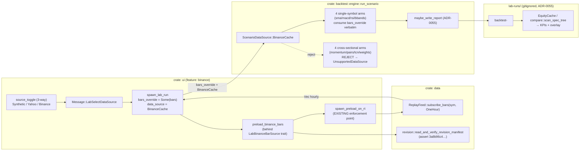

# Simple strategies on real Binance data — sma / macd / rsi / bbands in the Lab

## Changelog

- 2026-06-13 (presenter): **release deck assembled; status →
  `presenter-done` (awaiting operator approval).** Deck at
  `presentations/simple-strategies-realdata-2026-06-13.md`. Live-captured
  evidence embedded: `cargo test -p backtest --test binance_cache_dispatch`
  **9/9 PASS** (incl. the AC4 no-op-source guard
  `binance_cache_real_bars_diverge_from_synthetic_baseline`, epsilon = 1 USD,
  real corpus revision `3a8b96c4…`) + `scripts/verify_anchors.sh` →
  **119/119 PASS**. Verification matrix built from the tester AC matrix
  (AC1–AC8 + H3 + ADR-0050 callthrough, all VERIFIED). Approval block ships
  UN-ticked; `scripts/check_presentation.sh` PASS. No production code, no
  `anchors.toml`, no committed `spec/*/reports/` body touched.

- 2026-06-13 (ui-designer): **§ UI added — Wave 0 (T0.2) + Wave B (T-B1..B5) +
  the UI-side gates (T-C1/C2/C4 render+round-trip) IMPLEMENTED.** The
  three-way `source_toggle` (Synthetic / Yahoo / **Binance**, Binance chip
  `#[cfg(feature = "binance")]`-gated), `LabDataSource::BinanceCache` +
  `"binance_cache"` serde, `preload_binance_bars` behind a new
  `LabBinanceBarSource` marker trait routed through a **generalized**
  `spawn_preload_on_rt<S: LabBarSource>` (shared `LabBarSource` super-trait —
  the ADR-0050 § D4 rt.spawn invariant + the `lab_runner_preload_callthrough_e2e`
  guard both preserved), the `binance` cargo feature (added to `default`), the
  data-missing UX (typed `Err` + re-fetch hint, NEVER silent synthetic), and
  the render-layer proofs. Matched the developer's pinned engine contract
  (`ScenarioDataSource::BinanceCache`, label `"binance"`). UN-ANCHORED; no
  `anchors.toml`, no `spec/*/reports/` write, no trace.toml edit. See § UI.

- 2026-06-13 (architect): **v0.2.0 — § Architecture added (A1–A6); status →
  `arch-done`.** Code-anchor claims verified at file:line (engine enum + the 4
  single-symbol `bars_override` arms + the 4 cross-sectional reject arms + the
  `data_source_str` non-exhaustive match; the Yahoo UI seam: `LabDataSource`,
  `source_toggle`, `preload_yahoo_bars`, `LabYahooBarSource` trait +
  `spawn_preload_on_rt`, `spawn_lab_run` wiring; the `data` crate's
  timeframe-parametric `ReplayFeed::subscribe_bars`/`merge_symbols` +
  `revision::read_and_verify_revision_manifest`; ADR-0040 corpus pin + ADR-0055
  topology). **Resolutions:** Q-tf = hourly, NO engine timeframe field (the
  loader pins `Timeframe::OneHour` at read; the engine consumes `bars_override`
  cadence-agnostically — A3); Q-loader = a single-symbol `preload_binance_bars`
  behind a NEW `LabBinanceBarSource` trait mirroring `LabYahooBarSource`,
  routed through the EXISTING `spawn_preload_on_rt` enforcement point (A3/A4);
  Q-feature = YES, a `binance` cargo feature on the `ui` crate, sibling to
  `yahoo` (A4); Q-miss = typed `Err` with a re-fetch hint, NEVER silent
  synthetic fallback (A3/A5). **ADR decision: NO new ADR** — implementation
  under ADR-0040 (data domain) + ADR-0055 § D3 (which already names the
  `ScenarioDataSource` enum-variant as THE anchor-additive precedent); Q1-policy
  / Q-anchor are operator-recorded decisions, not architectural tradeoffs (A6).
  **Baseline-equity-divergence gate: N/A as written** (no overlay / sizing
  modifier / new decision variable) — but its purpose-built analog, the
  no-op-source divergence guard (AC4), IS mandatory (A5). All money stays
  `Money<Usdt>` / `Decimal`; UN-ANCHORED (no `anchors.toml` row); 119/119 by
  construction; render-layer verification for the toggle; NO live trading.

- 2026-06-13 (operator, via orchestrator dialog): **Q1-policy RESOLVED = (a)
  Both Yahoo + Binance** — the Lab data-source toggle becomes three-way
  (Synthetic / Yahoo / Binance), AUGMENTING the 2026-05-24 lab-yahoo-realdata
  decision (keeps Yahoo, adds Binance) rather than reversing it. **Q-anchor =
  UN-ANCHORED** stands (ad-hoc Lab runs persist to `lab-runs/` only, never into
  `anchors.toml`; 119/119 untouched by construction). Binance corpus is HOURLY
  (1h) bars (pinned, gitignored, ADR-0040). Architect proceeds on this basis.

- 2026-06-13 (analyst): initial draft (v0.1.0). Scoped from the operator's
  direction: "let me run the simple strategies (sma / macd / rsi / bbands) on
  the REAL 10-symbol Binance data through the cockpit Lab — they're SYNTHETIC-
  data-only today, so the just-shipped lab-run-save-compare persist/compare/
  overlay tooling can't check a basic strategy on real BTC/ETH." Files only, no
  git. THE riskiest decision is **Q1 (surfacing)** because it RE-LITIGATES a
  shipped operator decision: `lab-yahoo-realdata` (operator verbatim 2026-05-24,
  *"Replace Binance for Lab — multi-asset pivot"*) deliberately made the Binance
  parquet cache **CLI-only for the Lab** and routed the Lab's real-data option
  through Yahoo. The Lab ALREADY runs real BTC/ETH via the `YahooCache` toggle
  (`source_toggle` widget, `LabDataSource` enum). So this feature is not "add
  real data to the Lab" — it is "add **Binance** real data to the Lab **alongside
  Yahoo**", which means adding a third `LabDataSource` variant and a
  `preload_binance_bars` sibling to the existing `preload_yahoo_bars`. Every open
  question carries a recommended default; all reality claims are verified at
  file:line in § Verified crate-edge reality below. **Q-anchor recommendation:
  UN-ANCHORED (lab-runs/-only, no `spec/anchors.toml` row)** — justified against
  the top10-realdata precedent finding in § Q-anchor.

## Why

The cockpit **Lab** is the project's strategy-checking surface, and
`lab-run-save-compare` (shipped v0.2.0, 2026-06-12) just made it a real tool:
run → persist a durable report → reload in history → diff two runs in Compare,
all operator-local with zero anchor risk. That persist/compare/overlay tooling
is wired at the `run_scenario` boundary, so **it auto-applies to whatever
`run_scenario` produces** — including, for free, any new real-data simple-
strategy run (§ Auto-applied tooling below).

But there is a gap the operator hit immediately: the four **simple single-symbol
strategies** — `v0.sma`, `v0.5.macd`, `v0.5.rsi`, `v0.5.bbands` — are reachable
in the Lab on **two** data sources only:

1. **Synthetic GBM** (`ChaCha20Rng`; the fixtures default). Useless for actually
   evaluating a strategy — it's a random walk with no real BTC/ETH structure.
2. **Yahoo Finance cache** (`YahooCache` toggle; `data/yahoo/<TICKER>/…`). Real
   data, but Yahoo daily/hourly OHLCV — a *different* dataset from the pinned
   10-symbol Binance corpus the rest of the project's anchored evidence is built
   on (`data/binance/`, revision `3a8b96c4…`, 1h bars, 2023-24).

The operator wants to run a basic strategy on **the same real Binance BTC/ETH
data the canonical scenarios use** — through the Lab, so the new persist/compare/
overlay tooling can characterize it. Today they cannot: the engine's
`run_scenario` `ScenarioDataSource` enum is `{Synthetic, YahooCache}` only
(`engine.rs:170-177`) — there is **no Binance/RealData variant in the engine
path the Lab dispatches through**. The Binance corpus is wired into the CLI
`backtest` binary (via `--features realdata`, the `RealDataBarSource` loader and
the `ScenarioDataSource::RealData` arms, `main.rs:1100-1262`) but, by the
`lab-yahoo-realdata` operator decision, **not into Lab dispatch**.

This feature closes that gap: it adds a **Binance real-data path** to the Lab's
four single-symbol arms, surfaced the same way Yahoo is — a data-source toggle
choice that loads pinned Binance parquet → `cfg.bars_override` → the existing
`run_scenario` single-symbol arms → the existing `report::*::write` writer → the
existing lab-runs/ persist + Compare. **No new strategy, no new sizing, no new
report template, no new compare math** — just a new bar SOURCE feeding the
already-shipped chain.

### The Yahoo path IS the mechanism to extend (the crucial reuse fact)

The real-data-in-Lab problem was already solved once, for Yahoo, and the
solution is a clean, four-part seam this feature mirrors for Binance:

1. **`LabDataSource` enum** (`lab/state.rs:36-41`) — `{Synthetic, YahooCache}`.
   Serde round-trips (`"synthetic"` / `"yahoo_cache"`, test at `state.rs:595`).
   Add a `BinanceCache` variant (`"binance_cache"`).
2. **`source_toggle` widget** (`screens/lab.rs:46,237`) — renders the data-source
   choice; `LabSelectDataSource` updates `lab_state.data_source`
   (`runner.rs:1425`). Extend to a three-way choice.
3. **`preload_yahoo_bars(cfg, range)`** (`runner.rs:374`) — loads real parquet,
   returns `Vec<Bar>`; `spawn_lab_run` sets `scenario_cfg.bars_override =
   Some(bars)` and `scenario_cfg.data_source = YahooCache` (`runner.rs:917-918`).
   Add a `preload_binance_bars` sibling that loads from `data/binance/<SYM>/…`.
4. **The engine threads `bars_override` verbatim** into the four single-symbol
   arms (`engine.rs:1084,1161,1232,1306` — `cfg.bars_override.clone()`). The
   `data_source` enum drives only the report's `data_source` string label
   (`engine.rs:1104-1106`). Add a `BinanceCache` engine variant whose label is
   `"binance"`; bars arrive via the same `bars_override` field the Yahoo path
   uses, so the dispatch arms need **no new bar-loading logic**.

So the engine's run logic does not change — bars are injected upstream exactly
as Yahoo's are. The new code is: one enum variant on each side, one
`preload_binance_bars` loader, and the toggle UX. This is the same shape
`lab-yahoo-realdata` shipped, applied to a second source.

### What is settled and MUST NOT be reopened (inherited constraints)

1. **`run_scenario` is the single dispatch path; `bars_override` is the
   injection seam.** The four single-symbol arms already accept pre-loaded bars
   verbatim (`engine.rs:1084` etc., the Yahoo path). Binance bars ride the SAME
   field. Do NOT add a parallel run path or re-plumb dispatch.

2. **The report writer + the lab-runs/ home + Compare are REUSED verbatim.**
   `lab-run-save-compare` (ADR-0055) shipped `maybe_write_report` →
   `lab-runs/<slug>/reports/backtest-<ms-stamp>-<scenario>.md` (outside every
   `spec/**` anchor glob) + the two-root loaders + Compare. A real-data simple-
   strategy run produces a `RunReport` exactly like a synthetic one, so it gets
   persist + Compare + the equity overlay **for free** (§ Auto-applied tooling).
   No new template, no new compare math.

3. **The determinism contract is locked (ADR-0030 / ADR-0040).** Mandatory
   non-zero `seed` (`LAB_DEFAULT_SEED`, `defaults.rs:46`); `[0u8;32]` is a hard
   `RunError::ZeroSeed`. **For a real-data run, determinism means: same pinned
   parquet (revision `3a8b96c4…`) + same seed ⇒ byte-identical report body.**
   The bars are read from disk (no RNG for the data), so the body is a pure
   function of (strategy, symbol, range, seed, the on-disk bytes). This is what
   keeps the lab-run-save-compare H3 round-trip + the companion-CSV persist valid
   for Binance runs (R5 / AC5).

4. **The Binance corpus is 1h bars, pinned + gitignored (ADR-0040).**
   `data/binance/<SYM>USDT/<YEAR>/<MM>.parquet`, `interval = "1h"`
   (`data/binance/REVISION.toml`), revision SHA
   `3a8b96c43f2d8980fd8039303197ff3ac5d01e8f9cebaecdf74c853622dbbfc7`, 10 symbols
   × 2023-24. Gitignored + re-fetchable from `REVISION.toml`. **The single-symbol
   CLI arm uses `Timeframe::OneMinute`** (`main.rs:1298`) — a MISMATCH with the
   hourly parquet (Q-tf below). The Binance Lab loader MUST load at
   `Timeframe::OneHour` (as `RealDataBarSource` does, `realdata.rs:227`).

### Not a strategy or sizing feature — say it plainly

This is a **data-source / evaluation-tooling** feature. The strategies are the
EXISTING, shipped `v0.sma` / `v0.5.macd` / `v0.5.rsi` / `v0.5.bbands` — their
decision logic, sizing, and report math are byte-unchanged. This feature changes
only the **bars** they consume (synthetic/Yahoo → also Binance) and the toggle
that selects them. It introduces **no new strategy overlay, no new sizing
modifier, no new decision variable** on any execution path. Per CLAUDE.md the
**baseline-equity-divergence e2e gate applies to strategy overlays / sizing
modifiers** — this is neither. The gate's purpose is to catch a *no-op overlay*
(`scale` computed but never applied — the `v3-volatility-forecaster-noop-fix`
precedent). There is no overlay or scale here. **BUT** there is a precise analog
worth a cheap guard (§ Q-divergence): the danger here is a *no-op data source* —
a `BinanceCache` toggle that is wired but silently falls back to synthetic bars
(exactly the failure mode the single-symbol CLI auto-detect risks, `main.rs:1287`),
so the operator THINKS they're testing real BTC but are seeing a random walk.
The recommended guard is a real-vs-synthetic **equity-divergence e2e assertion**:
a Binance run's equity must diverge from the synthetic-baseline run's equity by
≥ epsilon for the same (strategy, symbol, range, seed) — proving the real bars
actually reached the strategy (Q-divergence / AC4). NO live trading — real-data
**backtesting** only (the operator's retained scope, `project_no_live_trading`).

## Requirements

The operator opens the Lab, picks one of the four simple strategies + a pair
(BTC/ETH) + a 2023/2024 range, toggles the data source to **Binance**, presses
Run; the run executes on the **pinned on-disk Binance hourly parquet**; a durable
report is persisted to `lab-runs/` (the existing home); it appears in Lab history
and is diffable in Compare against another run — all operator-local, **without
touching git and without any risk to the 119 anchored reports**.

- **R1 — A Binance real-data path exists in the Lab dispatch (engine seam).**
  Add a `ScenarioDataSource::BinanceCache` variant to `engine.rs:170-177` (the
  enum the Lab path dispatches through; `#[serde(default)]`-compatible,
  anchor-additive exactly as `YahooCache` was added — anchor neutrality proven by
  the same pattern, `lab-yahoo-realdata/decomp.md § T-AR9`). The four single-
  symbol arms accept `cfg.bars_override` verbatim (already true,
  `engine.rs:1084/1161/1232/1306`); for `BinanceCache` the report `data_source`
  string is `"binance"` (`engine.rs:1104-1106` gets a third match arm). The four
  CROSS-SECTIONAL arms reject `BinanceCache` with
  `RunError::UnsupportedDataSource` (mirroring how they reject `YahooCache`,
  `engine.rs:881/922/960/1016`) — single-symbol only at v0.1.0. CLI/anchor paths
  never construct `BinanceCache`, so all 119 anchored reports are byte-unaffected
  (AC6).

- **R2 — A `preload_binance_bars` loader (UI seam, mirrors `preload_yahoo_bars`).**
  Add a `preload_binance_bars(cfg, range) -> Result<(Vec<Bar>, revision_sha),
  SmolStr>` sibling to `runner.rs:374`. It loads single-symbol hourly bars from
  `data/binance/<SYM>USDT/<YEAR>/<MM>.parquet` at `Timeframe::OneHour` (Q-tf),
  clipped to the selected range, and returns the bars + the pinned revision SHA
  for report forensics. On cache miss / coverage shortfall it returns an
  operator-friendly `Err` (mirroring Yahoo's `CacheMiss` message with a re-fetch
  hint) — it does NOT silently fall back to synthetic (the no-op-source guard,
  Q-divergence). `spawn_lab_run` sets `scenario_cfg.bars_override = Some(bars)` +
  `scenario_cfg.data_source = BinanceCache` (the same wiring as
  `runner.rs:917-918` for Yahoo). The loader is behind the existing
  `LabBinanceBarSource`-style trait seam so tests can fake it (Q-loader).

- **R3 — A three-way data-source toggle in the Lab UI (render-layer).** The
  `source_toggle` widget (`screens/lab.rs:237`) becomes a three-way choice:
  Synthetic / Yahoo / **Binance**. Selecting Binance shows the four single-symbol
  strategies (cross-sectional strategies are hidden/disabled for Binance just as
  they are for Yahoo, `screens/lab.rs:97-115`). `LabSelectDataSource` extends to
  the third variant. **Any toggle/chip change is verified at the render layer**
  (the `live_equity_render.rs` panel-snapshot pattern, project law
  `feedback_verify_ui_at_render_layer`), not only at the model layer.

- **R4 — Real Binance bars actually reach the strategy (no-op-source guard).**
  An e2e test runs `v0.sma × BTCUSDT × 2023` on Binance bars and on synthetic
  bars with the SAME (strategy, symbol, range, seed), and asserts the two equity
  curves **diverge by ≥ epsilon** (e.g. final-equity delta ≥ 1 bp, or any
  testable non-trivial difference) — proving the real parquet bytes drove the
  result, not a silent synthetic fallback. This is the data-source analog of the
  CLAUDE.md baseline-divergence gate (§ Q-divergence). Gated behind whatever
  feature compiles the Binance loader (Q-feature).

- **R5 — Persist / Compare / overlay auto-apply to Binance runs (round-trip
  holds).** A Binance Lab run produces a `RunReport` identical in shape to a
  synthetic/Yahoo one, so it flows through the shipped lab-run-save-compare chain
  unchanged: `maybe_write_report` → `lab-runs/<slug>/reports/backtest-<ms-stamp>-
  <scenario>.md` (+ companion equity CSV) → repaint-from-disk in Lab history →
  KPIs + equity overlay in Compare. The H3-style round-trip (in-memory equity ==
  cached-disk equity, element-by-element) holds for Binance runs because the body
  is deterministic given fixed parquet + seed (R5 / AC5). **No new persist or
  compare code** — assert the existing chain works for a Binance-sourced run.

- **R6 — Determinism + Decimal + anchor safety + bounded retention (inherited).**
  Same pinned parquet (revision `3a8b96c4…`) + same seed ⇒ byte-identical report
  body. All money is `Money<Usdt>` / `Decimal`, never `f64` (Sharpe/drawdown stay
  display-only `f64` per ADR-0003). The Lab-runs home is the existing
  `lab-runs/<slug>/reports/` outside every `spec/**` anchor glob — `verify_anchors.sh`
  stays **119/119** (AC6); NO new row in `spec/anchors.toml` under the Q-anchor =
  UN-ANCHORED recommendation. Retention is the existing keep-last-N-per-tuple
  purge (ADR-0055 § A5) — inherited, unchanged. The on-disk revision SHA is
  asserted against the pin on load (mirroring `main.rs:1130-1139`) so a tampered/
  re-fetched-divergent corpus fails loudly rather than producing a silently-wrong
  report.

### Out of scope (explicit)

- **Re-anchoring or committing Binance Lab reports.** Under Q-anchor =
  UN-ANCHORED, Binance Lab runs live in `lab-runs/` only, never in
  `spec/*/reports/`, never in `spec/anchors.toml`. Promoting a characterized Lab
  result into a committed, anchored `spec/<feature>/reports/` is a SEPARATE
  feature with its own anchor-discipline review (the same carve-out
  `lab-run-save-compare` named) — do not fold it in here.
- **Removing or changing the Yahoo Lab path.** Yahoo stays as-is; Binance is
  ADDED alongside. This feature does NOT re-decide the `lab-yahoo-realdata`
  "replace Binance for Lab" call — it makes Binance a SECOND real-data option,
  which the architect should confirm the operator wants (Q1).
- **Cross-sectional / multi-symbol Binance runs in the Lab.** The four single-
  symbol arms only (BTC/ETH at v0.1.0). Cross-sectional arms reject `BinanceCache`
  exactly as they reject `YahooCache`. Multi-symbol universe Lab runs are future
  work (the CLI already does them via `RealDataBarSource`).
- **1-minute Binance bars.** The pinned corpus is 1h (`REVISION.toml`); the Lab
  Binance path is hourly only. A 1m corpus is a separate data-fetch + revision-pin
  feature.
- **A new report template, new KPIs, or new compare math.** All reused verbatim
  from the shipped chain.
- **Auto-fetching Binance data on cache miss.** Yahoo auto-fetches
  (`runner.rs:403-426`); Binance is pinned + manually re-fetchable per ADR-0040.
  v0.1.0 surfaces a clear "run the fetch tool" error on miss, no in-Lab fetch
  (Q-miss).

## Architecture

_Architect-owned (v0.2.0, 2026-06-13). Authoritative design. The analyst's
§ Architecture findings below is the verified input this section resolves._

**ADR posture: NO new ADR.** This is an implementation under three accepted ADRs:

- **ADR-0032** (`backtest-realdata-path-and-revision-pin`) — the **Binance**
  corpus data domain: pinned `3a8b96c4…` parquet, gitignored, re-fetchable,
  revision-SHA-asserted on load; `RealDataBarSource`/`realdata.rs` + the
  `data/binance/REVISION.toml` pin live here. **(Provenance correction: earlier
  drafts of this feature + the brief attributed the Binance corpus pin to
  ADR-0040 — that is a misattribution. ADR-0040 is the YAHOO realdata path;
  it cross-references ADR-0032 for the Binance domain in its § Context. The
  Binance corpus contract is ADR-0032.)**
- **ADR-0040** (`yahoo-realdata-path`) — the Lab-dispatch real-data PATTERN this
  feature mirrors: § D4 "engine remains source-agnostic; Lab swaps bars upstream"
  via the existing `bars_override: Option<Vec<Bar>>` hook, + the revision-pin-on-
  load discipline. The four-part Yahoo seam (enum + toggle + preload +
  `bars_override`) I mirror for Binance is this ADR's shipped shape.
- **ADR-0055** (`lab-run-persistence-topology-and-anchor-safety`) — `lab-runs/`
  outside every `spec/**` anchor glob, anchor-safety by construction; § D3
  *already names* the `ScenarioDataSource` enum-variant addition as THE
  established anchor-additive pattern ("the `ScenarioDataSource` /
  `latency_slippage_sim` precedents"), so adding a third variant is that
  precedent in action, not a new tradeoff. The two genuinely decision-bearing questions —
Q1-policy (three-way toggle) and Q-anchor (UN-ANCHORED) — are **operator
decisions recorded in this feature's changelog**, not architectural tradeoffs:
no new durable contract, no anchor mutation, no superseded decision, no new
crate. Per the contract, ADRs are reserved for non-trivial design tradeoffs; this
feature has none not already covered by 0040 + 0055. (If a follow-on promotes a
characterized Lab result into committed anchored evidence — § Out of scope —
that one DOES warrant its own ADR, inheriting the top10 re-emission discipline.)



### A1 — The engine seam: `ScenarioDataSource::BinanceCache` (exec) — R1 / AC1 / AC2

Add a third variant to `crates/backtest/src/engine.rs:170-177`:

```rust
pub enum ScenarioDataSource {
    #[default] Synthetic,
    YahooCache,
    BinanceCache,   // ← new; Lab-only; single-symbol arms only at v0.1.0
}
```

It is `#[serde(rename_all = "snake_case")]` → wire string `"binance_cache"`, and
anchor-additive by the **exact** `YahooCache` precedent: CLI/anchor-generating
call sites construct `ScenarioConfig` via struct-update / `..default()` and never
set `data_source = BinanceCache`, so all 119 anchored bodies are byte-identical
(neutrality proof reused from `lab-yahoo-realdata/decomp.md § T-AR9`).

**Dispatch arms (verified file:line):**

- **Single-symbol arms accept it unchanged.** The four arms (`v0.sma`
  `engine.rs:~1082`, `v0.5.macd` `~1159`, `v0.5.rsi`, `v0.5.bbands`) already pass
  `cfg.bars_override.clone()` into `sma_composed_run::run` — Binance bars ride the
  SAME field. **No new bar-loading logic in the engine.**
- **The `data_source_str` match gets a third arm — compile-enforced.** Each
  single-symbol arm has a `match cfg.data_source { YahooCache => "yahoo",
  Synthetic => "synthetic" }` (verified at `engine.rs:1104-1107` and `1175-1178`,
  and the two sibling rsi/bbands arms). This match is **non-exhaustive today**, so
  adding `BinanceCache` forces a `BinanceCache => "binance"` arm in **all four**
  arms or the crate won't compile — a free correctness guarantee that the report
  `data_source` label is `"binance"` (R1). `rev_sha` stays `None` on the engine
  path (the Lab caller carries the revision SHA for forensics; the body SHA does
  not depend on it — it's frontmatter-class, ADR-0032 § D4).
- **Cross-sectional arms reject it.** The four arms (`engine.rs:881` momentum,
  `922` pairs, `960` tcn, `1016` tcn-weights) today guard
  `if cfg.data_source == ScenarioDataSource::YahooCache { return
  Err(UnsupportedDataSource(..)) }`. Change each to
  `if matches!(cfg.data_source, YahooCache | BinanceCache)` → `BinanceCache` is
  rejected exactly as `YahooCache` is (R1 / AC2). Single-symbol only at v0.1.0.

### A2 — Timeframe reconciliation: hourly, NO engine timeframe field (exec) — Q-tf / R2

**The 1m/1h mismatch is real and confined to the CLI auto-detect path, not the
engine.** Verified: the CLI single-symbol arm hardcodes
`feed.subscribe_bars(symbol, Timeframe::OneMinute)` (`main.rs:1298`) and its
synthetic fallback emits `bar_count: 525_600` 1m bars — that path would mis-read
the hourly parquet. But the canonical Binance loader `RealDataBarSource` reads at
`Timeframe::OneHour` (`realdata.rs:227`, `merge_symbols(&paths, Timeframe::OneHour)`),
and **both** `ReplayFeed::subscribe_bars(sym, tf)` and `merge_symbols(paths, tf)`
are **timeframe-parametric** (verified `replay_feed.rs:281,362`).

**Decision (pins Q-tf):**

1. **The engine needs NO timeframe field.** `run_scenario` consumes
   `cfg.bars_override: Option<Vec<Bar>>` — a plain bar vector — and never
   re-derives cadence from it. So the cadence is fixed *at load time* by the
   loader, and the engine is cadence-agnostic. Adding a timeframe enum to
   `ScenarioConfig` would be dead surface and a non-additive anchor risk. **Do not
   add one.** This is the cleaner half of the answer to the brief's Q-tf framing:
   *"the loader emits hourly bars the engine consumes agnostically."*
2. **The new loader pins `Timeframe::OneHour`** (A3). This is precisely why a NEW
   loader is required rather than reusing the CLI single-symbol auto-detect: that
   path is hardcoded to 1m.
3. **SMA/MACD/RSI/BBands windows are bar-counts on the hourly series** — so the
   default SMA 20/50 means 20h/50h, a legitimate hourly strategy. The operator can
   retune via the existing `sma_fast_len`/`sma_slow_len` overrides
   (`engine.rs:221-226`), already plumbed Lab→engine. Document "20/50 = 20h/50h"
   in the toggle help / feature.md so the operator is not surprised. The four
   simple strategies are inherently cadence-agnostic (they consume a `Bar` stream).

**Out of scope:** fixing the CLI 1m auto-detect (`main.rs:1287`). It is not on the
Lab dispatch path this feature touches, and changing it risks the SMA/composed
anchors. A 1m corpus is a separate data-fetch + revision-pin feature.

### A3 — The Binance loader: `preload_binance_bars` + `LabBinanceBarSource` trait (exec/UI boundary) — Q-loader / R2 / R6 / AC3 / Q-miss

Mirror the Yahoo seam exactly. The Yahoo path is: a `LabYahooBarSource` trait
(`runner.rs:222`, object-safe via a `PreloadFuture` boxed-future alias, `Send +
Sync + 'static`), a `DefaultLabYahooBarSource` production impl
(`runner.rs:250`, gated `all(feature = "live", feature = "yahoo")`), and a single
`spawn_preload_on_rt` enforcement point (`runner.rs:296`) that both the mock and
production paths route through (ADR-0050 § D4 — the rt.spawn reactor invariant).

**Decision (pins Q-loader = (a)):**

- **Add `async fn preload_binance_bars(cfg: &LabRunConfig, range: &DateRange) ->
  Result<(Vec<Bar>, SmolStr), SmolStr>`** in `crates/ui/src/lab/runner.rs`,
  sibling to `preload_yahoo_bars` (`runner.rs:374`), gated
  `#[cfg(feature = "binance")]`. It:
  1. Maps the UI symbol (`BTCUSDT`) + the selected `DateRange` to the
     `data/binance/<SYM>USDT/<YEAR>/<MM>.parquet` layout.
  2. **Asserts the revision pin** via `data::revision::read_and_verify_revision_manifest(
     "data/binance")` (verified `revision.rs:206`) → on `RevisionMismatch` /
     `RevisionMissing` returns a typed `Err` (load fails loudly, R6 / AC3). The
     returned `revision_sha` is the second tuple element (forensics).
  3. Loads single-symbol hourly bars via `data::ReplayFeed::new("data/binance",
     true).subscribe_bars(Symbol::new(sym), Timeframe::OneHour)`, collects the
     stream, and **clips to the selected range**.
  4. **On cache miss / coverage shortfall: returns a typed `Err` with a re-fetch
     hint** (mirroring Yahoo's `CacheMiss` message shape but pointing at the
     Binance fetch tool, since Binance is pinned + manually re-fetchable per
     ADR-0040 — NO in-Lab auto-fetch, unlike Yahoo). **It NEVER synthesizes bars**
     (Q-miss / the design-side half of the AC4 no-op-source guard).
- **Add a `LabBinanceBarSource` trait** mirroring `LabYahooBarSource`
  (object-safe boxed-future, `Send + Sync + 'static`, gated `feature = "live"`),
  with a `DefaultLabBinanceBarSource` production impl (gated
  `all(feature = "live", feature = "binance")`) delegating to
  `preload_binance_bars`. **This is R2's testable seam (AC8): tests inject a
  fake without touching the real corpus.**
- **Route through the EXISTING `spawn_preload_on_rt`.** `spawn_preload_on_rt`
  currently takes `Box<dyn LabYahooBarSource>`. Generalize it to a shared preload
  trait so both sources route through the one rt.spawn enforcement point (ADR-0050
  § D4 — do NOT add a second inline `rt.spawn`). Cleanest mechanic: a small
  `LabBarSource` super-trait (or make `spawn_preload_on_rt` generic over
  `S: LabBarSource`), so the Bug-#64 reactor invariant holds for Binance too. The
  developer picks the lighter of {generic fn, shared super-trait}; the invariant
  is: **both sources' preload futures spawn on a tokio worker thread via one
  enforcement point.** Note `preload_binance_bars` does NOT call `spawn_blocking`
  (no HTTP — pure parquet read), so the reactor requirement is weaker than
  Yahoo's, but routing through the same point keeps the regression guard
  (`lab_runner_preload_callthrough_e2e.rs`) meaningful and the code symmetric.

### A4 — Three-way toggle + the `binance` cargo feature (UI) — Q-feature / R3 / AC7 / AC8

- **`LabDataSource` gets a third variant** (`crates/ui/src/lab/state.rs:36-42`):
  `BinanceCache` with serde `"binance_cache"`. Update the default-is-`Synthetic`
  + round-trip serde tests (`state.rs:~587-603`).
- **`source_toggle` becomes three-way** (`crates/ui/src/widgets/source_toggle.rs`
  — today two chips, `Synthetic` + `YahooCache`, both dispatch
  `Message::LabSelectDataSource(LabDataSource)`). Add a third Binance chip. The
  `LabSelectDataSource` handler (`state.rs:2488`, `runner.rs:1425`) already takes
  the full `LabDataSource` enum, so it absorbs the third variant with the same
  invalidation hooks — **no message-shape change** (AC7 serde round-trip).
- **Strategy gating mirrors Yahoo.** `SINGLE_SYMBOL_STRATEGIES`
  (`screens/lab.rs:103`) already lists exactly the four arms; the existing logic
  that shows only these when `data_source == YahooCache` extends to
  `matches!(.., YahooCache | BinanceCache)` — Binance hides/disables the
  cross-sectional chips (R3). The `chart_canvas_height_for_body` allocation
  comment (`screens/lab.rs:142-149`) need not change (the toggle row already
  exists; it gains a chip, not a row).
- **`binance` cargo feature on the `ui` crate** (pins Q-feature = YES), sibling to
  `yahoo` (`Cargo.toml:238`): `binance = ["dep:data", "data/<binance-read-feature>"]`
  — reusing the `data` crate's parquet reader (no `*-online` sub-feature, since
  Binance does NOT auto-fetch). The toggle's Binance chip is gated on it; the
  fixtures cockpit (no `binance` feature) hides the chip and is byte-identical to
  today (AC8). Mirror the `#[cfg(not(feature = "binance"))]` friendly-error guard
  in `spawn_lab_run` (the `runner.rs:830-838` Yahoo precedent): selecting Binance
  without the feature returns "rebuild with `--features binance`", never a panic.
  **Default-features question for the developer:** `ui` default is
  `["live", "yahoo"]`; the operator wants Binance in the everyday cockpit, so add
  `binance` to `default` (so `cargo run -p ui --bin cockpit_live` Just Works) —
  confirm with operator at build time; either way the feature must exist so
  fixtures/no-feature builds stay clean.

### A5 — `spawn_lab_run` wiring + the no-op-source guard (UI/exec) — R2 / R4 / AC4 / AC5

- **`spawn_lab_run` wiring** mirrors Yahoo (`runner.rs:917-919`): when
  `cfg.data_source == LabDataSource::BinanceCache`, preload via the
  `LabBinanceBarSource` (default or injected), then set
  `scenario_cfg.bars_override = Some(bars)` and
  `scenario_cfg.data_source = backtest::engine::ScenarioDataSource::BinanceCache`.
  Reuse `classify_preload_result` (the shared error→notice/error routing). The
  signature already carries a test-injection seam for Yahoo
  (`yahoo_source_override: Option<Box<dyn LabYahooBarSource>>`,
  `runner.rs:768`); add a parallel `binance_source_override` (or fold both into
  one optional-sources struct — developer's call, keep it additive).
- **AC4 — the no-op-source divergence guard (THE purpose-built gate).** The
  CLAUDE.md baseline-equity-divergence gate is **N/A as written** — this feature
  adds NO strategy overlay, NO sizing modifier, NO new decision variable on any
  execution path (the strategies are byte-unchanged; only the *bars* differ). But
  its failure mode has a precise analog: a `BinanceCache` toggle wired but
  silently feeding synthetic bars (the exact "computed-but-not-applied" class the
  v3-vol-overlay-noop precedent burned us on). **So the e2e guard IS mandatory:**
  run `v0.sma × BTCUSDT × 2023` on Binance bars and on synthetic bars with the
  SAME `(strategy, symbol, range, seed)`, assert the two equity curves **diverge
  by ≥ epsilon** (final-equity delta or any testable non-trivial difference) —
  proving the real parquet bytes reached the strategy. Pattern reference:
  `crates/strategy/tests/vol_targeting_overlay_end_to_end.rs`. The loader's
  no-silent-fallback rule (A3) is the design-side half of the same guard.
- **AC5 — persist/Compare auto-apply (the free win).** Because
  `maybe_write_report` runs at the `run_scenario` dispatch boundary (ADR-0055
  § A2) for ANY `cfg.write_report = true` run, a Binance run produces a
  `RunReport` of identical shape and inherits the whole chain: the `.md` +
  companion equity CSV → `lab-runs/<slug>/reports/backtest-<ms>-<scenario>.md` →
  `EquityCache::get_or_load` element-by-element round-trip → `compare::scan_spec_tree`
  `CachedCell` with KPIs + overlay. **No new persist/compare code.** The H3
  round-trip holds because the body is deterministic given fixed parquet + seed
  (R6). The close-out AC is: prove this chain works for a Binance-sourced run.

### A6 — Determinism, money, anchor safety, render-layer (cross-cutting) — R6 / AC6 / AC7

- **Determinism.** Same pinned parquet (`3a8b96c4…`) + same seed ⇒ byte-identical
  report body. Bars are read from disk (no RNG for the data); the body is a pure
  function of `(strategy, symbol, range, seed, on-disk bytes)`. Seed contract is
  inherited unchanged (`LAB_DEFAULT_SEED`; `[0u8;32]` → `RunError::ZeroSeed`).
- **Money.** All money is `Money<Usdt>` / `Decimal` (the `report::sma::write`
  writers already enforce this); Sharpe/drawdown stay display-only `f64` per
  ADR-0003. **No new `f64` money** — this feature adds no math, only a bar source.
- **Anchor safety (AC6 tripwire).** UN-ANCHORED. No `spec/anchors.toml` row, no
  committed `spec/*/reports/` file, no body-SHA mutated. Binance Lab reports live
  in `lab-runs/` (outside every `spec/**/reports/` glob, ADR-0055 § D2 git
  boundary). CLI/anchor paths never construct `BinanceCache`, so
  `scripts/verify_anchors.sh` stays **119/119** by construction (mechanical, not
  vigilance). **No `adr_registry_check.py` involvement** — no ADR added.
- **Render-layer verification (AC7, project law).** The three-way `source_toggle`
  is verified at the render layer via the `live_equity_render.rs` panel-snapshot
  pattern (`iced_test::screenshot` → real `view`→draw→tiny-skia readback), NOT
  only at the model layer. Two render assertions: (1) the toggle renders three
  chips with the correct active state; (2) a Binance-sourced run's equity curve
  actually rasterizes (ACCENT-pixel-count > threshold), the same signal
  `live_equity_render.rs` uses — closing the "wired but doesn't paint" gap.
- **No live trading.** Real-data backtesting only; no live/paper execution path is
  touched (`project_no_live_trading`).

### Dependency / crate-compatibility check

**No new dependencies.** The loader reuses `data::ReplayFeed` + `data::revision`
(both already in the workspace, polars-backed parquet — single-binary-friendly,
already vendored/locked). The `binance` cargo feature on `ui` only re-exports the
existing `data` crate's read path. Edition-2024, no new C deps, no stdlib-shadow
crate name. Nothing to flag (AC8).

## Architecture findings (for the architect — analysis, not hand-waving)

### Q1 — Surfacing: data-source TOGGLE vs new scenario NAMES (THE riskiest)

Two shapes were weighed. The decision is dominated by **the `lab-yahoo-realdata`
precedent**: real-data-in-Lab is ALREADY a `LabDataSource` toggle + a
`preload_*_bars` loader, not a scenario-name proliferation. New scenario names
(`btc-2023-realdata-sma-cross`, …) would be the CLI's pattern, not the Lab's, and
would NOT reuse the toggle/preload seam — they'd need new `Scenario::from_name`
arms in `main.rs` and would not be reachable from the Lab's pair × strategy ×
range × source UX at all. The Lab dispatches through `engine::run_scenario`,
which is driven by `ScenarioConfig {strategy, pair, range, data_source,
bars_override}` — **not** by a scenario-name string. So a toggle is the only
shape that fits the Lab's actual dispatch.

| Option | Reuses Yahoo seam? | Reachable from Lab UX? | Engine change | Verdict |
|--------|--------------------|-----------------------|---------------|---------|
| **(a) `BinanceCache` data-source toggle** (the operator picks strategy + pair + range + {synthetic\|yahoo\|binance}) | **Yes — mirrors `preload_yahoo_bars` + the `LabDataSource` enum + `source_toggle` exactly.** One enum variant per side + one loader + a three-way toggle. | **Yes** — it IS the Lab's dispatch model (`ScenarioConfig.data_source` + `bars_override`). | Add one `ScenarioDataSource` variant + one match arm for the label + a reject arm in the 4 cross-sectional arms. Anchor-additive (the `YahooCache` precedent). | **RECOMMENDED.** Reuses the entire shipped real-data-in-Lab mechanism; reachable from the existing UX; anchor-additive by the proven `YahooCache` pattern. Durable: a third source slots into the same seam a fourth could later. |
| **(b) New scenario NAMES** (`btc-2023-realdata-sma-cross`, …) | No — that's the CLI's `Scenario::from_name` pattern (`main.rs:431`), orthogonal to the Lab's `ScenarioConfig` dispatch. | **No** — the Lab has no "pick a scenario name" UX; it picks strategy × pair × range × source. | Larger: new `from_name` arms, and STILL no Lab reachability without also adding a toggle. | **Rejected.** Doesn't fit Lab dispatch, doesn't reuse the Yahoo seam, and would orphan the new names from the Lab UX. |

**Recommendation: (a) a `BinanceCache` data-source toggle**, mirroring the shipped
Yahoo seam end-to-end. This is the durable AND the lowest-blast-radius choice —
it reuses the entire `lab-yahoo-realdata` mechanism (enum + toggle + preload +
`bars_override`) and is reachable from the Lab UX as-is. Per the durable-over-
quick rule it earns `(Recommended)`: there is no cheaper option that also fits
Lab dispatch.

**THE caveat the architect MUST surface to the operator (Q1-policy):** this
feature ADDS Binance as a *second* real-data Lab source alongside Yahoo. The
`lab-yahoo-realdata` operator decision (2026-05-24) explicitly made Binance
CLI-only for the Lab and routed Lab real-data through Yahoo. Re-introducing
Binance to the Lab is a (small) reversal of that scoping. It is defensible —
Binance is the pinned corpus the anchored evidence uses, so "check a basic
strategy on the SAME BTC/ETH the canonical scenarios use" genuinely needs the
Binance path, not Yahoo. But the architect should get an explicit operator nod
that "Yahoo AND Binance both live in the Lab toggle" is wanted, vs. "Binance
replaces Yahoo in the Lab" vs. "leave it CLI-only and the operator runs the CLI".
**If the operator says leave it CLI-only**, this whole feature collapses to a
documented operator recipe (run the `backtest` binary with `--features realdata`
on a single-symbol scenario) + a Compare import — much smaller. That fallback is
named in § Size estimate.

### Q-anchor — UN-ANCHORED, reconciled against the top10-realdata precedent

**The riskiest correctness question.** The synthetic simple-strategy scenarios
are ANCHORED (deterministic 525k-bar GBM oracle → byte-stable body →
`spec/anchors.toml`; e.g. `btc-2023-1m-sma-cross` body-SHA `fc2e3b4a…`,
`main.rs:437-441`). The question: do new Binance simple-strategy runs get
ANCHORED too?

**Precedent finding (verified):** the EXISTING `top10-*-realdata` scenarios ARE
anchored AND committed. `spec/anchors.toml:149-165` carries
`top10-2023-fy-tcn-overlay-realdata`, `…-weights-realdata`, etc., and their
report bodies are committed under `spec/backtest-real-binance-data/reports/`,
`spec/v5-latency-slippage-sim-*/reports/`, `spec/v3-volatility-forecaster-
rebaseline/reports/`. So there IS a precedent for anchoring real-Binance reports.
**BUT the precedent is materially different in kind**, and the difference is what
decides this feature:

| Dimension | top10-*-realdata (anchored) | This feature's Lab runs |
|-----------|----------------------------|--------------------------|
| Purpose | Canonical release/CI evidence — the project's headline Sharpe numbers | Ad-hoc operator exploration ("does sma work on real BTC?") |
| Reproducibility | Pinned revision SHA `3a8b96c4…` asserted on every run (`main.rs:1130`); the corpus is the contract | Same pin asserted (R6), but the run is operator-initiated, not CI-gated |
| Determinism risk | Full-universe load, deterministic | Single-symbol load, deterministic — SAME guarantee |
| CI / portability | Reports re-emitted on a machine WITH the pinned parquet present; anchor verify requires the corpus | **Anchoring would require the gitignored corpus present in CI to re-verify** — a portability tax for an exploratory run |
| Volume | Bounded set of canonical scenarios | Unbounded — the operator runs many ad-hoc tuples |

**Recommendation: UN-ANCHORED (lab-runs/-only; NO `spec/anchors.toml` row; NO
committed `spec/*/reports/` file).** Three reasons:

1. **It matches the operator's framing.** The direction is "run them ad-hoc in
   the Lab"; the lab-run-save-compare home (`lab-runs/`, gitignored, outside every
   `spec/**` glob) is built exactly for this and keeps `verify_anchors.sh` at
   119/119 BY CONSTRUCTION (AC6 is a mechanical proof, not vigilance).
2. **Anchoring an ad-hoc Lab run would import a CI/portability tax** — the
   anchor verifier would need the gitignored Binance corpus present to re-hash,
   which the top10 anchors accept (they're canonical) but an exploratory run
   should not impose.
3. **The top10 precedent is for CANONICAL scenarios, not Lab exploration.** This
   feature explicitly is NOT producing canonical evidence; if a particular
   Binance Lab result later deserves to become canonical, that's the named
   separate "promote a Lab run into committed anchored evidence" feature (§ Out
   of scope), which inherits the top10 anchoring discipline at that point.

**Consequence: this feature does NOT touch the anchor gate.** No `anchors.toml`
edit, no committed report, no body-SHA mutated. AC6 is purely a tripwire that
119/119 still holds after a Binance Lab run writes to `lab-runs/`.

**If-budget/policy-tightens fallback:** if the operator instead wants a small set
of CANONICAL Binance single-symbol baselines (e.g. `btc-2023-sma` as a committed
reference to diff exploratory runs against), that is the (b) ANCHORED variant —
it would add `spec/simple-strategies-realdata/reports/` committed bodies + new
`anchors.toml` rows under a new namespace, and inherit the top10 re-emission
discipline (ADR-0038 § D6). Name it as a follow-on; do NOT default to it (it's a
larger build and contradicts the "ad-hoc Lab" framing).

### Q-tf — the 1m-vs-1h timeframe mismatch (a real correctness pin)

**Verified hazard.** The single-symbol CLI arm passes `Timeframe::OneMinute`
(`main.rs:1298`, `feed.subscribe_bars(symbol, Timeframe::OneMinute)`), and its
synthetic fallback generates 1m bars (`bar_count: 525_600`, `main.rs:444`). But
the pinned Binance corpus is **1h** (`data/binance/REVISION.toml`,
`interval = "1h"`; `RealDataBarSource` loads at `Timeframe::OneHour`,
`realdata.rs:227`). So the CLI single-symbol Binance auto-detect (`main.rs:1287`)
would attempt a 1m read of an hourly parquet — a schema/cadence mismatch. The
Lab Binance loader MUST load at `Timeframe::OneHour` and the strategy must run on
hourly bars (the four simple strategies are timeframe-agnostic — they consume a
`Bar` stream regardless of cadence; the SMA windows 20/50 are bar-counts, so on
1h they're 20h/50h, which is a legitimate hourly-SMA strategy). The architect
should pin: **Binance Lab path = hourly bars, SMA fast/slow = bar-counts on the
hourly series** (the operator can tune via the existing `sma_fast_len`/`sma_slow_len`
override, `engine.rs:221-226`). This is also why a NEW loader is needed rather
than reusing the CLI single-symbol auto-detect — that path is hardcoded to 1m.

### Q-divergence — the no-op-source guard (the baseline-divergence analog)

CLAUDE.md's baseline-equity-divergence gate is scoped to strategy overlays /
sizing modifiers — N/A here (no overlay, no sizing change). **But the precise
failure mode that gate exists to catch has a direct analog here:** the danger is
a `BinanceCache` toggle that is wired but silently produces synthetic bars (the
single-symbol auto-detect ALREADY has this hazard — `main.rs:1287` falls back to
synthetic when the parquet dir is absent/empty, with only an `info!` log). If the
Lab Binance path had an equivalent silent fallback, the operator would believe
they're testing real BTC while seeing a random walk — the exact "computed but not
applied" class of bug. **Recommended guard (warranted, cheap): an e2e test (R4 /
AC4) asserting a Binance run's equity diverges from the synthetic-baseline run's
equity by ≥ epsilon for the same (strategy, symbol, range, seed).** This is the
data-source twin of `vol_targeting_overlay_end_to_end.rs` and proves the real
bytes reached the strategy. The loader's no-silent-fallback rule (R2 — return
`Err` on miss, never synthesize) is the design-side half of the same guard.

### Auto-applied tooling (the free win — state it explicitly)

Because `lab-run-save-compare` wired persist/compare/overlay at the
`run_scenario` boundary (ADR-0055 § A2: `maybe_write_report` runs in the dispatch
arms for ANY `cfg.write_report = true` run), a Binance Lab run inherits the
entire chain with **zero new persist/compare code**:

- `maybe_write_report` writes `lab-runs/<slug>/reports/backtest-<ms-stamp>-
  <scenario>.md` + the companion equity CSV (the H3 fidelity fix, feature.md
  changelog 2026-06-12).
- The two-root loaders (`EquityCache::get_or_load`, `compare::scan_spec_tree`)
  pick it up from `lab-runs/` on the next boot / in Compare.
- The Compare KPI matrix + the equity-overlay panel (REQ-LAB-RUN-SAVE-COMPARE-001
  + the shipped overlay follow-on, trace `2906`) render it.

The feature's job is to PROVE this holds for a real-data simple-strategy run (R5
/ AC5), not to rebuild any of it.

## Open questions for the architect

- **Q1 — Surfacing: data-source toggle vs new scenario names. (THE riskiest.)**
  - **(a) `BinanceCache` data-source toggle, mirroring the shipped Yahoo seam.
    (Recommended)** — reuses `LabDataSource` + `source_toggle` + `preload_*_bars`
    + `bars_override`; reachable from the Lab UX; anchor-additive (the `YahooCache`
    pattern). Durable AND lowest-blast-radius.
  - **(b) New scenario names** — rejected: the CLI's pattern, not the Lab's; not
    reachable from Lab dispatch; doesn't reuse the Yahoo seam.
  - **Q1-policy sub-question (operator-decide):** does the operator want Binance
    AND Yahoo both in the Lab toggle (the (a) default), OR Binance to REPLACE Yahoo
    in the Lab, OR to leave Binance CLI-only and collapse this feature to a CLI
    recipe + Compare import (the cheaper fallback, § Size estimate)? Flag to the
    operator — this reverses a small part of the `lab-yahoo-realdata` 2026-05-24
    decision.
  - **Default: (a) Binance added alongside Yahoo.**

- **Q-anchor — Anchored vs un-anchored Binance Lab runs.**
  - **(a) UN-ANCHORED — lab-runs/-only, no `anchors.toml` row, no committed
    report. (Recommended)** — matches the "ad-hoc Lab" framing; keeps
    `verify_anchors.sh` 119/119 by construction; no CI/portability tax. The
    feature does not touch the anchor gate.
  - **(b) ANCHORED canonical Binance single-symbol baselines** — *fallback /
    future.* Mirrors the top10-realdata precedent (anchored + committed) but
    imports the gitignored-corpus-in-CI tax and contradicts the ad-hoc framing.
    Use only if the operator wants committed reference baselines; name it as a
    separate feature.
  - **Default: (a) UN-ANCHORED.**

- **Q-tf — Binance Lab bar timeframe.**
  - Recommend **`Timeframe::OneHour`** (the pinned corpus is 1h; the CLI single-
    symbol 1m path does not fit). SMA windows are bar-counts on the hourly series.
  - **Default: hourly bars; document that SMA 20/50 = 20h/50h.**

- **Q-loader — Where the Binance single-symbol loader lives + its trait seam.**
  - **(a) A `preload_binance_bars` in `ui/src/lab/runner.rs` mirroring
    `preload_yahoo_bars`, behind a `LabBinanceBarSource`-style trait so tests
    fake it. (Recommended)** — symmetric with Yahoo; the trait gives R2's testable
    seam. Reuse `data::ReplayFeed` (single-symbol hourly read) or a thin single-
    symbol wrapper over the `data` crate's binance parquet reader.
  - **(b) Reuse `backtest::realdata::RealDataBarSource`** — but it loads the FULL
    10-symbol universe (`realdata.rs`), not a single symbol; would need a single-
    symbol mode. More change than (a).
  - **Default: (a) a single-symbol `preload_binance_bars` + trait seam, hourly.**

- **Q-feature — Compile gating for the Binance Lab path.**
  - The CLI gates Binance behind `--features realdata` (`main.rs:17`). The Lab
    `ui` crate would need an equivalent feature (e.g. a `binance` feature, sibling
    to the existing `yahoo` feature, `runner.rs:373`). Recommend a dedicated
    `binance` cargo feature on `ui` so the fixtures cockpit (no feature) is
    byte-unchanged and the toggle option is hidden/disabled when not compiled in
    (mirroring how `YahooCache` requires `feature = "yahoo"`, `runner.rs:832-836`).
  - **Default: a `binance` feature on the `ui` crate; toggle option gated on it.**

- **Q-miss — Behaviour on cache miss / coverage shortfall.**
  - Recommend a clear operator-friendly `Err` with a "run the fetch tool" hint
    (mirroring Yahoo's `CacheMiss` message, `yahoo.rs:141-148`), routed to
    `last_run_error`. NO in-Lab auto-fetch (Binance is pinned + manually
    re-fetchable per ADR-0040, unlike Yahoo). Crucially: **never silently fall
    back to synthetic** (the no-op-source guard, Q-divergence).
  - **Default: clear error + re-fetch hint; no auto-fetch; no synthetic fallback.**

## Acceptance criteria

Proportionate + testable. This is a **data-source / evaluation-tooling** feature
(no new strategy overlay / sizing math) → the CLAUDE.md baseline-equity-divergence
e2e gate does **NOT** apply as written; AC4 is its purpose-built analog (the
no-op-source guard).

- **AC1 — `BinanceCache` engine variant runs a single-symbol arm on real bars.**
  An integration test constructs `ScenarioConfig { data_source: BinanceCache,
  bars_override: Some(<real BTC hourly bars>), strategy: v0.sma, … }` and asserts
  `run_scenario` returns a `RunReport` with a non-empty equity series and the
  report `data_source` string `"binance"`. With `bars_override: None` +
  `BinanceCache` the loader-miss path (R2) surfaces a typed error, not a panic.

- **AC2 — Cross-sectional arms reject `BinanceCache`.** A test asserts the four
  cross-sectional arms (`v1.momentum`, pairs, TCN, …) return
  `RunError::UnsupportedDataSource` for `BinanceCache`, exactly as they do for
  `YahooCache` (`engine.rs:881` etc.).

- **AC3 — `preload_binance_bars` loads hourly bars from the pinned corpus + asserts
  the revision SHA.** A test (or documented operator recipe, since the corpus is
  gitignored) runs `preload_binance_bars` for `BTCUSDT × 2023`, asserts a non-empty
  hourly bar series within the range, and asserts the on-disk revision SHA matches
  the pin `3a8b96c4…` (load fails loudly on mismatch, R6). On a missing corpus it
  returns the typed cache-miss error with a re-fetch hint (Q-miss), NOT synthetic
  bars.

- **AC4 — No-op-source guard: Binance equity diverges from synthetic baseline
  (THE purpose-built gate).** An e2e test runs `v0.sma × BTCUSDT × 2023` on Binance
  bars and on synthetic bars with the SAME (strategy, symbol, range, seed), and
  asserts the final equity (or the equity curve) **differs by ≥ epsilon** — proving
  the real parquet bytes reached the strategy rather than a silent synthetic
  fallback. Pattern reference: `crates/strategy/tests/vol_targeting_overlay_end_to_end.rs`.

- **AC5 — Persist + Compare round-trip holds for a Binance run (auto-applied
  tooling).** A test points the engine write at a `lab-runs/` tempdir, runs a
  Binance single-symbol scenario with `write_report = true`, and asserts: (i) the
  report + companion equity CSV are written; (ii) `EquityCache::get_or_load` parses
  the equity series element-by-element-equal to the in-memory series (the H3-style
  round-trip, holds because the body is deterministic given fixed parquet + seed);
  (iii) `compare::scan_spec_tree` builds a `CachedCell` with KPIs + a loadable
  overlay series. No new persist/compare code is added — this asserts the shipped
  chain works for a Binance-sourced run.

- **AC6 — Anchor verifier stays 119/119; no anchor-namespace touch (Q-anchor).**
  After a Binance Lab run writes to `lab-runs/`, `scripts/verify_anchors.sh` is
  still **119/119 PASS**. Explicit: no row added to `spec/anchors.toml`, no
  committed `spec/*/reports/` file, no anchored body-SHA mutated. The Binance Lab
  reports live in `lab-runs/` outside every `spec/**/reports/` glob (inherited from
  ADR-0055). The CLI/anchor paths never construct `BinanceCache`, so all 119
  anchored bodies are byte-identical (the `YahooCache`-addition neutrality pattern,
  `lab-yahoo-realdata/decomp.md § T-AR9`).

- **AC7 — Three-way toggle verified at the render layer.** The Lab `source_toggle`
  rendering with the third (Binance) option is verified via the panel-snapshot
  render harness (`live_equity_render.rs` pattern), not only the model layer
  (project law). Selecting Binance shows the four single-symbol strategies and
  hides/disables cross-sectional ones (mirroring Yahoo). `LabSelectDataSource`
  serde round-trips the new `"binance_cache"` variant.

- **AC8 — Fixtures cockpit + anchor paths byte-unchanged + every I/O behind a
  seam.** The fixtures-mode cockpit (no `binance` feature) hides the Binance toggle
  option and is byte-identical to today; no `lab-runs/` Binance dir is created. The
  Binance loader is reached through the `LabBinanceBarSource` trait seam (R2 /
  Q-loader) so tests fake it without touching the real corpus. Any new dependency
  is flagged (none expected — `ReplayFeed` / the binance parquet reader already
  exist in the `data` crate). Determinism, `Decimal`/`Money<Usdt>` (no `f64`
  money), and NO-live-trading are upheld.

## Size estimate (S/M/L) + exec-vs-UI split

**Estimate: S–M**, split roughly **≈ 45% exec (backtest engine + the Binance
loader) / 55% UI** (the three-way toggle + the preload wiring + the render-layer
check + the persist/compare round-trip proof). Smaller than `lab-yahoo-realdata`
because the entire real-data-in-Lab MECHANISM already exists — this is a second
source slotted into a proven seam, not a new seam.

- **Exec (≈ 45%):** one `ScenarioDataSource::BinanceCache` variant + one
  report-label match arm + one reject arm in each of the 4 cross-sectional arms
  (`engine.rs`). A single-symbol hourly Binance loader (`preload_binance_bars` +
  trait), reusing `data::ReplayFeed` (single-symbol read) at `Timeframe::OneHour`.
  Anchor-additive by the `YahooCache` precedent (AC6).
- **UI (≈ 55%):** extend `LabDataSource` to a third variant + serde; the three-way
  `source_toggle`; `LabSelectDataSource`; `spawn_lab_run` wiring (`bars_override` +
  `data_source = BinanceCache`, mirroring `runner.rs:917-918`); the `binance`
  cargo feature; the render-layer toggle snapshot; the persist/Compare round-trip
  proof for a Binance run.
- **The headline deliverables:** AC4 (the no-op-source divergence guard proving
  real bars reach the strategy) + AC5 (the lab-run-save-compare chain auto-applies
  to a Binance run) + AC6 (119/119 untouched).

**If-budget/policy-tightens fallback (named per durable-over-quick):** if the
operator decides (Q1-policy) to leave Binance CLI-only for the Lab and NOT add a
toggle, this feature collapses to **(S, ~½ day):** a documented operator recipe
(run `cargo run -p backtest --release --features realdata -- --scenario
top10-2023-fy-momentum-realdata …` — or a new single-symbol realdata CLI scenario)
+ importing the resulting committed report into Compare via the existing two-root
loader. That fallback gives the operator "see a real-Binance result in Compare"
without the Lab toggle work, but does NOT give the in-Lab pair × strategy × range
× source UX. The architect should resolve Q1-policy with the operator before
committing to the full (a) build.

**Bottom line for the operator:** you'll be able to pick a simple strategy + BTC/ETH
+ a 2023/2024 range in the Lab, flip the source to **Binance**, and run it on the
SAME pinned real data the canonical scenarios use — with the just-shipped persist/
compare/overlay tooling characterizing it for free, and **zero risk to the 119
anchored reports** (Binance Lab runs stay in `lab-runs/`, never anchored, never
committed). The mechanism is the proven Yahoo seam, applied to a second source.

## UI

_ui-designer-owned (2026-06-13). The UI half of the feature: the three-way
source toggle, the Binance loader seam, the cargo feature, the data-missing UX,
and the render-layer gates. Mirrors the shipped Yahoo seam end-to-end._

### Wireframe — the Lab source-toggle row (three-way)

```
┌─ Lab ───────────────────────────────────────────────────────────────────────┐
│  [Yahoo cache: 10 tickers · last fetch 2026-05-18]            (toolbar badge) │
│  ⟨ BTCUSDT ⟩ ⟨ ETHUSDT ⟩ ⟨ SOLUSDT ⟩ …                       (pair chips)    │
│  Source:  [ Synthetic ] [ Yahoo ] [ Binance ]   ← three-way (Binance gated)  │
│           └ active chip = ACCENT bg; inactive = PANEL_RAISED + BORDER_1       │
│  Strategies (Binance selected → single-symbol only):                         │
│           ⟨ v0.sma ⟩ ⟨ v0.5.macd ⟩ ⟨ v0.5.rsi ⟩ ⟨ v0.5.bbands ⟩             │
│           └ cross-sectional (v1.* / v2.*) HIDDEN (engine rejects them)        │
│  [ Run ]                                                                      │
│  …chart / KPIs / position curve / histogram…                                 │
└──────────────────────────────────────────────────────────────────────────────┘
```

When `Source = Binance` is selected and the build LACKS the `binance` feature,
the chip is simply absent (two-chip toggle) and a persisted Binance selection
loaded under such a build returns a friendly "rebuild with `--features binance`"
notice on Run — never a panic, never a silent synthetic fallback.

### Data flow (UI seam, mirrors Yahoo)

```
source_toggle (Binance chip)
  └─ Message::LabSelectDataSource(LabDataSource::BinanceCache)   [state.rs:2488]
       └─ spawn_lab_run  (data_source == BinanceCache)
            └─ spawn_preload_on_rt<S: LabBarSource>(DefaultLabBinanceBarSource)  ← ONE rt.spawn point
                 └─ preload_binance_bars(cfg, range)
                      ├─ data::revision::read_and_verify_revision_manifest("data/binance")  (assert 3a8b96c4…)
                      └─ data::ReplayFeed::merge_symbols(&[(sym, root)], Timeframe::OneHour)  → clip to range
            └─ scenario_cfg.bars_override = Some(bars); data_source = ScenarioDataSource::BinanceCache
                 └─ backtest::engine::run_scenario  → maybe_write_report → lab-runs/ → Compare
```

### New / changed screens · panels · widgets

- **`widgets::source_toggle`** — became three-way. The Binance chip is
  `#[cfg(feature = "binance")]` so the no-feature build renders two chips
  (byte-unchanged). No new widget; one chip added to the existing row.
- **`screens::lab`** — the single-symbol strategy filter (`is_realdata =
  is_yahoo || is_binance`) now hides cross-sectional chips for Binance too;
  the Binance pair universe stays the Binance-native `XRP_FIRST_UNIVERSE`
  (its loader reads `data/binance/<SYM>USDT/…`), only Yahoo swaps to the
  crypto-mirror universe + the Yahoo-only cache badge. No new panel.
- **`lab::runner`** — new `LabBarSource` super-trait (the shared `preload`
  contract), `LabBinanceBarSource` marker trait, `DefaultLabBinanceBarSource`,
  `preload_binance_bars` + `binance_range_to_ms_pair` + `binance_cache_miss_notice`;
  `spawn_preload_on_rt` generalized to `<S: LabBarSource + ?Sized>` (one
  enforcement point for both sources); `spawn_lab_run` gains a `binance`
  preload block + a `#[cfg(not(feature = "binance"))]` rebuild guard.
- **`test_support`** — new `source_toggle_program` render harness (bare toggle
  → tiny-skia, for the three-way render proof).

### New strings (`ui::strings`)

- `LAB_SOURCE_BINANCE = "Binance"` — the third chip label.
- `LAB_BINANCE_CACHE_MISS_NOTICE` — data-missing notice (`{symbol}` / `{window}`)
  pointing at the offline fetch tool (`cargo run --bin fetch_binance_klines` +
  `data/binance/REVISION.toml`). NO in-Lab auto-fetch; NEVER synthetic.
- `LAB_BINANCE_REVISION_ERROR` — loud revision-mismatch notice (`{detail}`).
- All three registered in the `ALL_*` registry (the no-empty-strings test).
  Zero inline user-visible copy added anywhere.

### New theme tokens

**Zero.** The Binance chip reuses the existing `ACCENT` / `PANEL_RAISED` /
`BORDER_1` / `FG_*` tokens via the shared `chip_button` helper. No hex literals,
no magic spacing. (Per the design-system rule, near-zero token additions is the
target; this feature adds none.)

### New cargo feature

- **`binance = ["dep:data"]`** on the `ui` crate, sibling to `yahoo`, added to
  `default = ["live", "yahoo", "binance"]`. NO `data/*` sub-feature (the
  `ReplayFeed` + `revision` read path is un-gated in `data`; only `yahoo` is
  gated there), and NO `*-online` variant (Binance is pinned + manually
  re-fetchable, never auto-fetched).

### Accessibility notes

- **Keyboard:** the Binance chip is an iced `button`, focusable + activatable
  by keyboard like the existing Synthetic/Yahoo chips (same `chip_button`).
- **Contrast:** reuses the `ACCENT` (active) / `PANEL_RAISED` (inactive) token
  pair already contrast-verified for the Synthetic/Yahoo chips — no new color
  pairing introduced.
- **Color is not the only signal:** the active source is also the leftmost-to-
  rightmost ordered chip with a distinct label ("Binance"); the
  render-layer proof asserts the active-highlight position, not only its color.
- **No blank states:** a Binance cache miss / coverage shortfall / revision
  mismatch each surface an explicit, plain-language notice with the next action
  (re-fetch the corpus) — never an empty panel, never a silent random walk.

### Render-layer verification (project law — the gate)

- **Three-way toggle (T-B1, AC7):** `lab_binance_render.rs::three_way_toggle_active_chip_marches_right`
  rasterizes the toggle at all three states and asserts the ACCENT highlight
  marches right (Synthetic < Yahoo < Binance) — proving three chips render with
  the correct active state. `binance_chip_renders_visible_highlight` pins the
  Binance chip is a real filled band (≥ 50 px).
- **No-feature two-chip (AC8):** `lab_source_toggle_no_binance.rs` (gated
  `not(binance)`) proves a no-`binance` build renders two chips; run with
  `cargo test -p ui --no-default-features --features live --test lab_source_toggle_no_binance`.
- **Binance equity curve rasterizes (T-C4, AC7):**
  `lab_binance_render.rs::binance_sourced_equity_curve_rasterizes` runs `v0.sma`
  on REAL Binance 2023-H1 BTC bars and asserts the equity curve paints a visible
  `ACCENT_2` polyline on the real overlay draw path.
- **No-op-source divergence (T-C1, AC4 — the headline gate):**
  `lab_binance_divergence.rs::binance_run_diverges_from_synthetic_baseline`
  asserts Binance vs synthetic equity diverge (same seed) — the v3-vol-overlay-noop
  analog. `loader_missing_corpus_returns_typed_err_not_synthetic` proves the
  no-silent-fallback design half.
- **Persist/Compare round-trip (T-C2, AC5):**
  `lab_binance_persist_compare.rs` proves the shipped lab-run-save-compare chain
  (`.md` + companion CSV → `EquityCache` element-by-element → `scan_spec_tree`
  cell) auto-applies to a Binance run.
