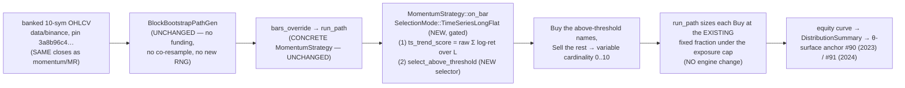

# Time-series momentum (per-asset absolute momentum, long/flat) — the FIRST non-cross-sectional method, the program's thesis-closing test — v0.1.0

> **The method fix, not a 4th cross-sectional family.** The robustness program
> has now retired all THREE cross-sectional families on this 10-symbol 1h
> universe: momentum (FAMILY-UNIFORM-FRAGILE, path + parameter), mean-reversion
> (FAMILY-UNIFORM-FRAGILE, parameter), and carry/funding (FAMILY-UNIFORM-FRAGILE
> on BOTH 2023 + 2024) — each dominated end-to-end by passive equal-weight
> buy-and-hold of the same coins (**+1.74 Sharpe 2023 / +1.10 Sharpe 2024**). The
> [universe-vs-method diagnosis](../dev-notes/universe-method-diagnosis-2026-06-02.md)
> (2026-06-02) computed, from the banked OHLCV via the harness's own reader, that
> the **cross-sectional RANKING channel carries ≈ 0 forward information** on this
> universe (rank IC within ±0.07 of zero at every horizon, no stable sign, both
> years) — and the broader-universe spike CONFIRMED this: a more-dispersed 35-name
> mid-cap universe LOWERED common-beta (avg R² 0.715 → 0.598) but did **NOT**
> revive rank IC. **The dead channel is the ranking method, not the basket.**
>
> Time-series (absolute) momentum **removes the ranking channel entirely**: each
> asset is traded long/flat on its OWN trailing-return sign — no cross-sectional
> sort. This is a structurally different method, the single most-cited crypto
> effect not yet examined, and the clean disambiguator the diagnosis pre-scoped
> (§ 4.1 logic table). It is the **first time-series family in the program**.
>
> **The load-bearing question this feature answers (either way is decision-grade):**
> *does removing the ranking channel produce a robust directional edge over passive
> buy-and-hold, or is active trading on this universe dominated end-to-end* — i.e.
> does TS-momentum clear the +1.74 / +1.10 bar where x-sec could not (→ **pivot
> the product to time-series**), or is it ALSO FRAGILE (→ implicates universe +
> horizon, **closes the active-trading thesis on this universe**, and routes to the
> pre-positioned broader-universe / horizon axis)?
>
> **This is the analyst brief** — Why / Requirements / Backtest Scenarios /
> mandatory day-1 falsifiers / framed design questions for the architect. It
> commits NO code, triggers NO engine run, and writes NO Design section, tasks, or
> implementation — those are the architect's next, per the workflow. The 89
> existing anchors MUST hold byte-identical; TS-momentum slots in defaults-off
> exactly as carry did.

---

## 0. Pre-registration & anti-cherry-pick (inherited verbatim, frozen now)

TS-momentum is vetted under the **already-frozen** pre-registered decision rule
([`robustness-decision-rule-2026-05-30.md`](../dev-notes/robustness-decision-rule-2026-05-30.md) § 0)
— the SAME ruler that scored momentum, mean-reversion, AND carry. Nothing about
the rule is re-opened. Three commitments carry over verbatim:

1. **The bands are frozen.** p5 Sharpe ≥ +0.5 ROBUST / **< 0 FRAGILE**; prob-of-loss
   ≤ 15% ROBUST / > 35% FRAGILE; p95 MaxDD ≤ ~50% ROBUST / > ~70% FRAGILE; p50
   Sharpe ≥ 1.0 ROBUST; P(Sharpe>1) ≥ 60% ROBUST. Composite = **worst primary band
   wins** (weakest-link). TS-momentum is scored against these, not the reverse.
2. **Anti-cherry-pick by construction.** The θ-surface reports the FULL surface +
   a family verdict and **crowns no argmax winner** (the FP-C3.5 renderer enforces
   this in code). A non-FRAGILE cell carries a `→ C5 deflation required` flag. A
   grid that picked argmax would inflate the false-ROBUST rate (`1 − 0.95^G`).
3. **Pre-flight void-if-fail.** Every report body must print
   `generator: block-bootstrap-real` AND `bootstrap_mode: shared-index`, else the
   verdict is void (the tail is not a fair adversary otherwise).

**The buy-and-hold control (+1.74 Sharpe 2023, +1.10 Sharpe 2024) is the bar
TS-momentum must clear to matter.** A method that does not beat simply holding the
same coins net of fees on this universe is not worth promoting, however internally
"robust." TS-momentum's honest a-priori edge is that, by going FLAT in
down-trends, it can *avoid* the drawdowns buy-and-hold sits through — that is the
falsifiable claim, and the only structural reason it could clear a bar the three
cross-sectional families could not.

---

## Why

### Why time-series momentum, and why now (the program's pre-scoped method fix)

The robustness program's result is now a uniform negative across all three
**cross-sectional** families:

| Family | Axis result | Killer |
|---|---|---|
| **Momentum** (x-sec top-K winners) | C2 FRAGILE + C3 FAMILY-UNIFORM-FRAGILE (6/6) | turnover / fee-bleed + dead ranking channel |
| **Mean-reversion** (x-sec bottom-K) | C3 FAMILY-UNIFORM-FRAGILE (6/6) | turnover / fee-bleed + dead ranking channel |
| **Carry** (x-sec funding rank) | FAMILY-UNIFORM-FRAGILE on BOTH 2023 + 2024 | funding < price-vol; dead ranking channel |
| **Buy-and-hold** (passive) | p50 **+1.74** (2023) / **+1.10** (2024) | — (this is the bar) |

The [universe-method diagnosis](../dev-notes/universe-method-diagnosis-2026-06-02.md)
explained the *uniformity* with one signal-agnostic fact: **cross-sectional rank
IC ≈ 0 at every horizon, both years** (§ M4). Three different signals (trend,
reverse-trend, funding) all fed the SAME ranking channel, and that channel is
empty. The broader-universe spike (§ S) then ruled out "just broaden the basket"
as a cross-sectional fix: a 35-name mid-cap universe lowered common-beta by ~12
points but rank IC stayed pinned at the noise floor with no stable positive sign.
**The diagnosis's firmed recommendation (§ S.5) is exactly this feature:** proceed
to a TIME-SERIES method that removes the ranking channel, on the ORIGINAL
10-symbol set, with the universe-axis pre-condition CLEARED.

### Why this is the structurally-different bet (not a 4th cross-sectional one)

Time-series (absolute) momentum trades **each asset independently on its own
trailing-return sign**: long if the asset's own trend is positive, flat otherwise.
There is **no cross-sectional sort, no ranking-across-names**. The portfolio is the
equal-weight average of the per-asset long/flat rules. Two structural properties
distinguish it from everything the program has tried:

1. **It does not touch the dead channel.** The rank-IC-≈-0 finding is a property of
   *relative-strength ranking*. A per-asset long/flat rule never ranks names against
   each other — it asks only "is THIS asset trending up right now?" That is a
   different question with a different (and as-yet-unmeasured) information content.
2. **It can go FLAT — the only structural escape from the buy-and-hold drawdown.**
   Buy-and-hold's +1.74/+1.10 comes with the full drawdown of sitting through every
   downtrend (the single-real-path momentum showed 73% MaxDD). A long/flat trend
   rule that exits to cash in sustained downtrends can, *in principle*, harvest the
   same up-drift while sidestepping the worst drawdowns — a higher Sharpe via lower
   denominator. **This is the entire a-priori case for TS-momentum and the
   falsifiable claim** (R-TSM.4, the goes-flat falsifier, makes "it actually exits"
   testable; if it is always-long it is just buy-and-hold with extra fees).

### The honest prior (what would make TS-momentum fragile too) — MEDIUM

TS-momentum is the most robust documented crypto effect, but this is NOT a
guarantee. State the failure modes up front so the verdict is read honestly:

- **Whipsaw / fee-bleed at 1h.** A 1h trend rule on a choppy, 0.63–0.68-correlated
  large-cap basket may flip long↔flat constantly in ranging regimes, paying fees on
  every flip to chase trends that reverse before they pay — the same turnover-killer
  that retired the price families, now in time-series form. The flat/entry threshold
  (the no-trade band, R-TSM.1) is the structural defense; the θ-surface spans it.
- **Late exits eat the drawdown anyway.** A trailing-return trend signal lags the
  turn; by the time the trend goes negative the drawdown is partly taken. If the
  exit lags too much, TS-momentum keeps most of buy-and-hold's drawdown while giving
  up some of its up-capture (fees + whipsaw) → a strictly worse buy-and-hold.
- **The up-drift is the edge, and BH captures it more cheaply.** 2023–2024 were
  net-up years (BH +1.74/+1.10). If TS-momentum is long ~most of the time (because
  the assets trended up most of the time), it largely *replicates* buy-and-hold but
  pays fees and occasionally mistimes the flat — i.e. it is dominated by the free
  passive version. The goes-flat + baseline-divergence falsifiers exist precisely to
  detect this degenerate ≈-BH case.
- **The robustness axis judges resampled real 2023 + 2024 history only** — it cannot
  speak to a regime those years never contained (inherited scope limit,
  decision-rule § 5). A different horizon (daily) is outside what the banked 1h data
  can test.

**If TS-momentum ALSO comes back FAMILY-UNIFORM-FRAGILE, that is the thesis-closing
result and is itself decision-grade** (the § 4.1 "NO" branch): the machine will
have shown that on this 10-symbol 1h universe NO active method — cross-sectional
OR time-series, trend OR reverse-trend OR carry — beats passive holding net of
fees, which strongly implicates the **universe + horizon** as the binding limiter
and routes the next move to the pre-positioned broader-universe / horizon axis
(the `data/binance-broaduni` tree, pin `518b4d40…`, is already banked per the
spike § S.6). The brief does not overclaim a TS edge.

---

## Requirements

### R-TSM.1 — Signal: per-asset ABSOLUTE momentum, LONG/FLAT (the method, stated precisely)

For **each asset independently** (NO cross-sectional ranking):

```text
own_trend(s, t)  = the asset's OWN trailing return / trend over a lookback L
                   (e.g. cumulative log-return over the last L bars, or its sign)
position(s, t)   = LONG  if own_trend(s, t) > entry_threshold
                   FLAT  otherwise
```

- **Absolute, not relative.** The decision for asset `s` uses ONLY `s`'s own price
  history — never a comparison to the other 9 names. This is the load-bearing
  difference from the three retired families and the whole point of the experiment.
- **LONG / FLAT only — NO shorts, NO cross-sectional ranking.** Long when the
  asset's own trend is positive (above the entry threshold), flat (in cash) when it
  is not. This deliberately fits the existing long-only, solvency-guarded engine
  (apples-to-apples with the momentum/MR/carry anchors) and reuses the banked OHLCV
  with no new data source.
- **The portfolio is the equal-weight average of the per-asset long/flat rules** —
  when `k` of the 10 names are long, capital is split across those `k` (or held in
  cash when 0 are long), under the existing exposure cap.

_Acceptance: the per-asset position is a pure function of that asset's own price
history over the lookback; a unit test on a synthetic price series confirms the
rule goes long above the entry threshold and flat below it, independent of the
other symbols' series._

> **The entry/flat threshold is the no-trade band — and it IS a swept θ-axis.**
> A zero-threshold rule (long whenever trailing return > 0) whipsaws hardest; a
> wider band requires a more decisive trend to enter and a more decisive reversal
> to exit, trading responsiveness for fewer fee-paying flips. This band is
> TS-momentum's analogue of carry's rebalance cadence — the turnover lever — and
> the θ-surface spans it (R-TSM.7 / Backtest Scenarios).

### R-TSM.2 — Universe & data: the banked 10-symbol OHLCV, REVISION-pinned

- **Universe = the ORIGINAL 10-symbol large-cap set** under `data/binance`
  (`ADAUSDT, AVAXUSDT, BNBUSDT, BTCUSDT, DOGEUSDT, DOTUSDT, ETHUSDT, LINKUSDT,
  SOLUSDT, XRPUSDT`), the SAME universe the entire robustness program (momentum/MR/
  carry surfaces, the frozen decision rule, the BH control, the 89 anchors) lives
  on. Per the diagnosis § S.5.2, this keeps TS-momentum directly comparable to the
  three retired families and reuses the banked pin with **zero new data-plumbing
  risk** — a time-series rule trades each asset's own trend and gains nothing from
  cross-name dispersion, so there is no TS-specific reason to pay the broader-universe
  cost.
- **OHLCV revision pin `3a8b96c4…`** (`data/binance/REVISION.toml`), 1h bars, verified
  by the harness's existing `RealDataBarSource` loader exactly as momentum/MR did.
  **NO new data source** — this is the key simplification over carry (which had to
  load, align, and co-resample a funding series). TS-momentum reads the SAME closes
  the price families already read.
- **Both regimes from day 1: 2023-FY + 2024-FY** (both banked, both REVISION-pinned),
  per the frame-diagnostic E1 precedent that the carry build adopted — the 2024 bar
  (BH +1.10, tail-negative) is the harder/fairer regime.

### R-TSM.3 — Harness, decision rule, and control: reuse verbatim

- **Through the EXISTING block-bootstrap robustness harness** — `run_path` +
  `DistributionSummary` + `BlockBootstrapPathGen`, shared-index, exactly as the
  three cross-sectional families ran. No harness redesign.
- **Scored against the frozen § 0 decision rule** (the 5-signal weakest-link
  composite; void-if-`gbm-smoke`-or-per-symbol-independent), pre-registered BEFORE
  the run.
- **The SAME buy-and-hold control** (equal-weight, auto-L bootstrap) re-asserting
  the +1.74 (2023) / +1.10 (2024) bar. The TS-momentum family verdict is read
  relative to it.

### R-TSM.4 — Money & timing discipline (inherited non-negotiables)

- **Decimal money throughout** (ADR-0003) — no `f64` in any equity / sizing path.
- **Strict no-look-ahead** — the per-asset position at bar `t` uses ONLY price
  information available at or before `t` (the trailing return over `[t−L, t]`,
  decided at `t`, acted on no earlier than `t`). A look-ahead falsifier (below)
  guards this.

### R-TSM.5 — Determinism & additivity: the 89 anchors hold byte-identical

- **TS-momentum slots in DEFAULTS-OFF, exactly like carry.** Whatever seam the
  architect chooses (Q-TSM-1 below), it MUST default to the existing behavior so
  that **every momentum / MR / carry / buy-and-hold run is byte-identical by
  construction** and the **89 existing anchors** (87 pre-existing + carry #88 2023
  + carry #89 2024) stay byte-unchanged with no re-lock. This is the SAME additive
  discipline MR used for `direction` and carry used for `score_source` + the
  optional funding path.
- **Two-run byte-identity** of the TS-momentum θ-surface body-SHA on the canonical
  box (ADR-0051 D2/D3 precedent).
- **+1 or +2 anchors** (89 → 90, or → 91 if both regimes are locked) after the
  developer's anchored run; the tester locks them. The grid + N are locked at design
  time (architect, per the MR/carry precedent — the grid IS a hashed body field).

### Requirements summary (consolidated)

- **R-TSM.1** — Signal = per-asset absolute momentum, LONG/FLAT on the asset's OWN
  trailing-return sign vs an entry/flat threshold. NO shorts, NO cross-sectional
  ranking. Pure function of that asset's own price history.
- **R-TSM.2** — Universe = the banked 10-symbol large-cap set (`data/binance`, pin
  `3a8b96c4…`), 1h, 2023 + 2024. NO new data source.
- **R-TSM.3** — Through the existing block-bootstrap harness + frozen § 0 decision
  rule + the SAME buy-and-hold control (+1.74 / +1.10 bar).
- **R-TSM.4** — Decimal money; strict no-look-ahead.
- **R-TSM.5** — Additive / defaults-off → 89 anchors byte-identical; two-run
  byte-identity; +1/+2 TS anchors after the anchored run.
- **R-TSM.6** — Mandatory day-1 falsifiers (next section), each RED-on-revert.
- **R-TSM.7** — θ-surface at N=200 on 2023 + 2024 vs the BH control (Backtest
  Scenarios); the architect locks the exact θ-axes + cells.

---

## Mandatory day-1 falsifiers (NON-NEGOTIABLE — modeled on carry R-CARRY.2/6/10a/10b)

Per CLAUDE.md (every strategy overlay / sizing-modifier ships a
baseline-equity-divergence e2e test from day 1, the v3-vol-overlay no-op precedent)
and the program's both-axes-from-day-1 discipline, TS-momentum ships the following
falsifiers, **each RED-on-revert** (the test must FAIL if the behavior it guards is
reverted — the carry build's `r_carry_10a_red_on_revert_*` pattern is the template).
They ship in the test file with the strategy, NOT after.

1. **F-TSM.1 — Baseline-equity-divergence e2e (the headline anti-no-op; the
   CLAUDE.md non-negotiable).** A fast e2e (small N, short synthetic price series,
   NO real data — about wiring) runs the SAME path through the TS-momentum strategy
   and a passive equal-weight buy-and-hold, and asserts the TS-momentum equity curve
   **measurably diverges** from the passive-hold equity by **≥ 1 bp** when the trend
   signal is non-trivial (the synthetic series is constructed to contain at least one
   sustained downtrend the TS rule exits and BH sits through). This is the carry
   R-CARRY.10a analogue and the EXACT pattern of
   `crates/strategy/tests/vol_targeting_overlay_end_to_end.rs` that CLAUDE.md
   mandates. **RED-on-revert:** an always-long (no-op) TS rule produces Δ=0 vs BH →
   the test fails, proving it detects the no-op.
2. **F-TSM.2 — Signal-non-no-op (the trend signal is load-bearing, not decorative).**
   Force the trend signal to a constant / degenerate value (e.g. always-positive →
   always-long) and assert the equity curve **collapses** to the buy-and-hold case
   (Δ < ε) — proving the long/flat decision is what produces the divergence, not an
   incidental sizing artifact. (The sibling of carry's R-CARRY.10b cashflow-non-no-op
   gate: the value is computed AND applied, not computed-and-ignored.)
3. **F-TSM.3 — No-look-ahead falsifier.** Assert a bar's position uses ONLY the
   trailing return available at or before its decision time — shifting the price
   series one bar into the future changes the position/equity (proving the trailing
   window is causal, the carry R-CARRY.6 analogue). RED if a future bar leaks into
   the current decision.
4. **F-TSM.4 — Goes-flat falsifier (TS-specific — the must-actually-exit gate).**
   The strategy MUST actually exit to FLAT at least sometimes on a series that
   contains a downtrend — else it is just always-long ≈ buy-and-hold and the entire
   method collapses to the passive control it is meant to beat. Construct a synthetic
   series with a clear sustained downtrend and assert the TS rule holds a FLAT (zero/
   cash) position on ≥ 1 bar during it. **RED-on-revert:** a rule wired to never exit
   (always-long) fails this test. *This is the falsifier that proves TS-momentum is a
   genuinely different strategy and not buy-and-hold wearing a trend hat — it has no
   carry/MR analogue because going-flat is the load-bearing TS mechanism.*
5. **F-TSM.5 — Two-run byte-identity of the TS θ-surface body-SHA** (ADR-0051
   D2/D3/§D6.4): run the small-N TS sweep twice at the same `ensemble_seed`; assert
   identical `report_body_hash`. Catches any unordered fold in the per-asset signal
   loop or the surface renderer.

Pattern references the architect/developer should reuse:
`crates/strategy/tests/vol_targeting_overlay_end_to_end.rs` (the CLAUDE.md
no-op-overlay non-negotiable — directly applicable to F-TSM.1/F-TSM.2);
`crates/backtest/tests/carry_divergence_e2e.rs` (the carry sibling divergence +
RED-on-revert + sign + no-look-ahead + two-run gates F-TSM.1/3/5 mirror);
`crates/backtest/tests/param_sweep_e2e.rs` (the θ-surface two-run + anti-cherry-pick
gates).

---

## Backtest Scenarios
_analyst proposes the SHAPE; the **architect LOCKS the exact θ-axes + cells + N**
before the tester anchors (per the MR/carry precedent — the grid IS the hashed
anchor input)._

The primary anchored deliverable is a **TS-momentum θ-surface** of the SAME shape
as the carry-C3 6×200 surface — a small LOCKED θ-grid spanning **the TS lookback ×
the flat/entry threshold** (the two TS-specific axes; the architect locks the exact
values), at **N=200 paths/cell on 2023-FY AND 2024-FY**, against the buy-and-hold
control. Both regimes run from day 1 (the carry/E1 precedent); the 2024 surface is
the harder bar (BH +1.10, tail-negative).

1. **TSM-C3 (PRIMARY, ANCHORED) — 2023-FY**:
   `v1-ts-momentum-theta-surface-2023-block-bootstrap-real-fy` (architect confirms
   the scenario slug). The LOCKED θ-grid (lookback × flat/entry threshold), N=200/
   cell, shared-index block-bootstrap of 2023-FY real Binance OHLCV (pin
   `3a8b96c4…`), 6 bps fees (2 slippage + 4 taker, inherited). ONE anchored
   θ-surface report: per-cell FRAGILE/MARGINAL/ROBUST + family verdict + per-cell
   `→ C5` flags + the trades column (turnover legibility) + (TS-specific) a
   **time-in-market / fraction-flat** column so the goes-flat behavior and the
   whipsaw cost are legible per cell.
2. **TSM-C3 (PRIMARY, gating) — 2024-FY**: the SAME LOCKED grid on 2024-FY as the
   multi-regime corroboration (BH +1.10 bar). SEPARATE run → SEPARATE anchor if the
   tester elects to lock it (the durable choice → 91), OR a gating-but-anchor-optional
   read (the tester's call at lock time, exactly as carry handled #89).
3. **Control (in each surface)** — buy-and-hold equal-weight under the same N paths
   + auto-L bootstrap, re-asserting the +1.74 (2023) / +1.10 (2024) bar. This row
   carries no verdict; the TS family verdict is read relative to it.

**Plan to anchor: +1 (2023 only → 90) or +2 (both regimes → 91).** The durable
choice is to lock both regimes (91); deferring the 2024 lock to a gating read is
the acceptable if-wall-clock-tight fallback (the carry precedent #88/#89). The grid
+ N + the TS axes are hashed body fields (K3) once locked.

> **Wall-clock gate (carried to the developer).** The carry 6×200 + control ran
> ~2 min extrapolated (N=3 smoke 1.7s → ~113s at N=200). TS-momentum is **cheaper**
> than carry per path — no funding gather, a per-asset trailing-return is O(n_bars)
> over the SAME closes — so the 6×200 (or whatever cell count the architect locks)
> × 2 years is expected to be comfortably within the ≲30 min gate. The developer
> MUST re-validate the wall-clock before locking (the C3 lesson:
> `wall-clock ≈ grid × N × per-path cost`), but no blow-up is expected. Emit a
> `watch -n 30 'tail -n 5 <progress-log>'` block when kicking off the anchored run
> (per the long-running-task recipe).

---

## Open design questions (FOR THE ARCHITECT M-T1 — framed, NOT answered)

These are the analyst-framed decisions the architect resolves next (with the
analyst's lean noted where I have one, NOT locked). I deliberately do **not** answer
them — the seam, the grid, and the engine-fit are architect M-T1 calls.

- **Q-TSM-1 (the headline — what IS time-series momentum in the type system?).**
  Is TS-momentum a new **`ScoreSource`** (a sibling to `VolAdjustedReturn` /
  `FundingCarry` on the cross-sectional config), a new **`Direction`** variant, or a
  genuinely new **strategy type**? The tension: the three cross-sectional families
  share a *ranking-then-select-top-K* shape, and TS-momentum deliberately has NO
  ranking — every asset decides long/flat on its own, so the `top_k_long` selector
  may not be the right reuse at all. The architect must judge whether TS-momentum is
  expressible as a per-asset transform on the existing score path (cheap, reuses the
  engine, risks contorting a ranking machine into a non-ranking rule) OR warrants a
  distinct long/flat-per-asset strategy. This is the load-bearing M-T1 decision and
  governs the answers to Q-TSM-2..4.
- **Q-TSM-2 (how does LONG/FLAT sizing slot into `run_path` / PaperEngine?).** The
  engine is currently long-only **cross-sectional top-k**: it ranks, takes the top
  K, and equal-weights them under the solvency cap. TS-momentum's portfolio is "the
  equal-weight set of all assets currently above their own entry threshold" — a
  *variable-cardinality* long/flat basket (0..10 names long, the rest in cash), NOT
  a fixed top-K. How does that variable-cardinality long/flat sizing slot into the
  existing `run_path` sizing + exposure cap? (Is "all names above threshold" just
  `top_k_long` with `K=10` and a threshold gate that drops sub-threshold names to
  flat? Or a new sizing path?) The architect locks the exact mechanism and confirms
  it composes with the solvency guard.
- **Q-TSM-3 (the exact θ-grid — the locked, hashed cells).** Ratify or revise the
  proposed two-axis shape (lookback × flat/entry threshold) and LOCK the exact cell
  values + N before the tester anchors (the grid IS the hashed anchor input, per the
  MR/carry precedent). The analyst's lean: span the threshold axis from zero (pure
  long/flat-on-sign, the whipsaw extreme) to a deliberately wide band (the low-churn
  corner — TS-momentum's best structural shot at clearing the BH bar), × a short and
  a long lookback — the analogue of the carry grid's turnover-axis span. The exact
  cells are the architect's to lock.
- **Q-TSM-4 (does it reuse `run_path`'s CONCRETE `MomentumStrategy`, or need a
  variant?).** `run_path` is typed to the concrete `MomentumStrategy`
  (montecarlo.rs) — the SAME constraint that forced MR to be an enum-on-config and
  carry to be a `ScoreSource` + `funding_override` rather than a new struct (a
  sibling struct forces `run_path` generic/`dyn` and risks all 89 anchors, the
  ADR-0051 § D6.5.2 trap). Can TS-momentum live as an additive config variant on
  `MomentumStrategy` (the anchor-safe path, consistent with Q-TSM-1's `ScoreSource`
  framing), or does its non-ranking, variable-cardinality, long/flat nature force a
  variant that the architect must reconcile with the concrete-`run_path` /
  anchor-preservation constraint? This is the additivity question — whatever the
  answer, R-TSM.5 (89 anchors byte-identical, defaults-off) is non-negotiable.

---

## Design

_Architect M-T1 (2026-06-02). Q-TSM-1..4 are all resolved + justified below. The
headline call (Q-TSM-1) is **a new `SelectionMode` on `MomentumStrategy`,
defaults-off** — NOT a `ScoreSource`, NOT a `Direction`, NOT a new strategy
struct. The variable-cardinality long/flat (Q-TSM-2) is expressible **purely as
new `on_bar` signal emission** with **ZERO `run_path` / `PaperEngine` change** —
the anchor-safe path. `run_path` stays **CONCRETE** (Q-TSM-4). The 6-cell θ-grid
is LOCKED in § D-TSM.3-LOCKED. The 89 existing anchors hold byte-identical by
construction — the anchor-neutrality argument is § D-TSM.5. The determinism model
is recorded as an **ADR-0051 § D6.7 amendment** (a new SELECTION mechanism — a
2nd selector alongside `top_k_long` — varied at the config level, seed untouched,
the MR/carry "vary-at-config-not-seed" pattern; NO new RNG, NO co-resampled
series, materially simpler than carry's § D6.6)._

### D-TSM.0 — One-paragraph design

TS-momentum is **the cheapest additive seam the program has had** — materially
simpler than carry (which needed a new data source, an as-of join, a
co-resampled-through-the-bootstrap series, and an engine cashflow). It needs **no
new data, no bootstrap change, no engine change**. It is exactly two additive,
defaults-off pieces on the SAME concrete `MomentumStrategy` + `run_path` the three
cross-sectional families already run: **(1)** a new `SelectionMode { CrossSectionalTopK
(default), TimeSeriesLongFlat }` enum on `CrossSectionalMomentumConfig` (sibling to
`Direction`/`ScoreSource`, serde-default) that, when `TimeSeriesLongFlat`, swaps the
`top_k_long` ranker for a new **`select_above_threshold`** selector (long every
warmed asset whose OWN trailing-return score exceeds the entry threshold, flat the
rest — NO cross-name ranking, NO top-K); and **(2)** a per-asset **raw
trailing-return score** (cumulative log-return over L bars, NO vol denominator —
the trend sign is the signal) computed in the SAME `on_bar` score fork the carry
`ScoreSource` already established, gated on the new mode. The portfolio is the
equal-weight set of all above-threshold names, sized by `run_path`'s **existing
fixed-fraction-per-name** logic under the existing exposure cap — byte-untouched.
Everything is Option/enum-gated and defaults to today's behavior, so the 89 anchors
(momentum #86, MR #87, carry #88/#89, and all pre-existing) are byte-identical by
construction with no re-lock.



### D-TSM.1 — Q-TSM-1 RESOLVED: a new `SelectionMode` enum on the config (NOT ScoreSource, NOT Direction, NOT a new struct)

**RATIFIED: TS-momentum is a new `SelectionMode { CrossSectionalTopK (default),
TimeSeriesLongFlat }` field on `CrossSectionalMomentumConfig`** (`config.rs:44`
region, sibling to `Direction` and `ScoreSource`; derive `Copy, PartialEq, Eq,
Serialize, Deserialize, Default`; `#[serde(rename_all="snake_case")]`;
`#[serde(default)]` on both `CrossSectionalMomentumConfig` and `RawConfig`). The
three rejected framings and why:

| Framing | Decision | Why |
|---|---|---|
| **A new `ScoreSource::TimeSeriesMomentum`** (the analyst's first-listed candidate) | **REJECTED as the seam** | `ScoreSource` is consumed by `top_k_long`, which **ranks across names and fills K slots**. A per-asset trailing-return fed into `top_k_long` would (i) still rank cross-sectionally (the dead channel TS-momentum exists to AVOID), (ii) fill exactly K slots from the warmed set **regardless of whether any trend is positive** → it can NEVER go flat (F-TSM.4 would be un-satisfiable), and (iii) drop trending names when K < #(warmed). The *score* is per-asset, but the *selection* is the load-bearing difference, and `ScoreSource` does not touch selection. A TS trend score IS still needed (D-TSM.2) — but it is NOT sufficient, and it is not the seam. |
| **A new `Direction::TimeSeriesLongFlat`** | **REJECTED** | `Direction` only negates the score before `top_k_long` (momentum.rs:336-339). It cannot change top-K into threshold-gated variable-cardinality. Wrong layer. |
| **A new `TimeSeriesMomentumStrategy` struct implementing `Strategy`** | **REJECTED** | `run_path` is typed to the **concrete** `MomentumStrategy` (`montecarlo.rs:87`, call-sites `monte_carlo.rs:878` + `param_robustness_sweep.rs:1623`). A sibling struct forces `run_path` generic/`dyn` and risks all 89 anchors — the **exact ADR-0051 § D6.5.2 trap** that forced MR to be a `Direction`-on-config and carry to be a `ScoreSource`-on-config. Non-starter. |
| **A new `SelectionMode` enum on the config** | **RATIFIED** | The selection step (rank-top-K vs threshold-long-flat) is precisely what differs. A config enum that forks `build_rebalance_signals` between `top_k_long` (existing) and `select_above_threshold` (new) is the **minimal seam at the right layer**. `MomentumStrategy` stays one concrete type → `run_path` stays concrete → anchors safe. It is the direct structural analogue of MR's `Direction` and carry's `ScoreSource`: vary the behaviour at the config level, leave the seed and the engine untouched. |

**The new selector — `select_above_threshold` (`selector.rs`, sibling to
`top_k_long`).** Signature mirrors `top_k_long` so `build_rebalance_signals` can
fork cleanly:

```rust
// selector.rs — NEW, sibling to top_k_long (NO change to top_k_long itself)
#[must_use]
pub fn select_above_threshold(
    scores: &BTreeMap<Symbol, Option<Decimal>>,   // per-asset TS trend score (warmup = None)
    entry_threshold: Decimal,                     // the no-trade band (θ axis)
    exposure_cap: Decimal,                        // existing cap
) -> BTreeMap<Symbol, Decimal> {
    // Long EVERY warmed asset whose OWN score > entry_threshold. NO ranking, NO top-K.
    // Cardinality is variable (0..N). Weight: see D-TSM.2 sizing lock.
}
```

`build_rebalance_signals` (`momentum.rs:184`) forks on `self.selection_mode`:
`CrossSectionalTopK` → the existing `top_k_long(&self.scores, self.k_long,
self.exposure_cap)` call **verbatim** (byte-identical); `TimeSeriesLongFlat` →
`select_above_threshold(&self.scores, self.entry_threshold, self.exposure_cap)`.
The downstream Buy/Sell emission loop (momentum.rs:191-244) is **unchanged** — it
already turns "in the target-weights map → Buy if not held; not in the map → Sell
if held" into signals, which is exactly variable-cardinality long/flat when the
target-weights map has 0..N entries. **This is the entire selection change.**

> **`k_long` is INERT under `TimeSeriesLongFlat`.** TS-momentum has no K — every
> above-threshold name is long. `k_long` stays at its config default (and is a
> hashed body field, held constant across the grid). The `entry_threshold` (the
> no-trade band) is the new swept axis; it lives as a new `#[serde(default)]
> entry_threshold: Decimal` config field (default `Decimal::ZERO` → inert /
> backward-compatible for every existing TOML). It is NOT reused from
> `drift_rebalance_threshold` (that is the hold-band on an already-held position,
> a different semantic — keeping them separate avoids overloading a field and
> keeps the carry/MR cells' `drift` meaning intact).

### D-TSM.2 — Q-TSM-2 RESOLVED: variable-cardinality long/flat = PURE on_bar signal emission, ZERO run_path change

**RATIFIED: the variable-cardinality long/flat basket maps onto the engine with
NO `run_path` / `PaperEngine` change.** This is the anchor-safe path and it is
already true by construction — verified by reading `run_path`
(`montecarlo.rs:163-292`):

1. **The engine already handles 0..N concurrent longs.** `run_path`'s per-bar loop
   processes whatever Buy/Sell signals the strategy emits. Each `Buy` sizes a
   position at a **fixed `fraction = dec!(0.10)` of current equity**
   (`montecarlo.rs:202`), hard-capped by available cash (the Bug-B solvency guard,
   lines 204-214), under the `portfolio_exposure_cap = 0.50` risk limit
   (`montecarlo.rs:132`). It does NOT assume a fixed cardinality anywhere. If the
   strategy emits 7 Buys this rebalance, the book holds 7 names at ~10% each
   (≈70% gross, under the 0.50 portfolio cap → the cap throttles); if it emits 0
   Buys (all names below threshold), every held name gets a `Sell` and the book
   goes to **cash** — which is exactly F-TSM.4 (goes-flat). **The variable
   cardinality is an emergent property of how many Buy signals `on_bar` emits — a
   pure strategy-side concern.**

2. **The sizing semantics (LOCKED).** TS-momentum uses **`run_path`'s existing
   fixed-fraction-per-name sizing, UNCHANGED** — i.e. each long leg targets the
   same fixed fraction of equity the three cross-sectional families already use,
   throttled by the same exposure cap. We **deliberately do NOT** rescale to a
   true 1/N equal-weight in `run_path` (that would be an engine change → anchor
   risk, and would break apples-to-apples with momentum/MR/carry). The
   `select_above_threshold` weight value is therefore a **sentinel** consumed only
   by the Buy/Sell emission membership test (in-map = Buy, absent = Sell); the
   actual notional is `run_path`'s fixed fraction. To keep the selector honest and
   the renderer legible, `select_above_threshold` returns `exposure_cap / N_above`
   as the nominal weight (so the map value is a real per-leg target), but **the
   engine's fixed-fraction sizing is what books the position** — the map is used
   for *membership*, not for re-sizing the engine. This is the SAME contract under
   which `top_k_long`'s `exposure_cap / k` weight is a nominal target that
   `run_path` then sizes via its own fixed fraction. **Net: byte-identical engine
   path; the only thing that changed is WHICH symbols are in the Buy set.**

3. **It composes with the solvency guard trivially.** Because we add no new sizing
   path, the Bug-B cash cap and the portfolio cap apply unchanged. A
   high-cardinality bar (many names trending up — common in 2023/2024 up-years)
   simply hits the 0.50 portfolio cap sooner, exactly as a momentum top-K=5 bar
   would. No new solvency surface.

> **Why this is the right call over a 1/N rescale (the durable-over-quick read).**
> A true 1/N rescale would arguably be a "cleaner" equal-weight, BUT it requires
> editing `run_path`'s sizing — which (a) is the engine the 89 anchors run
> through, so it is anchor risk, and (b) breaks the apples-to-apples comparison
> with the three families whose verdicts the program already banked. The
> scientific question ("does going flat in downtrends beat BH net of the SAME
> fee/sizing regime the families paid?") is answered correctly ONLY if TS-momentum
> runs the identical sizing. Changing sizing AND method at once would confound the
> verdict. So the fixed-fraction reuse is not a shortcut — it is the
> apples-to-apples requirement.

### D-TSM.3-LOCKED — the TS-momentum θ-grid (Q-TSM-3 RESOLVED — LOCKED, this is the hashed anchor input)

**LOCKED** (per the MR/momentum/carry precedent — the grid IS a hashed body field,
K3; changing it = a different surface = a different SHA). Held constant across every
cell: `selection_mode = time_series_long_flat`, `score_source = vol_adjusted_return`
(the score fork uses the NEW raw-trend branch under `TimeSeriesLongFlat` — see
D-TSM.2-note below; `score_source` itself stays at its default and is NOT a swept
axis), `direction = momentum` (identity — there is no negation in long/flat),
`k_long = 10` (inert under long/flat; held at the universe size as a documented
no-op), `exposure_cap = 0.50`, `size = equal_weight`, `k_short = 0`, `vol_floor`
inert (the TS trend score has no vol denominator — D-TSM.2-note), the 10-symbol
universe (pin `3a8b96c4…`), `ensemble_seed = 0xC0FFEE`, `fill_seed = 0xC0FFEE`,
`rebalance_minutes = 60` (1h — the natural decision cadence; TS-momentum re-checks
the trend every bar, exits promptly — NOT swept, unlike carry which swept the
funding cadence), generator = `block-bootstrap-real`, `bootstrap_mode =
shared-index`, `N = 200`. **Swept axes = lookback L (bars) × entry threshold
(the no-trade band):**

| g | lookback L (bars) | entry_threshold (cum. log-ret over L) | role / hypothesis | turnover |
|---|---|---|---|---|
| 0 | 168 (~1 wk) | 0.00 | **baseline TS θ\*** (1-wk trend, pure long/flat-on-sign) | mid |
| 1 | 24 (~1 d) | 0.00 | short lookback, zero band — **whipsaw extreme** (most fee-bleed) | high |
| 2 | 720 (~30 d) | 0.00 | long lookback, zero band — slow, persistent trend | low-mid |
| 3 | 168 (~1 wk) | 0.02 | **wide no-trade band** (must clear +2% to enter) — low-churn corner, **TS-momentum's best structural shot at the BH bar** | **lowest** |
| 4 | 720 (~30 d) | 0.02 | long lookback + wide band — slowest, most decisive | low |
| 5 | 24 (~1 d) | 0.02 | short lookback + wide band — fast trend but band-filtered (does the band rescue the whipsaw cell?) | mid |

**Rationale for the exact cells (ratifying the analyst's lean, with the values
locked):**

- **The threshold axis spans the analyst's framed range:** from **0.00** (pure
  long/flat-on-sign — the whipsaw extreme, R-TSM.1's zero-threshold corner) to
  **0.02** (a deliberately wide +2% band over the lookback — the low-churn corner,
  TS-momentum's structural shot at clearing the BH bar). The band is a **cumulative
  log-return over L**, so it is dimensionally the same quantity as the score
  (D-TSM.2-note), directly comparable across the lookback axis.
- **The lookback axis spans short / mid / long:** **24 bars (~1 d)**, **168 bars
  (~1 wk, the baseline)**, **720 bars (~30 d)** — the SAME three horizons the
  momentum/MR grids used (24/168/720), so the TS surface is horizon-comparable to
  the retired families. All three fit comfortably in a 2023-FY / 2024-FY series of
  ~8 760 bars (the longest warm-up, L=720, consumes ~30 d of an ~365 d series — no
  warm-up shortfall, ~91.5% of bars tradeable).
- **6×200 mirrors the carry/MR/C3 tractable shape** (the analyst's ratified default
  "mirror the carry 6×200 unless justified otherwise" — no justification to
  deviate). The 2×3 threshold×lookback factorial is fully crossed (every threshold
  at every short/long lookback corner) plus the 1-wk baseline at both bands → 6
  cells with a clean factorial reading.

> **D-TSM.2-note — the TS trend SCORE (raw cumulative log-return, NO vol
> normalization).** The per-asset score under `TimeSeriesLongFlat` is the **raw
> cumulative log-return over L bars**: `ts_trend_score(s,t) = ln(close[t] /
> close[t−L])` — the asset's own trend, sign-and-magnitude. It is **NOT** vol-
> normalized (unlike `score_vol_adjusted_return`). Two reasons: (i) the entry
> threshold is a no-trade band on the trend itself, and a band is only
> interpretable against a raw return (a vol-adjusted band changes meaning per
> symbol per bar); (ii) keeping it raw makes the goes-flat behaviour (F-TSM.4) a
> clean function of the price trend, not entangled with a vol denominator. The
> developer computes it from the SAME per-symbol close `RingBuffer` the existing
> path fills (`momentum.rs:326`, capacity `lookback_minutes + 1`) via
> `history.last()` / `history.get_back(L)` (the exact `RingBuffer` API
> `score_vol_adjusted_return` uses, `cross_sectional.rs:63-64`) and
> `features::math::decimal_ln` — a ~5-line pure function in `features` (a sibling
> to `score_vol_adjusted_return`, e.g. `score_trailing_log_return`), Decimal
> throughout (R-TSM.4 / ADR-0003). Warm-up: < L+1 bars seen → `None` → excluded
> from selection (same as a warming-up momentum score). **This score is computed
> ONLY when `selection_mode == TimeSeriesLongFlat`; the existing
> `VolAdjustedReturn` / `FundingCarry` score branches are byte-untouched.** The
> hash (`compute_config_hash`, `momentum.rs:378`) appends `;selection_mode={…:?}`
> and `;entry_threshold={…}` so a TS cell hashes differently from a momentum cell
> at the same lookback (K3).

### D-TSM.4 — Q-TSM-4 RESOLVED: `run_path` reuses the CONCRETE `MomentumStrategy` (the additive path, NOT a variant)

**CONFIRMED by inspection: `run_path` reuses the concrete `MomentumStrategy`
verbatim — NO dyn, NO generic, NO variant.** `run_path` is typed
`strategy::MomentumStrategy` (`montecarlo.rs:87`) and is called at exactly two
sites (`monte_carlo.rs:878`, `param_robustness_sweep.rs:1623`), both passing a
concrete `MomentumStrategy`. Because Q-TSM-1 resolves TS-momentum as a
**`SelectionMode` field on `CrossSectionalMomentumConfig`** (one concrete strategy
type, not a sibling struct), `run_path`'s signature, call-sites, and body are
**byte-untouched**. This is the SAME constraint-satisfying answer MR (`Direction`-
on-config) and carry (`ScoreSource`-on-config) gave — the ADR-0051 § D6.5.2 trap
(a sibling struct → forced generic/`dyn` → all anchors at risk) is **avoided by
construction**, not by careful coding. The `funding_override` path carry added is
simply left `None` for TS-momentum (no funding) → the accrual block is never
entered, byte-identical.

### D-TSM.5 — Anchor-neutrality: how the 89 existing anchors stay byte-identical (R-TSM.5, NON-NEGOTIABLE)

Every TS-momentum seam is additive and defaults to today's behaviour, so the **89
existing anchors** (87 pre-existing + carry #88 2023 `f03cd714…` + carry #89 2024
`fd96d5a8…`, incl. momentum #86 `0dd989d9…` + MR #87 `a708112e…`) are byte-identical
**by construction**, no re-lock:

1. **`SelectionMode` defaults `CrossSectionalTopK`** (serde `#[serde(default)]` on
   both `CrossSectionalMomentumConfig` and `RawConfig`). Every existing TOML and
   struct literal that omits the field keeps the v1 `top_k_long` selection path
   verbatim — the SAME backward-compat discipline MR's `direction` and carry's
   `score_source` use. The `build_rebalance_signals` fork takes the
   `CrossSectionalTopK` arm → calls `top_k_long(...)` exactly as today.
2. **`entry_threshold` defaults `Decimal::ZERO`** and is read ONLY in the
   `TimeSeriesLongFlat` arm → inert for every momentum/MR/carry run.
3. **The score fork only adds a branch** under `selection_mode ==
   TimeSeriesLongFlat`; the `VolAdjustedReturn` and `FundingCarry` score
   computations (momentum.rs:323-350) are byte-untouched, so momentum/MR/carry
   scores are identical.
4. **`run_path` / `PaperEngine` / `BlockBootstrapPathGen` are UNCHANGED** (D-TSM.2,
   D-TSM.4). No engine edit, no bootstrap edit, no new RNG draw → the path-set and
   the equity arithmetic for every existing anchor are bit-for-bit identical.
5. **`select_above_threshold` is a NEW function** — it adds zero bytes to the
   `top_k_long` code path (which is called verbatim under `CrossSectionalTopK`).
6. **The renderer:** any TS-specific report column (the time-in-market /
   fraction-flat column, R-TSM.7) is **gated to TS reports** (`show_time_in_market
   = selection_mode == TimeSeriesLongFlat`), exactly as carry gated its
   realized-funding column (ADR-0051 § D6.5.4 / D6.6.4) so the momentum/MR/carry
   body-SHAs are byte-identical.

**Verification gate (M-DEV, mandatory):** after the build, `bash
scripts/verify_anchors.sh` → **89/89 PASS**. If any of the 89 moves, the additive
discipline is broken — STOP and flag the orchestrator (do not work around it).

### D-TSM.6 — Determinism & the ADR-0051 § D6.7 amendment

TS-momentum's determinism story is **strictly weaker (simpler) than carry's** and
sits entirely inside the existing ADR-0051 envelope:

- **NO new RNG.** TS-momentum draws zero new random numbers — it reuses the exact
  `bars_override` path the three families use. SAME-paths (D1/D6.1) holds trivially
  (the strategy is fed identical bootstrapped bars; only the selection differs at
  the config level). **No new determinism surface.**
- **NO co-resampled series.** Unlike carry (§ D6.6, which co-resampled funding
  under the shared `idx_seq`), TS-momentum reads only the closes already in the
  bars. The bootstrap is byte-untouched.
- **The method axis is varied at the CONFIG level, seed untouched** — the 3rd
  instance of the MR/carry "vary-at-config-not-seed ⇒ determinism unchanged by
  construction" pattern. The new wrinkle vs MR/carry is a **2nd selector**
  (`select_above_threshold`) alongside `top_k_long`; it is a deterministic pure
  function over the `BTreeMap` score map (alphabetical iteration, no unordered
  fold), so two-run byte-identity (F-TSM.5) holds by construction. The
  `select_above_threshold` membership set must be built in `BTreeMap` order (no
  `HashMap`, no `sort_unstable` without a total tie-break) — the SAME ordered-fold
  discipline `top_k_long` follows (`selector.rs:44-51`).

This is recorded as **ADR-0051 § D6.7** (a Changelog amendment to the existing
ADR, mirroring how MR = § D6.5 and carry = § D6.6 were each amendments, NOT new
ADRs — the decision is the same class: a config-level strategy variant through the
proven harness). The registry row + the README `updated:` frontmatter are updated
atomically in the same edit (the 2026-05-29 registry-drift contract). **+1 anchor
(2023 → 90) or +2 (both regimes → 91); the grid + N + `selection_mode` +
`entry_threshold` + the lookback/threshold cells are hashed body fields (K3); the
tester locks the anchor(s) after the verify-anchors PASS.**

### D-TSM.7 — Size estimate (honest)

| Piece | Size | Precedent |
|---|---|---|
| `SelectionMode` enum + `entry_threshold` field + serde-default + hash | SMALL (~0.5 d) | carry's `ScoreSource` / MR's `Direction` (config.rs:46) |
| `score_trailing_log_return` (raw Σ log-ret, Decimal) in `features` | SMALL (~0.25 d) | sibling to `score_vol_adjusted_return` (cross_sectional.rs:49) |
| `select_above_threshold` selector | SMALL (~0.25 d) | sibling to `top_k_long` (selector.rs:25) |
| `on_bar` score fork + `build_rebalance_signals` selection fork | SMALL (~0.5 d) | the existing `score_source` fork (momentum.rs:321) |
| `--selection-mode` flag + `TS_TIER1_GRID` + `GridKind::TsTier1` + render col | SMALL-MED (~0.5–1 d) | carry's `--score-source` + `CARRY_TIER1_GRID` (param_robustness_sweep.rs:460) |
| 5 day-1 falsifiers (F-TSM.1-5) | MED (~1–1.5 d) | carry's `carry_divergence_e2e.rs` + vol-overlay e2e |
| Wall-clock re-validate + anchored 6×200 on 2023 + 2024 | run-time | the C3/carry sweep |
| **TOTAL** | **~3.5–5 d** | **vs carry's ~4.5–7.5 d (no data plumbing, no engine cashflow)** |

**The headline: TS-momentum is ~0.6–0.7× carry's engineering** — no funding
loader, no as-of join, no bootstrap co-resample, no engine cashflow accrual. The
new work is one config enum + one ~5-line score fn + one ~15-line selector + the
`on_bar`/`build_rebalance_signals` fork + the sweep wiring + the 5 falsifiers.

---

## Verification (the tester gates)
_tester links to reports here after the build_

The tester closes the loop with the standard report template and these gates:

- **The 5 day-1 falsifiers RED-on-revert** (F-TSM.1 baseline-equity-divergence,
  F-TSM.2 signal-non-no-op, F-TSM.3 no-look-ahead, F-TSM.4 goes-flat, F-TSM.5
  two-run byte-identity) — each must FAIL when its guarded behavior is reverted (the
  carry `red_on_revert` discipline).
- **The 89 existing anchors stay byte-identical** (`scripts/verify_anchors.sh` →
  89/89 PASS) — the TS path is additive / defaults-off, so momentum #86, MR #87,
  carry #88/#89, and all pre-existing anchors are byte-unchanged by construction.
- **The new TS θ-surface anchor(s)** locked after the developer's anchored N=200 run
  (89 → 90, or → 91 if both regimes are locked) — the tester locks them only after
  the verify-anchors PASS.
- **Two-run byte-identity** of the TS θ-surface body-SHA on the canonical box.
- **Pre-flight void-if-fail** — both surface headers print
  `generator: block-bootstrap-real` AND `bootstrap_mode: shared-index`.
- **Anti-cherry-pick (FP-C3.5 reused)** — family-summary ∈ allowed values; any
  non-FRAGILE cell carries `→ C5 DEFLATION REQUIRED` (and IF a cell is non-FRAGILE,
  the C5 PBO/Deflated-Sharpe deflation pass is genuinely owed — unlike the
  uniform-negative momentum/MR/carry results where C5 was moot).
- **The family verdict is read relative to the buy-and-hold control** (+1.74 / +1.10)
  under the frozen decision rule, pre-registered.

---

## Scope & honesty (no overclaim)

- This brief scopes a method and its falsifiers + Backtest Scenarios; it commits NO
  code, triggers NO engine run, and writes NO Design / tasks / implementation —
  those are the architect's next (the analyst stays at altitude).
- TS-momentum reuses the banked 10-symbol OHLCV (pin `3a8b96c4…`) with **NO new data
  source** — it is materially simpler than carry (no funding load / align /
  co-resample). The new engineering is the per-asset long/flat signal + sizing + the
  5 falsifiers; the harness, bootstrap, decision rule, BH control, and anchor
  machinery already exist.
- The robustness axis judges **resampled real 2023 + 2024 history** only — it cannot
  speak to a regime those years never contained, nor to a different horizon (daily);
  the banked data is 1h (inherited scope limit, decision-rule § 5).
- **No alpha is claimed.** This is uncertainty quantification of a candidate method,
  not prediction (inherited framing). The +1.74 (2023) / +1.10 (2024) buy-and-hold
  bar is the honest benchmark TS-momentum must clear to matter.
- **Honest prior: MEDIUM.** TS-momentum is the most robust documented crypto effect,
  but the same 1h large-cap universe that killed the cross-sectional families may be
  efficient enough at the directional level too. The value is in the clean
  disambiguation (the diagnosis § 4.1 logic table) regardless of sign — a FRAGILE
  result here CLOSES the active-trading thesis on this universe and routes to the
  pre-positioned broader-universe / horizon axis; a non-FRAGILE result is the FIRST
  robust strategy in the program and pivots the product to time-series.

---

## Implementation

_Developer Pass 1 of 2 (M-DEV-0..3) — 2026-06-02_

### M-DEV-0 (confirmed, no code)
- Confirmed `run_path` / `PaperEngine` / `bootstrap.rs` are untouched.
- Baseline anchor gate: `bash scripts/verify_anchors.sh` → 89/89 PASS.

### M-DEV-1 — `SelectionMode` enum + `entry_threshold` + serde-default + hash
- Added `SelectionMode { CrossSectionalTopK (default), TimeSeriesLongFlat }` enum to
  `crates/strategy/src/cross_sectional/config.rs` (derive `Debug, Clone, Copy, PartialEq,
  Eq, Serialize, Deserialize, Default`; `#[serde(rename_all = "snake_case")]`).
- Added `#[serde(default)] pub selection_mode: SelectionMode` and
  `#[serde(default)] pub entry_threshold: Decimal` (default `Decimal::ZERO`) to both
  `CrossSectionalMomentumConfig` and `RawConfig`.
- Re-exported `SelectionMode` from `mod.rs` and `lib.rs`.
- Appended `;selection_mode={...};entry_threshold={...}` to `compute_config_hash`.
- Added fields `selection_mode` and `entry_threshold` to `MomentumStrategy` struct and `from_config`.
- 5 backward-compat tests all pass (defaults, parsing, hash discrimination).

### M-DEV-2 — `score_trailing_log_return` raw-trend score
- Added `pub fn score_trailing_log_return(history: &RingBuffer, n: u32) -> Result<Decimal, ScoreError>`
  to `crates/features/src/cross_sectional.rs`. Computes `ln(close[t] / close[t-n])` — raw
  cumulative log-return over `n` bars, no vol normalization, Decimal throughout, same error
  handling as `score_vol_adjusted_return`.
- Re-exported from `features` crate root.
- 6 unit tests pass: up-series → positive, down-series → negative, insufficient history,
  zero price, decimal precision, known reference value.

### M-DEV-3 — `select_above_threshold` selector + `on_bar`/`build_rebalance_signals` fork
- Added `pub fn select_above_threshold(scores, entry_threshold, exposure_cap) -> BTreeMap<Symbol, Decimal>`
  to `crates/strategy/src/cross_sectional/selector.rs`. Iterates `BTreeMap` in alphabetical order
  (deterministic by construction); filters `score > threshold`; assigns `exposure_cap / n_above`
  as the membership sentinel weight; returns empty on all-below (the goes-flat path).
- Re-exported `select_above_threshold` from `mod.rs` and `lib.rs`.
- Forked `on_bar` score computation on `selection_mode` (outer match, independent of `score_source`):
  `TimeSeriesLongFlat` → `score_trailing_log_return`; `CrossSectionalTopK` → existing `score_source` match
  (VolAdjustedReturn/FundingCarry) byte-untouched.
- Forked `build_rebalance_signals` selector on `selection_mode`: `CrossSectionalTopK` → `top_k_long`
  (VERBATIM); `TimeSeriesLongFlat` → `select_above_threshold`. Downstream Buy/Sell emission loop unchanged.
- Updated `all_warmed` to fork on `selection_mode` first: `TimeSeriesLongFlat` → price ring full
  (same as VolAdjustedReturn); `CrossSectionalTopK` → existing score_source match.
- 6 selector unit tests + 3 strategy-level tests all pass.

### Gates (all PASS after M-DEV-3)
- `cargo test -p strategy --lib`: 150 passed, 0 failed (136 pre-existing + 14 new).
- `cargo test -p features cross_sectional`: 11 passed, 0 failed (5 pre-existing + 6 new).
- `bash scripts/verify_anchors.sh`: 89/89 PASS (momentum #86, MR #87, carry #88/#89 all byte-identical).
- `cargo fmt -p features -p strategy -- --check`: clean.
- `cargo clippy -p features -p strategy --lib -- -D warnings`: clean (pre-existing
  `latency_slippage_sim_e2e.rs` issue is untouched and pre-dates this pass).

### Files changed (Pass 1)
- `crates/features/src/cross_sectional.rs` — added `score_trailing_log_return` + M-DEV-2 tests.
- `crates/features/src/lib.rs` — added `score_trailing_log_return` re-export.
- `crates/strategy/src/cross_sectional/config.rs` — added `SelectionMode` enum + fields + M-DEV-1 tests.
- `crates/strategy/src/cross_sectional/mod.rs` — added `SelectionMode` + `select_above_threshold` re-exports.
- `crates/strategy/src/cross_sectional/momentum.rs` — added fields, score fork, selector fork,
  all_warmed fork, hash append, M-DEV-3 strategy-level tests.
- `crates/strategy/src/cross_sectional/selector.rs` — added `select_above_threshold` + M-DEV-3 selector tests.
- `crates/strategy/src/lib.rs` — added `SelectionMode` + `select_above_threshold` re-exports.

_Pass 2 (M-DEV-4 + M-DEV-5) not yet started._

---

## Changelog

- 2026-06-02 (developer, Pass 1 M-DEV-0..3): implemented the signal layer —
  `SelectionMode` enum, `entry_threshold` field, `score_trailing_log_return`,
  `select_above_threshold`, the `on_bar`/`build_rebalance_signals` fork. 150 strategy
  tests + 11 features tests pass. 89/89 anchors byte-identical. HANDOFF → tester for
  M-DEV-4+ (sweep wiring + falsifiers are Pass 2).

- 2026-06-02 (architect, M-T1): resolved Q-TSM-1..4 + wrote the `## Design`
  (D-TSM.0..7) + `tasks.md` (M-DEV-0..7) + flipped state to `arch-done`. **Q-TSM-1:**
  TS-momentum is a NEW `SelectionMode { CrossSectionalTopK (default),
  TimeSeriesLongFlat }` enum on `CrossSectionalMomentumConfig` — NOT a `ScoreSource`
  (which feeds the ranking `top_k_long`, can never go flat), NOT a `Direction`
  (only negates the score), NOT a new struct (would force `run_path` generic/`dyn`
  → the ADR-0051 § D6.5.2 trap). The mode forks `build_rebalance_signals` between
  the existing `top_k_long` and a NEW `select_above_threshold` selector (long every
  warmed asset whose OWN raw trailing-log-return > entry_threshold, flat the rest —
  no ranking, no top-K). **Q-TSM-2:** variable-cardinality long/flat (0..10 names)
  is PURE `on_bar` signal emission with ZERO `run_path`/`PaperEngine` change — the
  engine already sizes each Buy at a fixed fraction under the exposure cap and goes
  to cash when 0 Buys are emitted; sizing semantics LOCKED to `run_path`'s existing
  fixed-fraction-per-name (NOT a 1/N rescale — that would be an engine edit + break
  apples-to-apples with the 3 families). **Q-TSM-3:** LOCKED 6-cell grid =
  lookback {24, 168, 720 bars} × entry_threshold {0.00, 0.02 cum-log-ret} at N=200,
  rebalance=60m (not swept), score=raw Σ log-ret (NO vol-norm), on BOTH 2023 + 2024.
  **Q-TSM-4:** `run_path` reuses the CONCRETE `MomentumStrategy` verbatim (confirmed
  by inspection — typed at montecarlo.rs:87, both call-sites concrete). **Anchor-
  neutrality (R-TSM.5):** all seams Option/enum-gated defaulting to today's
  behaviour → the 89 anchors (momentum #86, MR #87, carry #88/#89, all pre-existing)
  byte-identical by construction; recorded as the ADR-0051 § D6.7 amendment (3rd
  vary-at-config-not-seed instance; NO new RNG, NO co-resampled series — strictly
  simpler than carry's § D6.6). Size estimate ~3.5–5 d (≈0.6–0.7× carry — no data
  plumbing, no engine cashflow). `arch` column filled in trace.toml; state →
  `arch-done`. HANDOFF → developer.
- 2026-06-02 (analyst, feature scoping): authored the `time-series-momentum-robustness`
  feature brief — the FIRST time-series (non-cross-sectional) family, greenlit by the
  operator after the [universe-method diagnosis](../dev-notes/universe-method-diagnosis-2026-06-02.md)
  proved the cross-sectional RANKING channel is the dead channel (rank IC ≈ 0 at
  every horizon both years; broader-universe spike LOWERED common-beta 0.715→0.598
  but did NOT revive rank IC → METHOD-limiter, HIGH confidence). **Why:** TS-momentum
  removes the ranking channel entirely (per-asset absolute momentum, long/flat) —
  does that produce a robust edge over passive BH (+1.74/+1.10), or is active
  trading on this universe dominated end-to-end (closing the thesis)? **Requirements
  (R-TSM.1-7):** per-asset absolute momentum LONG/FLAT on the asset's OWN trailing
  return (NO shorts, NO ranking); the banked 10-symbol OHLCV (pin `3a8b96c4…`, NO
  new data source); through the existing block-bootstrap harness + frozen § 0
  decision rule + the SAME buy-and-hold control; Decimal money; strict no-look-ahead;
  additive/defaults-off → 89 anchors byte-identical. **Mandatory day-1 falsifiers
  (F-TSM.1-5, modeled on carry R-CARRY.2/6/10a/10b, each RED-on-revert):**
  baseline-equity-divergence e2e (CLAUDE.md non-negotiable), signal-non-no-op,
  no-look-ahead, the TS-specific **goes-flat** falsifier (must actually exit to flat
  — else ≈ buy-and-hold), and two-run byte-identity. **Backtest Scenarios:** a
  θ-surface (TS lookback × flat/entry threshold — architect locks the axes) at N=200
  on 2023 + 2024 vs the BH control, the same shape as the carry-C3 6×200; plan to
  anchor +1 (→90) or +2 (→91). **Open design questions framed for the architect
  (Q-TSM-1..4, NOT answered):** is TS-momentum a new `ScoreSource` / `Direction` /
  strategy type; how does variable-cardinality long/flat sizing slot into
  `run_path`/PaperEngine (currently long-only cross-sectional top-k); the exact
  locked θ-grid; does it reuse the concrete `MomentumStrategy` or force a variant
  (the ADR-0051 § D6.5.2 anchor-risk constraint). status proposed; `[[req]]` row
  `REQ-TIME-SERIES-MOMENTUM-ROBUSTNESS-001` created (operator greenlit). No code, no
  build, no engine run; no anchors.toml touch (tester owns those at lock time).

## Implementation

_Developer Pass 2 (M-DEV-4 + M-DEV-5) — 2026-06-02_

### M-DEV-4 — sweep wiring

Added `SweepSelectionMode { CrossSectionalTopK (default), TimeSeriesLongFlat }` to
`crates/backtest/src/bin/param_robustness_sweep.rs`. Key additions:

- `ThetaCell` extended with `entry_threshold_num: i64` + `entry_threshold_den: u32`
  fields + `entry_threshold()` accessor. All existing grids (TIER1, MR_TIER1,
  CARRY_TIER1, TWO_CELL) updated with `entry_threshold_num: 0, entry_threshold_den: 0`
  (inert for momentum/MR/carry — the field is only READ under TimeSeriesLongFlat).

- `TS_TIER1_GRID` (6-cell, LOCKED § D-TSM.3-LOCKED): lookback L ∈ {168,24,720,168,720,24}
  × entry_threshold ∈ {0.00,0.00,0.00,0.02,0.02,0.02}, k_long=10 (inert), rebalance=60m.

- `GridKind::TsTier1` variant added + `grid_for_kind` arm.

- `--selection-mode {cross-sectional-top-k (default), time-series-long-flat}` CLI arg.

- `cell_config` updated to set `cfg.selection_mode` + `cfg.entry_threshold` from cell.
  Momentum/MR/carry: selection_mode=CrossSectionalTopK + entry_threshold=0 → byte-identical.

- Scenario name `v1-ts-momentum-theta-surface-{year}-block-bootstrap-real-fy`;
  out-dir defaults to `spec/time-series-momentum-robustness/reports/`.

- `PathRunResult.time_in_market_bars: u64` — pure observability counter (bars with ≥1
  long position) in `run_path`; does NOT alter equity/sizing/orders → 89 anchors safe.

- `IndexedPathMetrics` and `CellResult` extended with `time_in_market_bars` + `bars_run`.

- `ts_grid_def_string` function (hashed body field K3).

- `show_time_in_market` column in `render_surface_report`, GATED to `selection_mode.is_ts()`
  → momentum/MR/carry body-SHAs byte-identical (ADR-0051 § D6.5.4 / D6.7). Column value
  is REAL: `total_time_in_market_bars / total_bars_run` across N paths.

**Gate verification (all passed):**
- `cargo clippy --workspace --all-targets --all-features -- -D warnings | grep -v crates/ui/` → EMPTY
- `bash scripts/verify_anchors.sh` → 89/89 PASS
- Smoke N=3 two-run body_sha: `e551aa7ab52090313d548cefe03f9b4dbca345575de89b8dd965833cc0ef9909` × 2 = IDENTICAL
- Time-in-market values non-trivial: cells g=0..5 range 0.70–0.84 (strategy goes flat)

### M-DEV-5 — 5 day-1 falsifiers

New test file: `crates/backtest/tests/ts_momentum_divergence_e2e.rs` (7 tests total,
5 primary + 2 built-in red-on-revert confirmations).

| Test | Guards | Result |
|---|---|---|
| `f_tsm_1_baseline_divergence` | TS equity diverges ≥ 1 bp from BH (downtrend exit) | ok |
| `f_tsm_1_red_on_revert_always_long_tracks_bh` | Always-long diverges LESS from BH than TS | ok |
| `f_tsm_2_signal_non_no_op` | Degenerate threshold (−∞) tracks always-long; normal TS diverges | ok |
| `f_tsm_3_no_look_ahead` | Future-shifted prices produce different equity (causal window) | ok |
| `f_tsm_4_goes_flat` | time_in_market_bars < total_bars on downtrend; TS > BH | ok |
| `f_tsm_4_red_on_revert_always_long_does_not_exit` | TS tim < always-long tim | ok |
| `f_tsm_5_two_run_byte_identity` | Same N=6 paths × 2 runs → identical DistributionSummary | ok |

**Run:** `cargo test -p backtest --features "candle realdata" --test ts_momentum_divergence_e2e`
→ `test result: ok. 7 passed; 0 failed`

### Files changed (Pass 2)

- `crates/backtest/src/bin/param_robustness_sweep.rs` — M-DEV-4 sweep wiring
- `crates/backtest/src/scenarios/montecarlo.rs` — `time_in_market_bars` in PathRunResult
- `crates/backtest/tests/ts_momentum_divergence_e2e.rs` — M-DEV-5 falsifiers (NEW)
- `spec/time-series-momentum-robustness/tasks.md` — M-DEV-4+5 ticked with evidence

### Non-touched (anchor-safety confirmed)

`run_path` body, `PaperEngine`, `BlockBootstrapPathGen` — byte-untouched.
`--selection-mode cross-sectional-top-k` (default) reproduces momentum/MR/carry byte-identical.
All 89 anchors verified PASS after Pass 2.

- 2026-06-08 (orchestrator): status `tester-done` → `presenter-done` (spec-hygiene wind-down, audit-2026-06-08 § Status drift). The lagging mirror is corrected to the actual pipeline state: presenter program-retrospective deck `PRESENTATION → READY` (`25c848a`); anchors #90/#91, active-trading thesis CLOSED. trace.toml (the source of truth) was already correct. Frontmatter-only edit; anchors 119/119 unperturbed.
