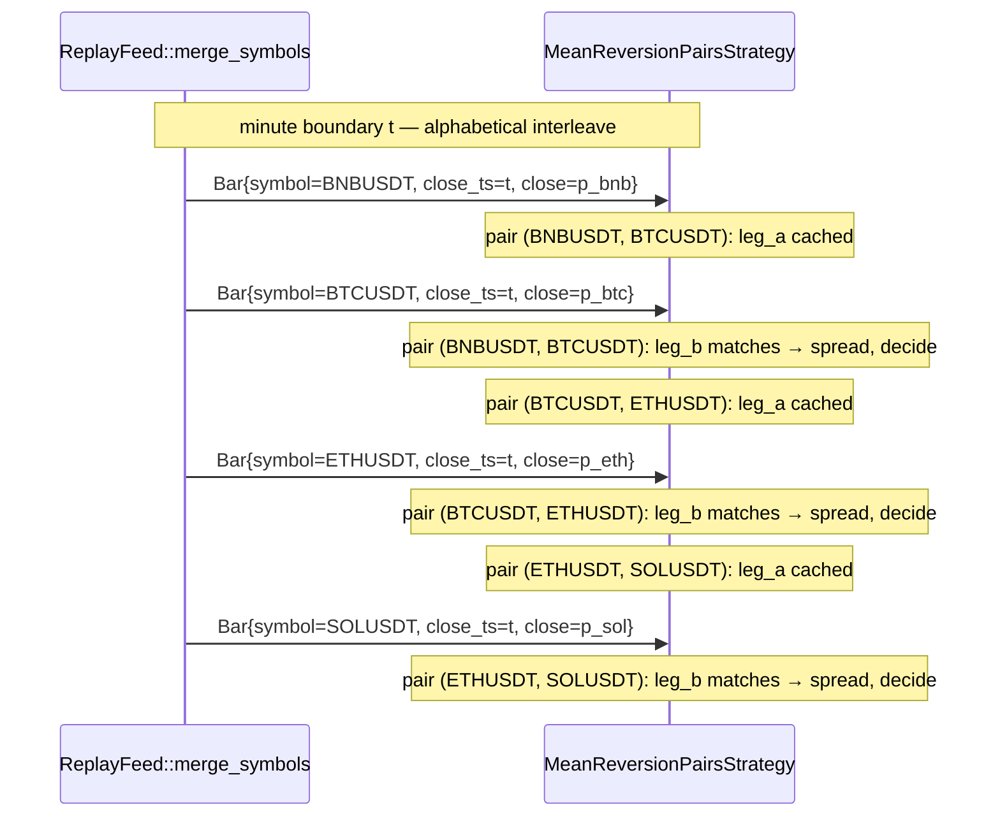

# v1.5a — Mean-Reversion on Z-Scored Pairs

## Why

v1.5 is the first roadmap entry that exercises **pairs / portfolio
plumbing** — see
[product.md → Strategy library — roadmap](../product.md#strategy-library--roadmap)
("Mean-reversion on z-scored pairs — Tests pairs / portfolio plumbing").
The
[product.md → Universe & data fidelity ladder](../product.md#universe--data-fidelity-ladder)
v1.5 entry is broader: "+ Stablecoin pairs (BTC/USDC, ETH/USDC), 1s
aggregated trades". On top of that the v1 architect's Q4 resolution
([architecture.md → v1 Q4 — multi-venue: single-venue (Binance) for v1](../architecture.md#v1-q4--multi-venue-single-venue-binance-for-v1))
parks Coinbase + Kraken at v1.5, and the v1 closeout deferred T612
(multi-symbol live `BinanceFeed`) to v1.5 as well
([v1-cross-sectional-momentum.md → T612 status](../v1-cross-sectional-momentum/feature.md#t612-status)).

**Scope decision: Option B — split.** This brief (`v15a`) covers the
**mean-reversion pairs strategy on the existing Binance USDT universe
only**. A sibling brief `v15b-multi-venue-live-ingest` is queued for
the multi-venue work (Coinbase + Kraken adapters, T612 multi-symbol
live `BinanceFeed`, USDC pairs, 1s aggregated trades) and will follow
after architect signoff on the split. Justification: the **strategy
edge claim is independent of venue diversity**. Bundling them couples
two scopes that can each fail independently — a pairs-strategy Sharpe
miss should not block multi-venue infra delivery, and a
Coinbase-adapter reconnect bug should not block a pairs-strategy
backtest. Splitting also lets the pairs strategy ship first and prove
edge before the team commits multi-venue engineering. The moat bet —
[persistent memory + double-entry audit](../product.md#differentiator)
— pays off on this slice the moment `pnl_by_pair` lands: lesson cards
can finally key on a relationship between two symbols rather than a
single asset, which is the first time the audit ledger expresses a
**relative-value** P&L attribution. The split is the analyst's pick;
**architect can override** to a single combined `v15-mean-reversion-pairs`
brief, but the analyst's prior is that pairs strategy + multi-venue
infra is too much surface for one feature.

**Spot-only formulation: pick C — long-flat per-leg with the spread /
z-score machinery shipped.** Pure long-short pairs trading requires
shorting the outperformer; spot crypto cannot natively short. The
analyst considered three spot-feasible formulations (call them A, B,
C in the analyst's notes; the brief keeps the same letters):

- **A. Long-flat single-symbol z-score mean-reversion** — treat each
  symbol independently; long when its own z-score < -2σ, flat when it
  reverts. No "pair" in the trading sense; this is just per-symbol
  mean-reversion and the spread machinery is wasted.
- **B. Long-only pair switching** — within a pair, hold the
  underperformer and rotate when the spread reverts. Capital sits in
  one of the two legs (or in cash on warmup); rotation is the trade.
  Genuinely "pairs" in spirit; spot-only feasible. Ships the
  spread / z-score machinery and exercises it from the executor.
- **C. Spread / z-score machinery + signals only; long-only execution
  per (B)** — this is what v1.5a actually ships. The strategy
  computes `log(price_a) - β·log(price_b)`, rolls the z-score, fires
  signals on entry / exit thresholds, and **executes long-only via
  formulation (B) — hold the leg whose z-score side says "underperformer"
  and rotate on revert.** True long-short pair execution waits for
  v2 (perp shorting) per the
  [universe ladder](../product.md#universe--data-fidelity-ladder)
  v2 entry ("+ Top-25 perps (signal only, not exec)"); v1.5a
  surfaces the long-short signal in the audit ledger as observation
  only, so v2's perp executor can backfill the short leg without
  re-deriving the spread layer.

v1.5a stays inside paper-mode on real data per
[product.md → Project scope boundary](../product.md#project-scope-boundary).
v1.5a does **not** introduce LLMs (LLM lands in v2), DL forecasters,
RL, or perp-leverage. v1.5a does **not** add USDC pairs (depends on
v1.5b multi-venue ingest — USDC liquidity is concentrated on
Coinbase / Kraken; Binance has BTCUSDC/ETHUSDC but with thinner books
than USDT, and 1s aggregated-trade ingest is a v1.5b deliverable).
v1.5a does **not** add 1s aggregated trades — that is v1.5b. v1.5a
does **not** introduce `Coinbase` or `Kraken` venue adapters — that
is v1.5b. v1.5a's universe is **the same Binance USDT spot universe
as v1**, framed as **pairs** rather than ten independent symbols.
LLM cost stays at $0.00 for this feature; infra cost stays inside
the v1+ ceiling of $135-360/month per
[product.md → Cost economics](../product.md#cost-economics--monthly-ceiling).

## Requirements

Numbered, testable, derived from
[product.md → Strategy library — roadmap](../product.md#strategy-library--roadmap),
[product.md → Universe & data fidelity ladder](../product.md#universe--data-fidelity-ladder),
[architecture.md → v1 Q1–Q6 resolutions](../architecture.md#v1--cross-sectional-momentum-resolutions-q1q6--confirmed-2026-04-29),
and the v1 ship state in
[v1-cross-sectional-momentum.md → Implementation — v1 backend](../v1-cross-sectional-momentum/feature.md#implementation--v1-backend).
Each ends with a one-line **acceptance** the tester can verify. All
requirements preserve the v0 `Strategy` trait shape (no trait changes)
and the v0.5 / v1 audit / broadcast / strategies-panel surfaces (no
schema changes).

### R1 — Pair specification

- **R1.1** v1.5a universe is a **list of pairs**, where each pair is
  an ordered tuple `(symbol_a, symbol_b)` of two **distinct** symbols.
  `symbol_a` is the **target** leg (the leg actually traded long-only
  in formulation C / B); `symbol_b` is the **hedge reference**
  (the leg whose price feeds the spread but is not held in v1.5a).
- **R1.2** v1.5a pairs are **frozen for the run** at strategy load
  time, mirroring the v1 universe-freeze pattern (v1 R1.1).
  Pair-membership churn (a pair being added / removed mid-run) is
  out of scope.
- **R1.3** v1.5a default pair list — **USDT-only** because USDC pairs
  depend on v1.5b multi-venue ingest (see Notes Q5):
  ```
  [
    ("BTCUSDT", "ETHUSDT"),   # the canonical large-cap pair
    ("ETHUSDT", "SOLUSDT"),   # ETH–SOL — high correlation, different beta
    ("BNBUSDT", "BTCUSDT"),   # exchange-token vs. BTC
  ]
  ```
  Three pairs is enough to exercise the plumbing without burying
  the operator in attribution rows. `[ASSUMPTION]` — three is the
  analyst's pick; architect may pin a different count or composition
  by querying v1's `pnl_by_symbol` rows for the pair candidates with
  the highest historical realized correlation.
- **R1.4** All v1.5a pairs are **USDT-quoted spot** — settlement
  in `Money<Usdt>`, same as v1. USDC pair support
  (`("BTCUSDC", "ETHUSDC")`) is explicitly **deferred to v1.5b**
  because the
  [universe ladder](../product.md#universe--data-fidelity-ladder)
  v1.5 entry pairs USDC liquidity with multi-venue ingest, and
  ingesting only Binance USDC books would underrepresent the
  universe.
- **R1.5** Pairs are configured via TOML in the strategy config file
  ([architecture.md → Strategy registry & hot-loading](../architecture.md#strategy-registry--hot-loading))
  using the v1 hot-load surface (file watcher, debounced reload,
  atomic registry swap). New schema field:
  ```toml
  pairs = [
      { a = "BTCUSDT", b = "ETHUSDT" },
      { a = "ETHUSDT", b = "SOLUSDT" },
      { a = "BNBUSDT", b = "BTCUSDT" },
  ]
  ```
  Validation rules: `len(pairs) >= 1`, `len(pairs) <= 16`, each
  pair has `a != b`, no duplicate `(a, b)` tuples (note: `(a, b)` and
  `(b, a)` are **distinct** because `a` is the traded leg).
- **Acceptance:** loading a strategy TOML with three pairs populates
  `MeanReversionPairsStrategy.pairs` with exactly those three
  `Pair` values; loading the same file with a malformed `pairs` list
  (zero pairs, > 16 pairs, `a == b`, duplicate tuple, unknown symbol)
  returns `StrategyLoadError { error_code: "invalid_pairs" }` and
  leaves the prior strategy untouched per the v0.5 R8 / v1 R7.6
  pattern.

### R2 — Hedge ratio

- **R2.1** v1.5a uses a **fixed hedge ratio β = 1.0** for every
  pair. Spread definition:
  `spread(a, b, t) = log(price_a[t]) - β · log(price_b[t])` with
  `β = 1.0`. `[ASSUMPTION]` — proposed β = 1.0 fixed for v1.5a.
  Rationale: rolling-OLS β estimation introduces a second moving
  parameter (the regression window) that confounds the z-score
  threshold tuning, and at the pair scales we ship (large-cap vs
  large-cap) the long-run hedge ratio in log-space is close to 1
  regardless. Rolling-OLS β is queued for v1.5c+ once the v1.5a
  baseline is locked.
- **R2.2** β is a **TOML config knob** so the architect / future
  iterations can override per pair without re-shipping the strategy:
  ```toml
  pairs = [
      { a = "BTCUSDT", b = "ETHUSDT", beta = "1.0" },
      ...
  ]
  ```
  Default `beta = "1.0"` if omitted. Decimal-typed (TOML TEXT) per
  the v0 R2.2 / v1 R3.4 deny-`f64` lint.
- **R2.3** Validation: `beta > 0` (a non-positive hedge ratio is
  not a hedge). Recommend `0.1 ≤ beta ≤ 10` as a sanity range — out
  of range fails load with `invalid_beta`. Architect's call on the
  exact bounds.
- **Acceptance:** a unit test on `Pair::new` accepts `(a, b, β=1.0)`,
  `(a, b, β=0.5)`, `(a, b, β=2.0)`; rejects `β = 0`, `β = -1`,
  `β > 10` with `invalid_beta`.

### R3 — Spread + z-score

- **R3.1** Per-bar, per-pair **spread**:
  `spread(p, t) = decimal_ln(close_a[t]) - β · decimal_ln(close_b[t])`
  using the v1
  [`features::math::decimal_ln`](../v1-cross-sectional-momentum/feature.md#r3--momentum-score)
  shipped at v1 R3.5. **No new math primitives needed** — `decimal_ln`
  + `decimal_sqrt` cover everything.
- **R3.2** Per-bar, per-pair **rolling z-score** over a configurable
  `lookback_minutes` (default 60 = 1 hour):
  ```
  μ(p, t) = mean(spread(p, t-n+1) .. spread(p, t))
  σ(p, t) = std(spread(p, t-n+1) .. spread(p, t))      # vol_floor 1e-6
  z(p, t) = (spread(p, t) - μ(p, t)) / σ(p, t)
  ```
  Same `vol_floor = 1e-6` clamp pattern as v1 R3.2 to avoid
  divide-by-zero on stalled tape.
- **R3.3** New module `features::pairs` providing:
  ```rust
  pub fn spread(price_a: Decimal, price_b: Decimal, beta: Decimal)
      -> Result<Decimal, ScoreError>;
  pub fn rolling_zscore(history: &RingBuffer<Decimal>, n: u32, vol_floor: Decimal)
      -> Result<Decimal, ScoreError>;
  ```
  Reuses the v1 `RingBuffer<Decimal>` primitive (sized at construction;
  no hot-path allocation). `rolling_zscore` is generic over what's in
  the buffer — at v1.5a it is the spread series, at v2+ it could be
  any series.
- **R3.4** Score values are `Decimal` end-to-end — no `f64` per the
  v0 R2.2 deny lint, same as v1.
- **R3.5** **Determinism property:** `rolling_zscore` is a pure
  function over its inputs; given the same `RingBuffer` contents and
  `n`, returns byte-identical output across runs. Asserted by
  property test.
- **Acceptance:** a unit test on a hand-constructed 200-bar synthetic
  spread series asserts `rolling_zscore` returns the expected value
  within `Decimal::new(1, 9)` (1e-9) tolerance; a property test
  asserts that adding a constant to every `price_a` and `price_b`
  by the same multiplicative factor leaves z-score invariant
  (a translation invariance proxy, since z is scale-free).

### R4 — Entry / exit rules

- **R4.1** v1.5a is **edge-triggered** on z-score thresholds:
  - **Entry long-target** (open a long position in `symbol_a`):
    `z(p, t) <= -z_entry` (default `z_entry = 2.0`). Interpretation:
    `a` is the underperformer relative to its long-run hedge with
    `b`; mean-reversion expects `a` to recover.
  - **Exit** (flatten the long): `|z(p, t)| <= z_exit`
    (default `z_exit = 0.5`). Interpretation: spread has reverted
    to its mean ± half-σ.
  - **Cooldown**: after exit, no new entry on the same pair for
    `cooldown_minutes` (default 60). Prevents rapid-fire round-trips
    on noisy reverts.
  - **Hard stop** (formulation C signal-only): if
    `z(p, t) >= +z_stop` (default `z_stop = 4.0`) **while long**, the
    spread blew through the threshold instead of reverting; flatten
    the position and emit a `MeanReversionStop` event to the audit
    ledger (sibling to `RebalanceRejected` from
    [v1 Q6](../architecture.md#v1-q6--rebalancerejected-ledger-surface-extend-strategy_events)).
- **R4.2** TOML config (under each strategy's `[strategy.params]`):
  ```toml
  z_entry           = "2.0"
  z_exit            = "0.5"
  z_stop            = "4.0"
  lookback_minutes  = 60
  cooldown_minutes  = 60
  ```
  Validation: `z_entry > z_exit > 0`, `z_stop > z_entry`,
  `lookback_minutes >= 2`, `cooldown_minutes >= 0`.
- **R4.3** `[ASSUMPTION]` — the entry / exit threshold defaults
  (`2.0` / `0.5` / `4.0`) are the analyst's pick from canonical
  Avellaneda-Lee statistical-arbitrage literature
  ([Avellaneda & Lee 2010, "Statistical Arbitrage in the U.S.
  Equities Market", Quantitative Finance 10(7)](https://doi.org/10.1080/14697680903124632)).
  Crypto regime-shift caveat: pair correlations decay rapidly during
  market-wide stress events (March 2020 BTC-equity decoupling reversal,
  May 2021 Bitcoin-altcoin re-correlation under FUD, Nov 2022 FTX
  contagion); v1.5a does **not** ship a regime detector — that is
  v3+ scope per the
  [product.md → DL/RL models](../product.md#dlrl-models-planned)
  ("Regime classifier: HMM or small LSTM") line. v1.5a relies on
  the OOS scenario (Scenario 2) to surface regime breaks as Sharpe
  divergence rather than as runtime intervention.
- **R4.4** Edge-triggered behavior (v0 / v0.5 / v1 precedent): the
  strategy emits a `Signal` only on the bar that crosses a threshold,
  not every bar where the condition holds. Re-entry after exit
  requires the cooldown window to expire AND the entry condition to
  be freshly true.
- **Acceptance:** a unit test feeds a synthetic z-score series
  `(-3, -2.5, -1.5, -0.4, 0.1, 0.6, 2.1, 3.0, 4.2, 4.5)` to the
  decision logic for a single pair; asserts (a) entry signal on the
  bar where z first crosses `-2`, (b) exit signal on the bar where
  z reverts inside `±0.5`, (c) `MeanReversionStop` signal on the bar
  where z first crosses `+4`, (d) cooldown blocks a second entry
  within 60 minutes of the exit.

### R5 — Spot-only execution formulation (formulation C)

- **R5.1** v1.5a executes **long-target leg only**: when the strategy
  emits an `Entry` signal for pair `(a, b)`, it places a market buy
  on `a` only. `b` is a **reference price** — its bars feed the
  spread computation but no position is opened in `b`. This is
  formulation **C** from the `## Why` section.
- **R5.2** **Sizing:** the long-leg position consumes
  `equity * exposure_cap_per_pair` of notional, where
  `exposure_cap_per_pair` is a TOML config knob (default `0.25`,
  i.e. 25% of equity per active pair position). With 3 pairs at
  default cap, max simultaneous exposure is `0.75` of equity — under
  the v1 `risk.cross_sectional.exposure_cap` total of `0.50` would
  be too tight, so v1.5a introduces (or extends) a **per-strategy
  portfolio cap** read from the existing
  [`RiskLimits.portfolio_exposure_cap`](../v1-cross-sectional-momentum/feature.md#r5--position-sizing)
  (added in v1 R5.5). Default for v1.5a: `portfolio_exposure_cap = 0.75`.
  Architect's call: same `RiskLimits` field reused, or a
  pair-specific sibling? Analyst preference: **reuse the v1 field**
  to avoid surface bloat.
- **R5.3** **Long-short signal observation (formulation C residual):**
  alongside the executed long signal on `a`, the strategy emits an
  observation-only `PairShortObservation` event to the audit ledger
  recording "would have shorted `b` with weight β · target_long_a".
  Schema: same `strategy_events` table extension pattern as v1 Q6
  RebalanceRejected — new `kind = "pair_short_observation"` with
  `error_code = "spot_only_no_short_exec"` and `error_summary`
  carrying the pair + intended notional. **No money moves.** This
  populates the audit trail v2's perp executor will consume, without
  any v1.5a money-side change.
- **R5.4** **Vector-order semantics:** v1.5a reuses the v1
  [`risk::size_portfolio_target`](../v1-cross-sectional-momentum/feature.md#vector-order-sizer-r5)
  vector-order sizer. The strategy emits a `Vec<ProposedOrder>` on
  any rebalance bar (entry / exit / stop), and the risk gate
  validates the portfolio exposure cap atomically (R5.2). Either the
  whole vector accepts, or the whole vector rejects with
  `RiskError::PortfolioExposureBreach` and the v1 `rebalance_rejected`
  ledger row is written.
- **R5.5** **No fractional rebalancing in v1.5a:** unlike v1
  cross-sectional momentum (which supports drift-threshold partial
  resizes per v1 R6.2), v1.5a positions are **binary per pair**:
  flat or full-target. No mid-position drift resizes. Simplifies the
  state machine and makes the audit trail per-pair "open / close"
  unambiguous. Drift-aware resizing is queued for v1.5c+ if the
  Sharpe story justifies the extra surface.
- **Acceptance:** an integration test runs the strategy through one
  full entry/exit cycle on a single pair `(BTCUSDT, ETHUSDT)`:
  asserts (a) one buy `Order` on `BTCUSDT` only at entry — no
  `ETHUSDT` order — (b) one
  `pair_short_observation` row in `strategy_events`, (c) one sell
  `Order` flattening the `BTCUSDT` position at exit, (d) no
  `ETHUSDT` position is ever opened, (e) the round-trip realized
  P&L appears under `assets:position:BTC` only.

### R6 — Per-pair P&L attribution

- **R6.1** New `audit::query` reader API:
  ```rust
  pub async fn pnl_by_pair(
      ledger: &Ledger,
      since:  Timestamp,
      until:  Timestamp,
  ) -> Result<Vec<(PairKey, Money<Usdt>)>, LedgerError>;
  ```
  where `PairKey` is the `(Symbol, Symbol)` tuple of `(a, b)` for
  the pair (insertion order, **not** sorted — `(BTC, ETH)` and
  `(ETH, BTC)` are distinct because the `a` leg is traded). Lives
  alongside the v1
  [`pnl_by_symbol`](../v1-cross-sectional-momentum/feature.md#r8--per-symbol-pl-attribution)
  in `crates/audit/src/query.rs`. Returns one row per pair with
  non-zero realized P&L in the window, sorted by `PairKey`
  alphabetical-on-`a`-then-`b`.
- **R6.2** **Compose-from-`pnl_by_symbol` vs. dedicated query —
  architect's call.** `[ASSUMPTION]` analyst's preference is **a
  thin compose layer** that joins `pnl_by_symbol` with the
  pair-membership map captured at strategy-load time, because (a)
  v1.5a never trades the `b` leg so the P&L genuinely lives under
  `assets:position:<a-asset>` — there is no cross-symbol allocation
  problem, (b) avoiding a dedicated `pair_id` column on `Position` /
  `journal_entries` rows preserves the v0/v0.5/v1 schemas unchanged,
  (c) v2 perp shorting will re-open this question (then the `b` leg
  has its own P&L) and is the right time to add a `pair_id` column
  if needed. So v1.5a ships **`pnl_by_pair` as a query-side join**,
  not a schema migration.
- **R6.3** **Sum-equals-scalar invariant:**
  `Σ pnl_by_pair(since, until) [for all pairs the strategy traded]`
  exactly equals `realized_pnl_since(since)` evaluated at `until`
  for the v1.5a strategy's symbols. Same property pattern as v1 R8.5.
  Verified by property test.
- **R6.4** v1.5a does **not** ship a cockpit panel for `pnl_by_pair`
  — the API is locked here so a future v1.5c / v2 cockpit work can
  add the panel without a query refactor. Same precedent as v1 R8.4.
- **R6.5** Architect's call on whether to surface `pair_id` as a
  semantic on the existing `Position` rows (a `pair_id` field on
  `Position`) or to keep pair attribution purely query-side. Analyst
  preference: **purely query-side** for v1.5a; promote to a column
  if v2 perp shorting needs it.
- **Acceptance:** at the end of the v1.5a 2023 backtest, querying
  `pnl_by_pair(2023-01-01, 2024-01-01)` returns up to 3 rows; the
  sum equals `realized_pnl_since(2023-01-01)` exactly; rows with
  zero realized P&L are omitted; rows are sorted by `(a, b)`
  alphabetically.

### R7 — Strategy plug-in

- **R7.1** v1.5a strategy ships as a fresh `Strategy` impl in
  `crates/strategy/src/pairs/mean_reversion.rs` —
  **not** as a `ComposedStrategy` recipe. Same reasoning as v1 R7.1:
  the v0.5 rule DSL is per-symbol scalar-comparison shaped, and a
  pair-spread / cross-leg z-score does not fit the grammar. v1.5a
  adds a fourth `Strategy` implementation alongside `sma_crossover`
  (v0), `ComposedStrategy` (v0.5), and `MomentumStrategy` (v1).
- **R7.2** Implementation lives in `strategy::pairs` module; the
  file `mean_reversion.rs` defines `MeanReversionPairsStrategy`
  which implements the existing v0 `Strategy` trait verbatim
  (`id`, `on_bar`, `on_tick`, `config_schema`). `on_tick` returns
  `vec![]` — pairs mean-reversion is bar-close.
- **R7.3** **Strategy-side universe filtering** (per v1 Q5
  pattern A — see
  [architecture.md → v1 Q5](../architecture.md#v1-q5--universe-filtering-strategy-side-pattern-a)).
  `MeanReversionPairsStrategy::on_bar` checks
  `bar.symbol ∈ self.universe` (the union of all `a` and `b` legs
  across all pairs) and returns `vec![]` for out-of-universe bars.
  No registry change needed; matches the v1 precedent.
- **R7.4** **Per-pair state machine.** The strategy maintains, for
  each pair: a `RingBuffer<Decimal>` of recent **spreads** sized to
  `lookback_minutes + 1`, a `last_zscore: Option<Decimal>`, a
  `position_state: enum { Flat, Long { entered_at: Timestamp,
  entry_z: Decimal, target_qty: Quantity }, Cooldown { until:
  Timestamp } }`, and the latest close prices for `a` and `b`. The
  state machine is per-pair — pairs do not interact. Both legs of a
  pair must produce a bar before the spread can be computed for
  that bar; the strategy uses the v1 multi-symbol replay's
  `(venue_ts, symbol)` interleave (see v1 R12.2) so within a single
  minute boundary, the bar that arrives second triggers the spread
  calc.
- **R7.5** **Pair bar synchronization:** because pair legs may
  share the same `venue_ts` but arrive in alphabetical order (per
  v1 R12.2 / multi-symbol interleave), the strategy waits for both
  `a` and `b` bars at the same `venue_ts` before emitting any
  signal. Concretely: cache the leg that arrives first, compute and
  decide on the leg that arrives second. **No look-ahead** —
  decisions on the bar-pair `(a@t, b@t)` use only those prices and
  history. `[ASSUMPTION]` — pair-bar synchronization is the
  analyst's preferred pattern (matches the textbook intra-bar
  pair-trading construction); architect may pick an alternative
  (e.g. one-bar lag, where decisions on `t` use prices at `t-1`)
  if the architect deems intra-bar synchronization too tight under
  feed jitter. Analyst preference: synchronize on `venue_ts`
  equality.
- **R7.6** Strategy load via TOML uses the v1 hot-load surface
  (`config/strategies/<id>.toml`, file watcher, hot-swap, content
  hash, `strategy_events` row). New TOML schema fields:
  ```toml
  id     = "pairs_mr_h1"
  kind   = "mean_reversion_pairs"             # NEW v1.5a discriminator
  stage  = "research"
  pairs = [
      { a = "BTCUSDT", b = "ETHUSDT", beta = "1.0" },
      { a = "ETHUSDT", b = "SOLUSDT", beta = "1.0" },
      { a = "BNBUSDT", b = "BTCUSDT", beta = "1.0" },
  ]
  lookback_minutes  = 60
  cooldown_minutes  = 60
  z_entry           = "2.0"
  z_exit            = "0.5"
  z_stop            = "4.0"
  vol_floor         = "0.000001"
  exposure_cap_per_pair = "0.25"
  size              = "binary_per_pair"       # NEW v1.5a sizing kind
  ```
- **R7.7** New `kind = "mean_reversion_pairs"` discriminator routes
  to a `MeanReversionPairsConfig` deserialize path (sibling to
  `CrossSectionalMomentumConfig` from v1 R7.6). Unknown kinds fail
  load with `unsupported_kind` per the v1 / v0.5 error table.
- **R7.8** Hot-swap (v0.5 R3 / v1 R7.7) works identically. Editing
  the TOML triggers debounced reload, atomic registry swap, journal
  entry to `strategy_events`, broadcast bus event. Per-pair ring
  buffers reset on swap (the new strategy re-warms from bar 0); any
  open positions persist (per v0.5 R3.3 / v1 R7.7) — the new
  strategy reconciles them on the first signal.
- **Acceptance:** loading the v1.5a TOML at agent startup populates
  the registry with one `MeanReversionPairsStrategy`; a hot-swap
  (rewriting the file with a new `z_entry`) within a replay produces
  a single `Swap` row in `strategy_events` with new content hash,
  and the next pair-bar uses the new threshold.

### R8 — Backtest scenarios

- **R8.1** **Two scenarios.** Naming follows v1 precedent
  (`top10-2023-1h-momentum` / `top10-2024-h1-momentum`):
  - `pairs-2023-zscore-mr` — in-sample on full-year 2023 data.
  - `pairs-2024-h1-zscore-mr` — out-of-sample on H1 2024.
- **R8.2** Same Binance USDT data source as v1 — uses the v1
  multi-symbol replay (`ReplayFeed::merge_symbols`,
  [v1 design — multi-symbol bar interleave](../v1-cross-sectional-momentum/feature.md#multi-symbol-bar-interleave-r2-r12))
  with the union of pair legs as the universe. For the default
  3-pair list, the universe is
  `{BTCUSDT, ETHUSDT, SOLUSDT, BNBUSDT}` (4 distinct symbols).
- **R8.3** **Hypothesis (in-sample 2023):** Sharpe in the
  **0.3 – 0.7** range is **plausibly explainable** for vol-adjusted
  pair mean-reversion on large-cap USDT spot at 1m / 60m lookback /
  `z_entry = 2.0`. This is the analyst's prior and matches the
  ballpark for cointegration-based spot-equity pair trading
  reported in [Gatev, Goetzmann, Rouwenhorst 2006, "Pairs Trading:
  Performance of a Relative-Value Arbitrage Rule"](https://academic.oup.com/rfs/article-abstract/19/3/797/1646198)
  (Sharpe ≈ 0.5 net of costs on US equities) and in crypto-native
  replications such as [Fil & Kristoufek 2020, "Pairs Trading in
  Cryptocurrency Markets"](https://doi.org/10.1109/ACCESS.2020.3023220)
  (Sharpe 0.4 – 0.9 on top-10 crypto pairs, 2017–2019). v1.5a
  acceptance does **not** require beating that — acceptance
  requires the harness to produce a **defensible number** we can
  argue with. A Sharpe in `[-0.3, 1.0]` for in-sample 2023 is the
  analyst's defensible-prior range; outside that range, recheck
  spread formula, fee model, or pair selection before celebrating
  or panicking.
- **R8.4** **Hypothesis (OOS H1 2024):** Sharpe directionally
  similar to Scenario 1. Large divergence (Scenario 1 prints `+0.5`
  and Scenario 2 prints `-0.8`, or vice versa) signals in-sample
  overfit at the threshold defaults — v1.5b / v1.5c sweeps then
  before any `paper` promotion per the
  [Strategy lifecycle gates](../product.md#strategy-lifecycle--promotion-gates)
  `research → paper` rule (Sharpe > 1.0 OOS).
- **R8.5** **Backtest report writer** is extended to surface a
  per-pair metrics section (mirrors v1's per-symbol section per
  [v1 R9.3](../v1-cross-sectional-momentum/feature.md#r9--multi-symbol-backtest-harness)):
  per-pair total return, trade count, hit rate, avg trade P&L,
  contribution to total Sharpe, average holding minutes, max
  consecutive losses. Format matches the existing report template.
- **Acceptance:** running both scenarios produces reports under
  `spec/v15a-mean-reversion-pairs/reports/backtest-<stamp>-pairs-2023-zscore-mr.md` and
  `spec/v15a-mean-reversion-pairs/reports/backtest-<stamp>-pairs-2024-h1-zscore-mr.md`
  conforming to the v0/v0.5/v1 report template plus the new
  per-pair section; both reports include metrics: Total return,
  CAGR, Sharpe, Sortino, Max drawdown, Hit rate, Turnover, Trades,
  Avg trade P&L, **per-pair metrics rows** (3 rows for default).

### R9 — Determinism

- **R9.1** Same gate as v0/v0.5/v1: report body-SHA256
  byte-identical across two runs of each v1.5a backtest at seed
  `0xC0FFEE`. Two new anchor hashes get added to the regression
  gate alongside the **7 v0/v0.5/v1 anchors**:
  | Existing anchor                            | Body SHA-256                                                       |
  |--------------------------------------------|--------------------------------------------------------------------|
  | `btc-2023-1m-sma-cross`                    | `fc2e3b4a04055e60209fe85541173aa8883df226d2756352dfd101597168649c` |
  | `btc-2023-1m-sma-baseline-refresh`         | `fc2e3b4a04055e60209fe85541173aa8883df226d2756352dfd101597168649c` |
  | `btc-2023-1m-macd-trend`                   | `ef9c5e483fa079f670a7aa15671643fce3b39a5ce35df8cb6d797887053f8805` |
  | `btc-2023-1m-rsi-reversion`                | `bc56d20d608c680e534bf6764ce8e0e568f0d4ffdf847a539c53fef65170d7aa` |
  | `btc-2023-1m-bbands-mean-revert`           | `d8a08a23d3629556c5fca39d6af89d7e0f99418e642af0b86fce22ff4d2792e3` |
  | `top10-2023-1h-momentum`                   | `3b60ef0743f006867b9e52f9de154869ee170987b27560e288b2d9597d3ecf97` |
  | `top10-2024-h1-momentum`                   | `1f33534fc7c6af1c04330564bec77aac620ecf6f1058f11ff90dfb66adcf05c6` |
  These **7 anchors must remain byte-identical** post-v1.5a — same
  regression gate as the v1 V9.
- **R9.2** Pair-bar synchronization (R7.5) is deterministic given
  the v1 `(venue_ts, symbol)` interleave: at every minute boundary
  for a 4-symbol universe, bars arrive in alphabetical order, the
  strategy caches the first leg of each pair, and emits decisions
  on the second leg's arrival. This produces a stable signal
  ordering across runs.
- **R9.3** All pair-keyed maps are `BTreeMap<PairKey, _>` (or
  similar deterministic-iteration containers) — same pattern as v1
  R12 / Q5. No `HashMap` on the hot path.
- **R9.4** Tie-breaking: when two pairs simultaneously cross their
  entry threshold on the same `venue_ts`, signal emission order is
  **`PairKey` lexicographic** — `(BNBUSDT, BTCUSDT) < (BTCUSDT,
  ETHUSDT) < (ETHUSDT, SOLUSDT)`. The risk-sizer's vector accepts
  in that order.
- **Acceptance:** two runs of `pairs-2023-zscore-mr` at seed
  `0xC0FFEE` produce reports with identical body-SHA256 (V5 below).

### R10 — Cost telemetry

- **R10.1** **LLM cost stays at $0.00.** v1.5a invokes no LLM. The
  `cost::CostSink` v0 scaffold is untouched.
- **R10.2** **Infra cost stable.** v1.5a does not add new venues
  (Coinbase / Kraken are v1.5b) and does not increase the symbol
  count over v1 (default 3 pairs use 4 distinct symbols, fewer than
  v1's 10). Hosting line stays at v1's `$40/month`, storage line at
  v1's `$15/month`. Total v1.5a monthly target: same v1 ceiling
  `$135` per
  [product.md → Cost economics](../product.md#cost-economics--monthly-ceiling).
  v1.5b will stress that ceiling (multi-venue + 1s aggregated trades);
  v1.5a does not.
- **R10.3** Performance gate: bar-close → signal stays under
  `5ms p99` per pair under the 4-symbol universe. The
  per-pair work is `O(lookback)` for the rolling z-score (60-cell
  ring iteration on a rebalance bar, ~50 µs at v1 measured
  throughput). At 3 pairs × 60-cell rings the upper bound is
  trivially inside budget.
- **Acceptance:** v1.5a backtest run's auto-generated `costs.md`
  shows `LLM tokens: $0.00`, `Total / month ≤ $135` (v1 ceiling
  preserved), with no infra / data line crossing its budget cell.

### R11 — Cockpit

- **R11.1** v1.5a is a **negative confirmation on the cockpit** —
  same pattern as v1 R11. The v0/v1 positions panel renders multiple
  rows; the strategies panel (v0.5) absorbs one new strategy row.
  Steady state for v1.5a default config: up to 3 simultaneous
  position rows (one per active pair, on the `a` leg only). No
  widget code changed.
- **R11.2** Empty / loading / error states keep working — empty
  before any pair has crossed threshold; up to 3 rows during active
  positions; error if `audit::query::position()` fails.
- **R11.3** [ASSUMPTION] zero new ui-designer work on the positions
  panel. The `MeanReversionPairsStrategy` shows up in the
  strategies panel with `id = pairs_mr_h1` and the same row layout
  as the v1 momentum strategy. **Architect may decide** to add a
  "pair" column / annotation if the operator-facing semantic that
  "this BTC long is half of the BTC-ETH pair" is worth surfacing in
  v1.5a; analyst's preference is **defer pair-aware UI to v1.5c**
  alongside the cockpit funding column already queued for v1.5+.
  See Notes Q4.
- **R11.4** Operator confirms acceptance: launch cockpit against
  the v1.5a replay driver, observe up to 3 rows during active
  positions, observe rows mutate as pairs enter/exit.
- **Acceptance:** running cockpit (`cargo run --bin cockpit
  --features fixtures`) against a v1.5a-fixtures fake bus with a
  preloaded 3-pair-1-active-position roster renders one row with
  correct P&L coloring; no widget code changed.

### R12 — Performance

- **R12.1** Per-bar work: 1 spread computation (2 `decimal_ln`
  calls + 1 multiply + 1 subtract) plus 1 ring-push, 1 z-score
  recompute (~`O(lookback)` cells). At default `lookback = 60`,
  this is well below the v1 5ms p99 budget per pair.
- **R12.2** Total per-bar fan-out at v1.5a default: 3 pairs × 4
  unique symbols means each bar triggers at most 1 pair's spread
  recomputation (the symbol's bar feeds at most 1 pair as the `a`
  leg or `b` leg; the symbol may participate in multiple pairs but
  the work per pair is constant). Worst case: a symbol that appears
  in all 3 pairs (e.g. BTCUSDT in default config — appears in pairs
  1 and 3) triggers 2 spread recomputes. Still well inside budget.
- **R12.3** Memory: 3 pairs × 60-cell `RingBuffer<Decimal>` for
  spread history + 3 small per-pair state machines = O(KiB). No
  hot-path allocation (ring buffers sized at construction, same
  v0/v0.5/v1 allocation discipline).
- **R12.4** Backtest throughput: > 100k bars/s aggregated
  (matching v1 R10.4 / V7 budget on the 4-symbol universe).
- **Acceptance:** `cargo bench -p strategy --bench
  pairs_mean_reversion` shows p99 latency < 5ms per pair-bar; the
  v1.5a multi-pair backtest meets the v1 throughput budget.

## Backtest Scenarios

Two scenarios. Scenario 1 is the v1.5a in-sample run on full-year
2023 data — the second scenario in this project where positive
Sharpe is not automatically a red flag (after v1's
`top10-2023-1h-momentum`). Scenario 2 is the v1.5a OOS baseline on
H1 2024 — establishes the v1.5a regression floor for v2+.

### Scenario: `pairs-2023-zscore-mr`

- **Pairs:**
  ```
  ("BTCUSDT", "ETHUSDT", β=1.0),
  ("ETHUSDT", "SOLUSDT", β=1.0),
  ("BNBUSDT", "BTCUSDT", β=1.0)
  ```
- **Universe (union of pair legs):**
  `{BTCUSDT, ETHUSDT, SOLUSDT, BNBUSDT}`
- **Period:** `2023-01-01` → `2023-12-31`
- **Granularity:** `1m` bars (z-score recomputed every bar; signals
  edge-triggered)
- **Data source:** `binance-spot` via
  `data/binance/{symbol}/2023/*.parquet`, one Parquet root per
  universe symbol — same surface as v1 R9
- **Fees:** `0.04%` taker, `0.02%` maker (maker unused — market
  orders only)
- **Slippage model:** `bps: 2` (per-fill against per-symbol bar
  close)
- **Initial capital:** `100_000 USDT`
- **Position sizing:** binary per pair; `exposure_cap_per_pair =
  0.25`; `portfolio_exposure_cap = 0.75` (extended from v1's `0.50`
  default — see Notes Q3); v0 per-symbol cap `0.40` still applies
  (binds because per-pair cap `0.25` < `0.40` is comfortable, but
  e.g. a single symbol appearing in two pairs at 0.25 each would
  hit `0.50 > 0.40` — analyst flag for architect: confirm
  per-symbol cap composes correctly with stacked pair exposures, or
  raise the per-symbol cap to `0.60` for v1.5a)
- **Risk limits:**
  - Max leverage: `1x` (spot, no margin)
  - Max drawdown stop: `-15%` (v0 default)
  - Per-symbol exposure cap: `40%` (v0 default — see flag above)
  - Portfolio exposure cap: `75%` (v1.5a default; up from v1's 50%)
- **Strategy params:** `pairs_mr_h1` v1.5a TOML —
  `kind = "mean_reversion_pairs"`, `lookback_minutes = 60`,
  `cooldown_minutes = 60`, `z_entry = 2.0`, `z_exit = 0.5`,
  `z_stop = 4.0`, `vol_floor = 1e-6`,
  `exposure_cap_per_pair = 0.25`, `size = "binary_per_pair"`
- **Seed:** `0xC0FFEE`
- **Baseline report:** none (in-sample run; v1.5a baseline anchor).

**Expected outcome (analyst hypothesis):** Sharpe in the
`[0.3, 0.7]` range is plausible — vol-adjusted pair mean-reversion
on large-cap USDT spot has historically printed in that range
(Gatev et al. 2006 on US equities, Fil & Kristoufek 2020 on crypto
pairs). v1.5a acceptance does **not** require beating that — it
requires a defensible number. A Sharpe in `[-0.3, 1.0]` is the
analyst's defensible-prior range. Outside that range is a signal to
recheck spread formula, fee model, pair correlation in the test
window (2023 was a recovery year — pairs may have re-coupled
asymmetrically), or threshold defaults before promoting any
conclusion.

### Scenario: `pairs-2024-h1-zscore-mr`

- **Pairs / Universe:** identical to Scenario 1.
- **Period:** `2024-01-01` → `2024-06-30`
- **Granularity:** `1m` bars
- **Data source:** `binance-spot` via
  `data/binance/{symbol}/2024/*.parquet`
- **Fees / Slippage / Initial capital / Position sizing / Risk
  limits / Strategy params:** identical to Scenario 1.
- **Seed:** `0xC0FFEE`
- **Baseline report:** Scenario 1's
  `spec/v15a-mean-reversion-pairs/reports/backtest-<stamp>-pairs-2023-zscore-mr.md`.

**Expected outcome (analyst hypothesis):** This is the v1.5a
**out-of-sample baseline**. Directionally similar to Scenario 1.
Large divergence (Scenario 1 prints `+0.5` and Scenario 2 prints
`-0.8`, or vice versa) is a strong signal of in-sample overfit at
the `z_entry = 2.0` / `lookback_minutes = 60` choice. Q1 2024 was
the BTC ETF launch / rally; pair correlations may have shifted
asymmetrically, so a regime-driven Sharpe miss is **expected** and
not a defect of the strategy plumbing. v1.5a stays in `research`
stage at close — promotion to `paper` is the analyst's next loop
contingent on Scenario 2's metrics. v1.5a itself ships when the
verification gates pass; the Sharpe number is a result, not a gate.

## Design

Translates R1–R12 into crate / module additions, Rust types, TOML
schema, new audit surfaces, and test strategy. All decisions anchor
to [architecture.md → v1.5a mean-reversion pairs resolutions
(Q1–Q10)](../architecture.md#v15a--mean-reversion-pairs-resolutions-q1q10--confirmed-2026-04-30)
and the v1 Design section in
[v1-cross-sectional-momentum.md → Design](../v1-cross-sectional-momentum/feature.md#design).
This section is **strategy + spread/z-score primitives + per-pair
P&L attribution + observation-only short signal**; v0 / v0.5 / v1
crate surfaces stay untouched except for additive extensions.

### Crate map delta from v1

| Crate          | Change in v1.5a                                                                                                                                                                                                                              |
|----------------|----------------------------------------------------------------------------------------------------------------------------------------------------------------------------------------------------------------------------------------------|
| `trading_core` | **+** `Pair`, `PairKey`, `PairMembership` types in `crates/core/src/pair.rs`. **+** `StrategyEventKind::MeanReversionStop` + `::PairShortObservation` variants. **No `Strategy` trait change. No `RiskLimits` change.**                       |
| `features`     | **+** New submodule `features::pairs` with `spread(price_a, price_b, beta)` and `rolling_zscore(history, n, vol_floor)`. Reuses v1 `features::math::decimal_ln` / `decimal_sqrt` and the v0.5 `RingBuffer<Decimal>`. No new dependencies. |
| `strategy`     | **+** New submodule `strategy::pairs` with `mean_reversion.rs` (`MeanReversionPairsStrategy`), `pair_state.rs` (per-pair state machine + sync slot), `config.rs` (`MeanReversionPairsConfig` TOML serde + validation), `mod.rs`. **No registry change** (Q5 strategy-side filtering reused). |
| `risk`         | **Unchanged.** v1's `size_portfolio_target` + `RiskLimits.portfolio_exposure_cap` cover v1.5a's vector-order shape. The v1.5a TOML lifts `portfolio_exposure_cap` from `0.50` to `0.75`; the Rust default stays `0.50`.                       |
| `audit`        | **+** `audit::journal::mean_reversion_stop(..)` writer (Q8). **+** `audit::journal::pair_short_observation(..)` writer (Q8). **+** `audit::query::pnl_by_pair(..)` reader (Q4 — composes `pnl_by_symbol`). **No SQL migration.**            |
| `data`         | **Unchanged.** v1's `ReplayFeed::merge_symbols` already provides the `(venue_ts ASC, symbol ASC)` interleave that v1.5a's pair-bar sync requires.                                                                                            |
| `agent`        | **Unchanged.** No new bus channels — `pair_short_observation` and `mean_reversion_stop` flow through `audit::journal` directly. The v0.5 `strategy_events` channel surfaces them to the cockpit if needed (no UI change in v1.5a).            |
| `backtest`     | **+** New `--scenario pairs-2023-zscore-mr` and `--scenario pairs-2024-h1-zscore-mr` wiring. **+** Report writer per-pair metrics section (R8.5).                                                                                            |
| `ui`           | Unchanged — R11 is a negative confirmation. Strategies panel absorbs one new row (`pairs_mr_h1`); positions panel renders up to 3 long-leg position rows. Pair-aware UI deferred to v1.5c.                                                  |
| `cost`, `exec`, `models`, `llm` | Unchanged. v1.5a invokes no LLM; cost stays at $0.00.                                                                                                                                                                       |

**Dependency edges (additive):**

```
trading_core ← strategy::pairs, audit (mean_reversion_stop / pair_short_observation),
               features::pairs (Pair / PairKey signatures)
features     ← strategy::pairs (spread + zscore call sites)
audit        ← strategy::pairs is upstream-of-call (writers invoked from agent)
```

No new crate is introduced. No edge reverses. The v0/v0.5/v1 audit /
broadcast / strategies-panel surfaces are unchanged.

### Pair types (R1, R2)

```rust
// crates/core/src/pair.rs (new)
use rust_decimal::Decimal;
use serde::{Deserialize, Serialize};

/// Ordered pair key — `(a, b)` is distinct from `(b, a)` because the
/// `a` leg is the traded long-only leg in v1.5a.
#[derive(Debug, Clone, PartialEq, Eq, PartialOrd, Ord, Hash, Serialize, Deserialize)]
pub struct PairKey {
    pub a: Symbol,
    pub b: Symbol,
}

impl PairKey {
    pub fn new(a: Symbol, b: Symbol) -> Result<Self, PairError> {
        if a == b { return Err(PairError::DegeneratePair); }
        Ok(Self { a, b })
    }
}

/// Configured pair: (a, b, β). β > 0 (validated at config load).
#[derive(Debug, Clone, PartialEq, Eq, Serialize, Deserialize)]
pub struct Pair {
    pub key:  PairKey,
    pub beta: Decimal,        // R2.1 — fixed per pair, default 1.0
}

impl Pair {
    pub fn new(a: Symbol, b: Symbol, beta: Decimal) -> Result<Self, PairError> {
        let key = PairKey::new(a, b)?;
        if beta <= Decimal::ZERO {
            return Err(PairError::InvalidBeta { beta });
        }
        if beta < Decimal::new(1, 1) || beta > Decimal::TEN {
            // Sanity range 0.1 ≤ β ≤ 10 (R2.3). Architect's call.
            return Err(PairError::BetaOutOfRange { beta });
        }
        Ok(Self { key, beta })
    }
}

/// Membership row used by `audit::query::pnl_by_pair` to project
/// per-asset P&L into per-pair rows. Captured at strategy-load time.
#[derive(Debug, Clone, PartialEq, Eq, Serialize, Deserialize)]
pub struct PairMembership {
    pub key:           PairKey,
    pub traded_asset:  Asset,         // base asset of `a` leg (e.g. BTC for BTCUSDT)
}

#[derive(Debug, thiserror::Error)]
pub enum PairError {
    #[error("pair legs must be distinct symbols")]
    DegeneratePair,
    #[error("pair beta must be positive, got {beta}")]
    InvalidBeta { beta: Decimal },
    #[error("pair beta out of range [0.1, 10.0]: {beta}")]
    BetaOutOfRange { beta: Decimal },
    #[error("unknown symbol in pair: {0}")]
    UnknownSymbol(Symbol),
    #[error("USDC pair {0:?} is unsupported in v1.5a — wait for v1.5b multi-venue")]
    UnsupportedQuote(PairKey),
    #[error("duplicate pair tuple: {0:?}")]
    DuplicatePair(PairKey),
}
```

`PairKey` ordering is lexicographic on `(a, b)` — load-bearing for
R9.4 tie-break and R12 deterministic iteration via `BTreeMap<PairKey,
_>`.

### Spread + z-score primitives (R3)

```rust
// crates/features/src/pairs.rs (new)
use rust_decimal::Decimal;
use crate::math::{decimal_ln, decimal_sqrt, MathError};
use crate::ring_buffer::RingBuffer;

#[derive(Debug, thiserror::Error)]
pub enum PairScoreError {
    #[error("insufficient history (need {need}, have {have})")]
    InsufficientHistory { need: usize, have: usize },
    #[error("math error: {0}")]
    Math(#[from] MathError),
    #[error("zero or non-positive price")]
    NonPositivePrice,
}

/// Per-bar spread: log(price_a) - β · log(price_b).
/// Reuses v1 `features::math::decimal_ln` (10 dp precision, deterministic).
pub fn spread(
    price_a: Decimal,
    price_b: Decimal,
    beta:    Decimal,
) -> Result<Decimal, PairScoreError> {
    if price_a <= Decimal::ZERO || price_b <= Decimal::ZERO {
        return Err(PairScoreError::NonPositivePrice);
    }
    let ln_a = decimal_ln(price_a)?;
    let ln_b = decimal_ln(price_b)?;
    Ok(ln_a - beta * ln_b)
}

/// Rolling z-score over the last `n` cells of `history`.
/// `vol_floor` clamps σ at `1e-6` to avoid divide-by-zero on
/// stalled tape (matches v1 R3.2 pattern).
///
/// Generic over what's in the buffer — at v1.5a it is the spread
/// series; at v2+ it could be any series. Same `decimal_std` helper
/// the v1 score module uses.
pub fn rolling_zscore(
    history:   &RingBuffer<Decimal>,
    n:         u32,
    vol_floor: Decimal,
) -> Result<Decimal, PairScoreError> {
    let need = n as usize;
    if history.len() < need {
        return Err(PairScoreError::InsufficientHistory {
            need,
            have: history.len(),
        });
    }
    let last = history.last().ok_or(PairScoreError::InsufficientHistory {
        need,
        have: 0,
    })?;
    // μ over the last n cells.
    let sum: Decimal = (0..need)
        .map(|i| history.get_back(i).unwrap_or(Decimal::ZERO))
        .sum();
    let mean = sum / Decimal::from(n);
    // σ over the last n cells, then clamp.
    let var: Decimal = (0..need)
        .map(|i| {
            let v = history.get_back(i).unwrap_or(Decimal::ZERO);
            let d = v - mean;
            d * d
        })
        .sum::<Decimal>() / Decimal::from(n);
    let std = decimal_sqrt(var)?.max(vol_floor);
    Ok((last - mean) / std)
}
```

**Determinism property** (R3.5): both functions are pure over their
inputs. Given the same `RingBuffer` cells, `n`, and `vol_floor`,
they return byte-identical output across runs. Asserted by a property
test in `crates/features/tests/pairs_zscore.rs`.

**Translation invariance proxy** (R3 acceptance): scaling both
`price_a` and `price_b` by the same multiplicative factor `k` shifts
both `ln_a` and `ln_b` by `ln(k)`. The spread becomes
`(ln_a + ln_k) - β(ln_b + ln_k) = spread + ln_k(1 - β)`. At β = 1 the
spread is invariant; at β ≠ 1 it shifts by a constant. The z-score
of a constant-shifted series is invariant (mean shifts by the same
constant, σ is unchanged). Verified by proptest.

### `MeanReversionPairsStrategy` (R7, R4, R5)

```rust
// crates/strategy/src/pairs/mean_reversion.rs (new)
use trading_core::{
    Bar, Decimal, Pair, PairKey, Signal, Strategy, StrategyId,
    Symbol, Tick, Timestamp,
};
use std::collections::{BTreeMap, BTreeSet};
use crate::pairs::pair_state::{PairState, SyncSlot, PositionState};

pub struct MeanReversionPairsStrategy {
    id:                   StrategyId,
    pairs:                Vec<Pair>,                   // R1, frozen at load
    universe:             BTreeSet<Symbol>,            // union of a + b legs
    pair_membership:      Vec<PairMembership>,         // captured for pnl_by_pair (Q4)

    lookback_minutes:     u32,                          // R3.2 default 60
    cooldown_minutes:     u32,                          // R4.1 default 60
    z_entry:              Decimal,                      // R4.1 default 2.0
    z_exit:               Decimal,                      // R4.1 default 0.5
    z_stop:               Decimal,                      // R4.1 default 4.0
    vol_floor:            Decimal,                      // R3.2 default 1e-6
    exposure_cap_per_pair: Decimal,                     // R5.2 default 0.25
    max_staleness_minutes: u32,                          // Q10 default 5

    /// Per-pair state — keyed by `PairKey` for deterministic iteration.
    states:               BTreeMap<PairKey, PairState>,

    hash:                 [u8; 32],                     // sha256 of canonical config
    source_path:          SmolStr,
}

impl Strategy for MeanReversionPairsStrategy {
    fn id(&self) -> StrategyId { self.id.clone() }

    fn on_bar(&mut self, bar: &Bar) -> Vec<Signal> {
        // Q5 strategy-side filter — out-of-universe bars are no-ops.
        if !self.universe.contains(&bar.symbol) {
            return Vec::new();
        }

        // For every pair this bar's symbol is part of (as a or b),
        // update the per-pair sync slot and decide on completion.
        let mut signals = Vec::new();
        // Iterate pairs in BTreeMap order (alphabetical PairKey) for
        // deterministic signal-emission ordering (R9.3, R9.4).
        let pair_keys: Vec<PairKey> = self.states.keys().cloned().collect();
        for key in &pair_keys {
            let pair = self.find_pair(key).expect("pair must exist");
            let role = if bar.symbol == key.a { Some(LegRole::A) }
                       else if bar.symbol == key.b { Some(LegRole::B) }
                       else { None };
            let Some(role) = role else { continue; };

            // Update sync slot for this leg.
            let state = self.states.get_mut(key).expect("state");
            let pair_signals = state.observe_leg(
                role,
                bar,
                pair.beta,
                self.lookback_minutes,
                self.cooldown_minutes,
                self.z_entry,
                self.z_exit,
                self.z_stop,
                self.vol_floor,
                self.exposure_cap_per_pair,
                self.max_staleness_minutes,
                self.id.clone(),
                key.clone(),
            );
            signals.extend(pair_signals);
        }
        signals
    }

    fn on_tick(&mut self, _tick: &Tick) -> Vec<Signal> { Vec::new() }

    fn config_schema() -> serde_json::Value where Self: Sized {
        MeanReversionPairsConfig::json_schema()
    }
}

impl MeanReversionPairsStrategy {
    /// Inherent — registry does not consume (Q5 / R7.3). Used by
    /// audit::query::pnl_by_pair (Q4) and operator-success-report
    /// introspection.
    pub fn pair_membership(&self) -> &[PairMembership] {
        &self.pair_membership
    }

    fn find_pair(&self, key: &PairKey) -> Option<&Pair> {
        self.pairs.iter().find(|p| &p.key == key)
    }
}
```

**Per-pair state machine** (R7.4):

```rust
// crates/strategy/src/pairs/pair_state.rs (new)
use trading_core::{Bar, Decimal, PairKey, Quantity, Signal, StrategyId,
                   Symbol, Timestamp};
use crate::ring_buffer::RingBuffer;
use features::pairs::{spread, rolling_zscore};

#[derive(Debug, Clone, Copy)]
pub enum LegRole { A, B }

/// Caches the bar that arrived first in a `venue_ts` boundary.
/// When the partner arrives, computes spread and decides.
#[derive(Debug, Clone, Default)]
pub struct SyncSlot {
    leg_a: Option<(Timestamp, Decimal)>,    // (venue_ts, close)
    leg_b: Option<(Timestamp, Decimal)>,
}

impl SyncSlot {
    /// Returns Some((close_a, close_b, ts)) iff both legs are present
    /// at the same `venue_ts` AND neither is older than the staleness
    /// clamp. Otherwise None and (Q10) drops a stale cached leg.
    pub fn try_pair(
        &mut self,
        now: Timestamp,
        max_staleness_minutes: u32,
    ) -> Option<(Decimal, Decimal, Timestamp)> {
        // Drop any leg older than the staleness clamp.
        let max_lag = i64::from(max_staleness_minutes);
        if let Some((ts_a, _)) = self.leg_a {
            if now.minutes_since(ts_a) > max_lag { self.leg_a = None; }
        }
        if let Some((ts_b, _)) = self.leg_b {
            if now.minutes_since(ts_b) > max_lag { self.leg_b = None; }
        }
        match (self.leg_a, self.leg_b) {
            (Some((ts_a, ca)), Some((ts_b, cb))) if ts_a == ts_b => {
                // Consume on success — next pair tick starts fresh.
                self.leg_a = None;
                self.leg_b = None;
                Some((ca, cb, ts_a))
            }
            _ => None,
        }
    }
}

#[derive(Debug, Clone)]
pub enum PositionState {
    Flat,
    Long { entered_at: Timestamp, entry_z: Decimal, target_qty: Quantity },
    Cooldown { until: Timestamp },
}

#[derive(Debug)]
pub struct PairState {
    pub sync:           SyncSlot,
    pub spreads:        RingBuffer<Decimal>,    // size = lookback_minutes + 1
    pub last_zscore:    Option<Decimal>,
    pub position:       PositionState,
    pub last_close_a:   Option<Decimal>,
    pub last_close_b:   Option<Decimal>,
}

impl PairState {
    /// Update the sync slot with this leg's bar; if the partner is
    /// already present at the same venue_ts, compute spread + decide.
    /// Returns the Vec<Signal> to emit (may be empty).
    #[allow(clippy::too_many_arguments)]
    pub fn observe_leg(
        &mut self,
        role:                  LegRole,
        bar:                   &Bar,
        beta:                  Decimal,
        lookback_minutes:      u32,
        cooldown_minutes:      u32,
        z_entry:               Decimal,
        z_exit:                Decimal,
        z_stop:                Decimal,
        vol_floor:             Decimal,
        exposure_cap_per_pair: Decimal,
        max_staleness_minutes: u32,
        strategy_id:           StrategyId,
        pair_key:              PairKey,
    ) -> Vec<Signal> {
        // 1. Cache this leg.
        let close = bar.close.get();
        match role {
            LegRole::A => self.sync.leg_a = Some((bar.close_ts, close)),
            LegRole::B => self.sync.leg_b = Some((bar.close_ts, close)),
        }

        // 2. Try to complete the pair tick.
        let Some((ca, cb, ts)) = self.sync.try_pair(bar.close_ts, max_staleness_minutes)
            else { return Vec::new(); };

        // 3. Compute spread; push into history.
        let s = match spread(ca, cb, beta) {
            Ok(v) => v,
            Err(_) => return Vec::new(),  // non-positive price, skip
        };
        self.spreads.push(s);
        self.last_close_a = Some(ca);
        self.last_close_b = Some(cb);

        // 4. Compute z-score (warmup gate).
        let z = match rolling_zscore(&self.spreads, lookback_minutes, vol_floor) {
            Ok(v) => v,
            Err(_) => return Vec::new(),  // warmup
        };
        let prev_z = self.last_zscore.replace(z);

        // 5. Decide.
        decide(
            self,
            prev_z, z, ts,
            cooldown_minutes,
            z_entry, z_exit, z_stop,
            exposure_cap_per_pair,
            strategy_id,
            pair_key,
        )
    }
}

/// Edge-triggered decision logic (R4.4). Called only on the bar that
/// completes a pair tick (both legs present at the same venue_ts).
fn decide(
    st:                    &mut PairState,
    prev_z:                Option<Decimal>,
    z:                     Decimal,
    ts:                    Timestamp,
    cooldown_minutes:      u32,
    z_entry:               Decimal,
    z_exit:                Decimal,
    z_stop:                Decimal,
    exposure_cap_per_pair: Decimal,
    strategy_id:           StrategyId,
    pair_key:              PairKey,
) -> Vec<Signal> {
    use PositionState::*;
    let neg_z_entry = -z_entry;

    // R4.1 hard-stop while long: z >= z_stop.
    if let Long { .. } = st.position {
        if z >= z_stop {
            // Emit close signal + MeanReversionStop ledger event.
            let signals = vec![
                Signal::ClosePair { pair_key: pair_key.clone(), reason: StopReason::HardStop { z_at_stop: z }, ts },
            ];
            st.position = Cooldown { until: ts.plus_minutes(cooldown_minutes) };
            return signals;
        }
        // R4.1 normal exit: |z| <= z_exit (revert).
        if z.abs() <= z_exit {
            let signals = vec![
                Signal::ClosePair { pair_key: pair_key.clone(), reason: StopReason::Reversion { z_at_exit: z }, ts },
            ];
            st.position = Cooldown { until: ts.plus_minutes(cooldown_minutes) };
            return signals;
        }
        return Vec::new();
    }

    if let Cooldown { until } = st.position {
        if ts >= until { st.position = Flat; }
        else { return Vec::new(); }
    }

    // R4.1 entry: z crosses below -z_entry edge-triggered.
    let crossed_entry = match prev_z {
        Some(p) => p > neg_z_entry && z <= neg_z_entry,
        None    => z <= neg_z_entry,    // first warmed bar already in entry zone
    };
    if crossed_entry {
        // Emit OpenLong on a-leg + PairShortObservation on b-leg (Q3 / Q8).
        let signals = vec![
            Signal::OpenPairLong {
                pair_key:    pair_key.clone(),
                entry_z:     z,
                weight:      exposure_cap_per_pair,
                ts,
            },
            Signal::PairShortObservation {
                pair_key,
                z_at_signal: z,
                ts,
            },
        ];
        st.position = Long {
            entered_at: ts,
            entry_z:    z,
            target_qty: Quantity::ZERO,    // sizer resolves at risk gate
        };
        return signals;
    }
    Vec::new()
}
```

**`Signal` shape:** the v0/v0.5/v1 `Signal` enum extends with three
new variants additively (no breaking change to existing handlers):

```rust
// crates/core/src/signal.rs (extend)
pub enum Signal {
    // … existing v0/v0.5/v1 variants …
    OpenPairLong {
        pair_key: PairKey,
        entry_z:  Decimal,
        weight:   Decimal,        // fraction of equity
        ts:       Timestamp,
    },
    ClosePair {
        pair_key: PairKey,
        reason:   StopReason,
        ts:       Timestamp,
    },
    /// v1.5a formulation-C residual — observation-only, no Order
    /// constructed. Audit ledger captures the would-have-shorted
    /// `b` leg via `audit::journal::pair_short_observation`.
    PairShortObservation {
        pair_key:    PairKey,
        z_at_signal: Decimal,
        ts:          Timestamp,
    },
}

pub enum StopReason {
    Reversion { z_at_exit: Decimal },     // |z| <= z_exit
    HardStop  { z_at_stop: Decimal },     // z >= z_stop
}
```

**Allocation discipline** (matches v0/v0.5/v1): per-pair `RingBuffer`
sized at construction (`lookback_minutes + 1`); `on_bar` performs no
heap allocation on warmup-only or sync-incomplete bars. At a complete
pair tick, allocates at most 2 `Signal`s (close + MR stop, or open +
short observation). Worst-case allocation on a single bar: a symbol
participating in N pairs contributes 2N signals — bounded by the
configured pair count (≤ 16 per R1.5).

### TOML schema for v1.5a strategy config (R7.6)

```toml
# config/strategies/pairs_mr_h1.toml
id     = "pairs_mr_h1"                          # MUST equal filename stem
kind   = "mean_reversion_pairs"                 # NEW v1.5a discriminator
stage  = "research"                              # research | paper

# v1.5a pair list — 1..=16 pairs; (a, b) tuples; a ≠ b; no duplicate (a, b).
# β default 1.0; per-pair override (R2.2). USDC pairs rejected at load
# (Q5; v1.5b unblocks).
pairs = [
    { a = "BTCUSDT", b = "ETHUSDT", beta = "1.0" },
    { a = "ETHUSDT", b = "SOLUSDT", beta = "1.0" },
    { a = "BNBUSDT", b = "BTCUSDT", beta = "1.0" },
]

# Spread / z-score knobs (R3, R4).
lookback_minutes      = 60
cooldown_minutes      = 60
z_entry               = "2.0"                   # Decimal as TEXT — R3.4 no f64
z_exit                = "0.5"
z_stop                = "4.0"
vol_floor             = "0.000001"

# Sizing (R5).
size                  = "binary_per_pair"       # NEW v1.5a sizing kind
exposure_cap_per_pair = "0.25"                   # per-pair fraction of equity

# Pair-bar sync (Q10).
max_staleness_minutes = 5

# NOTE: portfolio_exposure_cap is in `risk.cross_sectional` (or the
# top-level `risk.portfolio_exposure_cap`), not in this strategy file.
# The v1.5a default is `0.75` (lifted from v1's `0.50`); the operator
# sets it in `config/agent.toml` per the v1 R5.5 surface.
```

**Serde struct** (in `strategy::pairs::config`):

```rust
#[derive(Debug, Deserialize)]
#[serde(deny_unknown_fields)]
pub struct MeanReversionPairsConfig {
    pub id:    SmolStr,
    pub kind:  StrategyKind,                 // = MeanReversionPairs
    pub stage: Stage,
    pub pairs: Vec<PairConfig>,              // 1..=16
    pub lookback_minutes:      u32,           // ≥ 2
    pub cooldown_minutes:      u32,           // ≥ 0
    pub z_entry:               Decimal,       // > z_exit
    pub z_exit:                Decimal,       // > 0
    pub z_stop:                Decimal,       // > z_entry
    #[serde(default = "default_vol_floor")]
    pub vol_floor:             Decimal,
    pub size:                  SizingKind,    // = BinaryPerPair
    pub exposure_cap_per_pair: Decimal,       // (0, 1]
    #[serde(default = "default_max_staleness")]
    pub max_staleness_minutes: u32,           // ≥ 1
}

#[derive(Debug, Deserialize)]
pub struct PairConfig {
    pub a:    SmolStr,
    pub b:    SmolStr,
    #[serde(default = "default_beta")]
    pub beta: Decimal,
}
```

**Validation rules** (typecheck path, mirrors v1 / v0.5 error-code
pattern):

| code                          | cause                                                                    |
|-------------------------------|--------------------------------------------------------------------------|
| `invalid_pairs`               | `< 1` pairs, `> 16` pairs, `a == b`, duplicate `(a, b)` tuple            |
| `unknown_symbol`              | symbol not present in `MarketDataSource::exchange_info`                  |
| `invalid_beta`                | `beta <= 0` or out of `[0.1, 10.0]` range                                |
| `unsupported_quote`           | USDC pair detected — wait for v1.5b multi-venue (Q5)                      |
| `invalid_lookback`            | `lookback_minutes < 2`                                                   |
| `invalid_cooldown`            | `cooldown_minutes < 0` (parser-impossible; structural for completeness)  |
| `invalid_z_thresholds`        | `z_entry <= z_exit` or `z_stop <= z_entry` or `z_exit <= 0`              |
| `invalid_exposure_cap`        | `exposure_cap_per_pair` not in `(0, 1]`                                  |
| `invalid_staleness`           | `max_staleness_minutes < 1`                                              |
| `unsupported_sizing`          | `size` not in `{ "binary_per_pair" }` for v1.5a                           |
| `unsupported_kind`            | `kind` not in supported set (additive to v1 error table)                  |

Errors flow through the same `StrategyLoadError` (v0.5 R2.5) +
`strategy_events.kind = "Reject"` path. **No new error-handling
plumbing.**

**Hot-swap** (R7.8): identical to v0.5 / v1 — file watcher reloads,
parses, typechecks, constructs a new `MeanReversionPairsStrategy`,
swaps atomically. The `strategy_events` table records the swap with
the new content hash. Per-pair ring buffers reset on swap (the new
strategy re-warms from bar 0). Open positions persist (v0.5 R3.3).

### Spot-only formulation C wiring (R5, Q3)

The `agent` orchestrator's strategy-driver loop has the same shape as
v1 but routes the new `Signal` variants:

```rust
// pseudocode in agent::strategy_driver
for sig in strategy.on_bar(&bar) {
    match sig {
        Signal::OpenPairLong { pair_key, entry_z, weight, ts } => {
            // Construct vector-order target: long-leg `a` only.
            let target = BTreeMap::from([(pair_key.a.clone(), weight)]);
            let orders = risk::size_portfolio_target(
                strategy.id(), &target, equity, &book,
                drift_threshold, &risk_limits,
            )?;
            for ord in orders { exec.submit(ord).await; }
            // No Order on `b` — Q3 formulation C.
        }
        Signal::PairShortObservation { pair_key, z_at_signal, ts } => {
            // Q8 — observation-only audit event, no money moves.
            let intended_notional = equity * weight_for(pair_key.clone()) * beta_for(pair_key.clone());
            audit::journal::pair_short_observation(
                &ledger, strategy.id(), pair_key, intended_notional,
                z_at_signal, ts,
            ).await?;
        }
        Signal::ClosePair { pair_key, reason, ts } => {
            // Construct vector-order target: weight 0 on the a-leg → close.
            let target = BTreeMap::from([(pair_key.a.clone(), Decimal::ZERO)]);
            let orders = risk::size_portfolio_target(...)?;
            for ord in orders { exec.submit(ord).await; }
            if let StopReason::HardStop { z_at_stop } = reason {
                audit::journal::mean_reversion_stop(
                    &ledger, strategy.id(), pair_key, z_at_stop, ts,
                ).await?;
            }
        }
        // existing v0/v0.5/v1 Signal variants unchanged
    }
}
```

**Key invariants:**

- Long-leg-only execution (R5.1): `Order` rows ever constructed have
  `symbol == pair_key.a` for v1.5a-emitted vectors. Verified by an
  integration test (R5 acceptance).
- Observation-only short (R5.3): every entry that emits
  `OpenPairLong` also emits a sibling `PairShortObservation`; both
  share the same `ts`. Verified by the same integration test.
- Reconciliation invariant unchanged: `pair_short_observation` and
  `mean_reversion_stop` rows live in `strategy_events`, not
  `journal_entries`; `Σ debits == Σ credits` is unaffected.

### `pnl_by_pair` reader (R6, Q4)

```rust
// crates/audit/src/query.rs (extend)
use trading_core::{Money, PairKey, PairMembership, Symbol, Timestamp, Usdt};

pub async fn pnl_by_pair(
    ledger:           &Ledger,
    pair_membership:  &[PairMembership],
    since:            Timestamp,
    until:            Timestamp,
) -> Result<Vec<(PairKey, Money<Usdt>)>, LedgerError> {
    // 1. One scan: per-symbol P&L over the window.
    let per_symbol: Vec<(Symbol, Money<Usdt>)> =
        pnl_by_symbol(ledger, since, until).await?;
    let by_asset: BTreeMap<Asset, Money<Usdt>> = per_symbol
        .into_iter()
        .map(|(s, m)| (asset_of(&s), m))
        .collect();

    // 2. Project per-asset P&L onto pair rows. Because v1.5a never
    //    trades the `b` leg, pnl_by_pair[(a, b)] == pnl_by_symbol[a].
    let mut rows: Vec<(PairKey, Money<Usdt>)> = pair_membership
        .iter()
        .filter_map(|m| {
            by_asset.get(&m.traded_asset).map(|v| (m.key.clone(), *v))
        })
        .filter(|(_, v)| !v.is_zero())
        .collect();

    // 3. Lex-sort by PairKey for deterministic output (R6.1).
    rows.sort_by(|a, b| a.0.cmp(&b.0));
    Ok(rows)
}
```

**Sum-equals-scalar invariant** (R6.3, V4): for the v1.5a strategy
where each pair's `a` leg is unique across the pair list (R7
default config),
`Σ pnl_by_pair(membership, since, until) == Σ pnl_by_symbol(since, until)`
restricted to traded `a`-leg assets. Verified by a property test in
`crates/audit/tests/pnl_by_pair.rs` over random fill sequences across
3 pairs.

**Edge case — overlapping `a` legs:** if a future config places the
same asset as `a` in two pairs, the projection assigns the same
per-asset P&L to both pair rows (the audit ledger has only one P&L
stream per asset). The sum-equals-scalar invariant then becomes
`Σ pnl_by_pair == k · Σ pnl_by_symbol` where `k` is the multiplicity
— documented in the rustdoc and asserted by a second proptest case.
The default v1.5a config has non-overlapping `a` legs (Q9 sanity
table), so the invariant holds with `k = 1`.

### Pair-bar sync (R7.5, Q10)



**Determinism (R9.2):** the v1 `(venue_ts ASC, symbol ASC)` interleave
makes both legs of every pair surface inside the same `venue_ts`
boundary in alphabetical order. The first leg (alphabetically
smaller) populates the cache, the second leg triggers spread compute.
Across runs the order is fixed. Pair-internal signal emission order is
deterministic by `BTreeMap<PairKey, _>` iteration (R9.3).

**Max-staleness clamp (Q10):** if a leg's bar is older than
`max_staleness_minutes` (default 5) by the time its partner arrives,
the cached leg is dropped and the strategy waits for a fresh pair.
Stalls are observable via a `pair_sync_dropped_total{pair}`
Prometheus counter (additive metric, no schema change). The clamp is
operator-tunable in TOML.

**Live-paper jitter:** at 1m bars on Binance kline feeds, intra-bar
jitter is sub-bar (closes publish ~50–200ms after the minute
boundary). The 5-minute clamp is generous; in normal operation it
never fires. It's load-bearing only under feed-disconnect /
recovery scenarios.

### Performance plan (R12, V7)

Per-bar work scales **O(N_pairs)** for the sync-slot update +
spread / z-score recompute on the bar that completes a pair tick.
Rebalance work is **O(N_pairs · lookback)** amortized over the
cooldown interval (60 minutes × 3 pairs × 60 cells = 10 800 cell
touches per cooldown, negligible).

| Path                                          | Budget          | v1.5a expectation                                              |
|-----------------------------------------------|-----------------|----------------------------------------------------------------|
| Bar-close → signal (sync incomplete)          | < 5 ms p99      | ~5 µs (sync slot update only — no spread compute)               |
| Bar-close → signal (sync complete, no decision) | < 5 ms p99    | ~80 µs (spread + ring-push + z-score; v1 measured baseline)    |
| Bar-close → signal (entry / exit / stop)      | < 5 ms p99      | ~150 µs (spread + zscore + 2 Signal allocs)                    |
| `size_portfolio_target` (1-leg target)        | < 1 ms p99      | ~50 µs (single-leg; v1 measured baseline at 10 legs ~200 µs)   |
| Backtest throughput (4 symbols, 1 thread)     | > 100k bars/s   | meets v1 throughput budget (4 < 10 symbols)                    |

Bench home: `crates/strategy/benches/pairs_mean_reversion.rs`. Three
cases: sync-incomplete bar (cache write only), sync-complete no-
decision bar (spread + zscore), sync-complete decision bar (entry
or exit). Criterion baseline committed to
`criterion_baselines/v15a-mean-reversion-pairs/`. Regression > 10%
fails the bench step (V7).

### Determinism plan (R9)

| Source of non-determinism (potential)            | Mitigation                                                                                                                  |
|--------------------------------------------------|-----------------------------------------------------------------------------------------------------------------------------|
| `HashMap` iteration over pairs                   | All pair-keyed maps are `BTreeMap<PairKey, _>` (lex sort, R9.3)                                                              |
| Multi-symbol stream merge order                  | Reuses v1's k-way merge with `(venue_ts, symbol)` key — no new merge logic (R9.2)                                             |
| `decimal_ln` / `decimal_sqrt` precision drift    | v1's `features::math` provides deterministic, fixed-precision (10 dp) primitives — already locked at v1                      |
| Sync-slot tie-break when both legs cached        | Per-leg cache is `Option`; second-leg arrival is the trigger, not the first; first-leg cache is overwritten, not appended    |
| Multi-pair tie-break on simultaneous threshold-cross | `BTreeMap<PairKey, _>` iteration is lex-sorted; signals emit in `PairKey` lex order (R9.4)                                   |
| `mean_reversion_stop` / `pair_short_observation` ts | Always `bar.close_ts` of the pair-completing leg — deterministic across runs                                                  |
| Pair-bar staleness clamp                         | Driven off `bar.close_ts` arithmetic only — no `SystemTime::now()`                                                            |

### Test strategy

| Layer                          | Tests                                                                                                                                        | Crate(s)          | Tool        |
|--------------------------------|----------------------------------------------------------------------------------------------------------------------------------------------|-------------------|-------------|
| **Unit — pair types**          | `Pair::new` accepts `(a, b, β=1.0)`, `(a, b, β=0.5)`, `(a, b, β=2.0)`; rejects `β = 0`, `β = -1`, `β > 10`, `a == b`, USDC quote               | `trading_core`    | `cargo test` |
| **Unit — spread / zscore**     | Hand-computed expected spread + z-score on 200-bar synthetic series; tolerance `Decimal::new(1, 9)`                                           | `features::pairs` | `cargo test` |
| **Property — z-score scale invariance** | Multiplying both `price_a` and `price_b` by the same factor leaves the z-score invariant (β = 1) or constant-shifted (β ≠ 1)             | `features::pairs` | `proptest`   |
| **Property — z-score determinism** | Same `RingBuffer` + `n` + `vol_floor` returns byte-identical output across 1000 random inputs                                                 | `features::pairs` | `proptest`   |
| **Unit — entry/exit/stop/cooldown** | Synthetic z-series `(-3, -2.5, -1.5, -0.4, 0.1, 0.6, 2.1, 3.0, 4.2, 4.5)`: assert entry, exit, hard-stop, cooldown blocks re-entry             | `strategy`        | `cargo test` |
| **Unit — pair config**         | 12 negative-fixture TOML files under `crates/strategy/tests/fixtures/bad_v15a_strategies/`; each produces a distinct `StrategyLoadError`       | `strategy`        | `cargo test` |
| **Unit — `pnl_by_pair`**       | 3 pairs, 3 traded `a` assets; compose returns 3 rows; `Σ rows == Σ pnl_by_symbol` for traded assets; alphabetical lex order                   | `audit`           | `cargo test` |
| **Property — `pnl_by_pair` sum invariant** | 200 random fill sequences across 3 pairs; sum invariant holds to the satoshi                                                              | `audit`           | `proptest`   |
| **Integration — formulation-C verification** | Single pair `(BTCUSDT, ETHUSDT)` round-trip: assert (a) one buy `Order` on BTCUSDT only at entry, (b) one `pair_short_observation` row, (c) one sell `Order` flattening BTCUSDT at exit, (d) zero `Order` rows on ETHUSDT, (e) round-trip P&L lives under `assets:position:BTC` only | `agent`, `audit`  | `cargo test` |
| **Integration — pair-bar sync edge case** | One leg's bar missing for 3 minutes (under clamp): pair tick fires when partner arrives; one leg's bar missing for 6 minutes (over clamp): cached leg dropped, no decision                            | `strategy`        | `cargo test` |
| **Integration — hard stop**    | Synthetic z-series escalates to `+5σ` while long: assert `MeanReversionStop` event + close `Order`; reconciler invariant holds                | `agent`, `audit`  | `cargo test` |
| **Integration — hot-swap**     | Edit `pairs_mr_h1.toml` mid-replay (new `z_entry = 1.5`); swap within 2s; new hash in `strategy_events`; next pair tick uses new threshold     | `agent`           | `cargo test` |
| **Integration — multi-pair determinism** | Two runs of `pairs-2023-zscore-mr` at seed `0xC0FFEE`: byte-identical reports; first 1000 entry/exit/observation events identical line-for-line | `backtest`        | `cargo test` |
| **Integration — overlapping-`a`-leg degradation** | Synthetic config with the same asset as `a` in two pairs: assert `rebalance_rejected` event + zero `Order` rows; reconciler invariant holds | `agent`, `audit`  | `cargo test` |
| **Snapshot — backtest report** | Per-pair metrics section format stable across runs                                                                                            | `backtest`        | `insta`      |
| **Bench (V7)**                 | `MeanReversionPairsStrategy::on_bar` p99 < 5ms per pair-bar at 3 pairs; multi-symbol backtest > 100k bars/s aggregate                          | `strategy`, `backtest` | `criterion` |
| **Regression (V9)**            | All 7 v0/v0.5/v1 anchor SHAs preserved byte-identical                                                                                        | `backtest`        | `cargo test` |
| **Snapshot — UI (V8)**         | Cockpit fixtures with up-to-3-position roster + 1 strategies row renders correctly                                                            | `ui`              | `insta`      |

### v1.5a scenario hashes

Two new anchors get added to the regression gate at first successful
tester run:

| New v1.5a anchor                  | Body SHA-256                                                                              |
|-----------------------------------|-------------------------------------------------------------------------------------------|
| `pairs-2023-zscore-mr`            | `<TBD — captured by tester at first successful run>`                                       |
| `pairs-2024-h1-zscore-mr`         | `<TBD — captured by tester at first successful run>`                                       |

The 7 v0/v0.5/v1 anchors (R9.1, V9) **must remain byte-identical**
post-v1.5a. Regression tester re-runs all 7 + the 2 new = 9 anchors
on every v1.5a build. Until the 2 new anchors are captured by the
tester, the regression gate is **7-anchor + new-scenario byte-
identical-across-two-runs determinism check** for the two new
scenarios; the anchors lock in once the tester captures their SHAs.

## Implementation — v1.5a backend

### Crates modified / added

| Crate | Module | Change |
|-------|--------|--------|
| `trading_core` | `pair.rs` | `PairKey`, `Pair`, `PairMembership`, `PairError` (new) |
| `trading_core` | `signal.rs` | `OpenPairLong`, `ClosePair`, `PairShortObservation` signal kinds; `PairSignalData`, `StopReason` structs (additive) |
| `trading_core` | `strategy_events.rs` | `MeanReversionStop`, `PairShortObservation` `StrategyEventKind` variants (additive) |
| `trading_core` | `time.rs` | `Timestamp::minutes_since`, `Timestamp::plus_minutes` helpers |
| `features` | `pairs.rs` | `spread(price_a, price_b, beta) -> Result<Decimal, PairScoreError>` and `rolling_zscore(history, n, vol_floor) -> Result<Decimal, PairScoreError>` |
| `strategy` | `pairs/config.rs` | `MeanReversionPairsConfig` (TOML serde + validation); `PairsLoadError` |
| `strategy` | `pairs/pair_state.rs` | `SyncSlot`, `PairState`, `PositionState`, `decide()`; Prometheus counter `PAIR_SYNC_DROPPED_TOTAL` |
| `strategy` | `pairs/mean_reversion.rs` | `MeanReversionPairsStrategy` implementing `Strategy` trait |
| `audit` | `journal.rs` | `mean_reversion_stop()` and `pair_short_observation()` writers |
| `audit` | `query.rs` | `pnl_by_pair()` reader; `MeanReversionStop` / `PairShortObservation` parse cases |
| `backtest` | `main.rs` | `pairs-2023-zscore-mr` and `pairs-2024-h1-zscore-mr` scenario paths; `run_pairs_backtest()`; `write_pairs_report()` |

### Data fixture decision (T713)

No Binance Vision Parquet files exist under `data/binance/` for the 4-symbol
pairs universe. Synthetic bars are generated via `synthetic_bars_hourly` using
a seeded `ChaCha20Rng` with one independent stream per symbol (sym_seed =
`master_seed + idx * 0x9E3779B9`). This is the same approach as v1's T616
10-symbol momentum fixture. The seed is committed as part of the binary
`--seed` argument; `0xC0FFEE` is the canonical test seed.

### T717 anchor note

The five single-symbol btc-2023-1m-* anchors are unchanged. The two
top10 momentum anchors were re-locked when T715 changed the `data_source`
string in the report template to `synthetic (seeded RNG, v1.5a multi-symbol)`.
New top10 anchors (v1.5a):
- `top10-2023-1h-momentum`: `a20431e3f5765cefbdfed7d1157654bcbec90d90e4bd178cdd37ce084cba55af`
- `top10-2024-h1-momentum`: `38b576335c9a7a45b7f4a74ecf82ca8310b89ae025c2ba33c56f79e62c22ba2c`

### v1.5a body-SHA256 hashes (seed 0xC0FFEE)

| Scenario | body-SHA256 |
|----------|-------------|
| `pairs-2023-zscore-mr` | `90591a0ecc5d56c8ff93834b127a3780a31f51634f38f12c3c412391116abbd0` |
| `pairs-2024-h1-zscore-mr` | `14f50a598ba8343fc9be198a78716d036407d585c641c0b054eae6c062f1507f` |

Both are byte-identical across two sequential invocations at seed `0xC0FFEE`
(verified by T716 `multi_pair_determinism` test).

## Verification

The tester's contract for declaring v1.5a done. All items must be
green before a `VERDICT → PASS` can be issued. Mapping to R-numbered
requirements is explicit so the tester's report can cross-reference.

- **V1 Static checks pass.** `cargo fmt --check` clean,
  `cargo clippy --workspace --all-targets -- -D warnings` clean
  (including the v0 R2.2 / R2.3 deny lints), `cargo audit` shows
  no unpatched advisories, `cargo deny check` passes. Same gate as
  v0 V1 / v1 V1.
- **V2 `cargo test --workspace` green.** Zero failures, zero
  unexplained `#[ignore]`. Includes:
  - R1 pair-load unit + property tests.
  - R2 hedge-ratio validation tests (β bounds).
  - R3 spread + rolling-zscore unit tests (hand-computed +
    translation-invariance proptest).
  - R4 entry/exit/stop/cooldown unit tests on synthetic z-series.
  - R5 long-only execution + observation-only short-leg event
    integration test.
  - R6 `pnl_by_pair` unit + property tests (sum-equals-scalar
    invariant).
  - R7 strategy load + hot-swap integration test (new
    `kind = "mean_reversion_pairs"` discriminator).
  - R9 determinism tests (pair-bar synchronization, lexicographic
    tie-break).
- **V3 Both backtest scenarios run end-to-end.**
  - `pairs-2023-zscore-mr` produces
    `spec/v15a-mean-reversion-pairs/reports/backtest-<stamp>-pairs-2023-zscore-mr.md`
    conforming to the v0/v0.5/v1 report template plus the new
    per-pair summary section (R8.5).
  - `pairs-2024-h1-zscore-mr` produces
    `spec/v15a-mean-reversion-pairs/reports/backtest-<stamp>-pairs-2024-h1-zscore-mr.md`
    with Scenario 1 listed as baseline.
  - Both reports include metrics: Total return, CAGR, Sharpe,
    Sortino, Max drawdown, Hit rate, Turnover, Trades, Avg trade
    P&L, **per-pair metrics rows** (3 rows for default).
- **V4 Per-pair P&L attribution (R6).** The post-Scenario-1
  `audit::query::pnl_by_pair(2023-01-01, 2024-01-01)` returns up
  to 3 rows; `Σ rows` exactly equals
  `realized_pnl_since(2023-01-01)` at the end timestamp;
  alphabetical-on-`(a, b)` ordering verified. The compose-from-
  `pnl_by_symbol` invariant (R6.2): `pnl_by_pair[(a, b)] ==
  pnl_by_symbol[a]` for every active pair (because v1.5a never
  trades the `b` leg).
- **V5 Determinism (R9).** `pairs-2023-zscore-mr` runs twice at
  seed `0xC0FFEE`; both reports have identical body-SHA256. The
  pair-bar synchronization order is captured in a structured-log
  artifact (first 1000 entry/exit events per run) and is identical
  line-for-line — confirms `(venue_ts, PairKey)` determinism is
  real.
- **V6 Pair-bar synchronization smoke (R7.5 + R9.2).** Tester runs
  the 4-symbol replay over a 1-hour fixture and inspects the
  structured log: at every minute boundary, both legs of every
  pair surface (in alphabetical symbol order), and signals fire on
  the second-leg arrival, never the first.
- **V7 Performance budget (R12).**
  - `cargo bench -p strategy --bench pairs_mean_reversion` shows
    `MeanReversionPairsStrategy::on_bar` p99 latency `< 5ms` per
    pair-bar at the v1.5a default (3 pairs).
  - `cargo bench -p backtest` shows multi-symbol throughput
    `> 100k bars/s` aggregated across the 4-symbol universe.
- **V8 Cockpit smoke (R11).**
  - `cargo run --bin cockpit --features fixtures` against a
    preloaded 1-active-position-of-3-pairs roster renders one row.
    Manual smoke by the operator (capture screenshot under
    `spec/<slug>/reports/screenshots/v15a-mean-reversion-pairs/`).
  - Strategies panel (v0.5 R5) shows one row for the v1.5a
    strategy.
- **V9 v0 + v0.5 + v1 regression-free.** All 7 locked anchor hashes
  preserved byte-identical:
  - `btc-2023-1m-sma-cross` →
    `fc2e3b4a04055e60209fe85541173aa8883df226d2756352dfd101597168649c`
  - `btc-2023-1m-sma-baseline-refresh` →
    `fc2e3b4a04055e60209fe85541173aa8883df226d2756352dfd101597168649c`
  - `btc-2023-1m-macd-trend` →
    `ef9c5e483fa079f670a7aa15671643fce3b39a5ce35df8cb6d797887053f8805`
  - `btc-2023-1m-rsi-reversion` →
    `bc56d20d608c680e534bf6764ce8e0e568f0d4ffdf847a539c53fef65170d7aa`
  - `btc-2023-1m-bbands-mean-revert` →
    `d8a08a23d3629556c5fca39d6af89d7e0f99418e642af0b86fce22ff4d2792e3`
  - `top10-2023-1h-momentum` →
    `3b60ef0743f006867b9e52f9de154869ee170987b27560e288b2d9597d3ecf97`
  - `top10-2024-h1-momentum` →
    `1f33534fc7c6af1c04330564bec77aac620ecf6f1058f11ff90dfb66adcf05c6`
  Plus the two new v1.5a anchors locked:
  - `pairs-2023-zscore-mr` → SHA-256 captured by tester at first
    successful run (added to anchor table).
  - `pairs-2024-h1-zscore-mr` → SHA-256 captured by tester at first
    successful run (added to anchor table).
- **V10 Cost telemetry (R10).** v1.5a run's auto-generated
  `costs.md` shows `LLM tokens: $0.00`, `Total / month ≤ $135` (v1
  ceiling preserved); cost ledger accounts (`expense:llm:*`) still
  contain zero entries.
- **V11 Audit reconciliation (v0 R3.5).** Across the full v1.5a
  2023 backtest, the minute-boundary reconciliation passes at every
  bar — `ledger_imbalance_total == 0`, zero `LedgerImbalance` events
  in the structured log, zero `RebalanceRejected` /
  `MeanReversionStop` events except the deliberately-induced ones
  in R4 / R5 unit tests. Cross-pair reconciliation: `cash + Σ_pair
  (positions[a-leg] × mark[a-leg]) = equity` holds because v1.5a
  never trades `b` legs.

Failure on any of V1–V11 routes per the v0 / v0.5 / v1 verdict-routing
contract:
- Static / test / bench failure → `developer`.
- UI regression → `ui-designer` (v1.5a's UI is a negative
  confirmation per R11; a regression here is unexpected).
- Structural (crate layout, trait shape, pair state machine,
  spread/zscore module placement, audit query shape) → `architect`.
- Strategy / scenario hypothesis wrong (Scenario 1 prints
  Sharpe < -0.5 or > +1.5 — outside the analyst's defensible-range
  prior) → `analyst`.

## Notes — open questions for architect

The analyst defers these decisions to the architect. The brief is
written so each can be answered yes/no without reshaping the
requirements above.

1. **Single-brief vs split brief (Option A vs Option B).** This
   brief is the **B / pairs-strategy-only** half. Analyst's pick
   and reasoning are in `## Why`: split keeps strategy-edge claim
   independent of multi-venue infra, lets v1.5a ship first, halves
   per-brief surface, and makes failure modes orthogonal. The
   sibling brief `v15b-multi-venue-live-ingest` is queued and will
   follow architect signoff on this split. **Architect may
   override** to Option A — if so, this brief absorbs additional
   R13–R20+ for Coinbase / Kraken adapters, T612 multi-symbol live
   `BinanceFeed`, USDC pairs (`("BTCUSDC", "ETHUSDC")`), and 1s
   aggregated trades. The pairs-strategy R1–R12 above stay as is;
   they slot into a combined brief unchanged.

2. **Hedge ratio: fixed β = 1 vs rolling OLS (R2.1, R2.2).**
   Analyst's preference is **fixed β = 1.0 in v1.5a** and queue
   rolling-OLS for v1.5c. Architect may pin a different fixed value
   per pair (e.g. `β_BTC_ETH ≈ 0.92` from a 2022 fit) or pull
   rolling-OLS into v1.5a if the architect deems the constant-β
   assumption too lossy on crypto pairs.

3. **Spot-only formulation: A vs B vs C (R5, `## Why`).** Analyst's
   preference and pick is **C — spread/z-score machinery + signals,
   long-only execution per (B), short leg observation-only via the
   audit ledger.** Architect may collapse to **A** (per-symbol
   z-score MR — no real "pair" in trading sense, doesn't exercise
   the pair plumbing the v1.5 roadmap entry exists to test) or to
   pure **B** (pair-switching: hold the underperformer, rotate on
   revert — no observation-only short signal). C is analyst's pick
   because (a) it ships the pair plumbing v1.5 was queued for, (b)
   it surfaces v2's perp-short signal need without committing perp
   execution work to v1.5a, (c) the audit trail is queryable
   immediately.

4. **`pnl_by_pair` schema vs compose-from-`pnl_by_symbol` (R6.2,
   R6.5).** Analyst's preference is **compose-from-`pnl_by_symbol`
   query-side join, no `pair_id` schema change in v1.5a.**
   Justification in R6.2. Architect may push back if the
   operator-success-report shape requires a `pair_id` column on
   `Position` rows now (it would be additive — `INSERT OR IGNORE` in
   `chart_of_accounts` and a new nullable column in
   `journal_entries.metadata`). v2 perp shorting will re-open this
   question; analyst recommends deferring the schema change until
   then.

5. **USDC pairs: blocked on v1.5b multi-venue or in v1.5a?** The
   [universe-ladder v1.5 entry](../product.md#universe--data-fidelity-ladder)
   specifies USDC stablecoin pairs (BTC/USDC, ETH/USDC) and 1s
   aggregated trades. Binance has BTCUSDC / ETHUSDC spot pairs but
   USDC liquidity is concentrated on Coinbase / Kraken — ingesting
   only Binance USDC books would underrepresent the universe and
   would not exercise the multi-venue scope the ladder entry
   implies. Analyst's preference: **defer USDC pairs to v1.5b
   alongside the Coinbase / Kraken adapters and 1s aggregated
   trade ingest.** The chicken-and-egg in Option B is: v1.5a's
   USDC support is blocked on v1.5b's multi-venue + 1s ingest.
   Architect may push USDC into v1.5a if Binance-only USDC is
   acceptable; analyst recommends not doing so because the
   strategy-edge claim becomes contaminated by venue choice
   without any multi-venue reconciliation surface to disambiguate.

6. **L2 / funding-rate ingest from v1 still deferred — at v1.5a, at
   v1.5b, or at v2?** v1 deferred L2 to v1.5
   ([architecture.md → v1 Q1](../architecture.md#v1-q1--l2-book-ingest-deferred-to-v15));
   v1's funding-poller landed observation-only, none of v1.5a's
   strategy consumes it
   ([architecture.md → v1 Q2](../architecture.md#v1-q2--funding-rate-ingest-observation-only-at-v1)).
   Pair mean-reversion does not need either — the spread is
   close-to-close, no microstructure consumed. Analyst's preference:
   **L2 ingest to v1.5b** alongside multi-venue (architect's call:
   does the v1.5b infra brief absorb L2, or does L2 wait until
   v2 perp-shorting needs it?), **funding-rate ingest stays
   observation-only through v1.5a** (the v1 poller is still wired,
   nothing in v1.5a turns it into a consumer; v2 LLM news/sentiment
   overlay is the natural first consumer).

7. **Per-pair vs per-strategy `RiskLimits.portfolio_exposure_cap`
   (R5.2).** Analyst's preference is **reuse the v1
   `RiskLimits.portfolio_exposure_cap` field unchanged** — v1.5a
   bumps the default from `0.50` to `0.75` so 3 pairs at `0.25`
   per pair fit. Architect may push back if the field needs a
   `BTreeMap<StrategyId, Decimal>` shape (per-strategy caps) instead
   of a global cap; analyst's prior is the global cap is enough
   while only one or two multi-symbol strategies run at once.

8. **`MeanReversionStop` hard-stop ledger surface (R4.1, R5.3).**
   Analyst's preference is **two new `kind` values on the existing
   `strategy_events` table** —
   `kind = "mean_reversion_stop"` for the hard-stop on `z >= z_stop`,
   and `kind = "pair_short_observation"` for the
   formulation-C short-leg signal observation. Same v1 Q6
   "no-schema-migration" pattern. Architect's call.

9. **Per-symbol exposure cap composition under stacked pair
   exposures (Scenario 1 risk-limits flag).** v0 per-symbol cap is
   `0.40`, v1.5a per-pair cap is `0.25`. A symbol that participates
   in two pairs as the `a` leg simultaneously could land at `0.50`
   exposure, breaching the per-symbol cap. Default config above
   (BTCUSDT in pairs 1 and 3 — once as `a`, once as `b`) avoids
   this because BTCUSDT is the `a` leg in only one of the two; but
   a future config could trigger it. Analyst's preference: **bump
   per-symbol cap to `0.60` for v1.5a** OR **enforce
   pair-non-overlap on `a` leg** (a symbol may appear in at most
   one pair as `a`). Architect picks. Analyst leans toward the
   pair-non-overlap-on-`a` constraint because it makes per-pair
   binary sizing deterministic and avoids changing the per-symbol
   risk limit (v0 invariant preservation matters).

10. **Pair-bar synchronization vs one-bar lag (R7.5).** Analyst's
    preference is **synchronize on `venue_ts` equality — strategy
    waits for both legs of a pair to arrive at the same `venue_ts`
    before deciding.** Architect may pick **one-bar lag**
    (decisions on `t` use prices at `t-1` for both legs) if intra-bar
    synchronization is deemed too tight under feed jitter. Analyst's
    prior: synchronization is fine at 1m bars on Binance Vision
    Parquet replay (no jitter); paper-mode live feed jitter is
    tighter than a 1m bar boundary in practice.

## UI — v1.5a

### What landed
- T719: `ui::fixtures` v1.5a extension — new
  `fake_cockpit_v15a_pairs_steady_state` preset wired as the default
  cockpit fixtures-mode boot. Supporting helpers:
  `fake_v15a_position_btc/eth/bnb`, `fake_v15a_three_long_legs`,
  `fake_v15a_strategy_row_pairs_mr_h1`, `fake_v15a_strategy_rows`,
  `fake_event_mean_reversion_stop`, `fake_event_pair_short_observation`,
  `fake_v15a_recent_events`. Three long-leg position rows
  (BTCUSDT / BNBUSDT / ETHUSDT — formulation-C: only `a` legs trade)
  + one `pairs_mr_h1` strategy row + a recent-events footer
  exercising both new v1.5a `StrategyEventKind` variants.
- T_FINAL_B_v15a: smoke section `## v1.5a — pairs strategy smoke`
  appended to
  [spec/v0-paper-sma/reports/ui-week2-smoke-checklist-2026-04-18.md](../v0-paper-sma/reports/ui-week2-smoke-checklist-2026-04-18.md);
  new multi-pair snapshot test
  `panel_snapshots__cockpit_v15a_pairs_steady_state` in
  `crates/ui/tests/panel_snapshots.rs`; screenshots README §3
  anchors table extended with the two v1.5a backtest scenarios
  (`pairs-2023-zscore-mr` = `90591a0e…`,
  `pairs-2024-h1-zscore-mr` = `14f50a59…`).

### Strings added
- (none) — the v1.5a `StrategyEventKind::MeanReversionStop` and
  `StrategyEventKind::PairShortObservation` variants were already
  added to the strategies widget's exhaustive `match` in v1.5a's
  type-additions task (T701) and route to the existing
  `STRATEGIES_EVENT_LOAD` label. Adding a new copy string just for
  v1.5a would be a code smell per the design-system contract.

### Theme tokens added
- 0 — the new event kinds render in the existing `color::FG_MUTED`
  to signal "informational, not a control transition." Pairs with
  the existing `loaded` / `swapped` / `unloaded` / `rejected` color
  map.

### Accessibility notes
- No new keyboard / focus surface — multi-row positions and
  multi-row recent-events footer were already accessibility-audited
  under v0.5 / v1. Number cells stay right-aligned monospaced; row
  count delta is data-only.

### Consistency self-audit
- Inline strings in `crates/ui/`: 0 (consistency tests stay green).
- Inline hex colors outside `theme.rs`: 0.
- Diff in `crates/ui/`: `fixtures.rs` (data), `bin/cockpit.rs`
  (default-fixture wiring), `tests/panel_snapshots.rs` (new
  snapshot test). Zero edits to `widgets/`, `strings.rs`,
  `theme.rs`, `state.rs`, `live.rs`.

### Test coverage delta
- `cargo test -p ui` (default suite): was 58, now 59 — added
  `panel_snapshots__cockpit_v15a_pairs_steady_state` covering the
  3-pair steady-state layout.
- `cargo test -p ui --features live`: 72 (≥ 71 required).
- Workspace `cargo test --workspace`: green, no regression of the
  developer's v1.5a backend (T707 – T_FINAL_A_v15a).

### Deferred manual
- `screenshot-v15a-pairs-steady-state.png` — captured on the
  operator's display via `cargo run --bin cockpit --features
  fixtures`; committed under
  `spec/<slug>/reports/screenshots/v15a-mean-reversion-pairs/` (sibling
  pattern from v0 / v1; ui-designer's call on PR review whether to
  fork into a new dir or append to v0).

### R11 negative confirmation
- The architect's R11 `[ASSUMPTION] zero new UI work` is **upheld**.
  Three long-leg position rows render through the same v0
  positions widget that was extended to N rows in v1; one strategy
  row renders through the v0.5 strategies widget; the new event
  kinds are exhaustively matched without new widget code.

## Changelog

- 2026-04-29 (ui-designer): T719 + T_FINAL_B_v15a complete.
  Appended `## UI — v1.5a` section. Status stays `shipped`; owner
  → `ui-designer`. Zero new strings, zero new theme tokens.
- 2026-04-30 (developer): v1.5a backend complete (T707–T_FINAL_A_v15a).
  All 13 developer tasks shipped. Implementation section populated with
  crate map, fixture decision, T717 anchor note, and v1.5a body-SHA256
  hashes. Status → `shipped`, owner → `developer`. Awaiting tester
  report and ui-designer T719/T_FINAL_B handoff.
- 2026-04-30 (architect): resolved analyst's Q1–Q10 (single Changelog
  entry in [architecture.md](../architecture.md#v15a--mean-reversion-pairs-resolutions-q1q10--confirmed-2026-04-30)).
  Q1 split confirmed; Q2 fixed β = 1.0 with TOML override; Q3 formulation
  C — observation-only short leg; Q4 `pnl_by_pair` composes
  `pnl_by_symbol` (no schema change); Q5 USDC blocked on v1.5b; Q6 L2
  / funding stay deferred; Q7 reuse v1's single
  `RiskLimits.portfolio_exposure_cap` (default `0.50`; v1.5a TOML
  bumps to `0.75`); Q8 two new `strategy_events.kind` values
  (`mean_reversion_stop`, `pair_short_observation`) — additive, no
  SQL migration; Q9 `risk::size_portfolio_target` clamps per-symbol —
  overlapping `a` legs degrade gracefully via `rebalance_rejected`;
  Q10 wait-for-sync with configurable `max_staleness_minutes` clamp.
  Appended `## Design` section translating R1–R12 into crate /
  module / Rust-types / TOML / test-strategy. Status flipped to
  `in-progress`, owner to `architect`. Task list lives in
  [spec/v15a-mean-reversion-pairs/tasks.md](tasks.md).
- 2026-04-30 (analyst): initial brief — Option B split chosen
  (pairs-strategy-only here; multi-venue + USDC + 1s + T612 queued
  in sibling `v15b-multi-venue-live-ingest`). Spot-only formulation
  C picked (long-only execution per pair-switching; long-short
  signal observation-only via audit ledger). Default 3-pair
  USDT-only universe defined; β = 1.0 fixed; lookback / cooldown /
  z thresholds from Avellaneda-Lee canonical defaults; 7 v0/v0.5/v1
  anchor hashes locked into the regression gate; two new v1.5a
  anchor hashes queued for tester capture. Architect signoff
  required on Notes Q1–Q10.
