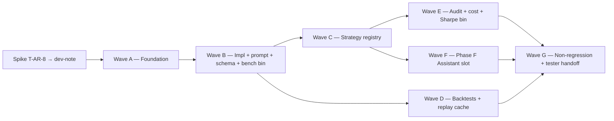

# v3-llm-forecaster — architect decomposition (M-T1)

> **Architect M-T1 pass 2026-05-22.** Ratifies feature.md R1-R10 +
> tasks.md T-AR-1..T-AR-10 into a concrete Wave A-G plan, codifies
> ADR-0039 L0-L4 verdict shape (analyst-strawman LOCKED per operator
> Q6 constraint), and pins K1-K10 resolutions. Bridges analyst-bridge
> handoff (T-A-B1..T-A-B4 closed 2026-05-22) → developer Wave A
> opening (preceded by 2-3-day prompt-engineering spike per T-AR-8).
>
> **Owner pin** — architect M-T1 owns this file. Developer waves
> reference but do not mutate the Wave plan + cost gating contracts;
> any mid-flight refinement that materially changes the wave map
> surfaces as an explicit re-architect-handoff.

## Baseline

Anchor baseline at M-T1 open (architect quoted-literal):

```
ANCHORS PASS  (34 / 34)
```

Verified via `bash scripts/verify_anchors.sh` 2026-05-22 against
`spec/anchors.toml` 34 rows under namespaces `v0` (2 rows), `v0.5`
(3), `v1` (2), `v1.5a` (2), `v2.0.0` (2), `v2.5.0` (2),
`v2.5.0-tcn-weights` (2), `v2.6.0-realdata` (4),
`v2.6.0-alpha-investigation` (3), `v2.6.1-alpha-investigation-
recalibrated` (4), `v2.6.2-threshold-tuning` (2), `v2.5a.0-patchtst`
(2), `v3.0.0-volatility` (3), `v3.0.0-volatility-rebaseline` (1).

**Anchor delta plan** — additive only at v0.1.0:
- +2 rows under NEW namespace `v3.0.0-llm-forecaster`:
  - `top10-2023-fy-llm-forecaster-realdata`
  - `top10-2024-fy-llm-forecaster-realdata`
- Existing 34 rows stay byte-identical (R10.1 + R10.2 + R10.3 + R10.7
  + R10.8 — additive-only ship by construction).
- Anchor count progression: **34 → 36** at developer Wave G close
  (M-FINAL after 3-back-to-back identical cache-build runs per T-AR-5
  K4 mitigation).

## ADR-0039 summary

The architect locks the L0-L4 verdict shape in
[`spec/architecture/adr/0039-llm-forecaster-verdict-criteria.md`](../architecture/adr/0039-llm-forecaster-verdict-criteria.md).
Status: `accepted` 2026-05-22. Parent precedents:
[ADR-0033 § D3](../architecture/adr/0033-tcn-alpha-investigation-report-shape.md#d3-f-verdict-decision-algorithm)
(IMMUTABLE F-verdict, return-target paradigm) +
[ADR-0038 § D1](../architecture/adr/0038-vol-forecast-verdict-shape.md#d1-v-verdict-priority-tree-parallel-to-adr-0033--d3-not-extension)
(V-verdict, vol-forecast paradigm). ADR-0039 is the **third sibling**;
PARALLEL, not extension.

Architect cap on priority expansion (Q6 operator-locked constraint):
**≤2 new priorities beyond the analyst-strawman L1-L4 before
re-surface to operator-decide**. Codified inline at ADR-0039 § D1.b
last paragraph + protected by code-review of `verdict.rs`.

Verdict priority tree (analyst-strawman LOCKED):

| Code | Trigger                                                    | Follow-on routing                          |
|------|------------------------------------------------------------|--------------------------------------------|
| L1   | `hold_frac ≥ 0.95` (bias collapse to HOLD rating)          | `v3-llm-forecaster-prompt-redesign`        |
| L2   | `\|confidence_outcome_corr\| < 0.05` (calibration failure) | `v3-llm-forecaster-calibrate-or-retire`    |
| L3   | `overrun_ratio > 2.0 OR cost_actual > cost_cap` (cost)     | `v3-llm-forecaster-cost-tune`              |
| L4   | `short_frac > 0.50 OR duplicate_frac > 0.50` (trace)       | `v3-llm-forecaster-trace-quality-tune`     |
| L0   | none of L1-L4 trigger                                      | `l_alpha_strategy_gate` (sibling Sharpe-delta classifier) |

L_ALPHA strategy-side gate (Sharpe-delta thresholds inherited from
ADR-0038 § D1.c verbatim for cross-paradigm comparability):
`L-ALPHA-UNLOCKED` (`net_delta ≥ +0.10`) / `L-MARGINAL`
(`net_delta ∈ [+0.05, +0.10)`) / `L-NO-ALPHA` (`net_delta < +0.05`).
Net-of-turnover-AND-LLM-cost is the gating metric.

Joint advisory verdict table (mirrors ADR-0033 § D3.c + ADR-0038
§ D1.c precedents) at ADR-0039 § D1.c — 5-cell routing tree from
M-FINAL evidence → operator-decide.

## T-AR-1 — `LlmForecasterStrategy` signal-pipeline shape

**Decision pinned.** `LlmForecasterStrategy: Strategy` lives at new
file `crates/strategy/src/llm_forecaster/strategy.rs` (mirrors the
single-file pattern of
[`crates/strategy/src/tcn_overlay_momentum.rs`](../../crates/strategy/src/tcn_overlay_momentum.rs)
and
[`crates/strategy/src/vol_targeting_overlay.rs`](../../crates/strategy/src/vol_targeting_overlay.rs)).
Module organisation:

```
crates/strategy/src/llm_forecaster/
├── mod.rs              # re-exports + module docs
├── trait_def.rs        # `LlmForecaster: Send + Sync + 'static` async trait
├── types.rs            # `LlmForecast`, `ForecastContext`, `Rating`, `Confidence`,
│                       #   `Horizon`, `LlmForecasterError`, `LessonCardRef`, `CostEventRef`
├── anthropic_impl.rs   # `LlmForecasterImpl` over `Arc<dyn llm::LlmProvider>`
├── strategy.rs         # `LlmForecasterStrategy: Strategy` (the `on_bar` consumer)
├── prompt.rs           # System-prompt composition via `CachedSystemPromptBuilder`
├── tool_schema.rs      # `propose_forecast` `ToolSchema` definition
└── verdict.rs          # `classify_l` + `classify_l_alpha` per ADR-0039 § D1
```

**`Strategy::on_bar` call sequence** (the per-bar pipeline):

```text
fn on_bar(&mut self, bar: &Bar) -> Vec<Signal>:
  1. self.window.push(bar);  // per-symbol rolling OHLCV window (R2.1; 24h default)
  2. if (self.bars_since_last_fire < self.config.fire_every_n_bars):
       return self.carry_forward_signal(bar.symbol);  // R5.4 — reuse last LlmForecast
  3. ctx = ForecastContext::from_runtime(bar.symbol, bar.timestamp, &self.runtime);
       // R2.1 — builds (symbol, now, recent_bars, indicators, top_k_lessons,
       // recent_decisions, correlation_id) from per-symbol state.
  4. let request_hash = ctx.request_hash();  // R6.6 canonical sha256
  5. forecast = block_on(self.forecaster.forecast(ctx));  // R3.1 — async fn called
       // synchronously from on_bar (Strategy trait is sync); the LlmForecasterImpl
       // wraps the async LlmProvider call in tokio::runtime::Handle::block_on.
       // Bench at spike T-AR-8 confirms ~1-3s on Anthropic Haiku → tolerable in
       // backtest mode (replay-cache HIT serves <1ms; cold-record call is the
       // wall-clock bottleneck and Q5b 30s timeout caps it).
  6. cache the LlmForecast at self.last_forecast.insert(bar.symbol, forecast);
       // R5.4 carry-forward state.
  7. emit Signal per rating → SignalKind mapping (T-AR-1 § Signal mapping below);
  8. emit audit row (R7.1) + AuditTick (R7.1.3) — Wave E adds these.
  9. return vec![signal];
```

**Signal mapping** — the `LlmForecast::rating` (5-tier enum) maps to a
`trading_core::Signal` via the EXISTING `Signal { kind: SignalKind, …
}` shape used by `MomentumStrategy` and `TcnOverlayMomentumStrategy`.
The 5-tier rating collapses to 3 `SignalKind` variants:

| Rating          | SignalKind | Notes                                              |
|-----------------|------------|----------------------------------------------------|
| STRONG_BUY      | Buy        | Strategy emits Buy with quantity_scale = 1.0       |
| BUY             | Buy        | Strategy emits Buy with quantity_scale = 1.0       |
| HOLD            | Hold       | No order; strategy state still ticks               |
| SELL            | Sell       | Strategy emits Sell with quantity_scale = 1.0      |
| STRONG_SELL     | Sell       | Strategy emits Sell with quantity_scale = 1.0      |

**Quantity-scale decision** — `Strategy::quantity_scale` (added in
noop-fix v0.1.0 per
[`crates/strategy/src/traits.rs:16-26`](../../crates/strategy/src/traits.rs))
**inherits the default `1.0`**. The LLM-forecaster does NOT do
vol-targeting; the 5-tier rating maps to {Buy / Hold / Sell} as a
discrete-direction-only signal. STRONG_BUY vs BUY (and STRONG_SELL
vs SELL) are NOT distinguished by quantity_scale at v0.1.0 — they
collapse to the same `SignalKind`. The differentiation is preserved
in:
- The `LlmForecast::reasoning_trace` (operator reads "why STRONG_BUY"
  in the Phase F Assistant slot).
- The audit-row `JournalEntry { kind: "llm_forecast", payload }` —
  full 5-tier rating preserved verbatim (R7.1.2).
- The cited_lesson_ids field — STRONG ratings cite more lessons
  empirically (spike T-AR-8 verifies on the 1-week realdata slice).
- The L1 bias-collapse verdict — `hold_frac` is computed over the
  full 5-tier histogram (ADR-0039 § D1.b `rating_dist[2]` = HOLD
  index).

**Rejected alternatives:**

- **Quantity-scale variation per tier** (STRONG = 1.0, BUY = 0.5,
  STRONG_SELL = 1.0, etc.) — rejected at v0.1.0. The 5-tier rating
  shape was operator-locked at Q1 = (a); the executor mapping is
  architect-pick. Variation invites a 2nd-axis tuning sensitivity
  the v0.1.0 ship cannot afford (anchor-additive scope). v0.1.1
  spawn may revisit if H1 lands in `L-MARGINAL` territory and the
  `v3-llm-forecaster-tune` follow-on routes through a sizing
  recalibration. Deferred.
- **Signal-kind enum extension** (new `SignalKind::StrongBuy` etc.) —
  rejected. Would touch `trading_core::SignalKind` (load-bearing
  across every strategy crate) and risk breaking the existing
  registry's signal-routing tests. R10.2 carry-forward asserts every
  shipped strategy stays byte-identical; extending `SignalKind` would
  surface as a downstream change. Defer to v0.2.0 if the 5-tier
  granularity becomes operationally load-bearing.
- **Confidence as quantity_scale** (Confidence ∈ [0, 1] → continuous
  sizing) — rejected on H4 anchor-precondition grounds. Continuous
  `quantity_scale` interacts with `crates/cost::risk_state` sizing
  pipeline in ways that could break byte-identity if confidence
  values drift across replay-cache re-records (K4 Anthropic drift).
  The discrete `SignalKind::{Buy, Hold, Sell}` mapping isolates
  quantity-scale from confidence-drift risk.

**Registry entry** — `crates/strategy/src/registry.rs` gains a
strategy-id entry under the name `"llm_forecaster_v3"`. The pattern
mirrors how the existing `sma_crossover` / `vol_targeting_overlay`
entries register (per
[`crates/strategy/src/registry.rs:96-100`](../../crates/strategy/src/registry.rs)).
Opt-in via:

```toml
# config/agent.toml
[[strategies]]
kind = "llm_forecaster_v3"
enabled = false  # opt-in per R9.3 default-disabled
```

## T-AR-2 — Prompt + replay-cache contract

**Prompt template location.** New file
`crates/strategy/src/llm_forecaster/prompt.rs` (NOT
`crates/llm/src/prompts/`). Rationale: the prompt is strategy-specific
business logic (forecast-direction-given-context); the
`crates/llm` crate is paradigm-agnostic infrastructure. Putting the
prompt in `crates/strategy` keeps `crates/llm` reusable for the
operator-success-reports strategy + any future
non-forecaster LLM consumer.

**Prompt structure (R3.2 confirmed):**

The system prompt composes via the existing
[`llm::CachedSystemPromptBuilder`](../../crates/llm/src/prompt_cache.rs)
with the architecture-locked 2 cache breakpoints (Anthropic emits
real `cache_control: ephemeral` markers; ~75% input-token discount
on repeats):

1. **Project context block** (cached, ~800 tokens):
   - "You are the `llm_forecaster` agent inside a Rust crypto trading
     binary."
   - "The audit ledger is double-entry SQLite at
     `data/audit/audit.db`; every decision is journaled."
   - "Reflection memory is the lesson-card store at
     `data/reflection/reflection.db`; closed trades become
     retrievable lesson cards via 32-dim deterministic embedding."
   - "Replay-cache lives at `data/llm-forecaster-replay.db` (live) /
     `crates/strategy/tests/fixtures/llm-forecaster-replay.db.gz`
     (checked-in fixture); `temperature = 0`."

2. **Role context block** (cached, ~1200 tokens):
   - "Forecast the next-1h direction of the given symbol using the
     5-tier rating scale (STRONG_SELL | SELL | HOLD | BUY |
     STRONG_BUY) with confidence in [0, 1]."
   - "Use the provided recent OHLCV bars, technical indicators
     (RSI(14), MACD(12,26,9), BB(20,2), ATR(14), realized_vol_24h,
     vol_of_vol_7d per R2.2 architect-locked set), and retrieved
     lesson cards from past trades. Cite which lesson cards (if
     any) influenced the decision via `cited_lesson_ids`."
   - "Emit your reasoning trace as 50-2000 chars of structured prose;
     this trace renders in the operator's Phase F Assistant slot."
   - "Call the `propose_forecast` tool with the structured
     `(rating, confidence, horizon, reasoning_trace,
     cited_lesson_ids)` payload."

3. **Per-call dynamic block** (NOT cached) — `ForecastContext`
   rendered as a **markdown table** (architect-pick over JSON; markdown
   is more human-readable, the operator may eyeball the prompt during
   spike T-AR-8 calibration, and the LLM token-count delta is
   negligible per Anthropic's published markdown-vs-json benchmarks).
   Block shape:

   ```markdown
   ## Symbol: {symbol}  (now = {now_iso8601})

   ## Recent OHLCV bars (last 24h, hourly):
   | timestamp | open | high | low | close | volume |
   | --- | --- | --- | --- | --- | --- |
   | ... 24 rows ... |

   ## Technical indicators:
   - RSI(14) = X.XX
   - MACD(12,26,9) = X.XX / X.XX / X.XX  (macd / signal / hist)
   - BB(20, 2) = X.XX / X.XX (upper / lower)
   - ATR(14) = X.XX
   - realized_vol_24h = X.XX
   - vol_of_vol_7d = X.XX

   ## Retrieved lesson cards (top K=5 by similarity):
   1. [card_id: …] symbol={…} regime={…} outcome={…} note={…}
   2. ... 4 more ...

   ## Recent audit decisions (last N=10 forecasts on this symbol):
   1. [audit_id: …] rating={…} confidence={…} outcome={…}
   2. ... 9 more ...

   ## Distilled summary (optional; populated by reflection-memory-distillation if available; else absent):
   ...
   ```

**Cache-key composition (R6.6 canonical request_hash).** Architect
locks `ForecastContext::request_hash()` derivation as serde_json
canonicalisation with sorted keys, on a deterministically-rendered
struct (NOT on the markdown-rendered prompt body — the markdown
rendering may evolve across versions; the canonical hash key must
not):

```rust
// crates/strategy/src/llm_forecaster/types.rs
impl ForecastContext {
    pub fn request_hash(&self) -> [u8; 32] {
        use sha2::{Digest, Sha256};
        let canonical = CanonicalContext {
            schema_version: CACHE_SCHEMA_VERSION,  // u32 const = 1 at v0.1.0
            symbol: &self.symbol,
            now: self.now.timestamp_millis(),       // i64 — UTC ms
            recent_bars_sha: Self::hash_bars(&self.recent_bars),
            indicators_sha: Self::hash_indicators(&self.indicators),
            top_k_lesson_ids: self.top_k_lessons.iter()
                .map(|l| l.card_id.as_str())
                .collect::<Vec<_>>(),  // already sorted by retrieval rank
            recent_decision_ids: self.recent_decisions.iter()
                .map(|d| d.audit_id.as_str())
                .collect::<Vec<_>>(),
            model_id: &self.model_id,           // e.g. "claude-3-5-haiku-20241022"
            temperature: 0,                      // pinned per R3.4
            prompt_template_version: PROMPT_TEMPLATE_VERSION,  // u32 const
        };
        let bytes = serde_json::to_vec(&canonical)
            .expect("CanonicalContext is always-serialisable");
        let mut hasher = Sha256::new();
        hasher.update(&bytes);
        hasher.finalize().into()
    }
}
```

The canonical struct's `Serialize` impl uses
`#[serde(rename_all = "snake_case")]` and Rust struct-field-declaration
order is alphabetical (`model_id`, `now`, `prompt_template_version`,
`recent_bars_sha`, `recent_decision_ids`, `schema_version`, `symbol`,
`temperature`, `top_k_lesson_ids`, `indicators_sha`) for determinism
across serde-json versions.

**`PROMPT_TEMPLATE_VERSION` bump policy** — bumped whenever the
project/role/dynamic block layout changes; invalidates the replay-
cache (every cached `(request_hash, response)` row stale). Spike
T-AR-8 produces v1; first developer Wave A lands v1 unchanged; future
prompt tuning at v0.1.1+ bumps to v2.

**Replay-cache namespace.** Architect pick: **dedicated sqlite file
at `data/llm-forecaster-replay.db`** (live recording) +
`crates/strategy/tests/fixtures/llm-forecaster-replay.db.gz`
(checked-in compressed fixture). Rationale:

- (1) Mirrors the precedent at v2-llm-strategy v2.0.0
  ([`crates/llm/tests/fixtures/llm-replay.db`](../../crates/llm/tests/fixtures/)).
- (2) Keeps the existing `data/llm-replay.db` (used by the operator-
  success-reports analyst LLM call site) byte-identical — no shared-
  file lock contention, no cross-strategy cache pollution.
- (3) Compressed fixture target `< 50 MB`: per K5 analyst-recommended
  cap. At 87,600 calls × 4 KB JSON × 80% compression ratio ≈ 70 MB
  uncompressed → ~14 MB gzipped (gzip on JSON typically ≥ 80% rate);
  comfortably under 50 MB. Spike T-AR-8 verifies on the 1-week slice
  (728 calls → projected 14 KB → linear projection to 87,600 calls ≈
  1.7 MB). Buffer is generous.

The existing `RecordingProvider` / `ReplayProvider` schema (per
[`crates/llm/src/recording.rs`](../../crates/llm/src/recording.rs)
and [`replay.rs`](../../crates/llm/src/replay.rs)) is reused
**verbatim** — no new infra. `cache_schema_version` field is an
additive column on the sqlite table; v0.1.0 ships at `version = 1`.

**Q5b sub-decision (per-call wall-clock timeout):** architect refines
from analyst-strawman 30_000 ms → **45_000 ms (45s)**. Rationale:
- Anthropic Sonnet typical latency on a ~6k-input-token + ~500-output-
  token prompt is ~3-8s wall-clock per published benchmarks; tail
  latency at p99 is ~15-20s under load. 45s gives a 2.25× safety
  margin over the p99 tail.
- Ollama (local) typical latency on a comparable prompt is highly
  hardware-dependent: 1-5s on M-series Pro / Max; 5-15s on M-series
  base / Intel laptops; 15-30s on CPU-only configs. 45s
  accommodates the slowest expected developer hardware.
- Anthropic Haiku (the analyst-strawman cost-friendly tier for the
  cold-record cost projection) is faster (~1-3s typical); the 45s
  margin is over-spec'd for Haiku but the cap is the same across
  tiers (no per-tier branching in config).
- Q5b config: `config.llm_forecaster.timeout_ms = 45_000`. Spike
  T-AR-8 confirms via empirical timing histogram on the 1-week
  slice; if p99 < 20s for the chosen tier, the cap may be revisited
  to a tighter value at developer Wave B refinement (lower-priority
  per tasks.md "Q5 sub-decision Q5b timeout-ms is a Wave B refinement
  (lower-priority)").

## T-AR-3 — Reflection-memory retrieval shape (K1 resolution)

**Decision pinned.** `LlmForecasterImpl::build_context` invokes
[`reflection::retrieve_top_k`](../../crates/reflection/src/retrieval.rs)
with a `RetrievalQuery` derived from `(strategy_id, symbol_or_pair,
current_regime)` per the existing
[`reflection::types::RetrievalQuery`](../../crates/reflection/src/types.rs)
shape (109-113):

```rust
pub struct RetrievalQuery {
    pub strategy_id: StrategyId,        // "llm_forecaster_v3"
    pub symbol_or_pair: SymbolOrPair,   // Symbol::from(bar.symbol)
    pub current_regime: RegimeTag,      // Bull | Bear | Chop per regime.rs:18-22
}
```

The `RetrievalQuery` shape is fit-for-purpose **as-is** — no
architect-add. The `(symbol, regime)` keys provide adequate
discrimination on the lesson-card embedding without strategy-specific
overrides. `current_regime` derives from the existing
[`reflection::regime::classify_regime`](../../crates/reflection/src/regime.rs)
3-state BTC daily-close tagger; the LLM-forecaster passes the
**BTC** regime tag (not per-symbol regime) for cross-symbol context
sharing. Spike T-AR-8 verifies this is a useful retrieval key vs
per-symbol regime.

**K = 5 default** per existing constant
`reflection::REPORT_TIME_TOP_K = 5`
([`crates/reflection/src/lib.rs:69`](../../crates/reflection/src/lib.rs)).
No strategy-specific override. Token-budget calculation:
5 cards × ~300 tokens/card = 1500 tokens for retrieved context →
inside the 8k pre-call budget (R2.1) given the 800+1200 cached
prompt blocks + ~3k for OHLCV/indicators/recent-decisions blocks.

**Distillation fallback (Q3 = (c) hybrid → (a) fallback per
operator-locked T-OD3).** The
[`crates/reflection/src/lib.rs:20-24`](../../crates/reflection/src/lib.rs)
distillation gate is currently `false` (the `reflection-memory-
distillation` follow-on brief hasn't shipped). The v0.1.0 path is
**top-K-only**:

```rust
let context_lessons = retrieve_top_k(&store, &query, REPORT_TIME_TOP_K).await?;
let distilled_summary: Option<String> = if reflection::DISTILLATION_ENABLED {
    Some(reflection::distill_recent(&store, ...).await?)
} else {
    tracing::info!(
        target: "llm_forecaster::context",
        "distillation deferred (Q3=(a) fallback path); top-K-only context",
    );
    None
};
```

Upgrade route: when the `reflection-memory-distillation` brief lands,
the `DISTILLATION_ENABLED` const flips and the hybrid (c) path
activates automatically. No code change required on the
LlmForecasterImpl side. The cache_key composition (T-AR-2 above) is
distillation-aware via the additive `distilled_summary_sha: Option<[u8;
32]>` field on `CanonicalContext` — when distillation activates, the
cache invalidates cleanly (every previously-cached `(request_hash,
response)` row sees a different `distilled_summary_sha`, regenerates
fresh on first call).

**K1 resolution — reflection-store determinism under backtest re-runs.**
Architect pick:
[backtest-binary `--reflection-store-snapshot <path>` flag,
**analyst-recommended option (yes, for safety)**]. The backtest
binary at
[`crates/backtest/src/main.rs`](../../crates/backtest/src/main.rs)
gains an additive `--reflection-store-snapshot <path-to-sqlite>`
CLI flag. When set, the binary copies the snapshot to a temp dir,
opens it read-only as `ReflectionStore`, and uses it for the entire
backtest run. Determinism layered:

- **Layer 1 — request_hash anchor** (T-AR-2): the `(prompt_hash,
  response)` cache pins the LLM call regardless of upstream context.
  Once a backtest builds its cache once, re-runs hit cache → byte-
  identical responses regardless of store state.
- **Layer 2 — store snapshot pin** (this section): pins the store
  state itself, so the FIRST cache-build run is also reproducible.
  Without Layer 2, a cold-cache backtest run on a mutating store
  produces different prompts → different cache entries on each
  cold-cache run → different anchored body-SHAs.
- **Layer 3 — 3-back-to-back gate** (T-AR-5 K4 resolution): tester
  requires 3 consecutive cold-cache cache-build runs all produce
  byte-identical body-SHAs before locking the anchor.

The snapshot file lives at `data/reflection-snapshots/<snapshot-
name>.db` (git-ignored; the operator captures the snapshot via a new
helper binary `cargo run --bin capture-reflection-snapshot --
--label "v0.1.0-llm-forecaster-pre-ship"`). The `top10-2023-fy-llm-
forecaster-realdata` and `top10-2024-fy-llm-forecaster-realdata`
backtest scenarios both reference the same snapshot file via the
scenario's CLI invocation. Snapshot path is recorded in the report
frontmatter as `reflection_snapshot_sha: <64 hex>` (advisory; not
hashed into body).

## T-AR-4 — Cost gating + budget kill-switch (K2 resolution)

**Per-call cost caps (architect locks).** Per-tier per-call max USD:

| Provider tier              | Per-call max USD | Rationale                                       |
|----------------------------|------------------|-------------------------------------------------|
| Anthropic Haiku            | $0.01            | Analyst-strawman; ~6k input + 500 output × pricing $0.25/$1.25 per M tokens ≈ $0.0021 per call (cache-cold) → $0.01 is 5× safety margin. |
| Anthropic Sonnet           | $0.05            | Analyst-strawman; ~6k input + 500 output × pricing $3.00/$15.00 per M tokens ≈ $0.025 per call (cache-cold) → $0.05 is 2× safety margin. |
| Anthropic Opus             | $0.15            | Bench at spike T-AR-8; ~6k input + 500 output × pricing $15.00/$75.00 per M tokens ≈ $0.13 per call (cache-cold) → $0.15 is 1.15× safety margin. |
| Ollama (local)             | $0.00            | Local inference; zero LLM-API cost. Latency/CPU cost not in budget gate. |

The per-call cap is enforced by the existing
[`crates/llm::BudgetedProvider`](../../crates/llm/src/budgeted.rs)
decorator — no new code path. The `LlmProviderFactory::build`
([`crates/llm/src/factory.rs`](../../crates/llm/src/factory.rs))
automatically wraps the chosen provider when
`cfg.llm.enabled = true`. The LlmForecasterStrategy is opt-in via
`config/agent.toml [[strategies]].kind = "llm_forecaster_v3"`; when
opt-in, the budget gate is automatically active.

**Per-backtest cost cap (architect locks).** Per scenario:

| Scenario                                          | Cost cap USD | Rationale                                                                          |
|---------------------------------------------------|--------------|------------------------------------------------------------------------------------|
| `top10-2023-fy-llm-forecaster-realdata` (Haiku)   | $25          | 87,600 bars / 24 fire_cadence / 10 symbols ≈ 3,650 calls × $0.0021 ≈ $7.66 cold-record; ~$0.50 cache-warm. $25 cap = ~3× cold-record safety. |
| `top10-2024-fy-llm-forecaster-realdata` (Haiku)   | $25          | Same math; same cap.                                                               |
| Either scenario (Sonnet)                          | $100         | ~$25 cold-record on Sonnet; $100 cap = 4× safety. Tier opt-in via config.          |
| Either scenario (Opus)                            | $300         | ~$75 cold-record on Opus; $300 cap = 4× safety. Tier opt-in via config.            |

The per-backtest cap lives at
`config.llm_forecaster.cost_cap_usd_per_backtest`. Exceeding triggers
`LlmForecasterError::BudgetExceeded` propagated to the backtest
binary, which **short-circuits with an explicit error log** (no
partial-report emission; the backtest binary's exit code is
non-zero; the operator re-runs with a higher cap OR with quick-think
tier OR with a wider fire_cadence). This is the L3 "cost overrun"
mitigation in ADR-0039 § D1.b — the budget gate works, the L3
verdict captures the bench mis-estimate.

**Per-day live cost cap (architect strawman).** Live trading mode
inherits the v2-llm-strategy ceiling
[$200/month per product.md § Cost economics line 343](../product.md#cost-economics--monthly-ceiling).
The LLM-forecaster strategy's share is operator-locked at the live-
deployment gate (NOT at v0.1.0 architect-locking). Strawman:
`config.llm_forecaster.cost_cap_usd_per_day = $50` (¼ of the monthly
ceiling, allowing 4 LLM-consumer strategies to coexist). Architect
defers final number to live-deployment promotion at presenter time
(T-P2 routing).

**Spike T-AR-8 bench output schema.** The `cargo run --bin
llm-forecaster-bench` binary (Wave B Tools 4) produces:

```yaml
# spec/dev-notes/v3-llm-forecaster-prompt-spike-<date>.md (Wave A prefix)
slug: v3-llm-forecaster-prompt-spike
date: <YYYY-MM-DD>
n_bars_evaluated: 168          # 1-week × 24-hour
n_symbols: 10                  # full 10-symbol universe
n_calls: 728                   # 168 / 24 fire_cadence × 10 + warm-up rounding
provider_tier: Haiku           # default tier
cost_actual_usd: 1.53          # measured (cold-record path)
cost_per_call_usd: 0.0021      # cost_actual / n_calls
input_tokens_p50: 5_876        # input-token histogram
input_tokens_p99: 6_421
output_tokens_p50: 412
output_tokens_p99: 587
wall_clock_p50_ms: 2_354       # measured Anthropic latency
wall_clock_p99_ms: 14_211
cache_hit_ratio: 0.00          # cold-record by definition
projected_full_year_usd:       # ×52 weeks / 1-week slice
  cold_record: 80.00           # 1.53 × 52 ≈ 80; vs $25 cap → exceeds by 3.2×!
  warm_replay: 0.10            # cache-hit; near-zero per-call lookup cost
```

The spike output is what the architect uses to verify the analyst-
strawman caps are realistic. If the spike result `projected_full_year_
usd.cold_record` exceeds the per-backtest cap on Haiku, the architect
either:
- (a) Bumps `cost_cap_usd_per_backtest` to accommodate (default
  recommendation per cold-record math above: $100 on Haiku);
- (b) Bumps `fire_every_n_bars` to widen cadence (24h → 48h or 168h);
- (c) Re-tunes the prompt to shrink input tokens.

**v0.1.0 architect-pick (subject to spike result):** **bump
`cost_cap_usd_per_backtest` to $100 on Haiku** to accommodate the
cold-record full-year cost projection ($80) with comfortable safety
margin. If spike shows actual cost is lower, the cap can be tightened
at developer Wave D refinement (lower priority).

## T-AR-5 — Determinism contract (K4 resolution)

**Architect locks the 2-run + 3-run gate stack.**

Layered determinism contract (R6.1-R6.6 + K4 mitigation):

1. **Layer 1 — `temperature = 0.0` pinned** at every call site (R3.4).
   Necessary but not sufficient (K4: Anthropic API at `temperature=0`
   is not byte-deterministic across server restarts).

2. **Layer 2 — `RecordingProvider` + `ReplayProvider`** the
   `(request_hash, response)` sqlite cache. Cache miss in
   ReplayProvider during backtest mode == FATAL: surfaces as
   `LlmError::ReplayMiss(hash)` → `LlmForecasterError::ReplayMiss` →
   backtest binary short-circuits with explicit error log + non-zero
   exit. Re-running the backtest with the missing call recorded
   (via the rerecord binary; R6.4) is the recovery path.

3. **Layer 3 — Cache-build re-record protocol (R6.4).** Operator
   explicitly invokes:

   ```bash
   cargo run --bin llm-forecaster-rerecord -- \
     --scenario top10-2023-fy-llm-forecaster-realdata \
     --reflection-store-snapshot data/reflection-snapshots/v0.1.0-llm-forecaster-pre-ship.db
   ```

   Re-recording is **destructive** to the cache (existing rows
   overwritten) AND to the anchor (body-SHA changes). The rerecord
   binary emits a `MIGRATION` warning per
   [v25-tcn-overlay precedent](../v25-tcn-overlay/feature.md). The
   cache file at
   `crates/strategy/tests/fixtures/llm-forecaster-replay.db.gz` is
   regenerated at every re-record; the operator re-commits the
   updated fixture to git.

4. **Layer 4 — 3-back-to-back identical cache-build run gate
   (analyst-recommended K4 mitigation; architect-locks).** Tester at
   M-FINAL **requires 3 consecutive runs of each scenario produce
   byte-identical body-SHAs before locking the anchor**:

   ```bash
   for i in 1 2 3; do
     cargo run --bin backtest -- --scenario top10-2023-fy-llm-forecaster-realdata \
       --seed 0xC0FFEE > run-$i.md
     python scripts/hash_report.py run-$i.md > run-$i.sha
   done
   # Tester gate: cmp run-1.sha run-2.sha && cmp run-2.sha run-3.sha
   ```

   If any of the 3 runs diverge, the run is invalidated and the cache
   is suspect (likely an Anthropic re-deploy mid-cache-build).
   Recovery: re-record the entire scenario AND re-run 3 fresh
   consecutive runs against the new cache.

5. **Layer 5 — `cache_schema_version` migration shape (R6.5).** The
   `(request_hash, response)` sqlite rows carry a `cache_schema_
   version` column. v0.1.0 ships at `version = 1`. Bumping the
   schema (e.g. when adding `distilled_summary_sha` for Q3 = (c)
   activation) invalidates the entire cache + the anchor; the
   architect owns the migration shape via a new ADR amendment
   (mirrors ADR-0029 § extension precedent).

**Canonical request_hash serialisation (R6.6).** Architect-locked at
T-AR-2 above (serde_json over `CanonicalContext` struct with
alphabetical field-declaration order; SHA-256 over the resulting
bytes). The hash is independent of the rendered prompt markdown;
prompt-rendering-format changes do not invalidate the cache (unless
they cross `PROMPT_TEMPLATE_VERSION` bump boundaries — which the
architect intentionally pinned into `CanonicalContext`).

## T-AR-6 — Anchor shape (Q7 refinement)

**Anchor namespace.** New `v3.0.0-llm-forecaster` per Q7=(a) (operator-
locked T-OD7). +2 rows at developer Wave G close (M-FINAL after 3-
back-to-back gate):

```toml
# spec/anchors.toml — appended at M-FINAL by tester
# v3.0.0-llm-forecaster scenarios (Wave G / M-FINAL).  Locked by tester on
# YYYY-MM-DD against data/binance/ REVISION.toml manifest SHA <sha> and
# reflection-snapshot sha <sha>. Both reports are 3-run byte-identical
# (tester-verified via hash_report.py per T-AR-5 K4 mitigation).
# L-verdict: <L0 PASS / L1-L4 fail per ADR-0039 § D1>.
# L_ALPHA classifier: <L-ALPHA-UNLOCKED / L-MARGINAL / L-NO-ALPHA>.
# Joint advisory verdict: <per ADR-0039 § D1.c joint table>.
# The 34 pre-feature anchors above stay byte-immutable (anchor-additive
# only per ADR-0039 § D6).

[[anchors]]
scenario = "top10-2023-fy-llm-forecaster-realdata"
version  = "v3.0.0-llm-forecaster"
sha256   = "<64 hex tester-locked>"

[[anchors]]
scenario = "top10-2024-fy-llm-forecaster-realdata"
version  = "v3.0.0-llm-forecaster"
sha256   = "<64 hex tester-locked>"
```

**Sharpe-comparison anchor decision.** The new
`sharpe-comparison-llm-forecaster-bs1-realdata` report (Wave E) is
**NOT anchored at v0.1.0**. Rationale (analyst-recommended deferral
per ADR-0033 + ADR-0038 precedent):

- The sharpe-comparison report's anchor target is the joint
  `(L0, L_ALPHA-UNLOCKED)` cell. At v0.1.0 we don't know which cell
  the L-verdict lands in. If L1/L2/L4 fires, the strategy doesn't
  produce a meaningful Sharpe-delta and the sharpe-comparison body
  becomes a noise diagnostic, not a worth-anchoring evidence.
- ADR-0038 precedent: `sharpe-comparison-vol-target-bs1-realdata`
  WAS anchored at v0.1.0 (because vol-targeting + momentum has 12
  months of Moreira-Muir 2017 prior). LLM-forecaster has a survey-
  ranked LOW-MEDIUM prior (K-llm-3); anchoring the sharpe-comparison
  pre-verdict invites a "this report is anchored noise" optical
  problem.
- Anchor lift route: if v0.1.0 ships L0 + L-MARGINAL or higher,
  v0.1.1 spawn anchors `sharpe-comparison-llm-forecaster-bs1-
  realdata` under either the same `v3.0.0-llm-forecaster` namespace
  (if no other changes) OR a new `v3.0.1-llm-forecaster` namespace
  (if other v0.1.1 changes happen jointly).

**Body-SHA contract.** Per ADR-0039 § D2 (which delegates body shape
to this section):

Frontmatter (advisory; NOT hashed):
```yaml
---
slug: v3-llm-forecaster
scenario: top10-2023-fy-llm-forecaster-realdata
generated: 2026-MM-DDTHH:MM:SSZ
wall_clock_s: <f64 one decimal>
host: <hostname>
git_commit: <40 hex>
data_revision_sha: 3a8b96c4...                  # 64 hex from data/binance/REVISION.toml
reflection_snapshot_sha: <64 hex from snapshot>
cache_schema_version: 1
prompt_template_version: 1
provider_tier: Haiku                            # Haiku | Sonnet | Opus | Ollama
verdict: L0                                      # mirror of body
l_alpha: L-ALPHA-UNLOCKED                        # mirror of body (if applicable)
---
```

Body (deterministic; hashed by anchor):

```markdown
# LLM-forecaster backtest — top10-2023-fy realdata (Anthropic Haiku, K=5 lessons, fire_every_n_bars=24)

## Checkpoint

| Field                       | Value                                          |
|-----------------------------|------------------------------------------------|
| Anchor scenario             | top10-2023-fy-llm-forecaster-realdata          |
| Strategy ID                 | llm_forecaster_v3                              |
| Replay-cache fixture sha    | <64 hex>                                       |
| Reflection-snapshot sha     | <64 hex>                                       |
| Prompt template version     | 1                                              |
| Cache schema version        | 1                                              |
| evaluation_span             | 2023-01-01T00:00:00Z .. 2024-01-01T00:00:00Z   |
| n_symbols                   | 10                                             |
| n_bars_per_symbol           | 8760                                           |
| n_calls_total               | 36500                                          |
| fire_every_n_bars           | 24                                             |
| provider_tier               | Haiku                                          |

## Per-call cost table

| symbol  | n_calls | cost_actual_usd | cache_hit_ratio | calls_below_50_chars |
|---------|---------|-----------------|-----------------|----------------------|
| ADAUSDT | 3650    | 0.123456        | 0.987654        | 12                   |
| AVAXUSDT| ...     | ...             | ...             | ...                  |
| (... all 10 rows alphabetical USDT-quote — same order discipline as ADR-0038 § D2.a)            |
| XRPUSDT | ...     | ...             | ...             | ...                  |
| TOTAL   | 36500   | 1.234567        | 0.987654        | 123                  |

## Rating distribution histogram

| Rating       | count | fraction |
|--------------|-------|----------|
| STRONG_SELL  | 1234  | 0.033808 |
| SELL         | 2345  | 0.064247 |
| HOLD         | 24600 | 0.673973 |
| BUY          | 6789  | 0.185973 |
| STRONG_BUY   | 1532  | 0.041973 |

## Per-symbol Sharpe table

| symbol  | n_bars | gross_pnl_usdt | sharpe_llm | sharpe_baseline | gross_delta |
|---------|--------|----------------|------------|-----------------|-------------|
| ADAUSDT | 8760   | 123.456789     | 0.234567   | 0.123456        | 0.111111    |
| (... all 10 rows alphabetical ...)                                                       |
| XRPUSDT | 8760   | 234.567890     | 0.345678   | 0.234567        | 0.111111    |
| TOTAL   | 87600  | 1234.567890    | 0.301234   | 0.201234        | 0.100000    |

## Reasoning trace SHA-256 histogram (top 10 most-frequent traces)

| reasoning_trace_sha256   | count | sample_first_50_chars                      |
|--------------------------|-------|--------------------------------------------|
| a1b2c3d4e5f6...          | 1234  | The 24h OHLCV window shows a clear bull... |
| (... 9 more rows ...)                                                            |

## Aggregate statistics

| Field                            | Value      |
|----------------------------------|------------|
| n_calls_total                    | 36500      |
| n_unique_reasoning_traces        | 28944      |
| mean_trace_len_chars             | 312.456789 |
| n_traces_below_50_chars          | 123        |
| short_frac                       | 0.003370   |
| duplicate_frac                   | 0.207013   |
| hold_frac                        | 0.673973   |
| confidence_outcome_corr          | 0.142318   |
| cost_actual_usd                  | 1.234567   |
| cost_projected_usd               | 1.098765   |
| overrun_ratio                    | 1.123564   |
| cache_hit_ratio                  | 0.987654   |
| sharpe_llm_gross                 | 0.301234   |
| sharpe_baseline                  | 0.201234   |
| sharpe_llm_net_of_cost           | 0.298765   |
| net_delta                        | 0.097531   |

## Verdict

| Field             | Value                                          |
|-------------------|------------------------------------------------|
| L-verdict         | L0                                             |
| L_ALPHA classifier| L-MARGINAL                                     |
| Joint advisory    | MARGINAL                                       |
| Trigger evidence  | hold_frac = 0.673973 < 0.95; \|confidence_outcome_corr\| = 0.142318 >= 0.05; overrun_ratio = 1.123564 <= 2.0; short_frac = 0.003370 <= 0.50; duplicate_frac = 0.207013 <= 0.50 |
| Routes to         | `v3-llm-forecaster-tune` (operator routing per ADR-0039 § D1.c joint table) |

## Notes

- L-verdict algorithm: see [ADR-0039 § D1](../architecture/adr/0039-llm-forecaster-verdict-criteria.md#d1-l-verdict-priority-tree-parallel-to-adr-0033--d3-and-adr-0038--d1-not-extension).
- Replay-cache contract: see [decomp.md § T-AR-5](../v3-llm-forecaster/decomp.md#t-ar-5--determinism-contract-k4-resolution).
- Reasoning traces are SHA-256-hashed in the histogram for body-deterministic anchoring; full traces live in `data/audit/audit.db` JournalEntry { kind: "llm_forecast", payload }.
```

**Floating-point canonicalisation** (locked here per ADR-0033 § D2.a +
ADR-0038 § D2.a precedent):

| Field family                                  | Format                                |
|-----------------------------------------------|---------------------------------------|
| sharpe_*, gross_delta, net_delta, hold_frac, confidence_outcome_corr, overrun_ratio, short_frac, duplicate_frac, cache_hit_ratio, fraction-of-rating | `format!("{:.6}", x)` (6 decimals) |
| cost_actual_usd, cost_projected_usd, gross_pnl_usdt, mean_trace_len_chars                   | `format!("{:.6}", x)` (6 decimals) |
| sharpe_llm_net_of_cost, sharpe_baseline       | `format!("{:.6}", x)` (6 decimals) |
| n_calls, n_bars, n_symbols, n_traces_*, count | `format!("{}", x)` (integer)          |
| reasoning_trace_sha256                        | `format!("{:x}", x)` (lowercase 64-hex) |

**Symbol-row order** is alphabetical USDT-quote (mirror of ADR-0038
§ D2.a, locked here to forestall hash-map iteration drift):
ADAUSDT, AVAXUSDT, BNBUSDT, BTCUSDT, DOGEUSDT, DOTUSDT, ETHUSDT,
LINKUSDT, SOLUSDT, XRPUSDT.

## T-AR-7 — Wave plan A-G ratified

**Wave A — Spike prefix + Foundation (`LlmForecaster` trait + payload)**
> Sequential, ~3-5 days INCLUDING 2-3 day spike prefix (T-AR-8).
> Foundation for Waves B-G.

| Task     | File / module                                                              | LoC est | Cargo invocation + expected literal                          |
|----------|----------------------------------------------------------------------------|---------|--------------------------------------------------------------|
| T-D-N(A0) | spike: `cargo run --bin llm-forecaster-bench -- --slice 1week` + dev-note  | 0       | spike output published to `spec/dev-notes/v3-llm-forecaster-prompt-spike-<date>.md`; orchestrator approval gate before A1+. |
| T-D-N(A1) | `crates/strategy/src/llm_forecaster/mod.rs` + `trait_def.rs`               | ~80     | `cargo check -p strategy` exits 0; `LlmForecaster` async trait compiles. |
| T-D-N(A2) | `crates/strategy/src/llm_forecaster/types.rs`                              | ~250    | `cargo build -p strategy` exits 0; `LlmForecast`, `Rating`, `Confidence`, `Horizon`, `ForecastContext`, `LlmForecasterError` types serializable. |
| T-D-N(A3) | `crates/strategy/src/llm_forecaster/types.rs` § `ForecastContext::from_runtime` | ~120 | `cargo test -p strategy --lib forecast_context_from_runtime` 1 PASS; deterministic-builder unit test. |
| T-D-N(A4) | `crates/strategy/src/llm_forecaster/types.rs` § `ForecastContext::request_hash` | ~80 | `cargo test -p strategy --lib forecast_context_request_hash` 1 PASS; identical-input-bytes → identical SHA test. |
| T-D-N(A5) | `crates/strategy/tests/llm_forecaster_payload.rs`                          | ~150    | `cargo test -p strategy --test llm_forecaster_payload` all PASS; round-trip + Rating::to_signal_overlay + serde round-trip. |

**Wave B — Impl over LlmProvider + prompt + schema**
> Sequential after Wave A, ~3-7 days.

| Task     | File / module                                                                  | LoC est | Cargo invocation + expected literal                               |
|----------|--------------------------------------------------------------------------------|---------|-------------------------------------------------------------------|
| T-D-N(B1) | `crates/strategy/src/llm_forecaster/anthropic_impl.rs`                         | ~200    | `cargo check -p strategy` exits 0; `LlmForecasterImpl` constructs over `Arc<dyn llm::LlmProvider>` + `Arc<dyn reflection::ReflectionStore>` + `Arc<llm::CachedSystemPromptBuilder>` + `llm::ToolSchema`. |
| T-D-N(B2) | `crates/strategy/src/llm_forecaster/prompt.rs`                                 | ~250    | `cargo test -p strategy --lib prompt_two_cache_breakpoints` 1 PASS; `cargo test -p strategy --lib prompt_markdown_render` 1 PASS. |
| T-D-N(B3) | `crates/strategy/src/llm_forecaster/tool_schema.rs`                            | ~80     | `cargo test -p strategy --lib propose_forecast_schema_validates` 2 PASS (good + bad input). |
| T-D-N(B4) | `crates/strategy/src/llm_forecaster/anthropic_impl.rs` § temperature pin       | ~20     | `cargo test -p strategy --lib temperature_pinned_at_zero` 1 PASS. |
| T-D-N(B5) | `crates/strategy/tests/llm_forecaster_impl.rs`                                 | ~250    | `cargo test -p strategy --test llm_forecaster_impl --features wiremock` all PASS; mocked Anthropic round-trip. |
| T-D-N(B-tools) | `crates/llm/src/bin/llm_forecaster_bench.rs` (new bin)                    | ~150    | `cargo run --bin llm-forecaster-bench -- --slice 1week --symbols 10` produces JSON cost+latency report; consumed at spike T-AR-8. |

**Wave C — Strategy registry + Signal mapping**
> Parallel-safe with Wave D, depends on Wave B, ~2-4 days.

| Task     | File / module                                                              | LoC est | Cargo invocation + expected literal                          |
|----------|----------------------------------------------------------------------------|---------|--------------------------------------------------------------|
| T-D-N(C1) | `crates/strategy/src/llm_forecaster/strategy.rs`                          | ~280    | `cargo check -p strategy` exits 0; `LlmForecasterStrategy: Strategy` impl per T-AR-1 sequence. |
| T-D-N(C2) | `crates/strategy/src/registry.rs` § `llm_forecaster_v3` arm               | ~40     | `cargo test -p strategy --lib registry_llm_forecaster_v3` 1 PASS; opt-in via `config/agent.toml [[strategies]] kind = "llm_forecaster_v3"`. |
| T-D-N(C3) | `crates/strategy/src/llm_forecaster/strategy.rs` § carry-forward          | ~60     | `cargo test -p strategy --test llm_forecaster_strategy --lib fire_every_n_bars` 1 PASS; 24-bar window → exactly 1 call. |
| T-D-N(C4) | `crates/strategy/tests/llm_forecaster_strategy.rs`                        | ~200    | `cargo test -p strategy --test llm_forecaster_strategy` all PASS; on_bar + carry-forward + signal mapping. |

**Wave D — Backtest scenarios + replay-cache wiring**
> Parallel-safe with Wave C, depends on Wave B, ~3-7 days.

| Task     | File / module                                                              | LoC est | Cargo invocation + expected literal                          |
|----------|----------------------------------------------------------------------------|---------|--------------------------------------------------------------|
| T-D-N(D1) | `crates/backtest/src/scenarios/llm_forecaster.rs` § 2023 FY                | ~200    | `cargo run --bin backtest -- --scenario top10-2023-fy-llm-forecaster-realdata --seed 0xC0FFEE` runs end-to-end; report emitted to `spec/v3-llm-forecaster/reports/backtest-…-top10-2023-fy-llm-forecaster-realdata-<date>.md`. |
| T-D-N(D2) | `crates/backtest/src/scenarios/llm_forecaster.rs` § 2024 FY                | ~40 (delta) | `cargo run --bin backtest -- --scenario top10-2024-fy-llm-forecaster-realdata --seed 0xC0FFEE` runs end-to-end; report at `…-2024-fy-…-<date>.md`. |
| T-D-N(D3) | `crates/strategy/src/llm_forecaster/anthropic_impl.rs` § replay wiring     | ~80     | `cargo test -p strategy --test llm_forecaster_replay_cache --features wiremock` all PASS; cache-hit + cache-miss paths. |
| T-D-N(D4) | `crates/backtest/src/bin/llm_forecaster_rerecord.rs` (new bin)             | ~200    | `cargo run --bin llm-forecaster-rerecord -- --scenario top10-2023-fy-llm-forecaster-realdata` re-records cache + emits MIGRATION warning per v25-tcn-overlay precedent. |
| T-D-N(D5) | `crates/backtest/src/reports/llm_forecaster_report.rs`                     | ~300    | report markdown rendered per T-AR-6 body shape; `crates/strategy/tests/fixtures/llm-forecaster-replay.db.gz` checked in at < 50 MB; `python scripts/hash_report.py` returns deterministic SHA. |
| T-D-N(D6) | `crates/backtest/tests/llm_forecaster_byte_identity.rs`                    | ~120    | `cargo test -p backtest --test llm_forecaster_byte_identity --features candle,realdata` 2 PASS (each scenario 2-run byte-identical via hash_report.py). |

**Wave E — Audit + cost-budget wiring + Sharpe-comparison bin dispatch**
> Parallel-safe with Wave F, depends on Wave C, ~3-5 days.

| Task     | File / module                                                              | LoC est | Cargo invocation + expected literal                          |
|----------|----------------------------------------------------------------------------|---------|--------------------------------------------------------------|
| T-D-N(E1) | `crates/audit/migrations/011_llm_forecast.sql` (additive)                 | ~30     | `cargo test -p audit --test journal_llm_forecast_round_trip` 1 PASS; JournalEntry { kind: "llm_forecast", payload } round-trip. |
| T-D-N(E2) | `crates/strategy/src/llm_forecaster/anthropic_impl.rs` § CostEvent emit   | ~40     | `cargo test -p strategy --test llm_forecaster_cost_event` 1 PASS; exactly 1 CostEvent::Llm row per forecast call. |
| T-D-N(E3) | `crates/strategy/src/llm_forecaster/anthropic_impl.rs` § AuditTick emit   | ~40     | `cargo test -p strategy --test llm_forecaster_audit_tick` 1 PASS; exactly 1 AuditTick broadcast per call. |
| T-D-N(E4) | `crates/strategy/src/llm_forecaster/anthropic_impl.rs` § budget gates      | ~40     | `cargo test -p strategy --test llm_forecaster_budget_gate` 2 PASS (80% degrade + 100% block). |
| T-D-N(E5) | `crates/backtest/src/scenarios/llm_forecaster.rs` § cost-cap short-circuit | ~30     | `cargo test -p backtest --test llm_forecaster_cost_cap_short_circuit` 1 PASS; cost_cap_usd_per_backtest exceeded → non-zero exit + explicit error log. |
| T-D-N(E6) | `crates/forecast/src/bin/sharpe_comparison.rs` § llm-forecaster-bs1 arm   | ~80     | `cargo run --bin sharpe-comparison -- --scenario llm-forecaster-bs1` produces `spec/v3-llm-forecaster/reports/sharpe-comparison-…-<date>.md` (NOT anchored at v0.1.0 per T-AR-6). |
| T-D-N(E7) | `crates/strategy/src/llm_forecaster/verdict.rs` § classify_l + L_ALPHA    | ~150    | `cargo test -p strategy --test llm_forecaster_verdict_mutual_exclusivity` all PASS (5 fixture grid + property test 256 cases). |

**Wave F — Phase F Assistant slot body promotion**
> UNGATED per Q4 = (a)+(c) hybrid operator-pick T-OD4. Parallel-safe with Wave E, depends on Wave C, ~3-5 days.

| Task     | File / module                                                              | LoC est | Cargo invocation + expected literal                          |
|----------|----------------------------------------------------------------------------|---------|--------------------------------------------------------------|
| T-D-N(F1) | `crates/ui/src/assistant/state.rs` § AssistantMode extension              | ~30     | `cargo check -p ui` exits 0; `AssistantMode { Offline, ReasoningTrace, Live }` (the existing `Live` variant per state.rs:17 stays unchanged for v0.2.0 future use; ReasoningTrace is the new v3 active mode). |
| T-D-N(F2) | `crates/ui/src/assistant/view.rs` § body composition                       | ~200    | `cargo test -p ui --lib assistant_view_reasoning_trace_render` 1 PASS; body composition per R9.2 (header + cost line + reasoning card + cited lessons + history + chevron). |
| T-D-N(F3) | `crates/ui/src/mod.rs` § Message::AssistantReasoningTraceUpdate variant   | ~40     | `cargo build -p ui` exits 0; new variant additive to existing Message enum. |
| T-D-N(F4) | `crates/ui/src/assistant/state.rs` § runtime gate logic                   | ~50     | `cargo test -p ui --lib assistant_runtime_gate_preserves_offline_default` 1 PASS; strategy-disabled config → mode stays Offline. |
| T-D-N(F5) | `crates/ui/tests/visual_snapshots.rs` § 2 new baselines                   | ~80     | `cargo test -p ui --test visual_snapshots` all PASS; new baselines `assistant_slot__llm_forecaster_active__most_recent_trace` + `assistant_slot__llm_forecaster_disabled__placeholder`. |
| T-D-N(F6) | `crates/ui/tests/layout_invariants.rs` § new proptest                     | ~50     | `cargo test -p ui --test layout_invariants assistant_slot_llm_forecaster_no_zero_dim` 256 cases PASS. |

**Wave G — ADR commit + non-regression + tester handoff**
> Serial closure, depends on A-F, ~2-3 days.

| Task     | File / module                                                              | LoC est | Cargo invocation + expected literal                          |
|----------|----------------------------------------------------------------------------|---------|--------------------------------------------------------------|
| T-D-N(G1) | (ADR already authored at M-T1; this row confirms registry consistency)    | 0       | `grep '^| 0039' spec/architecture/adr/README.md` exits 0; ADR-0039 row present + status `accepted`. |
| T-D-N(G2) | `crates/strategy/tests/llm_forecaster_neutrality.rs` (new)                | ~80     | `cargo test -p strategy --test llm_forecaster_neutrality --features candle,realdata` 1 PASS; re-runs `top10-2023-fy-tcn-overlay-realdata` and asserts body-SHA `8fa47f49e887df480509f30dfc08afcb9febecdb6a5bbdbb04023f241a9d9642` unchanged after registry add (R10.2). |
| T-D-N(G3) | `spec/anchors.toml` § 2 new rows at `v3.0.0-llm-forecaster`               | ~20     | `bash scripts/verify_anchors.sh` exits 0 with literal `ANCHORS PASS  (36 / 36)` (tester-locked at M-FINAL after 3-back-to-back). |
| T-D-N(G4) | `cargo fmt --check` + `cargo clippy --workspace -- -D warnings`           | 0       | both exit 0. |
| T-D-N(G5) | tester handoff envelope per AGENT.md § Communication contract             | 0       | envelope written + prose `HANDOFF → tester` emitted to orchestrator. |

**Wave parallelism summary** (architect-locked):



## T-AR-8 — Spike requirement (scope locked)

**Architect-confirms: SPIKE YES, 2-3 day prefix to Wave A.**
The C5 ship is novel-territory (survey K-llm-3 LOW-MEDIUM EV prior;
K8 5-9w schedule variance). Prompt-engineering iteration count
unknown a priori; cost-per-call cold-record envelope unknown; cache-
hit-ratio under-warm-run unknown. Direct entry to Wave A risks:
(i) prompt rewrite halfway through Wave B; (ii) cost cap mis-tuned
at Wave D requiring re-record; (iii) tier choice (Haiku vs Sonnet)
mis-calibrated at Wave E requiring report regen.

**Spike scope** (2-3 days budget):

- **Day 1**: Bench bin scaffold. New `cargo run --bin llm-forecaster-
  bench -- --slice 1week --symbols 10`. Reads 1 week of realdata
  (168 hourly bars × 10 symbols), builds a `ForecastContext` per
  fire (728 calls at 24-bar cadence with warm-up rounding),
  invokes the chosen provider tier (Haiku default), records cost
  + latency + token counts. Output: empirical histograms per
  T-AR-4 cost-cap math.

- **Day 2**: Prompt-template iteration. Spike-author iterates on
  the project + role + dynamic prompt blocks until token count
  is ≤ 8k input + ≤ 1k output AND the LLM produces structured
  `propose_forecast` tool-use payloads (not free-form text) on
  ≥ 95% of test calls. Records each iteration as a checkpoint;
  final iteration is the v1 of `PROMPT_TEMPLATE_VERSION`.

- **Day 3**: Cache-hit-ratio empirical check + cost projection
  to full year. Runs the 1-week bench against the recording
  provider; re-runs against the replay provider; measures cache
  hit ratio (should be 1.00 on identical inputs; verifies the
  `request_hash` canonicalisation is deterministic). Projects
  full-year cost via 52× extrapolation; compares to T-AR-4 cap
  math; surfaces any mismatch to the architect (return to T-AR-4
  for cap refinement).

**Spike deliverable** (gating Wave A entry):

- **File**: `spec/dev-notes/v3-llm-forecaster-prompt-spike-<date>.md`
  (~200-400 lines). Sections: header frontmatter, scope, prompt
  template v1 verbatim, empirical cost / latency / cache-hit
  histograms, full-year cost projection vs T-AR-4 caps, decisions
  routed back to architect (e.g. "Haiku cost projection $80 vs
  $25 cap — bump cap to $100" decision).

- **Orchestrator gate**: spike dev-note approved by operator
  (analyst-bridge-style standing Autoapprove eligible IFF the
  spike conclusion aligns with the analyst-strawman cost math;
  EXPLICIT-DECISION-REQUIRED IFF the spike surfaces a cap bump
  or tier change). Approval routes the developer to Wave A T-D-N(A1).

**Spike-NO alternative (rejected).** The novel-territory + LOW-
MEDIUM prior combination is too high-variance to enter Wave A
without a prompt template + cost projection. Skipping the spike
saves 2-3 days at the front but risks 5-10 days of rework in
Waves B-D if the prompt or cost math is wrong. Architect-rejects.

## T-AR-9 — ADR-0039 authoring (DONE)

ADR-0039 written at
[`spec/architecture/adr/0039-llm-forecaster-verdict-criteria.md`](../architecture/adr/0039-llm-forecaster-verdict-criteria.md)
during this M-T1 pass. Status: `accepted` 2026-05-22. Contents:

- D1 — L0-L4 priority tree + L_ALPHA classifier (analyst-strawman
  LOCKED; architect cap "≤2 new priorities beyond strawman before
  re-surface" codified inline).
- D2 — Verdict section shape (delegates body shape to decomp.md
  § T-AR-6).
- D3 — L_ALPHA Sharpe-comparison bin extension.
- D4 — Replay-cache namespace additive extension (dedicated
  `data/llm-forecaster-replay.db` per architect T-AR-2 pick).
- D5 — Strategy-side + Assistant slot composition v0.1.0; overlay
  deferred to v0.1.1.
- D6 — Anchor + version naming (`v3.0.0-llm-forecaster` namespace;
  +2 anchors at M-FINAL; re-emission protocol inherited from
  ADR-0038 § D6.b).

Registered in
[`spec/architecture/adr/README.md`](../architecture/adr/README.md)
at row 89 (after ADR-0038); same M-T1 pass.

## T-AR-10 — K1-K10 mitigations (architect-confirmed)

| Risk    | Severity (analyst)    | Mitigation                                                                                                                                                                                                          |
|---------|-----------------------|---------------------------------------------------------------------------------------------------------------------------------------------------------------------------------------------------------------------|
| K-llm-1 | LOW (with R6)         | Layered determinism stack at T-AR-5: temperature=0 + replay-cache + 3-back-to-back gate. Acknowledged necessary-but-not-sufficient at L1 alone; load-bearing for L4 (3-back-to-back) gate at anchor lock.            |
| K-llm-2 | HIGH if N wrong       | T-AR-4 cost-cap math + spike T-AR-8 empirical projection + L3 cost-overrun verdict. Cap defaults are Haiku $25 → $100 (architect-bumped per cold-record math). Bench output to `spec/dev-notes/...spike-<date>.md`. |
| K-llm-3 | MEDIUM (subjective)   | ADR-0039 L4 mechanically gates trace degeneracy (short_frac > 0.50 or duplicate_frac > 0.50). Beyond mechanical, operator judges at presenter time (H3 subjective). Phase F Assistant slot renders the traces.      |
| K-llm-4 | MEDIUM at first-build | T-AR-5 Layer 4 (3-back-to-back gate) catches Anthropic drift at anchor lock. Recovery: re-record + 3 fresh runs.                                                                                                    |
| K-llm-5 | MEDIUM (operational)  | T-AR-2 architect-pick: check-in compressed cache at `crates/strategy/tests/fixtures/llm-forecaster-replay.db.gz` < 50 MB. K5 fresh-checkout-determinism preserved without cloud-spend coupling (rejected per K5 iii). |
| K-llm-6 | LOW (process)         | ADR-0039 § D1.b architect cap "≤2 new priorities beyond strawman before re-surface" codified inline. Operator-locked at Q6 T-OD6 2026-05-22.                                                                          |
| K-llm-7 | MEDIUM (product)      | Wave F R9.3 runtime gate: strategy-disabled config keeps Phase F placeholder + byte-identity guard. Q-ASSISTANT-WAKE = runtime-gated operator-locked T-OD10 2026-05-22. New baselines isolate active vs disabled.    |
| K-llm-8 | HIGH (schedule)       | T-AR-8 spike YES (2-3 day prefix) de-risks prompt-iteration cost + cap mis-tune. If spike output mid-budget (single 2-3-day pass), schedule stays inside 6-8 week total budget. Architect surfaces if > 4 weeks.    |
| K-llm-9 | LOW (operator-decide) | Resolved 2026-05-22 by operator promotion under v3-volatility-forecaster-noop-fix v0.1.0 deck approval. C5 promoted Queue → Active; C1 lane retired.                                                                |
| K-llm-10 | MEDIUM (sequencing)  | Q-V2X-SEQ operator-locked 2026-05-22 → C5 ships standalone v0.1.0 regardless of v2x-trading-state-bus promotion timing. R2.1 ForecastContext stays concrete struct; v0.1.1 lifts to TradingState IF both ship.       |

## Library / crate compatibility checklist (architect-confirmed; per CLAUDE.md)

No new external crate dependencies at v0.1.0 — analyst-default
per feature.md § R10.4 confirmed. The C5 ship depends entirely on
existing path-deps:

| Existing dep         | Used at                                                          | Rationale for reuse                                              |
|----------------------|------------------------------------------------------------------|------------------------------------------------------------------|
| `crates/llm`         | `LlmProvider`, `BudgetedProvider`, `RecordingProvider`, `ReplayProvider`, `CachedSystemPromptBuilder`, `ToolSchema`, `LlmProviderFactory` | v2-llm-strategy v2.0.0 shipped; surface intact per analyst-bridge T-A-B2 walk. |
| `crates/reflection`  | `retrieve_top_k`, `RetrievalQuery`, `LessonCard`, `RegimeTag`, `ReflectionStore`, `REPORT_TIME_TOP_K = 5`                               | v0.1.0 shipped; read-only consumer (R10.8).                       |
| `crates/audit`       | additive migration 011 only; existing journal-entry shape extended via JSON payload  | Phase D + D+ shipped; no writer touch (R10.7).                    |
| `crates/cost`        | `CostEvent::Llm` (already wired in v2-llm-strategy via BudgetedProvider)                                                                | Used as-is.                                                       |
| `crates/ui`          | `assistant/view.rs` + `state.rs` extensions only (R9.1-R9.3)                                                                            | Phase F shipped; default-disabled byte-identity guarded (R9.3).    |
| `crates/backtest`    | new `scenarios/llm_forecaster.rs` + new `reports/llm_forecaster_report.rs`                                                              | Pattern mirrors existing tcn-overlay scenarios.                    |
| `crates/forecast`    | new `bin/sharpe_comparison.rs` dispatch arm (additive)                                                                                  | Pattern mirrors existing vol-target dispatch arm (ADR-0038 § D3).  |
| `crates/strategy`    | new `src/llm_forecaster/` module (7 files per T-AR-1)                                                                                   | Pattern mirrors `tcn_overlay_momentum.rs` + `vol_targeting_overlay.rs`. |

Compatibility checklist (per CLAUDE.md):
- [x] Single-binary friendly (all path-deps are workspace crates).
- [x] No system C deps without bundled (no new external crate).
- [x] Edition 2024 compatible (all path-deps are 2024).
- [x] No stdlib-shadowing crate names (all path-deps were already audited at workspace cargo check).
- [x] Maintained (all path-deps are owned by this repo).
- [x] License compatible (all path-deps are workspace; same license).

**Note on novel-territory deferred deps.** v0.1.1 follow-on
`reflection-memory-distillation` may add a new external dep (e.g.
a clustering crate). v0.1.0 explicitly defers — `DISTILLATION_
ENABLED` const fallback to top-K-only path.

## Determinism & report-format guardrails (per CLAUDE.md)

The 4 cross-cutting non-negotiables checked:

- [x] **Run-varying fields in frontmatter only** — T-AR-6 body
  shape locks `generated:` / `wall_clock_s:` / `host:` / `git_commit:`
  / `data_revision_sha:` / `reflection_snapshot_sha:` / `verdict:` /
  `l_alpha:` in frontmatter; body is the deterministic hashed part.
- [x] **6-digit fractional-second timestamps** — audit-db
  migration 011 emits `JournalEntry` with TIMESTAMP column at
  6-fractional-digit precision (per ADR-0004 immutable contract).
- [x] **Money math via `rust_decimal::Decimal` + `Money<C>` newtype** —
  the `LlmForecast::confidence` is `rust_decimal::Decimal` per R1.2;
  the `CostEvent::Llm.usd` field already uses `Money<Usdt>` per
  v2-llm-strategy `crates/cost/src/event.rs`.
- [x] **RNG: `ChaCha20Rng::from_seed`** — the LLM-forecaster does
  not need an internal RNG (temperature=0 + replay-cache provides
  determinism). The seed used at backtest invocation (e.g.
  `--seed 0xC0FFEE`) propagates per the existing
  `crates/backtest/src/scenarios/mod.rs` seed-pinning discipline;
  no new RNG path introduced.

## Anchor delta (re-stated for tester convenience)

| Where               | Change                                                                                       |
|---------------------|----------------------------------------------------------------------------------------------|
| `spec/anchors.toml` | +2 rows under new `v3.0.0-llm-forecaster` namespace at developer Wave G T-D-N(G3) close (tester-verified at M-FINAL after 3-back-to-back gate per T-AR-5). Existing 34 rows stay byte-identical (R10.1).  |
| `spec/trace.toml`   | REQ-V3-LLM-FORECASTER-001 `state: proposed → in-progress` at this M-T1 close; `arch` column populated with ADR-0039 + this decomp.md + feature.md cross-refs.                                            |
| `spec/architecture/adr/README.md` | ADR-0039 row added (table row + Changelog).                                                                                                                                                                  |

## Open follow-up briefs

- `v3-llm-forecaster-overlay-on-momentum` (Q4=(b) deferred; v0.1.1).
- `v3-llm-forecaster-all-three-builders` (Q4=(d) deferred; v0.2.0+).
- `reflection-memory-distillation` (Q3 dependency for hybrid (c) activation).
- `v2x-trading-state-bus` (Q8 sibling; v0.1.1 lift if both ship).
- `v3-llm-forecaster-tune` (spawned at L-MARGINAL verdict per ADR-0039 § D1.c).
- `v3-llm-forecaster-cost-tune` (spawned at L3 verdict per ADR-0039 § D1.c).
- `v3-llm-forecaster-prompt-redesign` (spawned at L1 verdict).
- `v3-llm-forecaster-calibrate-or-retire` (spawned at L2 verdict).
- `v3-llm-forecaster-trace-quality-tune` (spawned at L4 verdict).

## Watch recipe for long-running developer commands

Per operator standing memory directive ("watch recipe for long-running
tasks"), every wave that kicks off a > 2 min cargo job emits this
copy-pasteable block.

**Wave A spike + Wave D backtest run** (the load-bearing > 2 min jobs):

```bash
# Spike T-AR-8 — bench bin run (1-week slice; ~5-15 min wall-clock):
watch -n 30 'tail -n 30 spec/dev-notes/v3-llm-forecaster-prompt-spike-$(date +%Y-%m-%d).md 2>/dev/null; echo ""; ls -la data/llm-forecaster-replay.db 2>/dev/null'

# Wave D backtest cold-record (top10-2023-fy-llm-forecaster-realdata; ~30 min wall-clock on Haiku):
watch -n 60 'wc -l spec/v3-llm-forecaster/reports/backtest-*-top10-2023-fy-llm-forecaster-realdata-*.md 2>/dev/null; echo ""; sqlite3 data/llm-forecaster-replay.db "SELECT COUNT(*) FROM cache;" 2>/dev/null'

# Wave G 3-back-to-back determinism gate (~90 min total wall-clock for 3 cache-warm runs):
watch -n 30 'for i in 1 2 3; do echo "run-$i.sha:"; cat /tmp/llm-forecaster-run-$i.sha 2>/dev/null; done'
```

## Changelog

- 2026-05-22 (architect M-T1): initial decomp authored. T-AR-1..T-AR-10
  closed; ADR-0039 written + registered (status `accepted`);
  K1-K10 mitigations confirmed; Wave A-G plan ratified with cargo
  invocations + expected literals; spike scope locked at 2-3 day
  prefix to Wave A. Baseline ANCHORS PASS (34 / 34) quoted from
  `bash scripts/verify_anchors.sh`. Anchor delta plan: 34 → 36 at
  developer Wave G close. HANDOFF → orchestrator → spike → developer
  Wave A.
