# decomp.md — v3 volatility forecaster (M-T1 architect decomposition)

> **Authored 2026-05-22 by the architect** after operator-decide
> resolved Q1-Q6 + Q-anchors-sub + Q3-sub via the standing "Autoapprove
> all" directive. The bundle:
> Q1=(b) **Parkinson estimator**; Q2=(a) **GARCH(1,1)-only-MVP**;
> Q3=(d) **all-3-consumer-builders** (vol-target overlay primary +
> kill-switch + standalone); Q4=(b) **NEW ADR-0038 V-verdict** parallel
> to immutable ADR-0033; Q5=(a) `v3.0.0-volatility` with N_new=3
> anchors; Q6=(a) BS-1 train + BS-2 val. The architect resolves
> T-AR-1..T-AR-10 below; the developer takes Waves A-E ordered.
>
> **Baseline anchor gate (pre-feature):** `bash scripts/verify_anchors.sh`
> reports `ANCHORS PASS  (30 / 30)` on 2026-05-22 (quoted literal line
> from the architect's run). All 30 SHAs stay byte-identical through
> this ship; N_new=3 added at M-FINAL.

## Table of contents

1. [T-AR-1..T-AR-10 resolutions with file:line citations](#section-1)
2. [Module / file change-map](#section-2)
3. [Wave A-E ordered breakdown with file:line targets + cargo invocations](#section-3)
4. [Spike requirement assessment](#section-4)
5. [Rollback shape per wave](#section-5)

<a id="section-1"></a>

## 1. T-AR-1..T-AR-10 resolutions

### T-AR-1 — Topology + GARCH(1,1) hyperparameter lock (hand-rolled MLE)

**Resolved → hand-rolled MLE in `crates/forecast/src/garch.rs`,
~120 LoC, zero new dependency.** `rust-quant` v0.0.10 rejected.

**Rationale (full discussion in ADR-0038 § D3):**

1. **No new external crate dep** — analyst-default per feature.md
   § R10. Hand-rolled has zero `Cargo.toml` churn;
   [`crates/forecast/Cargo.toml`](../../crates/forecast/Cargo.toml)
   currently lists no GARCH-related dep.
2. **API surface fit** — `rust-quant`'s GARCH module exposes
   per-fit hyperparameter knobs but no clean "load checkpoint +
   recurrence step" entry point that fits the
   `GarchVolForecaster::forecast_vol` shape (sub-microsecond
   per-call cost matters for backtest determinism replay).
3. **Maintained status (CLAUDE.md § Library compatibility
   checklist)** — `rust-quant` v0.0.10 is a 0.0.x pre-stable;
   hand-rolling textbook 1986 mathematics is the lower-risk
   path. The crate is well-maintained but the API may break in
   0.x → 1.0; we cannot accept that risk on the load-bearing
   GARCH fitter.
4. **Determinism contract (R11.4)** — hand-rolled lets the
   optimiser internals + termination conditions get pinned in
   source. Third-party crate optimisers can change between
   minor versions; that breaks the
   `garch_fit_determinism` 2-run byte-identity unit test.

**Hyperparameters locked here (mirrored into ADR-0038 § D3):**

| Parameter | Value | Rationale |
|-----------|-------|-----------|
| ω initial | 1e-6 | Bollerslev 1986; small positive; converges fast. |
| α initial | 0.10 | Catania-Grassi 2017 typical crypto hourly fit. |
| β initial | 0.85 | Catania-Grassi 2017; half-life ~24-72 hours. |
| Convergence tolerance | 1e-8 | Tighter than published 1e-6 — ensures determinism. |
| Max iterations | 500 | 5× safety margin over Bollerslev convergence (<100). |
| Optimiser | hand-rolled L-BFGS (single-precision gradient) | Pinned in source comments. |
| Stationarity constraint | α + β < 1 (re-projected) | Aborts run on divergence. |
| Stationarity floor | (ω, α, β) > 1e-10 | Avoids log(0) in likelihood. |

**Citations:**

- ADR-0038 § D3 — full hyperparameter lock + JSON checkpoint
  schema + aggregate SHA derivation.
- feature.md § R2 — operator-default hyperparameter ranges
  (architect-confirmed above).
- CLAUDE.md § Library/crate compatibility checklist — gate that
  forces ADR-justification on new external deps.

### T-AR-2 — ADR-0038 V-verdict shape (NEW, PARALLEL to ADR-0033)

**Resolved → `spec/architecture/adr/0038-vol-forecast-verdict-shape.md`
authored 2026-05-22; status `accepted`.**

ADR-0038 codifies six orthogonal decisions:

- **D1** V-verdict priority tree V1→V2→V3→V4→V5 fallthrough +
  V_ALPHA strategy-side gate sibling. ADR-0033 § D3 stays IMMUTABLE
  (Q4=(b) operator default + retrospective lesson #2).
- **D2** report body shape — frontmatter (advisory, NOT hashed) vs
  body (deterministic, hashed by anchor); per-symbol QLIKE table
  format; floating-point canonicalisation (`%.6f`); symbol-row
  order alphabetical USDT-quote.
- **D3** GARCH(1,1) baseline contract — hand-rolled MLE
  (per T-AR-1); hyperparameters locked; per-symbol JSON checkpoint
  schema; aggregate SHA derivation; sub-microsecond recurrence
  step.
- **D4** replay-cache namespace additive extension —
  `CacheNamespace::VolForecast` variant; existing `"forecast"`
  namespace byte-identical.
- **D5** strategy-side composition v0.1.0; risk-engine deferred
  to v0.1.1 (`crates/cost/src/risk_state.rs` does NOT exist —
  closest is `crates/cost/src/budget.rs`; analyst brief reference
  was stale).
- **D6** anchor + version naming under `v3.0.0-volatility` —
  N_new=3 (vol-verdict-bs1-realdata +
  top10-2023-fy-vol-target-overlay-realdata +
  sharpe-comparison-vol-target-bs1-realdata).

**V-verdict thresholds (D1.b) — locked here for non-mutation:**

| Verdict | Trigger | Follow-on routing |
|---------|---------|-------------------|
| V1 | CoV(σ̂) < 1e-3 on every symbol (constant collapse) | `v3-garch-refit-diagnose` |
| V2 | qlike_dispersion = QLIKE_max / QLIKE_min > 3.0 | `v3-garch-per-symbol-hyperparam-search` |
| V3 | mean_calibration_ratio outside [0.7, 1.4] | `v3-garch-calibration-tune` |
| V4 | n_symbols_improving_≥10pct_over_constant < 7/10 | `v3-data-vol-investigation` |
| V5 | Fallback (all V1..V4 false) | Routes to V_ALPHA strategy-side gate |

**V_ALPHA T-classifier (D1.c) — strategy-side, parallel to F4's
M-SHARPE:**

| T-classifier | Trigger (net-of-turnover delta vs un-targeted v1) |
|--------------|---------------------------------------------------|
| T-VOL-ALPHA-UNLOCKED | net_delta ≥ +0.10 |
| T-VOL-MARGINAL | net_delta ∈ [+0.05, +0.10) |
| T-VOL-NO-ALPHA | net_delta < +0.05 |

### T-AR-3 — Parkinson target derivation site

**Resolved → extend `crates/forecast/src/features.rs:499-687` with a
`VolTargetKind` enum + Parkinson scalar target emitted ALONGSIDE the
existing `target_logret` (additive; existing TCN/PatchTST callers
unchanged).** Single-horizon per-window scalar (NOT rolling-window;
NOT both); horizon defaults to `target_horizon_bars = 24` per Q1+Q6.

**Concrete change (Wave B; T-D-N5):**

```rust
// crates/forecast/src/features.rs (additive)
#[derive(Debug, Clone, Copy, PartialEq, Eq)]
pub enum VolTargetKind {
    /// (Default) Parkinson realized-vol over the next H bars:
    ///   σ̂_P² = (1/(4·ln 2)) · mean over k of (ln(high_k/low_k))²
    /// over k = window_end+1 .. window_end+H.
    Parkinson,
    /// (v0.1.1) Realized-vol from close-to-close returns.
    #[allow(dead_code)]
    RealizedVol,
}

// FeatureConfig gains an additive field (default: None ⇒ no vol target):
pub struct FeatureConfig {
    // … existing fields …
    pub vol_target_kind: Option<VolTargetKind>,
}

// FeatureWindow gains an additive field (default: None ⇒ no vol target):
pub struct FeatureWindow {
    pub features: Tensor,            // unchanged
    pub target_logret: f32,          // unchanged
    pub target_parkinson_vol: Option<f32>,  // NEW; None for v2.5 callers
    pub symbol: String,
    pub bar_close_ts: OffsetDateTime,
    pub vol_stats: VolStats,
}
```

**Derivation site:** the existing target-emission block at
`crates/forecast/src/features.rs:642-656` (the
`(close_t1 / close_t).ln()` computation) gets a sibling block that
computes the Parkinson estimator over
`bars[window_end+1 ..= window_end+H]` when
`cfg.vol_target_kind == Some(VolTargetKind::Parkinson)`:

```rust
let target_parkinson_vol = match self.vol_target_kind {
    Some(VolTargetKind::Parkinson) => {
        let h = self.target_horizon_bars;
        let mut sum_sq = 0.0_f64;
        for k in 1..=h {
            let bar = &self.bars[self.cursor + k];
            // bar.high / bar.low must be positive (parquet schema invariant);
            // defensive guard logs + uses 0 to skip the bar.
            if bar.high > 0.0 && bar.low > 0.0 && bar.high >= bar.low {
                let ln_hl = (bar.high / bar.low).ln();
                sum_sq += ln_hl * ln_hl;
            } else {
                warn!(/* ... */);
            }
        }
        let parkinson_sigma = ((1.0 / (4.0 * f64::ln(2.0)))
            * (sum_sq / h as f64)).sqrt();
        Some(parkinson_sigma as f32)
    }
    Some(VolTargetKind::RealizedVol) => unimplemented!("v0.1.1"),
    None => None,
};
```

**Anchor neutrality:** `target_parkinson_vol: Option<f32>` defaults to
`None`. Existing TCN / PatchTST scenarios construct `FeatureConfig`
with `vol_target_kind: None`; their `FeatureWindow` instances have
`target_parkinson_vol: None`; nothing about their iteration order /
window contents / target_logret changes. The byte-identity guards
(R11.7 + R11.8) catch any drift.

**Unit test:** `crates/forecast/tests/parkinson_target_derivation.rs`
hand-builds a 25-bar fixture (1 context window of 1, target horizon
24) with known high/low values and asserts the Parkinson sigma matches
the closed-form value to 6 decimal places.

**Citations:**

- `crates/forecast/src/features.rs:499` (`windows_for_symbol`).
- `crates/forecast/src/features.rs:611-687` (`WindowIterator::next`).
- `crates/forecast/src/features.rs:642-656` (existing
  `target_logret` derivation block).
- feature.md § R1 — operator-default Parkinson formula
  (architect-confirmed above).
- ADR-0038 § D3 — Parkinson formula authoritative source.

### T-AR-4 — Consumer shape (3 builders per Q3=(d))

**Resolved → all 3 builders ship as opt-in in v0.1.0; primary anchor
target = (R6.a) vol-targeting overlay on v1 momentum.** Kill-switch
backtest scenario ships without an anchor in v0.1.0 (per Q-anchors-sub
= 3); standalone strategy is unit-tested only, no backtest scenario
in v0.1.0.

**Builder surfaces (new in `crates/strategy/src/lib.rs`):**

```rust
// 1. Standalone strategy (R6.c tertiary; unit-tested only in v0.1.0)
pub fn with_garch_vol_strategy(
    vol_provider: Arc<dyn VolForecastProvider>,
) -> VolMeanReversionStrategy { ... }

// 2. Vol-targeting overlay (R6.a primary; anchor target)
pub fn with_garch_vol_overlay_momentum(
    inner: MomentumStrategy,
    vol_provider: Arc<dyn VolForecastProvider>,
    target_vol: f64,        // default 0.02 daily-equivalent (Q3-sub)
    scale_clamp: (f64, f64), // default (0.5, 2.0) (Q3-sub)
) -> VolTargetingOverlay<MomentumStrategy> { ... }

// 3. Kill-switch overlay (R6.b secondary; no anchor v0.1.0)
pub fn with_garch_vol_kill_switch(
    inner: MomentumStrategy,
    vol_provider: Arc<dyn VolForecastProvider>,
    threshold_multiplier: f64,  // default 3.0 (Q3-sub)
    cooldown_bars: u32,         // default 4 hours
) -> VolKillSwitchOverlay<MomentumStrategy> { ... }
```

**Files (each ~80-120 LoC):**

- `crates/strategy/src/vol_targeting_overlay.rs` — R6.a; the
  primary deliverable. Implements `Strategy` by wrapping the inner
  v1 momentum + scaling order quantities by clamped
  `target_vol / sigma_hat`. Cites the surface of
  [`crates/strategy/src/cross_sectional/`](../../crates/strategy/src/cross_sectional/)
  (the existing v1 momentum) verbatim — no refactor.
- `crates/strategy/src/vol_killswitch_overlay.rs` — R6.b; fires
  when `sigma_hat > threshold_multiplier × historical_median(σ̂)`,
  flat-lines exposure on that symbol for `cooldown_bars`.
- `crates/strategy/src/vol_meanreversion.rs` — R6.c; standalone
  strategy emitting position size from
  `1 - σ̂_predicted / σ̂_realized` when realized > predicted
  (vol surprise; expect reversion).

**Decision: kill-switch backtest scenario deferred to v0.1.1** —
per feature.md § Q-anchors-sub default. The builder ships in
v0.1.0 (so the v0.1.1 spawn can wire it into a scenario
immediately), but the
`top10-2023-fy-vol-killswitch-overlay-realdata` scenario name is
NOT registered in v0.1.0 to keep anchor count at exactly 3.

**Composition note (K-vol-1 turnover guard):** the
`VolTargetingOverlay` may add an internal turnover-threshold gate
(skip rebalance when |scale_change| < 5%). Architect leaves this
as a v0.1.0 nice-to-have; if Wave D's backtest shows turnover
dominating, the developer can land the guard inside the existing
`on_bar` implementation without an ADR amendment.

**Citations:**

- feature.md § R6 — operator-default builder surfaces (architect-
  confirmed above).
- ADR-0038 § D5 — strategy-side composition lock; risk-engine
  deferred.
- [`crates/strategy/src/cross_sectional/momentum.rs`](../../crates/strategy/src/cross_sectional/momentum.rs)
  — existing v1 momentum (the wrapped inner strategy).
- [`crates/strategy/src/tcn_overlay_momentum.rs`](../../crates/strategy/src/tcn_overlay_momentum.rs)
  — pattern reference for "overlay wraps inner strategy" shape.

### T-AR-5 — V-verdict bin (sibling of forecast_distribution.rs)

**Resolved → new bin `crates/forecast/src/bin/vol_verdict.rs` (~280
LoC), mirroring
[`crates/forecast/src/bin/forecast_distribution.rs`](../../crates/forecast/src/bin/forecast_distribution.rs)
shape verbatim** (CLI surface; read-only contract; out_dir =
`spec/v3-volatility-forecaster/reports/`; default scenario
`garch-bs1`).

**CLI surface:**

```rust
#[derive(clap::Parser)]
struct Args {
    /// Which anchored GARCH checkpoint to inspect.
    #[arg(long, value_enum, default_value = "bs1")]
    scenario: ScenarioArg,                  // Bs1 (Bs2 deferred to v0.1.1)

    /// Parquet root for real OHLCV bars.
    #[arg(long, default_value = "data/binance/")]
    data_root: PathBuf,

    /// Output directory for the V-verdict report.
    #[arg(long, default_value = "spec/v3-volatility-forecaster/reports/")]
    out_dir: PathBuf,

    /// Evaluation span lower bound (UTC inclusive). Auto-derived if omitted.
    #[arg(long)]
    span_start: Option<String>,

    /// Evaluation span upper bound (UTC exclusive). Auto-derived if omitted.
    #[arg(long)]
    span_end: Option<String>,
}
```

**Forward-pass call site:** the bin loads the per-symbol GARCH
JSON via `GarchVolForecaster::load_anchor(scenario)`, iterates the
existing `windows_for_symbol()` with `vol_target_kind: Some(Parkinson)`,
and emits a markdown report into
`spec/v3-volatility-forecaster/reports/vol-verdict-bs1-realdata-<date>.md`.

**Read-only contract guards** (lifted from ADR-0033 § D1.c
verbatim):

- No writes to `crates/forecast/checkpoints/`.
- No invocation of trainer entrypoints.
- CLI has exactly 5 args (--scenario, --data-root, --out-dir,
  --span-start, --span-end).

**Unit tests:**

- `crates/forecast/tests/vol_verdict_mutual_exclusivity.rs` —
  V1-V5 mutual exclusivity over a hand-built fixture grid + a
  property test (random fixture → exactly one verdict returned)
  per ADR-0038 § D1.b.

**Citations:**

- ADR-0033 § D1.a / D1.b / D1.c (precedent for bin shape).
- ADR-0038 § D2.a (vol-verdict report body shape — what this bin
  emits).
- [`crates/forecast/src/bin/forecast_distribution.rs`](../../crates/forecast/src/bin/forecast_distribution.rs)
  — the bin this mirrors.

### T-AR-6 — Backtest scenario integration

**Resolved → new scenario `top10-2023-fy-vol-target-overlay-realdata`
landed via:**

1. New file `crates/backtest/src/scenarios/garch_vol_target_overlay.rs`
   (~250 LoC) mirroring
   [`crates/backtest/src/scenarios/tcn_overlay_weights.rs`](../../crates/backtest/src/scenarios/tcn_overlay_weights.rs)
   shape verbatim.
2. Register `pub mod garch_vol_target_overlay;` in
   `crates/backtest/src/scenarios/mod.rs:20` (additive
   pub-mod row alongside existing `tcn_overlay_weights`).
3. Add `ScenarioStrategy::GarchVolTargetOverlayMomentum { config_id,
   forecaster_id }` variant in `crates/backtest/src/main.rs:104-136`
   (additive enum variant; existing variants byte-identical).
4. Add match arm in `crates/backtest/src/main.rs::Scenario::from_name`
   for `"top10-2023-fy-vol-target-overlay-realdata"` —
   placement after the existing
   `"top10-2023-fy-patchtst-overlay-realdata"` arm at
   `crates/backtest/src/main.rs:536-558` (alphabetical by scenario
   name; locked here to forestall arm-reordering drift).

**The scenario:**

```rust
"top10-2023-fy-vol-target-overlay-realdata" => Ok(Self {
    name: name.to_string(),
    body_name: name.to_string(),
    body_elapsed_override: None,
    symbol: Symbol::new("multi"),
    start_year: 2023,
    bar_count: 8760,                    // full 2023 hourly
    strategy: ScenarioStrategy::GarchVolTargetOverlayMomentum {
        config_id: "vol_target_overlay_momentum".to_string(),
        forecaster_id: "garch-bs1".to_string(),
    },
    initial_capital: dec!(100_000),
    slippage_bps: 2,
    taker_fee_bps: 4,
    baseline_report: None,
    data_root,
    data_source: ScenarioDataSource::RealData,
    // Same dataset SHA as the TCN/PatchTST realdata scenarios.
    expected_revision_sha: Some(
        "3a8b96c43f2d8980fd8039303197ff3ac5d01e8f9cebaecdf74c853622dbbfc7".into(),
    ),
}),
```

**Anchor neutrality:** the additive enum variant + match arm cannot
move existing anchors — every existing variant arm + scenario match
stays byte-identical. The R11.11 anchor gate confirms this at M-FINAL.

**Strategy config:** `crates/strategy/config/vol_target_overlay_momentum.toml`
(new file) pinning:

- `target_vol = 0.02`
- `scale_clamp_min = 0.5`
- `scale_clamp_max = 2.0`
- `momentum_config_id = "top10_momentum"` (inherits from the
  un-targeted v1 baseline)

**Citations:**

- ADR-0032 § realdata path (the precedent this scenario inherits).
- [`crates/backtest/src/scenarios/tcn_overlay_weights.rs`](../../crates/backtest/src/scenarios/tcn_overlay_weights.rs)
  — the scenario this mirrors.
- `crates/backtest/src/main.rs:104-136` — ScenarioStrategy enum.
- `crates/backtest/src/main.rs:536-558` — placement reference for
  match arm.

### T-AR-7 — Sharpe-comparison extension

**Resolved → extend
[`crates/forecast/src/bin/sharpe_comparison.rs`](../../crates/forecast/src/bin/sharpe_comparison.rs)
additively with a `--scenario vol-target-bs1` dispatch arm.**

**Concrete change:**

1. Add a `ScenarioFamily` enum (`Tcn` / `Patchtst` / `VolTarget`)
   selecting the source list. Default = `Tcn` (existing
   behaviour byte-identical).
2. Under `VolTarget`, the bin re-runs:
   - `top10-2023-1h-momentum` (un-targeted v1 baseline; OR pulls
     from the existing v1 anchored report if Option β /
     reconstruction shape is reusable here).
   - `top10-2023-fy-vol-target-overlay-realdata`.
3. Out-dir defaults change conditionally on `ScenarioFamily`:
   - `Tcn` / `Patchtst` → existing default
     `spec/v25a-patchtst-overlay/reports/`.
   - `VolTarget` → `spec/v3-volatility-forecaster/reports/`.
4. Report name: `sharpe-comparison-vol-target-bs1-realdata-<date>.md`.

**T-classifier embedded in report body** per ADR-0038 § D1.c —
gross + net Sharpe-delta side-by-side; verdict label one of
T-VOL-ALPHA-UNLOCKED / T-VOL-MARGINAL / T-VOL-NO-ALPHA.

**Existing TCN/PatchTST dispatch byte-identical** — the new
`--scenario vol-target-bs1` arm is additive; no existing CLI
default changes; the existing report-body bytes for
`sharpe-comparison-realdata` stay locked to anchor SHA
`17d2e96c…`.

**Citations:**

- ADR-0033 § D2.b (parent shape for Sharpe-comparison body).
- ADR-0038 § D2.b (T-classifier verdict body section).
- `crates/forecast/src/bin/sharpe_comparison.rs:43-66` (Args
  struct — extension site).

### T-AR-8 — Wave shape

**Resolved → 5 waves (A-E); Wave C dropped because Q2=(a)
GARCH-only-MVP skips DL training.** Waves A and B partially
parallel (independent surfaces); C depends on A+B; D depends on C;
E depends on D.

```mermaid
graph TD
    A[Wave A: GARCH MLE + vol.rs trait + 3 unit tests] -->|joins at C| C[Wave C: V-verdict bin + 4 unit tests]
    B[Wave B: Parkinson target deriv + 1 unit test] -->|joins at C| C
    C --> D[Wave D: 3 consumer builders + backtest scenario + sharpe-comp ext]
    D --> E[Wave E: ADR-0038 finalisation + presenter handoff prep]
```



See section 3 for the full T-D-N row breakdown per wave.

### T-AR-9 — Training cost

**Resolved → negligible compute. ~5-10 seconds total wall-clock for
10 per-symbol GARCH MLE fits on ~8760 hourly bars per symbol.** No
watch recipe needed (R9 only fires under Q2 ≠ (a)).

The single longest-running step in v0.1.0 is the backtest scenario
itself (~40 seconds for `top10-2023-fy-vol-target-overlay-realdata`
per the ADR-0033 precedent for hourly realdata scenarios). Backtest
already emits progress lines; no additional probe needed.

### T-AR-10 — Wave map / parallelism

**Resolved →**

- **Wave A ∥ Wave B** — independent. A touches `crates/forecast/src/{vol,garch}.rs`; B touches `crates/forecast/src/features.rs:642-656`. Single developer can interleave; two developers can run truly parallel.
- **Wave C** — depends on A (needs `GarchVolForecaster`) and B (needs `target_parkinson_vol`). Sequential after both.
- **Wave D** — depends on C (needs the V-verdict report shape to size the backtest scenario's deterministic expectations).
- **Wave E** — depends on D (closes ADR-0038, ticks R11 gates, hands off to presenter).

<a id="section-2"></a>

## 2. Module / file change-map

### NEW files (created by developer at Waves A-D)

| File | LoC | Wave | Purpose |
|------|-----|------|---------|
| `crates/forecast/src/garch.rs` | ~120 | A | Hand-rolled GARCH(1,1) MLE + `GarchModel::forecast_step` recurrence. |
| `crates/forecast/src/vol.rs` | ~80 | A | `VolForecastProvider` trait + `VolRequest` / `VolResponse` types. |
| `crates/forecast/src/bin/train_garch.rs` | ~100 | A | Per-symbol MLE fit driver; emits `garch-bs1-<sha>.json`. |
| `crates/forecast/src/bin/vol_verdict.rs` | ~280 | C | V-verdict report bin (sibling of `forecast_distribution.rs`). |
| `crates/forecast/tests/garch_fit_determinism.rs` | ~80 | A | R11.4 — 2-run byte-identity of GARCH JSON. |
| `crates/forecast/tests/parkinson_target_derivation.rs` | ~60 | B | Parkinson closed-form fixture check. |
| `crates/forecast/tests/vol_verdict_mutual_exclusivity.rs` | ~120 | C | R11.5 — V1-V5 priority tree. |
| `crates/forecast/tests/tcn_byte_identity.rs` | ~30 | A | R11.7 K-vol-3 scope-creep guard. |
| `crates/forecast/tests/patchtst_byte_identity.rs` | ~30 | A | R11.8 K-vol-3 scope-creep guard. |
| `crates/forecast/checkpoints/anchors/garch-bs1-<sha>.json` | ~3 KB | A | Per-symbol `(ω, α, β)` JSON. |
| `crates/strategy/src/vol_targeting_overlay.rs` | ~120 | D | R6.a primary (anchor target). |
| `crates/strategy/src/vol_killswitch_overlay.rs` | ~80 | D | R6.b secondary. |
| `crates/strategy/src/vol_meanreversion.rs` | ~100 | D | R6.c tertiary. |
| `crates/strategy/tests/vol_targeting_overlay.rs` | ~80 | D | R11.6 — overlay scale clamp invariants. |
| `crates/strategy/config/vol_target_overlay_momentum.toml` | ~10 lines | D | target_vol, scale_clamp, momentum_config_id. |
| `crates/backtest/src/scenarios/garch_vol_target_overlay.rs` | ~250 | D | Sibling of `tcn_overlay_weights.rs`. |
| `spec/v3-volatility-forecaster/reports/vol-verdict-bs1-realdata-<date>.md` | (generated) | C | V-verdict report; body-SHA anchored. |
| `spec/v3-volatility-forecaster/reports/top10-2023-fy-vol-target-overlay-realdata-<date>.md` | (generated) | D | Backtest report; body-SHA anchored. |
| `spec/v3-volatility-forecaster/reports/sharpe-comparison-vol-target-bs1-realdata-<date>.md` | (generated) | D | Sharpe-delta verdict; body-SHA anchored. |

### MODIFIED files (touched additively)

| File | Change | Wave | Anchor-neutrality contract |
|------|--------|------|---------------------------|
| `crates/forecast/src/features.rs` | `VolTargetKind` enum + `vol_target_kind: Option<VolTargetKind>` in `FeatureConfig` + `target_parkinson_vol: Option<f32>` in `FeatureWindow` + Parkinson derivation block at line 642-656 | B | Existing TCN/PatchTST callers pass `vol_target_kind: None`; iteration order + window contents unchanged. R11.7 + R11.8 guard. |
| `crates/forecast/src/bin/sharpe_comparison.rs` | `ScenarioFamily` enum + `--scenario vol-target-bs1` dispatch arm + conditional out-dir default | D | Existing `Tcn` / `Patchtst` dispatch byte-identical; anchored `sharpe-comparison-realdata-*.md` body unchanged. |
| `crates/forecast/src/lib.rs` | `pub mod garch; pub mod vol;` lines (additive) | A | Existing pub-mod lines unchanged. |
| `crates/strategy/src/lib.rs` | 3 new builder fns (`with_garch_vol_strategy`, `with_garch_vol_overlay_momentum`, `with_garch_vol_kill_switch`) | D | Existing builders unchanged. |
| `crates/backtest/src/main.rs:104-136` | `ScenarioStrategy::GarchVolTargetOverlayMomentum { config_id, forecaster_id }` variant + match arm in `Scenario::from_name` placed after `top10-2023-fy-patchtst-overlay-realdata` (alphabetical) | D | Existing variant byte-identical; existing match arms unchanged. |
| `crates/backtest/src/scenarios/mod.rs:13-20` | `pub mod garch_vol_target_overlay;` (additive) | D | Existing pub-mod lines unchanged. |
| `crates/replay-cache/src/lib.rs` | `CacheNamespace::VolForecast` variant | A | Existing `Forecast` variant byte-identical; cache keys unchanged. |
| `Cargo.toml` (workspace) | NO change — hand-rolled MLE adds zero deps. | A | Workspace lockfile byte-identical except for the (auto-managed) version stamp. |
| `crates/forecast/Cargo.toml` | NO change. | A | Cargo.toml byte-identical. |
| `spec/architecture/adr/README.md` | Registry row added for ADR-0038. | E | Registry table is append-only. |
| `spec/anchors.toml` | 3 new anchor rows under `[v3.0.0-volatility]` namespace | E (M-FINAL) | Existing 30 rows byte-identical. |
| `spec/trace.toml` | `REQ-V3-VOL-FORECASTER-001` state `proposed → in-progress`; `arch` / `crates` / `tests` / `anchors` columns extended additively | (this M-T1 close) | Existing trace row content extended additively. |

### UNTOUCHED files (R10 invariants)

- `crates/forecast/src/tcn.rs` — empty git-diff after the ship (R11.7).
- `crates/forecast/src/patchtst.rs` — empty git-diff after the ship (R11.8).
- `crates/forecast/src/bin/forecast_distribution.rs` — byte-identical
  (existing F-verdict dispatch unchanged).
- `crates/forecast/src/bin/recalibrate_sigma_train.rs` — byte-identical
  (model-agnostic but not invoked by GARCH path).
- All existing strategy files (`momentum.rs`, `tcn_overlay_momentum.rs`,
  `patchtst_overlay_momentum.rs`, etc.) byte-identical.
- All existing scenario files (`tcn_overlay.rs`,
  `tcn_overlay_weights.rs`, `patchtst_overlay_weights.rs`,
  `momentum.rs`, `pairs.rs`, `sma_composed.rs`,
  `threshold_sweep.rs`) byte-identical.
- All existing checkpoints (TCN/PatchTST safetensors + metadata)
  byte-identical (R10.2 + R10.3).
- `vendor/iced_tiny_skia/` untouched (CLAUDE.md operator lock).

<a id="section-3"></a>

## 3. Wave A-E ordered breakdown

> **Honest-tick rule:** each T-D-N* / T-T* / T-P* row carries the
> file:line target + the cargo invocation + the expected literal
> output line. The developer ticks the row only after running the
> invocation and quoting the literal output back into tasks.md.

### Wave A — GARCH(1,1) fitter + vol forecaster trait (Days 1-3)

Parallel-eligible with Wave B (independent surfaces).

| Row | Surface | cargo invocation | Expected literal |
|-----|---------|------------------|------------------|
| **T-D-N1** | `crates/forecast/src/garch.rs` (new) — `GarchModel { omega, alpha, beta, unconditional_var }` struct + hand-rolled L-BFGS MLE fit per ADR-0038 § D3 hyperparameter lock (~120 LoC) | `cargo build -p forecast --features candle` | `Compiling forecast vN.N.N` then `Finished ... in ...` |
| **T-D-N2** | `crates/forecast/src/vol.rs` (new) — `VolForecastProvider` async trait + `VolRequest` / `VolResponse` types per ADR-0038 § D1.a (~80 LoC) | `cargo build -p forecast --features candle` | (same as above; both files compile together) |
| **T-D-N3** | `crates/forecast/src/lib.rs` — additive `pub mod garch; pub mod vol;` lines | `cargo check -p forecast` | `Finished ... in ...` |
| **T-D-N4** | `crates/forecast/src/bin/train_garch.rs` (new) — per-symbol MLE driver; emits `crates/forecast/checkpoints/anchors/garch-bs1-<sha>.json` per ADR-0038 § D3 JSON schema | `cargo run -p forecast --bin train_garch --features candle --release -- --scenario bs1` | `garch-bs1 fitted 10 symbols in N.N s; checkpoint_revision = <64-hex>` |
| **T-D-N5** | `crates/forecast/tests/garch_fit_determinism.rs` (new) — 2-run byte-identity test (R11.4) | `cargo test -p forecast --test garch_fit_determinism --features candle` | `test result: ok. 1 passed; 0 failed` |
| **T-D-N6** | `crates/forecast/tests/tcn_byte_identity.rs` (new) — R11.7 K-vol-3 guard (`git diff HEAD -- crates/forecast/src/tcn.rs` is empty modulo comment) | `cargo test -p forecast --test tcn_byte_identity --features candle` | `test result: ok. 1 passed; 0 failed` |
| **T-D-N7** | `crates/forecast/tests/patchtst_byte_identity.rs` (new) — R11.8 K-vol-3 guard | `cargo test -p forecast --test patchtst_byte_identity --features candle` | `test result: ok. 1 passed; 0 failed` |
| **T-D-N8** | `crates/replay-cache/src/lib.rs` — additive `CacheNamespace::VolForecast` variant per ADR-0038 § D4 | `cargo build -p replay-cache` | `Finished ... in ...` |

### Wave B — Parkinson target derivation (Days 1-2)

Parallel-eligible with Wave A.

| Row | Surface | cargo invocation | Expected literal |
|-----|---------|------------------|------------------|
| **T-D-N9** | `crates/forecast/src/features.rs:499-687` — additive `VolTargetKind` enum, `vol_target_kind: Option<VolTargetKind>` in `FeatureConfig`, `target_parkinson_vol: Option<f32>` in `FeatureWindow`, Parkinson derivation block at line 642-656 per T-AR-3 | `cargo build -p forecast` | `Finished ... in ...` |
| **T-D-N10** | `crates/forecast/tests/parkinson_target_derivation.rs` (new) — 25-bar hand-built fixture; Parkinson sigma matches closed-form to 6 decimals | `cargo test -p forecast --test parkinson_target_derivation` | `test result: ok. 1 passed; 0 failed` |
| **T-D-N11** | Run full TCN/PatchTST test suite to confirm existing-caller byte-identity holds | `cargo test -p forecast --features candle --lib` | `test result: ok. N passed; 0 failed` |

### Wave C — V-verdict bin + report (Days 3-4)

Depends on Waves A + B.

| Row | Surface | cargo invocation | Expected literal |
|-----|---------|------------------|------------------|
| **T-D-N12** | `crates/forecast/src/bin/vol_verdict.rs` (new) — sibling of `forecast_distribution.rs` per ADR-0038 § D2.a; ~280 LoC | `cargo build -p forecast --bin vol_verdict --features candle` | `Finished ... in ...` |
| **T-D-N13** | `crates/forecast/tests/vol_verdict_mutual_exclusivity.rs` (new) — R11.5 V1-V5 priority tree per ADR-0038 § D1.b | `cargo test -p forecast --test vol_verdict_mutual_exclusivity --features candle` | `test result: ok. N passed; 0 failed` (N ≥ 6 — 5 per-label fixtures + 1 property test) |
| **T-D-N14** | Run V-verdict bin end-to-end; emit first `vol-verdict-bs1-realdata-<date>.md` under `spec/v3-volatility-forecaster/reports/` | `cargo run -p forecast --bin vol_verdict --features candle --release -- --scenario bs1` | `wrote spec/v3-volatility-forecaster/reports/vol-verdict-bs1-realdata-<YYYYMMDD>.md (body-SHA256 = <64-hex>)` |
| **T-D-N15** | Re-run bin to confirm 2-run byte-identity (R11.9) | `cargo run -p forecast --bin vol_verdict --features candle --release -- --scenario bs1 && diff <(grep -v 'generated:\|wall_clock_s:\|host:\|git_commit:' spec/v3-volatility-forecaster/reports/vol-verdict-bs1-realdata-*.md | head -1) <(grep -v 'generated:\|wall_clock_s:\|host:\|git_commit:' spec/v3-volatility-forecaster/reports/vol-verdict-bs1-realdata-*.md | head -1)` | (empty diff — body bytes byte-identical modulo frontmatter advisory fields) |

### Wave D — 3 consumer builders + backtest scenario + sharpe-comparison ext (Days 5-7)

Depends on Wave C.

| Row | Surface | cargo invocation | Expected literal |
|-----|---------|------------------|------------------|
| **T-D-N16** | `crates/strategy/src/vol_targeting_overlay.rs` (new) — R6.a primary deliverable per ADR-0038 § D5 | `cargo build -p strategy` | `Finished ... in ...` |
| **T-D-N17** | `crates/strategy/src/vol_killswitch_overlay.rs` (new) — R6.b secondary | `cargo build -p strategy` | (same) |
| **T-D-N18** | `crates/strategy/src/vol_meanreversion.rs` (new) — R6.c tertiary | `cargo build -p strategy` | (same) |
| **T-D-N19** | `crates/strategy/src/lib.rs` — 3 new builder functions (`with_garch_vol_strategy`, `with_garch_vol_overlay_momentum`, `with_garch_vol_kill_switch`) | `cargo build -p strategy` | (same) |
| **T-D-N20** | `crates/strategy/config/vol_target_overlay_momentum.toml` (new) — target_vol=0.02, scale_clamp=[0.5,2.0], momentum_config_id="top10_momentum" | (no cargo invocation — config file only) | (file written) |
| **T-D-N21** | `crates/strategy/tests/vol_targeting_overlay.rs` (new) — R11.6 overlay wraps inner + scale clamp invariants | `cargo test -p strategy --test vol_targeting_overlay` | `test result: ok. N passed; 0 failed` (N ≥ 3 — wrap correctness + clamp invariants + zero-sigma defensive guard) |
| **T-D-N22** | `crates/backtest/src/scenarios/garch_vol_target_overlay.rs` (new) — mirror of `tcn_overlay_weights.rs` per T-AR-6 | `cargo build -p backtest --features realdata,candle` | `Finished ... in ...` |
| **T-D-N23** | `crates/backtest/src/scenarios/mod.rs:20` — additive `pub mod garch_vol_target_overlay;` | (rolled into N22) | (same) |
| **T-D-N24** | `crates/backtest/src/main.rs:104-136` + `Scenario::from_name` match arm placement after line 558 | `cargo build -p backtest --features realdata,candle` | `Finished ... in ...` |
| **T-D-N25** | Run backtest end-to-end; emit `top10-2023-fy-vol-target-overlay-realdata-<date>.md` | `cargo run -p backtest --release --features realdata,candle -- --scenario top10-2023-fy-vol-target-overlay-realdata --seed 0xC0FFEE` | `BACKTEST PASS  top10-2023-fy-vol-target-overlay-realdata  body-SHA256 = <64-hex>` |
| **T-D-N26** | Re-run backtest for 2-run byte-identity (R11.10) | (same as N25 a second time + sha256sum compare) | (matching SHA-256) |
| **T-D-N27** | `crates/forecast/src/bin/sharpe_comparison.rs` — additive `--scenario vol-target-bs1` dispatch per T-AR-7 | `cargo build -p forecast --bin sharpe_comparison --features candle,realdata` | `Finished ... in ...` |
| **T-D-N28** | Run sharpe-comparison bin; emit `sharpe-comparison-vol-target-bs1-realdata-<date>.md` with T-classifier verdict | `cargo run -p forecast --bin sharpe_comparison --features candle,realdata --release -- --scenario vol-target-bs1` | `wrote spec/v3-volatility-forecaster/reports/sharpe-comparison-vol-target-bs1-realdata-<YYYYMMDD>.md; T-classifier = T-VOL-{ALPHA-UNLOCKED|MARGINAL|NO-ALPHA}` |

### Wave E — ADR-0038 finalisation + presenter handoff (Day 7-8)

Depends on Wave D + M-FINAL tester gate.

| Row | Surface | cargo invocation | Expected literal |
|-----|---------|------------------|------------------|
| **T-T1** | Run R11 verification gates 1-12 — full suite | `cargo fmt --check && cargo clippy --workspace -- -D warnings && cargo test --workspace --lib && bash scripts/verify_anchors.sh` | `ANCHORS PASS  (33 / 33)` (3 new + 30 existing) |
| **T-T2** | Anchor lock — add 3 new rows to `spec/anchors.toml` under `[v3.0.0-volatility]` namespace | `bash scripts/verify_anchors.sh` | `ANCHORS PASS  (33 / 33)` |
| **T-T3** | Joint advisory verdict — V-verdict + T-classifier joint disposition recorded in `feature.md § Verification` per ADR-0038 § D1.c table | (no cargo invocation — spec edit only) | (Verification section updated) |
| **T-P1** | Presenter deck at `spec/v3-volatility-forecaster/presentations/v3-volatility-forecaster-<date>.md` carrying joint advisory verdict + operator-routing recommendation | (no cargo invocation) | (presenter deck written + operator approval ticked) |

<a id="section-4"></a>

## 4. Spike requirement assessment

**Decision: NO spike required.**

- **GARCH(1,1) MLE** — textbook 1986 mathematics; closed-form
  log-likelihood; convergence well-documented in Bollerslev 1986 +
  40+ years of derivative literature. Risk = LOW.
- **Parkinson estimator** — closed-form formula (Parkinson 1980);
  trivial to validate against a hand-built fixture. Risk = LOW.
- **QLIKE loss** — closed-form formula (Patton 2011). Risk = LOW.
- **Vol-targeting overlay** — straightforward `Strategy` wrapper
  (the pattern exists 2x already in
  `crates/strategy/src/tcn_overlay_momentum.rs` +
  `crates/strategy/src/patchtst_overlay_momentum.rs`). Risk = LOW.
- **Backtest scenario** — additive enum variant + match arm + new
  scenario file mirroring the well-documented
  `tcn_overlay_weights.rs` shape. Risk = LOW.
- **Replay-cache namespace** — additive enum variant; serialisation
  shape derives via `serde`. Risk = LOW.

The only architecture-level uncertainty is the **K-vol-2
strategy-side vs risk-engine composition** question — and ADR-0038
§ D5 explicitly defers risk-engine integration to v0.1.1. v0.1.0
ships strategy-side composition only; no spike needed to confirm the
shape (the `Strategy` trait is fully understood).

**If a spike WERE required**, it would cover: end-to-end run of
the GARCH MLE on real Binance 2023 BTC hourly data (~8760 bars) +
sanity-check that the fitted (ω, α, β) lands in the published
[α≈0.10, β≈0.85] envelope. This is rolled into Wave A T-D-N4
(the per-symbol fit driver runs all 10 symbols; the BTC fit is
the de-facto spike).

<a id="section-5"></a>

## 5. Rollback shape per wave

> Every wave has a clean rollback that leaves `main` in a green
> state. Rollback = `git revert <wave-commit>` works at every
> boundary because every wave's diff is additive against the
> previous wave's `main`.

### Wave A rollback

`git revert <Wave-A-merge-commit>` removes:

- `crates/forecast/src/garch.rs` (new file)
- `crates/forecast/src/vol.rs` (new file)
- `crates/forecast/src/bin/train_garch.rs` (new file)
- `crates/forecast/tests/{garch_fit_determinism,tcn_byte_identity,patchtst_byte_identity}.rs` (new files)
- `crates/forecast/checkpoints/anchors/garch-bs1-*.json` (new file; safe to delete — not anchored until M-FINAL)
- Additive `pub mod garch; pub mod vol;` in `lib.rs`
- Additive `CacheNamespace::VolForecast` variant in replay-cache

Leaves: 30 anchored body-SHAs byte-identical (none touched); TCN/PatchTST test suite green; existing strategies green.

### Wave B rollback

`git revert <Wave-B-merge-commit>` removes:

- `VolTargetKind` enum + `vol_target_kind` field + `target_parkinson_vol` field in `features.rs`
- Parkinson derivation block at line 642-656
- `crates/forecast/tests/parkinson_target_derivation.rs` (new file)

Leaves: existing `target_logret` derivation byte-identical (additive only); TCN/PatchTST callers green (they passed `vol_target_kind: None`).

### Wave C rollback

`git revert <Wave-C-merge-commit>` removes:

- `crates/forecast/src/bin/vol_verdict.rs` (new file)
- `crates/forecast/tests/vol_verdict_mutual_exclusivity.rs` (new file)
- Any generated `vol-verdict-bs1-realdata-*.md` reports under `spec/v3-volatility-forecaster/reports/` (safe to delete — not anchored until M-FINAL)

Leaves: Wave A + B intact; Waves D + E never started.

### Wave D rollback

`git revert <Wave-D-merge-commit>` removes:

- 3 new strategy files (`vol_targeting_overlay.rs`, `vol_killswitch_overlay.rs`, `vol_meanreversion.rs`)
- 3 new strategy builder fns in `crates/strategy/src/lib.rs`
- `crates/strategy/config/vol_target_overlay_momentum.toml`
- `crates/strategy/tests/vol_targeting_overlay.rs`
- `crates/backtest/src/scenarios/garch_vol_target_overlay.rs`
- Additive `pub mod garch_vol_target_overlay;` in scenarios/mod.rs
- Additive `ScenarioStrategy::GarchVolTargetOverlayMomentum` variant + match arm in main.rs
- Additive `ScenarioFamily` enum + `--scenario vol-target-bs1` arm in sharpe_comparison.rs

Leaves: Wave A + B + C intact; backtest dispatch for existing scenarios byte-identical.

### Wave E rollback

`git revert <Wave-E-merge-commit>` removes the 3 anchor rows from `spec/anchors.toml` + un-flips the trace.toml state + removes the joint advisory verdict from `feature.md § Verification`. The presenter deck is append-only history; rollback marks it `superseded`.

Leaves: 30-anchor baseline restored; Waves A-D code intact but un-anchored — operator can re-trigger M-FINAL after the rollback root-cause is fixed.

## References

- [ADR-0038](../architecture/adr/0038-vol-forecast-verdict-shape.md) — V-verdict shape + GARCH baseline contract (this M-T1 deliverable).
- [ADR-0033](../architecture/adr/0033-tcn-alpha-investigation-report-shape.md) § D3 — IMMUTABLE F-verdict (the parallel-not-extension precedent).
- [ADR-0032](../architecture/adr/0032-backtest-realdata-path-and-revision-pin.md) — realdata path + frontmatter discipline.
- [ADR-0029](../architecture/adr/0029-tcn-checkpoint-provenance.md) — canonical-arch descriptor (extended additively for GARCH JSON).
- [ADR-0028](../architecture/adr/0028-v25-dl-forecast-overlay-candle.md) — candle ML framework (N/A under Q2=(a); covers v0.1.1 DL refinement).
- [feature.md](feature.md) — R1-R12, H1-H4, K-vol-1..6, Q1-Q6 + Q-anchors-sub + Q3-sub.
- [tasks.md](tasks.md) — T-A* analyst rows (done); T-OD* operator-decide (resolved); T-AR* + T-D* + T-T* + T-P* rows.
- [`spec/dev-notes/strategy-reformulation-survey-2026-05-22.md`](../dev-notes/archive/2026-Q2/strategy-reformulation-survey-2026-05-22.md) § Candidate 1.
- [`spec/dev-notes/v25-dl-journey-retrospective-2026-05-22.md`](../dev-notes/archive/2026-Q2/v25-dl-journey-retrospective-2026-05-22.md) § Lessons learned.

## Changelog

- 2026-05-22 (architect): authored v0.1.0 decomposition.
  T-AR-1..T-AR-10 resolved with file:line citations + cargo
  invocations + expected literal outputs. Wave A-E ordered with
  honest-tick rule. Hand-rolled GARCH MLE chosen over `rust-quant`
  per CLAUDE.md compatibility checklist. NO spike required (LOW
  risk across all surfaces). Cross-refs ADR-0038 (new) +
  `REQ-V3-VOL-FORECASTER-001`. HANDOFF → developer for Wave A
  start.
