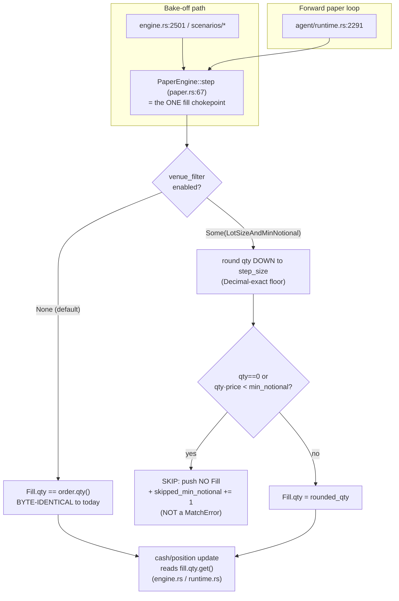

# P4 — €200 realism: min-notional + lot-size rounding as an OPT-IN exec-sim mode

Close the €200-realism gap in the paper/sim fill path (remediation plan
`spec/backlog.md` § P4). The product advertises a **€200 retail** scale
(`spec/product.md`), but the sim **fills any fractional quantity at any
notional**. Real spot venues enforce two `exchangeInfo` filters the sim ignores:

- **`LOT_SIZE`** — quantity must be a multiple of a per-symbol `stepSize`
  (e.g. `0.00001 BTC`, `1 DOGE`); the venue **floors** the order to the step.
- **`NOTIONAL` / `MIN_NOTIONAL`** — order notional (`qty · price`) must be
  ≥ a per-symbol floor (~5–10 USDT on Binance spot); below it the venue
  **rejects** the order.

At €200 with `fixed_fraction(0.1)` sizing (~€20 clips) the min-notional floor is
comfortably **cleared**, so this is **not an alpha-changing correction** — it is
a **realism / honesty gap**: (a) lot rounding shaves a few sats off every clip
(a low-price coin like DOGE rounds to whole units — coarse relative to €20), and
(b) a small-order **reject path** is entirely unmodeled, so the sim would happily
"fill" a €3 order a real venue bounces.

**Pattern (binding):** the `SlippageModel::VolScaledSpread` opt-in precedent
(ADR-0081, P1-6) — a **new opt-in-forever exec-sim mode**, **default
byte-unchanged** → anchors **119/119 by construction**, plus the CLAUDE.md
non-negotiable **day-1 baseline-equity-divergence e2e** (this IS a
sizing-modifier — the overlay/modifier gate APPLIES).

## Design

Full design + alternatives: **[ADR-0087](../../architecture/adr/0087-lot-realism-opt-in-exec-sim.md)**
(D1–D6). This section is the buildable summary; the ADR is the source of truth.

### Seam (grounded in code)

The rounding + reject rule lives **inside `PaperEngine::step`**
(`crates/backtest/src/paper.rs:67`) — the **both-paths chokepoint**. Every
order → `Fill` for **both**:

- the **bake-off** (`crates/backtest/src/engine.rs:2501`, and every
  `crates/backtest/src/scenarios/*` runner), and
- the **forward paper loop** (`crates/agent/src/runtime.rs:2291`)

funnels through the **same** `engine.step(&bar, orders).await`.



**Why `step` and not the sizer** (the two lessons that pick it):

- **F5b parity** — the bake-off and the forward loop are *separate* call sites,
  but **both** call `engine.step`. Placing the rule in `step` honors it on BOTH
  from one edit. The sizer `FixedFractionSizer::compute_qty`
  (`crates/risk/src/sizing.rs:51`) is **bypassed by the Sell/close leg** on both
  paths (they build the close order straight from `position.base_qty`), so it is
  **not** a both-legs chokepoint.
- **v3-vol-overlay-noop** (compute-but-never-apply is the failure mode) — `step`
  is the sole place the `qty` in `Fill` is finalized, and **every** downstream
  cash/position update reads `fill.qty.get()` (`engine.rs:2504–2521`,
  `runtime.rs:2298–2333` — both verified). Rewriting `fill.qty` provably changes
  deployed capital; there is no second copy to fall out of sync.

A skipped order (no `Fill` pushed) is absorbed by **both** callers unchanged —
they already loop `for fill in &fills { … }` under `if let Ok(fills) =
engine.step(…)`; a shorter `fills` vec is a valid, handled state. **A
min-notional skip is NOT a `MatchError`** (that enum is reserved for genuine fill
failures — `FillError`/`NoLiquidity`).

### Config surface (opt-in, mirrors ADR-0081)

Additive field on `LatencySlippageSimConfig` (`crates/backtest/src/cli_types.rs:58`
— the exec-sim config that already houses `slippage_model`):

```rust
/// Opt-in venue-filter realism (ADR-0087). `None` (serde default) =
/// no rounding, no reject — byte-identical to the pre-ADR-0087 fill path.
#[serde(default)]
pub venue_filter: Option<VenueFilterMode>,

#[derive(Debug, Clone, PartialEq, Eq, Serialize, Deserialize)]
#[serde(tag = "kind", rename_all = "snake_case")]
pub enum VenueFilterMode { LotSizeAndMinNotional }
```

`PaperEngine` carries an `Option<VenueFilterTable>` handle beside `MatchConfig`
(NOT on the anchored serde surface). **`MatchConfig::default()` and
`LatencySlippageSimConfig::default()` are UNCHANGED**; `venue_filter` defaults to
`None`. **Proof obligation (byte identity):** a default run ≡ a pre-change run,
asserted by `venue_filter_default_is_none` + `paper_step_none_is_byte_identical`
(D6).

### Static filter table (checked-in; stated staleness)

A **checked-in static table** — NOT a live `exchangeInfo` fetch (no live calls;
determinism). New module `crates/cost/src/venue_filter.rs` (the `cost` crate is
the exec-sim-friction home, already owns `slippage.rs`; it does **not** depend on
`data`, so it carries a tiny local `VenueFilter { step_size, min_notional }`
record **mirroring the existing `data::SymbolInfo` shape** at
`crates/data/src/source.rs:8` — no new dep edge):

- `pub fn venue_filter_for(symbol: &Symbol) -> Option<VenueFilter>` covers the
  **10 Binance USDT pairs** (the advisor corpus) **+ Coinbase `BTC-USD`** (P2).
  Unknown symbols → `None` → **no-op for that symbol** (never a panic, never a
  silent wrong number).
- Values are a dated `SNAPSHOT_DATE` capture of what the live fetch returns.
  **Staleness is a stated limit** (module header + this file): venues revise
  `stepSize`/`minNotional` occasionally; a refresh is a one-line table edit under
  ADR-0087, **no anchor re-emission**. Not a look-ahead concern (a filter is a
  static venue rule, not a time series) → ADR-0086's `PitSeries` does not apply.

**Decimal discipline (ADR-0003):** `step_size`/`min_notional` are `Decimal`
literals; rounding is `(qty / step).floor() * step` **entirely in `Decimal`** —
never `f64`. **Round-DOWN only** (`floor`, never `round`/`ceil`) — the user must
never over-spend their budget.

### Reject / skip audit semantics (two homes)

The advisor bake-off + forward loop keep cash/equity **in-memory**
(`state`/`cash` in `engine.rs`/`runtime.rs`) — they do **NOT** write to the
`audit::Ledger` (the ledger is a *live-agent* concern; live trading is out of
scope). So the skip record has two homes, by path:

1. **Primary (advisor sim) — in-memory tally surfaced in the result.**
   `PaperEngine` accumulates `skipped_min_notional: u64`, exposed via
   `sim_filter_stats()`; the runner folds it into the run summary (and, where a
   report is emitted, a **report-body annex line** — but the advisor bake-off is
   `write_report=false`, so **no anchored body moves**; D6). Determinism-safe,
   always available — analogous to the existing `SimulatedExecMetrics` summary.
2. **Live-agent path (wiring RESERVED, not shipped).** When/if run under the live
   agent (which *does* own a `Ledger`), the skip is recorded via the existing
   `strategy_events` table using `StrategyEventWrite`
   (`crates/audit/src/journal.rs:1623`) with `kind = "min_notional_skip"` — the
   **same** pattern as the shipped `rebalance_rejected` event (`journal.rs:1722`),
   reusing the 6-digit-fractional-second timestamp discipline (ADR-0004). **No**
   new `AuditEvent` variant. Built only when a live-agent caller exists.

**€200 golden scenario (documented):** at €200 · `fixed_fraction(0.1)` ·
BTC/ETH majors, `notional ≈ €20 ≫ min_notional (~5–10 USDT)` → **zero rejects**;
BTC lot rounding (`step 0.00001`) shaves **< 1 bp** off each clip. The mode is
**honest-but-quiet** at the advertised scale — it *proves* the golden path clears
the filters, and *bites* only on a coarse-lot coin at a small budget.

### Day-1 baseline-equity-divergence e2e (CLAUDE.md non-negotiable)

This is a **sizing-modifier** → the overlay/modifier gate **APPLIES**. New file
`crates/backtest/tests/lot_realism_divergence_end_to_end.rs`, modelled on
`crates/strategy/tests/vol_targeting_overlay_end_to_end.rs`:

- **Corpus/config where rounding provably bites:** a **low-price coin —
  `DOGEUSDT`** (price ~€0.10–0.40, `step_size = 1` whole DOGE) at a **small
  budget (€50–200)** with `fixed_fraction(0.1)` → each clip is ~€5–20 = tens of
  DOGE, and flooring to whole DOGE discards a **material fraction of the last
  unit** on every trade. Over a multi-trade run the discarded fraction + any
  sub-min-notional skips compound into a terminal-equity gap **≥ 1 bp**.
- **Assertions:** run the SAME strategy + bars twice — `venue_filter = None`
  (baseline) vs `Some(LotSizeAndMinNotional)` — assert
  `|equity_filtered − equity_baseline| / equity_baseline ≥ 1e-4`, AND direction
  (`filtered ≤ baseline` — round-down + rejects can only reduce or hold deployed
  capital, never increase it).
- **Negative control:** a high-price major at €200 asserts divergence ≈ 0 (the
  mode is correctly inert where filters don't bite). This is the guard against
  the noop failure mode (a mode that rounds but never applies shows **zero**
  divergence and fails on day 1).

### Anchor safety (119/119 by construction — D6 proof obligation)

The mode is **never reachable from any anchored CLI path**:

- The anchored CLI (`param_robustness_sweep` et al.) constructs
  `MatchConfig` / `LatencySlippageSimConfig` via `default()` → `venue_filter =
  None` → the rounding/reject branch is **not taken** → `fill.qty` byte-identical.
- The advisor bake-off runs `write_report=false` → **no anchor SHA produced**.

**Enforcement (never delete):** `venue_filter_default_is_none`,
`paper_step_none_is_byte_identical`, and `bash scripts/verify_anchors.sh` →
**119/119 before AND after**. FROZEN gate `bakeoff/{robustness,rank}.rs`
byte-untouched. PAPER/SIM ONLY.

## Scope guards

- **No live exchange calls anywhere** — the filter table is a static checked-in
  snapshot.
- **Default path byte-unchanged** — `venue_filter: None` is the serde default and
  the `Default` impl; anchors hold by construction.
- **No `spec/**/reports/` edits**, no `ci.yml.deferred` touch.
- **FROZEN gate** (`bakeoff/{robustness,rank}.rs`) byte-untouched.

## For the developer to build

See `tasks.md` for the ordered checklist. Handoff envelope + risks are in the
architect's handoff.

## For the tester to verify

- `cargo test -p cost --lib venue_filter` (round-down Decimal-exact; unknown-symbol
  no-op; min-notional threshold).
- `cargo test -p backtest --test lot_realism_divergence_end_to_end` (≥1 bp
  divergence on DOGE small-budget + direction + the €200-major negative control).
- `cargo test -p backtest --lib paper` (incl. `venue_filter_default_is_none` +
  `paper_step_none_is_byte_identical`).
- `bash scripts/verify_anchors.sh` → **119/119** (before AND after).
- `python3 scripts/spec_lint.py` → PASS(0); `python3 scripts/adr_registry_check.py
  --pre-commit` → exit 0.
- `cargo clippy -p cost -p backtest --tests -- -D warnings`; `cargo fmt --check`.
- FROZEN-gate diff-empty: `git status --porcelain` shows no
  `bakeoff/{robustness,rank}.rs` / `spec/*/reports/` / `ci.yml.deferred` changes.

## Implementation

Built per `tasks.md` T1–T8, developer 2026-07-10. Full task-by-task file:line +
test-command + output citations live in `tasks.md`; this section is the summary.

**T1–T3 (table + helpers, `crates/cost/src/venue_filter.rs`, new file).**
`VenueFilter { step_size, min_notional }` (mirrors `data::SymbolInfo`'s shape, no
new `cost → data` dep), `round_down_to_step` (Decimal-exact floor, `step <= 0`
guarded), `VenueFilter::admit` (round then check `>= min_notional`),
`venue_filter_for` (10 Binance USDT pairs + Coinbase `BTC-USD`, `SNAPSHOT_DATE =
"2026-07-10"`, unknown symbol → `None`). 15 unit tests, all green
(`cargo test -p cost --lib venue_filter`).

**T4 (config surface, `crates/backtest/src/cli_types.rs`).** `VenueFilterMode`
enum (`LotSizeAndMinNotional`) + `#[serde(default)] venue_filter:
Option<VenueFilterMode>` on `LatencySlippageSimConfig`; `Default`/`is_noop`
extended; the custom `Deserialize` visitor updated (a hand-rolled impl — the
`#[serde(default)]` attribute alone is inert there). **Ripple**: every one of the
33 existing `LatencySlippageSimConfig { .. }` literal-construction sites across
`cli_types.rs`, `main.rs`, `scenarios/sim.rs`, and
`crates/strategy/tests/latency_slippage_sim_e2e.rs` needed an explicit
`venue_filter: None,` (none used `..Default::default()` spread) — a purely
mechanical, behavior-preserving addition, verified by a full workspace build.

**T5 (the seam, `crates/backtest/src/paper.rs`).** `PaperEngine` gained
`venue_filter: Option<VenueFilterMode>` + `skipped_min_notional: u64` fields, a
`with_venue_filter_mode` builder (all existing constructors default to `None`,
unchanged), and `sim_filter_stats()`. Inside `step`, `qty` is now selected via a
3-way branch (mode off → `order.qty()` unchanged; mode on + known symbol →
round-then-admit-or-skip; mode on + unknown symbol → `order.qty()` unchanged,
no-op) computed **before** the `Fill` is built — the sole place `qty` is
finalized. A sub-min-notional order is dropped via `continue` (no `Fill` pushed,
tally incremented) and is explicitly **not** a `MatchError`.

**T6 (the day-1 divergence e2e, `crates/backtest/tests/lot_realism_divergence_end_to_end.rs`,
new file).** Built BEFORE T5 per the noop-trap discipline (CLAUDE.md
non-negotiable, v3-vol-overlay-noop precedent): with only the T5 scaffold (fields
+ builder, `step` not yet consulting them) landed, the test **FAILED** exactly as
required — `eq_baseline == eq_filtered` to the last decimal (proof the mode was
inert). After the real `step` wiring landed, the same test **PASSED**: DOGEUSDT
at a €100 budget diverges 57 bp (5.7× the 1bp gate) via genuine floor-rounding
(zero rejects — the reject path is covered separately by a `paper.rs` unit test);
direction holds (`eq_filtered <= eq_baseline`); the BTCUSDT-€200 negative control
diverges only 0.21 bp (27× smaller than DOGE). Both captured outputs are
verbatim in the test file's own module doc-comment and in `tasks.md`.
**Deviation**: the ADR/tasks.md €50 example was replaced with €100 for the
*primary* divergence test — at €50 every DOGE clip landed just under
min-notional and 100% of orders were rejected outright (still passes the
assertions, but exercises only the reject path, not the "shaves a few sats"
floor-rounding mechanism the ADR names as the primary honesty gap). €50 exact
outright-reject behavior remains demonstrated by a dedicated `paper.rs` unit
test (`venue_filter_rejects_sub_min_notional_order_no_fill_no_error`).

**T7 (anchor-safety enforcement, `paper.rs`, NEVER DELETE).**
`venue_filter_default_is_none` + `paper_step_none_is_byte_identical` (the latter
uses DOGEUSDT — a table symbol — with a fractional qty, proving the default path
never rounds even when the symbol *is* in the table).

**T8 (reserved live-agent audit wiring, spec-only).** A doc-comment stub at the
`step` seam's reject branch cites `crates/audit/src/journal.rs:1623`
(`strategy_event`) and the `rebalance_rejected` precedent at `:1722`; no
`crates/audit` change, no new `AuditEvent` variant. **Scope note**: the fuller
tasks.md wording ("surface `skipped_min_notional` into the advisor run summary")
was interpreted narrowly per the developer brief's explicit crate-scope guard —
`sim_filter_stats()` (T5) is the surface; threading it further into
`RunReport`/`CandidateResult` or the forward-loop summary was out of scope (no
existing call site enables `venue_filter` yet). Flagged for architect/tester
review in `tasks.md`.

**Gate results (verbatim in `tasks.md`).** `cargo test -p cost --lib` 54 passed;
`cargo test -p backtest --lib --features realdata,yahoo,candle` 249 passed / 11
pre-existing-ignored; the T6 e2e 2 passed; `cargo test -p strategy --test
vol_targeting_overlay_end_to_end` 1 passed (regression — note the corrected
package name, see `tasks.md` § Notes); `cargo clippy -p cost -p backtest --tests
--features backtest/realdata,backtest/yahoo -- -D warnings` clean; `cargo fmt
--check` clean; `bash scripts/verify_anchors.sh` 119/119 before AND after;
`python3 scripts/spec_lint.py` PASS(0); `python3 scripts/adr_registry_check.py
--pre-commit` exit 0; `bash scripts/check_no_raw_asof_join.sh` PASS. FROZEN gate
(`bakeoff/{robustness,rank,scorecard}.rs`) byte-untouched.

## Changelog

- 2026-07-10 (developer): T1–T8 built per tasks.md; the T6 day-1
  baseline-equity-divergence e2e FAIL-before/PASS-after cycle completed and
  documented; anchors 119/119 before and after; status → `dev-done`. Handoff →
  tester.
